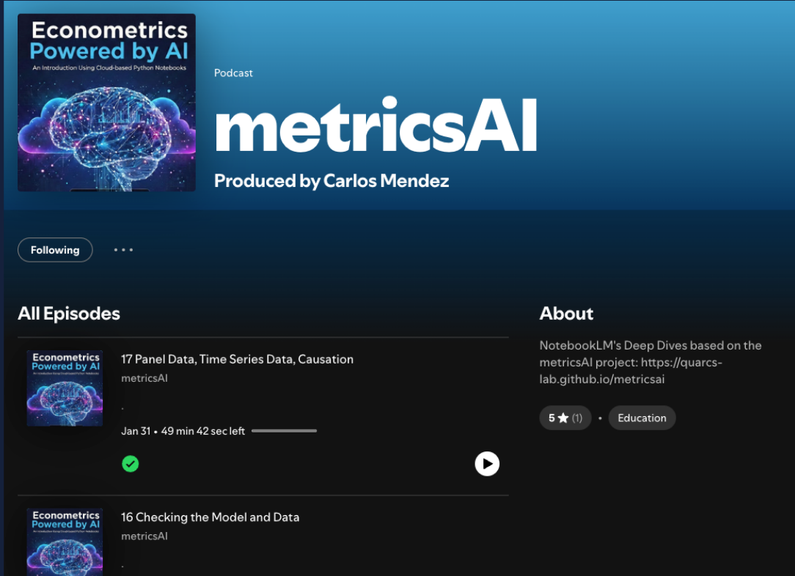
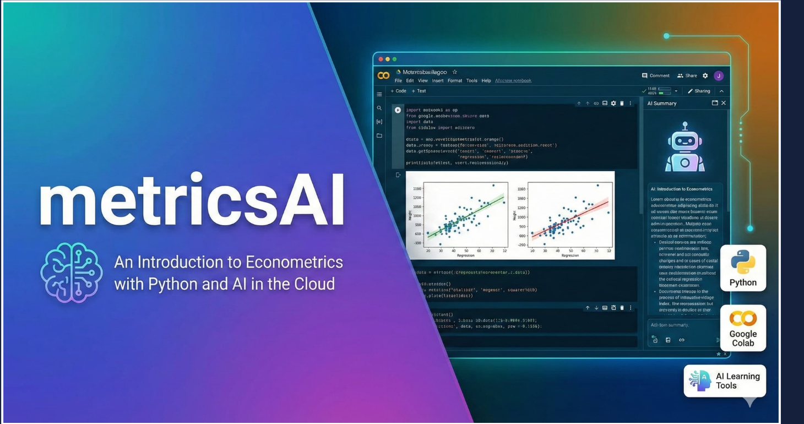
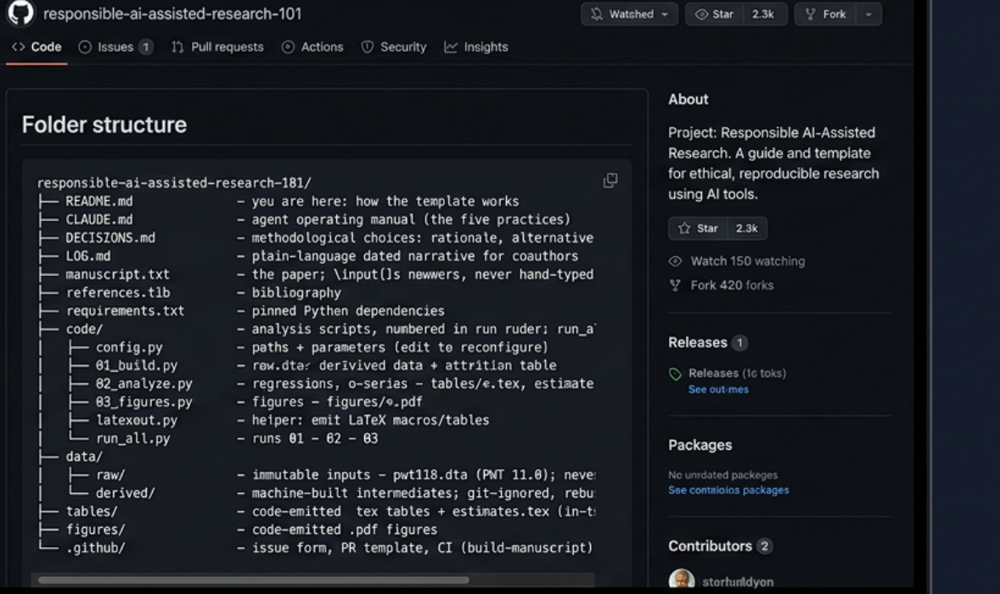
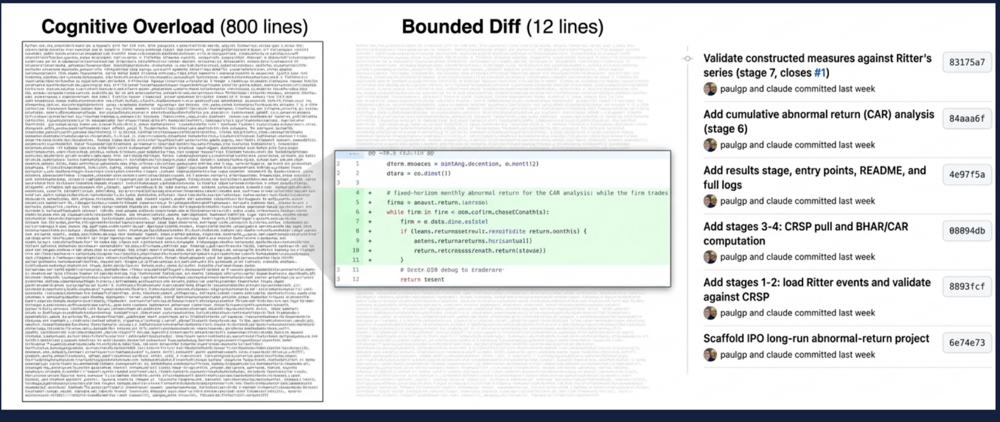

# The New Trade-off in the Age of AI {.divider background-color="#d97757"}

[The problem]{.act}

## Producing content has never been cheaper

AI writes the essay, the code, and the chart in seconds — for almost nothing.

. . .

*But can we trust what it produced?*

::: {.notes}
Open on the shift everyone already feels: production is nearly free. The provocation — cheap to make is not the same as safe to use. That gap is the whole talk.
:::

## Cheap to produce, expensive to verify — the new danger zone

Cost of verification

highlow

<b>NEW DANGER ZONE</b><small>cheap to make, expensive to confirm</small>

<b>Costly all around</b><small>slow to make and hard to check</small>

<b>Trivial</b><small>easy to make, easy to check</small>

<b>OLD WORLD</b><small>manual effort embedded the checking</small>

lowhigh

Cost of production

[AI slashes production cost — but not verification cost — so work migrates into the danger zone.]{.comment}

::: {.notes}
Adapted from Clifford Russel. Old world (bottom-right): making something by hand was costly, and that manual effort embedded the checking. AI moves us to the top-left: production collapses toward zero, but verification cost stays high — now it is the binding constraint. The rest of the talk is about tools that pull verification back down.
:::

## The real risk is black-box work — in learning and in research

When we can't check the output, we're trusting a black box.

::: {.incremental}
- In **learning** — plausible answers that quietly mislead.
- In **research** — results no reviewer, including you, can audit.
:::

[The fix isn't to avoid AI. It's to design a workflow that separates *production* from *verification*.]{.comment}

::: {.notes}
Name the stakes for both halves of the talk. Black-box learning erodes understanding; black-box research erodes credibility. Bridge to the response: intentional workflow design.
:::

## One principle, three tools, one workflow

::: {.incremental}
- **One principle** — separate what AI *produces* from what you *verify*.
- **Three tools** — NotebookLM (learn), Google Colab (explore), GitHub (research).
- **One workflow** — plan, produce with AI, verify at every step.
:::

::: {.notes}
The roadmap. Each tool maps to a stage of the research life cycle and to a place where verification has to live. Keep it a promise, not a summary.
:::

# NotebookLM — Learn {.divider background-color="#141413"}

[Tool 1]{.act}

## NotebookLM grounds AI in *your* sources — a protected study environment

You give it your notes, PDFs, slides, and data. It answers **only from those sources**.

[Grounded in your materials → far less hallucination, and every answer is traceable.]{.comment}

::: {.notes}
The key idea for a general audience: unlike an open chatbot, NotebookLM is walled to the documents you upload. That protected environment is exactly what makes it safe for study — answers stay tied to trusted sources.
:::

## One set of notes → podcasts, videos, summaries, quizzes, and a grounded chatbot

<b>Your sources</b><small>notes · PDFs · slides · data</small>

→

🎙 Podcast
🎬 Video overview
📝 Summary
❓ Quiz
💬 Grounded chat

[One upload becomes many ways to learn — the AI podcasts and AI tutors behind metricsAI work exactly this way.]{.comment}

::: {.notes}
NotebookLM is the content-transformation layer: a single source set fans out into audio, video, text, self-test, and conversation.
:::

## In practice: NotebookLM "Deep Dives" you can listen to

::: {.notes}
Concrete example: the metricsAI podcast series is NotebookLM "Deep Dives" — two AI voices discussing each chapter. Students listen on their commute; the source is always the chapter, so it stays grounded.
:::

# Google Colab — Explore {.divider background-color="#141413"}

[Tool 2]{.act}

## Colab: a data-science lab in the browser, with AI inside

::: {.incremental}
- **zero installation** — nothing to set up
- **free** CPUs and GPUs
- **AI inside** — it writes code and explains errors
:::

[Start on your laptop at a café; the lab is the same everywhere.]{.comment}

::: {.notes}
Colab removes the single biggest barrier for beginners — installation. For a general audience, stress: it is just a browser tab, but it is a real computational notebook with AI help built in.
:::

## metricsAI: a full econometrics course in Colab notebooks

::: {.notes}
This is what "a lab in the browser, with AI inside" looks like: a Colab notebook running the chapter's code, with plots inline and an AI Summary/assistant panel. No install — just open the link.
:::

## With the right credentials, Colab reaches planetary-scale data

Connect **Google Earth Engine** and query satellite data straight from a notebook:

::: {.incremental}
- **pollution** — aerosols, air quality
- **energy** — nighttime lights
- **social** — population and development indicators
:::

[Big geospatial data, no supercomputer — just a notebook and credentials.]{.comment}

::: {.notes}
This is the big-data turn the workshop emphasizes. Earth Engine hosts petabytes of satellite imagery; from Colab you query only what you need. Pollution, energy, and social indicators all become variables you can analyze.
:::

## Case study: can satellites see poverty in Bolivia?

One question ties the pipeline together:

*Can satellite data predict local economic development across Bolivia's 339 municipalities?*

::: {.notes}
The book's flagship case. It makes the abstract pipeline concrete: query satellite indicators, then use statistics, econometrics, and machine learning to answer a real development question.
:::

## Nighttime lights + satellite embeddings → a development index

<b>Nighttime lights</b><small>economic-activity proxy</small>

<b>Satellite embeddings</b><small>64-dim · physical infrastructure</small>

→

<b>Development index</b><small>IMDS · 0–100</small>

[Lights capture activity at night; embeddings capture the built environment by day.]{.comment}

::: {.notes}
DS4Bolivia: 339 municipalities. Nighttime lights (log NTL per capita) proxy economic activity; 64-dimensional deep-learning embeddings of daytime imagery (Sentinel-2/Landsat) capture buildings, roads, and vegetation. Together they predict the Municipal Sustainable Development Index.
:::

## From indicators to inference: OLS first, then machine learning

::: {.incremental}
- **OLS baseline** — development ~ nighttime lights → about 60% of the variation explained
- **Machine learning** — Random Forest, XGBoost → capture nonlinearities the line misses
:::

[Statistics → econometrics → machine learning, on data we gathered ourselves.]{.comment}

::: {.notes}
The analytical arc: start simple and interpretable (OLS, R-squared about 0.6), then let ML models exploit the richer signal. Once the indicators are in the notebook, the full toolkit is available.
:::

## Exploration in Colab becomes a research project — managed in GitHub

The notebook answered the question. Now make the work **reproducible and reviewable**.

[A promising exploration → a project anyone can re-run and audit → GitHub.]{.comment}

::: {.notes}
Bridge to Tool 3. A Colab notebook is where discovery happens; GitHub is where it becomes credible research. This is the natural hand-off.
:::

# GitHub — Research {.divider background-color="#141413"}

[Tool 3]{.act}

## GitHub makes AI-assisted research transparent and auditable

Collaborate with AI agents the way you would with a careful coauthor — in the open.

[Claude Code + GitHub + Overleaf: code, results, and manuscript, all version-controlled.]{.comment}

::: {.notes}
The research counterpart to skills-and-planning. When an AI agent proposes changes through GitHub, every decision is recorded and reviewable.
:::

## Everything lives in one repository

<a href="https://github.com/quarcs-lab/responsible-ai-assisted-research-101" target="_blank" rel="noopener" data-preview-link="false">github.com/quarcs-lab/responsible-ai-assisted-research-101</a>

::: {.notes}
A concrete template (github.com/quarcs-lab/responsible-ai-assisted-research-101): numbered analysis scripts, immutable raw data, code-emitted tables/figures, a DECISIONS.md and LOG.md, and a CLAUDE.md operating manual for the agent. One place, fully reproducible.
:::

## Change the unit of verification: review a story step-by-step

Not a monolithic block of text — a sequence of small, legible changes.

::: {.incremental}
- each **commit** is one decision
- each **diff** shows exactly what changed
- the **history** is the audit trail
:::

::: {.notes}
Goldsmith-Pinkham's framing. Reviewing a 40-page output is hopeless; reviewing 40 small commits is tractable. Version control changes what you verify — from a result to the chain of steps that produced it.
:::

## 800 lines to trust, or 12 to check?

::: {.notes}
The unit of verification, made visual: a wall of 800 lines is cognitive overload; a 12-line bounded diff plus a readable commit history (validate measures, add CAR analysis, add stages…) is something a human can actually check, one decision at a time.
:::

## A work environment built for verification — the antidote to black-box research

GitHub manages the discussion of the **code**, the **results**, and the **story** of the manuscript.

[Every claim traces back to the commit that produced it.]{.comment}

::: {.notes}
Tie back to the opening trade-off. Black-box research is unverifiable by construction; a version-controlled environment makes verification the default. And in the age of AI the barrier is low — your AI agent can teach you Git as you go.
:::

## But doesn't AI just do the work for me?

[Objection.]{.objection} If the AI produces everything, what is left for the researcher?

. . .

[Response.]{.rebuttal} AI **produces**; you **verify and decide**. The judgment — what question, which check, whether to trust the result — stays human. The tools make that judgment *easier to exercise*, not optional.

::: {.notes}
The ethos slide. Steelman the worry honestly, then answer: the division of labor is production (AI) versus verification and judgment (human). That is the whole thesis in one exchange.
:::

# One Integrated Workflow {.divider background-color="#00d4c8"}

[Putting it together]{.act}

## Learn → Explore → Research: NotebookLM, Colab, GitHub in one loop

<b>Learn</b><small>NotebookLM</small>

→

<b>Explore</b><small>Google Colab</small>

→

<b>Research</b><small>GitHub</small>

↻ iterate — and verify at every step

::: {.notes}
The payoff picture. Understand a topic with NotebookLM, explore and analyze data in Colab, then formalize it as reproducible research in GitHub — looping back as you learn more. Verification runs through all three.
:::

## Three takeaways

::: {.incremental}
1. **Understand the trade-off** — AI cuts production cost, so verification becomes the job.
2. **AI assists both learning and research** — but only with verification built in.
3. **Integrate the tools** — NotebookLM, Colab, and GitHub together serve *both* production and verification.
:::

::: {.notes}
Keep it to three; each maps to one act of the talk.
:::

# In the age of AI, the scarce skill is not production — it's verification. {.divider background-color="#141413"}

::: {.notes}
The single sentence to remember. It resolves the Act-I hook: production got cheap, so the value — and the discipline — moves to verification and judgment. That is what these three tools are for.
:::
