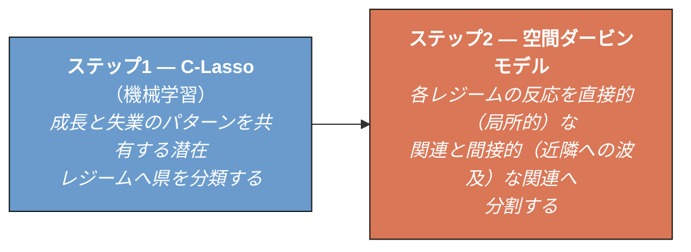

## 問いの所在

オークンの法則は、マクロ経済学において最も信頼できる規則性の一つです——産出が成長すれば、失業は減少します。ところが、インドネシアを単一の経済として推定すると、この関係は成り立ちません。その理由は集計にあります。広大で多様な群島は一つの労働市場ではなく、全国平均は逆方向に動く地域同士を静かに打ち消してしまいます。したがって、問うべきはインドネシアでオークンの法則が成り立つ*かどうか*ではなく、*どこで*成り立つのか、ということなのです。

---

## 二段階のデータ駆動型アプローチ

著者らは、地理的グループ（たとえば「西部」対「東部」）をあらかじめ課すのではなく、成長と失業の動態が類似する県をデータに分類させ、その動態が空間をどのように波及するかをモデル化します。この枠組みは記述的なものであり——因果効果ではなく、関連性を描き出します。

---

## 四つの潜在レジーム

分類器は、行政区分や自然地理を横断する**四つの異なるレジーム**を明らかにします——同じグループに属する県が必ずしも隣接しているとは限りません。それぞれが、成長が労働市場と出会うあり方について異なる物語を語っています。

| レジーム | 構造的プロファイル | 例 | オークンの挙動 |
| :--- | :--- | :--- | :--- |
| **グループ1** | 労働吸収型の中心地——大都市、工業地帯、小農プランテーション | ブカシ、北ジャカルタ、マカッサル、メダン | **強い、教科書どおり。** 成長が、局所的にも近隣においても失業の減少と連動する。 |
| **グループ2** | 資本集約型の拠点——資源地帯、機械化された企業農業 | バリクパパン、中央ジャカルタ、ジャワ農村部の一部 | **逆転。** より速い成長が、計測される*より高い*顕在的失業と並行して進む。 |
| **グループ3** | 移行期の中心地——農業からサービス業へ移行しつつある中核都市 | チラチャップ、インドラマユ、マラン | **弱い。** ベースラインの関連はわずかで、調整は解雇ではなく労働時間を通じて進む。 |
| **グループ4** | 周辺的な市場——薄く孤立した農村の島嶼経済 | パプアの遠隔地、東ヌサ・トゥンガラ | **無視できる。** 蔓延するインフォーマル性が、顕在的失業との結びつきを断ち切る。 |

> **なぜグループ2では、成長が失業の*上昇*と連動するのでしょうか。**
> 資本集約型の産業や企業農業が支配的な地域では、成長はしばしば伝統的な農業労働を置き換える機械化を通じてもたらされます。職を失った労働者がインフォーマルな仕事や家族労働を離れ、フォーマルな賃金雇用を探し始めると、彼らは「顕在的失業者」として統計に計上されます。計測される失業は、探索の摩擦やスキルのミスマッチを通じて産出とともに上昇するのであって——成長そのものが雇用を破壊するからではありません。

---

## 州レベルでの頑健性

このパターンが県レベルのノイズの産物ではないことを確認するため、著者らはこの枠組みを34の州について再実行します。それは類似した構造を再現し、今度は三つのレジームとして現れます。

* **多角化された需要豊富な州**——急峻なオークン係数 $-0.262$ を持つ、工業と消費の拠点。
* **農業コモディティの中核地**——成長が局所的には「雇用なき」ものだが、近隣への波及を生み出す大規模企業プランテーション。
* **コモディティ・フロンティアの飛び地**——鉱業や重工業に結びついた薄い労働市場で、ほぼ平坦な係数 $-0.033$ を持つ。

---

## 空間的波及効果が重要である

労働市場の調整は県境で止まりません。失業の変化は近隣県の間で相関しており（$\rho = 0.135$）、ある場所で生じた成長ショックは隣へと届きます。

局所的な反応を波及効果から切り分けることが、これを可視化します。グループ1では、成長は自県における失業の低下（直接的関連 $-0.112$）*とともに*、隣県における失業の低下（間接的波及 $-0.077$）とも結びついています。波及効果を無視するモデルは、地域的な勢いが近隣に及ぼす影響のほぼ全体を見落としてしまうでしょう。

---

## 主要な知見

* **集計推定値は誤導する。** 単一の全国オークン係数は、成長と失業の関連が逆方向を指すレジーム同士を平均化してしまう。
* **多角化された拠点が原動力である。** 大都市や小農プランテーションの県（グループ1）では、産出の増加が、自県でも近隣でも最も確実に雇用創出へとつながる。
* **構造変化が吸収力を再形成する。** 家族農業から機械化された企業農業へ移行すると、地域経済が産出1単位あたりに吸収する労働者数が低下する。
* **インフォーマル性が遊休を覆い隠す。** 周辺地域（グループ4）では、人々が不完全就業やインフォーマルな仕事に頼るため、顕在的失業の数字が困窮を過小評価する。

---

## 残された問い

1. 資本集約型の成長（グループ2）が、職を失った農業労働者を顕在的失業へと押しやり続けるならば、地方政府は彼らを現代的なサービス業の職へ移行させる訓練の道筋をどのように構築できるでしょうか。
2. 労働吸収型の地域では総関連のかなりの部分が波及効果を通じて生じることを踏まえると、計画は孤立した県単位の目標から、調整された複数県の経済回廊へと転換すべきでしょうか。

---

  <audio id="podAudio" preload="none" src="https://files.catbox.moe/i3g2l3.m4a"></audio>

  

    

      <svg viewBox="0 0 24 24"><path d="M12 1a5 5 0 0 0-5 5v4a5 5 0 0 0 10 0V6a5 5 0 0 0-5-5zm0 16a7 7 0 0 1-7-7H3a9 9 0 0 0 8 8.94V22h2v-3.06A9 9 0 0 0 21 10h-2a7 7 0 0 1-7 7z"/></svg>
    

    

      <h4>AI Podcast: Okun's Law and Spatial Regimes in Indonesia</h4>
      Click play to load
    

    <button class="podcast-close-btn" onclick="podClose()" title="Close player">
      <svg viewBox="0 0 24 24"><path d="M19 6.41L17.59 5 12 10.59 6.41 5 5 6.41 10.59 12 5 17.59 6.41 19 12 13.41 17.59 19 19 17.59 13.41 12z"/></svg>
    </button>
  

  

    

      0:00
      0:00
    

    

      

      

    

  

  

    

      <button class="podcast-btn podcast-btn-skip" onclick="podSkip(-15)" title="Back 15s">
        <svg width="26" height="26" viewBox="0 0 24 24"><path d="M12 5V1L7 6l5 5V7c3.31 0 6 2.69 6 6s-2.69 6-6 6-6-2.69-6-6H4c0 4.42 3.58 8 8 8s8-3.58 8-8-3.58-8-8-8z"/></svg>
        15
      </button>
      <button class="podcast-btn podcast-btn-play" id="podPlayBtn" onclick="podToggle()" title="Play">
        <svg id="podIconPlay" viewBox="0 0 24 24"><path d="M8 5v14l11-7z"/></svg>
        <svg id="podIconPause" viewBox="0 0 24 24" style="display:none"><path d="M6 19h4V5H6v14zm8-14v14h4V5h-4z"/></svg>
      </button>
      <button class="podcast-btn podcast-btn-skip" onclick="podSkip(15)" title="Forward 15s">
        <svg width="26" height="26" viewBox="0 0 24 24"><path d="M12 5V1l5 5-5 5V7c-3.31 0-6 2.69-6 6s2.69 6 6 6 6-2.69 6-6h2c0 4.42-3.58 8-8 8s-8-3.58-8-8 3.58-8 8-8z"/></svg>
        15
      </button>
    

    

      

        <svg id="podVolIcon" onclick="podMute()" viewBox="0 0 24 24"><path d="M3 9v6h4l5 5V4L7 9H3zm13.5 3A4.5 4.5 0 0 0 14 8.5v7a4.47 4.47 0 0 0 2.5-3.5zM14 3.23v2.06a6.51 6.51 0 0 1 0 13.42v2.06A8.51 8.51 0 0 0 14 3.23z"/></svg>
        <input type="range" class="podcast-volume-slider" id="podVolume" min="0" max="1" step="0.05" value="0.8">
      

      <button class="podcast-speed-btn" id="podSpeedBtn" onclick="podCycleSpeed()" title="Playback speed">1x</button>
      <a class="podcast-download-btn" href="https://files.catbox.moe/i3g2l3.m4a" target="_blank" rel="noopener" title="Stream">
        <svg viewBox="0 0 24 24"><path d="M19 9h-4V3H9v6H5l7 7 7-7zM5 18v2h14v-2H5z"/></svg>
      </a>
    

  

