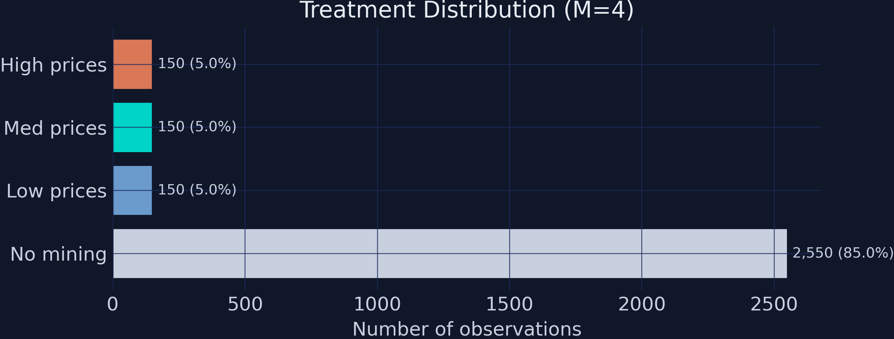
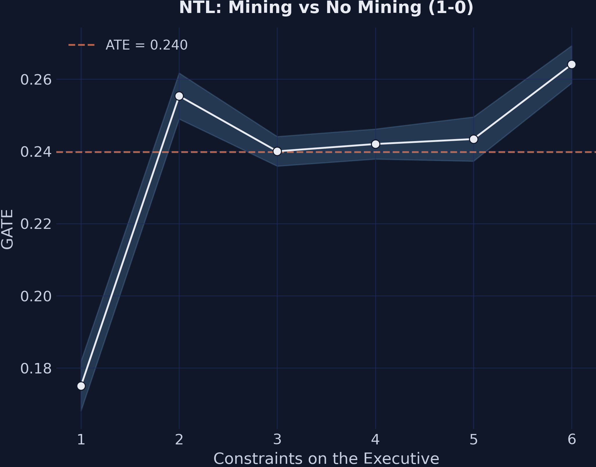
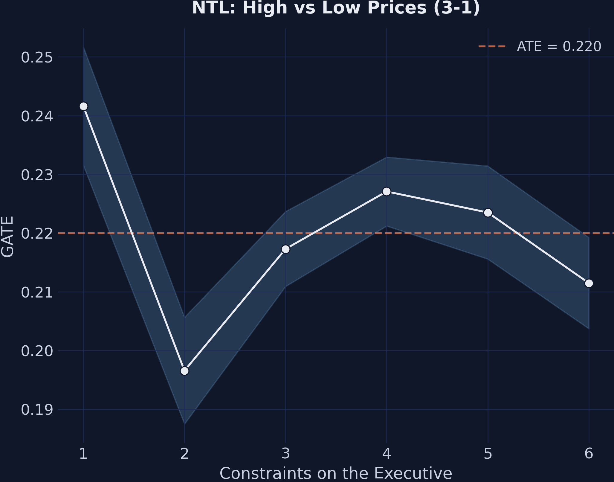
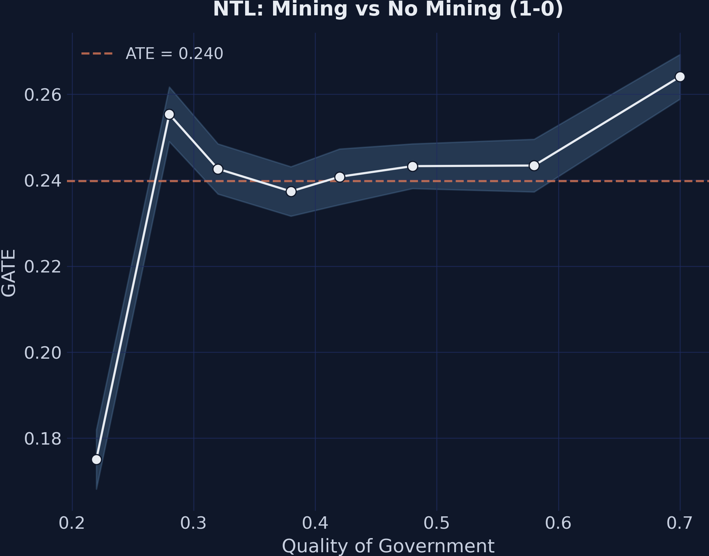
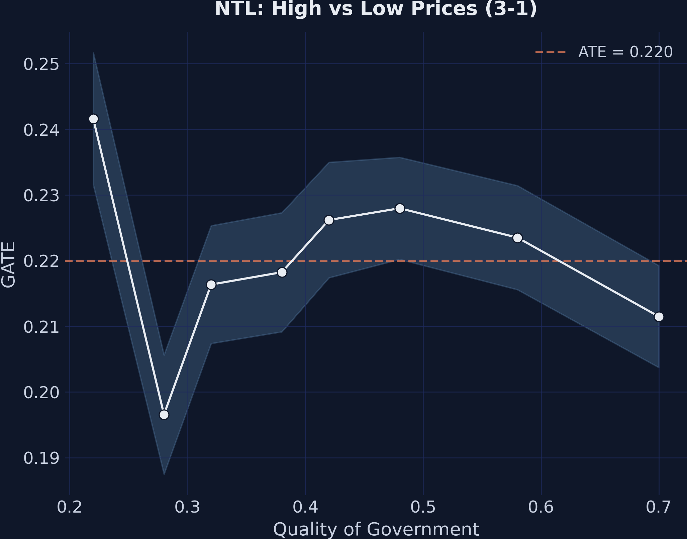
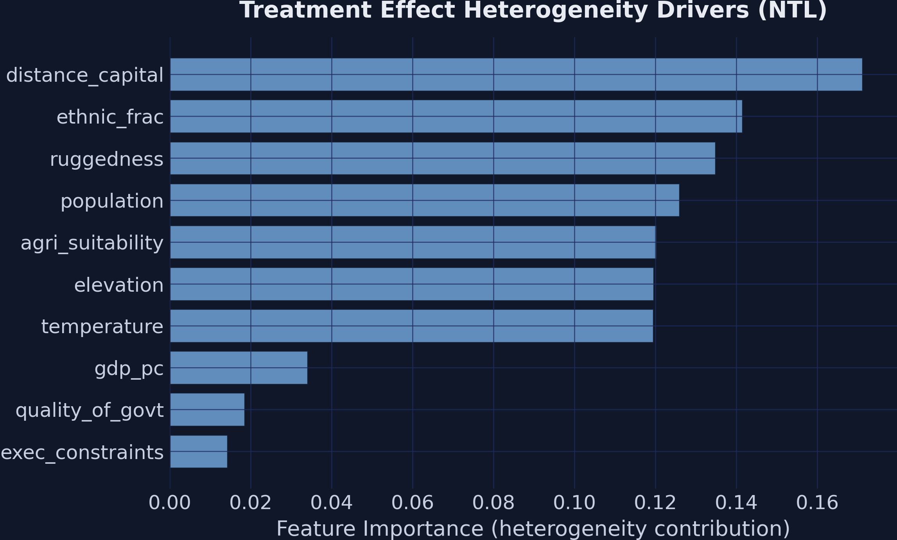
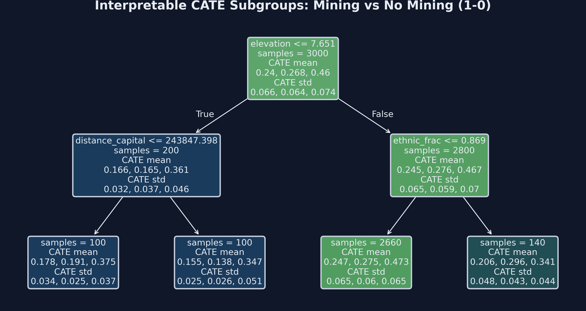

---
authors:
  - admin
categories:
  - Python
  - Tutorial
  - Causal Inference
  - Heterogeneous Treatment Effects
  - Machine Learning
  - Double Machine Learning
  - Resource Curse
draft: false
featured: false
date: "2026-05-07T00:00:00Z"
external_link: ""
image:
  caption: ""
  focal_point: Smart
  placement: 3
links:
- icon: open-data
  icon_pack: ai
  name: "[Python] Google Colab"
  url: https://colab.research.google.com/github/cmg777/starter-academic-v501/blob/master/content/post/python_EconML/notebook.ipynb
- icon: code
  icon_pack: fas
  name: "Python script"
  url: script.py
- icon: book
  icon_pack: fas
  name: "Jupyter notebook"
  url: notebook.ipynb
slides:
summary: Estimate heterogeneous causal effects of mining and mineral prices on economic development using EconML's CausalForestDML with Double Machine Learning, applied to simulated resource curse data
tags:
- python
- causal
- causal inference
- cate
- heterogeneous treatment effects
- machine learning
- econml
- double machine learning
- resource curse
title: "Causal Machine Learning and the Resource Curse with Python EconML"
url_code: ""
url_pdf: ""
url_slides: ""
url_video: ""
toc: true
diagram: true
---

## Overview

Can natural resource wealth be both a blessing and a curse? And can local institutions determine which way it goes? In this tutorial, we use **EconML's `CausalForestDML`** to estimate **heterogeneous causal effects** of mining and mineral prices on economic development --- and test whether institutional quality moderates those effects differently for mining versus price shocks.

We use **simulated data with known ground-truth parameters** so we can verify that the method recovers the correct answers. The simulated dataset mirrors the structure of Hodler, Lechner & Raschky (2023), who studied 3,800 Sub-Saharan African districts using a Modified Causal Forest. This tutorial focuses on the **DML methodology**: how the Double Machine Learning framework separates nuisance estimation from causal effect estimation to produce valid, efficient heterogeneous treatment effect estimates.

For the **economic narrative** and a companion implementation in Stata 19, see [Causal Machine Learning and the Resource Curse with Stata 19](/post/stata_cate2/).

### Learning objectives

By the end of this tutorial, you will be able to:

1. **Understand** the Double Machine Learning (DML) framework and the residualization argument that makes it work
2. **Distinguish** heterogeneity features (X) from nuisance controls (W) in `CausalForestDML`
3. **Configure** `CausalForestDML` for discrete multi-valued treatments with panel data
4. **Estimate** Average Treatment Effects (ATEs) and Group Average Treatment Effects (GATEs), and read the Bootstrap-of-Little-Bags standard errors EconML reports
5. **Interpret** GATE patterns to identify which variables moderate treatment effects
6. **Use** EconML-specific tools like `SingleTreeCateInterpreter` for data-driven subgroup discovery
7. **Evaluate** estimated effects against known ground-truth parameters and explain any remaining gap

### Key concepts at a glance

The post leans on a small vocabulary repeatedly. Pin these down before reading further --- the rest of the tutorial assumes them.

| Term | Plain definition |
|------|------------------|
| **Potential outcomes** $Y\_i(t)$ | The outcome unit $i$ *would* take under treatment value $t$. We only observe one of them per unit; the other is counterfactual. |
| **CATE** $\tau(\mathbf{x})$ | Average treatment effect for units with covariate profile $\mathbf{x}$. A function, not a single number. |
| **GATE** | CATE averaged over a pre-specified subgroup (e.g., low-institutions districts). Tests targeted moderation hypotheses. |
| **ATE** | CATE averaged over the whole sample. The headline policy number. |
| **Nuisance functions** $g\_0, m\_0$ | The conditional means $E[Y \mid X, W]$ and $E[T \mid X, W]$. We do not care about their values --- we estimate them only to *remove* confounding from the causal estimating equation. |
| **Cross-fitting** | Estimate nuisance functions on one fold of the data and apply them to a held-out fold. Prevents in-sample overfitting from biasing the second stage. |
| **Honest splitting** | A causal forest uses one subsample to *choose* tree splits and a separate subsample to *estimate* leaf values. This is what licenses valid confidence intervals. |
| **Neyman orthogonality** | A property of the DML estimating equation that makes it locally insensitive to errors in the nuisance functions. The reason DML works even when $g\_0$ and $m\_0$ are estimated noisily. |


## The DML Causal Forest

### Potential outcomes and the CATE

Causal inference rests on the **potential-outcomes** framework (Rubin, 1974; Imbens & Rubin, 2015). For each unit $i$ and each treatment value $t$, we imagine an outcome $Y\_i(t)$ that would be realized if $i$ received treatment $t$. The catch is the **fundamental problem of causal inference**: only the potential outcome corresponding to the treatment unit $i$ actually receives is observable. All other potential outcomes for that unit are counterfactual --- they live in a world we never see. Causal inference is therefore an exercise in *imputation*: using the observed outcomes of comparable units to stand in for the missing counterfactuals.

The **Conditional Average Treatment Effect** (CATE) for a unit with covariates $\mathbf{x}$ is

$$\tau(\mathbf{x}) = E\\{Y\_i(1) - Y\_i(0) \mid \mathbf{X}\_i = \mathbf{x}\\}.$$

In words: among units who look like $\mathbf{x}$, what is the average gap between the treated and untreated potential outcomes? When the function $\tau(\cdot)$ is constant across $\mathbf{x}$, every type of unit responds the same way and a single ATE summarizes everything. When $\tau(\cdot)$ bends with $\mathbf{x}$, we have **treatment effect heterogeneity** --- mining might raise nighttime lights in well-governed districts and barely move them elsewhere. Estimating that bend, not just its average, is the whole point of a causal forest.

### The partially linear model with heterogeneous effects

EconML's `CausalForestDML` works inside the **partially linear model** of Robinson (1988), extended by Chernozhukov et al. (2018) to allow heterogeneous effects:

$$Y\_i = \tau(\mathbf{X}\_i)\\, T\_i + g\_0(\mathbf{X}\_i, \mathbf{W}\_i) + \varepsilon\_i, \qquad E[\varepsilon\_i \mid \mathbf{X}\_i, \mathbf{W}\_i] = 0.$$

$$T\_i = m\_0(\mathbf{X}\_i, \mathbf{W}\_i) + v\_i, \qquad E[v\_i \mid \mathbf{X}\_i, \mathbf{W}\_i] = 0.$$

The **outcome equation** says that $Y\_i$ depends on the treatment $T\_i$ multiplied by a *unit-specific* effect $\tau(\mathbf{X}\_i)$, plus an arbitrary, possibly nonlinear function $g\_0$ of the controls, plus mean-zero noise. The "partially linear" name comes from $T$ entering linearly (multiplied by $\tau$) while $g\_0$ is allowed to be any flexible function.

The **treatment equation** writes $T\_i$ as the conditional-mean treatment $m\_0(\mathbf{X}\_i, \mathbf{W}\_i)$ plus a residual $v\_i$. For a continuous treatment, $m\_0$ is a regression. For our four-level treatment, $m\_0$ is a multi-class classifier --- specifically, a `GradientBoostingClassifier` --- and "$T - m\_0$" is shorthand for the residual of treatment around its conditional probabilities.

The functions $g\_0$ and $m\_0$ are called **nuisance functions** because we do not care about their values. We estimate them only to *remove* the part of $Y$ and $T$ that is predictable from $(\mathbf{X}, \mathbf{W})$, leaving behind the variation that identifies the causal effect.

#### Why two stages? The residualization argument

Subtract $E[Y\_i \mid \mathbf{X}, \mathbf{W}] = \tau(\mathbf{X}\_i) \\, m\_0(\mathbf{X}\_i, \mathbf{W}\_i) + g\_0(\mathbf{X}\_i, \mathbf{W}\_i)$ from the outcome equation. The $g\_0$ terms cancel, and after a line of algebra,

$$\underbrace{Y\_i - E[Y\_i \mid \mathbf{X}, \mathbf{W}]}\_{\tilde Y\_i} = \tau(\mathbf{X}\_i) \cdot \underbrace{(T\_i - m\_0(\mathbf{X}\_i, \mathbf{W}\_i))}\_{\tilde T\_i} + \varepsilon\_i.$$

So if we (a) estimate $g\_0$ and $m\_0$ in a *first stage* with any flexible learner, (b) residualize both $Y$ and $T$, and (c) regress $\tilde Y$ on $\tilde T$ with covariate-dependent slope, that slope at point $\mathbf{x}$ recovers $\tau(\mathbf{x})$. This is exactly the **Frisch--Waugh--Lovell** logic --- if you have not seen FWL before, the [tutorial on the Frisch--Waugh--Lovell theorem](/post/python_fwl/) walks through the linear case in detail.

The causal forest is the second-stage learner that estimates this covariate-dependent slope from $(\tilde T, \tilde Y, \mathbf{X})$, splitting on $\mathbf{X}$ to find regions where the local slope is approximately constant.

### Neyman orthogonality: why first-stage errors barely matter

Think of residualization like noise-canceling headphones: the first stage removes the "background noise" of confounders from both the outcome and the treatment, so the causal forest only hears the "signal" of the treatment effect.

The formal version of that intuition is **Neyman orthogonality**. The DML estimating equation $\psi(W; \tau, \eta)$ --- where $\eta = (g\_0, m\_0)$ collects the nuisance functions --- satisfies

$$\left.\frac{\partial}{\partial \eta} E[\psi(W; \tau, \eta)] \right|\_{\eta = \eta\_0} = 0.$$

In words: at the truth, the expected estimating equation is *flat* in the nuisance functions. Small errors in $\hat g\_0$ and $\hat m\_0$ enter the second-stage estimator only through second-order terms. The practical consequence is striking: even if Gradient Boosting estimates $g\_0$ and $m\_0$ at the slow rate $O(n^{-1/4})$, much slower than the parametric $\sqrt{n}$ rate, the resulting estimate of $\tau$ is still $\sqrt{n}$-consistent and asymptotically normal (Chernozhukov et al., 2018, §2.2). A naive plug-in two-stage procedure --- one that does not use the orthogonal moment --- inherits the slower nuisance rate and loses valid inference.

### Three levels of effects

The causal forest produces per-observation CATE estimates, which aggregate to three levels with different uses:

| Level | Notation | What it measures | When to report |
|-------|----------|-----------------|----------------|
| **CATE** | $\tau(\mathbf{x})$ | Effect for a unit with covariates $\mathbf{x}$ | Exploratory: feed into a decision tree or partial-dependence plot to see how effects vary. |
| **GATE** | $E[\tau(\mathbf{X}) \mid Z = z]$ | Average CATE in a pre-specified subgroup defined by a variable $Z$ | Theory-driven: testing whether a *named* covariate (e.g., institutional quality) moderates the effect. |
| **ATE** | $E[\tau(\mathbf{X})]$ | Overall average across all units | Policy: the headline number for "what happens on average if we turn the treatment on?" |

### DML pipeline

```mermaid
flowchart LR
    A["<b>Panel Data</b><br/>3,000 obs"]:::data
    B["<b>First Stage</b><br/>GBM nuisance<br/>models"]:::first
    C["<b>Residualize</b><br/>Y&#771; = Y - g&#770;(X,W)<br/>T&#771; = T - m&#770;(X,W)"]:::resid
    D["<b>Causal Forest</b><br/>500 honest trees"]:::forest
    E["<b>CATEs</b><br/>Per-observation<br/>effects"]:::cate

    A --> B --> C --> D --> E

    classDef data fill:#6a9bcc,stroke:#141413,color:#fff
    classDef first fill:#d97757,stroke:#141413,color:#fff
    classDef resid fill:#00d4c8,stroke:#141413,color:#141413
    classDef forest fill:#141413,stroke:#d97757,color:#fff
    classDef cate fill:#6a9bcc,stroke:#141413,color:#fff
```




## Setup and configuration

We use `CausalForestDML` from EconML with Gradient Boosting nuisance models. The ground-truth parameters are defined inline so the tutorial is fully self-contained.

```python
import numpy as np
import pandas as pd
import matplotlib.pyplot as plt
from econml.dml import CausalForestDML
from sklearn.ensemble import (GradientBoostingRegressor,
                              GradientBoostingClassifier)

# Ground-truth ATEs from the data-generating process
TRUE_ATES = {
    '1-0': 0.250,  # Mining effect
    '2-0': 0.300,  # Mining + medium price
    '3-0': 0.550,  # Mining + high price
    '2-1': 0.050,  # Medium price premium (small)
    '3-1': 0.300,  # High price premium (large)
    '3-2': 0.250,  # High vs medium step
}
```


## Load the simulated data

The dataset simulates 300 districts across 8 countries observed over 10 years (2003--2012), following the structure of Hodler, Lechner & Raschky (2023). Treatment has four levels: no mining (0), mining at low prices (1), medium prices (2), and high prices (3).

```python
DATA_URL = ("https://github.com/cmg777/starter-academic-v501"
            "/raw/master/content/post/python_EconML/sim_resource_curse.csv")
df = pd.read_csv(DATA_URL)
print(f"Dataset: {len(df):,} observations")
print(f"Districts: {df['district_id'].nunique()}, "
      f"Countries: {df['country_id'].nunique()}")
```

```text
Dataset: 3,000 observations
Districts: 300, Countries: 8
```

The dataset contains 3,000 district-year observations with a **heavily imbalanced** treatment: 85% of observations are untreated (no mining), while each of the three mining groups comprises only 5% of the data. This imbalance makes causal inference challenging --- the causal forest must learn from relatively few treated observations.


## Descriptive statistics

### Treatment distribution

```python
labels = {0: 'No mining', 1: 'Low prices',
          2: 'Med prices', 3: 'High prices'}
for t, n in df['treatment'].value_counts().sort_index().items():
    print(f"  {t} ({labels[t]}): {n:,} ({n/len(df):.1%})")
```

```text
  0 (No mining): 2,550 (85.0%)
  1 (Low prices): 150 (5.0%)
  2 (Med prices): 150 (5.0%)
  3 (High prices): 150 (5.0%)
```


*Treatment distribution across the four groups. The 85/5/5/5 imbalance makes causal inference challenging.*

The 85/5/5/5 split means the causal forest has 2,550 control observations but only 150 per treatment level. For within-mining comparisons (e.g., 3-1), only 300 observations contribute, making standard errors larger for price-effect estimates.

### Outcomes by treatment group

```python
for t in sorted(df['treatment'].unique()):
    mask = df['treatment'] == t
    m_ntl = df.loc[mask, 'ntl_log'].mean()
    m_conf = df.loc[mask, 'conflict'].mean()
    print(f"  {t} ({labels[t]}):  NTL={m_ntl:.3f}  Conflict={m_conf:.1%}")
```

```text
  0 (No mining):   NTL=-1.137  Conflict=10.7%
  1 (Low prices):  NTL=-1.028  Conflict=18.0%
  2 (Med prices):  NTL=-0.930  Conflict=18.0%
  3 (High prices): NTL=-0.615  Conflict=28.0%
```

The raw means show a clear gradient: higher treatment levels are associated with higher NTL and higher conflict rates. But these raw comparisons are **biased** because mining districts differ systematically from non-mining districts in geography, institutions, and economic development.


## Naive comparison: why we need causal ML

```python
for comp in ['1-0', '2-1', '3-1']:
    a, b = int(comp[0]), int(comp[2])
    naive = df.loc[df['treatment']==a, 'ntl_log'].mean() - \
            df.loc[df['treatment']==b, 'ntl_log'].mean()
    truth = TRUE_ATES[comp]
    print(f"  {comp}: Naive={naive:.3f}  Truth={truth:.3f}  Bias={naive-truth:+.3f}")
```

```text
  1-0: Naive=0.109  Truth=0.250  Bias=-0.141
  2-1: Naive=0.098  Truth=0.050  Bias=+0.048
  3-1: Naive=0.413  Truth=0.300  Bias=+0.113
```

The naive 1-0 estimate of **0.109** is severely biased downward from the true effect of **0.250** --- a 56% underestimate. This happens because mining districts tend to have worse geographic and institutional characteristics that independently reduce development. The DML Causal Forest removes this **selection bias** by residualizing both the outcome and the treatment against observed confounders before estimating the causal effect.


## EconML estimation

### Configuration

We separate covariates into two groups with distinct roles in the DML framework:

- **X features** (10 variables): Enter the causal forest and can drive treatment effect heterogeneity. These include `exec_constraints`, `quality_of_govt`, `gdp_pc`, `elevation`, `temperature`, `ruggedness`, `distance_capital`, `agri_suitability`, `population`, and `ethnic_frac`.
- **W controls** (2 variables): Used only in the first-stage nuisance models (`country_id`, `year`). These absorb country and time fixed effects but do not enter the causal forest.

```python
X_COLS = ['exec_constraints', 'quality_of_govt', 'gdp_pc',
          'elevation', 'temperature', 'ruggedness',
          'distance_capital', 'agri_suitability', 'population',
          'ethnic_frac']
W_COLS = ['country_id', 'year']
```

### Fitting the model

```python
Y = df['ntl_log'].values
T = df['treatment'].values
X = df[X_COLS].values
W = df[W_COLS].values

est_ntl = CausalForestDML(
    model_y=GradientBoostingRegressor(n_estimators=200, max_depth=4,
                                      random_state=42),
    model_t=GradientBoostingClassifier(n_estimators=200, max_depth=4,
                                       random_state=42),
    discrete_treatment=True,
    categories=[0, 1, 2, 3],
    n_estimators=500,
    min_samples_leaf=10,
    honest=True,       # Separate split/estimation samples
    inference=True,    # BLB confidence intervals
    cv=5,              # 5-fold cross-fitting
    n_jobs=1,
    random_state=42,
)
est_ntl.fit(Y, T, X=X, W=W, groups=df['district_id'].values)
```

```text
  NTL: fitted in ~25s
```

Several configuration choices deserve explanation.

**Honest trees** (`honest=True`) split the data inside each tree into two halves. One half is used to *choose* the splits --- which variable, which threshold --- and the other half is used to *estimate* the leaf means. A standard regression tree uses the same observations for both jobs, which lets the tree pick splits that artificially separate noisy observations and then quote the resulting separation back as if it were signal. The "exam writer / exam taker" analogy: honesty stops the tree from setting questions it has already memorized the answers to. Operationally, honesty is what licenses asymptotically valid confidence intervals --- without it, the leaf estimates are tighter than they should be and `inference=True`'s reported standard errors would be misleadingly small. Wager & Athey (2018) formalize the result and prove $\sqrt{n}$-asymptotic normality for honest causal forests.

**Cross-fitting** (`cv=5`) addresses a different overfitting risk. When the same data are used to estimate the nuisance functions $\hat g\_0, \hat m\_0$ and to apply them as residualizers, in-sample residuals are *too small* on average and bias the second stage. Cross-fitting splits the data into 5 folds, fits the nuisance models on 4 of them, applies the fitted models to the held-out fold, and rotates. Each observation is residualized using nuisance estimates that did not see it.

**GroupKFold via `groups=district_id`.** Our panel observes each district across multiple years. Plain $K$-fold would scatter rows from the same district across folds, so the nuisance models would peek at most of a district's rows when predicting one held-out year --- leakage that artificially shrinks first-stage residuals. Passing `groups=df['district_id'].values` to `fit()` triggers `GroupKFold`, which keeps every district inside one fold.

A common confusion: GroupKFold is **not** the same as clustered standard errors. It blocks within-district leakage in cross-fitting; it does not adjust the second-stage variance for within-district correlation in the residuals. The standard errors EconML reports are forest-level Bootstrap-of-Little-Bags SEs that treat observations as independent. With panel data, true clustered SEs would typically be larger. We flag this as a limitation again in the Discussion section.

### Identification: the Conditional Independence Assumption

The causal forest leans on the **Conditional Independence Assumption** (CIA), also called *unconfoundedness* or *selection on observables*: after conditioning on the observed covariates $(X, W)$, treatment assignment is as good as random, in the sense that

$$\\{Y\_i(0), Y\_i(1), Y\_i(2), Y\_i(3)\\} \perp T\_i \mid (\mathbf{X}\_i, \mathbf{W}\_i).$$

In plain English: once we know a district's geography, institutions, demographics, country, and year, knowing whether mining is active there tells us nothing more about what its potential nighttime-lights outcomes would be. Because we built the simulated data ourselves, the CIA holds by construction --- every confounder we created is in $(X, W)$.

In real data, the CIA is *untestable* and easy to violate. Two concrete violation channels for this application:

- **Mineral surveys.** Mining companies often arrive in a district *because* a geological survey flagged the geology as promising. The same survey may also predict future infrastructure investment unrelated to mining. If those surveys are not in $(X, W)$, both treatment and the potential outcome are correlated with an unobserved confounder.
- **Political connections.** Districts whose elites are aligned with the central government may both attract mining concessions *and* receive non-mining infrastructure (roads, electrification). An analyst without a measure of political alignment would mis-attribute the infrastructure effect to mining.

Hodler, Lechner & Raschky (2023) defend the CIA in their setting by including a rich set of geological, geographic, and institutional controls; the methodology in this tutorial is no stronger than that defense.


## Average Treatment Effects

EconML's `ate_inference()` returns the average causal effect for a chosen pair of treatment levels, together with a standard error and a confidence interval.

The standard error here is the SE of the *forest-level* ATE point estimate, not the SE of any one unit's CATE. It comes from the **Bootstrap of Little Bags** (BLB), a sub-bootstrap procedure (Athey, Tibshirani & Wager, 2019, §4) tailored to forests. Rather than refit hundreds of full forests --- which would cost $O(B \cdot \text{forest})$ --- BLB partitions the existing forest's trees into "bags", computes bag-level estimates, and uses the variance across bags as an estimate of the sampling variance of the full-forest ATE. The trick exploits the conditional independence of trees grown on different sub-samples; it returns valid asymptotic confidence intervals at a fraction of the cost of the obvious resampling scheme. EconML enables BLB whenever you pass `inference=True` to the constructor.

We report 90% intervals (`alpha=0.1`) by default --- the convention used in Athey, Tibshirani & Wager (2019) and Hodler, Lechner & Raschky (2023). The substantive conclusions are unchanged at 95%, but the wider intervals make the price-effect comparisons (which have low power because only 150 observations per treatment level contribute) look more uncertain than the asymmetric pattern actually warrants.

We compute all six pairwise treatment contrasts:

```python
comparisons = [
    ('1-0', 0, 1), ('2-0', 0, 2), ('3-0', 0, 3),
    ('2-1', 1, 2), ('3-1', 1, 3), ('3-2', 2, 3),
]

for comp_label, t0, t1 in comparisons:
    res = est_ntl.ate_inference(X, T0=t0, T1=t1)
    lo, hi = res.conf_int_mean(alpha=0.1)
    print(f"  {comp_label}: ATE={res.mean_point:.4f} "
          f"SE={res.stderr_mean:.4f} 90%CI=[{lo:.3f}, {hi:.3f}]")
```

```text
  1-0: ATE=0.2398  SE=0.0701  90%CI=[0.124, 0.355]
  2-0: ATE=0.2684  SE=0.0791  90%CI=[0.138, 0.399]
  3-0: ATE=0.4598  SE=0.0811  90%CI=[0.326, 0.593]
  2-1: ATE=0.0286  SE=0.1008  90%CI=[-0.137, 0.194]
  3-1: ATE=0.2200  SE=0.1013  90%CI=[0.053, 0.387]
  3-2: ATE=0.1914  SE=0.1093  90%CI=[0.012, 0.371]
```

**Finding 1: Mining raises economic activity, after controlling for confounding.** All three mining-vs-no-mining contrasts (1-0, 2-0, 3-0) are positive, with point estimates well separated from zero relative to their standard errors. The basic mining effect 1-0 is **0.240** (SE = 0.070, 90% CI = [0.124, 0.355]) --- comfortably above zero and within sampling error of the ground-truth 0.250. The naive difference-in-means for the same contrast was 0.109; the DML forest has eliminated nearly all of that confounding bias. Because the outcome is log nighttime lights, an effect of 0.24 corresponds to roughly a 27% increase in unlogged NTL ($e^{0.24} - 1 \approx 0.27$).

**Finding 2: The price gradient is non-linear.** Comparing medium prices to low prices (2-1) returns an ATE of **0.029** with an SE of 0.101 --- the 90% interval [-0.137, 0.194] easily contains zero. Medium prices, in this DGP, add nothing detectable beyond the basic mining effect. The high-vs-low contrast (3-1), in contrast, is **0.220** (SE = 0.101) and significant at the 5% level, with a 90% interval that excludes zero. The high-vs-medium step (3-2) is **0.191** and significant at 10%. The forest has recovered the qualitative shape of the true price-response curve --- flat at low-to-medium prices, jumping at high prices --- without being told to look for a non-linearity. This is the kind of finding causal ML buys you: shape discovery without functional-form pre-specification.


## Treatment effect heterogeneity (GATEs)

### Computing GATEs from per-observation CATEs

EconML returns per-observation CATEs through `effect_inference()`. To form a GATE we average those CATEs within a chosen subgroup, and to form a standard error we propagate the per-observation BLB standard errors. Doing this by hand is more illuminating than a one-line API call --- it makes the relationship between CATE-level heterogeneity and group-level effects visible.

```python
def compute_gate(est, df, z_var, t0, t1):
    inf = est.effect_inference(X, T0=t0, T1=t1)
    ite, ite_se = inf.point_estimate, inf.stderr

    for z in sorted(df[z_var].unique()):
        mask = df[z_var].values == z
        gate = ite[mask].mean()
        # Propagate BLB standard errors (see derivation below)
        gate_se = np.sqrt(np.mean(ite_se[mask]**2) / mask.sum())
```

For a subgroup $g$ of size $n\_g$, the GATE estimator is the simple average of the per-observation CATE estimates,

$$\widehat{\mathrm{GATE}}\_g = \frac{1}{n\_g} \sum\_{i \in g} \widehat\tau(\mathbf{X}\_i).$$

If we treat the $\widehat\tau(\mathbf{X}\_i)$ as approximately uncorrelated within the group --- a working assumption, since EconML's BLB does not return their full covariance matrix --- the variance of their average is

$$\mathrm{Var}\\!\left(\widehat{\mathrm{GATE}}\_g\right) \\;\approx\\; \frac{1}{n\_g^2} \sum\_{i \in g} \mathrm{Var}\\!\left(\widehat\tau(\mathbf{X}\_i)\right) \\;=\\; \frac{1}{n\_g} \cdot \overline{\mathrm{SE}\_i^2}.$$

Taking the square root gives the formula in the code: `sqrt(mean(se_i^2) / n_g)`. The CIs we report are point $\pm 1.645 \cdot \widehat{\mathrm{SE}}$ for a 90% level. Two caveats are worth flagging up front: (i) the within-group independence assumption probably understates the SE in panel data where the same district appears multiple times in the same group, and (ii) this SE captures estimation uncertainty in the CATE function only, not sampling variability of the subgroup composition. As with the ATE, the headline qualitative pattern survives at 95% intervals.

### GATEs by Executive Constraints

The mining effect (1-0) should vary with institutional quality, while the price effect (3-1) should be flat:


*GATEs for the mining effect (1-0) by executive constraints. The upward slope shows that stronger institutions amplify the economic benefits of mining.*


*GATEs for the price effect (3-1) by executive constraints. The flat pattern confirms that institutions do not moderate price effects.*

```text
  1-0 (Mining vs No Mining):
  Exec. Constr.       GATE               90% CI      N
  ----------------------------------------------------
              1      0.175   [0.168, 0.182]    300
              2      0.255   [0.249, 0.262]    330
              3      0.240   [0.236, 0.244]    720
              4      0.242   [0.238, 0.246]    780
              5      0.243   [0.237, 0.250]    420
              6      0.264   [0.259, 0.269]    450
  Range: 0.089

  3-1 (High vs Low Prices):
  Exec. Constr.       GATE               90% CI      N
  ----------------------------------------------------
              1      0.242   [0.232, 0.252]    300
              2      0.197   [0.187, 0.206]    330
              3      0.217   [0.211, 0.224]    720
              4      0.227   [0.221, 0.233]    780
              5      0.224   [0.216, 0.231]    420
              6      0.211   [0.204, 0.219]    450
  Range: 0.045
```

**Finding 3: Institutions moderate the mining margin but not the price margin.** The mining-effect GATEs (1-0) span a range of **0.089** across executive-constraint levels, climbing roughly monotonically from 0.175 at the weakest institutions to 0.264 at the strongest. Read substantively: weaker institutions cut the development gain from mining roughly in half. The price-effect GATEs (3-1) span only **0.045** and show no monotone pattern --- a non-finding that is itself the finding. The GATE plot effectively flat-lines because the price step is, by construction, uniform across institutional environments in the DGP.

This asymmetry --- institutions shaping the mining-vs-no-mining margin but not the price margin --- is the structural prediction of the institutions-and-resources literature (Mehlum, Moene & Torvik, 2006) and the empirical pattern Hodler, Lechner & Raschky (2023) document for Sub-Saharan African districts. A causal forest does not assume the asymmetry; it discovers it. That is the distinguishing payoff of letting the slope $\tau(\mathbf{x})$ be a flexible function rather than fixing it parametrically (e.g., a single $\tau \times \mathrm{exec\\_constraints}$ interaction term).

### GATEs by Quality of Government

The same pattern appears when we use a continuous institutional measure:


*GATEs for the mining effect (1-0) by quality of government. The positive relationship cross-validates the executive constraints finding.*


*GATEs for the price effect (3-1) by quality of government. The flat pattern is consistent across institutional measures.*

The mining effect (1-0) shows a positive relationship with quality of government, while the price effect (3-1) remains approximately flat across the institutional quality distribution. This cross-validates Finding 3 using a different institutional measure.


## Variable importance

EconML reports `feature_importances_` for the causal forest --- the normalized contribution of each $X$-variable to treatment-effect *heterogeneity* across all splits in all trees:

```python
importances = est_ntl.feature_importances_
```

```text
  distance_capital           0.171
  ethnic_frac                0.142
  ruggedness                 0.135
  population                 0.126
  agri_suitability           0.120
  elevation                  0.120
  temperature                0.120
  gdp_pc                     0.034
  quality_of_govt            0.018
  exec_constraints           0.014
```


*Feature importance for treatment effect heterogeneity. Geographic variables dominate splitting frequency, but the GATE plots show that institutional variables are the true moderators in the DGP.*

This ranking looks paradoxical: the GATE plots above just demonstrated that `exec_constraints` is what bends the mining effect, yet `exec_constraints` is dead last by importance. The resolution is that **feature importance and moderation are different objects**.

A variable $X\_j$ is a **moderator** of the treatment effect if changing it changes the effect:

$$\frac{\partial \tau(\mathbf{x})}{\partial x\_j} \neq 0.$$

A variable's **forest importance**, by contrast, is the variance-reduction-weighted frequency with which it is selected as a split variable. The two diverge in a predictable way:

- *Continuous variables* (e.g., `distance_capital`, `ethnic_frac`) admit many candidate split thresholds and tend to be picked frequently for fine-grained slicing, even when each individual split contributes only a tiny amount to actual heterogeneity.
- *Coarse discrete variables* like `exec_constraints` (6 levels) have at most 5 candidate splits. Even when one of those splits captures the dominant moderation pattern, the variable accumulates a smaller total importance than a continuous neighbor that splits 50 times.

Read importances as a **screening** signal --- a "where might heterogeneity be hiding?" first pass. Confirm or reject moderation with a hypothesis-driven GATE, a partial-dependence plot of $\tau(\mathbf{x})$, or the CATE Interpreter described next. The GATE analysis above is what nails the institutional-moderation finding; the importance ranking is what would have made you suspicious enough to draw the GATE plot in the first place.


## CATE Interpreter

EconML's `SingleTreeCateInterpreter` fits a *shallow* decision tree to the estimated CATEs themselves --- the tree's outcome is the model's prediction $\widehat\tau(\mathbf{X}\_i)$, not the original $Y\_i$. By splitting on $\mathbf{X}$, the tree finds the covariates and thresholds that best separate units with different treatment effects, returning a small set of subgroups summarized by their average $\widehat\tau$. It is a *summary* of the forest's heterogeneity surface, not a re-estimation of treatment effects.

```python
from econml.cate_interpreter import SingleTreeCateInterpreter

intrp = SingleTreeCateInterpreter(max_depth=2, min_samples_leaf=100)
intrp.interpret(est_ntl, X)
intrp.plot(feature_names=X_COLS)
```


*Depth-2 decision tree summarizing CATE heterogeneity for the mining effect (1-0). Each leaf reports the mean estimated CATE for the subgroup defined by the splits above it.*

Two design choices control how interpretable the output is. **Tree depth** trades off detail against communicability: depth 2 produces at most four leaves and a story you can tell out loud; depth 4 or more reveals interaction structure but rarely fits in a paper figure. **Minimum leaf size** (`min_samples_leaf=100`) prevents the tree from carving out tiny, noisy subgroups whose CATE estimates are statistically unreliable. We pull both into the named module constants `CATE_TREE_DEPTH` and `CATE_TREE_MIN_LEAF` in `script.py` so the choice is one place to change rather than scattered magic numbers.

The CATE Interpreter is a complement to, not a substitute for, the GATE analysis. **GATEs are hypothesis-driven**: you pre-specify the moderating variable (here, `exec_constraints`) and test how the effect varies across its values. **The CATE Interpreter is exploratory**: it asks "of all the covariates, which ones --- at which thresholds --- best separate high-effect from low-effect units?" Running both is good practice. If the tree's top split corresponds to a pre-specified moderator, your theory is reinforced; if the tree finds a different split, you have learned something the theory did not predict and have a candidate for follow-up GATE plots.


## Discussion

### Limitations

- **No clustered standard errors.** *Clustered SEs* allow the residual variance to differ across clusters (here, districts) and absorb arbitrary within-cluster correlation. EconML's `inference=True` reports forest-level Bootstrap-of-Little-Bags SEs that treat observations as independent. With panel data --- the same district appearing in multiple years --- the BLB SEs are likely too small. We use `GroupKFold` by district to prevent first-stage data leakage, but that is a different problem from second-stage variance estimation. The [companion Stata tutorial](/post/stata_cate2/) uses Stata 19's `cate` command, which supports `vce(cluster district_id)` directly.
- **Contemporaneous outcomes.** Hodler, Lechner & Raschky (2023) use treatment at time $t$ and outcome at $t+1$, which rules out reverse causality from outcome to treatment within the same year. Our simulated data uses contemporaneous treatment and outcomes; in real applications, lagging the outcome is cheap insurance.
- **Simplified covariate set.** The real analysis uses 60+ covariates spanning geology, geography, demography, institutions, and pre-treatment outcomes; we use 12. The simulated DGP guarantees that the CIA holds because we control for every confounder we built in. Real-world identification is only as strong as the controls support, and "we used a causal forest" does not relax the CIA.

### Assumptions

The CATE estimates rely on the **Conditional Independence Assumption**: treatment is independent of potential outcomes given $(X, W)$. The CIA is untestable from data alone --- it asserts something about the *unobserved* potential outcomes. In observational work, the standard defense is a combination of (i) institutional knowledge of the treatment-assignment process, (ii) a rich, theory-motivated set of covariates, and (iii) sensitivity analyses (e.g., Rosenbaum bounds, $E$-values) that ask how strong an unobserved confounder would have to be to overturn the conclusion. None of these is a substitute for randomization. In the simulated data here, we know the CIA holds because we built it that way.


## Summary and next steps

1. **EconML's `CausalForestDML` recovered all three ground-truth findings.** The ATE for the basic mining effect (1-0 = 0.240) is within sampling error of the true value 0.250 and removes nearly all of the 0.141 confounding bias visible in the naive estimator. Price effects come out non-linear (2-1 = 0.029, n.s.; 3-1 = 0.220, significant at 5%; 3-2 = 0.191, significant at 10%) without any pre-specified non-linearity. GATE patterns reveal that institutions moderate the mining effect (range = 0.089 across executive-constraint levels) but not the price effect (range = 0.045, no monotone pattern).

2. **The DML two-stage residualization argument is what makes the causal forest valid in observational settings.** Substituting the treatment equation into the outcome equation reduces causal estimation to a regression of $\tilde Y$ on $\tilde T$, where the residualizers $\hat g\_0$ and $\hat m\_0$ can be any flexible learner. Neyman orthogonality means errors in the residualizers enter only at second order, so $\sqrt n$-consistent estimates of $\tau$ are recoverable even with $O(n^{-1/4})$ first-stage rates.

3. **Feature importance is a screening tool, not a moderation test.** Continuous variables accumulate importance because they offer many split points, even when they do not bend the treatment effect. The GATE plot of $\tau$ against the suspected moderator is the right tool for confirming moderation; importance is the right tool for identifying candidates worth plotting.

4. **The CATE Interpreter is the exploratory dual of GATEs.** A shallow decision tree on the predicted CATEs surfaces data-driven subgroups, complementing the hypothesis-driven GATE analysis. Use both: GATEs test theory, the interpreter audits theory.

For the economic story behind these findings and a parallel implementation using Stata 19's built-in `cate` command, see the companion tutorial: [Causal Machine Learning and the Resource Curse with Stata 19](/post/stata_cate2/).


## Exercises

1. **Replace the nuisance models.** Swap `GradientBoostingRegressor` with `RandomForestRegressor(n_estimators=200)`. Do the ATE and GATE estimates change? Why or why not (think about Neyman orthogonality)?

2. **Vary the number of trees.** Try `n_estimators=100` vs `n_estimators=1000`. How do the standard errors and GATE patterns change?

3. **Test the GroupKFold assumption.** Remove `groups=df['district_id'].values` from the `fit()` call. What happens to the confidence intervals?

4. **Discretize quality of government.** Create quartiles of `quality_of_govt` and compute GATEs on the quartiles instead of raw values. Do the patterns become clearer?

5. **Explore the CATE interpreter depth.** Increase `max_depth` from 2 to 4 in `SingleTreeCateInterpreter`. Do the additional splits reveal meaningful subgroups or just noise?


## References

1. [Hodler, R., Lechner, M., & Raschky, P.A. (2023). Institutions and the resource curse: New insights from causal machine learning. *PLoS ONE*, 18(6), e0284968.](https://doi.org/10.1371/journal.pone.0284968)
2. [Chernozhukov, V., Chetverikov, D., Demirer, M., Duflo, E., Hansen, C., Newey, W., & Robins, J. (2018). Double/Debiased Machine Learning for Treatment and Structural Parameters. *The Econometrics Journal*, 21(1), C1--C68.](https://doi.org/10.1111/ectj.12097)
3. [Athey, S., Tibshirani, J., & Wager, S. (2019). Generalized Random Forests. *The Annals of Statistics*, 47(2), 1148--1178.](https://doi.org/10.1214/18-AOS1709)
4. [Wager, S. & Athey, S. (2018). Estimation and Inference of Heterogeneous Treatment Effects using Random Forests. *Journal of the American Statistical Association*, 113(523), 1228--1242.](https://doi.org/10.1080/01621459.2017.1319839)
5. [Robinson, P.M. (1988). Root-N-Consistent Semiparametric Regression. *Econometrica*, 56(4), 931--954.](https://doi.org/10.2307/1912705)
6. [Rubin, D.B. (1974). Estimating causal effects of treatments in randomized and nonrandomized studies. *Journal of Educational Psychology*, 66(5), 688--701.](https://doi.org/10.1037/h0037350)
7. [Imbens, G.W. & Rubin, D.B. (2015). *Causal Inference for Statistics, Social, and Biomedical Sciences*. Cambridge University Press.](https://doi.org/10.1017/CBO9781139025751)
8. [Sachs, J.D. & Warner, A.M. (1995). Natural Resource Abundance and Economic Growth. *NBER Working Paper* No. 5398.](https://www.nber.org/papers/w5398)
9. [Mehlum, H., Moene, K., & Torvik, R. (2006). Institutions and the Resource Curse. *The Economic Journal*, 116(508), 1--20.](https://doi.org/10.1111/j.1468-0297.2006.01045.x)
10. [EconML Documentation --- PyWhy](https://www.pywhy.org/EconML/)
