---
authors:
  - admin
categories:
  - Python
  - Tutorial
  - Causal Inference
  - Heterogeneous Treatment Effects
  - Machine Learning
  - Double Machine Learning
  - Resource Curse
draft: false
featured: false
date: "2026-05-07T00:00:00Z"
external_link: ""
image:
  caption: ""
  focal_point: Smart
  placement: 3
links:
- icon: open-data
  icon_pack: ai
  name: "[Python] Google Colab"
  url: https://colab.research.google.com/github/cmg777/starter-academic-v501/blob/master/content/post/python_EconML/notebook.ipynb
- icon: code
  icon_pack: fas
  name: "Python script"
  url: script.py
- icon: book
  icon_pack: fas
  name: "Jupyter notebook"
  url: notebook.ipynb
slides:
summary: Estimate heterogeneous causal effects of mining and mineral prices on economic development using EconML's CausalForestDML with Double Machine Learning, applied to simulated resource curse data
tags:
- python
- causal
- causal inference
- cate
- heterogeneous treatment effects
- machine learning
- econml
- double machine learning
- resource curse
title: "Causal Machine Learning and the Resource Curse with Python EconML"
url_code: ""
url_pdf: ""
url_slides: ""
url_video: ""
toc: true
diagram: true
---

## Overview

Can natural resource wealth be both a blessing and a curse? And can local institutions determine which way it goes? In this tutorial, we use **EconML's `CausalForestDML`** to estimate **heterogeneous causal effects** of mining and mineral prices on economic development --- and test whether institutional quality moderates those effects differently for mining versus price shocks.

We use **simulated data with known ground-truth parameters** so we can verify that the method recovers the correct answers. The simulated dataset mirrors the structure of Hodler, Lechner & Raschky (2023), who studied 3,800 Sub-Saharan African districts using a Modified Causal Forest. This tutorial focuses on the **DML methodology**: how the Double Machine Learning framework separates nuisance estimation from causal effect estimation to produce valid, efficient heterogeneous treatment effect estimates.

For the **economic narrative** and a companion implementation in Stata 19, see [Causal Machine Learning and the Resource Curse with Stata 19](/post/stata_cate2/).

### Learning objectives

By the end of this tutorial, you will be able to:

1. **Understand** the Double Machine Learning (DML) framework and why residualization enables valid causal inference
2. **Distinguish** heterogeneity features (X) from nuisance controls (W) in `CausalForestDML`
3. **Configure** `CausalForestDML` for discrete multi-valued treatments with panel data
4. **Estimate** Average Treatment Effects (ATEs) and Group Average Treatment Effects (GATEs) with proper BLB inference
5. **Interpret** GATE patterns to identify which variables moderate treatment effects
6. **Use** EconML-specific tools like `SingleTreeCateInterpreter` for data-driven subgroup discovery
7. **Evaluate** results against known ground-truth parameters


## The DML Causal Forest

### What is a Conditional Average Treatment Effect?

The **Conditional Average Treatment Effect** (CATE) measures how a treatment effect varies across individuals with different characteristics:

$$\tau(\mathbf{x}) = E\\{Y\_i(1) - Y\_i(0) \mid \mathbf{X}\_i = \mathbf{x}\\}$$

In words: $\tau(\mathbf{x})$ is the expected difference in potential outcomes for a unit with covariates $\mathbf{x}$. When $\tau(\mathbf{x})$ varies across $\mathbf{x}$, we have **treatment effect heterogeneity** --- the treatment helps some units more than others.

### The Partial Linear Model

EconML's `CausalForestDML` estimates CATEs within the **partially linear model**:

$$Y = T \cdot \tau(\mathbf{x}) + g\_0(\mathbf{x}, \mathbf{w}) + \varepsilon, \qquad T = m\_0(\mathbf{x}, \mathbf{w}) + v$$

where $g\_0(\cdot)$ and $m\_0(\cdot)$ are flexible **nuisance functions** estimated by machine learning (Gradient Boosting in our case), $\tau(\mathbf{x})$ is the heterogeneous treatment effect function we want to learn, $\mathbf{x}$ are the covariates that may moderate the treatment effect, and $\mathbf{w}$ are additional controls used only in the first-stage nuisance models.

The key insight of **Double Machine Learning** (Chernozhukov et al., 2018) is to **residualize** both the outcome and the treatment before fitting the causal forest. Think of residualization like noise-canceling headphones: the first stage removes the "background noise" of confounders from both the outcome and treatment, so the causal forest only hears the "signal" of the treatment effect. This two-step approach has a property called **Neyman orthogonality**: first-stage estimation errors have only a second-order impact on the causal estimates. This means the causal forest remains valid even when the nuisance models converge at slower-than-parametric rates.

### Three levels of effects

The causal forest produces per-observation CATE estimates, which aggregate to three levels:

| Level | Name | What it measures |
|-------|------|-----------------|
| **CATE** | Conditional ATE | Effect for an individual with covariates $\mathbf{x}$ |
| **GATE** | Group ATE | Average effect for a subgroup defined by a variable $Z$ |
| **ATE** | Average TE | Overall average across all units |

### DML pipeline

```mermaid
flowchart LR
    A["<b>Panel Data</b><br/>3,000 obs"]:::data
    B["<b>First Stage</b><br/>GBM nuisance<br/>models"]:::first
    C["<b>Residualize</b><br/>Y&#771; = Y - g&#770;(X,W)<br/>T&#771; = T - m&#770;(X,W)"]:::resid
    D["<b>Causal Forest</b><br/>500 honest trees"]:::forest
    E["<b>CATEs</b><br/>Per-observation<br/>effects"]:::cate

    A --> B --> C --> D --> E

    classDef data fill:#6a9bcc,stroke:#141413,color:#fff
    classDef first fill:#d97757,stroke:#141413,color:#fff
    classDef resid fill:#00d4c8,stroke:#141413,color:#141413
    classDef forest fill:#141413,stroke:#d97757,color:#fff
    classDef cate fill:#6a9bcc,stroke:#141413,color:#fff
```




## Setup and configuration

We use `CausalForestDML` from EconML with Gradient Boosting nuisance models. The ground-truth parameters are defined inline so the tutorial is fully self-contained.

```python
import numpy as np
import pandas as pd
import matplotlib.pyplot as plt
from econml.dml import CausalForestDML
from sklearn.ensemble import (GradientBoostingRegressor,
                              GradientBoostingClassifier)

# Ground-truth ATEs from the data-generating process
TRUE_ATES = {
    '1-0': 0.250,  # Mining effect
    '2-0': 0.300,  # Mining + medium price
    '3-0': 0.550,  # Mining + high price
    '2-1': 0.050,  # Medium price premium (small)
    '3-1': 0.300,  # High price premium (large)
    '3-2': 0.250,  # High vs medium step
}
```


## Load the simulated data

The dataset simulates 300 districts across 8 countries observed over 10 years (2003--2012), following the structure of Hodler, Lechner & Raschky (2023). Treatment has four levels: no mining (0), mining at low prices (1), medium prices (2), and high prices (3).

```python
DATA_URL = ("https://github.com/cmg777/starter-academic-v501"
            "/raw/master/content/post/python_EconML/sim_resource_curse.csv")
df = pd.read_csv(DATA_URL)
print(f"Dataset: {len(df):,} observations")
print(f"Districts: {df['district_id'].nunique()}, "
      f"Countries: {df['country_id'].nunique()}")
```

```text
Dataset: 3,000 observations
Districts: 300, Countries: 8
```

The dataset contains 3,000 district-year observations with a **heavily imbalanced** treatment: 85% of observations are untreated (no mining), while each of the three mining groups comprises only 5% of the data. This imbalance makes causal inference challenging --- the causal forest must learn from relatively few treated observations.


## Descriptive statistics

### Treatment distribution

```python
labels = {0: 'No mining', 1: 'Low prices',
          2: 'Med prices', 3: 'High prices'}
for t, n in df['treatment'].value_counts().sort_index().items():
    print(f"  {t} ({labels[t]}): {n:,} ({n/len(df):.1%})")
```

```text
  0 (No mining): 2,550 (85.0%)
  1 (Low prices): 150 (5.0%)
  2 (Med prices): 150 (5.0%)
  3 (High prices): 150 (5.0%)
```


*Treatment distribution across the four groups. The 85/5/5/5 imbalance makes causal inference challenging.*

The 85/5/5/5 split means the causal forest has 2,550 control observations but only 150 per treatment level. For within-mining comparisons (e.g., 3-1), only 300 observations contribute, making standard errors larger for price-effect estimates.

### Outcomes by treatment group

```python
for t in sorted(df['treatment'].unique()):
    mask = df['treatment'] == t
    m_ntl = df.loc[mask, 'ntl_log'].mean()
    m_conf = df.loc[mask, 'conflict'].mean()
    print(f"  {t} ({labels[t]}):  NTL={m_ntl:.3f}  Conflict={m_conf:.1%}")
```

```text
  0 (No mining):   NTL=-1.137  Conflict=10.7%
  1 (Low prices):  NTL=-1.028  Conflict=18.0%
  2 (Med prices):  NTL=-0.930  Conflict=18.0%
  3 (High prices): NTL=-0.615  Conflict=28.0%
```

The raw means show a clear gradient: higher treatment levels are associated with higher NTL and higher conflict rates. But these raw comparisons are **biased** because mining districts differ systematically from non-mining districts in geography, institutions, and economic development.


## Naive comparison: why we need causal ML

```python
for comp in ['1-0', '2-1', '3-1']:
    a, b = int(comp[0]), int(comp[2])
    naive = df.loc[df['treatment']==a, 'ntl_log'].mean() - \
            df.loc[df['treatment']==b, 'ntl_log'].mean()
    truth = TRUE_ATES[comp]
    print(f"  {comp}: Naive={naive:.3f}  Truth={truth:.3f}  Bias={naive-truth:+.3f}")
```

```text
  1-0: Naive=0.109  Truth=0.250  Bias=-0.141
  2-1: Naive=0.098  Truth=0.050  Bias=+0.048
  3-1: Naive=0.413  Truth=0.300  Bias=+0.113
```

The naive 1-0 estimate of **0.109** is severely biased downward from the true effect of **0.250** --- a 56% underestimate. This happens because mining districts tend to have worse geographic and institutional characteristics that independently reduce development. The DML Causal Forest removes this **selection bias** by residualizing both the outcome and the treatment against observed confounders before estimating the causal effect.


## EconML estimation

### Configuration

We separate covariates into two groups with distinct roles in the DML framework:

- **X features** (10 variables): Enter the causal forest and can drive treatment effect heterogeneity. These include `exec_constraints`, `quality_of_govt`, `gdp_pc`, `elevation`, `temperature`, `ruggedness`, `distance_capital`, `agri_suitability`, `population`, and `ethnic_frac`.
- **W controls** (2 variables): Used only in the first-stage nuisance models (`country_id`, `year`). These absorb country and time fixed effects but do not enter the causal forest.

```python
X_COLS = ['exec_constraints', 'quality_of_govt', 'gdp_pc',
          'elevation', 'temperature', 'ruggedness',
          'distance_capital', 'agri_suitability', 'population',
          'ethnic_frac']
W_COLS = ['country_id', 'year']
```

### Fitting the model

```python
Y = df['ntl_log'].values
T = df['treatment'].values
X = df[X_COLS].values
W = df[W_COLS].values

est_ntl = CausalForestDML(
    model_y=GradientBoostingRegressor(n_estimators=200, max_depth=4,
                                      random_state=42),
    model_t=GradientBoostingClassifier(n_estimators=200, max_depth=4,
                                       random_state=42),
    discrete_treatment=True,
    categories=[0, 1, 2, 3],
    n_estimators=500,
    min_samples_leaf=10,
    honest=True,       # Separate split/estimation samples
    inference=True,    # BLB confidence intervals
    cv=5,              # 5-fold cross-fitting
    n_jobs=1,
    random_state=42,
)
est_ntl.fit(Y, T, X=X, W=W, groups=df['district_id'].values)
```

```text
  NTL: fitted in 25s
```

Several configuration choices deserve explanation. **Honest trees** use separate subsamples for choosing splits versus estimating leaf values --- like having one team write the exam questions and a different team take the exam, this prevents the tree from "memorizing" the training data and enables valid confidence intervals. **GroupKFold** via `groups=district_id` ensures that cross-fitting (splitting data into K folds, training nuisance models on K-1 folds, and predicting on the held-out fold) does not split observations from the same district across folds, preventing data leakage in panel data. Note that this does **not** provide clustered standard errors --- it only prevents within-district information from leaking across folds.

### Causal identification

The Causal Forest requires the **Conditional Independence Assumption** (CIA): treatment assignment is independent of potential outcomes conditional on observed covariates $(X, W)$. In our simulated data, the CIA holds by construction because all confounders are observed. In real data, unobserved confounders (geological surveys, political connections) could bias the estimates.


## Average Treatment Effects

EconML's `ate_inference()` provides ATEs with proper confidence intervals via the **Bootstrap of Little Bags** (BLB) method --- a computationally efficient bootstrap that resamples within subsets ("bags") of the data to estimate uncertainty without refitting the entire forest. We compute all six pairwise treatment contrasts:

```python
comparisons = [
    ('1-0', 0, 1), ('2-0', 0, 2), ('3-0', 0, 3),
    ('2-1', 1, 2), ('3-1', 1, 3), ('3-2', 2, 3),
]

for comp_label, t0, t1 in comparisons:
    res = est_ntl.ate_inference(X, T0=t0, T1=t1)
    lo, hi = res.conf_int_mean(alpha=0.1)
    print(f"  {comp_label}: ATE={res.mean_point:.4f} "
          f"SE={res.stderr_mean:.4f} 90%CI=[{lo:.3f}, {hi:.3f}]")
```

```text
  1-0: ATE=0.2398  SE=0.0702  90%CI=[0.124, 0.355]
  2-0: ATE=0.2684  SE=0.0791  90%CI=[0.138, 0.399]
  3-0: ATE=0.4598  SE=0.0811  90%CI=[0.327, 0.593]
  2-1: ATE=0.0286  SE=0.1008  90%CI=[-0.137, 0.194]
  3-1: ATE=0.2200  SE=0.1014  90%CI=[0.053, 0.387]
  3-2: ATE=0.1914  SE=0.1092  90%CI=[0.012, 0.371]
```

**Finding 1: Mining increases economic development and conflict.** All three mining-vs-no-mining contrasts (1-0, 2-0, 3-0) are positive and highly significant. The ATE for the basic mining effect (1-0) is **0.240**, close to the ground truth of 0.250. This represents a 24% increase in nighttime lights from mining activity, after controlling for geographic and institutional confounders.

**Finding 2: Price effects are non-linear.** The contrast 2-1 (medium vs low prices) is **0.029** and statistically insignificant ($p > 0.10$) --- medium prices add essentially nothing beyond the basic mining effect. But the contrast 3-1 (high vs low prices) is **0.220** and significant at the 5% level. This asymmetry confirms that price effects "jump" only at high commodity prices. The DML Causal Forest correctly recovers this non-linearity from the data.


## Treatment effect heterogeneity (GATEs)

### Computing GATEs manually

Unlike Stata 19's `cate` command which computes GATEs automatically, EconML requires manual computation. We estimate individual-level CATEs via `effect_inference()`, group observations by an institutional variable, and compute the mean CATE within each group:

```python
def compute_gate(est, df, z_var, t0, t1):
    inf = est.effect_inference(X, T0=t0, T1=t1)
    ite, ite_se = inf.point_estimate, inf.stderr

    for z in sorted(df[z_var].unique()):
        mask = df[z_var].values == z
        gate = ite[mask].mean()
        # Propagate BLB standard errors
        gate_se = np.sqrt(np.mean(ite_se[mask]**2) / mask.sum())
```

The standard error formula `sqrt(mean(se_i^2) / n)` propagates the per-observation BLB standard errors to the group level, capturing estimation uncertainty rather than just within-group heterogeneity.

### GATEs by Executive Constraints

The mining effect (1-0) should vary with institutional quality, while the price effect (3-1) should be flat:


*GATEs for the mining effect (1-0) by executive constraints. The upward slope shows that stronger institutions amplify the economic benefits of mining.*


*GATEs for the price effect (3-1) by executive constraints. The flat pattern confirms that institutions do not moderate price effects.*

```text
  1-0 (Mining vs No Mining):
  Exec. Constr.       GATE               90% CI      N
  ----------------------------------------------------
              1      0.175   [0.168, 0.182]    300
              2      0.255   [0.249, 0.262]    330
              3      0.240   [0.236, 0.244]    720
              4      0.242   [0.238, 0.246]    780
              5      0.243   [0.237, 0.250]    420
              6      0.264   [0.259, 0.269]    450
  Range: 0.089

  3-1 (High vs Low Prices):
  Exec. Constr.       GATE               90% CI      N
  ----------------------------------------------------
              1      0.242   [0.232, 0.252]    300
              2      0.197   [0.187, 0.206]    330
              3      0.217   [0.211, 0.224]    720
              4      0.227   [0.221, 0.233]    780
              5      0.224   [0.216, 0.231]    420
              6      0.211   [0.204, 0.219]    450
  Range: 0.045
```

**Finding 3: Institutions moderate mining effects but NOT price effects.** The mining effect GATEs (1-0) show a range of **0.089** across executive constraint levels, with the lowest effect (0.175) at the weakest institutions (exec\_constraints=1) rising to **0.264** at the strongest (exec\_constraints=6). The price effect GATEs (3-1) show a much narrower range of only **0.045**, with no clear monotone pattern. This asymmetric pattern --- institutions shaping the mining-vs-no-mining margin but not the price margin --- is exactly the structural finding embedded in the DGP and reported in Hodler, Lechner & Raschky (2023).

### GATEs by Quality of Government

The same pattern appears when we use a continuous institutional measure:


*GATEs for the mining effect (1-0) by quality of government. The positive relationship cross-validates the executive constraints finding.*


*GATEs for the price effect (3-1) by quality of government. The flat pattern is consistent across institutional measures.*

The mining effect (1-0) shows a positive relationship with quality of government, while the price effect (3-1) remains approximately flat across the institutional quality distribution. This cross-validates Finding 3 using a different institutional measure.


## Variable importance

EconML computes feature importances as the normalized contribution of each variable to treatment effect heterogeneity across all forest splits:

```python
importances = est_ntl.feature_importances_
```

```text
  distance_capital           0.172
  ethnic_frac                0.141
  ruggedness                 0.135
  population                 0.126
  agri_suitability           0.120
  temperature                0.120
  elevation                  0.120
  gdp_pc                     0.036
  quality_of_govt            0.019
  exec_constraints           0.010
```


*Feature importance for treatment effect heterogeneity. Geographic variables dominate splitting frequency, but institutional variables are the true moderators.*

Geographic variables dominate the importances because they have **continuous variation** that the forest can split on finely. Institutional variables (`exec_constraints`, `quality_of_govt`) rank lower despite being the true moderators in the DGP --- they have limited discrete values (6 levels for executive constraints), so the forest cannot split on them as frequently. This illustrates an important caveat: feature importance measures **splitting frequency**, not causal importance for moderation. The GATE analysis (which directly tests moderation) is more informative than feature importance for answering the question "which variables moderate treatment effects?"


## CATE Interpreter

EconML provides a `SingleTreeCateInterpreter` that fits a **shallow decision tree** to the estimated CATEs, creating interpretable subgroups. This is an EconML-specific feature not available in Stata's `cate` command.

```python
from econml.cate_interpreter import SingleTreeCateInterpreter

intrp = SingleTreeCateInterpreter(max_depth=2, min_samples_leaf=100)
intrp.interpret(est_ntl, X)
intrp.plot(feature_names=X_COLS)
```


*Decision tree summarizing CATE heterogeneity for the mining effect (1-0). The shallow tree identifies data-driven subgroups with different treatment effects.*

The interpreter tree identifies data-driven subgroups with different treatment effects using a depth-2 tree. This provides a complementary view to the GATE analysis: while GATEs test **pre-specified hypotheses** about institutional moderation, the CATE interpreter discovers subgroups that the analyst may not have considered.


## Discussion

### Limitations

- **No clustered standard errors**: EconML does not support clustered SEs natively. We use `GroupKFold` by district to prevent data leakage, but this does not account for within-district correlation in the standard errors. The [companion Stata tutorial](/post/stata_cate2/) uses Stata 19's `cate` command which handles clustering directly.
- **Contemporaneous outcomes**: The full paper uses treatment at time $t$ and outcome at $t+1$, strengthening causal identification. Our simulated data uses contemporaneous treatment and outcomes.
- **Simplified covariates**: The real analysis uses 60+ covariates; we use 12. The simulated DGP guarantees that the CIA holds --- all confounders are observed by construction.

### Assumptions

The CATE estimates rely on the **Conditional Independence Assumption**: treatment is independent of potential outcomes given $(X, W)$. In observational settings, this assumption is untestable and may be violated by unobserved confounders. With simulated data, we know the assumption holds.


## Summary and next steps

1. **EconML's CausalForestDML recovered all three ground-truth findings.** The ATE for the basic mining effect (1-0 = 0.240) closely matches the true value of 0.250. Price effects are correctly identified as non-linear (2-1 = 0.029 n.s., 3-1 = 0.220 significant). GATE patterns confirm that institutions moderate mining effects (range = 0.089) but not price effects (range = 0.045).

2. **The DML framework is the key methodological contribution.** By residualizing both the outcome and treatment in a first stage, DML achieves Neyman orthogonality --- making the causal forest robust to errors in the nuisance models. This is particularly valuable when the outcome and treatment processes are complex.

3. **Feature importance can be misleading for moderation analysis.** Geographic variables dominate the forest's splitting importances, but institutional variables are the true moderators. GATE analysis is more appropriate for testing specific moderation hypotheses.

4. **The CATE interpreter provides data-driven subgroup discovery.** Unlike pre-specified GATEs, the shallow decision tree finds the variables and thresholds that best separate high-effect from low-effect subgroups.

For the economic story behind these findings and a parallel implementation using Stata 19's built-in `cate` command, see the companion tutorial: [Causal Machine Learning and the Resource Curse with Stata 19](/post/stata_cate2/).


## Exercises

1. **Replace the nuisance models.** Swap `GradientBoostingRegressor` with `RandomForestRegressor(n_estimators=200)`. Do the ATE and GATE estimates change? Why or why not (think about Neyman orthogonality)?

2. **Vary the number of trees.** Try `n_estimators=100` vs `n_estimators=1000`. How do the standard errors and GATE patterns change?

3. **Test the GroupKFold assumption.** Remove `groups=df['district_id'].values` from the `fit()` call. What happens to the confidence intervals?

4. **Discretize quality of government.** Create quartiles of `quality_of_govt` and compute GATEs on the quartiles instead of raw values. Do the patterns become clearer?

5. **Explore the CATE interpreter depth.** Increase `max_depth` from 2 to 4 in `SingleTreeCateInterpreter`. Do the additional splits reveal meaningful subgroups or just noise?


## References

1. [Hodler, R., Lechner, M., & Raschky, P.A. (2023). Institutions and the resource curse: New insights from causal machine learning. *PLoS ONE*, 18(6), e0284968.](https://doi.org/10.1371/journal.pone.0284968)
2. [Chernozhukov, V., Chetverikov, D., Demirer, M., Duflo, E., Hansen, C., Newey, W., & Robins, J. (2018). Double/Debiased Machine Learning for Treatment and Structural Parameters. *The Econometrics Journal*, 21(1), C1--C68.](https://doi.org/10.1111/ectj.12097)
3. [Athey, S., Tibshirani, J., & Wager, S. (2019). Generalized Random Forests. *The Annals of Statistics*, 47(2), 1148--1178.](https://doi.org/10.1214/18-AOS1709)
4. [Sachs, J.D. & Warner, A.M. (1995). Natural Resource Abundance and Economic Growth. *NBER Working Paper* No. 5398.](https://www.nber.org/papers/w5398)
5. [Mehlum, H., Moene, K., & Torvik, R. (2006). Institutions and the Resource Curse. *The Economic Journal*, 116(508), 1--20.](https://doi.org/10.1111/j.1468-0297.2006.01045.x)
6. [EconML Documentation --- PyWhy](https://www.pywhy.org/EconML/)
