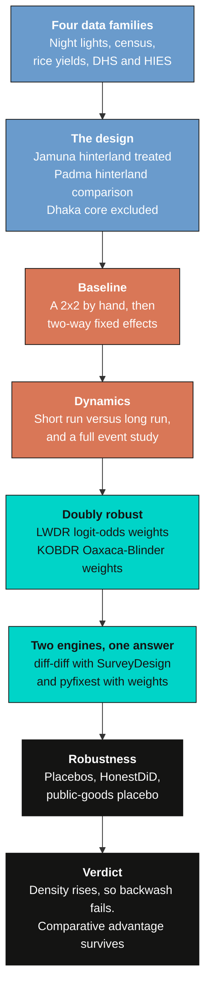
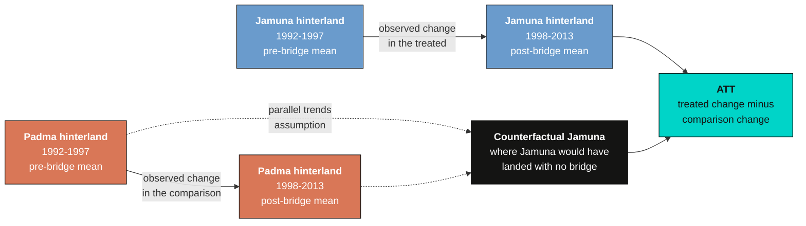
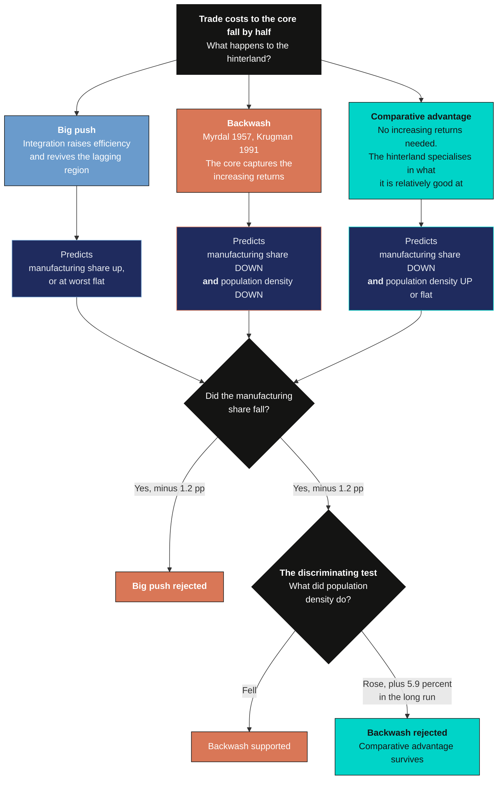
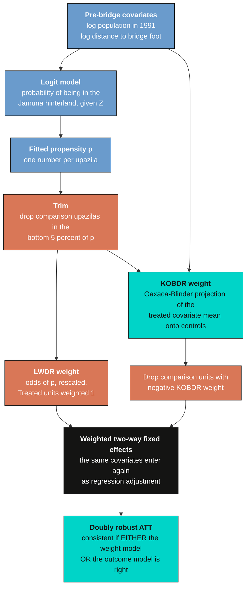

---
authors:
  - admin
categories:
  - Python
  - Causal Inference
  - Difference-in-Differences
  - Development Economics
date: "2026-08-05T00:00:00Z"
draft: false
featured: false
image:
  caption: ""
  focal_point: Smart
  placement: 3
links:
  - icon: spotify
    icon_pack: fab
    name: "Podcast"
    url: https://open.spotify.com/episode/4U2j7kAwgmzWuugvm2cbav
  - icon: chalkboard-teacher
    icon_pack: fas
    name: "Slides (HTML)"
    url: slides/index.html
  - icon: file-pdf
    icon_pack: fas
    name: "Slides (PDF)"
    url: https://carlos-mendez.org/post/python_bridge_impact/slides/Infrastructure_Impact_Econometrics.pdf
  - icon: laptop-code
    icon_pack: fas
    name: "Web app"
    url: web_app/index.html
  - icon: open-data
    icon_pack: ai
    name: "[Python] Google Colab"
    url: https://colab.research.google.com/github/cmg777/starter-academic-v501/blob/master/content/post/python_bridge_impact/notebook.ipynb
  - icon: file-code
    icon_pack: fas
    name: "Quarto project (.zip)"
    url: python_bridge_impact.zip
  - icon: code
    icon_pack: fas
    name: "Python script"
    url: analysis.py
  - icon: bolt
    icon_pack: fas
    name: "Python cheat sheet"
    url: cheatsheet_python.py
  - icon: book
    icon_pack: fas
    name: "Jupyter notebook"
    url: https://github.com/cmg777/starter-academic-v501/blob/master/content/post/python_bridge_impact/notebook.ipynb
  - icon: book
    icon_pack: fas
    name: "Data dictionary"
    url: data/index.html
  - icon: file-code
    icon_pack: fas
    name: "Stata do-file"
    url: analysis.do
  - icon: markdown
    icon_pack: fab
    name: "MD version"
    url: https://raw.githubusercontent.com/cmg777/starter-academic-v501/master/content/post/python_bridge_impact/index.md
summary: "In June 1998 a 4.8-kilometre bridge over the Jamuna river connected 26 million isolated Bangladeshis to Dhaka and cut freight costs in half. This tutorial rebuilds the difference-in-differences evaluation of that bridge from the ground up in Python, using the Padma hinterland — a symmetric region left isolated by a river whose own bridge was not started until 2015 — as the comparison group. It teaches the 2x2 logic, parallel trends, two-way fixed effects, event studies and honest sensitivity analysis on satellite nighttime lights, then runs the same machinery over census employment shares, rice yields and a public-goods placebo. The two doubly robust estimators of the original paper are rebuilt by hand in NumPy and pushed through both diff-diff and pyfixest. All 122 published coefficients are audited side by side with the replication, and the defects found inside the shipped Stata package are documented in full."
tags:
  - python
  - causal inference
  - difference-in-differences
  - doubly robust
  - event study
  - nighttime lights
  - transport infrastructure
  - bangladesh
  - replication
  - diff-diff
  - pyfixest
title: "Evaluating the Impact of Infrastructure: A Beginner's Guide to Difference-in-Differences with the Jamuna Bridge"
toc: true
diagram: true
---

<div style="background:#0e1545; border-radius:12px; padding:8px;">
<iframe style="border-radius:8px" src="https://open.spotify.com/embed/episode/4U2j7kAwgmzWuugvm2cbav?utm_source=generator&theme=0" width="100%" height="152" frameBorder="0" allowfullscreen="" allow="autoplay; clipboard-write; encrypted-media; fullscreen; picture-in-picture" loading="lazy"></iframe>
</div>

## Abstract

Transport megaprojects absorb a large share of development finance, yet economists still disagree about whether connecting a poor region to a rich one revives the periphery or hollows it out. This tutorial works that question through one case, replicating in Python the evaluation of the Jamuna Bridge — a 4.8-kilometre crossing that opened in June 1998, cost about US\\$985 million, and linked 26 million isolated Bangladeshis to Dhaka while cutting freight costs roughly in half. The analysis compares 123 treated upazilas in the Jamuna hinterland with 125 comparison upazilas in the Padma hinterland, a symmetric region whose own bridge was not begun until 2015. Four panels carry the evidence: satellite nighttime lights for 359 upazilas over seven three-year periods from 1992 to 2013, three population censuses, district rice yields back to 1988, and DHS and HIES village records. Two-way fixed-effects difference-in-differences is estimated with the `diff-diff` library and cross-checked in `pyfixest`, and the paper's two doubly robust estimators are rebuilt by hand in NumPy. The bridge raised nighttime lights 10.9 percent, rice yields 6.3 percent and the services employment share 2.3 percentage points, while the manufacturing share fell 1.0 percentage point; population density fell 2.5 percent in the short run and rose 5.9 percent in the long run. Because density rose rather than fell, the loss of manufacturing here is the signature of comparative advantage rather than of backwash — a region can lose its factories and still be better off.

<a href="https://colab.research.google.com/github/cmg777/starter-academic-v501/blob/master/content/post/python_bridge_impact/notebook.ipynb" target="_blank" rel="noopener"></a>

## 1. Overview

### 1.1 A bridge, two rivers, and three predictions

Bangladesh is a delta sliced into three by two of the largest rivers on earth. The Jamuna — the local name for the Brahmaputra, ninth in the world by discharge — cut the poor northwest off from Dhaka. The Ganges, locally the Padma, cut off the south. Before 1998, crossing the Jamuna meant a ferry that took more than three hours on a good day and, during Eid, could mean waiting thirty-six. A truck from Bogra to Dhaka took twenty hours.

Then the bridge opened, and that truck took six.

The question is what a shock like that does to the region on the far side. There are three answers in the literature, and they are not variations on a theme — they point in opposite directions.

The **big push** view is the one that gets megaprojects funded. Integrating a segmented market raises competition and allocational efficiency, and the lagging region revives.

The **backwash** view, which runs from Myrdal in 1957 through Krugman in 1991, says the opposite. With increasing returns and mobile factors, lowering trade costs lets the core capture the gains. Manufacturing concentrates where the market already is, and the newly connected periphery is hollowed out — deindustrialised, drained of people, worse off than before the road arrived.

The third view is the one this paper contributes, and it is the reason the case is worth studying carefully. Suppose the hinterland has a **comparative advantage** in agriculture. Then even with no increasing returns and no spatial sorting at all, a fall in trade costs pulls labour out of manufacturing and into the things the region is relatively good at. Manufacturing declines — but as specialisation, not as decay.

Here is the trap. Backwash and comparative advantage make the *same* prediction about factories. A study that measured only manufacturing would see the share fall, write "deindustrialisation", and conclude backwash. The two stories only separate on a second outcome, and getting that second outcome right is the whole methodological lesson of this tutorial.

### 1.2 Learning objectives

By the end of this post you will be able to:

1. **Compute** a difference-in-differences estimate by hand from four group means, and explain what each subtraction removes.
2. **State** the estimand you are targeting — the ATT — and say why it is not the ATE.
3. **Estimate** two-way fixed-effects DiD with the `diff-diff` library, and cross-check it in `pyfixest`.
4. **Build** an event study and read its pre-treatment coefficients as a test rather than a result.
5. **Construct** two doubly robust estimators from scratch: propensity-odds weights and Kline's Oaxaca-Blinder reweighting.
6. **Assess** how badly parallel trends would have to fail before your conclusion changes, using HonestDiD bounds and randomisation inference.
7. **Audit** a published paper against its own replication package, and read a regression footer for the tell that something has gone wrong.

### 1.3 The road ahead

The tutorial runs in eight stages. Each is a section below, and each either adds an assumption or tests one. Nighttime lights are the running example — they are the richest panel, with seven periods and 247 upazilas — and once the machinery is built, the other three outcomes go through it quickly.



Notice that the estimator gets more sophisticated as you move down, but the question never changes. Stages three through five all estimate the same thing; they differ only in how hard they work to make the Padma hinterland a fair stand-in for the Jamuna hinterland. Stages six and seven then try to break the answer.

## 2. Key concepts at a glance

The rest of the post leans on a small vocabulary. Each concept has three parts. The **definition** is always visible; the **example** and **analogy** sit behind clickable cards. Open them when a term feels slippery.

**1. Difference-in-differences** Two subtractions, one estimate.
Compare how much the treated group changed with how much an untreated group changed over the same period. Whatever moved both groups equally cancels out.

<div class="concept-pair">
<details class="concept-card concept-example">
<summary>Example</summary>

The Jamuna hinterland's mean log luminosity rose 0.0719 between the pre- and post-bridge periods. The Padma hinterland's rose 0.0078. The difference, 0.0641, is the raw estimate.

</details>

<details class="concept-card concept-analogy">
<summary>Analogy</summary>

Two bakeries raise prices the same week. One also changed its recipe. Subtract the other's price rise to isolate the recipe.

</details>
</div>

**2. Parallel trends** The assumption that carries everything.
Absent the treatment, the treated and comparison groups would have moved by the same amount. Not to the same level — by the same amount.

<div class="concept-pair">
<details class="concept-card concept-example">
<summary>Example</summary>

The pre-bridge trend difference in nightlights is 0.008. The conventional test cannot reject a difference — its standard error is 0.092, wide enough to hide almost anything — but the equivalence test, which is the sharper instrument, rejects a difference larger than the margin at $p = 0.001$.

</details>

<details class="concept-card concept-analogy">
<summary>Analogy</summary>

Two hikers on parallel ridges a hundred metres apart in height. As long as the terrain runs parallel, you can measure what a helicopter lift did to one of them. The permanent height gap cancels; only a divergence in the slope would break it.

</details>
</div>

**3. ATT (average treatment effect on the treated)** The estimand here.
The average effect among the units that actually got treated — not among a randomly chosen unit.

<div class="concept-pair">
<details class="concept-card concept-example">
<summary>Example</summary>

Every estimate in this post answers "what did this bridge do to the 123 upazilas behind it", not "what would a bridge do to a randomly chosen upazila in Bangladesh".

</details>

<details class="concept-card concept-analogy">
<summary>Analogy</summary>

Asking how much a specific medicine helped the patients who took it, rather than how much it would help the general population.

</details>
</div>

**4. Two-way fixed effects** Grading on two curves at once.
Remove each unit's permanent level and each period's common shock; whatever is left is unit-and-period specific.

<div class="concept-pair">
<details class="concept-card concept-example">
<summary>Example</summary>

`absorb=["geocode", "year"]` removes 247 upazila levels and 7 period shocks. The satellite recalibration that dimmed every pixel in 2005 is soaked up by the year effect.

</details>

<details class="concept-card concept-analogy">
<summary>Analogy</summary>

A teacher compares each student to their own past average, then compares each exam to the class average on that exam. What survives both is the textbook effect.

</details>
</div>

**5. Event study** Every period gets its own coefficient.
Instead of one post-treatment dummy, estimate a separate effect for each period relative to a baseline. The pre-treatment ones are a test; the post-treatment ones are the answer.

<div class="concept-pair">
<details class="concept-card concept-example">
<summary>Example</summary>

The nightlights event study gives $-0.008$ before the bridge, then $0.007 \rightarrow 0.033 \rightarrow 0.050 \rightarrow 0.083 \rightarrow 0.128$ across the five post-bridge periods.

</details>

<details class="concept-card concept-analogy">
<summary>Analogy</summary>

Instead of asking "was the patient better after treatment", chart the temperature every day and look at whether it was already falling before the pill.

</details>
</div>

**6. Propensity score** The probability of being treated, given what you can observe.
Used to reweight the comparison group so that it looks like the treated group on measured characteristics.

<div class="concept-pair">
<details class="concept-card concept-example">
<summary>Example</summary>

A logit of treatment on 1991 log population and log distance to the bridge foot. The two hinterlands overlap almost completely, with a median score near 0.50.

</details>

<details class="concept-card concept-analogy">
<summary>Analogy</summary>

Before comparing two schools' exam results, work out how likely each pupil was to have enrolled at the better-funded one, and weight accordingly.

</details>
</div>

**7. Doubly robust** Two parachutes.
Combine a model of who got treated with a model of the outcome. The estimator is consistent if *either* model is right.

<div class="concept-pair">
<details class="concept-card concept-example">
<summary>Example</summary>

LWDR and KOBDR both weight the comparison group and *also* include the same covariates in the regression. They land at 0.106 and 0.109 against the unweighted 0.088.

</details>

<details class="concept-card concept-analogy">
<summary>Analogy</summary>

A skydiver carries a main chute and a reserve. Only if both fail does the jump end badly. But two chutes do not help if you jumped over the wrong country — double robustness protects against getting a model's shape wrong, never against a confounder you never measured.

</details>
</div>

**8. HonestDiD sensitivity** How wrong can the assumption be?
Rather than testing parallel trends and declaring victory, bound how large a post-treatment violation the conclusion can survive.

<div class="concept-pair">
<details class="concept-card concept-example">
<summary>Example</summary>

The nightlights result survives until $M \approx 1$ — the post-bridge violation would have to be as large as the largest violation seen before the bridge.

</details>

<details class="concept-card concept-analogy">
<summary>Analogy</summary>

Instead of asking whether the bridge cable is fraying, ask how many strands could snap before the bridge falls down.

</details>
</div>

## 3. The research design

### 3.1 Why the Padma hinterland is the comparison

Everything below rests on one choice: which places stand in for the Jamuna hinterland's missing counterfactual. Four things make the Padma hinterland unusually well suited.

**It has the same problem and no solution.** The Padma hinterland is cut off from Dhaka by the other great river. A Padma bridge had been discussed since before independence, but the government could not afford two at once. Construction began only in 2015, and it was still incomplete when the paper was written. Since the data end in 2013, the comparison region stayed isolated for the entire study window.

**The choice of which river to bridge first was political, not economic.** President Ershad's political base was in Rangpur and Prime Minister Khaleda Zia's in Bogra — both in the Jamuna hinterland. That is a threat only if bridge priority tracked *economic shocks* in the northwest, and the historical record says it tracked personal geography instead.

**They are agro-climatically almost the same place.** The northernmost point of the Jamuna hinterland sits at latitude 26.62, the southernmost point of the comparison at 23.81 — under three degrees apart. Florida spans more than five.

**The imbalances that do exist are measurable and correctable.** We will see in section 7.5 that the two regions differ significantly in the pre-bridge services and agriculture shares, and that conditioning on 1991 population, distance to the bridge foot, and rainfall removes those differences entirely.

A third region — the Dhaka and Chittagong core — appears in the data but is excluded from every regression. It is neither treated nor a credible comparison, and the authors dropped it from the design after a referee pointed out exactly that.

### 3.2 The estimand: what number are we actually after?

Before touching an estimator, state the target. This tutorial estimates the **average treatment effect on the treated (ATT)**: the average effect of the Jamuna Bridge on the 123 upazilas that actually sit in its hinterland. It is not the ATE — it does not tell you what a bridge would do to a randomly chosen upazila in Bangladesh.

$$\tau\_{ATT} = E\left[ Y\_{it}(1) - Y\_{it}(0) \mid D\_J = 1, \\, t > 1998 \right]$$

In words, this says: take the upazilas behind the Jamuna Bridge, and only the years after it opened; compare the luminosity they actually recorded against the luminosity they would have recorded had the bridge never been built; average the difference. The second quantity is never observed for anyone, which is the entire problem.

| Symbol | Meaning | Code |
|---|---|---|
| $Y\_{it}(1)$ | outcome with the bridge | observed `lmn` where `treat == 1` and `post == 1` |
| $Y\_{it}(0)$ | outcome without the bridge | never observed; DiD reconstructs its *change* from the comparison group |
| $D\_J$ | Jamuna hinterland indicator | `treat` |
| $\tau\_{ATT}$ | the estimand | the coefficient on `treat_post` |

The distinction matters for policy. The ATT answers "was this bridge worth building?". The ATE would answer "should we build bridges generally?" — a different and much harder question, and not one this design can address.

This is observational data, not a randomised experiment. Bridge placement was not assigned by a coin flip, and the covariates below are not there to improve precision — they are there to address confounding. If bridge priority had been driven by pre-existing economic shocks in the northwest, and those shocks had persistent effects, the design would fail regardless of how many controls we add.

### 3.3 What difference-in-differences assumes

The estimator itself is four numbers and two subtractions.

$$\widehat{\tau}\_{2 \times 2} = \left( \bar{Y}\_{J,post} - \bar{Y}\_{J,pre} \right) - \left( \bar{Y}\_{P,post} - \bar{Y}\_{P,pre} \right)$$

In words, this says: take how much the Jamuna hinterland changed, take how much the Padma hinterland changed over the same years, and subtract the second from the first. A national fertiliser subsidy, a monsoon, a change in how the satellite was calibrated — anything that moved both regions equally drops out of the subtraction.

The assumption that licenses it:

$$E\left[ Y\_{it}(0) - Y\_{i,t-1}(0) \mid D\_J = 1 \right] = E\left[ Y\_{it}(0) - Y\_{i,t-1}(0) \mid D\_J = 0 \right]$$

In words: had the bridge never been built, luminosity in the Jamuna hinterland would have changed period to period by exactly the same amount as luminosity in the Padma hinterland. Note what it does *not* say. The two regions need not sit at the same level — only move at the same rate. And because it is a statement about a world that never happened, it can never be proven. Everything in sections 10.3 and 16 is an attempt to make it more or less plausible.



The two solid arrows are things we measure. The two dashed arrows are the assumption. Every robustness check later in the post is an attempt to make those dashed arrows more credible, and none of them can make the assumption disappear.

### 3.4 Big push, backwash, or comparative advantage

Now put the three theories into the same picture and find where they can be told apart.



Formally, the discriminating test is a joint sign restriction:

$$\text{backwash} \implies \theta\_1^{ind} < 0 \quad \text{and} \quad \theta\_1^{dens} < 0$$

$$\text{comparative advantage} \implies \theta\_1^{ind} < 0 \quad \text{and} \quad \theta\_1^{dens} \geq 0$$

In words: both stories predict the factories leave, so the manufacturing coefficient alone is useless for telling them apart. They disagree about people. Backwash means the periphery is being emptied — capital *and* labour move to the core. Comparative advantage means the periphery is specialising, not emptying. So the sign of the population-density effect decides the case.

The key insight lives in that second diamond. A study that measured only factories would have declared backwash and stopped. Adding population density — one extra outcome, from a census that was already sitting there — turns an ambiguous finding into a decisive one. The lesson generalises well beyond bridges: when two theories predict the same sign on your headline outcome, go looking for the outcome where they disagree.

## 4. Setup and imports

```python
import numpy as np
import pandas as pd
import statsmodels.api as sm
import matplotlib.pyplot as plt
import pyfixest as pf

from diff_diff import (
    DifferenceInDifferences,
    MultiPeriodDiD,
    SurveyDesign,
    check_parallel_trends,
    compute_honest_did,
    equivalence_test_trends,
    placebo_timing_test,
)

RANDOM_SEED = 42
np.random.seed(RANDOM_SEED)

# Both libraries warn about the same harmless thing all the way through: `post` is
# collinear with the year fixed effects, so it gets dropped. Section 9.1 explains why
# that is expected. `analysis.py` silences them for the same reason.
import warnings
warnings.filterwarnings("ignore")
```

Two libraries do the estimation. [`diff-diff`](https://github.com/igerber/diff-diff) is a
difference-in-differences toolkit with a scikit-learn-style API — you instantiate an estimator, call
`.fit()`, and get a results object — plus a full diagnostic suite for parallel trends, placebo tests
and sensitivity bounds. [`pyfixest`](https://py-econometrics.github.io/pyfixest/) is a fast
high-dimensional fixed-effects regression package modelled on R's `fixest`; it appears here as an
independent second opinion. Install both with `pip install diff-diff pyfixest`.

A handful of code blocks below call helper functions rather than repeating boilerplate. `stata_fe`
is a weighted unit fixed-effects regression with Stata's exact cluster-robust degrees-of-freedom
correction, which is what makes the reproduction audit in section 17 possible; `stata_ols` is its
pooled sibling; `event_study` and `diffdiff_mean` are thin wrappers around `diff-diff`;
`add_common` is written out in full in section 6.1, and `build_weights` is simply the twelve lines
of section 11.2 to 11.4 packaged as a function so the other datasets can reuse them. Every one of
them is defined in [`analysis.py`](analysis.py), and apart from those definitions the code blocks
below run in the order they appear.

The figures use the site's dark palette, set once:

```python
DARK_NAVY, GRID_LINE = "#0f1729", "#1f2b5e"
LIGHT_TEXT, WHITE_TEXT = "#c8d0e0", "#e8ecf2"
STEEL_BLUE, WARM_ORANGE, TEAL = "#6a9bcc", "#d97757", "#00d4c8"

plt.rcParams.update({
    "figure.facecolor": DARK_NAVY, "axes.facecolor": DARK_NAVY,
    "axes.labelcolor": LIGHT_TEXT, "axes.titlecolor": WHITE_TEXT,
    "axes.grid": True, "grid.color": GRID_LINE, "grid.alpha": 0.8,
    "xtick.color": LIGHT_TEXT, "ytick.color": LIGHT_TEXT,
    "text.color": WHITE_TEXT, "font.size": 12, "legend.frameon": False,
    "savefig.facecolor": DARK_NAVY,
})
```

## 5. Loading the data

### 5.1 Four data families

The evaluation uses five files covering four kinds of outcome. All are committed as tidy CSVs
alongside this post, so the notebook runs without the original Stata package.

```python
BASE = ("https://raw.githubusercontent.com/cmg777/starter-academic-v501/"
        "master/content/post/python_bridge_impact/data/")

nl_raw   = pd.read_csv(BASE + "bridge_nightlights.csv")     # satellite luminosity
emp_raw  = pd.read_csv(BASE + "bridge_employment.csv")      # population censuses
yld_raw  = pd.read_csv(BASE + "bridge_yield.csv")           # Boro rice yield
hh_raw   = pd.read_csv(BASE + "bridge_dhs_household.csv")   # DHS/HIES households
vill_raw = pd.read_csv(BASE + "bridge_dhs_village.csv")     # DHS village questionnaire

for nm, d, unit in [("employment", emp_raw, "geocode"), ("nightlights", nl_raw, "geocode"),
                    ("yield", yld_raw, "dist"), ("dhs household", hh_raw, "District"),
                    ("dhs village", vill_raw, "District")]:
    ins = d[d["smp1"].notna()]
    print(f"  {nm:15s} rows={len(d):5d}  units={d[unit].nunique():4d}"
          f"  periods={d['year'].nunique()}"
          f"  treated units={ins.loc[ins.treat == 1, unit].nunique():4d}"
          f"  comparison units={ins.loc[ins.treat == 0, unit].nunique():4d}")
```

```text
  employment      rows= 1053  units= 351  periods=3  treated units= 123  comparison units= 125
  nightlights     rows= 2513  units= 359  periods=7  treated units= 127  comparison units= 125
  yield           rows=  128  units=  16  periods=8  treated units=   5  comparison units=   6
  dhs household   rows= 1543  units=  37  periods=7  treated units=  16  comparison units=  21
  dhs village     rows= 1455  units=  41  periods=7  treated units=  20  comparison units=  21
```

Four things to notice. The nightlights panel is by far the richest — 359 upazilas observed in seven periods — which is why it carries the tutorial. The yield panel is the poorest: sixteen former districts, of which only eleven enter the estimation. That is not a typo; agricultural statistics in Bangladesh are published at the old district level, so the entire rice-yield result rests on nine to eleven clusters. Third, `smp1` is the sample filter: it is missing for the Dhaka-Chittagong core, which is neither treated nor a valid comparison. And fourth, the treated and comparison groups are almost exactly balanced in size — 123 against 125 upazilas in the census panel.

### 5.2 What one row means, and why `year` is not a year

This is the single detail most likely to break a replication of this paper.

```python
NL_YEARS = {1: "1992-94", 2: "1995-97", 3: "1998-00", 4: "2001-04",
            5: "2005-07", 6: "2008-10", 7: "2011-13"}
YLD_YEARS = {1: "1988-91", 2: "1992-94", 3: "1995-97", 4: "1998-00",
             5: "2001-04", 6: "2005-07", 7: "2008-10", 8: "2011-13"}
EMP_YEARS = {1: "1991", 2: "2001", 3: "2011"}

peek = nl_raw[["geocode", "year", "mn", "treat", "smp1"]].head(4)
print(peek.astype({"geocode": int, "year": int, "treat": int}).to_string(index=False))
```

```text
 geocode  year       mn  treat  smp1
   10409     1 1.016667      0   0.0
   10409     2 1.053333      0   0.0
   10409     3 1.045000      0   0.0
   10409     4 1.083333      0   0.0
```

One row is one upazila in one three-year window. The `year` column holds the integers 1 through 7, not calendar years: annual nightlights and yields are averaged into three-year blocks to smooth out transitory shocks. The bridge opened in June 1998, which falls inside block 3, so blocks 1 and 2 are the pre-period.

This matters beyond labelling, because the controls interact baseline characteristics with `year`. If you substitute calendar years there, every coefficient changes.

The `.astype(int)` in that snippet is cosmetic — the CSVs store every numeric column as a float — but notice which column is *not* cast. `smp1` has to stay floating point because it holds missing values for the Dhaka-Chittagong core, and missingness is the whole point of it.

### 5.3 The outcome variables

| Family | Outcome | Built from | Unit | Periods |
|---|---|---|---|---|
| Nighttime lights | `lmn` = $\ln(mn + 1)$, and its growth `D_lmn` | DMSP-OLS satellite, 1 km pixels averaged to upazila | upazila | 7 |
| Rice yield | `lyld` = $\ln(yld)$, and `D_lyld` | Bangladesh Bureau of Statistics yearbooks | former district | 8 |
| Population and employment | `ldensity`, and the shares `sagr`, `sind`, `sserv` | Population censuses 1991, 2001, 2011 (IPUMS) | upazila | 3 |
| Public goods | electricity access, distances to schools, clinics, banks | DHS 1993-2014 and HIES 1995/96 | village-year | 7 |

The `+1` inside the nightlights log is not cosmetic. Luminosity is bottom-coded at 1.0 in this
dataset, and most rural upazilas sit near the floor, so the transformation keeps the many near-dark
observations from dominating.

## 6. Data preparation

Nothing below is exotic, but three of these steps decide whether the replication lands on the
published numbers or somewhere nearby, so they are worth doing slowly.

### 6.1 From raw files to working frames

Every panel dataset needs the same five derived variables, so they go in one function. The first
line of it is the one the whole design rests on.

```python
def add_common(d, rain_plus_one=False, dist_scale=1.0):
    """The five derived variables every panel dataset needs."""
    d = d.copy()
    # Distance to whichever crossing is the relevant one: the Jamuna bridge for a
    # treated upazila, the Padma site for a comparison one. Taking the minimum of
    # the two is what makes the two hinterlands mirror images of each other.
    d["mdist"]   = np.minimum(d["jamuna_m"], d["padma_m"]) / 1000.0    # metres to km
    d["lmdist"]  = np.log(d["mdist"] + 1) / dist_scale
    d["lpop91"]  = np.log(d["pop91"])                  # 1991 population, fixed pre-bridge
    # Stata's ln() returns missing for zero; NumPy returns -inf and the row survives.
    # The replace() is what keeps 24 zero-rainfall rows out of the estimation sample.
    d["lrainm"]  = (np.log(d["rainm"] + 1) if rain_plus_one
                    else np.log(d["rainm"].replace(0, np.nan)))
    d["lrainsd"] = np.log(d["rainsd"].replace(0, np.nan))
    return d

nl  = add_common(nl_raw, rain_plus_one=True)   # nite_2021.do uses log(rainm + 1)
emp = add_common(emp_raw)                      # employment_2021.do uses plain log(rainm)
yld = add_common(yld_raw, dist_scale=10.0)     # Yield_2021.do rescales lmdist by 10
```

Two of those three calls carry a keyword, and both keywords come from reading the original do-files
rather than from any statistical principle. `nite_2021.do` writes `gen lrainm = ln(rainm+1)` while
`employment_2021.do` writes `gen lrainm = ln(rainm)`; the yield do-file divides its distance log by
ten. None of the three changes a treatment coefficient by much, but all three change it in the third
decimal, which is the difference between reproducing a table and almost reproducing it.

The `replace(0, np.nan)` deserves its own sentence, because it is the first of the three traps in
section 17. Twenty-four employment rows record zero rainfall. Stata's `ln(0)` is missing and the row
drops out; NumPy's `np.log(0)` is `-inf` and the row stays, quietly corrupting every sample size
downstream. It fails silently in exactly the way that is hardest to notice.

### 6.2 Outcomes, periods and the post indicator

```python
nl = nl.sort_values(["geocode", "year"])
nl["lmn"]   = np.log(nl["mn"] + 1)
nl["D_lmn"] = nl.groupby("geocode")["lmn"].diff()      # growth: a triple difference

emp["ldensity"] = np.log(emp["density"])
for share, num in [("sagr", "pop_agr"), ("sind", "pop_ind"), ("sserv", "pop_serv")]:
    emp[share] = emp[num] / emp["emp"]                 # sector shares of employment

yld = yld.sort_values(["dist", "year"])
yld["lyld"]   = np.log(yld["yld"])
yld["D_lyld"] = yld.groupby("dist")["lyld"].diff()

# Each file has its own period grid, so each gets its own pre/post cut.
nl["post"],  nl["sr"],  nl["lr"]  = nl.year.gt(2),  nl.year.between(3, 4),  nl.year.gt(4)
emp["post"], emp["sr"], emp["lr"] = emp.year.gt(1), emp.year.eq(2),         emp.year.eq(3)
yld["post"], yld["sr"], yld["lr"] = yld.year.ge(4), yld.year.between(4, 5), yld.year.gt(5)

for d in (nl, emp, yld):
    for h in ("post", "sr", "lr"):
        d[h] = d[h].astype(int)
        d[f"treat_{h}"] = d["treat"] * d[h]
```

Because three of the four outcomes are logarithms, their coefficients read as proportional changes. The exact conversion is

$$g(\widehat{\theta}\_1) = 100 \left( \exp(\widehat{\theta}\_1) - 1 \right)$$

In words: a coefficient of 0.109 on log nightlights means luminosity is $100(e^{0.109} - 1) = 11.5$ percent higher. Below about 0.05 the exact and approximate readings differ by under half a percentage point, so the coefficient can simply be read as a percentage. At 0.109 the gap has grown to 0.6 points, so when this post and the original paper both call that estimate "10.9 percent" they are quoting the approximation, not the exact figure. The employment shares are *not* logged, so those coefficients are already in percentage points and need no conversion at all.

### 6.3 Controls: initial conditions on a trend

```python
for d in (nl, emp, yld):
    d["lpop91_t"] = d["lpop91"] * d["year"]           # initial size, interacted with the trend
    d["lmdist_t"] = d["lmdist"] * d["year"]           # initial remoteness, likewise

CONTROLS = ["lpop91_t", "lrainm", "lrainsd", "lmdist_t"]
```

These two lines are the subtle ones and they are worth dwelling on. `lpop91` and `lmdist` are fixed characteristics — they never change over the panel — so a unit fixed effect already absorbs them completely. Including them alone would do nothing. Interacting them with the time index is different: it allows an upazila that was large or remote *in 1991* to be on a permanently different trajectory thereafter.

That relaxes the identifying assumption in a useful way. Instead of "all upazilas would have trended alike", we now need only "upazilas that started at the same size and remoteness would have trended alike". Since size and remoteness are the two things most obviously correlated with bridge placement, this is exactly the relaxation the design needs.

Note that `year` here is the integer period index from section 5.2, not a calendar year. Substituting calendar years into these two lines is the single most common way to fail to reproduce this paper.

### 6.4 The estimation samples

```python
# `smp1` is missing for the Dhaka-Chittagong core, which is neither treated nor a
# credible comparison. These three lines are section 3.1's design decision, in code.
NL  = nl[nl["smp1"].notna()].dropna(subset=CONTROLS).copy()
EMP = emp[emp["smp1"].notna()].dropna(subset=CONTROLS).copy()
YLD = yld[yld["smp1"].notna()].dropna(subset=CONTROLS).copy()

for d, unit in [(NL, "geocode"), (EMP, "geocode"), (YLD, "dist")]:
    d[["year", unit, "treat"]] = d[["year", unit, "treat"]].astype(int)

# The two DHS files never use smp1 -- they are already restricted to the two hinterlands.
HH = hh_raw.copy()
HH["mdist"]    = np.minimum(HH["jamuna_m"], HH["padma_m"]) / 1000.0
HH["lmdist_t"] = np.log(HH["mdist"] + 1) * HH["year"]
HH["treat_sr"] = HH["treat"] * HH["year"].eq(4)
HH["treat_lr"] = HH["treat"] * HH["year"].ge(5)

VILL = vill_raw.copy()
VILL["mdist"]    = np.minimum(VILL["jamuna_m"], VILL["padma_m"]) / 1000.0
VILL["lmdist_t"] = np.log(VILL["mdist"] + 1) * VILL["year"]
VILL["treat_sr"] = VILL["treat"] * VILL["year"].eq(4)
VILL["treat_lr"] = VILL["treat"] * VILL["year"].ge(5)

for nm, d, unit in [("NL", NL, "geocode"), ("EMP", EMP, "geocode"), ("YLD", YLD, "dist")]:
    print(f"  {nm:4s} rows={len(d):5d}  units={d[unit].nunique():4d}")
```

```text
  NL   rows= 1729  units= 247
  EMP  rows=  738  units= 246
  YLD  rows=   88  units=  11
```

**One convention for the rest of the post: lower case is the full frame, upper case is the estimation sample.** `nl` still holds all 359 upazilas including the core; `NL` holds the 247 that the regressions actually see. The distinction matters more than it looks, and section 15 turns on it — the distance terciles have to be cut on `nl`, before rows are lost to missing controls, not on `NL`.

Those three sample sizes are worth checking against the paper before going any further. 1729 and 247 are the N and the upazila count in the first column of the published Table 1; 738 and 246 are the census panel's; 88 and 11 are the yield panel's. If a replication is going to go wrong, it usually goes wrong here, and it is far cheaper to find out now than after the coefficients disagree.

## 7. Exploratory analysis

### 7.1 The identification geometry

You do not need a shapefile to see the design. Plot every upazila by its distance to each of the two
river crossings, and the map draws itself.

```python
geo = emp_raw.drop_duplicates("geocode").copy()
geo["grp"] = np.where(geo["treatd"] == 1, "core (excluded)",
                      np.where(geo["treat"] == 1, "Jamuna hinterland (treated)",
                               "Padma hinterland (comparison)"))

fig, ax = plt.subplots(figsize=(9.5, 7.5))
for lab, color, mk in [("Jamuna hinterland (treated)", WARM_ORANGE, "o"),
                       ("Padma hinterland (comparison)", STEEL_BLUE, "o"),
                       ("core (excluded)", "#7a8399", "x")]:
    s = geo[geo["grp"] == lab]
    ax.scatter(s["jamuna_m"] / 1000, s["padma_m"] / 1000,
               s=np.sqrt(s["pop91"]) / 6, color=color, marker=mk, alpha=0.75,
               edgecolors="none", label=f"{lab}  (n={len(s)})")
ax.plot([0, 400], [0, 400], color=WHITE_TEXT, ls=":", lw=1.4)
ax.set_xlabel("Distance to the Jamuna bridge (km)")
ax.set_ylabel("Distance to the Padma crossing (km)")
```


*Figure 1. Every upazila plotted by its distance to the Jamuna bridge against its distance to the Padma crossing. Marker area is proportional to 1991 population; the dotted line is the equidistance diagonal. The two hinterlands separate on either side of it, and the excluded Dhaka-Chittagong core sits away from both.*

The two hinterlands separate cleanly on either side of the equidistance diagonal, and the excluded core sits away from both. Treated upazilas run from 8.4 km to 269.5 km from the bridge foot; the comparison upazilas span the same range on their own river. That symmetry is what makes the comparison credible — the Padma hinterland is not a generic control group, it is the same kind of place with the same kind of river problem and no bridge.

### 7.2 Luminosity paths

```python
fig, ax = plt.subplots(figsize=(10, 6))
for grp, color, lab in [(1, WARM_ORANGE, "Jamuna hinterland (treated)"),
                        (0, STEEL_BLUE, "Padma hinterland (comparison)")]:
    m = NL[NL["treat"] == grp].groupby("year")["lmn"].mean()
    ax.plot(m.index, m.to_numpy(), marker="o", ms=5, lw=2, color=color, label=lab)
ax.axvline(2.5, color=TEAL, ls="--", lw=1.5)     # the bridge opens inside period 3
```


*Figure 2. Mean log nighttime luminosity by three-year period, Jamuna hinterland in orange against the Padma hinterland in blue. The teal dashed line marks period 3, inside which the bridge opened in June 1998.*

Before 1998 the two lines track each other closely; afterwards the Jamuna line pulls away. The gap in levels is small — luminosity is bottom-coded and most of these upazilas are dark — but the divergence is monotone across all five post-bridge periods. A one-off shock would produce a step; this produces a ramp.

### 7.3 The other three outcomes


*Figure 3. Mean log Boro rice yield by period, 1988–2013. Both series climb with the late Green Revolution; only the gap between them is evidence.*

Rice yields rise everywhere in Bangladesh over this period — the long tail of the Green Revolution — so the treated series climbing is not evidence of anything on its own. What matters is that the two series climb *together* until the late 1990s and then separate. That common component is exactly what the subtraction removes.


*Figure 4. Log population density and the agriculture, industry and services employment shares, by census year. Only 1991 is pre-bridge, which is why these four outcomes support a level-balance test but no pre-trend test.*

The census panel is the thinnest of the four, and only one of its three years is pre-bridge. That single pre-period is a real limitation: no pre-trend test is possible for population density or the employment shares, only a level-balance test. It is worth flagging early because it is the outcome that later decides the theoretical question.


*Figure 5. Employment composition of the two hinterlands, 1991–2011. Agriculture's share falls and services rises in both — the question is whether it happened faster on the bridged side.*

Structural transformation is visible in both regions: agriculture's share falls, services rises. Both hinterlands are developing. The question is whether it happened faster on the bridged side, and by how much — which is a question about the difference between two slopes, not about either slope.

### 7.4 Distance gradients before the bridge

This next figure is the one that explains the paper's most surprising result before we get to it.

```python
pre = EMP[(EMP["year"] == 1) & (EMP["treat"] == 1)]     # 1991, treated upazilas only
for col in ["sagr", "sind", "sserv", "ldensity"]:
    slope = np.polyfit(pre["mdist"], pre[col], 1)[0]
    print(f"    {col:10s} {slope:+.6f} per km")
```

```text
    sagr       +0.000692 per km
    sind       -0.000278 per km
    sserv      -0.000414 per km
    ldensity   -0.001864 per km
```


*Figure 6. 1991 employment shares against distance to the bridge foot, treated upazilas only. Remote upazilas were more agricultural and less dense before the bridge existed — which is why they later had the most to gain.*

Before the bridge existed, the agriculture share rose by about 0.07 percentage points per kilometre of distance from the bridge foot, while manufacturing and services both fell. Remote upazilas were more agricultural and less dense. Hold on to that: it means the places furthest from the bridge had the most agricultural output to ship, and therefore the most to gain from a fall in the cost of shipping it. This is why the effects turn out to be largest at the far end of the line rather than next to the bridge — a result that looks backwards until you have seen this figure.

### 7.5 Balance and pre-trends

Do the two hinterlands actually look alike before 1998? Partly.

```python
pre_emp = EMP[EMP["year"] == 1]                       # 1991 cross-section
for y in ["ldensity", "sind", "sserv", "sagr"]:
    naive = stata_ols(pre_emp, y, ["treat"], cluster="geocode")
    cond  = stata_ols(pre_emp, y, ["treat", "lpop91", "lrainm", "lrainsd", "lmdist"],
                      cluster="geocode")
    print(f"  {y:9s} naive {naive['coef']['treat']:+.4f} (p={naive['p']['treat']:.3f})"
          f"   conditional {cond['coef']['treat']:+.4f} (p={cond['p']['treat']:.3f})")
```

```text
  ldensity  naive -0.0236 (p=0.730)   conditional +0.1741 (p=0.106)
  sind      naive +0.0002 (p=0.967)   conditional +0.0065 (p=0.294)
  sserv     naive -0.0879 (p=0.000)   conditional -0.0179 (p=0.334)
  sagr      naive +0.0877 (p=0.000)   conditional +0.0114 (p=0.581)
```


*Figure 7. Pre-bridge treated-comparison differences in levels and in trends, under all four estimators. The services and agriculture level gaps are large unconditionally and vanish once the four controls enter; the one significant trend difference does not survive reweighting.*

The raw pre-bridge differences in the services and agriculture shares are large and unambiguous: the Jamuna hinterland was 8.8 percentage points more agricultural and 8.8 points less service-oriented than the Padma hinterland in 1991. Conditioning on 1991 population, distance to the bridge foot and the two rainfall variables collapses both to statistical insignificance — services to $-0.018$ ($p = 0.33$), agriculture to $+0.011$ ($p = 0.58$).

That result is the reason those four controls appear in every specification for the rest of the post. The imbalance is real, and it is entirely explained by observable initial conditions.

One pre-trend difference *is* significant, and it should be said plainly rather than waved away: the **unweighted** nightlights trend, at $+0.043$ with a standard error of 0.019 ($p = 0.022$). Taken alone it says the Jamuna hinterland was already brightening slightly faster than the Padma hinterland before the bridge, which is exactly the kind of thing that invalidates a DiD.

It does not survive the reweighting that every headline specification uses. Under LWDR the same trend difference falls to $+0.027$ ($p = 0.16$), and under KOBDR to $+0.027$ ($p = 0.16$). No trend difference is significant at 5 percent under either doubly robust estimator, in any panel. That is a better argument for the weights than anything in section 11 — they were introduced to fix a level imbalance, and they turn out to fix the trend imbalance too.

## 8. The 2x2: four numbers and no library

Before any estimator, do it by hand. This is the whole idea, and it fits in three lines.

```python
cell = NL.groupby(["treat", "post"])["lmn"].mean().unstack()
d_treated = cell.loc[1, 1] - cell.loc[1, 0]
d_control = cell.loc[0, 1] - cell.loc[0, 0]
print(f"    treated    pre {cell.loc[1,0]:.4f}   post {cell.loc[1,1]:.4f}   "
      f"change {d_treated:+.4f}")
print(f"    comparison pre {cell.loc[0,0]:.4f}   post {cell.loc[0,1]:.4f}   "
      f"change {d_control:+.4f}")
print(f"    difference-in-differences = {d_treated - d_control:+.4f}")
```

```text
    treated    pre 1.2551   post 1.3270   change +0.0719
    comparison pre 1.2113   post 1.2191   change +0.0078
    difference-in-differences = +0.0641
```


*Figure 8. The 2×2 in one picture. Solid lines are the two observed changes; the teal dashed line is where the Jamuna hinterland would have landed at the comparison group's growth rate. The bracket is the ATT.*

The Jamuna hinterland brightened by 0.072 log points across the bridge opening; the Padma hinterland by 0.008. The difference, 0.064, is the estimate. The teal dashed line in the figure is the counterfactual: where the treated group would have landed if it had grown at the comparison group's rate. The gap between that line and where it actually landed is the ATT.

Everything the rest of this post does is a refinement of these four numbers. It is worth registering now that the fully specified doubly robust estimate will come out at 0.109 — *larger* than the naive 2x2, not smaller. Adjustment does not always shrink an effect.

## 9. Baseline: two-way fixed effects

### 9.1 The specification

The 2x2 uses two group means and two period means. With 247 upazilas and 7 periods we can do much better: give every upazila its own level and every period its own shock.

$$Y\_{it} = \theta\_0 + \mu\_i + \mu\_t + \theta\_1 \left( D\_J \times D\_{post} \right) + \sum\_q \beta\_q X\_{qit} + \sum\_m \pi\_m \left( Z\_{mi0} \times t \right) + \varepsilon\_{it}$$

In words: each upazila carries a permanent level $\mu\_i$, each period carries a national shock $\mu\_t$, and after removing both we ask whether the Jamuna upazilas moved differently once the bridge opened. The final sum is the trend-interacted initial conditions from section 6.3.

| Symbol | Meaning | Code |
|---|---|---|
| $Y\_{it}$ | outcome | `lmn` |
| $\mu\_i$, $\mu\_t$ | upazila and period effects | `absorb=["geocode", "year"]` |
| $D\_J \times D\_{post}$ | the treatment indicator | `treat_post` |
| $X\_{qit}$ | time-varying controls | `lrainm`, `lrainsd` |
| $Z\_{mi0} \times t$ | initial conditions on a trend | `lpop91_t`, `lmdist_t` |
| $\theta\_1$ | the ATT | the coefficient we report |
| $\varepsilon\_{it}$ | error | clustered on `geocode` |

Note that $D\_J$ and $D\_{post}$ do not appear on their own. They cannot: $D\_J$ never varies within an upazila, so the upazila effects absorb it, and $D\_{post}$ is a function of the period, so the period effects absorb that. Only the interaction survives, which is a useful reminder that DiD identification lives entirely in the interaction.

### 9.2 Estimating it with diff-diff

```python
res = DifferenceInDifferences(cluster="geocode").fit(
    NL, outcome="lmn", treatment="treat", time="post",
    covariates=["lpop91_t", "lrainm", "lrainsd", "lmdist_t"],
    absorb=["geocode", "year"], unit="geocode")
print(res)
res.print_summary()
```

```text
DiDResults(ATT=0.0881***, SE=0.0220, p=0.0001)
```

The bridge raised nighttime luminosity by 0.088 log points — about 9.2 percent — with a standard error of 0.022. That is a t-statistic near 4, and it is a substantially larger estimate than the raw 2x2 of 0.064, which tells us the fixed effects and controls were doing real work.

Three API details are worth learning here rather than discovering the hard way.

`treatment` and `time` are the *group* and *period* indicators, and `diff-diff` forms the interaction itself. Here `time="post"` is the binary pre/post switch, not the seven-period index. Passing `time="year"` to `DifferenceInDifferences` would ask it to treat the period index as the post indicator, which is not the model we want.

Use `absorb=` rather than `fixed_effects=`. Both return the same coefficient, but `absorb` partials the fixed effects out before the degrees-of-freedom correction, which is what Stata's `xtreg, fe` does; `fixed_effects=` builds explicit dummies and counts them in $K$, giving 0.0238 here instead of 0.0220. The published standard error is 0.022, so `absorb` is the one that reproduces it.

The sibling estimator `TwoWayFixedEffects` is not a drop-in substitute in this design. Calling it with `time="year"` returns 0.0184 (0.0040) — a different model entirely, because it interprets the period index rather than a pre/post switch. Calling it with `time="post"` returns 0.1339 (0.0200), which differs from the 0.0881 above because it does not absorb the seven period effects, only a single post dummy. Neither is a bug; both are the answer to a different question. When a library offers several routes to "the DiD estimate", check which one reproduces a number you already know.

### 9.3 The same regression in pyfixest

```python
fit = pf.feols("lmn ~ treat_post + post + lpop91_t + lrainm + lrainsd + lmdist_t"
               " | geocode + year", data=NL, vcov={"CRV1": "geocode"})
print(f'{fit.coef()["treat_post"]:.10f}   {fit.se()["treat_post"]:.10f}')
```

```text
0.0880677516   0.0220101168
```

A second library, a completely different implementation, and the same number to seven decimal places. This is worth doing routinely. A DiD estimate is a small number extracted from a large panel through several layers of transformation, and the cheapest insurance against a coding error is to reproduce it in software that shares none of your code.

`pyfixest` also prints a warning on that call — `1 variables dropped due to multicollinearity. The following variables are dropped: ['post']`. That is not a problem, it is the library confirming the point made at the end of section 9.1: `post` is a function of the period, so the year fixed effects have already absorbed it. Leaving it in the formula costs nothing and makes the redundancy visible.

## 10. Dynamics: short run, long run, and the event study

### 10.1 One post-bridge dummy is not enough

Migration, credit and supply chains all take time. Splitting the post-bridge window in two lets the data report a path instead of an average.

$$Y\_{it} = \delta\_0 + \mu\_i + \mu\_t + \delta\_1 \left( D\_J \times D\_{SR} \right) + \delta\_2 \left( D\_J \times D\_{LR} \right) + \sum\_q \beta\_q X\_{qit} + \sum\_m \pi\_m \left( Z\_{mi0} \times t \right) + \varsigma\_{it}$$

In words: replace the single post-bridge switch with two — one for the years just after opening, one for the years well after — and estimate two effects instead of one.

| Symbol | Code | Nightlights | Census |
|---|---|---|---|
| $D\_{SR}$ | `sr` | periods 3-4, 1998-2004 | 2001 |
| $D\_{LR}$ | `lr` | periods 5-7, 2005-2013 | 2011 |
| $\delta\_1$ | `treat_sr` | short-run ATT | short-run ATT |
| $\delta\_2$ | `treat_lr` | long-run ATT | long-run ATT |

### 10.2 The event study

Better still: give *every* period its own coefficient, measured relative to the last pre-bridge one.

$$Y\_{it} = \mu\_i + \mu\_t + \sum\_{k \neq 2} \gamma\_k \\, D\_J \cdot \mathbf{1}[t = k] + \sum\_q \beta\_q X\_{qit} + u\_{it}$$

In words: $\gamma\_k$ is the treated-comparison gap in period $k$, normalised to zero in period 2, the last pre-bridge window. The coefficients for $k < 3$ are a **test** — if parallel trends is reasonable they should be indistinguishable from zero. The coefficients for $k \geq 3$ are the **answer** — they trace the whole path of the effect.

```python
ev = MultiPeriodDiD(cluster="geocode").fit(
    NL, outcome="lmn", treatment="treat", time="year",
    post_periods=[3, 4, 5, 6, 7], covariates=CONTROLS,
    absorb=["geocode"], reference_period=2, unit="geocode")

for p in sorted(ev.period_effects):
    e = ev.get_effect(p)
    print(f"  period {p} ({NL_YEARS[p]}): {e.effect:+.4f}  (se {e.se:.4f})")
```

```text
  period 1 (1992-94): -0.0082  (se 0.0167)
  period 3 (1998-00): +0.0068  (se 0.0179)
  period 4 (2001-04): +0.0328  (se 0.0217)
  period 5 (2005-07): +0.0501  (se 0.0216)
  period 6 (2008-10): +0.0831  (se 0.0238)
  period 7 (2011-13): +0.1279  (se 0.0271)
```


*Figure 9. Event study for log nighttime lights, normalised to period 2 with 95 percent confidence intervals. The single pre-bridge coefficient sits on zero; the five post-bridge ones climb monotonically. The original paper never drew this figure.*

This is the most persuasive figure in the analysis, and the original paper never drew it. The one available pre-bridge coefficient is $-0.008$ against a standard error of 0.017 — sitting on zero, exactly what parallel trends requires. Then the effect climbs monotonically across all five post-bridge periods, from $+0.7$ percent in 1998-2000 to $+12.8$ percent in 2011-13.

Think about what a confounder would have to look like to generate this. It would need to be absent before June 1998, appear at the right moment, and then grow steadily for fifteen years without ever reversing. Such things exist, but the list is short, and every candidate on it is easier to argue about once you have seen this picture than once you have seen a single pooled coefficient.

### 10.3 Testing parallel trends formally

```python
pt = check_parallel_trends(NL, outcome="lmn", time="year",
                           treatment_group="treat", pre_periods=[1, 2])
eq = equivalence_test_trends(NL, outcome="lmn", time="year",
                             treatment_group="treat", unit="geocode",
                             pre_periods=[1, 2])

def show(title, d, keys):
    print(f"  {title}")
    for k in keys:
        v = d[k]
        print(f"    {k:28s} {v:.5f}" if isinstance(v, float) else f"    {k:28s} {v}")

show("check_parallel_trends (nightlights, 1992-97):", pt,
     ["trend_difference", "trend_difference_se", "p_value", "parallel_trends_plausible"])
print()
show("equivalence_test_trends:", eq,
     ["equivalence_margin", "tost_p_value", "equivalent"])
```

```text
  check_parallel_trends (nightlights, 1992-97):
    trend_difference             0.00844
    trend_difference_se          0.09242
    p_value                      0.92725
    parallel_trends_plausible    True

  equivalence_test_trends:
    equivalence_margin           0.04019
    tost_p_value                 0.00107
    equivalent                   True
```

The two tests do different jobs and the second is the more useful one. `check_parallel_trends` fails to reject a difference in trends, with a p-value of 0.93. That is reassuring but weak: failing to reject is not evidence of similarity, especially when the standard error is 0.092 and could hide almost anything.

The equivalence test flips the null around. It asks whether the trend difference is *smaller* than a pre-specified margin, and rejects the hypothesis that it is larger at $p = 0.001$. That is a positive finding rather than an absence of one. When you have the option, report both — and treat an insignificant pre-trend on its own as the weakest form of the evidence, not the strongest.

## 11. Two doubly robust estimators, built by hand

### 11.1 Why doubly robust

So far the comparison group has been used as-is. But we know the two hinterlands differ on measured characteristics — section 7.5 showed the imbalance. There are two classical ways to fix that.

**Reweight** the comparison group so that its covariate distribution matches the treated group's. This needs a model of *who got treated*.

**Regression-adjust**, putting the covariates on the right-hand side. This needs a model of *how the outcome depends on covariates*.

A doubly robust estimator does both, and is consistent if *either* model is correct. That is a much weaker requirement than getting both right.



The two branches out of the covariate box are the two protections. The left branch models who got treated; the right branch models what the outcome would have been. Note also that trimming and negative-weight dropping happen *before* the regression: both are sample decisions, and both must be reported.

### 11.2 The propensity model and the 5 percent trim

$$p\_i = \Pr\left( D\_J = 1 \mid Z\_i \right) = \frac{\exp\left( \alpha\_0 + \alpha\_1 \ln P\_i + \alpha\_2 \ln d\_i \right)}{1 + \exp\left( \alpha\_0 + \alpha\_1 \ln P\_i + \alpha\_2 \ln d\_i \right)}$$

In words: estimate how likely each upazila was to end up on the Jamuna side, using only two things that were fixed before the bridge existed — how many people lived there in 1991, and how far it sits from the nearest bridge foot.

```python
s = nl[nl["smp1"].notna()].dropna(subset=["lpop91", "lmdist"]).copy()
X = sm.add_constant(s[["lpop91", "lmdist"]].astype(float))
D = s["treat"].to_numpy(float)

logit = sm.Logit(D, X).fit(disp=0)
s["p"] = logit.predict(X)
cut = np.percentile(s["p"], 5)
print(f"  logit N={len(s)}  coefs={logit.params.to_numpy().round(6)}")
print(f"  5% propensity trim at p={cut:.7f}")
```

```text
  logit N=1743  coefs=[-7.206172  0.313503  0.741378]
  5% propensity trim at p=0.2918769
```

Then the trimming rule:

$$w\_i = 0 \quad \text{whenever} \quad D\_{J,i} = 0 \quad \text{and} \quad p\_i < q\_{0.05}(p)$$

Discard the comparison upazilas whose estimated likelihood of treatment sits in the bottom 5 percent. Why? Because a comparison unit with a propensity of 0.03 has to be multiplied by roughly thirty to stand in for a treated one, and it then speaks with the voice of thirty upazilas. It is like settling a national budget at an exchange rate of thirty to one: a mis-measured rainfall figure or one enumerator's mistake arrives in your final accounts multiplied thirtyfold. Trimming is the rule that you will not trade at rates above a certain level.

There is a cost, and it is worth being explicit about it. Trimming shifts the estimand slightly: you are now estimating the ATT on the region of common support, not on all 123 treated upazilas.

### 11.3 LWDR: propensity odds as ATT weights

$$w\_i^{LW} = \frac{p\_i}{1 - p\_i} \cdot \frac{1 - \pi}{\pi}, \qquad \pi = \frac{1}{N} \sum\_j D\_{J,j}$$

In words: weight each comparison upazila by its *odds* of having been treated, rescaled so the weights average about one. A comparison unit that looks almost exactly like a Jamuna upazila gets a large weight; one that looks nothing like a Jamuna upazila gets a small one.

```python
pi = D.mean()
s["ipw1"] = np.where(D == 1, 1.0, s["p"] / (1 - s["p"]) * (1 - pi) / pi)
s["ipw3"] = np.where((s["p"] < cut) & (D == 0), np.nan, s["ipw1"])   # trimmed
```

The line `np.where(D == 1, 1.0, ...)` is not a formatting convenience. Treated units get a weight of exactly one because we want the effect *on the treated*: the treated distribution is the target, and only the comparison group is reshaped to match it. Weighting the treated units by $1/p$ instead would target the ATE. That single line is what makes these ATT weights.

### 11.4 KOBDR: Kline's Oaxaca-Blinder reweighting

$$w\_i^{KOB} = \frac{1 - D\_{J,i}}{N\_1} \left( \sum\_{j : D\_{J,j} = 1} X\_j \right)^{\prime} \left( \sum\_{j : D\_{J,j} = 0} X\_j X\_j^{\prime} \right)^{-1} X\_i$$

In words: run the outcome regression on the comparison upazilas only, then evaluate it at the *average treated* covariate profile. Kline (2011) showed that this two-step Oaxaca-Blinder procedure is algebraically identical to taking a weighted average of the comparison outcomes, and this is the weight it implies.

```python
n1, Xm, nD = D.sum(), X.to_numpy(float), 1.0 - D
ob = ((D @ Xm) @ np.linalg.inv(Xm.T @ (Xm * nD[:, None])) @ Xm.T / n1) * nD * n1
s["ipw2"] = np.where(D == 1, 1.0, np.where(ob < 0, np.nan, ob))       # negatives dropped
s["ipw4"] = np.where((s["p"] < cut) & (D == 0), np.nan, s["ipw2"])    # trimmed
print(f"  [nightlights] negative Oaxaca-Blinder weights: {int((ob < 0).sum())} obs dropped")

# Merge the four weight columns back onto the estimation sample. `analysis.py`
# wraps the twelve lines above into build_weights() and runs it once per family:
# a 5 percent trim for nightlights and the census, none for the yield panel,
# where sixteen districts leave nothing to trim.
NL = NL.merge(s[["geocode", "year", "p", "ipw1", "ipw2", "ipw3", "ipw4"]],
              on=["geocode", "year"], how="left")
EMP = EMP.merge(build_weights(emp[emp["smp1"].notna()], trim_pct=5)
                .groupby("geocode")[["p", "ipw1", "ipw2", "ipw3", "ipw4"]]
                .first().reset_index(), on="geocode", how="left")
YLD = YLD.merge(build_weights(yld[yld["smp1"].notna()], trim_pct=None)
                .groupby(["dist", "year"])[["p", "ipw1", "ipw2"]]
                .first().reset_index(), on=["dist", "year"], how="left")
```

```text
  [nightlights] negative Oaxaca-Blinder weights: 35 obs dropped
```

Think of it as casting understudies. A director needs to stage the Jamuna hinterland but may only use Padma actors. She writes down the profile of the average Jamuna upazila — this much 1991 population, this far from a bridge foot — and asks what blend of Padma actors reproduces that profile exactly. The blend proportions are the Oaxaca-Blinder weights.

Two things follow immediately. The blend is chosen to match the *treated* average, which is again what makes this an ATT estimator. And nothing in the algebra forces the proportions to be positive: sometimes the best way to hit the target is to weight one actor at 1.4 and another at $-0.4$. Negative casting is not interpretable, so those units are dismissed — 35 upazila-periods here.

### 11.5 Does the reweighting actually work?

```python
nlp = NL.drop_duplicates("geocode")        # one row per upazila; weights are time-invariant

for var in ["lpop91", "lmdist"]:
    t = nlp.loc[nlp.treat == 1, var]
    for lab, wcol in [("unweighted", None), ("LWDR", "ipw3"), ("KOBDR", "ipw4")]:
        c = nlp[nlp.treat == 0].dropna(subset=[var] + ([wcol] if wcol else []))
        w = np.ones(len(c)) if wcol is None else c[wcol].to_numpy(float)
        cm = np.average(c[var], weights=w)
        sd = np.sqrt((t.var() + c[var].var()) / 2)
        print(f"  {var:8s} {lab:11s} std. diff {(t.mean() - cm) / sd:+.4f}")
```

```text
  lpop91   unweighted  std. diff +0.0969
  lpop91   LWDR        std. diff -0.0476
  lpop91   KOBDR       std. diff -0.0127
  lmdist   unweighted  std. diff +0.4041
  lmdist   LWDR        std. diff +0.0793
  lmdist   KOBDR       std. diff +0.0541
```


*Figure 10. Standardised treated-comparison differences in the two covariates, unweighted and under each weighting scheme. Distance starts at 0.404, well above the conventional 0.10 threshold, and KOBDR cuts it to 0.054.*

This is the clearest evidence that the reweighting does what it claims. The distance covariate starts badly imbalanced at 0.404 — well above the conventional 0.10 threshold — because Jamuna upazilas sit systematically farther from their bridge foot than Padma upazilas do from theirs. KOBDR cuts that to 0.054, and the population imbalance to 0.013. Both move from clearly imbalanced to clearly balanced.


*Figure 11. Left: propensity-score overlap between the two hinterlands, with the 5 percent trim line. Right: the Oaxaca-Blinder weight against the logit-odds weight for each comparison upazila; the two schemes correlate at 0.971.*

The left panel is the overlap check, and it is unusually healthy: the two propensity distributions sit almost on top of each other with a median near 0.50. This is the quantitative version of the claim that the two hinterlands are hard to tell apart. The right panel shows the two weighting schemes agree closely — they correlate at 0.971 — which is why the LWDR and KOBDR columns land within 0.003 of each other on the nightlights and census panels. On the nine-cluster yield panel, where every estimate is noisier, the two drift as far apart as 0.009.

### 11.6 Running the weights through diff-diff

`diff-diff` accepts external weights through a `SurveyDesign` object. Setting `weight_type="aweight"` reproduces Stata's analytic weights, and `psu` sets the clustering unit.

```python
e4 = NL[NL["ipw4"].notna()].copy()
dums = pd.get_dummies(e4["year"], prefix="yd", drop_first=True).astype(float)
for c in dums.columns:
    e4[c] = dums[c].to_numpy()

res_dr = DifferenceInDifferences(cluster="geocode").fit(
    e4, outcome="lmn", treatment="treat", time="post",
    covariates=CONTROLS + list(dums.columns), absorb=["geocode"], unit="geocode",
    survey_design=SurveyDesign(weights="ipw4", weight_type="aweight", psu="geocode"))
print(res_dr)
```

```text
DiDResults(ATT=0.1088***, SE=0.0230, p=0.0000)
```

One implementation detail is worth knowing before you hit it. `diff-diff` refuses to absorb two fixed-effect dimensions at once when survey weights are supplied — weighted sequential demeaning is not the same operation as unweighted sequential demeaning, and the library declines to pretend otherwise. The workaround is to absorb the unit and pass explicit year dummies as covariates, which is what the code above does.

### 11.7 Three engines, one answer

Since we now have three ways to run the same regression, run all three.

```python
# All 24 mean-effect specifications: four outcome families x three estimators.
# The yield panel has no propensity trim, so its weights are ipw1 / ipw2.
SPECS = [(NL, "lmn", "geocode", "ipw3", "ipw4"), (NL, "D_lmn", "geocode", "ipw3", "ipw4"),
         (EMP, "ldensity", "geocode", "ipw3", "ipw4"), (EMP, "sind", "geocode", "ipw3", "ipw4"),
         (EMP, "sserv", "geocode", "ipw3", "ipw4"), (EMP, "sagr", "geocode", "ipw3", "ipw4"),
         (YLD, "lyld", "dist", "ipw1", "ipw2"), (YLD, "D_lyld", "dist", "ipw1", "ipw2")]

comparison = []
for data, y, unit, w_lw, w_kob in SPECS:
  for est, wcol in [("OLS", None), ("LWDR", w_lw), ("KOBDR", w_kob)]:
    sub = data if wcol is None else data[data[wcol].notna()]
    manual = stata_fe(data, y, ["treat_post", "post"] + CONTROLS,
                      unit=unit, time="year", weight=wcol)
    fx = pf.feols(f"{y} ~ treat_post + post + lpop91_t + lrainm + lrainsd + lmdist_t"
                  f" | {unit} + year", data=sub, weights=wcol, vcov={"CRV1": unit})
    dd = diffdiff_mean(data, y, unit, wcol)
    comparison.append((est,
                       (manual["coef"]["treat_post"], manual["se"]["treat_post"]),
                       (float(fx.coef()["treat_post"]), float(fx.se()["treat_post"])),
                       (dd[0], dd[1])))

print(f"  {len(comparison)} specifications compared across three engines.")

def spread(triple, i):
    a, b, c = (t[i] for t in triple)
    return max(abs(a - b), abs(a - c), abs(b - c))

print("  Largest coefficient disagreement across the three engines: "
      f"{max(spread(row[1:], 0) for row in comparison):.6f}")
print("  Largest standard-error disagreement: "
      f"{max(spread(row[1:], 1) for row in comparison):.6f}")
```

```text
  24 specifications compared across three engines.
  Largest coefficient disagreement across the three engines: 0.000000
  Largest standard-error disagreement: 0.024989
```


*Figure 12. Coefficients and standard errors from diff-diff and pyfixest against the Stata-identical estimator, all 24 mean-effect specifications. The coefficients agree to nine decimals; the standard errors separate on the weighted rows, where diff-diff switches to a design-based variance.*

All three engines return the same point estimate to nine decimal places across all 24 mean-effect specifications. The standard errors are a different and more interesting story. `pyfixest` matches the Stata recipe to within 0.0007 everywhere. `diff-diff` matches on the unweighted specifications but diverges on the weighted ones, because supplying a `SurveyDesign` switches it to a design-based Taylor-linearisation variance rather than the classical cluster-robust sandwich.

The gap is usually small — the median ratio is 0.999 — but the extreme case is instructive. On the rice-yield panel with nine clusters, `diff-diff` reports 0.034 where the Stata recipe reports 0.023, a standard error 50 percent larger. Neither is a bug. They are two defensible variance conventions disagreeing precisely where the asymptotics are thinnest, and when a design has nine clusters you should probably prefer the more conservative one.

## 12. Results I: nighttime lights

```python
for est, wcol in [("OLS", None), ("LWDR", "ipw3"), ("KOBDR", "ipw4")]:
    r = stata_fe(NL, "lmn", ["treat_post", "post"] + CONTROLS,
                 unit="geocode", time="year", weight=wcol)
    print(f"  {est:6s} {r['coef']['treat_post']:+.4f} ({r['se']['treat_post']:.4f})"
          f"  N={r['n']}  upazilas={r['g']}")
```

```text
  OLS    +0.0881 (0.0220)  N=1729  upazilas=247
  LWDR   +0.1059 (0.0222)  N=1673  upazilas=239
  KOBDR  +0.1088 (0.0223)  N=1673  upazilas=239
```

Averaged over the whole post-bridge period, the bridge raised nighttime luminosity by 10.9 percent under the preferred doubly robust estimator. Both reweighted estimates are *larger* than the unweighted one, by about two percentage points — reweighting toward comparison upazilas that resemble the treated ones raises the estimated effect rather than deflating it, which is the opposite of what people often expect adjustment to do.

The sample falls from 247 to 239 upazilas when the weights are applied: eight comparison upazilas are lost to the propensity trim and to negative Oaxaca-Blinder weights. That is a 3 percent reduction, small enough not to worry about and large enough to report.

## 13. Results II: population density and employment shares

### 13.1 Mean effects


*Figure 13. Mean post-bridge effect for every outcome under all three estimators, with 95 percent confidence intervals.*

| Outcome | OLS | LWDR | KOBDR | N | Upazilas |
|---|---|---|---|---|---|
| Log nightlights | 0.088 (0.022) | 0.106 (0.022) | **0.109 (0.022)** | 1673 | 239 |
| Nightlights growth | 0.016 (0.016) | 0.032 (0.016) | **0.033 (0.016)** | 1434 | 239 |
| Log population density | 0.032 (0.015) | 0.025 (0.015) | 0.025 (0.015) | 714 | 238 |
| Industry empl. share | −0.010 (0.004) | −0.009 (0.004) | **−0.010 (0.004)** | 714 | 238 |
| Services empl. share | 0.017 (0.006) | 0.022 (0.005) | **0.023 (0.005)** | 714 | 238 |
| Agriculture empl. share | −0.008 (0.007) | −0.013 (0.007) | **−0.013 (0.007)** | 714 | 238 |
| Log rice yield | 0.049 (0.031) | 0.059 (0.026) | **0.063 (0.023)** | 72 | 9 |
| Rice yield growth | −0.042 (0.085) | 0.049 (0.049) | 0.053 (0.049) | 63 | 9 |

The services share rose 2.3 percentage points and the industry share fell 1.0. That industry number looks negligible until you check the base: the 1991 manufacturing share in the treated hinterland was 2.8 percent, so a 1.0 point fall removes roughly a third of the sector. Deindustrialisation is real here, and it is not small.

Population density comes out at $+2.5$ percent and is not distinguishable from zero ($p = 0.10$). Hold that thought, because the null is an artefact of averaging.

### 13.2 The discriminating test

```python
for y in ["ldensity", "sind", "sserv", "sagr"]:
    r = stata_fe(EMP, y, ["treat_sr", "treat_lr"] + CONTROLS,
                 unit="geocode", time="year", weight="ipw4")
    print(f"  {y:9s} SR {r['coef']['treat_sr']:+.4f} ({r['se']['treat_sr']:.4f})"
          f"   LR {r['coef']['treat_lr']:+.4f} ({r['se']['treat_lr']:.4f})")
```

```text
  ldensity  SR -0.0248 (0.0142)   LR +0.0590 (0.0164)
  sind      SR -0.0060 (0.0049)   LR -0.0120 (0.0047)
  sserv     SR +0.0204 (0.0052)   LR +0.0242 (0.0076)
  sagr      SR -0.0144 (0.0061)   LR -0.0122 (0.0089)
```


*Figure 14. Short-run against long-run effects under KOBDR. Population density is the row to read: negative in the short run, positive and significant in the long run.*

Here is the answer to the question the post opened with. Population density falls 2.5 percent in the short run and rises 5.9 percent in the long run — a genuine sign reversal that the pooled mean effect averaged into an uninformative $+2.5$ percent. In the years right after the bridge, people left; over the following decade, more came than had left.

Now apply the discriminating test. The manufacturing share falls 1.2 percentage points in the long run, which both backwash and comparative advantage predict. But backwash requires the region to be emptying, and the density coefficient is $+0.059$ with a standard error of $0.016$ — positive and significant at the 0.1 percent level. The region gained people while losing factories.

That combination is what the core-periphery model cannot produce and the comparative-advantage story predicts directly. The Jamuna hinterland did not decline; it specialised.

The services result adds the mechanism. The share rises 2.0 points in the short run and 2.4 in the long run, and services here means trading, transport and processing — the activities that a region takes on when it starts shipping its agricultural output somewhere. The short-run agriculture decline of 1.4 points, which partly reverses later, looks like overshooting: labour left farming faster than was sustainable when migration was still costly.

## 14. Results III: rice yields

```python
es_yld, es_yld_res = event_study(YLD, "lyld", "dist", [4, 5, 6, 7, 8], 3,
                                 "Rice yield", YLD_YEARS)
```

```text
 period   label  effect     se  is_post
      1 1988-91 -0.0605 0.0954    False
      2 1992-94  0.0622 0.0670    False
      3 1995-97  0.0000 0.0000    False
      4 1998-00 -0.0422 0.0523     True
      5 2001-04 -0.0613 0.0722     True
      6 2005-07  0.0329 0.0648     True
      7 2008-10  0.0544 0.0716     True
      8 2011-13  0.0733 0.0688     True
```


*Figure 15. Event studies for rice yield, population density and the services employment share. The yield effect is negative for two post-bridge windows before turning; its wide pre-period bands are a warning about how little a nine-cluster panel can rule out.*

Rice yields are $+1.2$ percent ($p = 0.64$) in the short run and $+7.9$ percent ($p = 0.001$) in the long run. The event study shows why: the effect is actually *negative* for the first two post-bridge windows and only turns positive from 2005-07.

The delay has a documented mechanism. Average fertiliser prices in the Jamuna hinterland were 9 percent below the Padma hinterland during 2006-2009 and 13 percent below during 2010-2013 — the input distribution networks took years to reorganise around the new road. Add credit constraints that only relax as crop prices improve, and the short-run labour outflow reducing land productivity, and a decade-long lag is unsurprising.

This event study is also the honest counterweight to the nightlights one. Its two pre-bridge coefficients are $-0.061$ (0.095) and $+0.062$ (0.067). Both are statistically insignificant, but with standard errors that wide the test has very little power to detect a pre-trend even if one existed. With nine clusters there is not much this panel can rule out, and it would be wrong to present its clean pre-period as strong evidence.

## 15. Results IV: distance from the bridge

The average effect turns out to hide almost everything interesting. Split the sample into distance terciles — recomputed within the estimation sample, exactly as the original code does.

Where the cut happens is not a detail. `nite_2021.do` runs its `xtile` on the whole `smp1` sample —
that is, on `nl`, before any row is lost to a missing control — while `employment_2021.do` drops
first and cuts afterwards. Two upazilas sit close enough to a boundary that the order decides which
band they land in, which is enough to move every nightlights coefficient in this section in the
third decimal. So the nightlights bands are cut on `nl` and mapped onto `NL`; the other two are cut
in place.

```python
# Nightlights: cut on the full frame, BEFORE rows are lost to missing controls.
bands = pd.qcut(nl.loc[nl["smp1"].notna(), "lmdist"], 3, labels=["near", "mid", "far"])
band_map = (nl.loc[nl["smp1"].notna(), ["geocode"]].assign(band=bands.to_numpy())
              .drop_duplicates("geocode").set_index("geocode")["band"])
NL["band"] = NL["geocode"].map(band_map)

# Census and yield: their do-files drop first, so cut on the estimation sample.
for D_ in (EMP, YLD):
    D_["band"] = pd.qcut(D_["lmdist"], 3, labels=["near", "mid", "far"])

for D_ in (NL, EMP, YLD):
    for b in ["near", "mid", "far"]:
        D_[f"tsr_{b}"] = D_["treat"] * D_["sr"] * (D_["band"] == b)
        D_[f"tlr_{b}"] = D_["treat"] * D_["lr"] * (D_["band"] == b)

print(EMP.groupby("band", observed=True)["mdist"].agg(["min", "max", "count"]).round(2))
```

```text
         min     max  count
band
near    8.44   83.42    246
mid    83.73  128.15    246
far   128.33  269.47    246
```


*Figure 16. Short-run and long-run effects by distance tercile, all outcomes. Read the agriculture and services rows across: the average effect reverses sign between the nearest and the farthest band.*

Long-run effects by band:

| Outcome | Nearest (<84 km) | Middle (84-128 km) | Farthest (128-270 km) |
|---|---|---|---|
| Log rice yield | 0.049 (0.023) | 0.065 (0.022) | **0.265 (0.025)** |
| Rice yield growth | 0.025 (0.036) | 0.011 (0.034) | **0.344 (0.091)** |
| Log nightlights | 0.026 (0.034) | **0.149 (0.040)** | **0.102 (0.038)** |
| Log population density | **0.069 (0.024)** | 0.005 (0.029) | **0.093 (0.024)** |
| Industry empl. share | −0.006 (0.010) | **−0.025 (0.007)** | −0.001 (0.008) |
| Services empl. share | **−0.026 (0.013)** | 0.017 (0.012) | **0.059 (0.016)** |
| Agriculture empl. share | **0.032 (0.015)** | 0.008 (0.014) | **−0.057 (0.017)** |

Read the bottom two rows across, and the average effect reverses sign. In the nearest band labour moves *into* agriculture ($+3.2$ points) and *out of* services ($-2.6$). In the farthest band it moves the other way and three times harder: agriculture $-5.7$, services $+5.9$. Rice yields in the farthest band rise 26.5 percent, four times the middle band and five times the nearest. The manufacturing decline is not spread evenly either — it sits almost entirely in the middle band at $-2.5$ points.

This looks backwards at first. The upazilas nearest the bridge got the largest proportional cut in travel time, roughly 40 percent, against about 17 percent at the far end. Why do the distant ones gain more?

Think about two discounts. A 40 percent cut on a ten-dollar taxi saves four dollars; a 17 percent cut on a five-hundred-dollar flight saves eighty-five. The percentage is smaller, the base is enormous, and the saving is much larger. Upazilas near the bridge foot were already reasonably connected — the ferry was an inconvenience, not a wall. Upazilas 250 kilometres out were close to autarky, where fertiliser rarely arrived and rice rarely left, and where a modest proportional cut on a very high delivered cost is still a very large absolute cut. Trade responds to the level of the barrier, not to the percentage change in it.

This is also why the nearest band moves labour *into* farming. Those upazilas are close to Dhaka with good onward links, so what they gained access to was the high-value fruit, flower and vegetable market — agriculture, but not the kind that shows up as subsistence rice.

The practical lesson is blunt. An evaluation reporting only the average would tell a minister to build near the demand centre. The heterogeneity says the payoff was at the end of the line.

## 16. Validation and robustness

### 16.1 Placebo timing and randomisation inference

```python
pl = placebo_timing_test(NL, outcome="lmn", treatment="treat", time="year",
                         fake_treatment_period=2, post_periods=[3, 4, 5, 6, 7],
                         cluster="geocode")

print(f"    placebo effect = {pl.placebo_effect:+.5f} (se {pl.se:.5f}), "
      f"p = {pl.p_value:.4f}, significant = {pl.is_significant}")
print(f"    for comparison, the real effect is {pl.original_effect:+.5f} "
      f"(se {pl.original_se:.5f})")
```

```text
    placebo effect = +0.00844 (se 0.01025), p = 0.4106, significant = False
    for comparison, the real effect is +0.06409 (se 0.01850)
```

Move the bridge one period earlier, into a window when it did not exist, and the estimated effect collapses from $+0.064$ to $+0.008$ and loses significance. If some slow-moving regional divergence were driving the result, this test would find it.

```python
rng = np.random.default_rng(RANDOM_SEED)
units = NL.drop_duplicates("geocode")[["geocode", "treat"]]
null = []
for _ in range(500):
    perm = units.assign(ptreat=rng.permutation(units["treat"].to_numpy()))
    tmp = NL.merge(perm[["geocode", "ptreat"]], on="geocode")
    tmp["treat_post"] = tmp["ptreat"] * tmp["post"]
    null.append(stata_fe(tmp, "lmn", ["treat_post", "post"] + CONTROLS,
                         unit="geocode", time="year")["coef"]["treat_post"])

true = 0.0881
share = np.mean(np.abs(null) >= abs(true))
print("  Randomisation inference over 500 placebo assignments:")
print(f"    true estimate {true:+.4f}; placebo |effect| >= |true| in {share:.1%} of draws")
```

```text
  Randomisation inference over 500 placebo assignments:
    true estimate +0.0881; placebo |effect| >= |true| in 0.0% of draws
```


*Figure 17. The null distribution from 500 random reassignments of treatment, with the actual estimate marked. Not one placebo draw reaches it.*

Randomly reassign which upazilas count as "treated", re-estimate, and repeat 500 times. The resulting null distribution is centred on zero and not one draw reaches the magnitude of the real estimate, giving a randomisation p-value below 1/500. This inference makes no asymptotic assumptions at all, which is worth having alongside the cluster-robust standard errors.

### 16.2 HonestDiD: how much violation can it survive?

Passing the pre-trend test is a low bar. The more useful question is how badly parallel trends would have to fail before the conclusion changes.

```python
for M in [0.0, 0.25, 0.5, 1.0, 1.5, 2.0]:
    h = compute_honest_did(ev, method="relative_magnitude", M=M)
    verdict = "includes zero" if h.ci_lb <= 0 <= h.ci_ub else "excludes zero"
    print(f"    M={M:<4} CI = [{h.ci_lb:+.4f}, {h.ci_ub:+.4f}]  {verdict}")
```

```text
    M=0.0  CI = [+0.0236, +0.0967]  excludes zero
    M=0.25 CI = [+0.0174, +0.1028]  excludes zero
    M=0.5  CI = [+0.0113, +0.1090]  excludes zero
    M=1.0  CI = [-0.0010, +0.1212]  includes zero
    M=1.5  CI = [-0.0132, +0.1335]  includes zero
    M=2.0  CI = [-0.0255, +0.1458]  includes zero
```


*Figure 18. Rambachan-Roth relative-magnitude bounds for the nightlights effect. The confidence set widens as the allowed post-treatment violation M grows; the breakdown value sits just under M = 1.*

The Rambachan-Roth relative-magnitude bounds allow the post-treatment violation of parallel trends to be up to $M$ times the largest violation observed before treatment, and report the widest confidence set consistent with that. The breakdown value here sits just under $M = 1$.

In plain terms: the post-bridge violation would have to be as large as the largest pre-bridge violation for the nightlights result to become inconclusive. That is a moderate robustness margin, not a spectacular one, and it is better to say so than to dress it up. A result that survived to $M = 3$ would be much stronger; a result that broke at $M = 0.3$ would be fragile. This one sits in between.

### 16.3 The public-goods placebo

The most serious alternative explanation is political rather than economic. A prime minister with roots in the Jamuna hinterland might simply have sent more schools, clinics and electricity there, and the "bridge effect" could be a public-spending effect wearing a disguise.

```python
VILL_VARS = ["dist_Thana", "dist_district", "dist_satellite_clinic", "dist_hos",
             "primary_school", "high_school", "madrassa_school",
             "grameen_bank", "cinema", "post_office", "co_operative_soc", "NGO"]
hits = n = 0
for data, unit, outcomes in [(HH, "District", ["Electricity"]),
                             (VILL, "District", VILL_VARS)]:
    for v in outcomes:
        r = stata_fe(data, v, ["treat_sr", "treat_lr", "lmdist_t"],
                     unit=unit, time="year")
        for h in ("treat_sr", "treat_lr"):
            if h in r["p"] and np.isfinite(r["p"][h]):
                n += 1
                hits += r["p"][h] < 0.05
print(f"  Public-goods outcomes significant at 5%: {hits} of {n} estimates")
```

```text
  Public-goods outcomes significant at 5%: 0 of 21 estimates
```


*Figure 19. t-statistics for all 21 public-goods estimates, with the 5 percent critical values marked. None crosses. If the bridge effect were really a public-spending effect, its fingerprints would be here.*

Twenty-one estimates across household electricity access and eleven village infrastructure measures, and not one is significant at 5 percent. The closest is the long-run distance to a high school at $+0.535$ ($0.290$, $p = 0.065$) — and it has the wrong sign for the story, since it says schools got *farther* away in treated villages.

This is a well-designed placebo. It is not a test of the outcome we care about; it is a test of a specific rival mechanism that would produce the same headline result for a different reason. Good robustness checks name the alternative explanation and go looking for its fingerprints.

## 17. Reproduction audit

Every headline coefficient in the paper's four main tables was re-estimated and compared with the authors' own Stata output. `analysis.py` writes that comparison to a CSV as it goes; here it is, summarised.

```python
audit = pd.read_csv("python_bridge_impact_audit_reproduction.csv")
n_tot = len(audit)
n_coef = int(audit["match_coef"].sum())                     # coefficient matches
n_exact = int((audit["match_flag"] == "exact").sum())       # coefficient AND se match
print(f"  {n_coef} of {n_tot} coefficients reproduce to the printed precision "
      f"({n_coef / n_tot:.1%})")
print(f"  {n_exact} of {n_tot} reproduce both the coefficient and the standard error "
      f"({n_exact / n_tot:.1%})")
```

```text
  122 of 122 coefficients reproduce to the printed precision (100.0%)
  113 of 122 reproduce both the coefficient and the standard error (92.6%)
```


*Figure 20. All 122 published coefficients and standard errors against the replication, with the 45-degree line. Every coefficient lands on it; nine standard errors sit fractionally off, all in the thinnest panels.*

All 122 coefficients across Tables 1, 2, 3 and 4 reproduce to the printed three decimals, with a maximum absolute deviation of 0.0005 — inside the tolerance implied by three-decimal rounding. The nine cells that match on the coefficient but not the standard error differ in the third decimal by between 0.0006 and 0.0013, all in the nine-cluster yield panel and the two nightlights growth specifications.

Getting to 122 out of 122 took care in three places worth naming, because each of them is a trap that any replication of a Stata paper can fall into:

1. **`ln(0)` must become missing, not negative infinity.** Twenty-four employment rows have zero recorded rainfall. Stata's `ln()` returns missing and the row drops; NumPy returns `-inf` and the row survives, corrupting the sample.
2. **The degrees-of-freedom correction counts only the non-absorbed regressors.** Stata's `xtreg, fe` uses $\frac{G}{G-1} \cdot \frac{N-1}{N-K}$ with $K$ excluding the fixed effects. Counting them inflates every standard error by roughly 20 percent.
3. **Distance terciles are computed at different points in different do-files.** `nite_2021.do` builds them before dropping rows with missing controls; `employment_2021.do` drops first. Getting that order wrong shifts every nightlights heterogeneity coefficient in the third decimal — it was the last discrepancy resolved here.

## 18. Notes from inside the replication package

Replication is not only about confirming numbers. Working through someone else's code teaches you things that reading their paper cannot, and the Jamuna package has one lesson in it that is worth more than the rest of this section combined.

The authors deserve credit before any of this: they published a complete package — four do-files, five datasets, the logs, and every intermediate table. Almost nothing below would be knowable otherwise. That is the point.

### 18.1 The macro that was never defined

`employment_2021.do` opens with `global trimL 5`. `nite_2021.do` does not — but it still contains the line `gen cut11 = r(p$trimL)`.

```mermaid
graph LR
    A["<code>global trimL</code> never defined<br/>in nite_2021.do"] --> B["<code>gen cut11 = r(p$trimL)</code><br/>expands to <code>r(p)</code>,<br/>which does not exist"]
    B --> C["cut11 is missing for<br/>all 1,743 observations"]
    C --> D["<code>replace ipw4 = . if p &lt; cut11</code><br/>In Stata any number is less<br/>than missing, so this is TRUE<br/>for every comparison unit"]
    D --> E["Every comparison upazila<br/>loses its weight"]
    E --> F["The regression runs on<br/>treated units only<br/>N = 868, 124 upazilas"]
    F --> G["<b>treat_yr = 1.064, se 0.710</b><br/>an unidentified number<br/>that still prints"]

    style A fill:#d97757,stroke:#141413,color:#fff
    style B fill:#d97757,stroke:#141413,color:#fff
    style C fill:#d97757,stroke:#141413,color:#fff
    style D fill:#d97757,stroke:#141413,color:#fff
    style E fill:#141413,stroke:#141413,color:#fff
    style F fill:#141413,stroke:#141413,color:#fff
    style G fill:#141413,stroke:#141413,color:#fff
```



We can reproduce both branches exactly:

```python
# The bug: an undefined macro means the cutoff is missing, and in Stata
# every real number is smaller than a missing value.
NL_BUG = NL.copy()
NL_BUG["ipw4_bug"] = np.where(NL_BUG["treat"] == 1, 1.0, np.nan)
for label, data, wcol in [("published (trim = 5th pctile)", NL, "ipw4"),
                          ("as shipped (trimL undefined)", NL_BUG, "ipw4_bug")]:
    for y in ("lmn", "D_lmn"):
        r = stata_fe(data, y, ["treat_post", "post"] + CONTROLS,
                     unit="geocode", time="year", weight=wcol)
        print(f"  {label:32s} {y:7s} {r['coef']['treat_post']:+.4f} "
              f"({r['se']['treat_post']:.4f})  N={r['n']:5d}  upazilas={r['g']}")
```

```text
  published (trim = 5th pctile)    lmn     +0.1088 (0.0223)  N= 1673  upazilas=239
  published (trim = 5th pctile)    D_lmn   +0.0326 (0.0163)  N= 1434  upazilas=239
  as shipped (trimL undefined)     lmn     +1.0636 (0.7097)  N=  868  upazilas=124
  as shipped (trimL undefined)     D_lmn   -0.5193 (0.2861)  N=  744  upazilas=124
```


*Figure 21. The published nightlights estimate against the one the shipped do-file actually produces. The coefficient is ten times larger and the standard error thirty times larger — but the tell is the sample: 124 upazilas where there should be 239.*

The reproduction lands on 1.0636 (0.7097) against the archived `nlite_mean.txt` value of 1.064 (0.710), on 868 observations and 124 upazilas — an exact match to the degenerate output sitting in the package. The published paper carries the correct numbers, which the package also contains in a parallel set of files named `nlite2_*`. So the bug never reached print; it survives only in the shipped code.

Every step in that chain is legal Stata. Nothing warns. The comparison group does not vanish with an error — it dissolves into missing values, and the regression cheerfully estimates a within-treated-group time contrast and calls it a treatment effect.

The tell is not in the coefficient, which is merely large. It is in the footer: 124 upazilas where there should be 239. **The first thing to read in any regression output is the sample size.** If you take one habit from this post, take that one.

### 18.2 A one-row shift in published Table 3

Comparing the published Table 3 against `results/did_vill.txt` shows the coefficient column slipping one row down from "Hospitals" onward. The paper dropped two rows — satellite clinics and madrassa schools — from the printed table but did not drop their coefficients.

The printed "Cooperatives" short-run estimate of 0.420 (0.263) is in fact `post_office`. The true `co_operative_soc` short-run estimate is 0.090 (0.108). The N column follows the correct labels while the coefficients follow the original positions, so the misalignment is visible by cross-checking the two.

No conclusion changes, because every estimate in the block is insignificant either way. But it is a good reminder that a replication which reproduced the *printed* table rather than the underlying output would have concluded, wrongly, that it had failed.

### 18.3 Where the text and the table disagree

Two smaller inconsistencies, both in the article rather than the code.

Section 8.1.2 states that long-run agricultural productivity gains are "strongest in the intermediate distance from the bridge". Table 4 shows the farthest band at 0.265 against the middle band's 0.065 — the farthest band dominates by a factor of four, and our replication confirms it.

Section 7.3 describes the long-run effect on total agricultural labour as "a numerically small and statistically significant impact". The estimate is $-0.017$ with a standard error near $0.021$, and the surrounding sentence — which says agricultural labour "gained back most of its lost ground" — only makes sense if the word should be *insignificant*.

### 18.4 What replication is for

None of the four items above changes a single conclusion of the paper. The bridge still raised luminosity, yields and services employment; density still rose; backwash is still rejected. That is the honest summary.

But notice what made each of them findable. The `$trimL` bug is visible because the authors shipped both the buggy output and the corrected output. The Table 3 shift is visible because they shipped `did_vill.txt`. The text-table inconsistencies are visible because the tables are reproducible from the data.

A paper that published only its conclusions would be opaque on all four counts, and a reader would have no way to tell an honest slip from a substantive error. The correct reaction to this section is not "the paper is unreliable"; it is that this paper is unusually *checkable*, and that checkability is what made a 122-of-122 reproduction possible at all.

## 19. Discussion

The bridge worked, and it worked in a way that neither of the two textbook predictions anticipated.

Nighttime lights rose 10.9 percent on average and 11.2 percent in the long run. Rice yields rose 7.9 percent in the long run. The services employment share rose 2.4 points. Population density fell 2.5 percent in the short run and then rose 5.9. Manufacturing's share fell 1.2 points — a third of a small sector.

Read the manufacturing number alone and you would write the backwash story. Read it alongside population density and you cannot: a region being hollowed out by its metropolitan neighbour does not gain residents. The pattern is what you get when a place stops making things it was never especially good at and starts doing more of what it was — growing rice, and moving, processing and trading what it grows.

The spatial results carry the sharper policy lesson. Almost everything interesting happens away from the bridge. Yields in the farthest tercile rise 26.5 percent against 4.9 percent nearest; services employment rises 5.9 points farthest and *falls* 2.6 points nearest. An evaluation that stopped at the average effect — or worse, that studied only the districts adjacent to the bridge, which is the intuitive place to look — would have produced a materially misleading answer.

Three limitations deserve to be stated plainly.

**Displacement.** If the long-run density and luminosity gains partly reflect people leaving the still-isolated Padma hinterland, the comparison group is contaminated downward and these estimates are upper bounds. The authors say so themselves. It does not rescue the backwash story, which requires the *treated* region to lose people, but it does mean the national welfare gain is smaller than the regional one — one region's gain is partly another's loss, even as regional inequality is magnified.

**Thin clusters.** The entire rice-yield result rests on nine to eleven former districts. Cluster-robust inference with nine clusters is fragile, and this is precisely where the two libraries' standard errors diverged most (0.023 against 0.034). Treat the yield magnitudes as indicative.

**One pre-period for the census outcomes.** Population density and the employment shares — including the density variable that settles the theoretical question — have exactly one pre-bridge observation. No pre-trend test is possible for them, only a level-balance test. The nightlights and yield panels support pre-trend testing and pass it, which is reassuring by association but is not the same as testing the outcome that does the work.

## 20. Summary and next steps

1. **Difference-in-differences is two subtractions.** Everything else — fixed effects, controls, reweighting — is a refinement of four group means, and it is worth computing those four numbers by hand before running any estimator.
2. **The assumption is about trends, not levels.** Parallel trends permits the treated group to start anywhere; it requires only that it would have moved the same way. It is untestable in principle, which is why the post spends more effort bounding violations than testing for them.
3. **An event study is a test and a result at once.** The pre-treatment coefficients check the assumption; the post-treatment ones trace the effect. The nightlights event study — flat before, monotone climb after — carries more conviction than any single pooled coefficient.
4. **Doubly robust means two chances, not immunity.** Weighting protects you if the treatment model is right; regression adjustment protects you if the outcome model is right. Neither protects against a confounder you never measured.
5. **Averages hide reversals.** Population density was insignificant on average because it was negative then positive. Services employment was positive on average because a large gain far from the bridge outweighed a loss near it. Split by time and by space before believing a null.
6. **Read the sample size first.** The most instructive thing in the replication package is a bug that changed a coefficient from 0.109 to 1.064 without producing a single warning, and whose only visible symptom was 124 upazilas in a table that should have shown 239.

Where to go next. The design here is a clean two-group, single-date DiD, so heterogeneity-robust staggered estimators — Callaway and Sant'Anna, Sun and Abraham, and the imputation approaches — are not needed. They become essential the moment treatment timing varies across units, and `diff-diff` implements all of them: `CallawaySantAnna`, `SunAbraham`, `ImputationDiD`, `StackedDiD`. A natural extension of this analysis is synthetic control (`SyntheticControl`, `SyntheticDiD`), which would build a weighted combination of Padma upazilas to match each Jamuna upazila's pre-bridge luminosity path rather than reweighting on two covariates. And the spatial dimension invites a spillover-aware design: with `SpilloverDiD` and the spatial HAC variance in `diff_diff.conley`, one could ask whether the comparison hinterland was affected at all — the displacement concern from section 19, tested rather than assumed.

## 21. Exercises

1. **Change the clustering level.** Re-run the mean-effect nightlights DiD clustering on `dist` rather than `geocode`. Does the standard error on `treat_post` rise or fall from 0.022? Which level is defensible, and what does the answer imply about the significance stars in Table 1?

2. **Interrogate the plus one.** The outcome is $\ln(mn + 1)$. Recompute the KOBDR mean effect with $\ln(mn + 0.01)$ and $\ln(mn + 5)$. How much of the 10.9 percent headline depends on that constant, and which upazilas drive the difference?

3. **Reproduce the bug on purpose.** Set the trimming cutoff so that every comparison unit fails it, and confirm you recover 1.064 (0.710) on 868 observations and 124 upazilas. Then write one sentence saying what that 1.064 is actually estimating.

4. **Trim sensitivity.** Re-estimate the nightlights mean effect trimming at 1, 5, 10 and 20 percent. Plot the KOBDR coefficient and its confidence interval against the trim fraction. At what point, if any, does the effect stop being significant, and how many comparison upazilas remain?

5. **Two roads to the same number.** Fit `MultiPeriodDiD` on `ldensity` with the three census years and 1991 as reference. Show that the two period effects equal the short-run and long-run coefficients of $-0.025$ and $+0.059$. Then try the same on the nightlights panel and explain why they do *not* coincide there.

6. **Redefine the bands.** The terciles pool treated and comparison upazilas on distance to the nearer bridge foot. Recut them using only the treated upazilas' distance to the Jamuna foot, assigning each comparison unit to its nearest treated neighbour's band. Does the farthest-band long-run yield effect of 26.5 percent survive?

7. **Stress the "doubly".** Rebuild both weight vectors with log mean rainfall added as a third covariate, and report how far the mean effects move. Then break the outcome model by dropping `lmdist_t` while keeping correct weights, and separately break the weights while keeping the correct outcome model. Which failure does the estimator survive, and does that match the promise of double robustness?

8. **How much pre-trend can it take?** Run `compute_honest_did` with `method="smoothness"` instead of `"relative_magnitude"`. Does the breakdown value move? Translate the answer into a sentence a minister could act on.

9. **Swap the treatment.** Pretend the Padma hinterland was treated in 1998 and the Jamuna hinterland was the comparison, holding everything else fixed. What sign should the estimate take, and what would you conclude if the placebo came back significant with the *same* sign as the real estimate?

10. **Rebuild Table 3 correctly.** Using `bridge_dhs_village.csv`, reproduce all twelve village public-goods regressions. Show that the published "Cooperatives" short-run coefficient of 0.420 is in fact `post_office`, that `co_operative_soc` is 0.090 (0.108), and produce the corrected table. Does the paper's conclusion change?

## 22. References

1. Blankespoor, B., Emran, M. S., Shilpi, F., & Xu, L. (2021). Bridge to bigpush or backwash? Market integration, reallocation and productivity effects of Jamuna Bridge in Bangladesh. *Journal of Economic Geography*. Accepted 11 May 2021.
2. Blankespoor, B., Emran, M. S., Shilpi, F., & Xu, L. (2018). Bridge to bigpush or backwash? Policy Research Working Paper 8508, The World Bank. <https://doi.org/10.1596/1813-9450-8508>
3. Myrdal, G. (1957). *Economic Theory and Underdeveloped Regions*. New York: Harper and Row.
4. Krugman, P. (1991). Increasing returns and economic geography. *Journal of Political Economy*, 99(3), 483-499. <https://doi.org/10.1086/261763>
5. Fujita, M., & Thisse, J.-F. (2002). *Economics of Agglomeration: Cities, Industrial Location, and Regional Growth*. Cambridge University Press.
6. Baldwin, R., Forslid, R., Martin, P., Ottaviano, G., & Robert-Nicoud, F. (2005). *Economic Geography and Public Policy*. Princeton University Press.
7. Kline, P. (2011). Oaxaca-Blinder as a reweighting estimator. *American Economic Review*, 101(3), 532-537. <https://doi.org/10.1257/aer.101.3.532>
8. Kline, P., & Moretti, E. (2014). Local economic development, agglomeration economies, and the big push: 100 years of evidence from the Tennessee Valley Authority. *Quarterly Journal of Economics*, 129(1), 275-331. <https://doi.org/10.1093/qje/qjt034>
9. Busso, M., Gregory, J., & Kline, P. (2013). Assessing the incidence and efficiency of a prominent place based policy. *American Economic Review*, 103(2), 897-947. <https://doi.org/10.1257/aer.103.2.897>
10. Robins, J. M., Rotnitzky, A., & Zhao, L. P. (1994). Estimation of regression coefficients when some regressors are not always observed. *Journal of the American Statistical Association*, 89(427), 846-866. <https://doi.org/10.1080/01621459.1994.10476818>
11. Wooldridge, J. M. (2007). Inverse probability weighted estimation for general missing data problems. *Journal of Econometrics*, 141(2), 1281-1301. <https://doi.org/10.1016/j.jeconom.2007.02.002>
12. Callaway, B., & Sant'Anna, P. H. C. (2021). Difference-in-differences with multiple time periods. *Journal of Econometrics*, 225(2), 200-230. <https://doi.org/10.1016/j.jeconom.2020.12.001>
13. Rambachan, A., & Roth, J. (2023). A more credible approach to parallel trends. *Review of Economic Studies*, 90(5), 2555-2591. <https://doi.org/10.1093/restud/rdad018>
14. Roth, J. (2022). Pretest with caution: event-study estimates after testing for parallel trends. *American Economic Review: Insights*, 4(3), 305-322. <https://doi.org/10.1257/aeri.20210236>
15. Donaldson, D. (2018). Railroads of the Raj: estimating the impact of transportation infrastructure. *American Economic Review*, 108(4-5), 899-934. <https://doi.org/10.1257/aer.20101199>
16. Faber, B. (2014). Trade integration, market size, and industrialization: evidence from China's National Trunk Highway System. *Review of Economic Studies*, 81(3), 1046-1070. <https://doi.org/10.1093/restud/rdu010>
17. Storeygard, A. (2016). Farther on down the road: transport costs, trade and urban growth in sub-Saharan Africa. *Review of Economic Studies*, 83(3), 1263-1295. <https://doi.org/10.1093/restud/rdw020>
18. Ahsan, R., et al. (2008). Assessment of the economic impact of the Jamuna Multipurpose Bridge. Bangladesh Bridge Authority.
19. World Bank (1994). *Staff Appraisal Report: Bangladesh — Jamuna Bridge Project*. Washington, DC: The World Bank.
20. DMSP-OLS Nighttime Lights Time Series, Version 4. NOAA National Centers for Environmental Information, Earth Observation Group. <https://www.ncei.noaa.gov/products/dmsp-operational-linescan-system>
21. IPUMS International, Minnesota Population Center. Bangladesh population censuses 1991, 2001 and 2011. <https://international.ipums.org/international/>
22. The DHS Program. Bangladesh Demographic and Health Surveys 1993, 1997, 2003, 2007, 2011, 2014; and Bangladesh Household Income and Expenditure Survey 1995/96, Bangladesh Bureau of Statistics. <https://dhsprogram.com/>
23. NOAA Precipitation Reconstruction over Land (PREC/L). NOAA Physical Sciences Laboratory. <https://psl.noaa.gov/data/gridded/data.precl.html>
24. `diff-diff`: Difference-in-Differences causal inference in Python. Documentation: <https://diff-diff.readthedocs.io>. Source: <https://github.com/igerber/diff-diff>
25. `pyfixest`: Fast high-dimensional fixed effects regression in Python. <https://py-econometrics.github.io/pyfixest/>

## Acknowledgements

This tutorial replicates work by Brian Blankespoor, M. Shahe Emran, Forhad Shilpi and Lu Xu, whose complete and well-documented replication package made a coefficient-by-coefficient audit possible. All errors in the Python port are mine.
