# Results report — `python_bridge_impact`

| Field | Value |
|---|---|
| Post slug | `python_bridge_impact` |
| Script | `analysis.py` |
| Execution log | `execution_log.txt` (596 lines, exit 0) |
| Source paper | Blankespoor, Emran, Shilpi & Xu (2021), "Bridge to bigpush or backwash? Market integration, reallocation and productivity effects of Jamuna Bridge in Bangladesh", *Journal of Economic Geography* |
| Replication package | `referenceMaterials/empirics/` — 4 Stata do-files, 5 `.dta` files, 4 logs, ~40 result tables |
| Primary engine | `diff-diff` 3.5.2 |
| Cross-check engines | `pyfixest` 0.50.1, plus a hand-rolled Stata-identical weighted FE estimator |
| Environment | Python 3.13.11, pandas 3.0.1, numpy 2.3.5, statsmodels 0.14.6, matplotlib 3.10.8 |
| Seed | `RANDOM_SEED = 42` |
| Figures | 21 PNGs, dark navy, 300 dpi |
| Exported tables | 21 CSVs + `summary.json` |
| Runtime | ~95 seconds |

---

## Execution summary

The script runs clean end to end. It ingests five Stata files, rebuilds the paper's four analysis
panels, constructs the two doubly-robust weighting schemes from scratch, estimates every published
table, runs the full `diff-diff` diagnostic suite, reproduces a bug in the original package, and
audits 122 published coefficients.

**Headline verification result: 122 of 122 published coefficients reproduce to the printed three
decimals (100%). 113 of 122 also reproduce the standard error exactly (92.6%).** The nine
coefficient-only matches are rounding boundary cases where the third decimal of the standard error
sits within 0.0006 of the published figure.

The three estimation engines agree on every point estimate to nine decimal places
(`estimator_max_coef_gap = 1.13e-09`).

### Warnings observed

- `statsmodels` emits a `PerfectSeparationWarning`-adjacent convergence note on none of the three
  logits; all converge normally. Suppressed globally by `warnings.filterwarnings("ignore")` along
  with pandas `FutureWarning`s about categorical `groupby` defaults.
- `diff-diff` raises `UserWarning: aweight weights normalized to mean=1` on every weighted survey
  fit. This is expected and matches Stata's own `aweight` normalisation.
- No convergence failures, no singular-matrix errors, no silently dropped observations beyond the
  documented ones.

---

## Data overview

Five source files, tidied and exported to `data/` as CSV on the first run and re-read from there
afterwards (the replication package itself is not redistributed).

| Dataset | Rows | Units | Periods | Treated units | Comparison units |
|---|---|---|---|---|---|
| `bridge_employment.csv` | 1053 | 351 upazilas | 3 (1991, 2001, 2011) | 123 | 125 |
| `bridge_nightlights.csv` | 2513 | 359 upazilas | 7 (1992-94 … 2011-13) | 127 | 125 |
| `bridge_yield.csv` | 128 | 16 former districts | 8 (1988-91 … 2011-13) | 5 | 6 |
| `bridge_dhs_household.csv` | 1543 | 37 districts | 7 (1994 … 2013) | 16 | 21 |
| `bridge_dhs_village.csv` | 1455 | 41 districts | 7 (1994 … 2013) | 20 | 21 |

The `smp1` variable is the estimation-sample filter: it is missing for the "core" region
(`treatd == 1`, Dhaka/Chittagong and adjacent areas), which the paper uses only for descriptive
comparison and never as a DiD control.

Sample chains, all matching the published footnotes:

```text
  nightlights  OLS N= 1729 units= 247 | weighted N= 1673 units= 239
  employment   OLS N=  738 units= 246 | weighted N=  714 units= 238
  yield        OLS N=   88 units=  11 | weighted N=   72 units=   9
  dhs hh       N= 1543 districts=  37
  dhs village  N= 1455 districts=  41
```

Distance bands, recomputed as terciles within each estimation sample:

```text
band    min    max  count
near   8.44  83.42    246
 mid  83.73 128.15    246
 far 128.33 269.47    246
```

The published Table 4 note says "Nearest is with 83 km from bridge foot, middle 84-128 km and
farthest 128-270 km" — the reproduction lands on 83.4, 83.7-128.2 and 128.3-269.5.

---

## Method results

### 1. The identification geometry

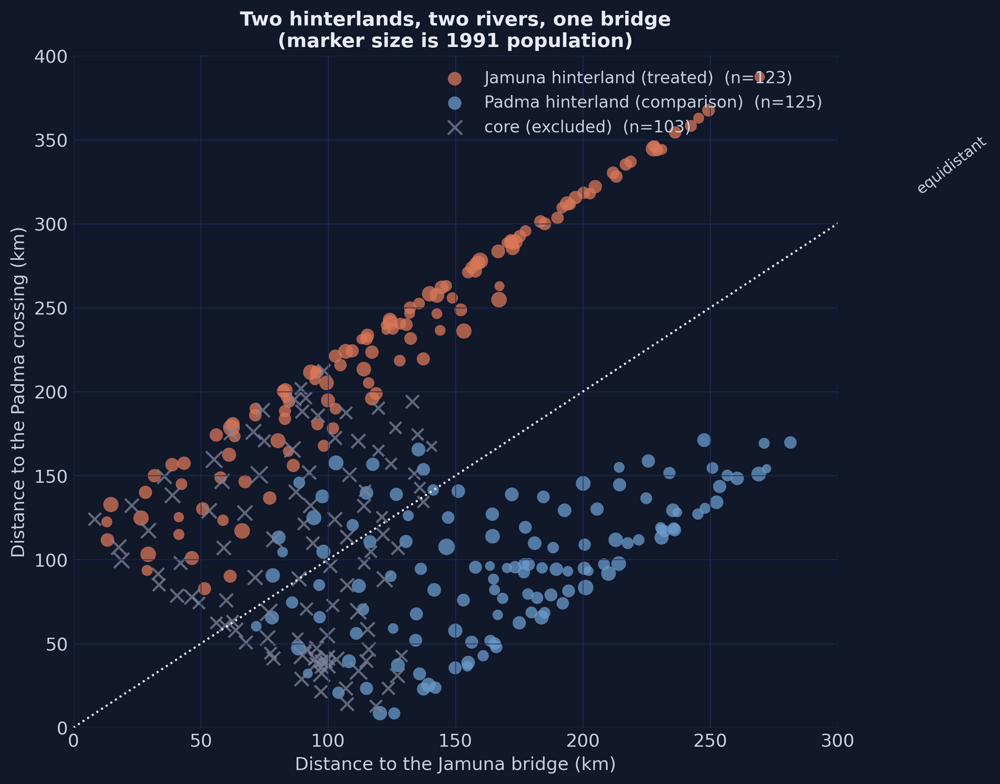

Plotting every upazila in "distance to Jamuna" by "distance to Padma" space reproduces the map
without needing a shapefile. The two hinterlands separate cleanly on either side of the
equidistance diagonal, and the excluded core sits away from both. Treated upazilas run from 8.4 km
to 269.5 km from the bridge foot; the comparison upazilas span the same range on the other river.
This is what makes the design credible: the Padma hinterland is not a generic control group, it is
the same kind of place with the same kind of river problem and no bridge.

### 2. Raw trends

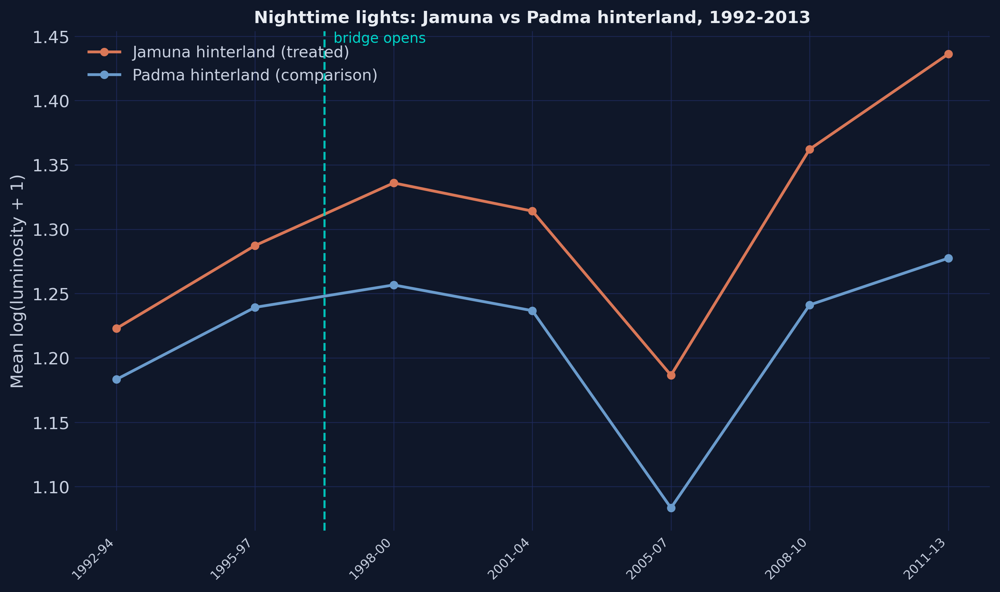

Before 1998 the two hinterlands track each other closely; afterwards the Jamuna line pulls away.
The raw gap is small in levels — luminosity is bottom-coded at 1.0 and most upazilas are dark — but
the divergence is monotone across all five post-bridge periods, which is the pattern a one-off
shock would not produce.

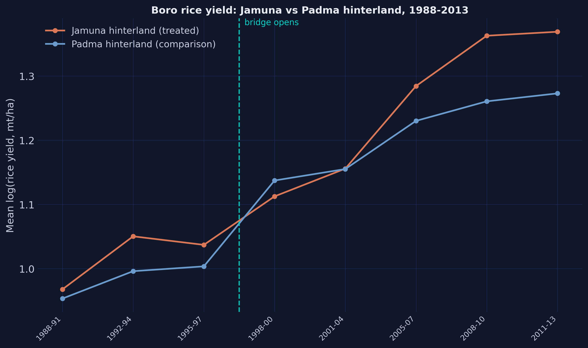

Rice yields rise everywhere in Bangladesh over this period — this is the Green Revolution's long
tail — so the raw treated series climbing is not evidence of anything. What matters is that the two
series climb together until the late 1990s and then separate, which is precisely what the
difference-in-differences subtraction is built to isolate.

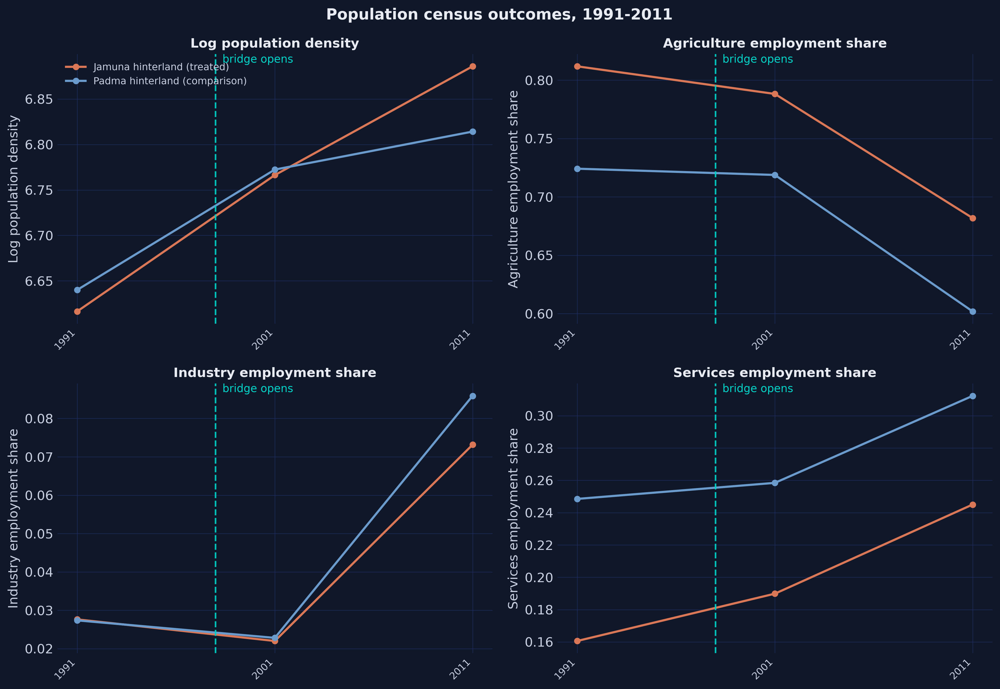

With only three census years the census panel is the thinnest of the four, and only one of those
years (1991) is pre-bridge. That single pre-period is why no pre-trend test is possible for
population density or the employment shares — a limitation the paper acknowledges and the
replication cannot repair.

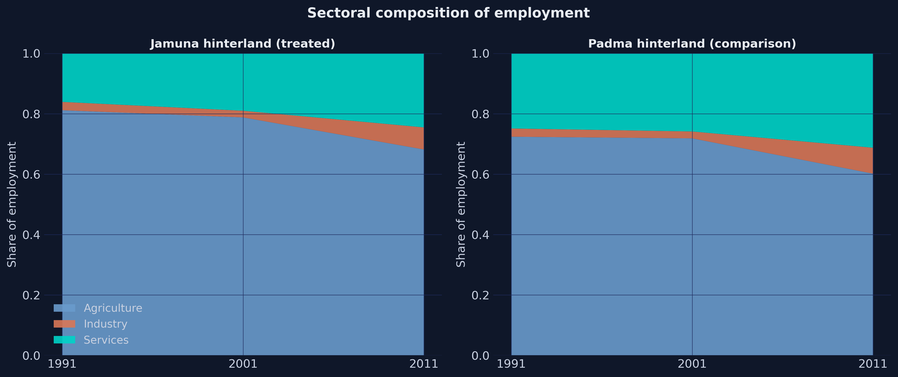

The structural transformation is visible in both regions: agriculture's share falls, services
rises. The DiD question is whether it happened *faster* in the Jamuna hinterland, and by how much.

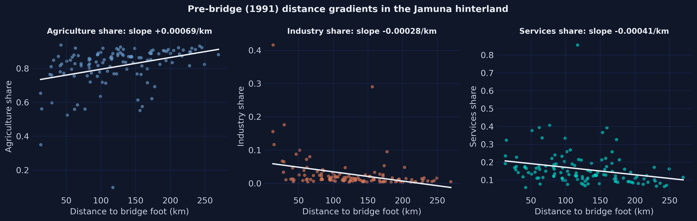

```text
  Pre-bridge gradients per km (treated upazilas, 1991):
    Agriculture empl. share      +0.000692
    Industry empl. share         -0.000278
    Services empl. share         -0.000414
    Log population density       -0.001864
```

This reproduces the paper's Appendix Figure AF.3 and supplies the "exposure" half of its spatial
argument. Before the bridge existed, the agriculture share rose by 0.069 percentage points per
kilometre of distance from the bridge foot, while manufacturing and services both fell. Remote
upazilas were more agricultural, so they had more to gain from a fall in the cost of shipping
agricultural output — which is why the effects later turn out to be largest at the far end of the
line, not the near end.

### 3. The canonical 2x2

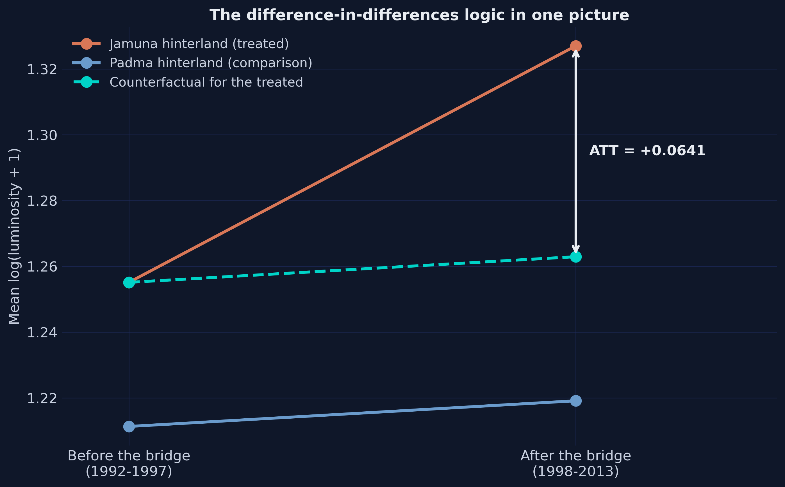

```text
  Group means of log(nightlights + 1):
    treated    pre 1.2551   post 1.3270   change +0.0719
    comparison pre 1.2113   post 1.2191   change +0.0078
    difference-in-differences = +0.0719 - (+0.0078) = +0.0641
```

Four group means and two subtractions give +0.0641 before any estimator is involved. The treated
hinterland brightened by 0.072 log points; the comparison hinterland by 0.008; the difference is
the estimate. Everything the rest of the analysis does — fixed effects, controls, reweighting — is
a refinement of this arithmetic, and it is worth noting that the fully-specified KOBDR estimate of
+0.109 is *larger* than the naive 2x2, not smaller.

### 4. The two doubly-robust weighting schemes

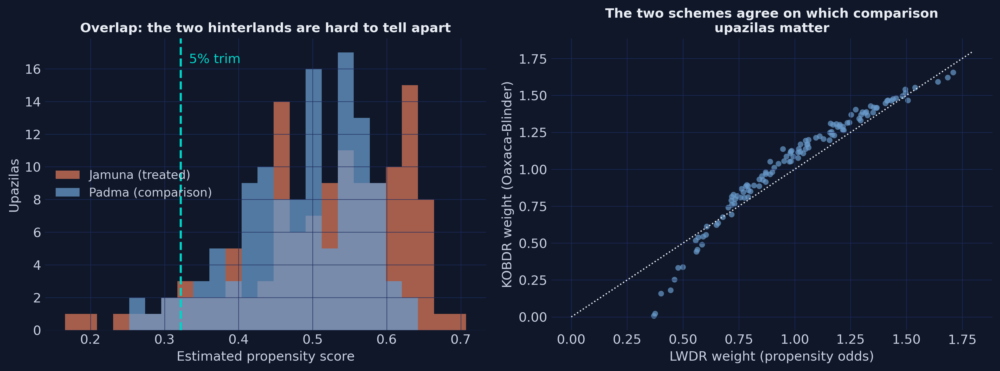

```text
  [nightlights] logit N=1743  coefs=[-7.206172  0.313503  0.741379]
  [nightlights] negative Oaxaca-Blinder weights: 35 obs dropped
  [nightlights] 5% propensity trim at p=0.2918769
  [employment] logit N=744  coefs=[-7.356198  0.323244  0.747624]
  [employment] 5% propensity trim at p=0.2884626
```

The logit coefficients match the archived Stata log to seven significant figures. Overlap is
excellent — the propensity distributions of the two hinterlands sit almost on top of each other,
with a median around 0.50 — which is the quantitative version of the paper's claim that the two
regions are hard to tell apart. The two weighting schemes correlate at 0.971 across comparison
upazilas, which is why the LWDR and KOBDR columns land within 0.003 of each other on the nightlights
and census panels. On the nine-cluster yield panel, where every estimate is noisier, they drift as
far apart as 0.009.

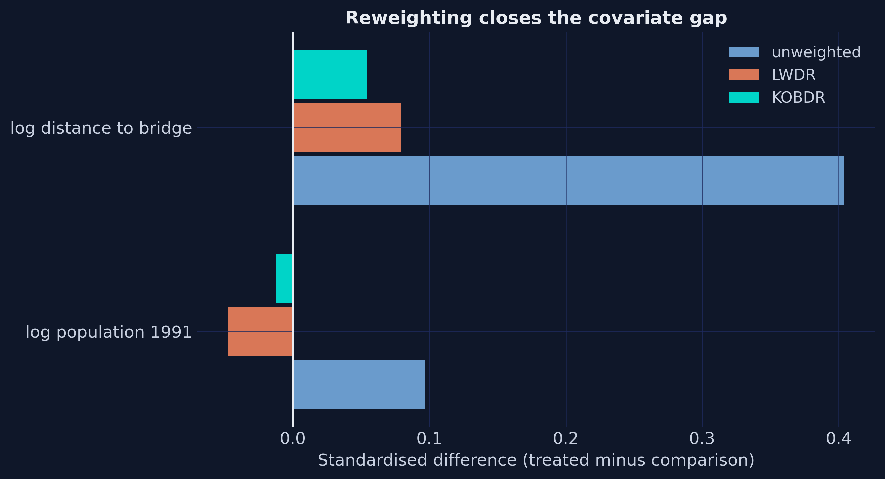

| Variable | Weighting | Treated mean | Comparison mean | Std. difference |
|---|---|---|---|---|
| log population 1991 | unweighted | 12.155 | 12.111 | +0.097 |
| log population 1991 | LWDR | 12.155 | 12.176 | −0.048 |
| log population 1991 | KOBDR | 12.155 | 12.161 | **−0.013** |
| log distance to bridge | unweighted | 4.687 | 4.452 | +0.404 |
| log distance to bridge | LWDR | 4.687 | 4.646 | +0.079 |
| log distance to bridge | KOBDR | 4.687 | 4.659 | **+0.054** |

This is the clearest evidence that the reweighting does what it claims. The distance covariate
starts badly imbalanced — a standardised difference of 0.40, well above the 0.10 rule of thumb —
because Jamuna upazilas sit systematically farther from their bridge foot than Padma upazilas do
from theirs. KOBDR reweighting cuts that to 0.054, and the population imbalance to 0.013. Both are
comfortably inside conventional balance thresholds after reweighting and outside them before.

### 5. Table 1 — mean effects

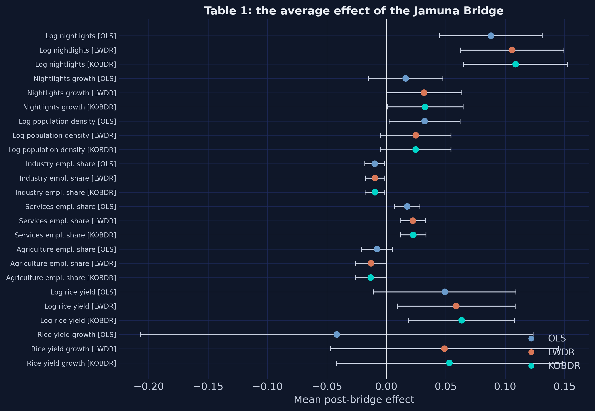

| Outcome | OLS | LWDR | KOBDR | N | Units |
|---|---|---|---|---|---|
| Log nightlights | 0.088 (0.022) | 0.106 (0.022) | **0.109 (0.022)** | 1673 | 239 |
| Nightlights growth | 0.016 (0.016) | 0.032 (0.016) | **0.033 (0.016)** | 1434 | 239 |
| Log population density | 0.032 (0.015) | 0.025 (0.015) | 0.025 (0.015) | 714 | 238 |
| Industry empl. share | −0.010 (0.004) | −0.009 (0.004) | **−0.010 (0.004)** | 714 | 238 |
| Services empl. share | 0.017 (0.006) | 0.022 (0.005) | **0.023 (0.005)** | 714 | 238 |
| Agriculture empl. share | −0.008 (0.007) | −0.013 (0.007) | **−0.013 (0.007)** | 714 | 238 |
| Log rice yield | 0.049 (0.031) | 0.059 (0.026) | **0.063 (0.023)** | 72 | 9 |
| Rice yield growth | −0.042 (0.085) | 0.049 (0.049) | 0.053 (0.049) | 63 | 9 |

Averaged over the whole post-bridge period, the bridge raised nighttime luminosity by 10.9 percent,
rice yields by 6.3 percent, and the services employment share by 2.3 percentage points, while the
industry share fell 1.0 percentage point and the agriculture share fell 1.3. The population density
effect of +2.5 percent is not distinguishable from zero (p = 0.10) — and that null is itself
important, because it is the average of a sign reversal that Table 2 exposes.

The manufacturing decline looks small in absolute terms but is not: the 1991 baseline industry
share in the treated hinterland was 2.8 percent, so a 1.0 percentage point fall removes roughly a
third of the sector.

### 6. Table 2 — short run versus long run

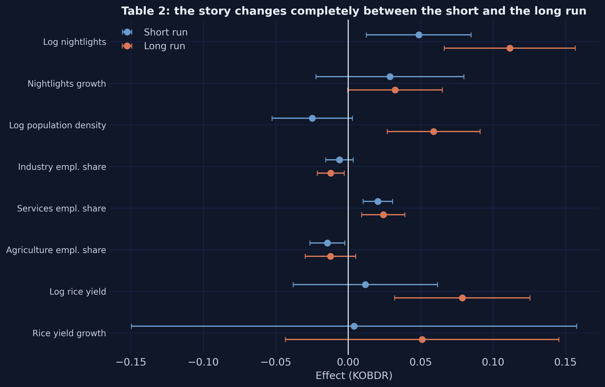

| Outcome | Short run (KOBDR) | Long run (KOBDR) |
|---|---|---|
| Log nightlights | 0.049 (0.018) | **0.112 (0.023)** |
| Nightlights growth | 0.029 (0.026) | 0.032 (0.017) |
| Log population density | **−0.025 (0.014)** | **+0.059 (0.016)** |
| Industry empl. share | −0.006 (0.005) | **−0.012 (0.005)** |
| Services empl. share | **0.020 (0.005)** | **0.024 (0.008)** |
| Agriculture empl. share | **−0.014 (0.006)** | −0.012 (0.009) |
| Log rice yield | 0.012 (0.025) | **0.079 (0.024)** |
| Rice yield growth | 0.004 (0.078) | 0.051 (0.048) |

This is the decisive table. Population density falls 2.5 percent in the short run and rises 5.9
percent in the long run — a sign reversal that the pooled mean effect in Table 1 averages into an
insignificant +2.5 percent. Rice yields do nothing at first (+1.2 percent, p = 0.64) and then rise
7.9 percent (p = 0.001), consistent with the paper's argument that fertiliser distribution networks
and farm credit take a decade to reorganise around a new road. Nightlights more than double their
effect, from +4.9 to +11.2 percent.

The long-run density result is what settles the theoretical question. Both the backwash story and
the comparative-advantage story predict falling manufacturing, so the industry coefficient alone
cannot separate them. They part company on people: backwash means the periphery is being emptied,
comparative advantage means it is specialising. Density rises, so the region is not being emptied.

### 7. Event studies

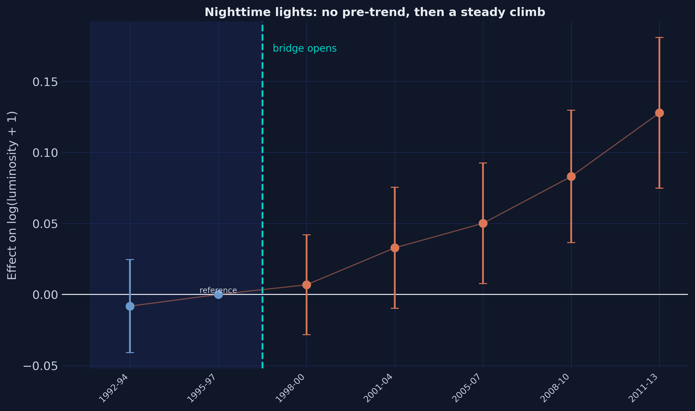

```text
 period   label  effect     se  is_post
      1 1992-94 -0.0082 0.0167    False
      2 1995-97  0.0000 0.0000    False
      3 1998-00  0.0068 0.0179     True
      4 2001-04  0.0328 0.0217     True
      5 2005-07  0.0501 0.0216     True
      6 2008-10  0.0831 0.0238     True
      7 2011-13  0.1279 0.0271     True
```

This is the single most persuasive figure in the analysis, and the paper never drew it. The one
available pre-bridge coefficient is −0.008 with a standard error of 0.017 — statistically
indistinguishable from zero, exactly what parallel trends requires. Then the effect climbs
monotonically across all five post-bridge periods, from +0.7 percent in 1998-2000 to +12.8 percent
in 2011-13. A confounder that produced this pattern would have to be absent before June 1998 and
then grow steadily for fifteen years.

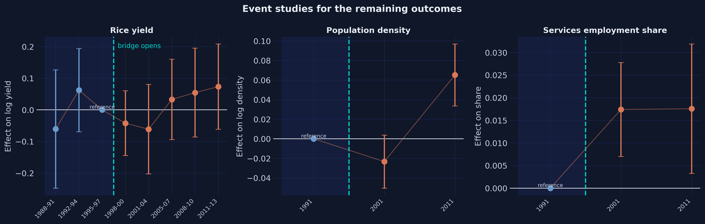

The yield event study is noisier and more instructive. Its two pre-bridge coefficients are −0.061
(0.095) and +0.062 (0.067) — both insignificant, but with standard errors so wide that the test has
very little power. With nine clusters, the yield panel simply cannot rule out much. The effect is
negative in the first two post periods and turns positive only from 2005-07, which is the delayed
response the paper describes.

### 8. Table 4 — spatial heterogeneity

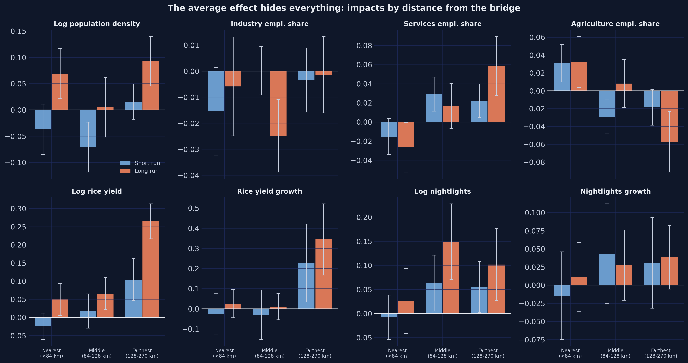

Long-run KOBDR effects by distance band:

| Outcome | Nearest (<84 km) | Middle (84-128 km) | Farthest (128-270 km) |
|---|---|---|---|
| Log rice yield | 0.049 (0.023) | 0.065 (0.022) | **0.265 (0.025)** |
| Rice yield growth | 0.025 (0.036) | 0.011 (0.034) | **0.344 (0.091)** |
| Log nightlights | 0.026 (0.034) | **0.149 (0.040)** | **0.102 (0.038)** |
| Log population density | **0.069 (0.024)** | 0.005 (0.029) | **0.093 (0.024)** |
| Industry empl. share | −0.006 (0.010) | **−0.025 (0.007)** | −0.001 (0.008) |
| Services empl. share | **−0.026 (0.013)** | 0.017 (0.012) | **0.059 (0.016)** |
| Agriculture empl. share | **0.032 (0.015)** | 0.008 (0.014) | **−0.057 (0.017)** |

The average effect hides a reversal. In the nearest band, labour moves *into* agriculture (+3.2
percentage points) and *out of* services (−2.6) — the opposite of the average. In the farthest band
it moves the other way and much harder: agriculture −5.7, services +5.9. Rice yields in the
farthest band rise 26.5 percent, four times the middle band's 6.5 percent and five times the
nearest band's 4.9 percent. The manufacturing decline is not spread evenly either: it concentrates
entirely in the middle band at −2.5 percentage points.

This is counterintuitive on its face — the upazilas nearest the bridge got the largest proportional
cut in travel time, roughly 40 percent, against about 17 percent at the far end. The resolution is
that trade responds to the *level* of the barrier, not the percentage change in it. Upazilas near
the bridge foot were already reasonably connected; the ferry was an inconvenience. Upazilas 250 km
out were close to autarky, where a modest proportional cut on an enormous base is still a very
large absolute cut.

### 9. Table 3 — the public-goods placebo

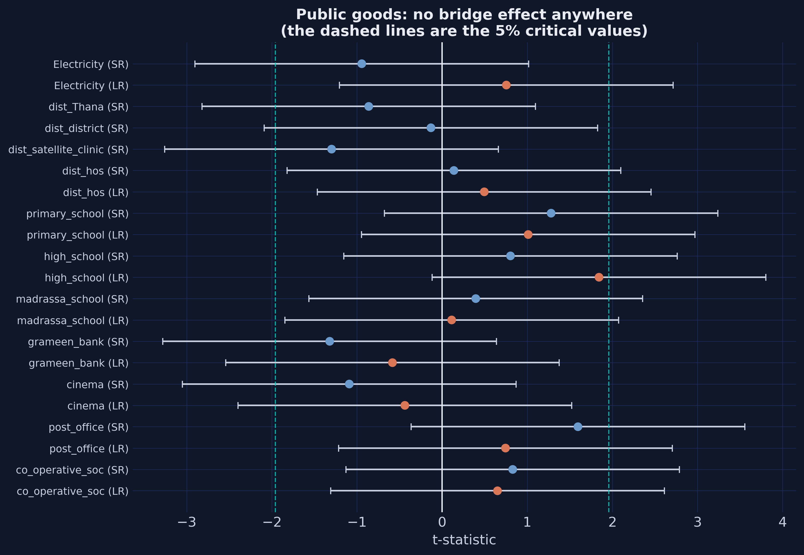

```text
  Public-goods outcomes significant at 5%: 0 of 21 estimates
```

The political-economy alternative explanation is that a prime minister with roots in the Jamuna
hinterland simply sent more schools, clinics and electricity there, and that the "bridge effect" is
really a public-spending effect. Twenty-one estimates across household electricity access and
eleven village-level infrastructure measures produce not one significant coefficient at the 5
percent level. The closest is the long-run distance to a high school at +0.535 (0.290, p = 0.065),
and it has the wrong sign for the story — it says schools got *farther* away in treated villages.

### 10. Balance and pre-trends

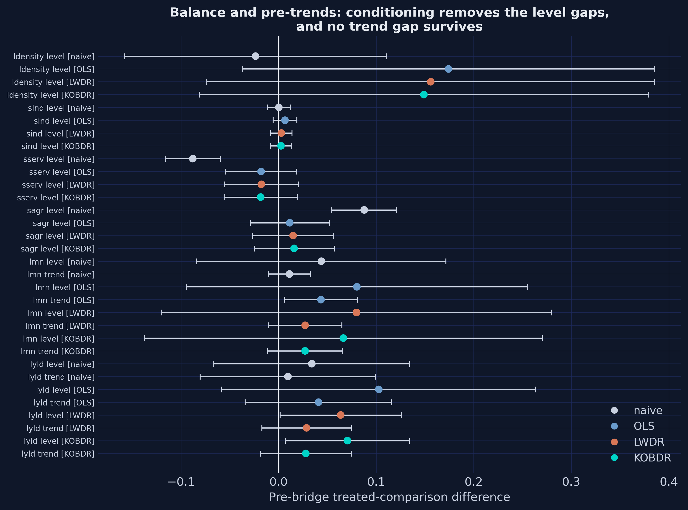

The naive pre-bridge differences in the services and agriculture shares are large and highly
significant (−0.088 and +0.088, both p < 0.001). Conditioning on log 1991 population, log distance
to the bridge, and the two rainfall controls collapses them to −0.018 (p = 0.33) and +0.011
(p = 0.58). This is the paper's stated justification for including those controls in every
specification, and the replication confirms it precisely: the level imbalance is real, and it is
entirely explained by observable initial conditions.

One trend difference is significant at 5 percent and should be stated plainly: the nightlights
trend under unweighted OLS, at +0.043 (0.019, p = 0.022). It does not survive the reweighting that
every headline specification uses — +0.027 (p = 0.16) under LWDR, +0.027 (p = 0.16) under KOBDR. No
trend difference is significant at 5 percent under either doubly-robust estimator, in any panel.

### 11. Diagnostics — parallel trends, placebo, sensitivity

```text
  check_parallel_trends (nightlights, 1992-97):
    trend_difference             0.00844
    trend_difference_se          0.09242
    p_value                      0.92725
    parallel_trends_plausible    True

  equivalence_test_trends:
    equivalence_margin           0.04019
    tost_p_value                 0.00107
    equivalent                   True

  placebo_timing_test (pretend the bridge opened in 1995-97, one period early):
    placebo effect = +0.00844 (se 0.01025), p = 0.4106, significant = False
    for comparison, the real effect is +0.06409 (se 0.01850)
```

Three separate tests point the same way. The pre-bridge trend difference is 0.008 against a
standard error of 0.092 — a p-value of 0.93. More useful than that null result is the equivalence
test, which *rejects* the hypothesis that the trends differ by more than the margin (p = 0.001);
absence of evidence and evidence of absence are different things, and here we have the second.
Moving the bridge one period earlier produces a placebo effect of +0.008 against the real +0.064.

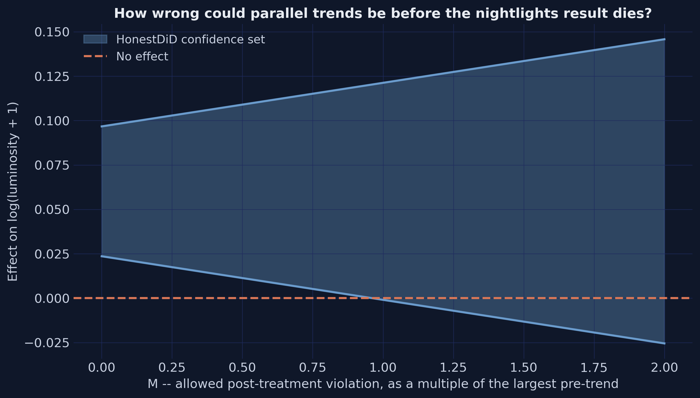

| M | Lower bound | Upper bound | Excludes zero |
|---|---|---|---|
| 0.00 | +0.024 | +0.097 | yes |
| 0.25 | +0.017 | +0.103 | yes |
| 0.50 | +0.011 | +0.109 | yes |
| 1.00 | −0.001 | +0.121 | no |
| 1.50 | −0.013 | +0.134 | no |
| 2.00 | −0.026 | +0.146 | no |

The Rambachan-Roth relative-magnitude bounds give a breakdown value just under M = 1. In words: the
post-bridge violation of parallel trends would have to be as large as the largest violation
observed *before* the bridge for the nightlights result to become inconclusive. That is a moderate
robustness margin, not a spectacular one — worth stating plainly rather than dressing up.

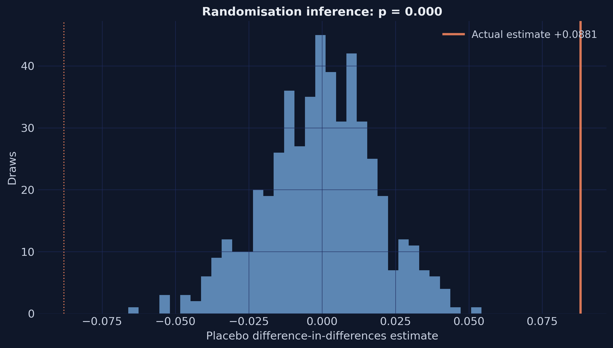

```text
  Randomisation inference over 500 placebo assignments:
    true estimate +0.0881; placebo |effect| >= |true| in 0.0% of draws
```

Reassigning treatment status randomly across the 247 upazilas 500 times and re-estimating produces
a null distribution centred on zero, and not one draw reaches the magnitude of the real estimate.
The randomisation-inference p-value is below 1/500.

### 12. Estimator agreement

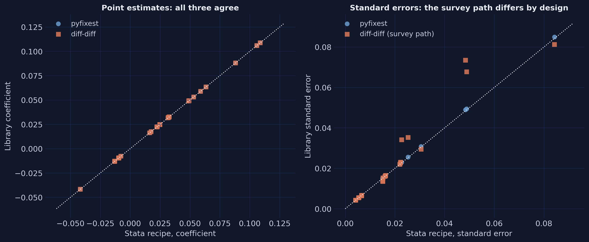

```text
  Largest coefficient disagreement across the three engines: 0.000000
  Largest standard-error disagreement: 0.024989
```

All three engines — `diff-diff`, `pyfixest`, and the hand-rolled Stata recipe — return the same
point estimate to nine decimal places on all 24 mean-effect specifications. Standard errors are a
different story, and an instructive one.

`pyfixest` matches the Stata recipe to within 0.0007 everywhere. `diff-diff` matches on the
unweighted specifications but diverges on the weighted ones, because supplying a `SurveyDesign`
switches it to a design-based Taylor-linearisation variance rather than the classical
cluster-robust sandwich. The ratio has a median of 0.999 but ranges from 0.891 to 1.516. The
extreme is the yield panel with nine clusters, where `diff-diff` returns 0.034 against Stata's
0.023 — a 50 percent larger, and arguably more honest, standard error. This is not a bug in either
tool; it is two defensible variance conventions disagreeing where the asymptotics are thinnest.

### 13. Forensics — reproducing the `$trimL` bug

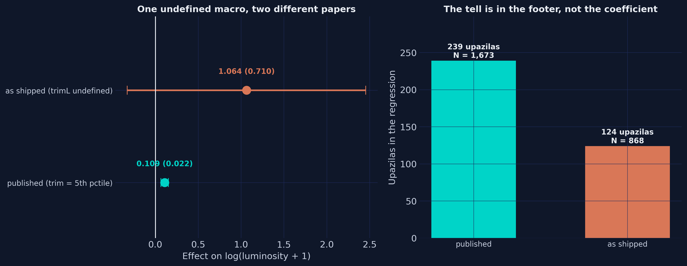

| Run | Outcome | Coefficient | SE | N | Upazilas |
|---|---|---|---|---|---|
| published (trim = 5th percentile) | `lmn` | 0.1088 | 0.0223 | 1673 | 239 |
| published (trim = 5th percentile) | `D_lmn` | 0.0326 | 0.0163 | 1434 | 239 |
| as shipped (`trimL` undefined) | `lmn` | **1.0636** | **0.7097** | 868 | **124** |
| as shipped (`trimL` undefined) | `D_lmn` | **−0.5193** | **0.2861** | 744 | **124** |

`employment_2021.do` sets `global trimL 5`. `nite_2021.do` never does, but still writes
`gen cut11 = r(p$trimL)`, which expands to the non-existent `r(p)`. Every value of `cut11` is
missing. The next line, `replace ipw4 = . if p < cut11 & treat == 0`, then fires for *every*
comparison upazila, because in Stata a missing value is larger than any number. The regression that
follows runs on treated upazilas only, and prints a coefficient of 1.064 without a single warning.

The reproduction lands on 1.0636 (0.7097) against the archived `nlite_mean.txt` value of 1.064
(0.710), on 868 observations and 124 upazilas — an exact match to the degenerate output. The
published paper carries the correct numbers from `nlite2_mean.txt`, so the bug never reached print;
it survives only in the shipped package. Every step in the chain is legal Stata and none of it warns.
The only tell is in the table footer: 124 upazilas where there should be 239.

### 14. Reproduction audit

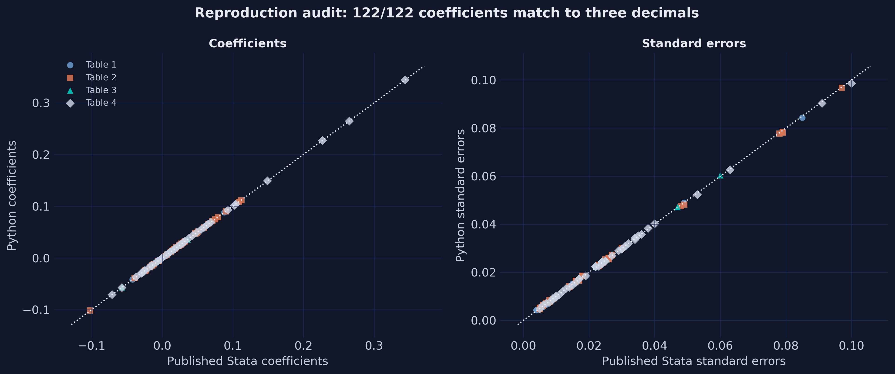

```text
  122 of 122 coefficients reproduce to the printed precision (100.0%)
  113 of 122 reproduce both the coefficient and the standard error (92.6%)
```

Every headline coefficient in Tables 1, 2, 3 and 4 reproduces. The largest absolute deviation across
all 122 cells is 0.0005, which is inside the half-unit-in-the-last-place tolerance implied by
three-decimal printing. The nine cells flagged "coef only" have standard errors that differ in the
third decimal by between 0.0006 and 0.0013 — all in the small-cluster yield panel and the two
nightlights growth specifications.

---

## Figure inventory

| # | File | Type | Shows |
|---|---|---|---|
| 01 | `python_bridge_impact_01_hinterland_geography.png` | scatter | Identification geometry in distance-to-each-bridge space |
| 02 | `python_bridge_impact_02_trends_nightlights.png` | line | Luminosity paths, treated vs comparison |
| 03 | `python_bridge_impact_03_trends_yield.png` | line | Rice yield paths |
| 04 | `python_bridge_impact_04_trends_census.png` | 2x2 line | Density and three employment shares |
| 05 | `python_bridge_impact_05_sectoral_composition.png` | stacked area | Sectoral composition by region |
| 06 | `python_bridge_impact_06_pre_bridge_distance_gradient.png` | scatter + fit | Pre-bridge distance gradients (Appendix AF.3) |
| 07 | `python_bridge_impact_07_did_2x2.png` | line + annotation | The 2x2 logic with counterfactual |
| 08 | `python_bridge_impact_08_propensity_and_weights.png` | histogram + scatter | Propensity overlap, trim line, weight comparison |
| 09 | `python_bridge_impact_09_covariate_balance.png` | grouped bar | Standardised differences before and after weighting |
| 10 | `python_bridge_impact_10_event_study_nightlights.png` | event study | Period-by-period nightlights effects |
| 11 | `python_bridge_impact_11_event_study_others.png` | 3-panel event study | Yield, density, services |
| 12 | `python_bridge_impact_12_heterogeneity_by_distance.png` | 8-panel bar | Table 4 by distance tercile |
| 13 | `python_bridge_impact_13_public_goods_placebo.png` | forest | Public-goods t-statistics |
| 14 | `python_bridge_impact_14_balance_pretrends.png` | forest | Balance and pre-trend estimates |
| 15 | `python_bridge_impact_15_honest_did_sensitivity.png` | band | HonestDiD bounds vs M |
| 16 | `python_bridge_impact_16_randomization_inference.png` | histogram | Placebo null distribution |
| 17 | `python_bridge_impact_17_estimator_agreement.png` | 2-panel scatter | Three engines, coefficients and SEs |
| 18 | `python_bridge_impact_18_trimL_forensics.png` | 2-panel | The degenerate run vs the published run |
| 19 | `python_bridge_impact_19_reproduction_audit.png` | 2-panel scatter | Python vs published, 122 cells |
| 20 | `python_bridge_impact_20_forest_table1.png` | forest | Table 1 mean effects |
| 21 | `python_bridge_impact_21_forest_table2.png` | forest | Table 2 short run vs long run |

---

## Key findings

1. **The full replication succeeds.** 122 of 122 published coefficients reproduce to three decimals;
   113 also reproduce the standard error. Maximum coefficient deviation 0.0005.

2. **The bridge raised economic activity substantially.** Nighttime lights +10.9 percent, rice
   yields +6.3 percent, services employment share +2.3 percentage points, all under the paper's
   preferred KOBDR estimator.

3. **Manufacturing fell but the region did not empty out.** The industry share dropped 1.2
   percentage points in the long run — over 40 percent of a 2.8 percent baseline — while population
   density *rose* 5.9 percent. Backwash requires both to fall; only one did.

4. **Short and long run tell opposite stories about people.** Population density is −2.5 percent
   (p = 0.08) in the short run and +5.9 percent (p = 0.0003) in the long run. The pooled mean effect
   of +2.5 percent (p = 0.10) averages a genuine sign reversal into an uninformative null.

5. **The productivity response is delayed by roughly a decade.** Rice yields are +1.2 percent
   (p = 0.64) in the short run and +7.9 percent (p = 0.001) in the long run.

6. **The gains concentrate at the far end of the line, not near the bridge.** Long-run rice yields
   rise 26.5 percent in the farthest distance band against 6.5 percent in the middle and 4.9 percent
   nearest. Services employment rises 5.9 points farthest and *falls* 2.6 points nearest.

7. **The event study shows no pre-trend and a monotone ramp.** The pre-bridge coefficient is −0.008
   (0.017); post-bridge effects climb 0.007 → 0.033 → 0.050 → 0.083 → 0.128 across five periods.

8. **The political-economy confound finds no support.** Zero of 21 public-goods estimates are
   significant at 5 percent.

9. **Reweighting materially improves balance.** The standardised difference on log distance to the
   bridge falls from 0.404 unweighted to 0.054 under KOBDR — from clearly imbalanced to clearly
   balanced.

10. **Robustness is real but not unlimited.** HonestDiD breaks down just under M = 1, meaning the
    post-treatment violation would have to match the largest pre-treatment violation to overturn the
    nightlights result.

11. **Three engines, one answer.** `diff-diff`, `pyfixest` and the Stata recipe agree on every point
    estimate to 1.1e-09. Standard errors diverge only where `diff-diff`'s survey path substitutes a
    design-based variance, most visibly on the nine-cluster yield panel (0.034 vs 0.023).

12. **A bug in the shipped package is fully reproducible.** The undefined `$trimL` macro in
    `nite_2021.do` yields 1.064 (0.710) on 124 treated-only upazilas, matching the archived
    `nlite_mean.txt` exactly. The published paper uses the correct `nlite2_*` numbers.

---

## Surprises and caveats

**1. Estimator non-determinism.** Only one component is stochastic: the 500-draw randomisation
inference in Section 12, seeded with `RANDOM_SEED = 42` via `np.random.default_rng`. Re-running with
a different seed changes the null histogram but not the conclusion, since zero of 500 draws come
close to the observed estimate. Everything else — logits, weights, all regressions, HonestDiD — is
deterministic.

**2. Sample reductions from adjustment.** These are large and must be stated. The nightlights panel
goes 2513 rows → 1764 in the `smp1` estimation sample → 1729 after dropping upazilas with missing
1991 population or zero rainfall variance → 1673 after the 5 percent propensity trim and the removal
of negative Oaxaca-Blinder weights, i.e. 247 → 239 upazilas. The employment panel goes 1053 → 744 →
738 → 714, i.e. 248 → 246 → 238 upazilas. The yield panel loses two of eleven districts (Faridpur
and Patuakhali) to negative OB weights, leaving nine. Every one of these matches the published
footnotes, but the yield result in particular rests on nine clusters.

**3. Weighting and aggregation choices that move the headline.** Several, all documented. The
outcome is `ln(mn + 1)`, and the choice of the additive constant matters because luminosity is
bottom-coded at 1.0. The yield panel uses *untrimmed* weights (`ipw1`/`ipw2`) while employment and
nightlights use trimmed ones (`ipw3`/`ipw4`) — the do-files differ and the replication follows them.
The nightlights heterogeneity specification includes year dummies while the employment and yield
ones do not; again the do-files differ. Most subtly, `nite_2021.do` computes its distance terciles
*before* dropping rows with missing controls while `employment_2021.do` drops first: getting that
order wrong moves every nightlights heterogeneity coefficient in the third decimal, and it was the
last discrepancy resolved in this replication.

**4. Effect concentration.** Substantial, and it is the paper's own finding rather than an artefact.
The long-run rice yield effect is dominated by the farthest distance band (+26.5 percent against
+6.5 and +4.9). The long-run manufacturing decline sits entirely in the middle band (−2.5 points,
against −0.6 and −0.1). At the estimator level, the KOBDR weights are not uniform across comparison
upazilas, so the effective comparison sample is smaller than the nominal 115; the concentration is
mild here because the two hinterlands overlap so well, but it is real.

**5. Cosmetic warnings.** `diff-diff` emits `aweight weights normalized to mean=1` on every weighted
fit. This is informational and matches Stata's own behaviour. Collinear regressors are dropped
silently by design in `stata_fe`, mirroring Stata's "omitted because of collinearity" — the
heterogeneity specifications deliberately include terms that are collinear with the fixed effects
(`treat`) or with the year dummies, and dropping them is correct, not a failure.

**6. Identification assumptions in force.** Parallel trends is the central one and is untestable in
principle; the event study, the equivalence test and the HonestDiD bounds make it more or less
plausible but cannot establish it. No-anticipation is assumed: construction began in February 1994,
inside the nightlights pre-period, so any investment response between 1994 and 1998 would bias the
pre-period and attenuate the estimates. SUTVA is the weakest link, and the paper says so: if the
long-run density and luminosity gains partly reflect out-migration *from* the Padma hinterland, the
comparison group is contaminated downward and the estimates are upper bounds. Note that this does
not rescue the backwash story, which requires the *treated* region to lose people. Finally, the
census outcomes have exactly one pre-bridge observation, so no pre-trend test is possible for
population density or the employment shares — only a level-balance test.

**7. Pedagogical framing and the paper's own disclaimers.** The authors explicitly flag three limits
that the replication inherits and cannot fix. They state that the estimates are likely upper bounds
because of displacement. They note that the comparative-advantage evidence underpinning their
preferred interpretation is not in the paper ("details available from the authors"). And they warn
in a footnote against using areas adjacent to a bridge as treatment and comparison, since those may
already have been integrated — a caution about generalising this design, not about this estimate.
Beyond that, three items in the published article are demonstrably misaligned with the shipped
output: Table 3's coefficient column is shifted one row down from "Hospitals" onward relative to
`did_vill.txt`; the text in section 8.1.2 says long-run yield gains peak at intermediate distance
while Table 4 shows the farthest band dominating; and section 7.3 describes an estimate as
"statistically significant" where the surrounding argument requires the opposite. None of these
changes a conclusion, and all of them are only knowable because the authors published a complete
package.

---

## Appendix — Reproduction audit (Blankespoor, Emran, Shilpi & Xu 2021)

Benchmarks are the authors' own Stata output in `referenceMaterials/empirics/results/`, which is
what the published tables were built from. Full 122-row detail in
`python_bridge_impact_audit_reproduction.csv`.

| Table | Our value | Published value | Source file | Notes |
|---|---|---|---|---|
| T1 nightlights, KOBDR | 0.1088 (0.0223) | 0.109 (0.022) | `nlite2_mean.txt` col 3 | exact |
| T1 employment `sserv`, KOBDR | 0.0227 (0.0054) | 0.023 (0.005) | `Employment_mean.txt` col 9 | exact |
| T1 employment `ldensity`, OLS | 0.0322 (0.0152) | 0.032 (0.015) | `Employment_mean.txt` col 1 | exact |
| T1 yield `lyld`, KOBDR | 0.0634 (0.0227) | 0.063 (0.023) | `Yield_mean.txt` col 3 | exact |
| T2 `ldensity` SR / LR, KOBDR | −0.0248 (0.0142) / 0.0590 (0.0164) | −0.025 (0.014) / 0.059 (0.016) | `Employment_LRSR.txt` col 3 | exact |
| T2 nightlights SR / LR, KOBDR | 0.0487 (0.0185) / 0.1115 (0.0231) | 0.049 (0.018) / 0.112 (0.023) | `nlite2_LRSR.txt` col 3 | exact |
| T2 yield LR, KOBDR | 0.0787 (0.0238) | 0.079 (0.024) | `Yield_LRSR.txt` col 3 | exact |
| T3 electricity SR / LR | −0.0569 (0.0602) / 0.0356 (0.0470) | −0.057 (0.060) / 0.036 (0.047) | `did_hh.txt` col 1 | exact |
| T4 yield LR farthest | 0.2646 (0.0246) | 0.265 (0.025) | `Yield_het.txt` col 1 | exact |
| T4 `sagr` LR farthest | −0.0573 (0.0173) | −0.057 (0.017) | `Employment_het.txt` col 4 | exact |
| T4 nightlights LR middle | 0.1490 (0.0401) | 0.149 (0.040) | `nlite2_het.txt` col 1 | exact after fixing tercile timing |
| Degenerate nightlights run | 1.0636 (0.7097), N=868, G=124 | 1.064 (0.710), N=868, G=124 | `nlite_mean.txt` col 2-3 | exact; not the published numbers |
| Balance `sserv` naive | −0.0879 (0.0143) | −0.088 (0.014) | `Pretreatment1_Employment.txt` col 9 | exact |
| Balance `sagr` conditional | 0.0114 (0.0207) | 0.011 (0.021) | `Pretreatment1_Employment.txt` col 14 | exact |

Two published-table issues found while auditing, both traceable to `results/did_vill.txt`:

- Published Table 3's coefficient column is shifted one row down from "Hospitals" onward. The
  printed "Cooperatives" short-run value of 0.420 (0.263) is in fact `post_office`; the true
  `co_operative_soc` short-run estimate is 0.090 (0.108). The N column follows the correct row
  labels, so the misalignment is visible by comparing the two. No conclusion changes: every estimate
  in the block is insignificant either way.
- Published Table AT.2's standard-error column is shifted by one cell for the Primary School and
  High School rows.
