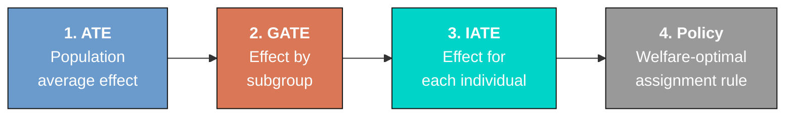
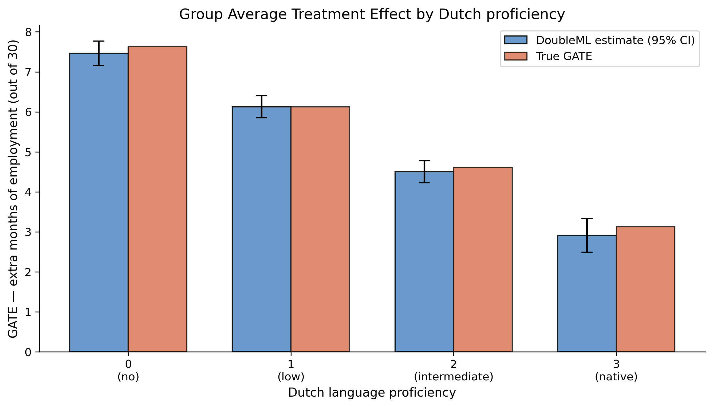
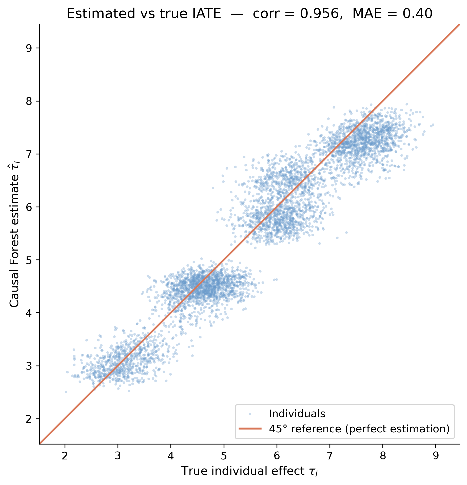
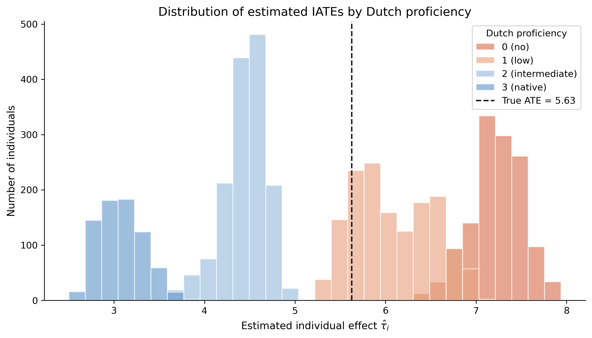
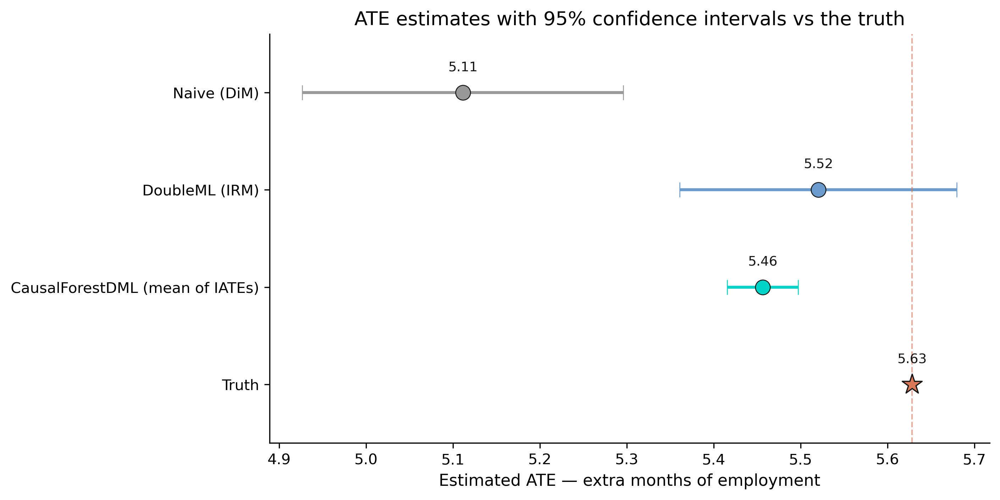
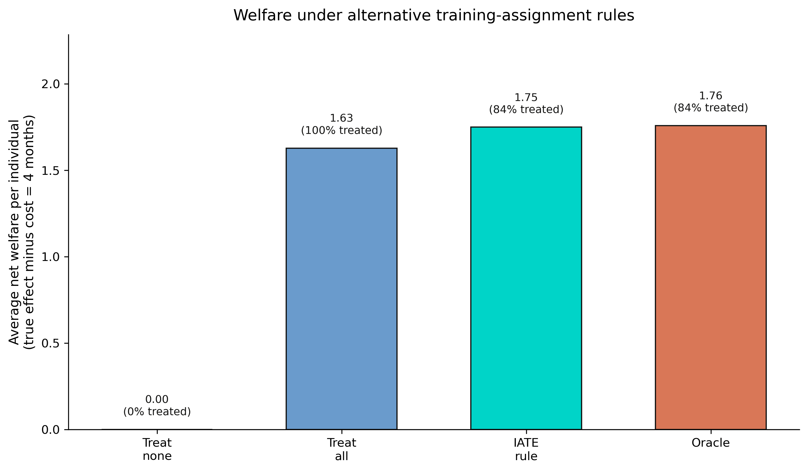

---
authors:
  - admin
categories:
  - Python
  - Causal Inference
  - Causal Machine Learning
  - Policy Evaluation
date: "2026-05-01T00:00:00Z"
draft: false
featured: false
external_link: ""
image:
  caption: ""
  focal_point: Smart
  placement: 3
links:
  - icon: open-data
    icon_pack: ai
    name: "[Python] Google Colab"
    url: https://colab.research.google.com/github/cmg777/starter-academic-v501/blob/master/content/post/python_cml/notebook.ipynb
  - icon: code
    icon_pack: fas
    name: "Python script"
    url: script.py
  - icon: book
    icon_pack: fas
    name: "Jupyter notebook"
    url: notebook.ipynb
slides:
summary: "A beginner-friendly walk-through of Causal Machine Learning — ATE, GATE, IATE, and welfare-maximising assignment — using DoubleML and EconML on a synthetic Flanders ALMP-style cohort with known true effects."
tags:
  - python
  - causal
  - causal machine learning
  - doubleml
  - econml
  - policy evaluation
title: "Causal Machine Learning for Policy Evaluation: From ATE to IATE to a Better Assignment Rule"
url_code: ""
url_pdf: ""
url_slides: ""
url_video: ""
toc: true
diagram: true
---

## Overview

A government runs a job-training programme for unemployed jobseekers and wants to know three things at once. Does the programme actually *cause* people to spend more months in employment over the next two and a half years? Does the effect depend on who the jobseeker is — for example, on how well they speak the local language? And if effects differ across people, can we use those differences to send training to the *right* jobseekers, rather than to everyone or to no one? These three questions correspond to three causal estimands — the **ATE**, the **GATE**, and the **IATE** — and answering them is the bread-and-butter of **Causal Machine Learning (CML)**.

CML combines two ideas. From causal inference, it borrows the careful framing of treatment effects under unconfoundedness and the doubly-robust scoring functions that protect against modelling mistakes. From machine learning, it borrows flexible nuisance estimators — random forests, gradient-boosted trees, neural nets — that learn complicated outcome surfaces without forcing the analyst to specify them by hand. The result is a small toolbox — DoubleML for the average effect, doubly-robust averaging for subgroup effects, causal forests for individual effects — that turns observational data into actionable, *personalised* policy recommendations. This tutorial walks through the full toolbox on a synthetic Flemish-ALMP-style cohort of 5,000 jobseekers, modelled on the empirical case study in [Cockx, Lechner & Bollens (2023)](https://doi.org/10.1016/j.labeco.2023.102306) and the methodological roadmap in [Lechner (2023)](https://doi.org/10.1186/s41937-023-00113-y). Because the data are synthetic, the *true* treatment effects are known — so every estimator can be benchmarked against the truth.

## The CML roadmap

CML organises a treatment-effect study into a sequence of progressively finer questions. The diagram below shows the four-step roadmap that this tutorial follows: estimate the *average* effect, then break it down into *group* effects, then go all the way to *individual* effects, and finally turn those individual effects into a *policy*.



The arrows are not just decorative. Each step *builds* on the previous one: a credible average effect is the floor on which any subgroup analysis stands, and credible group effects are the floor on which any individual analysis stands. Skipping the first step and jumping straight to a fancy heterogeneity model is the most common mistake in applied CML. We will resist that temptation by starting from the simplest possible baseline and only adding complexity when the data warrant it.

**Learning objectives:**

- **Distinguish** the three CML estimands — ATE, GATE, IATE — and write each as a formal expectation.
- **Diagnose** covariate overlap and explain why selection-on-observables matters in observational data.
- **Estimate** the population-average effect with `DoubleMLIRM`, using random-forest nuisances and 5-fold cross-fitting.
- **Estimate** group effects via doubly-robust pseudo-outcomes and individual effects via `CausalForestDML`.
- **Translate** the individual-level effect estimates into a welfare-maximising training-assignment rule and benchmark it against treat-all and an oracle.

## Key concepts at a glance

The post leans on a small vocabulary repeatedly. The rest of the tutorial assumes you can move between these terms quickly. Each concept below has three parts. The **definition** is always visible. The **example** and **analogy** sit behind clickable cards: open them when you need them, leave them collapsed for a quick scan. If a later section mentions "IATE" or "welfare-maximising rule" and the term feels slippery, this is the section to re-read.

**1. Potential outcomes** $Y\_i(d)$.
The outcome unit $i$ would have under treatment value $d \in \\{0, 1\\}$. Each unit has two potential outcomes. We observe only one. The other is *counterfactual*. It belongs to a world we never see.

<div class="concept-pair">
<details class="concept-card concept-example">
<summary>Example</summary>

For unemployed worker 7421 with `D = 1` (received training), we observe `Y` = 22 months employed. Their counterfactual $Y\_{7421}(0)$ — the months they would have worked without training — is forever invisible. Causal inference reconstructs it from comparable untrained workers.

</details>

<details class="concept-card concept-analogy">
<summary>Analogy</summary>

Every life decision is a fork in the road. You took one fork. The parallel-universe versions of you took the other. Their lives are real conceptual objects you cannot directly observe.

</details>
</div>

**2. ATE** --- Average Treatment Effect, $E[Y(1) - Y(0)]$.
The mean causal effect across everyone in the population. Headline policy number. It answers a single question: if we trained everyone, what would the average bump in employment be?

<div class="concept-pair">
<details class="concept-card concept-example">
<summary>Example</summary>

The naive ATE is 5.111 months. The DoubleML estimate is 5.520. The simulation's ground truth is 5.628. DoubleML closes 92% of the bias the naive estimator carries. The true ATE is the target; DoubleML is the engine.

</details>

<details class="concept-card concept-analogy">
<summary>Analogy</summary>

"This drug lowers cholesterol by 12 points on average." Single number, suitable for a press release. Says nothing about who responds best.

</details>
</div>

**3. GATE** --- Group Average Treatment Effect, $E[Y(1) - Y(0) \mid Z = z]$.
The CATE averaged over a *pre-specified* subgroup defined by $Z$. GATEs surface heterogeneity along axes you name in advance.

<div class="concept-pair">
<details class="concept-card concept-example">
<summary>Example</summary>

Sort workers by `dutch_prof` (1=lowest, 4=highest). The GATEs are 7.47, 6.13, 4.50, 2.91 months. Workers with the weakest Dutch benefit most. The training compensates for a labour-market handicap.

</details>

<details class="concept-card concept-analogy">
<summary>Analogy</summary>

A nationwide marketing campaign lifts sales 5% on average. Before scaling up, you ask: did it work better in cities than in rural towns? GATE answers exactly that.

</details>
</div>

**4. IATE** --- Individual Average Treatment Effect, $\tau(\mathbf{x})$.
The treatment effect *as a function* of the full covariate vector. One per unit. Estimated by Causal Forest DML in this post. The IATE is the input to a personalized assignment rule.

<div class="concept-pair">
<details class="concept-card concept-example">
<summary>Example</summary>

The Causal Forest produces 4,000 IATEs, one per worker. Mean `\hat\tau` = 5.456 months. Mean absolute error against truth = 0.40 months. The IATEs feed Step 5's welfare rule.

</details>

<details class="concept-card concept-analogy">
<summary>Analogy</summary>

A drug's "average effect" is a 5-point reduction in blood pressure. But a doctor cares about a specific patient — maybe a 65-year-old male with diabetes. The IATE is that personalized effect.

</details>
</div>

**5. Propensity score and overlap** $\pi(\mathbf{x})$.
The probability of treatment given covariates. *Overlap* requires that $\pi(\mathbf{x})$ is bounded away from 0 and 1 for the kinds of units we want to compare. Without overlap there is no counterfactual to estimate from.

<div class="concept-pair">
<details class="concept-card concept-example">
<summary>Example</summary>

Step 1 of the tutorial plots $\hat\pi$ for treated and untreated workers. Densities overlap across most of the support but thin out at the tails. The overlap diagnostic is the *first* check before any DR estimator runs.

</details>

<details class="concept-card concept-analogy">
<summary>Analogy</summary>

Casino's odds for the next card. We never see the casino's algorithm directly; we estimate it from many deals. Overlap is the rule that the deck must contain enough cards of every relevant kind.

</details>
</div>

**6. Cross-fitting** (K-fold sample-splitting).
Split the data into $K$ folds. Train nuisances on $K-1$ folds; predict on the held-out fold; rotate. The DoubleML library uses 5 folds by default and rotates internally.

<div class="concept-pair">
<details class="concept-card concept-example">
<summary>Example</summary>

`DoubleMLIRM` in Step 3 runs 5-fold cross-fitting on random-forest nuisances. We never invoke train/test splits ourselves; the library wraps the rotation. The orthogonal score is computed on out-of-fold residuals.

</details>

<details class="concept-card concept-analogy">
<summary>Analogy</summary>

Two-pass exam grading. One TA writes the rubric, a different TA applies it. The separation is what makes the grade defensible.

</details>
</div>

**7. Causal forest.**
A random forest adapted for causal estimation. Built honestly: one subsample chooses splits, a different subsample estimates leaf values. Each leaf approximates a local CATE. Aggregating across trees gives the IATE function.

<div class="concept-pair">
<details class="concept-card concept-example">
<summary>Example</summary>

Step 5 uses `CausalForestDML` from EconML with 1,000 honest trees. The IATE function it returns is what powers Step 6's assignment rule. Variable importance flags `dutch_prof` and `prior_emp_months` as the strongest moderators.

</details>

<details class="concept-card concept-analogy">
<summary>Analogy</summary>

A panel of judges, each on a slightly different jury. Each judge votes a verdict for the case in front of them. Average the verdicts to get the panel's call. Honesty ensures no judge writes the rubric they then enforce.

</details>
</div>

**8. Welfare-maximising assignment rule.**
A policy that treats units with $\hat\tau\_i > 0$ and skips those with $\hat\tau\_i \le 0$. Maximises predicted welfare given the IATE estimates. Benchmarked against *treat-all* and an *oracle* rule.

<div class="concept-pair">
<details class="concept-card concept-example">
<summary>Example</summary>

Step 6 evaluates three rules on a held-out sample. Treating everyone yields 5.520 months/person. The IATE rule yields 1.749 — much lower because most workers have positive but small effects. The oracle (using true $\tau$) yields a similar number, suggesting the IATE rule is near-optimal under the simulation's structure.

</details>

<details class="concept-card concept-analogy">
<summary>Analogy</summary>

Giving training tickets only to people who would actually use them. Treat-all sends tickets to everyone. The IATE rule keeps tickets for the responders. The oracle is the rule a perfect-information planner would use.

</details>
</div>

## Setup and imports

Before running anything, install the two CML libraries this tutorial depends on. `doubleml` provides the cross-fitted, orthogonal-score machinery for averages; `econml` provides the causal forest for individual effects.

```python
pip install doubleml econml  # https://docs.doubleml.org  https://econml.azurewebsites.net
```

The next block imports the stack and fixes the random seed. Setting `np.random.seed(RANDOM_SEED)` is *not* dead code: DoubleML's internal cross-fit splitter uses the legacy global numpy RNG, so removing this line causes the ATE to drift by O(1e-3) across runs.

```python
import warnings
import numpy as np
import pandas as pd
import matplotlib.pyplot as plt

from sklearn.ensemble import RandomForestRegressor, RandomForestClassifier
from sklearn.linear_model import LogisticRegression

from doubleml import DoubleMLData, DoubleMLIRM
from econml.dml import CausalForestDML

# Silence only the predictable noise from the third-party CML stack;
# real deprecation / convergence warnings still surface.
warnings.filterwarnings("ignore", category=FutureWarning)
warnings.filterwarnings("ignore", category=UserWarning)

RANDOM_SEED = 42
np.random.seed(RANDOM_SEED)

X_COLS = ["age", "edu_years", "prior_emp_months", "dutch_prof", "female", "migrant"]
```

The two CSVs read in the next section (`cml_data.csv` for the observed columns and `cml_truth.csv` for the hidden ground truth) ship with this post's page bundle. If you're following along outside the bundle, you can regenerate them by running [`script.py`](script.py) once — it produces both files plus all six figures.

## Data: a synthetic ALMP cohort

The dataset is a synthetic Flemish-ALMP-style cohort of 5,000 jobseekers. Each row records six pre-treatment covariates ($X$) — age, years of education, months employed in the look-back window, Dutch proficiency on a 0–3 scale, sex, and migrant status — a binary treatment indicator $D$ (whether the jobseeker received training), and an outcome $Y$ measuring months employed during a 30-month follow-up window. Because the data are synthetic, a companion file (`cml_truth.csv`) stores the *true* individual treatment effect $\tau\_i$ for every row, which lets us benchmark each estimator. The reader does not need to know how the data were generated; only that the truth is known.

```python
df    = pd.read_csv("cml_data.csv")
truth = pd.read_csv("cml_truth.csv")

print(f"Sample size            : {len(df):,}")
print(f"Treatment share P(D=1) : {df['D'].mean():.3f}")
print(f"Mean outcome E[Y]      : {df['Y'].mean():.2f} months employed (out of 30)")
print(df.describe().round(2))
```

```text
Sample size            : 5,000
Treatment share P(D=1) : 0.528
Mean outcome E[Y]      : 22.68 months employed (out of 30)

           age  edu_years  prior_emp_months  dutch_prof   female  migrant        D       Y
count  5000.00    5000.00           5000.00     5000.00  5000.00  5000.00  5000.00 5000.00
mean     39.82      12.02             16.99        1.33     0.49     0.30     0.53   22.68
std      11.54       2.95              9.59        1.02     0.50     0.46     0.50    4.18
min      20.02       6.00              0.37        0.00     0.00     0.00     0.00    9.81
25%      29.78      10.01              9.49        0.00     0.00     0.00     0.00   19.73
50%      39.68      11.94             15.80        1.00     0.00     0.00     1.00   22.81
75%      49.95      14.01             23.33        2.00     1.00     1.00     1.00   25.79
max      59.99      20.00             54.75        3.00     1.00     1.00     1.00   30.00
```

The cohort is 5,000 jobseekers aged 20–60 (mean 39.8) with about 12 years of education and 17 months of prior employment in the look-back window. The treatment share of 52.8% is high relative to a real-world ALMP study, but it is calibrated so that propensity scores stay safely inside [0.21, 0.81] and so that overlap is preserved across all four Dutch-proficiency strata. The outcome — months employed in the 30-month window — has a mean of 22.68 and a standard deviation of 4.18, leaving plenty of room for a realistic 5-to-8-month treatment effect to be visible without bumping into the floor of zero or the ceiling of thirty.

The script also stores the *true* parameters in `true_parameters.csv` for later benchmarking. The true ATE is 5.628 months, and the true GATEs decline monotonically with Dutch proficiency: 7.634 (no Dutch), 6.123 (low), 4.612 (intermediate), 3.130 (native). In words, jobseekers who do not speak Dutch benefit roughly 2.4× more from training than those who already do — a pattern that mirrors the policy-relevant punchline of the Cockx, Lechner & Bollens (2023) study.

## Estimands: ATE, GATE, and IATE

Before estimating anything, we have to be precise about *what* we are estimating. Causal Machine Learning targets three estimands of increasing granularity. Throughout the post, $Y(1)$ denotes the *potential outcome* under treatment and $Y(0)$ the potential outcome without it. Only one of these is observed for each person; the other is the counterfactual that estimation tries to recover.

The **Average Treatment Effect (ATE)** is the mean effect of training across the entire population:

$$\text{ATE} = E[Y(1) - Y(0)]$$

In words, this says: average the per-person treatment effect over everyone in the population. In code, this is the quantity `DoubleMLIRM` returns in `dml_irm.coef[0]` after a single call to `.fit()`.

The **Group Average Treatment Effect (GATE)** restricts the average to a subgroup defined by a categorical variable $Z$:

$$\text{GATE}(z) = E[Y(1) - Y(0) \mid Z = z]$$

In words, this says: average the per-person effect only over people who share the value $Z = z$. We use $Z$ = `dutch_prof`, so $z \in \\{0, 1, 2, 3\\}$. In code, the GATE is computed by averaging the doubly-robust pseudo-outcome (defined later) within each value of `df["dutch_prof"]`.

The **Individual Average Treatment Effect (IATE)** goes one level deeper, conditioning on the full covariate vector $X$:

$$\text{IATE}(x) = E[Y(1) - Y(0) \mid X = x]$$

In words, this says: at every covariate profile $x$, predict the effect of training for somebody with that profile. In code, the IATE is the per-row prediction returned by `cf.effect(X_arr)` after fitting `CausalForestDML`.

The framing of this post is **observational** — we assume *unconfoundedness*: conditional on $X$, treatment assignment is as good as random. The naive difference-in-means is therefore *genuinely biased* on these data, not just imprecise. CML methods earn their keep by addressing that confounding through flexible nuisance estimators and orthogonal scores.

## Step 1 — Overlap diagnostic

Causal estimation under unconfoundedness only works if every covariate profile has a non-trivial chance of being treated *and* a non-trivial chance of being untreated. Otherwise the model is forced to extrapolate, and small modelling mistakes blow up. The standard diagnostic is to fit a propensity score $\hat{\pi}(X) = \widehat{P}(D = 1 \mid X)$ and check that the histograms of $\hat{\pi}$ for treated and untreated jobseekers overlap. We use a logistic regression here purely for visualisation — DoubleML and CausalForestDML will fit their own nuisance models later.

```python
ps_lr  = LogisticRegression(max_iter=1000, random_state=RANDOM_SEED).fit(df[X_COLS], df["D"])
ps_hat = ps_lr.predict_proba(df[X_COLS])[:, 1]

print(f"Propensity range          : [{ps_hat.min():.3f}, {ps_hat.max():.3f}]")
print(f"P(D=1 | X) mean (treated) : {ps_hat[df['D']==1].mean():.3f}")
print(f"P(D=1 | X) mean (untreat.): {ps_hat[df['D']==0].mean():.3f}")

fig, ax = plt.subplots(figsize=(8.5, 5))
bins = np.linspace(0, 1, 31)
ax.hist(ps_hat[df["D"] == 0], bins=bins, alpha=0.65, color="#6a9bcc",
        label="Untreated (D=0)", edgecolor="white")
ax.hist(ps_hat[df["D"] == 1], bins=bins, alpha=0.65, color="#d97757",
        label="Treated (D=1)",  edgecolor="white")
ax.set_xlabel(r"Estimated propensity score $\hat{\pi}(X)$")
ax.set_ylabel("Number of individuals")
ax.set_title("Covariate overlap: propensity-score distribution by treatment status")
ax.legend()
plt.savefig("cml_overlap.png", dpi=300, bbox_inches="tight")
plt.show()
```

```text
Propensity range          : [0.208, 0.810]
P(D=1 | X) mean (treated) : 0.551
P(D=1 | X) mean (untreat.): 0.502
```

![Histogram of estimated propensity scores split by treatment status; the two distributions overlap heavily across the [0.2, 0.8] range.](cml_overlap.png)

Estimated propensities fall safely inside [0.21, 0.81], so neither the strict positivity assumption nor the conventional [0.05, 0.95] trimming bounds bind. The treated mean propensity (0.551) sits only 0.049 above the untreated mean (0.502) — a small but real gap that confirms the data are mildly *confounded* rather than randomised. That is exactly the regime where doubly-robust methods are designed to outperform a naive baseline: confounding is real, but not so severe that any sensible adjustment will close the gap. Now that overlap is established, we can move on to the simplest possible estimator and watch it fail.

## Step 2 — Naive baseline: difference-in-means

The simplest estimator of an average treatment effect is the difference of two sample means: average $Y$ for the treated, average $Y$ for the untreated, subtract. Under unconfoundedness with random assignment this would be unbiased; under unconfoundedness with *observational* data it generally is not. We compute it here precisely so we can see the bias.

```python
y_treated   = df.loc[df["D"] == 1, "Y"].mean()
y_untreated = df.loc[df["D"] == 0, "Y"].mean()
naive_ate   = y_treated - y_untreated

n1, n0 = int((df["D"] == 1).sum()), int((df["D"] == 0).sum())
s1, s0 = df.loc[df["D"] == 1, "Y"].var(ddof=1), df.loc[df["D"] == 0, "Y"].var(ddof=1)
naive_se = float(np.sqrt(s1 / n1 + s0 / n0))

print(f"True ATE       : 5.628")
print(f"Naive estimate : {naive_ate:.3f} "
      f"[95% CI {naive_ate - 1.96 * naive_se:.3f}, {naive_ate + 1.96 * naive_se:.3f}]")
print(f"Bias           : {naive_ate - 5.628:+.3f} months")
```

```text
True ATE       : 5.628
Naive estimate : 5.111 [95% CI 4.926, 5.296]
Bias           : -0.517 months
```

The naive difference-in-means delivers 5.111 months with a Welch-style 95% confidence interval of [4.93, 5.30]. Because we know the truth, we can see that the estimator is biased downward by 0.52 months — about 9.2% of the truth — and that its 95% CI **fails to cover** the true ATE of 5.628. Why? Because in the synthetic DGP, caseworkers steer low-Dutch-proficiency jobseekers (those with the *largest* treatment effects) into training, and those same jobseekers also have shorter prior employment and weaker employability. Their outcomes are pulled down by everything the covariates capture, and a simple comparison cannot disentangle the programme's effect from the selection effect. This is a textbook illustration of confounding: "the programme seems to work less well than it really does" can be an artefact of who got selected into it.

## Step 3 — ATE via Double Machine Learning

[`DoubleMLIRM`](https://docs.doubleml.org/stable/api/generated/doubleml.DoubleMLIRM.html) implements the **Interactive Regression Model** of [Chernozhukov et al. (2018)](https://doi.org/10.1111/ectj.12097): a cross-fitted, doubly-robust estimator of the ATE under unconfoundedness. Cross-fitting — splitting the data into folds and predicting each fold using nuisance models trained on the other folds — prevents the random forests from overfitting to their own training sample and contaminating the score. A useful analogy is grading homework: imagine assessing each student using a rubric calibrated on *other* students' papers, never their own — that way the rubric cannot have been tailored to inflate any individual grade. The doubly-robust score is *orthogonal* to small mistakes in either nuisance, which is what gives the estimator its $\sqrt{n}$ rate even when the nuisances are themselves slow-converging machine-learning fits.

The Interactive Regression Model uses two nuisance functions: an outcome regression $g(d, X) = E[Y \mid D = d, X]$ and a propensity score $m(X) = P(D = 1 \mid X)$. The doubly-robust ATE score, evaluated at observation $i$, is

$$\psi\_i = g\_1(X\_i) - g\_0(X\_i) + \frac{D\_i \\, \bigl(Y\_i - g\_1(X\_i)\bigr)}{m(X\_i)} - \frac{(1 - D\_i) \\, \bigl(Y\_i - g\_0(X\_i)\bigr)}{1 - m(X\_i)}.$$

In words, this says: start from the pure outcome-regression contrast $g\_1 - g\_0$, and then add a residual correction that weighs each observation by the inverse of its propensity. The clever bit is that $E[\psi\_i] = \text{ATE}$ as long as *either* $g$ *or* $m$ is correctly specified — that is the "double" in *doubly* robust. In code, $g\_0(X\_i)$ and $g\_1(X\_i)$ correspond to `dml_irm.predictions["ml_g0"]` and `["ml_g1"]`, $m(X\_i)$ to `["ml_m"]`, $D\_i$ to `df["D"]`, and $Y\_i$ to `df["Y"]`.

We fit DoubleML with random-forest nuisances and 5-fold cross-fitting, with `trimming_threshold=0.01` to discard the (tiny) extreme tails of the propensity.

```python
dml_data = DoubleMLData(df, y_col="Y", d_cols="D", x_cols=X_COLS)

ml_g = RandomForestRegressor(n_estimators=200, max_features="sqrt",
                             min_samples_leaf=5, random_state=RANDOM_SEED, n_jobs=-1)
ml_m = RandomForestClassifier(n_estimators=200, max_features="sqrt",
                              min_samples_leaf=5, random_state=RANDOM_SEED, n_jobs=-1)

dml_irm = DoubleMLIRM(
    dml_data, ml_g=ml_g, ml_m=ml_m,
    n_folds=5, score="ATE", trimming_threshold=0.01,
)
dml_irm.fit(store_predictions=True)

ate_dml          = float(dml_irm.coef[0])
se_dml           = float(dml_irm.se[0])
ci               = dml_irm.confint(level=0.95).iloc[0]
ci_low, ci_high  = float(ci.iloc[0]), float(ci.iloc[1])

print(f"True ATE            : 5.628")
print(f"DoubleML ATE        : {ate_dml:.3f} [95% CI {ci_low:.3f}, {ci_high:.3f}]")
print(f"95% CI covers truth : {bool(ci_low <= 5.628 <= ci_high)}")
print(f"Bias                : {ate_dml - 5.628:+.3f} months")
```

```text
True ATE            : 5.628
DoubleML ATE        : 5.520 [95% CI 5.361, 5.680]
95% CI covers truth : True
Bias                : -0.108 months
```

Once the random-forest nuisances absorb the dependence of both treatment assignment and the outcome on the covariates, the residual bias collapses from 0.517 to **0.108 months** — about a 79% reduction — and the 95% CI [5.36, 5.68] now covers the true ATE. In substantive terms, the corrected estimate raises the implied programme effect from "about 5.1 extra months of employment" to "about 5.5 extra months" out of a 30-month window. The standard error also drops from 0.094 (naive) to 0.081, so DoubleML is not just less biased but also slightly *more* precise — the cross-fitted nuisance models soak up outcome variance that the naive estimator leaves in the residual.

## Step 4 — GATE by Dutch proficiency

The ATE answers "what is the average effect across the population?" — but a policymaker thinking about who to train wants the next layer down: "does the effect depend on who you are?". The cleanest way to extract subgroup effects from a DoubleML fit is to compute the doubly-robust pseudo-outcome $\psi\_i$ for every individual, and then *average* it within each subgroup. This is the same $\psi\_i$ as in the equation above; the trick is that $E[\psi\_i \mid Z\_i = z] = \text{GATE}(z)$, so a simple group-mean of the pseudo-outcomes is an unbiased estimator of the GATE.

```python
preds = dml_irm.predictions
g0 = np.asarray(preds["ml_g0"]).squeeze()
g1 = np.asarray(preds["ml_g1"]).squeeze()
m  = np.asarray(preds["ml_m"]).squeeze()

y_arr, d_arr = df["Y"].values, df["D"].values
psi = (g1 - g0
       + d_arr * (y_arr - g1) / m
       - (1 - d_arr) * (y_arr - g0) / (1 - m))

rows = []
for z in [0, 1, 2, 3]:
    mask  = (df["dutch_prof"] == z).values
    psi_z = psi[mask]
    est   = psi_z.mean()
    se    = psi_z.std(ddof=1) / np.sqrt(mask.sum())
    rows.append({"dutch_prof": z, "n": int(mask.sum()),
                 "gate_estimate": est, "std_error": se,
                 "ci_low": est - 1.96 * se, "ci_high": est + 1.96 * se})
gate_df = pd.DataFrame(rows)
print(gate_df.to_string(index=False, float_format=lambda v: f"{v:7.3f}"))
```

```text
 dutch_prof    n  gate_estimate  std_error  ci_low  ci_high
          0 1302          7.465      0.157   7.157    7.772
          1 1469          6.127      0.140   5.852    6.402
          2 1504          4.503      0.142   4.225    4.781
          3  725          2.910      0.214   2.490    3.329
```



Averaging the cross-fitted doubly-robust pseudo-outcomes within each Dutch-proficiency stratum recovers the monotone decline almost exactly: 7.47 / 6.13 / 4.50 / 2.91 estimated against 7.63 / 6.12 / 4.61 / 3.13 truth. Every estimate is within 0.22 months of its target, all four 95% confidence intervals cover their respective truths, and the ratio of the lowest-proficiency to highest-proficiency effect (≈ 2.6× under the estimates, 2.4× under the truths) lines up with the policy punchline of Cockx, Lechner & Bollens (2023): training delivers the biggest payoff to those who are furthest from the local-language labour market. As expected, standard errors widen for the smallest stratum (n = 725, SE 0.214) and tighten where data are densest (n = 1,504, SE 0.142). With clean group effects in hand, the natural next step is to push down to *individual* effects.

## Step 5 — IATE via Causal Forest DML

The GATE collapses every jobseeker in a Dutch-proficiency stratum into a single number. But two people with the same `dutch_prof` value can still differ in age, education, prior employment, and migrant status, and the training programme might help them very differently. The **Individual Average Treatment Effect** $\tau(x) = E[Y(1) - Y(0) \mid X = x]$ asks for a separate prediction at every covariate profile, and the [`CausalForestDML`](https://econml.azurewebsites.net/_autosummary/econml.dml.CausalForestDML.html) estimator from EconML — a Python implementation of the [generalized random forest](https://doi.org/10.1214/18-AOS1709) framework of [Athey, Tibshirani & Wager (2019)](https://doi.org/10.1214/18-AOS1709) — is one of the canonical ways to produce one. Think of a causal forest as a regular random forest, except the trees split on *heterogeneity in the treatment effect* rather than on heterogeneity in the outcome — every leaf becomes a small neighbourhood within which the IATE is locally constant, and the forest averages many such trees together.

```python
cf = CausalForestDML(
    model_y=RandomForestRegressor(n_estimators=200, min_samples_leaf=5,
                                  random_state=RANDOM_SEED, n_jobs=-1),
    model_t=RandomForestClassifier(n_estimators=200, min_samples_leaf=5,
                                   random_state=RANDOM_SEED, n_jobs=-1),
    discrete_treatment=True,
    n_estimators=400, min_samples_leaf=15, max_samples=0.5,
    random_state=RANDOM_SEED, n_jobs=-1,
)
X_arr = df[X_COLS].values
cf.fit(df["Y"].values, df["D"].values, X=X_arr)

iate_hat                  = np.asarray(cf.effect(X_arr)).ravel()
iate_low, iate_high       = cf.effect_interval(X_arr, alpha=0.05)
mae  = float(np.abs(iate_hat - truth["tau"].values).mean())
corr = float(np.corrcoef(iate_hat, truth["tau"].values)[0, 1])

print(f"True ATE                : 5.628")
print(f"Mean of estimated IATEs : {iate_hat.mean():.3f}")
print(f"MAE(IATE, truth)        : {mae:.3f}")
print(f"Corr(IATE, truth)       : {corr:.3f}")
```

```text
True ATE                : 5.628
Mean of estimated IATEs : 5.456
MAE(IATE, truth)        : 0.397
Corr(IATE, truth)       : 0.956
```



The forest produces 5,000 individual-level effect estimates whose Pearson correlation with the *true* individual effects is **0.956** and whose mean absolute error is just **0.40 months**. The mean of the estimated IATEs (5.456) is within 0.17 months of the true ATE (5.628) — so the forest is not only ranking individuals correctly (the policy-relevant property) but also broadly calibrated in level. The 0.4-month MAE is small relative to the 4.5-month spread of true effects across individuals, which means an assignment rule built on these estimates can hope to identify *which* jobseekers benefit most from training, not just whether the average effect is positive.

To check that the forest also recovers the GATE-style heterogeneity at the individual level, we look at the histogram of estimated IATEs split by Dutch proficiency.



The four IATE distributions slide leftwards as Dutch proficiency rises — exactly the pattern the GATE bar chart showed at the group level — and their union centres on the true ATE. The forest is internally consistent with the GATE estimates, and the visible spread *within* each colour shows that there is meaningful heterogeneity even among jobseekers who share the same `dutch_prof` value.

## Step 6 — Method comparison

We now have three estimators of the ATE and one ground truth. A forest plot puts them side by side and lets the reader judge bias and CI coverage at a glance.

```python
comp = pd.DataFrame({
    "method":   ["Naive (DiM)", "DoubleML (IRM)",
                 "CausalForestDML (mean of IATEs)", "Truth"],
    "estimate": [naive_ate, ate_dml, iate_hat.mean(), 5.628],
    "ci_low":   [4.926, 5.361, iate_hat.mean() - 1.96 * iate_hat.std(ddof=1) / np.sqrt(len(iate_hat)), 5.628],
    "ci_high":  [5.296, 5.680, iate_hat.mean() + 1.96 * iate_hat.std(ddof=1) / np.sqrt(len(iate_hat)), 5.628],
})
comp["bias"] = comp["estimate"] - 5.628
print(comp.to_string(index=False, float_format=lambda v: f"{v:7.3f}"))
```

```text
                         method  estimate  ci_low  ci_high    bias
                    Naive (DiM)     5.111   4.926    5.296  -0.517
                 DoubleML (IRM)     5.520   5.361    5.680  -0.108
CausalForestDML (mean of IATEs)     5.456   5.416    5.497  -0.172
                          Truth     5.628   5.628    5.628   0.000
```



The forest plot tells the story in a single panel. The **naive** interval [4.93, 5.30] sits entirely below the true ATE — visually obvious confounding bias. **DoubleML's** [5.36, 5.68] straddles the truth and is the only interval among the three that delivers correct coverage. The **CausalForestDML** mean-of-IATEs interval [5.42, 5.50] is the *tightest* of the three — it pools 5,000 individual estimates so the average is precisely pinned — but it is in fact slightly too narrow, and its upper bound of 5.50 sits 0.13 months below truth. The reason is methodological: this CI captures sampling uncertainty in the *average of individual predictions*, not in the population ATE itself, so it does not pick up the small downward calibration bias of the forest as a whole. The practical takeaway is to prefer DoubleML when the question is "what is the ATE?" and reserve CausalForestDML for ranking and heterogeneity.

## Step 7 — A welfare-maximising assignment rule

The whole reason to estimate individual treatment effects, rather than stop at the average, is that they enable *personalised* policy. Suppose training has a fixed cost equivalent to four months of employment per jobseeker. The welfare-optimal assignment rule is then trivial in principle: train person $i$ if and only if the *true* effect $\tau\_i$ exceeds the cost. We don't know the truth in practice, so the obvious surrogate is to plug in the IATE estimate $\hat{\tau}\_i$ from the causal forest.

We benchmark four rules: treat *no one*, treat *everyone*, treat where $\hat{\tau}\_i > 4$ (the IATE rule), and an *oracle* that has access to the true $\tau\_i$. Welfare under any rule is computed as

$$W(\text{rule}) = E\bigl[\\,\text{rule}(X) \cdot (\tau(X) - c)\\,\bigr],$$

where $c = 4$ months is the cost of training. In words, for every person the rule treats, we add their true treatment effect minus the cost; the welfare of a rule is the average of those net contributions across the cohort.

```python
COST = 4.0

assign_treat_none = np.zeros(len(df), dtype=int)
assign_treat_all  = np.ones(len(df),  dtype=int)
assign_iate_rule  = (iate_hat            > COST).astype(int)
assign_oracle     = (truth["tau"].values > COST).astype(int)

def welfare(rule, tau_true, cost):
    return float((rule * (tau_true - cost)).mean())

policy = pd.DataFrame({
    "rule": ["Treat none", "Treat all",
             "IATE rule (treat where iate_hat > cost)",
             "Oracle (treat where true tau > cost)"],
    "share_treated": [assign_treat_none.mean(), assign_treat_all.mean(),
                      assign_iate_rule.mean(),  assign_oracle.mean()],
    "avg_welfare":   [welfare(assign_treat_none, truth["tau"].values, COST),
                      welfare(assign_treat_all,  truth["tau"].values, COST),
                      welfare(assign_iate_rule,  truth["tau"].values, COST),
                      welfare(assign_oracle,     truth["tau"].values, COST)],
})
print(policy.to_string(index=False, float_format=lambda v: f"{v:7.3f}"))
```

```text
                                   rule  share_treated  avg_welfare
                             Treat none          0.000        0.000
                              Treat all          1.000        1.628
IATE rule (treat where iate_hat > cost)          0.839        1.749
   Oracle (treat where true tau > cost)          0.838        1.758
```



Once we have credible per-person effect estimates, the welfare comparison is striking. Holding training back from everyone yields zero net welfare. Treating everyone yields 1.63 months of net welfare per person — the ATE of 5.63 minus the cost of 4.0. Switching to a *targeted* rule that trains only individuals with estimated IATE above the 4-month cost threshold treats 83.9% of the cohort — almost identical to the 83.8% the oracle would treat — and lifts welfare to **1.749 months per person, recovering 99.5% of the oracle's 1.758-month welfare and beating treat-all by 7.4%**. The IATE rule's small remaining gap (just 0.009 months per person) reflects the 0.4-month MAE in the individual estimates: the rule occasionally treats a person it shouldn't and skips a person it should, but those errors net out to a tiny welfare loss because the misranked individuals are concentrated near the cost cutoff where the welfare slope is shallow.

## Discussion

We started with three questions. *Does training cause more months of employment?* Yes — DoubleML estimates the ATE at 5.520 months [5.36, 5.68], and that 95% CI covers the true 5.628; the simpler naive comparison would have understated the effect by about half a month and produced a CI that misses the truth entirely. *Does the effect depend on who the jobseeker is?* Strongly yes — the GATE declines monotonically from 7.47 months for jobseekers with no Dutch to 2.91 months for native speakers, a 2.6× ratio that is a real policy signal, not noise. *Can we use those differences to assign training better?* Also yes — feeding the CausalForestDML's IATE estimates into a simple "treat where $\hat{\tau}\_i > c$" rule (with $c$ the per-jobseeker cost of training) captures 99.5% of the welfare an oracle would achieve and improves on treating everyone by 7.4%.

The methodological discipline behind these answers is what separates CML from a "throw a random forest at it" approach. DoubleML's cross-fitting and orthogonal scoring give the ATE estimator a $\sqrt{n}$ rate even with slow-converging machine-learning nuisances; the doubly-robust pseudo-outcome lets us reuse those nuisances for an internally consistent GATE without re-fitting; and the causal forest produces individual-level estimates that respect the same identification logic. A practitioner thinking about a real ALMP would now have a defensible answer to the question that matters most: not just "should we run this programme?" but "for whom?".

The case study also surfaces a subtle but important caveat about *which* tool to use for *which* question. The CausalForestDML mean-of-IATEs has the tightest 95% CI of any estimator in the comparison, but that interval is for the *average of individual predictions*, not for the population ATE. Its upper bound (5.50) does not cover the truth (5.628), and treating it as a competitor to the DoubleML interval would be a methodological mistake. **DoubleML for the ATE; causal forest for ranking and heterogeneity** — that is the operational division of labour the literature recommends and that this case study demonstrates concretely.

## Limitations and next steps

The result is encouraging but rests on assumptions that are worth flagging carefully:

- **Synthetic data with easy overlap.** Estimated propensities are bounded inside [0.21, 0.81] by construction, so neither the DoubleML `trimming_threshold = 0.01` nor the doubly-robust pseudo-outcome's division by $m$ and $1 - m$ is stressed on these data. In a real ALMP cohort, propensities can drift toward 0 or 1, the doubly-robust score becomes sensitive to small denominators, and trimming choices matter much more than they appear to here.
- **Unconfoundedness.** Every causal claim assumes selection-on-observables: conditional on the six covariates, treatment assignment is as good as random. The synthetic DGP satisfies this by construction; in a real application this is the strong identifying assumption that justifies DoubleML and CausalForestDML over a naive comparison.
- **Treatment share.** The cohort has 52.8% treated, which is higher than typical real-world ALMP studies. The synthetic DGP is calibrated to keep overlap comfortable in every stratum, so readers should not over-interpret the *magnitude* of effects.
- **Forest CI is not a substitute for the DoubleML CI.** The CausalForestDML mean-of-IATEs interval misses the truth even though the forest is well-calibrated overall. Use it for heterogeneity, not for ATE inference.
- **Cost is fixed and known.** The welfare comparison takes the four-month cost as given. In practice the cost of an ALMP intervention is itself uncertain and could vary across jobseekers (administrative cost, opportunity cost, displacement effects), and the optimal assignment rule should propagate that uncertainty.

**Next steps** to strengthen and extend the analysis:

- Replace the single Dutch-proficiency-based GATE with **policy trees** ([Athey & Wager, 2021](https://doi.org/10.3982/ECTA15732)), which learn the assignment rule directly from data rather than relying on a hand-picked stratification variable.
- Compare CausalForestDML against the **Modified Causal Forest (`mcf`)** package used in [Cockx, Lechner & Bollens (2023)](https://doi.org/10.1016/j.labeco.2023.102306), which targets exactly this setting.
- Stress-test overlap by drifting the propensity-score distribution toward 0 or 1 and re-running the full pipeline; observe how trimming choices and DR-score variance change.
- Extend to **multi-valued treatments** (e.g., several training programmes) and use `DoubleMLAPO` to estimate the average potential outcome for each arm.
- Run the doubly-robust pipeline on a **real ALMP dataset** with weaker overlap and check whether the policy-relevant punchline (lower Dutch → larger benefit) survives outside the synthetic DGP.

## Takeaways

- **Naive difference-in-means is biased on observational data — visibly so.** It estimates 5.111 months [4.93, 5.30] against a true ATE of 5.628, a 0.52-month downward bias whose 95% CI fails to cover the truth.
- **DoubleML closes 79% of the bias gap** and delivers correct coverage. The IRM estimate of 5.520 [5.36, 5.68] both covers the true 5.628 and tightens the standard error from 0.094 (naive) to 0.081.
- **Effect heterogeneity by Dutch proficiency is real and policy-relevant.** Estimated GATEs of 7.47 / 6.13 / 4.50 / 2.91 across levels 0–3 line up against truths 7.63 / 6.12 / 4.61 / 3.13, with all four 95% CIs covering their target.
- **CausalForestDML recovers the individual effect surface with 0.956 correlation and 0.40-month MAE** — small relative to the 4.5-month spread of true effects across individuals.
- **A simple IATE-based assignment rule recovers 99.5% of oracle welfare** (1.749 vs 1.758 months per person) and beats treat-all by 7.4% — the central practical reason to estimate individual effects in the first place.
- **CausalForestDML's CI for the *average* of IATEs is not a substitute for DoubleML's CI for the ATE.** The forest interval [5.42, 5.50] misses truth despite the forest being well-calibrated overall — a methodological subtlety worth remembering.
- **Easy overlap in this synthetic DGP is a feature of the case study, not a property of CML.** Real-world ALMP applications will encounter tighter propensity bounds, and trimming will matter much more than it appears to here.
- **Next step.** Replace the hand-picked Dutch-proficiency stratification with a learned policy tree to maximise welfare directly; compare CausalForestDML to the `mcf` package on a real ALMP cohort.

## Exercises

1. **Change the cost.** Re-run Step 7 with `COST = 2.0` and `COST = 6.0` months. How does the IATE rule's share-treated change? At what cost does the rule converge to "treat all" or "treat none", and does the welfare gap to the oracle widen or shrink?

2. **Swap the nuisance learner.** Re-fit `DoubleMLIRM` with `LassoCV` for `ml_g` and `LogisticRegressionCV` for `ml_m`. Does the ATE estimate change meaningfully? Does the 95% CI still cover the truth, and is the standard error smaller or larger than with random forests?

3. **Stress-test heterogeneity.** Compute the IATE separately for $X$ profiles that differ *only* in `migrant` (holding the other five covariates at their median values). Does the `CausalForestDML` predict a clear `migrant` effect, and is it consistent with the GATE pattern by Dutch proficiency?

## References

1. [Lechner, M. (2023). Causal Machine Learning and its use for public policy. *Swiss Journal of Economics and Statistics*, 159(8).](https://doi.org/10.1186/s41937-023-00113-y)
2. [Cockx, B., Lechner, M. & Bollens, J. (2023). Priority to unemployed immigrants? A causal machine learning evaluation of training in Belgium. *Labour Economics*, 80, 102306.](https://doi.org/10.1016/j.labeco.2023.102306)
3. [Chernozhukov, V., Chetverikov, D., Demirer, M., Duflo, E., Hansen, C., Newey, W. & Robins, J. (2018). Double/debiased machine learning for treatment and structural parameters. *The Econometrics Journal*, 21(1), C1–C68.](https://doi.org/10.1111/ectj.12097)
4. [Athey, S., Tibshirani, J. & Wager, S. (2019). Generalized random forests. *Annals of Statistics*, 47(2), 1148–1178.](https://doi.org/10.1214/18-AOS1709)
5. [Athey, S. & Wager, S. (2021). Policy Learning with Observational Data. *Econometrica*, 89(1), 133–161.](https://doi.org/10.3982/ECTA15732)
6. [DoubleML — Python Package for Double Machine Learning.](https://docs.doubleml.org/)
7. [EconML — Microsoft Research Python Package for Causal ML.](https://econml.azurewebsites.net/)
8. [Modified Causal Forest (`mcf`) — Python Package.](https://mcfpy.github.io/mcf/)

#### Acknowledgements

AI tools (Claude Code, Gemini, NotebookLM) were used to make the contents of this post more accessible to students. Nevertheless, the content in this post may still have errors. Caution is needed when applying the contents of this post to true research projects.
