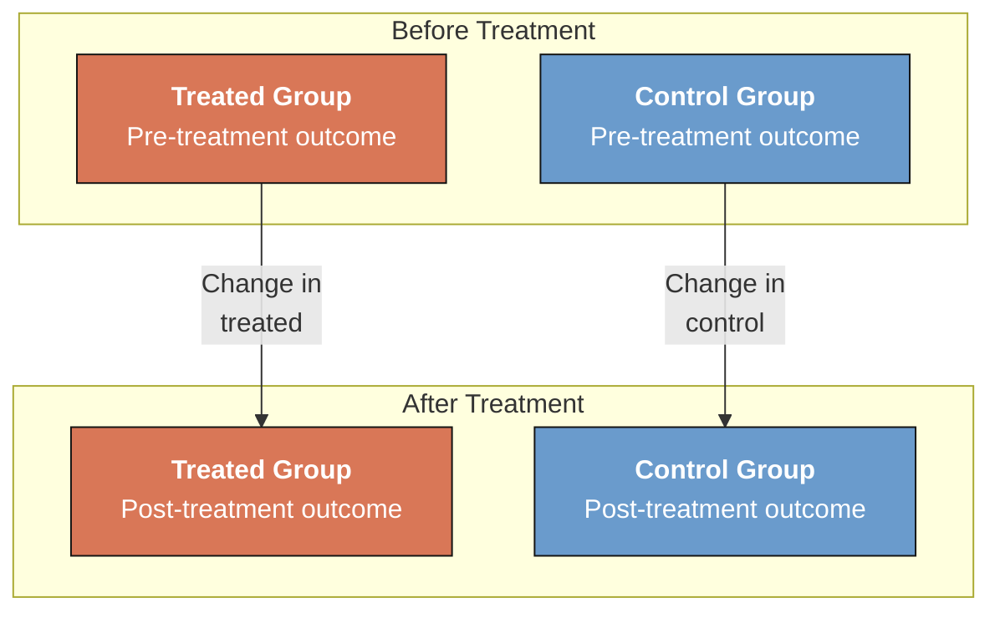
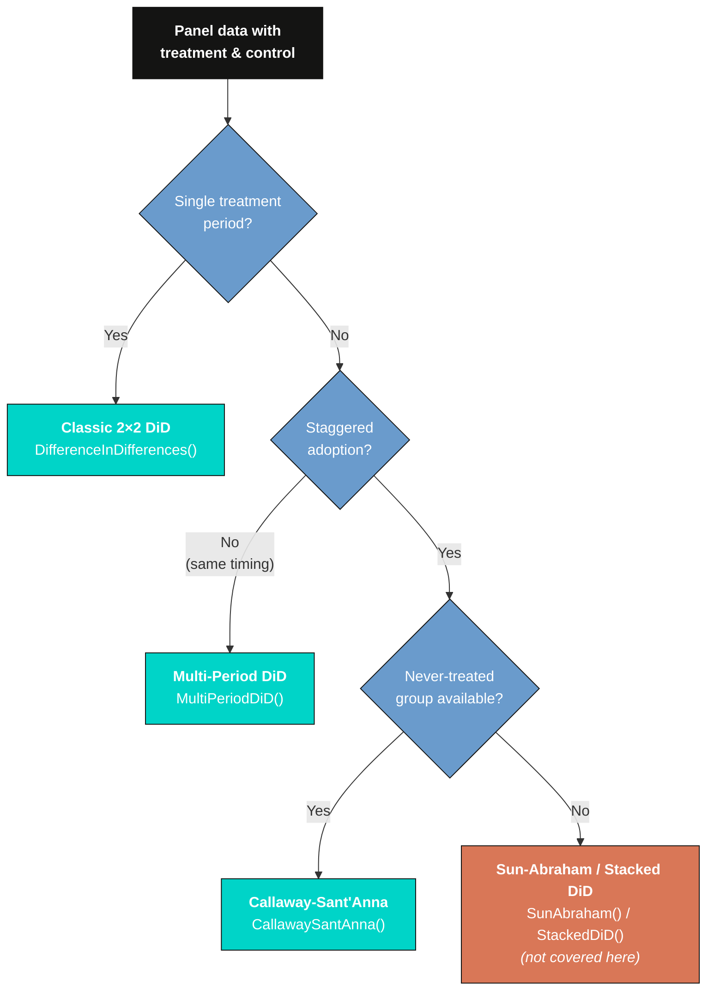

---
authors:
  - admin
categories:
  - Python
  - Causal Inference
draft: false
featured: false
date: "2026-03-19T00:00:00Z"
external_link: ""
image:
  caption: ""
  focal_point: Smart
  placement: 3
links:
- icon: open-data
  icon_pack: ai
  name: "[Python] Google Colab"
  url: https://colab.research.google.com/github/cmg777/starter-academic-v501/blob/master/content/post/python_did/notebook.ipynb
- icon: code
  icon_pack: fas
  name: "Python script"
  url: script.py
- icon: book
  icon_pack: fas
  name: "Jupyter notebook"
  url: notebook.ipynb
slides:
summary: Estimating causal treatment effects using Difference-in-Differences with the diff-diff package, from the classic 2x2 design through staggered adoption with Callaway-Sant'Anna and HonestDiD sensitivity analysis
tags:
- python
- causal
- causal inference
title: "Introduction to Difference-in-Differences in Python"
url_code: ""
url_pdf: ""
url_slides: ""
url_video: ""
toc: true
diagram: true
---

## Overview

A government launches a job training program in some cities but not others. Did the program actually increase employment, or were those cities already on an upward trajectory? This is the core challenge of **policy evaluation**: separating the genuine effect of an intervention from pre-existing trends and selection differences between treated and untreated groups. The seminal study by [Card and Krueger (1994)](https://www.jstor.org/stable/2118030) used exactly this approach to examine how a minimum wage increase in New Jersey affected fast-food employment compared to neighboring Pennsylvania.

**Difference-in-Differences (DiD)** is the workhorse method for answering such questions. The idea is elegantly simple: compare the change in outcomes over time between a group that received treatment and a group that did not. If both groups were evolving similarly before treatment --- the *parallel trends* assumption --- then the difference in their changes isolates the causal effect. Think of it as using the control group as a mirror: it shows what would have happened to the treated group had the policy never been implemented.

The **[diff-diff](https://diff-diff.readthedocs.io/en/stable/)** Python package provides a unified, scikit-learn-style API for 13+ DiD estimators. These range from the classic 2x2 design to modern methods for staggered adoption. In this tutorial, we start with the simplest case, build up to event studies and multi-cohort designs, and finish with sensitivity analysis that quantifies how robust the findings are to violations of parallel trends. All examples use synthetic **panel data** --- datasets where the same units (cities, firms, individuals) are observed repeatedly over multiple time periods --- with known true effects, so every estimate can be verified against ground truth.

**Learning objectives:**

- Understand the logic of the 2x2 DiD design and why it identifies causal effects under parallel trends
- Implement classic DiD estimation using `DifferenceInDifferences().fit()`
- Test the parallel trends assumption with pre-treatment trend comparisons
- Construct event study plots to visualize dynamic treatment effects over time
- Apply Callaway-Sant'Anna for staggered adoption designs where units adopt treatment at different times
- Assess robustness with Bacon decomposition diagnostics and HonestDiD sensitivity analysis

## Conceptual framework: What is Difference-in-Differences?

Imagine a city installs new streetlights on some blocks but not others, and you want to know whether the lights reduced crime. You could compare crime rates on lit blocks versus unlit blocks after installation. But lit blocks might have been safer to begin with --- perhaps the city prioritized high-traffic areas. A simple post-treatment comparison confounds the lighting effect with pre-existing differences. Alternatively, you could compare a single block before and after the lights went up --- but crime might have been falling everywhere due to seasonal patterns or broader policing changes, not the streetlights.

DiD combines these two simpler approaches so that selection bias and the effect of time are, in turns, eliminated ([Cunningham, 2021](https://mixtape.scunning.com/09-difference_in_differences)). The logic proceeds through **successive differencing**:

- **First difference**: Compare a unit before and after treatment. This eliminates time-invariant differences between groups (e.g., one neighborhood is always safer than another), but confounds the treatment effect with common time trends (e.g., citywide crime decline).
- **Second difference**: Difference the first differences between treated and control groups. This eliminates the common time trends, leaving only the treatment effect.



### The DiD estimator

The 2x2 DiD estimator formalizes this double comparison. Let $k$ denote the treated group and $U$ the untreated group:

$$\hat{\delta}^{2 \times 2}\_{kU} = \big( \bar{Y}\_k^{Post} - \bar{Y}\_k^{Pre} \big) - \big( \bar{Y}\_U^{Post} - \bar{Y}\_U^{Pre} \big)$$

In words: take the before-and-after change in the treated group, subtract the before-and-after change in the control group, and the remainder is the treatment effect. Here $\bar{Y}\_k^{Post}$ is the average outcome for treated units in the post-treatment period (rows where `treated = 1` and `post = 1`), and similarly for the other three terms.

### What DiD actually estimates

Using potential outcomes notation, we can decompose what the 2x2 estimator actually recovers ([Cunningham, 2021](https://mixtape.scunning.com/09-difference_in_differences)):

$$\hat{\delta}^{2 \times 2}\_{kU} = \underbrace{E[Y^1\_k | Post] - E[Y^0\_k | Post]}\_{ATT} + \underbrace{\big( E[Y^0\_k | Post] - E[Y^0\_k | Pre] \big) - \big( E[Y^0\_U | Post] - E[Y^0\_U | Pre] \big)}\_{Bias}$$

Here $Y^1\_k$ is the potential outcome for treated units *with* treatment, and $Y^0\_k$ is their potential outcome *without* treatment (what their `outcome` would show had the policy never been implemented). The first term is the **ATT** --- the quantity we want. The second term is the **non-parallel trends bias** --- the difference in how the two groups' untreated outcomes would have evolved over time. If the bias term is zero, the DiD estimator cleanly identifies the ATT.

### Parallel trends assumption

The bias term vanishes when the treated and control groups would have followed the same trajectory absent treatment:

$$E[Y^0\_k | Post] - E[Y^0\_k | Pre] = E[Y^0\_U | Post] - E[Y^0\_U | Pre]$$

This is the **parallel trends assumption**. It does not require the groups to have the same outcome levels --- only the same *trends*. Two cities can have different crime rates, but if their crime rates were rising at the same speed before the policy, DiD can credibly estimate the policy's impact. Importantly, this assumption is **fundamentally untestable** because the counterfactual outcome $E[Y^0\_k | Post]$ --- what would have happened to the treated group absent treatment --- is never observed. We can check whether trends were parallel in the pre-treatment period, but this does not guarantee they would have remained parallel afterward. This limitation is why Section 11 introduces HonestDiD sensitivity analysis.

### Regression formulation

In practice, DiD is implemented as a regression with an interaction term:

$$Y\_{it} = \alpha + \gamma \cdot Treated\_i + \lambda \cdot Post\_t + \delta \cdot (Treated\_i \times Post\_t) + \varepsilon\_{it}$$

where $Treated\_i$ is the group indicator (our `treated` column), $Post\_t$ is the time indicator (our `post` column), and $\delta$ is the DiD treatment effect. The coefficient $\gamma$ captures the pre-existing level difference between groups, and $\lambda$ captures the common time trend. This regression mechanically constructs the counterfactual using the control group's trajectory --- it always estimates the $\delta$ coefficient as the extra change in the treated group, which is only valid if the counterfactual trend truly equals the control group's trend.

**Estimand clarity:** DiD targets the **Average Treatment Effect on the Treated (ATT)** --- the average impact of treatment on those units that actually received it. This differs from the Average Treatment Effect (ATE), which averages over the entire population including units that were never treated. The ATT answers: "For the units that received the policy, how much did it change their outcomes?" This is typically the policy-relevant question, since the decision-maker wants to know whether the intervention helped the people it was aimed at.

Now that we understand the logic, let us implement it step by step using the `diff-diff` package.

## Setup and imports

Before running the analysis, install the required package:

```python
# Run in terminal (or use !pip install in a notebook)
pip install diff-diff
```

The following code imports all necessary libraries and sets configuration variables. The `diff-diff` package provides [`generate_did_data()`](https://diff-diff.readthedocs.io/en/stable/) to create synthetic panel data with known treatment effects, [`DifferenceInDifferences()`](https://diff-diff.readthedocs.io/en/stable/) for the classic 2x2 estimator, and several advanced estimators for multi-period and staggered designs.

```python
import numpy as np
import pandas as pd
import matplotlib.pyplot as plt
from diff_diff import (
    DifferenceInDifferences,
    MultiPeriodDiD,
    CallawaySantAnna,
    BaconDecomposition,
    HonestDiD,
    generate_did_data,
    generate_staggered_data,
    check_parallel_trends,
)

# Reproducibility
RANDOM_SEED = 42
np.random.seed(RANDOM_SEED)

# Site color palette
STEEL_BLUE = "#6a9bcc"
WARM_ORANGE = "#d97757"
NEAR_BLACK = "#141413"
TEAL = "#00d4c8"
```

## Classic 2x2 DiD design

The simplest DiD setup has two groups (treated and control) observed at two time points (before and after treatment). We start here because the 2x2 case makes the mechanics of DiD transparent before moving to more complex designs.

### Generating synthetic panel data

We use [`generate_did_data()`](https://diff-diff.readthedocs.io/en/stable/) to create a synthetic panel where the true treatment effect is exactly 5.0 units. This known ground truth lets us verify that the estimator recovers the correct answer. The function creates a balanced panel with `n_units` units observed over `n_periods` periods, where `treatment_fraction` of units receive treatment starting at `treatment_period`.

```python
data_2x2 = generate_did_data(
    n_units=100,
    n_periods=10,
    treatment_effect=5.0,
    treatment_period=5,
    treatment_fraction=0.5,
    seed=RANDOM_SEED,
)

print(f"Dataset shape: {data_2x2.shape}")
print(f"Columns: {data_2x2.columns.tolist()}")
print(f"\nTreatment groups:")
print(data_2x2.groupby("treated")["unit"].nunique().rename(
    {0: "Control", 1: "Treated"}))
print(f"\nPeriods: {sorted(data_2x2['period'].unique())}")
print(f"Treatment period: 5 (post = 1 for periods >= 5)")
print(f"True treatment effect: 5.0")
```

```
Dataset shape: (1000, 6)
Columns: ['unit', 'period', 'treated', 'post', 'outcome', 'true_effect']

Treatment groups:
treated
Control    50
Treated    50
Name: unit, dtype: int64

Periods: [0, 1, 2, 3, 4, 5, 6, 7, 8, 9]
Treatment period: 5 (post = 1 for periods >= 5)
True treatment effect: 5.0
```

The synthetic panel contains 1,000 observations: 100 units observed across 10 periods (0 through 9). Half the units (50) are assigned to treatment, which begins at period 5. The dataset includes a `true_effect` column that equals 0.0 in pre-treatment periods and 5.0 in post-treatment periods for treated units, providing a built-in benchmark. The `post` indicator is 1 for periods 5--9 and 0 for periods 0--4, matching the binary time dimension of the classic 2x2 framework.

### Exploring the 2x2 dataset

Before estimating any model, we inspect the raw data to understand its structure. The `.head()` method shows the first rows so we can see how each observation is organized as a unit-period pair.

```python
data_2x2.head(10)
```

```
 unit  period  treated  post   outcome  true_effect
    0       0        1     0 10.231272          0.0
    0       1        1     0 12.408662          0.0
    0       2        1     0 11.253170          0.0
    0       3        1     0 12.846950          0.0
    0       4        1     0 11.675816          0.0
    0       5        1     1 17.903997          5.0
    0       6        1     1 17.659412          5.0
    0       7        1     1 18.770401          5.0
    0       8        1     1 20.449742          5.0
    0       9        1     1 18.382114          5.0
```

Each row is one unit in one period. The `unit` column identifies the individual, `period` tracks time, `treated` indicates group assignment (time-invariant), and `post` flags observations after the treatment period. The `outcome` column is what we aim to explain, and `true_effect` is the ground truth we will try to recover. This unit-period structure is the hallmark of **panel data** --- repeated observations on the same units over time.

Summary statistics confirm the design parameters:

```python
data_2x2.describe()
```

```
              unit       period     treated        post      outcome  true_effect
count  1000.000000  1000.000000  1000.00000  1000.00000  1000.000000  1000.000000
mean     49.500000     4.500000     0.50000     0.50000    13.380874     1.250000
std      28.880514     2.873719     0.50025     0.50025     3.752000     2.166147
min       0.000000     0.000000     0.00000     0.00000     4.965883     0.000000
25%      24.750000     2.000000     0.00000     0.00000    10.716817     0.000000
50%      49.500000     4.500000     0.50000     0.50000    12.558536     0.000000
75%      74.250000     7.000000     1.00000     1.00000    15.926784     1.250000
max      99.000000     9.000000     1.00000     1.00000    24.294992     5.000000
```

The means of `treated` and `post` are both exactly 0.50, confirming a perfectly balanced design: half the units are treated, and half the time periods are post-treatment. The outcome ranges from about 5.0 to 24.3 with a mean of 13.4, reflecting the combination of time trends, unit effects, and treatment effects. The `true_effect` mean of 1.25 comes from the fact that only 25% of observations (treated units in post-treatment periods) have a non-zero effect of 5.0.

A crosstab reveals the 2x2 structure that gives DiD its name:

```python
pd.crosstab(data_2x2["treated"], data_2x2["post"], margins=True)
```

```
post       0    1  All
treated
0        250  250  500
1        250  250  500
All      500  500  1000
```

This is the core of the 2x2 design: 250 observations in each of the four cells (control-pre, control-post, treated-pre, treated-post). The balanced allocation means each cell has equal weight in the estimator, which maximizes statistical power. In observational studies, these cell sizes are rarely equal, but the DiD estimator adjusts for imbalance automatically.

Finally, we examine how the outcome varies across the four cells:

```python
data_2x2.groupby(["treated", "post"])["outcome"].describe()
```

```
                count       mean       std        min        25%        50%        75%        max
treated post
0       0       250.0  10.614957  1.871283   5.670539   9.261649  10.781139  11.866492  15.825691
        1       250.0  13.086386  1.968271   8.158302  11.777457  13.149548  14.600075  18.372485
1       0       250.0  11.114546  2.015353   4.965883   9.909285  11.065526  12.494486  16.804462
        1       250.0  18.707609  1.905034  13.182572  17.296981  18.870692  20.070330  24.294992
```

In the pre-treatment period, both groups have similar mean outcomes: 10.61 for the control group and 11.11 for the treated group --- a negligible difference of 0.50 that suggests the groups started on comparable footing. In the post-treatment period, the control group mean rises to 13.09 (a gain of 2.47), while the treated group mean jumps to 18.71 (a gain of 7.59). The extra gain for the treated group (7.59 - 2.47 = 5.12) closely approximates the treatment effect that DiD will formally estimate. The raw numbers already hint that something happened to the treated group beyond the natural time trend.

The box plot below visualizes these distributions:

```python
fig, ax = plt.subplots(figsize=(9, 5))
groups = [
    ("Control, Pre",  data_2x2[(data_2x2["treated"] == 0) & (data_2x2["post"] == 0)]["outcome"]),
    ("Control, Post", data_2x2[(data_2x2["treated"] == 0) & (data_2x2["post"] == 1)]["outcome"]),
    ("Treated, Pre",  data_2x2[(data_2x2["treated"] == 1) & (data_2x2["post"] == 0)]["outcome"]),
    ("Treated, Post", data_2x2[(data_2x2["treated"] == 1) & (data_2x2["post"] == 1)]["outcome"]),
]
bp = ax.boxplot(
    [g[1] for g in groups],
    tick_labels=[g[0] for g in groups],
    patch_artist=True,
    widths=0.5,
    medianprops=dict(color=NEAR_BLACK, linewidth=2),
)
box_colors = [STEEL_BLUE, STEEL_BLUE, WARM_ORANGE, WARM_ORANGE]
for patch, color in zip(bp["boxes"], box_colors):
    patch.set_facecolor(color)
    patch.set_alpha(0.6)
ax.set_ylabel("Outcome")
ax.set_title("Outcome Distribution by Treatment Group and Period")
plt.savefig("did_outcome_distribution.png", dpi=300, bbox_inches="tight")
plt.show()
```


The box plot makes the treatment effect visible at a glance. In the pre-treatment period, control (steel blue) and treated (warm orange) boxes overlap almost completely, centered around 10.6--11.1. Both groups shift upward in the post period due to the natural time trend, but the treated group shifts *more* --- its median jumps to around 18.9, compared to 13.1 for the control. The extra upward shift for the treated group is the treatment effect that DiD will formally estimate. Notice also that the spread (box height) remains similar across all four groups, suggesting that treatment affects the level but not the variability of outcomes.

### Visualizing parallel trends

Before estimating the treatment effect, we check whether the treated and control groups followed similar trajectories in the pre-treatment period. This visual inspection is the first step in assessing whether the parallel trends assumption is plausible. If the two groups were diverging before treatment, any post-treatment difference could reflect pre-existing trends rather than a causal effect.

```python
treated_means = data_2x2[data_2x2["treated"] == 1].groupby("period")["outcome"].mean()
control_means = data_2x2[data_2x2["treated"] == 0].groupby("period")["outcome"].mean()

fig, ax = plt.subplots(figsize=(9, 5))
ax.plot(control_means.index, control_means.values, "o-",
        color=STEEL_BLUE, linewidth=2, markersize=7, label="Control group")
ax.plot(treated_means.index, treated_means.values, "s-",
        color=WARM_ORANGE, linewidth=2, markersize=7, label="Treated group")
ax.axvline(x=4.5, color=NEAR_BLACK, linestyle="--", linewidth=1.5,
           alpha=0.7, label="Treatment onset")
ax.set_xlabel("Period")
ax.set_ylabel("Average Outcome")
ax.set_title("Parallel Trends: Treatment vs Control Groups")
ax.legend(loc="upper left")
ax.set_xticks(range(10))
plt.savefig("did_parallel_trends.png", dpi=300, bbox_inches="tight")
plt.show()
```


The two groups move in lockstep during periods 0 through 4, confirming that the parallel trends assumption holds in this synthetic dataset. Both lines fluctuate around similar values with no visible divergence before period 5. After treatment onset, the treated group (warm orange) jumps upward while the control group (steel blue) continues its prior trajectory. The gap between the two lines in the post-treatment period visually represents the treatment effect --- roughly 5 units, consistent with the true effect built into the data.

### Estimating the treatment effect

With parallel trends confirmed visually, we apply the classic DiD estimator. The [`DifferenceInDifferences()`](https://diff-diff.readthedocs.io/en/stable/) class implements the 2x2 design with analytical standard errors. The `.fit()` method takes the data along with column names for the outcome, treatment indicator, and time indicator (pre/post).

```python
did = DifferenceInDifferences()
results_2x2 = did.fit(data_2x2, outcome="outcome",
                       treatment="treated", time="post")
results_2x2.print_summary()
```

```
======================================================================
             Difference-in-Differences Estimation Results
======================================================================

Observations:                   1000
Treated units:                   500
Control units:                   500
R-squared:                    0.7332

----------------------------------------------------------------------
Parameter           Estimate    Std. Err.     t-stat      P>|t|
----------------------------------------------------------------------
ATT                   5.1216       0.2455     20.863     0.0000   ***
----------------------------------------------------------------------

95% Confidence Interval: [4.6399, 5.6034]

Signif. codes: '***' 0.001, '**' 0.01, '*' 0.05, '.' 0.1
======================================================================
```

The estimated ATT is 5.12, close to the true effect of 5.0, with a standard error of 0.25. The t-statistic of 20.86 and p-value near zero confirm that the effect is highly statistically significant. The 95% confidence interval [4.64, 5.60] comfortably contains the true value of 5.0, demonstrating that the classic DiD estimator successfully recovers the known treatment effect. The small deviation from 5.0 (an overestimate of 0.12) reflects sampling variability, not estimator bias --- with 100 units and 10 periods, some random noise is expected.

### Visualizing the counterfactual

DiD's power lies in constructing a **counterfactual** --- what would have happened to the treated group without treatment. We build this by projecting the control group's post-treatment trajectory, shifted up by the pre-treatment gap between the groups. The shaded area between the actual treated outcomes and this counterfactual line represents the estimated causal effect.

```python
fig, ax = plt.subplots(figsize=(9, 5))
ax.plot(control_means.index, control_means.values, "o-",
        color=STEEL_BLUE, linewidth=2, markersize=7, label="Control group")
ax.plot(treated_means.index, treated_means.values, "s-",
        color=WARM_ORANGE, linewidth=2, markersize=7, label="Treated group")

# Counterfactual: treated group without treatment
pre_diff = treated_means.loc[:4].mean() - control_means.loc[:4].mean()
counterfactual = control_means.loc[5:] + pre_diff
ax.plot(counterfactual.index, counterfactual.values, "s--",
        color=TEAL, linewidth=2, markersize=7,
        label="Counterfactual (no treatment)")
ax.fill_between(counterfactual.index, counterfactual.values,
                treated_means.loc[5:].values, alpha=0.2, color=TEAL,
                label=f"Treatment effect (ATT ≈ {results_2x2.att:.1f})")
ax.axvline(x=4.5, color=NEAR_BLACK, linestyle="--", linewidth=1.5, alpha=0.7)
ax.set_xlabel("Period")
ax.set_ylabel("Average Outcome")
ax.set_title("DiD Treatment Effect: Observed vs Counterfactual")
ax.legend(loc="upper left")
ax.set_xticks(range(10))
plt.savefig("did_treatment_effect.png", dpi=300, bbox_inches="tight")
plt.show()
```


The teal dashed line traces where the treated group would have been without the intervention, constructed by shifting the control group's post-treatment path to match the treated group's pre-treatment level. The shaded gap between the actual treated outcomes (warm orange) and this counterfactual (teal) is the estimated causal effect --- approximately 5.1 units per period. This visualization makes the DiD logic tangible: the control group's trajectory serves as the mirror image of the treated group's no-treatment path, and the extra gain above that mirror is what the policy caused.

## Testing parallel trends

The visual check suggested parallel trends hold, but a formal statistical test provides more rigorous evidence. The [`check_parallel_trends()`](https://diff-diff.readthedocs.io/en/stable/) function compares the pre-treatment time trends of the treated and control groups by estimating a linear slope for each group across the pre-treatment periods, then testing whether the two slopes are statistically different.

```python
pt_result = check_parallel_trends(
    data_2x2,
    outcome="outcome",
    time="period",
    treatment_group="treated",
    pre_periods=[0, 1, 2, 3, 4],
)

print(f"Treated group pre-trend slope:  {pt_result['treated_trend']:.4f}"
      f" (SE = {pt_result['treated_trend_se']:.4f})")
print(f"Control group pre-trend slope:  {pt_result['control_trend']:.4f}"
      f" (SE = {pt_result['control_trend_se']:.4f})")
print(f"Trend difference:               {pt_result['trend_difference']:.4f}"
      f" (SE = {pt_result['trend_difference_se']:.4f})")
print(f"t-statistic:                    {pt_result['t_statistic']:.4f}")
print(f"p-value:                        {pt_result['p_value']:.4f}")
print(f"Parallel trends plausible:      {pt_result['parallel_trends_plausible']}")
```

```
Treated group pre-trend slope:  0.5262 (SE = 0.0839)
Control group pre-trend slope:  0.4047 (SE = 0.0798)
Trend difference:               0.1216 (SE = 0.1158)
t-statistic:                    1.0497
p-value:                        0.2938
Parallel trends plausible:      True
```

The pre-treatment trend slopes are 0.53 for the treated group and 0.40 for the control group --- a difference of 0.12 with a p-value of 0.29. Since p > 0.05, we fail to reject the null hypothesis that the trends are equal, supporting the parallel trends assumption. However, a critical caveat: *failing to reject is not the same as confirming*. The test has limited power, especially with only 5 pre-treatment periods. Even if the trends differed slightly, this test might not detect it. Moreover, [Roth (2022)](https://doi.org/10.1257/aeri.20210236) shows that conditioning on passing a pre-test can distort subsequent inference --- estimated effects may be biased toward zero and confidence intervals may have incorrect coverage. This is why Section 11 introduces HonestDiD, which asks: "How wrong could parallel trends be before our conclusion changes?" That question is more informative than a binary pass/fail test.

## Event study: Dynamic treatment effects

The 2x2 estimator produces a single ATT that averages across all post-treatment periods. But treatment effects often change over time --- they might build up gradually, appear immediately, or fade out. An **event study** (also called dynamic DiD) estimates separate effects for each period relative to treatment, revealing the full trajectory.

The event study extends the basic DiD regression by replacing the single treatment effect $\delta$ with a set of period-specific coefficients --- one for each period before and after treatment:

$$Y\_{it} = \gamma\_i + \lambda\_t + \sum\_{k=-K+1}^{-2} \beta\_k^{lead} D\_{it}^k + \sum\_{k=0}^{L} \beta\_k^{lag} D\_{it}^k + \varepsilon\_{it}$$

Let us unpack each component of this equation:

- $Y\_{it}$ is the outcome for unit $i$ at time $t$ --- the variable we are trying to explain (our `outcome` column).
- $\gamma\_i$ are **unit fixed effects** --- a separate intercept for each unit that absorbs all time-invariant characteristics. For example, if one city always has higher employment than another due to geography or industry composition, $\gamma\_i$ captures that permanent difference. In practice, this is equivalent to demeaning each unit's outcome by its own time-average.
- $\lambda\_t$ are **time fixed effects** --- a separate intercept for each period that absorbs shocks common to all units at a given time. If a recession hits in period 3 and lowers outcomes for everyone equally, $\lambda\_t$ captures that common downturn. Together with unit fixed effects, this implements the "two-way" in TWFE.
- $D\_{it}^k$ is a **relative-time indicator** (also called an event-time dummy): it equals 1 when unit $i$ at time $t$ is exactly $k$ periods away from its treatment onset, and 0 otherwise. For a unit first treated at period 5, we have $D\_{i,3}^{-2} = 1$ (two periods before treatment), $D\_{i,5}^{0} = 1$ (the treatment period itself), $D\_{i,7}^{2} = 1$ (two periods after treatment), and so on.
- $\beta\_k^{lead}$ (for $k = -K+1, \ldots, -2$) are the **lead coefficients** --- pre-treatment effects at each period before treatment. These serve as **placebo tests**: if the treated and control groups were evolving similarly before the intervention, all lead coefficients should be close to zero and statistically insignificant. A significant lead coefficient signals a pre-existing divergence, which would undermine the parallel trends assumption. The summation starts at $k = -K+1$ (the earliest available lead) and stops at $k = -2$, because the period immediately before treatment ($k = -1$) is **omitted as the reference period** and normalized to zero. All other coefficients are estimated relative to this baseline.
- $\beta\_k^{lag}$ (for $k = 0, 1, \ldots, L$) are the **lag coefficients** --- post-treatment effects at each period after treatment onset. The coefficient $\beta\_0^{lag}$ captures the **instantaneous effect** at the moment treatment begins, $\beta\_1^{lag}$ captures the effect one period later, and so on through $\beta\_L^{lag}$ at $L$ periods after treatment. These coefficients trace out the **dynamic treatment effect trajectory**: they reveal whether the effect appears immediately or builds up gradually, whether it persists or fades out, and whether it stabilizes at a constant level or continues to grow.
- $\varepsilon\_{it}$ is the error term, capturing all unobserved factors not absorbed by the fixed effects or treatment indicators.

The key insight is that this single equation simultaneously tests the identifying assumption *and* estimates the treatment effect. The leads ($\beta\_k^{lead}$) test parallel trends period by period, while the lags ($\beta\_k^{lag}$) reveal how the treatment effect evolves over time. In our tutorial, treatment begins at period 5 and the reference period is 4 ($k = -1$), so we have 4 lead coefficients at $k = -5, -4, -3, -2$ (corresponding to periods 0--3) and $L = 4$ lag coefficients at $k = 0, 1, 2, 3, 4$ (corresponding to periods 5--9).

The [`MultiPeriodDiD()`](https://diff-diff.readthedocs.io/en/stable/) estimator fits this specification, using one pre-treatment period as the reference point.

```python
event = MultiPeriodDiD()
results_event = event.fit(
    data_2x2,
    outcome="outcome",
    treatment="treated",
    time="period",
    post_periods=[5, 6, 7, 8, 9],
    reference_period=4,
)
results_event.print_summary()
```

```
================================================================================
           Multi-Period Difference-in-Differences Estimation Results
================================================================================

Observations:                   1000
Treated observations:            500
Control observations:            500
Pre-treatment periods:             5
Post-treatment periods:            5
R-squared:                    0.7648

--------------------------------------------------------------------------------
                   Pre-Period Effects (Parallel Trends Test)
--------------------------------------------------------------------------------
Period              Estimate    Std. Err.     t-stat      P>|t|   Sig.
--------------------------------------------------------------------------------
0                    -0.5167       0.5121     -1.009     0.3132
1                    -0.5050       0.5031     -1.004     0.3157
2                    -0.2804       0.5228     -0.536     0.5919
3                    -0.3227       0.5187     -0.622     0.5340
[ref: 4]               0.0000          ---        ---        ---
--------------------------------------------------------------------------------

--------------------------------------------------------------------------------
                         Post-Period Treatment Effects
--------------------------------------------------------------------------------
Period              Estimate    Std. Err.     t-stat      P>|t|   Sig.
--------------------------------------------------------------------------------
5                     4.6509       0.5162      9.011     0.0000    ***
6                     4.8285       0.5227      9.238     0.0000    ***
7                     4.6907       0.5068      9.255     0.0000    ***
8                     4.7888       0.4908      9.757     0.0000    ***
9                     5.0244       0.5203      9.657     0.0000    ***
--------------------------------------------------------------------------------

--------------------------------------------------------------------------------
                 Average Treatment Effect (across post-periods)
--------------------------------------------------------------------------------
Parameter           Estimate    Std. Err.     t-stat      P>|t|   Sig.
--------------------------------------------------------------------------------
Avg ATT               4.7967       0.3923     12.227     0.0000    ***
--------------------------------------------------------------------------------

95% Confidence Interval: [4.0269, 5.5665]

Signif. codes: '***' 0.001, '**' 0.01, '*' 0.05, '.' 0.1
================================================================================
```

The pre-treatment coefficients (periods 0--3) are all small and statistically insignificant, ranging from -0.52 to -0.28 with p-values well above 0.05. This confirms that the treated and control groups were evolving similarly before the intervention --- the period-by-period placebo test passes. In contrast, all five post-treatment effects (periods 5--9) are large and highly significant, ranging from 4.65 to 5.02 with t-statistics above 9.0. The average ATT across post periods is 4.80 with a 95% CI of [4.03, 5.57], consistent with the true effect of 5.0. The effects are remarkably stable over time, indicating no fade-out or build-up --- the treatment shifts outcomes by roughly 5 units immediately and maintains that shift.

The event study plot below makes these dynamics visible:

```python
es_df = results_event.to_dataframe()

fig, ax = plt.subplots(figsize=(9, 5))
pre = es_df[~es_df["is_post"]]
post = es_df[es_df["is_post"]]

ax.errorbar(pre["period"], pre["effect"], yerr=1.96 * pre["se"],
            fmt="o", color=STEEL_BLUE, capsize=4, linewidth=2,
            markersize=8, label="Pre-treatment")
ax.errorbar(post["period"], post["effect"], yerr=1.96 * post["se"],
            fmt="s", color=WARM_ORANGE, capsize=4, linewidth=2,
            markersize=8, label="Post-treatment")

# Reference period
ax.plot(4, 0, "D", color=NEAR_BLACK, markersize=10, zorder=5,
        label="Reference period")

ax.axhline(y=0, color=NEAR_BLACK, linewidth=1, alpha=0.5)
ax.axvline(x=4.5, color=NEAR_BLACK, linestyle="--", linewidth=1.5, alpha=0.5)
ax.axhline(y=5.0, color=TEAL, linestyle=":", linewidth=1.5, alpha=0.7,
           label="True effect (5.0)")
ax.set_xlabel("Period")
ax.set_ylabel("Estimated Effect")
ax.set_title("Event Study: Dynamic Treatment Effects")
ax.legend(loc="upper left")
ax.set_xticks(range(10))
plt.savefig("did_event_study.png", dpi=300, bbox_inches="tight")
plt.show()
```


The event study plot tells the DiD story at a glance. Pre-treatment coefficients (steel blue circles) hover near the zero line, their confidence intervals all crossing zero --- this is the visual signature of valid parallel trends. At the treatment cutoff (dashed vertical line), the estimates jump sharply to around 5.0 (warm orange squares), and the teal dotted line at 5.0 shows that every post-treatment estimate is close to the true effect. The confidence intervals in the post-treatment period are narrow and well above zero, confirming both statistical significance and accuracy.

With the classic 2x2 case established, the next question is: what happens when different units adopt treatment at different times?

## Staggered adoption: Why TWFE fails

In many real-world policies, treatment does not begin simultaneously for all units. Minimum wage increases roll out state by state, environmental regulations phase in over years, and school programs expand district by district. This is **staggered adoption** --- different units start treatment at different times.

The traditional approach is **Two-Way Fixed Effects (TWFE)** regression, which estimates a single treatment coefficient using unit and time fixed effects ([Cunningham, 2021](https://mixtape.scunning.com/09-difference_in_differences)):

$$Y\_{it} = \gamma\_i + \lambda\_t + \delta \cdot D\_{it} + \varepsilon\_{it}$$

Here $\gamma\_i$ absorbs all time-invariant unit characteristics (unit fixed effects), $\lambda\_t$ absorbs all common time shocks (time fixed effects), $D\_{it}$ is a treatment indicator that equals 1 when unit $i$ is treated at time $t$, and $\delta$ is the single treatment effect that TWFE estimates. With a single treatment period, $\delta$ correctly recovers the ATT. But with staggered timing, the single coefficient $\delta$ is a weighted average of many underlying 2x2 comparisons --- and some of those comparisons are problematic.

The problem is that TWFE makes **forbidden comparisons**: it implicitly uses already-treated units as controls for newly-treated units. If treatment effects grow over time, these forbidden comparisons produce negative bias, pulling the overall estimate downward. Think of it this way: if early adopters have been benefiting from treatment for three years and their outcomes have grown substantially, TWFE compares newly-treated units to these high-performing early adopters. The newly-treated units look *worse* by comparison, even though they are genuinely benefiting from treatment. In extreme cases with heterogeneous treatment effects across cohorts, TWFE can even assign **negative weights** to some 2x2 comparisons, potentially flipping the sign of the estimate opposite to every unit's true treatment effect (this does not occur in our example, but is documented in [de Chaisemartin & D'Haultfoeuille, 2020](https://doi.org/10.1257/aer.20181169)).

### Generating staggered adoption data

The [`generate_staggered_data()`](https://diff-diff.readthedocs.io/en/stable/) function creates a panel with multiple treatment cohorts --- groups of units that begin treatment in different periods --- plus a never-treated group.

```python
data_stag = generate_staggered_data(
    n_units=300,
    n_periods=10,
    seed=RANDOM_SEED,
)

print(f"Dataset shape: {data_stag.shape}")
cohorts = data_stag.groupby("first_treat")["unit"].nunique()
print(f"\nCohort sizes:")
for ft, n in cohorts.items():
    label = "Never-treated" if ft == 0 else f"First treated in period {ft}"
    print(f"  {label}: {n} units")
print(f"\nTotal units: {cohorts.sum()}")
```

```
Dataset shape: (3000, 7)

Cohort sizes:
  Never-treated: 90 units
  First treated in period 3: 60 units
  First treated in period 5: 75 units
  First treated in period 7: 75 units

Total units: 300
```

The staggered panel has 3,000 observations (300 units across 10 periods). Three treatment cohorts adopt at different times: 60 units start treatment in period 3, 75 in period 5, and 75 in period 7. Another 90 units are never treated, serving as a clean control group. The `first_treat` column records when each unit first received treatment (0 for never-treated). This staggered structure is where naive TWFE breaks down, as the next section demonstrates.

### Exploring the staggered dataset

The staggered dataset has a richer structure than the 2x2 case. Inspecting the first rows reveals additional columns:

```python
data_stag.head(10)
```

```
 unit  period   outcome  first_treat  treated  treat  true_effect
    0       0 11.278161            0        0      0          0.0
    0       1 11.835615            0        0      0          0.0
    0       2 11.542112            0        0      0          0.0
    0       3 11.716260            0        0      0          0.0
    0       4 12.289791            0        0      0          0.0
    0       5 10.978501            0        0      0          0.0
    0       6 11.426795            0        0      0          0.0
    0       7 11.433938            0        0      0          0.0
    0       8 11.108223            0        0      0          0.0
    0       9 12.035899            0        0      0          0.0
```

Compared to the 2x2 dataset, two key differences stand out. First, `first_treat` replaces the binary `post` indicator --- it records the *period* in which each unit first receives treatment (0 means never treated). Second, `treated` is now **time-varying**: it switches from 0 to 1 at each unit's treatment onset, rather than being a fixed group label. The `treat` column is a secondary treatment indicator, and `true_effect` records the ground truth effect for verification.

Summary statistics show the expanded scale:

```python
data_stag.describe()
```

```
              unit      period      outcome  first_treat      treated        treat  true_effect
count  3000.000000  3000.00000  3000.000000  3000.000000  3000.000000  3000.000000  3000.000000
mean    149.500000     4.50000    11.287067     3.600000     0.340000     0.700000     0.829000
std      86.616497     2.87276     2.528589     2.709695     0.473788     0.458334     1.173464
min       0.000000     0.00000     4.521385     0.000000     0.000000     0.000000     0.000000
25%      74.750000     2.00000     9.461867     0.000000     0.000000     0.000000     0.000000
50%     149.500000     4.50000    11.107083     4.000000     0.000000     1.000000     0.000000
75%     224.250000     7.00000    13.078036     5.500000     1.000000     1.000000     2.200000
max     299.000000     9.00000    20.616391     7.000000     1.000000     1.000000     3.200000
```

With 3,000 observations and 300 units, this panel is three times larger than the 2x2 case. The `first_treat` variable has a mean of 3.60, reflecting the mix of never-treated (0) and cohorts treated at periods 3, 5, and 7. The `treated` mean of 0.34 tells us that 34% of all unit-period observations are in a post-treatment state --- less than half because late cohorts contribute fewer treated periods than early cohorts.

A crosstab of cohort membership by period shows the balanced panel design:

```python
pd.crosstab(data_stag["first_treat"], data_stag["period"])
```

```
period        0   1   2   3   4   5   6   7   8   9
first_treat
0            90  90  90  90  90  90  90  90  90  90
3            60  60  60  60  60  60  60  60  60  60
5            75  75  75  75  75  75  75  75  75  75
7            75  75  75  75  75  75  75  75  75  75
```

Every cohort has the same number of units in every period --- this is a balanced panel. The never-treated group (90 units) is the largest, providing a stable comparison baseline. Cohort 3 is the smallest (60 units) and experiences treatment the longest (7 post-treatment periods), while cohort 7 has only 3 post-treatment periods. This asymmetry is exactly what creates problems for TWFE: cohort 3 units have been treated for a long time when cohort 7 units first adopt, making already-treated units unreliable controls.

The pivoted outcome means by cohort and period reveal the staggered treatment pattern:

```python
data_stag.groupby(["first_treat", "period"])["outcome"].mean().unstack()
```

```
period          0     1     2     3     4     5     6     7     8     9
first_treat
0            9.92  9.95 10.17 10.28 10.40 10.46 10.53 10.68 10.78 10.88
3           10.39 10.51 10.59 12.82 13.07 13.33 13.60 13.99 14.22 14.56
5           10.08 10.17 10.33 10.32 10.58 12.70 12.90 13.11 13.64 13.77
7            9.61  9.76  9.73 10.04 10.00 10.10 10.35 12.25 12.59 12.91
```

All four cohorts track closely in their pre-treatment periods (values near 9.6--10.6 in periods 0--2), confirming parallel pre-trends. The divergence is sharp and cohort-specific: cohort 3 jumps at period 3 (from 10.59 to 12.82), cohort 5 jumps at period 5 (from 10.58 to 12.70), and cohort 7 jumps at period 7 (from 10.35 to 12.25). The never-treated group follows a smooth, gentle upward trend throughout. By period 9, all treated cohorts have outcomes around 12.9--14.6, substantially above the never-treated group's 10.88 --- but they arrived at those levels at different times.

The line plot below visualizes these divergent trajectories:

```python
cohort_means = data_stag.groupby(["first_treat", "period"])["outcome"].mean().unstack(level=0)
cohort_colors = {0: STEEL_BLUE, 3: WARM_ORANGE, 5: TEAL, 7: NEAR_BLACK}
cohort_labels = {0: "Never-treated", 3: "Cohort 3", 5: "Cohort 5", 7: "Cohort 7"}

fig, ax = plt.subplots(figsize=(9, 5))
for ft in sorted(cohort_means.columns):
    ax.plot(cohort_means.index, cohort_means[ft], "o-",
            color=cohort_colors[ft], linewidth=2, markersize=6,
            label=cohort_labels[ft])
# Vertical lines at treatment onsets
for ft in [3, 5, 7]:
    ax.axvline(x=ft - 0.5, color=cohort_colors[ft], linestyle="--",
               linewidth=1.2, alpha=0.5)
ax.set_xlabel("Period")
ax.set_ylabel("Mean Outcome")
ax.set_title("Staggered Adoption: Cohort Mean Outcomes Over Time")
ax.legend(loc="upper left")
ax.set_xticks(range(10))
plt.savefig("did_staggered_trends.png", dpi=300, bbox_inches="tight")
plt.show()
```


The plot makes the staggered adoption pattern unmistakable. All four lines run in parallel during the early pre-treatment periods, then each treated cohort jumps upward at its treatment onset (marked by a dashed vertical line in the corresponding color). Cohort 3 (warm orange) diverges first at period 3, followed by cohort 5 (teal) at period 5, and cohort 7 (near black) at period 7. The never-treated group (steel blue) continues its steady, gentle upward trend without any jump. This visualization explains *why TWFE fails*: between periods 3 and 7, TWFE uses cohort 3 (already treated and elevated) as a comparison for cohort 7 (not yet treated). Since cohort 3's outcomes are inflated by treatment, the comparison underestimates cohort 7's true effect when it eventually adopts.

### Bacon decomposition: Diagnosing TWFE

The **Goodman-Bacon decomposition** ([Goodman-Bacon, 2021](https://doi.org/10.1016/j.jeconom.2021.03.014)) reveals exactly how TWFE constructs its estimate. The key insight is that the TWFE coefficient $\hat{\delta}$ is a weighted average of all possible 2x2 DiD comparisons between pairs of treatment cohorts:

$$\hat{\delta}^{TWFE} = \sum\_{k} s\_{kU} \hat{\delta}\_{kU} + \sum\_{e \neq U} \sum\_{l > e} \big( s\_{el} \hat{\delta}\_{el} + s\_{le} \hat{\delta}\_{le} \big)$$

The first sum covers **clean comparisons** between each treated cohort $k$ and the never-treated group $U$, weighted by $s\_{kU}$. The double sum covers comparisons between pairs of treated cohorts: $\hat{\delta}\_{el}$ compares earlier-treated ($e$) against later-treated ($l$) units, and $\hat{\delta}\_{le}$ compares later-treated against earlier-treated units. The weights $s$ are proportional to each subsample's size and the variance of the treatment indicator within each pair --- groups treated in the middle of the panel receive the most weight. Crucially, the weights sum to one, so the TWFE estimate is a proper weighted average.

The three types of comparisons have very different reliability:

1. **Treated vs never-treated** ($\hat{\delta}\_{kU}$): Clean comparisons using permanently untreated units as controls. These are the gold standard.
2. **Earlier vs later treated** ($\hat{\delta}\_{el}$): Uses not-yet-treated units as controls. Valid as long as treatment has not yet affected the later cohort.
3. **Later vs earlier treated** ($\hat{\delta}\_{le}$): The **forbidden comparisons**. Uses already-treated units as controls. If treatment effects evolve over time, these comparisons are contaminated because the "controls" are themselves experiencing treatment effects.

```python
bacon = BaconDecomposition()
bacon_results = bacon.fit(
    data_stag, outcome="outcome", unit="unit",
    time="period", first_treat="first_treat",
)
bacon_results.print_summary()
```

```
=====================================================================================
                 Goodman-Bacon Decomposition of Two-Way Fixed Effects
=====================================================================================

Total observations:                       3000
Treatment timing groups:                     3
Never-treated units:                        90
Total 2x2 comparisons:                       9

-------------------------------------------------------------------------------------
                                  TWFE Decomposition
-------------------------------------------------------------------------------------

TWFE Estimate:                            2.1822
Weighted Sum of 2x2 Estimates:            2.1052
Decomposition Error:                    0.076977

-------------------------------------------------------------------------------------
                         Weight Breakdown by Comparison Type
-------------------------------------------------------------------------------------
Comparison Type                      Weight   Avg Effect Contribution
-------------------------------------------------------------------------------------
Treated vs Never-treated             0.4331       2.3745       1.0284
Earlier vs Later treated             0.2836       2.1999       0.6238
Later vs Earlier (forbidden)         0.2834       1.5989       0.4531
-------------------------------------------------------------------------------------
Total                                1.0000                    2.1052
-------------------------------------------------------------------------------------

WARNING: 28.3% of weight is on 'forbidden' comparisons where
already-treated units serve as controls. This can bias TWFE
when treatment effects are heterogeneous over time.

Consider using Callaway-Sant'Anna or other robust estimators.

=====================================================================================
```

The decomposition reveals that 28.3% of TWFE's weight falls on forbidden comparisons --- cases where already-treated units serve as controls. These forbidden comparisons produce an average effect of only 1.60, substantially lower than the 2.37 from clean treated-vs-never-treated comparisons. This downward pull drags the TWFE estimate to 2.18, below the true treatment effect. The clean comparisons (treated vs never-treated) account for 43.3% of the weight and produce the most reliable estimates, while the earlier-vs-later comparisons (28.4% weight) sit in between. The decomposition error of 0.08 reflects higher-order interaction terms that the 2x2 decomposition does not fully capture.

The following plot visualizes the decomposition:

```python
bacon_df = bacon_results.to_dataframe()

fig, axes = plt.subplots(1, 2, figsize=(14, 5))

# Left panel: scatter by comparison type
type_colors = {
    "Treated vs Never-treated": STEEL_BLUE,
    "Earlier vs Later treated": WARM_ORANGE,
    "Later vs Earlier (forbidden)": "#c4623d",
}
for comp_type in bacon_df["comparison_type"].unique():
    subset = bacon_df[bacon_df["comparison_type"] == comp_type]
    color = type_colors.get(comp_type, NEAR_BLACK)
    axes[0].scatter(subset["weight"], subset["estimate"],
                    s=80, color=color, alpha=0.7, edgecolors="white",
                    label=comp_type)
axes[0].axhline(y=bacon_results.twfe_estimate, color=NEAR_BLACK,
                linestyle="--", linewidth=1.5, alpha=0.7,
                label=f"TWFE = {bacon_results.twfe_estimate:.2f}")
axes[0].set_xlabel("Weight")
axes[0].set_ylabel("2×2 DiD Estimate")
axes[0].set_title("Bacon Decomposition: Individual Comparisons")
axes[0].legend(fontsize=9, loc="lower right")

# Right panel: bar chart of weights by type
type_summary = bacon_df.groupby("comparison_type").agg(
    weight=("weight", "sum"),
    avg_effect=("estimate", lambda x: np.average(
        x, weights=bacon_df.loc[x.index, "weight"])),
).reset_index()
bar_colors = [type_colors.get(t, NEAR_BLACK)
              for t in type_summary["comparison_type"]]
axes[1].barh(range(len(type_summary)), type_summary["weight"],
             color=bar_colors, edgecolor="white", height=0.6)
axes[1].set_yticks(range(len(type_summary)))
axes[1].set_yticklabels(type_summary["comparison_type"], fontsize=10)
axes[1].set_xlabel("Total Weight")
axes[1].set_title("Weight Distribution by Comparison Type")

for i, (w, e) in enumerate(zip(type_summary["weight"],
                                type_summary["avg_effect"])):
    axes[1].text(w + 0.01, i, f"{w:.1%} (avg = {e:.2f})",
                 va="center", fontsize=10)

plt.tight_layout()
plt.savefig("did_bacon_decomposition.png", dpi=300, bbox_inches="tight")
plt.show()
```


The left panel shows each individual 2x2 comparison as a point, colored by type. The forbidden comparisons (dark orange) cluster at lower effect estimates than the clean comparisons (steel blue), visually demonstrating how they pull TWFE downward. The right panel makes the weight problem stark: nearly a third of the total weight goes to comparisons where already-treated units masquerade as controls. For a policymaker relying on the TWFE estimate of 2.18, this contamination means the reported effect underestimates the true treatment impact.

## Callaway-Sant'Anna: The modern solution

The **Callaway-Sant'Anna (CS) estimator** ([Callaway & Sant'Anna, 2021](https://doi.org/10.1016/j.jeconom.2020.12.001)) avoids forbidden comparisons entirely. Instead of a single pooled regression, CS starts from a fundamental building block --- the **group-time ATT**:

$$ATT(g, t) = E[Y\_t(g) - Y\_t(\infty) \mid G = g], \quad \text{for } t \geq g$$

Here $g$ denotes the cohort (the period when a unit first becomes treated), $t$ is the current calendar period, $Y\_t(g)$ is the potential outcome at time $t$ if first treated in period $g$, and $Y\_t(\infty)$ is the potential outcome under perpetual non-treatment. The conditioning on $G = g$ restricts attention to units in cohort $g$. This yields a separate treatment effect estimate for each combination of cohort and calendar period, using only clean comparisons.

With never-treated controls, the group-time ATT is identified as:

$$ATT(g, t) = E[Y\_t - Y\_{g-1} \mid G = g] - E[Y\_t - Y\_{g-1} \mid G = \infty]$$

In words: take the change in outcomes from the period just before treatment ($g - 1$) to the current period ($t$) for cohort $g$ units, and subtract the same change for never-treated units ($G = \infty$). This is a 2x2 DiD comparison that uses only the never-treated group as controls, eliminating all forbidden comparisons by construction.

### The doubly robust estimator

In practice, Callaway and Sant'Anna implement a **doubly robust** version of this estimator that combines inverse-probability weighting with an outcome regression adjustment:

$$ATT(g, t) = \mathbb{E}\left[\left(\frac{G\_g}{\mathbb{E}[G\_g]} - \frac{\frac{p\_g(X)}{1-p\_g(X)}}{\mathbb{E}\left[\frac{p\_g(X)}{1-p\_g(X)}\right]}\right)\left(Y\_t - Y\_{g-1} - m\_{g,t}^{nev}(X)\right)\right]$$

This equation multiplies two terms inside the expectation --- a **weighting term** (first parentheses) and an **outcome term** (second parentheses). Let us unpack each one.

**The weighting term:** $\frac{G\_g}{\mathbb{E}[G\_g]} - \frac{\frac{p\_g(X)}{1-p\_g(X)}}{\mathbb{E}\left[\frac{p\_g(X)}{1-p\_g(X)}\right]}$

This term determines *how much each observation contributes* to the ATT estimate. It works differently for treated and control units:

- $G\_g$ is a **group indicator** that equals 1 if the unit belongs to cohort $g$ and 0 otherwise. Dividing by $\mathbb{E}[G\_g]$ (the share of units in cohort $g$) normalizes so that treated units receive equal weight on average. For a treated unit in cohort $g$, the first fraction contributes a positive value; for never-treated units, $G\_g = 0$ so the first fraction is zero.
- $p\_g(X)$ is the **generalized propensity score** --- the probability of being in cohort $g$ (rather than the never-treated group) given covariates $X$. This is estimated via logit regression of cohort membership on covariates. The ratio $\frac{p\_g(X)}{1-p\_g(X)}$ are the odds of being in cohort $g$, and dividing by its expectation normalizes the weights. For never-treated units, this second fraction creates a **negative weight** that is larger for control units whose covariates resemble the treated cohort --- effectively selecting the most comparable controls. For treated units, the two fractions partially cancel, leaving a net positive weight.

The intuition is similar to propensity score matching: if a never-treated city has covariates (population, income, industry mix) that look very much like a treated city, it receives a larger (more negative) weight, making it contribute more as a counterfactual. Cities with covariates far from the treated group receive near-zero weight. This **rebalances** the control group so that the covariate distribution of the weighted controls matches that of the treated cohort.

**The outcome term:** $Y\_t - Y\_{g-1} - m\_{g,t}^{nev}(X)$

This term measures the **adjusted outcome change** for each unit:

- $Y\_t - Y\_{g-1}$ is the raw change in outcomes from the baseline period ($g - 1$, the period just before cohort $g$ starts treatment) to the current period $t$. This is the same first difference used in any DiD estimator.
- $m\_{g,t}^{nev}(X)$ is the **outcome regression adjustment** --- the expected change $E[Y\_t - Y\_{g-1} \mid X, G = \infty]$ for never-treated units with covariates $X$. In practice, this is estimated by regressing the outcome change $\Delta Y = Y\_t - Y\_{g-1}$ on covariates $X$ using only the never-treated group. Subtracting $m\_{g,t}^{nev}(X)$ removes the portion of the outcome change that would have occurred *anyway* based on observable characteristics --- even without treatment. What remains is the treatment-induced change that cannot be explained by covariates alone.

Think of it this way: if cities with larger populations tend to grow faster regardless of treatment, $m\_{g,t}^{nev}(X)$ captures that covariate-driven growth trajectory. Subtracting it ensures that the estimated treatment effect is not confounded by differential growth rates across different types of cities.

**Why "doubly robust"?** The estimator combines *both* adjustment strategies --- inverse-probability weighting (through the weighting term) and outcome regression (through $m\_{g,t}^{nev}(X)$). The key advantage is that the ATT estimate is consistent if *either* the propensity score model or the outcome regression model is correctly specified --- both do not need to be right simultaneously. If the propensity score model is wrong but the outcome regression is correct, the $m\_{g,t}^{nev}(X)$ adjustment still removes confounding. If the outcome regression is wrong but the propensity score is correct, the reweighting still produces a valid comparison group. This double layer of protection makes the estimator more reliable in practice than methods relying on a single modeling assumption.

**Note on the no-covariate case:** In this tutorial, we do not pass covariates to `CallawaySantAnna()`. Without covariates, the propensity score $p\_g(X)$ reduces to the unconditional probability of being in cohort $g$ (simply the group share), and $m\_{g,t}^{nev}(X)$ reduces to the simple mean outcome change among never-treated units. The doubly robust estimator then collapses to the basic difference-in-means formula shown earlier. The full equation is presented here because it is the general form that practitioners encounter when working with real data and covariates.

The group-time ATTs are then **aggregated** into summary parameters. Any summary is a weighted average of the building blocks:

$$\theta = \sum\_{g} \sum\_{t \geq g} w\_{g,t} \cdot ATT(g, t), \quad \sum\_{g,t} w\_{g,t} = 1$$

Two aggregations are especially useful. The **overall ATT** weights by cohort size:

$$\theta^{O} = \sum\_{g} \theta(g) \cdot P(G = g), \quad \text{where } \theta(g) = \frac{1}{T - g + 1} \sum\_{t=g}^{T} ATT(g, t)$$

The **event study aggregation** averages across cohorts at each relative time $e$ (periods since treatment onset):

$$\theta\_D(e) = \sum\_{g} ATT(g, g + e) \cdot P(G = g \mid g + e \leq T)$$

This event study aggregation is the CS analogue of the leads-and-lags event study, but free from the forbidden comparison contamination that plagues TWFE-based event studies.

The [`CallawaySantAnna()`](https://diff-diff.readthedocs.io/en/stable/) class takes `control_group` to specify which units serve as controls. Using `"never_treated"` restricts comparisons to units that never received treatment, the cleanest possible counterfactual.

```python
cs = CallawaySantAnna(control_group="never_treated")
results_cs = cs.fit(
    data_stag, outcome="outcome", unit="unit",
    time="period", first_treat="first_treat",
    aggregate="event_study",
)
results_cs.print_summary()
```

```
=====================================================================================
            Callaway-Sant'Anna Staggered Difference-in-Differences Results
=====================================================================================

Total observations:                  3000
Treated units:                        210
Never-treated units:                   90
Treatment cohorts:                      3
Time periods:                          10
Control group:                 never_treated
Base period:                      varying

-------------------------------------------------------------------------------------
                   Overall Average Treatment Effect on the Treated
-------------------------------------------------------------------------------------
Parameter           Estimate    Std. Err.     t-stat      P>|t|   Sig.
-------------------------------------------------------------------------------------
ATT                   2.4136       0.0552     43.753     0.0000    ***
-------------------------------------------------------------------------------------

95% Confidence Interval: [2.3055, 2.5217]

-------------------------------------------------------------------------------------
                            Event Study (Dynamic) Effects
-------------------------------------------------------------------------------------
Rel. Period         Estimate    Std. Err.     t-stat      P>|t|   Sig.
-------------------------------------------------------------------------------------
-6                    0.1156       0.1044      1.108     0.2681
-5                   -0.2476       0.0979     -2.529     0.0114      *
-4                    0.1344       0.0759      1.770     0.0766      .
-3                   -0.1112       0.0709     -1.568     0.1168
-2                   -0.0013       0.0631     -0.020     0.9837
-1                    0.0709       0.0631      1.124     0.2610
0                     1.9713       0.0645     30.551     0.0000    ***
1                     2.1416       0.0577     37.124     0.0000    ***
2                     2.2969       0.0644     35.644     0.0000    ***
3                     2.6763       0.0796     33.642     0.0000    ***
4                     2.7925       0.0800     34.898     0.0000    ***
5                     3.0259       0.1227     24.669     0.0000    ***
6                     3.2663       0.1090     29.961     0.0000    ***
-------------------------------------------------------------------------------------

Signif. codes: '***' 0.001, '**' 0.01, '*' 0.05, '.' 0.1
=====================================================================================
```

The overall CS estimate of the ATT is 2.41 (SE = 0.06, p < 0.001), with a 95% CI of [2.31, 2.52]. This is higher than the TWFE estimate of 2.18, confirming that TWFE was biased downward by the forbidden comparisons. The event study reveals dynamic effects that grow over time: the effect starts at 1.97 in the first period after treatment and increases to 3.27 by six periods post-treatment. This pattern of growing effects is exactly the scenario where TWFE fails most dramatically --- the forbidden comparisons use units with large accumulated effects as controls for newly-treated units, producing a downward-biased average.

The pre-treatment estimates mostly hover near zero, with one significant coefficient at relative period -5 (estimate = -0.25, p = 0.01). While p = 0.01 is below the conventional 5% threshold, this is one test out of six pre-treatment periods. Applying a Bonferroni correction --- which guards against false positives when running multiple tests by dividing the significance threshold by the number of tests --- gives a corrected threshold of 0.05/6 = 0.008, under which this result would not be significant. A single borderline rejection among multiple tests is consistent with normal sampling variability and does not undermine the parallel trends assumption.

The event study plot visualizes these dynamics, showing how the treatment effect builds over time relative to treatment onset:

```python
cs_df = results_cs.to_dataframe("event_study")

fig, ax = plt.subplots(figsize=(9, 5))
pre_cs = cs_df[cs_df["relative_period"] < 0]
post_cs = cs_df[cs_df["relative_period"] >= 0]

ax.errorbar(pre_cs["relative_period"], pre_cs["effect"],
            yerr=1.96 * pre_cs["se"], fmt="o", color=STEEL_BLUE,
            capsize=4, linewidth=2, markersize=8, label="Pre-treatment")
ax.errorbar(post_cs["relative_period"], post_cs["effect"],
            yerr=1.96 * post_cs["se"], fmt="s", color=TEAL,
            capsize=4, linewidth=2, markersize=8, label="Post-treatment")

ax.axhline(y=0, color=NEAR_BLACK, linewidth=1, alpha=0.5)
ax.axvline(x=-0.5, color=NEAR_BLACK, linestyle="--", linewidth=1.5, alpha=0.5)
ax.set_xlabel("Periods Relative to Treatment")
ax.set_ylabel("Estimated ATT")
ax.set_title("Callaway-Sant'Anna: Event Study for Staggered Adoption")
ax.legend(loc="upper left")
plt.savefig("did_staggered_att.png", dpi=300, bbox_inches="tight")
plt.show()
```


The CS event study plot shows the hallmark pattern of a valid DiD analysis: pre-treatment coefficients (steel blue) cluster around zero with narrow confidence intervals, then post-treatment coefficients (teal) rise sharply and progressively. The upward slope in the post-treatment period reveals that the treatment effect accumulates over time, growing from roughly 2.0 immediately after treatment to 3.3 six periods later. This dynamic pattern would have been obscured by TWFE's single pooled estimate and further distorted by its forbidden comparisons.

## Choosing the right estimator

With multiple DiD estimators available, the choice depends on the data structure. The following decision flowchart guides the selection:



The following table summarizes when to use each estimator:

| Scenario | Estimator | Advantage |
|----------|-----------|-----------|
| Single treatment time, 2 groups | `DifferenceInDifferences()` | Simplest, most transparent |
| Single treatment time, many periods | `MultiPeriodDiD()` | Period-by-period effects, pre-trend test |
| Staggered, never-treated available | `CallawaySantAnna()` | Clean comparisons, flexible aggregation |
| Staggered, no never-treated group | `SunAbraham()` | Interaction-weighted, uses not-yet-treated |
| Diagnosing TWFE bias | `BaconDecomposition()` | Reveals forbidden comparison weights |

The decision logic is straightforward: if all treated units start at the same time, use the classic estimator or the multi-period event study. If treatment timing varies, use Callaway-Sant'Anna (or Sun-Abraham if no never-treated group exists). Always run Bacon decomposition on TWFE results to check for contamination from forbidden comparisons. The `diff-diff` package also offers `SyntheticDiD()`, `ImputationDiD()`, and `ContinuousDiD()` for specialized settings, but the estimators above cover the vast majority of applied research.

## Sensitivity analysis: HonestDiD

Every DiD analysis rests on parallel trends --- but this assumption is fundamentally **untestable** for the post-treatment period. Pre-treatment trend tests (Section 6) check whether trends were parallel *before* treatment, but they cannot guarantee that trends would have remained parallel *after* treatment in the absence of the intervention. A new regulation might coincide with an economic downturn that affects treated regions differently, violating parallel trends even though pre-trends looked clean.

**HonestDiD** ([Rambachan & Roth, 2023](https://doi.org/10.1093/restud/rdad018)) addresses this problem directly. Instead of assuming parallel trends hold exactly, it bounds the degree of violation using a **relative magnitudes restriction**. Let $\delta\_t = E[Y^0\_t - Y^0\_{t-1} \mid G = g] - E[Y^0\_t - Y^0\_{t-1} \mid G = \infty]$ denote the parallel trends violation at period $t$ --- the difference in untreated outcome trends between the treated cohort and the never-treated group. HonestDiD constrains the post-treatment violations relative to the largest pre-treatment violation:

$$|\delta\_t| \leq M \cdot \max\_{t' < g} |\delta\_{t'}|, \quad \text{for all } t \geq g$$

The parameter $M$ controls the degree of allowed departure. At $M = 0$, the method assumes perfect parallel trends ($\delta\_t = 0$ for all post-treatment periods) and recovers the standard CI. As $M$ increases, it allows for progressively larger post-treatment violations, widening the robust CI. The **breakdown value** of $M$ is where the CI first includes zero --- the point at which the treatment conclusion becomes fragile.

Think of $M$ as a stress test dial. Turning it up to $M = 1$ says: "The worst post-treatment violation could be as large as the worst thing we saw pre-treatment." Turning it to $M = 5$ says: "The violation could be five times worse." If the effect remains significant even at high $M$, the finding is genuinely robust.

```python
M_values = [0.0, 0.5, 1.0, 1.5, 2.0, 3.0, 4.0, 5.0, 7.0, 10.0, 12.0, 15.0]
sensitivity = []
for M in M_values:
    honest = HonestDiD(method="relative_magnitude", M=M)
    hres = honest.fit(results_cs)
    sensitivity.append({
        "M": M,
        "ci_lb": hres.ci_lb,
        "ci_ub": hres.ci_ub,
        "significant": hres.ci_lb > 0,
    })
    print(f"M = {M:.1f}: CI = [{hres.ci_lb:.4f}, {hres.ci_ub:.4f}]"
          f"  {'significant' if hres.ci_lb > 0 else 'includes zero'}")

sens_df = pd.DataFrame(sensitivity)

# Find breakdown point
breakdown_M = (sens_df[~sens_df["significant"]]["M"].min()
               if not sens_df["significant"].all()
               else sens_df["M"].max())
print(f"\nBreakdown value of M: {breakdown_M:.1f}")
```

```
M = 0.0: CI = [2.5324, 2.6592]  significant
M = 0.5: CI = [2.4086, 2.7830]  significant
M = 1.0: CI = [2.2848, 2.9068]  significant
M = 1.5: CI = [2.1610, 3.0306]  significant
M = 2.0: CI = [2.0372, 3.1544]  significant
M = 3.0: CI = [1.7896, 3.4020]  significant
M = 4.0: CI = [1.5420, 3.6496]  significant
M = 5.0: CI = [1.2944, 3.8972]  significant
M = 7.0: CI = [0.7992, 4.3924]  significant
M = 10.0: CI = [0.0564, 5.1352]  significant
M = 12.0: CI = [-0.4387, 5.6304]  includes zero
M = 15.0: CI = [-1.1815, 6.3732]  includes zero

Breakdown value of M: 12.0
```

At $M = 0$ (perfect parallel trends), the CI is narrow: [2.53, 2.66]. As $M$ increases, the CI widens symmetrically. At $M = 10$, the lower bound barely remains positive (0.06), and at $M = 12$, it crosses zero (-0.44). The breakdown value of $M = 12$ means the treatment effect remains statistically significant even if post-treatment violations of parallel trends are up to 12 times larger than the worst pre-treatment deviation. This is exceptionally robust --- in practice, a breakdown value above $M = 3$ is considered strong evidence that the finding is not driven by parallel trends violations.

The sensitivity plot maps the robust CI as a function of $M$, making the breakdown point visually apparent:

```python
fig, ax = plt.subplots(figsize=(9, 5))
ax.fill_between(sens_df["M"], sens_df["ci_lb"], sens_df["ci_ub"],
                alpha=0.25, color=STEEL_BLUE, label="95% Robust CI")
ax.plot(sens_df["M"], sens_df["ci_lb"], "-", color=STEEL_BLUE, linewidth=2)
ax.plot(sens_df["M"], sens_df["ci_ub"], "-", color=STEEL_BLUE, linewidth=2)
ax.axhline(y=0, color=NEAR_BLACK, linewidth=1.5, alpha=0.7)

att_val = results_cs.overall_att
ax.axhline(y=att_val, color=TEAL, linestyle=":", linewidth=1.5,
           alpha=0.7, label=f"Overall ATT = {att_val:.2f}")
ax.axvline(x=breakdown_M, color=WARM_ORANGE, linestyle="--",
           linewidth=2, alpha=0.8,
           label=f"Breakdown (M = {breakdown_M:.1f})")

ax.set_xlabel("Sensitivity Parameter M\n"
              "(maximum post-treatment violation relative to "
              "largest pre-treatment violation)")
ax.set_ylabel("Treatment Effect (ATT)")
ax.set_title("HonestDiD Sensitivity Analysis: Robustness of the ATT")
ax.legend(loc="upper left")
plt.savefig("did_honest_sensitivity.png", dpi=300, bbox_inches="tight")
plt.show()
```


The sensitivity plot tells the robustness story at a glance. The steel blue band shows the 95% robust CI expanding as $M$ grows --- allowing for larger violations of parallel trends. The teal dotted line marks the overall ATT of 2.41, which sits comfortably within the CI for all values of $M$. The warm orange dashed line at $M = 12$ marks the breakdown point where the lower CI bound crosses zero. In practical terms, the treatment conclusion would only be overturned if post-treatment parallel trend violations were more than 12 times worse than anything observed in the pre-treatment data --- an extreme scenario that would require a dramatic structural break coinciding precisely with the treatment timing.

Best practice is to always report the breakdown value alongside the point estimate. A finding with a breakdown at $M = 0.5$ is fragile --- even mild violations destroy the conclusion. A finding with a breakdown at $M = 10$ or above, as in this example, provides strong evidence that the effect is genuine regardless of moderate parallel trends violations.

## Summary and key takeaways

This tutorial walked through the DiD toolkit from its simplest form to its most robust modern extensions. Four key takeaways emerge:

**Method insight:** DiD targets the **ATT** by using untreated units as a counterfactual for how treated units would have evolved without intervention. The classic 2x2 estimator (ATT = 5.12, SE = 0.25) works well when all units start treatment simultaneously, but staggered adoption requires modern estimators like Callaway-Sant'Anna to avoid TWFE's forbidden comparison bias.

**Data insight:** The classic DiD recovered the true effect of 5.0 within sampling error (95% CI: [4.64, 5.60]). In the staggered setting, TWFE estimated 2.18 while the cleaner CS estimator found 2.41 --- a 10% upward correction driven by eliminating the 28.3% weight on forbidden comparisons that dragged TWFE down. The CS event study further revealed that treatment effects grow over time, from 1.97 immediately after treatment to 3.27 six periods later.

**Practical limitation:** Parallel trends is untestable for the post-treatment period. Pre-treatment tests (p = 0.29 in our example) can only fail to reject, not confirm. HonestDiD provides a principled solution by computing robust confidence intervals under bounded violations. Our breakdown value of $M = 12$ means the conclusion survives violations up to 12 times the worst pre-treatment departure --- exceptionally strong robustness.

**Next steps:** This tutorial used synthetic data --- the 2x2 dataset with a constant treatment effect and the staggered dataset with effects that grow over time. Real-world applications should consider adding covariates to the CS estimator (via the `covariates` argument), exploring continuous treatment intensity with `ContinuousDiD()`, and comparing CS results against `SunAbraham()` or `ImputationDiD()` as robustness checks. The `diff-diff` package supports all of these within the same API.

## Exercises

1. **Null effect test.** Modify the `generate_did_data()` call to set `treatment_effect=0.0`. Run the full 2x2 analysis and event study. Does the estimator correctly find a zero effect? What do the pre- and post-treatment event study coefficients look like?

2. **Covariates in Callaway-Sant'Anna.** Add covariates to the staggered data (e.g., unit-level characteristics) and pass them via the `covariates` argument in `CallawaySantAnna().fit()`. Compare the ATT with and without covariate adjustment. When does covariate adjustment matter most?

3. **Sun-Abraham comparison.** Estimate the staggered treatment effect using `SunAbraham(control_group="never_treated")` instead of `CallawaySantAnna()`. Compare the overall ATT and event study coefficients. Under what conditions do the two estimators differ?

4. **HonestDiD with finer M grid.** Run the sensitivity analysis with `M_values = np.arange(0, 15, 0.5)` to find the exact breakdown point. How does the breakdown change if you use `method="smoothness"` instead of `"relative_magnitude"`?

## References

1. [Callaway, B. & Sant'Anna, P. H. C. (2021). Difference-in-Differences with Multiple Time Periods. *Journal of Econometrics*, 225(2), 200--230.](https://doi.org/10.1016/j.jeconom.2020.12.001)
2. [diff-diff --- Python Package Documentation](https://diff-diff.readthedocs.io/en/stable/)
3. [Goodman-Bacon, A. (2021). Difference-in-Differences with Variation in Treatment Timing. *Journal of Econometrics*, 225(2), 254--277.](https://doi.org/10.1016/j.jeconom.2021.03.014)
4. [Rambachan, A. & Roth, J. (2023). A More Credible Approach to Parallel Trends. *Review of Economic Studies*, 90(5), 2555--2591.](https://doi.org/10.1093/restud/rdad018)
5. [Roth, J. (2022). Pretest with Caution: Event-Study Estimates after Testing for Parallel Trends. *American Economic Review: Insights*, 4(3), 305--322.](https://doi.org/10.1257/aeri.20210236)
6. [Sun, L. & Abraham, S. (2021). Estimating Dynamic Treatment Effects in Event Studies with Heterogeneous Treatment Effects. *Journal of Econometrics*, 225(2), 175--199.](https://doi.org/10.1016/j.jeconom.2020.09.006)
7. [Card, D. & Krueger, A. B. (1994). Minimum Wages and Employment: A Case Study of the Fast-Food Industry in New Jersey and Pennsylvania. *American Economic Review*, 84(4), 772--793.](https://www.jstor.org/stable/2118030)
8. [Cunningham, S. (2021). *Causal Inference: The Mixtape*. Yale University Press. Chapter 9: Difference-in-Differences.](https://mixtape.scunning.com/09-difference_in_differences)
9. [de Chaisemartin, C. & D'Haultfoeuille, X. (2020). Two-Way Fixed Effects Estimators with Heterogeneous Treatment Effects. *American Economic Review*, 110(9), 2964--2996.](https://doi.org/10.1257/aer.20181169)
