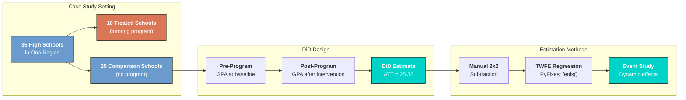
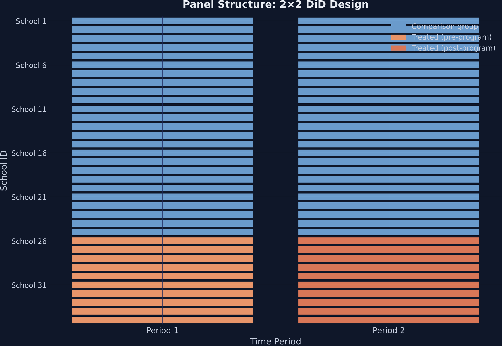
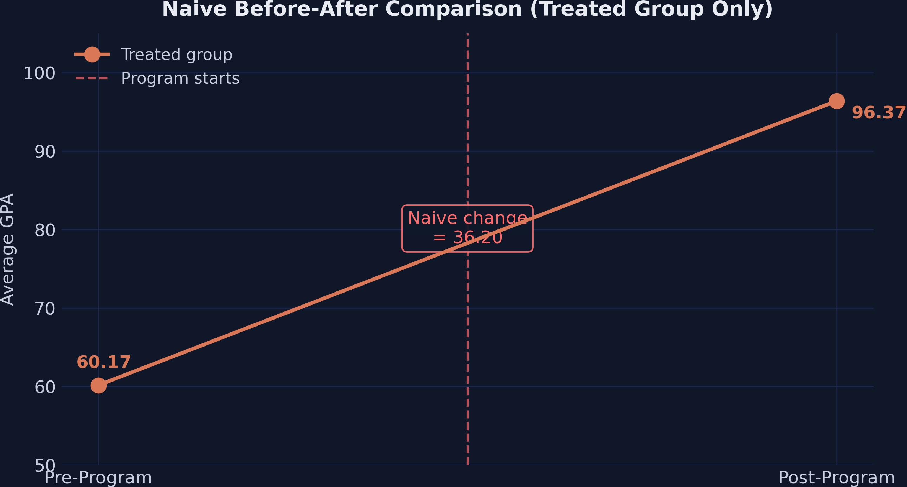
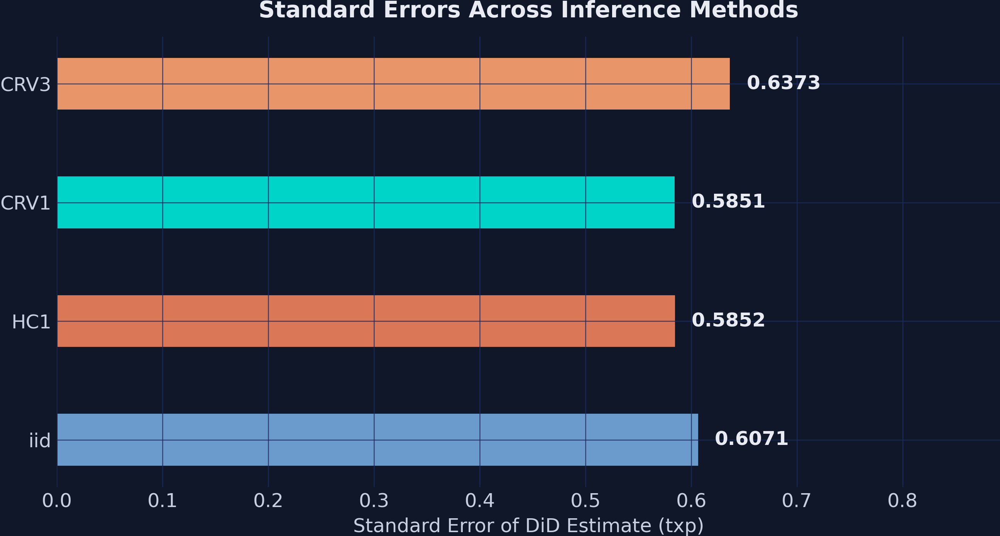
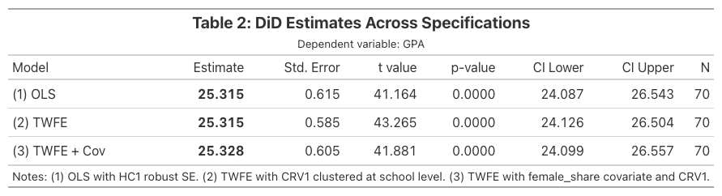
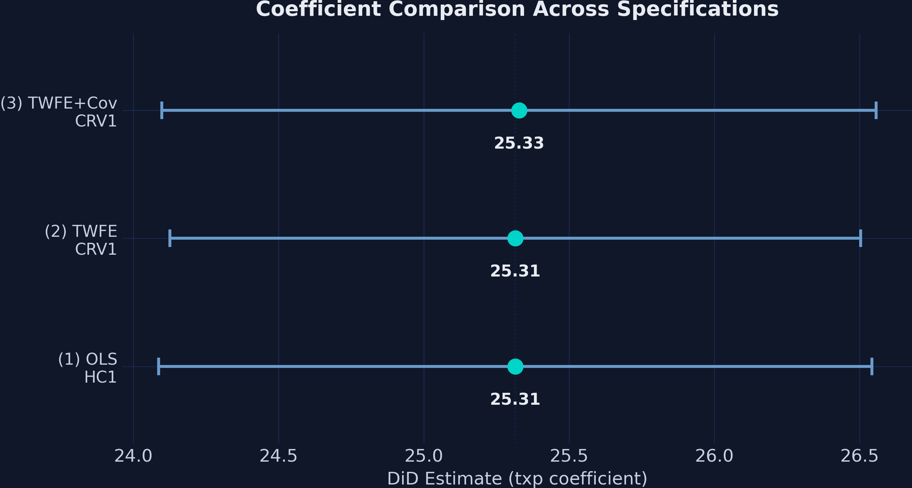
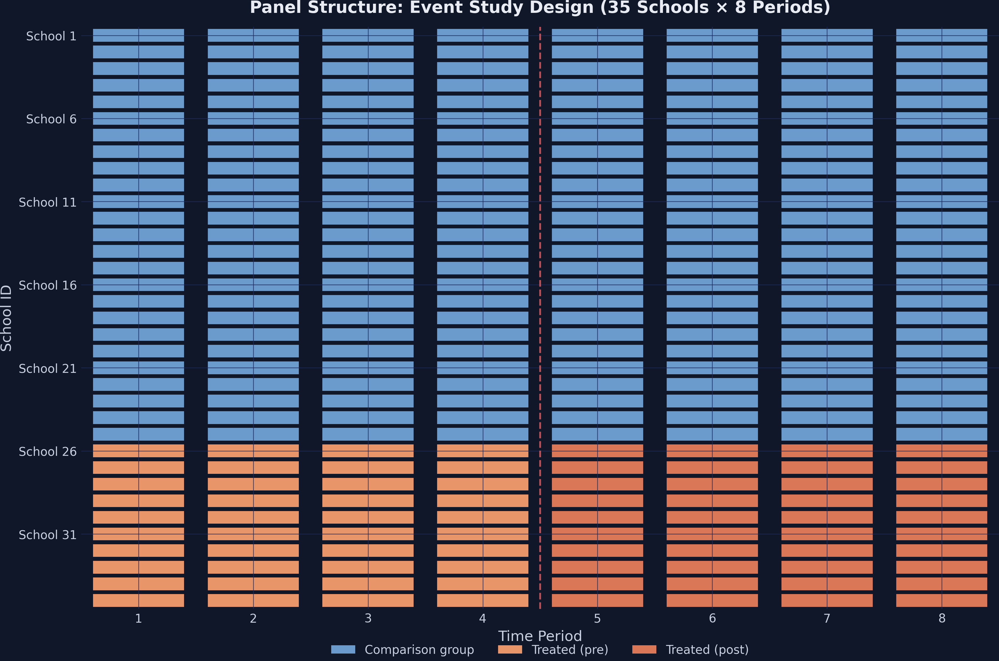
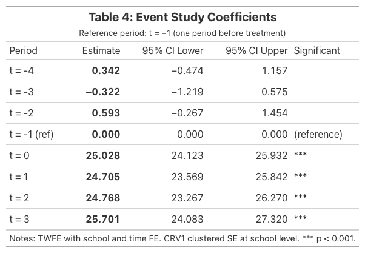

---
authors:
- admin
categories:
  - Python
  - Difference-in-Differences (DiD)
date: "2026-04-27T00:00:00Z"
draft: false
featured: false
image:
  caption: ""
  focal_point: "Smart"
  placement: 3
  preview_only: false
links:
- icon: code
  icon_pack: fas
  name: "Python script"
  url: script.py
- icon: database
  icon_pack: fas
  name: "Dataset (2x2)"
  url: https://github.com/quarcs-lab/data-open/raw/master/isds/tutoring_did.dta
- icon: database
  icon_pack: fas
  name: "Dataset (Event Study)"
  url: https://github.com/quarcs-lab/data-open/raw/master/isds/tutoring_didevent.dta
- icon: google-colab
  icon_pack: ai
  name: "Google Colab"
  url: https://colab.research.google.com/github/cmg777/starter-academic-v501/blob/master/content/post/python_did101/notebook.ipynb
- icon: podcast
  icon_pack: fas
  name: AI Podcast
  url: "/post/python_did101/#podcast-player"
- icon: youtube
  icon_pack: fab
  name: AI Video
  url: "/post/python_did101/#video-player"
- icon: markdown
  icon_pack: fab
  name: "MD version"
  url: https://raw.githubusercontent.com/cmg777/starter-academic-v501/master/content/post/python_did101/index.md
summary: "Learn Difference-in-Differences (DiD) in Python using PyFixest and Great Tables. Covers the 2x2 design, TWFE regression, inference comparison, publication-quality tables, event studies, and parallel trends testing based on Corral and Yang (2024)."
tags:
- python
- causal
- did
- panel
- education
- pyfixest
- panel data
title: "Introduction to Difference-in-Differences (DiD) in Python"
toc: true
diagram: true
---

## 1. Overview

How much does an after-school tutoring program improve student performance? A school district implemented a new after-school tutoring program in 10 of its 35 high schools. After one year, the average GPA in tutored schools jumped from **60.17** to **96.37** — a staggering **36.20-point** increase. Case closed?

Not quite. Over the same period, GPA also rose in the 25 schools that *did not* receive the program — from **71.22** to **82.10**. Some of the improvement in tutored schools simply reflects a region-wide upward trend. **Difference-in-Differences (DiD)** strips away that common trend and reveals the tutoring program's true causal effect: an **ATT of approximately 25.32 GPA points**.

This tutorial walks through DiD estimation in Python using [PyFixest](https://pyfixest.org/) — a fast, Stata-flavored econometrics package — alongside [Great Tables](https://posit-dev.github.io/great-tables/) for publication-quality output. We use the simulated case study from [Corral and Yang (2024)](https://doi.org/10.1007/s12564-024-09984-9), the same dataset used in the [Stata companion tutorial](/post/stata_did/).

### 1.1 Learning objectives

By the end of this tutorial, you will be able to:

- Explain why **naive before-after comparisons overstate** treatment effects
- Compute **2×2 DiD manually** and via PyFixest's `feols()` function
- Estimate DiD using **multiple equivalent approaches** with a unified formula syntax
- Compare inference under **iid, HC1, CRV1, and CRV3** standard errors
- Build **publication-quality regression tables** with `etable()` and Great Tables
- Estimate and plot **event study models** with `i()` for dynamic treatment effects

### 1.2 Study design



The data has a clean **panel structure**: each of the 35 schools is observed in two time periods (pre and post), giving us 70 observations for the 2×2 design. A second dataset extends this to 8 periods (280 observations) for the event study analysis.

### 1.3 Key concepts at a glance

The post leans on a small vocabulary repeatedly. The rest of the tutorial assumes you can move between these terms quickly. Each concept below has three parts. The **definition** is always visible. The **example** and **analogy** sit behind clickable cards: open them when you need them, leave them collapsed for a quick scan. If a later section mentions "parallel trends" or "event study" and the term feels slippery, this is the section to re-read.

**1. Difference-in-Differences (DiD).**
The 2×2 estimator. Compare the change in outcomes for the treated group to the change in outcomes for an untreated control group. The difference of those two differences is the causal estimate. DiD nets out time-invariant differences between groups AND time trends shared by both.

<div class="concept-pair">
<details class="concept-card concept-example">
<summary>Example</summary>

Treated schools' average `gpa` rose from 60.17 to 96.37 — a 36.20-point change. Control schools rose from 71.22 to 82.10 — a 10.88-point change. The DiD ATT is $36.20 - 10.88 = 25.32$ GPA points. The control change is the secular trend; subtracting it isolates the program's effect.

</details>

<details class="concept-card concept-analogy">
<summary>Analogy</summary>

Subtract everyone's secular drift before judging the treatment. If the whole school district's GPA rose 11 points due to a new curriculum, you cannot credit that to your tutoring program. DiD subtracts the district-wide drift first.

</details>
</div>

**2. Parallel trends assumption.**
The identifying assumption: in the absence of treatment, the treated and control groups' average outcomes would have followed the *same* trajectory. Differences in *levels* are fine. Differences in *changes* (slopes) would invalidate DiD.

<div class="concept-pair">
<details class="concept-card concept-example">
<summary>Example</summary>

The simulation generates data with parallel pre-trends by construction. In the 8-period extension, the event-study leads (`lead-1`, `lead-2`, etc.) are all near zero — no pre-treatment divergence between treated and control schools. The assumption holds visually and statistically.

</details>

<details class="concept-card concept-analogy">
<summary>Analogy</summary>

Sister cars on parallel tracks. They started at different speeds, but they accelerate identically. Without the treatment, both stay parallel. With the treatment, the treated car accelerates more — and we measure that extra acceleration.

</details>
</div>

**3. ATT** $E[Y(1) - Y(0) \mid D=1]$.
Average Treatment effect on the Treated. The mean causal effect for the units that *actually got* the treatment. DiD identifies the ATT (not the ATE) under parallel trends. ATT and ATE diverge when treatment effects vary in ways correlated with selection into treatment.

<div class="concept-pair">
<details class="concept-card concept-example">
<summary>Example</summary>

The DiD estimate of 25.32 GPA points is the ATT for treated schools. It says: the *average* effect of the program *for schools that received it* is 25.32 points. Schools that did not receive treatment may have responded differently — DiD says nothing about them.

</details>

<details class="concept-card concept-analogy">
<summary>Analogy</summary>

The bump on the treated track. Both cars drove the same distance with the engine off. With the engine on, the treated car gains 25 extra mph. That extra is for *that car*, not "any car you might pick."

</details>
</div>

**4. Counterfactual.**
The hypothetical outcome the treated unit would have had *without* treatment. Never observed directly. DiD constructs it as: "treated pre-period level + control's secular change."

<div class="concept-pair">
<details class="concept-card concept-example">
<summary>Example</summary>

For treated schools, the post-period counterfactual is $60.17 + 10.88 = 71.05$ GPA points — what we would expect if the schools had drifted with the control group's trend. The actual post-period mean is 96.37; the gap (25.32) is the ATT.

</details>

<details class="concept-card concept-analogy">
<summary>Analogy</summary>

The path the treated track *would* have taken. We never see the parallel-universe version of the treated schools where they did not receive tutoring. We reconstruct it from "their starting point plus the control's drift."

</details>
</div>

**5. Two-Way Fixed Effects (TWFE)** $\alpha\_i + \delta\_t$.
The regression implementation of DiD with multiple periods or multiple groups. Includes a fixed effect for each unit and a fixed effect for each time period. The coefficient on the treatment-period interaction is the DiD estimate.

<div class="concept-pair">
<details class="concept-card concept-example">
<summary>Example</summary>

The 2×2 TWFE specification with fixed effects on `id` and `time` and the regressor `txp` returns the same 25.32 ATT as the manual difference-of-differences calculation. With more periods, TWFE generalizes naturally; the manual 2×2 does not.

</details>

<details class="concept-card concept-analogy">
<summary>Analogy</summary>

Wiping the negative twice. First wipe removes school-specific stains (their starting GPA, demographics). Second wipe removes period-specific glare (district-wide policy shocks). What remains is the change attributable to the treatment.

</details>
</div>

**6. Event study.**
A dynamic specification that estimates a separate treatment effect for each period before and after the treatment date. Pre-treatment coefficients (leads) test parallel trends. Post-treatment coefficients (lags) trace out the dynamic effect.

<div class="concept-pair">
<details class="concept-card concept-example">
<summary>Example</summary>

The 8-period event-study specification returns near-zero coefficients for the pre-treatment leads and large positive coefficients for post-treatment lags. The post-treatment effects grow modestly over time, suggesting the program's benefit accumulates.

</details>

<details class="concept-card concept-analogy">
<summary>Analogy</summary>

Recording the radio signal frame-by-frame. Instead of one big "before vs after" reading, you record each year separately. The pre-treatment frames should be silent. Post-treatment frames trace out the unfolding signal.

</details>
</div>

**7. Naive before-after comparison.**
The biased estimator: compute the treated group's pre-vs-post change and call that the treatment effect. Ignores the control group. Equates "secular drift" with "treatment effect."

<div class="concept-pair">
<details class="concept-card concept-example">
<summary>Example</summary>

The naive before-after on the treated schools alone is $96.37 - 60.17 = 36.20$ GPA points. The DiD ATT is 25.32. The 10.88-point gap is the secular drift the naive estimator wrongly attributed to the program.

</details>

<details class="concept-card concept-analogy">
<summary>Analogy</summary>

Blaming the rooster for the sunrise. The rooster crows before sunrise; sunrise follows. But the rooster is not causing the sunrise. Naive before-after does not have a control rooster-free village to compare with.

</details>
</div>

**8. SUTVA** (Stable Unit Treatment Value Assumption).
Two parts. (a) *No interference*: one unit's treatment status does not affect another unit's outcome (no spillovers). (b) *Single version*: the treatment is "the same" treatment across units; no hidden variation. SUTVA is required for the potential-outcomes framework to make sense.

<div class="concept-pair">
<details class="concept-card concept-example">
<summary>Example</summary>

SUTVA assumes that one school's tutoring program does not boost or depress neighbouring schools' `gpa` (no interference) and that all 10 treated schools received the *same* program (single version). The simulation enforces both by construction; in field data, both are testable concerns.

</details>

<details class="concept-card concept-analogy">
<summary>Analogy</summary>

No contagion between patients. Patient A taking the drug should not affect Patient B's outcome. If they live in the same household and share medication, SUTVA fails. The "no spillover" assumption is the medical version.

</details>
</div>

---

<style>
.podcast-overlay {
  display: none;
  position: fixed;
  bottom: 0;
  left: 0;
  right: 0;
  z-index: 9999;
  animation: podSlideUp 0.35s ease-out;
}
@keyframes podSlideUp {
  from { transform: translateY(100%); }
  to { transform: translateY(0); }
}
.podcast-overlay.pod-closing {
  animation: podSlideDown 0.3s ease-in forwards;
}
@keyframes podSlideDown {
  from { transform: translateY(0); }
  to { transform: translateY(100%); }
}
.podcast-container {
  background: linear-gradient(135deg, #1a1a2e 0%, #16213e 100%);
  padding: 18px 24px 20px;
  font-family: -apple-system, BlinkMacSystemFont, 'Segoe UI', Roboto, sans-serif;
  box-shadow: 0 -4px 32px rgba(0,0,0,0.5);
  border-top: 1px solid rgba(106,155,204,0.2);
}
.podcast-inner {
  max-width: 800px;
  margin: 0 auto;
}
.podcast-top-row {
  display: flex;
  align-items: center;
  gap: 14px;
  margin-bottom: 14px;
}
.podcast-icon {
  width: 42px;
  height: 42px;
  background: linear-gradient(135deg, #d97757, #e8956a);
  border-radius: 10px;
  display: flex;
  align-items: center;
  justify-content: center;
  flex-shrink: 0;
}
.podcast-icon svg {
  width: 22px;
  height: 22px;
  fill: #fff;
}
.podcast-title-block {
  flex: 1;
  min-width: 0;
}
.podcast-title-block h4 {
  margin: 0 0 1px 0;
  color: #f0ece2;
  font-size: 14px;
  font-weight: 600;
  letter-spacing: 0.02em;
  white-space: nowrap;
  overflow: hidden;
  text-overflow: ellipsis;
}
.podcast-title-block span {
  color: #8b9dc3;
  font-size: 11px;
}
.podcast-close-btn {
  background: none;
  border: none;
  cursor: pointer;
  padding: 6px;
  border-radius: 50%;
  display: flex;
  align-items: center;
  justify-content: center;
  transition: background 0.2s;
  flex-shrink: 0;
}
.podcast-close-btn:hover {
  background: rgba(255,255,255,0.1);
}
.podcast-close-btn svg {
  width: 20px;
  height: 20px;
  fill: #8b9dc3;
}
.podcast-progress-wrap {
  margin-bottom: 12px;
}
.podcast-time-row {
  display: flex;
  justify-content: space-between;
  font-size: 11px;
  color: #8b9dc3;
  margin-bottom: 5px;
  font-variant-numeric: tabular-nums;
}
.podcast-bar-bg {
  width: 100%;
  height: 6px;
  background: rgba(255,255,255,0.1);
  border-radius: 3px;
  cursor: pointer;
  position: relative;
  overflow: hidden;
  transition: height 0.15s;
}
.podcast-bar-buffered {
  position: absolute;
  top: 0;
  left: 0;
  height: 100%;
  background: rgba(106,155,204,0.25);
  border-radius: 3px;
  transition: width 0.3s;
}
.podcast-bar-progress {
  position: absolute;
  top: 0;
  left: 0;
  height: 100%;
  background: linear-gradient(90deg, #6a9bcc, #00d4c8);
  border-radius: 3px;
  transition: width 0.1s linear;
}
.podcast-bar-bg:hover {
  height: 10px;
  margin-top: -2px;
}
.podcast-controls-row {
  display: flex;
  align-items: center;
  justify-content: space-between;
}
.podcast-transport {
  display: flex;
  align-items: center;
  gap: 8px;
}
.podcast-btn {
  background: none;
  border: none;
  cursor: pointer;
  padding: 4px;
  display: flex;
  align-items: center;
  justify-content: center;
  border-radius: 50%;
  transition: all 0.2s;
}
.podcast-btn svg {
  fill: #c8d0e0;
  transition: fill 0.2s;
}
.podcast-btn:hover svg {
  fill: #f0ece2;
}
.podcast-btn-skip {
  position: relative;
}
.podcast-btn-skip span {
  position: absolute;
  font-size: 7px;
  font-weight: 700;
  color: #c8d0e0;
  top: 50%;
  left: 50%;
  transform: translate(-50%, -50%);
  pointer-events: none;
  margin-top: 1px;
}
.podcast-btn-play {
  width: 48px;
  height: 48px;
  background: linear-gradient(135deg, #d97757, #e8956a);
  border-radius: 50%;
  box-shadow: 0 3px 12px rgba(217,119,87,0.4);
  transition: all 0.2s;
}
.podcast-btn-play:hover {
  transform: scale(1.08);
  box-shadow: 0 5px 20px rgba(217,119,87,0.5);
}
.podcast-btn-play svg {
  fill: #fff;
  width: 22px;
  height: 22px;
}
.podcast-extras {
  display: flex;
  align-items: center;
  gap: 10px;
}
.podcast-volume-wrap {
  display: flex;
  align-items: center;
  gap: 5px;
}
.podcast-volume-wrap svg {
  fill: #8b9dc3;
  width: 16px;
  height: 16px;
  cursor: pointer;
  flex-shrink: 0;
}
.podcast-volume-wrap svg:hover {
  fill: #c8d0e0;
}
.podcast-volume-slider {
  -webkit-appearance: none;
  appearance: none;
  width: 60px;
  height: 4px;
  background: rgba(255,255,255,0.12);
  border-radius: 2px;
  outline: none;
  cursor: pointer;
}
.podcast-volume-slider::-webkit-slider-thumb {
  -webkit-appearance: none;
  appearance: none;
  width: 12px;
  height: 12px;
  background: #6a9bcc;
  border-radius: 50%;
  cursor: pointer;
}
.podcast-speed-btn {
  background: rgba(255,255,255,0.08);
  border: 1px solid rgba(255,255,255,0.12);
  color: #c8d0e0;
  font-size: 11px;
  font-weight: 600;
  padding: 3px 9px;
  border-radius: 12px;
  cursor: pointer;
  transition: all 0.2s;
  font-family: inherit;
  min-width: 40px;
  text-align: center;
}
.podcast-speed-btn:hover {
  background: rgba(106,155,204,0.2);
  border-color: #6a9bcc;
  color: #f0ece2;
}
.podcast-download-btn {
  background: none;
  border: 1px solid rgba(255,255,255,0.12);
  border-radius: 8px;
  padding: 4px 10px;
  cursor: pointer;
  display: flex;
  align-items: center;
  gap: 4px;
  color: #8b9dc3;
  font-size: 11px;
  font-family: inherit;
  text-decoration: none;
  transition: all 0.2s;
}
.podcast-download-btn:hover {
  border-color: #6a9bcc;
  color: #f0ece2;
  background: rgba(106,155,204,0.1);
}
.podcast-download-btn svg {
  width: 14px;
  height: 14px;
  fill: currentColor;
}
@media (max-width: 600px) {
  .podcast-container { padding: 14px 16px 16px; }
  .podcast-volume-wrap { display: none; }
  .podcast-title-block h4 { font-size: 13px; }
  .podcast-extras { gap: 8px; }
}
/* Video player overlay */
.video-overlay {
  display: none;
  position: fixed;
  top: 0;
  left: 0;
  right: 0;
  bottom: 0;
  z-index: 9999;
  background: rgba(0,0,0,0.85);
  animation: vidFadeIn 0.3s ease-out;
}
@keyframes vidFadeIn {
  from { opacity: 0; }
  to { opacity: 1; }
}
.video-overlay.vid-closing {
  animation: vidFadeOut 0.25s ease-in forwards;
}
@keyframes vidFadeOut {
  from { opacity: 1; }
  to { opacity: 0; }
}
.video-container {
  position: absolute;
  top: 50%;
  left: 50%;
  transform: translate(-50%, -50%);
  width: 94%;
  max-width: 1600px;
}
.video-top-row {
  display: flex;
  align-items: center;
  justify-content: space-between;
  margin-bottom: 10px;
}
.video-top-row h4 {
  margin: 0;
  color: #f0ece2;
  font-size: 15px;
  font-weight: 600;
  font-family: -apple-system, BlinkMacSystemFont, 'Segoe UI', Roboto, sans-serif;
  display: flex;
  align-items: center;
  gap: 10px;
}
.video-icon {
  width: 34px;
  height: 34px;
  background: #ff0000;
  border-radius: 8px;
  display: flex;
  align-items: center;
  justify-content: center;
  flex-shrink: 0;
}
.video-icon svg {
  width: 18px;
  height: 18px;
  fill: #fff;
}
.video-close-btn {
  background: none;
  border: none;
  cursor: pointer;
  padding: 6px;
  border-radius: 50%;
  display: flex;
  align-items: center;
  justify-content: center;
  transition: background 0.2s;
}
.video-close-btn:hover {
  background: rgba(255,255,255,0.15);
}
.video-close-btn svg {
  width: 24px;
  height: 24px;
  fill: #c8d0e0;
}
.video-frame-wrap {
  position: relative;
  padding-bottom: 56.25%;
  height: 0;
  overflow: hidden;
  border-radius: 8px;
  background: #000;
  box-shadow: 0 8px 40px rgba(0,0,0,0.6);
}
.video-frame-wrap iframe {
  position: absolute;
  top: 0;
  left: 0;
  width: 100%;
  height: 100%;
  border: 0;
  border-radius: 8px;
}
@media (max-width: 600px) {
  .video-container { width: 98%; }
  .video-top-row h4 { font-size: 13px; }
}
</style>

<div class="podcast-overlay" id="podOverlay">
<div class="podcast-container">
<div class="podcast-inner">
  <audio id="podAudio" preload="none" src="https://files.catbox.moe/s6tyrz.wav"></audio>

  <div class="podcast-top-row">
    <div class="podcast-icon">
      <svg viewBox="0 0 24 24"><path d="M12 1a5 5 0 0 0-5 5v4a5 5 0 0 0 10 0V6a5 5 0 0 0-5-5zm0 16a7 7 0 0 1-7-7H3a9 9 0 0 0 8 8.94V22h2v-3.06A9 9 0 0 0 21 10h-2a7 7 0 0 1-7 7z"/></svg>
    </div>
    <div class="podcast-title-block">
      <h4>AI Podcast: Introduction to DiD</h4>
      <span id="podDurationLabel">Click play to load</span>
    </div>
    <button class="podcast-close-btn" onclick="podClose()" title="Close player">
      <svg viewBox="0 0 24 24"><path d="M19 6.41L17.59 5 12 10.59 6.41 5 5 6.41 10.59 12 5 17.59 6.41 19 12 13.41 17.59 19 19 17.59 13.41 12z"/></svg>
    </button>
  </div>

  <div class="podcast-progress-wrap">
    <div class="podcast-time-row">
      <span id="podCurrent">0:00</span>
      <span id="podDuration">0:00</span>
    </div>
    <div class="podcast-bar-bg" id="podBarBg" onclick="podSeek(event)">
      <div class="podcast-bar-buffered" id="podBuffered"></div>
      <div class="podcast-bar-progress" id="podProgress"></div>
    </div>
  </div>

  <div class="podcast-controls-row">
    <div class="podcast-transport">
      <button class="podcast-btn podcast-btn-skip" onclick="podSkip(-15)" title="Back 15s">
        <svg width="26" height="26" viewBox="0 0 24 24"><path d="M12 5V1L7 6l5 5V7c3.31 0 6 2.69 6 6s-2.69 6-6 6-6-2.69-6-6H4c0 4.42 3.58 8 8 8s8-3.58 8-8-3.58-8-8-8z"/></svg>
        <span>15</span>
      </button>
      <button class="podcast-btn podcast-btn-play" id="podPlayBtn" onclick="podToggle()" title="Play">
        <svg id="podIconPlay" viewBox="0 0 24 24"><path d="M8 5v14l11-7z"/></svg>
        <svg id="podIconPause" viewBox="0 0 24 24" style="display:none"><path d="M6 19h4V5H6v14zm8-14v14h4V5h-4z"/></svg>
      </button>
      <button class="podcast-btn podcast-btn-skip" onclick="podSkip(15)" title="Forward 15s">
        <svg width="26" height="26" viewBox="0 0 24 24"><path d="M12 5V1l5 5-5 5V7c-3.31 0-6 2.69-6 6s2.69 6 6 6 6-2.69 6-6h2c0 4.42-3.58 8-8 8s-8-3.58-8-8 3.58-8 8-8z"/></svg>
        <span>15</span>
      </button>
    </div>
    <div class="podcast-extras">
      <div class="podcast-volume-wrap">
        <svg id="podVolIcon" onclick="podMute()" viewBox="0 0 24 24"><path d="M3 9v6h4l5 5V4L7 9H3zm13.5 3A4.5 4.5 0 0 0 14 8.5v7a4.47 4.47 0 0 0 2.5-3.5zM14 3.23v2.06a6.51 6.51 0 0 1 0 13.42v2.06A8.51 8.51 0 0 0 14 3.23z"/></svg>
        <input type="range" class="podcast-volume-slider" id="podVolume" min="0" max="1" step="0.05" value="0.8">
      </div>
      <button class="podcast-speed-btn" id="podSpeedBtn" onclick="podCycleSpeed()" title="Playback speed">1x</button>
      <a class="podcast-download-btn" href="https://files.catbox.moe/s6tyrz.wav" download="did101_podcast.wav" title="Download">
        <svg viewBox="0 0 24 24"><path d="M19 9h-4V3H9v6H5l7 7 7-7zM5 18v2h14v-2H5z"/></svg>
      </a>
    </div>
  </div>
</div>
</div>
</div>

<script>
(function(){
  var overlay = document.getElementById('podOverlay');
  var a = document.getElementById('podAudio');
  var speeds = [0.75, 1, 1.25, 1.5, 2];
  var si = 1;
  var opened = false;
  function fmt(s){
    if(isNaN(s)) return '0:00';
    var m=Math.floor(s/60), sec=Math.floor(s%60);
    return m+':'+(sec<10?'0':'')+sec;
  }
  document.addEventListener('click', function(e){
    var link = e.target.closest('a.btn-page-header');
    if(!link) return;
    var text = link.textContent.trim();
    if(text.indexOf('AI Podcast') === -1) return;
    e.preventDefault();
    e.stopPropagation();
    overlay.style.display = 'block';
    overlay.classList.remove('pod-closing');
    if(!opened){
      a.preload = 'metadata';
      a.load();
      opened = true;
    }
  });
  a.volume = 0.8;
  a.addEventListener('loadedmetadata', function(){
    document.getElementById('podDuration').textContent = fmt(a.duration);
    document.getElementById('podDurationLabel').textContent = fmt(a.duration) + ' minutes';
  });
  a.addEventListener('timeupdate', function(){
    document.getElementById('podCurrent').textContent = fmt(a.currentTime);
    var pct = a.duration ? (a.currentTime/a.duration)*100 : 0;
    document.getElementById('podProgress').style.width = pct+'%';
  });
  a.addEventListener('progress', function(){
    if(a.buffered.length>0){
      var pct = (a.buffered.end(a.buffered.length-1)/a.duration)*100;
      document.getElementById('podBuffered').style.width = pct+'%';
    }
  });
  a.addEventListener('ended', function(){
    document.getElementById('podIconPlay').style.display='';
    document.getElementById('podIconPause').style.display='none';
  });
  window.podToggle = function(){
    if(a.paused){a.play();document.getElementById('podIconPlay').style.display='none';document.getElementById('podIconPause').style.display='';}
    else{a.pause();document.getElementById('podIconPlay').style.display='';document.getElementById('podIconPause').style.display='none';}
  };
  window.podSkip = function(s){a.currentTime = Math.max(0,Math.min(a.duration||0,a.currentTime+s));};
  window.podSeek = function(e){
    var rect = document.getElementById('podBarBg').getBoundingClientRect();
    var pct = (e.clientX - rect.left)/rect.width;
    a.currentTime = pct * (a.duration||0);
  };
  window.podMute = function(){
    a.muted = !a.muted;
    document.getElementById('podVolume').value = a.muted ? 0 : a.volume;
  };
  window.podCycleSpeed = function(){
    si = (si+1) % speeds.length;
    a.playbackRate = speeds[si];
    document.getElementById('podSpeedBtn').textContent = speeds[si]+'x';
  };
  window.podClose = function(){
    overlay.classList.add('pod-closing');
    setTimeout(function(){ overlay.style.display='none'; }, 300);
    a.pause();
    document.getElementById('podIconPlay').style.display='';
    document.getElementById('podIconPause').style.display='none';
  };
  document.getElementById('podVolume').addEventListener('input', function(){
    a.volume = this.value;
    a.muted = false;
  });
  if(window.location.hash === '#podcast-player'){
    overlay.style.display = 'block';
    a.preload = 'metadata';
    a.load();
    opened = true;
  }
})();
</script>

<div class="video-overlay" id="vidOverlay">
<div class="video-container">
  <div class="video-top-row">
    <h4>
      <span class="video-icon">
        <svg viewBox="0 0 24 24"><path d="M10 15l5.19-3L10 9v6m11.56-7.83c.13.47.22 1.1.28 1.9.07.8.1 1.49.1 2.09L22 12c0 2.19-.16 3.8-.44 4.83-.25.9-.83 1.48-1.73 1.73-.47.13-1.33.22-2.65.28-1.3.07-2.49.1-3.59.1L12 19c-4.19 0-6.8-.16-7.83-.44-.9-.25-1.48-.83-1.73-1.73-.13-.47-.22-1.1-.28-1.9-.07-.8-.1-1.49-.1-2.09L2 12c0-2.19.16-3.8.44-4.83.25-.9.83-1.48 1.73-1.73.47-.13 1.33-.22 2.65-.28 1.3-.07 2.49-.1 3.59-.1L12 5c4.19 0 6.8.16 7.83.44.9.25 1.48.83 1.73 1.73z"/></svg>
      </span>
      AI Video: Introduction to DiD
    </h4>
    <button class="video-close-btn" onclick="vidClose()" title="Close video">
      <svg viewBox="0 0 24 24"><path d="M19 6.41L17.59 5 12 10.59 6.41 5 5 6.41 10.59 12 5 17.59 6.41 19 12 13.41 17.59 19 19 17.59 13.41 12z"/></svg>
    </button>
  </div>
  <div class="video-frame-wrap">
    <iframe id="vidFrame" allow="accelerometer; autoplay; clipboard-write; encrypted-media; gyroscope; picture-in-picture" allowfullscreen></iframe>
  </div>
</div>
</div>

<script>
(function(){
  var overlay = document.getElementById('vidOverlay');
  var frame = document.getElementById('vidFrame');
  var vidSrc = 'https://www.youtube.com/embed/qObP9bGU5rM?enablejsapi=1&rel=0';
  function vidOpen(){
    frame.src = vidSrc;
    overlay.style.display = 'block';
    overlay.classList.remove('vid-closing');
  }
  window.vidClose = function(){
    overlay.classList.add('vid-closing');
    setTimeout(function(){
      overlay.style.display = 'none';
      frame.src = '';
    }, 250);
  };
  document.addEventListener('click', function(e){
    var link = e.target.closest('a.btn-page-header');
    if(!link) return;
    var text = link.textContent.trim();
    if(text.indexOf('AI Video') === -1) return;
    e.preventDefault();
    e.stopPropagation();
    vidOpen();
  });
  overlay.addEventListener('click', function(e){
    if(e.target === overlay) vidClose();
  });
  if(window.location.hash === '#video-player'){
    vidOpen();
  }
})();
</script>

---

## 2. Setup and Imports

Install the required packages:

```python
pip install pyfixest great_tables pandas matplotlib
```

Import the libraries:

```python
import numpy as np
import pandas as pd
import matplotlib.pyplot as plt
import pyfixest as pf
from great_tables import GT, md, style, loc
```

| Package | Purpose |
|---------|---------|
| `pyfixest` | Fast fixed-effects estimation with Stata-like formula syntax |
| `great_tables` | Publication-quality HTML/PNG tables from DataFrames |
| `pandas` | Data loading, manipulation, and summary statistics |
| `matplotlib` | Custom figure generation with dark theme styling |

<details>
<summary><strong>Dark theme figure styling</strong> (click to expand)</summary>

```python
# Site color palette
STEEL_BLUE = "#6a9bcc"
WARM_ORANGE = "#d97757"
NEAR_BLACK = "#141413"
TEAL = "#00d4c8"

# Dark theme palette
DARK_NAVY = "#0f1729"
GRID_LINE = "#1f2b5e"
LIGHT_TEXT = "#c8d0e0"
WHITE_TEXT = "#e8ecf2"

plt.rcParams.update({
    "figure.facecolor": DARK_NAVY,
    "axes.facecolor": DARK_NAVY,
    "axes.edgecolor": DARK_NAVY,
    "axes.linewidth": 0,
    "axes.labelcolor": LIGHT_TEXT,
    "axes.titlecolor": WHITE_TEXT,
    "axes.spines.top": False,
    "axes.spines.right": False,
    "axes.spines.left": False,
    "axes.spines.bottom": False,
    "axes.grid": True,
    "grid.color": GRID_LINE,
    "grid.linewidth": 0.6,
    "grid.alpha": 0.8,
    "xtick.color": LIGHT_TEXT,
    "ytick.color": LIGHT_TEXT,
    "text.color": WHITE_TEXT,
    "font.size": 12,
    "legend.frameon": False,
    "savefig.facecolor": DARK_NAVY,
})
```

</details>


## 3. Data Loading and Exploration

We load the 2×2 dataset directly from GitHub. This Stata `.dta` file contains 35 schools observed across 2 time periods:

```python
url_did = "https://github.com/quarcs-lab/data-open/raw/master/isds/tutoring_did.dta"
df = pd.read_stata(url_did).astype(float)
print(df.shape)
print(df.dtypes)
```

```text
(70, 7)

id              float64
time            float64
treated         float64
post            float64
txp             float64
gpa             float64
female_share    float64
dtype: object
```

The dataset has **70 observations** (35 schools × 2 periods) and **7 variables**:

- `id` — School identifier (1–35)
- `time` — Time period (1 = pre, 2 = post)
- `treated` — Treatment indicator (1 = received tutoring program)
- `post` — Post-period indicator (1 = after program implementation)
- `txp` — Interaction term (treated × post)
- `gpa` — Outcome: average GPA of low-income students (0–100 scale)
- `female_share` — Share of female students (covariate)

```python
print(df.describe().round(2))
```

```text
          id  time  treated  post    txp    gpa  female_share
count  70.00  70.0    70.00  70.0  70.00  70.00         70.00
mean   18.00   1.5     0.29   0.5   0.14  77.12          0.53
std    10.17   0.5     0.46   0.5   0.35  10.88          0.03
min     1.00   1.0     0.00   0.0   0.00  59.39          0.47
25%     9.25   1.0     0.00   0.0   0.00  70.68          0.51
50%    18.00   1.5     0.00   0.5   0.00  76.27          0.53
75%    26.75   2.0     1.00   1.0   0.00  82.66          0.55
max    35.00   2.0     1.00   1.0   1.00  99.15          0.57
```

A crosstab confirms the balanced 2×2 design:

```python
ct = pd.crosstab(df["treated"], df["post"], margins=True)
print(ct)
```

```text
                Pre (0)  Post (1)  Total
Comparison (0)       25        25     50
Treated (1)          10        10     20
Total                35        35     70
```

We have **10 treated schools** observed in 2 periods (20 observations) and **25 comparison schools** (50 observations). This is a perfectly balanced panel — every school appears exactly once in each period.

### 3.1 Panel structure visualization

The heatmap below shows the treatment assignment across schools and time. Steel blue cells represent the comparison group, while orange cells indicate treated schools in the post-program period.



This is a *clean* 2×2 design: treatment timing is simultaneous (all 10 schools receive the program at the same time), and no school switches treatment status.


## 4. The Problem with Naive Comparisons

The most intuitive approach to measuring the program's effect is a simple before-after comparison for the treated schools:

```python
treated_means = df[df["treated"] == 1].groupby("post")["gpa"].mean()
print(f"Pre-program:  {treated_means[0]:.2f}")
print(f"Post-program: {treated_means[1]:.2f}")
print(f"Naive change: {treated_means[1] - treated_means[0]:.2f}")
```

```text
Pre-program:  60.17
Post-program: 96.37
Naive change: 36.20
```

The naive estimate says the program boosted GPA by **36.20 points**. But this ignores everything else that may have changed over the same period — curriculum reforms, new textbooks, regional economic shifts, or simply students maturing. Any of these factors could drive GPA upward in *all* schools, not just the treated ones.



The naive approach *overstates* the effect by conflating the treatment effect with time trends that would have occurred regardless of the program.


## 5. The DiD Design: Using a Comparison Group

The key insight of DiD is to use the **comparison group** as a mirror for what would have happened to the treated schools *without* the program. We compute all four group means:

```python
means = df.groupby(["treated", "post"])["gpa"].mean()
pre_control  = means[(0, 0)]   # 71.22
post_control = means[(0, 1)]   # 82.10
pre_treated  = means[(1, 0)]   # 60.17
post_treated = means[(1, 1)]   # 96.37
```

```text
Group means:
  Comparison Pre:  71.22
  Comparison Post: 82.10
  Treated Pre:     60.17
  Treated Post:    96.37
```

The comparison schools' GPA rose by **10.88 points** (from 71.22 to 82.10) — this is the *secular trend*. We assume the treated schools would have experienced the same trend absent the program. This gives us the **counterfactual**:

```python
counterfactual = pre_treated + (post_control - pre_control)
did_estimate = post_treated - counterfactual
print(f"Counterfactual: {pre_treated:.2f} + ({post_control:.2f} - {pre_control:.2f}) = {counterfactual:.2f}")
print(f"DiD estimate:   {post_treated:.2f} - {counterfactual:.2f} = {did_estimate:.2f}")
```

```text
Counterfactual: 60.17 + (82.10 - 71.22) = 71.05
DiD estimate:   96.37 - 71.05 = 25.32
```

The causal effect of the tutoring program is **25.32 GPA points** — not 36.20. The naive approach overstated the effect by **43%** because it attributed the 10.88-point common trend entirely to the program.


### 5.1 The parallel trends assumption

DiD rests on one critical assumption: **parallel trends**. In the absence of treatment, treated and comparison groups would have followed the *same trajectory* over time. Formally:

$$E[Y\_{i,1}(0) - Y\_{i,0}(0) \mid D=1] = E[Y\_{i,1}(0) - Y\_{i,0}(0) \mid D=0]$$

In words: the *change* in potential untreated outcomes is the same for both groups. Think of it like two runners on parallel tracks — they may start at different positions (treated schools have lower baseline GPA), but they run at the same pace. If one runner suddenly speeds up after receiving coaching, the difference between their new speed and the other runner's speed measures the coaching effect.

Note what parallel trends does *not* require: the two groups do not need the same *level* of GPA, only the same *trend*. This is why DiD is powerful — it naturally handles time-invariant differences between groups (like school quality or student demographics).

### 5.2 SUTVA

The **Stable Unit Treatment Value Assumption (SUTVA)** requires that one school's treatment does not affect another school's outcome. If untreated schools lost students to tutored schools, or if tutored schools drew resources away from comparison schools, the DiD estimate would be biased. In this setting, schools serve distinct geographic catchments, making spillovers unlikely.


## 6. Manual DiD Calculation

We can organize the four group means into a 2×2 table and compute the DiD as a *double difference*:

```python
means_table = df.groupby(["treated", "post"])["gpa"].mean().unstack()
means_table["Difference"] = means_table[1.0] - means_table[0.0]
print(means_table.round(2))
```

```text
                Pre (0)  Post (1)  Difference
Comparison (0)    71.22     82.10       10.88
Treated (1)       60.17     96.37       36.20
```

The DiD formula takes the *difference of differences*:

$$DiD = \Big(E[Y\_{i,1} \mid D=1] - E[Y\_{i,0} \mid D=1]\Big) - \Big(E[Y\_{i,1} \mid D=0] - E[Y\_{i,0} \mid D=0]\Big)$$

Plugging in the numbers:

$$DiD = (96.37 - 60.17) - (82.10 - 71.22) = 36.20 - 10.88 = 25.32$$

Think of it this way: the treated schools improved by 36.20 points, but 10.88 of those points would have happened anyway (as evidenced by the comparison group). The remaining **25.32 points** is the causal effect of the tutoring program.

Going back to the runner analogy: the treated runner sped up by 36.20 units while the comparison runner sped up by 10.88. The coaching effect is the extra 25.32 units of speed that only the coached runner gained.


## 7. DiD via Regression

### 7.1 Classical OLS with interaction

The manual calculation is equivalent to an OLS regression with the treatment indicator, time indicator, and their interaction:

$$Y\_{it} = \alpha + \beta\_1 \text{Treat}\_i + \beta\_2 \text{Post}\_t + \beta\_3 (\text{Treat}\_i \times \text{Post}\_t) + \varepsilon\_{it}$$

Where:
- $\alpha$ is the comparison group's pre-period mean (intercept)
- $\beta\_1$ captures the baseline difference between groups
- $\beta\_2$ captures the common time trend
- $\beta\_3$ is the **DiD estimate** — the causal effect of treatment

In PyFixest, the `feols()` function handles this with a familiar formula syntax:

```python
fit_ols = pf.feols("gpa ~ treated + post + txp", data=df, vcov="HC1")
print(fit_ols.summary())
```

```text
Estimation:  OLS
Dep. var.: gpa, Fixed effects: 0
Inference:  HC1
Observations:  70

| Coefficient   |   Estimate |   Std. Error |   t value |   Pr(>|t|) |    2.5% |   97.5% |
|:--------------|-----------:|-------------:|----------:|-----------:|--------:|--------:|
| Intercept     |     71.215 |        0.218 |   326.123 |      0.000 |  70.779 |  71.651 |
| treated       |    -11.049 |        0.288 |   -38.388 |      0.000 | -11.624 | -10.475 |
| post          |     10.886 |        0.339 |    32.116 |      0.000 |  10.209 |  11.563 |
| txp           |     25.315 |        0.615 |    41.164 |      0.000 |  24.087 |  26.543 |
---
RMSE: 1.15 R2: 0.989
```

Every coefficient maps directly to our group means:

- **Intercept (71.22)** — Comparison group pre-period mean
- **treated (−11.05)** — Treated schools start 11 points *below* comparison schools
- **post (10.89)** — Common time trend (comparison group's improvement)
- **txp (25.32)** — The DiD estimate, matching our manual calculation

The `vcov="HC1"` option requests heteroskedasticity-robust (White) standard errors, the most common choice for cross-sectional data.

### 7.2 TWFE with fixed effects

A more flexible approach absorbs school-level and time-level heterogeneity using **two-way fixed effects (TWFE)**. PyFixest uses the `|` pipe syntax to specify absorbed fixed effects:

$$Y\_{it} = \beta\_3 (\text{Treat}\_i \times \text{Post}\_t) + \gamma\_i + \vartheta\_t + \varepsilon\_{it}$$

Here $\gamma\_i$ are school fixed effects (absorbing all time-invariant school characteristics) and $\vartheta\_t$ are time fixed effects (absorbing all common time shocks). Since `treated` is perfectly collinear with $\gamma\_i$ and `post` is perfectly collinear with $\vartheta\_t$, only the interaction term `txp` remains:

```python
fit_twfe = pf.feols("gpa ~ txp | id + time", data=df, vcov={"CRV1": "id"})
print(fit_twfe.summary())
```

```text
Estimation:  OLS
Dep. var.: gpa, Fixed effects: id+time
Inference:  CRV1
Observations:  70

| Coefficient   |   Estimate |   Std. Error |   t value |   Pr(>|t|) |   2.5% |   97.5% |
|:--------------|-----------:|-------------:|----------:|-----------:|-------:|--------:|
| txp           |     25.315 |        0.585 |    43.265 |      0.000 | 24.126 |  26.504 |
---
RMSE: 0.788 R2: 0.995 R2 Within: 0.981
```

The estimate is unchanged: **25.315**. But the standard errors now use **CRV1 (cluster-robust variance)** clustered at the school level — the appropriate choice when treatment varies at the school level and observations within the same school are correlated.

The formula `"gpa ~ txp | id + time"` is one of PyFixest's key strengths: everything to the left of `|` is estimated, everything to the right is *absorbed*. No need to manually create dummy variables.

### 7.3 TWFE with covariate

We can add `female_share` as a time-varying covariate to check robustness:

```python
fit_cov = pf.feols("gpa ~ txp + female_share | id + time", data=df,
                    vcov={"CRV1": "id"})
print(fit_cov.summary())
```

```text
Estimation:  OLS
Dep. var.: gpa, Fixed effects: id+time
Inference:  CRV1
Observations:  70

| Coefficient   |   Estimate |   Std. Error |   t value |   Pr(>|t|) |    2.5% |   97.5% |
|:--------------|-----------:|-------------:|----------:|-----------:|--------:|--------:|
| txp           |     25.328 |        0.605 |    41.881 |      0.000 |  24.099 |  26.557 |
| female_share  |     -3.216 |        8.700 |    -0.370 |      0.714 | -20.898 |  14.465 |
---
RMSE: 0.785 R2: 0.995 R2 Within: 0.982
```

Adding `female_share` barely changes the DiD estimate (25.315 → 25.328, a shift of just 0.013). The covariate itself is statistically insignificant (p = 0.714), confirming that the two-way fixed effects already capture the relevant variation. This is reassuring — the treatment effect estimate is robust to the inclusion of observable covariates.

### 7.4 Programmatic access to results

PyFixest provides tidy methods for extracting specific quantities — useful for post-estimation workflows and building custom tables:

```python
print(f"Coefficient:   {fit_twfe.coef().values[0]:.4f}")
print(f"Std. Error:    {fit_twfe.se().values[0]:.4f}")
print(f"t-statistic:   {fit_twfe.tstat().values[0]:.4f}")
print(f"p-value:       {fit_twfe.pvalue().values[0]:.4f}")
print(f"95% CI:        [{fit_twfe.confint().values[0, 0]:.2f}, {fit_twfe.confint().values[0, 1]:.2f}]")
```

```text
Coefficient:   25.3149
Std. Error:    0.5851
t-statistic:   43.2655
p-value:       0.0000
95% CI:        [24.13, 26.50]
```

The `.tidy()` method returns a full DataFrame of results:

```python
print(fit_twfe.tidy())
```

```text
              Estimate  Std. Error    t value  Pr(>|t|)       2.5%      97.5%
Coefficient
txp          25.314897    0.585106  43.265472       0.0  24.125818  26.503976
```

### 7.5 Comparison across specifications

All three specifications produce essentially the same DiD estimate:

| Method | Estimate | Std. Error | 95% CI | SE Type |
|--------|----------|------------|--------|---------|
| OLS / HC1 | 25.315 | 0.615 | [24.09, 26.54] | Heteroskedasticity-robust |
| TWFE / CRV1 | 25.315 | 0.585 | [24.13, 26.50] | Cluster-robust (school) |
| TWFE + Cov / CRV1 | 25.328 | 0.605 | [24.10, 26.56] | Cluster-robust (school) |

The point estimates range from 25.315 to 25.328 — a difference of just 0.013 GPA points. The design (treatment assignment, fixed effects) does the heavy lifting; the choice of specification has negligible impact on the estimate.


## 8. Inference Comparison

One of PyFixest's strengths is the ability to quickly compare different inference approaches on the same model. Here we estimate the TWFE model four times, each with a different variance-covariance estimator:

```python
vcov_types = {
    "iid":  "iid",
    "HC1":  "HC1",
    "CRV1": {"CRV1": "id"},
    "CRV3": {"CRV3": "id"},
}

for label, vcov_spec in vcov_types.items():
    fit_tmp = pf.feols("gpa ~ txp | id + time", data=df, vcov=vcov_spec)
    tidy = fit_tmp.tidy()
    txp_row = tidy[tidy.index == "txp"].iloc[0]
    print(f"  {label:5s}: SE = {txp_row['Std. Error']:.4f}, "
          f"t = {txp_row['t value']:.2f}, "
          f"p = {txp_row['Pr(>|t|)']:.4f}")
```

```text
  iid  : SE = 0.6071, t = 41.70, p = 0.0000
  HC1  : SE = 0.5852, t = 43.26, p = 0.0000
  CRV1 : SE = 0.5851, t = 43.27, p = 0.0000
  CRV3 : SE = 0.6373, t = 39.72, p = 0.0000
```

| SE Type | Description | SE | t-stat |
|---------|-------------|-----|--------|
| iid | Classical (assumes homoskedasticity) | 0.607 | 41.70 |
| HC1 | Heteroskedasticity-robust (White) | 0.585 | 43.26 |
| CRV1 | Cluster-robust at school level | 0.585 | 43.27 |
| CRV3 | Bias-corrected cluster-robust (Bell-McCaffrey) | 0.637 | 39.72 |

- **iid** assumes constant variance — a strong assumption rarely justified in practice
- **HC1** allows for heteroskedasticity but not within-cluster correlation
- **CRV1** is the workhorse for panel data: it accounts for arbitrary within-school correlation
- **CRV3** applies a small-sample bias correction, producing the most conservative SEs



The key takeaway: **inference choice matters less than research design**. Standard errors range from 0.585 to 0.637, but all four methods produce p-values that are essentially zero. When the treatment effect is 25 GPA points and the largest SE is 0.64, the t-statistic is still above 39. The signal-to-noise ratio is so strong that the choice of variance estimator is practically irrelevant here.

In applications with smaller effects or fewer clusters, the choice between CRV1 and CRV3 can make the difference between statistical significance and not. With only 35 clusters, CRV3 is the safer default.


## 9. Publication-Quality Tables with etable() and Great Tables

### 9.1 Stepwise specifications with csw0()

PyFixest's `csw0()` operator lets you estimate multiple specifications in a single call. The `csw0` ("cumulative stepwise from zero") starts with a baseline model and progressively adds covariates:

```python
fit_multi = pf.feols("gpa ~ txp + csw0(female_share) | id + time",
                     data=df, vcov={"CRV1": "id"})
```

This single line estimates **two models**: (1) `gpa ~ txp | id + time` and (2) `gpa ~ txp + female_share | id + time`. In Stata, you would need two separate regression commands; PyFixest handles it in one formula.

### 9.2 etable() output

The `etable()` method generates a publication-style regression table as a Great Tables object:

```python
print(fit_multi.etable())
```

```text
                        (1)                     (2)
txp      25.315*** (0.585)      25.328*** (0.605)
female_share                       -3.216 (8.700)
---
FE: time              x                       x
FE: id                x                       x
Observations         70                      70
S.E. type         by: id                  by: id
R²                 0.995                   0.995
R² Within          0.981                   0.982
```

The `etable()` output shows significance stars, standard errors in parentheses, fixed effects indicators, and model diagnostics — all formatted for immediate inclusion in a paper.

### 9.3 Custom Great Tables table

For full control over formatting, we can build a table from the `.tidy()` DataFrames:

```python
rows = []
for name, fit in [("(1) OLS", fit_ols),
                  ("(2) TWFE", fit_twfe),
                  ("(3) TWFE + Cov", fit_cov)]:
    tidy = fit.tidy()
    txp_row = tidy[tidy.index == "txp"].iloc[0]
    rows.append({
        "Model": name,
        "Estimate": txp_row["Estimate"],
        "Std. Error": txp_row["Std. Error"],
        "t value": txp_row["t value"],
        "p-value": txp_row["Pr(>|t|)"],
        "95% CI Lower": txp_row["2.5%"],
        "95% CI Upper": txp_row["97.5%"],
        "N": fit._N,
    })

gt_df = pd.DataFrame(rows)
gt_table = (
    GT(gt_df)
    .tab_header(
        title=md("**Table 2: DiD Estimates Across Specifications**"),
        subtitle="Dependent variable: GPA"
    )
    .fmt_number(columns=["Estimate", "Std. Error", "t value",
                         "95% CI Lower", "95% CI Upper"], decimals=3)
    .fmt_number(columns=["p-value"], decimals=4)
    .fmt_integer(columns=["N"])
    .tab_source_note(
        "Notes: (1) OLS with HC1 robust SE. (2) TWFE with CRV1 "
        "clustered at school level. (3) TWFE with female_share covariate and CRV1."
    )
)
gt_table.save("did101_table2.png")
```



Great Tables provides fine-grained control over number formatting (`.fmt_number()`), column labels (`.cols_label()`), headers (`.tab_header()`), and styling (`.tab_style()`). The `.save()` method exports to PNG using a headless browser.

### 9.4 Exporting LaTeX tables for manuscripts

When submitting to academic journals, you need LaTeX-formatted tables rather than HTML or PNG. PyFixest's `etable()` can generate publication-ready LaTeX directly by setting `type="tex"`. The output uses `booktabs` for clean horizontal rules and `threeparttable` for properly aligned footnotes — the standard format expected by most economics and social science journals.

```python
latex_output = pf.etable(
    [fit_ols, fit_twfe, fit_cov],
    type="tex",
    labels={
        "txp": "Treatment $\\times$ Post",
        "treated": "Treatment",
        "post": "Post",
        "female_share": "Female Share",
        "Intercept": "Constant",
    },
    notes="Standard errors in parentheses. * p<0.05, ** p<0.01, *** p<0.001.",
)
print(latex_output)
```

```text
\begin{threeparttable}
\begin{tabular}{lcccc}
\toprule
 & \multicolumn{3}{c}{gpa} \\
\cmidrule(lr){2-4}
 & (1) & (2) & (3) \\
\midrule
Treatment & \makecell{-11.049*** \\ (0.288)} &  &  \\
Post & \makecell{10.886*** \\ (0.339)} &  &  \\
Treatment:Post & \makecell{25.315*** \\ (0.615)} & \makecell{25.315*** \\ (0.585)} & \makecell{25.328*** \\ (0.605)} \\
Female Share &  &  & \makecell{-3.216 \\ (8.700)} \\
Constant & \makecell{71.215*** \\ (0.218)} &  &  \\
\midrule
id & - & x & x \\
time & - & x & x \\
\midrule
Observations & 70 & 70 & 70 \\
S.E. type & hetero & by: id & by: id \\
$R^2$ & 0.989 & 0.995 & 0.995 \\
$R^2$ Within & - & 0.981 & 0.982 \\
\bottomrule
\end{tabular}
\footnotesize Standard errors in parentheses. * p<0.05, ** p<0.01, *** p<0.001.
\end{threeparttable}
```

To save the table directly to a `.tex` file that you can `\input{}` in your manuscript, use the `file_name` parameter:

```python
pf.etable(
    [fit_ols, fit_twfe, fit_cov],
    type="tex",
    labels={
        "txp": "Treatment $\\times$ Post",
        "treated": "Treatment",
        "post": "Post",
        "female_share": "Female Share",
        "Intercept": "Constant",
    },
    notes="Standard errors in parentheses. * p<0.05, ** p<0.01, *** p<0.001.",
    file_name="did101_table2.tex",
)
```

This saves the file to `did101_table2.tex`. In your LaTeX manuscript, include it with:

```text
\begin{table}[htbp]
\centering
\caption{DiD Estimates Across Specifications}
\label{tab:did-results}
\input{did101_table2.tex}
\end{table}
```

The `labels` dictionary maps internal variable names to publication-friendly labels (e.g., `"txp"` becomes `"Treatment $\times$ Post"`). The `notes` parameter adds a footnote below the table. Your LaTeX document needs the `booktabs`, `makecell`, and `threeparttable` packages in the preamble:

```text
\usepackage{booktabs}
\usepackage{makecell}
\usepackage{threeparttable}
```


## 10. Coefficient Comparison

A coefficient plot provides a visual comparison of the DiD estimate across specifications, including 95% confidence intervals:

```python
fig, ax = plt.subplots(figsize=(9, 5))
model_names = ["(1) OLS\nHC1", "(2) TWFE\nCRV1", "(3) TWFE+Cov\nCRV1"]
estimates = [fit.tidy().loc["txp", "Estimate"] for fit in [fit_ols, fit_twfe, fit_cov]]
ci_lower = [fit.tidy().loc["txp", "2.5%"] for fit in [fit_ols, fit_twfe, fit_cov]]
ci_upper = [fit.tidy().loc["txp", "97.5%"] for fit in [fit_ols, fit_twfe, fit_cov]]

ax.errorbar(estimates, range(3), xerr=[[e-l for e,l in zip(estimates, ci_lower)],
            [u-e for e,u in zip(estimates, ci_upper)]],
            fmt="o", color=TEAL, markersize=10, capsize=6, elinewidth=2)
ax.set_xlabel("DiD Estimate (txp coefficient)")
ax.set_title("Coefficient Comparison Across Specifications")
```



The near-identical point estimates and overlapping confidence intervals across all three specifications reinforce that the DiD estimate is robust. The point estimates span a range of just 0.013 GPA points (25.315 to 25.328), demonstrating remarkable stability regardless of whether we include school fixed effects, time fixed effects, or time-varying covariates.


## 11. Event Study: Dynamic Treatment Effects

### 11.1 Loading the event study data

The 2×2 design tells us *whether* the program had an effect, but not *when* the effect kicked in or whether it grew or faded over time. The event study dataset extends the analysis to **8 time periods** (4 pre-treatment and 4 post-treatment):

```python
url_event = "https://github.com/quarcs-lab/data-open/raw/master/isds/tutoring_didevent.dta"
df_event = pd.read_stata(url_event).astype(float)
print(f"Shape: {df_event.shape}")
```

```text
Shape: (280, 8)
```

The new variable `timeToTreat` measures **periods relative to treatment onset** for treated schools: −4 through −1 are pre-treatment periods, 0 through 3 are post-treatment. Untreated schools have `NaN` for this variable (they are never treated).

```python
print(df_event["timeToTreat"].value_counts().sort_index())
```

```text
timeToTreat
-4.0    10
-3.0    10
-2.0    10
-1.0    10
 0.0    10
 1.0    10
 2.0    10
 3.0    10
```

Each of the 10 treated schools contributes one observation per relative time period, giving 10 observations at each event time.



### 11.2 The event study specification

The event study model replaces the single `txp` interaction with a full set of **event-time indicators**, one for each period relative to treatment. We omit one period (the reference period, $t = -1$) to avoid perfect collinearity:

$$Y\_{it} = \alpha + \sum\_{j=-m}^{q} \theta\_j \cdot \text{treat}\_{it}(t = k + j) + \gamma\_i + \vartheta\_t + \varepsilon\_{it}$$

Each $\theta\_j$ measures the treatment effect at event time $j$:
- **Pre-treatment coefficients** ($j < 0$): These should be near zero if parallel trends holds. Significant pre-treatment coefficients would indicate that treated schools were already diverging *before* the program — a red flag for the DiD design.
- **Post-treatment coefficients** ($j \geq 0$): These capture the dynamic treatment effect at each lag after the program starts.

### 11.3 Estimation with i()

PyFixest's `i()` function creates factor (indicator) variables with a specified reference level — perfect for event study designs:

```python
df_event["timeToTreat"] = df_event["timeToTreat"].fillna(-99)
fit_event = pf.feols("gpa ~ i(timeToTreat, ref=-1) | id + time",
                     data=df_event, vcov={"CRV1": "id"})
print(fit_event.summary())
```

```text
Estimation:  OLS
Dep. var.: gpa, Fixed effects: id+time
Inference:  CRV1
Observations:  280

| Coefficient   |   Estimate |   Std. Error |   t value |   Pr(>|t|) |   2.5% |   97.5% |
|:--------------|-----------:|-------------:|----------:|-----------:|-------:|--------:|
| t = -4        |      0.342 |        0.401 |     0.852 |      0.400 | -0.474 |   1.157 |
| t = -3        |     -0.322 |        0.441 |    -0.730 |      0.471 | -1.219 |   0.575 |
| t = -2        |      0.593 |        0.423 |     1.401 |      0.170 | -0.267 |   1.454 |
| t = 0         |     25.028 |        0.445 |    56.232 |      0.000 | 24.123 |  25.932 |
| t = 1         |     24.705 |        0.559 |    44.174 |      0.000 | 23.569 |  25.842 |
| t = 2         |     24.768 |        0.739 |    33.534 |      0.000 | 23.267 |  26.270 |
| t = 3         |     25.701 |        0.797 |    32.268 |      0.000 | 24.083 |  27.320 |
---
RMSE: 1.134 R2: 0.991 R2 Within: 0.961
```

*Note: Coefficient names simplified for readability. PyFixest outputs `C(timeToTreat, contr.treatment(base=-1))[T.X.0]` notation, where X is the relative time period.*

The `i(timeToTreat, ref=-1)` syntax tells PyFixest to create indicator variables for each unique value of `timeToTreat`, using $t = -1$ as the reference period (coefficient normalized to zero). We fill `NaN` values with −99 for untreated schools — this creates a dummy that gets absorbed by the school fixed effects, keeping the remaining coefficients interpretable.

### 11.4 Event study plot

The event study plot is the signature visualization for DiD designs. Pre-treatment coefficients near zero validate the parallel trends assumption, while post-treatment coefficients reveal the dynamic treatment effect:


The plot shows a textbook event study pattern:

- **Pre-treatment (t = −4 to −2):** Coefficients are small (0.34, −0.32, 0.59) and statistically insignificant (all p > 0.17). The confidence intervals comfortably include zero. This is strong evidence supporting the **parallel trends assumption** — treated and comparison schools were following similar trajectories before the program.

- **Post-treatment (t = 0 to 3):** An immediate, sharp jump to ≈25 points at the moment of treatment, with the effect remaining remarkably stable across all four post-treatment periods (24.71 to 25.70). There is **no evidence of fade-out** or dynamic adjustment — the program's effect is both immediate and sustained.

### 11.5 Event study coefficients table

| Period | Estimate | 95% CI | Significant? |
|--------|----------|--------|-------------|
| t = −4 | 0.342 | [−0.47, 1.16] | No |
| t = −3 | −0.322 | [−1.22, 0.57] | No |
| t = −2 | 0.593 | [−0.27, 1.45] | No |
| t = −1 | 0.000 | (reference) | — |
| t = 0 | 25.028 | [24.12, 25.93] | Yes (p < 0.001) |
| t = 1 | 24.705 | [23.57, 25.84] | Yes (p < 0.001) |
| t = 2 | 24.768 | [23.27, 26.27] | Yes (p < 0.001) |
| t = 3 | 25.701 | [24.08, 27.32] | Yes (p < 0.001) |



The event study confirms three critical findings: (1) **no pre-trends** — the design is credible, (2) **immediate effect** — the program works from day one, and (3) **sustained impact** — no fade-out over four post-treatment periods.


## 12. Discussion

### 12.1 Four key findings

1. **The naive before-after comparison overstates the effect by 43%.** The raw change in treated schools is 36.20 GPA points, but 10.88 of these points reflect a common upward trend shared by all schools. DiD correctly attributes only 25.32 points to the program.

2. **The event study confirms no differential pre-trends.** All three pre-treatment coefficients (0.34, −0.32, 0.59) are small, close to zero, and statistically insignificant. The parallel trends assumption is well-supported by the data.

3. **The effect is immediate and sustained.** Post-treatment coefficients range from 24.71 to 25.70, showing no evidence of delayed onset, gradual ramp-up, or fade-out. The tutoring program's impact is both immediate and remarkably stable.

4. **Inference choice matters less than design.** Standard errors ranged from 0.585 (CRV1) to 0.637 (CRV3) across four inference methods, but all produced t-statistics above 39. When the research design is clean and the signal is strong, the choice of variance estimator is practically irrelevant.

### 12.2 Caveats

This tutorial uses simulated data designed to illustrate DiD mechanics cleanly. In real applications, you should expect:

- **R-squared below 0.99:** The R² of 0.995 in our TWFE models is unrealistically high. Real education data has far more noise.
- **Smaller treatment effects:** A 25-point GPA increase is enormous. Real programs typically produce single-digit effects.
- **Imperfect parallel trends:** Pre-treatment coefficients may not be exactly zero, requiring judgment about how much deviation is acceptable.
- **Staggered treatment timing:** When different units receive treatment at different times, the standard TWFE estimator can be biased. Modern DiD estimators (Callaway & Sant'Anna, 2021; Gardner, 2022) address this.


## 13. Summary and Takeaways

1. **DiD removes common time trends.** The naive approach overstated the effect by 10.88 GPA points — exactly the secular trend captured by the comparison group.

2. **Multiple approaches produce one answer.** Three specifications (OLS, TWFE, TWFE with covariate) all yield a DiD estimate of 25.32–25.33, demonstrating the robustness of the design.

3. **Event studies test parallel trends.** Pre-treatment coefficients (0.34, −0.32, 0.59) are close to zero and insignificant, providing strong evidence that treated and comparison schools were on similar trajectories before the program.

4. **The effect is immediate and sustained.** Post-treatment coefficients (24.71–25.70) show no evidence of delayed onset or fade-out.

5. **Inference flexibility is a PyFixest strength.** Switching between iid, HC1, CRV1, and CRV3 requires only changing the `vcov` argument — no need for separate packages or commands.

6. **etable() and Great Tables replace manual table construction.** The `csw0()` operator estimates multiple specifications in one call, and `etable()` produces publication-ready output. For custom formatting, Great Tables provides full control via `.tab_header()`, `.fmt_number()`, `.tab_style()`, and `.save()`.


## 14. Exercises

1. **Robustness check:** Load the event study dataset and collapse it to a 2×2 design by averaging GPA across all pre-treatment periods and all post-treatment periods for each school. Re-estimate the DiD. Does the estimate match the 2×2 result?

2. **Inference sensitivity:** Estimate the TWFE model with all four SE types (iid, HC1, CRV1, CRV3). At what significance level (α) would the choice of SE type change your conclusion about statistical significance? How few clusters would you need before the choice starts to matter?

3. **Staggered DiD:** Read about PyFixest's `did2s()` function for the Gardner (2022) two-stage DiD estimator. How would you adapt this tutorial's code to handle a setting where the 10 treated schools received the program at different times?


## References

1. Corral, D. & Yang, M. (2024). An introduction to the difference-in-differences design in education policy research. *Asia Pacific Education Review*.
2. Callaway, B. & Sant'Anna, P.H. (2021). Difference-in-differences with multiple time periods. *Journal of Econometrics*, 225(2), 200–230.
3. Goodman-Bacon, A. (2021). Difference-in-differences with variation in treatment timing. *Journal of Econometrics*, 225(2), 254–277.
4. Sun, L. & Abraham, S. (2021). Estimating dynamic treatment effects in event studies with heterogeneous treatment effects. *Journal of Econometrics*, 225(2), 175–199.
5. Borusyak, K., Jaravel, X. & Spiess, J. (2024). Revisiting event-study designs: robust and efficient estimation. *Review of Economic Studies*, 91(6), 3253–3285.
6. Baker, A.C., Larcker, D.F. & Wang, C.C.Y. (2022). How much should we trust staggered difference-in-differences estimates? *Journal of Financial Economics*, 144(2), 370–395.
7. Correia, S. (2016). REGHDFE: Stata module to perform linear or instrumental-variable regression absorbing any number of high-dimensional fixed effects.
8. Fischer, A. & Schar, A. (2024). PyFixest: Fast high-dimensional fixed effects estimation in Python.
9. Great Tables: Presentation-ready display tables. Posit PBC.
10. Gardner, J. (2022). Two-stage differences in differences. Working paper.
