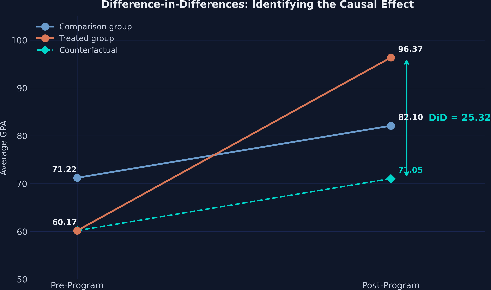
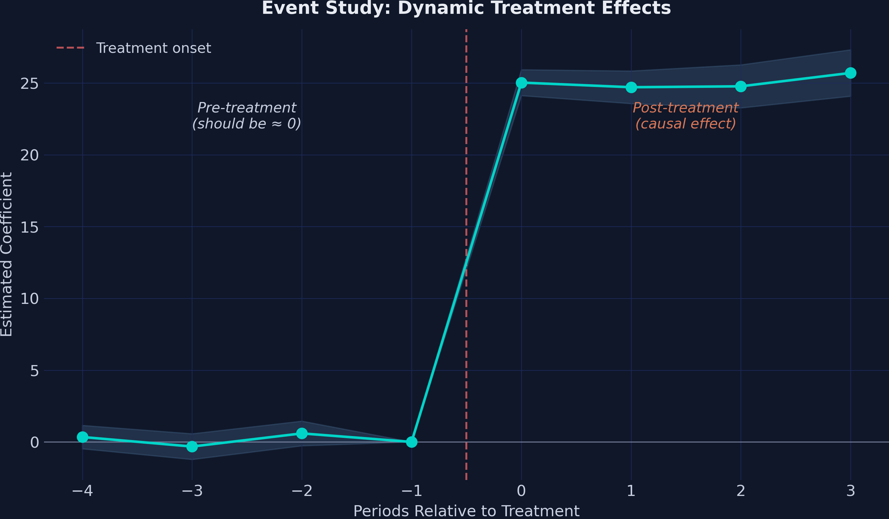

# The Tension {.divider background-color="#d97757"}

[Act I]{.act}

## Tutored schools' GPA jumped 36 points — case closed?

A district launched after-school tutoring in **10 of its 35 high schools**. One year later, average GPA in those schools rose from **60.17** to **96.37**.

. . .

A **36.20-point** leap. *But the 25 untreated schools also improved — from 71.22 to 82.10.* How much of the jump is really the program?

::: {.notes}
This is the central hook. The naive before-after story looks like a triumph, but a chunk of the gain is a district-wide trend that would have happened anyway. The whole tutorial exists to separate the program from the trend.
:::

## The naive before-after attributes the entire 36-point rise to the program


::: {.notes}
The spoiler figure for Act I. Don't resolve it yet — just plant the suspicion. Curriculum reforms, new textbooks, students maturing: any of these could lift GPA in all schools, not just the treated ones. The naive approach conflates the treatment effect with the secular trend.
:::

## The plan: from naive before-after to an 8-period event study

::: {.incremental}
- The lab: a 35-school, 2-period panel — a clean 2×2 design
- Why naive before-after overstates, and how a comparison group fixes it
- Manual double-differencing, then OLS and two-way fixed effects in PyFixest
- Four standard-error flavours — does inference change the verdict?
- An 8-period event study to test parallel trends
:::

# The Investigation {.divider background-color="#6a9bcc"}

[Act II]{.act}

## A clean 2×2 lab: 35 schools, 2 periods, simultaneous treatment


::: {.notes}
The simulated case study from Corral and Yang (2024): 70 observations (35 schools × 2 periods), outcome is average GPA of low-income students on a 0–100 scale. This is a textbook 2×2 — all 10 treated schools adopt at the same moment, no switching, perfectly balanced. The cleanliness is deliberate: it isolates the DiD logic.
:::

## The comparison group reveals an 11-point trend the program never caused

| Group | Pre | Post | Change |
|---|---:|---:|---:|
| Comparison (25) | 71.22 | 82.10 | [+10.88]{.key} |
| Treated (10) | 60.17 | 96.37 | +36.20 |

[The comparison group's +10.88 is the secular trend — the rise that would have happened anyway.]{.comment}

::: {.notes}
The comparison schools never got tutoring, yet their GPA still rose 10.88 points. Under parallel trends we assume the treated schools would have drifted by the same 10.88 absent the program. That single number is what the naive estimator wrongly handed to the program.
:::

## DiD is a double difference: 36.20 minus 10.88 equals 25.32

$$DiD = \Big(\bar{Y}^{post}_{treat} - \bar{Y}^{pre}_{treat}\Big) - \Big(\bar{Y}^{post}_{ctrl} - \bar{Y}^{pre}_{ctrl}\Big)$$

$$DiD = (96.37 - 60.17) - (82.10 - 71.22) = 36.20 - 10.88 = 25.32$$

[Subtract the trend the control group reveals; what's left is the program's causal effect.]{.comment}

::: {.notes}
The treated runner sped up by 36.20 units; the comparison runner sped up by 10.88. The coaching effect is the extra 25.32 units only the coached runner gained. This is the entire idea — everything that follows just implements it more flexibly with regression.
:::

## The counterfactual: where treated schools would have landed without tutoring



::: {.notes}
The counterfactual is treated-pre level (60.17) plus the control's secular change (10.88) = 71.05 — what we'd expect if treated schools had only drifted with the trend. The actual post mean is 96.37; the gap of 25.32 is the program's effect. Parallel trends doesn't require equal levels (treated schools start lower), only equal trends.
:::

## DiD identifies the ATT, not the ATE, under parallel trends

$$E[Y_{i,1}(0) - Y_{i,0}(0) \mid D=1] = E[Y_{i,1}(0) - Y_{i,0}(0) \mid D=0]$$

The *change* in untreated potential outcomes is the same for both groups — so the control's trend stands in for the treated group's missing counterfactual.

[The estimand is the ATT: the average effect for the schools that actually got the program.]{.comment}

::: {.notes}
State the estimand explicitly. DiD recovers the ATT — the effect on the treated — not the ATE. The two diverge when treatment effects vary with selection into treatment. Parallel trends is the identifying assumption; SUTVA (no spillovers between schools) is the other load-bearing assumption.
:::

## A treated×post interaction recovers the same 25.32 — with every coefficient a group mean

``` {.python code-line-numbers="1|2"}
fit_ols = pf.feols("gpa ~ treated + post + txp", data=df, vcov="HC1")
print(fit_ols.summary())
```

| Coefficient | Estimate | Maps to |
|---|---:|---|
| Intercept | 71.22 | comparison pre-mean |
| treated | −11.05 | baseline level gap |
| post | +10.89 | common time trend |
| txp | [25.32]{.key} | the DiD estimate |

::: {.notes}
The manual double-difference is exactly an OLS regression with a treated dummy, a post dummy, and their interaction. Every coefficient is a group mean or a difference of group means. txp = 25.315 is the ATT, matching the manual calculation to the decimal. HC1 gives heteroskedasticity-robust standard errors.
:::

## Two-way fixed effects absorb school and time — leaving only the interaction

$$Y_{it} = \beta\,(\text{Treat}_i \times \text{Post}_t) + \gamma_i + \vartheta_t + \varepsilon_{it}$$

``` {.python code-line-numbers="1"}
fit_twfe = pf.feols("gpa ~ txp | id + time", data=df, vcov={"CRV1": "id"})
```

[$\gamma_i$ wipes school stains, $\vartheta_t$ wipes period glare. PyFixest's `|` pipe absorbs both — no dummy bookkeeping.]{.comment}

::: {.notes}
Because treated is collinear with school fixed effects and post is collinear with time fixed effects, only txp survives — and it's still 25.315. Everything left of the pipe is estimated; everything right is absorbed. CRV1 clusters standard errors at the school level, the right choice when treatment varies by school and within-school observations are correlated.
:::

## Three specifications, one answer: 25.315 to 25.328


::: {.notes}
Add female_share and the estimate moves by 0.013 (25.315 → 25.328); the covariate itself is insignificant (p = 0.714). The point estimates span just 0.013 GPA points. The design — treatment assignment plus fixed effects — does the heavy lifting; specification choice barely registers.
:::

## Inference flavours barely move the needle when the signal is this strong


::: {.notes}
Four variance estimators on the same model. SEs range from 0.585 to 0.637 — but with an effect of 25 GPA points, even the largest SE leaves a t-statistic above 39. With only 35 clusters CRV3's small-sample correction is the safer default, but here inference choice is practically irrelevant. The lesson: design beats variance estimator.
:::

# The Resolution {.divider background-color="#00d4c8"}

[Act III]{.act}

## The program raises GPA by 25.32 points — not 36.20 {background-color="#141413"}

[25.32]{.bignum}

[ATT, stable across specifications (25.315–25.328) · the naive 36.20 overstated it by 43%]{.bignum-label}

::: {.notes}
The Act-III payoff. The naive before-after said 36.20; DiD says 25.32. The 10.88-point gap is the secular trend the naive estimator wrongly credited to the program — a 43% overstatement. R² near 0.995 across the TWFE specifications.
:::

## Pre-trends are flat and effects jump immediately — a textbook event study



::: {.notes}
The 8-period extension (280 observations) replaces the single interaction with one coefficient per event time, omitting t = −1 as the reference. Pre-treatment coefficients (0.34, −0.32, 0.59) are all insignificant (p > 0.17) — strong support for parallel trends. Post-treatment effects jump to ~25 at t = 0 and hold across all four lags: immediate and sustained, no fade-out.
:::

## The numbers behind the picture: silent leads, loud lags

| Period | Estimate | 95% CI | Significant? |
|---|---:|:--:|:--:|
| t = −4 | 0.34 | [−0.47, 1.16] | no |
| t = −3 | −0.32 | [−1.22, 0.57] | no |
| t = −2 | 0.59 | [−0.27, 1.45] | no |
| t = 0 | [25.03]{.key} | [24.12, 25.93] | yes |
| t = 3 | 25.70 | [24.08, 27.32] | yes |

[Three near-zero leads validate parallel trends; four large lags trace a stable effect.]{.comment}

::: {.notes}
t = −1 is the omitted reference (normalized to zero). The three pre-treatment leads are tiny and insignificant — the design is credible. The four post-treatment lags (25.03, 24.71, 24.77, 25.70) are all significant at p < 0.001 and remarkably flat: the program works from day one and shows no decay over four periods.
:::

## Event-study panel confirms the design: treatment switches on at period 5


::: {.notes}
Four pre-treatment periods and four post-treatment periods, with each of the 10 treated schools contributing one observation per relative time. The clean staggered-on-simultaneously structure is what lets the event study cleanly separate leads from lags.
:::

## Does precision make this causal? No — the assumptions still carry it

[Objection.]{.objection} The estimate is precise and the pre-trends are flat — surely DiD has proven tutoring caused the gain.

. . .

[Response.]{.rebuttal} Precision is not identification. The 25.32 ATT is valid only under **parallel trends** and **SUTVA**. Flat pre-trends are supportive, not proof; and this is *simulated* data with parallel trends built in. In the field, expect imperfect pre-trends, smaller effects, and R² well below 0.99.

::: {.notes}
Steelman, don't strawman. The event study tests but cannot confirm parallel trends — it only checks the pre-period. SUTVA (no spillovers) is assumed, not tested. And staggered real-world timing can bias the standard TWFE estimator (Callaway–Sant'Anna, Gardner). This deck evaluates a method on clean data, not a substantive claim about tutoring.
:::

# A credible comparison group, not the variance estimator, is what makes the effect causal. {.divider background-color="#141413"}

::: {.notes}
The single takeaway. DiD strips the 10.88-point common trend the naive estimator wrongly credited to the program, leaving a stable 25.32-point ATT. The design — comparison group, fixed effects, flat pre-trends — does the work; the choice of standard error is a footnote.
:::
