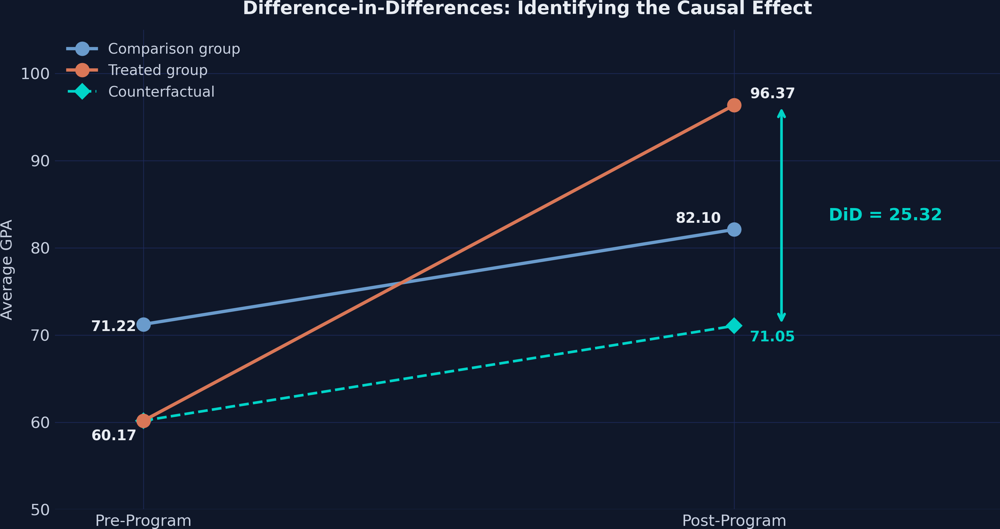
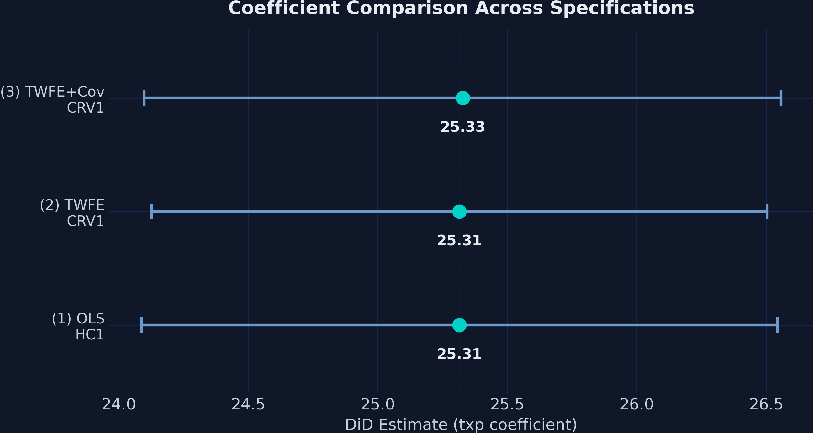
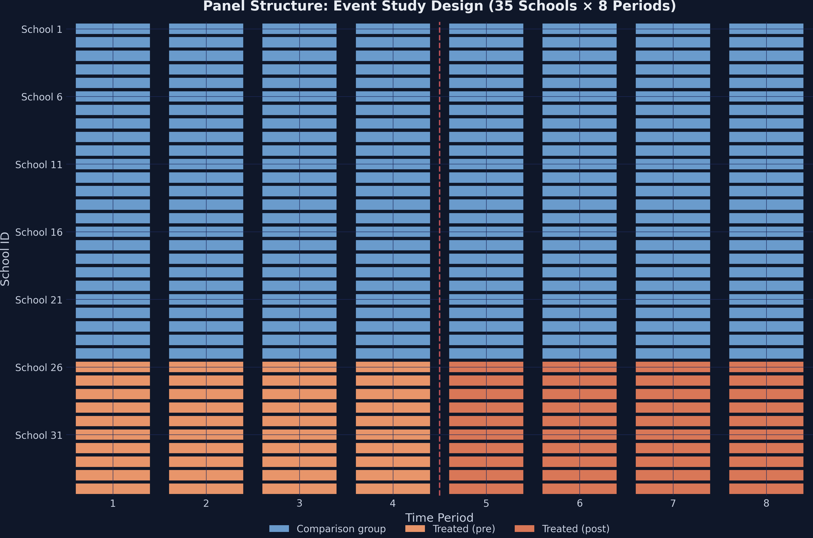
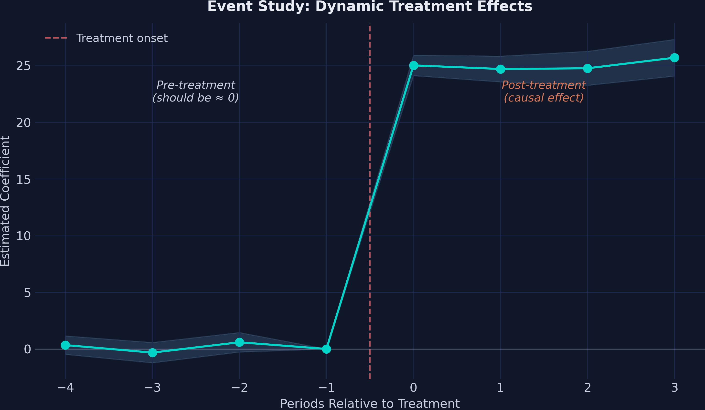

# The Tension {.divider background-color="#d97757"}

[Act I]{.act}

## Tutored schools' GPA jumped 36 points — case closed?

A district launched after-school tutoring in **10 of its 35 high schools**. One year later, average GPA in those schools rose from **60.17** to **96.37**.

. . .

A **36.20-point** leap. *But the 25 untreated schools also improved — from 71.22 to 82.10.* How much of the jump is really the program?

::: {.notes}
This is the central hook. The naive before-after story looks like a triumph, but part of the gain is a district-wide trend that would have happened anyway. The whole tutorial exists to separate the program from the trend.
:::

## The naive before-after credits the entire 36-point rise to the program


::: {.notes}
Plant the suspicion without resolving it. Curriculum reforms, new textbooks, students maturing: any of these could lift GPA in all schools, not just the treated ones. The naive approach conflates the treatment effect with the secular trend.
:::

## The plan: from a naive before-after to an 8-period event study

::: {.incremental}
- The lab: 35 schools in 2 periods, a clean 2×2 design
- Why the naive estimate overstates, and how a comparison group fixes it
- Manual double-differencing, then OLS and two-way fixed effects in PyFixest
- Four standard errors: does inference change the verdict?
- An 8-period event study, then five tempting misreadings
:::

::: {.notes}
Teaching deck, so we signpost. Five "Before you look" slides along the way ask the room to predict before each reveal; on AhaSlides each one is followed by a live quiz.
:::

# The Investigation {.divider background-color="#6a9bcc"}

[Act II]{.act}

## A clean 2×2 lab: 35 schools, 2 periods, simultaneous adoption


::: {.notes}
The simulated case study from Corral and Yang (2024): 70 observations (35 schools × 2 periods); the outcome is the average GPA of low-income students. A textbook 2×2: all 10 treated schools (ids 26–35) adopt at the same moment, no school drops out of treatment, perfectly balanced. The cleanliness is deliberate: it isolates the DiD logic.
:::

## Before you look: what happened in the schools *without* tutoring? {background-color="#1a3a8a"}

Tutored schools rose 36.20 points. What did the 25 comparison schools do, and where does that leave DiD?

**A.**&nbsp; They stayed flat, so DiD is about 36

**B.**&nbsp; They rose by about 11 points, so DiD is about 25

**C.**&nbsp; They fell, so DiD is larger than 36

::: {.notes}
Ask the room to commit before the means table. Give 20 seconds, then take the vote. Answer on the next slide: B. Comparison schools rose by 10.88 points (71.22 to 82.10) with no program at all; that region-wide drift is part of the treated schools' 36.20 too, so the DiD effect is 36.20 − 10.88 = 25.32. (AhaSlides interactive I1 follows.)
:::

## The comparison group reveals an 11-point trend the program never caused

| Group | Pre | Post | Change |
|---|---:|---:|---:|
| Comparison (25) | 71.22 | 82.10 | [+10.88]{.key} |
| Treated (10) | 60.17 | 96.37 | +36.20 |

[The comparison group's +10.88 is the secular trend: the rise that would have happened anyway.]{.takeaway .fragment}

::: {.notes}
The answer to the vote: B. The comparison schools never got tutoring, yet their GPA still rose 10.88 points. Under parallel trends we assume the treated schools would have drifted by the same amount without the program. That single number is what the naive estimator wrongly handed to the program.
:::

## DiD is a double difference: 36.20 minus 10.88 equals 25.32

$$DiD = \Big(\bar{Y}^{post}_{treat} - \bar{Y}^{pre}_{treat}\Big) - \Big(\bar{Y}^{post}_{ctrl} - \bar{Y}^{pre}_{ctrl}\Big)$$

$$DiD = (96.37 - 60.17) - (82.10 - 71.22) = 36.20 - 10.88 = 25.32$$

[Subtract the trend the comparison group reveals; what is left is the program's effect.]{.takeaway .fragment}

::: {.notes}
The treated runner sped up by 36.20 units; the comparison runner by 10.88. The coaching effect is the extra 25.32 units only the coached runner gained. Rounding note: 25.32 is the arithmetic on means rounded to two decimals; with unrounded means the DiD is 25.315 (trend 10.886), exactly the regression coefficient on the coming slides. The naive 36.20 overstates 25.32 by 43%.
:::

## The counterfactual: where treated schools would have landed without tutoring



::: {.notes}
The counterfactual is the treated pre-period level (60.17) plus the comparison group's change (10.88) = 71.05: where treated schools would be if they had only drifted with the trend. The actual post mean is 96.37; the gap of 25.32 is the program's effect. Parallel trends does not require equal levels (treated schools start lower), only equal trends.
:::

## DiD identifies the ATT, not the ATE, under parallel trends

$$E[Y_{i,1}(0) - Y_{i,0}(0) \mid D=1] = E[Y_{i,1}(0) - Y_{i,0}(0) \mid D=0]$$

Without the program, both groups would have *changed* by the same amount.

[The estimand is the ATT: the average effect for the schools that actually got the program.]{.takeaway .fragment}

::: {.notes}
State the estimand explicitly. DiD recovers the ATT, the effect on the treated, not the ATE. The two diverge when treatment effects vary with selection into treatment. Parallel trends is the identifying assumption, and it concerns an unobserved counterfactual, so no test can prove it. SUTVA (no spillovers between schools) is the other load-bearing assumption.
:::

## A treated×post interaction recovers the same 25.32, and every coefficient is a group mean

``` {.python code-line-numbers="1|2"}
fit_ols = pf.feols("gpa ~ treated + post + txp", data=df, vcov="HC1")
print(fit_ols.summary())
```

| Coefficient | Estimate | Maps to |
|---|---:|---|
| Intercept | 71.215 | comparison pre-mean |
| treated | −11.049 | baseline level gap |
| post | +10.886 | common time trend |
| txp | [25.315]{.key} | the DiD estimate |

::: {.notes}
The manual double difference is exactly an OLS regression with a treated dummy, a post dummy and their interaction. Every coefficient is a group mean or a difference of group means; txp = 25.315 is the ATT. HC1 is heteroskedasticity-robust but treats each school's two observations as independent; the next model clusters by school.
:::

## Before you look: replace `treated` and `post` with fixed effects {background-color="#1a3a8a"}

Swap them for school and period fixed effects, and cluster by school. What changes?

**A.**&nbsp; The coefficient stays at 25.315; only the standard error changes

**B.**&nbsp; Both the coefficient and the standard error change

**C.**&nbsp; Nothing changes: same coefficient, same standard error

::: {.notes}
Ask: does absorbing the groups and periods with fixed effects move the DiD coefficient? Answer on the next slide: A. In a balanced 2×2 panel the school effects absorb `treated` and the period effects absorb `post` without touching the interaction, so the coefficient stays 25.315. The standard error moves from 0.615 (HC1) to 0.585 (clustered by school). (AhaSlides interactive I2 follows.)
:::

## Two-way fixed effects: the same 25.315, now with school-clustered errors

$$Y_{it} = \beta\,(\text{Treat}_i \times \text{Post}_t) + \gamma_i + \vartheta_t + \varepsilon_{it}$$

``` {.python code-line-numbers="1"}
fit_twfe = pf.feols("gpa ~ txp | id + time", data=df, vcov={"CRV1": "id"})
```

[Coefficient unchanged at 25.315; the SE moves from 0.615 (HC1) to 0.585 (clustered by school).]{.takeaway .fragment}

::: {.notes}
The answer to the vote: A. Because treated is collinear with the school fixed effects and post with the period fixed effects, only txp survives, and it is still 25.315. Everything left of the pipe is estimated; everything right of it is absorbed. Clustering by school allows each school's two observations to be correlated.
:::

## Before you look: does `female_share` move the estimate? {background-color="#1a3a8a"}

The share of female students varies a little within schools. Add it to the model: what happens to 25.315?

**A.**&nbsp; It falls by more than one GPA point

**B.**&nbsp; It rises by more than one GPA point

**C.**&nbsp; It barely moves: less than 0.1 points

::: {.notes}
Ask the room to commit before the coefficient plot. Answer on the next slide: C. The estimate moves from 25.315 to 25.328, a shift of 0.013, and female_share itself is insignificant (p = 0.714). (AhaSlides interactive I3 follows.)
:::

## Three specifications, one answer: 25.315 to 25.328



[Stability is the reassuring part; an insignificant covariate does not prove the fixed effects capture everything.]{.takeaway .fragment}

::: {.notes}
The answer to the vote: C. Adding female_share moves the estimate by 0.013 (25.315 to 25.328), and the covariate is insignificant (p = 0.714). The design, not the controls, does the heavy lifting. One caution: a covariate the program itself could change (for example, if tutoring attracted more female students) is a bad control and should be measured before treatment or left out.
:::

## Before you look: which standard error is largest? {background-color="#1a3a8a"}

Same model, same coefficient (25.315), four variance estimators: iid, HC1, CRV1 (clustered by school) and CRV3 (a leave-one-school-out jackknife). Which reports the largest standard error?

**A.**&nbsp; iid

**B.**&nbsp; HC1

**C.**&nbsp; CRV3

::: {.notes}
Ask: which estimator is the most conservative here? Answer on the next slide: C. CRV3 gives 0.637, then iid 0.607; HC1 and CRV1 are nearly identical at 0.585. None comes close to changing the conclusion: the smallest t-statistic is 39.72. (AhaSlides interactive I4 follows.)
:::

## Inference choices barely move the needle when the signal is this strong


[Here the design, not the variance estimator, decides the verdict: every t-statistic is above 39.]{.takeaway .fragment}

::: {.notes}
The answer to the vote: C. CRV3 re-estimates the model leaving out one school at a time; it corrects CRV1's tendency to understate uncertainty when clusters are few or influential. What matters is the 10 treated schools, not the 35 clusters: with few treated clusters, prefer CRV3 or the wild cluster bootstrap. With an effect of 25 points, an estimate would need to fall to about 1.2 to 1.3 points before the choice mattered (Exercise 4 in the post).
:::

# The Resolution {.divider background-color="#00d4c8"}

[Act III]{.act}

## The program raises GPA by 25.32 points, not 36.20 {background-color="#141413"}

[25.32]{.bignum}

[ATT, stable across specifications (25.315–25.328) · the naive 36.20 overstated it by 43%]{.bignum-label}

::: {.notes}
The Act III payoff. The naive before-after said 36.20; DiD says 25.32. The 10.88-point gap is the secular trend the naive estimator wrongly credited to the program: a 43% overstatement. R² is near 0.995 in the two-way fixed-effects models, unrealistically high because the data are simulated.
:::

## The event-study panel: treatment switches on in period 5



::: {.notes}
Four pre-treatment and four post-treatment periods; each of the 10 treated schools contributes one observation per event time. Simultaneous adoption, with no staggering, is what lets this simple event study separate leads from lags cleanly. Comparison schools have no event time; the code gives them a placeholder so they stay in the sample.
:::

## Before you look: what should the event study show? {background-color="#1a3a8a"}

Eight periods, one coefficient per period, each relative to t = −1. If parallel trends holds, what do we see?

**A.**&nbsp; Leads near zero; lags jump to about 25 and stay roughly flat

**B.**&nbsp; Leads near zero; lags climb steadily from about 10 to about 40

**C.**&nbsp; Leads already around 25

::: {.notes}
Ask: what is the signature of a credible design with this program? Answer on the next slide: A. The leads are 0.34, −0.32 and 0.59 (all p > 0.17); the lags are 25.03, 24.71, 24.77 and 25.70, roughly flat. (AhaSlides interactive I5 follows.)
:::

## Leads near zero and an effect from the first treated period: a textbook event study



::: {.notes}
The answer to the vote: A. The 8-period extension (280 observations) replaces the single interaction with one coefficient per event time, omitting t = −1 as the reference. The leads are consistent with parallel trends, though no pre-test can prove it. The effect appears at t = 0 relative to t = −1 and holds across all four lags: no build-up, no fade-out.
:::

## The numbers behind the picture: quiet leads, loud lags

| Period | Estimate | 95% CI | Significant? |
|---|---:|:--:|:--:|
| t = −4 | 0.34 | [−0.47, 1.16] | no |
| t = −3 | −0.32 | [−1.22, 0.57] | no |
| t = −2 | 0.59 | [−0.27, 1.45] | no |
| t = 0 | [25.03]{.key} | [24.12, 25.93] | yes |
| t = 3 | 25.70 | [24.08, 27.32] | yes |

[Three near-zero leads are consistent with parallel trends; four large lags trace a stable effect.]{.takeaway .fragment}

::: {.notes}
t = −1 is the omitted reference (normalized to zero). The three leads are small and insignificant, which supports (but cannot prove) the design. The four lags (25.03, 24.71, 24.77, 25.70) are all significant at p < 0.001 and roughly flat: the effect appears in the first treated period and shows no decay over four periods.
:::

# Five tempting misreadings {.divider background-color="#1a3a8a"}

[Common misconceptions]{.act}

::: {.notes}
DiD looks simple, and that simplicity invites a few recurring misreadings. Each of the next five slides states a tempting claim and answers it with this tutorial's own numbers.
:::

## "Insignificant leads prove parallel trends": they are evidence, not proof

[Myth.]{.objection} The leads (0.34, −0.32, 0.59; all p > 0.17) are insignificant, so parallel trends holds.

. . .

[Truth.]{.rebuttal} Parallel trends concerns an unobserved counterfactual, which no data can show. And pre-tests have little power: a one-point gap would still fit inside the t = −2 interval, [−0.27, 1.45].

::: {.notes}
Roth (2022), "Pretest with caution". In the post's interactive lab, a pre-trend of 0.2 GPA points per period leaves every lead insignificant, yet biases the pooled DiD estimate by +0.70.
:::

## "The groups must start at the same GPA": only the trends must match

[Myth.]{.objection} DiD needs the treated and comparison schools to start from the same level.

. . .

[Truth.]{.rebuttal} Treated schools start **11.05 points below** comparison schools (60.17 versus 71.22), and DiD is still valid. Differencing removes any gap in levels; only the *trends* must be parallel.

::: {.notes}
The `treated` coefficient in the OLS interaction model is exactly this baseline gap, −11.049. The school fixed effects absorb it in the two-way model.
:::

## "25.32 is the program's effect for every school": it is the ATT

[Myth.]{.objection} The estimate tells us what tutoring would do in any school.

. . .

[Truth.]{.rebuttal} DiD identifies the **average effect on the 10 treated schools**. It says nothing about how the 25 comparison schools would have responded, which could differ if schools chose the program because they expected to benefit.

::: {.notes}
ATT and ATE diverge when the treatment effect varies in ways related to selection into treatment. Report the estimand explicitly.
:::

## "Adding controls always makes DiD more credible": design does, controls may not

[Myth.]{.objection} The more covariates, the more believable the estimate.

. . .

[Truth.]{.rebuttal} Adding `female_share` moved the estimate by **0.013** (25.315 to 25.328): the credibility comes from the design. A covariate the program itself can change is a **bad control** and can bias the estimate.

::: {.notes}
Measure time-varying covariates before treatment, or leave them out, whenever the program could plausibly affect them.
:::

## "The SE choice never matters": it can decide the result for smaller effects

[Myth.]{.objection} All four standard errors agreed here, so the choice of estimator is irrelevant.

. . .

[Truth.]{.rebuttal} They agree because the effect is about **40 standard errors** from zero. An estimate of **1.19** points would pass with CRV1 but fail with CRV3 (threshold **1.30**): with small effects, the choice decides the verdict.

::: {.notes}
Exercise 4 in the post computes these thresholds: 2.03 standard errors with 34 degrees of freedom (35 schools minus one).
:::

## Does precision make this causal? No — the assumptions still carry it

[Objection.]{.objection} The estimate is precise and the pre-trends are flat, so DiD has proven that tutoring caused the gain.

. . .

[Response.]{.rebuttal} Precision is not identification. The 25.32 ATT rests on **parallel trends** and **SUTVA**; flat pre-trends support them but cannot prove them. The data are *simulated*: in the field, expect imperfect pre-trends, smaller effects and R² well below 0.99.

::: {.notes}
Steelman, do not strawman. The event study probes but cannot confirm parallel trends; it only checks the pre-period. SUTVA (no spillovers) is assumed, not tested. With staggered real-world timing and effects that vary across adoption cohorts, the standard TWFE estimator can be badly biased (Goodman-Bacon; Callaway–Sant'Anna; Gardner). This deck evaluates a method on clean data, not a substantive claim about tutoring.
:::

# A credible comparison group, not the variance estimator, is what makes the effect causal. {.divider background-color="#141413"}

::: {.notes}
The single takeaway. DiD strips the 10.88-point common trend that the naive estimator wrongly credited to the program, leaving a stable 25.32-point ATT. The design (a comparison group, fixed effects, quiet pre-trends) does the work; the choice of standard error is a footnote here, and only here.
:::
