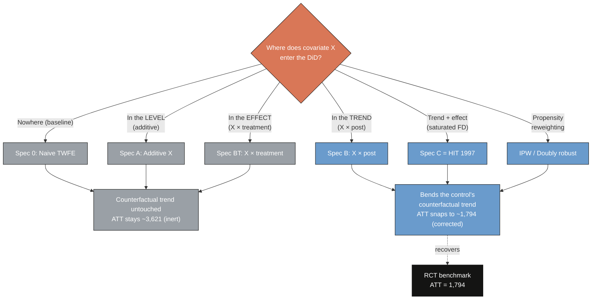
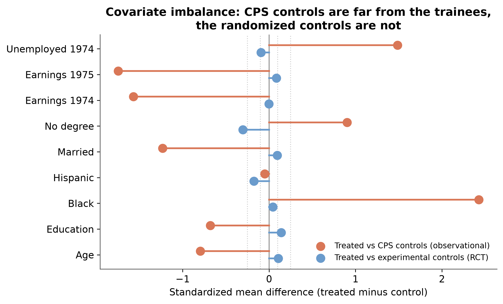
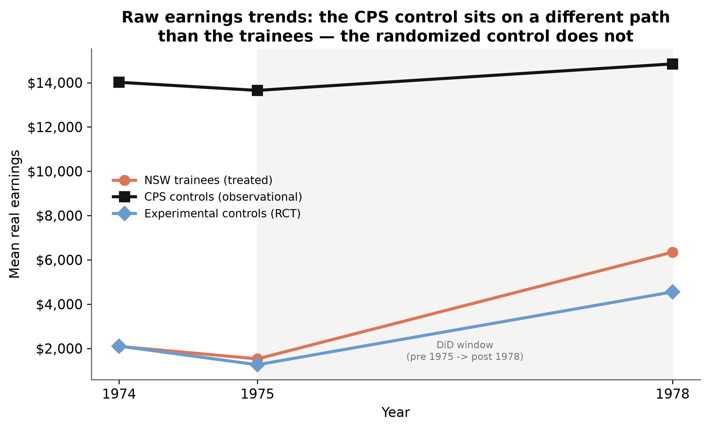
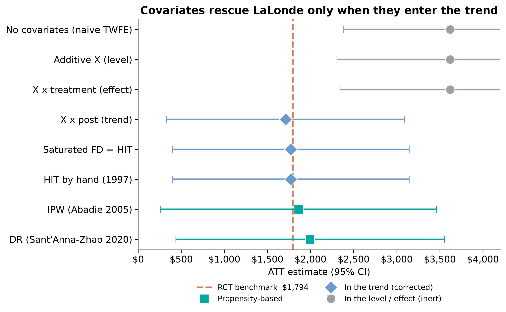
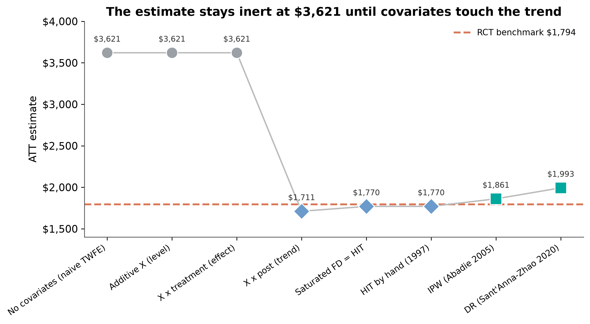
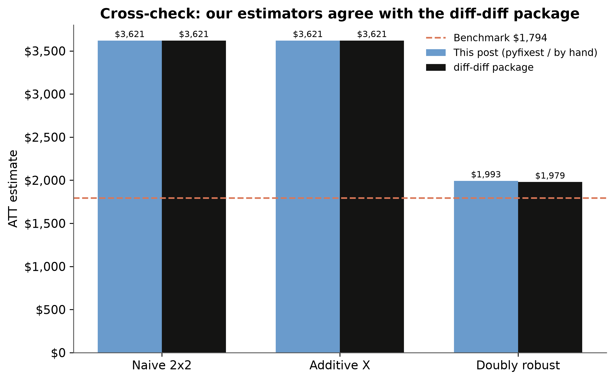

---
authors:
  - admin
categories:
  - Python
  - Difference-in-Differences (DiD)
  - IPW and Doubly Robust
draft: false
featured: false
date: "2026-07-16T00:00:00Z"
external_link: ""
image:
  caption: ""
  focal_point: Smart
  placement: 3
links:
- icon: chalkboard-teacher
  icon_pack: fas
  name: "Slides (HTML)"
  url: slides/index.html
- icon: file-pdf
  icon_pack: fas
  name: "AI Slides (PDF)"
  url: https://carlos-mendez.org/post/python_did_covariates_lalonde/ai_slides.pdf
- icon: laptop-code
  icon_pack: fas
  name: "Web app"
  url: web_app/index.html
- icon: open-data
  icon_pack: ai
  name: "[Python] Google Colab"
  url: https://colab.research.google.com/github/cmg777/starter-academic-v501/blob/master/content/post/python_did_covariates_lalonde/notebook.ipynb
- icon: file-code
  icon_pack: fas
  name: "Quarto project (.zip)"
  url: python_did_covariates_lalonde.zip
- icon: code
  icon_pack: fas
  name: "Python script"
  url: script.py
- icon: book
  icon_pack: fas
  name: "Jupyter notebook"
  url: https://github.com/cmg777/starter-academic-v501/blob/master/content/post/python_did_covariates_lalonde/notebook.ipynb
- icon: podcast
  icon_pack: fas
  name: AI Podcast
  url: "/post/python_did_covariates_lalonde/#podcast-player"
- icon: markdown
  icon_pack: fab
  name: "MD version"
  url: https://raw.githubusercontent.com/cmg777/starter-academic-v501/master/content/post/python_did_covariates_lalonde/index.md
slides:
summary: Reproducing Scott Cunningham's LaLonde test in Python — covariates rescue a difference-in-differences ATT only when they enter the control group's counterfactual trend, recovering the $1,794 experimental benchmark from a naive $3,621.
tags:
- python
- causal
- causal inference
- panel data
- difference-in-differences
title: "Covariates in Difference-in-Differences: The LaLonde Test in Python"
url_code: ""
url_pdf: ""
url_slides: ""
url_video: ""
toc: true
diagram: true
---

## Abstract

Forty years ago Robert LaLonde delivered one of the most influential blows of the credibility revolution: he took a job-training experiment with a known treatment effect, threw away the randomized control group, and showed that a gauntlet of respectable econometric estimators could not recover the answer. This tutorial reproduces — in Python, and in the spirit of a recent essay by Scott Cunningham — a modern version of that test aimed squarely at **covariates in difference-in-differences (DiD)**. Working with the Dehejia-Wahba subsample (185 National Supported Work trainees plus 15,992 Current Population Survey controls, a two-period panel of 1975 and 1978 earnings), the estimand is the average treatment effect on the treated (ATT), and the ground truth is the experimental benchmark of **\\$1,794**. We estimate the ATT eight ways using `pyfixest` for the regressions and hand-coded inverse-propensity-weighting (Abadie 2005) and doubly-robust (Sant'Anna-Zhao 2020) estimators, cross-checked against the `diff-diff` package. The result is stark and dollar-accurate. Three specifications that keep covariates out of the counterfactual trend — no covariates, additive covariates, and covariate-by-treatment interactions — all return the naive **\\$3,621**, roughly twice the truth. The instant covariates are allowed to bend the control group's trend, via `X × post` (**\\$1,711**) or first-difference saturation (**\\$1,770**, numerically identical to the Heckman-Ichimura-Todd estimator), the estimate snaps to the benchmark; the propensity-based estimators land nearby at **\\$1,861** and **\\$1,993**. The lesson is that covariates in DiD are not a robustness knob to be twisted for reassurance — they perform a specific job, satisfying conditional parallel trends and relaxing constant treatment effects, and the most common applied specification of all, two-way fixed effects with additive controls, does not do that job.

## Overview

Imagine you already know the right answer. A job-training program raised the earnings of disadvantaged workers by about **\\$1,794** — we know this because the program was evaluated with a randomized controlled trial, and randomization makes the treated and control groups exchangeable. Now throw the experimental control group away and replace it with a large survey of ordinary Americans. Can a difference-in-differences estimator, armed with the usual baseline covariates, still find the **\\$1,794**? And does it matter *how* you feed those covariates to the model?

This is the **LaLonde test**, named for [LaLonde (1986)](https://www.jstor.org/stable/1806062), who used exactly this setup to show that unbiased-in-principle estimators can be badly biased in application. The exercise here follows a recent post by Scott Cunningham on his [Causal Inference: The Mixtape Substack](https://causalinf.substack.com/p/covariates-diff-in-diff-and-lalonde), translating his Stata and R analysis into Python and adding a package cross-check. If you are new to difference-in-differences, start with the companion tutorial, [Introduction to Difference-in-Differences in Python](/post/python_did/); this post is the advanced sequel that asks a sharper question about covariates.

The punchline, which we will earn spec by spec, is a distinction that most applied work blurs. A covariate can enter a DiD in three fundamentally different places: in the **level** of the outcome (additive controls), in the **treatment effect** (covariate-by-treatment interactions), or in the **trend** (covariate-by-time interactions). Only the last one addresses the reason the naive estimate is wrong. Because our control group is a representative slice of America and our treated group is a set of disadvantaged trainees, the two groups are wildly imbalanced; and if groups with different characteristics are on different earnings trajectories, then that imbalance mechanically breaks the parallel-trends assumption. Fixing it requires modeling those trajectories — putting covariates in the trend — not simply adding them to the regression.

**Learning objectives:**

- Understand why a covariate rescues a DiD estimate only when it enters the control group's counterfactual *trend*, not the level or the treatment effect.
- Implement eight covariate specifications in `pyfixest` — from the naive two-way fixed effects model to a fully saturated first-difference regression — and recover the ATT by g-computation.
- Hand-code the Abadie (2005) inverse-propensity-weighting and Sant'Anna-Zhao (2020) doubly-robust DiD estimators, and cross-check every number against the `diff-diff` package.
- Judge all eight estimates against the **\\$1,794** experimental benchmark and diagnose why the ubiquitous additive-controls specification stays stuck at **\\$3,621**.

### Key concepts at a glance

The post leans on a small vocabulary repeatedly. Each concept below has three parts. The **definition** is always visible. The **example** and **analogy** sit behind clickable cards: open them when you need them, leave them collapsed for a quick scan. If a later section mentions "conditional parallel trends" or "outcome regression" and the term feels slippery, this is the section to re-read.

**1. The LaLonde test.** Benchmark an observational estimator against a known experimental ATT by replacing the RCT control group with survey controls and checking whether the method still recovers the truth.

<div class="concept-pair">
<details class="concept-card concept-example"><summary>Example</summary>

Here the known ATT is \\$1,794 (Dehejia-Wahba). A naive DiD with CPS controls returns \\$3,621 — the test exposes the bias, just as it did in 1986.

</details>
<details class="concept-card concept-analogy"><summary>Analogy</summary>

Grading a new thermometer against a calibrated one. If it reads 40°C in boiling water, you have learned something about the thermometer, not the water.

</details>
</div>

**2. Estimand: ATT vs ATE.** The ATT is the effect on the treated units; the ATE is the effect on everyone. Under randomization they coincide. Replacing the experimental control with a survey control changes who the comparison represents but leaves the treated group — and therefore the ATT — intact.

<div class="concept-pair">
<details class="concept-card concept-example"><summary>Example</summary>

The 185 trainees stay in every specification, so the target stays \\$1,794 (the ATT) even though the CPS controls make the sample look nothing like the original experiment.

</details>
<details class="concept-card concept-analogy"><summary>Analogy</summary>

Measuring how much *your* team improved after coaching. Swapping which rival you compare against does not change your team's gain.

</details>
</div>

**3. Conditional parallel trends.** DiD identifies the ATT if treated and control outcomes would have moved in parallel *absent* treatment. When groups are imbalanced, that parallelism is only credible *given* covariates $X$ — parallel trends conditional on $X$.

<div class="concept-pair">
<details class="concept-card concept-example"><summary>Example</summary>

Trainees and CPS controls do not share a raw trend, but workers with the *same* age, schooling and earnings history plausibly do — so we condition on $X$.

</details>
<details class="concept-card concept-analogy"><summary>Analogy</summary>

Two runners on different hills. They only "move in parallel" once you account for the slope each is standing on.

</details>
</div>

**4. Covariate imbalance.** Systematic differences in $X$ between treated and control. Harmless on its own — but combined with covariate-specific trends, it becomes the bias term that breaks parallel trends.

<div class="concept-pair">
<details class="concept-card concept-example"><summary>Example</summary>

The CPS controls differ from trainees by a standardized mean difference of +2.3 on race and −1.6 on prior earnings; the randomized controls differ by essentially zero.

</details>
<details class="concept-card concept-analogy"><summary>Analogy</summary>

Comparing marathon times of teenagers and retirees. The age gap only distorts things because age also drives the trend.

</details>
</div>

**5. Trend vs level vs effect.** The crux. A covariate in the *level* (additive) or the *treatment effect* ($X \times D$) leaves the counterfactual trend untouched and is inert. A covariate in the *trend* ($X \times \text{post}$) bends the control's counterfactual and corrects the bias.

<div class="concept-pair">
<details class="concept-card concept-example"><summary>Example</summary>

Additive $X$ and $X \times \text{treatment}$ both return \\$3,621; $X \times \text{post}$ returns \\$1,711. Same covariates, three placements, two very different answers.

</details>
<details class="concept-card concept-analogy"><summary>Analogy</summary>

Where you attach the corrective lens matters. Over the eye it fixes your vision; in your pocket it does nothing.

</details>
</div>

**6. Outcome regression / HIT (1997).** First-difference the outcome, fit a flexible model on the controls, and impute each treated unit's counterfactual change. Because the outcome is now a *change*, a covariate's coefficient is its effect on the trend — for free.

<div class="concept-pair">
<details class="concept-card concept-example"><summary>Example</summary>

Fitting the first-differenced outcome on controls only, then imputing to the treated, gives \\$1,770 — identical to the fully saturated regression on the whole sample.

</details>
<details class="concept-card concept-analogy"><summary>Analogy</summary>

Learn how "normal" workers' pay evolved, then ask how much *more* the trainees gained than their statistical twins would have.

</details>
</div>

**7. Doubly robust DiD (Sant'Anna-Zhao 2020).** Combine an outcome-regression model of the trend with an inverse-propensity reweighting of the controls. Consistent if *either* model is correctly specified — two shots at the truth.

<div class="concept-pair">
<details class="concept-card concept-example"><summary>Example</summary>

The doubly-robust estimate is \\$1,993; the package's Callaway-Sant'Anna implementation lands within \\$14 of it at \\$1,979.

</details>
<details class="concept-card concept-analogy"><summary>Analogy</summary>

Two independent safety nets. You fall through only if *both* fail.

</details>
</div>

The decision that organizes the entire post is a single question — where does the covariate enter? — and its answer sorts every estimator into "inert" or "corrected":



## Setup and imports

We lean on three packages. [`pyfixest`](https://py-econometrics.github.io/pyfixest/) gives us fast, formula-based OLS with robust standard errors — the workhorse for the six regression specifications. [`causaldata`](https://github.com/NickCH-K/causaldata) ships the canonical LaLonde data, so nothing needs to be downloaded by hand. And [`diff-diff`](https://github.com/igerber/diff-diff) provides a scikit-learn-style DiD toolkit that we use to independently validate every hand-coded number. We fix the seed to `90210` to match the reference exactly, so the bootstrap standard errors are reproducible.

```python
import numpy as np
import pandas as pd
import statsmodels.api as sm
import pyfixest as pf

RANDOM_SEED = 90210          # reproducible cluster bootstrap
N_BOOT = 199                 # bootstrap replications
BENCHMARK = 1794.0           # experimental ATT (Dehejia-Wahba)

# Scott's canonical LaLonde covariate set (age cube; u74 = 1[re74 == 0])
XVARS = ["age", "agesq", "agecube", "educ", "educsq",
         "marr", "nodegree", "black", "hisp", "re74", "u74"]
```

Every covariate here is a **time-invariant baseline characteristic**: age and its square and cube, education and its square, indicators for marriage, no high-school degree, race and ethnicity, 1974 earnings, and an unemployment flag for 1974. None of them changes between our two periods. Keep that fact in your pocket — it is the reason the additive specification will turn out to be completely inert.

## Data: the LaLonde-DW non-experimental panel

The construction is where the fidelity of the whole exercise is won or lost, so it is worth being explicit. The `nsw_mixtape` dataset is *already* the Dehejia-Wahba subsample — 185 treated trainees and 260 experimental controls. For the non-experimental analysis we keep the 185 treated and discard the experimental controls, replacing them with the 15,992 CPS controls from `cps_mixtape`. The experimental controls are set aside for one job only: computing the benchmark. We then reshape the wide earnings columns (`re75`, `re78`) into a two-period panel with `post = 1` in 1978.

```python
from causaldata import nsw_mixtape, cps_mixtape

nsw = nsw_mixtape.load_pandas().data          # 185 treated + 260 exp. controls
cps = cps_mixtape.load_pandas().data          # 15,992 CPS controls (treat = 0)

# Non-experimental sample = NSW treated only + all CPS controls
wide = pd.concat([nsw[nsw.treat == 1], cps], ignore_index=True)
wide["ever_treated"] = wide["treat"].astype(int)
wide["agesq"]   = wide.age ** 2
wide["agecube"] = wide.age ** 3
wide["educsq"]  = wide.educ ** 2
wide["u74"]     = (wide.re74 == 0).astype(float)
wide["dy"]      = wide.re78 - wide.re75        # first difference (pre 1975, post 1978)

# Long two-period panel: post = 0 -> re75, post = 1 -> re78
pre  = wide.assign(re=wide.re75, post=0.0)
post = wide.assign(re=wide.re78, post=1.0)
panel = pd.concat([pre, post], ignore_index=True)

print(pd.crosstab(panel.ever_treated, panel.post))
```

```text
post          0.0    1.0
ever_treated
0           15992  15992
1             185    185
```

The cell counts confirm a clean, balanced two-period panel: 185 treated and 15,992 controls observed in both 1975 and 1978. Because randomization is gone, the identifying assumption is no longer plain parallel trends but **conditional** parallel trends — trainees and CPS controls with the same covariates are assumed to have moved in parallel absent treatment. Whether that assumption is plausible depends entirely on how different the two groups actually are, which is the next thing to look at.

## The covariate imbalance problem

Before running a single regression, we should ask how comparable the groups are. The standard diagnostic is the **standardized mean difference (SMD)**: the gap in a covariate's mean between treated and control, divided by the pooled standard deviation. A rule of thumb flags anything beyond 0.1 as imbalanced and beyond 0.25 as severe. We compute it for the trainees against the CPS controls, and — as a reference point — against the discarded experimental controls.

```python
def smd(a, b, col):
    s = np.sqrt((a[col].var() + b[col].var()) / 2)
    return 0.0 if s == 0 else (a[col].mean() - b[col].mean()) / s

treated = wide[wide.ever_treated == 1]
cps     = wide[wide.ever_treated == 0]
for col in ["black", "re74", "married", "educ"]:
    print(f"{col:8s}  vs CPS = {smd(treated, cps, col):+.2f}")
```



The picture is dramatic. Against the CPS controls (orange), the trainees differ by a standardized **+2.3** on race, **−1.6** on 1974 and 1975 earnings, and **−1.3** on marriage — imbalances many times the "severe" threshold. Against the randomized experimental controls (blue), every difference collapses to essentially zero. This is the entire problem in one figure: the CPS is a representative sample of America, so its members are older, better educated, more often married, and far richer than a set of disadvantaged trainees. Imbalance this extreme is exactly the condition under which conditioning on covariates stops being optional.

## Raw earnings trends

Imbalance in *levels* is only half the story. It becomes a bias only if the imbalanced groups are also on different *trends*. So let us plot mean earnings for each group in 1974, 1975, and 1978.



The CPS controls (black) sit far above everyone else — about **\\$14,017** in 1974 against the trainees' **\\$2,096** — and drift gently upward. The trainees (orange) and the experimental controls (blue) start together near the bottom and rise in tandem into 1978. A DiD that uses the CPS as-is is implicitly assuming the trainees, absent training, would have followed the CPS's flat high-earning path. That is not credible: low-earning workers and high-earning workers are on different earnings trajectories, and the trainees look nothing like the CPS. This is precisely where covariates must do work — not by shifting levels, but by modeling those divergent trends.

## A two-minute DiD refresher

If the details of difference-in-differences are hazy, the [introductory tutorial](/post/python_did/) covers them properly; here is just enough to fix notation. The two-by-two DiD estimator of the ATT is the difference of two differences,

$$\widehat{\text{ATT}} = (\bar Y\_{\text{treated,post}} - \bar Y\_{\text{treated,pre}}) - (\bar Y\_{\text{control,post}} - \bar Y\_{\text{control,pre}}),$$

and, as Cunningham emphasizes, four regressions compute this identical number: a saturated regression with a treatment dummy, a post dummy and their interaction; two-way fixed effects with a post-by-treatment interaction; a first-difference regression on the treatment dummy; and an across-group regression on the post dummy. We use the saturated form because it is the one that lets us add time-invariant covariates in the various ways we want to compare. Throughout, `post:ever_treated` is the interaction whose coefficient *is* the DiD estimate of the ATT.

## Spec 0 — Naive TWFE (no covariates)

Start with the estimator that ignores covariates entirely. This is the number to beat.

```python
def att(fit):
    td = fit.tidy()
    key = [k for k in td.index if "post" in k.lower() and "ever_treated" in k.lower()][0]
    return td.loc[key, "Estimate"], td.loc[key, "Std. Error"]

s0 = pf.feols("re ~ post * ever_treated", data=panel, vcov="HC1")
print("Spec 0 (naive) ATT = %.0f (SE %.0f)" % att(s0))
```

```text
Spec 0 (naive) ATT = 3621 (SE 632)
```

The naive DiD returns **\\$3,621** — positive, statistically significant, and about twice the true **\\$1,794**. On its own it looks like a perfectly respectable result; nothing about the output warns you that it is off by a factor of two. That is the whole danger LaLonde exposed: a plausible, precise, and wrong estimate. Everything that follows is an attempt to fix it with covariates.

## Spec A — Additive X (covariates in the level)

The reflexive fix — and by far the most common specification in applied panel work — is to throw the covariates into the regression additively. This is two-way fixed effects with controls.

```python
XF = " + ".join(XVARS)
sA = pf.feols(f"re ~ post * ever_treated + {XF}", data=panel, vcov="HC1")
print("Spec A (additive X) ATT = %.0f (SE %.0f)" % att(sA))
```

```text
Spec A (additive X) ATT = 3621 (SE 672)
```

Nothing moved. Spec A returns **\\$3,621**, identical to the naive estimate to the dollar. This is not a coincidence or a rounding accident — it is mechanical. Because the covariates are time-invariant, the within transformation that defines two-way fixed effects sweeps them out entirely; the DiD coefficient never depended on them in the first place. Adding time-invariant controls to a TWFE DiD is, quite literally, doing nothing to the point estimate. If you have ever added baseline controls to a DiD and reported that "the estimate is robust to covariates," this is worth sitting with.

## Spec BT — X × treatment (covariates in the effect)

Perhaps the additive form was too rigid because it forces the treatment effect to be the same for everyone. So let the effect vary with covariates: interact each covariate with the treatment switch $T = \text{post} \times D$, and recover the ATT by g-computation — predict each unit's outcome with the switch on and off, and average the difference over the treated-post cell.

```python
d = panel.assign(T=panel.post * panel.ever_treated)
T_ints = " + ".join(f"T:{x}" for x in XVARS)
fit = pf.feols(f"re ~ post + ever_treated + T + {XF} + {T_ints}", data=d, vcov="HC1")
tau = fit.predict(newdata=d.assign(T=1.0)) - fit.predict(newdata=d.assign(T=0.0))
mask = (d.ever_treated == 1) & (d.post == 1)
print("Spec BT (X x treatment) ATT = %.0f" % tau[mask.values].mean())
```

```text
Spec BT (X x treatment) ATT = 3621
```

Inert again — **\\$3,621**, to the dollar. Allowing heterogeneous treatment effects saturates the model in *levels*, which relaxes the constant-effects assumption but does absolutely nothing about conditional parallel trends. The problem was never that the treatment effect varies; it is that the control group's counterfactual *trend* is mismodeled. Interacting covariates with treatment is answering a question nobody asked. We have now tried covariates in the level and in the effect, and both left the estimate exactly where it started.

## Spec B — X × post (covariates in the trend)

Now put the covariates where the problem actually lives: the trend. Interact each covariate with the `post` indicator, so that workers with different characteristics are allowed to be on different earnings trajectories over time.

```python
post_ints = " + ".join(f"post:{x}" for x in XVARS)
sB = pf.feols(f"re ~ post * ever_treated + {XF} + {post_ints}", data=panel, vcov="HC1")
print("Spec B (X x post) ATT = %.0f (SE %.0f)" % att(sB))
```

```text
Spec B (X x post) ATT = 1711 (SE 704)
```

The estimate collapses from **\\$3,621** to **\\$1,711** — a **\\$1,910** move that lands within \\$83 of the **\\$1,794** benchmark. Same covariates as Spec A; the only change is that they now multiply `post` instead of sitting in the level. That single change lets the model say "high-earning, well-educated workers were on a steeper path than low-earning ones," which is what the counterfactual for the trainees actually requires. This is the pivot of the entire post: covariates rescue the estimate, but only from the trend.

## Spec C — Saturated first differences = HIT (1997)

Spec B corrected the trend but still imposes a constant treatment effect. We can do both jobs at once. First-difference the outcome, then regress the change $\Delta y = y\_{1978} - y\_{1975}$ on the covariates, the treatment indicator, and their full interaction, and recover the ATT by g-computation over the treated.

```python
D_ints = " + ".join(f"ever_treated:{x}" for x in XVARS)
sC = pf.feols(f"dy ~ {XF} + {D_ints} + ever_treated", data=wide, vcov="HC1")
tau = (sC.predict(newdata=wide.assign(ever_treated=1.0))
       - sC.predict(newdata=wide.assign(ever_treated=0.0)))
print("Spec C (saturated FD) ATT = %.0f" % tau[wide.ever_treated.values == 1].mean())
```

```text
Spec C (saturated FD) ATT = 1770
```

**\\$1,770** — within \\$24 of the truth. The subtlety worth savoring: because the outcome is now a *change*, a covariate's own coefficient is no longer a level effect but its effect on the *trend*. So the first-difference regression does two things simultaneously — the covariate main effects bend the control's counterfactual trend (what Spec B did), and the treatment interactions relax the constant-effect assumption (what Spec BT tried to do). One regression, both corrections. The pure-levels saturation of Spec BT never touched the trend, which is why it sat at \\$3,621 while this lands at the benchmark.

## HIT (1997) by hand

Here is the result that Cunningham rightly calls "not terribly intuitive." The fully saturated first-difference regression above is numerically identical to a multi-step **outcome-regression** procedure — [Heckman, Ichimura and Todd (1997)](https://doi.org/10.2307/2971733) — that only ever fits a model on the controls. Fit $\Delta y$ on covariates using the control group alone, impute the counterfactual change for each treated unit, and average the treated units' actual-minus-imputed gains.

```python
import statsmodels.formula.api as smf
mH = smf.ols(f"dy ~ {XF}", data=wide[wide.ever_treated == 0]).fit()   # controls only
hit = (wide.dy - mH.predict(wide))[wide.ever_treated == 1].mean()      # impute to treated
print("HIT by hand ATT = %.0f" % hit)
```

```text
HIT by hand ATT = 1770
```

Identical to Spec C — **\\$1,770**. A regression that touches only the controls and then imputes to the treated gives exactly what a saturated regression on the whole sample gives. This is the Oaxaca-Blinder logic applied to a change, and it clarifies what "outcome regression" means in the DiD context: learn how ordinary workers' earnings evolved, then ask how much more each trainee gained than a statistical twin would have. The numerical equivalence is a small piece of econometric magic, and it is reassuring that two conceptually different recipes agree to the dollar.

## IPW — Abadie (2005) by hand

Regression adjustment models the outcome. The alternative is to model *treatment* — estimate each unit's probability of being a trainee and reweight the controls to resemble the treated. [Abadie (2005)](https://doi.org/10.1111/0034-6527.00321) gives the propensity-weighted DiD estimator of the ATT with weights

$$w\_i = \frac{D\_i - \hat p(X\_i)}{1 - \hat p(X\_i)} \cdot \frac{1}{\Pr(D = 1)},$$

applied to the first-differenced outcome.

```python
Xc = sm.add_constant(wide[XVARS])
wide["phat"] = sm.Logit(wide.ever_treated, Xc).fit(disp=0).predict(Xc)
p = wide.ever_treated.mean()
w = (wide.ever_treated - wide.phat) / (1 - wide.phat) / p
print("IPW (Abadie 2005) ATT = %.0f" % (w * wide.dy).mean())
```

```text
IPW (Abadie 2005) ATT = 1861
```

The inverse-propensity-weighted estimate is **\\$1,861**, another near-miss on the benchmark from a completely different modeling philosophy. Instead of specifying how earnings trend with covariates, it specifies how treatment depends on them and lets the reweighting handle the rest. That two independent strategies — outcome regression and propensity weighting — both land near \\$1,800 is the kind of convergence that builds confidence in the answer.

## DR — Sant'Anna-Zhao (2020) by hand

Why choose between the two? The **doubly-robust** estimator of [Sant'Anna and Zhao (2020)](https://doi.org/10.1016/j.jeconom.2020.06.003) combines the outcome regression on the controls with the propensity reweighting, and is consistent if *either* model is correctly specified.

```python
wide["dyhat"] = mH.predict(wide)            # outcome regression from the HIT step
dr_t = (wide.ever_treated * (wide.dy - wide.dyhat) / p).mean()
dr_c = ((1 - wide.ever_treated) * (wide.phat / (1 - wide.phat)) * (wide.dy - wide.dyhat) / p).mean()
print("DR (Sant'Anna-Zhao 2020) ATT = %.0f" % (dr_t - dr_c))
```

```text
DR (Sant'Anna-Zhao 2020) ATT = 1993
```

The doubly-robust estimate is **\\$1,993**. It sits a little further from the benchmark than the regression-adjustment estimators, but it comes with the strongest theoretical guarantee: it would still be consistent even if we had gotten the trend model *or* the propensity model wrong (just not both). In a real application, where you never know which model is right, that insurance is exactly the point.

## The payoff: the covariate arc

Eight estimates, one picture. Ordered as an argument, the specifications tell a story that no single number could.



| Spec | Estimator | ATT | 95% CI | Where X enters |
|---|---|---|---|---|
| 0 | No covariates (naive TWFE) | \\$3,621 | [2,382, 4,860] | nowhere |
| A | Additive X | \\$3,621 | [2,305, 4,938] | level (inert) |
| BT | X × treatment | \\$3,621 | [2,343, 4,899] | effect (inert) |
| B | X × post | \\$1,711 | [331, 3,092] | **trend (corrected)** |
| C | Saturated FD = HIT | \\$1,770 | [396, 3,144] | **trend + effect** |
| — | IPW (Abadie 2005) | \\$1,861 | [261, 3,461] | propensity |
| — | DR (Sant'Anna-Zhao 2020) | \\$1,993 | [436, 3,550] | propensity |
| — | **RCT benchmark** | **\\$1,794** | | ground truth |

The three inert specifications cluster at **\\$3,621**; the four that touch the trend, plus the two propensity estimators, cluster around the **\\$1,794** line. The grouping *is* the thesis. And the ladder view makes the "snap" impossible to miss:



The estimate is flat at **\\$3,621** across the first three specifications, then drops off a cliff to **\\$1,711** the instant covariates enter the trend, and stays near the benchmark thereafter. That cliff — between "X × treatment" and "X × post" — is the single most important feature of the whole analysis.

## Cross-check with the diff-diff package

Hand-coded estimators are pedagogically transparent, but a reader is entitled to ask whether we coded them correctly. So we run the same designs through the independent [`diff-diff`](https://github.com/igerber/diff-diff) package and compare.

```python
from diff_diff import DifferenceInDifferences, CallawaySantAnna

naive = DifferenceInDifferences(cluster="id", seed=90210).fit(
    panel, outcome="re", treatment="ever_treated", time="post", unit="id")

cs_df = panel.assign(first_treat=np.where(panel.ever_treated == 1, 1, 0))
cs = CallawaySantAnna(estimation_method="dr", seed=90210).fit(
    cs_df, outcome="re", unit="id", time="post", first_treat="first_treat", covariates=XVARS)
```

```text
naive 2x2      by pyfixest $3,621  vs diff-diff $3,621
additive X     by pyfixest $3,621  vs diff-diff $3,621
doubly robust  by hand   $1,993    vs diff-diff (Callaway-Sant'Anna) $1,979
```



The package agrees exactly on the naive and additive designs and lands within **\\$14** of the by-hand doubly-robust estimate (**\\$1,993** vs **\\$1,979**). The small remaining gap is expected: `diff-diff`'s Callaway-Sant'Anna implementation makes its own choices about propensity estimation and weight normalization, exactly the kind of default-level difference the reference flags between hand-coded and packaged estimators. For our purposes the takeaway is that the transparent code and the battle-tested package tell the same story.

## Robustness: how much should we trust \\$1,770 over \\$1,711?

One caution deserves to be front and center, and it comes from a comment on Cunningham's original post by Alexis Diamond. It is tempting to rank the corrected estimators — is \\$1,770 "better" than \\$1,711 because it is closer to the benchmark? Look again at the confidence intervals in the table: every corrected estimate spans roughly **\\$400 to \\$3,100**. The benchmark itself is estimated with a standard error of about **\\$671**. Against that much noise, the \\$59 gap between Spec B and Spec C is meaningless. What is trustworthy is not any single dollar figure but the *pattern*: three specifications that ignore the trend are all wrong in the same direction, and every specification that models the trend moves decisively toward the truth. Stability across sensible specifications — and, as Diamond argues, across many datasets, not one lucky one — is the signal. This is also why we bootstrap the standard errors (199 id-clustered resamples, seed 90210): the point estimates are only as informative as their uncertainty allows.

## Discussion

The exercise settles a question that applied researchers wave away too often: are covariates in a difference-in-differences a robustness check, or do they do real work? If they were a robustness check, we would *hope* they leave the estimate unchanged — a moving estimate would be a warning sign. But here the covariates are not decoration; they are load-bearing. Under covariate imbalance combined with covariate-specific trends, they are what makes conditional parallel trends hold, and leaving them out — or putting them in the wrong place — produces an estimate that is off by a factor of two while looking perfectly precise.

The sharper lesson is that not all ways of including covariates are equal. The most common specification in the entire applied panel literature — two-way fixed effects with additive controls — is exactly the one that fails here, because time-invariant controls vanish under the within transformation and never touch the counterfactual trend. The specifications that succeed are the ones that let covariates bend the control group's trajectory: `X × post`, first-difference saturation, and their outcome-regression and doubly-robust cousins. When you next see a DiD table where "we control for baseline covariates" is offered as reassurance, the right question is not *whether* covariates are included but *where* — in the level, the effect, or the trend.

## Summary and next steps

1. **The reconstruction is exact.** Rebuilt from the `causaldata` package, the naive DiD returns \\$3,621 and every one of the eight estimators matches Cunningham's reported figures to the dollar — confirming both the data and the code.
2. **Covariate placement, not inclusion, is what matters.** Additive covariates (\\$3,621) and covariate-by-treatment interactions (\\$3,621) are inert; covariate-by-time interactions (\\$1,711) and first-difference saturation (\\$1,770) recover the \\$1,794 benchmark. IPW (\\$1,861) and doubly-robust (\\$1,993) land nearby from a different modeling angle.
3. **Trust the pattern, not the decimal.** With 95% intervals spanning thousands of dollars and a benchmark that is itself noisy, the credible finding is the clean split between trend-ignoring and trend-modeling specifications — not a ranking among the corrected estimates.
4. **Limitation and where to go next.** This is one dataset with a small treated group and a famously thin covariate set; as Diamond notes, reliability comes from stability across *many* RCT-versus-observational benchmarks, which is the mission of the emerging [rctvsobs.org](http://rctvsobs.org/) repository. A natural next step is to extend the analysis to staggered-timing settings with the Callaway-Sant'Anna estimator covered in the [introductory DiD tutorial](/post/python_did/), where doubly-robust covariate adjustment becomes the default rather than an afterthought.

## Exercises

1. **Swap the covariate set.** Drop `re74` and `u74` from `XVARS` and re-run Spec B. How much of the correction survives when the model can no longer condition on prior earnings? What does that tell you about which covariate is doing the work?
2. **Verify the HIT equivalence yourself.** Confirm numerically that Spec C (saturated first differences on the full sample) and the control-only imputation both return \\$1,770. Then break the equivalence by fitting the outcome regression on the *whole* sample instead of the controls — does the number change, and why?
3. **Stress-test the propensity model.** Trim units with estimated propensity scores above 0.9 and re-estimate the IPW and doubly-robust ATTs. How sensitive is each estimator to extreme weights, and which one would you trust more in a real application?

## References

1. [Cunningham, S. (2026). Covariates, diff in diff and LaLonde test. *Scott's Mixtape Substack*.](https://causalinf.substack.com/p/covariates-diff-in-diff-and-lalonde)
2. [LaLonde, R. J. (1986). Evaluating the Econometric Evaluations of Training Programs with Experimental Data. *American Economic Review*, 76(4), 604--620.](https://www.jstor.org/stable/1806062)
3. [Dehejia, R. H. & Wahba, S. (2002). Propensity Score-Matching Methods for Nonexperimental Causal Studies. *Review of Economics and Statistics*, 84(1), 151--161.](https://doi.org/10.1162/003465302317331982)
4. [Heckman, J. J., Ichimura, H. & Todd, P. E. (1997). Matching as an Econometric Evaluation Estimator: Evidence from Evaluating a Job Training Programme. *Review of Economic Studies*, 64(4), 605--654.](https://doi.org/10.2307/2971733)
5. [Abadie, A. (2005). Semiparametric Difference-in-Differences Estimators. *Review of Economic Studies*, 72(1), 1--19.](https://doi.org/10.1111/0034-6527.00321)
6. [Sant'Anna, P. H. C. & Zhao, J. (2020). Doubly Robust Difference-in-Differences Estimators. *Journal of Econometrics*, 219(1), 101--122.](https://doi.org/10.1016/j.jeconom.2020.06.003)
7. [Gerber, I. (2026). diff-diff: Difference-in-Differences Causal Inference for Python. GitHub repository.](https://github.com/igerber/diff-diff)
8. [pyfixest: Fast High-Dimensional Fixed Effects Estimation in Python.](https://py-econometrics.github.io/pyfixest/)
9. [causaldata: Example Data Sets for Causal Inference Textbooks.](https://github.com/NickCH-K/causaldata)
10. [Cunningham, S. (2021). *Causal Inference: The Mixtape*. Yale University Press.](https://mixtape.scunning.com/)

#### Acknowledgements

AI tools (Claude Code, Gemini, NotebookLM) were used to make the contents of this post more accessible to students. The analysis reproduces and builds on Scott Cunningham's essay "Covariates, diff in diff and LaLonde test." Nevertheless, the content in this post may still have errors. Caution is needed when applying the contents of this post to true research projects.

---

<style>
.podcast-overlay {
  display: none;
  position: fixed;
  bottom: 0;
  left: 0;
  right: 0;
  z-index: 9999;
  animation: podSlideUp 0.35s ease-out;
}
@keyframes podSlideUp {
  from { transform: translateY(100%); }
  to { transform: translateY(0); }
}
.podcast-overlay.pod-closing {
  animation: podSlideDown 0.3s ease-in forwards;
}
@keyframes podSlideDown {
  from { transform: translateY(0); }
  to { transform: translateY(100%); }
}
.podcast-container {
  background: linear-gradient(135deg, #1a1a2e 0%, #16213e 100%);
  padding: 18px 24px 20px;
  font-family: -apple-system, BlinkMacSystemFont, 'Segoe UI', Roboto, sans-serif;
  box-shadow: 0 -4px 32px rgba(0,0,0,0.5);
  border-top: 1px solid rgba(106,155,204,0.2);
}
.podcast-inner {
  max-width: 800px;
  margin: 0 auto;
}
.podcast-top-row {
  display: flex;
  align-items: center;
  gap: 14px;
  margin-bottom: 14px;
}
.podcast-icon {
  width: 42px;
  height: 42px;
  background: linear-gradient(135deg, #d97757, #e8956a);
  border-radius: 10px;
  display: flex;
  align-items: center;
  justify-content: center;
  flex-shrink: 0;
}
.podcast-icon svg {
  width: 22px;
  height: 22px;
  fill: #fff;
}
.podcast-title-block {
  flex: 1;
  min-width: 0;
}
.podcast-title-block h4 {
  margin: 0 0 1px 0;
  color: #f0ece2;
  font-size: 14px;
  font-weight: 600;
  letter-spacing: 0.02em;
  white-space: nowrap;
  overflow: hidden;
  text-overflow: ellipsis;
}
.podcast-title-block span {
  color: #8b9dc3;
  font-size: 11px;
}
.podcast-close-btn {
  background: none;
  border: none;
  cursor: pointer;
  padding: 6px;
  border-radius: 50%;
  display: flex;
  align-items: center;
  justify-content: center;
  transition: background 0.2s;
  flex-shrink: 0;
}
.podcast-close-btn:hover {
  background: rgba(255,255,255,0.1);
}
.podcast-close-btn svg {
  width: 20px;
  height: 20px;
  fill: #8b9dc3;
}
.podcast-progress-wrap {
  margin-bottom: 12px;
}
.podcast-time-row {
  display: flex;
  justify-content: space-between;
  font-size: 11px;
  color: #8b9dc3;
  margin-bottom: 5px;
  font-variant-numeric: tabular-nums;
}
.podcast-bar-bg {
  width: 100%;
  height: 6px;
  background: rgba(255,255,255,0.1);
  border-radius: 3px;
  cursor: pointer;
  position: relative;
  overflow: hidden;
  transition: height 0.15s;
}
.podcast-bar-buffered {
  position: absolute;
  top: 0;
  left: 0;
  height: 100%;
  background: rgba(106,155,204,0.25);
  border-radius: 3px;
  transition: width 0.3s;
}
.podcast-bar-progress {
  position: absolute;
  top: 0;
  left: 0;
  height: 100%;
  background: linear-gradient(90deg, #6a9bcc, #00d4c8);
  border-radius: 3px;
  transition: width 0.1s linear;
}
.podcast-bar-bg:hover {
  height: 10px;
  margin-top: -2px;
}
.podcast-controls-row {
  display: flex;
  align-items: center;
  justify-content: space-between;
}
.podcast-transport {
  display: flex;
  align-items: center;
  gap: 8px;
}
.podcast-btn {
  background: none;
  border: none;
  cursor: pointer;
  padding: 4px;
  display: flex;
  align-items: center;
  justify-content: center;
  border-radius: 50%;
  transition: all 0.2s;
}
.podcast-btn svg {
  fill: #c8d0e0;
  transition: fill 0.2s;
}
.podcast-btn:hover svg {
  fill: #f0ece2;
}
.podcast-btn-skip {
  position: relative;
}
.podcast-btn-skip span {
  position: absolute;
  font-size: 7px;
  font-weight: 700;
  color: #c8d0e0;
  top: 50%;
  left: 50%;
  transform: translate(-50%, -50%);
  pointer-events: none;
  margin-top: 1px;
}
.podcast-btn-play {
  width: 48px;
  height: 48px;
  background: linear-gradient(135deg, #d97757, #e8956a);
  border-radius: 50%;
  box-shadow: 0 3px 12px rgba(217,119,87,0.4);
  transition: all 0.2s;
}
.podcast-btn-play:hover {
  transform: scale(1.08);
  box-shadow: 0 5px 20px rgba(217,119,87,0.5);
}
.podcast-btn-play svg {
  fill: #fff;
  width: 22px;
  height: 22px;
}
.podcast-extras {
  display: flex;
  align-items: center;
  gap: 10px;
}
.podcast-volume-wrap {
  display: flex;
  align-items: center;
  gap: 5px;
}
.podcast-volume-wrap svg {
  fill: #8b9dc3;
  width: 16px;
  height: 16px;
  cursor: pointer;
  flex-shrink: 0;
}
.podcast-volume-wrap svg:hover {
  fill: #c8d0e0;
}
.podcast-volume-slider {
  -webkit-appearance: none;
  appearance: none;
  width: 60px;
  height: 4px;
  background: rgba(255,255,255,0.12);
  border-radius: 2px;
  outline: none;
  cursor: pointer;
}
.podcast-volume-slider::-webkit-slider-thumb {
  -webkit-appearance: none;
  appearance: none;
  width: 12px;
  height: 12px;
  background: #6a9bcc;
  border-radius: 50%;
  cursor: pointer;
}
.podcast-speed-btn {
  background: rgba(255,255,255,0.08);
  border: 1px solid rgba(255,255,255,0.12);
  color: #c8d0e0;
  font-size: 11px;
  font-weight: 600;
  padding: 3px 9px;
  border-radius: 12px;
  cursor: pointer;
  transition: all 0.2s;
  font-family: inherit;
  min-width: 40px;
  text-align: center;
}
.podcast-speed-btn:hover {
  background: rgba(106,155,204,0.2);
  border-color: #6a9bcc;
  color: #f0ece2;
}
.podcast-download-btn {
  background: none;
  border: 1px solid rgba(255,255,255,0.12);
  border-radius: 8px;
  padding: 4px 10px;
  cursor: pointer;
  display: flex;
  align-items: center;
  gap: 4px;
  color: #8b9dc3;
  font-size: 11px;
  font-family: inherit;
  text-decoration: none;
  transition: all 0.2s;
}
.podcast-download-btn:hover {
  border-color: #6a9bcc;
  color: #f0ece2;
  background: rgba(106,155,204,0.1);
}
.podcast-download-btn svg {
  width: 14px;
  height: 14px;
  fill: currentColor;
}
@media (max-width: 600px) {
  .podcast-container { padding: 14px 16px 16px; }
  .podcast-volume-wrap { display: none; }
  .podcast-title-block h4 { font-size: 13px; }
  .podcast-extras { gap: 8px; }
}
</style>

<div class="podcast-overlay" id="podOverlay">
<div class="podcast-container">
<div class="podcast-inner">
  <audio id="podAudio" preload="none" src="https://files.catbox.moe/iidw1d.m4a"></audio>

  <div class="podcast-top-row">
    <div class="podcast-icon">
      <svg viewBox="0 0 24 24"><path d="M12 1a5 5 0 0 0-5 5v4a5 5 0 0 0 10 0V6a5 5 0 0 0-5-5zm0 16a7 7 0 0 1-7-7H3a9 9 0 0 0 8 8.94V22h2v-3.06A9 9 0 0 0 21 10h-2a7 7 0 0 1-7 7z"/></svg>
    </div>
    <div class="podcast-title-block">
      <h4>AI Podcast: Covariates and the LaLonde Test</h4>
      <span id="podDurationLabel">Click play to load</span>
    </div>
    <button class="podcast-close-btn" onclick="podClose()" title="Close player">
      <svg viewBox="0 0 24 24"><path d="M19 6.41L17.59 5 12 10.59 6.41 5 5 6.41 10.59 12 5 17.59 6.41 19 12 13.41 17.59 19 19 17.59 13.41 12z"/></svg>
    </button>
  </div>

  <div class="podcast-progress-wrap">
    <div class="podcast-time-row">
      <span id="podCurrent">0:00</span>
      <span id="podDuration">0:00</span>
    </div>
    <div class="podcast-bar-bg" id="podBarBg" onclick="podSeek(event)">
      <div class="podcast-bar-buffered" id="podBuffered"></div>
      <div class="podcast-bar-progress" id="podProgress"></div>
    </div>
  </div>

  <div class="podcast-controls-row">
    <div class="podcast-transport">
      <button class="podcast-btn podcast-btn-skip" onclick="podSkip(-15)" title="Back 15s">
        <svg width="26" height="26" viewBox="0 0 24 24"><path d="M12 5V1L7 6l5 5V7c3.31 0 6 2.69 6 6s-2.69 6-6 6-6-2.69-6-6H4c0 4.42 3.58 8 8 8s8-3.58 8-8-3.58-8-8-8z"/></svg>
        <span>15</span>
      </button>
      <button class="podcast-btn podcast-btn-play" id="podPlayBtn" onclick="podToggle()" title="Play">
        <svg id="podIconPlay" viewBox="0 0 24 24"><path d="M8 5v14l11-7z"/></svg>
        <svg id="podIconPause" viewBox="0 0 24 24" style="display:none"><path d="M6 19h4V5H6v14zm8-14v14h4V5h-4z"/></svg>
      </button>
      <button class="podcast-btn podcast-btn-skip" onclick="podSkip(15)" title="Forward 15s">
        <svg width="26" height="26" viewBox="0 0 24 24"><path d="M12 5V1l5 5-5 5V7c-3.31 0-6 2.69-6 6s2.69 6 6 6 6-2.69 6-6h2c0 4.42-3.58 8-8 8s-8-3.58-8-8 3.58-8 8-8z"/></svg>
        <span>15</span>
      </button>
    </div>
    <div class="podcast-extras">
      <div class="podcast-volume-wrap">
        <svg id="podVolIcon" onclick="podMute()" viewBox="0 0 24 24"><path d="M3 9v6h4l5 5V4L7 9H3zm13.5 3A4.5 4.5 0 0 0 14 8.5v7a4.47 4.47 0 0 0 2.5-3.5zM14 3.23v2.06a6.51 6.51 0 0 1 0 13.42v2.06A8.51 8.51 0 0 0 14 3.23z"/></svg>
        <input type="range" class="podcast-volume-slider" id="podVolume" min="0" max="1" step="0.05" value="0.8">
      </div>
      <button class="podcast-speed-btn" id="podSpeedBtn" onclick="podCycleSpeed()" title="Playback speed">1x</button>
      <a class="podcast-download-btn" href="https://files.catbox.moe/iidw1d.m4a" target="_blank" rel="noopener" title="Stream">
        <svg viewBox="0 0 24 24"><path d="M19 9h-4V3H9v6H5l7 7 7-7zM5 18v2h14v-2H5z"/></svg>
      </a>
    </div>
  </div>
</div>
</div>
</div>

<script>
(function(){
  var overlay = document.getElementById('podOverlay');
  var a = document.getElementById('podAudio');
  var speeds = [0.75, 1, 1.25, 1.5, 2];
  var si = 1;
  var opened = false;
  function fmt(s){
    if(isNaN(s)) return '0:00';
    var m=Math.floor(s/60), sec=Math.floor(s%60);
    return m+':'+(sec<10?'0':'')+sec;
  }
  document.addEventListener('click', function(e){
    var link = e.target.closest('a.btn-page-header');
    if(!link) return;
    var text = link.textContent.trim();
    if(text.indexOf('AI Podcast') === -1) return;
    e.preventDefault();
    e.stopPropagation();
    overlay.style.display = 'block';
    overlay.classList.remove('pod-closing');
    if(!opened){
      a.preload = 'metadata';
      a.load();
      opened = true;
    }
  });
  a.volume = 0.8;
  a.addEventListener('loadedmetadata', function(){
    document.getElementById('podDuration').textContent = fmt(a.duration);
    document.getElementById('podDurationLabel').textContent = fmt(a.duration) + ' minutes';
  });
  a.addEventListener('timeupdate', function(){
    document.getElementById('podCurrent').textContent = fmt(a.currentTime);
    var pct = a.duration ? (a.currentTime/a.duration)*100 : 0;
    document.getElementById('podProgress').style.width = pct+'%';
  });
  a.addEventListener('progress', function(){
    if(a.buffered.length>0){
      var pct = (a.buffered.end(a.buffered.length-1)/a.duration)*100;
      document.getElementById('podBuffered').style.width = pct+'%';
    }
  });
  a.addEventListener('ended', function(){
    document.getElementById('podIconPlay').style.display='';
    document.getElementById('podIconPause').style.display='none';
  });
  window.podToggle = function(){
    if(a.paused){a.play();document.getElementById('podIconPlay').style.display='none';document.getElementById('podIconPause').style.display='';}
    else{a.pause();document.getElementById('podIconPlay').style.display='';document.getElementById('podIconPause').style.display='none';}
  };
  window.podSkip = function(s){a.currentTime = Math.max(0,Math.min(a.duration||0,a.currentTime+s));};
  window.podSeek = function(e){
    var rect = document.getElementById('podBarBg').getBoundingClientRect();
    var pct = (e.clientX - rect.left)/rect.width;
    a.currentTime = pct * (a.duration||0);
  };
  window.podMute = function(){
    a.muted = !a.muted;
    document.getElementById('podVolume').value = a.muted ? 0 : a.volume;
  };
  window.podCycleSpeed = function(){
    si = (si+1) % speeds.length;
    a.playbackRate = speeds[si];
    document.getElementById('podSpeedBtn').textContent = speeds[si]+'x';
  };
  window.podClose = function(){
    overlay.classList.add('pod-closing');
    setTimeout(function(){ overlay.style.display='none'; }, 300);
    a.pause();
    document.getElementById('podIconPlay').style.display='';
    document.getElementById('podIconPause').style.display='none';
  };
  document.getElementById('podVolume').addEventListener('input', function(){
    a.volume = this.value;
    a.muted = false;
  });
  if(window.location.hash === '#podcast-player'){
    overlay.style.display = 'block';
    a.preload = 'metadata';
    a.load();
    opened = true;
  }
})();
</script>
