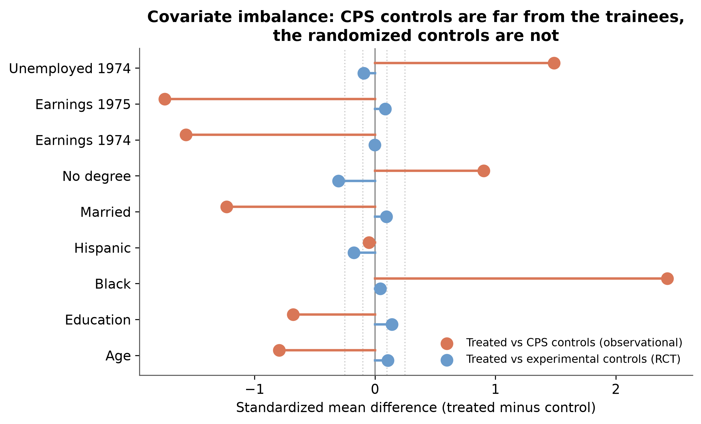
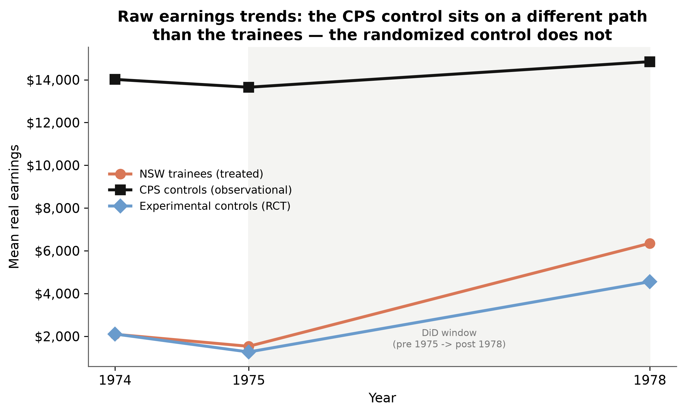
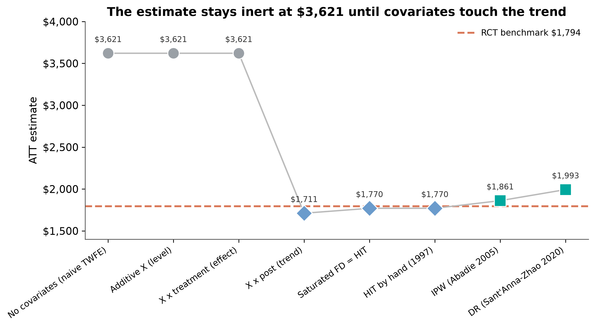
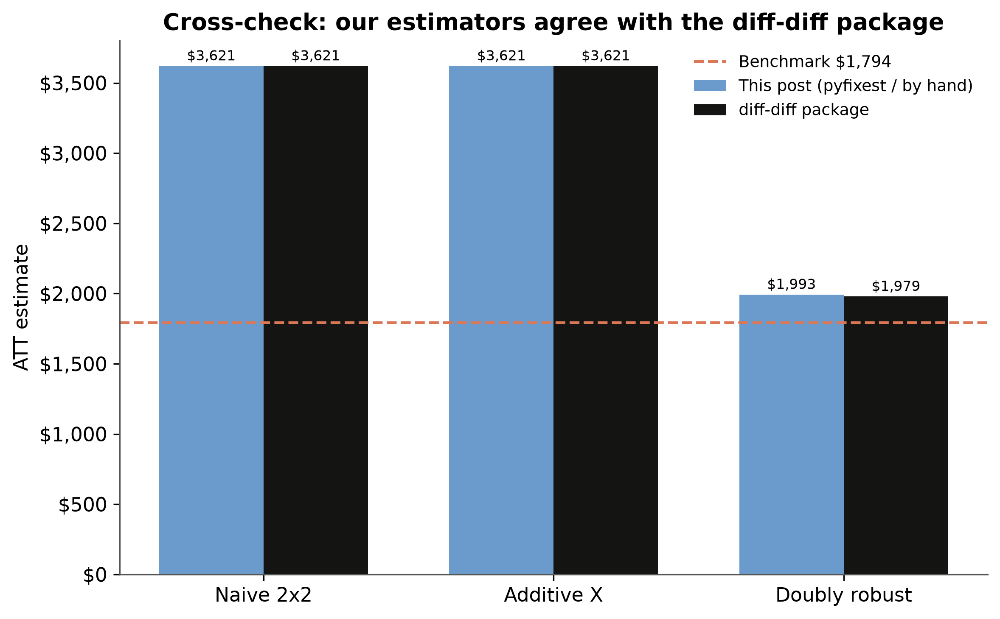
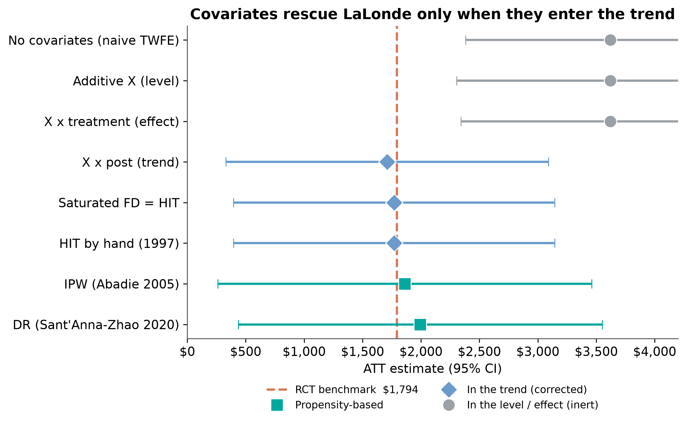

# The Puzzle {.divider background-color="#d97757"}

[Act I]{.act}

## We know the answer. Can an observational estimator find it?

A randomized trial says job training raised earnings by **\$1,794**.

. . .

Now throw the control group away. Use a survey instead.

. . .

Do you still find **\$1,794**?

::: {.notes}
Robert LaLonde asked exactly this in 1986. The answer was no, and that launched the credibility revolution. We swap in a survey of ordinary Americans and run the usual difference-in-differences with covariates.

The hook: we KNOW the right answer because an RCT exists. The question is whether an observational estimator can find it, and whether the way we use covariates matters. The naive answer, which we will see in a few slides, is \$3,621 — twice the truth.
:::

## 185 trainees, 15,992 survey controls, one known answer {.smaller}

Following [Scott Cunningham's Mixtape Substack](https://causalinf.substack.com/p/covariates-diff-in-diff-and-lalonde), we reproduce the test in Python.

- **Data:** Dehejia-Wahba subsample — 185 NSW trainees + 15,992 CPS controls.
- **Panel:** two periods, pre = 1975, post = 1978. Outcome = real earnings.
- **Estimand:** the **ATT** (effect on the treated). Design: observational.
- **Ground truth:** the experimental ATT $\approx$ **\$1,794**.

[The treated group never changes. So the **ATT target stays \$1,794**, whatever control group we use.]{.takeaway .fragment}

::: {.notes}
`nsw_mixtape` is already the Dehejia-Wahba subsample: 185 treated plus 260 experimental controls. We keep the 185 treated, discard the experimental controls, and replace them with the 15,992 CPS controls from `cps_mixtape`. The experimental controls are set aside for one job only — computing the benchmark, \$1,794 with a standard error of about \$671.

On the estimand: the ATT is the effect on the treated units, the ATE the effect on everyone; under randomization they coincide. Replacing the experimental control with a survey control changes who the comparison represents, but it leaves the treated group — and therefore the ATT — intact. Because randomization is gone, the identifying assumption is no longer plain parallel trends but *conditional* parallel trends.
:::

# The Investigation {.divider background-color="#6a9bcc"}

[Act II — diagnose the bias, then climb the spec ladder]{.act}

## Why the naive DiD fails: covariate imbalance

{fig-alt="Standardized mean differences: trainees versus each control group"}

[CPS controls differ from trainees by **+2.3 SD** on race and **−1.6 SD** on prior earnings. The randomized controls do not.]{.takeaway .fragment}

::: {.notes}
The standardized mean difference is the gap in a covariate's mean between treated and control, divided by the pooled standard deviation. A rule of thumb flags anything beyond 0.1 as imbalanced and beyond 0.25 as severe — these are many times that threshold, including −1.3 on marriage.

Against the randomized experimental controls (blue), every difference collapses to essentially zero. That contrast is the whole problem in one figure: the CPS is a representative sample of America, so its members are older, better educated, more often married and far richer than a set of disadvantaged trainees. Imbalance this extreme is exactly the condition under which conditioning on covariates stops being optional.
:::

## Different groups, different trends

{fig-alt="Raw earnings trends by group, 1974 to 1978"}

[The CPS control sits on a different level *and* a different slope. Assuming the trainees would have followed it is not credible.]{.takeaway .fragment}

::: {.notes}
The CPS controls (black) sit far above everyone else — about \$14,017 in 1974 against the trainees' \$2,096 — and drift gently upward. The trainees (orange) and the experimental controls (blue) start together near the bottom and rise in tandem into 1978.

Imbalance in levels is only half the story; it becomes a bias only if the imbalanced groups are also on different trends. They are. A DiD that uses the CPS as-is implicitly assumes the trainees, absent training, would have followed the CPS's flat high-earning path. This is precisely where covariates must do work — not by shifting levels, but by modeling those divergent trends.
:::

## Four regressions, one number {.smaller}

The $2 \times 2$ DiD ATT is computed identically by:

1. Saturated dummies (treatment $\times$ post interaction)
2. Two-way fixed effects + post $\times$ treatment
3. First-difference regression on treatment
4. Across-group regression on post

. . .

We use the **saturated form**. Only it lets us move covariates around and watch the estimate.

[Same number, four ways — so the specification choice is about covariates, not about the DiD itself.]{.takeaway .fragment}

::: {.notes}
The two-by-two DiD estimator of the ATT is the difference of two differences: the treated group's post-minus-pre change minus the control group's post-minus-pre change. As Cunningham emphasizes, four regressions compute this identical number. Throughout the deck, `post:ever_treated` is the interaction whose coefficient *is* the DiD estimate of the ATT.

If the DiD mechanics are hazy, the introductory tutorial at carlos-mendez.org/post/python_did covers them properly; here we only fix notation.
:::

## Three ways to add a covariate {.smaller}

A covariate $X$ can enter a DiD in three fundamentally different places:

| Placement | Formula | What it changes |
|---|---|---|
| **Level** | $+ X$ | the intercept (additive control) |
| **Effect** | $X \times D$ | the treatment effect (heterogeneity) |
| **Trend** | $X \times \text{post}$ | [the counterfactual **trend**]{.key} |

[Only the last placement addresses *why* the naive estimate is wrong.]{.takeaway .fragment}

::: {.notes}
Every covariate in Scott's canonical LaLonde set is a time-invariant baseline characteristic: age and its square and cube, education and its square, marriage, no-degree, race, ethnicity, 1974 earnings and an unemployment flag for 1974. None of them changes between our two periods — keep that in your pocket, because it is the reason the additive specification turns out to be completely inert.

The analogy worth using aloud: where you attach a corrective lens matters. Over the eye it fixes your vision; in your pocket it does nothing. Now watch the estimate as we climb the ladder.
:::

## The whole thesis is one token in the formula {.smaller}

:::: {.columns}
::: {.column width="50%"}
### Spec A — inert (\$3,621)

``` {.python}
XF = " + ".join(XVARS)

pf.feols(
  f"re ~ post * ever_treated + {XF}",
  data=panel, vcov="HC1")
```
:::
::: {.column width="50%"}
### Spec B — corrected (\$1,711)

``` {.python}
post_ints = " + ".join(f"post:{x}" for x in XVARS)

pf.feols(
  f"re ~ post * ever_treated + {XF} + {post_ints}",
  data=panel, vcov="HC1")
```
:::
::::

[Same covariates, same data, same estimator. One extra term — and the answer halves.]{.takeaway .fragment}

::: {.notes}
This is the entire post in one diff. `XF` puts the covariates in the level; `post_ints` multiplies each of them by the `post` indicator, so workers with different characteristics are allowed to be on different earnings trajectories over time.

Spec A is the most common specification in the entire applied panel literature — two-way fixed effects with baseline controls. It returns \$3,621. Spec B returns \$1,711, a \$1,910 move that lands within \$83 of the benchmark. Nothing about the output of Spec A warns you that it is wrong.
:::

## The estimate stays inert... {auto-animate=true}

- Spec 0 — No covariates → **\$3,621**

. . .

- Spec A — Additive $X$ (level) → **\$3,621** · inert

. . .

- Spec BT — $X \times$ treatment (effect) → **\$3,621** · inert

[Time-invariant covariates in the level or the effect never touch the control's trend. Nothing moves.]{.takeaway .fragment}

::: {.notes}
Spec A is identical to Spec 0 to the dollar, and that is mechanical, not a coincidence: the covariates are time-invariant, so the within transformation that defines two-way fixed effects sweeps them out entirely. The DiD coefficient never depended on them in the first place. If you have ever added baseline controls to a DiD and reported that "the estimate is robust to covariates," this is worth sitting with.

Spec BT lets the treatment effect vary with covariates and recovers the ATT by g-computation. That saturates the model in *levels*, relaxing the constant-effects assumption — but it does nothing about conditional parallel trends. The problem was never that the treatment effect varies; it is that the control group's counterfactual trend is mismodeled.
:::

## ...until covariates touch the trend {auto-animate=true}

- Spec B — $X \times \text{post}$ (trend) → **\$1,711**

. . .

- Spec C — saturated first differences = HIT (1997) → **\$1,770**

[The instant covariates bend the counterfactual trend, the estimate snaps to the benchmark.]{.takeaway .fragment}

::: {.notes}
Spec B collapses the estimate from \$3,621 to \$1,711 — a \$1,910 move that lands within \$83 of the \$1,794 benchmark. Same covariates as Spec A; the only change is that they now multiply `post` instead of sitting in the level.

Spec C first-differences the outcome and saturates on the treatment interactions, giving \$1,770 — within \$24 of the truth. The subtlety worth savoring: because the outcome is now a *change*, a covariate's own coefficient is no longer a level effect but its effect on the *trend*. So one regression does both jobs — bending the control's counterfactual trend and relaxing the constant-effect assumption. It is also numerically identical, to the dollar, to the Heckman-Ichimura-Todd (1997) outcome-regression estimator fit on the controls alone and imputed to the treated.
:::

## Propensity weighting reaches the benchmark by a different route

- IPW (Abadie 2005) → **\$1,861**

. . .

- DR (Sant'Anna-Zhao 2020) → **\$1,993**

. . .

These do **not** model the trend. They model *treatment* — how the probability of being a trainee depends on $X$ — and reweight the controls.

[Outcome regression specifies the trend; propensity weighting specifies selection. Two philosophies, one answer near \$1,794.]{.takeaway .fragment}

::: {.notes}
Abadie (2005) weights the first-differenced outcome by (D − p̂(X)) / (1 − p̂(X)) / Pr(D = 1), reweighting the controls to resemble the treated. Instead of specifying how earnings trend with covariates, it specifies how treatment depends on them and lets the reweighting handle the rest.

Sant'Anna-Zhao (2020) combines both: the outcome regression on the controls *and* the propensity reweighting. It is consistent if *either* model is correctly specified — two independent safety nets, and you fall through only if both fail. That is why it sits a little further from the benchmark here yet carries the strongest theoretical guarantee.

The convergence is the point: two independent modeling strategies land near \$1,800 from opposite directions.
:::

## The estimate is flat at \$3,621 until covariates enter the trend

{fig-alt="The ATT across the ordered specification sequence"}

[That cliff — between $X \times$ treatment and $X \times$ post — is the single most important feature of the analysis.]{.takeaway .fragment}

::: {.notes}
Read the ladder left to right as an argument, not as a table. Flat at \$3,621 across the first three specifications, then a drop off a cliff to \$1,711 the instant covariates enter the trend, and it stays near the benchmark thereafter.

The grouping is the thesis. No single number in this figure carries the finding; the *shape* does.
:::

## Independent check: the diff-diff package

{fig-alt="By-hand estimators versus the diff-diff package"}

[The transparent code and the battle-tested package tell the same story — within **\$14**.]{.takeaway .fragment}

::: {.notes}
Hand-coded estimators are pedagogically transparent, but a reader is entitled to ask whether we coded them correctly. The `diff-diff` package agrees exactly on the naive and additive designs (\$3,621 vs \$3,621) and lands within \$14 of the by-hand doubly-robust estimate (\$1,993 vs \$1,979).

The small remaining gap is expected, not an error: diff-diff's Callaway-Sant'Anna implementation makes its own choices about propensity estimation and weight normalization — exactly the kind of default-level difference the reference flags between hand-coded and packaged estimators.
:::

## Where $X$ enters sorts every estimator into inert or corrected

```{mermaid}
flowchart LR
    Q{"Where does X enter?"}
    Q -->|level / effect| I["inert · ~3,621"]
    Q -->|trend / propensity| C["corrected · ~1,794"]
    C -.recovers.-> B["RCT benchmark 1,794"]
```

Covariates in DiD are **not** a robustness knob.

[They have a job: make parallel trends hold, once you condition on X.]{.takeaway .fragment}

::: {.notes}
One question organizes the entire analysis: where does the covariate enter? Level and effect leave the counterfactual trend untouched, so the estimate stays inert around \$3,621. Trend placements and propensity reweighting both bend or reweight the control's counterfactual, and both recover roughly \$1,794.

The second job — relaxing constant treatment effects — is what Spec C adds on top of Spec B, and it is worth attaching to Spec C when you say it aloud. But relaxing constant effects alone (Spec BT) buys nothing, because it never touches the trend.
:::

# The Payoff {.divider background-color="#00d4c8"}

[Act III]{.act}

## Covariates rescue LaLonde only when they enter the trend

{fig-alt="All eight estimators with 95% intervals against the RCT benchmark"}

[Three inert specifications cluster at **\$3,621**; every trend and propensity estimator clusters on the **\$1,794** line.]{.takeaway .fragment}

::: {.notes}
Eight estimates, one picture. The grouping *is* the thesis — covariates are not a robustness knob, they are a correction, and only certain placements deliver it.

Point estimates, for the record: Spec 0, A and BT at \$3,621; Spec B \$1,711; Spec C and HIT \$1,770; IPW \$1,861; DR \$1,993; benchmark \$1,794. Note also how wide every interval is — which is the next slide.
:::

## How much should we trust \$1,770 over \$1,711? {.smaller}

::: {.callout-warning}
## Trust the pattern, not the decimal
Every corrected estimate's 95% CI spans roughly **\$400 to \$3,100**; the benchmark itself has SE $\approx$ **\$671**.
:::

The **\$59** gap between Spec B and Spec C is noise.

[Trust the split, not the ranking: ignore the trend and you are wrong; model it and you are right.]{.takeaway .fragment}

::: {.notes}
This caution comes from a comment by Alexis Diamond on Cunningham's original post, and it deserves to be front and center. It is tempting to rank the corrected estimators — is \$1,770 "better" than \$1,711 because it is closer? Against this much noise, no.

Reliability comes from stability across specifications and across datasets, not from one lucky hit. That is the point of the rctvsobs.org effort. It is also why we bootstrap the standard errors — 199 id-clustered resamples, seed 90210: the point estimates are only as informative as their uncertainty allows.
:::

## Placement, not inclusion, is what moves a DiD {.smaller}

1. **Placement, not inclusion.** Covariates in the level (\$3,621) or the effect (\$3,621) are inert; in the trend (\$1,711 / \$1,770) they correct.
2. **The common spec fails.** Two-way fixed effects with additive controls is exactly the one that cannot move.
3. **Two philosophies agree.** Outcome regression and propensity reweighting both land near the \$1,794 truth.
4. **Report uncertainty honestly.** Wide CIs mean the pattern is the finding, not a ranking of corrected estimates.

::: {.notes}
The one sentence to leave with: when you next see a DiD table where "we control for baseline covariates" is offered as reassurance, the right question is not *whether* covariates are included but *where* — in the level, the effect, or the trend.

Limitation worth naming: this is one dataset with a small treated group and a famously thin covariate set. The natural next step is staggered timing with the Callaway-Sant'Anna estimator, where doubly-robust covariate adjustment is the default rather than an afterthought.
:::

## Everything here is reproducible

- **Full tutorial:** [carlos-mendez.org/post/python_did_covariates_lalonde](https://carlos-mendez.org/post/python_did_covariates_lalonde/)
- **Intro to DiD:** [carlos-mendez.org/post/python_did](https://carlos-mendez.org/post/python_did/)
- **Source:** Cunningham, *Covariates, diff in diff and LaLonde test*, Scott's Mixtape Substack
- **RCT-vs-observational benchmarks:** [rctvsobs.org](http://rctvsobs.org/)

*Packages: `pyfixest`, `diff-diff`, `causaldata`.*

::: {.notes}
The post ships the Python script, a Jupyter notebook, a Colab link, a Quarto project bundle and a Stata do-file. The data comes from `causaldata`, so nothing needs to be downloaded by hand; the seed is 90210 and re-running reproduces the table exactly.
:::

## Covariates rescue a DiD only from the trend — never from the level or the effect. {.divider background-color="#141413"}

::: {.notes}
The single takeaway. Three specifications that keep covariates out of the counterfactual trend all return \$3,621, roughly twice the truth; every specification that lets covariates bend the control group's trend — or reweights the controls by propensity — recovers something near the \$1,794 experimental benchmark. Covariates in a difference-in-differences are not a robustness knob to be twisted for reassurance. They perform a specific job, and the most common applied specification of all, two-way fixed effects with additive controls, does not do it.
:::
