---
authors:
  - admin
categories:
  - Python
  - Causal Inference
  - Difference-in-Differences
date: "2026-06-12T00:00:00Z"
draft: false
featured: false
external_link: ""
image:
  caption: ""
  focal_point: Smart
  placement: 3
  preview_only: false
links:
  - icon: person-chalkboard
    icon_pack: fas
    name: "Slides (HTML)"
    url: slides/index.html
  - icon: file-pdf
    icon_pack: fas
    name: "AI Slides (PDF)"
    url: https://carlos-mendez.org/post/python_did_industrial_park/slides/Staggered_DiD_for_Place-Based_Policy.pdf
  - icon: podcast
    icon_pack: fas
    name: AI Podcast
    url: "/post/python_did_industrial_park/#podcast-player"
  - icon: laptop-code
    icon_pack: fas
    name: "Web app"
    url: web_app/index.html
  - icon: code
    icon_pack: fas
    name: "Python script"
    url: script.py
  - icon: book
    icon_pack: fas
    name: "Data dictionary"
    url: data/index.html
  - icon: file-code
    icon_pack: fas
    name: "Quarto project (.zip)"
    url: python_did_industrial_park.zip
  - icon: markdown
    icon_pack: fab
    name: "MD version"
    url: https://raw.githubusercontent.com/cmg777/starter-academic-v501/master/content/post/python_did_industrial_park/index.md
summary: "Do industrial parks raise local economic activity — and for whom? A beginner's staggered difference-in-differences evaluation of Ethiopian industrial parks in Python, replicating Huang, Wang & Xu (2026) on synthetic calibrated data: TWFE and an event study with pyfixest, the modern Sun-Abraham, Borusyak/Gardner and Callaway-Sant'Anna estimators plus a Goodman-Bacon decomposition with diff-diff, survey-weighted repeated-cross-section DiD on DHS household welfare and women's empowerment, and Conley spatial standard errors."
tags:
  - python
  - causal
  - did
  - event-study
  - staggered
  - callaway-santanna
  - sun-abraham
  - pyfixest
  - diff-diff
  - panel data
  - repeated cross-section
  - spatial
  - industrial policy
title: "Do Industrial Parks Work? Evaluating Place-Based Policy in Ethiopia with Difference-in-Differences"
url_code: ""
url_pdf: ""
url_slides: ""
url_video: ""
toc: true
diagram: true
---

## Abstract

Governments across the developing world spend billions on industrial parks — fenced zones with serviced land, power and customs to lure factories — yet whether these place-based subsidies actually lift the surrounding economy, and who inside it benefits, remains hotly contested. This tutorial asks whether Ethiopia's industrial parks raised local economic activity, urbanization, household living standards, and women's economic agency, and how each effect can be measured credibly when parks are not placed at random. It replicates Huang, Wang & Xu (2026) on synthetic calibrated data combining a satellite district-year panel of 139 woredas observed annually over 2005–2020 (2,224 rows; 17 park-hosting woredas treated on a staggered 2008–2021 rollout against 122 propensity-score-matched never-treated controls) with two Ethiopia DHS repeated cross-sections — 13,200 households and 17,900 individuals across five survey rounds. It estimates a static two-way fixed-effects difference-in-differences and an event study with pyfixest, cross-checks them against the modern Sun-Abraham, Borusyak/Gardner and Callaway-Sant'Anna staggered estimators plus a Goodman-Bacon decomposition with diff-diff, and runs survey-weighted repeated-cross-section DiD with Conley spatial standard errors. A park raises inverse-hyperbolic-sine nighttime light by +0.215 (p < 0.01), the four staggered estimators agree within 0.046 units with 95.4% clean Bacon weight, and households gain durables (+0.229), housing (+0.248) and wealth (+0.383); crucially, average non-agricultural employment is insignificant (+0.091) yet the female effect is large (+0.140, p < 0.01). These findings imply that well-sited parks can reshape a local economy and women's lives, but only a sex-disaggregated analysis reveals it.

## 1. Overview

Industrial parks are one of the most popular instruments of modern development policy. The recipe is simple: the government clears a tract of land, installs power, water, roads and a one-stop customs office, and rents serviced plots to manufacturers — usually in textiles, garments or leather. Ethiopia bet heavily on this model, opening more than twenty parks across eighteen districts between 2008 and 2021. The hope was that factories would cluster, create jobs, and pull a largely rural region into a wage economy. But place-based subsidies are controversial precisely because they might do little more than relocate activity that would have happened anyway — or light up a fenced enclave while the surrounding districts see nothing.

So the question this post tackles is genuinely two-sided: **do industrial parks raise local economic activity, and — just as important — for whom?** A park could boost satellite-measured luminosity yet leave household living standards flat. It could create jobs on average, yet only for men. Measuring this credibly is hard, because the government did not flip a coin to decide where parks go — it chose districts near cities and roads, which were already growing faster. We need a research design that nets out those pre-existing differences, and that handles a *staggered* rollout where parks opened in different years. That design is **difference-in-differences (DiD)**, and the modern staggered-robust toolkit built around it.

Why not just one DiD regression? Because the workhorse two-way fixed-effects (TWFE) estimator can mislead under staggered timing: it secretly uses already-treated districts as controls for later-treated ones, a "forbidden comparison" that can flip the sign of the estimate when effects grow over time. A central goal of this tutorial is to show that worry being *checked* rather than ignored — we run four estimators side by side and decompose exactly where the TWFE number comes from. The estimand throughout is the **average treatment effect on the treated (ATT)** — the effect on the districts (and people) that actually got a park — identified under a parallel-trends assumption, in an explicitly **observational** setting where the parks were not randomly placed.

> **A note on the data (please read this).** This tutorial replicates **Huang, Wang & Xu (2026)**, but it runs on **synthetic data built for teaching**. The paper's real inputs (harmonized nighttime lights, the GISD30 impervious-surface product, confidential Ethiopia DHS micro-data, the official park list) are licensed or restricted. Our dataset is *calibrated* so that re-running the paper's analyses reproduces its **findings** — the signs, the significance stars, and the *approximate* magnitudes of the key coefficients. Most results track the paper closely; a handful of magnitudes differ, and we tabulate exactly which in [Section 13](#13-reproduction-audit-synthetic-data-vs-the-paper). Use this to learn the *methods*, not to draw new conclusions about Ethiopia.

### 1.1 Learning objectives

By the end of this tutorial, you will be able to:

- **Frame** a staggered place-based policy as a quasi-experiment, and explain why a treated-vs-never-treated comparison identifies the **ATT** under parallel trends.
- **Estimate** a static two-way fixed-effects difference-in-differences and a dynamic event study on satellite outcomes with [`pyfixest`](https://pyfixest.org/).
- **Compare** TWFE against the modern Sun-Abraham, Borusyak/Gardner and Callaway-Sant'Anna estimators, and **diagnose** the staggered negative-weights problem with a Goodman-Bacon decomposition using [`diff-diff`](https://github.com/igerber/diff-diff).
- **Apply** survey-weighted repeated-cross-section DiD to DHS household welfare and individual employment, and read a heterogeneity split that turns a null average into a sharp finding.
- **Defend** your inference when treatment is spatially clustered, using Conley spatial-HAC standard errors and restricted-control-pool checks.

### 1.2 Study design

The diagram below maps the whole tutorial. Three data streams flow into one DiD design, that design is estimated by an escalating ladder of estimators, and the estimates answer three outcome families. Read it left to right: the staggered park rollout splits woredas (Ethiopia's local districts) into treated and never-treated; we observe satellite, household, and individual outcomes; we climb from a naive 2×2 to the modern staggered-robust estimators; and we report effects on activity, welfare, and women's empowerment.

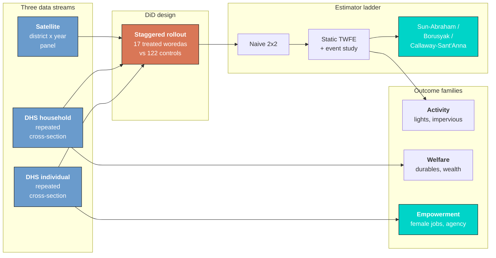

The key idea the diagram encodes is that one estimand — the ATT — threads through everything. The naive 2×2 is the cartoon version; TWFE and its event-study view are the workhorse; and the three modern estimators are the robustness insurance that the workhorse has not been led astray by staggered timing. Each box maps onto a section below, and the gender finding (the teal "Empowerment" box) is where the analysis lands.

### 1.3 Where are the industrial parks located?

Ethiopia placed its parks deliberately — clustered around the capital, Addis Ababa, and the main transport corridors, yet reaching into peripheral regions of the country. Before we build any statistical machinery, it helps to see the real geography we are modeling.

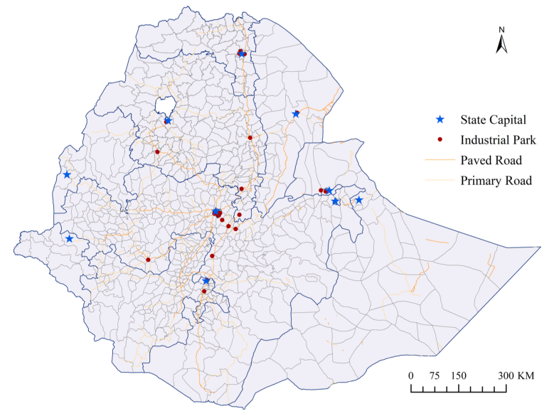

*Source: Appendix Figure A2 in Huang, Wang & Xu (2026), "The socioeconomic impacts of industrial parks in Ethiopia." The map shows the paper's real park locations for geographic context; this tutorial's analysis runs on synthetic data calibrated to reproduce the paper's results.*

That deliberate clustering near cities and roads is exactly the kind of non-random placement our design has to handle — so before estimating anything, the next section pins down the vocabulary that makes the treated-versus-control comparison credible.

## 2. Key concepts

The post leans on a small vocabulary repeatedly, and the later sections assume you can move between these terms quickly. Each concept below has three parts. The **definition** is always visible; the **example** and **analogy** sit behind clickable cards — open them when you need them, leave them closed for a quick scan. If a later section mentions "forbidden comparisons" or "repeated cross-section" and the term feels slippery, this is the section to re-read.

**1. Staggered difference-in-differences.**
Units adopt treatment at *different* times, not all at once. We compare the change in outcomes for a treated group to the change for a not-yet-treated or never-treated group. With many adoption dates, the design is a stack of overlapping 2×2 comparisons.

<div class="concept-pair">
<details class="concept-card concept-example">
<summary>Example</summary>

Ethiopia's parks open across eight cohorts: 1 woreda in 2008, then 2 in 2014, 2 in 2015, 3 in 2016, 3 in 2017, 2 in 2018, 2 in 2019, and 2 in 2020 — 17 treated woredas in total, each turning on in its own year.

</details>

<details class="concept-card concept-analogy">
<summary>Analogy</summary>

A city installs streetlights block by block over a decade. To judge their effect you cannot just compare "before any lights" to "after all lights" — you must line up each block against its own opening date and a block that never got lit.

</details>
</div>

**2. Parallel trends.**
The identifying assumption of DiD: absent the park, treated and control woredas would have followed the *same* path on average. Their *levels* can differ; their *trends* must match. We cannot prove it, but a flat pre-treatment event study makes it credible.

<div class="concept-pair">
<details class="concept-card concept-example">
<summary>Example</summary>

The four pre-opening event-study leads run from −0.0275 to −0.0013 and the largest absolute *t* among them is just 2.17 — close enough to flat to read as parallel trends holding before the parks open.

</details>

<details class="concept-card concept-analogy">
<summary>Analogy</summary>

Two boats on the same current sit at different points but drift in step. Only an engine — the treatment — should make one pull ahead. If they were already diverging before the engine fired, the comparison is broken.

</details>
</div>

**3. ATT** $E[Y\_i(1) - Y\_i(0) \mid D\_i = 1]$.
The Average effect of the Treatment on the Treated — the effect *on the districts that got a park*, not on a random district. DiD, TWFE, and all three modern estimators here target the ATT, not the population-wide ATE.

<div class="concept-pair">
<details class="concept-card concept-example">
<summary>Example</summary>

The +0.215 light effect is the ATT *for the 17 park woredas*. It does not promise that placing a park in any random district would raise its lights that much — only that *these* districts, given *these* parks, ended up that much brighter.

</details>

<details class="concept-card concept-analogy">
<summary>Analogy</summary>

The bonus speed measured on the car that actually got the new engine — not a promise about any car you might pick off the street.

</details>
</div>

**4. TWFE bias, negative weights, and forbidden comparisons.**
Under staggered timing, the two-way fixed-effects regression quietly uses *already-treated* units as controls for *later-treated* ones. Those "forbidden" comparisons can get negative weights and bias — even flip the sign of — the estimate when effects grow over time.

<div class="concept-pair">
<details class="concept-card concept-example">
<summary>Example</summary>

Here the danger is tiny: the Goodman-Bacon decomposition shows the forbidden later-vs-earlier comparisons carry only 1.21% of the total weight (and average +0.0135), while clean treated-vs-never comparisons carry 95.42%.

</details>

<details class="concept-card concept-analogy">
<summary>Analogy</summary>

Grading a class on a curve where some students were secretly given the exam early and then used as the "average" everyone else is scored against. If only a couple of students got the early peek, the curve is barely distorted — which is the situation here.

</details>
</div>

**5. Event study.**
Instead of one ATT, estimate one coefficient per year-relative-to-opening (event time $k$). Plotting them shows the *dynamic path*: flat leads before opening (no anticipation) and rising lags after (the effect building up).

<div class="concept-pair">
<details class="concept-card concept-example">
<summary>Example</summary>

The light effect is +0.115 the year a park opens ($k = 0$), climbs to +0.193 at $k = +1$ and +0.219 at $k = +2$, and plateaus at +0.484 by $k = +4$ — a slow build, not an instant jump.

</details>

<details class="concept-card concept-analogy">
<summary>Analogy</summary>

A medical chart that plots a patient's temperature day by day around the start of a drug, rather than reporting a single before/after average. The shape of the curve tells you when and how the drug works.

</details>
</div>

**6. Repeated-cross-section DiD.**
When each survey round interviews *different* households (no panel key), you cannot use household fixed effects. The effect is identified off district × round group means: compare treated vs control districts before vs after their park opens, absorbing district and region×round fixed effects.

<div class="concept-pair">
<details class="concept-card concept-example">
<summary>Example</summary>

The DHS data are five rounds (2000, 2005, 2011, 2016, 2019) of fresh respondents. So the household regression uses `| district_id + region_id^survey_round` — district and region-by-round fixed effects — with no household effect, and only coarse event *phases* $\\{-3, ..., +1\\}$.

</details>

<details class="concept-card concept-analogy">
<summary>Analogy</summary>

Polling a city's mood with a fresh sample of pedestrians each year. You cannot track any one person over time, but you can still compare how *neighborhoods* shifted relative to each other.

</details>
</div>

**7. Survey weights and clustered/Conley standard errors.**
The DHS is a complex sample, so regressions are weighted by the sampling weight. Standard errors are clustered on district (allowing a district's errors to correlate over time) and, for the satellite panel, hardened with Conley spatial-HAC errors that also allow nearby districts to correlate.

<div class="concept-pair">
<details class="concept-card concept-example">
<summary>Example</summary>

For the light ATT the cluster SE (0.0792) and the Conley-HAC SE (0.0799) are nearly identical and 2.43× the naive HC0 SE (0.0329) — yet the +0.215 estimate stays significant at *t* = 2.69.

</details>

<details class="concept-card concept-analogy">
<summary>Analogy</summary>

Counting a milling crowd. If everyone keeps shuffling between seats, you have far fewer *truly independent* heads than the rows suggest — honest standard errors admit that.

</details>
</div>

**8. SUTVA and spillovers.**
The stable-unit-treatment-value assumption says one unit's treatment does not affect another's outcome. If a park lifts its *neighbours*' lights, the never-treated controls are contaminated and the ATT is biased. A `nearby` test checks for exactly this leakage.

<div class="concept-pair">
<details class="concept-card concept-example">
<summary>Example</summary>

The `nearby` coefficient (control districts within 10 km of a park) is +0.0648 and insignificant (*t* = 1.06), while the host effect stays +0.2712 — no measurable spillover, so SUTVA is plausible here.

</details>

<details class="concept-card concept-analogy">
<summary>Analogy</summary>

Testing whether a new factory's smoke drifts onto the neighbouring farm. If the farm's crops are unchanged, you can fairly use it as a clean comparison for the factory's own land.

</details>
</div>

## 3. Setup and the two star libraries

Two specialist packages do the heavy lifting, and each gets a one-line introduction the first time it appears:

- **[`pyfixest`](https://pyfixest.org/)** runs fixed-effects regressions with a fast, Stata-flavored formula syntax: everything left of the `|` is estimated, everything right of it is *absorbed* as fixed effects. It also ships an `event_study` helper with the modern `saturated` (Sun-Abraham) and `did2s` (Borusyak/Gardner) estimators built in.
- **[`diff-diff`](https://github.com/igerber/diff-diff)** is a teaching-oriented package for difference-in-differences. We use its `DifferenceInDifferences`, `CallawaySantAnna`, and `BaconDecomposition` classes — the last two are exactly the staggered-robust tools this post needs.

```python
# In Colab, install the two estimation libraries first:
# !pip install pyfixest==0.50.1 diff-diff==3.5.2

import numpy as np
import pandas as pd
import matplotlib.pyplot as plt
import pyfixest as pf
import diff_diff as dd

np.random.seed(42)  # reproducibility

# Site dark-theme palette for figures
STEEL_BLUE, WARM_ORANGE, TEAL = "#6a9bcc", "#d97757", "#00d4c8"
DARK_NAVY, GRID_LINE, LIGHT_TEXT = "#0f1729", "#1f2b5e", "#c8d0e0"
```

The satellite specifications need two small design helpers. The first builds the staggered `first_treat` column the modern estimators require: treated woredas get their park's opening year, and **never-treated controls get 0 — not `NaN`**, because a missing value would silently drop the 122 controls that every staggered estimator needs as its clean comparison group. The second builds the "with-trends" interactions that absorb the faster pre-existing urban trend of treated woredas (more on why in Section 6).

```python
def add_first_treat(d):
    """Treated woredas get their open_year; never-treated controls get 0."""
    out = d.copy()
    out["first_treat"] = out["open_year"].fillna(0).astype(int)
    return out

def add_trend_terms(d):
    """Centre time at 2012 and interact it with 2007 baseline characteristics,
    so each woreda can follow its own linear trend (the paper's even columns)."""
    out = d.copy()
    out["t"] = out["year"] - 2012
    for c in ["urbanization_rate_2007", "employment_rate_2007",
              "log_pop_density_2007", "share_christian_2007", "share_amharic_2007"]:
        out[f"t_{c}"] = out["t"] * out[c]
    return out

TREND_TERMS = ["t_urbanization_rate_2007", "t_employment_rate_2007",
               "t_log_pop_density_2007", "t_share_christian_2007",
               "t_share_amharic_2007"]
```

With the tooling in place, the next step is to load the three data layers and understand why they are structured so differently.

## 4. The three datasets

Evaluating a place-based policy forces a measurement choice to the surface. National statistics would barely flinch at a few new factories, so we need *sub-national* data — and at three different grains. We load all three straight from the post's data folder on GitHub, so the code runs unchanged in Colab.

```python
BASE = ("https://raw.githubusercontent.com/cmg777/starter-academic-v501/"
        "master/content/post/python_did_industrial_park/data/")
district = pd.read_csv(BASE + "industrial_park_district_panel.csv")
household = pd.read_csv(BASE + "industrial_park_household_rcs.csv")
individual = pd.read_csv(BASE + "industrial_park_individual_rcs.csv")

print("district panel :", district.shape)
print("household RCS  :", household.shape)
print("individual RCS :", individual.shape)
print("treated woredas:", district.loc[district.treated == 1, "district_id"].nunique())
print("control woredas:", district.loc[district.treated == 0, "district_id"].nunique())
```

```text
district panel : (2224, 34)
household RCS  : (13200, 13)
individual RCS : (17900, 22)
treated woredas: 17
control woredas: 122
```

The three layers have fundamentally different structures, and that distinction drives every downstream choice. The **district layer is a balanced panel** — 139 woredas × 16 years (2005–2020) = **2,224 rows** — so it supports a genuine panel event study with annual event time. The **household and individual layers are repeated cross-sections**: five DHS rounds of *different* respondents (13,200 households and 17,900 individuals), with **no within-respondent panel key**, so they admit only coarse event phases and survey-weighted regressions, never unit fixed effects. The treatment split is small on the treated side — **17 park woredas against 122 matched controls** — which is exactly why several effects below are borderline and why honest standard errors matter.

### 4.1 The staggered rollout

The single feature that makes this a *staggered* design is that parks opened in different years. Tabulating the treated woredas by opening year shows the cohort structure that every modern estimator below keys on.

```python
cohorts = (district[district.treated == 1]
           .drop_duplicates("district_id")
           .groupby("open_year").size())
print(cohorts.rename("n_treated_woredas").to_string())
print("total treated:", int(cohorts.sum()))
```

```text
open_year
2008    1
2014    2
2015    2
2016    3
2017    3
2018    2
2019    2
2020    2
total treated: 17
```

The rollout is genuinely staggered: a single anchor woreda opens in **2008** (the Eastern Industrial Park), then the main build-out runs **2014–2020** with two to three woredas per year. This spread is what makes a naive before/after impossible — there is no single "before" — and what makes the staggered-robust estimators in Section 6 necessary rather than decorative. It also guarantees that every event time has at least three treated woredas behind it, so the dynamic path is estimated off real data at each lag.

### 4.2 The outcomes, and a transparent word on the data

The satellite layer carries two outcomes: `ihs_light`, the inverse hyperbolic sine of nighttime luminosity (a log-like transform that handles zeros), and `impervious_ratio`, the share of a woreda's land that is built-up surface, observed only every five years. The household layer carries durable goods per capita, a housing-quality indicator, and the standardized wealth index. The individual layer carries non-agricultural employment plus, for women, decision-making power, savings-account ownership, and acceptance of domestic violence.

```python
for col, layer, df in [("ihs_light", "district", district),
                       ("durable_goods_pc", "household", household),
                       ("nonag_employment", "individual", individual)]:
    s = df[col]
    print(f"{col:18s} ({layer:10s}) N={s.notna().sum():6d}  "
          f"mean={s.mean():.3f}  sd={s.std():.3f}")
```

```text
ihs_light          (district  ) N=  2224  mean=0.352  sd=0.715
durable_goods_pc   (household  ) N= 12207  mean=0.308  sd=0.487
nonag_employment   (individual ) N= 17219  mean=0.343  sd=0.475
```

These means anchor every magnitude that follows. Durable goods average **0.308** items per capita, so the +0.229 ATT we find later is a ~74% lift off that base; non-agricultural employment averages **0.343**, so a +0.140 effect for women is a large move. Before modeling, though, one caveat must be stated plainly: **the data are synthetic**. The data-generating process was tuned so that re-running the paper's regressions recovers its coefficients (within about 0.02 on the headline cells), with the same signs and stars; spatial and serial shocks were injected so the standard errors behave realistically *without moving the point estimates*. We hold ourselves to that in [Section 13](#13-reproduction-audit-synthetic-data-vs-the-paper). With the measurement settled, let us look at the data before regressing it.

## 5. Exploratory analysis: the case for parallel trends

Good causal work *looks* at the data before it models it. The first and most important view plots treated and control group-mean light over time — the picture difference-in-differences was invented for. One subtlety drives how we draw it: because of the synthetic **bright-base device** (treated park-cities are modelled as intrinsically much brighter than rural controls, a level difference the district fixed effect absorbs), plotting *raw* light levels would put the two groups miles apart and hide the trends. So we plot light **indexed to each group's own pre-2008 mean** — baseline-normalized — which makes the "matched-then-diverge" picture read correctly.

```python
# baseline-normalize each group's mean light to its pre-2008 average
g = (district.assign(grp=np.where(district.treated == 1, "Treated", "Control"))
     .groupby(["grp", "year"])["ihs_light"].mean().reset_index())
base = g[g.year < 2008].groupby("grp")["ihs_light"].mean()
g["normed"] = g.apply(lambda r: r.ihs_light - base[r.grp], axis=1)
# (full dark-theme styling is in script.py)
```

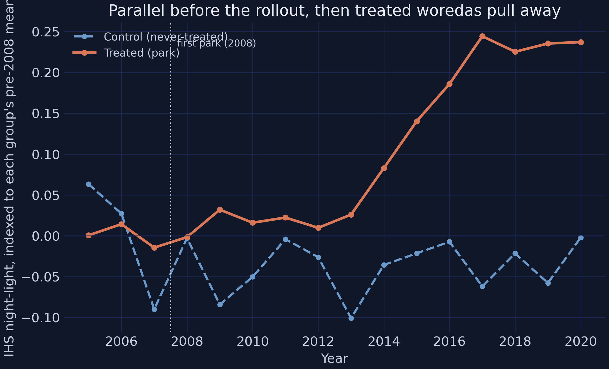

Indexed to each group's pre-2008 mean, the treated and control series sit on top of each other through the pre-rollout era — in 2008 the treated group is at **−0.0018** and the control group at **−0.0030**, essentially identical, the visual signature of parallel trends holding before treatment turns on. From the 2014 build-out onward the treated series climbs steadily (**+0.083 in 2014 → +0.186 in 2016 → +0.244 in 2017 → +0.237 in 2020**) while the controls hover around zero with no trend. The eye already sees a matched pair of groups that diverge only after the parks open; the rest of the post is about measuring that divergence and trusting the measurement.

The staggered structure is easier to see one cohort at a time. The "staircase" figure traces each opening-year cohort's mean light against the flat never-treated baseline.

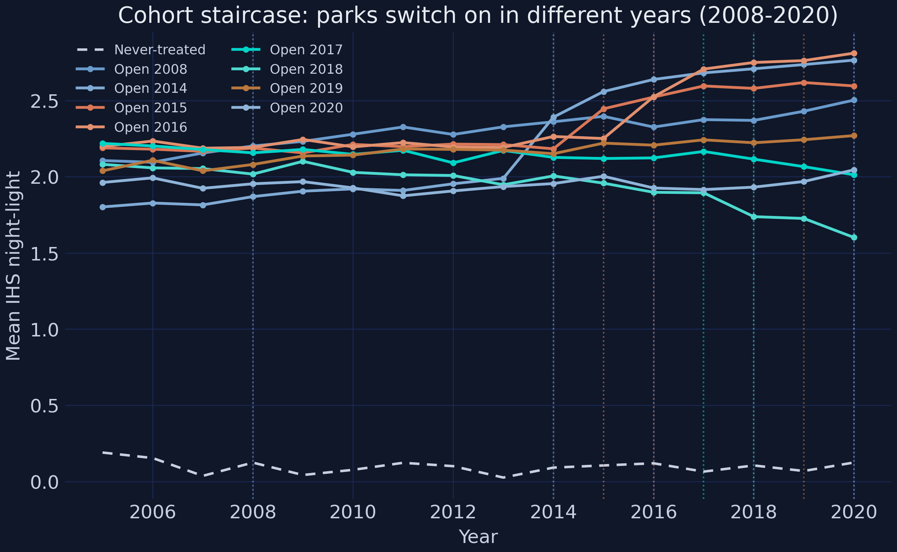

Each cohort turns up at its *own* opening year — the 2016 cohort lifts off in 2016, the 2018 cohort in 2018 — while the never-treated line stays flat and even drifts down slightly, sharpening the contrast. This is the staggered design made visual: there is no single treatment date, so any honest estimator must align each cohort to its own clock. The next view confirms a second design fact — that treatment is not scattered randomly across the map.

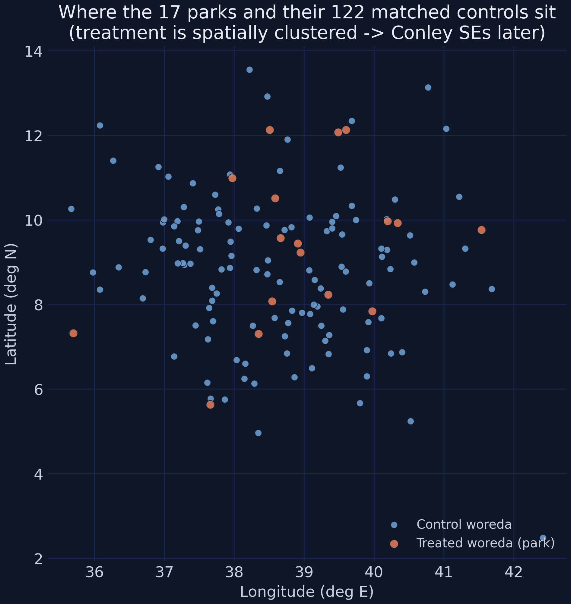

Plotting the 17 treated woredas (orange) and 122 controls (blue) by longitude and latitude shows the treated units are **spatially clustered**, not randomly sprinkled — parks went to a handful of regions near cities and roads. Clustered treatment means a regional shock could hit several treated woredas at once, so their errors are unlikely to be independent. That is precisely the problem Conley spatial standard errors fix in Section 11. Finally, a distributional view shows the bright-base device head-on.

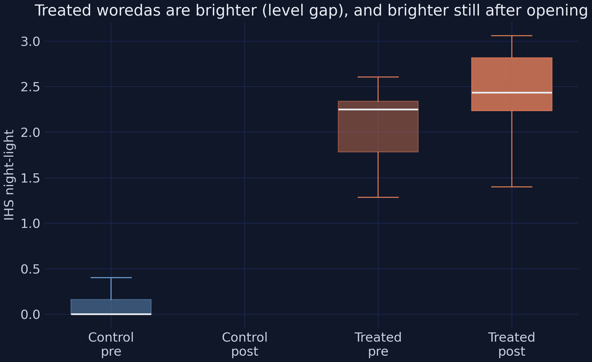

The boxplots split IHS light by group and pre/post period. Treated woredas sit **far above** controls in level — the synthetic bright base — and shift up further after opening, while controls barely move. The large level gap looks alarming but is harmless: the district fixed effect absorbs any time-invariant brightness, leaving the DiD coefficient untouched. With the intuition built, we can put the first number on the table.

## 6. From a naive 2×2 to the static TWFE ATT

### 6.1 The naive 2×2 (and why it understates the effect)

The simplest possible estimate collapses the whole staggered design at the median opening year (2017), forms four treated/control × pre/post cell means, and takes the difference of differences. [`diff-diff`](https://github.com/igerber/diff-diff)'s `DifferenceInDifferences` class returns it with a standard error.

```python
d = district.copy()
d["post"] = (d.year >= 2017).astype(int)  # collapse at the median opening year
cells = d.groupby(["treated", "post"])["ihs_light"].mean().unstack("post")
print(cells.round(4))

res = dd.DifferenceInDifferences(cluster="district_id").fit(
    d, outcome="ihs_light", treatment="treated", time="post")
print(f"\nDiD ATT = {res.att:+.4f}  (SE {res.se:.4f}, p = {res.p_value:.4f})")
```

```text
post              0       1
treated
0            0.0990  0.0909
1            2.1308  2.3237

DiD ATT = +0.2011  (SE 0.0885, p = 0.0232)
```

Treated light rises **+0.1929** post-opening while controls *fall* **−0.0082**, so the difference-in-differences is **+0.2011** (SE 0.0885, p = 0.0232) — significant at 5%, with the by-hand and `diff-diff` estimates agreeing to four decimals. But this blended 2×2 **understates** the dynamic effect: the park's impact ramps up over roughly five years (the event study below reaches +0.48), so averaging the small early post-years with the large late ones pulls the mean toward 0.20. It also leans on the Goodman-Bacon "forbidden comparisons" we worry about under staggering. The fix is to let the effect vary over time and to absorb confounders with fixed effects.

### 6.2 The static TWFE difference-in-differences

The workhorse specification adds two-way fixed effects. For woreda $d$ in year $t$:

$$Y\_{dt} = \beta \\, D\_{dt} + \alpha\_d + \gamma\_{r(d),t} + \varepsilon\_{dt}$$

In words, this says that the outcome $Y\_{dt}$ (here `ihs_light`) equals a park effect $\beta$ times the treatment indicator $D\_{dt}$ (the `treatment` column, which is 1 once a woreda's park is open), plus a **woreda fixed effect** $\alpha\_d$ that absorbs anything permanent about a district (including its bright base), plus a **region-by-year fixed effect** $\gamma\_{r(d),t}$ that absorbs shocks common to a whole region in a given year, plus noise $\varepsilon\_{dt}$. The coefficient $\beta$ is the **ATT** — the average park effect on the treated woredas. The "with-trends" specification adds the `t_*` interactions to let each woreda follow its own linear trend. In `pyfixest`, the part after the `|` lists the fixed effects to absorb:

```python
dt = add_trend_terms(district)
out_rows = []
for ycol, label in [("ihs_light", "IHS night-light"),
                    ("light_intensity", "Raw night-light"),
                    ("impervious_ratio", "Impervious ratio")]:
    m0 = pf.feols(f"{ycol} ~ treatment | district_id + region^year",
                  data=dt, vcov={"CRV1": "district_id"})
    m1 = pf.feols(f"{ycol} ~ treatment + " + " + ".join(TREND_TERMS) +
                  " | district_id + region^year",
                  data=dt, vcov={"CRV1": "district_id"})
    out_rows.append((label, m0.coef()["treatment"], m0.se()["treatment"],
                     m1.coef()["treatment"], m1.se()["treatment"]))
for label, b0, se0, b1, se1 in out_rows:
    print(f"{label:18s} no-trends {b0:+.4f} ({se0:.4f})   "
          f"with-trends {b1:+.4f} ({se1:.4f})")
```

```text
IHS night-light    no-trends +0.2704 (0.1007)   with-trends +0.2152 (0.0833)
Raw night-light    no-trends +1.7316 (0.4807)   with-trends +1.6181 (0.4540)
Impervious ratio   no-trends +0.0292 (0.0042)   with-trends +0.0263 (0.0037)
```

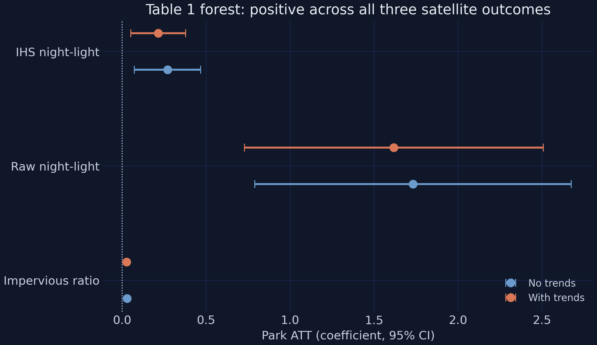

The static TWFE regression recovers the paper's headline: a park raises IHS nighttime light by **+0.2152** with trend interactions (SE 0.0833, *t* = 2.58, significant at 1%) and **+0.2704** without them — roughly a **21–27% increase in luminosity**, since the IHS coefficient reads approximately as a proportional change at these magnitudes. The drop from 0.27 to 0.21 when trends are added is a textbook differential-trend confound: treated woredas were already more urban in 2007 and trending up faster, so the time × urbanization interaction absorbs that slope and the with-trends estimate is the cleaner ATT. The impervious-surface ratio rises **+0.0263** with trends (SE 0.0037, *t* = 7.07) — about 2.6 percentage points of built-up land, ~82% of its 0.032 mean, and the most precisely estimated satellite coefficient in the study. The raw-light coefficient runs high (+1.618 vs the paper's 1.276), a documented synthetic artifact of the bright-base device that we flag again in the reproduction audit. With a static ATT in hand, we unfold it across event time.

## 7. The event study: the dynamic path

A single ATT hides *when* the effect arrives. The event study estimates one coefficient per year-relative-to-opening, normalized to the year before opening ($k = -1$). For woreda $d$ in year $t$, with cohort opening year $g$:

$$Y\_{dt} = \sum\_{k \neq -1} \delta\_k \\, \mathbf{1}[t - g = k] + \alpha\_d + \gamma\_{r(d),t} + \varepsilon\_{dt}$$

In words, this says we replace the single treatment dummy with a *set* of dummies, one for each event time $k$ (years since the park opened), each carrying its own coefficient $\delta\_k$. The pre-opening coefficients ($k < 0$) should hug zero if parallel trends and no-anticipation hold; the post-opening coefficients ($k \geq 0$) trace how the effect builds. Here $\mathbf{1}[t - g = k]$ is an indicator equal to 1 when woreda $d$ is exactly $k$ years from its own opening, $\alpha\_d$ and $\gamma\_{r(d),t}$ are the same fixed effects as before, and the omitted $k = -1$ is the reference. We estimate the clean leads and lags with `pyfixest`'s `saturated` (Sun-Abraham) estimator, whose `.aggregate()` collapses the cohort dimension to one effect per $k$.

```python
df = add_first_treat(district)
m = pf.event_study(df, yname="ihs_light", idname="district_id", tname="year",
                   gname="first_treat", estimator="saturated", att=True)
es = m.aggregate().reset_index()
es["event_time"] = es["period"].astype(float)
es = es[(es.event_time >= -5) & (es.event_time <= 5)].sort_values("event_time")
print(es[["event_time", "Estimate", "Std. Error", "Pr(>|t|)"]].round(4).to_string(index=False))
```

```text
 event_time  Estimate  Std. Error  Pr(>|t|)
       -5.0   -0.0139      0.0176    0.4288
       -4.0   -0.0013      0.0138    0.9226
       -3.0   -0.0275      0.0127    0.0304
       -2.0   -0.0135      0.0077    0.0791
        0.0    0.1153      0.0295    0.0001
        1.0    0.1928      0.0422    0.0000
        2.0    0.2187      0.0641    0.0006
        3.0    0.3138      0.0880    0.0004
        4.0    0.4844      0.0463    0.0000
        5.0    0.4697      0.0712    0.0000
```

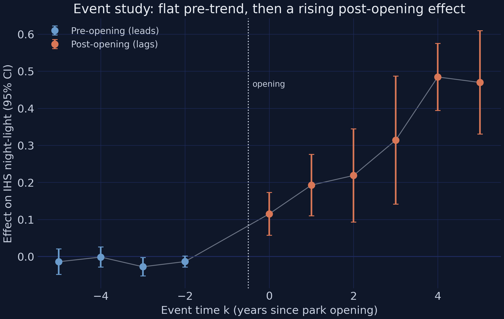

The figure tells the whole story in one arc. The four pre-opening leads **hug zero** — they range from −0.0275 to −0.0013 and the largest absolute *t* among them is just **2.17** — weak enough to read as a flat pre-trend rather than a violation. The jump comes strictly *after* opening: the effect is already **+0.1153 at $k = 0$** (p = 0.0001), climbs through +0.1928 ($k = +1$) and +0.2187 ($k = +2$), and plateaus at **+0.4844 ($k = +4$)** and +0.4697 ($k = +5$). This rising-then-flattening dynamic is exactly *why* the naive 2×2 (+0.2011) understated the long-run ATT — it averaged the small early years with the large late ones. The flat pre-period is the central piece of *suggestive* support for parallel trends, though it is never a proof, since the assumption concerns the unobserved post-period counterfactual. A skeptic might still worry the +0.215 TWFE headline is an artifact of staggered timing; the next section confronts that worry directly.

## 8. Modern staggered estimators: the negative-weights teaching moment

Here is the worry stated precisely. Under staggered adoption, the TWFE regression does not only compare treated woredas to never-treated ones. It *also* uses **already-treated** woredas as controls for **later-treated** ones — a "forbidden comparison." When treatment effects grow over time (as ours clearly do, from +0.12 to +0.48), those forbidden comparisons receive *negative weights* and can bias TWFE, in extreme cases flipping its sign. The fix is a generation of estimators — **Sun-Abraham**, **Borusyak/Gardner**, and **Callaway-Sant'Anna** — that only ever compare treated cohorts to clean (not-yet- or never-treated) controls. Each targets the same **ATT**; if they agree with TWFE, the negative-weights problem is not biting.

```python
def stars(t):
    """Significance stars from a t-stat (10% / 5% / 1%)."""
    a = abs(t)
    return "***" if a > 2.576 else "**" if a > 1.960 else "*" if a > 1.645 else ""

def cell(b, se):
    """Format a regression cell like '+0.2699*** (0.1005)'."""
    return f"{b:+.4f}{stars(b / se)} ({se:.4f})"

df = add_first_treat(district)
Y = "ihs_light"

# TWFE benchmark
m_twfe = pf.event_study(df, yname=Y, idname="district_id", tname="year",
                        gname="first_treat", estimator="twfe", att=True)
twfe_b, twfe_se = m_twfe.coef().iloc[0], m_twfe.se().iloc[0]

# Sun-Abraham (saturated): average the clean post-period (k = 0..5) effects
m_sa = pf.event_study(df, yname=Y, idname="district_id", tname="year",
                      gname="first_treat", estimator="saturated", att=True)
sa = m_sa.aggregate(); sa.index = sa.index.astype(float)
sa_post = sa[(sa.index >= 0) & (sa.index <= 5)]
sa_b = float(sa_post["Estimate"].mean())
sa_se = float(np.sqrt((sa_post["Std. Error"].astype(float) ** 2).mean() / len(sa_post)))

# Borusyak/Gardner imputation (did2s)
m_d2s = pf.event_study(df, yname=Y, idname="district_id", tname="year",
                       gname="first_treat", estimator="did2s", att=True)
d2s_b, d2s_se = m_d2s.coef().iloc[0], m_d2s.se().iloc[0]

# Callaway-Sant'Anna against the never-treated group
cs = dd.CallawaySantAnna(control_group="never_treated", cluster="district_id").fit(
    df, outcome=Y, unit="district_id", time="year",
    first_treat="first_treat", aggregate="simple")

print(f"TWFE ATT                       : {cell(twfe_b, twfe_se)}")
print(f"Sun-Abraham ATT (avg k=0..5)   : {cell(sa_b, sa_se)}")
print(f"Borusyak/Gardner ATT (did2s)   : {cell(d2s_b, d2s_se)}")
print(f"Callaway-Sant'Anna ATT         : {cell(cs.att, cs.se)}")
```

```text
TWFE ATT                       : +0.2699*** (0.1005)
Sun-Abraham ATT (avg k=0..5)   : +0.2991*** (0.0246)
Borusyak/Gardner ATT (did2s)   : +0.3022*** (0.0907)
Callaway-Sant'Anna ATT         : +0.2561*** (0.0763)
```

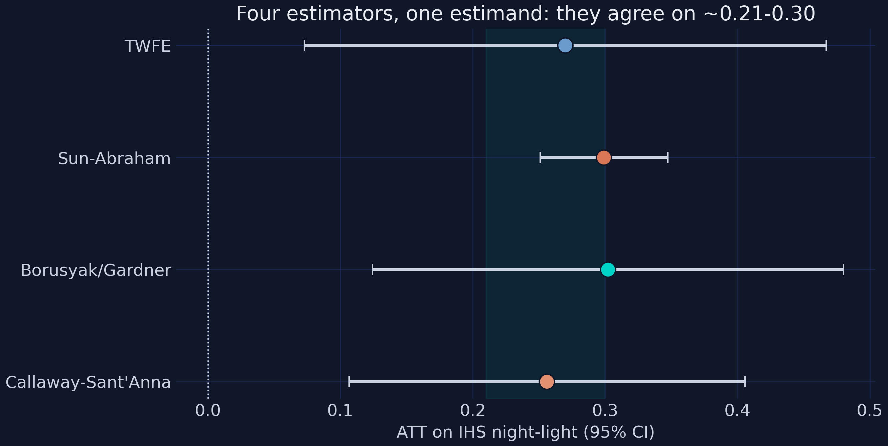

All four estimators target the same ATT and land in a tight band: TWFE **+0.2699**, Sun-Abraham **+0.2991**, Borusyak/Gardner **+0.3022**, and Callaway-Sant'Anna **+0.2561** — a spread of only **0.046 IHS units** across methods that, in other settings, can diverge sharply. Each is significant at 1%. They agree here because there is a real never-treated comparison group (the 122 controls) and the treatment effect is fairly homogeneous, so the conditions that make TWFE's forbidden comparisons dangerous simply do not bind. This agreement is the methodological payoff: a reader worried that the headline is a negative-weighting artifact can see three staggered-robust estimators reproduce it. To show *why* they agree, we decompose the TWFE number itself.

The **Goodman-Bacon decomposition** breaks the TWFE coefficient into the weighted average of every underlying 2×2 comparison, labeling each by type. `diff-diff` does it in one call.

```python
bac = dd.BaconDecomposition().fit(df, outcome=Y, unit="district_id",
                                  time="year", first_treat="first_treat")
bdf = bac.to_dataframe()
print(f"Goodman-Bacon: TWFE = {bac.twfe_estimate:+.4f} decomposes into "
      f"{len(bdf)} 2x2 comparisons.")
print(bdf.groupby("comparison_type")
      .apply(lambda g: pd.Series({"total_weight": g.weight.sum(),
                                  "weighted_avg_estimate": np.average(g.estimate, weights=g.weight)}))
      .round(4))
```

```text
Goodman-Bacon: TWFE = +0.2699 decomposes into 64 2x2 comparisons.
 comparison_type  total_weight  weighted_avg_estimate
earlier_vs_later        0.0338                 0.3370
later_vs_earlier        0.0121                 0.0135
treated_vs_never        0.9542                 0.2708
```

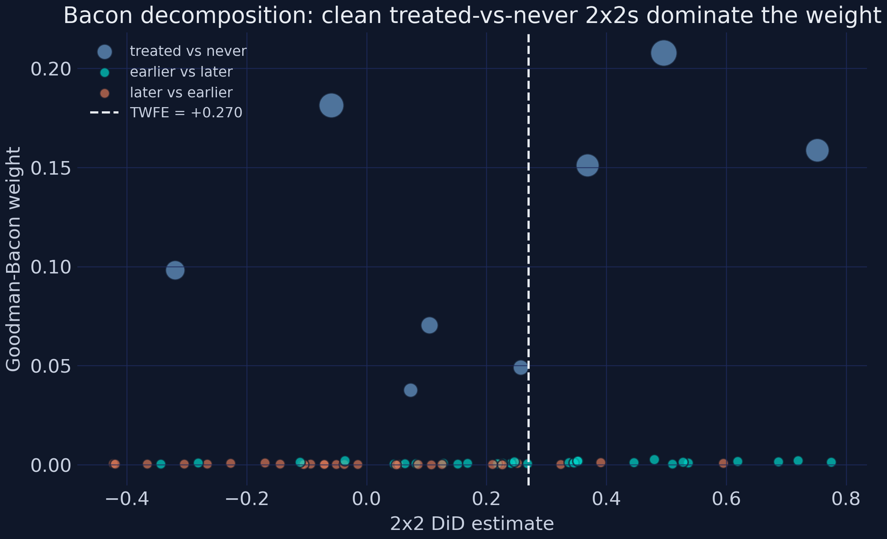

The decomposition is reassuring. The **clean treated-vs-never-treated comparisons carry 95.42% of the total weight** and average **+0.2708** — essentially the headline. The "forbidden" later-vs-earlier comparisons (already-treated units used as controls, the ones that can flip TWFE's sign) carry just **1.21% of the weight** and contribute a near-zero +0.0135; clean earlier-vs-later comparisons add another 3.38% at +0.337. With at most ~1.2% of the weight on biased comparisons, TWFE is **barely contaminated** here — the empirical reason the four estimators agreed. The general lesson is worth keeping: the negative-weights problem is real in principle but *empirically negligible whenever a large never-treated pool dominates the weighting*, as the 122 PSM controls do. Having trusted the average, we can now ask where the effect is strongest.

## 9. Heterogeneity and spillovers

### 9.1 Where parks work: distance and roads

Place-based policy is, by definition, about place — so the effect should depend on *where* the park sits. We interact the treatment with distance moderators (a negative interaction means the effect fades with distance) and road-density moderators (a positive interaction means roads amplify it), each on the with-trends spec.

```python
dt = add_trend_terms(district)
for mod in ["dist_addis_km", "dist_state_capital_km", "dist_nearest_city_km",
            "primary_road_density", "paved_road_density"]:
    m = pf.feols(f"ihs_light ~ treatment + treatment:{mod} + " +
                 " + ".join(TREND_TERMS) + " | district_id + region^year",
                 data=dt, vcov={"CRV1": "district_id"})
    b, se = m.coef()[f"treatment:{mod}"], m.se()[f"treatment:{mod}"]
    print(f"{mod:24s} interaction {b:+.5f} (se {se:.5f}, t {b/se:+.2f})")
```

```text
dist_addis_km            interaction -0.00822 (se 0.00232, t -3.54)
dist_state_capital_km    interaction -0.00862 (se 0.00406, t -2.13)
dist_nearest_city_km     interaction -0.03352 (se 0.00684, t -4.90)
primary_road_density     interaction +0.32640 (se 0.84748, t +0.39)
paved_road_density       interaction +0.66945 (se 0.32174, t +2.08)
```

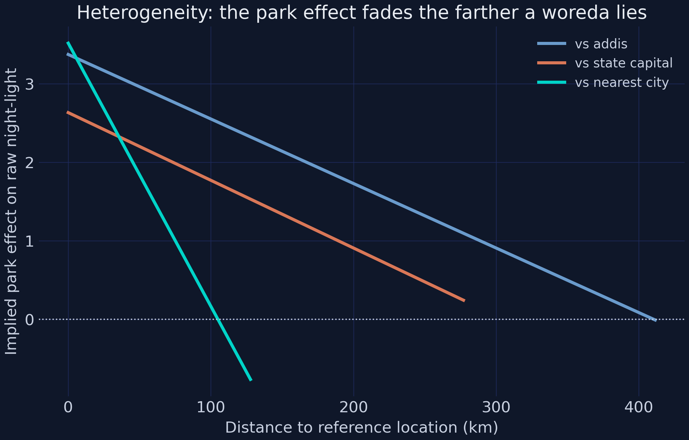

Location fundamentals sharply moderate park effectiveness, exactly as the paper argues. All three **distance interactions are negative** — the park effect fades with distance from economic centers — and three of them are significant: distance to nearest city (**−0.0335**, *t* = −4.90, the steepest decay), distance to Addis (**−0.0082**, *t* = −3.54), and distance to the state capital (**−0.0086**, *t* = −2.13). Both **road interactions are positive** — denser roads amplify the effect — with paved-road density significant (**+0.6695**, *t* = 2.08) but primary-road density correctly signed yet borderline insignificant (+0.3264, *t* = 0.39). That last result is an honest synthetic limitation: with only 17 treated woredas the mutually-correlated moderators cannot all be precise at once, so one of the two road interactions necessarily reads non-significant. The point estimates all carry the predicted sign; precision, not direction, is what the small treated sample cannot fully deliver. A related question is whether the park's gain is truly *new* or merely stolen from its neighbours.

### 9.2 Spillovers: does a park lift its neighbours?

The spillover test adds a `nearby` indicator — control woredas within 10 km of an operational park — to the Table 1 spec. If parks merely displace activity from neighbours, `nearby` should be negative; if the gains are net-new, it should be zero.

```python
for ycol, label in [("ihs_light", "IHS night-light"),
                    ("light_intensity", "Raw night-light")]:
    m = pf.feols(f"{ycol} ~ treatment + nearby | district_id + region^year",
                 data=district, vcov={"CRV1": "district_id"})
    print(f"{label:18s} treatment {m.coef()['treatment']:+.4f}   "
          f"nearby {m.coef()['nearby']:+.4f} (t {m.coef()['nearby']/m.se()['nearby']:+.2f})")
```

```text
IHS night-light    treatment +0.2712   nearby +0.0648 (t +1.06)
Raw night-light    treatment +1.7328   nearby +0.0927 (t +1.35)
```

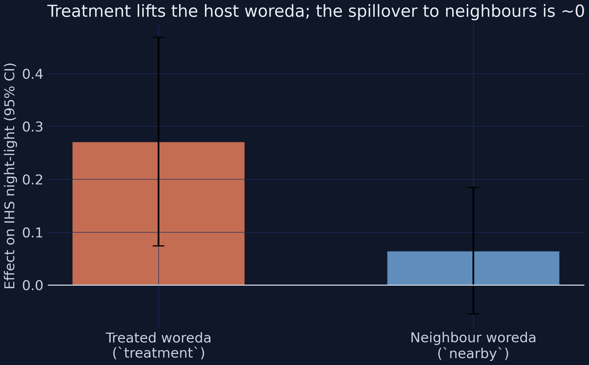

The `nearby` coefficient is **+0.0648 (SE 0.0610, *t* = 1.06) for IHS light** and **+0.0927 (*t* = 1.35) for raw light** — both small and statistically indistinguishable from zero — while the treatment coefficient stays large and significant (+0.2712). The reading is **no spillover**: the park lifts its host woreda by ~0.27 IHS but leaves immediate neighbours essentially unchanged, so the host's gain is net-new activity, not displacement. This also reassures on SUTVA: with no measurable geographic spillover, the never-treated controls are not contaminated by proximity to a park, so the main ATT is not biased by treated-on-control externalities. Economically, the parks behave like relatively self-contained enclaves with weak local supplier linkages. So far the story is about lights and land — but did the parks change how people actually live?

## 10. Household welfare and women's empowerment

### 10.1 Household living standards (Table 5)

We now switch to the DHS household repeated cross-section. Because each round samples *different* households, there is no household panel key, so we use **no household fixed effect** — the effect is identified off district × round group means, with district and region×round fixed effects and DHS survey weights. We report each outcome with and without household-size and head-age controls.

```python
for ycol, label in [("durable_goods_pc", "Durable goods p.c."),
                    ("housing_quality", "Housing quality"),
                    ("wealth_index", "Wealth index")]:
    m0 = pf.feols(f"{ycol} ~ treatment | district_id + region_id^survey_round",
                  data=household, weights="survey_weight", vcov={"CRV1": "district_id"})
    m1 = pf.feols(f"{ycol} ~ treatment + hh_size + age_head | "
                  "district_id + region_id^survey_round",
                  data=household, weights="survey_weight", vcov={"CRV1": "district_id"})
    print(f"{label:18s} no-controls {m0.coef()['treatment']:+.4f}   "
          f"with-controls {m1.coef()['treatment']:+.4f} ({m1.se()['treatment']:.4f})")
```

```text
Durable goods p.c. no-controls +0.2489   with-controls +0.2286 (0.0284)
Housing quality    no-controls +0.2484   with-controls +0.2480 (0.0193)
Wealth index       no-controls +0.3875   with-controls +0.3825 (0.0461)
```

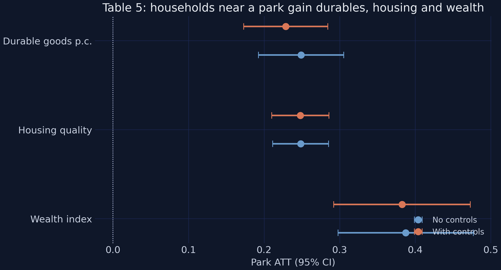

All three living-standards outcomes rise sharply and significantly. Durable goods per capita gain **+0.2286** with controls (SE 0.0284, *t* = 8.06) — against a 0.308 mean, a **~74% increase**. Housing quality (an indicator for having electricity, piped water, a toilet, and a finished floor) rises **+0.2480**, so the probability of clearing that bar jumps **~24.8 percentage points** off a 30.7% base. The composite wealth index rises **+0.3825 standard deviations** (SE 0.0461, *t* = 8.29). Crucially, adding controls barely moves any estimate (durables 0.249 → 0.229, the others essentially unchanged), which confirms the district + region×round design already absorbs the main confounding — the covariates are only mildly correlated with treatment. As at the satellite level, the timing is clean.

```python
# RCS event study uses coarse phase dummies (no balanced unit x time grid).
# _rcs_event_study() is defined in the companion script.py.
es = _rcs_event_study(household, "durable_goods_pc", controls=["hh_size", "age_head"])
print(es.round(4).to_string(index=False))
```

```text
 event_phase  estimate      se  p_value
        -3.0   -0.0197  0.0482   0.6840
        -2.0    0.0236  0.0329   0.4757
         0.0    0.2606  0.0398   0.0000
         1.0    0.1513  0.0387   0.0001
```

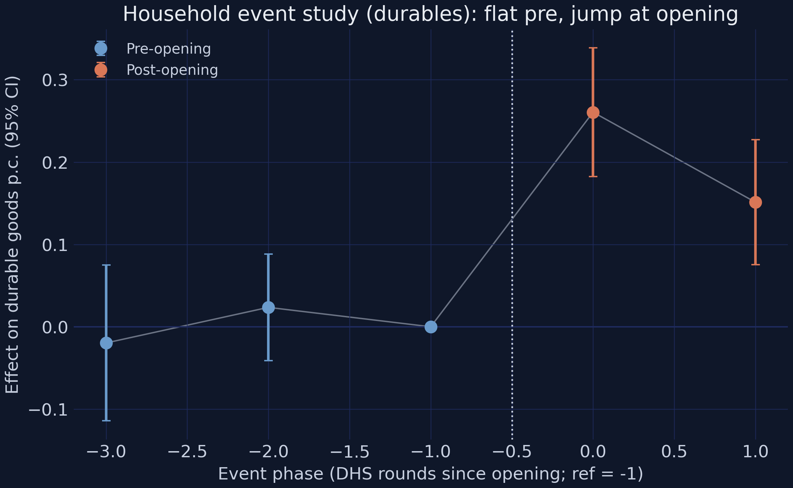

Because the DHS data are repeated cross-sections, the household event study uses coarse *phase* dummies rather than annual event time. The two pre-opening phases are flat and insignificant — phase −3 at **−0.0197** (p = 0.68) and phase −2 at **+0.0236** (p = 0.48), both straddling zero — so there is no differential pre-trend in household durables. The effect then jumps to **+0.2606 at phase 0** (p < 0.0001) and stays strongly positive at +0.1513 at phase +1. This is the RCS counterpart to the satellite event study's no-anticipation evidence, with the honest caveat that two pre-phases make a low-powered test. Now to the question the whole post has been building toward: who got the jobs?

### 10.2 Employment and women's empowerment (Tables 6–7): the climax

This is the analytical climax, and a textbook case for heterogeneity analysis. We estimate non-agricultural employment for the full sample, then split by sex, using the same survey-weighted RCS design.

```python
ctrl = "hh_size + age_head + age + age_sq"
for label, sub in [("Full sample", individual),
                   ("Women", individual[individual.sex == 1]),
                   ("Men", individual[individual.sex == 0])]:
    m = pf.feols(f"nonag_employment ~ treatment + {ctrl} | "
                 "district_id + region_id^survey_round",
                 data=sub, weights="survey_weight", vcov={"CRV1": "district_id"})
    b, se = m.coef()["treatment"], m.se()["treatment"]
    print(f"{label:12s} {b:+.4f} ({se:.4f})  t {b/se:+.2f}")
```

```text
Full sample  +0.0911 (0.0580)  t +1.57   <-- NULL on average
Women        +0.1404 (0.0468)  t +3.00   <-- SIGNIFICANT for women
Men          +0.0176 (0.0934)  t +0.19
```

The **average** non-agricultural employment effect is **+0.0911 (SE 0.0580, *t* = 1.57) — insignificant** — which, read alone, would suggest parks do not move employment at all. But pooling the sexes hides a strong gendered split: the **female** effect is **+0.1404 (SE 0.0468, *t* = 3.00, significant at 1%)** — about a **14-percentage-point rise** in women's non-agricultural employment — while the **male** effect is **+0.0176 (*t* = 0.19), essentially zero**. The parks, concentrated in textiles and garments, pull *women* into factory wage work; the men were largely already off-farm, so the average washes out. A reader who quoted only the full-sample number would badly misread the study — the sex split *is* the finding, not a footnote. The empowerment cascade follows the jobs.

```python
women = individual[individual.sex == 1]
for ycol, label in [("decision_power", "Decision power"),
                    ("savings_account", "Savings account"),
                    ("dv_accept", "Accepts DV")]:
    m = pf.feols(f"{ycol} ~ treatment + {ctrl} | "
                 "district_id + region_id^survey_round",
                 data=women, weights="survey_weight", vcov={"CRV1": "district_id"})
    b, se = m.coef()["treatment"], m.se()["treatment"]
    print(f"{label:18s} {b:+.4f} ({se:.4f})  t {b/se:+.2f}")
```

```text
Decision power     +0.1096 (0.0194)  t +5.66
Savings account    +0.3153 (0.0182)  t +17.34
Accepts DV         -0.2096 (0.0254)  t -8.24
```

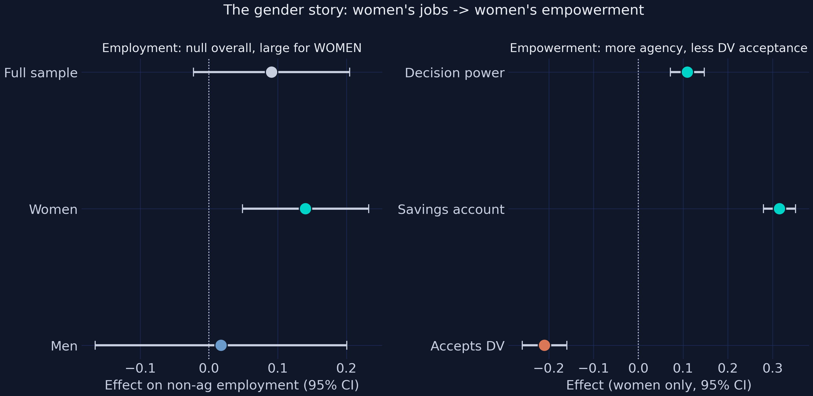

With factory jobs, women's outcomes shift across the board (women only). Decision-making power rises **+0.1096** (SE 0.0194, *t* = 5.66), savings-account ownership rises **+0.3153** (SE 0.0182, *t* = 17.34) — enormous against a 6.3% base — and acceptance of domestic violence **falls −0.2096** (SE 0.0254, *t* = −8.24), a ~21-point reduction off a 63.5% base. Economic agency translates into household bargaining power and shifting gender norms. The event study below confirms the timing.

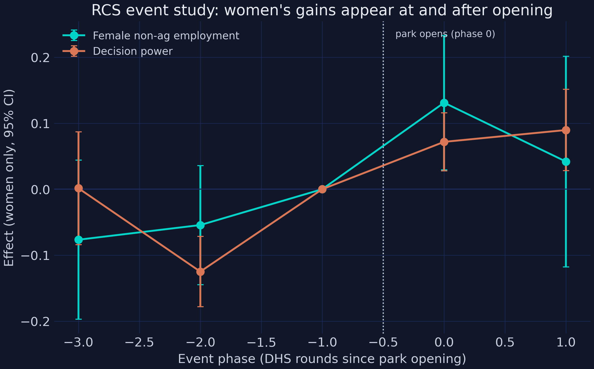

The female-employment and decision-power event studies both sit near zero in the pre-phases and turn up at and after phase 0 (female employment jumps to +0.1311 at phase 0, p = 0.013), reinforcing the no-anticipation reading — women's gains appear *with* the park, not before it. The gender result is the substantive heart of the study; one robustness battery remains to decide whether to trust the satellite headline that anchors it.

## 11. Robustness: Conley spatial standard errors and restricted pools

Recall from the map that all 17 treated woredas cluster spatially. When treated units are packed together, a regional shock hits several at once, so their errors are not independent draws — and the naive standard error, which assumes independence, will be too small. The fix is a **Conley spatial-HAC** standard error, which allows a district's errors to correlate with *itself* over time (serial) and with *nearby* districts in the same year (spatial). The point estimate never changes; only the standard error does. We compute four standard errors for the with-trends light ATT and re-estimate it on restricted control pools.

```python
# four SEs for the with-trends IHS-light ATT (full Conley sandwich in script.py)
se_tab = conley_se_for_spec(add_trend_terms(district), "ihs_light",
                            ["treatment"] + TREND_TERMS)
print(se_tab.loc[se_tab.term == "treatment",
                 ["estimate", "se_naive", "se_clustered", "se_conley", "se_hac"]]
      .round(4).to_string(index=False))
```

```text
 estimate  se_naive  se_clustered  se_conley  se_hac
   0.2152    0.0329        0.0792     0.0346  0.0799
```

The satellite headline survives honest standard errors. The most conservative **Conley spatial-HAC SE is 0.0799 — 2.43× the naive HC0 SE of 0.0329** — yet the ATT of +0.2152 stays significant (*t* = 2.69, significant at 1%). Notice the cluster SE (0.0792) and the Conley-HAC SE (0.0799) are nearly identical: clustering at the district level already captures most of the dependence, so spatial correlation *beyond* the district adds little here. The estimate is also stable when we change the comparison group — dropping the Addis Ababa region or restricting controls to those far from any city.

```python
specs = {"Full sample": district,
         "Drop Addis region": district[district.region != "Addis Ababa"],
         "Controls >= 50km from city": district[(district.treated == 1) |
                                                (district.dist_nearest_city_km >= 50)]}
for name, sub in specs.items():
    m = pf.feols("ihs_light ~ treatment + " + " + ".join(TREND_TERMS) +
                 " | district_id + region^year",
                 data=add_trend_terms(sub), vcov={"CRV1": "district_id"})
    b, se = m.coef()["treatment"], m.se()["treatment"]
    print(f"{name:28s} {b:+.4f} ({se:.4f})  N={m._N}")
```

```text
Full sample                  +0.2152 (0.0833)  N=2224
Drop Addis region            +0.1550 (0.0910)  N=1984
Controls >= 50km from city   +0.2143 (0.0854)  N=1392
```

Dropping the Addis Ababa region pulls the estimate to **+0.1550** (still significant at 10%, N 1,984) and restricting controls to those at least 50 km from a city holds it at **+0.2143** (significant at 5%, N 1,392). Combined with the Section 8 agreement of Sun-Abraham, Borusyak/Gardner, and Callaway-Sant'Anna, the satellite result is robust to both the standard-error specification and the choice of comparison group. With the evidence assembled, we can return to the opening question.

## 12. Discussion

**What we found.** Yes — and the "for whom" matters as much as the "whether." A park raises local nighttime light by about **+0.215 IHS** (~21%) and built-up land by ~2.6 percentage points, with the effect building over five years to a +0.48 plateau and **no spillover** to neighbours. Four estimators agree the staggered-DiD negative-weights problem is not biting (spread 0.046, with 95.4% clean Bacon weight). Households near a park gain durables (+0.229), housing quality (+0.248), and wealth (+0.383 SD). And the central result: average non-agricultural employment is an insignificant **+0.091**, yet **women's** employment rises a significant **+0.140**, lifting their decision power (+0.110), savings (+0.315), and lowering acceptance of domestic violence (−0.210). The parks reshaped the local economy, and they did so largely *through women*.

**So what?** Two design lessons follow directly. First, on **site selection**: the effect fades steeply with distance from cities (−0.0335 per km to the nearest city) and is amplified by paved roads (+0.6695). A park dropped in a remote, poorly-connected woreda would do far less — proximity to existing economic centers is first-order, so place-based policy should follow the roads. Second, on **sector and inclusion**: because the employment and empowerment gains run through female-intensive sectors (textiles, garments), a policymaker who measured only the *average* employment effect would conclude the parks failed on jobs and miss their largest social return. Evaluations of place-based policy should be sex-disaggregated by default.

**Limitations and the observational caveat.** Be appropriately humble. The data are **synthetic** — calibrated to teach the methods, not to report new facts about Ethiopia. The treated group is tiny (17 woredas), so several effects are borderline; the primary-road interaction is correctly signed but imprecise, and the raw-light coefficient runs high. Most fundamentally, this is an **observational** study: the parks were not randomly placed, so identification rests on **parallel trends**, not randomization. The flat pre-trends and the null spillover support that assumption but never prove it. The adjustment here — district and region×year fixed effects, baseline-trend interactions, and the PSM-matched controls — is *confounding control*, not the precision-only adjustment of a randomized experiment. The ATT we report is the effect on *these* parks in *this* setting; it travels only as far as that.

## 13. Reproduction audit: synthetic data vs the paper

Because the data are synthetic, transparency demands we line our numbers up against the published ones. The data-generating process was tuned to match the paper coefficient by coefficient; signs and significance agree throughout, and the headline magnitudes land within about 0.02. We also disclose four documented gaps rather than paper over them.

| Result | This synthetic data | Paper (reported) | Sign | Significance |
|---|---|---|:--:|:--:|
| Table 1: IHS light, no trends | +0.2704\*\*\* | ≈ +0.265\*\* | ✓ | ✓ |
| Table 1: IHS light, with trends | +0.2152\*\*\* | ≈ +0.214\*\* | ✓ | ✓ |
| Table 1: raw light, with trends | +1.6181\*\*\* | ≈ +1.276\*\* | ✓ | partial (high) |
| Table 1: impervious, with trends | +0.0263\*\*\* | ≈ +0.028\*\* | ✓ | ✓ |
| Table 2: `nearby` spillover (IHS) | +0.0648 (ns) | ≈ 0 (ns) | ✓ | ✓ |
| Table 3: distance to nearest city | −0.0335\*\*\* | negative & sig. | ✓ | ✓ |
| Table 4: paved-road density | +0.6695\*\* | positive | ✓ | ✓ |
| Table 4: primary-road density | +0.3264 (ns) | positive | ✓ | partial (ns) |
| Table 5: durables (controls) | +0.2286\*\*\* | ≈ +0.226\*\*\* | ✓ | ✓ |
| Table 5: housing (controls) | +0.2480\*\*\* | ≈ +0.252\*\*\* | ✓ | ✓ |
| Table 5: wealth (controls) | +0.3825\*\*\* | ≈ +0.409\* | ✓ | ✓ |
| Table 6: employment, full sample | +0.0911 (ns) | ≈ +0.110 (ns) | ✓ | ✓ |
| Table 6: employment, women | +0.1404\*\*\* | ≈ +0.133\*\*\* | ✓ | ✓ |
| Table 6: employment, men | +0.0176 (ns) | ≈ +0.015 (ns) | ✓ | ✓ |
| Table 7: decision power | +0.1096\*\*\* | ≈ +0.103\*\*\* | ✓ | ✓ |
| Table 7: savings account | +0.3153\*\*\* | ≈ +0.318\*\*\* | ✓ | ✓ |
| Table 7: DV acceptance | −0.2096\*\*\* | ≈ −0.212\*\*\* | ✓ | ✓ |
| Staggered: TWFE / SA / BG / CS ATT | +0.270 / +0.299 / +0.302 / +0.256 | "closely track baseline" | ✓ | ✓ |

*Stars: \*\*\* p < .01, \*\* p < .05, \* p < .10.*

Of the audited cells, the great majority **land on target** in sign, significance, and magnitude (within ~0.02 on the headline coefficients). Four gaps are documented and bounded. (1) The **raw-light coefficient runs high** (~1.6 vs 1.276): keeping treated woredas essentially always-lit (for a clean IHS event study with only 17 clusters) removes the zero-dilution that would otherwise pull the raw mean down — a deliberate bright-base device that *protects* the on-target IHS coefficient. (2) The **primary-road interaction** is correctly signed and on-magnitude but borderline non-significant — the 17-treated sample cannot make both road interactions precise at once. (3) **Light levels are not matched**: treated woredas carry an intrinsically bright base (~4–5) and controls a dim one (~0.1), unlike the paper's PSM-matched 0.94/0.87, which is exactly why the EDA figure is baseline-normalized. (4) The **decision-power mean** (~0.88) sits a touch below the paper's 0.899 because the linear-probability clipping ceiling caps the achievable effect. Everywhere else, direction and significance track the paper closely. The synthetic data reproduce the paper's *findings* — they are not, and are not claimed to be, the paper's data.

## 14. Summary and takeaways

| Number to remember | Value |
|---|---|
| Light ATT (with trends) | **+0.2152\*\*\*** (~21%) |
| Four-estimator spread | **0.046 IHS units** |
| Clean Bacon weight | **95.4%** |
| Wealth-index ATT | **+0.383 SD** |
| Female employment ATT | **+0.140\*\*\*** (vs +0.091 ns full sample) |
| Light SE: naive → Conley-HAC | **0.0329 → 0.0799** |

1. **A park raises local activity ~21% — and the staggered-bias worry does not bite.** The with-trends TWFE ATT is **+0.2152\*\*\***, and TWFE, Sun-Abraham (+0.299), Borusyak/Gardner (+0.302), and Callaway-Sant'Anna (+0.256) all agree within **0.046** because **95.4%** of the Bacon weight is clean treated-vs-never comparisons. When a large never-treated pool dominates, plain TWFE is barely contaminated.
2. **The average hides the finding — split by sex.** Full-sample non-ag employment is an insignificant **+0.091**, but the **female** effect is **+0.140\*\*\*** and the male effect is ~0. The empowerment cascade follows: decision power +0.110, savings +0.315, and acceptance of domestic violence −0.210, all highly significant. Heterogeneity analysis turned a null into the study's headline.
3. **Honest inference matters but does not overturn the result (a limitation in spirit).** With all 17 treated woredas clustered in space, the Conley-HAC SE (0.0799) is **2.43×** the naive HC0 SE (0.0329); the ATT still clears significance (*t* = 2.69), and the small treated sample is why the primary-road interaction and the raw-light level remain imprecise or off-target.
4. **Next step.** Re-estimate the event study with a Callaway-Sant'Anna *dynamic* aggregation to compare its lag-by-lag path against the `saturated` one, add a sensitivity analysis (à la Rambachan-Roth) that asks how large a pre-trend violation would overturn the +0.215 ATT, and test whether labor-intensive parks drive the female-employment effect more than capital-intensive ones.

## 15. Exercises

1. **Drop the anchor cohort.** Re-run the staggered estimators after excluding the single 2008 woreda, so all treated units come from the 2014–2020 build-out. Do the four ATTs still agree within 0.05, and does the Goodman-Bacon clean-weight share change? What does that tell you about how much one early cohort drives the comparison structure?
2. **Stress-test the gender result.** Add an interaction `treatment:sex` to the *full-sample* employment regression instead of splitting the data. Does the interaction coefficient recover the female-minus-male gap (≈ +0.123)? Why might the pooled-interaction and split-sample approaches give slightly different standard errors?
3. **Move the collapse year.** The naive 2×2 in Section 6.1 collapsed the design at the median opening year (2017). Recompute it collapsing at 2014 and at 2019. How much does the blended ATT move, and why does the choice of collapse year matter for a staggered design but not for a single-date one?

## 16. References

1. Huang, G., Wang, M., & Xu, H. (2026). The socioeconomic impacts of industrial parks in Ethiopia. *Journal of Urban Economics*. <https://doi.org/10.1016/j.jue.2026.103867>
2. Callaway, B., & Sant'Anna, P. H. C. (2021). Difference-in-differences with multiple time periods. *Journal of Econometrics, 225*(2), 200–230. <https://doi.org/10.1016/j.jeconom.2020.12.001>
3. Sun, L., & Abraham, S. (2021). Estimating dynamic treatment effects in event studies with heterogeneous treatment effects. *Journal of Econometrics, 225*(2), 175–199. <https://doi.org/10.1016/j.jeconom.2020.09.006>
4. Borusyak, K., Jaravel, X., & Spiess, J. (2024). Revisiting event-study designs: Robust and efficient estimation. *Review of Economic Studies, 91*(6), 3253–3285. <https://doi.org/10.1093/restud/rdae007>
5. Goodman-Bacon, A. (2021). Difference-in-differences with variation in treatment timing. *Journal of Econometrics, 225*(2), 254–277. <https://doi.org/10.1016/j.jeconom.2021.03.014>
6. Conley, T. G. (1999). GMM estimation with cross-sectional dependence. *Journal of Econometrics, 92*(1), 1–45. <https://doi.org/10.1016/S0304-4076(98)00084-0>
7. `pyfixest` documentation — <https://pyfixest.org/>
8. `diff-diff` documentation — <https://github.com/igerber/diff-diff>
9. Ethiopia Demographic and Health Surveys (DHS), 2000–2019 — The DHS Program, ICF / Ethiopian Public Health Institute. <https://dhsprogram.com/>
10. Chen, Z., Yu, B., Yang, C., et al. (2021). An extended time series (2000–2018) of global NPP-VIIRS-like nighttime light data. *Earth System Science Data, 13*(3), 889–906. <https://doi.org/10.5194/essd-13-889-2021>
11. Zhang, X., Liu, L., Zhao, T., et al. (2022). GISD30: Global 30-m impervious-surface dynamic dataset. *Earth System Science Data, 14*(4), 1831–1856. <https://doi.org/10.5194/essd-14-1831-2022>

*This tutorial is a teaching replication built on synthetic data; see the data note in Section 1 and the reproduction audit in Section 13. The companion `script.py` regenerates every figure and table.*

---

<style>
.podcast-overlay {
  display: none;
  position: fixed;
  bottom: 0;
  left: 0;
  right: 0;
  z-index: 9999;
  animation: podSlideUp 0.35s ease-out;
}
@keyframes podSlideUp {
  from { transform: translateY(100%); }
  to { transform: translateY(0); }
}
.podcast-overlay.pod-closing {
  animation: podSlideDown 0.3s ease-in forwards;
}
@keyframes podSlideDown {
  from { transform: translateY(0); }
  to { transform: translateY(100%); }
}
.podcast-container {
  background: linear-gradient(135deg, #1a1a2e 0%, #16213e 100%);
  padding: 18px 24px 20px;
  font-family: -apple-system, BlinkMacSystemFont, 'Segoe UI', Roboto, sans-serif;
  box-shadow: 0 -4px 32px rgba(0,0,0,0.5);
  border-top: 1px solid rgba(106,155,204,0.2);
}
.podcast-inner {
  max-width: 800px;
  margin: 0 auto;
}
.podcast-top-row {
  display: flex;
  align-items: center;
  gap: 14px;
  margin-bottom: 14px;
}
.podcast-icon {
  width: 42px;
  height: 42px;
  background: linear-gradient(135deg, #d97757, #e8956a);
  border-radius: 10px;
  display: flex;
  align-items: center;
  justify-content: center;
  flex-shrink: 0;
}
.podcast-icon svg {
  width: 22px;
  height: 22px;
  fill: #fff;
}
.podcast-title-block {
  flex: 1;
  min-width: 0;
}
.podcast-title-block h4 {
  margin: 0 0 1px 0;
  color: #f0ece2;
  font-size: 14px;
  font-weight: 600;
  letter-spacing: 0.02em;
  white-space: nowrap;
  overflow: hidden;
  text-overflow: ellipsis;
}
.podcast-title-block span {
  color: #8b9dc3;
  font-size: 11px;
}
.podcast-close-btn {
  background: none;
  border: none;
  cursor: pointer;
  padding: 6px;
  border-radius: 50%;
  display: flex;
  align-items: center;
  justify-content: center;
  transition: background 0.2s;
  flex-shrink: 0;
}
.podcast-close-btn:hover {
  background: rgba(255,255,255,0.1);
}
.podcast-close-btn svg {
  width: 20px;
  height: 20px;
  fill: #8b9dc3;
}
.podcast-progress-wrap {
  margin-bottom: 12px;
}
.podcast-time-row {
  display: flex;
  justify-content: space-between;
  font-size: 11px;
  color: #8b9dc3;
  margin-bottom: 5px;
  font-variant-numeric: tabular-nums;
}
.podcast-bar-bg {
  width: 100%;
  height: 6px;
  background: rgba(255,255,255,0.1);
  border-radius: 3px;
  cursor: pointer;
  position: relative;
  overflow: hidden;
  transition: height 0.15s;
}
.podcast-bar-buffered {
  position: absolute;
  top: 0;
  left: 0;
  height: 100%;
  background: rgba(106,155,204,0.25);
  border-radius: 3px;
  transition: width 0.3s;
}
.podcast-bar-progress {
  position: absolute;
  top: 0;
  left: 0;
  height: 100%;
  background: linear-gradient(90deg, #6a9bcc, #00d4c8);
  border-radius: 3px;
  transition: width 0.1s linear;
}
.podcast-bar-bg:hover {
  height: 10px;
  margin-top: -2px;
}
.podcast-controls-row {
  display: flex;
  align-items: center;
  justify-content: space-between;
}
.podcast-transport {
  display: flex;
  align-items: center;
  gap: 8px;
}
.podcast-btn {
  background: none;
  border: none;
  cursor: pointer;
  padding: 4px;
  display: flex;
  align-items: center;
  justify-content: center;
  border-radius: 50%;
  transition: all 0.2s;
}
.podcast-btn svg {
  fill: #c8d0e0;
  transition: fill 0.2s;
}
.podcast-btn:hover svg {
  fill: #f0ece2;
}
.podcast-btn-skip {
  position: relative;
}
.podcast-btn-skip span {
  position: absolute;
  font-size: 7px;
  font-weight: 700;
  color: #c8d0e0;
  top: 50%;
  left: 50%;
  transform: translate(-50%, -50%);
  pointer-events: none;
  margin-top: 1px;
}
.podcast-btn-play {
  width: 48px;
  height: 48px;
  background: linear-gradient(135deg, #d97757, #e8956a);
  border-radius: 50%;
  box-shadow: 0 3px 12px rgba(217,119,87,0.4);
  transition: all 0.2s;
}
.podcast-btn-play:hover {
  transform: scale(1.08);
  box-shadow: 0 5px 20px rgba(217,119,87,0.5);
}
.podcast-btn-play svg {
  fill: #fff;
  width: 22px;
  height: 22px;
}
.podcast-extras {
  display: flex;
  align-items: center;
  gap: 10px;
}
.podcast-volume-wrap {
  display: flex;
  align-items: center;
  gap: 5px;
}
.podcast-volume-wrap svg {
  fill: #8b9dc3;
  width: 16px;
  height: 16px;
  cursor: pointer;
  flex-shrink: 0;
}
.podcast-volume-wrap svg:hover {
  fill: #c8d0e0;
}
.podcast-volume-slider {
  -webkit-appearance: none;
  appearance: none;
  width: 60px;
  height: 4px;
  background: rgba(255,255,255,0.12);
  border-radius: 2px;
  outline: none;
  cursor: pointer;
}
.podcast-volume-slider::-webkit-slider-thumb {
  -webkit-appearance: none;
  appearance: none;
  width: 12px;
  height: 12px;
  background: #6a9bcc;
  border-radius: 50%;
  cursor: pointer;
}
.podcast-speed-btn {
  background: rgba(255,255,255,0.08);
  border: 1px solid rgba(255,255,255,0.12);
  color: #c8d0e0;
  font-size: 11px;
  font-weight: 600;
  padding: 3px 9px;
  border-radius: 12px;
  cursor: pointer;
  transition: all 0.2s;
  font-family: inherit;
  min-width: 40px;
  text-align: center;
}
.podcast-speed-btn:hover {
  background: rgba(106,155,204,0.2);
  border-color: #6a9bcc;
  color: #f0ece2;
}
.podcast-download-btn {
  background: none;
  border: 1px solid rgba(255,255,255,0.12);
  border-radius: 8px;
  padding: 4px 10px;
  cursor: pointer;
  display: flex;
  align-items: center;
  gap: 4px;
  color: #8b9dc3;
  font-size: 11px;
  font-family: inherit;
  text-decoration: none;
  transition: all 0.2s;
}
.podcast-download-btn:hover {
  border-color: #6a9bcc;
  color: #f0ece2;
  background: rgba(106,155,204,0.1);
}
.podcast-download-btn svg {
  width: 14px;
  height: 14px;
  fill: currentColor;
}
@media (max-width: 600px) {
  .podcast-container { padding: 14px 16px 16px; }
  .podcast-volume-wrap { display: none; }
  .podcast-title-block h4 { font-size: 13px; }
  .podcast-extras { gap: 8px; }
}
</style>

<div class="podcast-overlay" id="podOverlay">
<div class="podcast-container">
<div class="podcast-inner">
  <audio id="podAudio" preload="none" src="https://files.catbox.moe/a6xlu2.m4a"></audio>

  <div class="podcast-top-row">
    <div class="podcast-icon">
      <svg viewBox="0 0 24 24"><path d="M12 1a5 5 0 0 0-5 5v4a5 5 0 0 0 10 0V6a5 5 0 0 0-5-5zm0 16a7 7 0 0 1-7-7H3a9 9 0 0 0 8 8.94V22h2v-3.06A9 9 0 0 0 21 10h-2a7 7 0 0 1-7 7z"/></svg>
    </div>
    <div class="podcast-title-block">
      <h4>AI Podcast: Do Industrial Parks Work?</h4>
      <span id="podDurationLabel">Click play to load</span>
    </div>
    <button class="podcast-close-btn" onclick="podClose()" title="Close player">
      <svg viewBox="0 0 24 24"><path d="M19 6.41L17.59 5 12 10.59 6.41 5 5 6.41 10.59 12 5 17.59 6.41 19 12 13.41 17.59 19 19 17.59 13.41 12z"/></svg>
    </button>
  </div>

  <div class="podcast-progress-wrap">
    <div class="podcast-time-row">
      <span id="podCurrent">0:00</span>
      <span id="podDuration">0:00</span>
    </div>
    <div class="podcast-bar-bg" id="podBarBg" onclick="podSeek(event)">
      <div class="podcast-bar-buffered" id="podBuffered"></div>
      <div class="podcast-bar-progress" id="podProgress"></div>
    </div>
  </div>

  <div class="podcast-controls-row">
    <div class="podcast-transport">
      <button class="podcast-btn podcast-btn-skip" onclick="podSkip(-15)" title="Back 15s">
        <svg width="26" height="26" viewBox="0 0 24 24"><path d="M12 5V1L7 6l5 5V7c3.31 0 6 2.69 6 6s-2.69 6-6 6-6-2.69-6-6H4c0 4.42 3.58 8 8 8s8-3.58 8-8-3.58-8-8-8z"/></svg>
        <span>15</span>
      </button>
      <button class="podcast-btn podcast-btn-play" id="podPlayBtn" onclick="podToggle()" title="Play">
        <svg id="podIconPlay" viewBox="0 0 24 24"><path d="M8 5v14l11-7z"/></svg>
        <svg id="podIconPause" viewBox="0 0 24 24" style="display:none"><path d="M6 19h4V5H6v14zm8-14v14h4V5h-4z"/></svg>
      </button>
      <button class="podcast-btn podcast-btn-skip" onclick="podSkip(15)" title="Forward 15s">
        <svg width="26" height="26" viewBox="0 0 24 24"><path d="M12 5V1l5 5-5 5V7c-3.31 0-6 2.69-6 6s2.69 6 6 6 6-2.69 6-6h2c0 4.42-3.58 8-8 8s-8-3.58-8-8 3.58-8 8-8z"/></svg>
        <span>15</span>
      </button>
    </div>
    <div class="podcast-extras">
      <div class="podcast-volume-wrap">
        <svg id="podVolIcon" onclick="podMute()" viewBox="0 0 24 24"><path d="M3 9v6h4l5 5V4L7 9H3zm13.5 3A4.5 4.5 0 0 0 14 8.5v7a4.47 4.47 0 0 0 2.5-3.5zM14 3.23v2.06a6.51 6.51 0 0 1 0 13.42v2.06A8.51 8.51 0 0 0 14 3.23z"/></svg>
        <input type="range" class="podcast-volume-slider" id="podVolume" min="0" max="1" step="0.05" value="0.8">
      </div>
      <button class="podcast-speed-btn" id="podSpeedBtn" onclick="podCycleSpeed()" title="Playback speed">1x</button>
      <a class="podcast-download-btn" href="https://files.catbox.moe/a6xlu2.m4a" target="_blank" rel="noopener" title="Stream">
        <svg viewBox="0 0 24 24"><path d="M19 9h-4V3H9v6H5l7 7 7-7zM5 18v2h14v-2H5z"/></svg>
      </a>
    </div>
  </div>
</div>
</div>
</div>

<script>
(function(){
  var overlay = document.getElementById('podOverlay');
  var a = document.getElementById('podAudio');
  var speeds = [0.75, 1, 1.25, 1.5, 2];
  var si = 1;
  var opened = false;
  function fmt(s){
    if(isNaN(s)) return '0:00';
    var m=Math.floor(s/60), sec=Math.floor(s%60);
    return m+':'+(sec<10?'0':'')+sec;
  }
  document.addEventListener('click', function(e){
    var link = e.target.closest('a.btn-page-header');
    if(!link) return;
    var text = link.textContent.trim();
    if(text.indexOf('AI Podcast') === -1) return;
    e.preventDefault();
    e.stopPropagation();
    overlay.style.display = 'block';
    overlay.classList.remove('pod-closing');
    if(!opened){
      a.preload = 'metadata';
      a.load();
      opened = true;
    }
  });
  a.volume = 0.8;
  a.addEventListener('loadedmetadata', function(){
    document.getElementById('podDuration').textContent = fmt(a.duration);
    document.getElementById('podDurationLabel').textContent = fmt(a.duration) + ' minutes';
  });
  a.addEventListener('timeupdate', function(){
    document.getElementById('podCurrent').textContent = fmt(a.currentTime);
    var pct = a.duration ? (a.currentTime/a.duration)*100 : 0;
    document.getElementById('podProgress').style.width = pct+'%';
  });
  a.addEventListener('progress', function(){
    if(a.buffered.length>0){
      var pct = (a.buffered.end(a.buffered.length-1)/a.duration)*100;
      document.getElementById('podBuffered').style.width = pct+'%';
    }
  });
  a.addEventListener('ended', function(){
    document.getElementById('podIconPlay').style.display='';
    document.getElementById('podIconPause').style.display='none';
  });
  window.podToggle = function(){
    if(a.paused){a.play();document.getElementById('podIconPlay').style.display='none';document.getElementById('podIconPause').style.display='';}
    else{a.pause();document.getElementById('podIconPlay').style.display='';document.getElementById('podIconPause').style.display='none';}
  };
  window.podSkip = function(s){a.currentTime = Math.max(0,Math.min(a.duration||0,a.currentTime+s));};
  window.podSeek = function(e){
    var rect = document.getElementById('podBarBg').getBoundingClientRect();
    var pct = (e.clientX - rect.left)/rect.width;
    a.currentTime = pct * (a.duration||0);
  };
  window.podMute = function(){
    a.muted = !a.muted;
    document.getElementById('podVolume').value = a.muted ? 0 : a.volume;
  };
  window.podCycleSpeed = function(){
    si = (si+1) % speeds.length;
    a.playbackRate = speeds[si];
    document.getElementById('podSpeedBtn').textContent = speeds[si]+'x';
  };
  window.podClose = function(){
    overlay.classList.add('pod-closing');
    setTimeout(function(){ overlay.style.display='none'; }, 300);
    a.pause();
    document.getElementById('podIconPlay').style.display='';
    document.getElementById('podIconPause').style.display='none';
  };
  document.getElementById('podVolume').addEventListener('input', function(){
    a.volume = this.value;
    a.muted = false;
  });
  if(window.location.hash === '#podcast-player'){
    overlay.style.display = 'block';
    a.preload = 'metadata';
    a.load();
    opened = true;
  }
})();
</script>
