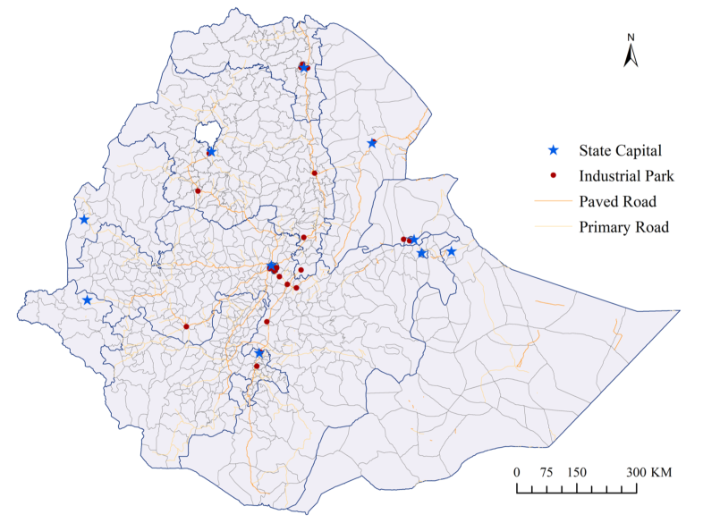
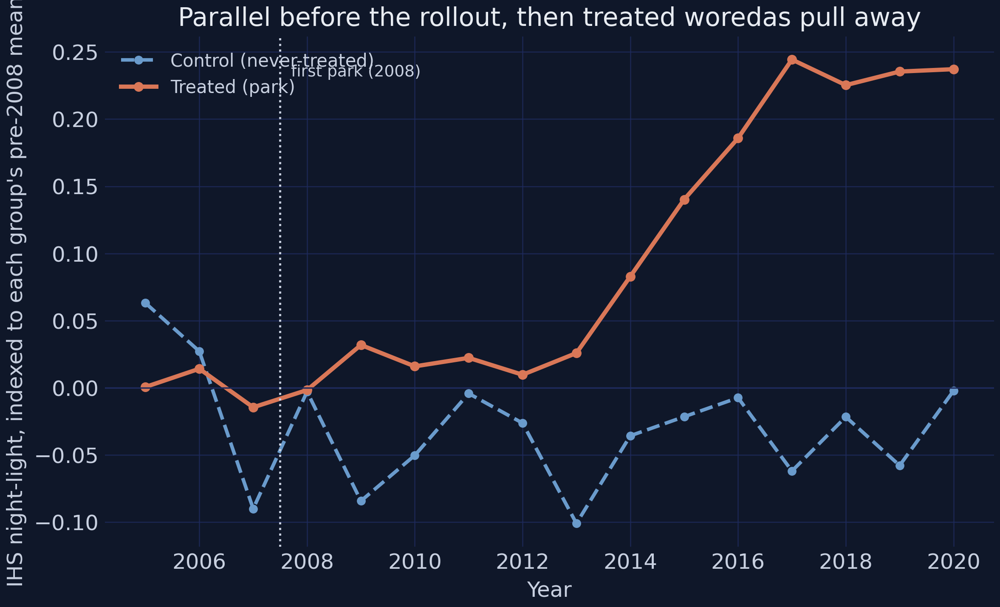
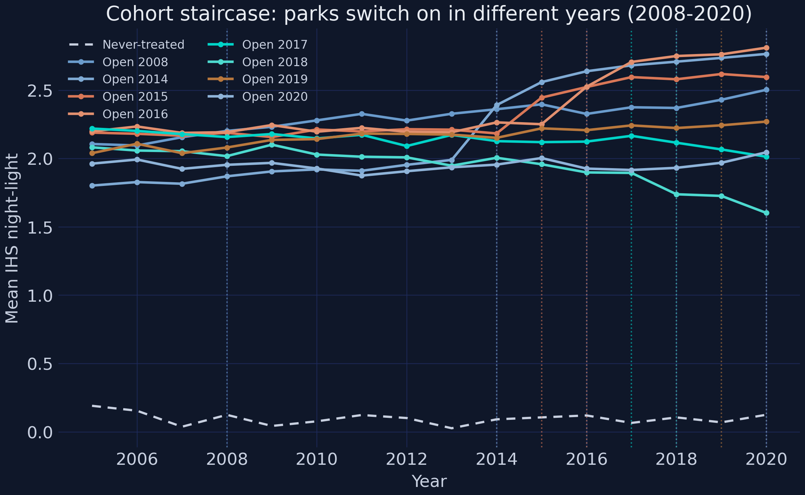
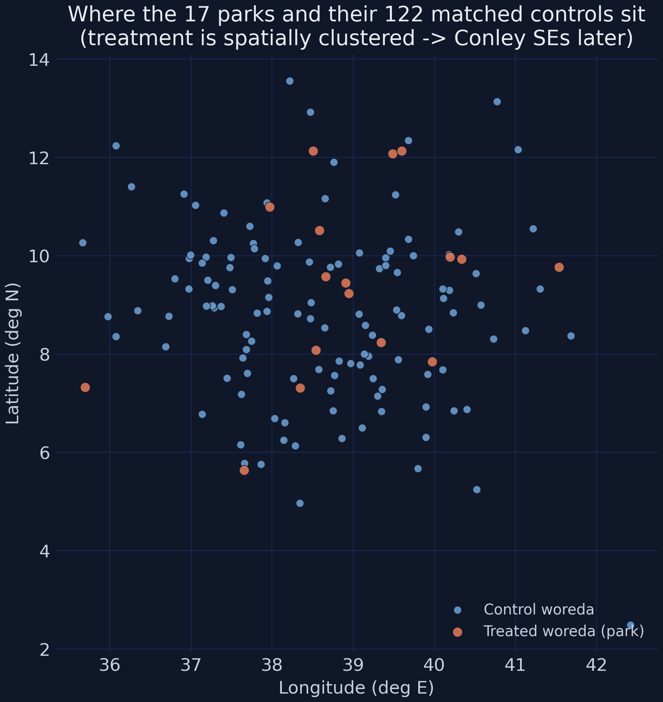
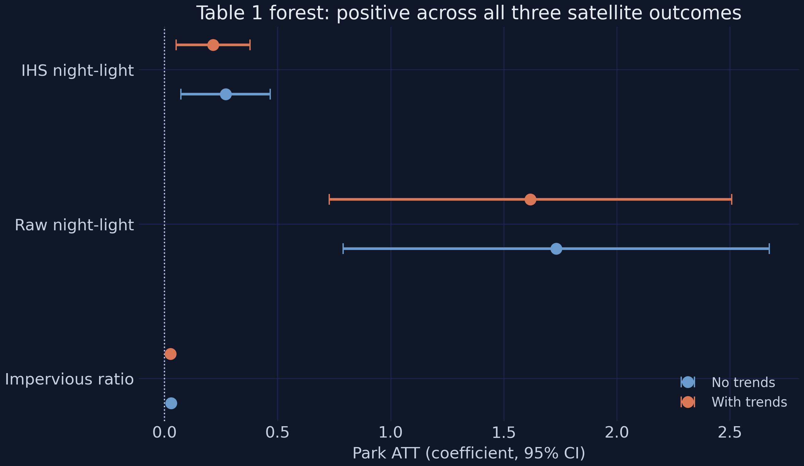
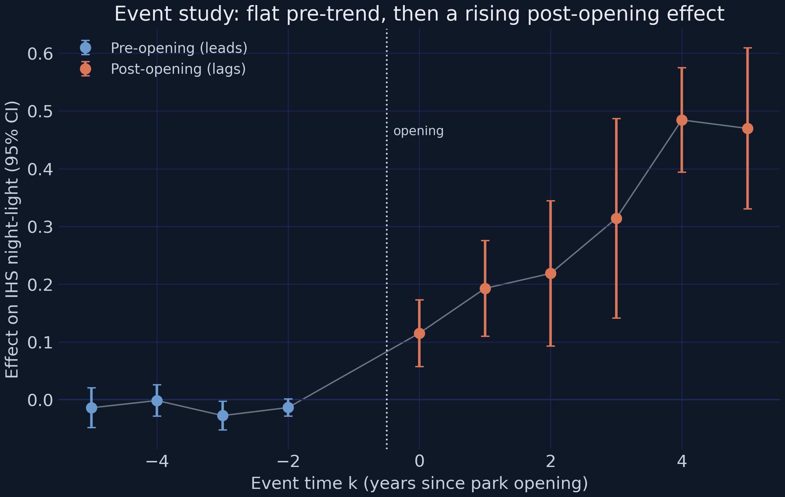
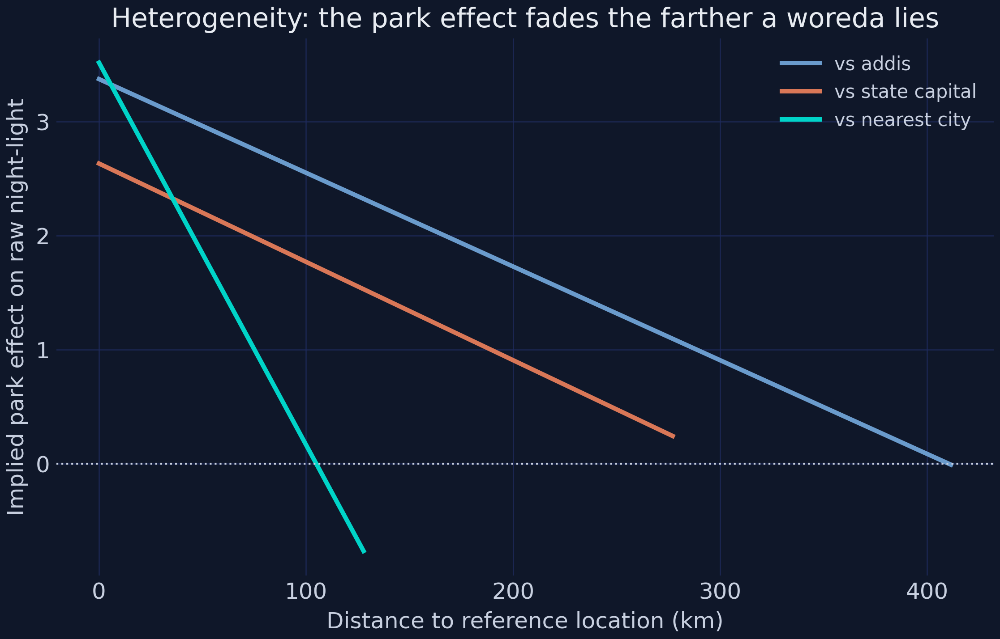
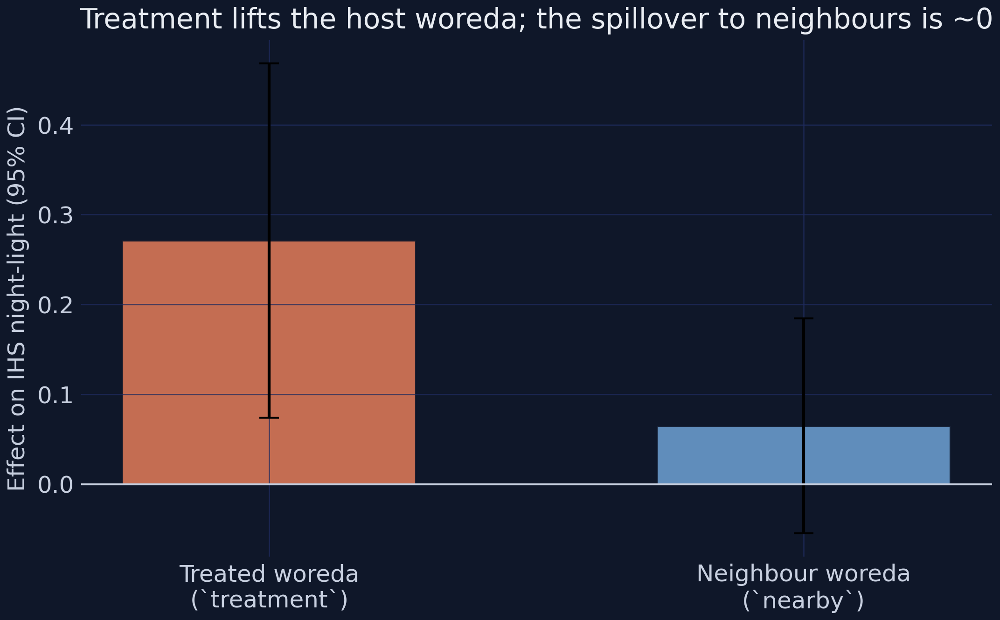
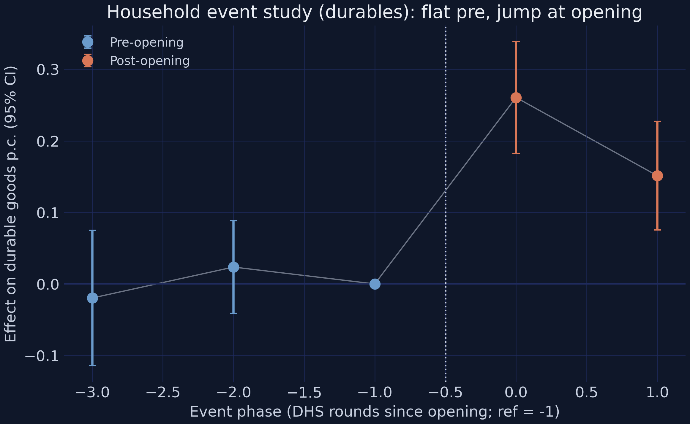

# The Tension {.divider background-color="#d97757"}

[Act I]{.act}

## Governments spend billions fencing land for factories — does anything grow outside the fence?

Ethiopia opened **20+ parks across 18 districts, 2008–2021**.

. . .

The promise: a wage economy. The fear: a bright **enclave** behind a fence.

::: {.notes}
An industrial park is serviced land, power and a one-stop customs office, rented to garment and leather factories; the hope was that factories would cluster, create jobs, and pull a largely rural region forward into a wage economy. Place-based subsidies are one of the most popular instruments of modern development policy, and one of the most contested. The genuine ambiguity is the hook: a park could light up satellite imagery yet leave household living standards flat, or create jobs on average yet only for men. The point of the talk is not just "what happened" but "how could you measure it credibly when the government chose where parks go".
:::

## The question has two halves — *whether*, and *for whom*

Brighter satellites, flat living standards. More jobs — but only for men.

. . .

So we ask both: **does activity rise**, and **who benefits?**

[The "for whom" turns out to carry the headline.]{.takeaway .fragment}

::: {.notes}
This two-sided framing is what makes the study more than an impact evaluation. The average effect and the distributional effect can point in opposite directions, and the talk is built so the audience feels that tension before the data resolve it. The teaching payoff in Act III is that a reader who quotes only the average employment number badly misreads the study.
:::

## The government did not flip a coin — parks went where growth already was

The government put parks near cities and roads — where growth **already was**.

. . .

So a raw treated-vs-control gap confounds the park with the place. The fix is **difference-in-differences**, built for a **staggered** rollout.

[A note on the data.]{.objection} **Synthetic and calibrated** to Huang, Wang & Xu (2026). Learn the *methods*.

::: {.notes}
This is the identification problem stated plainly. Selection on pre-trends is the central threat: the parks were placed in already-advantaged woredas, districts that were already growing faster. The design has to net out those pre-existing differences and handle a staggered rollout — parks opened in different years, so there is no single before-and-after. The fix is district and region-by-year fixed effects plus baseline-trend interactions — confounding control, not the precision-only adjustment of an experiment. The synthetic-data caveat is stated up front for honesty: the data are calibrated to the paper's signs and magnitudes, so use them to learn the methods, not to draw conclusions about Ethiopia. Section 13 of the post audits the calibration cell by cell.
:::

## One estimand — the ATT — threads through everything

:::: {.columns}
::: {.column width="58%"}
We want the **Average Treatment effect on the Treated**:

$$\text{ATT} = E[\,Y_i(1) - Y_i(0) \mid D_i = 1\,]$$

The effect on the **17 districts that got a park** — not on a random district — identified under **parallel trends**.
:::
::: {.column width="42%"}
- Naive 2×2 — the cartoon
- TWFE + event study — the workhorse
- Sun-Abraham · Borusyak/Gardner · Callaway-Sant'Anna — the insurance
:::
::::

[Three data streams · one design · an escalating ladder of estimators.]{.takeaway .fragment}

::: {.notes}
The estimand is the ATT, not the population-wide ATE: it is the effect on these parks in this setting and travels only as far as that. The ladder metaphor frames the whole investigation — the naive 2×2 is the cartoon version, TWFE and its event-study view are the workhorse, and the three modern estimators are the robustness insurance that the workhorse has not been led astray by staggered timing.
:::

## Parks cluster near Addis and the road corridors — placement was deliberate

{fig-align="center" width="60%"}

[Source: Appendix Figure A2 in Huang, Wang & Xu (2026). Real park locations from the paper; this tutorial uses synthetic calibrated data.]{.comment}

[Deliberate clustering near cities and roads is exactly the non-random placement the design has to handle.]{.takeaway .fragment}

::: {.notes}
The parks cluster near Addis Ababa and the main transport corridors but reach peripheral regions too — this geographic clustering is exactly why we later need Conley spatial standard errors. The map is the paper's real geography; our analysis runs on synthetic calibrated data.
:::

# The Investigation {.divider background-color="#6a9bcc"}

[Act II]{.act}

## One policy, measured at three grains — satellite, household, individual

:::: {.columns}
::: {.column width="50%"}
### Satellite panel
- 139 woredas × 16 years (2,224 rows)
- **17 treated** vs **122 matched controls**
- outcome: IHS nighttime light
:::
::: {.column width="50%"}
### DHS repeated cross-sections
- 13,200 households · 17,900 individuals
- 5 survey rounds, *fresh* respondents
- no panel key → coarse event phases
:::
::::

[Only **17 treated woredas** — the recurring source of statistical caution.]{.takeaway .fragment}

::: {.notes}
National statistics would barely flinch at a few new factories, so we need sub-national data — and at three grains. The district layer is a balanced panel that supports an annual event study; the household and individual layers are repeated cross-sections of different respondents, so they admit only coarse event phases and survey-weighted regressions, never unit fixed effects. The 17/122 split is small on the treated side, which is exactly why several effects are borderline.
:::

## Parallel before the rollout, then the treated woredas pull away



::: {.notes}
This is the picture DiD was invented for. Indexed to each group's pre-2008 mean, the two series sit on top of each other before the rollout — in 2008 treated is at −0.0018 and control at −0.0030, essentially identical, the visual signature of parallel trends. From 2014 the treated series climbs steadily while controls hover near zero. The eye already sees a matched pair that diverges only after parks open; the rest of the talk measures that divergence. We plot baseline-normalized light because the synthetic bright-base device puts raw treated/control levels miles apart.
:::

## Staggered means there is no single "before" — each cohort has its own clock



[1 woreda in 2008, then 2–3 per year across 2014–2020 — 17 in total.]{.takeaway .fragment}

::: {.notes}
The staggered structure is easier to see one cohort at a time. The 2016 cohort lifts off in 2016, the 2018 cohort in 2018, while the never-treated line stays flat and even drifts down slightly. There is no single treatment date, so any honest estimator must align each cohort to its own clock. Every event time has at least three treated woredas behind it, so the dynamic path is estimated off real data at each lag.
:::

## Treatment is spatially clustered — which will matter for standard errors



[Near things are more related than distant things — their shocks are *not* independent draws.]{.takeaway .fragment}

::: {.notes}
Plotting treated and control woredas by longitude and latitude shows the treated units are spatially clustered, not randomly sprinkled — parks went to a handful of regions near cities and roads. Clustered treatment means a regional shock could hit several treated woredas at once, so their errors are unlikely to be independent. That is precisely the problem Conley spatial standard errors fix in Act III. Hold this picture; we return to it.
:::

## A single "after" blends the slow start with the late surge — and understates the effect

The simplest estimate collapses the design at the median opening year and takes a difference of differences:

$$\widehat{\text{DiD}} = \big(\bar{Y}_{\text{treat, post}} - \bar{Y}_{\text{treat, pre}}\big) - \big(\bar{Y}_{\text{ctrl, post}} - \bar{Y}_{\text{ctrl, pre}}\big)$$

. . .

Naive 2×2 ATT: **+0.2011** (SE 0.0885, p = 0.023).

The effect ramps over ~5 years, so averaging small early years with large late ones pulls the mean down.

::: {.notes}
Treated light rises +0.1929 post-opening while controls fall −0.0082, so the difference-in-differences is +0.2011 — significant at 5%, with the by-hand and diff-diff estimates agreeing to four decimals. But this blended 2×2 understates the dynamic effect because the event study below reaches +0.48; it also leans on the Goodman-Bacon forbidden comparisons we worry about under staggering. The fix is to let the effect vary over time and absorb confounders with fixed effects.
:::

## The workhorse adds two-way fixed effects — and a park lifts light +0.215

The static TWFE specification, for woreda $d$ in year $t$:

$$Y_{dt} = \beta \, D_{dt} + \alpha_d + \gamma_{r(d),t} + \varepsilon_{dt}$$

$\alpha_d$ absorbs the bright base; $\gamma_{r(d),t}$ absorbs regional shocks; $\beta$ is the **ATT**.

[With baseline-trend interactions: $\hat\beta = +0.2152$ (SE 0.0833, $t = 2.58$, sig. at 1%) — a ~21% rise in luminosity.]{.takeaway .fragment}

::: {.notes}
The woreda fixed effect absorbs anything permanent about a district, including its synthetic bright base; the region-by-year fixed effect absorbs shocks common to a whole region in a given year. The with-trends specification adds time-by-baseline interactions so each woreda follows its own linear trend. The estimate drops from +0.270 without trends to +0.215 with them — a textbook differential-trend confound, since treated woredas were already more urban in 2007 and trending up faster. The with-trends number is the cleaner ATT.
:::

## Two lines of `pyfixest` give the whole Table-1 ATT

``` {.python code-line-numbers="1-2|3-5"}
m0 = pf.feols("ihs_light ~ treatment | district_id + region^year",
              data=dt, vcov={"CRV1": "district_id"})     # no trends   -> +0.2704
m1 = pf.feols("ihs_light ~ treatment + t_urbanization_rate_2007 + ... "
              "| district_id + region^year",
              data=dt, vcov={"CRV1": "district_id"})     # with trends -> +0.2152
```

[Everything left of the `|` is estimated; everything right of it is **absorbed**. `diff-diff` supplies the staggered-robust estimators later.]{.takeaway .fragment}

::: {.notes}
The workhorse is two lines of pyfixest. Its formula syntax is Stata-flavored: everything to the left of the pipe is estimated, everything to the right is absorbed as fixed effects, so district_id soaks up whatever is permanent about a woreda — including its bright base — and region^year soaks up shocks common to a whole region in a year. The CRV1 argument clusters the standard errors on district. The with-trends model only adds the five 2007-baseline trend interactions, and that alone pulls the coefficient from +0.2704 to +0.2152. These two libraries carry the rest of the talk: pyfixest also runs the event study and the Sun-Abraham and Borusyak/Gardner estimators, while diff-diff supplies Callaway-Sant'Anna and the Goodman-Bacon decomposition.
:::

## Across all three satellite outcomes the park effect is positive



[Six estimates, one direction — the built-up land effect ($+0.0263$, $t = 7.07$) is the most precise of all.]{.takeaway .fragment}

::: {.notes}
The static TWFE recovers the paper's headline: IHS light +0.2152 with trends, raw light +1.618, and the impervious-surface ratio +0.0263 (t = 7.07) — about 2.6 percentage points of built-up land, the most precisely estimated satellite coefficient in the study. The raw-light coefficient runs high (+1.618 vs the paper's 1.276), a documented synthetic artifact of the bright-base device that we flag in the reproduction audit. All three point the same way.
:::

## The event study shows *when* the effect arrives — flat before, rising after



[Pre-trend flat (largest $|t| = 2.17$) → parallel trends credible. Effect builds, not jumps.]{.takeaway .fragment}

::: {.notes}
The figure tells the whole story in one arc. The four pre-opening leads hug zero — they range from −0.0275 to −0.0013, largest absolute t just 2.17 — weak enough to read as a flat pre-trend. The jump comes strictly after opening: +0.1153 at k = 0 (p = 0.0001), climbing through +0.1928 and +0.2187, plateauing at +0.4844 by k = 4. This rising-then-flattening dynamic is exactly why the naive 2×2 understated the long-run ATT. The flat pre-period is suggestive support for parallel trends — never proof, since the assumption concerns the unobserved post-period counterfactual.
:::

## The teaching moment: staggered TWFE can use already-treated units as controls

[The worry.]{.objection} Under staggered timing TWFE makes "forbidden comparisons" — already-treated woredas as controls for later-treated ones. When effects grow over time, those comparisons get **negative weights** and can bias, even flip, the estimate.

. . .

[The fix.]{.rebuttal} **Sun-Abraham**, **Borusyak/Gardner**, and **Callaway-Sant'Anna** only ever compare treated cohorts to *clean* (never- or not-yet-treated) controls. Each targets the same ATT — if they agree with TWFE, the bias is not biting.

::: {.notes}
Here is the worry stated precisely. Because our effects clearly grow over time, from +0.12 to +0.48, the forbidden comparisons are exactly the dangerous kind. The fix is a generation of estimators that only ever compare treated cohorts to clean controls. This is the central teaching moment of the deck: the modern staggered-DiD literature in one slide. The test is convergence — if three robust estimators reproduce the TWFE headline, a reader worried about negative weights can relax.
:::

## Four estimators, one estimand — they agree within 0.046 IHS units

| Estimator | ATT | Sig. |
|---|---:|:--:|
| TWFE | +0.2699 | \*\*\* |
| Sun-Abraham | +0.2991 | \*\*\* |
| Borusyak/Gardner | +0.3022 | \*\*\* |
| Callaway-Sant'Anna | +0.2561 | \*\*\* |

[A 0.046 spread across four estimators — the staggered-bias worry does not bite here.]{.takeaway .fragment}

::: {.notes}
All four target the same ATT and land in a tight band — a spread of only 0.046 IHS units across methods that in other settings can diverge sharply. They agree because there is a real never-treated comparison group (the 122 controls) and the treatment effect is fairly homogeneous, so the conditions that make TWFE's forbidden comparisons dangerous simply do not bind. This agreement is the methodological payoff of the talk.
:::

## And the Goodman-Bacon decomposition shows *why* — 95.4% clean weight

| Comparison type | Weight | Avg estimate |
|---|---:|---:|
| Treated vs never | [95.42%]{.key} | +0.2708 |
| Earlier vs later | 3.38% | +0.3370 |
| Later vs earlier (forbidden) | 1.21% | +0.0135 |

[The forbidden comparisons carry 1.21% of the weight — negative weighting is negligible here.]{.takeaway .fragment}

::: {.notes}
The decomposition breaks the +0.2699 TWFE coefficient into 64 underlying 2×2 comparisons. The clean treated-vs-never comparisons carry 95.42% of the weight and average +0.2708 — essentially the headline. The forbidden later-vs-earlier comparisons, the ones that can flip TWFE's sign, carry just 1.21% and contribute a near-zero +0.0135. The lesson worth keeping: the negative-weights problem is real in principle but empirically negligible whenever a large never-treated pool dominates the weighting, as the 122 PSM controls do.
:::

## Where parks work: the effect fades with distance and is amplified by roads



[Distance to nearest city $-0.0335$ ($t = -4.90$) · paved roads $+0.6695$ ($t = 2.08$). Place is first-order.]{.takeaway .fragment}

::: {.notes}
Location fundamentals sharply moderate park effectiveness, exactly as the paper argues. All three distance interactions are negative — the effect fades with distance from economic centers — and all three are significant, the steepest being distance to nearest city at −0.0335. Both road interactions are positive; paved-road density is significant at +0.6695. The primary-road interaction is correctly signed but borderline insignificant — an honest synthetic limitation of only 17 treated woredas, which cannot make mutually-correlated moderators all precise at once. Direction is solid; precision is what the small sample cannot fully deliver.
:::

## Net-new activity, not displacement — no measurable spillover to neighbours



[`nearby` $= +0.0648$ ($t = 1.06$), insignificant — so the host's gain is net-new, and SUTVA looks plausible.]{.takeaway .fragment}

::: {.notes}
The spillover test adds a nearby indicator for control woredas within 10 km of an operational park. If parks merely displaced activity, nearby should be negative; if the gains are net-new, it should be zero. It comes in at +0.0648 (t = 1.06), small and indistinguishable from zero, while the host effect stays +0.2712. No spillover means the gain is net-new activity, and the never-treated controls are not contaminated by proximity — so SUTVA is plausible and the main ATT is not biased by treated-on-control externalities. The parks behave like relatively self-contained enclaves.
:::

## Households near a park gain durables, housing, and wealth

| Outcome | ATT (with controls) | Sig. |
|---|---:|:--:|
| Durable goods p.c. | [+0.2286]{.key} (~74%) | \*\*\* |
| Housing quality | +0.2480 | \*\*\* |
| Wealth index | +0.3825 SD | \*\*\* |

[Adding controls barely moves any estimate — the design already absorbs the confounding.]{.takeaway .fragment}

::: {.notes}
Switching to the DHS household repeated cross-section: because each round samples different households there is no panel key, so the effect is identified off district-by-round group means with survey weights, district and region-by-round fixed effects, no household fixed effect. All three living-standards outcomes rise sharply. Durables gain +0.2286 against a 0.308 mean — a ~74% lift. Adding controls barely moves any estimate, which confirms the design already absorbs the main confounding.
:::

## Clean timing in the survey data too — flat pre-phases, then a jump



[Phase $-3$: $-0.020$ (ns) · phase $-2$: $+0.024$ (ns) · phase $0$: $+0.261$ (p < 0.001).]{.takeaway .fragment}

::: {.notes}
Because the DHS data are repeated cross-sections, the household event study uses coarse phase dummies rather than annual event time. The two pre-opening phases are flat and insignificant, both straddling zero, so there is no differential pre-trend in household durables. The effect jumps to +0.2606 at phase 0 and stays strongly positive after. This is the RCS counterpart to the satellite no-anticipation evidence, with the honest caveat that two pre-phases make a low-powered test.
:::

## The climax: average employment is null — but the female effect is large

| Non-ag employment | ATT | $t$ |
|---|---:|---:|
| Full sample | +0.0911 (ns) | +1.57 |
| Women | [+0.1404]{.key}\*\*\* | +3.00 |
| Men | +0.0176 (ns) | +0.19 |

[Pool the sexes and you find nothing. Split them and the finding appears.]{.takeaway .fragment}

::: {.notes}
This is the analytical climax and a textbook case for heterogeneity analysis. The average non-agricultural employment effect is +0.0911 — insignificant — which read alone would suggest parks do not move employment at all. But pooling the sexes hides a strong gendered split: the female effect is +0.1404 (significant at 1%) while the male effect is essentially zero. The parks, concentrated in textiles and garments, pull women into factory wage work; the men were largely already off-farm, so the average washes out. A reader who quoted only the full-sample number would badly misread the study — the sex split is the finding, not a footnote.
:::

## Factory jobs cascade into agency — power up, savings up, DV-acceptance down

[+0.140]{.bignum}

[women's non-ag employment ATT (p < 0.01) — and the empowerment cascade that follows]{.bignum-label}

. . .

Decision power $+0.110$\*\*\* · savings account $+0.315$\*\*\* · accepts domestic violence $-0.210$\*\*\* (women only).

::: {.notes}
With factory jobs, women's outcomes shift across the board. Decision-making power rises +0.1096, savings-account ownership rises +0.3153 — enormous against a 6.3% base — and acceptance of domestic violence falls −0.2096, a ~21-point reduction off a 63.5% base. Economic agency translates into household bargaining power and shifting gender norms. The female-employment and decision-power event studies both sit near zero pre-opening and turn up at and after phase 0, reinforcing the no-anticipation reading: women's gains appear with the park, not before it. This is the substantive heart of the study.
:::

# The Resolution {.divider background-color="#00d4c8"}

[Act III]{.act}

## Honest inference inflates the SE 2.4× — but the headline survives

Treated woredas cluster in space. One regional shock hits several at once, so the naive SE is too small.

. . .

The fix: a **Conley spatial-HAC** standard error. The estimate never moves.

| With-trends light ATT | Estimate | Naive HC0 | Conley-HAC | $t$(HAC) |
|---|---:|---:|---:|---:|
| 2005–2020 | +0.2152 | 0.0329 | [0.0799]{.key} | +2.69 |

[Same +0.2152 in every column. The SE inflates 2.43× — yet still significant at 1%.]{.takeaway .fragment}

::: {.notes}
Recall from the map that all 17 treated woredas cluster spatially. The Conley spatial-HAC SE allows a district's errors to correlate with itself over time and with nearby districts in the same year. The most conservative Conley-HAC SE is 0.0799 — 2.43× the naive HC0 SE of 0.0329 — yet the ATT stays significant at t = 2.69. The cluster SE (0.0792) and the Conley-HAC SE (0.0799) are nearly identical, so clustering at the district level already captures most of the dependence; spatial correlation beyond the district adds little. The estimate is also stable on restricted control pools.
:::

## Four findings, one story: well-sited parks reshape activity — through women

::: {.incremental}
- **Activity** — +0.215 IHS light (~21%), +2.6 pp built-up land, no spillover
- **Staggered-robust** — four estimators agree within 0.046, 95.4% clean Bacon weight
- **Welfare** — durables +0.229, housing +0.248, wealth +0.383 SD
- **Gender** — null on average (+0.091), but female jobs +0.140 and the agency cascade
:::

[Triangulation across methods — not a single regression — is what makes the claim credible.]{.takeaway .fragment}

::: {.notes}
Four families of results built on different assumptions all point the same way. A park raises local activity, the staggered-bias worry does not bite because a large never-treated pool dominates the weighting, households near a park grow richer, and the employment and empowerment gains run through women. That convergence — not the precision of any one estimate — is the strongest part of the evidence.
:::

## Two design lessons: follow the roads, and disaggregate by sex

Not "build parks everywhere." **Where** and **for whom** decide whether it works.

. . .

- **Site selection** — the effect fades $-0.0335$ per km from the nearest city.
- **Inclusion** — the gains run through women. Measure only the average and you call it a failure.

::: {.notes}
For place-based policy the design lessons matter as much as the result. First, proximity to existing economic centers is first-order, so policy should follow the roads: the effect fades with distance to the nearest city and is amplified by paved-road density, so a park in a remote, poorly-connected woreda would do far less. Second, because the employment and empowerment gains run through female-intensive sectors — textiles and garments — evaluations should be sex-disaggregated by default; an evaluation that measured only the average would conclude the parks failed on jobs and would miss their largest social return. These two lessons are the transferable content even though the synthetic numbers are not.
:::

## The strongest objection — and the answer

[Objection.]{.objection} The data are **synthetic**, there are only **17 treated woredas**, and this is **observational** — point estimates fragile, identification on faith.

. . .

[Response.]{.rebuttal}

- Synthetic data are *calibrated* to the paper — audited cell by cell in Section 13.
- Small-N met head-on: **flat pre-trends**, **null spillover**, **four-estimator agreement**, **Conley-HAC** errors.
- The caveats narrow the claim — they don't overturn it.

::: {.notes}
Steelman first: this is a tiny treated group on simulated data in a setting where parks were not randomly placed. The honest reply is that every credibility check — pre-trend, placebo-style spillover test, staggered-robust cross-checks, spatial inference — has been run and survived, and the conclusion is stated as evidence about well-sited parks in this setting, not place-based policy in general. The ATT travels only as far as these parks in this context.
:::

## Five numbers carry the whole study

| Number | Value |
|---|---:|
| Light ATT (with trends) | [+0.2152]{.key}\*\*\* (~21%) |
| Four-estimator spread | 0.046 IHS units |
| Clean Bacon weight | 95.4% |
| Female employment ATT | +0.140\*\*\* (vs +0.091 ns) |
| Light SE: naive → Conley-HAC | 0.0329 → 0.0799 |

[One lesson above the rest: the average hid the finding — disaggregate by sex.]{.takeaway .fragment}

::: {.notes}
Close on the numbers, then the lessons. One: the pooled 2×2 understated the dynamic — only the event study revealed the build to +0.48, so let evolving effects evolve. Two: four estimators and a Bacon decomposition all pointed the same way; agreement beats any one estimate. Three: the average employment effect was null while the female effect was the headline — heterogeneity analysis turned a null into the finding. Four: the effect fades with distance and grows with roads, so place is first-order. Five: 17 treated woredas on synthetic data, identified by an assumption — strong teaching evidence, stated with its caveats. Next steps in the post: a Callaway-Sant'Anna dynamic aggregation, a Rambachan-Roth pre-trend sensitivity, and testing whether labor-intensive parks drive the female effect.
:::

# Well-sited parks reshape a local economy — and women's lives — but only a sex-disaggregated look reveals it. {.divider background-color="#141413"}
