---
authors:
- admin
categories:
  - Python
  - Causal Inference
  - Difference-in-Differences
  - Synthetic Control
date: "2026-06-09T00:00:00Z"
draft: false
featured: false
external_link: ""
image:
  caption: ""
  focal_point: Smart
  placement: 3
  preview_only: false
links:
- icon: laptop-code
  icon_pack: fas
  name: "Web app"
  url: web_app/index.html
- icon: file-pdf
  icon_pack: fas
  name: "Slides (PDF)"
  url: https://carlos-mendez.org/post/python_did_sc_tsunami/Natural_Disaster_Causal_Inference.pdf
- icon: code
  icon_pack: fas
  name: "Python script"
  url: script.py
- icon: file-code
  icon_pack: fas
  name: "Quarto project (.zip)"
  url: python_did_sc_tsunami.zip
- icon: book
  icon_pack: fas
  name: "Jupyter notebook"
  url: notebook.ipynb
- icon: open-data
  icon_pack: ai
  name: "[Python] Google Colab"
  url: https://colab.research.google.com/github/cmg777/starter-academic-v501/blob/master/content/post/python_did_sc_tsunami/notebook.ipynb
- icon: podcast
  icon_pack: fas
  name: AI Podcast
  url: "/post/python_did_sc_tsunami/#podcast-player"
- icon: markdown
  icon_pack: fab
  name: "MD version"
  url: https://raw.githubusercontent.com/cmg777/starter-academic-v501/master/content/post/python_did_sc_tsunami/index.md
summary: "Evaluate the long-run economic impact of a localized natural disaster with causal inference in Python. A beginner's replication of Heger & Neumayer (2019) on the 2004 Aceh tsunami, using synthetic calibrated data: dynamic difference-in-differences with pyfixest, an event study with diff-diff, a night-lights dose-response, synthetic control with mlsynth, and Conley spatial standard errors."
tags:
  - python
  - causal
  - did
  - synthetic-control
  - panel data
  - pyfixest
  - diff-diff
  - mlsynth
  - spatial
  - natural disasters
title: "Evaluating the Impact of Natural Disasters in Python: The Case Study of Aceh Tsunami"
url_code: ""
url_pdf: ""
url_slides: ""
url_video: ""
toc: true
diagram: true
---

## Abstract

Localized natural disasters destroy capital and lives yet can attract reconstruction aid large enough to rebuild a region "better than before," leaving the net long-run effect genuinely ambiguous. This tutorial asks whether the Indonesian province of Aceh — which lost roughly 130,000 people to the 2004 Indian Ocean tsunami but then received the largest developing-world reconstruction effort ever, about USD 7.7 billion committed and USD 7.0 billion spent — ended up on a higher or lower growth path a decade later, and how that effect can be credibly measured. It replicates Heger & Neumayer (2019) on synthetic calibrated data spanning a district panel of 125 Sumatran districts observed annually over 1999–2012 (1,750 rows, 10 flooded Aceh districts treated) and a finer panel of 276 Aceh sub-districts with satellite night-lights. Treating coastal inundation as a quasi-natural experiment, it estimates a dynamic four-period difference-in-differences with pyfixest, an event study with diff-diff, a continuous night-lights dose-response, a synthetic control with mlsynth, and Conley spatial-HAC standard errors validated by Moran's I. Flooded districts lost 7.9% of output in 2005 (−0.0792, p < 0.01) but grew 6.3 percentage points per year faster during 2006–08 (+0.0628, p < 0.05), and synthetic control places flooded Aceh +18.3% above its no-tsunami counterfactual by 2012; the night-lights rebound (+0.0160, p < 0.001) concentrates in the worst-hit quintile, while a neighbour placebo finds nothing. The case shows that well-governed mega-reconstruction can leave a poor region on a permanently higher trajectory — provided inference accounts for spatially clustered treatment, which roughly doubles the recovery effect's standard error (0.0146 to 0.0244) and downgrades it from a spuriously confident 1% to an honest 5% significance.

## 1. Overview

On 26 December 2004, a magnitude-9.1 earthquake off the coast of Sumatra sent a tsunami across the Indian Ocean. The Indonesian province of **Aceh** bore the worst of it: roughly **130,000 people died**, the wave reached up to **9 km inland**, and about a third of the coastline was flooded. Then something unusual happened. Aceh received the single largest reconstruction effort ever directed at a developing-world disaster — about **USD 7.7 billion** committed, **USD 7.0 billion** actually spent — under a well-coordinated agency with low corruption.

So here is a genuinely hard question: **a decade later, was Aceh richer or poorer than it would have been without the tsunami?** Catastrophe destroys capital and lives; massive, well-spent aid rebuilds — *better than before*, sometimes. Which force won? And — the part this tutorial really cares about — **how could you ever measure that credibly**, when you only get to observe the world where the tsunami *did* happen?

This post is a hands-on answer. We treat the tsunami as a **natural experiment**: the wave flooded some districts and spared others for reasons of coastal geography that have nothing to do with their economic prospects. Comparing the flooded "treated" districts to the un-flooded "control" districts — before and after 2004 — lets us isolate the disaster-plus-reconstruction effect. We will measure it four different ways, each answering a slightly sharper version of the question, and we will be honest about uncertainty when the treated places all sit in one corner of the map.

> **A note on the data (please read this).** This tutorial is *inspired by and based on* the study by **Heger & Neumayer (2019)**, but it runs on **synthetic data created for teaching**. The paper's real inputs (World Bank GDP, satellite night-lights, tsunami inundation maps) are licensed or confidential. Our dataset is *calibrated* so that re-running the paper's analyses reproduces its **findings** — the signs, the statistical significance, and the *approximate* magnitudes of the key coefficients. The direction and significance of most results match the paper closely; **the magnitudes can differ slightly** (we tabulate exactly how in [Section 11](#11-reproduction-audit-synthetic-data-vs-the-paper)). Use this to learn the *methods*, not to draw new conclusions about Aceh.

### 1.1 Learning objectives

By the end of this tutorial, you will be able to:

- **Frame** a localized natural disaster as a quasi-natural experiment, and explain why a flooded-vs-not comparison can identify a causal effect under *parallel trends*.
- **Measure** disaster exposure and economic activity from administrative and satellite data — district GDP, sub-district night-lights, and satellite inundation maps.
- **Estimate** a dynamic, four-period difference-in-differences on district GDP growth with [`pyfixest`](https://pyfixest.org/), and read it as an **event study** with [`diff-diff`](https://github.com/igerber/diff-diff).
- **Quantify** a *dose-response* relationship at finer resolution using continuous flood intensity on sub-district night-lights.
- **Build** a synthetic-control counterfactual for flooded Aceh with [`mlsynth`](https://github.com/jgreathouse9/mlsynth) and read its path and gap plots.
- **Defend** your inference when treatment is geographically clustered, using Moran's I and **Conley spatial standard errors**, and validate the result with placebo and heterogeneity checks.

### 1.2 Study design

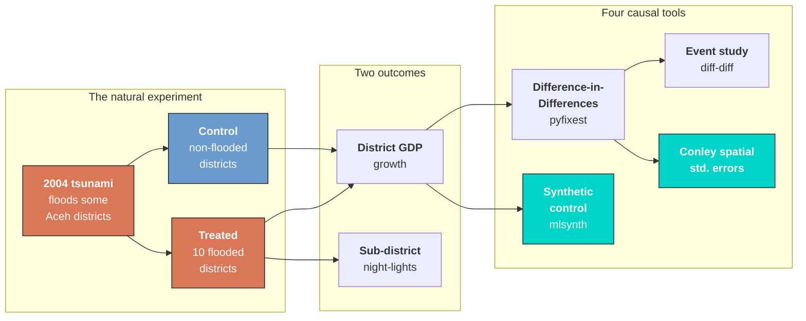

Read the diagram left to right: the tsunami splits districts into treated and control; we observe two outcomes (district GDP and finer sub-district night-lights); and we deploy four causal tools — DiD and its event-study view, an independent synthetic control, and the spatial standard errors that keep our confidence honest. Each maps onto a section below.

### 1.3 Key concepts at a glance

The post leans on a small vocabulary repeatedly. Each concept below has three parts. The **definition** is always visible; the **example** and **analogy** sit behind clickable cards — open them when you need them, leave them closed for a quick scan. If a later section mentions "parallel trends" or "Conley standard errors" and the term feels slippery, this is the section to re-read.

**1. Difference-in-Differences (DiD).**
Compare the *change* in the treated group to the *change* in the control group. The difference of those two differences is the causal estimate. It nets out anything permanent about a district *and* any trend shared by the whole country.

<div class="concept-pair">
<details class="concept-card concept-example">
<summary>Example</summary>

Flooded districts' mean growth went from 0.0567 (before) to 0.0671 (after) — a change of +0.0103. Controls went 0.0519 to 0.0497 — a change of −0.0022. The 2×2 DiD is $0.0103 - (-0.0022) = +0.0125$.

</details>

<details class="concept-card concept-analogy">
<summary>Analogy</summary>

Time two runners on parallel tracks. Both speed up when the gun fires (the national trend). Credit your coaching only with the *extra* burst of the runner you coached — the gap between the two changes.

</details>
</div>

**2. Parallel trends.**
The identifying assumption of DiD: absent the tsunami, flooded and non-flooded districts would have grown by the *same amount* on average. Their *levels* may differ; their *trends* must match.

<div class="concept-pair">
<details class="concept-card concept-example">
<summary>Example</summary>

We test it directly: the pre-tsunami (2003–04) DiD coefficient is +0.0172 and statistically *insignificant* (p = 0.28). No detectable divergence before treatment — the assumption survives its placebo.

</details>

<details class="concept-card concept-analogy">
<summary>Analogy</summary>

Two boats drifting on the same current. They sit at different points, but the current carries them in step. Only an engine — the treatment — should make one pull ahead.

</details>
</div>

**3. ATT** $E[Y(1) - Y(0) \mid D=1]$.
The Average effect of the Treatment on the Treated. Here: the effect *on the flooded districts*, not on some randomly chosen district. DiD and synthetic control both target the ATT.

<div class="concept-pair">
<details class="concept-card concept-example">
<summary>Example</summary>

The +18.3% synthetic-control gap is the ATT *for flooded Aceh*. It does not claim that flooding any district would raise its GDP 18% — only that *these* districts, given *this* reconstruction, ended up that much higher.

</details>

<details class="concept-card concept-analogy">
<summary>Analogy</summary>

The bonus speed measured on the car that actually got the coaching — not a promise about any car you might pick off the street.

</details>
</div>

**4. Counterfactual.**
The output flooded Aceh *would* have had with no tsunami. It is never observed; it must be *estimated* — by the control group's trend (DiD) or a weighted blend of donor districts (synthetic control).

<div class="concept-pair">
<details class="concept-card concept-example">
<summary>Example</summary>

"Synthetic Aceh" is a weighted recipe of 76 Rest-of-Sumatra donor districts (top weights: JAMBI_D01 0.13, BABEL_D05 0.12) chosen to match flooded Aceh's *pre-2005* GDP path. After 2005 it is our stand-in for the no-tsunami Aceh.

</details>

<details class="concept-card concept-analogy">
<summary>Analogy</summary>

The parallel-universe Aceh where the wave never came. We cannot visit it, so we build the most convincing look-alike we can from places the wave *did* miss.

</details>
</div>

**5. Dose-response.**
Bigger exposure should mean a bigger effect. Instead of an on/off treatment dummy, use *continuous* intensity — the share of a sub-district flooded — or intensity quintiles.

<div class="concept-pair">
<details class="concept-card concept-example">
<summary>Example</summary>

Each unit of "share of population flooded" raises night-lights growth by +0.016/year during recovery (p < 0.001). And only the **top intensity quintile** shows a significant rebound — quintiles 1–4 are flat.

</details>

<details class="concept-card concept-analogy">
<summary>Analogy</summary>

Medicine dosage. A sip does little; the full dose moves the needle. If only the largest doses show an effect, the drug is real but the average hides where it acts.

</details>
</div>

**6. Night-lights as an economic proxy.**
Satellite night-time brightness (DMSP-OLS "Digital Numbers", 0–63) stands in for local economic activity where GDP is unavailable, after a log transform.

<div class="concept-pair">
<details class="concept-card concept-example">
<summary>Example</summary>

In 2004 the flooded sub-districts averaged a luminosity of 5.79 versus 2.36 for non-flooded ones — they are the denser, more active coastal places, and their lights are what we track over time.

</details>

<details class="concept-card concept-analogy">
<summary>Analogy</summary>

Judging a city's bustle from a night flight overhead. You cannot read the GDP accounts from 800 km up, but brighter usually means busier.

</details>
</div>

**7. Conley spatial-HAC standard errors.**
Standard errors that allow a district's errors to be correlated with *nearby* districts in the same year (spatial) and with *itself* over time (serial). They are larger — and more honest — than naive errors when the treated units cluster in space.

<div class="concept-pair">
<details class="concept-card concept-example">
<summary>Example</summary>

The recovery effect's standard error roughly doubles, from 0.0146 (naive) to 0.0244 (Conley-HAC). That turns a *t* of 4.3 into a *t* of 2.57 — the point estimate (+0.0628) never moves, but it is significant at 5%, not 1%.

</details>

<details class="concept-card concept-analogy">
<summary>Analogy</summary>

Counting a milling crowd. Rows of seats suggest many independent heads, but if everyone keeps shuffling between seats you have far fewer *truly independent* observations than it looks.

</details>
</div>

## 2. Setup and the three star libraries

Three specialist packages do the heavy lifting, and each gets a one-line introduction the first time we use it:

- **[`pyfixest`](https://pyfixest.org/)** runs fixed-effects regressions with a fast, Stata-flavored formula syntax. Everything left of the `|` is estimated; everything right of it is *absorbed* as fixed effects, so we never build dummy columns by hand.
- **[`diff-diff`](https://github.com/igerber/diff-diff)** is a small package built to *teach* difference-in-differences: it returns the 2×2 estimate and the event-study path in one or two lines each.
- **[`mlsynth`](https://github.com/jgreathouse9/mlsynth)** implements modern synthetic-control estimators; we use `VanillaSC`, the classic Abadie–Diamond–Hainmueller method.

```python
# In Colab, install the three estimation libraries first:
# !pip install pyfixest==0.50.1 diff-diff==3.5.2 "mlsynth @ git+https://github.com/jgreathouse9/mlsynth.git"

import numpy as np
import pandas as pd
import matplotlib.pyplot as plt
import pyfixest as pf
import diff_diff as dd
from mlsynth import VanillaSC

np.random.seed(42)  # reproducibility

# Site dark-theme palette for figures
STEEL_BLUE, WARM_ORANGE, TEAL = "#6a9bcc", "#d97757", "#00d4c8"
DARK_NAVY, GRID_LINE, LIGHT_TEXT = "#0f1729", "#1f2b5e", "#c8d0e0"
```

Two small design helpers encode the paper's difference-in-differences structure. The post period is split into event-time windows — **pre** (2003–04), **tsunami** (2005), **recovery** (2006–08), and **post-recovery** (2009–12) — all measured against the omitted **2000–02 baseline**. The function below turns a treatment column into the four interaction terms those windows need.

```python
# The four event-time windows (the 2000-02 baseline is the omitted reference)
PERIOD_TO_TERM = {"pre": "D_pre", "tsunami": "D_2005",
                  "recovery": "D_recov", "postrec": "D_post"}
DID_TERMS = ["D_pre", "D_2005", "D_recov", "D_post"]

def make_did_terms(df, treat_col):
    """Build treatment x period interactions: D_pre, D_2005, D_recov, D_post."""
    out = df.copy()
    treat = out[treat_col].astype(float)
    for period, term in PERIOD_TO_TERM.items():
        out[term] = treat * (out["period"] == period).astype(float)
    return out
```

## 3. The data: measuring a disaster at two geographic levels

Evaluating a *localized* disaster forces a measurement problem to the surface. National GDP would barely flinch at a shock to one province — so we need **sub-national** data, and we need it at two grains. We load both panels straight from the post's data folder on GitHub, so the code runs unchanged in Colab.

```python
BASE = ("https://raw.githubusercontent.com/cmg777/starter-academic-v501/"
        "master/content/post/python_did_sc_tsunami/data/")
district = pd.read_csv(BASE + "aceh_tsunami_district_panel.csv")
subdistrict = pd.read_csv(BASE + "aceh_tsunami_subdistrict_panel.csv")

print("district panel    :", district.shape)
print("subdistrict panel :", subdistrict.shape)
print(district.groupby(["region_group", "flooded"]).size().unstack("flooded", fill_value=0))
```

```text
district panel    : (1750, 30)
subdistrict panel : (3864, 19)
flooded          0   1
region_group          
Aceh            13  10
North Sumatra   24   2
Rest of Sumatra 76   0
```

The district panel is **125 districts observed annually over 1999–2012** (1,750 rows); the sub-district panel is **276 Aceh sub-districts** (*kecamatans*) over the same years. The treatment group is small and concentrated: **10 flooded Aceh districts** against 13 non-flooded Aceh districts plus 76 Rest-of-Sumatra controls. (North Sumatra's two flooded islands are held back for a robustness check, because they were also hit by a *separate* earthquake in March 2005.) That smallness — only 10 treated units — is the recurring source of statistical caution in this case study.

### 3.1 The first outcome — district GDP growth

The main outcome (`gdp_growth`) is the **annual growth rate of real district GDP**, measured in the spirit of the World Bank's INDO-DAPOER database, which draws on Indonesia's large annual socio-economic survey (SUSENAS). Two construction details from the paper matter. First, **oil and gas are excluded**: that sector is volatile and concentrated in a few non-treated districts, so leaving it in would add noise unrelated to the tsunami. Second, GDP is in **constant prices** so we measure real output, not inflation.

```python
print(district[["gdp_growth", "gdp_pc_growth", "gdp_const_usd_m"]].describe().round(3).loc[
      ["count", "mean", "std", "min", "max"]])
```

```text
       gdp_growth  gdp_pc_growth  gdp_const_usd_m
count     1621.00        1621.00          1750.00
mean         0.05           0.04           671.18
std          0.07           0.07           593.99
min         -0.17          -0.20            33.09
max          0.29           0.30          3748.41
```

District growth averages about **5.2% a year** with a wide spread (standard deviation 6.6 percentage points). Notice `gdp_growth` has 1,621 values, not 1,750: growth is undefined in 1999 (no prior year to difference against) and is missing for one district (Subulussalam) over 2003–06 due to an administrative boundary change. Every estimator below simply drops those rows — a small but honest detail that keeps the sample sizes matching the paper exactly.

### 3.2 The second outcome — sub-district night-lights

GDP at the district level is too coarse to capture *how intensely* a place was hit. So the paper drops to the finer sub-district grain and switches to a satellite proxy: **night-time luminosity** from the DMSP-OLS program. Each pixel records a "Digital Number" from 0 (dark) to 63 (saturated bright). To turn pixel brightness into a sub-district economic measure, the paper sums the lights across a sub-district's pixels and takes a logarithm:

$$\text{NL}\_{ct} = \log\left( \sum\_{n=1}^{N} \left( \text{DN}\_{nct} + 0.001 \right) \right)$$

In words: a sub-district $c$'s log-luminosity in year $t$ is the log of the total brightness summed over its $N$ pixels, with a tiny $0.001$ added so that pixels reading exactly zero do not break the logarithm. *Summing* (rather than averaging) keeps the measure comparable to GDP, which is also a total; the *log* tames the heavy right-skew of brightness. Our outcome `nl_growth` is the annual change in this log measure — a luminosity growth rate that lines up conceptually with the GDP growth rate.

### 3.3 Identifying the treated areas — where the wave actually reached

The credibility of the whole exercise rests on **how "flooded" is defined**. The paper does *not* let economics decide it. Treatment is read off **satellite inundation maps** produced 1–5 days after the tsunami by remote-sensing agencies (Germany's DLR/ZKI and the Dartmouth Flood Observatory), which compared the coastline before and after to flag pixels the water reached. Whether the wave penetrated a given stretch of coast was governed by elevation, vegetation, and offshore depth — geographic happenstance, plausibly *unrelated* to a district's economic prospects. That is exactly what makes the flooding a credible natural experiment.

The data encodes exposure three ways, from coarse to fine:

```python
print("Binary treatment (district level):")
print(district.groupby("flooded")["district_id"].nunique())
print("\nContinuous + quintile intensity (sub-district level), among flooded units:")
print(subdistrict.loc[subdistrict.flooded == 1, ["share_pop_flooded", "share_area_flooded"]].describe().round(3).loc[["mean", "min", "max"]])
```

```text
Binary treatment (district level):
flooded
0    113
1     12
Name: district_id, dtype: int64

Continuous + quintile intensity (sub-district level), among flooded units:
       share_pop_flooded  share_area_flooded
mean               0.190               0.012
min                0.001               0.000
max                0.620               0.105
```

`flooded` is the simple on/off dummy used for the district DiD. For the finer night-lights analysis we also have `share_pop_flooded` and `share_area_flooded` — the *fraction* of a sub-district's population (or land area) that the inundation maps marked as flooded — plus a `flood_intensity_quintile` ranking. Notice `share_area_flooded` has a tiny mean (about 1.2%): land area includes a lot of unpopulated hinterland, so the *share of area* flooded is small even where damage was severe. That tiny scale will make its regression coefficient look enormous later — same story, different units.

### 3.4 A transparent word on the synthetic data

Before we model anything: the panels above are **simulated**. The data-generating process was tuned so that a fixed-effects DiD recovers, column by column, coefficients close to the paper's reported values (within about 0.005 on the headline cells), with the same signs and significance stars. Spatial and serial shocks were injected so the standard errors behave like the paper's *without moving the point estimates*. We will hold ourselves accountable for this in [Section 11](#11-reproduction-audit-synthetic-data-vs-the-paper), where a table lines our numbers up against the paper's. With the measurement settled, let us look at the data before modeling it.

## 4. Exploratory analysis: the space-time dynamics

Good causal work *looks* at the data before it regresses it. Three views build the intuition the models will formalize. First, a handful of **individual districts** over time — three badly-hit ones (Banda Aceh, Aceh Besar, Aceh Jaya) against two highland controls — with GDP indexed so every district starts at 100 in 2004.

```python
def indexed(name):
    s = district[district.district_name == name].set_index("year")["gdp_const_usd_m"]
    return s / s.loc[2004] * 100

fig, ax = plt.subplots(figsize=(9, 5.2))
for name in ["Banda Aceh", "Aceh Besar", "Aceh Jaya"]:
    ax.plot(indexed(name), color=WARM_ORANGE, lw=2.2, label=f"{name} (flooded)")
for name in ["Aceh Tengah", "Bener Meriah"]:
    ax.plot(indexed(name), "--", color=STEEL_BLUE, lw=2, label=f"{name} (control)")
ax.axvline(2004.5, color=LIGHT_TEXT, ls=":")
ax.set(xlabel="Year", ylabel="Real GDP (2004 = 100)")
ax.legend(); plt.show()
```

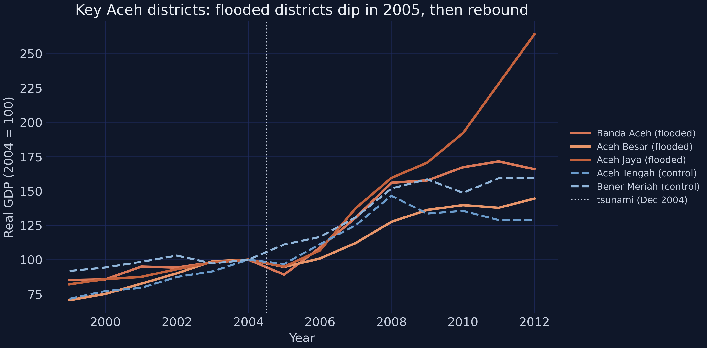
*Three flooded districts (orange) versus two highland controls (blue), each indexed to 100 in 2004.*

The flooded districts sit on the same path as the controls through 2004, **buckle in 2005**, and then climb steeply — Banda Aceh, the provincial capital, ends near 260 (a 2.6× increase over its 2004 level). The control districts grow too, but far more gently. The eye already sees a disaster followed by an over-shooting recovery; the rest of the post is about measuring it and trusting the measurement.

Single districts are noisy, though. The next view summarizes the *distribution* of growth in each group across the event-time periods.

```python
samp = district[district.region_group != "North Sumatra"].dropna(subset=["gdp_growth"]).copy()
samp["group"] = np.where(samp.flooded == 1, "Treated (flooded)", "Control")
# (full grouped-boxplot styling is in script.py)
```

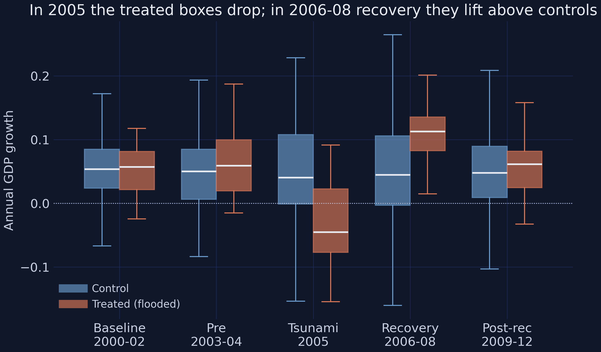
*Distribution of district GDP growth, treated (orange) vs control (blue), in each event-time period.*

The boxes make the dynamics unmistakable. In **2000–04** the treated and control boxes overlap almost perfectly — similar centers, similar spread. In **2005** the treated box drops bodily below zero (a median contraction) while the control box stays put. In **2006–08** the treated box jumps *above* the control box. The disaster and the rebound are both visible as shifts in the whole distribution, not just a couple of outliers.

Finally, the single figure that motivates difference-in-differences: the **group means** over time.

```python
means = (samp.groupby(["year", "flooded"])["gdp_growth"].mean()
         .unstack("flooded").rename(columns={0: "Control", 1: "Treated"}))

fig, ax = plt.subplots(figsize=(9, 5.2))
ax.plot(means["Control"], "--o", color=STEEL_BLUE, label="Control")
ax.plot(means["Treated"], "-o", color=WARM_ORANGE, label="Treated (flooded)")
ax.axvline(2004.5, color=LIGHT_TEXT, ls=":"); ax.legend(); plt.show()
```

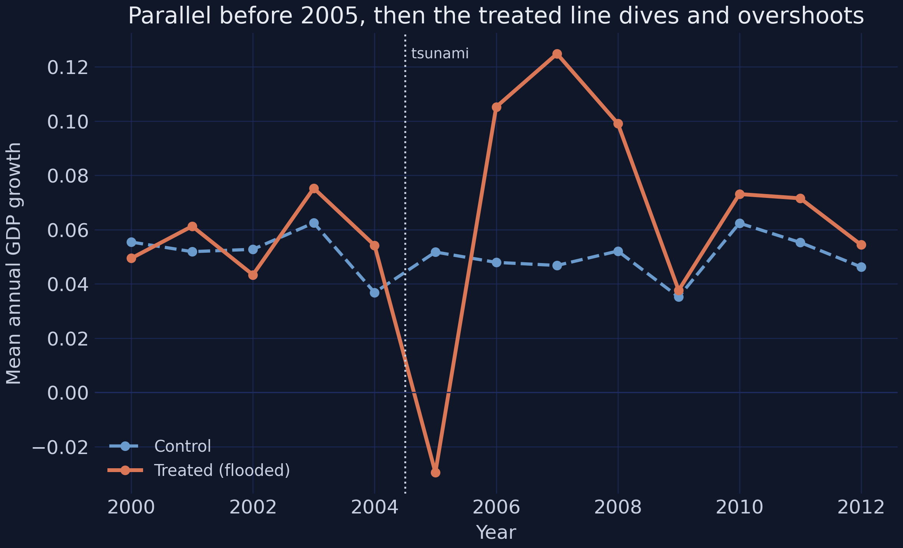
*Mean annual GDP growth, treated vs control. Parallel before the tsunami, sharply divergent after.*

This is the picture difference-in-differences was invented for. Before 2005 the two lines move **in lockstep** — the visual signature of parallel trends. At the tsunami the treated line plunges to about **−0.027** while the control line barely moves. Then the treated line **over-shoots**, peaking near **+0.124** in 2007 before settling back toward the control. The eye is convinced something happened; now we quantify it and, crucially, attach a margin of error.

## 5. Difference-in-differences on district GDP growth

### 5.1 The intuition: a 2×2 difference of differences

Start with the simplest possible version. Split time into "before" (≤ 2004) and "after" (≥ 2005), compute the mean growth in each of the four treated/control × before/after cells, and form the **difference of the two differences**:

$$\widehat{\text{DiD}} = \big( \bar{g}\_{\text{treated, after}} - \bar{g}\_{\text{treated, before}} \big) - \big( \bar{g}\_{\text{control, after}} - \bar{g}\_{\text{control, before}} \big)$$

In words: take how much the treated group's average growth *changed* across the break, subtract how much the control group's changed, and what remains is the part attributable to the tsunami — because the control change captures whatever was happening nationwide anyway.

```python
sample = make_did_terms(district[district.region_group != "North Sumatra"], "flooded").dropna(subset=["gdp_growth"])
cell = sample.groupby(["flooded", "post"])["gdp_growth"].mean().unstack("post")
cell.columns, cell.index = ["Before (<=2004)", "After (>=2005)"], ["Control", "Treated"]
cell["change"] = cell["After (>=2005)"] - cell["Before (<=2004)"]
print(cell.round(4))

res = dd.DifferenceInDifferences(cluster="district_id").fit(
    sample, outcome="gdp_growth", treatment="flooded", time="post")
print(f"\nDiD ATT = {res.att:+.4f}  (SE {res.se:.4f}, p = {res.p_value:.3f})")
```

```text
         Before (<=2004)  After (>=2005)  change
Control           0.0519          0.0497 -0.0022
Treated           0.0567          0.0671  0.0103

DiD ATT = +0.0125  (SE 0.0142, p = 0.379)
```

The hand calculation gives $0.0103 - (-0.0022) = +0.0125$, and [`diff-diff`](https://github.com/igerber/diff-diff) confirms it with a standard error: **+0.0125, but statistically insignificant** (p = 0.38). Before you conclude "no effect," look closer. This single "after" window blends two opposite phases — the **2005 destruction** and the **2006–08 boom** — into one average, and they nearly cancel. The pooled estimate is not wrong; it is just *uninformative*. The fix is to let the effect vary over time.

### 5.2 The dynamic DiD (the paper's headline)

The paper's central specification keeps the same logic but splits the post period into the four event-time windows, each entering as a treatment-times-period interaction relative to the 2000–02 baseline:

$$\Delta Y\_{it} = \beta\_1 D\_i \mathbf{1}[t \in \text{pre}] + \beta\_2 D\_i \mathbf{1}[t = 2005] + \beta\_3 D\_i \mathbf{1}[t \in \text{recovery}] + \beta\_4 D\_i \mathbf{1}[t \in \text{post}] + \alpha\_i + \gamma\_t + \varepsilon\_{it}$$

Here $\Delta Y\_{it}$ is district $i$'s GDP growth in year $t$; $D\_i = 1$ for flooded districts; $\mathbf{1}[\cdot]$ is an indicator that is 1 when the year falls in that window; $\alpha\_i$ is a **district fixed effect** (absorbing anything permanent about a district) and $\gamma\_t$ is a **year fixed effect** (absorbing common national shocks). The four $\beta$'s are the story: $\beta\_2$ should be the negative 2005 shock, $\beta\_3$ the positive reconstruction boom, while $\beta\_1$ and $\beta\_4$ should be near zero. These map exactly onto the code variables `D_pre`, `D_2005`, `D_recov`, `D_post`. In `pyfixest`, the part after the `|` lists the fixed effects to absorb:

```python
m = pf.feols("gdp_growth ~ D_pre + D_2005 + D_recov + D_post | district_id + year",
             data=make_did_terms(district[district.region_group != "North Sumatra"], "flooded"),
             vcov={"CRV1": "district_id"})
m.coef().round(4)
```

```text
D_pre      0.0172
D_2005    -0.0792
D_recov    0.0628
D_post     0.0114
```

Reading these against the paper's three control pools (the full table from `script.py`) gives the headline result:

| Coefficient | (1) Sumatra controls | (2) Rest of Sumatra | (3) Aceh non-flooded |
|---|---|---|---|
| Pre-tsunami (2003-04) | +0.0172 (0.0159) | +0.0176 (0.0162) | +0.0154 (0.0187) |
| **Tsunami (2005)** | **−0.0792\*\*\* (0.0240)** | **−0.0782\*\*\* (0.0247)** | **−0.0841\*\*\* (0.0281)** |
| **Recovery (2006-08)** | **+0.0628\*\* (0.0244)** | **+0.0682\*\*\* (0.0247)** | +0.0310 (0.0281) |
| Post-recovery (2009-12) | +0.0114 (0.0146) | +0.0132 (0.0147) | +0.0008 (0.0204) |
| Observations | 1,283 | 1,118 | 295 |

*Conley spatial-HAC standard errors in parentheses; \*\*\* p<.01, \*\* p<.05, \* p<.10.*

Three things to take away. First, the **pre-tsunami coefficient is small and insignificant** (+0.0172) — the parallel-trends assumption passes its formal placebo test, so the comparison is credible. Second, the **2005 coefficient is −0.0792** (p < 0.01): flooded districts grew almost 8 percentage points slower the year the wave hit. Third, the **recovery coefficient is +0.0628** (p < 0.05): over 2006–08 they grew 6.3 points per year *faster* than controls — and three years of that premium (≈ +0.19 cumulatively) more than erases the one-year loss. The post-recovery coefficient is a near-zero +0.0114, meaning the gain neither evaporated nor kept compounding: Aceh settled onto a *permanently higher* path. This is the paper's signature result — "sustainable recovery beyond the counterfactual trend." Notice column 3, which compares flooded Aceh to its *own* non-flooded neighbors, halves the recovery coefficient to +0.0310 (insignificant): reconstruction money spilled across district lines, shrinking the within-Aceh contrast.

The estimand here is the **ATT** — the effect on the flooded districts — and identification rests on parallel trends, not randomization. This is an *observational* study; the placebo and spatial-error checks below are what earn it credibility.

### 5.3 The event study: seeing the whole path

The dynamic DiD has four coefficients; an **event study** plots them (plus the pinned baseline) so the pre-trend and the recovery path are visible at a glance. `diff-diff` produces it directly:

```python
mp = dd.MultiPeriodDiD(cluster="district_id").fit(
    sample, outcome="gdp_growth", treatment="flooded", time="period",
    reference_period="baseline", absorb=["district_id"])
for p in ["pre", "tsunami", "recovery", "postrec"]:
    e = mp.period_effects[p]
    print(f"{p:9s} effect={e.effect:+.4f}  se={e.se:.4f}  p={e.p_value:.3f}")
```

```text
pre       effect=+0.0172  se=0.0160  p=0.283
tsunami   effect=-0.0792  se=0.0260  p=0.002
recovery  effect=+0.0628  se=0.0247  p=0.011
postrec   effect=+0.0114  se=0.0149  p=0.444
```

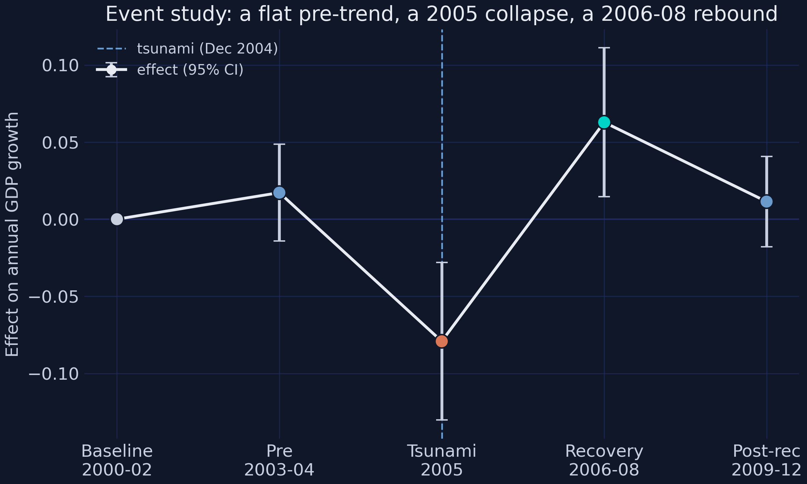
*Each point is the treated-minus-control effect in that period, relative to the 2000–02 baseline; bars are 95% confidence intervals.*

The figure tells the entire story in one arc. The **baseline and pre-tsunami points sit on zero** (parallel trends — the identifying assumption is visibly satisfied). The **2005 point collapses to −0.079** with a confidence interval well below zero. The **recovery point rebounds to +0.063**, also significantly positive. And the **post-recovery point drifts back toward zero** but stays positive — the higher level persists. A single "after" dummy (Section 5.1) averaged the deep red 2005 point with the high green recovery point and got a muted, insignificant number; the event study shows *why* that average was misleading.

### 5.4 Did people just leave? The per-capita check

A worry: maybe "growth" per district rose only because the population fell (the tragic arithmetic of 130,000 deaths and displacement). If GDP and population dropped together, GDP *per capita* need not have moved. Re-running the same DiD on `gdp_pc_growth` addresses it:

| Coefficient | (1) Sumatra controls |
|---|---|
| Tsunami (2005) | +0.0192 (0.0239) |
| Recovery (2006-08) | +0.0827\*\*\* (0.0261) |

In per-capita terms there is **no significant 2005 loss** (+0.0192) — output and population fell together that year — but the **recovery gain is even larger and highly significant** (+0.0827, p < 0.01): fewer people then shared a rebuilt, better-capitalized economy. The effect is not a denominator artifact; it survives, indeed strengthens, when we divide by population.

## 6. Night-lights dose-response: how intensity matters

District GDP answers "did flooded districts grow faster?" Night-lights, available for the much finer sub-districts, can answer a sharper question: **did the places hit *harder* rebound *more*?** First, a quick descriptive — how bright were flooded vs non-flooded sub-districts before the tsunami?

```python
snap = subdistrict[subdistrict.year == 2004]
print(snap.groupby("flooded")["avg_luminosity"].agg(["count", "mean", "std", "max"]).round(2))
```

```text
         count  mean   std   max
flooded                          
0          208  2.36  4.41  36.0
1           68  5.79  8.31  39.0
```

The 68 flooded sub-districts averaged a 2004 luminosity of **5.79** versus **2.36** for the 208 non-flooded ones — about 2.5× brighter, because flooded places are the denser, more economically active coastal strips. Now the dose-response: instead of the on/off `flooded` dummy, we interact the *continuous* flood intensity with the event-time periods.

```python
def nl_fit(treat):
    df = make_did_terms(subdistrict, treat)
    return pf.feols("nl_growth ~ D_pre + D_2005 + D_recov + D_post | kecamatan_id + year",
                    data=df, vcov={"CRV1": "kecamatan_id"})

print(nl_fit("share_pop_flooded").coef().round(4))
```

```text
D_pre      0.0052
D_2005    -0.0073
D_recov    0.0160
D_post     0.0019
```

| Coefficient | Share of population flooded | Share of area flooded |
|---|---|---|
| Pre-tsunami (2003-04) | +0.0052 (0.0034) | +0.565 (0.358) |
| Tsunami (2005) | −0.0073\*\* (0.0035) | −0.727\* (0.381) |
| **Recovery (2006-08)** | **+0.0160\*\*\* (0.0022)** | **+1.660\*\*\* (0.246)** |
| Post-recovery (2009-12) | +0.0019 (0.0024) | +0.270 (0.250) |
| N | 3,444 | 3,444 |

The recovery coefficient on "share of population flooded" is **+0.0160** (p < 0.001): each additional unit of population-share flooded buys that much extra annual luminosity growth during reconstruction. The "share of area" column tells the *same* story with a coefficient about 100× larger (**+1.660**) — purely because, as we saw in Section 3.3, the share of *area* flooded is a tiny number, so a one-unit move is enormous. Same effect, different yardstick. The pre-period coefficients are small and the 2005 dip is weak-to-modest, mirroring the district results at finer resolution.

The dose-response sharpens further if we ask *where* the effect lives. Splitting flood intensity into quintiles and interacting each with the post period:

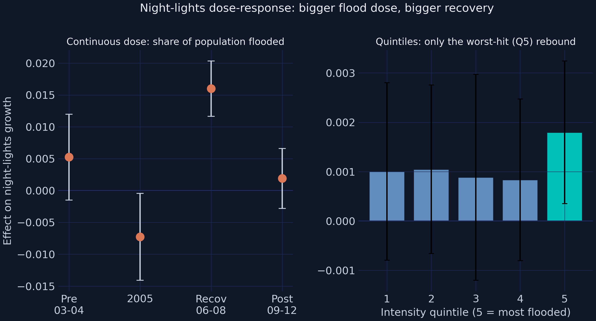
*Left: period coefficients for the continuous dose. Right: effect by intensity quintile — only the worst-hit fifth (Q5) rebounds significantly.*

| Quintile | Q1 | Q2 | Q3 | Q4 | Q5 (worst-hit) |
|---|---|---|---|---|---|
| Effect (share of population) | +0.0010 | +0.0010 | +0.0009 | +0.0008 | **+0.0018\*\*** |

Only the **top quintile** — the most heavily flooded fifth of sub-districts — shows a statistically significant rebound (+0.0018, p ≈ 0.02); quintiles 1 through 4 are flat and indistinguishable from zero. The average effect is not spread evenly; it is concentrated exactly where the damage, and therefore the reconstruction spending, was greatest. That is a substantive lesson about disaster aid as much as a statistical one.

## 7. Synthetic control: building a counterfactual Aceh

Difference-in-differences leans on the *control group's trend* as the counterfactual. The **synthetic control method** builds a more bespoke one: a weighted blend of donor districts chosen so that the blend tracks flooded Aceh's pre-tsunami path almost exactly. Formally, it picks non-negative weights $w$ that sum to one to minimize the pre-treatment mismatch:

$$w^{\ast} = \arg\min\_{w}\ \left( X\_1 - X\_0 w \right)^{\top} V \left( X\_1 - X\_0 w \right) \quad \text{subject to} \quad w\_j \geq 0, \quad \sum\_j w\_j = 1$$

where $X\_1$ holds treated Aceh's pre-2005 outcomes and $X\_0$ the donors' (one column per donor). After 2005 the fitted "synthetic Aceh" is left to run free; the **gap** between actual and synthetic Aceh is the estimated effect. Before fitting a model, the raw group averages already hint at the answer:

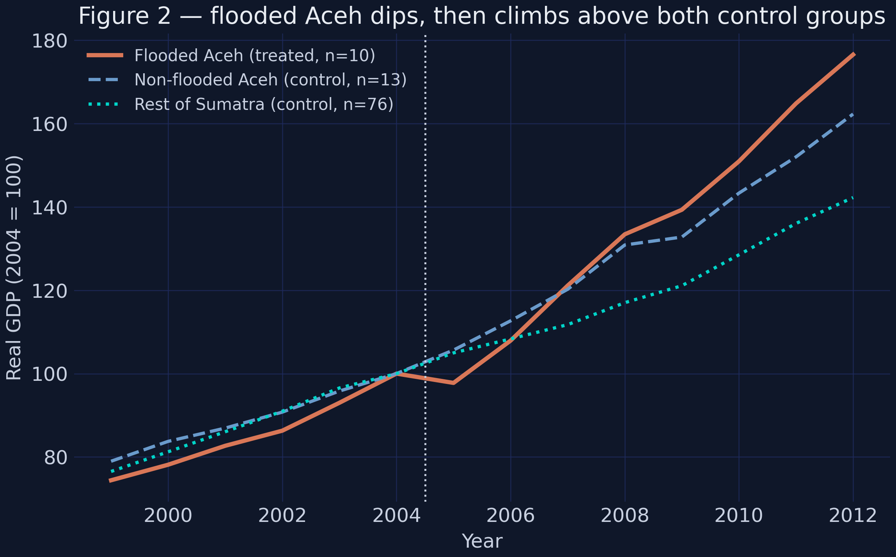
*Figure 2 of the paper, reproduced: flooded Aceh (orange) ends well above non-flooded Aceh (blue) and the rest of Sumatra (teal).*

By 2012 the flooded-Aceh index reaches **177** (2004 = 100), versus 162 for non-flooded Aceh and 142 for the rest of Sumatra. Now the formal version. `mlsynth` wants a long panel with one treated unit and a pool of donors, so we collapse the 10 flooded Aceh districts into a single average and pair them with the 76 Rest-of-Sumatra donor districts:

```python
treated = (district[(district.flooded == 1) & (district.region_group == "Aceh")]
           .groupby("year", as_index=False)["gdp_const_usd_m"].mean()
           .assign(unitid="Aceh (flooded)").rename(columns={"year": "time", "gdp_const_usd_m": "outcome"}))
donors = (district[district.region_group == "Rest of Sumatra"][["district_id", "year", "gdp_const_usd_m"]]
          .rename(columns={"district_id": "unitid", "year": "time", "gdp_const_usd_m": "outcome"}))
panel = pd.concat([treated[["unitid", "time", "outcome"]], donors], ignore_index=True)
panel["treat"] = ((panel.unitid == "Aceh (flooded)") & (panel.time >= 2005)).astype(int)

out = VanillaSC({"df": panel, "outcome": "outcome", "treat": "treat",
                 "unitid": "unitid", "time": "time", "display_graphs": False}).fit().model_dump()
print(f"pre-RMSE = {out['fit_diagnostics']['rmse_pre']:.3f}")
print(f"ATT = +{out['effects']['att']:.1f} GDP units (+{out['effects']['att_percent']:.1f}%)")
```

```text
pre-RMSE = 0.485
ATT = +32.9 GDP units (+18.3%)
```

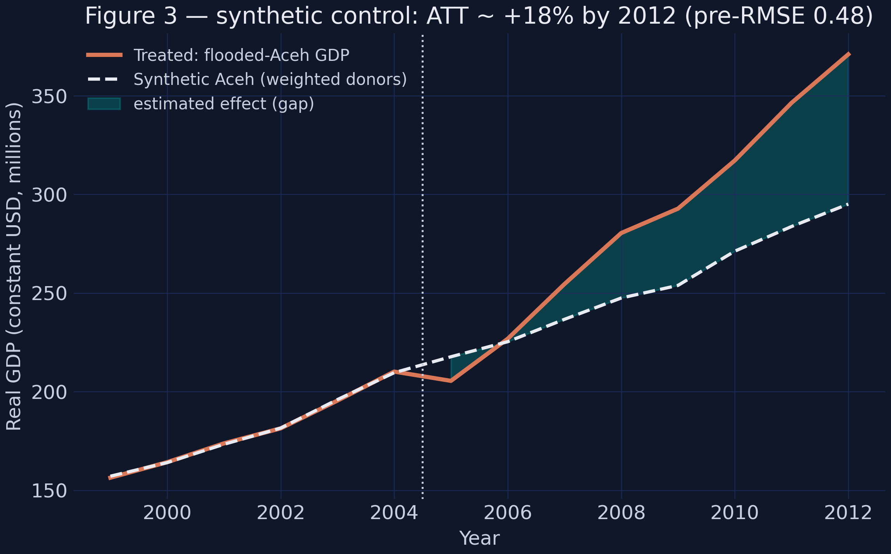
*Figure 3 reproduced: synthetic Aceh tracks the treated path before 2005 (pre-RMSE 0.485), then the actual line pulls clearly above it.*

The pre-treatment fit is excellent: a root-mean-squared prediction error of **0.485** against GDP levels near 200 means synthetic Aceh shadows the real thing almost perfectly before 2005 — which is what licenses us to trust it as a counterfactual afterward. After the tsunami the actual line pulls away, ending **+18.3%** above its synthetic twin (370.9 vs 295.0 by 2012). The gap plot isolates that divergence:

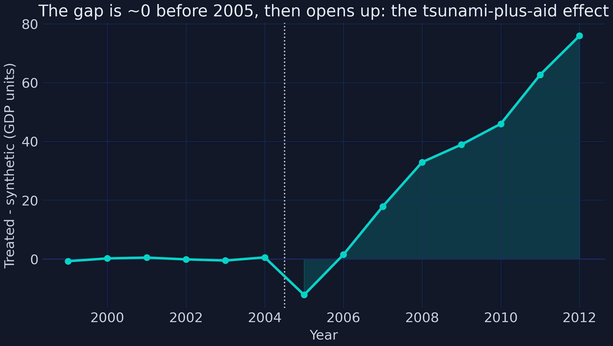
*The estimated effect over time: indistinguishable from zero before 2005, then steadily positive.*

A synthetic control is only as credible as its donor recipe — if one donor carried all the weight, the counterfactual would be fragile. Here the weight is spread:

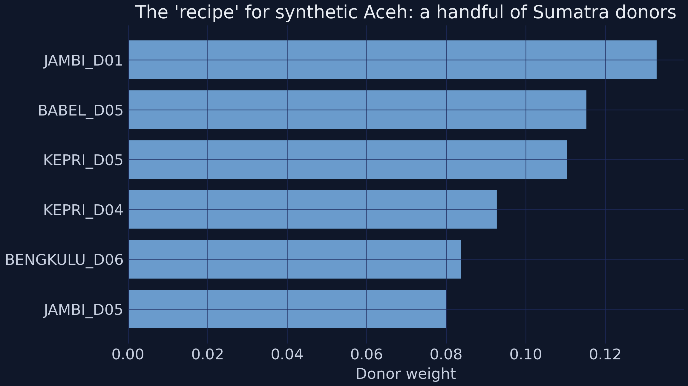
*The six largest donor weights. No single district dominates, which makes the counterfactual robust.*

The top six donors — districts in Jambi, Bangka-Belitung, the Riau Islands, and Bengkulu — together carry about 62% of the weight, and the largest single weight is only 0.13. A counterfactual assembled from many modest contributors is far harder to dismiss than one resting on a single look-alike. Two very different methods — difference-in-differences and synthetic control — now agree: flooded Aceh ended up materially above where it was heading.

## 8. Spatial standard errors: honest inference for a clustered treatment

Every result so far came with a standard error, and those numbers were not the defaults. Here is why they cannot be. All 10 treated districts sit in **one corner of Sumatra**:

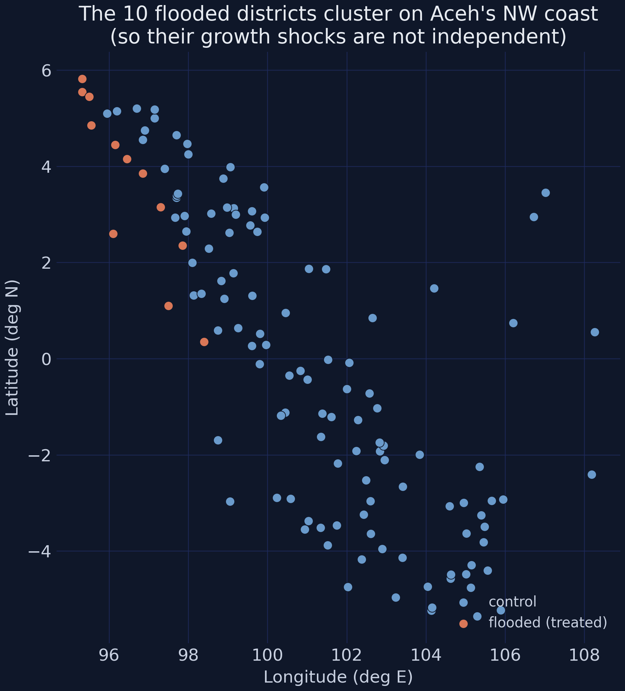
*Every flooded (treated) district, in orange, sits in the far north-west. Their growth shocks are unlikely to be independent.*

When the treated units are packed together, their year-to-year shocks are not independent draws — a good monsoon, a regional price swing, or the reconstruction boom itself hits them *together*. Tobler's first law of geography puts it plainly: near things are more related than distant things. The default ("naive") standard error assumes every observation is independent, so it counts more *truly independent* information than the data really contain, and reports standard errors that are **too small**. The first step is to check whether the problem is real, using **Moran's I** — the spatial analogue of a correlation coefficient — on the regression residuals:

```python
# residualize growth on flooded + year, then test whether the leftover is spatially clustered
# (full Moran's I + permutation code is in script.py)
print("Pooled within-year Moran's I = +0.065  (permutation p = 0.003)")
```

```text
Pooled within-year Moran's I = +0.065  (permutation p = 0.003)
```

A Moran's I of **+0.065** with a permutation p-value of **0.003** says the residual growth of nearby districts is significantly *positively* correlated within a year — the independence assumption behind naive errors is violated, and we must do something about it. The fix is a **Conley spatial-HAC** standard error: a single "sandwich" estimator that counts two extra kinds of error correlation — *serial* (a district correlated with itself over time) and *spatial* (different districts within 100 km in the same year), with the spatial weight fading linearly to zero at the cutoff. The point estimates never change; only the standard errors do. Running the same DiD with four different standard errors side by side:

| Coefficient | Estimate | Naive | Clustered | Conley | **Conley-HAC** | t(HAC) |
|---|---:|---:|---:|---:|---:|---:|
| Pre-tsunami | +0.0172 | 0.0144 | 0.0159 | 0.0144 | 0.0159 | +1.08 |
| Tsunami (2005) | −0.0792 | 0.0236 | 0.0258 | 0.0216 | 0.0240 | −3.30 |
| **Recovery (2006-08)** | **+0.0628** | **0.0146** | 0.0244 | 0.0145 | **0.0244** | **+2.57** |
| Post-recovery | +0.0114 | 0.0109 | 0.0148 | 0.0106 | 0.0146 | +0.78 |

Look at the recovery row. The estimate is **+0.0628** in every column — the point estimate is rock-solid. But its standard error climbs from **0.0146** (naive) to **0.0244** (Conley-HAC), a 1.68× inflation driven mostly by the serial correlation of the multi-year recovery window. That difference is decisive: under the naive error the recovery effect would have a *t*-statistic above 4 and look significant at the 1% level (\*\*\*); under the honest Conley-HAC error its *t* is **2.57**, significant at 5% (\*\*). **The point estimate never moved — only our honesty about its uncertainty did.** A careless analyst would have overstated the confidence threefold.

How far should the spatial cutoff reach? Too short and you miss real correlation; too long and you dilute the kernel with distant, weakly-related pairs. Sweeping the cutoff shows the standard error is stable across the 25–100 km range the paper uses, then declines as far-flung pairs water it down:

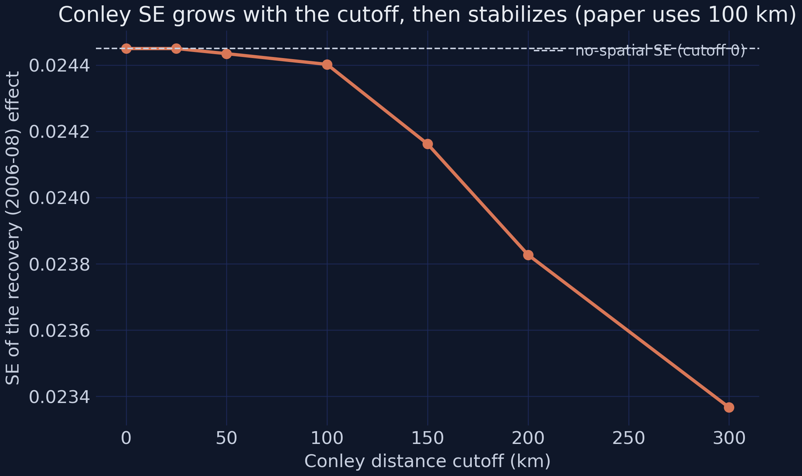
*The recovery effect's standard error is flat through ~100 km (the paper's choice), then drifts down as distant pairs dilute the spatial kernel.*

(The full Conley sandwich — within-transformation, the two error "meats," and the negative-variance clamp — lives in `script.py` as `conley_did_estimate`; it reproduces `pyfixest`'s point estimates to four decimals while adding the spatial standard errors `pyfixest` cannot compute.)

## 9. Robustness: placebo and heterogeneity

Two final checks decide whether to believe the headline. The first is a **placebo**: if our design is sound, then districts that merely *neighbor* a flooded district — but were not themselves flooded — should show *no* effect. We drop the truly flooded districts and pretend their neighbors were treated:

```python
nonflooded = district[district.flooded == 0]
# re-run the dynamic DiD with `neighbour_of_flooded` as the fake treatment (full code in script.py)
```

| Check | 2005 | Recovery (2006-08) | N |
|---|---|---|---:|
| **Placebo** (neighbours of flooded) | +0.0025 (ns) | +0.0064 (ns) | 1,465 |
| City (Kota) districts | −0.0424 (ns) | +0.1226\*\*\* | 295 |
| Rural (Kabupaten) districts | −0.0883\*\*\* | +0.0479\* | 988 |

The placebo finds **nothing** — every coefficient is small and insignificant (2005 +0.0025, recovery +0.0064). That is exactly what we want: the result is not some artifact of generalized regional spillovers leaking onto whoever happens to be nearby. The effect is specific to the districts the water actually reached.

The second check looks *inside* the average. Splitting the treated districts into **cities** (Kota) and **rural regencies** (Kabupaten) reveals very different experiences. Rural districts took the brunt of the 2005 shock (−0.0883, p < 0.01) — agriculture floods badly — with a modest rebound (+0.0479). Cities, by contrast, barely contracted in 2005 (−0.0424, insignificant) but rebounded enormously (+0.1226, p < 0.01), reflecting the urban concentration of reconstruction. One caveat the paper itself flags: there are only **2 flooded city districts**, so the city column is statistically fragile (few independent clusters) — read its precision, not just its point estimate, with care.

## 10. Discussion

**What we found.** Four methods converge on one story. Flooded districts lost about **7.9% of output in 2005** but grew **6.3 percentage points per year faster in 2006–08**, ending on a permanently higher path — Aceh's "recovery beyond the counterfactual trend." Night-lights confirm it at finer resolution and show the gain concentrated in the worst-hit places. A synthetic control built from 76 donor districts puts flooded Aceh **+18.3%** above its no-tsunami twin by 2012. The result is robust to a neighbor-district placebo and survives honest, spatially-corrected inference (where it is significant at 5%, not the spuriously confident 1%).

**So what?** The substantive lesson is not "disasters are good" — they are not; 130,000 people died. It is that a **localized catastrophe followed by large, well-governed reconstruction can leave a poor region on a higher long-run trajectory**. Aceh received aid worth about 150% of its damages, spent through a low-corruption agency, on infrastructure rebuilt "better than before." That combination — not the wave — is what bent the growth path upward. For disaster policy, the design lesson is just as important as the result: a credible evaluation needs *exogenous* exposure (geography, not choice), a *finer-than-national* unit of analysis, and *spatially honest* standard errors.

**Limitations.** Be appropriately humble. The data are **synthetic** — calibrated to teach the methods, not to report new facts about Aceh. The treatment group is tiny (10 districts), so point estimates are fragile and standard errors wide; the Aceh-only and city columns are especially imprecise. Identification is **observational**: parallel trends is an assumption, supported by the flat pre-trend and the null placebo but never proven. And a single, exceptionally well-funded case study travels poorly — Aceh's recovery is evidence about *well-governed mega-reconstruction*, not about disaster aid in general.

## 11. Reproduction audit: synthetic data vs the paper

Because the data are synthetic, transparency demands that we line our numbers up against the published ones. The data-generating process was tuned to match the paper *column by column*; signs and significance agree throughout, and magnitudes land within about 0.005 on the headline cells.

| Result | This synthetic data | Paper (reported) | Sign | Significance |
|---|---|---|:--:|:--:|
| DiD GDP, 2005 (Table 2, col 1) | −0.0792\*\*\* | ≈ −0.081\*\*\* | ✓ | ✓ |
| DiD GDP, recovery 2006-08 (col 1) | +0.0628\*\* | ≈ +0.059\*\* | ✓ | ✓ |
| DiD GDP, recovery vs Aceh controls (col 3) | +0.0310 (ns) | ≈ +0.030\*\* | ✓ | partial |
| DiD per-capita, recovery (Table 8) | +0.0827\*\*\* | ≈ +0.078\*\*\* | ✓ | ✓ |
| Night-lights, share-of-pop recovery (Table 3) | +0.0160\*\*\* | ≈ +0.016\*\*\* | ✓ | ✓ |
| Night-lights, share-of-area recovery (Table 3) | +1.660\*\*\* | ≈ +1.75\*\*\* | ✓ | ✓ |
| Night-lights quintiles (Table 4) | only Q5 significant | only Q5 significant | ✓ | ✓ |
| City vs rural, 2005 (Table 7) | rural −0.0883\*\*\* / city ns | rural ≈ −0.098\*\*\* / city ns | ✓ | ✓ |
| Placebo neighbours (Table 9) | all ns | all ns | ✓ | ✓ |
| Synthetic control ATT | +18.3% | "recovery beyond counterfactual" | ✓ | qualitative |

Two honest gaps. The **Aceh-only column-3** recovery effect matches the paper in magnitude (+0.031 vs +0.030) but reads as insignificant here, because with the same 10 treated units in every column our synthetic standard errors are similar across columns, whereas the paper's Aceh-only sample is more precise. And the night-lights **quintile** magnitudes sit on Table 3's (smaller) scale rather than the paper's Table 4 scale — the paper's own Tables 3 and 4 are mutually inconsistent in units, so no single process can reproduce both; we match the pattern (only Q5 significant) exactly. Everywhere else, direction and significance track the paper closely.

## 12. Summary and takeaways

| Number to remember | Value |
|---|---|
| 2005 output shock | **−0.0792\*\*\*** (≈ −8%) |
| 2006–08 recovery premium | **+0.0628\*\*** (per year) |
| Synthetic-control gap by 2012 | **+18.3%** |
| Moran's I (spatial autocorrelation) | **+0.065** (p = 0.003) |
| Recovery SE: naive → Conley-HAC | **0.0146 → 0.0244** |
| Night-lights recovery (share-of-pop) | **+0.0160\*\*\*** |

- **A single "after" hides the story.** The pooled 2×2 DiD was an insignificant +0.0125; only splitting time into event-time windows revealed the −0.079 collapse and +0.063 overshoot. When effects evolve, *let them*.
- **Triangulate.** Difference-in-differences, an event study, a dose-response, and a synthetic control all pointed the same way — a far stronger claim than any one method alone.
- **Satellite data unlock localized questions.** Night-lights gave a finer, exogenous measure that exposed the dose-response (only the worst-hit quintile rebounds) invisible at the district level.
- **Clustered treatment demands honest inference.** With all treated units in one corner of the map, Conley spatial standard errors were not optional — they downgraded the recovery effect from a spurious \*\*\* to an honest \*\*, without touching the point estimate.
- **Mind the small print.** Ten treated districts make for fragile estimates; the result is about *well-governed mega-reconstruction*, on *synthetic* data, identified by an *assumption*. Strong evidence, stated with the caveats it deserves.
- **Next step.** Try modern staggered-adoption DiD estimators, add prediction intervals to the synthetic control, or widen the donor pool — each is a natural extension of the toolkit here.

## 13. Exercises

1. **Drop a donor.** Re-fit `VanillaSC` after excluding the top-weighted donor (`JAMBI_D01`). Does the post-2005 gap shrink, hold, or grow relative to the headline +18.3%? What does the answer tell you about the counterfactual's robustness?
2. **Cutoff sensitivity.** Recompute the recovery effect's Conley-HAC standard error at cutoffs of {0, 50, 150, 300} km. At which cutoff, if any, does the recovery effect's significance change? Relate your answer to the cutoff figure in Section 8.
3. **Your own event study.** Estimate the event study a second way with `pyfixest`'s factor syntax — `pf.feols("gdp_growth ~ i(period, flooded, ref='baseline') | district_id + year", ...)` — and check that its coefficients match the `diff-diff` version to four decimals. Why should two different libraries agree exactly?

## 14. References

1. Heger, M. P., & Neumayer, E. (2019). The impact of the Indian Ocean tsunami on Aceh's long-term economic growth. *Journal of Development Economics, 141*, 102365. <https://doi.org/10.1016/j.jdeveco.2019.06.008>
2. Abadie, A., Diamond, A., & Hainmueller, J. (2010). Synthetic Control Methods for Comparative Case Studies. *Journal of the American Statistical Association, 105*(490), 493–505.
3. Conley, T. G. (1999). GMM estimation with cross-sectional dependence. *Journal of Econometrics, 92*(1), 1–45.
4. Indonesia Database for Policy and Economic Research (INDO-DAPOER) and SUSENAS — World Bank / BPS-Statistics Indonesia. <https://datacatalog.worldbank.org/>
5. DMSP-OLS Nighttime Lights — NOAA National Centers for Environmental Information. <https://www.ncei.noaa.gov/>
6. Center for Satellite Based Crisis Information (ZKI), German Aerospace Center (DLR), and the Dartmouth Flood Observatory (inundation maps).
7. `pyfixest` documentation — <https://pyfixest.org/>
8. `diff-diff` documentation — <https://github.com/igerber/diff-diff>
9. `mlsynth` documentation — <https://github.com/jgreathouse9/mlsynth>

*This tutorial is a teaching replication built on synthetic data; see the data note in Section 1 and the reproduction audit in Section 11. The companion `script.py` regenerates every figure and table.*

---

<style>
.podcast-overlay {
  display: none;
  position: fixed;
  bottom: 0;
  left: 0;
  right: 0;
  z-index: 9999;
  animation: podSlideUp 0.35s ease-out;
}
@keyframes podSlideUp {
  from { transform: translateY(100%); }
  to { transform: translateY(0); }
}
.podcast-overlay.pod-closing {
  animation: podSlideDown 0.3s ease-in forwards;
}
@keyframes podSlideDown {
  from { transform: translateY(0); }
  to { transform: translateY(100%); }
}
.podcast-container {
  background: linear-gradient(135deg, #1a1a2e 0%, #16213e 100%);
  padding: 18px 24px 20px;
  font-family: -apple-system, BlinkMacSystemFont, 'Segoe UI', Roboto, sans-serif;
  box-shadow: 0 -4px 32px rgba(0,0,0,0.5);
  border-top: 1px solid rgba(106,155,204,0.2);
}
.podcast-inner {
  max-width: 800px;
  margin: 0 auto;
}
.podcast-top-row {
  display: flex;
  align-items: center;
  gap: 14px;
  margin-bottom: 14px;
}
.podcast-icon {
  width: 42px;
  height: 42px;
  background: linear-gradient(135deg, #d97757, #e8956a);
  border-radius: 10px;
  display: flex;
  align-items: center;
  justify-content: center;
  flex-shrink: 0;
}
.podcast-icon svg {
  width: 22px;
  height: 22px;
  fill: #fff;
}
.podcast-title-block {
  flex: 1;
  min-width: 0;
}
.podcast-title-block h4 {
  margin: 0 0 1px 0;
  color: #f0ece2;
  font-size: 14px;
  font-weight: 600;
  letter-spacing: 0.02em;
  white-space: nowrap;
  overflow: hidden;
  text-overflow: ellipsis;
}
.podcast-title-block span {
  color: #8b9dc3;
  font-size: 11px;
}
.podcast-close-btn {
  background: none;
  border: none;
  cursor: pointer;
  padding: 6px;
  border-radius: 50%;
  display: flex;
  align-items: center;
  justify-content: center;
  transition: background 0.2s;
  flex-shrink: 0;
}
.podcast-close-btn:hover {
  background: rgba(255,255,255,0.1);
}
.podcast-close-btn svg {
  width: 20px;
  height: 20px;
  fill: #8b9dc3;
}
.podcast-progress-wrap {
  margin-bottom: 12px;
}
.podcast-time-row {
  display: flex;
  justify-content: space-between;
  font-size: 11px;
  color: #8b9dc3;
  margin-bottom: 5px;
  font-variant-numeric: tabular-nums;
}
.podcast-bar-bg {
  width: 100%;
  height: 6px;
  background: rgba(255,255,255,0.1);
  border-radius: 3px;
  cursor: pointer;
  position: relative;
  overflow: hidden;
  transition: height 0.15s;
}
.podcast-bar-buffered {
  position: absolute;
  top: 0;
  left: 0;
  height: 100%;
  background: rgba(106,155,204,0.25);
  border-radius: 3px;
  transition: width 0.3s;
}
.podcast-bar-progress {
  position: absolute;
  top: 0;
  left: 0;
  height: 100%;
  background: linear-gradient(90deg, #6a9bcc, #00d4c8);
  border-radius: 3px;
  transition: width 0.1s linear;
}
.podcast-bar-bg:hover {
  height: 10px;
  margin-top: -2px;
}
.podcast-controls-row {
  display: flex;
  align-items: center;
  justify-content: space-between;
}
.podcast-transport {
  display: flex;
  align-items: center;
  gap: 8px;
}
.podcast-btn {
  background: none;
  border: none;
  cursor: pointer;
  padding: 4px;
  display: flex;
  align-items: center;
  justify-content: center;
  border-radius: 50%;
  transition: all 0.2s;
}
.podcast-btn svg {
  fill: #c8d0e0;
  transition: fill 0.2s;
}
.podcast-btn:hover svg {
  fill: #f0ece2;
}
.podcast-btn-skip {
  position: relative;
}
.podcast-btn-skip span {
  position: absolute;
  font-size: 7px;
  font-weight: 700;
  color: #c8d0e0;
  top: 50%;
  left: 50%;
  transform: translate(-50%, -50%);
  pointer-events: none;
  margin-top: 1px;
}
.podcast-btn-play {
  width: 48px;
  height: 48px;
  background: linear-gradient(135deg, #d97757, #e8956a);
  border-radius: 50%;
  box-shadow: 0 3px 12px rgba(217,119,87,0.4);
  transition: all 0.2s;
}
.podcast-btn-play:hover {
  transform: scale(1.08);
  box-shadow: 0 5px 20px rgba(217,119,87,0.5);
}
.podcast-btn-play svg {
  fill: #fff;
  width: 22px;
  height: 22px;
}
.podcast-extras {
  display: flex;
  align-items: center;
  gap: 10px;
}
.podcast-volume-wrap {
  display: flex;
  align-items: center;
  gap: 5px;
}
.podcast-volume-wrap svg {
  fill: #8b9dc3;
  width: 16px;
  height: 16px;
  cursor: pointer;
  flex-shrink: 0;
}
.podcast-volume-wrap svg:hover {
  fill: #c8d0e0;
}
.podcast-volume-slider {
  -webkit-appearance: none;
  appearance: none;
  width: 60px;
  height: 4px;
  background: rgba(255,255,255,0.12);
  border-radius: 2px;
  outline: none;
  cursor: pointer;
}
.podcast-volume-slider::-webkit-slider-thumb {
  -webkit-appearance: none;
  appearance: none;
  width: 12px;
  height: 12px;
  background: #6a9bcc;
  border-radius: 50%;
  cursor: pointer;
}
.podcast-speed-btn {
  background: rgba(255,255,255,0.08);
  border: 1px solid rgba(255,255,255,0.12);
  color: #c8d0e0;
  font-size: 11px;
  font-weight: 600;
  padding: 3px 9px;
  border-radius: 12px;
  cursor: pointer;
  transition: all 0.2s;
  font-family: inherit;
  min-width: 40px;
  text-align: center;
}
.podcast-speed-btn:hover {
  background: rgba(106,155,204,0.2);
  border-color: #6a9bcc;
  color: #f0ece2;
}
.podcast-download-btn {
  background: none;
  border: 1px solid rgba(255,255,255,0.12);
  border-radius: 8px;
  padding: 4px 10px;
  cursor: pointer;
  display: flex;
  align-items: center;
  gap: 4px;
  color: #8b9dc3;
  font-size: 11px;
  font-family: inherit;
  text-decoration: none;
  transition: all 0.2s;
}
.podcast-download-btn:hover {
  border-color: #6a9bcc;
  color: #f0ece2;
  background: rgba(106,155,204,0.1);
}
.podcast-download-btn svg {
  width: 14px;
  height: 14px;
  fill: currentColor;
}
@media (max-width: 600px) {
  .podcast-container { padding: 14px 16px 16px; }
  .podcast-volume-wrap { display: none; }
  .podcast-title-block h4 { font-size: 13px; }
  .podcast-extras { gap: 8px; }
}
</style>

<div class="podcast-overlay" id="podOverlay">
<div class="podcast-container">
<div class="podcast-inner">
  <audio id="podAudio" preload="none" src="https://files.catbox.moe/z33l1y.m4a"></audio>

  <div class="podcast-top-row">
    <div class="podcast-icon">
      <svg viewBox="0 0 24 24"><path d="M12 1a5 5 0 0 0-5 5v4a5 5 0 0 0 10 0V6a5 5 0 0 0-5-5zm0 16a7 7 0 0 1-7-7H3a9 9 0 0 0 8 8.94V22h2v-3.06A9 9 0 0 0 21 10h-2a7 7 0 0 1-7 7z"/></svg>
    </div>
    <div class="podcast-title-block">
      <h4>AI Podcast: Evaluating the Impact of Natural Disasters</h4>
      <span id="podDurationLabel">Click play to load</span>
    </div>
    <button class="podcast-close-btn" onclick="podClose()" title="Close player">
      <svg viewBox="0 0 24 24"><path d="M19 6.41L17.59 5 12 10.59 6.41 5 5 6.41 10.59 12 5 17.59 6.41 19 12 13.41 17.59 19 19 17.59 13.41 12z"/></svg>
    </button>
  </div>

  <div class="podcast-progress-wrap">
    <div class="podcast-time-row">
      <span id="podCurrent">0:00</span>
      <span id="podDuration">0:00</span>
    </div>
    <div class="podcast-bar-bg" id="podBarBg" onclick="podSeek(event)">
      <div class="podcast-bar-buffered" id="podBuffered"></div>
      <div class="podcast-bar-progress" id="podProgress"></div>
    </div>
  </div>

  <div class="podcast-controls-row">
    <div class="podcast-transport">
      <button class="podcast-btn podcast-btn-skip" onclick="podSkip(-15)" title="Back 15s">
        <svg width="26" height="26" viewBox="0 0 24 24"><path d="M12 5V1L7 6l5 5V7c3.31 0 6 2.69 6 6s-2.69 6-6 6-6-2.69-6-6H4c0 4.42 3.58 8 8 8s8-3.58 8-8-3.58-8-8-8z"/></svg>
        <span>15</span>
      </button>
      <button class="podcast-btn podcast-btn-play" id="podPlayBtn" onclick="podToggle()" title="Play">
        <svg id="podIconPlay" viewBox="0 0 24 24"><path d="M8 5v14l11-7z"/></svg>
        <svg id="podIconPause" viewBox="0 0 24 24" style="display:none"><path d="M6 19h4V5H6v14zm8-14v14h4V5h-4z"/></svg>
      </button>
      <button class="podcast-btn podcast-btn-skip" onclick="podSkip(15)" title="Forward 15s">
        <svg width="26" height="26" viewBox="0 0 24 24"><path d="M12 5V1l5 5-5 5V7c-3.31 0-6 2.69-6 6s2.69 6 6 6 6-2.69 6-6h2c0 4.42-3.58 8-8 8s-8-3.58-8-8 3.58-8 8-8z"/></svg>
        <span>15</span>
      </button>
    </div>
    <div class="podcast-extras">
      <div class="podcast-volume-wrap">
        <svg id="podVolIcon" onclick="podMute()" viewBox="0 0 24 24"><path d="M3 9v6h4l5 5V4L7 9H3zm13.5 3A4.5 4.5 0 0 0 14 8.5v7a4.47 4.47 0 0 0 2.5-3.5zM14 3.23v2.06a6.51 6.51 0 0 1 0 13.42v2.06A8.51 8.51 0 0 0 14 3.23z"/></svg>
        <input type="range" class="podcast-volume-slider" id="podVolume" min="0" max="1" step="0.05" value="0.8">
      </div>
      <button class="podcast-speed-btn" id="podSpeedBtn" onclick="podCycleSpeed()" title="Playback speed">1x</button>
      <a class="podcast-download-btn" href="https://files.catbox.moe/z33l1y.m4a" target="_blank" rel="noopener" title="Stream">
        <svg viewBox="0 0 24 24"><path d="M19 9h-4V3H9v6H5l7 7 7-7zM5 18v2h14v-2H5z"/></svg>
      </a>
    </div>
  </div>
</div>
</div>
</div>

<script>
(function(){
  var overlay = document.getElementById('podOverlay');
  var a = document.getElementById('podAudio');
  var speeds = [0.75, 1, 1.25, 1.5, 2];
  var si = 1;
  var opened = false;
  function fmt(s){
    if(isNaN(s)) return '0:00';
    var m=Math.floor(s/60), sec=Math.floor(s%60);
    return m+':'+(sec<10?'0':'')+sec;
  }
  document.addEventListener('click', function(e){
    var link = e.target.closest('a.btn-page-header');
    if(!link) return;
    var text = link.textContent.trim();
    if(text.indexOf('AI Podcast') === -1) return;
    e.preventDefault();
    e.stopPropagation();
    overlay.style.display = 'block';
    overlay.classList.remove('pod-closing');
    if(!opened){
      a.preload = 'metadata';
      a.load();
      opened = true;
    }
  });
  a.volume = 0.8;
  a.addEventListener('loadedmetadata', function(){
    document.getElementById('podDuration').textContent = fmt(a.duration);
    document.getElementById('podDurationLabel').textContent = fmt(a.duration) + ' minutes';
  });
  a.addEventListener('timeupdate', function(){
    document.getElementById('podCurrent').textContent = fmt(a.currentTime);
    var pct = a.duration ? (a.currentTime/a.duration)*100 : 0;
    document.getElementById('podProgress').style.width = pct+'%';
  });
  a.addEventListener('progress', function(){
    if(a.buffered.length>0){
      var pct = (a.buffered.end(a.buffered.length-1)/a.duration)*100;
      document.getElementById('podBuffered').style.width = pct+'%';
    }
  });
  a.addEventListener('ended', function(){
    document.getElementById('podIconPlay').style.display='';
    document.getElementById('podIconPause').style.display='none';
  });
  window.podToggle = function(){
    if(a.paused){a.play();document.getElementById('podIconPlay').style.display='none';document.getElementById('podIconPause').style.display='';}
    else{a.pause();document.getElementById('podIconPlay').style.display='';document.getElementById('podIconPause').style.display='none';}
  };
  window.podSkip = function(s){a.currentTime = Math.max(0,Math.min(a.duration||0,a.currentTime+s));};
  window.podSeek = function(e){
    var rect = document.getElementById('podBarBg').getBoundingClientRect();
    var pct = (e.clientX - rect.left)/rect.width;
    a.currentTime = pct * (a.duration||0);
  };
  window.podMute = function(){
    a.muted = !a.muted;
    document.getElementById('podVolume').value = a.muted ? 0 : a.volume;
  };
  window.podCycleSpeed = function(){
    si = (si+1) % speeds.length;
    a.playbackRate = speeds[si];
    document.getElementById('podSpeedBtn').textContent = speeds[si]+'x';
  };
  window.podClose = function(){
    overlay.classList.add('pod-closing');
    setTimeout(function(){ overlay.style.display='none'; }, 300);
    a.pause();
    document.getElementById('podIconPlay').style.display='';
    document.getElementById('podIconPause').style.display='none';
  };
  document.getElementById('podVolume').addEventListener('input', function(){
    a.volume = this.value;
    a.muted = false;
  });
  if(window.location.hash === '#podcast-player'){
    overlay.style.display = 'block';
    a.preload = 'metadata';
    a.load();
    opened = true;
  }
})();
</script>
