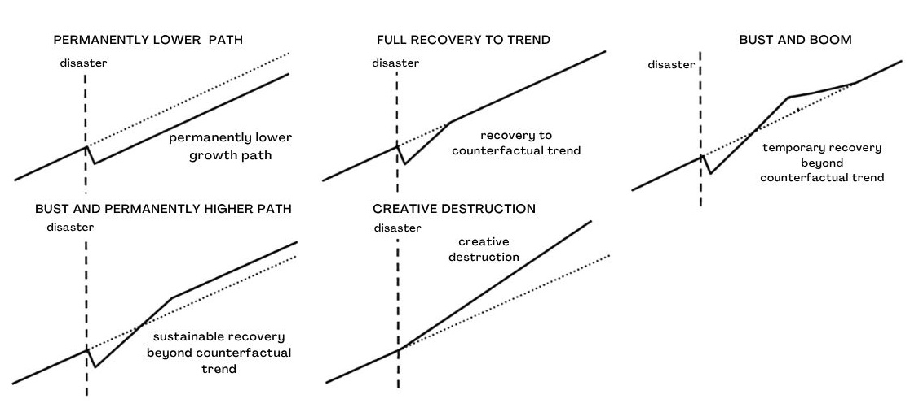

# Review: python_did_sc_tsunami Slide Deck

**Audited:** content/post/python_did_sc_tsunami/slides/
**Source of truth:** content/post/python_did_sc_tsunami/index.md + results_report.md
**Date:** 2026-08-04
**Audit version:** review-slides v1.0
**Focus:** all
**Browser pass:** skipped (--no-browser)

---

## Verdict: MAJOR REVISION

**Overall assessment.** The deck is technically and factually excellent — the static smoke test passes 15/15, both branding files are byte-identical to the canonical templates, and every one of the 31 numbers on a slide traces exactly to `results_report.md` or `index.md`. The single blocker is a title↔body contradiction on slide 6: the title promises "Six paths a shocked economy can take" while the figure below it shows **five** panels and the slide's own caption enumerates five (the same miscount is inherited from `index.md:95`, so the post needs the fix too). Strongest dimension is branding integrity (10/10, both diffs empty); weakest is title↔body consistency (4/10, floored by that one HIGH). Fix the word "Six" → "Five" on slide 6 and in `index.md:95`, and the deck drops straight to MINOR REVISION, where the remaining work is prose density on four text-heavy slides and the ten content slides that end without a `.takeaway` card.

**Audited 10 of 10 dimensions; the browser-only parts of Dimensions 3 (math typesetting) and 9 (960×700 overflow) are marked `[~]` and excluded.**

---

## Dimension scores

| #  | Dimension                     | Score / 10 | Issues  | Notes                                                    |
|----|-------------------------------|-----------:|--------:|----------------------------------------------------------|
| 1  | Source fidelity               | 7          | 0H/1M/0L | 31/31 numbers + 7/7 figures trace to source; one broadened claim |
| 2  | Conceptual correctness        | 9          | 0H/0M/1L | ATT named, parallel trends stated, no overclaiming; pp-vs-% slip |
| 3  | Technical & render correctness| 7          | 0H/1M/0L | smoke-test PASS 15/15; math render `[~]`; Unicode `≈`/`×` on slides |
| 4  | Title↔body consistency        | 4          | 1H/0M/0L | assertion-title test passes; slide 6 title miscounts the figure |
| 5  | Readability & simplicity      | 6          | 0H/2M/5L | 1 sentence >25 words, 4 prose-heavy slides, 2 long takeaways |
| 6  | Typos & grammar               | 8          | 0H/0M/2L | no misspellings; awkward possessive, unit-spacing drift    |
| 7  | write-slides design adherence | 6          | 0H/2M/3L | 3-act arc ok; Devil's-Advocate present; 10/19 slides lack takeaway |
| 8  | Branding integrity            | 10         | 0H/0M/0L | scss + title-slide diffs both empty; numeric strip, no arrows |
| 9  | Accessibility & legibility    | 9          | 0H/0M/1L | 7/7 figures captioned; overflow `[~]`; one equation unglossed |
| 10 | Deliverable completeness      | 9          | 0H/0M/1L | link `slides/index.html` ok; 54.7 KB html; name/icon off-spec |

Skipped dimensions show `—` in the score column with `not audited` in Notes.

---

## Issues found

| #  | Dim | Severity | Location                                              | Issue                                                                                     | Suggested fix                                                        |
|---:|----:|----------|-------------------------------------------------------|-------------------------------------------------------------------------------------------|----------------------------------------------------------------------|
| 1  | 4   | HIGH     | slide 6 — "Six paths a shocked economy can take" (slides.qmd:83) | `recoveryPaths.jpeg` contains **five** panels (permanently lower · full recovery to trend · bust and boom · bust and permanently higher · creative destruction); the slide's own caption also lists five. The title claims six. | Retitle to "Five paths a shocked economy can take"; also fix `index.md:95` ("Six archetypal trajectories") |
| 2  | 1   | MED      | slide 3 — slides.qmd:45                                | "the **largest disaster-reconstruction effort ever**" drops the source's qualifier; `index.md:86` says "single largest reconstruction effort ever directed at a **developing-world** disaster" | Restore the qualifier (see rewrite)                                   |
| 3  | 3   | MED      | slides.qmd:126, 243, 274                               | Literal Unicode math on slides: `≈` (126, 274) and `×` (243). `slide-mapping.md §Math symbols` requires LaTeX on-slide (`$\approx$`, `$\times$`); Unicode stays only in `::: {.notes}` | Replace with `$\approx$` and `$1.68\times$`; leave notes (166, 311) as-is |
| 4  | 5   | MED      | slide 6 — slides.qmd:85                                | 27-word sentence with a nested aside — above the ~25-word MED threshold                     | See rewrite below                                                     |
| 5  | 5   | MED      | slide 5 — slides.qmd:73, 77                            | Four stacked prose sentences carrying two unrelated ideas (geographic identification **and** the synthetic-data caveat) on one slide | Split into two slides; see rewrite below                              |
| 6  | 7   | MED      | deck-wide — slides 3, 5, 9, 10, 12, 13, 14, 15, 21, 22 | 10 of 19 content slides end without a `[…]{.takeaway .fragment}` card, including four substantive evidence slides (event study, night-lights dose, synthetic-control fit, per-capita) whose conclusions currently live only in the notes | Promote the notes' concluding line to a `.takeaway` card on each      |
| 7  | 7   | MED      | slide 23 — "Five numbers to remember" (slides.qmd:298–308) | The slide holds two ideas: a five-row number table **and** a five-item lessons list in the takeaway. Violates one-idea-per-slide | Keep the number table; move the five lessons to their own slide or to the notes |
| 8  | 2   | LOW      | slide 11 — slides.qmd:148, 153, 166                    | The 2005 coefficient is labelled "−7.9%" in the title and "≈ 8% slower" in the notes, while the paired coefficient in the same title uses "pp/yr". Both are percentage-point growth differentials (`results_report.md:314`: "grew **7.9 pp slower**") | Use "−7.9 pp" in the title and "7.9 pp slower" in the notes for internal consistency |
| 9  | 5   | LOW      | slide 4 — slides.qmd:57                                | Two stacked body-prose sentences before the equation                                        | See rewrite below                                                     |
| 10 | 5   | LOW      | slide 21 — slides.qmd:270, 274, 276                    | Three stacked prose lines (one 19-word sentence) on the implications slide                  | See rewrite below                                                     |
| 11 | 5   | LOW      | slide 16 — slides.qmd:219                              | 21-word takeaway card                                                                       | See rewrite below                                                     |
| 12 | 5   | LOW      | slide 23 — slides.qmd:308                              | 22-word takeaway card packing five list items                                               | See rewrite below (pairs with issue #7)                               |
| 13 | 6   | LOW      | slide 5 — slides.qmd:77                                | Awkward possessive: "Heger & Neumayer (2019)'s signs"                                       | "Heger and Neumayer's (2019) signs"                                   |
| 14 | 6   | LOW      | slides.qmd:11 (front matter `key-results`)             | `"+6.3pp/yr"` omits the space used everywhere else in the deck ("6.3 pp/yr", slides.qmd:148, 256) | `"+6.3 pp/yr"`                                                        |
| 15 | 7   | LOW      | slide 24 — slides.qmd:314                              | Closing divider is three noun phrases, not one declarative sentence: "A poor region, well-governed reconstruction, a permanently higher path." (correctly **not** "Questions?", so no MED floor) | "Well-governed reconstruction left a poor region on a permanently higher path." |
| 16 | 7   | LOW      | deck-wide                                              | Act II is 11 of 19 content slides (58%), just under the 60–75% band in `design-adherence.md` | Absorb one Act I prose slide into another (see issue #5 split) or add one Act II evidence slide |
| 17 | 7   | LOW      | slide 15 — slides.qmd:205–209                          | The `argmin` weight equation precedes the figure, inverting the Picture → Technical movement | Put `../python_did_sc_tsunami_synthetic_control.png` first, equation second |
| 18 | 9   | LOW      | slide 15 — slides.qmd:207                              | The `w^*` optimization has no plain-language companion on the slide; `index.md:639` supplies one ("where $X_1$ holds treated Aceh's pre-2005 outcomes and $X_0$ the donors'") | Add a `[…]{.comment}` gloss: "Pick donor weights that best match Aceh before 2005." |
| 19 | 10  | LOW      | index.md:19–22                                         | Deck link uses `name: "Slides"` / `icon: chalkboard-teacher`; the spec is `name: "Slides (HTML)"` / `icon: person-chalkboard`. The `url:` is correct (`slides/index.html`, no trailing-slash bug) | Rename the entry and swap the icon                                    |
| 20 | 5   | LOW      | slide 8 — slides.qmd:101–116                           | 8 bullets across the slide (4 per column). Each column is within the ≤5 cap and the layout is a legitimate two-item contrast — noted, not failed | Optionally cut one bullet per column (the row counts are repeated in the notes) |

Order: HIGH first, then MED, then LOW. Numbered consecutively across all dimensions.

---

## Readability rewrites (Dimension 5)

**Issue #4 — slide 6 "Six paths a shocked economy can take"** (slides.qmd:85)

Before:
> After the wave, Aceh could have landed anywhere on a **menu of trajectories** — measured against the output it would have had with no tsunami (the dotted counterfactual).

After:
> After the wave, Aceh could have landed on any of these paths.
>
> The dotted line is the no-tsunami counterfactual.

Why: 27 words with a nested aside → two lines of 11 and 8 words; the counterfactual gloss becomes its own short line instead of a parenthetical.

---

**Issue #5 — slide 5 "The wave's path was geography, not choice — that is what makes it a natural experiment"** (slides.qmd:73, 77)

Before:
> **Elevation, vegetation, and offshore depth** decided which coast flooded — read off satellite maps, not chosen by economics. So flooded vs spared is plausibly *unrelated* to a district's economic prospects.
>
> [A note on the data.]{.objection} Everything here runs on **synthetic, calibrated** data — tuned to reproduce Heger & Neumayer (2019)'s signs, significance, and approximate magnitudes. Learn the *methods*, not new facts about Aceh.

After (slide 5 keeps one idea):
> **Elevation, vegetation, and offshore depth** decided which coast flooded.
>
> Geography chose the treatment — not economics.
>
> [So flooded vs spared is plausibly unrelated to a district's prospects.]{.takeaway .fragment}

After (the caveat becomes its own short slide, "The data are synthetic — learn the methods, not the facts"):
> [A note on the data.]{.objection} The panels are **synthetic and calibrated** to Heger and Neumayer's (2019) signs, significance, and magnitudes.
>
> Learn the *methods*, not new facts about Aceh.

Why: four stacked sentences carrying two unrelated ideas → two slides, each one idea, longest line 12 words. The identification slide gains the takeaway card it was missing (issue #6), and the split lifts Act II's share toward the band (issue #16).

---

**Issue #9 — slide 4 "You only ever observe the world where the tsunami *did* happen"** (slides.qmd:57)

Before:
> To answer it, we need Aceh's **counterfactual** — the output it would have had with no tsunami. That world is never observed; it must be *estimated*.

After:
> We need Aceh's **counterfactual**: its output with no tsunami.
>
> That world is never observed — only estimated.

Why: two stacked prose sentences (16 + 9 words) → two anchor lines of 9 and 7 words; the semicolon clause becomes a dash.

---

**Issue #10 — slide 21 "Well-governed mega-reconstruction can bend a poor region's path upward"** (slides.qmd:270, 274, 276)

Before:
> The lesson is **not** "disasters are good" — 130,000 people died. It is that a localized catastrophe followed by **large, well-spent aid** can leave a poor region permanently better off.
>
> Aid ≈ **150% of damages** · low-corruption agency · "built back better."
>
> *That combination — not the wave — bent the path upward.*

After:
> **Not** "disasters are good" — 130,000 people died.
>
> Aid $\approx$ **150% of damages** · low-corruption agency · "built back better."
>
> [That combination — not the wave — bent the path upward.]{.takeaway .fragment}

Why: drops the 19-word second sentence (it restates the slide title), keeps three short lines, and promotes the closing line from italic prose to the takeaway card the slide was missing. The full "localized catastrophe followed by large, well-spent aid" sentence moves to the notes.

---

**Issue #11 — slide 16 "+18.3% above its no-tsunami twin by 2012 — and the gap opens only after the wave"** (slides.qmd:219)

Before:
> [Two very different methods — DiD and synthetic control — now agree: flooded Aceh ended materially above where it was heading.]{.takeaway .fragment}

After:
> [DiD and synthetic control now agree: Aceh ended above its own trend.]{.takeaway .fragment}

Why: 21 words → 11; "two very different methods —" is carried by the slide's context and the speaker's line.

---

**Issue #12 — slide 23 "Five numbers to remember"** (slides.qmd:308)

Before:
> [And five lessons: let evolving effects evolve · triangulate · satellite data unlock localized questions · clustered treatment needs honest inference · mind the small print.]{.takeaway .fragment}

After:
> [Five numbers, one story: a deep 2005 loss, a bigger recovery, honestly measured.]{.takeaway .fragment}

Why: 22 words carrying a second, unrelated list → 13 words that conclude the slide's own table. The five lessons become their own slide (issue #7) or move to the notes, where line 311 already narrates them.

---

**Issue #20 — slide 8 "One disaster, measured at two grains — district GDP and sub-district night-lights"** (slides.qmd:101–116)

Before:
> ### District GDP
> - 125 Sumatran districts
> - annual, 1999–2012 (1,750 rows)
> - **10 flooded Aceh** districts treated
> - outcome: real GDP growth (oil & gas excluded)

After:
> ### District GDP
> - 125 Sumatran districts, 1999–2012
> - **10 flooded Aceh** districts treated
> - outcome: real GDP growth

Why: 8 bullets deck-wide → 6; the row count (1,750) and the oil-and-gas exclusion are already in the notes and in `index.md:359`. Acceptable as-is (two-item contrast, ≤5 per column) — this is polish, not a failure.

---

## HIGH-issue rewrites

**Issue #1 — Dimension 4 (title↔body) — slide 6**

Before:
> ## Six paths a shocked economy can take
>
> 

After:
> ## Five paths a shocked economy can take
>
> 

The caption is already correct — it names exactly the five panels the JPEG contains. Only the title's count is wrong. The same miscount appears in the source post (`index.md:95`, "Six archetypal trajectories a shocked economy can follow"), so fix both in one change; otherwise the deck and the post will disagree after the next `review-post` run.

---

## Source-fidelity ledger (Dimension 1)

| Slide datum                                    | Value on slide         | Source location                          | Match |
|------------------------------------------------|------------------------|------------------------------------------|-------|
| Key-result strip 1                              | −7.9% output shock 2005 | results_report.md:24, index.md:82         | ✓     |
| Key-result strip 2                              | +6.3pp/yr recovery 2006–08 | results_report.md:25, index.md:82      | ✓     |
| Key-result strip 3                              | +18.3% SC gap by 2012  | results_report.md:27, index.md:82         | ✓     |
| Earthquake magnitude (slide 3)                  | 9.1                    | index.md:86                               | ✓     |
| Inland reach (slide 3)                          | 9 km                   | index.md:86                               | ✓     |
| Deaths (slide 3)                                | ~130,000               | index.md:86                               | ✓     |
| Coastline flooded (slide 3)                     | a third                | index.md:86                               | ✓     |
| Reconstruction spend (slide 3)                  | USD 7.0 billion        | index.md:86                               | ✓     |
| "largest disaster-reconstruction effort ever" (slide 3) | unqualified    | index.md:86 says "developing-world"       | ✗ (issue #2) |
| ATT definition (slide 4)                        | $E[Y(1)-Y(0)\mid D=1]$ | index.md:192                              | ✓     |
| Treatment assignment drivers (slide 5)          | elevation, vegetation, offshore depth | index.md:387              | ✓     |
| Inundation-map sources (slide 5, notes)         | DLR/ZKI, Dartmouth     | index.md:387                              | ✓     |
| Figure: recovery typology (slide 6)             | ../recoveryPaths.jpeg  | index.md:94 (same figure)                 | ✓     |
| District count (slide 8)                        | 125                    | index.md:355, results_report.md:37        | ✓     |
| Panel rows / years (slide 8)                    | 1,750 · 1999–2012      | index.md:355, results_report.md:37        | ✓     |
| Treated districts (slide 8)                     | 10 flooded Aceh        | index.md:355, results_report.md:42        | ✓     |
| Sub-districts (slide 8)                         | 276                    | index.md:355, results_report.md:38        | ✓     |
| Luminosity scale (slide 8)                      | DMSP-OLS 0–63          | index.md:250                              | ✓     |
| Figure: group means (slide 9)                   | ..._group_means.png    | index.md:467 (same figure)                | ✓     |
| Treated 2005 trough (slide 9 caption)           | ≈ −0.027               | index.md:470, results_report.md:88        | ✓     |
| Treated 2007 peak (slide 9 caption)             | ≈ +0.124               | index.md:470, results_report.md:88        | ✓     |
| 2×2 DiD equation (slide 10)                     | difference of changes  | index.md:478 (escaping correctly dropped) | ✓     |
| Pooled DiD (slide 10)                           | +0.0125, p = 0.38      | index.md:502, results_report.md:104       | ✓     |
| Code: `pf.feols(… \| district_id + year)` (slide 11) | matches post       | index.md:513–516                          | ✓     |
| Pre-tsunami row (slide 11 table)                | +0.0172 / 0.0159 / ns  | index.md:530, results_report.md:114       | ✓     |
| Tsunami 2005 row (slide 11 table)               | −0.0792 / 0.0240 / *** | index.md:531, results_report.md:115       | ✓     |
| Recovery row (slide 11 table)                   | +0.0628 / 0.0244 / **  | index.md:532, results_report.md:116       | ✓     |
| Post-recovery row (slide 11 table)              | +0.0114 / 0.0146 / ns  | index.md:533, results_report.md:117       | ✓     |
| Figure: event study (slide 12)                  | ..._event_study.png    | index.md:562 (same figure)                | ✓     |
| Event-study path (slide 12 caption)             | −0.079 → +0.063        | index.md:565, results_report.md:142–143   | ✓     |
| Per-capita recovery (slide 13 bignum)           | +0.0827, p < 0.01      | index.md:574, results_report.md:158       | ✓     |
| Figure: night-lights dose (slide 14)            | ..._nightlights_dose.png | index.md:624 (same figure)              | ✓     |
| Quintile row (slide 14 table)                   | +0.0010 / +0.0010 / +0.0009 / +0.0008 / +0.0018** | index.md:629, results_report.md:194 | ✓ |
| Continuous dose (slide 14, notes)               | +0.016/yr, p < 0.001   | index.md:620, results_report.md:186       | ✓     |
| SC weight equation (slide 15)                   | argmin, $w_j\ge0$, $\sum_j w_j = 1$ | index.md:637 (escaping dropped) | ✓   |
| Donor pool (slide 15)                           | 76                     | index.md:644, results_report.md:226       | ✓     |
| Pre-RMSE (slide 15)                             | 0.485                  | index.md:662, results_report.md:227       | ✓     |
| Top donor weight (slide 15, notes)              | 0.13                   | index.md:679, results_report.md:230       | ✓     |
| Figure: synthetic control (slide 15)            | ..._synthetic_control.png | index.md:666 (same figure)             | ✓     |
| SC gap (slide 16)                               | +18.3% by 2012         | index.md:669, results_report.md:228       | ✓     |
| Treated vs synthetic 2012 (slide 16, notes)     | 370.9 vs 295.0         | index.md:669, results_report.md:229       | ✓     |
| Figure: SC gap (slide 16)                       | ..._sc_gap.png         | index.md:671 (same figure)                | ✓     |
| Figure: spatial map (slide 17)                  | ..._spatial_map.png    | index.md:685 (same figure)                | ✓     |
| Treated cluster (slide 17)                      | all 10 in one corner   | index.md:683                              | ✓     |
| Moran's I (slide 18)                            | +0.065, p = 0.003      | index.md:697, results_report.md:254       | ✓     |
| Recovery SE comparison (slide 18 table)         | 0.0146 → 0.0244, t = +2.57 | index.md:706, results_report.md:261   | ✓     |
| SE inflation (slide 18 takeaway)                | 1.68×                  | index.md:709, results_report.md:269       | ✓     |
| Four-method recap (slide 20)                    | −7.9% · +6.3 pp/yr · Q5 only · +18.3% | index.md:739 (all four)    | ✓     |
| Aid vs damages (slide 21)                       | ≈ 150%                 | index.md:741                              | ✓     |
| Devil's-Advocate premise (slide 22)             | synthetic data, 10 treated districts | index.md:743                | ✓     |
| Five-number table (slide 23)                    | −0.0792 · +0.0628 · +18.3% · +0.065 · 0.0146→0.0244 | index.md:768–772 | ✓     |

**31 numeric/tabular values, 7 figures, 3 equations, 1 code block traced. One ✗ (issue #2 — a broadened claim, not a wrong number). No invented or altered values; no sign or magnitude errors.**

Every ✗ is a HIGH or MED issue listed above.

---

## Title sequence (assertion-title test)

Read in order, the slide titles should form the talk's abstract:

1. Bouncing Back Better? *(title slide — numeric key-result strip)*
2. The Tension *(Act I divider)*
3. A magnitude-9.1 quake, a wave 9 km inland, and ~130,000 lives lost in one province
4. You only ever observe the world where the tsunami *did* happen
5. The wave's path was geography, not choice — that is what makes it a natural experiment
6. Six paths a shocked economy can take
7. The Investigation *(Act II divider)*
8. One disaster, measured at two grains — district GDP and sub-district night-lights
9. Parallel before 2005, then a dive and an overshoot
10. A single "after" hides the story
11. −7.9% in 2005, then +6.3 pp/yr faster in 2006–08
12. The event study shows *why* the pooled average misled
13. Not a denominator artifact — per-capita recovery is even larger
14. The harder-hit rebounded more — and only the worst-hit fifth significantly
15. A synthetic Aceh, built from 76 donors, tracks the pre-2005 path almost exactly
16. +18.3% above its no-tsunami twin by 2012 — and the gap opens only after the wave
17. All 10 treated units sit in one corner of the map
18. The point estimate never moved — only our honesty about it did
19. The Resolution *(Act III divider)*
20. Four methods, one story: recovery beyond the counterfactual trend
21. Well-governed mega-reconstruction can bend a poor region's path upward
22. The strongest objection — and the answer
23. Five numbers to remember
24. A poor region, well-governed reconstruction, a permanently higher path. *(closing divider)*

**Verdict:** coherent abstract — every content title is an assertion, not a label, and read alone they narrate hook → identification → data → DiD → event study → robustness → synthetic control → inference → resolution without a gap. Two blemishes: title 6 miscounts its own figure (issue #1), and title 24 is a noun-phrase fragment rather than the required declarative sentence (issue #15). Title 23 ("Five numbers to remember") is the only weak, label-ish title, and its slide delivers a second payload the title does not cover (issue #7).

---

## Positive highlights

- **Slide 18's title — "The point estimate never moved — only our honesty about it did"** — is the best assertion title in the deck: it states the entire Conley-HAC lesson in ten words, and the table below (+0.0628 identical across the naive and Conley-HAC columns, t falling from above 4 to 2.57) proves it on sight.
- **Slide 11 is a model figure-first-with-evidence slide**: an illustrative `{.python}` fence with a `code-line-numbers="1-2|3"` reveal, then the four-row event-time table with the two headline cells tagged `[…]{.key}`, then a takeaway that reads the pre-trend and the persistence in one line. Every cell matches `results_report.md:114–117` exactly.
- **Equation porting is flawless.** All three display equations (slides.qmd:63, 136, 207) drop `index.md`'s Goldmark escaping correctly — raw `_` subscripts, single-backslash `\bar`, `\arg\min_{w}`, `\sum_j w_j` — exactly per `slide-mapping.md §Porting equations`. The smoke test confirms MathJax `\(…\)` delimiters, so the `html-math-method: katex` misconfiguration is not present.
- **Branding is untouched and correct for a numeric strip.** Both `diff`s are empty, the three key-results render through `kr-num`/`kr-cap` with **no** `kr-arrow` (arrows on a numeric strip would be a design error), and all four dividers use brand hexes only (`#d97757`, `#6a9bcc`, `#00d4c8`, `#141413`).
- **The Devil's-Advocate slide (22) steelmans honestly** — it names the two real weaknesses (synthetic data, 10 treated districts) in orange before answering in teal with the three checks that were actually run (flat pre-trend, null placebo, Conley-HAC), matching `index.md:743` rather than softening it.

---

## Priority action items

1. **[HIGH]** Retitle slide 6 to "**Five** paths a shocked economy can take" (`slides.qmd:83`) — the figure has five panels and the caption already lists five. Fix the same miscount at `index.md:95` in the same change, then re-render.
2. **[MED]** Split slide 5 into two one-idea slides (geographic identification · the synthetic-data caveat) and convert the on-slide Unicode `≈`/`×` at `slides.qmd:126, 243, 274` to `$\approx$` / `$\times$`, leaving the notes' Unicode alone.
3. **[MED]** Add `[…]{.takeaway .fragment}` cards to the ten content slides that lack them — start with the four evidence slides (12 event study, 14 night-lights, 15 synthetic-control fit, 13 per-capita), promoting the concluding line already written in each slide's notes.
4. **[MED]** Restore "developing-world" to the reconstruction claim on slide 3 (`slides.qmd:45`), and move the five-lessons list off slide 23 so the "Five numbers" slide carries one idea.
5. **[LOW]** Apply the five short readability rewrites above (slides 4, 6, 16, 21, 23), rewrite the closing divider as a declarative sentence, and update the `index.md` deck link to `name: "Slides (HTML)"` / `icon: person-chalkboard`.

---

## Screenshots (HIGH-severity visual issues only)

None found. (Browser pass skipped via `--no-browser`; the HIGH issue is a text miscount confirmed by reading `recoveryPaths.jpeg` directly, not a render defect.)

---

## How to re-review

After applying fixes (via write-slides), re-run:

    /project:review-slides python_did_sc_tsunami

To re-check just the dimension you fixed:

    /project:review-slides python_did_sc_tsunami focus: consistency

---

## Audit metadata

- Node version: v25.9.0
- Playwright: disabled (--no-browser)
- smoke-test.js: PASS (15 of 15 checks; 27 `<section>` tags, 3 key-result stats, 4 brand dividers, 7/7 figure paths resolve, 4 math spans with `\(…\)` delimiters, no leaked `{{…}}`)
- Branding diff: clean (`site-brand.scss` empty diff; `title-slide.html` empty diff — no `$sep$`/`kr-arrow` variation, correct for a numeric strip)
- Design/branding (browser pass): not measured (`--no-browser`); static equivalents — background: `$body-bg: #0f1729` theme-provided, `site-brand.scss` untouched; accent-rule / byline: theme-provided, `title-slide.html` unmodified; pipeline: none (`kr-num`/`kr-cap` only, no `kr-arrow`); takeaway-cards: 9 in `index.html` across 19 content slides
- Tooling notes: `width: 1280 / height: 720` in the front matter matches all 68 decks under `content/post/*/slides/` — house standard, not a per-deck override. `slides.qmd` and `index.html` share the same mtime and all 24 slide titles appear in both, so the render is in sync with the source. This report replaces a 2026-06-11 audit that scored ACCEPT and did not open `recoveryPaths.jpeg`.

---

*Generated by `/project:review-slides`. Skill at `.claude/skills/review-slides/`.
Read-only: this file is the only artifact written; the deck was not modified.*
