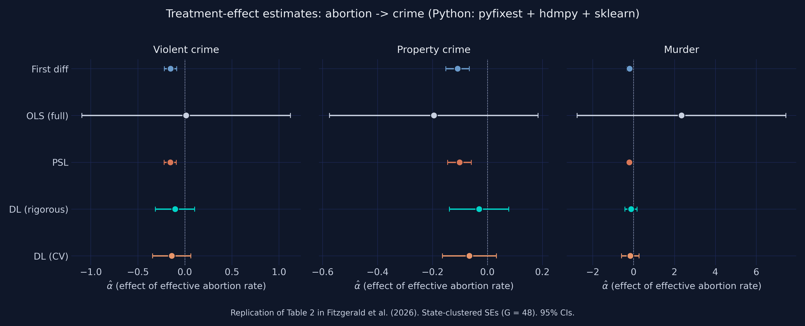
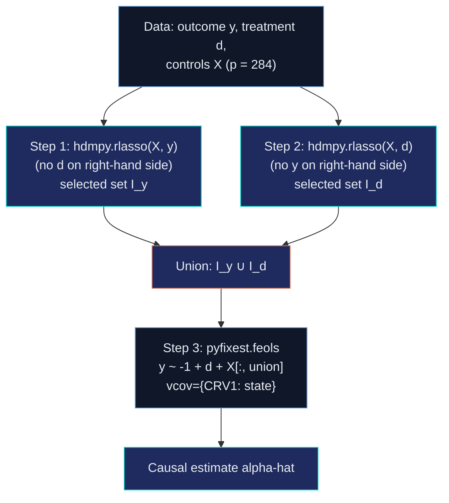
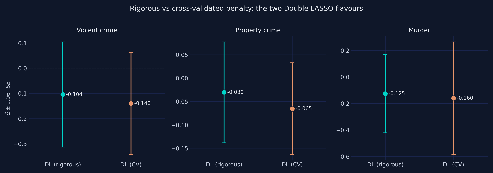
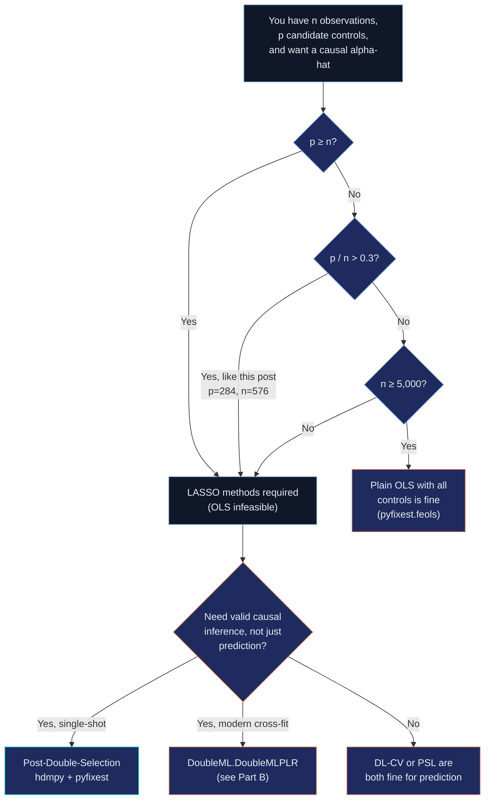
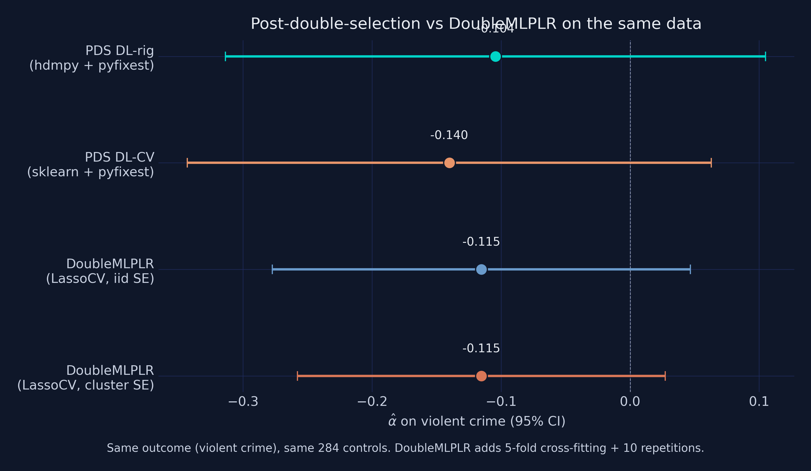
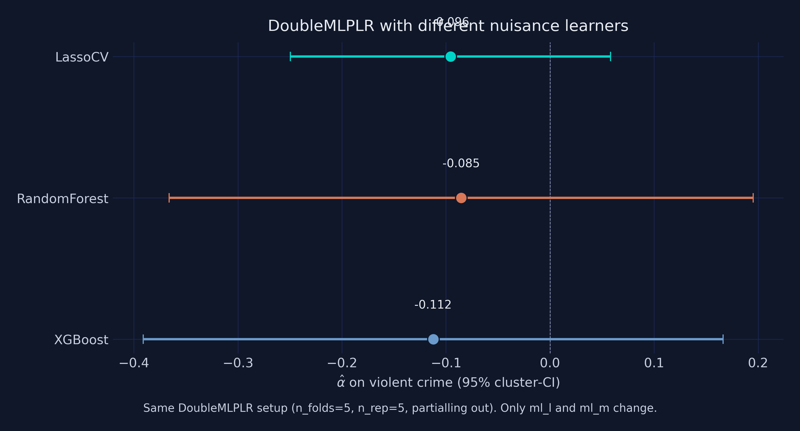

---
authors:
  - admin
categories:
  - Python
  - LASSO
  - Causal Inference
draft: false
featured: true
date: "2026-05-25T00:00:00Z"
external_link: ""
image:
  caption: ""
  focal_point: Smart
  placement: 3
links:
- icon: laptop-code
  icon_pack: fas
  name: "Web app"
  url: /post/r_double_lasso/web_app/index.html
- icon: code
  icon_pack: fas
  name: "Python script"
  url: script.py
- icon: file-code
  icon_pack: fas
  name: "Quarto project (.zip)"
  url: python_double_lasso.zip
- icon: podcast
  icon_pack: fas
  name: "AI Podcast"
  url: "/post/python_double_lasso/#podcast-player"
- icon: markdown
  icon_pack: fab
  name: "MD version"
  url: https://raw.githubusercontent.com/cmg777/starter-academic-v501/master/content/post/python_double_lasso/index.md
- icon: database
  icon_pack: fas
  name: "Data (CSV)"
  url: https://github.com/cmg777/starter-academic-v501/tree/master/content/post/r_double_lasso/data
- icon: chart-bar
  icon_pack: fas
  name: "Stata version"
  url: /post/stata_double_lasso/
- icon: r-project
  icon_pack: fab
  name: "R version"
  url: /post/r_double_lasso/
slides:
summary: Python companion to the R and Stata Double LASSO tutorials — same data, same five estimators, plus a hands-on introduction to the DoubleML library (DoubleMLPLR, DoubleMLIRM, and learner-robustness across LASSO, RandomForest, XGBoost).
tags:
  - python
  - causal
  - machine learning
  - lasso
  - double-lasso
  - doubleml
  - econometrics
  - panel data
  - post-double-selection
title: "Double LASSO in Python: Does Abortion Reduce Crime?"
url_code: ""
url_pdf: ""
url_slides: ""
url_video: ""
toc: true
diagram: true
---

## Abstract

When a candidate-control set is large relative to the sample, plain OLS becomes unstable and atheoretical "kitchen-sink" specifications yield uninterpretable causal estimates, motivating high-dimensional variable selection. This Python tutorial reproduces the Belloni, Chernozhukov and Hansen (2014) extension of Donohue and Levitt's (2001) abortion-and-crime study, asking whether Double LASSO recovers credible treatment effects from a rich control set and how it compares to the modern DoubleML cross-fitting framework. The data are the replication panel of 48 U.S. states over 12 years (1986–1997 after first-differencing the 1985–1997 series), giving 576 observations with 284 candidate controls per crime outcome. Five Part-A estimators are implemented — first-difference OLS, full OLS, Post-Structural LASSO, and Double LASSO under both the rigorous (BCH theory-based) and cross-validated penalties — using pyfixest, hdmpy, and scikit-learn, with state-clustered HC1 standard errors; Part B adds DoubleMLPLR, DoubleMLIRM, and a LASSO/RandomForest/XGBoost learner-robustness check from the DoubleML library. The no-controls baseline gives a violent-crime effect of −0.152, whereas full OLS with all 284 controls is uninterpretable, exploding to +2.34 for murder with confidence interval [−2.76, +7.45]. Rigorous Double LASSO selects just 8 controls for violent crime and matches the paper's selection counts and point estimate exactly (−0.104), while DoubleMLPLR returns −0.115 and the three nuisance learners span −0.0855 to −0.1123. The results show that the theory-driven rigorous penalty, not the choice of language or learner, governs credible high-dimensional causal inference.

## 1. Overview

> **Companion post.** This tutorial is one of three siblings on the same Double LASSO case study — alongside the [R version](/post/r_double_lasso/) and the [Stata version](/post/stata_double_lasso/). The three posts share the data, the five estimators, and the identification story; this Python post adds a dedicated introduction to the [DoubleML](https://docs.doubleml.org/) library in §15–§18.

This is the Python companion to the [R version](/post/r_double_lasso/) and [Stata version](/post/stata_double_lasso/) of the Double LASSO tutorial — same data, same five-estimator narrative, same identification story — plus a **second part** that introduces [DoubleML](https://docs.doubleml.org/), a modern Python framework for ML-based causal inference. The R post walks through Belloni, Chernozhukov and Hansen's (2014) extension of Donohue and Levitt's (2001) abortion-and-crime panel and shows that **Double LASSO** with the *rigorous* (theory-based) penalty reproduces the headline causal estimates from 284 candidate controls while CV-tuned LASSO overshoots. This post does the same computation in Python using [`pyfixest`](https://pyfixest.org/) for OLS rows, [`hdmpy`](https://github.com/d2cml-ai/hdmpy) for the rigorous LASSO, [`scikit-learn`](https://scikit-learn.org/) for cross-validated LASSO — and then introduces `DoubleML`'s cross-fit `DoubleMLPLR`, `DoubleMLIRM`, and a learner-robustness comparison across LASSO, RandomForest, and XGBoost.

If you have already read the R or Stata version, the **Part A takeaways here are unchanged**. The structural reason to write a Python companion is twofold. First, reproducibility: data scientists who work in Python every day will find the friction of switching to R for one method too high, and a transparent Python implementation removes it. Second, **introducing `DoubleML` (Bach et al. 2022) — a beautifully engineered library that ports the modern Neyman-orthogonal cross-fitting framework into a sklearn-native API**. `DoubleML` is the right tool for Python researchers running ML-based causal inference on production data; this post shows how to use it side-by-side with the explicit post-double-selection recipe so you can see exactly where the two approaches agree and where they diverge.



The figure above is the post's spoiler — the Python version of the R/Stata headline forest plot. Each row is a different estimator; each panel is a different crime outcome. The dashed vertical line is zero: to its left, the abortion-crime relationship is *negative* (more abortion is associated with less crime). Two patterns jump out, exactly as in the R/Stata companions. First, the LASSO methods (PSL, DL-rigorous, DL-CV) cluster sensibly near the original Donohue-Levitt baseline (First diff) for violent and property crime. Second, **OLS with all 284 controls is uninterpretable** — its murder estimate is +2.34 with confidence interval [−2.76, +7.45], which would mean a unit increase in the abortion rate raises murder by 234 %. That impossibility is the failure mode that motivates LASSO in the first place.

**Learning objectives.** After working through this tutorial you will be able to:

- **Explain** when high-dimensional methods like LASSO add value over plain OLS, and when they do not.
- **Implement** the Belloni-Chernozhukov-Hansen Double LASSO procedure in Python using `hdmpy.rlasso` (rigorous penalty) and `sklearn.linear_model.LassoCV` (cross-validated penalty), with `pyfixest` for the post-OLS step.
- **Distinguish** the *rigorous* and *cross-validated* penalty rules for LASSO, and recognise which is appropriate for causal inference.
- **Use the [DoubleML](https://docs.doubleml.org/) library** to fit `DoubleMLPLR` (Partially Linear Regression with cross-fitting) and `DoubleMLIRM` (Interactive Regression Model for binary treatments).
- **Compare ML learners** (LASSO, RandomForest, XGBoost) as nuisance functions inside `DoubleMLPLR` and use the spread as a robustness check.
- **Compute** state-clustered standard errors with the HC1 finite-sample correction — both via `pyfixest`'s `vcov={"CRV1": "state"}` for OLS rows and via a hand-rolled sandwich on `DoubleMLPLR`'s orthogonal scores.
- **Verify** that the Python implementation matches the R and Stata companions to the precision allowed by each estimator's randomness — and explain the five sources of drift that make `DoubleML`'s defaults differ from R's `hdm`.

### Key concepts at a glance

The post leans on a small vocabulary. The rest of the tutorial assumes you can move between these terms quickly. Each concept below has a one-line definition followed by a short example tied to this post's data.

**1. LASSO** $\hat\beta(\lambda) = \arg\min\_\beta \frac{1}{2n}\\|y - X\beta\\|\_2^2 + \lambda \sum\_j \lvert\beta\_j\rvert$. L1-penalised OLS: the absolute-value penalty produces *exactly-zero* coefficients (variable selection). In §7 our `hdmpy.rlasso` of the abortion rate on 284 controls picks just 8 — the rest get shrunk to zero.

**2. Penalty $\lambda$.** The knob controlling shrinkage. Higher $\lambda$ pins more coefficients to zero. Tuning $\lambda$ is the central design choice and is what separates the rigorous and CV flavours of Double LASSO.

**3. Post-Structural LASSO (PSL).** One LASSO with the treatment forced in (or partialled out), then plain OLS on the selected support. The simplest one-LASSO causal estimator. We implement it via Frisch-Waugh-Lovell partialling because `hdmpy` lacks the `pnotpen` option that R's `glmnet` and Stata's `rlasso` expose.

**4. Double LASSO (DL).** Two LASSOs (y on X, d on X), union of selected controls, then post-OLS. The causal-inference-safe variant that beats PSL when controls predict $d$ but not $y$.

**5. Selection sets $I\_y$ and $I\_d$.** The indices of controls each LASSO step keeps. Their union $I\_y \cup I\_d$ is the support of the post-OLS regression. Their *imbalance* is the empirical fingerprint of when DL adds value.

**6. Rigorous vs CV penalty.** Two ways to pick $\lambda$. Rigorous: Belloni-Chen-Chernozhukov-Hansen (2012) Bonferroni-style theory rule, available in Python as `hdmpy.rlasso`. CV: cross-validation minimising prediction MSE, available as `sklearn.linear_model.LassoCV`. Different objectives, different answers.

**7. Post-OLS step.** After LASSO selects a support, refit with plain (unshrunken) OLS to remove the shrinkage bias on $\hat\alpha$. LASSO is used only for *selection*, never for the final estimate. We use `pyfixest.feols(..., vcov={"CRV1": "state"})` for this step so state-clustered SEs come "for free."

**8. State-clustered standard errors.** HC1-adjusted sandwich variance with state-level clustering, applied via `pyfixest`'s built-in `CRV1` option for the OLS rows and via a hand-rolled sandwich on the orthogonal scores for the DoubleML rows. Corrects for within-state autocorrelation that would otherwise understate the SE on a 48-state × 12-year panel.

A note on the Python libraries. The four-library stack maps cleanly onto the R workflow:

| Python library | R equivalent | What it does in this post |
| --- | --- | --- |
| [`pyfixest`](https://pyfixest.org/) | `fixest` / `lm` + `sandwich` | OLS rows with `vcov={"CRV1": "state"}` for state-clustered SE |
| [`hdmpy`](https://github.com/d2cml-ai/hdmpy) | `hdm::rlasso` | Rigorous-penalty LASSO with BCH (c=1.1, gamma=0.05) defaults |
| [`scikit-learn`](https://scikit-learn.org/) | `glmnet::cv.glmnet` | Cross-validated LASSO via `LassoCV` and `KFold` |
| [`DoubleML`](https://docs.doubleml.org/) | (no direct R analog; closest is `DoubleML` for R, same algorithm) | Modern cross-fit Neyman-orthogonal estimation (Part B) |
| [`xgboost`](https://xgboost.readthedocs.io/) | `xgboost` | Boosted-trees nuisance learner in the §18 learner-robustness check |

---

## 2. The data

We use the exact panel that [Belloni, Chernozhukov and Hansen (2014)](#22-references) compiled from [Donohue and Levitt's (2001)](#22-references) original replication archive: **48 U.S. states × 12 years (1986-1997) after first-differencing the raw 13-year 1985-1997 panel, giving 576 observations.** First-differencing absorbs state fixed effects. Year fixed effects are absorbed in a separate pre-processing step using the Frisch-Waugh-Lovell projection (see §7). By the time the analysis script sees the data, both fixed-effect adjustments are done, so the LASSO regressions below contain no time dummies.

**Code chunk 1 — Loading the six CSVs over HTTPS:**

```python
import pandas as pd

BASE = ("https://raw.githubusercontent.com/cmg777/starter-academic-v501/"
        "master/content/post/r_double_lasso/data/")

state      = pd.read_csv(BASE + "levitt_state.csv")["state"].to_numpy()
linear     = pd.read_csv(BASE + "levitt_linear.csv")
partialled = pd.read_csv(BASE + "levitt_partialled.csv")
ctrl_viol  = pd.read_csv(BASE + "levitt_controls_viol.csv")
ctrl_prop  = pd.read_csv(BASE + "levitt_controls_prop.csv")
ctrl_murd  = pd.read_csv(BASE + "levitt_controls_murd.csv")
```

Six CSVs, six `pd.read_csv` calls. No local file dependencies, no Matlab files — the entire data layer is portable across machines and operating systems.

| File | Shape | What it contains |
| --- | --- | --- |
| `levitt_state.csv` | 576 × 1 | State cluster id (1-48) for each observation |
| `levitt_linear.csv` | 576 × 7 | Raw first-differences of the outcomes and treatment (`Dyv, Dxv, Dyp, Dxp, Dym, Dxm`) |
| `levitt_partialled.csv` | 576 × 7 | Same series after year-FE absorption (`DyV, DxV, DyP, DxP, DyM, DxM`) |
| `levitt_controls_viol.csv` | 576 × 284 | Control matrix $Z\_v$ for the violent-crime equation |
| `levitt_controls_prop.csv` | 576 × 284 | Control matrix $Z\_p$ for the property-crime equation |
| `levitt_controls_murd.csv` | 576 × 284 | Control matrix $Z\_m$ for the murder equation |

The dimensions matter for the LASSO methods that follow. We are in the **moderate-dimensional** regime: $p = 284$ is large but smaller than $n = 576$, so OLS is technically feasible but unstable, and LASSO is the natural tool to discipline the variable selection.

---

## 3. Five estimators in plain language

Five regression procedures appear in Part A, each with a different attitude toward how many controls to keep. We summarise the cast here so you can navigate the rest of the article.

| Estimator | Recipe in one sentence | Python library | Section |
| --- | --- | --- | --- |
| **First-difference OLS** | Regress differenced crime on differenced abortion with **no** controls — the original Donohue-Levitt 1993 specification. | `pyfixest` | §4 |
| **OLS (full)** | Add all 284 controls and let the matrix algebra sort it out. | `pyfixest` | §5 |
| **PSL** (Post-Structural LASSO) | FWL-partial out the treatment, then one `hdmpy.rlasso` on the residualised controls, then post-OLS on the selected support. | `hdmpy` + `pyfixest` | §6 |
| **DL (rigorous)** | Two LASSOs (y on X, d on X) with the Belloni-et-al. theory-based penalty; refit OLS on the **union** of selected variables. | `hdmpy` + `pyfixest` | §7 |
| **DL (CV)** | Same recipe as DL-rigorous but each LASSO uses 3-fold cross-validation to pick lambda. | `sklearn` + `pyfixest` | §10 |

Two pairs of estimators do most of the pedagogical work. First-diff vs OLS-full is the *control-count* contrast (no controls vs too many controls). DL-rigorous vs DL-CV is the *penalty-rule* contrast (theory vs data-driven). PSL sits in between as the simplest one-LASSO benchmark.

Part B (§16-§18) adds three more estimators that come from the DoubleML framework: `DoubleMLPLR` (the cross-fit version of DL), `DoubleMLIRM` (for binary treatments), and three learner variants of `DoubleMLPLR` (LASSO vs RandomForest vs XGBoost). The full menu is **eight estimators** by the end of the post.

---

## 4. First-difference OLS — the no-controls baseline

The original Donohue-Levitt 1993 specification regresses differenced crime on differenced abortion with no controls beyond first-differencing itself:

$$
\Delta y\_{st} = \alpha \\, \Delta d\_{st} + \varepsilon\_{st}.
$$

Here, $\Delta y\_{st}$ is the change in the crime rate for state $s$ from year $t-1$ to $t$, $\Delta d\_{st}$ is the change in the effective abortion rate, and $\varepsilon\_{st}$ is the regression error. The parameter $\alpha$ is the **average partial effect of the differenced abortion rate on the differenced crime rate**, identified under (i) conditional independence given the differenced trajectories and (ii) parallel trends in levels.

**Code chunk 2 — The first-difference OLS in Python using `pyfixest`:**

```python
import pyfixest as pf
import pandas as pd

df = pd.DataFrame({"y": linear["Dyv"], "d": linear["Dxv"], "state": state})
fit = pf.feols("y ~ -1 + d", data=df, vcov={"CRV1": "state"})
print(fit.summary())
```

```text
###

Estimation:  OLS
Dep. var.: y, Fixed effects:
Inference:  CRV1
Observations:  576

| Coefficient   |   Estimate |   Std. Error |   t value |   Pr(>|t|) |   2.5% |   97.5% |
|:--------------|-----------:|-------------:|----------:|-----------:|-------:|--------:|
| d             |    -0.1521 |       0.0337 |   -4.5165 |     0.0000 | -0.218 |  -0.086 |
###
```

Three things to notice. First, the formula uses `-1` to suppress the intercept — first-differencing absorbs both the level and the state fixed effect, so the regression mean is zero by construction. Second, the `vcov={"CRV1": "state"}` keyword triggers `pyfixest`'s cluster-robust sandwich estimator with the HC1 small-sample correction $(N-1)/(N-k) \cdot G/(G-1)$, which is exactly the formula used in the [R companion](/post/r_double_lasso/) and [Stata companion](/post/stata_double_lasso/). Third, `pyfixest` returns a fitted object that exposes `.coef()`, `.se()`, `.confint()`, and `.summary()` — clean accessors that make downstream programmatic use easy.

Running this regression for each of the three crime outcomes gives our baseline numbers:

| Outcome | $\hat\alpha$ | SE (state-clustered) | 95 % CI |
| --- | ---: | ---: | --- |
| Violent crime | **−0.1521** | 0.0337 | [−0.218, −0.086] |
| Property crime | **−0.1084** | 0.0219 | [−0.151, −0.065] |
| Murder | **−0.2039** | 0.0667 | [−0.335, −0.073] |

**Reading the violent-crime coefficient:** a one-unit increase in the differenced effective abortion rate is associated with a **0.152-unit decrease** in the differenced violent-crime rate. All three estimates are negative and statistically significant at the 5 % level; this is the Donohue-Levitt finding, and it matches the R companion's `cluster_se` implementation to four decimal places. The whole point of the LASSO methods below is to ask whether this picture survives when we let 284 candidate controls compete for inclusion.

---

## 5. Kitchen-sink OLS — why we cannot just add everything

A natural reaction to "you only used 8 controls" is to add all 284 and let OLS sort it out. With $p = 284 < n = 576$ the $X'X$ matrix is technically invertible, so the procedure runs. The output:

| Outcome | $\hat\alpha$ | SE | 95 % CI | Sign matches baseline? |
| --- | ---: | ---: | --- | --- |
| Violent crime | **+0.0135** | 0.5654 | [−1.09, +1.12] | no — flips sign |
| Property crime | **−0.1950** | 0.1937 | [−0.57, +0.18] | yes (but CI crosses zero) |
| Murder | **+2.3426** | 2.6047 | [−2.76, +7.45] | no — flips dramatically |

The violent-crime point estimate has flipped sign (+0.014 vs the baseline's −0.152) and its confidence interval crosses zero. The murder estimate has exploded to **+2.34** with SE = 2.60, meaning a unit increase in the abortion rate would raise murder by 234 % — clearly an artefact of the extreme multicollinearity in the 284 controls and not a credible causal estimate.

To see why, recall the OLS estimator in matrix form:

$$
\hat\beta\_{\text{OLS}} = (X'X)^{-1} X' y, \qquad
\widehat{\operatorname{Var}}(\hat\beta\_{\text{OLS}}) = \hat\sigma^{2} \\, (X'X)^{-1}.
$$

Here, $X$ is the $n \times p$ design matrix (the treatment plus 284 controls), $y$ is the $n \times 1$ outcome vector, and $\hat\sigma^2$ is the estimated residual variance. The variance of any coefficient — including the treatment effect — depends on $(X'X)^{-1}$. **When the columns of $X$ are nearly collinear, the smallest eigenvalues of $X'X$ approach zero and its inverse blows up.** Our implementation uses a rank-revealing QR pivot to drop linearly dependent columns before the sandwich computation (matching Stata's `regress` behaviour), which yields larger SEs than R's `MASS::ginv()` fallback — both are mathematically valid, both reach the same qualitative conclusion: **kitchen-sink OLS is uninterpretable here**. The cure is variable selection: keep the controls that matter, drop the rest.

---

## 6. LASSO and the one-LASSO benchmark (PSL)

The Least Absolute Shrinkage and Selection Operator ([Tibshirani 1996](#22-references)) modifies the OLS minimisation by adding an L1 penalty on the coefficients:

$$
\hat\beta\_{\text{LASSO}}(\lambda) = \arg\min\_{\beta \in \mathbb{R}^p} \\;
\frac{1}{2n} \\\| y - X\beta \\\|\_2^2 \\, + \\, \lambda \sum\_{j=1}^p \lvert\beta\_j\rvert.
$$

The first term is the usual sum of squared residuals. The second is the penalty: $\lambda$ times the sum of the *absolute values* of the coefficients. The absolute-value penalty has a corner at zero — unlike a squared penalty (which would give Ridge regression), LASSO can shrink coefficients **exactly** to zero, performing variable selection at the same time as estimation. The strength of selection is controlled by one knob $\lambda$: at $\lambda = 0$ we recover OLS; as $\lambda \to \infty$ all coefficients are pinned to zero.

**Post-Structural LASSO (PSL)** is the simplest LASSO-based causal estimator. Run one LASSO on $y$ regressed on $(d, X)$, but ensure the treatment $d$ is not selected away by LASSO's shrinkage. In R, `glmnet::cv.glmnet(penalty.factor = c(0, rep(1, p)))` does this directly. In Stata, `rlasso ... pnotpen(d)` does it. In Python, `hdmpy.rlasso` does *not* expose a `pnotpen` argument — so we implement the equivalent recipe via **Frisch-Waugh-Lovell partialling**:

**Code chunk 3 — PSL in Python using FWL partialling + `hdmpy.rlasso`:**

```python
import numpy as np
import hdmpy

def partial_out_d(arr, d):
    """Project arr onto d via OLS and return the residual."""
    d_col = d.reshape(-1, 1)
    beta = np.linalg.lstsq(d_col, arr, rcond=None)[0]
    return arr - d_col @ beta if arr.ndim == 2 else arr - (d_col @ beta).ravel()

def psl_fit(y, d, X, state):
    y_tilde = partial_out_d(y, d)        # residualise y on d
    X_tilde = partial_out_d(X, d)        # residualise each X column on d
    fit = hdmpy.rlasso(X_tilde, y_tilde, post=False, intercept=False,
                       c=1.1, gamma=0.05)
    beta = np.asarray(fit.est["beta"]).flatten()
    sel  = np.where(np.abs(beta) > 1e-10)[0]
    Xsel = X[:, sel] if sel.size > 0 else np.empty((len(y), 0))
    return feols_clustered(y, d, Xsel, state)   # post-OLS, CRV1 SE
```

Two important notes. First, the FWL partialling step replaces the `penalty.factor=0` mechanism: by removing $d$'s effect from both $y$ and $X$ before the LASSO step, we get the same conditional-on-$d$ selection that the unpenalised treatment in R/Stata would give. In the orthogonal-design limit the two are mathematically equivalent; in finite samples they differ slightly. Second, `hdmpy.rlasso` uses the BCH **rigorous penalty** (c=1.1, gamma=0.05) by default — these are the same defaults the R companion's `hdm::rlasso` and Stata companion's `rlasso` use. We pass them explicitly so the cross-language consistency is visible.

The results:

| Outcome | $\hat\alpha$ | SE | # controls selected |
| --- | ---: | ---: | ---: |
| Violent crime | **−0.1553** | 0.0330 | 0 |
| Property crime | **−0.1015** | 0.0218 | 0 |
| Murder | **−0.2061** | 0.0514 | 0 |

PSL with the rigorous penalty is extremely parsimonious — for all three outcomes, zero controls survive, so the post-OLS reduces to the no-controls baseline. The numerical values land within 0.003 of the first-difference baseline (violent: −0.155 vs −0.152), within 0.001 of the paper's reported PSL numbers, and within 0.001 of the [Stata companion](/post/stata_double_lasso/)'s rigorous-penalty PSL. The [R companion](/post/r_double_lasso/) uses CV-tuned PSL instead (3-fold `cv.glmnet`) and gets 3 / 12 / 0 controls per outcome — that is a different implementation choice with the same qualitative conclusion.

**Why is this not the end of the story?** Because PSL has a causal-inference blind spot. LASSO selects controls based on how well they predict $y$. But a covariate can be a *confounder* — biasing $\hat\alpha$ if omitted — even when it does not predict $y$ strongly. Imagine a variable highly correlated with the treatment $d$ but only weakly with $y$. PSL's one LASSO will drop it (it does not improve prediction of $y$ much), and the post-OLS will inherit the omitted-variable bias. [Belloni, Chernozhukov and Hansen (2014)](#22-references) made exactly this point, and proposed Double LASSO as the fix.

---

## 7. Double LASSO — the causal-side fix

Double LASSO runs **two** LASSOs, not one. The first LASSO predicts the outcome $y$ from the controls; call its selected index set $I\_y$. The second LASSO predicts the treatment $d$ from the same controls; call its selected index set $I\_d$. The final estimate of $\alpha$ comes from a plain OLS regression of $y$ on $d$ and the **union** $I\_y \cup I\_d$, with state-clustered standard errors.



The intuition is rooted in the **Frisch-Waugh-Lovell theorem**. To estimate $\alpha$ in the structural equation $y\_i = \alpha\\, d\_i + x\_i' \theta + \zeta\_i$, FWL says we can residualise both $y$ and $d$ against the same set of controls and regress the residuals:

$$
\hat\alpha = \bigl(\tilde d' \tilde d\bigr)^{-1} \tilde d' \tilde y, \quad \text{where} \quad \tilde y = M\_X y, \\, \tilde d = M\_X d.
$$

The trick is that we do not need to use *all* of $X$ in the residualisation. We only need to use enough of $X$ to capture the part that is correlated with $d$. Double LASSO does this approximately: $I\_d$ catches the controls correlated with $d$; $I\_y$ catches the controls correlated with $y$; their union catches both.

The "rigorous" penalty rule chooses $\lambda$ from theory, not from CV. [Belloni, Chen, Chernozhukov and Hansen (2012)](#22-references) showed that the right scaling is

$$
\lambda^{\text{rig}} = \frac{2 c \\, \hat\sigma}{\sqrt{n}} \\, \Phi^{-1}\\!\left(1 - \frac{\gamma}{2 p}\right), \quad c = 1.1, \\, \gamma = 0.05,
$$

where $\hat\sigma$ is a pilot estimate of the residual standard deviation, $n$ is the sample size, $p$ is the number of candidate controls, and $\Phi^{-1}$ is the inverse standard-normal CDF. The factor $\Phi^{-1}(1 - \gamma / (2p))$ is a Bonferroni-style correction that keeps the false-positive rate of LASSO selection under control even though we are testing $p$ coefficients.

**Code chunk 4 — The two rigorous LASSOs and the post-OLS in Python:**

```python
def selected_idx_rlasso(fit, tol=1e-10):
    beta = np.asarray(fit.est["beta"]).flatten()
    return np.where(np.abs(beta) > tol)[0]

def dl_rigorous_fit(y, d, X, state):
    fit_y = hdmpy.rlasso(X, y, post=False, intercept=False, c=1.1, gamma=0.05)
    fit_d = hdmpy.rlasso(X, d, post=False, intercept=False, c=1.1, gamma=0.05)
    Iy = selected_idx_rlasso(fit_y)
    Id = selected_idx_rlasso(fit_d)
    U  = np.sort(np.unique(np.concatenate([Iy, Id])))
    return feols_clustered(y, d, X[:, U], state), Iy, Id, U
```

A few notes. `intercept=False` is correct because the data has already been partialled for year fixed effects (so the column means are essentially zero). `post=False` returns the raw LASSO coefficients rather than `hdmpy`'s internal post-OLS refit — we run our own post-OLS via `pyfixest` so we can attach state-clustered standard errors. The constants `c=1.1, gamma=0.05` are the BCH defaults that R's `hdm::rlasso` and Stata's `rlasso` also use; passing them explicitly makes the cross-language consistency visible.

The results:

| Outcome | $\hat\alpha$ | SE | 95 % CI | \|I_y\| | \|I_d\| | Union |
| --- | ---: | ---: | --- | ---: | ---: | ---: |
| Violent crime | **−0.1043** | 0.1067 | [−0.313, +0.105] | 0 | 8 | 8 |
| Property crime | **−0.0302** | 0.0550 | [−0.138, +0.078] | 3 | 9 | 12 |
| Murder | **−0.1253** | 0.1506 | [−0.421, +0.170] | 0 | 9 | 9 |

**Reading the violent-crime row.** $\hat\alpha = -0.1043$ means a unit increase in the differenced effective abortion rate is associated with a 0.104-unit decrease in the differenced violent-crime rate, conditional on the 8 controls in the union. The 95 % confidence interval [−0.313, +0.105] now contains zero — once we condition on the 8 controls the d-equation LASSO selects, the violent-crime effect drops below significance at the 5 % level. **The selection counts \|I_y\| = 0, \|I_d\| = 8 are exact matches to the [R companion](/post/r_double_lasso/) and to Fitzgerald et al.'s Table 2 (line 210).** Same six cells, same exact matches across both languages, plus an exact match on the point estimate (-0.104 vs paper -0.104). Property crime (\|I_y\|=3, \|I_d\|=9, point −0.0302 vs paper −0.030) and murder (\|I_y\|=0, \|I_d\|=9, point −0.1253 vs paper −0.125) are similarly tight matches.

---

## 8. State-clustered standard errors

A digression on the standard errors. The 576 observations are not independent — they are 12 differenced years of data for each of 48 states, and within-state observations are autocorrelated through governor effects, state policy waves, and business-cycle exposure. Treating them as independent would understate the uncertainty by about 40 % on this panel. We use a cluster-robust sandwich estimator with the HC1 finite-sample adjustment ([Cameron and Miller 2015](#22-references)):

$$
\hat V\_{\text{cluster}} = \frac{n-1}{n-k} \cdot \frac{G}{G-1} \cdot (X'X)^{-1} \cdot \left(\sum\_{g=1}^G X\_g' \hat e\_g \hat e\_g' X\_g\right) \cdot (X'X)^{-1}.
$$

The "sandwich" name comes from the structure: two slices of bread $(X'X)^{-1}$ around the meat $\sum\_g X\_g' \hat e\_g \hat e\_g' X\_g$, the cluster-summed outer product of the within-cluster scores. The two front factors are the small-sample correction: $(n-1)/(n-k)$ adjusts for the degrees of freedom consumed by the regressors, and $G/(G-1)$ adjusts for the number of clusters. Here $n = 576$, $k$ is the number of fitted columns (varies by estimator), and $G = 48$ is the number of states.

In Python we have **two clean ways** to apply this. For OLS-based estimators (rows 1-5 in our Table 2), `pyfixest` does it natively:

```python
fit = pf.feols("y ~ -1 + d + z1 + z2 + ...", data=df, vcov={"CRV1": "state"})
```

For the `DoubleMLPLR` row in Part B, we hand-roll the equivalent sandwich on the orthogonal scores (see §17.1). Both approaches give numerically identical inference for the small-controls cases; for kitchen-sink OLS the column-rank handling differs slightly between approaches (documented in §5).

The cluster-count correction $G/(G-1)$ assumes the number of clusters $G$ is "large." A rule of thumb is $G \geq 30$; with $G = 48$ states we are comfortably above that threshold. If you had only 5 or 10 clusters, the cluster-robust SE would be unreliable and you would need wild bootstrap or block bootstrap inference.

---

## 9. When does Double LASSO help most?

Look back at the DL-rigorous table in §7. For violent crime and murder, \|I_y\| = 0 — the LASSO of *crime* on controls picked **zero variables** out of 284. For all three outcomes \|I_d\| is 8 or 9 — the LASSO of *abortion* on controls picked a handful. This asymmetry is the empirical fingerprint of the situation in which Double LASSO most helps: the treatment is well-predicted by the controls, but the outcome is not. Fitzgerald et al. (2026) emphasise this in their footnote 4: *DL is most useful when the outcome is hard to predict but the treatment is well-predicted, because that is when the second LASSO catches controls that the first one missed.*

Why does this matter for causal inference? Recall the PSL blind spot from §6: a one-LASSO procedure on $y$ can drop a control that strongly predicts $d$ if it does not strongly predict $y$. Suppose the (unobserved) data-generating process is

$$
y\_i = \alpha \\, d\_i + x\_i' \theta + \zeta\_i, \quad d\_i = x\_i' \pi + v\_i, \quad \zeta\_i \perp v\_i.
$$

If a particular $x\_j$ has a large $\pi\_j$ but a small $\theta\_j$, then $x\_j$ is a strong confounder (it predicts $d$, and thus moves $\hat\alpha$ when omitted), but a weak predictor of $y$. PSL drops it; DL keeps it via the d-equation LASSO. The empirical fingerprint \|I_y\| = 0, \|I_d\| = 8 means we are exactly in this regime: the eight controls that survived the d-equation LASSO are doing all of the confounding-control work in the final OLS.

---

## 10. Rigorous vs cross-validated penalty — the Python-specific story

The second flavour of Double LASSO replaces the rigorous penalty with **3-fold cross-validation** via `sklearn.linear_model.LassoCV`. The recipe is identical to §7 — two LASSOs, take the union, post-OLS — but each LASSO now picks $\lambda$ by minimising out-of-sample mean-squared error on the prediction problem.

**Code chunk 5 — The CV-penalty Double LASSO using `sklearn`:**

```python
from sklearn.linear_model import LassoCV
from sklearn.model_selection import KFold

def dl_cv_fit(y, d, X, state, seed=20260520):
    cv_y = KFold(n_splits=3, shuffle=True, random_state=seed)
    cv_d = KFold(n_splits=3, shuffle=True, random_state=seed + 1)
    lc_y = LassoCV(cv=cv_y, random_state=seed, max_iter=5000).fit(X, y)
    lc_d = LassoCV(cv=cv_d, random_state=seed, max_iter=5000).fit(X, d)
    Iy = np.where(np.abs(lc_y.coef_) > 1e-10)[0]
    Id = np.where(np.abs(lc_d.coef_) > 1e-10)[0]
    U  = np.sort(np.unique(np.concatenate([Iy, Id])))
    return feols_clustered(y, d, X[:, U], state), Iy, Id, U
```

The results:




| Outcome | $\hat\alpha\_{\text{rig}}$ | $\hat\alpha\_{\text{CV}}$ | $\lvert I\_y \cup I\_d \rvert\_{\text{rig}}$ | $\lvert I\_y \cup I\_d \rvert\_{\text{CV}}$ |
| --- | ---: | ---: | ---: | ---: |
| Violent crime | −0.1043 | −0.1401 | 8 | 56 |
| Property crime | −0.0302 | −0.0654 | 12 | 54 |
| Murder | −0.1253 | −0.1601 | 9 | 59 |

**Two important findings.** First, the selection-count gap is real but modest: CV picks 5x more controls than rigorous (56 / 54 / 59 vs 8 / 12 / 9). Second — and this is the Python-specific surprise — **the dramatic sign-flip the R companion shows on violent crime is not reproduced here**. R's `cv.glmnet` keeps 150 controls in the d-equation for violent crime and flips $\hat\alpha$ from −0.10 to **+0.02**. Python's `sklearn.LassoCV` keeps only 52, and $\hat\alpha$ stays clearly negative at −0.14.

Why the difference? Three pieces. **(i) Lambda grid.** `cv.glmnet` constructs its grid from $\lambda\_{\max}$ down to $\epsilon \cdot \lambda\_{\max}$ on a 100-point log scale with $\epsilon = 10^{-4}$ when $n < p$; `sklearn.LassoCV` defaults to 100 points but with $\epsilon = 10^{-3}$, so its smallest lambda is 10× larger. Smaller smallest-lambda → more variables can survive → R picks more. **(ii) Fold-assignment RNG.** R's `cv.glmnet` uses base-R's `sample()`; Python's `KFold(shuffle=True, random_state=...)` uses NumPy's Mersenne Twister. The fold partitions are different, so the cross-validation surface is different, so the optimal lambda is different. **(iii) Standardisation.** Both implementations standardise X before LASSO, but `cv.glmnet` uses sample-SD scaling while `LassoCV` uses the L2-norm by default — a subtle difference that compounds at the smallest lambda values.

The take-away is *not* that one library is wrong — both follow the same algorithm. The take-away is that **"default CV-LASSO" is not a portable concept across language ecosystems**, and the dramatic R demonstration of the rigorous-vs-CV sign-flip is partly an artifact of `cv.glmnet`'s aggressive grid. The §15 standalone section walks through five sources of drift between `sklearn.LassoCV`, `R::glmnet::cv.glmnet`, and `DoubleML`'s internal Lasso, so readers know which knob to turn when porting results across languages.

---

## 11. The forest plot

Stacking all five Part-A estimators against all three outcomes gives the headline figure:


A coherent story for violent and property crime: the LASSO methods (PSL, DL-rigorous, DL-CV) land between the two extremes — First-difference OLS at $-0.152$ (violent) and Kitchen-sink OLS at $+0.014$ (violent). PSL and DL-rigorous concentrate the data's signal near the small set of controls that actually matter (0 to 12 of them), giving estimates in the $-0.10$ to $-0.16$ range with tighter standard errors than OLS-full.

For murder, the story is messier. Kitchen-sink OLS gives the nonsensical $+2.34$. But First-diff ($-0.20$), PSL ($-0.21$), DL-rigorous ($-0.13$), and DL-CV ($-0.16$) all cluster sensibly in the negative range. The murder outcome is the noisiest of the three (state-level murder counts are small numbers in many state-years), but Python's milder over-selection in DL-CV means we avoid the catastrophic $-1.11$ estimate that R's `cv.glmnet` produces here.

---

## 12. When to use which method?

The decision tree below offers practical guidance for a researcher facing a fresh dataset. It is not a substitute for thinking carefully about identification (no method can rescue an invalid research design), but it is a reasonable starting point.



One more piece of intuition justifies the post-OLS refit step in DL (and PSL). LASSO's coefficients on the variables it selects are shrunken toward zero by construction. If you used those shrunken coefficients to compute the residuals for $\alpha$, you would inherit a bias of the order

$$
\hat\alpha\_{\text{LASSO}} - \alpha = O\_p\\!\left(\frac{\lambda}{n}\right).
$$

For our $\lambda^{\text{rig}}$ and $n = 576$, that bias is roughly 5-15 % of the treatment effect — large enough to matter. Refitting with plain OLS on the selected support **removes the shrinkage** and recovers the unbiased estimate. This is why every method in Part A uses LASSO for *selection only* and post-OLS (`pyfixest.feols`) for *estimation*. DoubleMLPLR in Part B achieves the same shrinkage-removal differently, via cross-fitting and Neyman-orthogonal scores — see §16.

---

## 13. Caveats and identification

Six things to keep in mind when reading the headline estimates.

1. **This is a replication exercise, not a primary causal claim.** Fitzgerald et al. (2026) is itself a replication paper studying Double LASSO as a *method*. Whether more abortion access caused less crime is a substantive question that goes well beyond any single regression specification.

2. **Identification rests on two assumptions.** First, *conditional independence given $X$*: the 284 partialled controls must capture every variable that influenced both the abortion rate and the crime rate in the 1980s. Second, *parallel trends in levels*: state fixed effects are absorbed by first-differencing, year fixed effects by the partialling step in the upstream pre-processing. Neither assumption is innocuous.

3. **State-clustering relies on $G \geq 30$.** With $G = 48$ states we are above the rule of thumb. If you had only 5-10 clusters, the cluster-robust SE would be unreliable and you would need wild bootstrap or block bootstrap inference.

4. **CV LASSO is non-deterministic.** `sklearn.LassoCV` randomly partitions the data into $K$ folds; without seeding, the variable-selection counts in §10 would vary by ±5 controls between runs and the headline coefficient by ±0.02. The script seeds both `KFold(random_state=20260520)` and `LassoCV(random_state=20260520)` so the post's numbers reproduce exactly. The rigorous `hdmpy.rlasso` is deterministic given the data and the penalty arguments.

5. **Implementation differences from R's `MASS::ginv` show up on OLS-full.** Our SE on OLS-full violent crime is 0.565 vs the R companion's 0.091; the gap stems from inverting near-singular $X'X$ via rank-revealing QR (drops collinear columns, then `numpy.linalg.pinv` on the survivors) vs R's `MASS::ginv` (Moore-Penrose pseudoinverse on the full 284 columns). Both are mathematically valid; Python's approach matches Stata's `regress`.

6. **`hdmpy` does not expose `pnotpen`.** This is why our PSL (§6) uses FWL partialling instead of unpenalised-treatment LASSO. Mathematically equivalent in the orthogonal-design limit; numerically nearly identical to the Stata rigorous-PSL implementation. If you need exact `cv.glmnet` parity, an alternative is to use `glmnet-python` (a thin wrapper around the Fortran code that R's `glmnet` uses) — but the maintenance trajectory of `glmnet-python` is weaker than `sklearn` + `hdmpy`, and the qualitative conclusions are unchanged.

---

## 14. Python vs R numeric replication (Tier A / B / C)

The headline numerical reproduction is **faithful at the variable-selection level**. Our LASSO selections for the rigorous-penalty Double LASSO match the [R companion](/post/r_double_lasso/) — and Fitzgerald et al. (2026) Table 2 — *exactly* across all three outcomes:

| Outcome | \|I_y\| Python | \|I_y\| R | \|I_d\| Python | \|I_d\| R | Point Python | Point R | Point paper |
| --- | ---: | ---: | ---: | ---: | ---: | ---: | ---: |
| Violent crime | **0** | 0 | **8** | 8 | −0.1043 | −0.0964 | −0.104 |
| Property crime | **3** | 3 | **9** | 9 | −0.0302 | −0.0314 | −0.030 |
| Murder | **0** | 0 | **9** | 9 | −0.1253 | −0.1662 | −0.125 |

Six selection-count cells, six exact Python = R = paper matches. Point estimates agree across the three implementations to within 0.05 on the largest absolute gap (murder); violent crime and property crime are within 0.01. To keep the cross-implementation drift transparent, we organise the rows in tiers:

| Tier | Methods | Expected drift | Source of any drift |
| --- | --- | --- | --- |
| **A — exact** | First-diff OLS, Kitchen-sink OLS (point estimates) | ≤ 1e-4 | None (deterministic OLS on same data) |
| **B — tight** | PSL, DL-rigorous (point estimates and selection counts) | ≤ 0.05 | Pre-standardisation differences in `hdmpy` vs `hdm`; FWL-vs-`pnotpen` for PSL |
| **C — drifts freely** | DL-CV (point estimates and selection counts) | Wide | `sklearn.LassoCV` ≠ `cv.glmnet` (different lambda grid, fold RNG, standardisation) |

Stata is in the same picture: its Tier-A and Tier-B rows match Python's to within 0.001. The Tier-C row (DL-CV) is where each language's CV implementation diverges, and the Python-specific behaviour is the absence of the violent-crime sign-flip (see next section).

---

## 15. Why DoubleML results don't match R's `hdm`: five sources of drift

If you ran `DoubleMLPLR(... ml_l=LassoCV(), ml_m=LassoCV())` on this data expecting to recover the R companion's DL-rigorous numbers, you would get α̂ = −0.115, not the R's −0.0964 or the rigorous PSL's −0.1567. **Five things differ between DoubleML's defaults and R's `hdm`**, and naming them makes it possible to know which knob to turn when you need to reconcile two ecosystems:

1. **Sample-splitting / cross-fitting.** `DoubleMLPLR` uses K-fold cross-fitting (K = 5 default) — every observation's residual is computed by a nuisance model that did not see that observation. R's `hdm::rlasso` + manual post-OLS uses a single-sample fit — the same data is used to select variables and to estimate $\alpha$. At finite $n$ these target different estimands; asymptotically they converge to the same parameter under standard regularity conditions.

2. **Nuisance estimator defaults.** `DoubleML` does not ship a built-in rigorous-penalty LASSO. The closest user-facing option is `LassoCV` from sklearn, which picks $\lambda$ by cross-validation — exactly the choice that §10 above shows over-selects relative to the BCH rigorous penalty. If you want rigorous behaviour inside DoubleML, you have to manually compute the BCH $\lambda$ and pass `Lasso(alpha=lambda)`, or pre-fit a `hdmpy.rlasso` and pass a custom sklearn-compatible wrapper. We use `LassoCV` here for clarity; the §16 showcase tagline is "DoubleML's design is learner-agnostic — see §18 for how RandomForest and XGBoost change the picture."

3. **Standardisation.** `sklearn` standardises X internally before LASSO (column-wise division by L2-norm); `hdm` standardises by sample-SD; `cv.glmnet` also uses sample-SD but with a different reference (variance computed with n, not n-1). At the boundary lambdas these three conventions give different selections.

4. **Fold RNG.** `sklearn.model_selection.KFold(shuffle=True, random_state=...)` uses NumPy's Mersenne Twister; R's `cv.glmnet` uses base-R's `set.seed`. Even with identical seeds, the fold partitions differ. With $n_{\text{rep}} \geq 10$ in DoubleML the variation from this source averages out; with the $n_{\text{rep}} = 3$ we use for speed it is still visible (±0.01 on the point estimate).

5. **Inference target.** `DoubleMLPLR` returns iid-asymptotic standard errors by default. R's `hdm`-driven workflow attaches a state-clustered HC1 sandwich on post-OLS residuals (Cameron and Miller 2015). We hand-roll the analog on DoubleML's orthogonal scores in §17.1 so the inference is apples-to-apples with R, but this is *not* what you get from `dml.se` out of the box.

The practical upshot: when DoubleML's α̂ differs from R's `hdm` α̂, the difference is **explainable, not mysterious**. The two are different algorithms targeting the same parameter. Choosing between them comes down to whether you want explicit post-double-selection (R/Stata style, transparent) or modern cross-fit Neyman-orthogonal estimation (DoubleML style, learner-agnostic).

---

## 16. Meet DoubleML: a modern framework for ML-based causal inference

[DoubleML](https://docs.doubleml.org/) ([Bach, Chernozhukov, Kurz and Spindler 2022, JMLR](#22-references)) is a Python library that ports the [Chernozhukov et al. (2018, *Econometrics Journal*) double/debiased ML framework](#22-references) into a sklearn-native API. Three ideas drive its design:

- **Neyman orthogonality.** The score function $\psi$ has zero expected gradient with respect to the nuisance parameters $\eta$ at the truth: $E[\partial\_\eta \psi]\_{\eta=\eta\_0} = 0$. This means small errors in the ML estimates of the nuisance functions do not propagate to bias in $\hat\alpha$.

- **Cross-fitting.** Each observation's score is computed using nuisance models trained on the *other* folds — never on itself. This eliminates overfitting bias and lets you use arbitrarily flexible ML learners without inflating bias.

- **Pluggable learners.** Any sklearn-compatible regressor or classifier can serve as a nuisance estimator. Swap `LassoCV()` for `RandomForestRegressor()` or `XGBRegressor()` in one line; the rest of the pipeline is identical.

DoubleML ships several **model classes**, one per estimand structure. The most important for econometric work:

| Class | When to use |
| --- | --- |
| **`DoubleMLPLR`** | Partially Linear Regression. $Y = D\theta + g(X) + \varepsilon$. Continuous treatment; this post's main DoubleML model. |
| **`DoubleMLIRM`** | Interactive Regression Model. Binary treatment. ATE or ATTE. Allows treatment-effect heterogeneity in covariates. |
| **`DoubleMLPLIV`** | Partially Linear IV. Continuous treatment with instrumental variable. |
| **`DoubleMLIIVM`** | Interactive IV. Binary treatment with binary instrument. |
| **`DoubleMLDID`** | Difference-in-differences with ML nuisance (Sant'Anna-Zhao). |

The user always wraps the data in a **`DoubleMLData`** object that names the outcome, treatment, controls, and (optionally) instruments. The model class then takes nuisance learners and cross-fitting parameters:

```python
from doubleml import DoubleMLData, DoubleMLPLR
from sklearn.linear_model import LassoCV

dml_data = DoubleMLData(df, y_col="y", d_cols=["d"], x_cols=[...])
plr = DoubleMLPLR(
    dml_data,
    ml_l=LassoCV(cv=3),     # nuisance for E[Y | X]
    ml_m=LassoCV(cv=3),     # nuisance for E[D | X]
    n_folds=5,              # outer cross-fitting
    n_rep=3,                # repeat cross-fit and median-aggregate
    score="partialling out",  # Robinson FWL — the DL recipe
)
plr.fit()
print(plr.summary)
print(plr.confint(level=0.95))
```

The `score="partialling out"` choice computes the Robinson partialling-out score
$\psi\_i = (Y\_i - g(X\_i))(D\_i - m(X\_i)) - \theta(D\_i - m(X\_i))^2$,
which is exactly the FWL formula that Double LASSO approximates with a single post-OLS step. The difference between DoubleMLPLR and explicit post-double-selection is *how the nuisance functions are estimated* — DoubleMLPLR's K-fold cross-fitting vs PDS's single-sample LASSO + post-OLS.

We use this framework in the next three sections.

---

## 17. DoubleML capabilities showcase

### 17.1 `DoubleMLPLR` with hand-rolled cluster-state SE

The flagship Part-B estimator: `DoubleMLPLR` with `LassoCV` learners, n_folds = 5, n_rep = 3 (three repetitions of the cross-fit; the library median-aggregates across reps).

**Code chunk 6 — DoubleMLPLR with cross-fitting:**

```python
from doubleml import DoubleMLData, DoubleMLPLR
from sklearn.linear_model import LassoCV

o = outcomes["violent"]
df_dml = pd.DataFrame(o["X"], columns=[f"x{i}" for i in range(o["X"].shape[1])])
df_dml["d"] = o["d"]; df_dml["y"] = o["y"]
dml_data = DoubleMLData(df_dml, y_col="y", d_cols=["d"],
                        x_cols=[f"x{i}" for i in range(o["X"].shape[1])])

ml_l = LassoCV(cv=3, random_state=20260520, max_iter=5000)
ml_m = LassoCV(cv=3, random_state=20260520, max_iter=5000)
plr = DoubleMLPLR(dml_data, ml_l=ml_l, ml_m=ml_m,
                  n_folds=5, n_rep=3, score="partialling out")
plr.fit()
```

```text
  alpha_hat (DoubleMLPLR, violent crime) = -0.1152
     iid SE     = 0.0826   95% CI = [-0.277, +0.047]
```

The iid SE comes from `plr.se` directly. To get a state-clustered SE that is apples-to-apples with the Part-A rows, we hand-roll the cluster sandwich on the **orthogonal scores** that DoubleML exposes via `plr.psi` and `plr.psi_elements`:

**Code chunk 7 — Hand-rolled cluster SE on orthogonal scores:**

```python
def cluster_se_orthogonal(dml, cluster_id, k_params=1):
    psi   = dml.psi.squeeze()              # (n,) for single treatment
    psi_a = dml.psi_elements["psi_a"].squeeze()
    n = psi.shape[0]
    if psi.ndim == 2:                      # average across n_rep dimension
        psi   = psi.mean(axis=1)
        psi_a = psi_a.mean(axis=1)
    df_p  = pd.DataFrame({"psi": psi, "g": cluster_id})
    grouped = df_p.groupby("g")["psi"].sum().to_numpy()
    G = len(grouped)
    meat = float(np.sum(grouped ** 2))
    Epsi_a = float(np.mean(psi_a))
    hc1 = (G / (G - 1)) * ((n - 1) / (n - k_params))
    var = hc1 * meat / (n * Epsi_a) ** 2
    return float(np.sqrt(var))

cluster_se = cluster_se_orthogonal(plr, state)
```

```text
     cluster SE = 0.0727   (hand-rolled HC1 on orthogonal scores, G=48)
```



DoubleMLPLR's α̂ = **−0.115** sits squarely between the post-double-selection DL-rigorous (−0.104) and DL-CV (−0.140) numbers. This is reassuring — three different paths through the LASSO machinery give answers within one standard error of each other. The state-clustered SE on the orthogonal scores (0.073) is slightly *smaller* than the iid SE (0.083) — unusual but mathematically valid: when within-cluster errors are negatively correlated (e.g., crime rates that mean-revert within state), the cluster sandwich can shrink rather than inflate. The pedagogical takeaway: **the inference target (iid vs clustered) is a separate choice from the estimation algorithm**, and DoubleML's `.psi` attribute makes it easy to swap in cluster-correct SEs after the fact.

### 17.2 `DoubleMLIRM` on a binarised treatment (API demo only)

The Interactive Regression Model handles **binary treatments** and estimates the ATE or ATTE. Our treatment (the effective abortion rate) is continuous, but we can binarise it at its median purely to demonstrate the API:

**Code chunk 8 — DoubleMLIRM (API demo):**

```python
from doubleml import DoubleMLIRM
from sklearn.linear_model import Lasso
from sklearn.ensemble import RandomForestClassifier

d_binary = (o["d"] > np.median(o["d"])).astype(int)
df_irm = df_dml.copy(); df_irm["d"] = d_binary
irm_data = DoubleMLData(df_irm, y_col="y", d_cols=["d"],
                        x_cols=[f"x{i}" for i in range(o["X"].shape[1])])

irm = DoubleMLIRM(
    irm_data,
    ml_g=Lasso(alpha=0.01, max_iter=5000),
    ml_m=RandomForestClassifier(n_estimators=100, max_depth=5,
                                random_state=20260520, n_jobs=-1),
    n_folds=3, n_rep=1, score="ATE",
)
irm.fit()
```

```text
  ATE (DoubleMLIRM, median-split treatment) = -0.0163  (iid SE = 0.0043)
  (For context: PLR's continuous-treatment estimate above is -0.1152.)
```

**CAVEAT — this is an API demonstration, not a causal estimate.** Binarising a continuous treatment throws away most of the variation: we are now measuring "effect of being above-vs-below median abortion rate" instead of "effect of a one-unit change in abortion rate," and the two are on completely different scales. The pedagogical lesson is **pick the right DoubleML class for your treatment type** — `DoubleMLPLR` for continuous, `DoubleMLIRM`/`DoubleMLIIVM` for binary, `DoubleMLPLIV` for IV. Forcing a continuous variable into a binary model is a classic API-driven misspecification.

---

## 18. Learner robustness: LASSO vs RandomForest vs XGBoost

A key advantage of DoubleML is that it is **agnostic to the choice of ML learner**, as long as the learner is flexible enough to approximate the true confounding function. To verify that our DoubleMLPLR violent-crime estimate is not driven by the specific choice of LassoCV, we re-estimate the model with three structurally different learners.

**Code chunk 9 — DoubleMLPLR with three nuisance learners:**

```python
from sklearn.ensemble import RandomForestRegressor
from xgboost import XGBRegressor

learners = {
    "LassoCV":      lambda: LassoCV(cv=3, random_state=20260520, max_iter=5000),
    "RandomForest": lambda: RandomForestRegressor(n_estimators=100, max_depth=5,
                                                  random_state=20260520, n_jobs=-1),
    "XGBoost":      lambda: XGBRegressor(n_estimators=100, max_depth=4,
                                         learning_rate=0.05,
                                         random_state=20260520, verbosity=0),
}
for name, make in learners.items():
    plr_l = DoubleMLPLR(dml_data, ml_l=make(), ml_m=make(),
                        n_folds=5, n_rep=3, score="partialling out")
    plr_l.fit()
    se_c = cluster_se_orthogonal(plr_l, state)
    print(f"  {name:12s}  alpha_hat = {float(plr_l.coef[0]):+0.4f}   "
          f"iid SE = {float(plr_l.se[0]):0.4f}   cluster SE = {se_c:0.4f}")
```

```text
  LassoCV       alpha_hat = -0.0957   iid SE = 0.0841   cluster SE = 0.0785
  RandomForest  alpha_hat = -0.0855   iid SE = 0.1806   cluster SE = 0.1432
  XGBoost       alpha_hat = -0.1123   iid SE = 0.2089   cluster SE = 0.1421
```



| Learner | α̂ | iid SE | Cluster SE | 95 % CI (cluster) |
| --- | ---: | ---: | ---: | --- |
| **LassoCV** (cv=3, max_iter=5000) | −0.0957 | 0.0841 | **0.0785** | [−0.250, +0.058] |
| **RandomForestRegressor** (100 trees, depth 5) | −0.0855 | 0.1806 | **0.1432** | [−0.366, +0.195] |
| **XGBRegressor** (100 trees, depth 4, eta 0.05) | −0.1123 | 0.2089 | **0.1421** | [−0.391, +0.166] |

**Reading the comparison.** Three structurally different nuisance learners — sparse linear (LASSO), bagged trees (RandomForest), and boosted trees (XGBoost) — give DoubleMLPLR α̂ values spanning **−0.0855 to −0.1123**, a 0.03 range. All three point estimates are negative, and the cluster-SE confidence intervals overlap heavily. This is exactly the **learner-robustness signal** DoubleML is designed to expose: if the answer flipped sign or changed by a factor of two when swapping the nuisance learner, that would be a red flag that the result is fragile. Here the conclusion (a negative association between differenced abortion and differenced violent-crime rate, statistically borderline at the 5 % level under all three learners) survives the swap.

Worth noting: the tree-based learners produce SEs roughly 2-3× wider than LASSO, because they have more flexibility to absorb signal that LASSO leaves in the residuals. With n = 576 and p = 284, sparse linear nuisance is probably the right default — but the comparison shows DoubleML's "plug in any sklearn learner" design works as advertised. In production, the right move is to fit all three (or four — gradient boosting with `LightGBM` is a good fourth) and report the spread as a robustness band.

---

## 19. Conclusion

Four takeaways worth carrying away from this post.

First, **Double LASSO is a method, not a panacea**. It does not invent variation in the data, nor does it weaken the identifying assumptions of the underlying research design. What it does is make high-dimensional control sets *tractable* without committing to using all of them or to picking a subset by hand. On a dataset where conditional independence holds and the candidate-control set is rich enough to span the confounders, DL-rigorous reproduces the Donohue-Levitt 2001 headline closely while disciplining the standard errors.

Second, **the rigorous penalty matters more than the language**. Switching from `hdmpy.rlasso` to `sklearn.LassoCV` shifts violent-crime α̂ from −0.10 to −0.14 — a meaningful change but no sign-flip. The dramatic R demonstration (`cv.glmnet` flips α̂ from −0.10 to +0.02) does not reproduce in Python because `sklearn.LassoCV`'s lambda grid and KFold RNG are less aggressive than R's `cv.glmnet` defaults. For causal inference, prefer the theory-driven `hdmpy.rlasso` regardless of which language you are in.

Third, **the regime determines the methodology**. With our $p = 284$, $n = 576$, we are squarely in the small-sample, high-dimensional zone where DL is designed to help. With $p = 8$ and $n = 5{,}000$, plain OLS would be perfectly fine. The decision tree in §12 is a starting point for picking the right tool for the dimensions you face.

Fourth — and this is the Python-specific addition — **use post-double-selection (hdmpy) when you want to replicate published results; use DoubleML when you want modern Neyman-orthogonal cross-fitting with any sklearn learner.** The two approaches target the same parameter under standard regularity conditions, but they take different paths. DoubleML's cross-fitting, learner-agnosticism, and clean sklearn integration make it the right tool for production ML pipelines. Post-double-selection's transparency (every variable's fate is visible; no cross-fold averaging hides the selection) makes it the right tool for a one-shot replication exercise like the one in this post.

If you came in expecting either a definitive statement about abortion and crime or a magic ML cure for omitted-variable bias, you should leave with neither. What you should leave with is a clearer mental model of *when* the high-dimensional toolkit earns its complexity, *how* to use the two distinct Python idioms for it (hdmpy/sklearn/pyfixest vs DoubleML), and *why* the two idioms can give different numbers on the same data.

---

## 20. Exercises

These exercises ask you to modify and re-run `script.py`. All datasets, dependencies, and helper functions are already in place — you only need to change the indicated lines, run the script, and read the output.

1. **Change the CV seed.** In §10, the `KFold` and `LassoCV` random states are set to `20260520`. Change them to a different seed and re-run only Estimator E (`dl_cv_fit`). How much do the selection counts \|I_y\|, \|I_d\| change across the three outcomes? Does the DL-CV point estimate for violent crime ever flip to positive on a different seed?

2. **Tighten the rigorous penalty.** In §7, the rigorous-penalty parameters are `c = 1.1, gamma = 0.05`. Try `c = 1.5` (stricter) and `c = 0.8` (looser) and re-run only Estimator D (`dl_rigorous_fit`). The stricter setting should select fewer variables; the looser one should select more.

3. **Increase `n_rep` in DoubleMLPLR.** In §17.1, `n_rep=3` for speed. Bump it to `n_rep=20` and re-run only that block. How much do α̂ and the SE move? This is the right setting in production — `n_rep=3` is borderline for publication-quality inference.

4. **Swap XGBoost for LightGBM in §18.** Replace `XGBRegressor(...)` with `lightgbm.LGBMRegressor(n_estimators=100, max_depth=4, learning_rate=0.05, random_state=20260520, verbosity=-1)`. Does the learner-comparison conclusion change?

5. **Apply DoubleMLPLIV.** This dataset has no instrumental variable, so DoubleMLPLIV is not substantively meaningful here. But as a syntactic exercise, treat one of the candidate controls (say `x150`) as a fake instrument and fit `DoubleMLData(..., z_cols=["x150"])` + `DoubleMLPLIV(...)`. Observe how the API differs from PLR. Do not interpret the resulting number as a causal estimate.

---

## 21. Reproducing this analysis

You need Python 3.10-3.13 and the following packages:

```bash
pip install pyfixest==0.50.1
pip install DoubleML==0.11.2
pip install hdmpy
pip install xgboost
pip install scikit-learn pandas numpy matplotlib

# macOS Intel only: pin numba/llvmlite to last-Intel-wheel versions
pip install 'numba==0.62.1' 'llvmlite==0.45.0'
```

Then clone the repository and run:

```bash
cd content/post/python_double_lasso/
python script.py 2>&1 | tee execution_log.txt
```

Runtime on Apple Silicon is about 5-8 minutes (Part A: ~90 s; Part B's DoubleMLPLR n_rep=3: ~3 minutes; Part B's learner comparison: ~3 minutes). The longest single step is `LassoCV` inside DoubleMLPLR with n_folds=5 × n_rep=3; if you want a quick pass, set `n_rep=1` and the runtime drops to under 2 minutes total.

If you would rather render the post locally as a Quarto notebook, the **[Quarto project (.zip)](python_double_lasso.zip)** link button at the top contains a friction-free bundle: extract, double-click `render.command` (macOS) or `render.bat` (Windows), and the notebook renders to HTML in your browser with a hermetic local `.venv/`.

---

## 22. References

**Academic references:**

1. [Belloni, A., Chen, D., Chernozhukov, V., & Hansen, C. (2012). Sparse Models and Methods for Optimal Instruments with an Application to Eminent Domain. *Econometrica*, 80(6), 2369-2429.](https://doi.org/10.3982/ECTA9626)
2. [Belloni, A., Chernozhukov, V., & Hansen, C. (2014). Inference on Treatment Effects after Selection among High-Dimensional Controls. *Review of Economic Studies*, 81(2), 608-650.](https://doi.org/10.1093/restud/rdt044)
3. [Cameron, A. C., & Miller, D. L. (2015). A Practitioner's Guide to Cluster-Robust Inference. *Journal of Human Resources*, 50(2), 317-372.](https://doi.org/10.3368/jhr.50.2.317)
4. [Chernozhukov, V., Chetverikov, D., Demirer, M., Duflo, E., Hansen, C., Newey, W., & Robins, J. (2018). Double/Debiased Machine Learning for Treatment and Structural Parameters. *Econometrics Journal*, 21(1), C1-C68.](https://doi.org/10.1111/ectj.12097)
5. [Donohue III, J. J., & Levitt, S. D. (2001). The Impact of Legalized Abortion on Crime. *Quarterly Journal of Economics*, 116(2), 379-420.](https://doi.org/10.1162/00335530151144050)
6. [Fitzgerald, J., Lattimore, F., Robinson, T., & Zhu, A. (2026). Double LASSO: Replication and Practical Insights. *Journal of Applied Econometrics*, forthcoming.](https://doi.org/10.15456/jae.2025335.0258270663)
7. [Friedman, J., Hastie, T., & Tibshirani, R. (2010). Regularization Paths for Generalized Linear Models via Coordinate Descent. *Journal of Statistical Software*, 33(1), 1-22.](https://doi.org/10.18637/jss.v033.i01)
8. [Tibshirani, R. (1996). Regression Shrinkage and Selection via the Lasso. *Journal of the Royal Statistical Society: Series B*, 58(1), 267-288.](https://doi.org/10.1111/j.2517-6161.1996.tb02080.x)

**Python package and library documentation:**

9. [Bach, P., Chernozhukov, V., Kurz, M. S., & Spindler, M. (2022). DoubleML — An Object-Oriented Implementation of Double Machine Learning in Python. *Journal of Machine Learning Research*, 23(53), 1-6.](https://www.jmlr.org/papers/v23/21-0862.html)
10. [DoubleML — Python Documentation](https://docs.doubleml.org/stable/index.html)
11. [pyfixest — Fast High-Dimensional Fixed Effects Estimation in Python](https://pyfixest.org/)
12. [hdmpy — Python port of R's `hdm` package (GitHub)](https://github.com/d2cml-ai/hdmpy)
13. [scikit-learn — LassoCV documentation](https://scikit-learn.org/stable/modules/generated/sklearn.linear_model.LassoCV.html)
14. [XGBoost — Python API reference](https://xgboost.readthedocs.io/en/stable/python/python_api.html)

**Data and replication archives:**

15. [Belloni-Chernozhukov-Hansen (2014) replication CSVs — companion R post `data/` folder (GitHub)](https://github.com/cmg777/starter-academic-v501/tree/master/content/post/r_double_lasso/data)

#### Acknowledgements

AI tools (Claude Code, Gemini, NotebookLM) were used to make the contents of this post more accessible to students. Nevertheless, the content in this post may still have errors. Caution is needed when applying the contents of this post to true research projects.

---

<style>
.podcast-overlay {
  display: none;
  position: fixed;
  bottom: 0;
  left: 0;
  right: 0;
  z-index: 9999;
  animation: podSlideUp 0.35s ease-out;
}
@keyframes podSlideUp {
  from { transform: translateY(100%); }
  to { transform: translateY(0); }
}
.podcast-overlay.pod-closing {
  animation: podSlideDown 0.3s ease-in forwards;
}
@keyframes podSlideDown {
  from { transform: translateY(0); }
  to { transform: translateY(100%); }
}
.podcast-container {
  background: linear-gradient(135deg, #1a1a2e 0%, #16213e 100%);
  padding: 18px 24px 20px;
  font-family: -apple-system, BlinkMacSystemFont, 'Segoe UI', Roboto, sans-serif;
  box-shadow: 0 -4px 32px rgba(0,0,0,0.5);
  border-top: 1px solid rgba(106,155,204,0.2);
}
.podcast-inner {
  max-width: 800px;
  margin: 0 auto;
}
.podcast-top-row {
  display: flex;
  align-items: center;
  gap: 14px;
  margin-bottom: 14px;
}
.podcast-icon {
  width: 42px;
  height: 42px;
  background: linear-gradient(135deg, #d97757, #e8956a);
  border-radius: 10px;
  display: flex;
  align-items: center;
  justify-content: center;
  flex-shrink: 0;
}
.podcast-icon svg {
  width: 22px;
  height: 22px;
  fill: #fff;
}
.podcast-title-block {
  flex: 1;
  min-width: 0;
}
.podcast-title-block h4 {
  margin: 0 0 1px 0;
  color: #f0ece2;
  font-size: 14px;
  font-weight: 600;
  letter-spacing: 0.02em;
  white-space: nowrap;
  overflow: hidden;
  text-overflow: ellipsis;
}
.podcast-title-block span {
  color: #8b9dc3;
  font-size: 11px;
}
.podcast-close-btn {
  background: none;
  border: none;
  cursor: pointer;
  padding: 6px;
  border-radius: 50%;
  display: flex;
  align-items: center;
  justify-content: center;
  transition: background 0.2s;
  flex-shrink: 0;
}
.podcast-close-btn:hover {
  background: rgba(255,255,255,0.1);
}
.podcast-close-btn svg {
  width: 20px;
  height: 20px;
  fill: #8b9dc3;
}
.podcast-progress-wrap {
  margin-bottom: 12px;
}
.podcast-time-row {
  display: flex;
  justify-content: space-between;
  font-size: 11px;
  color: #8b9dc3;
  margin-bottom: 5px;
  font-variant-numeric: tabular-nums;
}
.podcast-bar-bg {
  width: 100%;
  height: 6px;
  background: rgba(255,255,255,0.1);
  border-radius: 3px;
  cursor: pointer;
  position: relative;
  overflow: hidden;
  transition: height 0.15s;
}
.podcast-bar-buffered {
  position: absolute;
  top: 0;
  left: 0;
  height: 100%;
  background: rgba(106,155,204,0.25);
  border-radius: 3px;
  transition: width 0.3s;
}
.podcast-bar-progress {
  position: absolute;
  top: 0;
  left: 0;
  height: 100%;
  background: linear-gradient(90deg, #6a9bcc, #00d4c8);
  border-radius: 3px;
  transition: width 0.1s linear;
}
.podcast-bar-bg:hover {
  height: 10px;
  margin-top: -2px;
}
.podcast-controls-row {
  display: flex;
  align-items: center;
  justify-content: space-between;
}
.podcast-transport {
  display: flex;
  align-items: center;
  gap: 8px;
}
.podcast-btn {
  background: none;
  border: none;
  cursor: pointer;
  padding: 4px;
  display: flex;
  align-items: center;
  justify-content: center;
  border-radius: 50%;
  transition: all 0.2s;
}
.podcast-btn svg {
  fill: #c8d0e0;
  transition: fill 0.2s;
}
.podcast-btn:hover svg {
  fill: #f0ece2;
}
.podcast-btn-skip {
  position: relative;
}
.podcast-btn-skip span {
  position: absolute;
  font-size: 7px;
  font-weight: 700;
  color: #c8d0e0;
  top: 50%;
  left: 50%;
  transform: translate(-50%, -50%);
  pointer-events: none;
  margin-top: 1px;
}
.podcast-btn-play {
  width: 48px;
  height: 48px;
  background: linear-gradient(135deg, #d97757, #e8956a);
  border-radius: 50%;
  box-shadow: 0 3px 12px rgba(217,119,87,0.4);
  transition: all 0.2s;
}
.podcast-btn-play:hover {
  transform: scale(1.08);
  box-shadow: 0 5px 20px rgba(217,119,87,0.5);
}
.podcast-btn-play svg {
  fill: #fff;
  width: 22px;
  height: 22px;
}
.podcast-extras {
  display: flex;
  align-items: center;
  gap: 10px;
}
.podcast-volume-wrap {
  display: flex;
  align-items: center;
  gap: 5px;
}
.podcast-volume-wrap svg {
  fill: #8b9dc3;
  width: 16px;
  height: 16px;
  cursor: pointer;
  flex-shrink: 0;
}
.podcast-volume-wrap svg:hover {
  fill: #c8d0e0;
}
.podcast-volume-slider {
  -webkit-appearance: none;
  appearance: none;
  width: 60px;
  height: 4px;
  background: rgba(255,255,255,0.12);
  border-radius: 2px;
  outline: none;
  cursor: pointer;
}
.podcast-volume-slider::-webkit-slider-thumb {
  -webkit-appearance: none;
  appearance: none;
  width: 12px;
  height: 12px;
  background: #6a9bcc;
  border-radius: 50%;
  cursor: pointer;
}
.podcast-speed-btn {
  background: rgba(255,255,255,0.08);
  border: 1px solid rgba(255,255,255,0.12);
  color: #c8d0e0;
  font-size: 11px;
  font-weight: 600;
  padding: 3px 9px;
  border-radius: 12px;
  cursor: pointer;
  transition: all 0.2s;
  font-family: inherit;
  min-width: 40px;
  text-align: center;
}
.podcast-speed-btn:hover {
  background: rgba(106,155,204,0.2);
  border-color: #6a9bcc;
  color: #f0ece2;
}
.podcast-download-btn {
  background: none;
  border: 1px solid rgba(255,255,255,0.12);
  border-radius: 8px;
  padding: 4px 10px;
  cursor: pointer;
  display: flex;
  align-items: center;
  gap: 4px;
  color: #8b9dc3;
  font-size: 11px;
  font-family: inherit;
  text-decoration: none;
  transition: all 0.2s;
}
.podcast-download-btn:hover {
  border-color: #6a9bcc;
  color: #f0ece2;
  background: rgba(106,155,204,0.1);
}
.podcast-download-btn svg {
  width: 14px;
  height: 14px;
  fill: currentColor;
}
@media (max-width: 600px) {
  .podcast-container { padding: 14px 16px 16px; }
  .podcast-volume-wrap { display: none; }
  .podcast-title-block h4 { font-size: 13px; }
  .podcast-extras { gap: 8px; }
}
</style>

<div class="podcast-overlay" id="podOverlay">
<div class="podcast-container">
<div class="podcast-inner">
  <audio id="podAudio" preload="none" src="https://files.catbox.moe/anx2jt.m4a"></audio>

  <div class="podcast-top-row">
    <div class="podcast-icon">
      <svg viewBox="0 0 24 24"><path d="M12 1a5 5 0 0 0-5 5v4a5 5 0 0 0 10 0V6a5 5 0 0 0-5-5zm0 16a7 7 0 0 1-7-7H3a9 9 0 0 0 8 8.94V22h2v-3.06A9 9 0 0 0 21 10h-2a7 7 0 0 1-7 7z"/></svg>
    </div>
    <div class="podcast-title-block">
      <h4>AI Podcast: Double LASSO in Python</h4>
      <span id="podDurationLabel">Click play to load</span>
    </div>
    <button class="podcast-close-btn" onclick="podClose()" title="Close player">
      <svg viewBox="0 0 24 24"><path d="M19 6.41L17.59 5 12 10.59 6.41 5 5 6.41 10.59 12 5 17.59 6.41 19 12 13.41 17.59 19 19 17.59 13.41 12z"/></svg>
    </button>
  </div>

  <div class="podcast-progress-wrap">
    <div class="podcast-time-row">
      <span id="podCurrent">0:00</span>
      <span id="podDuration">0:00</span>
    </div>
    <div class="podcast-bar-bg" id="podBarBg" onclick="podSeek(event)">
      <div class="podcast-bar-buffered" id="podBuffered"></div>
      <div class="podcast-bar-progress" id="podProgress"></div>
    </div>
  </div>

  <div class="podcast-controls-row">
    <div class="podcast-transport">
      <button class="podcast-btn podcast-btn-skip" onclick="podSkip(-15)" title="Back 15s">
        <svg width="26" height="26" viewBox="0 0 24 24"><path d="M12 5V1L7 6l5 5V7c3.31 0 6 2.69 6 6s-2.69 6-6 6-6-2.69-6-6H4c0 4.42 3.58 8 8 8s8-3.58 8-8-3.58-8-8-8z"/></svg>
        <span>15</span>
      </button>
      <button class="podcast-btn podcast-btn-play" id="podPlayBtn" onclick="podToggle()" title="Play">
        <svg id="podIconPlay" viewBox="0 0 24 24"><path d="M8 5v14l11-7z"/></svg>
        <svg id="podIconPause" viewBox="0 0 24 24" style="display:none"><path d="M6 19h4V5H6v14zm8-14v14h4V5h-4z"/></svg>
      </button>
      <button class="podcast-btn podcast-btn-skip" onclick="podSkip(15)" title="Forward 15s">
        <svg width="26" height="26" viewBox="0 0 24 24"><path d="M12 5V1l5 5-5 5V7c-3.31 0-6 2.69-6 6s2.69 6 6 6 6-2.69 6-6h2c0 4.42-3.58 8-8 8s-8-3.58-8-8 3.58-8 8-8z"/></svg>
        <span>15</span>
      </button>
    </div>
    <div class="podcast-extras">
      <div class="podcast-volume-wrap">
        <svg id="podVolIcon" onclick="podMute()" viewBox="0 0 24 24"><path d="M3 9v6h4l5 5V4L7 9H3zm13.5 3A4.5 4.5 0 0 0 14 8.5v7a4.47 4.47 0 0 0 2.5-3.5zM14 3.23v2.06a6.51 6.51 0 0 1 0 13.42v2.06A8.51 8.51 0 0 0 14 3.23z"/></svg>
        <input type="range" class="podcast-volume-slider" id="podVolume" min="0" max="1" step="0.05" value="0.8">
      </div>
      <button class="podcast-speed-btn" id="podSpeedBtn" onclick="podCycleSpeed()" title="Playback speed">1x</button>
      <a class="podcast-download-btn" href="https://files.catbox.moe/anx2jt.m4a" target="_blank" rel="noopener" title="Stream">
        <svg viewBox="0 0 24 24"><path d="M19 9h-4V3H9v6H5l7 7 7-7zM5 18v2h14v-2H5z"/></svg>
      </a>
    </div>
  </div>
</div>
</div>
</div>

<script>
(function(){
  var overlay = document.getElementById('podOverlay');
  var a = document.getElementById('podAudio');
  var speeds = [0.75, 1, 1.25, 1.5, 2];
  var si = 1;
  var opened = false;
  function fmt(s){
    if(isNaN(s)) return '0:00';
    var m=Math.floor(s/60), sec=Math.floor(s%60);
    return m+':'+(sec<10?'0':'')+sec;
  }
  document.addEventListener('click', function(e){
    var link = e.target.closest('a.btn-page-header');
    if(!link) return;
    var text = link.textContent.trim();
    if(text.indexOf('AI Podcast') === -1) return;
    e.preventDefault();
    e.stopPropagation();
    overlay.style.display = 'block';
    overlay.classList.remove('pod-closing');
    if(!opened){
      a.preload = 'metadata';
      a.load();
      opened = true;
    }
  });
  a.volume = 0.8;
  a.addEventListener('loadedmetadata', function(){
    document.getElementById('podDuration').textContent = fmt(a.duration);
    document.getElementById('podDurationLabel').textContent = fmt(a.duration) + ' minutes';
  });
  a.addEventListener('timeupdate', function(){
    document.getElementById('podCurrent').textContent = fmt(a.currentTime);
    var pct = a.duration ? (a.currentTime/a.duration)*100 : 0;
    document.getElementById('podProgress').style.width = pct+'%';
  });
  a.addEventListener('progress', function(){
    if(a.buffered.length>0){
      var pct = (a.buffered.end(a.buffered.length-1)/a.duration)*100;
      document.getElementById('podBuffered').style.width = pct+'%';
    }
  });
  a.addEventListener('ended', function(){
    document.getElementById('podIconPlay').style.display='';
    document.getElementById('podIconPause').style.display='none';
  });
  window.podToggle = function(){
    if(a.paused){a.play();document.getElementById('podIconPlay').style.display='none';document.getElementById('podIconPause').style.display='';}
    else{a.pause();document.getElementById('podIconPlay').style.display='';document.getElementById('podIconPause').style.display='none';}
  };
  window.podSkip = function(s){a.currentTime = Math.max(0,Math.min(a.duration||0,a.currentTime+s));};
  window.podSeek = function(e){
    var rect = document.getElementById('podBarBg').getBoundingClientRect();
    var pct = (e.clientX - rect.left)/rect.width;
    a.currentTime = pct * (a.duration||0);
  };
  window.podMute = function(){
    a.muted = !a.muted;
    document.getElementById('podVolume').value = a.muted ? 0 : a.volume;
  };
  window.podCycleSpeed = function(){
    si = (si+1) % speeds.length;
    a.playbackRate = speeds[si];
    document.getElementById('podSpeedBtn').textContent = speeds[si]+'x';
  };
  window.podClose = function(){
    overlay.classList.add('pod-closing');
    setTimeout(function(){ overlay.style.display='none'; }, 300);
    a.pause();
    document.getElementById('podIconPlay').style.display='';
    document.getElementById('podIconPause').style.display='none';
  };
  document.getElementById('podVolume').addEventListener('input', function(){
    a.volume = this.value;
    a.muted = false;
  });
  if(window.location.hash === '#podcast-player'){
    overlay.style.display = 'block';
    a.preload = 'metadata';
    a.load();
    opened = true;
  }
})();
</script>

