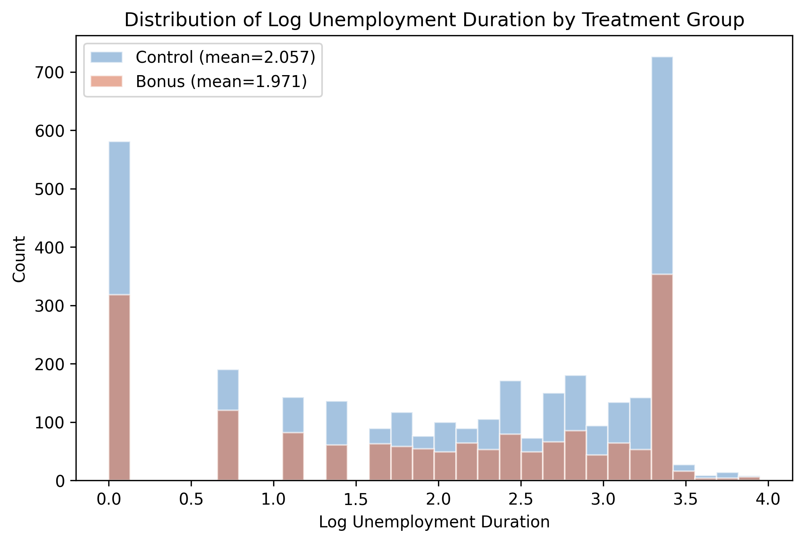
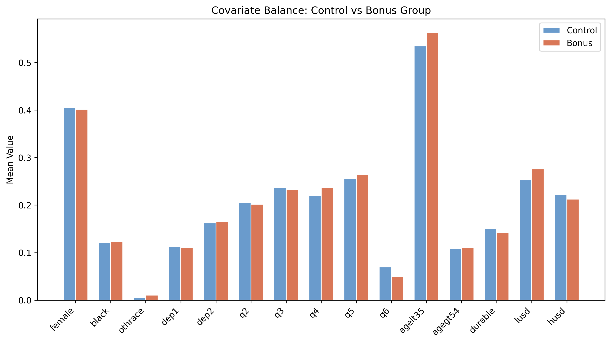
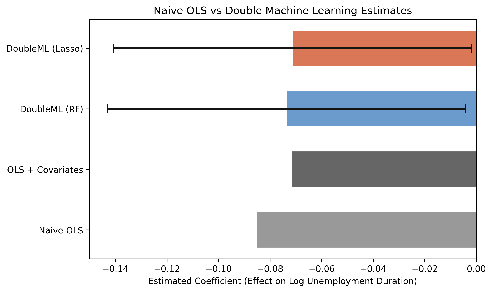
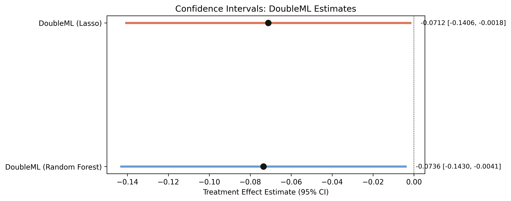

---
authors:
  - admin
categories:
  - Python
  - Causal Inference
  - Machine Learning
  - Cross-sectional Data
  - Double Machine Learning
  - Random Forest
  - LASSO
draft: false
featured: false
date: "2026-03-10T00:00:00Z"
external_link: ""
image:
  caption: ""
  focal_point: Smart
  placement: 3
links:
- icon: open-data
  icon_pack: ai
  name: "[Python] Google Colab"
  url: https://colab.research.google.com/github/cmg777/starter-academic-v501/blob/master/content/post/python_doubleml/notebook.ipynb
- icon: code
  icon_pack: fas
  name: "Python script"
  url: script.py
- icon: book
  icon_pack: fas
  name: "Jupyter notebook"
  url: notebook.ipynb
slides:
summary: Estimating the causal effect of a cash bonus on unemployment duration using Double Machine Learning with the Pennsylvania Bonus Experiment
tags:
  - python
  - causal
  - causal inference
  - machine learning
title: "Introduction to Causal Inference: Double Machine Learning"
url_code: ""
url_pdf: ""
url_slides: ""
url_video: ""
toc: true
---

## Overview

Does a cash bonus actually cause unemployed workers to find jobs faster, or do the workers who receive bonuses simply differ from those who do not? This is the core challenge of **causal inference**: separating a genuine treatment effect from the influence of *confounders* — variables that affect both the treatment and the outcome, creating spurious associations. Standard regression can adjust for these confounders, but when their relationship with the outcome is complex and nonlinear, linear models may fail to fully remove bias.

**Double Machine Learning (DML)** addresses this problem by using flexible machine learning models to partial out the confounding variation, then estimating the causal effect on the cleaned residuals. In this tutorial we apply DML to the Pennsylvania Bonus Experiment, a real randomized study where some unemployment insurance claimants received a cash bonus for finding employment quickly. We estimate how much the bonus reduced unemployment duration, and we compare DML estimates against naive and covariate-adjusted OLS to see how debiasing changes the results.

**Learning objectives:**

- Understand why prediction and causal inference require different approaches
- Learn the Partially Linear Regression (PLR) model and the partialling-out estimator
- Implement Double Machine Learning with cross-fitting using the `doubleml` package
- Interpret causal effect estimates, standard errors, and confidence intervals
- Assess robustness by comparing results across different ML learners

### Key concepts at a glance

The post leans on a small vocabulary repeatedly. The rest of the tutorial assumes you can move between these terms quickly. Each concept below has three parts. The **definition** is always visible. The **example** and **analogy** sit behind clickable cards: open them when you need them, leave them collapsed for a quick scan. If a later section mentions "partial-linear model" or "Neyman orthogonality" and the term feels slippery, this is the section to re-read.

**1. Partial-linear model (PLR)** $Y = \theta D + g(X) + \epsilon$. Outcome equals a linear-in-treatment term plus a flexible (possibly non-linear) function of covariates plus noise. Linearity is imposed *only* on $D$.

<div class="concept-pair">
<details class="concept-card concept-example"><summary>Example</summary>

In this post $Y$ is `inuidur1` (log unemployment duration), $D$ is `tg` (bonus offer), and $X$ contains demographics. PLR captures any non-linearity in covariates while keeping the bonus effect a single number.

</details>
<details class="concept-card concept-analogy"><summary>Analogy</summary>

A sandwich with a fixed slice of treatment between flexible bread layers.

</details>
</div>

**2. Nuisance functions** $g(X)$, $m(X)$. The flexible parts: $g(X)$ predicts $Y$ from $X$, and $m(X)$ predicts $D$ from $X$. ML learners fit both. They are "nuisance" because we don't care about them for inference.

<div class="concept-pair">
<details class="concept-card concept-example"><summary>Example</summary>

In this post a Random Forest with 500 trees and max\_depth = 5 fits both $g$ and $m$. The RCT means $m(X)$ is roughly constant (the assignment probability), but $g(X)$ still absorbs predictive variation in `inuidur1`.

</details>
<details class="concept-card concept-analogy"><summary>Analogy</summary>

The auto-pilot that handles everything except the steering wheel.

</details>
</div>

**3. Treatment effect** $\theta$. The single number we care about: the average effect of the treatment on the outcome, holding covariates fixed via the nuisance functions.

<div class="concept-pair">
<details class="concept-card concept-example"><summary>Example</summary>

DML-RF in this post yields $\hat\theta = -0.0736$ (SE 0.0354, p = 0.0378). Receiving the bonus *offer* shortens log unemployment duration by 7.4% — a precision-driven significant effect.

</details>
<details class="concept-card concept-analogy"><summary>Analogy</summary>

The steering-wheel tilt — the only knob the analyst directly cares about.

</details>
</div>

**4. Cross-fitting** sample-split + swap. Split the data into folds. Estimate nuisance functions on one fold, the treatment effect on the other, then swap and average. Removes overfitting bias.

<div class="concept-pair">
<details class="concept-card concept-example"><summary>Example</summary>

This post uses 5-fold cross-fitting. Each fold's $\hat\theta$ is computed using nuisance functions trained on the *other* four folds, then averaged across folds for the final estimate.

</details>
<details class="concept-card concept-analogy"><summary>Analogy</summary>

Swap who tastes the soup with who cooks it.

</details>
</div>

**5. Neyman orthogonality** $E[\partial\_\eta \psi] = 0$. The score function $\psi$ has zero expected gradient with respect to the nuisance parameters $\eta$ at the truth. Means small ML errors in $\hat\eta$ do not bias $\hat\theta$.

<div class="concept-pair">
<details class="concept-card concept-example"><summary>Example</summary>

The PLR's residualised score `(Y - g(X))(D - m(X))` is Neyman-orthogonal. So even if the Random Forest's $\hat g$ is slightly off, the DML-RF estimate $\hat\theta = -0.0736$ stays consistent.

</details>
<details class="concept-card concept-analogy"><summary>Analogy</summary>

A lever balanced so a small wobble at the fulcrum does not tip the load.

</details>
</div>

**6. ML learner choice** RF, LASSO, gradient boosting. Plug-in flexibility: any sufficiently fast ML algorithm can serve as the nuisance learner. Different algorithms make different bias-variance trade-offs.

<div class="concept-pair">
<details class="concept-card concept-example"><summary>Example</summary>

This post tries Random Forest (500 trees) and LASSO. RF gives -0.0736, LASSO gives -0.0712 — within one decimal of each other.

</details>
<details class="concept-card concept-analogy"><summary>Analogy</summary>

Picking which auto-pilot model to install.

</details>
</div>

**7. Sensitivity to learner**. Compare point estimates and SEs across learners. If the answer depends heavily on the choice, the result is fragile.

<div class="concept-pair">
<details class="concept-card concept-example"><summary>Example</summary>

In this post DML-RF (-0.0736) and DML-LASSO (-0.0712) agree to within 0.0024, both significant at 5%. The bonus effect survives the learner swap — strong robustness signal.

</details>
<details class="concept-card concept-analogy"><summary>Analogy</summary>

Checking the steering wheel reads the same with two different auto-pilots.

</details>
</div>

**8. RCT + covariate adjustment**. In a randomised experiment, treatment is exogenous by design — DML adjustment cannot "fix bias" because there is none. But it can *reduce variance* by absorbing predictive covariates.

<div class="concept-pair">
<details class="concept-card concept-example"><summary>Example</summary>

In this Pennsylvania RCT, naive OLS gives -0.0855 (no covariates) vs DML-RF -0.0736 (with covariates). The point estimates are similar; what changes is precision — the SE shrinks because covariates explain part of `inuidur1`.

</details>
<details class="concept-card concept-analogy"><summary>Analogy</summary>

Sharpening a focus knob even after the lens is already centred.

</details>
</div>

## Setup and imports

Before running the analysis, install the required package if needed:

```python
pip install doubleml
```

The following code imports all necessary libraries and sets the configuration variables for our analysis. We use `RANDOM_SEED = 42` throughout to ensure reproducibility, and define the outcome, treatment, and covariate columns that will be used in all subsequent steps.

```python
import numpy as np
import pandas as pd
import matplotlib.pyplot as plt
from sklearn.base import clone
from sklearn.ensemble import RandomForestRegressor
from sklearn.linear_model import LassoCV, LinearRegression
from doubleml import DoubleMLData, DoubleMLPLR
from doubleml.datasets import fetch_bonus

# Reproducibility
RANDOM_SEED = 42
np.random.seed(RANDOM_SEED)

# Configuration
OUTCOME = "inuidur1"
OUTCOME_LABEL = "Log Unemployment Duration"
TREATMENT = "tg"
COVARIATES = [
    "female", "black", "othrace", "dep1", "dep2",
    "q2", "q3", "q4", "q5", "q6",
    "agelt35", "agegt54", "durable", "lusd", "husd",
]
```

## Data loading: The Pennsylvania Bonus Experiment

The Pennsylvania Bonus Experiment is a well-known dataset in labor economics. In this study, a random subset of unemployment insurance claimants was offered a cash bonus if they found a new job within a qualifying period. The dataset records whether each claimant received the bonus offer (treatment) and how long they remained unemployed (outcome), along with demographic and labor market covariates.

```python
df = fetch_bonus("DataFrame")

print(f"Dataset shape: {df.shape}")
print(f"Observations: {len(df)}")
print(f"\nTreatment groups:")
print(df[TREATMENT].value_counts().rename({0: "Control", 1: "Bonus"}))
print(f"\nOutcome ({OUTCOME}) summary:")
print(df[OUTCOME].describe().round(3))
```

```
Dataset shape: (5099, 26)
Observations: 5099

Treatment groups:
tg
Control    3354
Bonus      1745
Name: count, dtype: int64

Outcome (inuidur1) summary:
count    5099.000
mean        2.028
std         1.215
min         0.000
25%         1.099
50%         2.398
75%         3.219
max         3.951
Name: inuidur1, dtype: float64
```

The dataset contains 5,099 unemployment insurance claimants with 26 variables. The treatment is unevenly split: 1,745 claimants received the bonus offer while 3,354 served as controls. The outcome variable, log unemployment duration (`inuidur1`), ranges from 0.0 to 3.95 with a mean of 2.028 and standard deviation of 1.215, indicating substantial variation in how long claimants remained unemployed. The median (2.398) exceeds the mean, suggesting a left-skewed distribution where some claimants found jobs very quickly. The interquartile range spans from 1.099 to 3.219, meaning the middle 50% of claimants had log durations in this band.

## Exploratory data analysis

### Outcome distribution by treatment group

Before modeling, we examine whether the outcome distributions differ visibly between treated and control groups. While a randomized experiment should produce balanced groups on average, visualizing the raw data helps us understand the structure of the outcome and spot any obvious patterns.

```python
fig, ax = plt.subplots(figsize=(8, 5))
for group, label, color in [(0, "Control", "#6a9bcc"), (1, "Bonus", "#d97757")]:
    subset = df[df[TREATMENT] == group][OUTCOME]
    ax.hist(subset, bins=30, alpha=0.6, label=f"{label} (mean={subset.mean():.3f})",
            color=color, edgecolor="white")
ax.set_xlabel(OUTCOME_LABEL)
ax.set_ylabel("Count")
ax.set_title(f"Distribution of {OUTCOME_LABEL} by Treatment Group")
ax.legend()
plt.savefig("doubleml_outcome_by_treatment.png", dpi=300, bbox_inches="tight")
plt.show()
```



The histogram reveals that both groups share a similar shape, with a concentration of claimants at higher log durations (around 3.0--3.5) and a spread of shorter durations below 2.0. The bonus group shows a slightly lower mean (1.971) compared to the control group (2.057), a difference of about 0.09 log points. This raw gap hints at a potential treatment effect, but we cannot yet attribute it to the bonus because confounders may also differ between groups.

### Covariate balance

In a well-designed randomized experiment, the distribution of covariates should be roughly similar across treatment and control groups. We check this balance to verify that randomization worked as expected and to understand which characteristics might confound the treatment-outcome relationship if balance is imperfect.

```python
covariate_means = df.groupby(TREATMENT)[COVARIATES].mean()

fig, ax = plt.subplots(figsize=(12, 6))
x = np.arange(len(COVARIATES))
width = 0.35
ax.bar(x - width / 2, covariate_means.loc[0], width, label="Control",
       color="#6a9bcc", edgecolor="white")
ax.bar(x + width / 2, covariate_means.loc[1], width, label="Bonus",
       color="#d97757", edgecolor="white")
ax.set_xticks(x)
ax.set_xticklabels(COVARIATES, rotation=45, ha="right")
ax.set_ylabel("Mean Value")
ax.set_title("Covariate Balance: Control vs Bonus Group")
ax.legend()
plt.savefig("doubleml_covariate_balance.png", dpi=300, bbox_inches="tight")
plt.show()
```



The covariate means are nearly identical across treatment and control groups for all 15 covariates, confirming that randomization produced well-balanced groups. Demographic variables like `female`, `black`, and age indicators show negligible differences, as do the economic indicators (`durable`, `lusd`, `husd`). This balance is reassuring: it means that any difference in unemployment duration between groups is unlikely to be driven by observable confounders. Nevertheless, DML provides a principled way to adjust for these covariates and improve precision.

## Why adjust for covariates?

Because the Pennsylvania Bonus Experiment is a randomized trial, treatment assignment is independent of covariates by design — there is no confounding bias to remove. However, adjusting for covariates can still improve the *precision* of the causal estimate by absorbing residual variation in the outcome. In observational studies, covariate adjustment is essential to avoid confounding bias, but even in an RCT, it sharpens inference. The question is *how* to adjust. Standard OLS assumes a linear relationship between covariates and the outcome, which may miss complex nonlinear patterns. The naive OLS model regresses the outcome $Y$ directly on the treatment $D$:

$$Y\_i = \alpha + \beta \\, D\_i + \epsilon\_i \quad \text{(naive, no covariates)}$$

Adding covariates $X$ linearly gives:

$$Y\_i = \alpha + \beta \\, D\_i + X\_i' \gamma + \epsilon\_i \quad \text{(with covariates)}$$

In our data, $Y\_i$ is `inuidur1` (log unemployment duration), $D\_i$ is `tg` (the bonus indicator), and $X\_i$ contains the 15 demographic and labor market covariates. In both cases, $\beta$ is the estimated treatment effect. But if the true relationship between $X$ and $Y$ is nonlinear, the linear specification may leave residual confounding in $\hat{\beta}$.

### Naive OLS baseline

We start with two simple OLS regressions to establish baseline estimates: one with no covariates (naive), and one that linearly adjusts for all 15 covariates. These provide a reference point for evaluating how much DML's flexible adjustment changes the estimated treatment effect.

```python
# Naive OLS: no covariates
ols = LinearRegression()
ols.fit(df[[TREATMENT]], df[OUTCOME])
naive_coef = ols.coef_[0]

# OLS with covariates
ols_full = LinearRegression()
ols_full.fit(df[[TREATMENT] + COVARIATES], df[OUTCOME])
ols_full_coef = ols_full.coef_[0]

print(f"Naive OLS coefficient (no covariates): {naive_coef:.4f}")
print(f"OLS with covariates coefficient:       {ols_full_coef:.4f}")
```

```
Naive OLS coefficient (no covariates): -0.0855
OLS with covariates coefficient:       -0.0717
```

The naive OLS estimate is -0.0855, suggesting that the bonus is associated with an 8.6% reduction in log unemployment duration. Adding covariates shifts the estimate to -0.0717 (7.2% reduction). In a randomized experiment, this shift reflects precision improvement from absorbing residual variation — not confounding bias removal. Even so, linear adjustment may not capture complex nonlinear relationships between covariates and the outcome. Double Machine Learning will use flexible ML models to more thoroughly partial out covariate effects and further sharpen the estimate.

## What is Double Machine Learning?

### The Partially Linear Regression (PLR) model

Double Machine Learning operates within the **Partially Linear Regression** framework. The key idea is that the outcome $Y$ depends on the treatment $D$ through a linear coefficient (the causal effect we want) plus a potentially complex, nonlinear function of covariates $X$. The PLR model consists of two structural equations:

$$Y = D \\, \theta\_0 + g\_0(X) + \varepsilon, \quad E[\varepsilon \mid D, X] = 0$$

$$D = m\_0(X) + V, \quad E[V \mid X] = 0$$

Here, $\theta\_0$ is the causal parameter of interest — the **Average Treatment Effect (ATE)** of the bonus on unemployment duration. The function $g\_0(\cdot)$ is a *nuisance function*, meaning it is not our target but something we must estimate along the way; it captures how covariates affect the outcome. Similarly, $m\_0(\cdot)$ models how covariates predict treatment assignment. Think of nuisance functions as scaffolding: essential during construction but not part of the final result. The error terms $\varepsilon$ and $V$ are orthogonal to the covariates by construction. In our data, $Y$ = `inuidur1`, $D$ = `tg`, and $X$ includes the 15 covariate columns in `COVARIATES`. The challenge is that both $g\_0$ and $m\_0$ can be arbitrarily complex — DML uses machine learning to estimate them flexibly.

### The partialling-out estimator

The DML algorithm works in two stages. First, it uses ML models to predict the outcome from covariates alone (estimating $E[Y \mid X]$) and to predict the treatment from covariates alone (estimating $E[D \mid X]$). Then it computes residuals from both predictions — the part of $Y$ not explained by $X$, and the part of $D$ not explained by $X$:

$$\tilde{Y} = Y - \hat{g}\_0(X) = Y - \hat{E}[Y \mid X]$$

$$\tilde{D} = D - \hat{m}\_0(X) = D - \hat{E}[D \mid X]$$

Finally, it regresses the outcome residuals on the treatment residuals to obtain the causal estimate:

$$\hat{\theta}\_0 = \left( \frac{1}{N} \sum\_{i=1}^{N} \tilde{D}\_i^2 \right)^{-1} \frac{1}{N} \sum\_{i=1}^{N} \tilde{D}\_i \\, \tilde{Y}\_i$$

Think of this like noise-canceling headphones: the ML models learn the "noise" pattern (how covariates influence both $Y$ and $D$), and we subtract it away so that only the "signal" — the causal relationship between $D$ and $Y$ — remains.

### Cross-fitting: why it matters

A naive implementation of partialling-out would use the same data to fit the ML models and compute residuals. This introduces **regularization bias** — a distortion that occurs because the ML model's complexity penalty contaminates the causal estimate. DML solves this with **cross-fitting**: the data is split into $K$ folds, and each fold's residuals are computed using ML models trained on the other $K-1$ folds. Think of it like grading exams: to avoid bias, we split the class into groups where each group's predictions are made by a model that never saw their data. The cross-fitted estimator is:

$$\hat{\theta}\_0^{CF} = \left( \frac{1}{N} \sum\_{k=1}^{K} \sum\_{i \in I\_k} \left(\tilde{D}\_i^{(k)}\right)^2 \right)^{-1} \frac{1}{N} \sum\_{k=1}^{K} \sum\_{i \in I\_k} \tilde{D}\_i^{(k)} \\, \tilde{Y}\_i^{(k)}$$

where $\tilde{Y}\_i^{(k)}$ and $\tilde{D}\_i^{(k)}$ are residuals for observation $i$ in fold $k$, computed using models trained on all folds except $k$. In words, we average the treatment effect estimates across all folds, where each fold's estimate uses residuals computed from models that never saw that fold's data. This ensures that the residuals are computed out-of-sample, eliminating overfitting bias and preserving valid statistical inference (standard errors, p-values, confidence intervals).

## Setting up DoubleML

The `doubleml` package provides a clean interface for implementing DML. We first wrap our data into a `DoubleMLData` object that specifies the outcome, treatment, and covariate columns. Then we configure the ML learners: Random Forest regressors for both the outcome model `ml_l` (estimating $\hat{g}\_0$) and the treatment model `ml_m` (estimating $\hat{m}\_0$).

```python
# Prepare data for DoubleML
dml_data = DoubleMLData(df, y_col=OUTCOME, d_cols=TREATMENT, x_cols=COVARIATES)
print(dml_data)
```

```
================== DoubleMLData Object ==================

------------------ Data summary      ------------------
Outcome variable: inuidur1
Treatment variable(s): ['tg']
Covariates: ['female', 'black', 'othrace', 'dep1', 'dep2', 'q2', 'q3', 'q4', 'q5', 'q6', 'agelt35', 'agegt54', 'durable', 'lusd', 'husd']
Instrument variable(s): None
No. Observations: 5099
```

The `DoubleMLData` object confirms our setup: `inuidur1` as the outcome, `tg` as the treatment, and all 15 covariates registered. The object reports 5,099 observations and no instrumental variables, which is correct for the PLR model. Separating the data into these three roles is fundamental to DML: the covariates $X$ will be partialled out from both $Y$ and $D$, while the treatment-outcome relationship $\theta\_0$ is the sole target of inference.

Now we configure the ML learners. We use Random Forest with 500 trees, max depth of 5, and `sqrt` feature sampling — a moderate configuration that balances flexibility with regularization.

```python
# Configure ML learners
learner = RandomForestRegressor(n_estimators=500, max_features="sqrt",
                                max_depth=5, random_state=RANDOM_SEED)
ml_l_rf = clone(learner)  # Learner for E[Y|X]
ml_m_rf = clone(learner)  # Learner for E[D|X]

print(f"ml_l (outcome model): {type(ml_l_rf).__name__}")
print(f"ml_m (treatment model): {type(ml_m_rf).__name__}")
print(f"  n_estimators={learner.n_estimators}, max_depth={learner.max_depth}, max_features='{learner.max_features}'")
```

```
ml_l (outcome model): RandomForestRegressor
ml_m (treatment model): RandomForestRegressor
  n_estimators=500, max_depth=5, max_features='sqrt'
```

Both the outcome and treatment models use `RandomForestRegressor` with 500 estimators and max depth 5. The `clone()` function creates independent copies so that each model is trained separately during the DML fitting process. The `max_features='sqrt'` setting means each split considers only the square root of 15 covariates (about 4 features), adding randomness that reduces overfitting. Capping tree depth at 5 prevents overfitting to individual observations while still capturing nonlinear interactions among covariates — a balance that matters because overly complex nuisance models can destabilize the cross-fitted residuals.

## Fitting the PLR model

With data and learners configured, we fit the Partially Linear Regression model using 5-fold cross-fitting. The `DoubleMLPLR` class handles the full DML pipeline: splitting data into folds, fitting ML models on training folds, computing out-of-sample residuals, and estimating the causal coefficient with valid standard errors.

```python
np.random.seed(RANDOM_SEED)
dml_plr_rf = DoubleMLPLR(dml_data, ml_l_rf, ml_m_rf, n_folds=5)
dml_plr_rf.fit()

print(dml_plr_rf.summary)
```

```
       coef   std err         t     P>|t|     2.5 %    97.5 %
tg -0.0736    0.0354    -2.077     0.0378   -0.1430   -0.0041
```

The DML estimate with Random Forest learners yields a treatment coefficient of -0.0736 with a standard error of 0.0354. The t-statistic is -2.077, producing a p-value of 0.0378, which is statistically significant at the 5% level. The 95% confidence interval is [-0.1430, -0.0041], meaning we are 95% confident that the true causal effect of the bonus lies between a 14.3% and 0.4% reduction in log unemployment duration.

## Interpreting the results

Let us extract and interpret the key quantities from the fitted model to understand both the statistical and practical significance of the estimated treatment effect.

```python
rf_coef = dml_plr_rf.coef[0]
rf_se = dml_plr_rf.se[0]
rf_pval = dml_plr_rf.pval[0]
rf_ci = dml_plr_rf.confint().values[0]

print(f"Coefficient (theta_0):  {rf_coef:.4f}")
print(f"Standard Error:         {rf_se:.4f}")
print(f"p-value:                {rf_pval:.4f}")
print(f"95% CI:                 [{rf_ci[0]:.4f}, {rf_ci[1]:.4f}]")
print(f"\nInterpretation:")
print(f"  The bonus reduces log unemployment duration by {abs(rf_coef):.4f}.")
print(f"  This corresponds to approximately a {abs(rf_coef)*100:.1f}% reduction.")
print(f"  We are 95% confident the true effect lies between")
print(f"  {abs(rf_ci[1])*100:.1f}% and {abs(rf_ci[0])*100:.1f}% reduction.")
```

```
Coefficient (theta_0):  -0.0736
Standard Error:         0.0354
p-value:                0.0378
95% CI:                 [-0.1430, -0.0041]

Interpretation:
  The bonus reduces log unemployment duration by 0.0736.
  This corresponds to approximately a 7.4% reduction.
  We are 95% confident the true effect lies between
  0.4% and 14.3% reduction.
```

The estimated causal effect is $\hat{\theta}\_0 = -0.0736$, meaning the cash bonus reduces log unemployment duration by approximately 7.4%. Since the outcome is in log scale, this translates to roughly a 7.1% proportional reduction in actual unemployment duration (using $e^{-0.0736} - 1 \approx -0.071$). The effect is statistically significant ($p = 0.0378$), and the 95% confidence interval is constructed as:

$$\text{CI}\_{95\\%} = \hat{\theta}\_0 \pm 1.96 \times \text{SE}(\hat{\theta}\_0) = -0.0736 \pm 1.96 \times 0.0354 = [-0.1430, \\; -0.0041]$$

The interval excludes zero, confirming that the bonus has a genuine causal impact. However, the wide interval — spanning from a 0.4% to 14.3% reduction — reflects meaningful uncertainty about the exact magnitude.

## Sensitivity: does the choice of ML learner matter?

A key advantage of DML is that it is *agnostic* to the choice of ML learner, as long as the learner is flexible enough to approximate the true confounding function. To verify that our results are not driven by the specific choice of Random Forest, we re-estimate the model using Lasso, a fundamentally different class of learner. Lasso is a linear regression with L1 regularization, meaning it adds a penalty proportional to the absolute size of each coefficient, which drives some coefficients to exactly zero and effectively performs variable selection.

```python
ml_l_lasso = LassoCV()
ml_m_lasso = LassoCV()

np.random.seed(RANDOM_SEED)
dml_plr_lasso = DoubleMLPLR(dml_data, ml_l_lasso, ml_m_lasso, n_folds=5)
dml_plr_lasso.fit()

print(dml_plr_lasso.summary)
```

```
       coef   std err         t     P>|t|     2.5 %    97.5 %
tg -0.0712    0.0354    -2.009     0.0445   -0.1406   -0.0018
```

The Lasso-based DML estimate is -0.0712 with a standard error of 0.0354 and p-value of 0.0445. This is remarkably close to the Random Forest estimate of -0.0736, with a difference of only 0.0024 — less than 7% of the standard error. The 95% confidence interval is [-0.1406, -0.0018], which also excludes zero. The near-identical results across two fundamentally different learners strongly support the robustness of the estimated treatment effect.

## Comparing all estimates

To see how different estimation strategies affect the results, we visualize all four coefficient estimates side by side: naive OLS, OLS with covariates, DML with Random Forest, and DML with Lasso. The DML estimates include confidence intervals derived from valid statistical inference.

```python
lasso_coef = dml_plr_lasso.coef[0]
lasso_se = dml_plr_lasso.se[0]
lasso_ci = dml_plr_lasso.confint().values[0]

fig, ax = plt.subplots(figsize=(8, 5))
methods = ["Naive OLS", "OLS + Covariates", "DoubleML (RF)", "DoubleML (Lasso)"]
coefs = [naive_coef, ols_full_coef, rf_coef, lasso_coef]
colors = ["#999999", "#666666", "#6a9bcc", "#d97757"]

ax.barh(methods, coefs, color=colors, edgecolor="white", height=0.6)
ax.errorbar(rf_coef, 2, xerr=[[rf_coef - rf_ci[0]], [rf_ci[1] - rf_coef]],
            fmt="none", color="#141413", capsize=5, linewidth=2)
ax.errorbar(lasso_coef, 3, xerr=[[lasso_coef - lasso_ci[0]], [lasso_ci[1] - lasso_coef]],
            fmt="none", color="#141413", capsize=5, linewidth=2)
ax.axvline(0, color="black", linewidth=0.5, linestyle="--")
ax.set_xlabel("Estimated Coefficient (Effect on Log Unemployment Duration)")
ax.set_title("Naive OLS vs Double Machine Learning Estimates")
plt.savefig("doubleml_coefficient_comparison.png", dpi=300, bbox_inches="tight")
plt.show()
```



All four methods agree on the direction and approximate magnitude of the treatment effect: the bonus reduces unemployment duration. The naive OLS estimate (-0.0855) is the largest in absolute terms, while covariate adjustment and DML both shrink it toward -0.07. The DML estimates with Random Forest (-0.0736) and Lasso (-0.0712) cluster closely together and fall between the two OLS benchmarks. Crucially, only the DML estimates come with valid confidence intervals, both of which exclude zero, providing statistical evidence that the effect is real.

## Confidence intervals

To better visualize the uncertainty around the DML estimates, we plot the 95% confidence intervals for both the Random Forest and Lasso specifications. If both intervals are similar and exclude zero, this strengthens our confidence in the causal conclusion.

```python
fig, ax = plt.subplots(figsize=(8, 4))
y_pos = [0, 1]
labels = ["DoubleML (Random Forest)", "DoubleML (Lasso)"]
point_estimates = [rf_coef, lasso_coef]
ci_low = [rf_ci[0], lasso_ci[0]]
ci_high = [rf_ci[1], lasso_ci[1]]

for i, (est, lo, hi, label) in enumerate(zip(point_estimates, ci_low, ci_high, labels)):
    ax.plot([lo, hi], [i, i], color="#6a9bcc" if i == 0 else "#d97757", linewidth=3)
    ax.plot(est, i, "o", color="#141413", markersize=8, zorder=5)
    ax.text(hi + 0.005, i, f"{est:.4f} [{lo:.4f}, {hi:.4f}]", va="center", fontsize=9)

ax.axvline(0, color="black", linewidth=0.5, linestyle="--")
ax.set_yticks(y_pos)
ax.set_yticklabels(labels)
ax.set_xlabel("Treatment Effect Estimate (95% CI)")
ax.set_title("Confidence Intervals: DoubleML Estimates")
plt.savefig("doubleml_confint.png", dpi=300, bbox_inches="tight")
plt.show()
```



Both confidence intervals are nearly identical in width and position, spanning from roughly -0.14 to near zero. The Random Forest interval [-0.1430, -0.0041] and Lasso interval [-0.1406, -0.0018] both exclude zero, but just barely — the upper bounds are very close to zero (0.4% and 0.2% reduction, respectively). This tells us that while the bonus has a statistically significant negative effect on unemployment duration, the effect size is modest and estimated with considerable uncertainty.

## Summary table

| Method | Coefficient | Std Error | p-value | 95% CI |
|--------|-------------|-----------|---------|--------|
| Naive OLS | -0.0855 | -- | -- | -- |
| OLS + Covariates | -0.0717 | -- | -- | -- |
| DoubleML (RF) | -0.0736 | 0.0354 | 0.0378 | [-0.1430, -0.0041] |
| DoubleML (Lasso) | -0.0712 | 0.0354 | 0.0445 | [-0.1406, -0.0018] |

The summary table confirms a consistent pattern across all four estimation methods. The naive OLS gives the largest estimate at -0.0855; adjusting for covariates improves precision and shifts the estimate toward -0.07. The two DML specifications produce very similar estimates of -0.0736 and -0.0712. Both DML p-values are below 0.05, providing statistically significant evidence of a causal effect. The standard errors are identical (0.0354), which is expected since both use the same sample size and cross-fitting structure.

## Discussion

The Pennsylvania Bonus Experiment provides a clear demonstration of Double Machine Learning in action. Because the experiment was randomized, the DML estimates are close to the OLS estimates — the confounding function $g\_0(X)$ is relatively flat when treatment assignment is independent of covariates. This is actually reassuring: in a well-designed experiment, flexible covariate adjustment should not dramatically change the results, and indeed the DML estimates ($\hat{\theta}\_0 = -0.0736, -0.0712$) are close to the covariate-adjusted OLS (-0.0717).

The key finding is that the cash bonus reduces log unemployment duration by approximately 7.4%, and this effect is statistically significant (p < 0.05). In practical terms, this means the bonus incentive helped claimants find new jobs somewhat faster. However, the wide confidence intervals suggest that the true effect could be as small as 0.4% or as large as 14.3%, so policymakers should be cautious about the precise magnitude.

The robustness across learners (Random Forest vs. Lasso) is a strength of DML. Both learners capture similar confounding structure, and the near-identical estimates provide evidence that the result is not an artifact of a particular modeling choice.

## Summary and next steps

This tutorial demonstrated Double Machine Learning for causal inference using the Pennsylvania Bonus Experiment. The key takeaways are:

- **Method:** DML's main advantage over OLS is not the point estimate (both give ~7% here) but the *infrastructure* — valid standard errors, confidence intervals, and robustness to nonlinear confounding. On this RCT the estimates are similar; on observational data where $g\_0(X)$ is complex, OLS would break down while DML remains valid
- **Data:** The cash bonus reduces unemployment duration by 7.4% ($p = 0.038$, 95% CI: [-14.3%, -0.4%]). The wide CI means the true effect could be anywhere from negligible to substantial — policymakers should not over-interpret the point estimate
- **Robustness:** Random Forest and Lasso produce nearly identical estimates (-0.0736 vs -0.0712), differing by less than 7% of the standard error. This learner-agnosticism is a core strength of the DML framework
- **Limitation:** The PLR model assumes a constant treatment effect ($\theta\_0$ is the same for everyone). If the bonus helps some subgroups more than others (e.g., younger vs. older workers), PLR will average over this heterogeneity — use the Interactive Regression Model (IRM) to detect it

**Limitations:**

- The Pennsylvania Bonus Experiment is a randomized trial, which is the easiest setting for causal inference. DML's advantages are more pronounced in observational studies where confounding is severe
- We used the PLR model, which assumes a linear treatment effect ($\theta\_0$ is constant). More complex treatment heterogeneity could be explored with the Interactive Regression Model (IRM)
- The confidence intervals are wide, reflecting limited sample size and moderate signal strength
- We did not explore heterogeneous treatment effects — situations where the bonus might help some subgroups (e.g., younger workers, women) more than others

**Next steps:**

- Apply DML to an observational dataset where confounding is more severe
- Explore the Interactive Regression Model for binary treatments
- Investigate treatment effect heterogeneity using DoubleML's `cate()` functionality
- Compare additional ML learners (gradient boosting, neural networks)

## Exercises

1. **Change the number of folds.** Re-run the DML analysis with `n_folds=3` and `n_folds=10`. How do the estimates and standard errors change? What are the tradeoffs of using more vs. fewer folds?

2. **Try a different ML learner.** Replace the Random Forest with `GradientBoostingRegressor` from scikit-learn. Does the estimated treatment effect change? Compare the result to the RF and Lasso estimates.

3. **Investigate heterogeneous effects.** Split the sample by gender (`female`) and estimate the DML treatment effect separately for men and women. Is the bonus more effective for one group? What might explain any differences?

## References

**Academic references:**

1. [Chernozhukov, V., Chetverikov, D., Demirer, M., Duflo, E., Hansen, C., Newey, W., & Robins, J. (2018). Double/Debiased Machine Learning for Treatment and Structural Parameters. The Econometrics Journal, 21(1), C1--C68.](https://doi.org/10.1111/ectj.12097)
2. [Woodbury, S. A., & Spiegelman, R. G. (1987). Bonuses to Workers and Employers to Reduce Unemployment: Randomized Trials in Illinois. American Economic Review, 77(4), 513--530.](https://www.jstor.org/stable/1814176)
3. [Pennsylvania Bonus Experiment Dataset -- DoubleML](https://docs.doubleml.org/stable/api/datasets.html#doubleml.datasets.fetch_bonus)

**Package and API documentation:**

4. [DoubleML -- Python Documentation](https://docs.doubleml.org/stable/intro/intro.html)
5. [DoubleMLPLR -- API Reference](https://docs.doubleml.org/stable/api/generated/doubleml.DoubleMLPLR.html)
6. [DoubleMLData -- API Reference](https://docs.doubleml.org/stable/api/generated/doubleml.DoubleMLData.html)
7. [scikit-learn -- RandomForestRegressor](https://scikit-learn.org/stable/modules/generated/sklearn.ensemble.RandomForestRegressor.html)
8. [scikit-learn -- LassoCV](https://scikit-learn.org/stable/modules/generated/sklearn.linear_model.LassoCV.html)
9. [scikit-learn -- LinearRegression](https://scikit-learn.org/stable/modules/generated/sklearn.linear_model.LinearRegression.html)
10. [NumPy -- Documentation](https://numpy.org/doc/stable/)
11. [pandas -- Documentation](https://pandas.pydata.org/docs/)
12. [Matplotlib -- Documentation](https://matplotlib.org/stable/)

#### Acknowledgements

AI tools (Claude Code, Gemini, NotebookLM) were used to make the contents of this post more accessible to students. Nevertheless, the content in this post may still have errors. Caution is needed when applying the contents of this post to true research projects.
