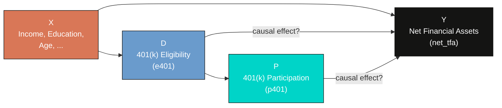
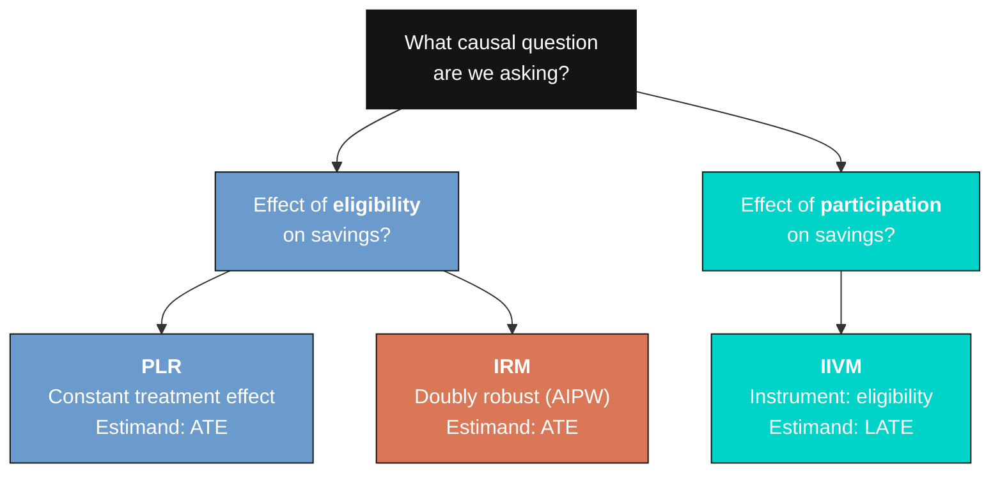
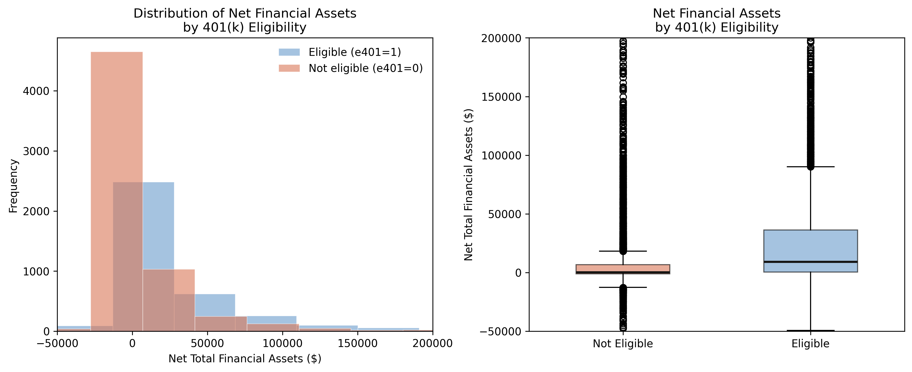
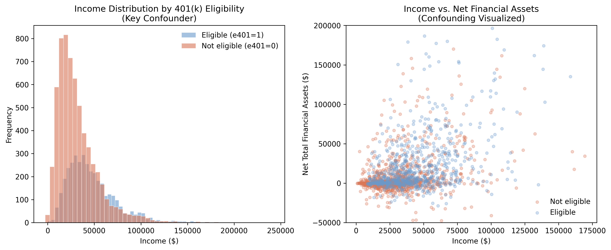
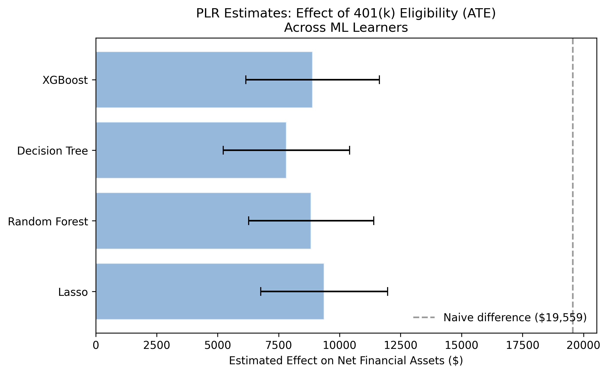
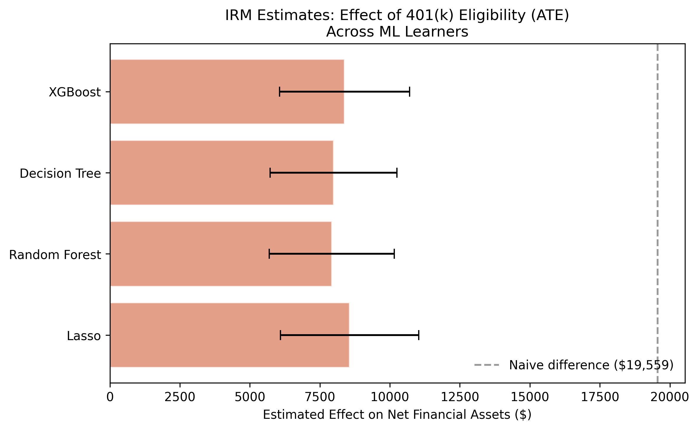
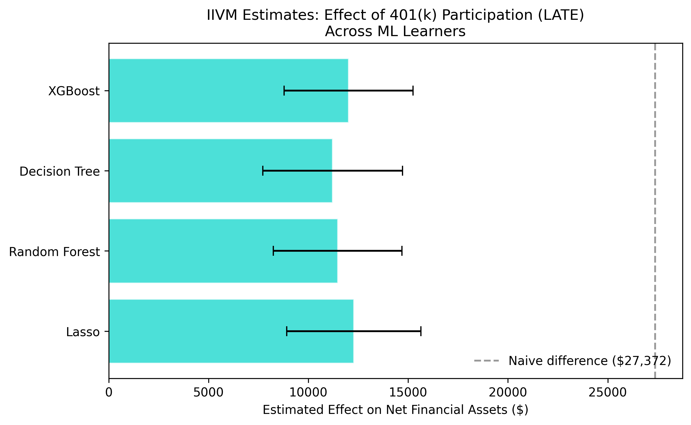
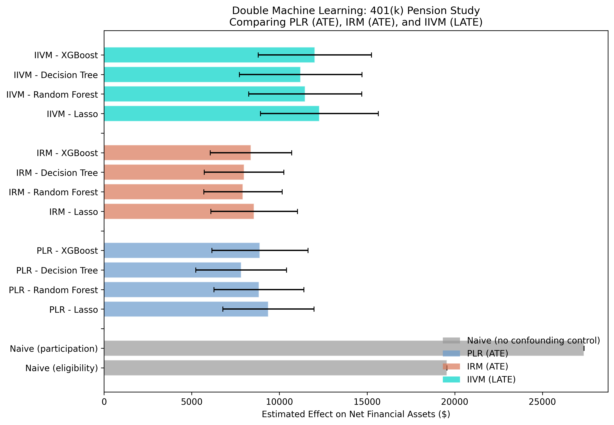

---
authors:
  - admin
categories:
  - Python
  - Double Machine Learning
  - Causal Inference
draft: false
featured: false
date: "2026-05-03T00:00:00Z"
external_link: ""
image:
  caption: ""
  focal_point: Smart
  placement: 3
links:
- icon: laptop-code
  icon_pack: fas
  name: "Web app"
  url: web_app/index.html
- icon: google-colab
  icon_pack: ai
  name: "Google Colab"
  url: https://colab.research.google.com/github/cmg777/starter-academic-v501/blob/master/content/post/python_doubleml_pension/notebook.ipynb
- icon: code
  icon_pack: fas
  name: "Python script"
  url: script.py
- icon: file-code
  icon_pack: fas
  name: "Quarto project (.zip)"
  url: python_doubleml_pension.zip
- icon: markdown
  icon_pack: fab
  name: "MD version"
  url: https://raw.githubusercontent.com/cmg777/starter-academic-v501/master/content/post/python_doubleml_pension/index.md
slides:
summary: Estimating the causal effect of 401(k) eligibility and participation on net financial assets using three DoubleML models (PLR, IRM, IIVM) with the 1991 SIPP pension dataset
tags:
  - python
  - causal
  - causal inference
  - machine learning
title: "Double Machine Learning with 401(k) Data: From Eligibility Effects to Complier Analysis"
url_code: ""
url_pdf: ""
url_slides: ""
url_video: ""
toc: true
diagram: true
---

## Abstract

Over \\$7 trillion sits in U.S. 401(k) accounts, yet it remains unclear whether expanding eligibility genuinely boosts retirement savings or merely reshuffles existing wealth, because a naive comparison conflates the causal effect with confounders such as income and education. This tutorial estimates the causal effect of 401(k) eligibility and participation on net financial assets, separating genuine savings gains from confounding bias. The data come from the 1991 Survey of Income and Program Participation (SIPP), a nationally representative survey of 9,915 U.S. households in which 37.1% are eligible for a 401(k) and 26.2% participate. Three Double Machine Learning models from the DoubleML Python package are applied — Partially Linear Regression (PLR) and the doubly robust Interactive Regression Model (IRM), both targeting the Average Treatment Effect of eligibility, and the Interactive IV Model (IIVM), which uses eligibility as an instrument for participation to recover the Local Average Treatment Effect on compliers — each fit with four ML learners (Lasso, Random Forest, Decision Tree, XGBoost) under cross-fitting. The naive eligibility gap of \\$19,559 falls to a mean ATE of \\$8,730 (PLR) and \\$8,213 (IRM), implying roughly \\$10,829 (55%) was confounding bias, while the IIVM LATE reaches \\$11,746. These results indicate that expanding 401(k) eligibility meaningfully raises retirement savings, by about \\$8,500 per newly eligible household on average and closer to \\$12,000 for the marginal compliers that such expansions target.

## Overview

Does having access to a 401(k) plan actually cause households to save more, or do households with 401(k) access simply have higher incomes and save more regardless? This question matters: over \\$7 trillion sits in 401(k) accounts in the United States, and policymakers need to know whether expanding eligibility genuinely boosts retirement savings or merely reshuffles existing wealth.

A naive comparison shows that 401(k)-eligible households have \\$19,559 more in net financial assets than ineligible ones. But this number is almost certainly inflated by *confounders* --- variables like income and education that affect both 401(k) access and savings. Standard regression can control for these, but when the relationships are complex and nonlinear, linear adjustment may fail to fully remove the bias.

**Double Machine Learning (DML)** solves this problem by using flexible ML models to partial out the confounding variation, then estimating the causal effect on the cleaned residuals. In this tutorial we apply three DML models --- PLR, IRM, and IIVM --- to the classic 401(k) pension dataset from the 1991 Survey of Income and Program Participation (SIPP). We compare the results against naive benchmarks to quantify the confounding bias and assess robustness across four different ML learners.

**Learning objectives:**

- Understand three DoubleML models (PLR, IRM, IIVM) and when to use each
- Distinguish between the Average Treatment Effect (ATE) and the Local Average Treatment Effect (LATE)
- Apply four different ML learners as nuisance estimators and assess robustness
- Interpret the gap between naive and DML estimates as evidence of confounding bias
- Use instrumental variables within the DML framework to handle endogenous treatment

## Key concepts at a glance

The post leans on a small vocabulary repeatedly. The rest of the tutorial assumes you can move between these terms quickly. Each concept below has three parts. The **definition** is always visible. The **example** and **analogy** sit behind clickable cards: open them when you need them, leave them collapsed for a quick scan. If a later section mentions "orthogonal score" or "LATE vs ATE" and the term feels slippery, this is the section to re-read.

**1. Confounder.**
A variable that affects both the treatment and the outcome. Confounders open backdoor paths that contaminate naive comparisons. Without adjustment we cannot tell the treatment effect from the confounder effect.

<div class="concept-pair">
<details class="concept-card concept-example">
<summary>Example</summary>

In the 401(k) data, `inc` is the dominant confounder. Higher-income households are both more likely to have `e401 = 1` AND have higher `net_tfa` for reasons unrelated to eligibility. The naive gap of \\$19,559 is more than twice the real PLR estimate of \\$8,730. The gap is confounding.

</details>

<details class="concept-card concept-analogy">
<summary>Analogy</summary>

Two people who both eat ice cream and both get sunburned. The ice cream did not cause the sunburn. A lurking common ancestor — the sun — caused both. The confounder is the sun.

</details>
</div>

**2. Cross-fitting** (K-fold sample-splitting).
Split the data into $K$ folds. Fit nuisance models on $K-1$ folds. Apply them to the held-out fold. Rotate. No observation is ever scored by a model that saw it during training. Cross-fitting is the DoubleML guard against overfitting bias.

<div class="concept-pair">
<details class="concept-card concept-example">
<summary>Example</summary>

This tutorial uses 5 folds throughout. The PLR, IRM, and IIVM estimators all run cross-fitting internally. We never call separate train/test commands. The library handles the rotation behind the scenes.

</details>

<details class="concept-card concept-analogy">
<summary>Analogy</summary>

Two-pass exam grading. One TA writes the rubric without seeing your paper. A different TA applies the rubric without writing it. The separation is what makes the grade defensible. Mixing the roles re-introduces the over-fitting bias DoubleML was built to remove.

</details>
</div>

**3. Nuisance functions** $g\_0(\mathbf{x}), m\_0(\mathbf{x})$.
Two conditional means. $g\_0(\mathbf{x}) = E[Y \mid \mathbf{X}=\mathbf{x}]$ predicts the outcome from covariates. $m\_0(\mathbf{x}) = E[D \mid \mathbf{X}=\mathbf{x}]$ predicts the treatment from covariates. We call them *nuisance* because we do not interpret their values. We estimate them only to strip the predictable parts of $Y$ and $D$ out of the residuals.

<div class="concept-pair">
<details class="concept-card concept-example">
<summary>Example</summary>

PLR fits both as random forests on the 9 covariates (`age`, `inc`, `educ`, `fsize`, `marr`, `twoearn`, `db`, `pira`, `hown`). The orthogonalized residuals are then regressed on each other to recover $\theta\_0$.

</details>

<details class="concept-card concept-analogy">
<summary>Analogy</summary>

Two surveyors map two layers of the same terrain. One maps elevation. The other maps soil type. Neither map is the goal. The goal is the third map you get when you subtract them.

</details>
</div>

**4. Partial Linear Regression (PLR)** $Y = \theta\_0 D + g\_0(\mathbf{X}) + U$.
The simplest DoubleML model. Assumes a constant treatment effect $\theta\_0$ across the population. Lets the controls enter $g\_0$ flexibly, but pins the treatment-outcome relationship to a single number.

<div class="concept-pair">
<details class="concept-card concept-example">
<summary>Example</summary>

PLR returns an ATE of \\$8,730 across our 9,915 households. The constant-effect assumption is restrictive — IRM and IIVM relax it — but the number is in the right ballpark.

</details>

<details class="concept-card concept-analogy">
<summary>Analogy</summary>

A clean residualization. Subtract what the covariates predict from $Y$. Subtract what the covariates predict from $D$. Regress one residual on the other. The slope is the causal effect.

</details>
</div>

**5. Interactive Regression Model (IRM).**
Drops the constant-effect assumption. Fits separate outcome models for treated and untreated units. The ATE is then the average of the predicted differences. Allows the effect to vary across covariates.

<div class="concept-pair">
<details class="concept-card concept-example">
<summary>Example</summary>

IRM gives an ATE of \\$8,213 — \\$517 below PLR. The gap is one piece of evidence that effects are not perfectly constant. IRM is the recommended estimator when heterogeneity is plausible.

</details>

<details class="concept-card concept-analogy">
<summary>Analogy</summary>

Separate models for treated and untreated. Like running two parallel experiments, one for the treated arm and one for the control arm. PLR pools them; IRM lets each speak.

</details>
</div>

**6. Interactive IV Model (IIVM).**
DoubleML adapted for binary instruments. Targets the LATE — the effect on *compliers*: units whose treatment status flips when the instrument flips. Uses cross-fitting and orthogonal scores like PLR/IRM, but pivots around the instrument $Z$.

<div class="concept-pair">
<details class="concept-card concept-example">
<summary>Example</summary>

IIVM in this tutorial uses participation in a defined-benefit plan as an instrument for `e401`. The LATE is \\$11,746. The gap to the IRM ATE (\\$8,213) is the LATE-vs-ATE difference: compliers respond more strongly than the average household.

</details>

<details class="concept-card concept-analogy">
<summary>Analogy</summary>

A coin flip you did not ask for. Some employees got "heads" (instrument pushed them into eligibility) and some got "tails". Comparing across the flip's outcome isolates the effect — but only for the kind of employee whose decision actually flipped.

</details>
</div>

**7. Orthogonal / doubly-robust score.**
The estimating equation DoubleML uses. Constructed so its derivative with respect to small nuisance errors is zero at the true value. Sometimes called the *Neyman orthogonal* score. The orthogonality is what makes ML-based nuisance estimation harmless.

<div class="concept-pair">
<details class="concept-card concept-example">
<summary>Example</summary>

All three DoubleML estimators in this post (PLR, IRM, IIVM) plug different nuisance estimators (linear, lasso, random forest) into the same orthogonal score. Estimates barely move across learners — the cross-fitted scores are doing their job.

</details>

<details class="concept-card concept-analogy">
<summary>Analogy</summary>

Belt and suspenders. If the belt fails, the suspenders hold. If the suspenders fail, the belt holds. Both fail at once is the only failure mode. Orthogonal scores buy you that double-failure margin.

</details>
</div>

**8. ATE vs LATE.**
The ATE is the average causal effect across *everyone*. The LATE is the average effect among *compliers* — units whose treatment status responds to the instrument. They differ when treatment effects are heterogeneous in ways correlated with compliance.

<div class="concept-pair">
<details class="concept-card concept-example">
<summary>Example</summary>

Our IRM ATE is \\$8,213. Our IIVM LATE is \\$11,746. The gap (\\$3,533) is large. Compliers — households whose 401(k) eligibility flipped because of the instrument — have stronger savings responses than the average household.

</details>

<details class="concept-card concept-analogy">
<summary>Analogy</summary>

A press-release statistic vs. a focus-group result. The press release reports the average for everybody. The focus group reports the average for the people who actually changed their behaviour. They are different audiences.

</details>
</div>

## The causal challenge: why naive comparisons fail

Comparing outcomes between treated and untreated groups is the simplest approach, but it produces misleading results when *confounders* --- variables that influence both the treatment and the outcome --- are present. In the 401(k) setting, income is the most important confounder. Higher-income households are more likely to have employer-sponsored 401(k) plans *and* more likely to have higher savings. This creates a spurious association between 401(k) eligibility and wealth that has nothing to do with the causal effect of the plan itself.

The following causal diagram shows this confounding structure:



Think of it this way: comparing 401(k) holders to non-holders and attributing the savings gap to the plan is like comparing gym members to non-members and concluding that gym memberships cause fitness. People who join gyms are already more health-conscious --- just as people with 401(k) access already earn more. The key insight from the economics literature is that 401(k) *eligibility* is more plausibly exogenous than *participation*, because eligibility depends on the employer's plan offerings, not just the individual's savings motivation.

To handle this, we need methods that can flexibly control for confounders. That is exactly what Double Machine Learning provides.

## Three DML models: a roadmap

This tutorial applies three progressively more sophisticated DML models to the same data. Each targets a different causal question and makes different assumptions:



| Model | Treatment | Estimand | Key assumption | Approach |
|-------|-----------|----------|----------------|----------|
| **PLR** (Partially Linear Regression) | e401 (eligibility) | ATE | Additive treatment effect | Partialling out (FWL-style) |
| **IRM** (Interactive Regression Model) | e401 (eligibility) | ATE | No functional form restriction | Doubly robust (AIPW) estimation |
| **IIVM** (Interactive IV Model) | p401 (participation) | LATE | Eligibility is a valid instrument | Instrumental variables |

The PLR and IRM models both estimate the **Average Treatment Effect (ATE)** --- the effect of eligibility averaged across all households. The IIVM estimates the **Local Average Treatment Effect (LATE)** --- the effect of participation specifically on *compliers*, households who participate because they are eligible but would not participate otherwise. These are different quantities with different policy implications.

## Setup and imports

Before running the analysis, install the required packages if needed:

```bash
pip install doubleml xgboost
```

The following code imports all necessary libraries and sets configuration variables. We use `RANDOM_SEED = 42` throughout for reproducibility and define the site color palette for consistent figures.

```python
import numpy as np
import pandas as pd
import matplotlib.pyplot as plt
import doubleml as dml
from sklearn.preprocessing import PolynomialFeatures, StandardScaler
from sklearn.linear_model import LassoCV, LogisticRegressionCV
from sklearn.ensemble import RandomForestClassifier, RandomForestRegressor
from sklearn.tree import DecisionTreeClassifier, DecisionTreeRegressor
from sklearn.pipeline import make_pipeline
from xgboost import XGBClassifier, XGBRegressor
from doubleml.datasets import fetch_401K
from matplotlib.patches import Patch

# Configuration
RANDOM_SEED = 42
np.random.seed(RANDOM_SEED)

# Site color palette
STEEL_BLUE = "#6a9bcc"
WARM_ORANGE = "#d97757"
NEAR_BLACK = "#141413"
TEAL = "#00d4c8"
GRAY = "#999999"
```

## Data loading: the 401(k) pension dataset

The dataset comes from the 1991 Survey of Income and Program Participation (SIPP), a nationally representative survey of U.S. households. It contains 9,915 observations with information on 401(k) eligibility, participation, financial assets, and demographic characteristics. We load it using the [`fetch_401K`](https://docs.doubleml.org/stable/api/generated/doubleml.datasets.fetch_401K.html) function from the DoubleML package, which downloads and caches the data automatically.

```python
data = fetch_401K(return_type="DataFrame")
print(f"Dataset shape: {data.shape}")
print(f"\nOutcome summary (net_tfa):")
print(data["net_tfa"].describe().round(2))
print(f"\nTreatment rates:")
print(f"  Eligible (e401=1): {data['e401'].sum()} / {len(data)} ({data['e401'].mean():.1%})")
print(f"  Participating (p401=1): {data['p401'].sum()} / {len(data)} ({data['p401'].mean():.1%})")
```

```text
Dataset shape: (9915, 14)

Outcome summary (net_tfa):
count       9915.00
mean       18051.53
std        63522.50
min      -502302.00
25%         -500.00
50%         1499.00
75%        16524.50
max      1536798.00

Treatment rates:
  Eligible (e401=1): 3682 / 9915 (37.1%)
  Participating (p401=1): 2594 / 9915 (26.2%)
```

The dataset contains 9,915 U.S. households. About 37% are eligible for a 401(k) plan and 26% actually participate, meaning roughly 70% of eligible households choose to enroll. Net total financial assets (`net_tfa`) --- our outcome variable --- are highly skewed: the median is just \\$1,499, while the mean is \\$18,052. This rightward skew reflects the concentration of financial wealth among high-net-worth households.

**Key variables:**

| Variable | Description |
|----------|-------------|
| `net_tfa` | Net total financial assets (outcome) |
| `e401` | 401(k) eligibility (treatment / instrument) |
| `p401` | 401(k) participation (endogenous treatment) |
| `age` | Age of household head |
| `inc` | Household income |
| `educ` | Education level (years) |
| `fsize` | Family size |
| `marr` | Marital status (1 = married) |
| `twoearn` | Two-earner household (1 = yes) |
| `db` | Defined benefit pension (1 = has one) |
| `pira` | IRA participation (1 = yes) |
| `hown` | Home ownership (1 = owns) |

The distinction between `e401` (eligibility) and `p401` (participation) is crucial for this analysis. Eligibility is determined largely by the *employer* --- whether the company offers a 401(k) plan. Participation is a *household decision* --- whether the eligible household actually enrolls. This matters because eligibility is plausibly unrelated to individual savings behavior (after controlling for income and other characteristics), while participation is a choice driven partly by unobservable traits like financial discipline and risk tolerance. We will exploit this distinction across all three models.

## Exploratory data analysis

Before estimating causal effects, let us visualize the data to understand the outcome distribution and the confounding structure.

```python
fig, axes = plt.subplots(1, 2, figsize=(12, 5))

# Left panel: histograms of net_tfa by eligibility
for val, label, color in [(1, "Eligible (e401=1)", STEEL_BLUE),
                           (0, "Not eligible (e401=0)", WARM_ORANGE)]:
    subset = data[data["e401"] == val]["net_tfa"]
    axes[0].hist(subset, bins=50, alpha=0.6, label=label, color=color,
                 edgecolor="white", linewidth=0.5)
axes[0].set_xlabel("Net Total Financial Assets ($)")
axes[0].set_ylabel("Frequency")
axes[0].set_title("Distribution of Net Financial Assets\nby 401(k) Eligibility")
axes[0].legend(frameon=False)
axes[0].set_xlim(-50000, 200000)

# Right panel: box plots
bp_data = [data[data["e401"] == 0]["net_tfa"].values,
           data[data["e401"] == 1]["net_tfa"].values]
bp = axes[1].boxplot(bp_data, tick_labels=["Not Eligible", "Eligible"],
                     patch_artist=True, widths=0.5)
bp["boxes"][0].set_facecolor(WARM_ORANGE); bp["boxes"][0].set_alpha(0.6)
bp["boxes"][1].set_facecolor(STEEL_BLUE); bp["boxes"][1].set_alpha(0.6)
axes[1].set_ylabel("Net Total Financial Assets ($)")
axes[1].set_title("Net Financial Assets\nby 401(k) Eligibility")
axes[1].set_ylim(-50000, 200000)

plt.tight_layout()
plt.savefig("pension_eda_outcome.png", dpi=300, bbox_inches="tight")
plt.show()
```



Eligible households clearly have higher and more dispersed financial assets. The median for eligible households (\\$9,122) is roughly 60 times the median for ineligible households (\\$145). But is this gap driven by 401(k) access itself, or by the underlying differences between the two groups? The next figure investigates.

```python
fig, axes = plt.subplots(1, 2, figsize=(12, 5))

# Left: income histograms by eligibility
for val, label, color in [(1, "Eligible", STEEL_BLUE),
                           (0, "Not eligible", WARM_ORANGE)]:
    subset = data[data["e401"] == val]["inc"]
    axes[0].hist(subset, bins=50, alpha=0.6, label=label, color=color,
                 edgecolor="white", linewidth=0.5)
axes[0].set_xlabel("Income ($)")
axes[0].set_ylabel("Frequency")
axes[0].set_title("Income Distribution by 401(k) Eligibility\n(Key Confounder)")
axes[0].legend(frameon=False)

# Right: scatter of income vs net_tfa
sample = data.sample(n=2000, random_state=RANDOM_SEED)
for val, label, color in [(0, "Not eligible", WARM_ORANGE),
                           (1, "Eligible", STEEL_BLUE)]:
    subset = sample[sample["e401"] == val]
    axes[1].scatter(subset["inc"], subset["net_tfa"], alpha=0.3,
                    s=15, color=color, label=label)
axes[1].set_xlabel("Income ($)")
axes[1].set_ylabel("Net Total Financial Assets ($)")
axes[1].set_title("Income vs. Net Financial Assets\n(Confounding Visualized)")
axes[1].legend(frameon=False)
axes[1].set_ylim(-50000, 200000)

plt.tight_layout()
plt.savefig("pension_eda_confounding.png", dpi=300, bbox_inches="tight")
plt.show()
```



The left panel reveals the confounding structure: eligible households earn substantially more on average (\\$46,862 vs. \\$31,494 for ineligible households), a gap of over \\$15,000. The scatter plot on the right confirms that income drives both eligibility and assets --- eligible households (blue) cluster in the upper-right region of higher income and higher wealth. This is exactly the pattern that naive comparisons conflate with the causal effect.

```python
eda_summary = data.groupby("e401").agg(
    n=("net_tfa", "size"),
    mean_net_tfa=("net_tfa", "mean"),
    median_net_tfa=("net_tfa", "median"),
    mean_income=("inc", "mean"),
    mean_age=("age", "mean"),
    mean_educ=("educ", "mean"),
).round(2)
print(eda_summary)
```

```text
                  n  mean_net_tfa  median_net_tfa   mean_income  mean_age  mean_educ
Eligibility
Not Eligible   6233  10788.040039           145.0  31493.589844     40.81      12.88
Eligible       3682  30347.390625          9122.5  46861.660156     41.48      13.76
```

The summary table quantifies the selection problem: eligible households differ from ineligible ones on every observable dimension --- they have higher income (\\$46,862 vs. \\$31,494), more education (13.76 vs. 12.88 years), and are slightly older (41.5 vs. 40.8 years). Any comparison that does not account for these differences will overstate the causal effect of 401(k) eligibility on savings.

## The naive benchmark: why simple comparisons mislead

Before applying DML, let us compute the naive difference-in-means to establish a biased benchmark. The naive estimator simply compares average outcomes between treated and control groups:

$$\hat{\Delta}\_{naive} = \bar{Y}\_{e401=1} - \bar{Y}\_{e401=0}$$

In words, this says the naive estimate equals the average net financial assets of eligible households minus the average for ineligible households. This estimator lumps together the genuine causal effect with all pre-existing differences between the groups.

To see why this is problematic, think of the naive estimate as a sum of two invisible components:

$$\hat{\Delta}\_{naive} = \underbrace{\theta\_0}\_{\text{causal effect}} + \underbrace{\text{bias from confounders}}\_{\text{income, education, ...}}$$

In words, the naive gap is the *true* causal effect plus the confounding bias. DML's entire purpose is to strip away the second component so only the causal effect remains. As we will see, the naive \\$19,559 decomposes into roughly \\$8,730 of genuine causal effect and \\$10,829 of confounding bias --- meaning more than half the raw gap is an illusion created by pre-existing differences between the groups.

```python
naive_elig = data[data["e401"] == 1]["net_tfa"].mean() - data[data["e401"] == 0]["net_tfa"].mean()
naive_part = data[data["p401"] == 1]["net_tfa"].mean() - data[data["p401"] == 0]["net_tfa"].mean()
print(f"Naive difference (eligibility): ${naive_elig:,.2f}")
print(f"Naive difference (participation): ${naive_part:,.2f}")
```

```text
Naive difference (eligibility): $19,559.34
Naive difference (participation): $27,371.58
```

The naive comparison suggests that 401(k) eligibility is associated with \\$19,559 more in financial assets, and participation with \\$27,372 more. These numbers are informative as benchmarks, but they are almost certainly biased upward. The participation gap is especially suspect because the decision to participate is a choice influenced by unobservable factors like financial literacy and savings motivation. We will now apply DML to strip away the confounding and recover credible causal estimates.

## Data preparation for DoubleML

The DoubleML package requires data in a specific format using the [`DoubleMLData`](https://docs.doubleml.org/stable/api/generated/doubleml.DoubleMLData.html) class, which explicitly separates the outcome ($Y$), treatment ($D$), covariates ($X$), and optionally an instrument ($Z$).

We prepare two covariate specifications. The **base** specification uses 9 raw features. The **flexible** specification adds quadratic terms for continuous variables (age, income, education, family size), giving the Lasso learner a richer set of features to work with.

```python
# Base specification: 9 raw features
features_base = ["age", "inc", "educ", "fsize", "marr",
                 "twoearn", "db", "pira", "hown"]
data_dml_base = dml.DoubleMLData(data, y_col="net_tfa",
                                 d_cols="e401", x_cols=features_base)

# Flexible specification: polynomial features for Lasso
features_flex = data.copy()[["marr", "twoearn", "db", "pira", "hown"]]
poly_dict = {"age": 2, "inc": 2, "educ": 2, "fsize": 2}
for key, degree in poly_dict.items():
    poly = PolynomialFeatures(degree, include_bias=False)
    data_transf = poly.fit_transform(data[[key]])
    x_cols = poly.get_feature_names_out([key])
    features_flex = pd.concat((features_flex,
                               pd.DataFrame(data_transf, columns=x_cols)),
                              axis=1, sort=False)

model_data_elig = pd.concat(
    (data[["net_tfa", "e401"]], features_flex), axis=1, sort=False)
data_dml_flex = dml.DoubleMLData(model_data_elig, y_col="net_tfa",
                                 d_cols="e401")

print(f"Base specification: {len(features_base)} features")
print(f"Flexible specification: {features_flex.shape[1]} features")
```

```text
Base specification: 9 features
Flexible specification: 13 features
```

The flexible specification expands the 4 continuous variables into 13 features by adding their squares (e.g., $\text{age}^2$, $\text{inc}^2$). This allows the Lasso to capture nonlinear confounding relationships while tree-based methods naturally handle nonlinearity with the base specification.

## Model 1: Partially Linear Regression (PLR)

The Partially Linear Regression model is the workhorse of DML. It assumes a constant treatment effect $\theta\_0$ while allowing the confounding structure to be arbitrarily complex:

$$Y = \theta\_0 \\, D + g\_0(X) + \varepsilon, \quad E[\varepsilon \mid D, X] = 0$$

$$D = m\_0(X) + V, \quad E[V \mid X] = 0$$

In words, the first equation says that the outcome $Y$ (net financial assets) equals a constant causal effect $\theta\_0$ times the treatment $D$ (eligibility), plus a nuisance function $g\_0(X)$ that captures everything covariates predict about the outcome, plus noise $\varepsilon$. The second equation says that treatment assignment $D$ also depends on covariates through another nuisance function $m\_0(X)$, plus noise $V$.

**Variable mapping:** $Y$ = `net_tfa`, $D$ = `e401`, $X$ = the 9 (or 13) covariates, $\theta\_0$ = the ATE we want to estimate.

### How partialling out works: a three-step recipe

The key innovation of DML is **partialling out**: instead of estimating $\theta\_0$ directly from a single regression, we decompose the problem into three simpler steps. Think of it like noise-canceling headphones: the ML models learn the "noise" pattern from confounders, subtract it, and what remains is the clean causal signal.

**Step 1 --- Predict the outcome from covariates.** Train an ML model to predict net financial assets ($Y$) using only the covariates ($X$): income, age, education, etc. --- *without* using the treatment ($D$). The prediction captures how much savings we would *expect* a household to have based on its demographics alone. The *residual* --- what the model cannot explain --- is the part of savings that is unrelated to observed covariates. We call this the "outcome residual": $\tilde{Y} = Y - \hat{g}\_0(X)$.

**Step 2 --- Predict the treatment from covariates.** Train another ML model to predict eligibility ($D$) from the same covariates ($X$). This captures how much eligibility we would *expect* given a household's characteristics. The residual --- "surprise eligibility" --- is the part of treatment that is unrelated to observed covariates. We call this the "treatment residual": $\tilde{D} = D - \hat{m}\_0(X)$.

**Step 3 --- Regress outcome residuals on treatment residuals.** The slope of this residual-on-residual regression is our causal estimate $\hat{\theta}\_0$. Because both residuals have been "cleaned" of confounding variation, their relationship reflects only the causal channel from treatment to outcome.

Here is a concrete example. Consider two households with the same income (\\$40,000), same education (13 years), and same age (42). Based on these characteristics, the ML model predicts both should have about \\$15,000 in net financial assets and a 35% chance of being eligible. If Household A is eligible and has \\$23,000, its outcome residual is +\\$8,000 and its treatment residual is +0.65. If Household B is not eligible and has \\$14,000, its outcome residual is -\\$1,000 and its treatment residual is -0.35. The PLR estimates the causal effect by comparing these residuals across all 9,915 households simultaneously.

### Why machine learning matters

Traditional linear regression can also partial out confounders (this is the Frisch-Waugh-Lovell theorem). So why use ML? Because linear regression assumes straight-line relationships: every extra dollar of income increases savings by the same amount. But in reality, the relationship between income and savings is often curved --- a household earning \\$100,000 saves proportionally more than one earning \\$30,000 (a nonlinear relationship). ML learners like Random Forest and XGBoost capture these nonlinearities automatically, producing cleaner residuals and more accurate causal estimates.

### Cross-fitting: preventing overfitting bias

DML also uses *cross-fitting* --- a procedure that splits the data into folds so that nuisance functions are always estimated on different data than they are evaluated on. Here is how it works concretely with our data:

1. Split the 9,915 households into 3 folds of roughly 3,300 each.
2. For Fold 1: train the ML models (both $\hat{g}\_0$ and $\hat{m}\_0$) on Folds 2 + 3 (6,600 households), then predict residuals for the 3,300 households in Fold 1.
3. Rotate: train on Folds 1 + 3, predict residuals for Fold 2.
4. Rotate again: train on Folds 1 + 2, predict residuals for Fold 3.
5. Combine all residuals and run the final regression.

Think of cross-fitting as a rotating judge: each fold's residuals come from a model that never saw that fold. Why does this matter? Without cross-fitting, a flexible ML model could memorize individual households' quirks --- producing artificially clean residuals that make the causal estimate look better than it really is. Cross-fitting prevents this overfitting bias by ensuring the ML model always predicts on "fresh" data it has never seen.

We fit the PLR model with four different ML learners to assess robustness:

```python
Cs = 0.0001 * np.logspace(0, 4, 10)

learners = {
    "Lasso": (make_pipeline(StandardScaler(), LassoCV(cv=5, max_iter=10000)),
              make_pipeline(StandardScaler(), LogisticRegressionCV(
                  cv=5, penalty="l1", solver="liblinear", Cs=Cs, max_iter=1000))),
    "Random Forest": (RandomForestRegressor(n_estimators=500, max_depth=7,
                          max_features=3, min_samples_leaf=3, random_state=42),
                      RandomForestClassifier(n_estimators=500, max_depth=5,
                          max_features=4, min_samples_leaf=7, random_state=42)),
    "Decision Tree": (DecisionTreeRegressor(max_depth=30, ccp_alpha=0.0047,
                          min_samples_split=203, min_samples_leaf=67, random_state=42),
                      DecisionTreeClassifier(max_depth=30, ccp_alpha=0.0042,
                          min_samples_split=104, min_samples_leaf=34, random_state=42)),
    "XGBoost": (XGBRegressor(n_jobs=1, objective="reg:squarederror",
                    eta=0.1, n_estimators=35, random_state=42),
                XGBClassifier(n_jobs=1, objective="binary:logistic",
                    eval_metric="logloss", eta=0.1, n_estimators=34, random_state=42)),
}

for name, (ml_l, ml_m) in learners.items():
    np.random.seed(RANDOM_SEED)
    dml_data = data_dml_flex if name == "Lasso" else data_dml_base
    model = dml.DoubleMLPLR(dml_data, ml_l=ml_l, ml_m=ml_m, n_folds=3)
    model.fit(store_predictions=True)
    coef, se = model.coef[0], model.se[0]
    ci = model.confint(level=0.95).values[0]
    print(f"PLR-{name}: coef={coef:,.2f}, SE={se:,.2f}, "
          f"95% CI=[{ci[0]:,.2f}, {ci[1]:,.2f}]")
```

```text
PLR-Lasso:         coef=9,370.81, SE=1,326.47, 95% CI=[6,770.99, 11,970.64]
PLR-Random Forest: coef=8,835.46, SE=1,309.07, 95% CI=[6,269.74, 11,401.18]
PLR-Decision Tree: coef=7,822.51, SE=1,321.78, 95% CI=[5,231.87, 10,413.14]
PLR-XGBoost:       coef=8,892.39, SE=1,398.65, 95% CI=[6,151.09, 11,633.69]
```



After controlling for confounders, the PLR model estimates the ATE of 401(k) eligibility at \\$7,823 to \\$9,371 across the four learners, with a mean of \\$8,730. Compare this to the naive estimate of \\$19,559: DML reveals that roughly \\$10,829 (55%) of the raw gap was confounding bias rather than a genuine causal effect. All four confidence intervals exclude zero, confirming statistical significance. The narrow range across learners (\\$1,548) demonstrates that DML results are robust to the choice of ML algorithm --- a hallmark of the method's reliability.

## Model 2: Interactive Regression Model (IRM)

The PLR and IRM models both estimate the ATE, but they take fundamentally different paths to get there. Understanding this difference is key to interpreting why their agreement is so reassuring.

**PLR** uses a *partialling-out* strategy (similar to the Frisch-Waugh-Lovell theorem): it separately predicts the outcome and the treatment from covariates using ML, then regresses the outcome residuals on the treatment residuals. The causal effect emerges from this residual-on-residual regression. The key structural assumption is that treatment enters the outcome equation **additively** --- meaning the effect is the same for all households regardless of their characteristics.

**IRM** takes a different approach rooted in the *potential outcomes framework*. Instead of partialling out, it combines two models --- an outcome model $g\_0(D, X)$ and a *propensity score* model $m\_0(X) = P(D=1 \mid X)$ --- into a **doubly robust** (also called AIPW) estimator. The ATE is identified by:

$$\theta\_0 = E\left[g\_0(1, X) - g\_0(0, X) + \frac{D \\, (Y - g\_0(1, X))}{m\_0(X)} - \frac{(1-D) \\, (Y - g\_0(0, X))}{1-m\_0(X)}\right]$$

In words, this formula first predicts what each household's outcome would be under treatment and under control using the outcome model $g\_0$, then corrects any remaining prediction errors using inverse probability weighting with the propensity score $m\_0$. The term "doubly robust" means the estimator is consistent if *either* the outcome model or the propensity score model is correctly specified --- it does not require both to be perfect. Think of it as a safety net: if one model stumbles, the other catches it.

### What is a propensity score?

The propensity score $m\_0(X)$ is simply the predicted probability that a household is eligible, based on its observable characteristics. For a high-income, well-educated, married household working at a large firm, the propensity score might be 0.70 (70% chance of being eligible). For a low-income, young, single household, it might be 0.15 (15% chance). The propensity score summarizes how "treatment-like" each household looks on paper.

The IRM uses propensity scores to reweight observations. The intuition is that *rare controls are especially valuable*. Suppose a household has all the characteristics that predict eligibility (high income, good education) but is *not* eligible --- perhaps their employer simply does not offer a 401(k). This household is an informative natural experiment: it tells us what savings look like for "eligible-type" households that did not receive the treatment. The IRM gives such observations extra weight because they provide the cleanest comparison.

### Why "doubly robust"?

The doubly robust property is a key practical advantage. Imagine we have a good outcome model but a mediocre propensity score model. The outcome model $g\_0$ does most of the heavy lifting, correctly predicting savings under treatment and control. The propensity score corrections are small and somewhat noisy --- but that is fine, because they are only correcting small residual errors. Now imagine the reverse: a poor outcome model but an excellent propensity score model. The IPW correction catches the outcome model's mistakes. The estimator fails only if *both* models are badly wrong simultaneously, which is much less likely than either one failing alone.

### Why run both PLR and IRM?

Running both PLR and IRM is like getting a second opinion from a different doctor using a different diagnostic approach. PLR approaches the problem through residual regression (partialling out). IRM approaches it through outcome prediction combined with propensity weighting (AIPW). If both diagnoses agree --- as they do here --- you can be much more confident in the conclusion than if you had relied on either method alone.

We fit the IRM model with the same four ML learners used for PLR. For IRM, the `ml_g` argument takes a regressor (for the outcome model) and `ml_m` takes a classifier (for the propensity score). The `trimming_threshold=0.01` drops observations with extreme propensity scores below 1% or above 99% to prevent unstable inverse-probability weights.

```python
# Fit IRM with each learner (simplified; see script.py for tuned nuisance params)
for name, (ml_l, ml_m) in learners.items():
    np.random.seed(RANDOM_SEED)
    dml_data = data_dml_flex if name == "Lasso" else data_dml_base
    model = dml.DoubleMLIRM(dml_data, ml_g=ml_l, ml_m=ml_m,
                            trimming_threshold=0.01, n_folds=3)
    model.fit(store_predictions=True)
    coef, se = model.coef[0], model.se[0]
    ci = model.confint(level=0.95).values[0]
    print(f"IRM-{name}: coef={coef:,.2f}, SE={se:,.2f}, "
          f"95% CI=[{ci[0]:,.2f}, {ci[1]:,.2f}]")
```

```text
IRM-Lasso:         coef=8,559.13, SE=1,261.16, 95% CI=[6,087.30, 11,030.97]
IRM-Random Forest: coef=7,924.39, SE=1,138.06, 95% CI=[5,693.82, 10,154.95]
IRM-Decision Tree: coef=7,985.58, SE=1,156.49, 95% CI=[5,718.90, 10,252.26]
IRM-XGBoost:       coef=8,381.57, SE=1,186.36, 95% CI=[6,056.34, 10,706.80]
```



The IRM estimates range from \\$7,924 to \\$8,559, with a mean of \\$8,213. These are remarkably close to the PLR estimates (\\$8,730 mean), differing by only about \\$500 on average. This convergence is powerful evidence for the robustness of the ATE: two fundamentally different estimation strategies --- partialling-out (PLR) and doubly robust/AIPW (IRM) --- agree that the causal effect of 401(k) eligibility is in the \\$8,000--\\$9,000 range. Since these approaches rely on different modeling assumptions and different ways of combining nuisance functions, their agreement means the result is not an artifact of any particular estimation choice. The IRM standard errors are slightly smaller (averaging \\$1,185 vs. \\$1,339 for PLR), suggesting the doubly robust estimator is somewhat more efficient in this setting.

## Model 3: Interactive IV Model (IIVM) --- what about participation?

The PLR and IRM models estimate the effect of *eligibility* (e401), which is plausibly exogenous after conditioning on covariates. But what if we want to know the effect of actually *participating* in a 401(k) plan?

### Why participation is endogenous

Participation (p401) is endogenous --- it reflects a household's *choice*, which is driven by unobservable factors that also affect savings. Here is a concrete example: suppose two households are both eligible for a 401(k). Household A is financially savvy, reads investment blogs, and enrolls immediately. Household B lives paycheck to paycheck and never enrolls despite being eligible. If we compare their savings, any difference reflects both the 401(k) effect *and* the pre-existing difference in financial discipline. We cannot tell these apart because financial discipline is unobserved --- it does not appear in our dataset.

This is the endogeneity problem: participation is a choice correlated with unobserved traits that also affect savings. Simply comparing participants to non-participants produces biased estimates, even after controlling for all observed covariates.

### Instrumental variables: using eligibility as a nudge

To handle this, the IIVM model uses eligibility (e401) as an **instrumental variable** for participation (p401). The idea is elegant: eligibility acts like a nudge. It does not force anyone to participate, but it opens the door. Among otherwise similar households, some happen to work at firms that offer 401(k) plans and some do not. This "quasi-random" variation in access lets us isolate the causal effect of participation.

An instrument must satisfy two conditions: (1) **relevance** --- it must affect the treatment (eligibility strongly predicts participation, since you cannot participate without being eligible), and (2) **exclusion** --- it must affect the outcome *only through* the treatment (after conditioning on covariates, eligibility has no direct effect on savings except through participation).

### Four types of households

When we use eligibility as an instrument, households fall into four groups:

| Type | Behavior | Interpretation |
|------|----------|---------------|
| **Always-takers** | Participate whether eligible or not | Highly motivated savers --- would find a way regardless |
| **Never-takers** | Never participate, even when eligible | Prefer to spend or use other savings vehicles |
| **Compliers** | Participate *because* eligible; would not otherwise | The marginal households whose behavior changes with the policy |
| **Defiers** | Would participate if *not* eligible, but not if eligible | Assumed not to exist (monotonicity assumption) |

The IIVM identifies the **Local Average Treatment Effect (LATE)** --- the causal effect of participation specifically on *compliers*. Think of compliers in a medicine trial: the LATE measures the effect on people who take the pill only when prescribed, not on people who always take it regardless (always-takers) or never take it no matter what (never-takers). The intuition is that the instrument (eligibility) only "moves" the compliers, so the estimated effect applies specifically to them.

Formally, the LATE can be understood through a Wald-type ratio:

$$\theta\_{LATE} = \frac{E[Y \mid Z=1] - E[Y \mid Z=0]}{E[D \mid Z=1] - E[D \mid Z=0]}$$

In words, the LATE equals the effect of the instrument ($Z$ = eligibility) on the outcome ($Y$ = savings), divided by the effect of the instrument on the treatment ($D$ = participation). The numerator captures how much savings change when eligibility is "switched on." The denominator captures how many additional households actually participate when eligible. The ratio tells us: for each additional household nudged into participation by eligibility, how much did their savings increase?

```python
# IV data: treatment = p401 (participation), instrument = e401 (eligibility)
data_dml_base_iv = dml.DoubleMLData(data, y_col="net_tfa",
                                    d_cols="p401", z_cols="e401",
                                    x_cols=features_base)

# Fit IIVM with each learner (simplified; see script.py for tuned nuisance params)
for name, (ml_l, ml_m) in learners.items():
    np.random.seed(RANDOM_SEED)
    model = dml.DoubleMLIIVM(data_dml_base_iv,
                             ml_g=ml_l, ml_m=ml_m, ml_r=ml_m,
                             subgroups={"always_takers": False,
                                        "never_takers": True},
                             trimming_threshold=0.01, n_folds=3)
    model.fit(store_predictions=True)
    coef, se = model.coef[0], model.se[0]
    ci = model.confint(level=0.95).values[0]
    print(f"IIVM-{name}: coef={coef:,.2f}, SE={se:,.2f}, "
          f"95% CI=[{ci[0]:,.2f}, {ci[1]:,.2f}]")
```

```text
IIVM-Lasso:         coef=12,280.84, SE=1,712.63, 95% CI=[8,924.16, 15,637.53]
IIVM-Random Forest: coef=11,471.20, SE=1,646.56, 95% CI=[8,243.99, 14,698.40]
IIVM-Decision Tree: coef=11,215.10, SE=1,785.89, 95% CI=[7,714.82, 14,715.38]
IIVM-XGBoost:       coef=12,018.76, SE=1,648.62, 95% CI=[8,787.52, 15,250.00]
```



The IIVM estimates range from \\$11,215 to \\$12,281, with a mean of \\$11,746. This is substantially larger than the ATE from PLR/IRM (\\$8,200--\\$8,700), which is expected. The LATE captures the effect on compliers --- households at the margin of participation --- who may benefit more from 401(k) access than the average household. In economic terms, these marginal participants are households that would not have saved as much in alternative vehicles, so the 401(k) plan genuinely channels new savings rather than reshuffling existing ones. Note that the standard errors are larger (\\$1,698 average) than for PLR/IRM, reflecting the efficiency loss inherent in IV estimation, but all estimates remain strongly significant.

## Grand comparison: putting it all together

The following figure presents all 12 DML estimates alongside the two naive benchmarks:

The full plotting code for this figure is in `script.py`. It arranges all 12 DML estimates alongside the two naive baselines in a single horizontal bar chart, color-coded by model type with 95% confidence intervals.



The grand comparison figure tells a three-part story. First, the massive gap between the naive estimates (gray bars, \\$19,559 for eligibility and \\$27,372 for participation) and the DML estimates demonstrates the scale of confounding bias --- the naive estimate is more than double the true ATE. Second, the tight clustering of PLR (steel blue) and IRM (warm orange) estimates confirms that the ATE is robustly estimated at roughly \\$8,000--\\$9,400 regardless of the modeling approach. Third, the IIVM estimates (teal) are systematically higher because they target a different estimand --- the LATE for compliers rather than the population ATE.

| Model | Estimand | Mean Estimate | Range Across Learners |
|-------|----------|---------------|----------------------|
| Naive (eligibility) | --- | \\$19,559 | --- |
| PLR | ATE | \\$8,730 | \\$7,823 -- \\$9,371 |
| IRM | ATE | \\$8,213 | \\$7,924 -- \\$8,559 |
| IIVM | LATE | \\$11,746 | \\$11,215 -- \\$12,281 |
| Naive (participation) | --- | \\$27,372 | --- |

### Why is the LATE larger than the ATE?

The LATE (\\$11,746) is larger than the ATE (\\$8,730), and this difference is not a contradiction --- it reflects a genuine economic insight. The ATE averages the effect across *all* households, including always-takers who would have saved in other vehicles (IRAs, taxable accounts) even without a 401(k). For these households, the 401(k) may simply *reshuffle* savings from one account to another, producing a smaller net effect on total financial assets.

Compliers, by contrast, are households whose savings behavior genuinely changes with 401(k) access. They are the marginal participants --- the ones who were on the fence about saving and for whom the 401(k)'s tax advantages and employer match tipped the scales. For these households, the program creates *new* savings rather than reshuffling existing ones, which is why the effect is larger.

For policymakers deciding whether to expand 401(k) eligibility to new employers, the LATE is arguably the more relevant number. Newly eligible households are compliers by definition --- their behavior changes precisely because of the new policy. The expected per-household savings increase for this target population is closer to \\$12,000 than \\$8,500.

## Discussion

Let us return to the original question: does 401(k) access cause households to save more?

The answer is a clear **yes** --- but the effect is smaller than naive comparisons suggest. After removing confounding bias with DML, 401(k) eligibility increases net financial assets by approximately \\$8,000--\\$9,400 (the ATE from PLR and IRM). The naive estimate of \\$19,559 overstates the true effect by about 124%, with the excess driven primarily by income confounding. Eligible households earn \\$15,368 more on average, and this income gap inflates the raw savings comparison.

For households at the margin of participation --- those who enroll *because* they are eligible --- the effect is larger: approximately \\$11,200--\\$12,300 (the LATE from IIVM). This makes intuitive sense. Compliers are households whose savings behavior genuinely changes with 401(k) access, so the program's effect on them is stronger than the population average.

The policy implication is straightforward: expanding 401(k) eligibility can meaningfully boost retirement savings. Policymakers can expect each newly eligible household to accumulate roughly \\$8,500 more in net financial assets, on average. For marginal participants --- the target population of eligibility expansions --- the effect is closer to \\$12,000. These estimates are robust across four different ML learners and two distinct DML frameworks (PLR and IRM), giving confidence that the findings are not an artifact of any particular modeling choice.

## Summary and next steps

**Key takeaways:**

1. **Method:** Three DML models (PLR, IRM, IIVM) provide complementary causal perspectives. PLR and IRM estimate the ATE via different approaches (outcome regression vs. propensity scores) and agree closely. IIVM uses instrumental variables to identify the LATE for compliers.

2. **Data:** The naive comparison overstates the eligibility effect by \\$10,829 (124%). Income is the primary confounder, with eligible households earning \\$15,368 more than ineligible ones. DML successfully removes this bias.

3. **Limitation:** The IIVM identifies the LATE, not the ATE. The \\$11,746 effect applies only to compliers and should not be generalized to the full population without additional assumptions (monotonicity).

4. **Next step:** Explore heterogeneous treatment effects by income bracket, age, or marital status. The relatively constant effect found by comparing PLR and IRM could mask important subgroup variation.

**Limitations:**

- **Conditional exogeneity assumption.** The analysis assumes eligibility is as good as randomly assigned after conditioning on observables. If unobserved factors (e.g., financial literacy) affect both eligibility and savings, the estimates remain biased.
- **Cross-sectional data.** The 1991 SIPP provides a single snapshot. Dynamic effects of 401(k) participation over time are not captured.
- **Extreme asset values.** Net financial assets range from -\\$502,302 to \\$1,536,798. Outliers influence the mean-based ATE estimates.

## Exercises

1. **Change the number of cross-fitting folds.** Re-run the PLR model with `n_folds=5` and `n_folds=10`. How do the estimates change? Does increased folding improve precision?

2. **Explore subgroup effects.** Split the data by marital status (`marr == 1` vs. `marr == 0`) and estimate the PLR model separately for each group. Is the ATE larger for married or unmarried households?

3. **Test instrument strength.** Run a first-stage regression of `p401` on `e401` controlling for the base covariates. What is the F-statistic? Does the instrument satisfy the common rule-of-thumb of F > 10?

## References

1. [Chernozhukov, V., Chetverikov, D., Demirer, M., Duflo, E., Hansen, C., Newey, W., and Robins, J. (2018). Double/Debiased Machine Learning for Treatment and Structural Parameters. *The Econometrics Journal*, 21(1), C1--C68.](https://doi.org/10.1111/ectj.12097)
2. [Poterba, J., Venti, S., and Wise, D. (1995). Do 401(k) contributions crowd out other personal saving? *Journal of Public Economics*, 58(1), 1--32.](https://doi.org/10.1016/0047-2727(94)01462-W)
3. [DoubleML -- An Object-Oriented Implementation of Double Machine Learning in Python](https://docs.doubleml.org/stable/)
4. [1991 Survey of Income and Program Participation (SIPP) -- U.S. Census Bureau](https://www.census.gov/programs-surveys/sipp.html)
