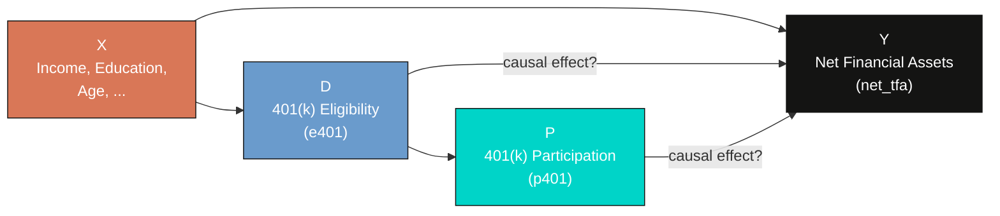
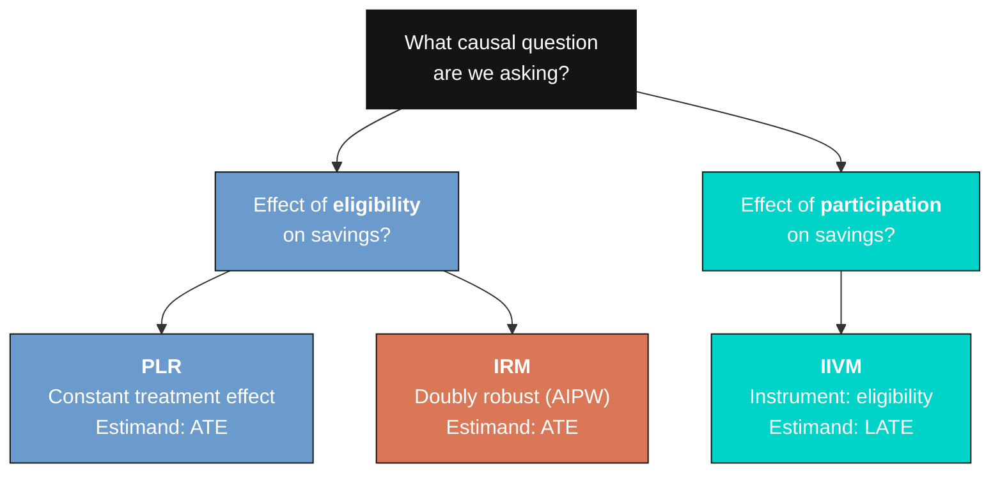

---
authors:
  - admin
categories:
  - Python
  - Tutorial
  - Causal Inference
  - Machine Learning
  - Double Machine Learning
draft: false
featured: false
date: "2026-05-03T00:00:00Z"
external_link: ""
image:
  caption: ""
  focal_point: Smart
  placement: 3
links:
- icon: code
  icon_pack: fas
  name: "Python script"
  url: script.py
slides:
summary: Estimating the causal effect of 401(k) eligibility and participation on net financial assets using three DoubleML models (PLR, IRM, IIVM) with the 1991 SIPP pension dataset
tags:
  - python
  - causal
  - causal inference
  - machine learning
title: "Double Machine Learning with 401(k) Data: From Eligibility Effects to Complier Analysis"
url_code: ""
url_pdf: ""
url_slides: ""
url_video: ""
toc: true
diagram: true
---

## Overview

Does having access to a 401(k) plan actually cause households to save more, or do households with 401(k) access simply have higher incomes and save more regardless? This question matters: over \\$7 trillion sits in 401(k) accounts in the United States, and policymakers need to know whether expanding eligibility genuinely boosts retirement savings or merely reshuffles existing wealth.

A naive comparison shows that 401(k)-eligible households have \\$19,559 more in net financial assets than ineligible ones. But this number is almost certainly inflated by *confounders* --- variables like income and education that affect both 401(k) access and savings. Standard regression can control for these, but when the relationships are complex and nonlinear, linear adjustment may fail to fully remove the bias.

**Double Machine Learning (DML)** solves this problem by using flexible ML models to partial out the confounding variation, then estimating the causal effect on the cleaned residuals. In this tutorial we apply three DML models --- PLR, IRM, and IIVM --- to the classic 401(k) pension dataset from the 1991 Survey of Income and Program Participation (SIPP). We compare the results against naive benchmarks to quantify the confounding bias and assess robustness across four different ML learners.

**Learning objectives:**

- Understand three DoubleML models (PLR, IRM, IIVM) and when to use each
- Distinguish between the Average Treatment Effect (ATE) and the Local Average Treatment Effect (LATE)
- Apply four different ML learners as nuisance estimators and assess robustness
- Interpret the gap between naive and DML estimates as evidence of confounding bias
- Use instrumental variables within the DML framework to handle endogenous treatment

## The causal challenge: why naive comparisons fail

Comparing outcomes between treated and untreated groups is the simplest approach, but it produces misleading results when *confounders* --- variables that influence both the treatment and the outcome --- are present. In the 401(k) setting, income is the most important confounder. Higher-income households are more likely to have employer-sponsored 401(k) plans *and* more likely to have higher savings. This creates a spurious association between 401(k) eligibility and wealth that has nothing to do with the causal effect of the plan itself.

The following causal diagram shows this confounding structure:



Think of it this way: comparing 401(k) holders to non-holders and attributing the savings gap to the plan is like comparing gym members to non-members and concluding that gym memberships cause fitness. People who join gyms are already more health-conscious --- just as people with 401(k) access already earn more. The key insight from the economics literature is that 401(k) *eligibility* is more plausibly exogenous than *participation*, because eligibility depends on the employer's plan offerings, not just the individual's savings motivation.

To handle this, we need methods that can flexibly control for confounders. That is exactly what Double Machine Learning provides.

## Three DML models: a roadmap

This tutorial applies three progressively more sophisticated DML models to the same data. Each targets a different causal question and makes different assumptions:



| Model | Treatment | Estimand | Key assumption | Approach |
|-------|-----------|----------|----------------|----------|
| **PLR** (Partially Linear Regression) | e401 (eligibility) | ATE | Additive treatment effect | Partialling out (FWL-style) |
| **IRM** (Interactive Regression Model) | e401 (eligibility) | ATE | No functional form restriction | Doubly robust (AIPW) estimation |
| **IIVM** (Interactive IV Model) | p401 (participation) | LATE | Eligibility is a valid instrument | Instrumental variables |

The PLR and IRM models both estimate the **Average Treatment Effect (ATE)** --- the effect of eligibility averaged across all households. The IIVM estimates the **Local Average Treatment Effect (LATE)** --- the effect of participation specifically on *compliers*, households who participate because they are eligible but would not participate otherwise. These are different quantities with different policy implications.

## Setup and imports

Before running the analysis, install the required packages if needed:

```bash
pip install doubleml xgboost
```

The following code imports all necessary libraries and sets configuration variables. We use `RANDOM_SEED = 42` throughout for reproducibility and define the site color palette for consistent figures.

```python
import numpy as np
import pandas as pd
import matplotlib.pyplot as plt
import doubleml as dml
from sklearn.preprocessing import PolynomialFeatures, StandardScaler
from sklearn.linear_model import LassoCV, LogisticRegressionCV
from sklearn.ensemble import RandomForestClassifier, RandomForestRegressor
from sklearn.tree import DecisionTreeClassifier, DecisionTreeRegressor
from sklearn.pipeline import make_pipeline
from xgboost import XGBClassifier, XGBRegressor
from doubleml.datasets import fetch_401K
from matplotlib.patches import Patch

# Configuration
RANDOM_SEED = 42
np.random.seed(RANDOM_SEED)

# Site color palette
STEEL_BLUE = "#6a9bcc"
WARM_ORANGE = "#d97757"
NEAR_BLACK = "#141413"
TEAL = "#00d4c8"
GRAY = "#999999"
```

## Data loading: the 401(k) pension dataset

The dataset comes from the 1991 Survey of Income and Program Participation (SIPP), a nationally representative survey of U.S. households. It contains 9,915 observations with information on 401(k) eligibility, participation, financial assets, and demographic characteristics. We load it using the [`fetch_401K`](https://docs.doubleml.org/stable/api/generated/doubleml.datasets.fetch_401K.html) function from the DoubleML package, which downloads and caches the data automatically.

```python
data = fetch_401K(return_type="DataFrame")
print(f"Dataset shape: {data.shape}")
print(f"\nOutcome summary (net_tfa):")
print(data["net_tfa"].describe().round(2))
print(f"\nTreatment rates:")
print(f"  Eligible (e401=1): {data['e401'].sum()} / {len(data)} ({data['e401'].mean():.1%})")
print(f"  Participating (p401=1): {data['p401'].sum()} / {len(data)} ({data['p401'].mean():.1%})")
```

```text
Dataset shape: (9915, 14)

Outcome summary (net_tfa):
count       9915.00
mean       18051.53
std        63522.50
min      -502302.00
25%         -500.00
50%         1499.00
75%        16524.50
max      1536798.00

Treatment rates:
  Eligible (e401=1): 3682 / 9915 (37.1%)
  Participating (p401=1): 2594 / 9915 (26.2%)
```

The dataset contains 9,915 U.S. households. About 37% are eligible for a 401(k) plan and 26% actually participate, meaning roughly 70% of eligible households choose to enroll. Net total financial assets (`net_tfa`) --- our outcome variable --- are highly skewed: the median is just \\$1,499, while the mean is \\$18,052. This rightward skew reflects the concentration of financial wealth among high-net-worth households.

**Key variables:**

| Variable | Description |
|----------|-------------|
| `net_tfa` | Net total financial assets (outcome) |
| `e401` | 401(k) eligibility (treatment / instrument) |
| `p401` | 401(k) participation (endogenous treatment) |
| `age` | Age of household head |
| `inc` | Household income |
| `educ` | Education level (years) |
| `fsize` | Family size |
| `marr` | Marital status (1 = married) |
| `twoearn` | Two-earner household (1 = yes) |
| `db` | Defined benefit pension (1 = has one) |
| `pira` | IRA participation (1 = yes) |
| `hown` | Home ownership (1 = owns) |

## Exploratory data analysis

Before estimating causal effects, let us visualize the data to understand the outcome distribution and the confounding structure.

```python
fig, axes = plt.subplots(1, 2, figsize=(12, 5))

# Left panel: histograms of net_tfa by eligibility
for val, label, color in [(1, "Eligible (e401=1)", STEEL_BLUE),
                           (0, "Not eligible (e401=0)", WARM_ORANGE)]:
    subset = data[data["e401"] == val]["net_tfa"]
    axes[0].hist(subset, bins=50, alpha=0.6, label=label, color=color,
                 edgecolor="white", linewidth=0.5)
axes[0].set_xlabel("Net Total Financial Assets ($)")
axes[0].set_ylabel("Frequency")
axes[0].set_title("Distribution of Net Financial Assets\nby 401(k) Eligibility")
axes[0].legend(frameon=False)
axes[0].set_xlim(-50000, 200000)

# Right panel: box plots
bp_data = [data[data["e401"] == 0]["net_tfa"].values,
           data[data["e401"] == 1]["net_tfa"].values]
bp = axes[1].boxplot(bp_data, tick_labels=["Not Eligible", "Eligible"],
                     patch_artist=True, widths=0.5)
bp["boxes"][0].set_facecolor(WARM_ORANGE); bp["boxes"][0].set_alpha(0.6)
bp["boxes"][1].set_facecolor(STEEL_BLUE); bp["boxes"][1].set_alpha(0.6)
axes[1].set_ylabel("Net Total Financial Assets ($)")
axes[1].set_title("Net Financial Assets\nby 401(k) Eligibility")
axes[1].set_ylim(-50000, 200000)

plt.tight_layout()
plt.savefig("pension_eda_outcome.png", dpi=300, bbox_inches="tight")
plt.show()
```


Eligible households clearly have higher and more dispersed financial assets. The median for eligible households (\\$9,122) is roughly 60 times the median for ineligible households (\\$145). But is this gap driven by 401(k) access itself, or by the underlying differences between the two groups? The next figure investigates.

```python
fig, axes = plt.subplots(1, 2, figsize=(12, 5))

# Left: income histograms by eligibility
for val, label, color in [(1, "Eligible", STEEL_BLUE),
                           (0, "Not eligible", WARM_ORANGE)]:
    subset = data[data["e401"] == val]["inc"]
    axes[0].hist(subset, bins=50, alpha=0.6, label=label, color=color,
                 edgecolor="white", linewidth=0.5)
axes[0].set_xlabel("Income ($)")
axes[0].set_ylabel("Frequency")
axes[0].set_title("Income Distribution by 401(k) Eligibility\n(Key Confounder)")
axes[0].legend(frameon=False)

# Right: scatter of income vs net_tfa
sample = data.sample(n=2000, random_state=RANDOM_SEED)
for val, label, color in [(0, "Not eligible", WARM_ORANGE),
                           (1, "Eligible", STEEL_BLUE)]:
    subset = sample[sample["e401"] == val]
    axes[1].scatter(subset["inc"], subset["net_tfa"], alpha=0.3,
                    s=15, color=color, label=label)
axes[1].set_xlabel("Income ($)")
axes[1].set_ylabel("Net Total Financial Assets ($)")
axes[1].set_title("Income vs. Net Financial Assets\n(Confounding Visualized)")
axes[1].legend(frameon=False)
axes[1].set_ylim(-50000, 200000)

plt.tight_layout()
plt.savefig("pension_eda_confounding.png", dpi=300, bbox_inches="tight")
plt.show()
```


The left panel reveals the confounding structure: eligible households earn substantially more on average (\\$46,862 vs. \\$31,494 for ineligible households), a gap of over \\$15,000. The scatter plot on the right confirms that income drives both eligibility and assets --- eligible households (blue) cluster in the upper-right region of higher income and higher wealth. This is exactly the pattern that naive comparisons conflate with the causal effect.

```python
eda_summary = data.groupby("e401").agg(
    n=("net_tfa", "size"),
    mean_net_tfa=("net_tfa", "mean"),
    median_net_tfa=("net_tfa", "median"),
    mean_income=("inc", "mean"),
    mean_age=("age", "mean"),
    mean_educ=("educ", "mean"),
).round(2)
print(eda_summary)
```

```text
                  n  mean_net_tfa  median_net_tfa   mean_income  mean_age  mean_educ
Eligibility
Not Eligible   6233  10788.040039           145.0  31493.589844     40.81      12.88
Eligible       3682  30347.390625          9122.5  46861.660156     41.48      13.76
```

The summary table quantifies the selection problem: eligible households differ from ineligible ones on every observable dimension --- they have higher income (\\$46,862 vs. \\$31,494), more education (13.76 vs. 12.88 years), and are slightly older (41.5 vs. 40.8 years). Any comparison that does not account for these differences will overstate the causal effect of 401(k) eligibility on savings.

## The naive benchmark: why simple comparisons mislead

Before applying DML, let us compute the naive difference-in-means to establish a biased benchmark. The naive estimator simply compares average outcomes between treated and control groups:

$$\hat{\Delta}\_{naive} = \bar{Y}\_{e401=1} - \bar{Y}\_{e401=0}$$

In words, this says the naive estimate equals the average net financial assets of eligible households minus the average for ineligible households. This estimator lumps together the genuine causal effect with all pre-existing differences between the groups.

```python
naive_elig = data[data["e401"] == 1]["net_tfa"].mean() - data[data["e401"] == 0]["net_tfa"].mean()
naive_part = data[data["p401"] == 1]["net_tfa"].mean() - data[data["p401"] == 0]["net_tfa"].mean()
print(f"Naive difference (eligibility): ${naive_elig:,.2f}")
print(f"Naive difference (participation): ${naive_part:,.2f}")
```

```text
Naive difference (eligibility): $19,559.34
Naive difference (participation): $27,371.58
```

The naive comparison suggests that 401(k) eligibility is associated with \\$19,559 more in financial assets, and participation with \\$27,372 more. These numbers are informative as benchmarks, but they are almost certainly biased upward. The participation gap is especially suspect because the decision to participate is a choice influenced by unobservable factors like financial literacy and savings motivation. We will now apply DML to strip away the confounding and recover credible causal estimates.

## Data preparation for DoubleML

The DoubleML package requires data in a specific format using the [`DoubleMLData`](https://docs.doubleml.org/stable/api/generated/doubleml.DoubleMLData.html) class, which explicitly separates the outcome ($Y$), treatment ($D$), covariates ($X$), and optionally an instrument ($Z$).

We prepare two covariate specifications. The **base** specification uses 9 raw features. The **flexible** specification adds quadratic terms for continuous variables (age, income, education, family size), giving the Lasso learner a richer set of features to work with.

```python
# Base specification: 9 raw features
features_base = ["age", "inc", "educ", "fsize", "marr",
                 "twoearn", "db", "pira", "hown"]
data_dml_base = dml.DoubleMLData(data, y_col="net_tfa",
                                 d_cols="e401", x_cols=features_base)

# Flexible specification: polynomial features for Lasso
features_flex = data.copy()[["marr", "twoearn", "db", "pira", "hown"]]
poly_dict = {"age": 2, "inc": 2, "educ": 2, "fsize": 2}
for key, degree in poly_dict.items():
    poly = PolynomialFeatures(degree, include_bias=False)
    data_transf = poly.fit_transform(data[[key]])
    x_cols = poly.get_feature_names_out([key])
    features_flex = pd.concat((features_flex,
                               pd.DataFrame(data_transf, columns=x_cols)),
                              axis=1, sort=False)

model_data_elig = pd.concat(
    (data[["net_tfa", "e401"]], features_flex), axis=1, sort=False)
data_dml_flex = dml.DoubleMLData(model_data_elig, y_col="net_tfa",
                                 d_cols="e401")

print(f"Base specification: {len(features_base)} features")
print(f"Flexible specification: {features_flex.shape[1]} features")
```

```text
Base specification: 9 features
Flexible specification: 13 features
```

The flexible specification expands the 4 continuous variables into 13 features by adding their squares (e.g., $\text{age}^2$, $\text{inc}^2$). This allows the Lasso to capture nonlinear confounding relationships while tree-based methods naturally handle nonlinearity with the base specification.

## Model 1: Partially Linear Regression (PLR)

The Partially Linear Regression model is the workhorse of DML. It assumes a constant treatment effect $\theta\_0$ while allowing the confounding structure to be arbitrarily complex:

$$Y = \theta\_0 \\, D + g\_0(X) + \varepsilon, \quad E[\varepsilon \mid D, X] = 0$$

$$D = m\_0(X) + V, \quad E[V \mid X] = 0$$

In words, the first equation says that the outcome $Y$ (net financial assets) equals a constant causal effect $\theta\_0$ times the treatment $D$ (eligibility), plus a nuisance function $g\_0(X)$ that captures everything covariates predict about the outcome, plus noise $\varepsilon$. The second equation says that treatment assignment $D$ also depends on covariates through another nuisance function $m\_0(X)$, plus noise $V$.

**Variable mapping:** $Y$ = `net_tfa`, $D$ = `e401`, $X$ = the 9 (or 13) covariates, $\theta\_0$ = the ATE we want to estimate.

The key innovation of DML is **partialling out**: instead of estimating $\theta\_0$ directly, we first use ML to estimate $g\_0$ and $m\_0$, then work with the residuals. Think of it like noise-canceling headphones: the ML models learn the "noise" pattern from confounders, subtract it, and what remains is the clean causal signal.

DML also uses *cross-fitting* --- a procedure that splits the data into folds so that nuisance functions are always estimated on different data than they are evaluated on. Think of cross-fitting as a rotating judge: each fold's residuals come from a model that never saw that fold, preventing the ML models from overfitting to the same observations used for causal estimation.

We fit the PLR model with four different ML learners to assess robustness:

```python
Cs = 0.0001 * np.logspace(0, 4, 10)

learners = {
    "Lasso": (make_pipeline(StandardScaler(), LassoCV(cv=5, max_iter=10000)),
              make_pipeline(StandardScaler(), LogisticRegressionCV(
                  cv=5, penalty="l1", solver="liblinear", Cs=Cs, max_iter=1000))),
    "Random Forest": (RandomForestRegressor(n_estimators=500, max_depth=7,
                          max_features=3, min_samples_leaf=3, random_state=42),
                      RandomForestClassifier(n_estimators=500, max_depth=5,
                          max_features=4, min_samples_leaf=7, random_state=42)),
    "Decision Tree": (DecisionTreeRegressor(max_depth=30, ccp_alpha=0.0047,
                          min_samples_split=203, min_samples_leaf=67, random_state=42),
                      DecisionTreeClassifier(max_depth=30, ccp_alpha=0.0042,
                          min_samples_split=104, min_samples_leaf=34, random_state=42)),
    "XGBoost": (XGBRegressor(n_jobs=1, objective="reg:squarederror",
                    eta=0.1, n_estimators=35, random_state=42),
                XGBClassifier(n_jobs=1, objective="binary:logistic",
                    eval_metric="logloss", eta=0.1, n_estimators=34, random_state=42)),
}

for name, (ml_l, ml_m) in learners.items():
    np.random.seed(RANDOM_SEED)
    dml_data = data_dml_flex if name == "Lasso" else data_dml_base
    model = dml.DoubleMLPLR(dml_data, ml_l=ml_l, ml_m=ml_m, n_folds=3)
    model.fit(store_predictions=True)
    coef, se = model.coef[0], model.se[0]
    ci = model.confint(level=0.95).values[0]
    print(f"PLR-{name}: coef={coef:,.2f}, SE={se:,.2f}, "
          f"95% CI=[{ci[0]:,.2f}, {ci[1]:,.2f}]")
```

```text
PLR-Lasso:         coef=9,370.81, SE=1,326.47, 95% CI=[6,770.99, 11,970.64]
PLR-Random Forest: coef=8,835.46, SE=1,309.07, 95% CI=[6,269.74, 11,401.18]
PLR-Decision Tree: coef=7,822.51, SE=1,321.78, 95% CI=[5,231.87, 10,413.14]
PLR-XGBoost:       coef=8,892.39, SE=1,398.65, 95% CI=[6,151.09, 11,633.69]
```


After controlling for confounders, the PLR model estimates the ATE of 401(k) eligibility at \\$7,823 to \\$9,371 across the four learners, with a mean of \\$8,730. Compare this to the naive estimate of \\$19,559: DML reveals that roughly \\$10,829 (55%) of the raw gap was confounding bias rather than a genuine causal effect. All four confidence intervals exclude zero, confirming statistical significance. The narrow range across learners (\\$1,548) demonstrates that DML results are robust to the choice of ML algorithm --- a hallmark of the method's reliability.

## Model 2: Interactive Regression Model (IRM)

The PLR and IRM models both estimate the ATE, but they take fundamentally different paths to get there. Understanding this difference is key to interpreting why their agreement is so reassuring.

**PLR** uses a *partialling-out* strategy (similar to the Frisch-Waugh-Lovell theorem): it separately predicts the outcome and the treatment from covariates using ML, then regresses the outcome residuals on the treatment residuals. The causal effect emerges from this residual-on-residual regression. The key structural assumption is that treatment enters the outcome equation **additively** --- meaning the effect is the same for all households regardless of their characteristics.

**IRM** takes a different approach rooted in the *potential outcomes framework*. Instead of partialling out, it combines two models --- an outcome model $g\_0(D, X)$ and a *propensity score* model $m\_0(X) = P(D=1 \mid X)$ --- into a **doubly robust** (also called AIPW) estimator. The ATE is identified by:

$$\theta\_0 = E\left[g\_0(1, X) - g\_0(0, X) + \frac{D \\, (Y - g\_0(1, X))}{m\_0(X)} - \frac{(1-D) \\, (Y - g\_0(0, X))}{1-m\_0(X)}\right]$$

In words, this formula first predicts what each household's outcome would be under treatment and under control using the outcome model $g\_0$, then corrects any remaining prediction errors using inverse probability weighting with the propensity score $m\_0$. The term "doubly robust" means the estimator is consistent if *either* the outcome model or the propensity score model is correctly specified --- it does not require both to be perfect. Think of it as a safety net: if one model stumbles, the other catches it.

Why does this matter? If PLR and IRM agree, it means the causal estimate is robust to the choice of estimation strategy --- neither the additive structure of PLR nor the particular form of doubly robust weighting is driving the result.

We fit the IRM model with the same four ML learners used for PLR. For IRM, the `ml_g` argument takes a regressor (for the outcome model) and `ml_m` takes a classifier (for the propensity score). The `trimming_threshold=0.01` drops observations with extreme propensity scores below 1% or above 99% to prevent unstable inverse-probability weights.

```python
# Fit IRM with each learner (simplified; see script.py for tuned nuisance params)
for name, (ml_l, ml_m) in learners.items():
    np.random.seed(RANDOM_SEED)
    dml_data = data_dml_flex if name == "Lasso" else data_dml_base
    model = dml.DoubleMLIRM(dml_data, ml_g=ml_l, ml_m=ml_m,
                            trimming_threshold=0.01, n_folds=3)
    model.fit(store_predictions=True)
    coef, se = model.coef[0], model.se[0]
    ci = model.confint(level=0.95).values[0]
    print(f"IRM-{name}: coef={coef:,.2f}, SE={se:,.2f}, "
          f"95% CI=[{ci[0]:,.2f}, {ci[1]:,.2f}]")
```

```text
IRM-Lasso:         coef=8,559.13, SE=1,261.16, 95% CI=[6,087.30, 11,030.97]
IRM-Random Forest: coef=7,924.39, SE=1,138.06, 95% CI=[5,693.82, 10,154.95]
IRM-Decision Tree: coef=7,985.58, SE=1,156.49, 95% CI=[5,718.90, 10,252.26]
IRM-XGBoost:       coef=8,381.57, SE=1,186.36, 95% CI=[6,056.34, 10,706.80]
```


The IRM estimates range from \\$7,924 to \\$8,559, with a mean of \\$8,213. These are remarkably close to the PLR estimates (\\$8,730 mean), differing by only about \\$500 on average. This convergence is powerful evidence for the robustness of the ATE: two fundamentally different estimation strategies --- partialling-out (PLR) and doubly robust/AIPW (IRM) --- agree that the causal effect of 401(k) eligibility is in the \\$8,000--\\$9,000 range. Since these approaches rely on different modeling assumptions and different ways of combining nuisance functions, their agreement means the result is not an artifact of any particular estimation choice. The IRM standard errors are slightly smaller (averaging \\$1,185 vs. \\$1,339 for PLR), suggesting the doubly robust estimator is somewhat more efficient in this setting.

## Model 3: Interactive IV Model (IIVM) --- what about participation?

The PLR and IRM models estimate the effect of *eligibility* (e401), which is plausibly exogenous after conditioning on covariates. But what if we want to know the effect of actually *participating* in a 401(k) plan? Participation (p401) is endogenous --- it reflects a household's choice, which is driven by unobservable factors like financial literacy and savings motivation that also affect the outcome.

To handle this, the IIVM model uses eligibility (e401) as an **instrumental variable** for participation (p401). An instrument must satisfy two conditions: (1) it affects the treatment (eligibility strongly predicts participation), and (2) it affects the outcome only through the treatment (after conditioning on covariates, eligibility has no direct effect on savings except through participation).

The IIVM identifies the **Local Average Treatment Effect (LATE)** --- the causal effect of participation specifically on *compliers*. A complier is a household that participates *because* it is eligible but would not participate otherwise. Think of compliers in a medicine trial: the LATE measures the effect on people who take the pill only when prescribed, not on people who always take it regardless or never take it no matter what.

```python
# IV data: treatment = p401 (participation), instrument = e401 (eligibility)
data_dml_base_iv = dml.DoubleMLData(data, y_col="net_tfa",
                                    d_cols="p401", z_cols="e401",
                                    x_cols=features_base)

# Fit IIVM with each learner (simplified; see script.py for tuned nuisance params)
for name, (ml_l, ml_m) in learners.items():
    np.random.seed(RANDOM_SEED)
    model = dml.DoubleMLIIVM(data_dml_base_iv,
                             ml_g=ml_l, ml_m=ml_m, ml_r=ml_m,
                             subgroups={"always_takers": False,
                                        "never_takers": True},
                             trimming_threshold=0.01, n_folds=3)
    model.fit(store_predictions=True)
    coef, se = model.coef[0], model.se[0]
    ci = model.confint(level=0.95).values[0]
    print(f"IIVM-{name}: coef={coef:,.2f}, SE={se:,.2f}, "
          f"95% CI=[{ci[0]:,.2f}, {ci[1]:,.2f}]")
```

```text
IIVM-Lasso:         coef=12,280.84, SE=1,712.63, 95% CI=[8,924.16, 15,637.53]
IIVM-Random Forest: coef=11,471.20, SE=1,646.56, 95% CI=[8,243.99, 14,698.40]
IIVM-Decision Tree: coef=11,215.10, SE=1,785.89, 95% CI=[7,714.82, 14,715.38]
IIVM-XGBoost:       coef=12,018.76, SE=1,648.62, 95% CI=[8,787.52, 15,250.00]
```


The IIVM estimates range from \\$11,215 to \\$12,281, with a mean of \\$11,746. This is substantially larger than the ATE from PLR/IRM (\\$8,200--\\$8,700), which is expected. The LATE captures the effect on compliers --- households at the margin of participation --- who may benefit more from 401(k) access than the average household. In economic terms, these marginal participants are households that would not have saved as much in alternative vehicles, so the 401(k) plan genuinely channels new savings rather than reshuffling existing ones. Note that the standard errors are larger (\\$1,698 average) than for PLR/IRM, reflecting the efficiency loss inherent in IV estimation, but all estimates remain strongly significant.

## Grand comparison: putting it all together

The following figure presents all 12 DML estimates alongside the two naive benchmarks:

The full plotting code for this figure is in `script.py`. It arranges all 12 DML estimates alongside the two naive baselines in a single horizontal bar chart, color-coded by model type with 95% confidence intervals.


The grand comparison figure tells a three-part story. First, the massive gap between the naive estimates (gray bars, \\$19,559 for eligibility and \\$27,372 for participation) and the DML estimates demonstrates the scale of confounding bias --- the naive estimate is more than double the true ATE. Second, the tight clustering of PLR (steel blue) and IRM (warm orange) estimates confirms that the ATE is robustly estimated at roughly \\$8,000--\\$9,400 regardless of the modeling approach. Third, the IIVM estimates (teal) are systematically higher because they target a different estimand --- the LATE for compliers rather than the population ATE.

| Model | Estimand | Mean Estimate | Range Across Learners |
|-------|----------|---------------|----------------------|
| Naive (eligibility) | --- | \\$19,559 | --- |
| PLR | ATE | \\$8,730 | \\$7,823 -- \\$9,371 |
| IRM | ATE | \\$8,213 | \\$7,924 -- \\$8,559 |
| IIVM | LATE | \\$11,746 | \\$11,215 -- \\$12,281 |
| Naive (participation) | --- | \\$27,372 | --- |

## Discussion

Let us return to the original question: does 401(k) access cause households to save more?

The answer is a clear **yes** --- but the effect is smaller than naive comparisons suggest. After removing confounding bias with DML, 401(k) eligibility increases net financial assets by approximately \\$8,000--\\$9,400 (the ATE from PLR and IRM). The naive estimate of \\$19,559 overstates the true effect by about 124%, with the excess driven primarily by income confounding. Eligible households earn \\$15,368 more on average, and this income gap inflates the raw savings comparison.

For households at the margin of participation --- those who enroll *because* they are eligible --- the effect is larger: approximately \\$11,200--\\$12,300 (the LATE from IIVM). This makes intuitive sense. Compliers are households whose savings behavior genuinely changes with 401(k) access, so the program's effect on them is stronger than the population average.

The policy implication is straightforward: expanding 401(k) eligibility can meaningfully boost retirement savings. Policymakers can expect each newly eligible household to accumulate roughly \\$8,500 more in net financial assets, on average. For marginal participants --- the target population of eligibility expansions --- the effect is closer to \\$12,000. These estimates are robust across four different ML learners and two distinct DML frameworks (PLR and IRM), giving confidence that the findings are not an artifact of any particular modeling choice.

## Summary and next steps

**Key takeaways:**

1. **Method:** Three DML models (PLR, IRM, IIVM) provide complementary causal perspectives. PLR and IRM estimate the ATE via different approaches (outcome regression vs. propensity scores) and agree closely. IIVM uses instrumental variables to identify the LATE for compliers.

2. **Data:** The naive comparison overstates the eligibility effect by \\$10,829 (124%). Income is the primary confounder, with eligible households earning \\$15,368 more than ineligible ones. DML successfully removes this bias.

3. **Limitation:** The IIVM identifies the LATE, not the ATE. The \\$11,746 effect applies only to compliers and should not be generalized to the full population without additional assumptions (monotonicity).

4. **Next step:** Explore heterogeneous treatment effects by income bracket, age, or marital status. The relatively constant effect found by comparing PLR and IRM could mask important subgroup variation.

**Limitations:**

- **Conditional exogeneity assumption.** The analysis assumes eligibility is as good as randomly assigned after conditioning on observables. If unobserved factors (e.g., financial literacy) affect both eligibility and savings, the estimates remain biased.
- **Cross-sectional data.** The 1991 SIPP provides a single snapshot. Dynamic effects of 401(k) participation over time are not captured.
- **Extreme asset values.** Net financial assets range from -\\$502,302 to \\$1,536,798. Outliers influence the mean-based ATE estimates.

## Exercises

1. **Change the number of cross-fitting folds.** Re-run the PLR model with `n_folds=5` and `n_folds=10`. How do the estimates change? Does increased folding improve precision?

2. **Explore subgroup effects.** Split the data by marital status (`marr == 1` vs. `marr == 0`) and estimate the PLR model separately for each group. Is the ATE larger for married or unmarried households?

3. **Test instrument strength.** Run a first-stage regression of `p401` on `e401` controlling for the base covariates. What is the F-statistic? Does the instrument satisfy the common rule-of-thumb of F > 10?

## References

1. [Chernozhukov, V., Chetverikov, D., Demirer, M., Duflo, E., Hansen, C., Newey, W., and Robins, J. (2018). Double/Debiased Machine Learning for Treatment and Structural Parameters. *The Econometrics Journal*, 21(1), C1--C68.](https://doi.org/10.1111/ectj.12097)
2. [Poterba, J., Venti, S., and Wise, D. (1995). Do 401(k) contributions crowd out other personal saving? *Journal of Public Economics*, 58(1), 1--32.](https://doi.org/10.1016/0047-2727(94)01462-W)
3. [DoubleML -- An Object-Oriented Implementation of Double Machine Learning in Python](https://docs.doubleml.org/stable/)
4. [1991 Survey of Income and Program Participation (SIPP) -- U.S. Census Bureau](https://www.census.gov/programs-surveys/sipp.html)
