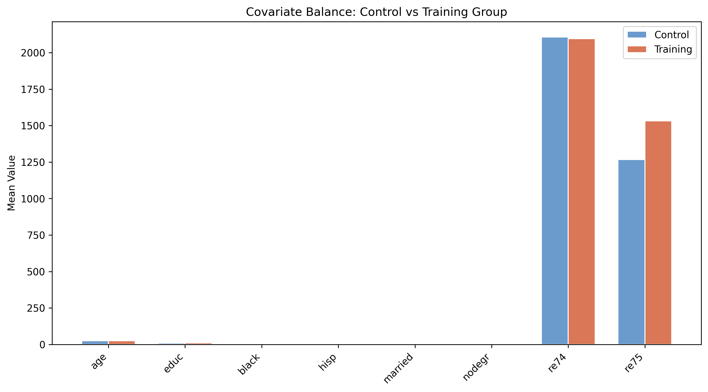

---
authors:
  - admin
categories:
  - Python
draft: false
featured: false
date: "2026-03-12T00:00:00Z"
external_link: ""
image:
  caption: ""
  focal_point: Smart
links:
- icon: open-data
  icon_pack: ai
  name: "[Python] Google Colab"
  url: https://colab.research.google.com/github/cmg777/starter-academic-v501/blob/master/content/post/python_dowhy/notebook.ipynb
- icon: code
  icon_pack: fas
  name: "Python script"
  url: script.py
- icon: book
  icon_pack: fas
  name: "Jupyter notebook"
  url: notebook.ipynb
- icon: r-project
  icon_pack: fab
  name: "R script"
  url: analysis.R
- icon: file-code
  icon_pack: fas
  name: "Stata do-file"
  url: analysis.do
slides:
summary: Estimating the causal effect of a job training program on earnings using DoWhy's four-step causal inference framework with the Lalonde dataset
tags:
- python
- causal
title: "Introduction to Causal Inference: DoWhy and the Lalonde Dataset"
url_code: ""
url_pdf: ""
url_slides: ""
url_video: ""
toc: true
---

<a href="https://colab.research.google.com/github/cmg777/starter-academic-v501/blob/master/content/post/python_dowhy/notebook.ipynb" target="_blank"></a>

## Overview

Does a job training program actually cause participants to earn more, or do people who enroll in training simply differ from those who do not? This is the central challenge of **causal inference**: distinguishing genuine treatment effects from confounding differences between groups. A simple comparison of average earnings between participants and non-participants can be misleading if the two groups differ in age, education, or prior employment history.

**DoWhy** is a Python library that provides a principled, end-to-end framework for causal inference. It organizes the analysis into four explicit steps --- **Model, Identify, Estimate, Refute** --- each of which forces the analyst to state and test causal assumptions rather than hiding them inside a black-box estimator. In this tutorial, we apply DoWhy to the **Lalonde dataset**, a classic dataset from the National Supported Work (NSW) Demonstration program, to estimate how much the job training program increased participants' earnings in 1978.

**Learning objectives:**

- Understand DoWhy's four-step causal inference workflow (Model, Identify, Estimate, Refute)
- Define a causal graph that encodes domain knowledge about confounders
- Identify causal estimands from the graph using the backdoor criterion
- Estimate causal effects using multiple methods (regression adjustment, IPW, doubly robust, propensity score stratification, propensity score matching)
- Assess robustness of estimates using refutation tests

## Setup and imports

Before running the analysis, install the required package if needed:

```python
pip install dowhy
```

The following code imports all necessary libraries and sets configuration variables. We define the outcome, treatment, and covariate columns that will be used throughout the analysis.

```python
import warnings
warnings.filterwarnings("ignore")

import numpy as np
import pandas as pd
import matplotlib.pyplot as plt
from sklearn.linear_model import LogisticRegression, LinearRegression as SklearnLR
from dowhy import CausalModel
from dowhy.datasets import lalonde_dataset

# Reproducibility
RANDOM_SEED = 42
np.random.seed(RANDOM_SEED)

# Configuration
OUTCOME = "re78"
OUTCOME_LABEL = "Earnings in 1978 (USD)"
TREATMENT = "treat"
TREATMENT_LABEL = "Job Training (treat)"
COVARIATES = ["age", "educ", "black", "hisp", "married", "nodegr", "re74", "re75"]
```

## Data loading: The Lalonde Dataset

The Lalonde dataset comes from the **National Supported Work (NSW) Demonstration**, a randomized employment program conducted in the 1970s in the United States. Eligible applicants --- mostly disadvantaged workers with limited employment histories --- were randomly assigned to receive job training (treatment) or not (control). The dataset records each participant's demographics, prior earnings, and post-program earnings in 1978. It has become a benchmark for testing causal inference methods because the random assignment provides a credible ground truth against which observational estimators can be compared.

DoWhy includes the Lalonde dataset directly, so we can load it with a single function call.

```python
df = lalonde_dataset()

# Convert boolean treatment to integer for DoWhy compatibility
df[TREATMENT] = df[TREATMENT].astype(int)

print(f"Dataset shape: {df.shape}")
print(f"\nTreatment groups:")
print(df[TREATMENT].value_counts().sort_index().rename({0: "Control", 1: "Training"}))
print(f"\nOutcome ({OUTCOME}) summary:")
print(df[OUTCOME].describe().round(2))
```

```
Dataset shape: (445, 12)

Treatment groups:
treat
Control     260
Training    185
Name: count, dtype: int64

Outcome (re78) summary:
count      445.00
mean      5300.76
std       6631.49
min          0.00
25%          0.00
50%       3701.81
75%       8124.72
max      60307.93
Name: re78, dtype: float64
```

The dataset contains 445 participants with 12 variables. The treatment is split into 185 individuals who received job training and 260 controls who did not. The outcome variable, real earnings in 1978 (`re78`), has a mean of \\$5,301 but enormous variation (standard deviation of \\$6,631), ranging from \\$0 to \\$60,308. The median (\\$3,702) is well below the mean, indicating a right-skewed distribution --- many participants earned little or nothing while a few earned substantially more.

## Exploratory data analysis

### Outcome distribution by treatment group

Before any causal modeling, we compare the raw earnings distributions between training and control groups. If the training program had an effect, we expect to see higher average earnings in the training group --- but we cannot yet tell whether any difference is truly caused by the program or driven by pre-existing differences between the groups.

```python
fig, ax = plt.subplots(figsize=(8, 5))
for group, label, color in [(0, "Control", "#6a9bcc"), (1, "Training", "#d97757")]:
    subset = df[df[TREATMENT] == group][OUTCOME]
    ax.hist(subset, bins=30, alpha=0.6, label=f"{label} (mean=${subset.mean():,.0f})",
            color=color, edgecolor="white")
ax.set_xlabel(OUTCOME_LABEL)
ax.set_ylabel("Count")
ax.set_title(f"Distribution of {OUTCOME_LABEL} by Treatment Group")
ax.legend()
plt.savefig("dowhy_outcome_by_treatment.png", dpi=300, bbox_inches="tight")
plt.show()
```


Both distributions are heavily right-skewed, with a large spike near zero reflecting participants who had no earnings. The training group has a higher mean (\\$6,349) compared to the control group (\\$4,555), a raw difference of about \\$1,794. However, both distributions overlap substantially, and the spike at zero is present in both groups, indicating that many participants struggled to find employment regardless of training.

### Covariate balance

In a randomized experiment, we expect the covariates to be balanced across treatment and control groups. Checking this balance is important: if the groups differ systematically in age, education, or prior earnings, any difference in the outcome could be driven by these confounders rather than the treatment itself.

```python
covariate_means = df.groupby(TREATMENT)[COVARIATES].mean()

fig, ax = plt.subplots(figsize=(12, 6))
x = np.arange(len(COVARIATES))
width = 0.35
ax.bar(x - width / 2, covariate_means.loc[0], width, label="Control",
       color="#6a9bcc", edgecolor="white")
ax.bar(x + width / 2, covariate_means.loc[1], width, label="Training",
       color="#d97757", edgecolor="white")
ax.set_xticks(x)
ax.set_xticklabels(COVARIATES, rotation=45, ha="right")
ax.set_ylabel("Mean Value")
ax.set_title("Covariate Balance: Control vs Training Group")
ax.legend()
plt.savefig("dowhy_covariate_balance.png", dpi=300, bbox_inches="tight")
plt.show()
```



The demographic covariates (age, education, race, marital status) are relatively balanced between groups, which is expected from random assignment. However, the prior earnings variables (`re74` and `re75`) show noticeable differences: the control group has somewhat higher mean prior earnings. The sample is predominantly Black (83%), young (mean age 25.4), with low education (mean 10.2 years) and high rates of lacking a high school diploma (78%) --- reflecting the disadvantaged population targeted by the NSW program. These characteristics underscore why covariate adjustment is important even in a randomized setting.

## The causal inference problem

### Why simple comparisons can mislead

A naive approach to estimating the treatment effect is to compute the difference in mean outcomes between the training and control groups. This gives us the **Average Treatment Effect (ATE)**:

$$\text{ATE}\_{naive} = \bar{Y}\_{treated} - \bar{Y}\_{control}$$

While this is a natural starting point, it can be biased if the groups differ in ways that independently affect earnings. Even in a randomized experiment, finite-sample imbalances in covariates can introduce bias. In observational studies, this bias can be severe.

```python
mean_treated = df[df[TREATMENT] == 1][OUTCOME].mean()
mean_control = df[df[TREATMENT] == 0][OUTCOME].mean()
naive_ate = mean_treated - mean_control

print(f"Mean earnings (Training): ${mean_treated:,.2f}")
print(f"Mean earnings (Control):  ${mean_control:,.2f}")
print(f"Naive ATE (difference):   ${naive_ate:,.2f}")
```

```
Mean earnings (Training): $6,349.14
Mean earnings (Control):  $4,554.80
Naive ATE (difference):   $1,794.34
```

The naive estimate suggests that training increases earnings by \\$1,794 on average. But can we trust this number? Without adjusting for confounders, we cannot be sure how much of this difference is due to the training itself versus pre-existing differences between the groups. This is where DoWhy's structured framework helps --- it forces us to explicitly model our causal assumptions, identify the correct estimand, apply rigorous estimation methods, and test whether the results hold up under scrutiny.

## Step 1: Model --- Define the causal graph

The first step in DoWhy's framework is to encode our **domain knowledge** as a causal graph --- a Directed Acyclic Graph (DAG) that specifies which variables cause which. In our case, the covariates (age, education, race, prior earnings, etc.) are **common causes** of both treatment assignment and the outcome. Even in a randomized experiment, these confounders can affect outcomes and introduce finite-sample bias, so we include them in the model.

The causal structure we assume is:
- Each covariate (age, educ, black, hisp, married, nodegr, re74, re75) affects both treatment assignment and earnings
- Treatment (`treat`) affects the outcome (`re78`)
- No covariate is itself caused by the treatment (pre-treatment variables)

```python
# Visualize the assumed causal structure
fig, ax = plt.subplots(figsize=(10, 7))
confounders = COVARIATES
n_conf = len(confounders)

treatment_pos = (0.2, 0.5)
outcome_pos = (0.8, 0.5)
conf_positions = []
for i, c in enumerate(confounders):
    y = 0.9 - (i / (n_conf - 1)) * 0.8
    conf_positions.append((0.5, y))

for i, (cx, cy) in enumerate(conf_positions):
    ax.annotate("", xy=treatment_pos, xytext=(cx, cy),
                arrowprops=dict(arrowstyle="->", color="#cccccc", lw=1.0))
    ax.annotate("", xy=outcome_pos, xytext=(cx, cy),
                arrowprops=dict(arrowstyle="->", color="#cccccc", lw=1.0))

ax.annotate("", xy=outcome_pos, xytext=treatment_pos,
            arrowprops=dict(arrowstyle="->", color="#d97757", lw=3.0))

for i, c in enumerate(confounders):
    cx, cy = conf_positions[i]
    ax.plot(cx, cy, "o", color="#6a9bcc", markersize=20, zorder=5)
    ax.text(cx + 0.06, cy, c, fontsize=9, va="center", ha="left", color="#141413")

ax.plot(*treatment_pos, "s", color="#d97757", markersize=30, zorder=5)
ax.text(treatment_pos[0], treatment_pos[1] - 0.07, "treat", fontsize=11,
        ha="center", fontweight="bold", color="#141413")
ax.plot(*outcome_pos, "s", color="#00d4c8", markersize=30, zorder=5)
ax.text(outcome_pos[0], outcome_pos[1] - 0.07, "re78", fontsize=11,
        ha="center", fontweight="bold", color="#141413")

ax.set_xlim(0, 1)
ax.set_ylim(0, 1)
ax.set_title("Causal Graph: NSW Job Training Program", fontsize=14)
ax.axis("off")
plt.savefig("dowhy_causal_graph.png", dpi=300, bbox_inches="tight")
plt.show()
```


The DAG makes our assumptions explicit: the eight covariates (blue circles) are confounders that affect both treatment assignment and earnings. The orange arrow from `treat` to `re78` is the causal effect we want to estimate. By stating these assumptions as a graph, DoWhy can automatically determine which variables need to be adjusted for and which estimation strategies are valid.

Now we create the `CausalModel` in DoWhy, specifying the treatment, outcome, and common causes:

```python
model = CausalModel(
    data=df,
    treatment=TREATMENT,
    outcome=OUTCOME,
    common_causes=COVARIATES,
)
print("CausalModel created successfully.")
```

```
CausalModel created successfully.
```

The `CausalModel` object stores the data, the causal graph, and metadata about treatment, outcome, and confounders. DoWhy will use this graph in the next step to determine the correct adjustment strategy.

## Step 2: Identify --- Find the causal estimand

With the causal graph defined, DoWhy uses graph theory to **identify** the causal estimand --- the mathematical expression that, if computed correctly, equals the true causal effect. This step determines *whether* the effect is identifiable from the data given our assumptions, and *what* variables we need to condition on.

The key concept here is the **backdoor criterion**: if we can block all "backdoor paths" from treatment to outcome (paths that go through confounders), then we can identify the causal effect by conditioning on those confounders. Since all eight covariates are common causes, conditioning on them satisfies the backdoor criterion.

```python
identified_estimand = model.identify_effect(proceed_when_unidentifiable=True)
print(identified_estimand)
```

```
Estimand type: EstimandType.NONPARAMETRIC_ATE

### Estimand : 1
Estimand name: backdoor
Estimand expression:
   d
────────(E[re78|educ,black,age,hisp,re75,married,re74,nodegr])
d[treat]
Estimand assumption 1, Unconfoundedness: If U→{treat} and U→re78
then P(re78|treat,educ,black,age,hisp,re75,married,re74,nodegr,U)
   = P(re78|treat,educ,black,age,hisp,re75,married,re74,nodegr)
```

DoWhy identifies the **backdoor estimand** as the primary identification strategy, expressing the causal effect as the derivative of the conditional expectation of earnings with respect to treatment, conditioning on all eight covariates. The critical assumption is **unconfoundedness** --- there are no unmeasured confounders beyond the ones we specified. DoWhy also checks for instrumental variable and front-door estimands but finds none applicable, which is expected given our graph structure.

## Step 3: Estimate --- Compute the causal effect

With the estimand identified, we now apply statistical methods to compute the actual causal effect estimate. DoWhy supports multiple estimation methods, each with different assumptions and properties. We compare five approaches to see how robust the estimate is across methods.

Causal estimation methods fall into **three broad paradigms**, distinguished by what they model:

1. **Outcome modeling** (Regression Adjustment) --- directly models the relationship $E[Y \mid X, T]$ between covariates, treatment, and outcome. Its validity depends on correctly specifying this outcome model.
2. **Treatment modeling** (IPW) --- models the treatment assignment mechanism $P(T \mid X)$ and reweights observations to remove confounding. Its validity depends on correctly specifying the propensity score model.
3. **Hybrid approaches** (Doubly Robust, Stratification, Matching) --- use the propensity score in different ways, sometimes combining it with outcome modeling for added robustness.

Understanding these paradigms helps clarify why different methods can give somewhat different estimates and why comparing across paradigms is a powerful robustness check. If outcome modeling and treatment modeling agree, we can be more confident that neither model is badly misspecified.

### Method 1: Regression Adjustment

Regression adjustment is grounded in the **potential outcomes framework**: each individual has two potential outcomes --- $Y(1)$ if treated and $Y(0)$ if not --- and the causal effect is their difference. Since we only observe one outcome per person, regression adjustment estimates both potential outcomes by modeling $E[Y \mid X, T]$, the conditional expectation of the outcome given covariates and treatment status. The treatment effect is the coefficient on the treatment indicator, which captures the difference in expected outcomes between treated and control units **at the same covariate values** --- effectively comparing apples to apples.

The key assumption is that the outcome model must be **correctly specified**. If the true relationship between covariates and the outcome is nonlinear or includes interactions, a simple linear model will produce biased estimates. In econometrics, this approach is closely related to the **Frisch-Waugh-Lovell theorem**, which shows that the treatment coefficient in a multiple regression is identical to what you would get by first partialing out the covariates from both the treatment and the outcome, then regressing the residuals on each other. This makes regression adjustment the simplest and most transparent baseline estimator.

```python
estimate_ra = model.estimate_effect(
    identified_estimand,
    method_name="backdoor.linear_regression",
    confidence_intervals=True,
)
print(f"Estimated ATE (Regression Adjustment): ${estimate_ra.value:,.2f}")
```

```
Estimated ATE (Regression Adjustment): $1,676.34
```

The regression adjustment estimate is \\$1,676, slightly lower than the naive difference of \\$1,794. The reduction from \\$1,794 to \\$1,676 reflects the covariate adjustment --- part of the raw earnings gap was attributable to differences in observable characteristics between groups. After accounting for age, education, race, and prior earnings, the estimated treatment effect shrinks by about \\$118.

### Method 2: Inverse Probability Weighting (IPW)

IPW takes a fundamentally different approach from regression adjustment. Instead of modeling the outcome, it models the **treatment assignment mechanism**. The central concept is the **propensity score**, $e(X) = P(T = 1 \mid X)$ --- the probability that a unit receives treatment given its observed covariates. A person with a propensity score of 0.8 has an 80% chance of being treated based on their characteristics; a person with a score of 0.2 has only a 20% chance.

The key intuition behind inverse weighting is that **units who are unlikely to receive the treatment they actually received carry more information** about the causal effect. Consider a treated individual with a low propensity score (say 0.1) --- this person was unlikely to be treated, yet was treated. Their outcome is especially informative because they are "similar" to the control group in all observable respects. IPW upweights such surprising cases by assigning them a weight of $1/e(X) = 10$, while a treated person with $e(X) = 0.9$ receives a weight of only $1/0.9 \approx 1.1$. This reweighting creates a "pseudo-population" in which treatment assignment is independent of the observed confounders, mimicking what a randomized experiment would look like.

A critical contrast with regression adjustment: IPW makes **no assumptions about how covariates relate to the outcome** --- it only requires that the propensity score model is correctly specified. However, IPW has a key vulnerability: when propensity scores are extreme (near 0 or 1), the inverse weights become very large, producing **unstable estimates with high variance**. This is why practitioners often use weight trimming or stabilized weights in practice.

The IPW estimator is:

$$\hat{\tau}\_{IPW} = \frac{1}{n} \sum\_{i=1}^{n} \left[ \frac{T\_i Y\_i}{\hat{e}(X\_i)} - \frac{(1 - T\_i) Y\_i}{1 - \hat{e}(X\_i)} \right]$$

where $\hat{e}(X\_i)$ is the estimated propensity score for individual $i$.

```python
estimate_ipw = model.estimate_effect(
    identified_estimand,
    method_name="backdoor.propensity_score_weighting",
    method_params={"weighting_scheme": "ips_weight"},
)
print(f"Estimated ATE (IPW): ${estimate_ipw.value:,.2f}")
```

```
Estimated ATE (IPW): $1,559.41
```

The IPW estimate of \\$1,559 is the lowest among all methods. IPW is sensitive to extreme propensity scores --- when some individuals have very high or very low probabilities of treatment, their weights become large and can dominate the estimate. In this dataset, the estimated propensity scores are reasonably well-behaved (the NSW was a randomized experiment), so the IPW estimate remains in the plausible range. The difference from the regression adjustment (\\$1,676 vs \\$1,559) reflects the fact that IPW makes no assumptions about the outcome model, relying entirely on correct specification of the propensity score model.

### Method 3: Doubly Robust (AIPW)

The **doubly robust** estimator --- also called **Augmented Inverse Probability Weighting (AIPW)** --- combines both regression adjustment and IPW into a single estimator. The key advantage is that the estimate is consistent if *either* the outcome model *or* the propensity score model is correctly specified (hence "doubly robust"). This provides an important safeguard against model misspecification.

The intuition is straightforward: AIPW starts with the regression adjustment estimate ($\hat{\mu}\_1(X) - \hat{\mu}\_0(X)$, the difference in predicted outcomes under treatment and control) and then **adds a correction term** based on the IPW-weighted prediction errors. If the outcome model is perfectly specified, the prediction errors $Y - \hat{\mu}(X)$ are pure noise and the correction averages to zero --- the regression adjustment alone does the work. If the outcome model is misspecified but the propensity score model is correct, the IPW-weighted correction term exactly compensates for the bias in the outcome predictions. This is why the estimator only needs **one** of the two models to be correct --- whichever model is right "rescues" the other.

Beyond its robustness property, AIPW achieves the **semiparametric efficiency bound** when both models are correctly specified, meaning no other estimator that makes the same assumptions can have lower variance. This makes it a natural default choice in modern causal inference.

The AIPW estimator is:

$$\hat{\tau}\_{DR} = \frac{1}{n} \sum\_{i=1}^{n} \left[ \hat{\mu}\_1(X\_i) - \hat{\mu}\_0(X\_i) + \frac{T\_i (Y\_i - \hat{\mu}\_1(X\_i))}{\hat{e}(X\_i)} - \frac{(1 - T\_i)(Y\_i - \hat{\mu}\_0(X\_i))}{1 - \hat{e}(X\_i)} \right]$$

where $\hat{\mu}\_1(X\_i)$ and $\hat{\mu}\_0(X\_i)$ are the predicted outcomes under treatment and control, and $\hat{e}(X\_i)$ is the propensity score.

We implement the AIPW estimator manually rather than using DoWhy's built-in `backdoor.doubly_robust` method, which has a known compatibility issue with recent scikit-learn versions. The manual implementation also makes the estimator's two-component structure --- propensity score model plus outcome model --- fully transparent.

```python
# Doubly Robust (AIPW) — manual implementation
ps_model = LogisticRegression(max_iter=1000, random_state=42)
ps_model.fit(df[COVARIATES], df[TREATMENT])
ps = ps_model.predict_proba(df[COVARIATES])[:, 1]

outcome_model_1 = SklearnLR().fit(df[df[TREATMENT] == 1][COVARIATES], df[df[TREATMENT] == 1][OUTCOME])
outcome_model_0 = SklearnLR().fit(df[df[TREATMENT] == 0][COVARIATES], df[df[TREATMENT] == 0][OUTCOME])

mu1 = outcome_model_1.predict(df[COVARIATES])
mu0 = outcome_model_0.predict(df[COVARIATES])
T = df[TREATMENT].values
Y = df[OUTCOME].values

dr_ate = np.mean(
    (mu1 - mu0)
    + T * (Y - mu1) / ps
    - (1 - T) * (Y - mu0) / (1 - ps)
)
print(f"Estimated ATE (Doubly Robust): ${dr_ate:,.2f}")
```

```
Estimated ATE (Doubly Robust): $1,620.04
```

The doubly robust estimate of \\$1,620 falls between the regression adjustment (\\$1,676) and IPW (\\$1,559) estimates. This makes intuitive sense: the AIPW estimator "averages" information from both the outcome model and the propensity score model. The fact that it is close to both individual estimates suggests that neither model is severely misspecified. In practice, the doubly robust estimator is often the preferred choice because it provides insurance against misspecification of either component model.

### Method 4: Propensity Score Stratification

Propensity score stratification builds on a powerful result from Rosenbaum and Rubin (1983): **conditioning on the scalar propensity score is sufficient to remove all confounding from observed covariates**, even though the score compresses multiple covariates into a single number. This means that within a group of individuals who all have similar propensity scores, treatment assignment is effectively random with respect to the observed confounders --- just as in a randomized experiment.

Stratification is a **discrete approximation** to this idea. Instead of conditioning on the exact propensity score (which would require infinite data), we bin observations into a small number of strata --- typically 5 quintiles. Within each stratum, treated and control individuals have similar propensity scores and are therefore more comparable, so the within-stratum treatment effect is less confounded. The overall ATE is a weighted average of these stratum-specific effects. A classic result from Cochran (1968) shows that **5 strata typically remove over 90% of the bias** from observed confounders, making this a surprisingly effective yet simple approach.

There is a practical trade-off in choosing the number of strata: more strata produce finer covariate balance within each group, reducing bias, but also leave fewer observations per stratum, increasing variance. Five strata is the conventional choice, balancing these considerations well.

```python
estimate_ps_strat = model.estimate_effect(
    identified_estimand,
    method_name="backdoor.propensity_score_stratification",
    method_params={"num_strata": 5, "clipping_threshold": 5},
)
print(f"Estimated ATE (PS Stratification): ${estimate_ps_strat.value:,.2f}")
```

```
Estimated ATE (PS Stratification): $1,617.07
```

Propensity score stratification with 5 strata estimates the ATE at \\$1,617, very close to the doubly robust estimate (\\$1,620). The stratification approach is more flexible than regression adjustment because it does not impose a functional form on the outcome-covariate relationship. The estimate is in the same ballpark as the other adjusted results, which is reassuring --- multiple methods agree that the training effect is in the \\$1,550--\\$1,700 range.

### Method 5: Propensity Score Matching

Propensity score matching constructs a comparison group by finding, for each treated individual, the control individual(s) with the most similar propensity score. The treatment effect is then estimated by comparing outcomes within these matched pairs. This is conceptually the most intuitive approach --- it directly mimics what we would see if we could compare individuals who are identical except for their treatment status.

An important subtlety is that matching typically **discards unmatched control units** --- those with no treated counterpart nearby in propensity score space. This means the estimand shifts from the **Average Treatment Effect (ATE)** toward the **Average Treatment Effect on the Treated (ATT)**, which answers a slightly different question: "What was the effect of treatment for those who were actually treated?" rather than "What would the effect be if we treated everyone?"

Several practical choices affect matching quality. **With-replacement** matching allows each control to be matched to multiple treated units, reducing bias but increasing variance. **1:k matching** uses $k$ nearest controls per treated unit, averaging out noise but potentially introducing worse matches. **Caliper restrictions** discard matches where the propensity score difference exceeds a threshold, preventing poor matches at the cost of losing some treated observations. These choices create a fundamental **bias-variance trade-off**: tighter matching criteria reduce bias from imperfect comparisons but may discard many observations, increasing the variance of the estimate.

```python
estimate_ps_match = model.estimate_effect(
    identified_estimand,
    method_name="backdoor.propensity_score_matching",
)
print(f"Estimated ATE (PS Matching): ${estimate_ps_match.value:,.2f}")
```

```
Estimated ATE (PS Matching): $1,735.69
```

Propensity score matching estimates the ATE at \\$1,736, the highest of the five adjusted estimates and closest to the naive difference. Matching tends to give slightly different results because it uses only the closest comparisons rather than the full sample. The fact that all five methods produce estimates between \\$1,559 and \\$1,736 provides strong evidence that the treatment effect is real and robust to the choice of estimation method.

## Step 4: Refute --- Test robustness

The final and perhaps most valuable step in DoWhy's framework is **refutation** --- systematically testing whether the estimated causal effect is robust to violations of our assumptions. DoWhy provides several built-in refutation tests, each probing a different potential weakness.

### Placebo Treatment Test

The placebo test replaces the actual treatment with a randomly permuted version. If our estimate is truly capturing a causal effect, this fake treatment should produce an effect near zero. A large p-value indicates that the original estimate is distinguishable from the placebo.

```python
refute_placebo = model.refute_estimate(
    identified_estimand,
    estimate_ra,
    method_name="placebo_treatment_refuter",
    placebo_type="permute",
    num_simulations=100,
)
print(refute_placebo)
```

```
Refute: Use a Placebo Treatment
Estimated effect:1676.3426437675835
New effect:61.821946542496946
p value:0.92
```

The placebo treatment test produces a new effect of approximately \\$62, which is close to zero and dramatically smaller than the original estimate of \\$1,676. The high p-value (0.92) indicates that the original estimate is well above what we would expect from a random treatment assignment. This is strong evidence that the estimated effect is not an artifact of the model or data structure.

### Random Common Cause Test

This test adds a randomly generated confounder to the model and checks whether the estimate changes. If our model is correctly specified and the estimate is robust, adding a random variable should not significantly alter the result.

```python
refute_random = model.refute_estimate(
    identified_estimand,
    estimate_ra,
    method_name="random_common_cause",
    num_simulations=100,
)
print(refute_random)
```

```
Refute: Add a random common cause
Estimated effect:1676.3426437675835
New effect:1675.606781672203
p value:0.9
```

Adding a random common cause barely changes the estimate: from \\$1,676 to \\$1,676 --- a difference of less than \\$1. The high p-value (0.90) confirms that the original estimate is stable when an additional (irrelevant) confounder is introduced. This suggests that the model is not overly sensitive to the specific set of confounders included.

### Data Subset Test

The data subset test re-estimates the effect on random 80% subsamples of the data. If the estimate is robust, it should remain similar across different subsets. Large fluctuations would suggest that the result depends on a few influential observations.

```python
refute_subset = model.refute_estimate(
    identified_estimand,
    estimate_ra,
    method_name="data_subset_refuter",
    subset_fraction=0.8,
    num_simulations=100,
)
print(refute_subset)
```

```
Refute: Use a subset of data
Estimated effect:1676.3426437675835
New effect:1727.583871150809
p value:0.8
```

The data subset refuter produces a mean effect of \\$1,728 across 100 random subsamples, close to the full-sample estimate of \\$1,676. The high p-value (0.80) indicates that the estimate is stable across subsets and does not depend on a handful of outlier observations. The slight increase in the subsample estimate (\\$1,728 vs \\$1,676) reflects normal sampling variability.

## Comparing all estimates

To visualize how all estimation approaches compare, we plot the ATE estimates side by side. Consistent estimates across different methods strengthen confidence in the causal conclusion.

```python
fig, ax = plt.subplots(figsize=(9, 6))
methods = ["Naive\n(Diff. in Means)", "Regression\nAdjustment", "IPW",
           "Doubly Robust\n(AIPW)", "PS\nStratification", "PS\nMatching"]
estimates = [naive_ate, estimate_ra.value, estimate_ipw.value,
             dr_ate, estimate_ps_strat.value, estimate_ps_match.value]
colors = ["#999999", "#6a9bcc", "#d97757", "#00d4c8", "#8b5cf6", "#f59e0b"]

bars = ax.barh(methods, estimates, color=colors, edgecolor="white", height=0.6)
for bar, val in zip(bars, estimates):
    ax.text(val + 50, bar.get_y() + bar.get_height() / 2,
            f"${val:,.0f}", va="center", fontsize=10, color="#141413")

ax.axvline(0, color="black", linewidth=0.5, linestyle="--")
ax.set_xlabel("Estimated Average Treatment Effect (USD)")
ax.set_title("Causal Effect Estimates: NSW Job Training on 1978 Earnings")
plt.savefig("dowhy_estimate_comparison.png", dpi=300, bbox_inches="tight")
plt.show()
```


All six methods produce positive estimates between \\$1,559 and \\$1,794, indicating that the NSW job training program increased participants' 1978 earnings by roughly \\$1,550--\\$1,800. The five adjusted methods cluster between \\$1,559 and \\$1,736, suggesting that about \\$58--\\$235 of the naive estimate was due to confounding rather than the treatment. The convergence across fundamentally different estimation strategies --- outcome modeling (regression adjustment), treatment modeling (IPW), and hybrid approaches (doubly robust, stratification, matching) --- is strong evidence that the effect is real.

## Summary table

| Method | Estimated ATE | Notes |
|--------|---------------|-------|
| Naive (Difference in Means) | \\$1,794 | No covariate adjustment |
| Regression Adjustment | \\$1,676 | Models outcome, assumes linearity |
| IPW | \\$1,559 | Models treatment assignment |
| Doubly Robust (AIPW) | \\$1,620 | Models both outcome and treatment |
| Propensity Score Stratification | \\$1,617 | 5 strata, flexible |
| Propensity Score Matching | \\$1,736 | Nearest-neighbor matching |

| Refutation Test | New Effect | p-value | Interpretation |
|-----------------|-----------|---------|----------------|
| Placebo Treatment | \\$62 | 0.92 | Effect vanishes with fake treatment |
| Random Common Cause | \\$1,676 | 0.90 | Stable with added confounder |
| Data Subset (80%) | \\$1,728 | 0.80 | Stable across subsamples |

The summary confirms a consistent causal effect across methods: the NSW job training program increased 1978 earnings by approximately \\$1,550--\\$1,800. All five adjusted methods and all three refutation tests support the validity of the estimate. The placebo test is particularly convincing --- when the real treatment is replaced by random noise, the effect drops from \\$1,676 to just \\$62, confirming that the observed effect is tied to the actual treatment and not a statistical artifact. The doubly robust estimate (\\$1,620) provides the most credible point estimate because it is consistent under misspecification of either the outcome model or the propensity score model.

## Discussion

The Lalonde dataset provides a compelling case study for DoWhy's four-step framework. Each step serves a distinct purpose: the **Model** step forces us to articulate our causal assumptions as a graph, the **Identify** step uses graph theory to determine the correct adjustment formula, the **Estimate** step applies statistical methods to compute the effect, and the **Refute** step probes whether the result withstands scrutiny.

The estimated ATE ranges from \\$1,559 (IPW) to \\$1,736 (PS matching), with the doubly robust estimate at \\$1,620 providing a credible middle ground. On a base of \\$4,555 for the control group, this represents roughly a 34--38% increase in earnings --- a substantial effect for a disadvantaged population with very low baseline earnings. The three estimation paradigms --- outcome modeling (regression adjustment), treatment modeling (IPW), and the hybrid doubly robust approach --- each bring different strengths, and their convergence strengthens the causal conclusion.

The key strength of DoWhy over ad-hoc statistical approaches is transparency. The causal graph makes assumptions visible and debatable. The identification step formally checks whether the effect is estimable. Multiple estimation methods let us assess robustness. And refutation tests provide automated sanity checks that would otherwise require expert judgment.

## Limitations and next steps

This analysis demonstrates DoWhy's workflow on a well-understood dataset, but several limitations apply:

- **Small sample size**: With only 445 observations, estimates have high variance and the propensity score methods may suffer from poor overlap in some regions of the covariate space
- **Unconfoundedness assumption**: The backdoor criterion requires that all confounders are observed. If there are unmeasured factors affecting both training enrollment and earnings, our estimates would be biased
- **Linear outcome model**: The regression adjustment and doubly robust estimates assume a linear relationship between covariates and earnings, which may be too restrictive for the highly skewed outcome distribution
- **Experimental data**: The NSW was a randomized experiment, making it the easiest setting for causal inference. DoWhy's advantages are more pronounced in observational studies where confounding is more severe

**Next steps** could include:

- Apply DoWhy to an observational version of the Lalonde dataset (e.g., the PSID or CPS comparison groups) where confounding is much stronger
- Explore DoWhy's instrumental variable and front-door estimators for settings where the backdoor criterion fails
- Investigate heterogeneous treatment effects --- does training help some subgroups more than others?
- Use nonparametric outcome models (e.g., random forests) in the doubly robust estimator for more flexible modeling
- Compare DoWhy's estimates with Double Machine Learning (DoubleML) for a side-by-side comparison of frameworks

## Takeaways

- **DoWhy's four-step workflow** (Model, Identify, Estimate, Refute) makes causal assumptions explicit and testable, rather than hiding them inside a black-box estimator.
- **The NSW job training program increased 1978 earnings by approximately \\$1,550--\\$1,800**, a 34--38% gain over the control group mean of \\$4,555.
- **Five estimation methods** --- regression adjustment, IPW, doubly robust, PS stratification, and PS matching --- all produce positive, consistent estimates, strengthening confidence in the causal conclusion.
- **The doubly robust (AIPW) estimator** (\\$1,620) is the most credible single estimate because it remains consistent if either the outcome model or the propensity score model is misspecified.
- **IPW and regression adjustment represent two complementary paradigms**: modeling treatment assignment (\\$1,559) vs. modeling the outcome (\\$1,676). Their divergence quantifies sensitivity to modeling choices.
- **Refutation tests confirm robustness** --- the placebo test reduced the effect from \\$1,676 to just \\$62, ruling out statistical artifacts.
- **Causal graphs encode domain knowledge as testable assumptions**; the backdoor criterion then determines which variables must be conditioned on for valid causal estimation.
- **Next step**: apply DoWhy to an observational comparison group (e.g., PSID or CPS) where confounding is stronger and the choice of estimator matters more.

## Exercises

1. **Change the number of strata.** Re-run the propensity score stratification with `num_strata=10` and `num_strata=20`. How does the ATE estimate change? What are the tradeoffs of using more vs. fewer strata with a sample of only 445 observations?

2. **Add an additional refutation test.** DoWhy supports a `bootstrap_refuter` that re-estimates the effect on bootstrap samples. Implement this refuter and compare its results to the data subset refuter. Are the conclusions similar?

3. **Estimate effects for subgroups.** Split the dataset by `black` (race indicator) and estimate the ATE separately for each subgroup using DoWhy. Does the job training program have a different effect for Black vs. non-Black participants? What might explain any differences you observe?

## References

1. [DoWhy --- Python Library for Causal Inference (PyWhy)](https://www.pywhy.org/dowhy/)
2. [LaLonde, R. (1986). Evaluating the Econometric Evaluations of Training Programs. American Economic Review, 76(4), 604--620.](https://www.jstor.org/stable/1806062)
3. [Dehejia, R. & Wahba, S. (1999). Causal Effects in Nonexperimental Studies: Reevaluating the Evaluation of Training Programs. JASA, 94(448), 1053--1062.](https://doi.org/10.1080/01621459.1999.10473858)
4. [Sharma, A. & Kiciman, E. (2020). DoWhy: An End-to-End Library for Causal Inference. arXiv:2011.04216.](https://arxiv.org/abs/2011.04216)
5. [Horvitz, D. G. & Thompson, D. J. (1952). A Generalization of Sampling Without Replacement from a Finite Universe. JASA, 47(260), 663--685.](https://doi.org/10.1080/01621459.1952.10483446)
6. [Robins, J. M., Rotnitzky, A. & Zhao, L. P. (1994). Estimation of Regression Coefficients When Some Regressors Are Not Always Observed. JASA, 89(427), 846--866.](https://doi.org/10.1080/01621459.1994.10476818)
7. [Nita, C. J. Causal Inference with Python --- Introduction to DoWhy. Medium.](https://medium.com/@chrisjames.nita/causal-inference-with-python-introduction-to-dowhy-ff5799e48985)
