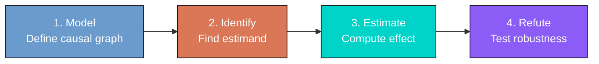
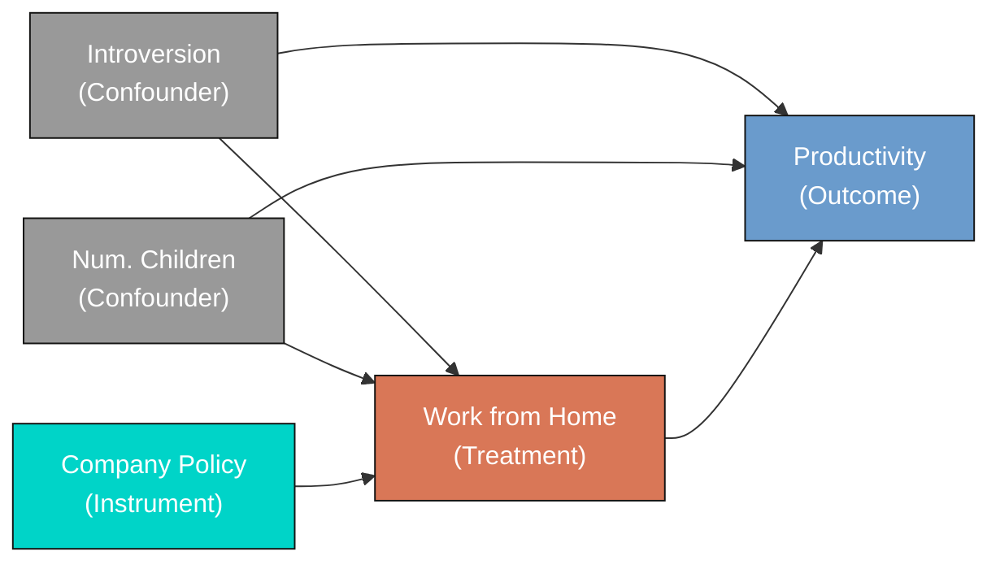

---
authors:
  - admin
categories:
  - Python
  - Causal Inference
  - Cross-sectional Data
  - IPW and Doubly Robust
draft: false
featured: false
date: "2026-05-05T00:00:00Z"
external_link: ""
image:
  caption: ""
  focal_point: Smart
  placement: 3
links:
- icon: google
  icon_pack: fab
  name: "Google Colab"
  url: https://colab.research.google.com/github/carlos-mendez/starter-academic-v501/blob/master/content/post/python_dowhy_intro/notebook.ipynb
- icon: code
  icon_pack: fas
  name: "Python script"
  url: script.py
slides:
summary: A beginner-friendly introduction to causal inference using DoWhy's four-step framework with simulated observational data on working from home and productivity
tags:
- python
- causal
- causal inference
title: "A Beginner's Guide to Causal Inference with DoWhy in Python"
url_code: ""
url_pdf: ""
url_slides: ""
url_video: ""
toc: true
diagram: true
---

## Overview

Does working from home actually make employees more productive, or do more productive people simply *choose* to work from home? This is the fundamental challenge of **causal inference**: distinguishing genuine cause-and-effect relationships from misleading correlations driven by confounding variables.

In this tutorial, we use **simulated observational data** where the true causal effect is known (ATE = 1.0) to demonstrate how **[DoWhy](https://www.pywhy.org/dowhy/v0.14/)** --- a Python library for causal inference --- helps us recover the correct answer. We walk through DoWhy's four-step framework (**Model, Identify, Estimate, Refute**) and apply four estimation methods: Linear Regression, Inverse Probability Weighting (IPW), Doubly Robust estimation (AIPW), and Instrumental Variables (2SLS).

**Learning objectives:**

- Understand why naive comparisons can be misleading when confounders are present
- Learn DoWhy's four-step causal inference framework (Model, Identify, Estimate, Refute)
- Define a causal graph (DAG) that encodes your assumptions about what causes what
- Distinguish two identification strategies: **selection on observables** (backdoor criterion) and **instrumental variables**
- Estimate causal effects using four methods and compare them against the known truth
- Assess robustness of estimates using automated refutation tests

## The problem: confounding bias

Imagine a company wants to know if its work-from-home (WFH) policy improves productivity. They collect data on 5,000 employees and compare productivity between those who work from home and those who go to the office.

The naive comparison shows that WFH employees are **1.39 productivity points** higher. But the true causal effect is only **1.0 points**. What went wrong?

The answer is **confounding**. Two variables --- **introversion** and **number of children** --- affect *both* the decision to work from home *and* productivity itself:

- **Introverts** prefer working from home (fewer social interruptions) AND are independently more productive (they focus better in quiet environments)
- **Parents with more children** prefer WFH for flexibility AND tend to have slightly lower productivity (more distractions at home)

Because introverts self-select into WFH and are also more productive, the naive comparison **overestimates** the true effect by 39%.

## DoWhy's four-step framework

Most statistical software lets you jump from data to estimates without stating your assumptions. DoWhy takes a different approach: it organizes every causal analysis into four explicit steps.



| Step | Question | What you do |
|------|----------|-------------|
| **Model** | What are my causal assumptions? | Draw a DAG (Directed Acyclic Graph) showing which variables cause which |
| **Identify** | Can I compute the causal effect from data? | DoWhy checks if your graph allows identification via backdoor, IV, or front-door criteria |
| **Estimate** | What is the numerical value of the causal effect? | Apply statistical methods (regression, IPW, doubly robust, IV) |
| **Refute** | Is this estimate robust? | Run automated tests: placebo treatment, random confounder, data subsets |

The key insight is that **identification** (step 2) is a *causal* problem that depends on your assumptions, while **estimation** (step 3) is a *statistical* problem that depends on your data. DoWhy keeps them separate.

## Setup and imports

```python
import warnings
warnings.filterwarnings("ignore")

import numpy as np
import pandas as pd
import matplotlib.pyplot as plt
from sklearn.linear_model import LogisticRegression, LinearRegression
from dowhy import CausalModel
```

```python
# Configuration
RANDOM_SEED = 42
np.random.seed(RANDOM_SEED)

N = 5000           # sample size
TRUE_ATE = 1.0     # known true effect

TREATMENT = "work_from_home"
OUTCOME = "productivity"
CONFOUNDERS = ["introversion", "num_children"]
INSTRUMENT = "company_policy"
```

## The data: simulated observational study

We simulate data where the **true causal effect is known** (ATE = 1.0), so we can verify whether each method recovers the correct answer. This is the gold standard for learning causal inference: if a method cannot recover the truth when we know it, we should not trust it on real data where we do not.

### Data generating process

The data generating process (DGP) defines how each variable is generated. Think of it as the "rules of the universe" in our simulation:

```python
def generate_wfh_data(n, seed):
    rng = np.random.default_rng(seed)

    # Confounders (affect BOTH treatment and outcome)
    introversion = rng.normal(5, 1.5, n)
    num_children = rng.poisson(1.5, n)

    # Instrument (affects treatment ONLY)
    company_policy = rng.binomial(1, 0.4, n)

    # Treatment: who works from home? (observational, not random!)
    logit_p = -1.5 + 0.3*introversion + 0.2*num_children + 1.0*company_policy
    prob_wfh = 1 / (1 + np.exp(-logit_p))
    work_from_home = rng.binomial(1, prob_wfh)

    # Outcome: productivity (note: company_policy does NOT appear here)
    noise = rng.normal(0, 2, n)
    productivity = (50
                    + 1.0 * work_from_home      # TRUE causal effect
                    + 0.8 * introversion         # confounder effect
                    - 0.5 * num_children         # confounder effect
                    + noise)

    return pd.DataFrame({
        "work_from_home": work_from_home,
        "productivity": productivity,
        "introversion": introversion,
        "num_children": num_children,
        "company_policy": company_policy,
    })

df = generate_wfh_data(N, RANDOM_SEED)
```

Notice three critical features of this DGP:

1. **Treatment is NOT random.** More introverted employees and those with more children are more likely to choose WFH. This is what makes it *observational* data.
2. **Confounders affect both treatment and outcome.** Introversion increases both the probability of WFH (logit coefficient = 0.3) and productivity directly (coefficient = 0.8).
3. **The instrument satisfies the exclusion restriction.** `company_policy` appears in the treatment equation (coefficient = 1.0) but NOT in the outcome equation. It only affects productivity *through* WFH choice.

```text
Dataset shape: (5000, 5)
Treatment prevalence: 66.2% work from home

       work_from_home  productivity  introversion  num_children  company_policy
count         5000.00       5000.00       5000.00       5000.00         5000.00
mean             0.66         53.88          4.97          1.50            0.42
std              0.47          2.49          1.50          1.22            0.49
min              0.00         43.90         -0.47          0.00            0.00
max              1.00         62.52         10.18          8.00            1.00
```

About two-thirds of employees in our sample work from home, and 42% have a WFH-friendly company policy. Productivity scores range from about 44 to 63 with a mean of 53.88.

## Exploratory data analysis

### The naive estimate

The simplest approach is to compare average productivity between the two groups:

```python
mean_wfh = df[df[TREATMENT] == 1][OUTCOME].mean()
mean_office = df[df[TREATMENT] == 0][OUTCOME].mean()
naive_ate = mean_wfh - mean_office
```

```text
Mean productivity (WFH):    54.35
Mean productivity (Office): 52.97
Naive ATE (difference):     1.39
True ATE:                   1.00
Bias (naive - true):        0.39
```

The naive estimate of **1.39** overshoots the true effect of **1.0** by 39%. This upward bias occurs because the WFH group contains more introverts, who are independently more productive. The naive comparison attributes *all* of the productivity difference to working from home, when in fact part of it is due to personality differences.

### Visualizing the confounding



**Panel A** shows the productivity distributions for office (blue) and WFH (orange) workers. The WFH distribution is shifted to the right, but not all of this shift is causal --- part of it reflects the higher introversion of WFH workers. The dotted line shows where the office distribution *would* shift if only the true causal effect (1.0) were acting.

**Panel B** reveals the covariate imbalance: WFH employees have higher introversion (5.19 vs 4.55) and more children (1.58 vs 1.33) than office workers. This imbalance is the fingerprint of self-selection and the source of confounding bias.

## Step 1: Model --- Define the causal graph

The first step in DoWhy is to encode your **causal assumptions** as a Directed Acyclic Graph (DAG). A DAG is simply a diagram showing which variables cause which, with arrows pointing from causes to effects.

### What is a DAG?

A DAG has three properties:
- **Directed**: Each arrow points in one direction (cause → effect)
- **Acyclic**: You cannot follow arrows in a circle back to where you started
- **Graph**: Variables are nodes, causal relationships are edges (arrows)

### Our causal graph



Three types of variables appear in our DAG:

- **Confounders** (gray): Introversion and num_children have arrows pointing to *both* treatment and outcome. They create "backdoor paths" that confound the naive comparison.
- **Instrument** (teal): Company policy has an arrow to treatment but *not* to outcome. It provides exogenous variation in WFH choice.
- **Treatment and Outcome** (orange and blue): The arrow from treatment to outcome represents the causal effect we want to estimate.

### Creating the CausalModel

```python
model = CausalModel(
    data=df,
    treatment=TREATMENT,
    outcome=OUTCOME,
    common_causes=CONFOUNDERS,
    instruments=[INSTRUMENT],
)
```



DoWhy creates an internal graph object that it uses in subsequent steps. The `common_causes` argument tells DoWhy which variables are confounders, and `instruments` identifies variables that affect treatment but not outcome.

## Step 2: Identify --- Find the estimand

**Identification** answers the question: *Can we express the causal effect as something we can compute from data?* This is purely a theoretical step --- it depends on the graph, not the data.

```python
identified_estimand = model.identify_effect(proceed_when_unidentifiable=True)
print(identified_estimand)
```

DoWhy automatically discovers two valid identification strategies:

### Strategy 1: Backdoor criterion (selection on observables)

$$
ATE = E\left[\frac{\partial}{\partial T} E[Y \mid T, X_1, X_2]\right]
$$

where \\(T\\) is `work_from_home`, \\(Y\\) is `productivity`, \\(X_1\\) is `introversion`, and \\(X_2\\) is `num_children`.

In plain language: if we **condition on all confounders** (introversion and num_children), the remaining association between treatment and outcome *is* the causal effect. This is called **selection on observables** because it assumes we have measured *all* variables that simultaneously affect treatment and outcome.

The critical assumption is **unconfoundedness**: there are no unmeasured common causes of WFH choice and productivity. If this holds, conditioning on the observed confounders blocks all backdoor paths.

### Strategy 2: Instrumental variable

$$
ATE = \frac{E\left[\frac{\partial Y}{\partial Z}\right]}{E\left[\frac{\partial T}{\partial Z}\right]}
$$

where \\(Z\\) is `company_policy`.

In plain language: divide the effect of the instrument on the outcome (reduced form) by the effect of the instrument on the treatment (first stage). The instrument provides a "natural experiment" --- variation in WFH choice that is not driven by confounders.

The critical assumption is the **exclusion restriction**: `company_policy` affects productivity *only* through its effect on WFH choice, not directly. In our simulation, this holds by construction.

## Step 3: Estimate --- Compute the causal effect

Now we apply four estimation methods. Methods 1--3 use the backdoor criterion (selection on observables), while Method 4 uses the instrumental variable strategy.

### Method 1: Linear Regression (backdoor adjustment)

The simplest approach: include confounders as control variables in a regression.

$$
Y_i = \beta_0 + \beta_1 T_i + \beta_2 X_{1i} + \beta_3 X_{2i} + \varepsilon_i
$$

The coefficient \\(\beta_1\\) is the causal effect, provided the model is correctly specified and all confounders are included.

```python
estimate_reg = model.estimate_effect(
    identified_estimand,
    method_name="backdoor.linear_regression",
    confidence_intervals=True,
)
```

```text
Estimated ATE: 1.0051
Robust SE (HC1): 0.0614
95% CI: [0.8847, 1.1255]
Bias from true (1.0): 0.0051
```

Linear regression recovers the true effect almost exactly (bias = 0.5%). The **robust standard error** (HC1) of 0.0614 accounts for potential heteroskedasticity --- the possibility that the variance of productivity differs between WFH and office workers. The 95% CI comfortably contains the true ATE of 1.0. In practice, we rarely know the true functional form, which is why we use multiple methods.

### Method 2: Inverse Probability Weighting (IPW)

IPW takes a completely different approach. Instead of modeling the outcome, it models the **treatment assignment mechanism** (who gets treated and why).

The idea: weight each observation by the inverse of the probability of receiving its actual treatment, given confounders. This creates a **pseudo-population** where treatment is independent of confounders --- mimicking what would happen in a randomized experiment.

$$
\widehat{ATE}_{IPW} = \frac{1}{N}\sum_{i=1}^{N}\left[\frac{T_i Y_i}{\hat{e}(X_i)} - \frac{(1 - T_i) Y_i}{1 - \hat{e}(X_i)}\right]
$$

where \\(\hat{e}(X_i) = P(T_i = 1 \mid X_i)\\) is the **propensity score** --- the predicted probability of working from home given the confounders.

```python
estimate_ipw = model.estimate_effect(
    identified_estimand,
    method_name="backdoor.propensity_score_weighting",
    method_params={"weighting_scheme": "ips_weight"},
)
```

```text
Estimated ATE: 1.0275
Robust SE (influence function): 0.0754
95% CI: [0.8797, 1.1754]
Bias from true (1.0): 0.0275
```

IPW recovers the true effect with a bias of only 2.8%. Its robust SE (0.0754) is computed from the **influence function** of the Hajek (stabilized) estimator, which is inherently robust to heteroskedasticity. The SE is slightly larger than regression's (0.0614) because IPW discards the outcome model entirely and relies solely on propensity scores --- using less information means more uncertainty. It relies on correct specification of the **propensity score model** (the probability of treatment given confounders) rather than the outcome model.

### Method 3: Doubly Robust (AIPW)

What if we are not sure whether the outcome model or the propensity score model is correctly specified? The **doubly robust** estimator (also called Augmented IPW or AIPW) combines both models. It is consistent if *either* model is correctly specified --- hence "doubly robust."

$$
\widehat{ATE}_{DR} = \frac{1}{N}\sum_{i=1}^{N}\left[(\hat{\mu}_1(X_i) - \hat{\mu}_0(X_i)) + \frac{T_i(Y_i - \hat{\mu}_1(X_i))}{\hat{e}(X_i)} - \frac{(1-T_i)(Y_i - \hat{\mu}_0(X_i))}{1 - \hat{e}(X_i)}\right]
$$

where \\(\hat{\mu}_1(X_i)\\) and \\(\hat{\mu}_0(X_i)\\) are the predicted outcomes under treatment and control, and \\(\hat{e}(X_i)\\) is the propensity score.

```python
# Fit propensity score model
ps_model = LogisticRegression(max_iter=1000, random_state=RANDOM_SEED)
ps_model.fit(df[CONFOUNDERS], df[TREATMENT])
ps = ps_model.predict_proba(df[CONFOUNDERS])[:, 1]

# Fit outcome models for each treatment group
outcome_model_1 = LinearRegression().fit(
    df[df[TREATMENT] == 1][CONFOUNDERS], df[df[TREATMENT] == 1][OUTCOME])
outcome_model_0 = LinearRegression().fit(
    df[df[TREATMENT] == 0][CONFOUNDERS], df[df[TREATMENT] == 0][OUTCOME])

# Predicted potential outcomes
mu1 = outcome_model_1.predict(df[CONFOUNDERS])
mu0 = outcome_model_0.predict(df[CONFOUNDERS])

# AIPW formula
T = df[TREATMENT].values
Y = df[OUTCOME].values
dr_ate = np.mean(
    (mu1 - mu0)
    + T * (Y - mu1) / ps
    - (1 - T) * (Y - mu0) / (1 - ps)
)
```

```text
Estimated ATE: 1.0115
Robust SE (influence function): 0.0623
95% CI: [0.8893, 1.1336]
Bias from true (1.0): 0.0115
```

The doubly robust estimate of **1.0115** (bias = 1.2%) sits between regression and IPW. Its robust SE (0.0623) is nearly identical to regression's (0.0614), which makes sense: when *both* models are correctly specified, DR achieves the **semiparametric efficiency bound** --- the smallest possible variance for any regular estimator of the ATE. In practice, doubly robust is often the preferred method because it provides insurance against misspecification of either model while maintaining excellent precision.

### Method 4: Instrumental Variables (2SLS)

Methods 1--3 all rely on **selection on observables** --- the assumption that we have measured all confounders. But what if there are unmeasured confounders? For example, what if "self-discipline" affects both WFH choice and productivity, but we cannot measure it?

**Instrumental Variables (IV)** offers a solution. Instead of conditioning on confounders, IV uses a variable (the **instrument**) that:

1. **Affects the treatment** (relevance): company policy makes WFH more likely
2. **Does NOT directly affect the outcome** (exclusion restriction): company policy affects productivity *only* through WFH choice
3. **Is not caused by confounders** (independence): company policy is determined by corporate decisions, not by individual traits

The IV estimator uses the instrument to isolate the *exogenous* variation in treatment --- the part of WFH choice that is driven by company policy rather than by personal characteristics.

```python
estimate_iv = model.estimate_effect(
    identified_estimand,
    method_name="iv.instrumental_variable",
    method_params={"iv_instrument_name": INSTRUMENT},
)
```

```text
First-stage F-statistic: 293.0
First-stage coefficient on company_policy: 0.2190 (robust SE: 0.0128)
Reduced-form coefficient: 0.1945 (robust SE: 0.0714)
Estimated ATE: 0.8881
Robust SE (HC1, delta method): 0.3303
95% CI: [0.2407, 1.5355]
Bias from true (1.0): -0.1119
```

The IV estimate of **0.888** is far noisier than the backdoor methods, with a robust SE of **0.3303** --- more than 5x larger than regression's 0.0614. Why? The Wald IV estimator divides the reduced-form effect (how the instrument affects the outcome, SE = 0.071) by the first-stage effect (how the instrument affects treatment, coefficient = 0.219). This division *amplifies* uncertainty. The delta-method SE accounts for noise in both stages.

The first-stage F-statistic of 293 confirms the instrument is strong (well above the rule-of-thumb threshold of 10). However, IV has a crucial advantage: it remains valid even with **unmeasured confounders**, as long as the exclusion restriction holds. The wide CI [0.24, 1.54] is the price of that robustness.

### Comparing all estimates



| Method | Estimate | Robust SE | 95% CI | CI Width | Covers True? | Identification |
|--------|----------|-----------|--------|----------|-------------|----------------|
| True ATE | 1.0000 | --- | --- | --- | --- | --- |
| Naive (Diff. in Means) | 1.3853 | 0.0716 | [1.245, 1.526] | 0.281 | No | None (biased) |
| Linear Regression | 1.0051 | 0.0614 | [0.885, 1.126] | 0.241 | Yes | Backdoor |
| IPW | 1.0275 | 0.0754 | [0.880, 1.175] | 0.296 | Yes | Backdoor |
| Doubly Robust (AIPW) | 1.0115 | 0.0623 | [0.889, 1.134] | 0.244 | Yes | Backdoor |
| IV (2SLS) | 0.8881 | 0.3303 | [0.241, 1.536] | 1.295 | Yes | Instrument |

All four causal methods recover the true ATE far better than the naive estimate. The backdoor methods (Regression, IPW, DR) are more precise because they use more information (the confounders directly), while IV is noisier but does not require observing all confounders. Crucially, the **naive CI does not contain the true ATE** --- it is not just wrong, it is *confidently* wrong.

## Uncertainty and precision: why standard errors matter

A point estimate without a standard error is like a weather forecast without a confidence range --- it tells you the best guess but nothing about how much to trust it. In causal inference, **standard errors** (and the confidence intervals built from them) quantify the **precision** of our estimates: how much would the estimate change if we drew a different sample?

### Why robust standard errors?

All standard errors in this analysis are **robust** (heteroskedasticity-consistent). Standard ("classical") SEs assume that the variance of the outcome is the same for all observations. But in practice, productivity might be more variable for WFH workers than for office workers, or more variable for introverts than for extroverts. Robust SEs --- specifically HC1 (White) standard errors for regression and IV, and influence-function SEs for IPW and DR --- remain valid regardless of such differences. In observational studies, robust SEs should be the default.

### How each method computes its standard error

| Method | SE Type | Intuition |
|--------|---------|-----------|
| **Naive** | Welch SE | Allows different variances in each group --- like a two-sample t-test that does not assume equal variances |
| **Linear Regression** | HC1 (White) | The "sandwich" estimator wraps each observation's squared residual in the variance formula, so large residuals for some observations do not distort the overall SE |
| **IPW** | Influence function | Each observation's "influence" on the ATE is computed from the Hajek weighting formula; the variance of these individual influences gives the SE |
| **Doubly Robust** | Influence function | Same idea as IPW, but the influence function now includes both the outcome model and propensity score corrections, yielding a smaller SE |
| **IV (2SLS)** | Delta method + HC1 | Because IV divides the reduced-form by the first-stage, uncertainty in *both* stages propagates into the final SE via the delta method |

### Comparing standard errors across methods

```text
Method                     Robust SE  Relative to Regression
------------------------------------------------------------
Naive                         0.0716            1.17x
Linear Regression             0.0614            1.00x (reference)
IPW                           0.0754            1.23x
Doubly Robust                 0.0623            1.01x
IV (2SLS)                     0.3303            5.38x
```

Several patterns stand out:

**Regression has the smallest SE (0.0614)** because it directly models the outcome as a function of treatment and confounders. When the model is correctly specified (as in our simulation), this is the most efficient approach.

**DR is nearly as precise (0.0623)** because it too uses the outcome model, supplemented by propensity score corrections. When both models are correct, DR achieves the semiparametric efficiency bound.

**IPW is slightly less precise (0.0754, 1.23x)** because it *ignores* the outcome model entirely. It only uses propensity scores to reweight observations. Think of it as throwing away useful information about the outcome-covariate relationship, which costs some precision.

**IV is dramatically less precise (0.3303, 5.38x)**. This is the **bias-variance tradeoff** in action. IV does not condition on confounders --- it uses only the exogenous variation provided by the instrument. Because the instrument (company policy) explains only 22% more WFH participation (first-stage coefficient = 0.219), the IV estimator must "amplify" a small signal, which amplifies noise too. The price of not needing to observe confounders is a much wider confidence interval.

**The naive SE (0.0716) is small but misleading.** The naive estimate is precise (narrow CI) but *wrong* --- its CI does not even contain the true ATE. This illustrates a critical lesson: **a small standard error does not mean a good estimate**. Precision without validity is worthless. The naive estimate is precisely estimating the wrong thing (a confounded association rather than a causal effect).

## Step 4: Refute --- Test robustness

The final step in DoWhy is **refutation** --- a set of automated tests that check whether the estimate is robust to various challenges.

### Placebo treatment test

Randomly permute the treatment variable so that no real causal effect exists. If our method is working correctly, the estimated effect should collapse to zero.

```python
refute_placebo = model_backdoor.refute_estimate(
    estimand_backdoor,
    estimate_reg_bd,
    method_name="placebo_treatment_refuter",
    placebo_type="permute",
    num_simulations=100,
)
```

```text
Refute: Use a Placebo Treatment
Estimated effect: 1.005
New effect: -0.00003
p value: 0.96
```

The placebo effect is essentially **zero** (-0.00003), confirming that the original effect is not an artifact. If the placebo test had returned a large effect, it would suggest that our model is picking up spurious patterns rather than genuine causal relationships.

### Random common cause test

Add a randomly generated variable as an additional confounder. If the estimate is robust, it should not change.

```python
refute_random = model_backdoor.refute_estimate(
    estimand_backdoor,
    estimate_reg_bd,
    method_name="random_common_cause",
    num_simulations=100,
)
```

```text
Refute: Add a random common cause
Estimated effect: 1.005
New effect: 1.005
p value: 0.98
```

The estimate remains **unchanged at 1.005** after adding a random confounder (p = 0.98). This confirms that our estimate is not fragile --- it does not shift when irrelevant variables are added.

### Data subset test

Re-estimate on a random 80% subsample of the data. A robust estimate should be stable across subsamples.

```python
refute_subset = model_backdoor.refute_estimate(
    estimand_backdoor,
    estimate_reg_bd,
    method_name="data_subset_refuter",
    subset_fraction=0.8,
    num_simulations=100,
)
```

```text
Refute: Use a subset of data
Estimated effect: 1.005
New effect: 0.999
p value: 0.64
```

The subsample estimate of **0.999** is nearly identical to the full-sample estimate of 1.005 (p = 0.64), confirming stability.

## Two identification strategies: a comparison

This tutorial introduced two fundamentally different approaches to causal identification. Understanding when each applies is essential for choosing the right method in practice.

### Selection on observables (backdoor criterion)

**When to use:** You believe you have measured *all* variables that simultaneously cause treatment and outcome.

**Assumption:** Unconfoundedness --- conditional on observed confounders, treatment assignment is "as good as random."

**Methods:** Linear Regression, IPW, Doubly Robust

**Strength:** More precise estimates (lower variance) because you use confounder information directly.

**Weakness:** If you miss even one confounder, the estimate is biased. There is no way to test the unconfoundedness assumption from data alone.

### Instrumental variables

**When to use:** You have a variable that affects treatment but not the outcome directly, and you suspect unmeasured confounders.

**Assumptions:** Relevance (instrument affects treatment), exclusion restriction (instrument does not directly affect outcome), independence (instrument is not caused by confounders).

**Method:** IV / 2SLS

**Strength:** Valid even with unmeasured confounders.

**Weakness:** Noisier estimates (higher variance). The exclusion restriction cannot be tested from data --- it must be justified by domain knowledge.

## Takeaways

1. **Naive comparisons are misleading** when confounders are present. The naive estimate of 1.39 was 39% too high because introverts self-selected into WFH. Its narrow CI [1.25, 1.53] does not even contain the true ATE --- a case of being *precisely wrong*.

2. **Selection on observables** (backdoor criterion) works when you have measured all confounders. Three methods --- regression, IPW, and doubly robust --- all recovered the true ATE within 3%, with robust SEs between 0.061 and 0.075.

3. **Instrumental variables** provide a different identification strategy that works even with unmeasured confounders, at the cost of a 5x larger standard error (0.33 vs 0.06).

4. **Doubly robust estimation** offers the best of both worlds: insurance against misspecification *and* near-optimal precision (SE = 0.062, nearly matching regression).

5. **Standard errors measure precision, not validity.** The naive estimate has a small SE but is biased. IV has a large SE but is unbiased under weaker assumptions. Always consider both bias and variance when choosing a method.

6. **Robust standard errors** (HC1, influence function) should be the default in observational studies. They remain valid even when error variances differ across groups.

7. **DoWhy's four-step framework** forces transparency: declare your assumptions (Model), verify identifiability (Identify), compute the effect (Estimate), and test robustness (Refute).

8. **Simulated data with known truth** is the best way to learn causal inference --- you can verify that methods work before applying them to real data where the answer is unknown.

## Exercises

1. **Break the exclusion restriction.** Modify the DGP so that `company_policy` directly affects `productivity` (e.g., add `+ 0.5 * company_policy` to the outcome equation). Re-run the IV estimate. Does it still recover the true ATE?

2. **Add an unmeasured confounder.** Add a new variable `self_discipline` that affects both `work_from_home` and `productivity`, but do NOT include it in `CONFOUNDERS`. Compare how the backdoor methods (now biased) and IV (still valid) perform.

3. **Try a nonlinear DGP.** Replace the linear productivity equation with a nonlinear one (e.g., add an interaction term `0.3 * introversion * work_from_home`). Does linear regression still work well? What about the doubly robust estimator?

## References

- Sharma, A., & Kiciman, E. (2020). DoWhy: An end-to-end library for causal inference. *arXiv preprint arXiv:2011.04216*.
- Pearl, J. (2009). *Causality: Models, Reasoning, and Inference* (2nd ed.). Cambridge University Press.
- Angrist, J. D., & Pischke, J. S. (2009). *Mostly Harmless Econometrics*. Princeton University Press.
- Rosenbaum, P. R., & Rubin, D. B. (1983). The central role of the propensity score in observational studies for causal effects. *Biometrika*, 70(1), 41--55.
- Robins, J. M., Rotnitzky, A., & Zhao, L. P. (1994). Estimation of regression coefficients when some regressors are not always observed. *Journal of the American Statistical Association*, 89(427), 846--866.
