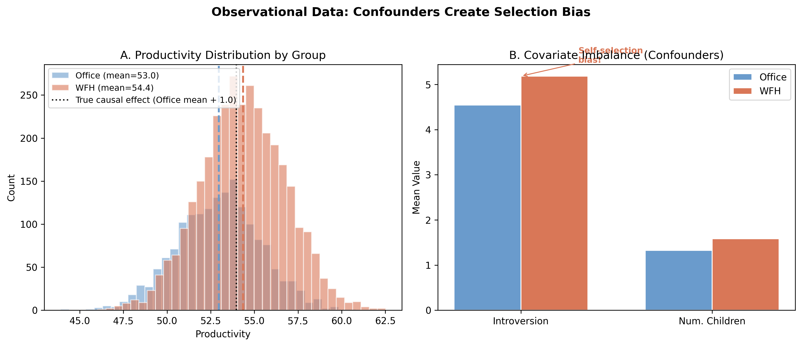
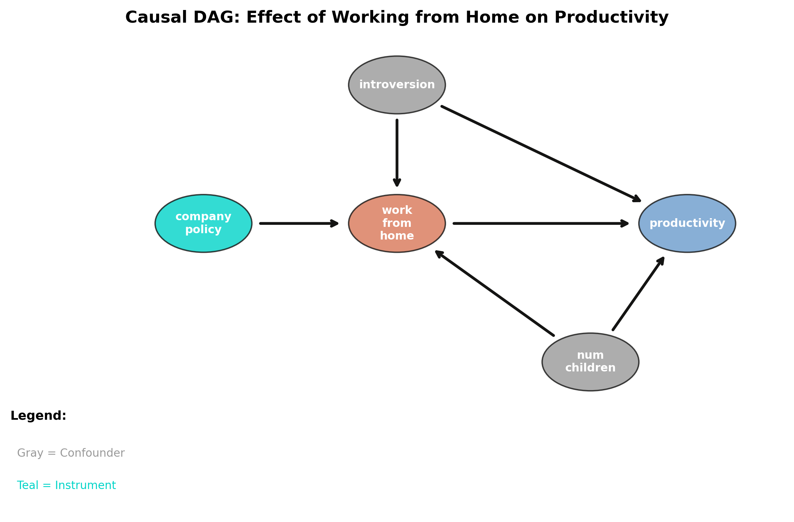
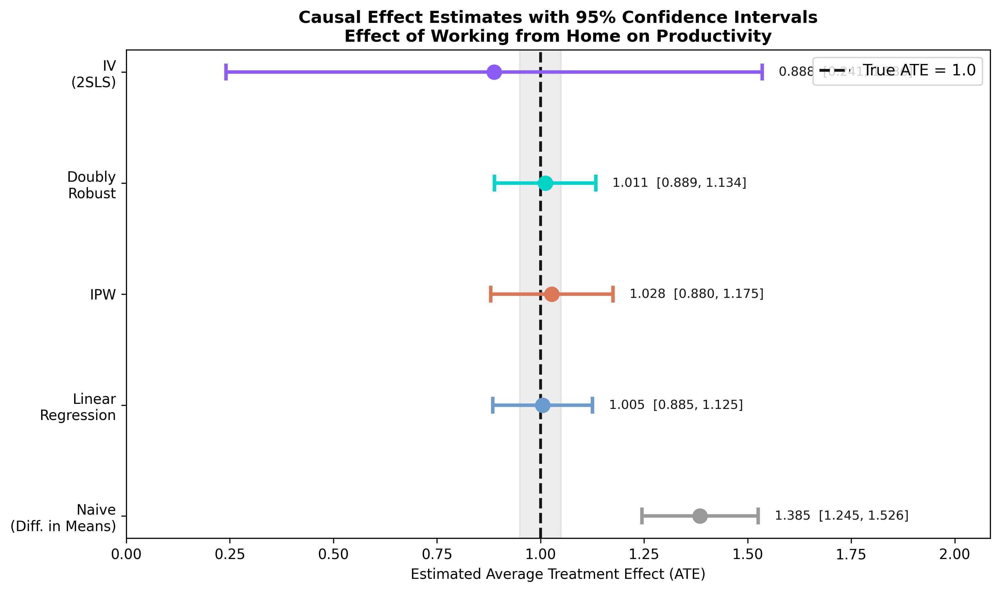

# The Tension {.divider background-color="#d97757"}

[Act I]{.act}

## Does working from home raise productivity — or do productive people just choose it?

A company compares 5,000 employees and finds work-from-home staff are **1.39 points** more productive.

. . .

But the true effect is only **1.0**. *Where did the extra 0.39 come from?*

::: {.notes}
This is the central problem of causal inference: in observational data, the people who take the treatment are different from those who don't. Introverts both prefer WFH and are independently more productive. So a raw comparison mixes the effect of WFH with the effect of being an introvert. The whole deck is about recovering the 1.0 we secretly built into the simulation.
:::

## The naive comparison says +1.39 — confidently wrong by 39%



::: {.notes}
Spoiler figure for the problem. The right-shifted WFH distribution is not all causal — part of it reflects covariate imbalance shown in Panel B: introversion 5.19 vs 4.55, children 1.58 vs 1.33. The dotted line marks where the office distribution would sit if only the true 1.0 effect acted. Plant the tension; we resolve it in Act III.
:::

## Where we're going

::: {.incremental}
- The lab: 5,000 employees, a known ATE of 1.0, two confounders, one instrument
- DoWhy's four steps — Model, Identify, Estimate, Refute
- Four estimators across two identification strategies
- The lesson: identification and method comparison — not precision — separate causal from confidently wrong
:::

# The Investigation {.divider background-color="#6a9bcc"}

[Act II]{.act}

## We simulate the truth so we can check who recovers it

::: {.incremental}
- **Outcome** — `productivity` (mean 53.88), with a true WFH effect baked in at **+1.0**
- **Treatment** — `work_from_home` (66.2% treated), assigned *non-randomly*
- **Confounders** — `introversion` and `num_children` drive *both* treatment and outcome
- **Instrument** — `subway_disruption` shifts WFH but never touches productivity directly
:::

[The estimand is the **average treatment effect (ATE)** — and we know it equals 1.0, so every method is graded against the truth.]{.comment}

## Confounders open a backdoor path the naive estimate can't close



::: {.notes}
This is DoWhy Step 1 (Model) drawn as a DAG. The single arrow T→Y is the causal effect we want. The two confounders create backdoor paths T←I→Y and T←C→Y. Block those and the remaining association is causal. The instrument gives a second, independent route to identification.
:::

## DoWhy forces four explicit steps — keeping assumptions apart from estimation

| Step | Question | What you do |
|---|---|:--|
| **Model** | What do I assume? | Draw the DAG |
| **Identify** | Is the effect computable? | [Backdoor or IV]{.key} |
| **Estimate** | What's the number? | Regression, IPW, AIPW, IV |
| **Refute** | Is it robust? | Placebo, random cause, subset |

[Identification (a *causal* question about the graph) stays separate from estimation (a *statistical* question about the data).]{.comment}

## Step 2 — Identify: the backdoor estimand conditions on the confounders

$$ATE = E\!\left[\frac{\partial}{\partial T}\, E[\,Y \mid T, X_1, X_2\,]\right]$$

Condition on `introversion` ($X_1$) and `num_children` ($X_2$) and the leftover $T$–$Y$ association *is* the causal effect.

[The assumption is **unconfoundedness**: no unmeasured common cause of WFH and productivity. Untestable from data alone.]{.comment}

::: {.notes}
Identification is purely theoretical — it depends on the graph, not the numbers. DoWhy reads the DAG and reports that conditioning on the two confounders blocks every backdoor path. This is "selection on observables." Its Achilles heel: miss one confounder and every backdoor estimate is biased, with no internal warning.
:::

## Step 2 — Identify: the instrument gives a second, assumption-free route

$$ATE = \frac{E\!\left[\partial Y / \partial Z\right]}{E\!\left[\partial T / \partial Z\right]}$$

Divide the instrument's effect on the outcome (reduced form) by its effect on the treatment (first stage).

[The assumption is the **exclusion restriction**: $Z$ moves productivity *only* through WFH. True by construction here.]{.comment}

::: {.notes}
Same target — the ATE — reached a different way. IV does not require observing the confounders; it requires a valid instrument. Subway disruption is random with respect to introversion and family size, affects WFH, and (by construction) has no direct path to productivity. Trade-off: it only identifies the effect for "compliers" and, as we'll see, it's far noisier.
:::

## Step 3 — Estimate: backdoor regression recovers 1.0051, almost exactly

$$Y_i = \beta_0 + \beta_1 T_i + \beta_2 X_{1i} + \beta_3 X_{2i} + \varepsilon_i$$

``` {.python code-line-numbers="1-4|5"}
estimate_reg = model.estimate_effect(
    identified_estimand,
    method_name="backdoor.linear_regression",
    confidence_intervals=True,
)   # ATE 1.0051 · robust SE 0.0614 · 95% CI [0.885, 1.126]
```

[$\beta_1$ is the causal effect — *if* the model is right and every confounder is in.]{.comment}

::: {.notes}
The simplest backdoor method: put the confounders in as controls. Bias is 0.5%. The HC1 robust SE of 0.0614 guards against heteroskedasticity. It works here because the true DGP is linear — in practice we rarely know the functional form, which is exactly why we run several methods.
:::

## Step 3 — Estimate: IPW reweights to a pseudo-randomized population

$$\widehat{ATE}_{IPW} = \frac{1}{N}\sum_{i=1}^{N}\left[\frac{T_i Y_i}{\hat{e}(X_i)} - \frac{(1-T_i)Y_i}{1-\hat{e}(X_i)}\right]$$

Weight each person by the inverse of their **propensity score** $\hat{e}(X_i)=P(T_i=1\mid X_i)$, so treatment becomes independent of confounders.

[IPW gives **1.0275** (SE 0.0754). It models *who gets treated*, not the outcome — so it costs a little precision.]{.comment}

::: {.notes}
Completely different philosophy from regression: model the treatment-assignment mechanism, not the outcome. Reweighting builds a pseudo-population that mimics a randomized trial. Bias 2.8%. The slightly larger SE is the price of discarding the outcome model and leaning entirely on propensity scores.
:::

## Step 3 — Estimate: doubly robust is two insurance policies in one

$$\widehat{ATE}_{DR} = \frac{1}{N}\sum_{i=1}^{N}\Big[(\hat{\mu}_1 - \hat{\mu}_0) + \frac{T_i(Y_i-\hat{\mu}_1)}{\hat{e}(X_i)} - \frac{(1-T_i)(Y_i-\hat{\mu}_0)}{1-\hat{e}(X_i)}\Big]$$

Combine an outcome model ($\hat{\mu}_1,\hat{\mu}_0$) with the IPW reweight. Consistent if **either** model is right.

[AIPW gives **1.0115** (SE 0.0623) — smallest bias of the four, precision matching regression.]{.comment}

::: {.notes}
Belt and suspenders. If the propensity model fails, the outcome model saves you; if the outcome model fails, the reweight does. Both wrong is the only failure mode. When both are right, AIPW hits the semiparametric efficiency bound — the smallest possible variance — which is why its SE nearly equals regression's despite the extra machinery.
:::

## Step 3 — Estimate: IV survives unmeasured confounders, but pays in noise

``` {.python code-line-numbers="1-5|6"}
estimate_iv = model.estimate_effect(
    identified_estimand,
    method_name="iv.instrumental_variable",
    method_params={"iv_instrument_name": "subway_disruption"},
)   # first-stage F = 293 (strong) · ATE 0.8881 · SE 0.3303
```

[The instrument is strong (F = 293), yet the Wald ratio amplifies noise — SE **0.3303**, more than $5\times$ regression's.]{.comment}

::: {.notes}
IV does not condition on confounders — it uses only the exogenous WFH variation the subway shock provides. That's its superpower: validity even with unmeasured confounders. The cost: dividing a reduced-form effect by a first-stage effect propagates uncertainty from both stages through the delta method, blowing the CI out to [0.24, 1.54].
:::

## All four causal methods land near 1.0; the naive estimate misses entirely



::: {.notes}
The money figure. Regression, IPW, and AIPW cluster tightly around the dashed truth line; IV is centered nearby but far wider; the naive estimate sits well above, and crucially its CI does not even cross 1.0 — confidently wrong. Walk left to right: precision falls as we demand fewer assumptions.
:::

## A small standard error is not a good estimate — the naive one proves it

| Method | $\widehat{ATE}$ | Robust SE | Covers 1.0? |
|---|---:|---:|:--:|
| Naive | [1.3853]{.key} | 0.0716 | no |
| Regression | 1.0051 | 0.0614 | yes |
| IPW | 1.0275 | 0.0754 | yes |
| Doubly robust | 1.0115 | 0.0623 | yes |
| IV (2SLS) | 0.8881 | 0.3303 | yes |

[The naive CI [1.25, 1.53] is *narrow* — and excludes the truth. Precision without validity is worthless.]{.comment}

# The Resolution {.divider background-color="#00d4c8"}

[Act III]{.act}

## Doubly robust nails the known effect: 1.01 against a truth of 1.00 {background-color="#141413"}

[1.0115]{.bignum}

[$\widehat{ATE}$, AIPW (SE 0.0623) · smallest bias of the four · matches the planted truth of 1.0]{.bignum-label}

::: {.notes}
The Act-III payoff. Of regression (1.0051), IPW (1.0275), and AIPW (1.0115), the doubly robust estimator combines the smallest absolute bias with regression-level precision. It is the method I'd reach for first on real data: insurance against misspecification plus near-optimal variance.
:::

## Step 4 — Refute: three stress tests, three passes

| Refuter | Expected | New effect | Verdict |
|---|:--:|---:|:--:|
| Placebo treatment | $\approx 0$ | [−0.00003]{.key} | pass |
| Random common cause | $\approx 1.0$ | 1.005 | pass |
| Data subset (80%) | $\approx 1.0$ | 0.999 | pass |

[Permute the treatment and the effect collapses to zero; add a fake confounder or drop 20% of rows and it barely moves.]{.comment}

::: {.notes}
This is what makes the four-step framework more than bookkeeping. The placebo refuter is the most convincing: replace the real treatment with a random one and a working method must return ~0 — it returns −0.00003 (p = 0.96). Random-common-cause and data-subset confirm the estimate is not fragile. Robustness is demonstrated, not asserted.
:::

## Do four estimators and passing refuters make it causal? No — assumptions still carry it

[Objection.]{.objection} Running four estimators and passing refutation tests can't *manufacture* identification.

. . .

[Response.]{.rebuttal} Correct. The ATE is identified only under **unconfoundedness** (backdoor) or the **exclusion restriction** (IV). DoWhy makes those assumptions explicit and stress-tests the estimate — it cannot prove them. Refuters catch fragility, not unmeasured confounders.

::: {.notes}
Steelman, don't strawman. The refutation tests probe stability under perturbations we can simulate; they say nothing about a confounder we never measured. The value of DoWhy is transparency — every causal claim is traceable to an assumption encoded in the DAG — not a guarantee of truth. On real data, the exclusion restriction and unconfoundedness must be defended with domain knowledge.
:::

# Declare your assumptions, compare your methods, then refute — that's what makes it causal. {.divider background-color="#141413"}

::: {.notes}
The single takeaway. The naive 1.39 was precise and wrong; the backdoor trio recovered 1.0 within 3%; IV traded precision for robustness to unmeasured confounding; doubly robust was best of all. None of it works without Step 1 — writing down the DAG — and Step 4 — trying to break your own result.
:::
