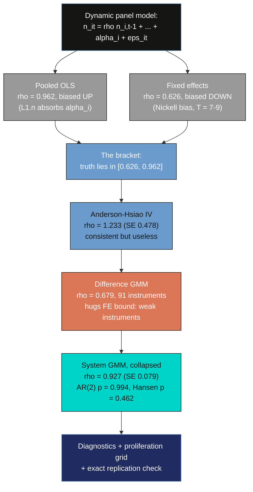

---
authors:
  - admin
categories:
  - Python
  - Panel Data
date: "2026-06-11T00:00:00Z"
draft: false
featured: false
external_link: ""
image:
  caption: ""
  focal_point: Smart
  placement: 3
  preview_only: false
links:
  - icon: code
    icon_pack: fas
    name: "Python script"
    url: script.py
  - icon: database
    icon_pack: fas
    name: "Data (CSV)"
    url: abdata.csv
  - icon: markdown
    icon_pack: fab
    name: "MD version"
    url: https://raw.githubusercontent.com/cmg777/starter-academic-v501/master/content/post/python_dynamic_panel/index.md
slides:
summary: How persistent is firm employment? Pooled OLS, fixed effects, Anderson-Hsiao IV, Arellano-Bond difference GMM, and Blundell-Bond system GMM on the classic 140-firm UK panel — and how the AR(2), Hansen, and instrument-collapse diagnostics separate the one defensible estimate from four seductive wrong ones.
tags:
  - python
  - econometrics
  - panel data
  - dynamic panels
  - gmm
title: "Dynamic Panel Data Models in Python: From Nickell Bias to System GMM"
url_code: ""
url_pdf: ""
url_slides: ""
url_video: ""
toc: true
diagram: true
---

## Abstract

When this year's outcome depends on last year's outcome — employment, debt, capital, habits — ordinary panel methods break in ways that are invisible on the printed output. This tutorial asks how persistent firm-level employment is, and shows why the answer depends dramatically on the estimator used to obtain it. Using the classic Arellano and Bond (1991) panel of 140 UK manufacturing firms observed 1976—1984 (1,031 firm-years, unbalanced), we estimate the autoregressive coefficient $\rho$ of a dynamic labor-demand equation with `pyfixest` (OLS, fixed effects, IV benchmarks) and `pydynpd` (difference and system GMM). Pooled OLS gives $\hat{\rho} = 0.962$, biased upward by the omitted firm effect; fixed effects gives 0.626, biased downward by Nickell bias — so the truth must lie inside the bracket [0.626, 0.962]. Anderson-Hsiao IV is consistent but useless (1.233 with standard error 0.478), and Arellano-Bond difference GMM with 91 instruments returns 0.679, hugging the biased fixed-effects bound — the textbook weak-instrument symptom. Blundell-Bond system GMM with 32 collapsed instruments delivers the defensible headline: $\hat{\rho} = 0.927$ (SE 0.079), inside the bracket, with AR(2) p = 0.994 and Hansen p = 0.462, and the toolchain replicates the published `pydynpd` benchmark digit for digit. The practical implication: roughly 93 percent of an employment shock survives into the next year, and no single printed p-value — only the full bracket-plus-diagnostics workflow — separates that estimate from the four wrong ones.

## 1. Overview

Suppose a recession, a strike, or a sudden export boom changes a firm's workforce this year. How much of that shock is still visible in the firm's employment *next* year? If the answer is "almost none," labor markets adjust quickly and temporary shocks stay temporary. If the answer is "almost all of it," shocks echo for a decade: hiring freezes cast long shadows, and a one-year subsidy keeps paying employment dividends for years. The single number that encodes this is $\rho$, the coefficient on *lagged employment* in a dynamic labor-demand equation — and this post is the story of how hard that one number is to estimate, and how econometricians eventually got it right.

Think of $\rho$ as the *echo strength* of the labor market. If $\rho = 0.6$, a shock loses 40 percent of its volume every year and fades within a couple of years. If $\rho = 0.95$, the echo barely decays — what happens to a firm in 1980 is still audible in 1988. The estimators we run below will disagree about exactly this: the same regression, on the same data, will imply shock half-lives of 1.5 years, 9 years, or 18 years depending on how it treats one nuisance term.

Formally, we estimate the dynamic labor-demand model that Blundell and Bond (1998) used on this very dataset:

$$n\_{it} = \rho n\_{i,t-1} + \beta\_1 w\_{it} + \beta\_2 w\_{i,t-1} + \beta\_3 k\_{it} + \beta\_4 k\_{i,t-1} + \alpha\_i + \delta\_t + \varepsilon\_{it}$$

In words, this says: a firm's log employment this year ($n\_{it}$) equals a fraction $\rho$ of its log employment last year, plus the effects of current and lagged log real wages ($w$) and log capital ($k$), plus a permanent firm-specific level $\alpha\_i$ (the *firm fixed effect*: management quality, industry niche, plant size), plus a year effect $\delta\_t$ shared by all firms (the macro cycle), plus an idiosyncratic shock $\varepsilon\_{it}$. In the code, $n$, $w$, and $k$ are literally the columns `n`, `w`, and `k` of `abdata.csv`; $n\_{i,t-1}$ is the constructed column `n_lag1`; and $\rho$ is the coefficient the output tables label `n_lag1` or `L1.n`.

Why is this hard? Because the model commits the one sin that ordinary panel methods cannot forgive: it puts a *lagged dependent variable* on the right-hand side while an unobserved firm effect $\alpha\_i$ sits in the error. Last year's employment $n\_{i,t-1}$ obviously depends on $\alpha\_i$ — a firm with a high permanent level had high employment last year too — so the regressor is correlated with part of the error term *by construction*, no matter how many controls we add. Pooled OLS breaks one way, fixed effects breaks the opposite way, and the resolution requires a genuinely different idea: using the panel's own history as instruments, which is what the Arellano-Bond and Blundell-Bond generalized method of moments (GMM) estimators do.

Importantly, the framing here is **descriptive and structural, not causal**: $\rho$ is a persistence parameter of a dynamic labor-demand equation — there is no treatment, and we estimate no ATE or ATT. What identification requires instead is *sequential exogeneity* of the instruments (past values of the variables must be uncorrelated with future shocks) and *no serial correlation* in $\varepsilon\_{it}$ — assumptions we can partially test with the AR(2) and Hansen diagnostics that occupy the second half of the tutorial.

**Learning objectives:**

- Understand why a lagged dependent variable plus a fixed effect breaks both pooled OLS (bias up) and the within estimator (Nickell bias, down), and how the two wrong answers bracket the truth.
- Implement the full estimator ladder in Python — OLS and fixed effects with `pyfixest`, Anderson-Hsiao IV, and difference and system GMM with `pydynpd`.
- Estimate employment persistence on the classic Arellano-Bond (1991) UK panel and diagnose weak instruments using Bond's (2002) bracket check.
- Assess GMM credibility with the AR(1)/AR(2) serial-correlation tests and the Hansen overidentification test, including the counterintuitive "p close to 1 is a red flag" reading.
- Compare instrument-proliferation choices (lag windows, collapsing) and verify the toolchain against the package's published replication benchmark.

The diagram below is the roadmap: every estimator we run, why it fails or succeeds, and the order in which the tutorial visits them.



Read the diagram top to bottom and you have the whole argument: two naive estimators whose *known* bias directions form a credible bracket, one IV estimator that is right in theory and hopeless in practice, a difference-GMM estimator that passes every printed test yet sits suspiciously on the bracket's floor, and a system-GMM estimator that lands in the upper half of the bracket with clean diagnostics. The final section stress-tests that winner against instrument proliferation and a published benchmark.

### Key concepts at a glance

The tutorial leans on a small vocabulary repeatedly. Each concept below has three parts: the **definition** is always visible, while the **example** and **analogy** sit behind clickable cards — open them when you need them, leave them collapsed for a quick scan. If a later section mentions "Nickell bias" or "sequential exogeneity" and the term feels slippery, this is the section to re-read.

**1. Lagged dependent variable and persistence** $\rho$.
The model puts yesterday's outcome on the right-hand side. The coefficient $\rho$ measures persistence. It is the fraction of this year's employment inherited from last year. Values near 0 mean fast adjustment. Values near 1 mean shocks essentially never die.

<div class="concept-pair">
<details class="concept-card concept-example">
<summary>Example</summary>

Our headline estimate is $\hat{\rho} = 0.927$: about 93 percent of an employment shock survives into the next year. After five years, $0.927^5 \approx 0.68$ of the shock remains. The implied half-life is roughly nine years — longer than the 1976—1984 sample window itself.

</details>

<details class="concept-card concept-analogy">
<summary>Analogy</summary>

A shout in a canyon. $\rho$ is the echo strength: at $\rho = 0.6$ each echo returns at 60 percent volume and silence comes quickly; at $\rho = 0.93$ the canyon keeps answering for a decade. The estimators in this post disagree about how echoey the canyon is.

</details>
</div>

**2. Firm fixed effect** $\alpha\_i$.
A permanent, unobserved firm-specific level. It captures management quality, technology, and market niche. It never changes over the sample. It sits in the error term unless the estimator deals with it explicitly.

<div class="concept-pair">
<details class="concept-card concept-example">
<summary>Example</summary>

In our panel, the between-firm standard deviation of log employment is 1.339 while the within-firm standard deviation is only 0.195 — a factor of seven. Firms differ enormously from each other and barely move around their own levels, so $\alpha\_i$ dominates the data. Figure 1 shows each firm orbiting its own level.

</details>

<details class="concept-card concept-analogy">
<summary>Analogy</summary>

Planets in different orbits. Each planet (firm) circles at its own distance from the sun, with small wobbles. If you pool all planets and regress position on lagged position, most of what you "explain" is just which orbit each planet lives in — not its dynamics.

</details>
</div>

**3. Nickell bias.**
The bias of the fixed-effects (within) estimator in dynamic panels. Demeaning subtracts each firm's average, which contains future shocks. The demeaned lag is then mechanically correlated with the demeaned error. The bias is negative and of order $1/T$. With T of 7—9 it is large.

<div class="concept-pair">
<details class="concept-card concept-example">
<summary>Example</summary>

Our within estimate is $\hat{\rho} = 0.626$ (SE 0.052) against a system-GMM benchmark of 0.927 — a downward gap of 0.30. With $T \approx 7$—$9$, the $1/T$ bias is roughly a tenth in raw scale and is amplified when $\rho$ is large. The bias does *not* shrink as you add more firms.

</details>

<details class="concept-card concept-analogy">
<summary>Analogy</summary>

Grading each student against their own course average — but the average includes the final exam they have not taken yet. Today's score is being compared to a benchmark contaminated by tomorrow's performance, creating a spurious negative link between "today" and "the future part of the average."

</details>
</div>

**4. The bias bracket (Bond 2002).**
Pooled OLS biases $\rho$ up. Fixed effects biases it down. Both directions are known from theory. So the two wrong answers bracket the truth. Any consistent estimator should land between them. Estimates hugging either bound deserve suspicion.

<div class="concept-pair">
<details class="concept-card concept-example">
<summary>Example</summary>

Our bracket is [0.626, 0.962]. Difference GMM lands at 0.679 — only 0.053 above the floor and within one standard error of it, the classic weak-instrument warning. System GMM lands at 0.927, in the upper half, and is the estimate the bracket logic endorses.

</details>

<details class="concept-card concept-analogy">
<summary>Analogy</summary>

Two broken clocks, one known to run fast and one known to run slow. Neither tells the time, but the true time must lie between them — and a third clock claiming a time outside that window is broken in a worse way.

</details>
</div>

**5. Sequential exogeneity.**
The identifying assumption behind dynamic-panel GMM. Past values of the variables must be uncorrelated with current and future shocks. Then deep lags are valid instruments. It is weaker than strict exogeneity. It tolerates feedback from past shocks to current regressors.

<div class="concept-pair">
<details class="concept-card concept-example">
<summary>Example</summary>

For the differenced equation, sequential exogeneity delivers the moment conditions $E[n\_{i,t-s} \Delta\varepsilon\_{it}] = 0$ for $s \ge 2$. Our AR(2) test (p = 0.994) checks the part of this that is checkable: if $\varepsilon\_{it}$ were serially correlated, the $t-2$ lags would be contaminated and the moments would fail.

</details>

<details class="concept-card concept-analogy">
<summary>Analogy</summary>

Witnesses who left the building before the crime. Anything they saw (lags dated $t-2$ and earlier) cannot have been influenced by what happened at time $t$, so their testimony is admissible — provided no one tipped them off in advance (no serial correlation).

</details>
</div>

**6. Difference GMM (Arellano-Bond 1991).**
First-difference the equation to kill $\alpha\_i$. The differenced lag is still endogenous. Instrument it with all available lagged levels, dated $t-2$ and earlier. Weight the many moment conditions optimally. This generalizes Anderson-Hsiao from one instrument to dozens.

<div class="concept-pair">
<details class="concept-card concept-example">
<summary>Example</summary>

Our two-step difference GMM uses 91 instruments on 751 observations and returns $\hat{\rho} = 0.679$ (SE 0.089), with Hansen p = 0.211 and AR(2) p = 0.866 — every printed test passes, yet the estimate hugs the FE bound because lagged *levels* barely predict future *differences* when $\rho$ is near 1.

</details>

<details class="concept-card concept-analogy">
<summary>Analogy</summary>

Replacing one courtroom witness with a panel of forty. Each extra witness adds a little information, and the judge (the GMM weighting matrix) listens more carefully to the reliable ones. But if every witness only glimpsed the scene from far away, forty vague testimonies still convict no one.

</details>
</div>

**7. System GMM and mean stationarity (Blundell-Bond 1998).**
Stack the differenced equation with the original levels equation. Instrument levels with lagged differences. This requires one extra assumption: firms' initial deviations from their steady-state paths are uncorrelated with $\alpha\_i$. The payoff is much stronger instruments when $\rho$ is large.

<div class="concept-pair">
<details class="concept-card concept-example">
<summary>Example</summary>

Adding the levels equation moves our estimate from 0.679 (difference GMM) to $\hat{\rho} = 0.927$ (SE 0.079) with 32 collapsed instruments — inside the bracket, with AR(2) p = 0.994 and Hansen p = 0.462. The extra moments are exactly the ones with identifying power for a persistent series.

</details>

<details class="concept-card concept-analogy">
<summary>Analogy</summary>

Trying to learn a lake's depth from ripples alone (differences) versus also using the waterline marks on the shore (levels). When the lake is calm — a persistent series barely moves — the ripples carry almost no information, and the waterline marks are what actually pin the answer down.

</details>
</div>

**8. Instrument proliferation and collapsing.**
"Use every lag" generates instruments quadratically in T. Too many instruments overfit the endogenous variables and weaken the Hansen test. A Hansen p-value near 1 signals an overwhelmed test, not a valid model. Collapsing combines lags into one column per depth, shrinking the count. Roodman's rule of thumb: keep instruments below the number of groups.

<div class="concept-pair">
<details class="concept-card concept-example">
<summary>Example</summary>

In our grid, uncollapsed instrument counts of 68, 95, and 113 push the Hansen p-value from 0.035 to 0.186 to 0.235 while $\hat{\rho}$ barely moves (0.921—0.956). The uncollapsed 2:3 spec is *rejected* (p = 0.035) while its collapsed twin *passes* (p = 0.096) — same model, different verdicts, driven purely by instrument count.

</details>

<details class="concept-card concept-analogy">
<summary>Analogy</summary>

A judge facing 113 witnesses who mostly repeat each other's hearsay. With so much correlated testimony, the judge can no longer distinguish a solid case from a coached one — the trial (the Hansen test) loses its power to reject. Fewer, independent witnesses make a more credible verdict.

</details>
</div>

With the vocabulary pinned down, we can set up the toolchain — including one small but instructive compatibility fix.

## 2. Setup and imports

We need two workhorse libraries. [`pyfixest`](https://py-econometrics.github.io/pyfixest/pyfixest.html) estimates the OLS, fixed-effects, and IV benchmarks with a compact R-style formula syntax. [`pydynpd`](https://github.com/dazhwu/pydynpd) (Wu, Hua and Xu 2023) estimates difference and system GMM with a command syntax deliberately close to Stata's `xtabond2` — and its published output has been validated against `xtabond2`, which is exactly what our replication check in Section 11 will exploit.

Both libraries install from PyPI. The version pin matters here, because the compatibility fix described next targets exactly this release:

```bash
pip install pydynpd==0.2.2 pyfixest
```

One practical wrinkle deserves a friendly explanation rather than a silent workaround. `pydynpd` 0.2.2 was written before NumPy 2.0, which removed the alias `np.in1d` and stopped allowing `float()` and `math.sqrt()` to be called directly on 1x1 matrices. Rather than downgrading NumPy or forking the package, we apply a six-line *compatibility shim*: restore the `np.in1d` alias, and inject tiny wrapper functions into the one `pydynpd` module that does the offending scalar conversions (`specification_tests`). Because Python module globals shadow builtins, the injected `float` and `math.sqrt` wrappers are picked up only inside that module — the rest of the session is untouched. Section 11's digit-for-digit replication of the package's published benchmark confirms the shim does not perturb any estimate.

```python
import contextlib
import io
import math
import types
import warnings

# plt.show() is kept for interactive use; silence the no-op warning when the
# script runs headless (MPLBACKEND=Agg)
warnings.filterwarnings("ignore", message="FigureCanvasAgg is non-interactive")

import numpy as np
import pandas as pd
import matplotlib.pyplot as plt
from pathlib import Path

# -- pydynpd 0.2.2 / NumPy 2.x compatibility shim ---------------------
# pydynpd 0.2.2 predates NumPy 2.0, which removed np.in1d and forbids
# float()/math.sqrt() on 1x1 matrices. Module globals shadow builtins,
# so injecting wrappers into pydynpd.specification_tests restores both
# behaviors without forking the package.
if not hasattr(np, "in1d"):
    np.in1d = np.isin
import pydynpd

if getattr(pydynpd, "__version__", "0.2.2") not in ("0.2.2",):
    warnings.warn("Compat shim was written for pydynpd 0.2.2 - "
                  "re-test before trusting results on a newer version")
from pydynpd import specification_tests as _st


def _scalar(v):
    return np.asarray(v).item() if np.ndim(v) else v


_st.float = lambda v: float(_scalar(v))
_st.math = types.SimpleNamespace(sqrt=lambda v: math.sqrt(_scalar(v)))

from pydynpd import regression  # import after shim
import pyfixest as pf
```

Next, the configuration block: the random seed (used only to pick which firms appear in Figure 1 — every estimator below is closed-form and deterministic), the site color palette, the dark-theme matplotlib settings, and two strings that define our *running specification*. `SPEC_MAIN` is the pydynpd formula for the AR(1) labor-demand model — `n` on its first lag plus current and lagged `w` and `k` — and `GMM_FULL` declares that all lags from $t-2$ back to the start of the sample (`2:99`) of `n`, `w`, and `k` are available as GMM-style instruments.

```python
RANDOM_SEED = 42
np.random.seed(RANDOM_SEED)

# Site color palette
STEEL_BLUE = "#6a9bcc"
WARM_ORANGE = "#d97757"
NEAR_BLACK = "#141413"
TEAL = "#00d4c8"
GRAY = "#999999"

# Dark theme palette
DARK_NAVY = "#0f1729"
GRID_LINE = "#1f2b5e"
LIGHT_TEXT = "#c8d0e0"
WHITE_TEXT = "#e8ecf2"

plt.rcParams.update({
    "figure.facecolor": DARK_NAVY,
    "axes.facecolor": DARK_NAVY,
    "axes.edgecolor": DARK_NAVY,
    "axes.linewidth": 0,
    "axes.labelcolor": LIGHT_TEXT,
    "axes.titlecolor": WHITE_TEXT,
    "axes.spines.top": False,
    "axes.spines.right": False,
    "axes.spines.left": False,
    "axes.spines.bottom": False,
    "axes.grid": True,
    "grid.color": GRID_LINE,
    "grid.linewidth": 0.6,
    "grid.alpha": 0.8,
    "xtick.color": LIGHT_TEXT,
    "ytick.color": LIGHT_TEXT,
    "xtick.major.size": 0,
    "ytick.major.size": 0,
    "text.color": WHITE_TEXT,
    "font.size": 12,
    "legend.frameon": False,
    "legend.fontsize": 11,
    "legend.labelcolor": LIGHT_TEXT,
    "figure.edgecolor": DARK_NAVY,
    "savefig.facecolor": DARK_NAVY,
    "savefig.edgecolor": DARK_NAVY,
})

DATA_PATH = Path("abdata.csv")
SLUG = "python_dynamic_panel"

VAR_LABELS = {
    "n": "Log employment",
    "w": "Log real wage",
    "k": "Log capital stock",
    "ys": "Log industry output",
}

SPEC_MAIN = "n L(1:1).n L(0:1).w L(0:1).k"
GMM_FULL = "gmm(n, 2:99) gmm(w, 2:99) gmm(k, 2:99)"
```

Finally, two small helpers we will reuse constantly. `run_abond` wraps `pydynpd.regression.abond` — the package's single entry point, which takes a Stata-style command string, the dataframe, and the panel identifiers `["id", "year"]` — and optionally swallows the table it prints (useful in the grid experiment of Section 10, where we run six models and want a readable log). `gmm_summary` pulls the headline numbers out of a fitted model: $\hat{\rho}$ and its standard error, a 95 percent confidence interval, the Hansen and AR-test p-values, and the instrument count.

```python
def run_abond(command_str, df, quiet=False):
    """Run pydynpd and return the first fitted model.

    pydynpd prints its regression table to stdout as a side effect; quiet=True
    suppresses that (used in the proliferation grid to keep the log readable).
    """
    if quiet:
        with contextlib.redirect_stdout(io.StringIO()):
            return regression.abond(command_str, df, ["id", "year"]).models[0]
    return regression.abond(command_str, df, ["id", "year"]).models[0]


def gmm_summary(model, label):
    """Extract headline numbers from a fitted pydynpd model."""
    rt = model.regression_table
    rho = rt.loc[rt.variable == "L1.n", "coefficient"].iloc[0]
    se = rt.loc[rt.variable == "L1.n", "std_err"].iloc[0]
    return {
        "estimator": label,
        "rho1": rho,
        "se": se,
        "ci_lo": rho - 1.96 * se,
        "ci_hi": rho + 1.96 * se,
        "hansen_p": model.hansen.p_value,
        "ar1_p": model.AR_list[0].P_value,
        "ar2_p": model.AR_list[1].P_value,
        "n_instruments": model.z_information.num_instr,
    }
```

(The downloadable `script.py` adds cosmetic section banners between these blocks; everything substantive appears here verbatim.) With the tools loaded, let us meet the data that launched a thousand GMM papers.

## 3. Data loading and panel structure

The dataset is the original Arellano and Bond (1991) panel: an unbalanced sample of UK manufacturing firms observed annually from 1976 to 1984, distributed with `pydynpd` (and with Stata, R's `plm`, and virtually every dynamic-panel teaching resource since). It is the canonical *teaching* dataset of this literature — the same data Arellano and Bond, Blundell and Bond (1998), and Roodman (2009) all used to illustrate the estimators — so every number we produce can be checked against forty years of published output. The columns we use are already in logs: `n` (employment), `w` (real wage), `k` (gross capital), and `ys` (industry output).

Before estimating anything, we want three facts: how big the panel is, how unbalanced it is, and — most importantly — *where the variation lives*. The last question is answered by splitting the standard deviation of log employment into a between-firm part (how much firms differ from each other on average) and a within-firm part (how much each firm moves around its own average). That decomposition will tell us in advance how much trouble $\alpha\_i$ is going to cause.

```python
df = pd.read_csv(DATA_PATH)
print(f"Dataset shape: {df.shape}")
print(f"Firms: {df['id'].nunique()}, years: {df['year'].min()}-{df['year'].max()}")

obs_per_firm = df.groupby("id").size()
print("\nObservations per firm (unbalanced panel):")
print(obs_per_firm.value_counts().sort_index().rename_axis("years_observed")
      .to_frame("n_firms").to_string())

print("\nSummary statistics (log variables used in estimation):")
print(df[["n", "w", "k", "ys"]].describe().round(3).to_string())

firm_mean_n = df.groupby("id")["n"].transform("mean")
print(f"\nBetween-firm SD of log employment: {df.groupby('id')['n'].mean().std():.3f}")
print(f"Within-firm SD of log employment:  {(df['n'] - firm_mean_n).std():.3f}")
```

```text
Dataset shape: (1031, 10)
Firms: 140, years: 1976-1984

Observations per firm (unbalanced panel):
                n_firms
years_observed
7                   103
8                    23
9                    14

Summary statistics (log variables used in estimation):
              n         w         k        ys
count  1031.000  1031.000  1031.000  1031.000
mean      1.056     3.143    -0.442     4.638
std       1.342     0.263     1.514     0.094
min      -2.263     2.082    -4.431     4.465
25%       0.166     3.027    -1.510     4.576
50%       0.827     3.178    -0.658     4.611
75%       1.949     3.314     0.406     4.706
max       4.687     3.812     3.852     4.855

Between-firm SD of log employment: 1.339
Within-firm SD of log employment:  0.195
```

**Interpretation.** The panel holds 1,031 firm-year observations on 140 firms — *short and wide*: many firms (large N) observed for only 7 to 9 years each (small T). That geometry matters twice over. It is exactly the setting dynamic-panel GMM was designed for, and exactly where Nickell bias — which shrinks at rate $1/T$ — bites hardest. The panel is unbalanced (103 firms appear for 7 years, 23 for 8, 14 for all 9), which all our estimators handle natively. The decisive number is the variance decomposition: the between-firm SD of log employment (1.339) is nearly **seven times** the within-firm SD (0.195). Employment differences live almost entirely *across* firms, which means the unobserved firm level $\alpha\_i$ is the dominant feature of these data — and any estimator that mishandles it will be wrong by a lot, not a little.

A picture makes the same point more vividly. We plot the log-employment path of 40 randomly chosen firms (the only place the seed is used), the median across all 140 firms, and one example firm.

```python
rng = np.random.default_rng(RANDOM_SEED)
sample_ids = rng.choice(df["id"].unique(), size=40, replace=False)

fig, ax = plt.subplots(figsize=(9, 5.5))
fig.patch.set_linewidth(0)
for fid in sample_ids:
    firm = df[df["id"] == fid].sort_values("year")
    ax.plot(firm["year"], firm["n"], color=STEEL_BLUE, alpha=0.35, lw=1.2)
median_path = df.groupby("year")["n"].median()
ax.plot(median_path.index, median_path.values, color=WARM_ORANGE, lw=3,
        label="Median firm (all 140)")
big = df[df["id"] == obs_per_firm.idxmax()].sort_values("year")
ax.plot(big["year"], big["n"], color=TEAL, lw=2.2, label="One example firm")
ax.set_xlabel("Year")
ax.set_ylabel(VAR_LABELS["n"])
ax.set_title("Firm employment paths are persistent and parallel-ish:\n"
             "each firm orbits its own level - a firm fixed effect",
             fontsize=13)
ax.legend(loc="upper right")
plt.savefig(f"{SLUG}_trajectories.png", dpi=300, bbox_inches="tight",
            facecolor=DARK_NAVY, edgecolor=DARK_NAVY, pad_inches=0)
plt.show()
```


**Interpretation.** Each blue line is one firm, and the picture shows the two ingredients that make $\rho$ hard to estimate, simultaneously. First, the lines are roughly *parallel* and rarely cross: each firm orbits its own level, the visual signature of a large firm fixed effect $\alpha\_i$. Second, each line is *smooth*: a firm's employment this year looks a lot like last year, the visual signature of high persistence. The orange median drifts gently downward after 1980 — the early-1980s UK manufacturing recession, a common shock that the year dummies $\delta\_t$ will absorb in every model below. This figure is the "why" of the whole tutorial: an estimator that ignores $\alpha\_i$ will mistake orbit differences for persistence, and one that removes $\alpha\_i$ clumsily will damage the persistence signal it is trying to measure. Before we can demonstrate either failure, we need lags and differences.

## 4. Data preparation: lags and first differences

Every estimator below runs on transformed variables: one-period lags of `n`, `w`, and `k` for the level equations, and first differences (this year minus last year, firm by firm) for the Anderson-Hsiao regression. Two details matter. The transformations must respect firm boundaries — firm 2's first year must not "inherit" a lag from firm 1's last year, which is why everything goes through `groupby("id")`. And each lag is *expensive*: it costs every firm its first observed year, because there is no earlier year to look back to.

```python
d = df.sort_values(["id", "year"]).copy()
g = d.groupby("id")
for v in ["n", "w", "k"]:
    d[f"{v}_lag1"] = g[v].shift(1)
d["n_lag2"] = g["n"].shift(2)
for v in ["n", "w", "k"]:
    d[f"d_{v}"] = g[v].diff()
d["d_n_lag1"] = g["d_n"].shift(1)
d["d_w_lag1"] = g["d_w"].shift(1)
d["d_k_lag1"] = g["d_k"].shift(1)

est_sample = d.dropna(subset=["n_lag1", "w_lag1", "k_lag1"]).copy()
print(f"Full panel rows: {len(d)}")
print(f"Estimation sample after requiring one lag: {len(est_sample)} rows "
      f"({est_sample['id'].nunique()} firms)")

d.to_csv("data_prepared.csv", index=False)
```

```text
Full panel rows: 1031
Estimation sample after requiring one lag: 891 rows (140 firms)
```

**Interpretation.** Requiring a single lag shrinks the sample from 1,031 to 891 rows — a 13.6 percent cut — while keeping all 140 firms. This is the first lesson in dynamic-panel frugality: with T as small as 7, every additional lag or difference burns a meaningful share of the data. Watch the observation counts fall as the methods get hungrier — the GMM estimators below will run on 751 observations, and the two-lag replication specification in Section 11 on just 611. The exported `data_prepared.csv` carries every lag and difference constructed here, so all estimators run on identically built variables. We are now ready to watch the first two estimators fail — informatively.

## 5. The bias bracket: pooled OLS vs fixed effects

Here is the heart of the problem, and it is worth slowing down for. We will run the *same regression* twice — log employment on its lag, wages, capital, and year dummies — changing only how it treats the firm effect $\alpha\_i$. Both treatments fail, but in *opposite, theoretically known directions*, and that is what makes the failure useful.

**Why pooled OLS is biased upward.** Pooled OLS simply ignores $\alpha\_i$, leaving it in the error term. But last year's employment $n\_{i,t-1}$ depends on $\alpha\_i$ — high-level firms had high employment last year too — so the regressor is positively correlated with the error. OLS rewards the lag for work the firm effect is doing: persistently large firms look like firms with enormous persistence, and $\hat{\rho}$ gets pushed *up* toward 1. Think of mistaking the planets' different orbits for the dynamics of a single planet.

**Why fixed effects is biased downward.** The within estimator subtracts each firm's sample average from every variable, which removes $\alpha\_i$ exactly. The trap is subtler: the firm average being subtracted is computed over the firm's *whole* observation window, so it contains the firm's *future* shocks. After demeaning, the equation looks like

$$\tilde{n}\_{it} = \rho \tilde{n}\_{i,t-1} + \cdots + \tilde{\varepsilon}\_{it}, \qquad \tilde{\varepsilon}\_{it} = \varepsilon\_{it} - \frac{1}{T\_i}\sum\_{s=1}^{T\_i} \varepsilon\_{is}$$

In words, this says: every demeaned variable (the tildes) is the original minus the firm's own average, and the demeaned error at time $t$ contains a slice of *every* period's shock — including shocks dated before $t$, which also live inside the demeaned lag $\tilde{n}\_{i,t-1}$. That shared content creates a mechanical *negative* correlation between regressor and error: the Nickell (1981) bias, of order $1/T\_i$ (the code's `est_sample` has $T\_i$ between 6 and 8 after the lag). It is like grading a student against a course average that includes the exams they have not taken yet. Crucially, adding more firms does not help — only longer panels do, and ours is short.

Two failures with known signs are a measurement instrument in their own right: Bond (2002) turned them into a diagnostic. Run both, and you get a *bracket* that any consistent estimator must land inside.

```python
FORMULA_RHS = "n_lag1 + w + w_lag1 + k + k_lag1"
ols = pf.feols(f"n ~ {FORMULA_RHS} | year", data=est_sample,
               vcov={"CRV1": "id"})
fe = pf.feols(f"n ~ {FORMULA_RHS} | id + year", data=est_sample,
              vcov={"CRV1": "id"})

print("Pooled OLS (year dummies, SEs clustered by firm):")
print(ols.tidy().round(4).to_string())
print("\nFixed effects / within (firm + year dummies, clustered SEs):")
print(fe.tidy().round(4).to_string())

rho_ols, se_ols = ols.coef()["n_lag1"], ols.se()["n_lag1"]
rho_fe, se_fe = fe.coef()["n_lag1"], fe.se()["n_lag1"]
print(f"\n  rho_OLS = {rho_ols:.4f} (se {se_ols:.4f})   <- upper bound (biased up)")
print(f"  rho_FE  = {rho_fe:.4f} (se {se_fe:.4f})   <- lower bound (biased down)")
```

The [`pf.feols`](https://py-econometrics.github.io/pyfixest/reference/estimation.estimation.feols.html) call deserves a word on first use: the formula's `| year` part absorbs year fixed effects (and `| id + year` absorbs both firm and year effects) without creating dummy columns, and `vcov={"CRV1": "id"}` requests cluster-robust standard errors by firm — essential here, because each firm's observations are serially dependent by the very nature of the model.

```text
Pooled OLS (year dummies, SEs clustered by firm):
             Estimate  Std. Error   t value  Pr(>|t|)    2.5%   97.5%
Coefficient
n_lag1         0.9617      0.0084  115.0717    0.0000  0.9452  0.9782
w             -0.4147      0.1600   -2.5915    0.0106 -0.7311 -0.0983
w_lag1         0.3556      0.1559    2.2803    0.0241  0.0473  0.6639
k              0.3997      0.0565    7.0710    0.0000  0.2879  0.5114
k_lag1        -0.3675      0.0565   -6.4990    0.0000 -0.4793 -0.2557

Fixed effects / within (firm + year dummies, clustered SEs):
             Estimate  Std. Error  t value  Pr(>|t|)    2.5%   97.5%
Coefficient
n_lag1         0.6262      0.0515  12.1510    0.0000  0.5243  0.7281
w             -0.5035      0.1450  -3.4729    0.0007 -0.7902 -0.2169
w_lag1         0.2308      0.1077   2.1420    0.0339  0.0178  0.4438
k              0.4078      0.0566   7.2024    0.0000  0.2959  0.5198
k_lag1        -0.1648      0.0547  -3.0100    0.0031 -0.2730 -0.0565

  rho_OLS = 0.9617 (se 0.0084)   <- upper bound (biased up)
  rho_FE  = 0.6262 (se 0.0515)   <- lower bound (biased down)
```

**Interpretation.** The two "wrong" estimators disagree by 0.336 — an enormous gap in economic terms. Pooled OLS says $\hat{\rho} = 0.9617$, so close to a *unit root* — the $\rho = 1$ boundary at which shocks never decay at all — that an employment shock would have a half-life of about 18 years; fixed effects says $\hat{\rho} = 0.6262$, a half-life of about 1.5 years. Same data, same regression, opposite stories about the labor market — and *neither is right*, but both errors have known sign. The bracket [0.626, 0.962] is sharply identified: the two cluster-robust confidence intervals ([0.945, 0.978] and [0.524, 0.728]) do not even overlap. Meanwhile the control variables behave sensibly in both columns — the wage elasticity is negative (about −0.41 to −0.50) and the capital elasticity positive (about 0.40) — a reminder that a regression can be perfectly reasonable about its controls while being badly biased on the one coefficient we actually care about.

The bracket deserves its own picture, because it is the yardstick every later estimate will be measured against.

```python
fig, ax = plt.subplots(figsize=(9, 4.8))
fig.patch.set_linewidth(0)
ax.axvspan(rho_fe, rho_ols, color=GRID_LINE, alpha=0.55, zorder=0)
ax.axvline(1.0, color=GRAY, lw=1.2, ls="--", alpha=0.8)
ax.text(1.0, 1.62, "unit root", color=GRAY, fontsize=10, ha="center")
for y, (lab, rho, se, col, note) in enumerate([
    ("Pooled OLS", rho_ols, se_ols, STEEL_BLUE,
     "biased UP: L1.n correlated with firm effect"),
    ("Fixed effects", rho_fe, se_fe, WARM_ORANGE,
     "biased DOWN: Nickell bias (T is small)"),
]):
    ax.errorbar(rho, y, xerr=1.96 * se, fmt="o", color=col, ms=10,
                capsize=5, lw=2.5, capthick=2.5)
    ax.text(rho, y - 0.28, note, color=LIGHT_TEXT, fontsize=10, ha="center")
ax.text((rho_fe + rho_ols) / 2, 1.18,
        "consistent estimates\nshould land in here", color=WHITE_TEXT,
        fontsize=11, ha="center", style="italic")
ax.set_yticks([0, 1])
ax.set_yticklabels(["Pooled OLS", "Fixed effects"])
ax.set_ylim(-0.6, 1.8)
ax.set_xlabel(r"Estimate of employment persistence  $\hat{\rho}$  (L1.n)")
ax.set_title("Two wrong answers that bracket the truth", fontsize=13)
plt.savefig(f"{SLUG}_bias_bracket.png", dpi=300, bbox_inches="tight",
            facecolor=DARK_NAVY, edgecolor=DARK_NAVY, pad_inches=0)
plt.show()

ols.tidy().reset_index().to_csv("ols_results.csv", index=False)
fe.tidy().reset_index().to_csv("fe_results.csv", index=False)
```


**Interpretation.** The shaded band between 0.626 and 0.962 is the playing field for the rest of the tutorial. Bond's (2002) rule is simple and powerful: a candidate estimator that lands *below* the band is suffering something Nickell-like; one that lands *above* it (or beyond the unit-root line at 1.0) is suffering something OLS-like or worse; and — the subtle case we will meet in Section 7 — one that lands just barely inside the band, hugging an edge, is probably being dragged toward that edge by a fixable weakness. With the yardstick built, we can try the first estimator that is actually *consistent* for $\rho$: a clever instrumental-variables idea from 1981.

## 6. Anderson-Hsiao IV: consistent but imprecise

Anderson and Hsiao (1981) proposed a two-step escape from the trap. **Step one: difference away the firm effect.** Subtracting each firm's $t-1$ equation from its $t$ equation eliminates $\alpha\_i$ exactly — no demeaning, no contamination from future shocks:

$$\Delta n\_{it} = \rho \Delta n\_{i,t-1} + \beta\_1 \Delta w\_{it} + \beta\_2 \Delta w\_{i,t-1} + \beta\_3 \Delta k\_{it} + \beta\_4 \Delta k\_{i,t-1} + \Delta\delta\_t + \Delta\varepsilon\_{it}$$

In words, this says: the *change* in employment depends on the lagged *change* in employment, the changes in the controls, and the change in the shock — and $\alpha\_i$, being constant, has vanished from the equation. In the code, the deltas are the constructed columns `d_n`, `d_n_lag1`, `d_w`, and so on. But differencing creates a new endogeneity problem: $\Delta n\_{i,t-1} = n\_{i,t-1} - n\_{i,t-2}$ contains $\varepsilon\_{i,t-1}$, and $\Delta\varepsilon\_{it} = \varepsilon\_{it} - \varepsilon\_{i,t-1}$ contains it too — the regressor and the error share a term again.

**Step two: instrument the differenced lag.** An *instrument* is a variable correlated with the troublesome regressor but uncorrelated with the error. The level $n\_{i,t-2}$ qualifies: it obviously helps predict the change $\Delta n\_{i,t-1}$, and — provided $\varepsilon\_{it}$ is not serially correlated — it predates and is therefore independent of both shocks inside $\Delta\varepsilon\_{it}$. This is sequential exogeneity doing its first day of work. We estimate by two-stage least squares (2SLS), which `pyfixest` expresses with a third formula part: `d_n_lag1 ~ n_lag2`.

```python
ah_sample = d.dropna(subset=["d_n", "d_n_lag1", "d_w", "d_w_lag1",
                             "d_k", "d_k_lag1", "n_lag2"]).copy()
ah = pf.feols("d_n ~ d_w + d_w_lag1 + d_k + d_k_lag1 | year | d_n_lag1 ~ n_lag2",
              data=ah_sample, vcov={"CRV1": "id"})
print("Anderson-Hsiao 2SLS (differences, year dummies, clustered SEs):")
print(ah.tidy().round(4).to_string())

rho_ah, se_ah = ah.coef()["d_n_lag1"], ah.se()["d_n_lag1"]
print(f"\n  rho_AH = {rho_ah:.4f} (se {se_ah:.4f})")
print(f"  95% CI: [{rho_ah - 1.96 * se_ah:.3f}, {rho_ah + 1.96 * se_ah:.3f}]")

ah.tidy().reset_index().to_csv("anderson_hsiao_results.csv", index=False)
```

```text
Anderson-Hsiao 2SLS (differences, year dummies, clustered SEs):
             Estimate  Std. Error  t value  Pr(>|t|)    2.5%   97.5%
Coefficient
d_w           -0.5243      0.2135  -2.4556    0.0153 -0.9465 -0.1021
d_w_lag1       0.5808      0.3128   1.8566    0.0655 -0.0377  1.1992
d_k            0.2463      0.0777   3.1693    0.0019  0.0927  0.4000
d_k_lag1      -0.2925      0.1964  -1.4890    0.1388 -0.6808  0.0959
d_n_lag1       1.2327      0.4782   2.5781    0.0110  0.2873  2.1781

  rho_AH = 1.2327 (se 0.4782)
  95% CI: [0.296, 2.170]
```

**Interpretation.** The point estimate is $\hat{\rho} = 1.2327$ — *above* the unit root, outside the bracket — with a standard error of 0.4782, nearly 60 times the OLS standard error. The 95 percent confidence interval [0.296, 2.170] is 1.87 units wide: it contains the entire OLS-FE bracket, the unit root, and explosive dynamics, all at once. Taken literally, the estimate says every employment shock *amplifies* over time, which nobody believes; taken correctly, it says that one instrument extracts far too little information from a highly persistent series to be useful. Anderson-Hsiao is the courtroom with a single admissible witness: the testimony is valid, but you cannot convict on it. The fix is not a *better* witness but *more* of them — and that observation is the doorway to GMM. If $n\_{i,t-2}$ is a valid instrument, then by the same logic so are $n\_{i,t-3}$, $n\_{i,t-4}$, and every deeper lag of every sequentially exogenous variable.

## 7. Difference GMM (Arellano-Bond 1991)

Arellano and Bond's insight turns Anderson-Hsiao's single moment condition into a whole family. Under sequential exogeneity and no serial correlation in $\varepsilon\_{it}$, *every* level dated $t-2$ or earlier is uncorrelated with the differenced error:

$$E[n\_{i,t-s} \Delta\varepsilon\_{it}] = 0 \quad \text{for all } s \ge 2$$

In words, this says: the firm's employment level two or more years ago carries no information about this year's *change* in shocks — so each such lag can serve as an instrument for the differenced equation. The same holds for lagged `w` and `k`. With T = 9, that is dozens of conditions (later periods have more usable lags than early ones), and the *generalized method of moments* — a framework that finds the parameter values making all these zero-correlation conditions hold as closely as possible, weighting the more informative ones more heavily — combines them optimally. The `pydynpd` command string encodes exactly this: our `SPEC_MAIN` plus `gmm(n, 2:99) gmm(w, 2:99) gmm(k, 2:99)` (use every lag from depth 2 onward), `timedumm` (add year dummies), and `nolevel` (differenced equation only — that is what makes it *difference* GMM).

One estimation detail to know before reading the output: GMM comes in *one-step* and *two-step* flavors. Two-step re-weights the moment conditions using the first step's residuals, which is asymptotically more efficient, but its naive standard errors are badly downward-biased in samples like ours — so `pydynpd` reports the Windmeijer (2005) finite-sample correction, and the two-step column is the one to quote.

```python
print("One-step difference GMM:")
diff_one = run_abond(f"{SPEC_MAIN} | {GMM_FULL} | timedumm nolevel onestep", d)
print("\nTwo-step difference GMM (Windmeijer-corrected SEs):")
diff_two = run_abond(f"{SPEC_MAIN} | {GMM_FULL} | timedumm nolevel", d)

s1 = gmm_summary(diff_one, "Diff GMM (one-step)")
s2 = gmm_summary(diff_two, "Diff GMM (two-step)")
print(f"\n  one-step: rho = {s1['rho1']:.4f} (se {s1['se']:.4f})")
print(f"  two-step: rho = {s2['rho1']:.4f} (se {s2['se']:.4f}), "
      f"{s2['n_instruments']} instruments")

diff_two.regression_table.to_csv("diff_gmm_results.csv", index=False)
```

The two-step table (year-dummy rows omitted for brevity; the full table is in `execution_log.txt`):

```text
 Dynamic panel-data estimation, two-step difference GMM
 Group variable: id                               Number of obs = 751
 Time variable: year                              Min obs per group: 5
 Number of instruments = 91                       Max obs per group: 7
 Number of groups = 140                           Avg obs per group: 5.36
+-----------+------------+---------------------+------------+-----------+-----+
|     n     |   coef.    | Corrected Std. Err. |     z      |   P>|z|   |     |
+-----------+------------+---------------------+------------+-----------+-----+
|    L1.n   | 0.6787867  |      0.0890781      | 7.6201324  | 0.0000000 | *** |
|     w     | -0.7198296 |      0.1221408      | -5.8934431 | 0.0000000 | *** |
|    L1.w   | 0.4626914  |      0.1134755      | 4.0774568  | 0.0000455 | *** |
|     k     | 0.4539046  |      0.1275537      | 3.5585358  | 0.0003729 | *** |
|    L1.k   | -0.1914923 |      0.1044671      | -1.8330393 | 0.0667967 |     |
+-----------+------------+---------------------+------------+-----------+-----+
Hansen test of overid. restrictions: chi(79) = 88.797 Prob > Chi2 = 0.211
Arellano-Bond test for AR(1) in first differences: z = -4.46 Pr > z =0.000
Arellano-Bond test for AR(2) in first differences: z = -0.17 Pr > z =0.866

  one-step: rho = 0.7075 (se 0.0842)
  two-step: rho = 0.6788 (se 0.0891), 91 instruments
```

**Interpretation.** The machinery works exactly as advertised — 91 instruments across 751 usable observations, a two-step estimate of $\hat{\rho} = 0.6788$ (SE 0.0891), and every printed diagnostic passes: AR(1) rejects as it mechanically must (z = −4.46, p = 0.000 — see Section 9), AR(2) is nowhere near rejecting (p = 0.866), and Hansen accepts the *overidentifying restrictions* — with 91 instruments for far fewer parameters, the extra moment conditions must all tell a mutually consistent story, and here they do ($\chi^2(79) = 88.797$, p = 0.211). And yet this estimate should *not* be trusted, for a reason no printed test reveals: it sits only 0.053 above the FE lower bound of 0.626 — within one standard error of it, in the bottom sixth of the bracket. This is Bond's (2002) informal diagnostic failing loudly. The mechanism is intuitive once seen: when the true series is highly persistent, the level two years ago barely predicts this year's *change* — a near-random-walk series changes unpredictably — so all 91 instruments are individually weak, and weak-instrument bias in this design points toward the within estimator. Blundell and Bond (1998) demonstrated precisely this failure *on precisely this dataset*. An estimator that passes every formal test while giving a suspect answer is the single most valuable lesson of this tutorial — and their fix is the next section.

## 8. System GMM (Blundell-Bond 1998): the headline model

If lagged *levels* are weak instruments for *differences*, Blundell and Bond asked, what about the reverse? Lagged *differences* turn out to be strong instruments for *levels* — even for a persistent series, last year's *change* is informative about this year's *level*. System GMM therefore estimates a stacked *system* of both equations at once: the differenced equation keeps its Arellano-Bond instruments, and the original levels equation (which retains $\alpha\_i$) gets instrumented by lagged differences. The new moment conditions are

$$E[\Delta n\_{i,t-1}(\alpha\_i + \varepsilon\_{it})] = 0$$

In words, this says: last year's employment *change* must be uncorrelated with the firm's permanent level $\alpha\_i$ (and with today's shock). That is a genuinely new assumption — *mean stationarity*: firms may sit at wildly different steady-state levels, but their initial deviations from those steady states must be unrelated to the levels themselves. Picture boats anchored at different depths along a coastline: the anchors differ (the $\alpha\_i$), but each boat bobs around its own anchor in the same way — no boat starts systematically far from its mooring. It is untestable directly, but the Hansen test gets indirect bite on it because the levels moments are overidentifying.

Two practical choices complete the headline specification. We use *collapsed* instruments — `pydynpd`'s `collapse` option combines each lag depth into a single instrument column instead of one column per depth-and-period combination, holding the count to 32, safely below Roodman's (2009) rule of thumb that instruments should not outnumber the 140 firms. And we again quote the two-step, Windmeijer-corrected results. Dropping `nolevel` from the command string is what switches `pydynpd` from difference to system GMM.

```python
print("Two-step system GMM, collapsed instruments:")
sys_two = run_abond(f"{SPEC_MAIN} | {GMM_FULL} | timedumm collapse", d)
print("\nOne-step system GMM, collapsed instruments:")
sys_one = run_abond(f"{SPEC_MAIN} | {GMM_FULL} | timedumm collapse onestep", d)

s3 = gmm_summary(sys_two, "Sys GMM (two-step, collapsed)")
s4 = gmm_summary(sys_one, "Sys GMM (one-step, collapsed)")
print(f"\n  two-step: rho = {s3['rho1']:.4f} (se {s3['se']:.4f}), "
      f"{s3['n_instruments']} instruments")
print(f"  one-step: rho = {s4['rho1']:.4f} (se {s4['se']:.4f})")

sys_two.regression_table.to_csv("sys_gmm_results.csv", index=False)
```

The two-step table (year-dummy rows omitted; full table in `execution_log.txt`):

```text
 Dynamic panel-data estimation, two-step system GMM
 Group variable: id                               Number of obs = 751
 Time variable: year                              Min obs per group: 5
 Number of instruments = 32                       Max obs per group: 7
 Number of groups = 140                           Avg obs per group: 5.36
+-----------+------------+---------------------+------------+-----------+-----+
|     n     |   coef.    | Corrected Std. Err. |     z      |   P>|z|   |     |
+-----------+------------+---------------------+------------+-----------+-----+
|    L1.n   | 0.9269913  |      0.0785085      | 11.8075341 | 0.0000000 | *** |
|     w     | -0.8155041 |      0.2763832      | -2.9506278 | 0.0031713 |  ** |
|    L1.w   | 0.6331152  |      0.3327639      | 1.9025958  | 0.0570933 |     |
|     k     | 0.5894690  |      0.1715356      | 3.4364236  | 0.0005894 | *** |
|    L1.k   | -0.4888581 |      0.1969821      | -2.4817381 | 0.0130743 |  *  |
|    _con   | 0.6404202  |      0.4628017      | 1.3837897  | 0.1664229 |     |
+-----------+------------+---------------------+------------+-----------+-----+
Hansen test of overid. restrictions: chi(19) = 18.918 Prob > Chi2 = 0.462
Arellano-Bond test for AR(1) in first differences: z = -4.49 Pr > z =0.000
Arellano-Bond test for AR(2) in first differences: z = -0.01 Pr > z =0.994

  two-step: rho = 0.9270 (se 0.0785), 32 instruments
  one-step: rho = 0.9025 (se 0.0634)
```

**Interpretation.** This is the headline of the tutorial: $\hat{\rho} = 0.9270$ (SE 0.0785) — inside the bracket, in its upper half, 0.25 above the weak-instrument difference-GMM estimate, with 32 collapsed instruments and textbook diagnostics: AR(1) rejects mechanically (p = 0.000, as it should), AR(2) is immaculate (z = −0.01, p = 0.994), and Hansen sits at p = 0.462, comfortably away from both the 0.05 rejection region and the p-near-1 overfitting flag. Substantively, about 93 percent of an employment shock survives into the next year — a shock half-life of roughly nine years ($0.927^5 \approx 0.68$ still present after five) — versus the 1.5 years fixed effects would have claimed. One honest caveat belongs right next to the headline: the 95 percent CI [0.773, 1.081] includes 1.0, so a unit root cannot be rejected at the 5 percent level; the defensible claim is the point estimate and its lower bound, not "employment is stationary." The factor demands also sharpen: the short-run wage elasticity is −0.8155 (SE 0.2764) and the capital elasticity 0.5895 (SE 0.1715). Resist the temptation to report the implied long-run wage elasticity $(\beta\_1 + \beta\_2)/(1 - \rho) \approx -2.5$ without a warning — its denominator $1 - \rho \approx 0.073$ makes it explosively fragile to tiny changes in $\hat{\rho}$.

We have leaned on the phrases "AR(2) clean" and "Hansen comfortable" several times now. Before stress-testing the headline, let us make the diagnostic logic itself explicit — because two of the three tests are routinely read backwards.

## 9. Reading the diagnostics: AR(1), AR(2), and Hansen

Every dynamic-panel GMM table ends with the same three tests, and each has a non-obvious reading. Here is the decoder, using our headline model's values.

| Test | What it checks | Correct reading | Our headline value |
|---|---|---|---|
| AR(1) in differences | First-order serial correlation in $\Delta\varepsilon\_{it}$ | **Must reject.** Rejection is mechanical and *good news* | z = −4.49, p = 0.000 — rejects, as required |
| AR(2) in differences | Second-order serial correlation in $\Delta\varepsilon\_{it}$, which would mean $\varepsilon\_{it}$ itself is AR(1) | **Must not reject.** This is the test that validates the $t-2$ instruments | z = −0.01, p = 0.994 — clean |
| Hansen J | Joint validity of the overidentifying restrictions | **Two-tailed in spirit.** p < 0.05 means instruments look invalid; p near 1 means the test has been overwhelmed by too many instruments | p = 0.462 — comfortable on both sides |

**Why AR(1) must reject.** Differencing makes adjacent errors overlap: $\Delta\varepsilon\_{it} = \varepsilon\_{it} - \varepsilon\_{i,t-1}$ and $\Delta\varepsilon\_{i,t-1} = \varepsilon\_{i,t-1} - \varepsilon\_{i,t-2}$ share the term $\varepsilon\_{i,t-1}$ — like adjacent dominoes sharing an edge — so consecutive differenced errors are negatively correlated *when the model is right*. A beginner who sees "AR(1): p = 0.000" and concludes the model failed has it exactly backwards; it is the *absence* of AR(1) rejection that should raise eyebrows (as in our Section 11 replication, where the two-lag specification has already absorbed the dependence, AR(1) p = 0.198).

**Why AR(2) is the one that matters.** If $\varepsilon\_{it}$ were serially correlated, then $n\_{i,t-2}$ would contain $\varepsilon\_{i,t-2}$-flavored information that also lives in $\Delta\varepsilon\_{i,t-1}$ — the witnesses would have been tipped off, and the entire instrument set would be invalid. AR(2) in differences is precisely the test for that contamination. Our p = 0.994 could hardly be cleaner.

**Why a big Hansen p-value is not automatically good news.** The Hansen J test asks whether the 32 moment conditions are mutually consistent. Reading it one-tailed ("bigger p is better") is the classic trap: as Section 10 demonstrates *experimentally*, piling on instruments inflates the p-value mechanically, with the notorious "Hansen p = 1.000" as the terminal symptom of an overfitted, powerless test. Roodman (2009) warns that implausibly high values approaching 1.0 signal an overwhelmed test rather than valid instruments. Our 0.462 with only 32 collapsed instruments (against 140 firms) is in the comfortable middle — but the same 0.462 with 130 instruments would be a warning, not a pass.

That last claim — that the Hansen p-value responds to the instrument *count*, not just instrument *validity* — is testable on our own data. Let us run the experiment.

## 10. Instrument proliferation: lag windows vs collapse

We re-estimate the *identical* system-GMM model six times, varying only two plumbing choices: the lag window (`2:3` = use lags 2 and 3 only; `2:5`; `2:99` = use everything) and whether the instrument matrix is collapsed. If the Hansen test were a pure validity meter, its p-value would be roughly stable across these cells. It is not.

```python
grid_specs = [
    ("2:3", False), ("2:3", True),
    ("2:5", False), ("2:5", True),
    ("2:99", False), ("2:99", True),
]
grid_rows = []
for window, collapsed in grid_specs:
    gmm_part = f"gmm(n, {window}) gmm(w, {window}) gmm(k, {window})"
    opts = "timedumm collapse" if collapsed else "timedumm"
    model = run_abond(f"{SPEC_MAIN} | {gmm_part} | {opts}", d, quiet=True)
    row = gmm_summary(model, f"sys GMM lags {window}"
                      + (", collapsed" if collapsed else ""))
    row["lag_window"] = window
    row["collapsed"] = collapsed
    grid_rows.append(row)
    print(f"  lags {window:5s} collapse={str(collapsed):5s} -> "
          f"{row['n_instruments']:3d} instruments, rho = {row['rho1']:.3f}, "
          f"Hansen p = {row['hansen_p']:.3f}")

grid = pd.DataFrame(grid_rows)
grid.to_csv("proliferation_grid.csv", index=False)
```

```text
  lags 2:3   collapse=False ->  68 instruments, rho = 0.956, Hansen p = 0.035
  lags 2:3   collapse=True  ->  17 instruments, rho = 0.921, Hansen p = 0.096
  lags 2:5   collapse=False ->  95 instruments, rho = 0.935, Hansen p = 0.186
  lags 2:5   collapse=True  ->  23 instruments, rho = 0.937, Hansen p = 0.255
  lags 2:99  collapse=False -> 113 instruments, rho = 0.930, Hansen p = 0.235
  lags 2:99  collapse=True  ->  32 instruments, rho = 0.927, Hansen p = 0.462
```

The full grid, with standard errors and AR(2) p-values from `proliferation_grid.csv`:

| Lag window | Collapsed | Instruments | $\hat{\rho}$ | SE | Hansen p | AR(2) p |
|---|---|---:|---:|---:|---:|---:|
| 2:3 | no | 68 | 0.9555 | 0.0322 | **0.0348** | 0.7631 |
| 2:3 | yes | 17 | 0.9211 | 0.1001 | 0.0957 | 0.9343 |
| 2:5 | no | 95 | 0.9354 | 0.0335 | 0.1859 | 0.7343 |
| 2:5 | yes | 23 | 0.9374 | 0.0982 | 0.2546 | 0.9084 |
| 2:99 | no | 113 | 0.9296 | 0.0274 | 0.2349 | 0.8052 |
| 2:99 | yes | 32 | **0.9270** | 0.0785 | 0.4621 | 0.9944 |

**Interpretation.** Two findings, both reassuring and unsettling at once. The reassuring one: $\hat{\rho}$ barely moves — all six cells land in the narrow range [0.921, 0.956], so the *point estimate* is robust to the plumbing. The unsettling one: the *test we would use to defend it* is not. Reading the uncollapsed rows top to bottom, the instrument count climbs 68, 95, 113 (approaching the 140-firm ceiling) and the Hansen p-value drifts 0.035, 0.186, 0.235 — even though the model never changes. That upward drift is the overfitting trajectory whose endpoint is the "p = 1.000" red flag. The grid also catches proliferation distorting the test in the *other* tail: the uncollapsed 2:3 specification is outright *rejected* by Hansen (p = 0.0348 < 0.05) while its collapsed twin passes (p = 0.0957) — same lag window, same data, opposite verdicts, driven purely by instrument count.

The grid deserves its own picture: instrument count on the x-axis, Hansen p-value on the y-axis, full-matrix and collapsed specifications as two marker series.

```python
fig, ax = plt.subplots(figsize=(9, 5.5))
fig.patch.set_linewidth(0)
for collapsed, col, marker, lab in [(False, STEEL_BLUE, "o", "Full instrument matrix"),
                                    (True, TEAL, "D", "Collapsed instruments")]:
    sub = grid[grid["collapsed"] == collapsed]
    ax.scatter(sub["n_instruments"], sub["hansen_p"], s=140, color=col,
               marker=marker, edgecolors=DARK_NAVY, lw=1.5, zorder=3, label=lab)
    for _, r in sub.iterrows():
        ax.annotate(f"lags {r['lag_window']}",
                    (r["n_instruments"], r["hansen_p"]),
                    textcoords="offset points", xytext=(0, 12),
                    color=LIGHT_TEXT, fontsize=9.5, ha="center")
ax.axhline(0.05, color=WARM_ORANGE, lw=1.5, ls="--")
ax.text(137, 0.022, "p = 0.05: instruments rejected below this line",
        color=WARM_ORANGE, fontsize=9.5, ha="right", va="top")
ax.axvline(140, color=GRAY, lw=1.5, ls=":")
ax.text(138, 0.78, "N = 140 firms\n(Roodman's ceiling)", color=GRAY,
        fontsize=9.5, ha="right")
ax.set_xlabel("Number of instruments")
ax.set_ylabel("Hansen test p-value")
ax.set_ylim(-0.06, 1.0)
ax.set_title("Instrument proliferation: more is not better", fontsize=13)
ax.legend(loc="upper left")
plt.savefig(f"{SLUG}_instrument_proliferation.png", dpi=300,
            bbox_inches="tight", facecolor=DARK_NAVY, edgecolor=DARK_NAVY,
            pad_inches=0)
plt.show()
```


**Interpretation.** The figure makes the trade visible: the teal diamonds (collapsed) buy nearly identical point estimates with a quarter of the instruments, at the honest price of larger standard errors — 0.0785 collapsed versus 0.0274 uncollapsed at the 2:99 window. That uncollapsed SE looks like a precision triumph, but it is precisely the too-good-to-be-true precision Roodman warns about: 113 instruments fitted to 140 firms are partly fitting noise, and the same overfitting that flatters the SE is what disarms the Hansen test. Our headline deliberately takes the larger, more honest standard error. One robustness layer remains: proving that the *software itself* computes what it claims, by replicating a published benchmark exactly.

## 11. Replication check: the pydynpd documentation example

Good practice with any estimation package — especially one we patched with a compatibility shim — is to replicate its published benchmark before trusting novel output. The `pydynpd` README estimates the *original* Arellano-Bond (1991) two-lag specification on this same dataset: two lags of `n` on the right-hand side, a restricted instrument window `gmm(n, 2:4)`, wages treated as predetermined (correlated with past shocks but not the current one) with `gmm(w, 1:3)`, capital as a standard exogenous instrument `iv(k)`, and difference GMM (`nolevel`). The package authors validated that output against Stata's `xtabond2`. Note this is a *different model* from our running specification — the point here is toolchain verification, not a second opinion on $\rho$. The script enforces the match with a hard assertion that would abort the run on any discrepancy.

```python
ab_repl = run_abond(
    "n L(1:2).n w k | gmm(n, 2:4) gmm(w, 1:3) iv(k) | timedumm nolevel", d)
rt = ab_repl.regression_table
rho_repl = rt.loc[rt.variable == "L1.n", "coefficient"].iloc[0]
print(f"\n  Published vignette values: L1.n = 0.2710675, Hansen chi2 = 32.666,")
print("  42 instruments.")
print(f"  Our run:                   L1.n = {rho_repl:.7f}, Hansen chi2 = "
      f"{ab_repl.hansen.test_value:.3f}, {ab_repl.z_information.num_instr} instruments.")
match = (abs(rho_repl - 0.2710675) < 1e-6
         and abs(ab_repl.hansen.test_value - 32.666) < 1e-3
         and ab_repl.z_information.num_instr == 42)
print(f"  Exact match: {match}")
if not match:
    raise AssertionError("Replication check failed - investigate before publishing")
ab_repl.regression_table.to_csv("ab_replication_results.csv", index=False)
```

```text
 Dynamic panel-data estimation, two-step difference GMM
 Group variable: id                               Number of obs = 611
 Number of instruments = 42                       Number of groups = 140
+-----------+------------+---------------------+------------+-----------+-----+
|    L1.n   | 0.2710675  |      0.1382542      | 1.9606462  | 0.0499203 |  *  |
|    L2.n   | -0.0233928 |      0.0419665      | -0.5574151 | 0.5772439 |     |
|     w     | -0.5668527 |      0.2092231      | -2.7093219 | 0.0067421 |  ** |
|     k     | 0.3613939  |      0.0662624      | 5.4539824  | 0.0000000 | *** |
+-----------+------------+---------------------+------------+-----------+-----+
Hansen test of overid. restrictions: chi(32) = 32.666 Prob > Chi2 = 0.434
Arellano-Bond test for AR(1) in first differences: z = -1.29 Pr > z =0.198
Arellano-Bond test for AR(2) in first differences: z = -0.31 Pr > z =0.760

  Published vignette values: L1.n = 0.2710675, Hansen chi2 = 32.666,
  42 instruments.
  Our run:                   L1.n = 0.2710675, Hansen chi2 = 32.666, 42 instruments.
  Exact match: True
```

**Interpretation.** The replication is exact to all printed digits: `L1.n` = 0.2710675, Hansen $\chi^2(32)$ = 32.666 (p = 0.434), 42 instruments, 611 observations — `Exact match: True` under the hard assertion. This verifies the entire toolchain, NumPy-2 shim included, against the package's own benchmark (itself validated against `xtabond2`). Two teaching points hide in the output. First, the much lower persistence coefficient here (0.271) is *not* a contradiction of our headline 0.927: this is difference GMM — subject to the same weak-instrument drag we diagnosed in Section 7 — on a two-lag dynamic specification with a restricted instrument window. "The" persistence estimate is always joint with the specification and estimator that produced it. Second, notice AR(1) here does *not* reject (p = 0.198): with two lags of `n` soaking up the dynamics, even the mechanical differencing correlation is muted — another reminder that diagnostic values must be read against the model, not against a universal rulebook. Time to put all seven estimates on one axis.

## 12. Synthesis: seven estimators, one parameter

Each section produced a number; the story only snaps into focus when they share an axis. We assemble the summary table and draw the forest plot that the whole tutorial has been building toward.

```python
summary_rows = [
    {"estimator": "Pooled OLS", "rho1": rho_ols, "se": se_ols,
     "ci_lo": rho_ols - 1.96 * se_ols, "ci_hi": rho_ols + 1.96 * se_ols,
     "hansen_p": np.nan, "ar1_p": np.nan, "ar2_p": np.nan,
     "n_instruments": np.nan},
    {"estimator": "Fixed effects", "rho1": rho_fe, "se": se_fe,
     "ci_lo": rho_fe - 1.96 * se_fe, "ci_hi": rho_fe + 1.96 * se_fe,
     "hansen_p": np.nan, "ar1_p": np.nan, "ar2_p": np.nan,
     "n_instruments": np.nan},
    {"estimator": "Anderson-Hsiao IV", "rho1": rho_ah, "se": se_ah,
     "ci_lo": rho_ah - 1.96 * se_ah, "ci_hi": rho_ah + 1.96 * se_ah,
     "hansen_p": np.nan, "ar1_p": np.nan, "ar2_p": np.nan,
     "n_instruments": 1},
    s1, s2, s4, s3,
]
summary = pd.DataFrame(summary_rows)
print(summary.round(4).to_string(index=False))
summary.to_csv("estimates_summary.csv", index=False)
```

```text
                    estimator   rho1     se  ci_lo  ci_hi  hansen_p  ar1_p  ar2_p  n_instruments
                   Pooled OLS 0.9617 0.0084 0.9453 0.9781       NaN    NaN    NaN            NaN
                Fixed effects 0.6262 0.0515 0.5252 0.7272       NaN    NaN    NaN            NaN
            Anderson-Hsiao IV 1.2327 0.4782 0.2955 2.1699       NaN    NaN    NaN            1.0
          Diff GMM (one-step) 0.7075 0.0842 0.5425 0.8725    0.2113    0.0 0.8913           91.0
          Diff GMM (two-step) 0.6788 0.0891 0.5042 0.8534    0.2113    0.0 0.8660           91.0
Sys GMM (one-step, collapsed) 0.9025 0.0634 0.7781 1.0268    0.4621    0.0 0.9492           32.0
Sys GMM (two-step, collapsed) 0.9270 0.0785 0.7731 1.0809    0.4621    0.0 0.9944           32.0
```

**Interpretation.** Read as a single table, the ladder is unambiguous. The two naive estimators (0.9617 and 0.6262) define the bracket. Anderson-Hsiao (1.2327) is the only estimator *outside* it, with a confidence interval wider than everyone else's put together. The two difference-GMM rows (0.7075 and 0.6788) sit in the bracket's bottom sixth with 91 instruments each — formally admissible, substantively suspect. The two system-GMM rows (0.9025 and 0.9270) sit in the upper half with 32 collapsed instruments, the cleanest AR(2) values in the table (0.9492 and 0.9944), and Hansen p-values in the comfortable middle (0.4621). The one-step versus two-step movements (0.7075 to 0.6788; 0.9025 to 0.9270) are visible but small — a useful sanity check that the weighting scheme refines rather than drives the answer.

The forest plot turns that table into the tutorial's closing image: every estimator on one axis, each with its 95 percent confidence interval, against the shaded OLS—FE bracket.

```python
order = ["Pooled OLS", "Fixed effects", "Anderson-Hsiao IV",
         "Diff GMM (one-step)", "Diff GMM (two-step)",
         "Sys GMM (one-step, collapsed)", "Sys GMM (two-step, collapsed)"]
colors = {"Pooled OLS": GRAY, "Fixed effects": GRAY,
          "Anderson-Hsiao IV": STEEL_BLUE,
          "Diff GMM (one-step)": WARM_ORANGE,
          "Diff GMM (two-step)": WARM_ORANGE,
          "Sys GMM (one-step, collapsed)": TEAL,
          "Sys GMM (two-step, collapsed)": TEAL}
plot_df = summary.set_index("estimator").loc[order].reset_index()

fig, ax = plt.subplots(figsize=(9.5, 6))
fig.patch.set_linewidth(0)
ax.axvspan(rho_fe, rho_ols, color=GRID_LINE, alpha=0.55, zorder=0)
ax.text((rho_fe + rho_ols) / 2, -0.75, "OLS-FE credible bracket",
        color=LIGHT_TEXT, fontsize=10, ha="center", style="italic")
ax.axvline(1.0, color=GRAY, lw=1.2, ls="--", alpha=0.8)
ypos = np.arange(len(plot_df))[::-1]
for y, (_, r) in zip(ypos, plot_df.iterrows()):
    ax.errorbar(r["rho1"], y, xerr=1.96 * r["se"], fmt="o",
                color=colors[r["estimator"]], ms=9, capsize=4, lw=2.2,
                capthick=2.2, zorder=3)
    ax.text(r["rho1"], y + 0.28, f"{r['rho1']:.3f}", color=WHITE_TEXT,
            fontsize=10, ha="center")
ax.set_yticks(ypos)
ax.set_yticklabels(plot_df["estimator"])
ax.set_xlabel(r"Employment persistence  $\hat{\rho}$  (L1.n) with 95% CI")
ax.set_ylim(-1.1, len(plot_df) - 0.4)
ax.set_title("Seven estimators, one parameter:\n"
             "system GMM lands inside the bracket with tight precision",
             fontsize=13)
plt.savefig(f"{SLUG}_estimates_forest.png", dpi=300, bbox_inches="tight",
            facecolor=DARK_NAVY, edgecolor=DARK_NAVY, pad_inches=0)
plt.show()
```


**Interpretation.** The forest plot is the tutorial in one image. The grey markers (OLS at 0.962, FE at 0.626) define the shaded credible band. Anderson-Hsiao's enormous blue whisker — confidence interval width 1.87 — straddles everything, including the dashed unit-root line. The orange difference-GMM pair sits at the bottom of the band, hugging the FE bound exactly as Bond's diagnostic predicts under weak instruments. And the teal system-GMM pair (0.902 and 0.927) lands in the upper half of the band with usable precision. Notice what separates the winner from the losers: *nothing on any single printed line of output*. Difference GMM's table looks as healthy as system GMM's. Only the bracket logic, the weak-instrument reasoning, the proliferation experiment, and the replication check — the workflow, not a p-value — identify 0.927 as the defensible answer.

## 13. Discussion

Return to the question the Overview posed: *how persistent is firm employment?* The defended answer is $\hat{\rho} = 0.927$ (SE 0.079): roughly 93 percent of an employment shock carries into the following year, an echo half-life of about nine years. The economic reading is that firm-level employment in this panel behaves almost like a random walk around firm-specific levels — adjustment frictions (hiring, firing, training costs) are large, and year dummies aside, a firm's best predictor next year is overwhelmingly itself this year. And the methodological reading is just as important: the estimator choice moved the implied half-life from 1.5 years (FE) through 9 years (system GMM) to 18 years (OLS). Anyone consuming a dynamic-panel coefficient — referee, policymaker, manager — should ask *which* estimator produced it and *where it sits in the OLS-FE bracket* before believing it.

**So what would a practitioner do with this?** Concretely: a policymaker evaluating a temporary employment subsidy should expect its effects to compound and linger — with $\rho \approx 0.93$, a one-year boost to a firm's workforce is still two-thirds visible five years later, dramatically changing any cost-benefit horizon relative to the FE story, under which the boost would have lost three-quarters of its effect within three years ($0.626^3 \approx 0.25$). Conversely, an analyst who naively ran fixed effects on a short firm panel would conclude that labor-market interventions evaporate quickly, and would be wrong by a factor of six in half-life terms.

For your own work, the tutorial compresses into a checklist:

1. **Run pooled OLS and fixed effects first** and record the bracket $[\hat{\rho}\_{FE}, \hat{\rho}\_{OLS}]$. They are not throwaway regressions; they are your measuring stick (here: [0.626, 0.962]).
2. **Treat a difference-GMM estimate near the FE bound as a weak-instrument symptom** (ours: 0.679, within one SE of 0.626), especially when the series is persistent. Passing Hansen and AR(2) does not clear it.
3. **Prefer system GMM when persistence is high** — but say out loud that you are buying identification with the mean-stationarity assumption, and check that the estimate lands inside the bracket (ours: 0.927).
4. **Read AR(1) as "must reject," AR(2) as "must not reject."** AR(2) is the test that protects your instruments (ours: p = 0.994).
5. **Read Hansen two-tailed**: below 0.05 is rejection, but drifting toward 1 as instruments accumulate is overfitting, not validity (ours: 0.462 with 32 instruments).
6. **Collapse instruments and report the count** relative to the number of groups (ours: 32 versus 140 firms; the uncollapsed alternative hit 113). Accept the larger SE as the price of honesty.
7. **Replicate a published benchmark** with your exact toolchain before trusting novel numbers (ours: digit-for-digit match to the `pydynpd` README).

The remaining caveats are the agenda for the next post — and the summary below collects what a week-later reader should still remember.

## 14. Summary and next steps

**Takeaways:**

- **Method.** A lagged dependent variable plus a fixed effect defeats both workhorses in opposite directions: pooled OLS overstated persistence by loading $\alpha\_i$ onto the lag ($\hat{\rho} = 0.962$), and the within estimator understated it through Nickell bias ($\hat{\rho} = 0.626$, with $T \approx 7$—$9$). Their disagreement — 0.336 — is not noise; it is a diagnostic bracket.
- **Method.** Consistency is not enough: Anderson-Hsiao IV is consistent yet returned 1.233 with a CI of width 1.87, and difference GMM passed every printed test (Hansen p = 0.211, AR(2) p = 0.866) while hugging the biased FE bound at 0.679. The defensible estimate — system GMM's 0.927 (SE 0.079), AR(2) p = 0.994, Hansen p = 0.462, 32 collapsed instruments — was identified by the workflow, not by any single statistic.
- **Data.** The panel's variance is lopsided: between-firm SD of log employment (1.339) is seven times the within-firm SD (0.195), and each lag burned data (1,031 rows down to 891, then 751, then 611 across specifications). Short-and-wide panels are simultaneously where dynamic GMM is needed and where it is data-hungriest.
- **Limitation.** The headline CI [0.773, 1.081] includes the unit root, so "employment is stationary" is not a defensible claim — only the point estimate and its lower bound are. The model also imposes one common $\rho$ on all 140 firms, assumes mean stationarity (untestable directly), and describes 1970s—80s UK manufacturing — a methods showcase, not a current estimate of employment dynamics.
- **Next step.** Natural extensions: estimate heterogeneous persistence (for example, splitting firms by size), probe mean stationarity by comparing difference- and system-GMM estimates across subsamples, or take the same workflow to a modern panel where the answer is unknown.

**Limitations** worth restating in one place: $\rho$ here is a descriptive/structural persistence parameter, not a causal effect; the wage and capital coefficients are conditional elasticities, not treatment effects; the long-run wage elasticity is mechanically fragile because $1 - \hat{\rho} \approx 0.073$; and all GMM tests have limited power with N = 140.

If you can explain to a colleague why difference GMM's clean-looking table should not have been trusted — and what evidence finally separated 0.927 from 0.679 — this tutorial has done its job. The exercises below let you stress-test that understanding.

## 15. Exercises

1. **Move the bracket.** Re-estimate the pooled OLS and FE models dropping the lagged controls (`w_lag1`, `k_lag1`) from `FORMULA_RHS`. Does the bracket $[\hat{\rho}\_{FE}, \hat{\rho}\_{OLS}]$ shift? Does the system-GMM estimate (re-run with the corresponding `SPEC_MAIN`) stay inside it?
2. **Stress the proliferation grid.** Extend `grid_specs` with windows `2:4` and `2:7`, collapsed and uncollapsed. Plot the new points onto Figure 3's axes. Does the uncollapsed Hansen p-value continue its mechanical drift? Find the smallest uncollapsed window that Hansen rejects.
3. **Predetermined wages.** Our running specification treats `w` like `n` (instruments from $t-2$). Following the replication example's `gmm(w, 1:3)`, re-run system GMM treating wages as *predetermined* (instruments from $t-1$). Define in one sentence what predetermined means here, and report how $\hat{\rho}$, AR(2), and Hansen change.

## 16. References

1. [Arellano, M. and Bond, S. (1991). Some Tests of Specification for Panel Data: Monte Carlo Evidence and an Application to Employment Equations. Review of Economic Studies, 58(2), 277-297.](https://doi.org/10.2307/2297968)
2. [Blundell, R. and Bond, S. (1998). Initial Conditions and Moment Restrictions in Dynamic Panel Data Models. Journal of Econometrics, 87(1), 115-143.](https://doi.org/10.1016/S0304-4076(98)00009-8)
3. [Nickell, S. (1981). Biases in Dynamic Models with Fixed Effects. Econometrica, 49(6), 1417-1426.](https://doi.org/10.2307/1911408)
4. [Bond, S. (2002). Dynamic Panel Data Models: A Guide to Micro Data Methods and Practice. Portuguese Economic Journal, 1(2), 141-162.](https://doi.org/10.1007/s10258-002-0009-9)
5. [Anderson, T. W. and Hsiao, C. (1981). Estimation of Dynamic Models with Error Components. Journal of the American Statistical Association, 76(375), 598-606.](https://doi.org/10.1080/01621459.1981.10477691)
6. [Roodman, D. (2009). How to Do xtabond2: An Introduction to Difference and System GMM in Stata. Stata Journal, 9(1), 86-136.](https://doi.org/10.1177/1536867X0900900106)
7. [Wu, D., Hua, L. and Xu, J. (2023). pydynpd: A Python package for dynamic panel model. Journal of Open Source Software, 8(83), 4416.](https://doi.org/10.21105/joss.04416)
8. [Windmeijer, F. (2005). A Finite Sample Correction for the Variance of Linear Efficient Two-Step GMM Estimators. Journal of Econometrics, 126(1), 25-51.](https://doi.org/10.1016/j.jeconom.2004.02.005)
9. [pydynpd — GitHub repository and documentation (includes the Arellano-Bond dataset and the replication benchmark)](https://github.com/dazhwu/pydynpd)
10. [pyfixest — Documentation](https://py-econometrics.github.io/pyfixest/pyfixest.html)
