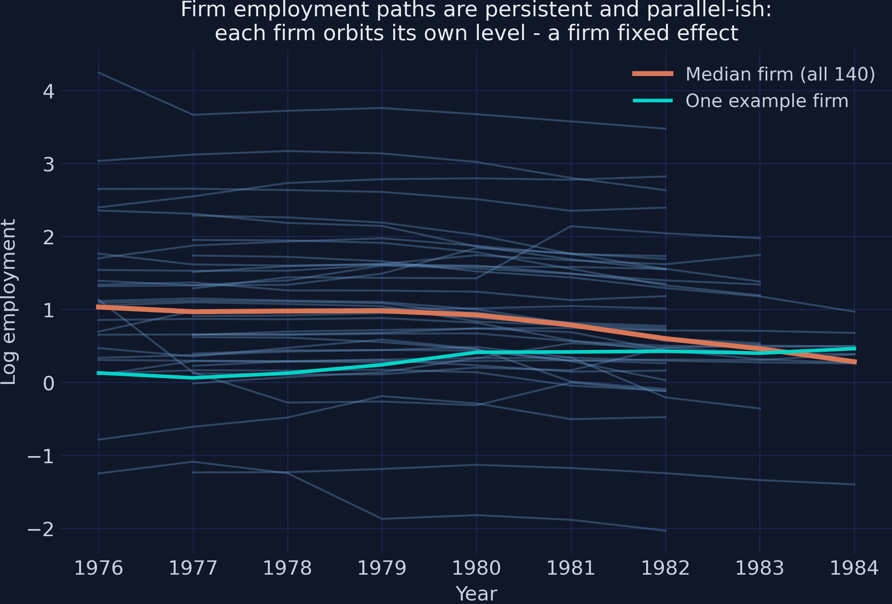
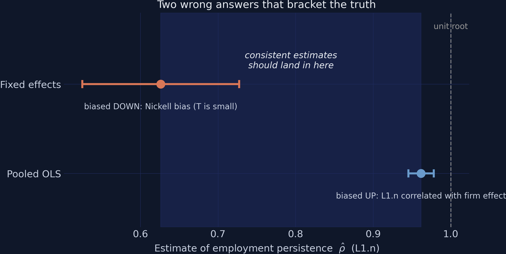
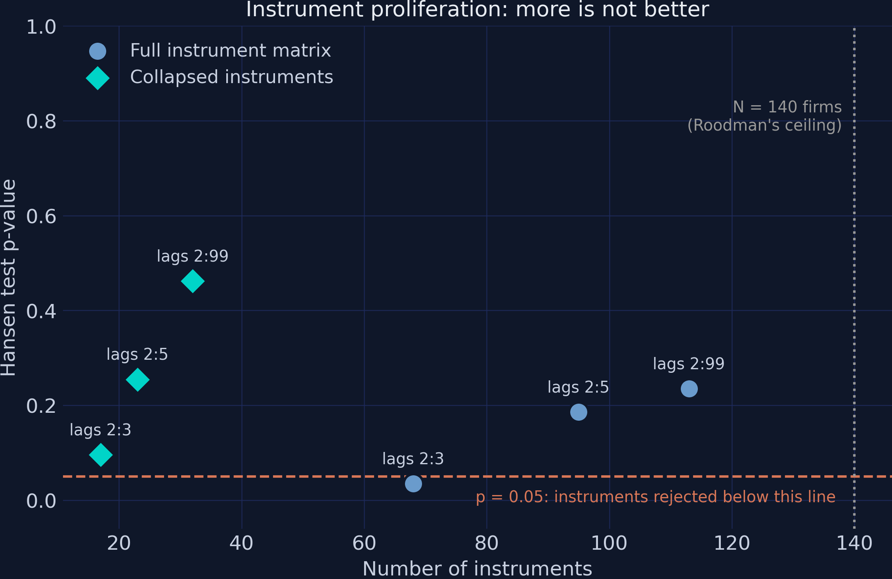
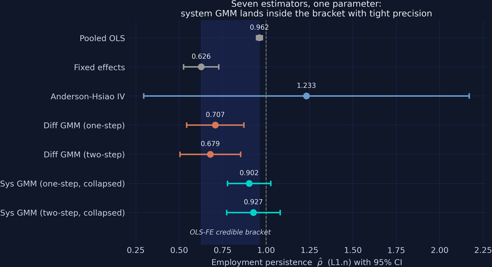

# The Tension {.divider background-color="#d97757"}

[Act I]{.act}

## Same regression, same data — and shock half-lives of 1.5, 9, or 18 years

How much of this year's employment shock is still visible *next* year?

. . .

The answer is one number: $\rho$, the coefficient on lagged employment. The estimators in this deck — run on the **same 140-firm UK panel** — will claim $\hat\rho = 0.626$, $0.927$, and $0.962$.

. . .

*One of them is defensible. None of them announces which.*

::: {.notes}
The hook: ρ is the echo strength of the labor market. At ρ = 0.6 a shock fades within a couple of years; at ρ = 0.95 a 1980 shock is still audible in 1988. The implied half-lives across our estimates run from 1.5 years (fixed effects) through 9 years (system GMM) to 18 years (pooled OLS). A policymaker evaluating a temporary employment subsidy gets completely different cost-benefit horizons depending on which estimate they believe — so the estimator choice IS the economics here.
:::

## Firms orbit their own levels — a fixed effect and persistence at once



::: {.notes}
The Arellano-Bond (1991) panel: 140 UK manufacturing firms, 1,031 firm-years, unbalanced (7–9 years per firm). Two features are visible simultaneously: the lines rarely cross — each firm orbits its own level, the signature of a large firm effect α_i — and each line is smooth, the signature of high persistence. The variance decomposition makes it precise: between-firm SD of log employment is 1.339, within-firm SD only 0.195 — a factor of seven. An estimator that mishandles α_i will be wrong by a lot, not a little.
:::

## The model commits the one sin ordinary panel methods cannot forgive

$$n_{it} = \rho\, n_{i,t-1} + \beta_1 w_{it} + \beta_2 w_{i,t-1} + \beta_3 k_{it} + \beta_4 k_{i,t-1} + \alpha_i + \delta_t + \varepsilon_{it}$$

[A *lagged dependent variable* sits on the right while the firm effect $\alpha_i$ sits in the error. By construction $n_{i,t-1}$ depends on $\alpha_i$ — so the regressor is correlated with the error, no matter how many controls we add.]{.comment}

::: {.notes}
Blundell and Bond's (1998) dynamic labor-demand equation on this very dataset: log employment n on its own lag, current and lagged log real wage w and log capital k, a firm effect α_i, year effects δ_t. A firm with a high permanent level had high employment last year too — so the endogeneity is mechanical, not an omitted-variable accident. Important framing: ρ is a descriptive/structural persistence parameter, not a causal effect — no treatment, no ATE/ATT. Identification will rest on sequential exogeneity and no serial correlation in ε, partially testable via AR(2) and Hansen.
:::

## Where we're going

::: {.incremental}
- Run pooled OLS and fixed effects — two *known-direction* failures that bracket the truth
- Anderson-Hsiao IV: consistent in theory, useless in practice
- Difference GMM: passes every printed test, hugs the wrong bound
- System GMM: the defensible headline, $\hat\rho = 0.927$
- The diagnostics decoder — AR(1), AR(2), Hansen, and why p $\approx$ 1 is a red flag
- Instrument proliferation, collapsing, and a digit-for-digit replication check
:::

::: {.notes}
The arc is an estimator ladder: each rung fails informatively and motivates the next. The meta-lesson to plant now: the winner will not be identified by any single printed statistic — only by the workflow (bracket, weak-instrument logic, proliferation experiment, replication).
:::

# The Investigation {.divider background-color="#6a9bcc"}

[Act II]{.act}

## Pooled OLS and fixed effects fail in opposite, known directions

:::: {.columns}
::: {.column width="50%"}
### Pooled OLS — biased UP
- Ignores $\alpha_i$: it stays in the error
- $n_{i,t-1}$ is *positively* correlated with $\alpha_i$
- The lag gets credit for the firm effect's work
- $\hat\rho = 0.962$ (SE 0.008) — near a unit root
:::
::: {.column width="50%"}
### Fixed effects — biased DOWN
- Demeaning removes $\alpha_i$ exactly…
- …but the firm mean contains *future* shocks
- Nickell bias, order $1/T$ — and $T$ is 7–9 here
- $\hat\rho = 0.626$ (SE 0.052)
:::
::::

::: {.notes}
Same regression run twice, changing only the treatment of α_i. OLS: persistently large firms look like firms with enormous persistence — orbit differences masquerade as dynamics. FE: the within transformation subtracts a firm average computed over the whole window, so it contains shocks dated after t; the demeaned lag and demeaned error share content, creating a mechanical negative correlation (Nickell 1981). Adding firms does not help — only longer panels do. The gap is 0.336 — half-life of 18 years vs 1.5 years — and the two clustered CIs do not even overlap.
:::

## Two wrong answers bracket the truth: any consistent estimate must land in [0.626, 0.962]



::: {.notes}
Because both bias directions are known from theory, the two wrong answers become a measuring instrument. Bond's rule: a candidate below the band has a Nickell-like problem; above it (or beyond the unit-root line), an OLS-like problem; and — the subtle case coming in two slides — an estimate just barely inside the band, hugging an edge, is probably being dragged there by a fixable weakness. This figure is the yardstick for the rest of the talk.
:::

## Anderson-Hsiao IV is consistent — and useless: 1.233 with a CI 1.87 wide

First-difference away $\alpha_i$, then instrument $\Delta n_{i,t-1}$ with the level $n_{i,t-2}$:

| | Estimate | SE | 95% CI |
|---|---:|---:|:---:|
| $\hat\rho$ (Anderson-Hsiao 2SLS) | [1.233]{.key} | 0.478 | [0.296, 2.170] |

[The CI contains the whole bracket, the unit root, and explosive dynamics — all at once.]{.comment}

::: {.notes}
Anderson and Hsiao (1981): differencing kills α_i without touching future shocks, but Δn_{i,t-1} and Δε_it share ε_{i,t-1}, so we instrument with n_{i,t-2} — valid under sequential exogeneity. The point estimate is above the unit root, which nobody believes; the right reading is that ONE instrument extracts far too little information from a highly persistent series. The courtroom analogy: a single admissible witness whose testimony is valid but cannot convict. The fix is not a better witness but more of them — if n_{i,t-2} is valid, so is every deeper lag.
:::

## Arellano-Bond: every lag dated $t-2$ or earlier is a valid instrument

$$E\big[\,n_{i,t-s}\,\Delta\varepsilon_{it}\,\big] = 0 \qquad \text{for all } s \ge 2$$

[Employment two or more years ago carries no information about this year's *change* in shocks — and the same holds for lagged $w$ and $k$. Dozens of moment conditions, combined optimally by GMM.]{.comment}

::: {.notes}
This is difference GMM (Arellano-Bond 1991): generalize Anderson-Hsiao from one moment condition to a whole family, with the GMM weighting matrix listening more carefully to the informative ones. With T = 9 the count reaches 91 instruments. Two-step GMM re-weights using first-step residuals — more efficient, but its naive SEs are badly downward-biased, so we quote the Windmeijer (2005) correction throughout.
:::

## Two command strings run the whole GMM ladder in pydynpd

``` {.python code-line-numbers="1-4|6-9"}
# difference GMM: lagged LEVELS instrument the differenced equation
diff = regression.abond(
    "n L(1:1).n L(0:1).w L(0:1).k | gmm(n, 2:99) gmm(w, 2:99) "
    "gmm(k, 2:99) | timedumm nolevel", df, ["id", "year"])

# system GMM: drop `nolevel` (add the levels equation), collapse instruments
sys = regression.abond(
    "n L(1:1).n L(0:1).w L(0:1).k | gmm(n, 2:99) gmm(w, 2:99) "
    "gmm(k, 2:99) | timedumm collapse", df, ["id", "year"])
```

::: {.notes}
pydynpd (Wu, Hua and Xu 2023) takes a Stata-style command string deliberately close to xtabond2 — its published output is validated against xtabond2, which the replication check in Act III exploits. The spec: n on its first lag plus current and lagged w and k; gmm(·, 2:99) declares all lags from t−2 back as GMM-style instruments; timedumm adds year dummies; nolevel = differenced equation only (difference GMM); collapse combines each lag depth into one instrument column. The OLS/FE/IV benchmarks run in pyfixest. Full script in the post.
:::

## Difference GMM passes every printed test — and still gives a suspect 0.679

| | Two-step diff GMM |
|---|---:|
| $\hat\rho$ (L1.n) | [0.679]{.key} |
| SE (Windmeijer) | 0.089 |
| Instruments | 91 |
| AR(2) p | 0.866 |
| Hansen p | 0.211 |

[0.679 sits 0.053 above the FE floor of 0.626 — within one SE of the biased bound.]{.comment}

::: {.notes}
Every diagnostic passes: AR(1) rejects as it mechanically must, AR(2) is nowhere near rejecting, Hansen is comfortable. Yet Bond's informal diagnostic fails loudly: the estimate sits in the bottom sixth of the bracket, hugging the FE bound. The mechanism: when the true series is highly persistent, the level two years ago barely predicts this year's CHANGE — a near-random-walk changes unpredictably — so all 91 instruments are individually weak, and weak-instrument bias in this design points toward the within estimator. Blundell and Bond demonstrated precisely this failure on precisely this dataset. An estimator that passes every formal test while giving a suspect answer is the single most valuable lesson of the tutorial.
:::

## Blundell-Bond flips the logic: lagged differences instrument the levels

$$E\big[\,\Delta n_{i,t-1}\,(\alpha_i + \varepsilon_{it})\,\big] = 0$$

[Even for a persistent series, last year's *change* is informative about this year's *level*. The price is one new assumption — **mean stationarity**: firms' initial deviations from their steady states must be unrelated to $\alpha_i$.]{.comment}

::: {.notes}
System GMM stacks the differenced equation (keeping its Arellano-Bond instruments) with the original levels equation, instrumented by lagged differences. The lake analogy: learning a lake's depth from ripples alone (differences) vs also using waterline marks on the shore (levels) — when the lake is calm, the ripples carry almost no information. Mean stationarity is untestable directly, but the Hansen test gets indirect bite because the levels moments are overidentifying. We also collapse instruments to 32 — safely below Roodman's rule that instruments should not outnumber the 140 firms.
:::

## Ninety-three percent of an employment shock survives into next year {background-color="#141413"}

[0.927]{.bignum}

[system GMM, two-step, 32 collapsed instruments (SE 0.079) — inside the bracket, upper half]{.bignum-label}

::: {.notes}
The headline: ρ̂ = 0.927, a shock half-life of roughly nine years — 0.927^5 ≈ 0.68 of a shock still present after five years — versus the 1.5 years fixed effects would have claimed. Firm employment behaves almost like a random walk around firm-specific levels: hiring, firing, and training frictions are large. One honest caveat to say out loud: the 95% CI [0.773, 1.081] includes 1.0, so a unit root cannot be rejected — the defensible claim is the point estimate and its lower bound, not "employment is stationary."
:::

## The headline's diagnostics are textbook-clean

| | Two-step system GMM (collapsed) |
|---|---:|
| $\hat\rho$ (L1.n) | [0.927]{.key} |
| SE (Windmeijer) | 0.079 |
| Instruments | 32 (vs 140 firms) |
| AR(1) p | 0.000 — *rejects, as required* |
| AR(2) p | 0.994 — *clean* |
| Hansen p | 0.462 — *comfortable middle* |

::: {.notes}
Wage and capital elasticities also sharpen: short-run wage elasticity −0.816 (SE 0.276), capital 0.589 (SE 0.172). Resist reporting the implied long-run wage elasticity (β1+β2)/(1−ρ) ≈ −2.5 without a warning — its denominator 1−ρ ≈ 0.073 makes it explosively fragile. But why is AR(1) rejecting "as required"? And is a bigger Hansen p always better? That's Act III — two of these three tests are routinely read backwards.
:::

# Trust, But Verify {.divider background-color="#00d4c8"}

[Act III]{.act}

## The diagnostics decoder: two of the three tests are read backwards

| Test | Correct reading | Headline value |
|---|---|---:|
| AR(1) in differences | **Must reject** — rejection is mechanical good news | p = 0.000 ✓ |
| AR(2) in differences | **Must not reject** — this validates the $t-2$ instruments | [p = 0.994]{.key} |
| Hansen J | **Two-tailed in spirit** — p < 0.05 is invalid; p near 1 is an overwhelmed test | p = 0.462 ✓ |

::: {.notes}
AR(1): differencing makes adjacent errors overlap — Δε_it and Δε_{i,t−1} share ε_{i,t−1}, like adjacent dominoes sharing an edge — so consecutive differenced errors are negatively correlated WHEN THE MODEL IS RIGHT. A beginner who sees p = 0.000 and concludes failure has it exactly backwards. AR(2) is the test that matters: if ε were serially correlated, the t−2 instruments would be contaminated — the witnesses tipped off. Hansen: reading it one-tailed is the classic trap; Roodman warns that values approaching 1.0 signal an overwhelmed test, not valid instruments. Our 0.462 with 32 instruments is comfortable — the same 0.462 with 130 instruments would be a warning.
:::

## The Hansen p-value responds to the instrument count, not just validity

| Lag window | Collapsed | Instruments | $\hat\rho$ | Hansen p |
|---|---|---:|---:|---:|
| 2:3 | no | 68 | 0.956 | [0.035]{.key} |
| 2:3 | yes | 17 | 0.921 | 0.096 |
| 2:5 | no | 95 | 0.935 | 0.186 |
| 2:99 | no | 113 | 0.930 | 0.235 |
| 2:99 | yes | 32 | 0.927 | 0.462 |

[Same model six times; only the plumbing changes. Uncollapsed 2:3 is *rejected* (p = 0.035) while its collapsed twin *passes* — driven purely by instrument count.]{.comment}

::: {.notes}
The experiment: re-estimate the identical system-GMM model varying only the lag window and collapsing. Reassuring: ρ̂ barely moves — all six cells in [0.921, 0.956]. Unsettling: the test we would use to DEFEND it is not stable. Reading the uncollapsed rows, the count climbs 68 → 95 → 113 (approaching the 140-firm ceiling) and Hansen drifts 0.035 → 0.186 → 0.235 mechanically. The endpoint of that trajectory is the notorious "Hansen p = 1.000" red flag. (The full grid with SEs and AR(2) is in the post; the 2:5 collapsed row, 23 instruments, p = 0.255, is omitted here for space.)
:::

## More instruments is not better — proliferation disarms the test that guards you



::: {.notes}
The teal diamonds buy nearly identical point estimates with a quarter of the instruments, at the honest price of larger standard errors — 0.0785 collapsed vs 0.0274 uncollapsed at the 2:99 window. That uncollapsed SE looks like a precision triumph, but it is too-good-to-be-true precision: 113 instruments fitted to 140 firms are partly fitting noise, and the same overfitting that flatters the SE disarms the Hansen test. The headline deliberately takes the larger, more honest SE.
:::

## The toolchain replicates the published benchmark digit for digit

| | Published vignette | Our run |
|---|---:|---:|
| L1.n | 0.2710675 | [0.2710675]{.key} |
| Hansen $\chi^2$ | 32.666 | 32.666 |
| Instruments | 42 | 42 |

[Exact match under a hard assertion — the NumPy-2 compatibility shim perturbs nothing.]{.comment}

::: {.notes}
Before trusting novel output from a patched package, replicate its published benchmark: the pydynpd README's original Arellano-Bond two-lag specification on this same data, itself validated against Stata's xtabond2. The much lower 0.271 is NOT a contradiction of 0.927 — it is difference GMM (same weak-instrument drag as before) on a different, two-lag specification with a restricted instrument window. "The" persistence estimate is always joint with the specification and estimator. Also note AR(1) does not reject here (p = 0.198): with two lags soaking up the dynamics, even the mechanical correlation is muted — diagnostics must be read against the model, not a universal rulebook.
:::

## Seven estimators, one parameter — only the workflow identifies the winner



::: {.notes}
The tutorial in one image. Nothing on any single printed line of output separates the winner from the losers — difference GMM's table looks as healthy as system GMM's. Only the bracket logic, the weak-instrument reasoning, the proliferation experiment, and the replication check identify 0.927 as the defensible answer. One-step vs two-step movements (0.708→0.679; 0.903→0.927) are small — the weighting scheme refines rather than drives the answer.
:::

## "Your own CI includes the unit root — why believe 0.927?"

[Objection.]{.objection} The headline CI [0.773, 1.081] contains $\rho = 1$, mean stationarity is untestable, and one common $\rho$ is imposed on all 140 firms.

. . .

[Response.]{.rebuttal} All true — which is why the claim is the *point estimate and its lower bound*, never "employment is stationary." The estimate survives the bracket check, a 6-cell proliferation grid (range 0.921–0.956), clean AR(2)/Hansen, and an exact replication — and the mean-stationarity price is stated out loud, not hidden.

::: {.notes}
Steelman the pushback honestly: this is 1970s–80s UK manufacturing, a methods showcase rather than a current estimate; the long-run elasticities are mechanically fragile (1−ρ ≈ 0.073); GMM tests have limited power with N = 140. The defense is not that the diagnostics are perfect, but that every weakness is bounded and disclosed — which is exactly the standard the deck argues a referee should apply to ANY dynamic-panel coefficient.
:::

## The dynamic-panel checklist you take home

::: {.incremental}
- **Run OLS and FE first** — record the bracket; they are the measuring stick
- **A difference-GMM estimate hugging the FE bound is a weak-instrument symptom** — passing Hansen and AR(2) does not clear it
- **Prefer system GMM when persistence is high** — and name the mean-stationarity assumption you are buying
- **AR(1) must reject; AR(2) must not; read Hansen two-tailed**
- **Collapse instruments and report the count** relative to the number of groups
- **Replicate a published benchmark** before trusting novel numbers
:::

::: {.notes}
The post's seven-point checklist, compressed. Concrete payoff for a practitioner: with ρ ≈ 0.93, a one-year employment subsidy is still two-thirds visible five years later — dramatically changing any cost-benefit horizon relative to the FE story, under which the boost loses three-quarters of its effect within three years. An analyst who naively ran fixed effects on a short firm panel would be wrong by a factor of six in half-life terms.
:::

# No single p-value separates 0.927 from 0.679 — the bracket-plus-diagnostics workflow does. {.divider background-color="#141413"}
