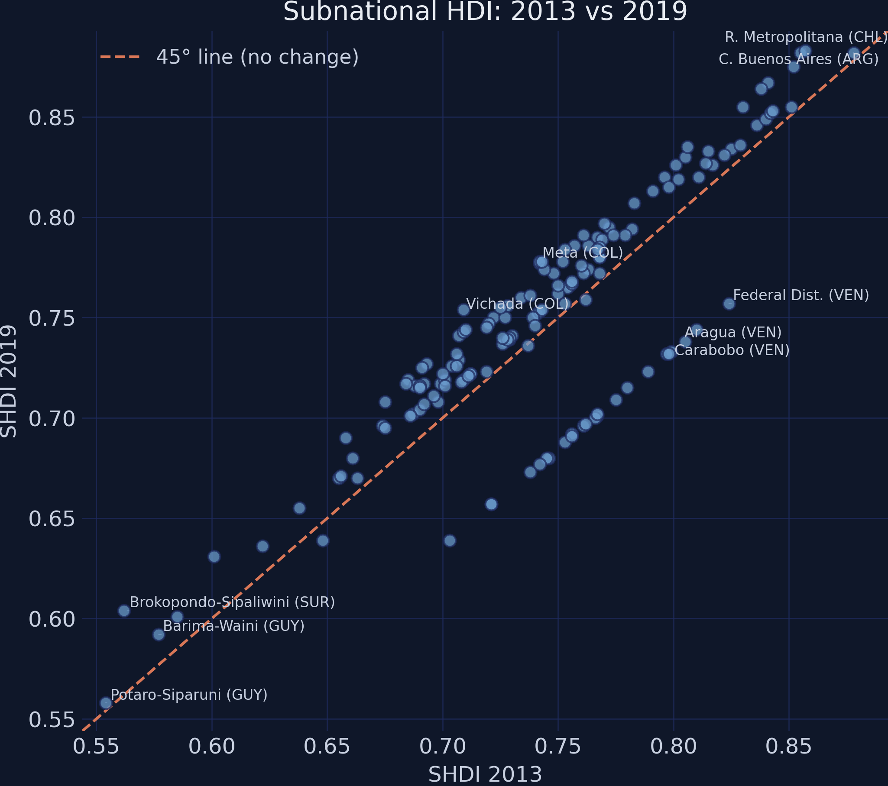
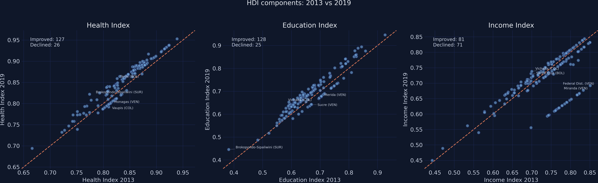
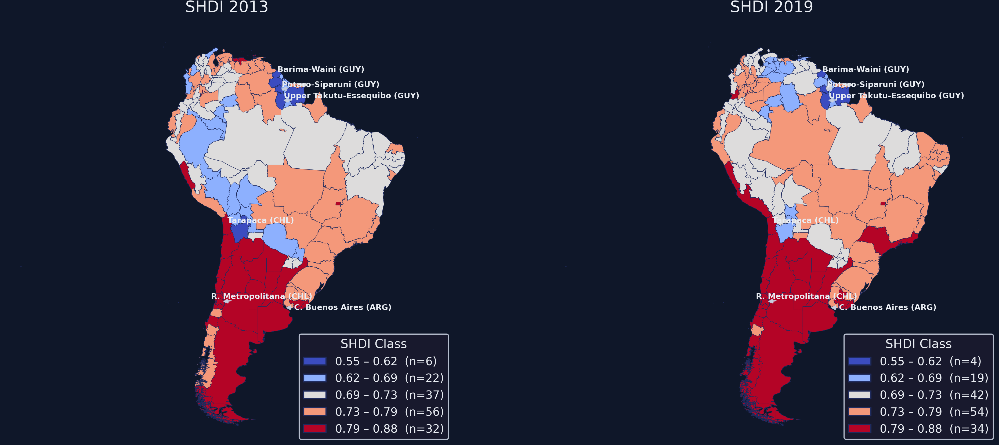
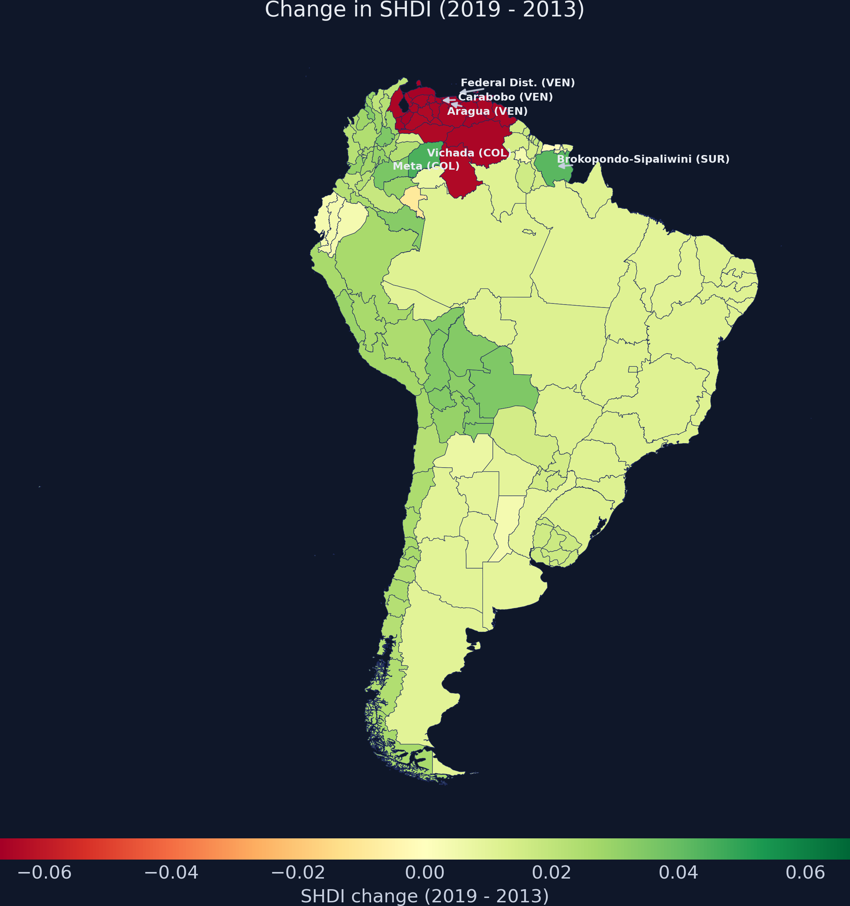
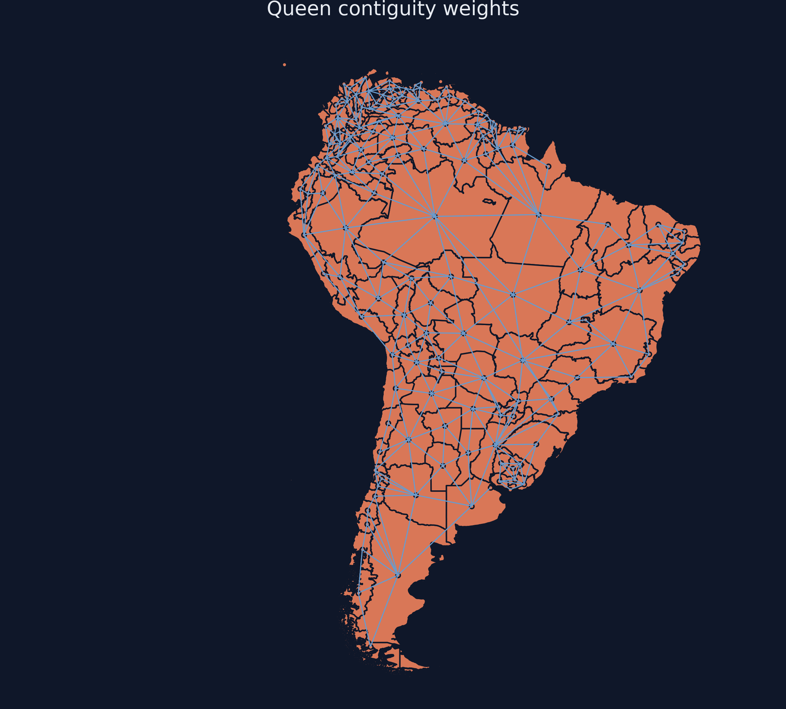
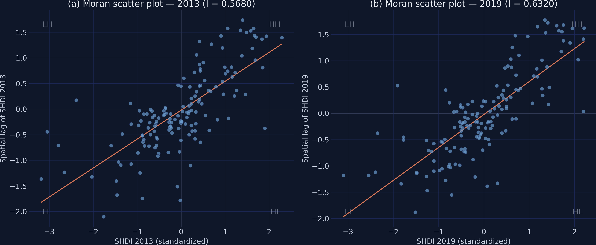
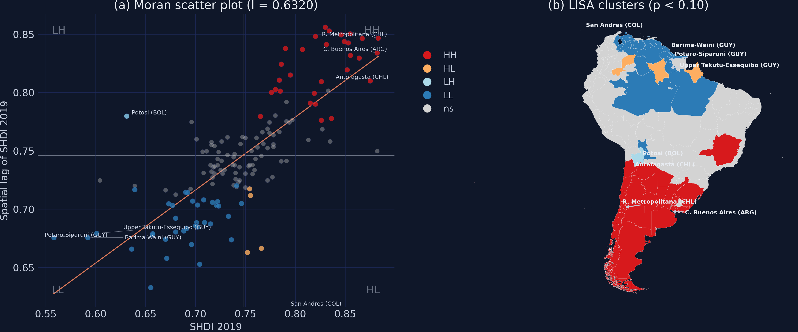
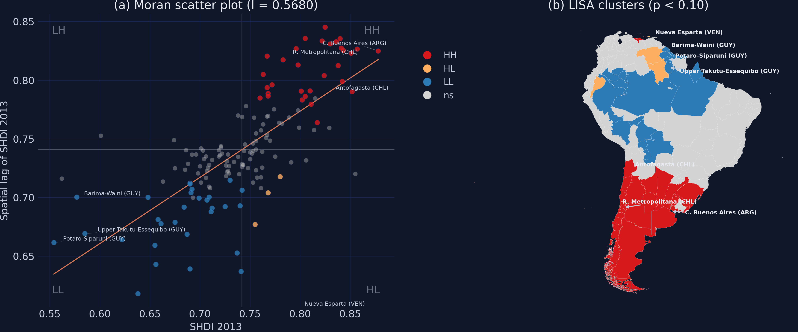
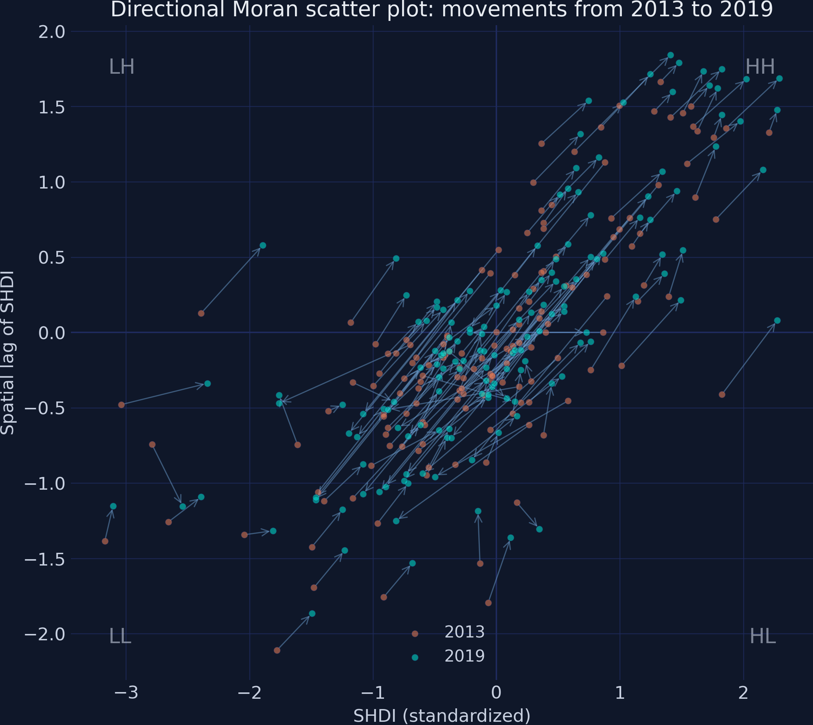
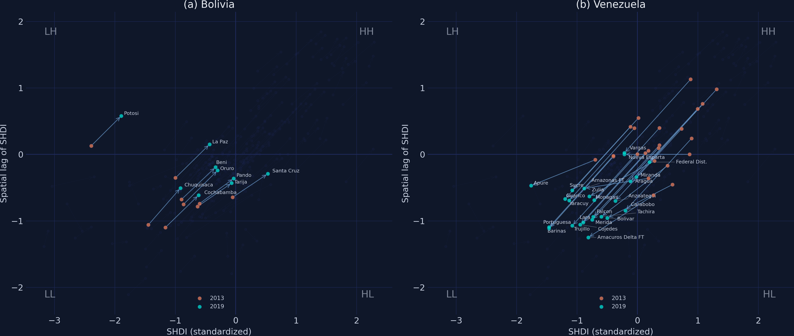

---
authors:
  - admin
categories:
  - Python
  - Tutorial
  - Exploratory Data Analysis
  - Spatial Analysis
  - Cross-sectional Data
  - Spatial Autocorrelation (ESDA)
draft: false
featured: false
date: "2026-03-22T00:00:00Z"
external_link: ""
image:
  caption: ""
  focal_point: Smart
  placement: 3
links:
- icon: google-colab
  icon_pack: ai
  name: "Google Colab"
  url: https://colab.research.google.com/github/cmg777/starter-academic-v501/blob/master/content/post/python_esda2/notebook.ipynb
- icon: code
  icon_pack: fas
  name: "Python script"
  url: script.py
slides:
summary: An introduction to exploratory spatial data analysis using PySAL, covering choropleth maps, spatial weights, Moran's I, LISA clusters, space-time dynamics, and a Venezuela-Bolivia comparative analysis for 153 South American regions
tags:
- python
- spatial
- regional
- exploratory data analysis
- spatial spillovers
title: "Exploratory Spatial Data Analysis: Spatial Clusters and Dynamics of Human Development in South America"
url_code: ""
url_pdf: ""
url_slides: ""
url_video: ""
toc: true
diagram: true
---

## 1. Overview

When we look at a map of human development across South America, a pattern immediately stands out: prosperous regions tend to cluster together, and so do lagging regions. But is this clustering statistically significant, or could it arise by chance? And how have these spatial clusters evolved over time?

**Exploratory Spatial Data Analysis (ESDA)** provides the tools to answer these questions. ESDA is a set of techniques for visualizing spatial distributions, identifying patterns of spatial clustering, and detecting spatial outliers. Unlike standard exploratory data analysis, which treats observations as independent, ESDA explicitly accounts for the geographic location of each observation and the relationships between neighbors.

This tutorial uses the [Subnational Human Development Index](https://globaldatalab.org/shdi/) (SHDI) from [Smits and Permanyer (2019)](https://doi.org/10.1038/sdata.2019.38) for **153 sub-national regions across 12 South American countries** in 2013 and 2019 --- the same dataset from the [Pooled PCA tutorial](/post/python_pca2/). We progress from simple scatter plots and choropleth maps to formal tests of spatial dependence (Moran's I), local cluster identification (LISA maps), and space-time dynamics. By the end, you will be able to answer: **do nearby regions in South America share similar development levels, and how have these spatial clusters evolved between 2013 and 2019?**

**Learning objectives:**

- Understand the concept of spatial autocorrelation and why it matters for regional analysis
- Create choropleth maps and scatter plots to visualize spatial distributions
- Build and interpret a spatial weights matrix using Queen contiguity
- Compute and interpret global Moran's I for spatial dependence testing
- Identify local spatial clusters (HH, LL) and outliers (HL, LH) using LISA statistics
- Explore space-time dynamics of spatial clusters using directional Moran scatter plots
- Compare country-level development trajectories within the spatial framework

## 2. The ESDA pipeline

The analysis follows a natural progression from visualization to formal testing. Each step builds on the previous one, moving from "what does the data look like?" to "is the spatial pattern statistically significant?" to "where exactly are the clusters?"


Steps 1--2 are purely visual --- they build intuition about where high and low values are concentrated. Step 3 formalizes the notion of "neighbors" through a spatial weights matrix. Steps 4--5 use that matrix to compute statistics that quantify spatial clustering, first globally (one number for the whole map) and then locally (one number per region). Step 6 connects the spatial and temporal dimensions by tracking how regions move through the Moran scatter plot between periods.

## 3. Setup and imports

The analysis uses [GeoPandas](https://geopandas.org/) for spatial data handling, [PySAL](https://pysal.org/) for spatial statistics, and [splot](https://splot.readthedocs.io/) for specialized spatial visualizations.

```python
import numpy as np
import pandas as pd
import geopandas as gpd
import matplotlib.pyplot as plt
from libpysal.weights import Queen
from libpysal.weights import lag_spatial
from esda.moran import Moran, Moran_Local
from splot.esda import moran_scatterplot, lisa_cluster
from splot.libpysal import plot_spatial_weights
from adjustText import adjust_text
import mapclassify

# Reproducibility
RANDOM_SEED = 42

# Site color palette
STEEL_BLUE = "#6a9bcc"
WARM_ORANGE = "#d97757"
NEAR_BLACK = "#141413"
TEAL = "#00d4c8"
```

<details>
<summary>Dark theme figure styling (click to expand)</summary>

```python
# Dark theme palette (consistent with site navbar/dark sections)
DARK_NAVY = "#0f1729"
GRID_LINE = "#1f2b5e"
LIGHT_TEXT = "#c8d0e0"
WHITE_TEXT = "#e8ecf2"

# Plot defaults — minimal, spine-free, dark background
plt.rcParams.update({
    "figure.facecolor": DARK_NAVY,
    "axes.facecolor": DARK_NAVY,
    "axes.edgecolor": DARK_NAVY,
    "axes.linewidth": 0,
    "axes.labelcolor": LIGHT_TEXT,
    "axes.titlecolor": WHITE_TEXT,
    "axes.spines.top": False,
    "axes.spines.right": False,
    "axes.spines.left": False,
    "axes.spines.bottom": False,
    "axes.grid": True,
    "grid.color": GRID_LINE,
    "grid.linewidth": 0.6,
    "grid.alpha": 0.8,
    "xtick.color": LIGHT_TEXT,
    "ytick.color": LIGHT_TEXT,
    "xtick.major.size": 0,
    "ytick.major.size": 0,
    "text.color": WHITE_TEXT,
    "font.size": 12,
    "legend.frameon": False,
    "legend.fontsize": 11,
    "legend.labelcolor": LIGHT_TEXT,
    "figure.edgecolor": DARK_NAVY,
    "savefig.facecolor": DARK_NAVY,
    "savefig.edgecolor": DARK_NAVY,
})
```

</details>

## 4. Data loading and exploration

The dataset is a GeoJSON file containing polygon geometries and development indicators for 153 sub-national regions across South America. It is a spatial version of the data from the [Pooled PCA tutorial](/post/python_pca2/), sourced from the [Global Data Lab](https://globaldatalab.org/shdi/) ([Smits and Permanyer, 2019](https://doi.org/10.1038/sdata.2019.38)). Each region has the Subnational Human Development Index (SHDI) and its three component indices --- Health, Education, and Income --- for 2013 and 2019.

```python
DATA_URL = "https://raw.githubusercontent.com/cmg777/starter-academic-v501/master/content/post/python_esda2/data.geojson"
gdf = gpd.read_file(DATA_URL)
print(f"Loaded: {gdf.shape[0]} rows, {gdf.shape[1]} columns")
print(f"Countries: {gdf['country'].nunique()}")
print(f"CRS: {gdf.crs}")
```

```text
Loaded: 153 rows, 25 columns
Countries: 12
CRS: EPSG:4326
```

Before computing change columns, we prepare the data for labeling. Some region names in the raw data are very long (e.g., "Chubut, Neuquen, Rio Negro, Santa Cruz, Tierra del Fuego"), so we simplify them. We also create a `region_country` column that appends the ISO country code to each region name --- this makes labels immediately informative when regions from different countries appear on the same plot.

```python
# Country name → ISO 3166-1 alpha-3 code
COUNTRY_ISO = {
    "Argentina": "ARG", "Bolivia": "BOL", "Brazil": "BRA",
    "Chili": "CHL", "Colombia": "COL", "Ecuador": "ECU",
    "Guyana": "GUY", "Paraguay": "PRY", "Peru": "PER",
    "Suriname": "SUR", "Uruguay": "URY", "Venezuela": "VEN",
}
gdf["country_iso"] = gdf["country"].map(COUNTRY_ISO)

# Simplify long region names
RENAME = {
    "Catamarca, La Rioja, San Juan": "Catamarca-La Rioja",
    "Corrientes, Entre Rios, Misiones": "Corrientes-Misiones",
    "Chubut, Neuquen, Rio Negro, Santa Cruz, Tierra del Fuego": "Patagonia",
    "La Pampa, San Luis, Mendoza": "La Pampa-Mendoza",
    "Santiago del Estero, Tucuman": "Tucuman-Sgo Estero",
    "Tarapaca (incl Arica and Parinacota)": "Tarapaca",
    "Valparaiso (former Aconcagua)": "Valparaiso",
    "Los Lagos (incl Los Rios)": "Los Lagos",
    "Magallanes and La Antartica Chilena": "Magallanes",
    "Antioquia (incl Medellin)": "Antioquia",
    "Atlantico (incl Barranquilla)": "Atlantico",
    "Bolivar (Sur and Norte)": "Bolivar",
    "Essequibo Islands-West Demerara": "Essequibo-W Demerara",
    "East Berbice-Corentyne": "E Berbice-Corentyne",
    "Upper Takutu-Upper Essequibo": "Upper Takutu-Essequibo",
    "Upper Demerara-Berbice": "Upper Demerara",
    "Cuyuni-Mazaruni-Upper Essequibo": "Cuyuni-Mazaruni",
    "Region Metropolitana": "R. Metropolitana",
    "Federal District": "Federal Dist.",
    "City of Buenos Aires": "C. Buenos Aires",
    "Brokopondo and Sipaliwini": "Brokopondo-Sipaliwini",
    "Montevideo and Metropolitan area": "Montevideo",
}
gdf["region"] = gdf["region"].replace(RENAME)

# Create region_country label column
gdf["region_country"] = gdf["region"] + " (" + gdf["country_iso"] + ")"
```

We then compute the change in SHDI and its components between the two periods.

```python
gdf["shdi_change"] = gdf["shdi2019"] - gdf["shdi2013"]
gdf["health_change"] = gdf["healthindex2019"] - gdf["healthindex2013"]
gdf["educ_change"] = gdf["edindex2019"] - gdf["edindex2013"]
gdf["income_change"] = gdf["incindex2019"] - gdf["incindex2013"]

print(gdf[["shdi2013", "shdi2019", "shdi_change"]].describe().round(4).to_string())
```

```text
       shdi2013  shdi2019  shdi_change
count  153.0000  153.0000     153.0000
mean     0.7424    0.7477       0.0053
std      0.0594    0.0613       0.0319
min      0.5540    0.5580      -0.0670
25%      0.7070    0.7150       0.0090
50%      0.7430    0.7440       0.0150
75%      0.7740    0.7840       0.0250
max      0.8780    0.8830       0.0450
```

The dataset covers 153 regions across 12 South American countries. Mean SHDI increased modestly from 0.7424 in 2013 to 0.7477 in 2019 (+0.0053), but the change varied widely: from a maximum decline of -0.0670 to a maximum improvement of +0.0450. The standard deviation of SHDI also increased slightly (0.0594 to 0.0613), hinting that regional disparities may have widened.

## 5. Exploratory scatter plots

### 5.1 HDI scatter: 2013 vs 2019

A scatter plot of SHDI in 2013 against SHDI in 2019 provides a quick overview of temporal dynamics. Points above the 45-degree line represent regions that improved; points below represent regions that declined.

```python
fig, ax = plt.subplots(figsize=(8, 7))

ax.scatter(gdf["shdi2013"], gdf["shdi2019"],
           color=STEEL_BLUE, edgecolors=DARK_NAVY, s=45, alpha=0.75, zorder=3)

lims = [min(gdf["shdi2013"].min(), gdf["shdi2019"].min()) - 0.01,
        max(gdf["shdi2013"].max(), gdf["shdi2019"].max()) + 0.01]
ax.plot(lims, lims, color=WARM_ORANGE, linewidth=1.5, linestyle="--",
        label="45° line (no change)", zorder=2)

ax.set_xlabel("SHDI 2013")
ax.set_ylabel("SHDI 2019")
ax.set_title("Subnational HDI: 2013 vs 2019")
ax.legend()

# Label extreme regions (biggest gains, biggest losses, highest, lowest)
residual = gdf["shdi2019"] - gdf["shdi2013"]
extremes = set()
extremes.update(residual.nlargest(3).index.tolist())
extremes.update(residual.nsmallest(3).index.tolist())
extremes.update(gdf["shdi2019"].nlargest(2).index.tolist())
extremes.update(gdf["shdi2019"].nsmallest(2).index.tolist())

texts = []
for i in extremes:
    texts.append(ax.text(gdf.loc[i, "shdi2013"], gdf.loc[i, "shdi2019"],
                         gdf.loc[i, "region_country"], fontsize=8, color=LIGHT_TEXT))
adjust_text(texts, ax=ax, arrowprops=dict(arrowstyle="-", color=LIGHT_TEXT,
            alpha=0.5, lw=0.5))

plt.savefig("esda2_scatter_hdi.png", dpi=300, bbox_inches="tight")
plt.show()
```



Of 153 regions, **126 improved** their SHDI between 2013 and 2019, while **27 declined**. The labels identify key cases: at the top, **C. Buenos Aires (ARG)** and **R. Metropolitana (CHL)** lead with SHDI above 0.88. At the bottom, **Potaro-Siparuni (GUY)** and **Barima-Waini (GUY)** remain the least developed. The biggest decliners --- **Federal Dist. (VEN)**, **Carabobo (VEN)**, and **Aragua (VEN)** --- are all Venezuelan states, falling well below the 45-degree line. The biggest improvers --- **Meta (COL)**, **Vichada (COL)**, and **Brokopondo-Sipaliwini (SUR)** --- rose above the line, with gains up to +0.045 points.

### 5.2 Component scatter plots

The SHDI is a composite of three sub-indices: Health, Education, and Income. Breaking down the change by component reveals which dimensions drove the aggregate patterns.

```python
fig, axes = plt.subplots(1, 3, figsize=(18, 5.5))

components = [
    ("healthindex2013", "healthindex2019", "Health Index"),
    ("edindex2013", "edindex2019", "Education Index"),
    ("incindex2013", "incindex2019", "Income Index"),
]

for ax, (col13, col19, label) in zip(axes, components):
    ax.scatter(gdf[col13], gdf[col19],
               color=STEEL_BLUE, edgecolors=DARK_NAVY, s=40, alpha=0.7, zorder=3)
    lims = [min(gdf[col13].min(), gdf[col19].min()) - 0.02,
            max(gdf[col13].max(), gdf[col19].max()) + 0.02]
    ax.plot(lims, lims, color=WARM_ORANGE, linewidth=1.5, linestyle="--", zorder=2)
    ax.set_xlabel(f"{label} 2013")
    ax.set_ylabel(f"{label} 2019")
    ax.set_title(label)

    # Label extreme regions per component
    comp_residual = gdf[col19] - gdf[col13]
    comp_extremes = set()
    comp_extremes.update(comp_residual.nlargest(2).index.tolist())
    comp_extremes.update(comp_residual.nsmallest(2).index.tolist())
    texts = []
    for i in comp_extremes:
        texts.append(ax.text(gdf.loc[i, col13], gdf.loc[i, col19],
                             gdf.loc[i, "region_country"], fontsize=7, color=LIGHT_TEXT))
    adjust_text(texts, ax=ax, arrowprops=dict(arrowstyle="-", color=LIGHT_TEXT,
                alpha=0.5, lw=0.5))

fig.suptitle("HDI components: 2013 vs 2019", fontsize=14, y=1.02)
plt.tight_layout()

plt.savefig("esda2_scatter_components.png", dpi=300, bbox_inches="tight")
plt.show()
```



The three components tell very different stories. Health and Education improved almost universally --- the vast majority of points lie above the 45-degree line. Income, however, tells a starkly different story: **71 of 153 regions (46.4%) experienced a decline** in their income index between 2013 and 2019. This mixed signal --- education and health gains partially offset by income losses --- explains why the aggregate SHDI improvement was so modest (+0.005 on average). The income panel also shows wider scatter, indicating greater heterogeneity in economic trajectories across the continent.

## 6. Choropleth maps

### 6.1 HDI levels across South America

The scatter plots tell us *what* changed, but not *where*. Choropleth maps add the geographic dimension by coloring each region according to its SHDI value. To make the two years directly comparable, we use [Fisher-Jenks natural breaks](https://pysal.org/mapclassify/generated/mapclassify.FisherJenks.html) computed from 2013 and held constant for 2019. Fisher-Jenks is a classification method that finds natural groupings in data by minimizing within-class variance --- it places break points where the data naturally separates into clusters. This way, a color change between maps reflects a genuine shift in development class, not a shifting classification scheme. The legend shows the number of regions in each class, making it easy to see how the distribution shifted.

```python
import mapclassify
from matplotlib.patches import Patch

# Fisher-Jenks breaks from 2013 (5 classes)
fj = mapclassify.FisherJenks(gdf["shdi2013"].values, k=5)
breaks = fj.bins.tolist()

# Extend upper break to cover 2019 max
max_val = max(gdf["shdi2013"].max(), gdf["shdi2019"].max())
if max_val > breaks[-1]:
    breaks[-1] = float(round(max_val + 0.001, 3))

# Apply same breaks to 2019
fj_2019 = mapclassify.UserDefined(gdf["shdi2019"].values, bins=breaks)

# Class transitions
classes_2013 = fj.yb
classes_2019 = fj_2019.yb
improved = (classes_2019 > classes_2013).sum()
stayed = (classes_2019 == classes_2013).sum()
declined = (classes_2019 < classes_2013).sum()

print(f"Breaks (from 2013): {[round(b, 3) for b in breaks]}")
print(f"  Improved (moved up):   {improved}")
print(f"  Stayed same:           {stayed}")
print(f"  Declined (moved down): {declined}")
```

```text
Breaks (from 2013): [0.622, 0.693, 0.734, 0.789, 0.884]
  Improved (moved up):   43
  Stayed same:           86
  Declined (moved down): 24
```

```python
# Class labels
class_labels = []
lower = round(gdf["shdi2013"].min(), 2)
for b in breaks:
    class_labels.append(f"{lower:.2f} – {b:.2f}")
    lower = round(b, 2)

fig, axes = plt.subplots(1, 2, figsize=(16, 12))
cmap = plt.cm.coolwarm
norm = plt.Normalize(vmin=0, vmax=len(breaks) - 1)

for ax, year_col, title, year_fj in [
    (axes[0], "shdi2013", "SHDI 2013", fj),
    (axes[1], "shdi2019", "SHDI 2019", fj_2019),
]:
    colors = [cmap(norm(c)) for c in year_fj.yb]
    gdf.plot(ax=ax, color=colors, edgecolor=GRID_LINE, linewidth=0.3)
    ax.set_title(title, fontsize=14, pad=10)
    ax.set_axis_off()

    # Legend with region counts per class
    counts = np.bincount(year_fj.yb, minlength=len(breaks))
    handles = [Patch(facecolor=cmap(norm(i)), edgecolor=GRID_LINE,
               label=f"{cl}  (n={c})")
               for i, (cl, c) in enumerate(zip(class_labels, counts))]
    ax.legend(handles=handles, title="SHDI Class", loc="lower right",
              fontsize=10, title_fontsize=11)

# Label extreme regions on both maps
map_extremes = gdf["shdi2019"].nlargest(3).index.tolist() + \
               gdf["shdi2019"].nsmallest(3).index.tolist()
for ax_map in axes:
    texts = []
    for i in map_extremes:
        centroid = gdf.geometry.iloc[i].centroid
        texts.append(ax_map.text(centroid.x, centroid.y,
                     gdf.loc[i, "region_country"],
                     fontsize=7, color=WHITE_TEXT, weight="bold"))
    adjust_text(texts, ax=ax_map, arrowprops=dict(arrowstyle="-|>",
                color=LIGHT_TEXT, alpha=0.9, lw=1.2, mutation_scale=8))

plt.savefig("esda2_choropleth_hdi.png", dpi=300, bbox_inches="tight")
plt.show()
```



The Fisher-Jenks classification reveals both persistence and change in South America's development geography. Using the same 2013 breaks for both maps, **43 regions moved up** at least one class between 2013 and 2019, **86 stayed** in the same class, and **24 declined**. The legend counts make the shifts visible: the lowest class shrank from n=6 to n=4, while the middle classes absorbed most of the movement. The Southern Cone and southern Brazil consistently occupy the highest class (red tones), while the Amazon basin, Guyana, and parts of Venezuela anchor the lowest class (blue tones). This visual clustering is precisely what spatial autocorrelation statistics will later quantify --- high values are surrounded by high values, and low values are surrounded by low values.

### 6.2 Mapping HDI change

A map of SHDI change (2019 minus 2013) reveals the geographic distribution of gains and losses, using a diverging color scale centered at zero.

```python
fig, ax = plt.subplots(1, 1, figsize=(10, 10))

abs_max = max(abs(gdf["shdi_change"].min()), abs(gdf["shdi_change"].max()))
gdf.plot(column="shdi_change", cmap="RdYlGn", ax=ax, legend=False,
         edgecolor=DARK_NAVY, linewidth=0.3, vmin=-abs_max, vmax=abs_max)
ax.set_title("Change in SHDI (2019 - 2013)", fontsize=14, pad=10)
ax.set_axis_off()

# Label biggest gainers and losers
change_top = gdf["shdi_change"].nlargest(3).index.tolist()
change_bot = gdf["shdi_change"].nsmallest(3).index.tolist()
texts = []
for i in change_top + change_bot:
    centroid = gdf.geometry.iloc[i].centroid
    texts.append(ax.text(centroid.x, centroid.y, gdf.loc[i, "region"],
                         fontsize=7, color=WHITE_TEXT, weight="bold"))
adjust_text(texts, ax=ax, arrowprops=dict(arrowstyle="-|>",
            color=LIGHT_TEXT, alpha=0.9, lw=1.2,
            mutation_scale=8))

sm = plt.cm.ScalarMappable(cmap="RdYlGn",
                           norm=plt.Normalize(vmin=-abs_max, vmax=abs_max))
cbar = fig.colorbar(sm, ax=ax, orientation="horizontal",
                    fraction=0.03, pad=0.02, aspect=40)
cbar.set_label("SHDI change (2019 - 2013)")

plt.savefig("esda2_choropleth_change.png", dpi=300, bbox_inches="tight")
plt.show()
```



The change map reveals that **development losses are geographically concentrated**, not randomly scattered. The labels pinpoint the extremes: **Federal Dist. (VEN)**, **Carabobo (VEN)**, and **Aragua (VEN)** show the deepest red (declines of up to -0.067 points), while **Vichada (COL)**, **Meta (COL)**, and **Brokopondo-Sipaliwini (SUR)** show the brightest green (improvements of up to +0.045). The geographic concentration of gains and losses suggests that spatial proximity plays a role in development trajectories --- a hypothesis that we formalize in the next sections.

## 7. Spatial weights

### 7.1 What is a spatial weights matrix?

To test for spatial clustering formally, we first need to define what "neighbor" means. A **spatial weights matrix** $W$ is an $n \times n$ matrix where each entry $w\_{ij}$ encodes the spatial relationship between regions $i$ and $j$. If two regions are neighbors, $w\_{ij} > 0$; if not, $w\_{ij} = 0$.

The most common approach for polygon data is **contiguity-based weights**:

- **Queen contiguity:** Two regions are neighbors if they share any boundary point (even a single corner). Named after the queen in chess, which can move in any direction.
- **Rook contiguity:** Two regions are neighbors only if they share an edge (not just a corner). More restrictive than Queen.

We use Queen contiguity because it captures the broadest definition of adjacency, which is appropriate for irregular administrative boundaries.

### 7.2 Building Queen contiguity weights

PySAL's [`Queen.from_dataframe()`](https://pysal.org/libpysal/generated/libpysal.weights.contiguity.Queen.html) builds the weights matrix directly from a GeoDataFrame. After construction, we **row-standardize** the matrix so that each region's neighbor weights sum to 1. This makes the spatial lag (the weighted average of neighbors' values) directly interpretable as the mean neighbor value.

```python
from libpysal.weights import Queen

W = Queen.from_dataframe(gdf)
W.transform = "r"  # Row-standardize

print(f"Number of regions: {W.n}")
print(f"Min neighbors: {W.min_neighbors}")
print(f"Max neighbors: {W.max_neighbors}")
print(f"Mean neighbors: {W.mean_neighbors:.2f}")
print(f"Islands: {W.islands}")
```

```text
Number of regions: 153
Min neighbors: 0
Max neighbors: 11
Mean neighbors: 4.93
Islands: [87, 145]
```

The Queen contiguity matrix connects 153 regions with an average of 4.93 neighbors each (minimum 0, maximum 11). Two regions have **no neighbors** (islands): **San Andres (COL)** (index 87) and **Nueva Esparta (VEN)** (index 145) --- both are island territories separated from the mainland by water. PySAL excludes these isolates from spatial autocorrelation calculations, as they have no defined spatial relationship with other regions. Row-standardization ensures that each region's spatial lag is the simple average of its neighbors' values, regardless of how many neighbors it has.

### 7.3 Visualizing the connectivity structure

The [`plot_spatial_weights()`](https://splot.readthedocs.io/en/latest/generated/splot.libpysal.plot_spatial_weights.html) function from splot overlays the weights network on the map, drawing lines between each region's centroid and its neighbors' centroids.

```python
fig, ax = plt.subplots(figsize=(10, 10))

gdf.plot(ax=ax, facecolor="none", edgecolor=GRID_LINE, linewidth=0.5)
plot_spatial_weights(W, gdf, ax=ax)

ax.set_title("Queen contiguity weights", fontsize=14, pad=10)
ax.set_axis_off()

plt.savefig("esda2_spatial_weights.png", dpi=300, bbox_inches="tight")
plt.show()
```



The network visualization shows the connectivity structure underlying all spatial statistics in this tutorial. Denser networks appear in areas with many small regions (e.g., southern Brazil, northern Argentina), while sparser connections appear in areas with large administrative units (e.g., the Amazon basin). The two island territories (San Andres and Nueva Esparta) appear as isolated dots with no connecting lines. This network is the foundation for computing spatial lags --- the weighted average of neighbors' values --- which is the building block of Moran's I.

## 8. Global spatial autocorrelation

### 8.1 Moran's I: concept and intuition

**Moran's I** is the most widely used measure of global spatial autocorrelation. It answers a simple question: **do similar values tend to cluster together more than expected by chance?** Think of it like temperature on a weather map --- if it is hot in one city, nearby cities are likely hot too. Moran's I measures how strongly this "neighbor similarity" holds for development levels across South American regions.

The statistic is defined as:

$$I = \frac{n}{\sum\_{i} \sum\_{j} w\_{ij}} \cdot \frac{\sum\_{i} \sum\_{j} w\_{ij} (x\_i - \bar{x})(x\_j - \bar{x})}{\sum\_{i} (x\_i - \bar{x})^2}$$

where $n$ is the number of regions, $w\_{ij}$ are the spatial weights, $x\_i$ is the value at region $i$, and $\bar{x}$ is the overall mean. In plain language: Moran's I compares the product of deviations from the mean for each pair of neighbors. If high-value regions tend to be next to high-value regions (and low next to low), these products are positive, and $I$ is positive.

- $I \approx +1$: strong positive spatial autocorrelation (clustering of similar values)
- $I \approx 0$: no spatial pattern (random arrangement)
- $I \approx -1$: strong negative spatial autocorrelation (checkerboard pattern)

The expected value under spatial randomness is $E(I) = -1/(n-1)$, which approaches zero for large $n$.

### 8.2 Moran's I for HDI (2013 and 2019)

We compute Moran's I with 999 random permutations to generate a reference distribution and assess statistical significance. A **permutation test** works by randomly shuffling all the SHDI values across the map 999 times --- like dealing cards to random seats. If the real Moran's I is more extreme than almost all the shuffled values, we can be confident the spatial pattern is real, not coincidence.

```python
from esda.moran import Moran

moran_2013 = Moran(gdf["shdi2013"], W, permutations=999)
moran_2019 = Moran(gdf["shdi2019"], W, permutations=999)

print(f"SHDI 2013: I = {moran_2013.I:.4f}, p-value = {moran_2013.p_sim:.4f}, "
      f"z-score = {moran_2013.z_sim:.4f}")
print(f"SHDI 2019: I = {moran_2019.I:.4f}, p-value = {moran_2019.p_sim:.4f}, "
      f"z-score = {moran_2019.z_sim:.4f}")
print(f"Expected I (random): {moran_2013.EI:.4f}")
```

```text
SHDI 2013: I = 0.5680, p-value = 0.0010, z-score = 10.7661
SHDI 2019: I = 0.6320, p-value = 0.0010, z-score = 11.9890
Expected I (random): -0.0066
```

Moran's I for SHDI is **strongly positive and highly significant** in both years. In 2013, $I = 0.5680$ (p = 0.001, z = 10.77), and in 2019, $I = 0.6320$ (p = 0.001, z = 11.99). Both values are far above the expected value under spatial randomness ($E(I) = -0.0066$), confirming that regions with similar development levels are spatially clustered. Notably, **spatial autocorrelation strengthened** from 2013 to 2019 ($I$ increased from 0.568 to 0.632), suggesting that development clusters became more pronounced over the period --- the spatial divide deepened.

### 8.3 Moran scatter plot

The **Moran scatter plot** visualizes the spatial relationship by plotting each region's standardized value ($z\_i$) against the spatial lag of its neighbors ($Wz\_i$). The slope of the regression line through the scatter equals Moran's I. The four quadrants identify the type of spatial association for each region:

- **HH (top-right):** High values surrounded by high neighbors
- **LL (bottom-left):** Low values surrounded by low neighbors
- **LH (top-left):** Low values surrounded by high neighbors (spatial outlier)
- **HL (bottom-right):** High values surrounded by low neighbors (spatial outlier)

```python
from scipy import stats as scipy_stats

fig, axes = plt.subplots(1, 2, figsize=(14, 6))

for ax, moran_obj, year in [
    (axes[0], moran_2013, "2013"),
    (axes[1], moran_2019, "2019"),
]:
    # Standardize values and compute spatial lag
    y = gdf[f"shdi{year}"].values
    z = (y - y.mean()) / y.std()
    wz = lag_spatial(W, z)

    ax.scatter(z, wz, color=STEEL_BLUE, s=35, alpha=0.7,
               edgecolors=GRID_LINE, linewidths=0.3, zorder=3)

    # Regression line (slope = Moran's I)
    slope, intercept, _, _, _ = scipy_stats.linregress(z, wz)
    x_range = np.array([z.min(), z.max()])
    ax.plot(x_range, intercept + slope * x_range, color=WARM_ORANGE,
            linewidth=1.5, zorder=2)

    # Quadrant dividers at origin
    ax.axhline(0, color=LIGHT_TEXT, linewidth=0.8, alpha=0.5, zorder=1)
    ax.axvline(0, color=LIGHT_TEXT, linewidth=0.8, alpha=0.5, zorder=1)

    # Quadrant labels
    xlim, ylim = ax.get_xlim(), ax.get_ylim()
    pad_x = (xlim[1] - xlim[0]) * 0.05
    pad_y = (ylim[1] - ylim[0]) * 0.05
    ax.text(xlim[1] - pad_x, ylim[1] - pad_y, "HH", fontsize=13,
            ha="right", va="top", color=LIGHT_TEXT, alpha=0.5)
    ax.text(xlim[0] + pad_x, ylim[1] - pad_y, "LH", fontsize=13,
            ha="left", va="top", color=LIGHT_TEXT, alpha=0.5)
    ax.text(xlim[0] + pad_x, ylim[0] + pad_y, "LL", fontsize=13,
            ha="left", va="bottom", color=LIGHT_TEXT, alpha=0.5)
    ax.text(xlim[1] - pad_x, ylim[0] + pad_y, "HL", fontsize=13,
            ha="right", va="bottom", color=LIGHT_TEXT, alpha=0.5)

    ax.set_xlabel(f"SHDI {year} (standardized)")
    ax.set_ylabel(f"Spatial lag of SHDI {year}")
    ax.set_title(f"({'a' if year == '2013' else 'b'}) Moran scatter plot "
                 f"— {year} (I = {moran_obj.I:.4f})")

plt.tight_layout()
plt.savefig("esda2_moran_global.png", dpi=300, bbox_inches="tight")
plt.show()
```



Both Moran scatter plots show a clear positive slope, with the majority of regions falling in the **HH and LL quadrants** (positive spatial autocorrelation). The steeper slope in the 2019 panel visually confirms the increase in Moran's I from 0.5680 to 0.6320. Regions in the HH quadrant (top-right) represent the Southern Cone prosperity cluster, while regions in the LL quadrant (bottom-left) represent the Amazon/Guyana deprivation cluster. The relatively few points in the LH and HL quadrants are spatial outliers --- regions whose development level diverges sharply from their neighbors.

## 9. Local spatial autocorrelation (LISA)

### 9.1 From global to local: why LISA matters

Global Moran's I gives us **one number** for the entire map, confirming that spatial clustering exists. But it does not tell us **where** the clusters are located. **Local Indicators of Spatial Association (LISA)** decompose the global statistic into a contribution from each individual region ([Anselin, 1995](https://doi.org/10.1111/j.1538-4632.1995.tb00338.x)).

The local Moran statistic for region $i$ is:

$$I\_i = z\_i \sum\_{j} w\_{ij} z\_j$$

where $z\_i = (x\_i - \bar{x}) / s$ is the standardized value at region $i$ and $\sum\_{j} w\_{ij} z\_j$ is its spatial lag (the weighted average of neighbors' standardized values). In plain language: each region's local statistic is the product of its own deviation from the mean and the average deviation of its neighbors. In the code, $x\_i$ corresponds to `gdf["shdi2019"]` and $w\_{ij}$ to the row-standardized Queen weights `W`.

Each region receives a local Moran's I statistic and is classified into one of four types based on its quadrant in the Moran scatter plot:

- **HH (High-High):** A high-value region surrounded by high-value neighbors --- a "hot spot" or prosperity cluster
- **LL (Low-Low):** A low-value region surrounded by low-value neighbors --- a "cold spot" or deprivation trap
- **HL (High-Low):** A high-value region surrounded by low-value neighbors --- a positive spatial outlier
- **LH (Low-High):** A low-value region surrounded by high-value neighbors --- a negative spatial outlier

Statistical significance is assessed via permutation tests. Only regions with p-values below a chosen threshold (here, $p < 0.10$) are classified as belonging to a cluster.

### 9.2 LISA for HDI 2019

We compute the local Moran's I for SHDI in 2019 and visualize the results as a Moran scatter plot with significant regions colored by quadrant (left panel) and a cluster map (right panel).

```python
localMoran_2019 = Moran_Local(gdf["shdi2019"], W, permutations=999, seed=12345)
wlag_2019 = lag_spatial(W, gdf["shdi2019"].values)

sig_2019 = localMoran_2019.p_sim < 0.10
q_labels = {1: "HH", 2: "LH", 3: "LL", 4: "HL"}
for q_val, q_name in q_labels.items():
    count = ((localMoran_2019.q == q_val) & sig_2019).sum()
    print(f"  {q_name}: {count}")
print(f"  Not significant: {(~sig_2019).sum()}")
```

```text
  HH: 30
  LH: 1
  LL: 37
  HL: 5
  Not significant: 80
```

```python
LISA_COLORS = {1: "#d7191c", 2: "#89cff0", 3: "#2c7bb6", 4: "#fdae61"}

fig, axes = plt.subplots(nrows=1, ncols=2, figsize=(14, 6))

# (a) LISA scatter plot with colored quadrants
ax = axes[0]
slope, intercept, _, _, _ = scipy_stats.linregress(gdf["shdi2019"].values, wlag_2019)

# Non-significant points (grey)
ns_mask = ~sig_2019
ax.scatter(gdf.loc[ns_mask, "shdi2019"], wlag_2019[ns_mask],
           color="#bababa", s=30, alpha=0.4, edgecolors=GRID_LINE,
           linewidths=0.3, label="ns", zorder=2)

# Significant points colored by quadrant
for q_val, q_name in q_labels.items():
    mask = (localMoran_2019.q == q_val) & sig_2019
    if mask.any():
        ax.scatter(gdf.loc[mask, "shdi2019"], wlag_2019[mask],
                   color=LISA_COLORS[q_val], s=40, alpha=0.8,
                   edgecolors=GRID_LINE, linewidths=0.3,
                   label=q_name, zorder=3)

# Regression line
x_range = np.array([gdf["shdi2019"].min(), gdf["shdi2019"].max()])
ax.plot(x_range, intercept + slope * x_range, color=WARM_ORANGE,
        linewidth=1.2, zorder=1)

# Crosshairs at mean
ax.axhline(wlag_2019.mean(), color=GRID_LINE, linewidth=0.8, linestyle="--", zorder=0)
ax.axvline(gdf["shdi2019"].mean(), color=GRID_LINE, linewidth=0.8, linestyle="--", zorder=0)

ax.set_xlabel("SHDI 2019")
ax.set_ylabel("Spatial lag of SHDI 2019")
ax.set_title(f"(a) Moran scatter plot (I = {moran_2019.I:.4f})")

# (b) LISA cluster map
lisa_cluster(localMoran_2019, gdf, p=0.10,
             legend_kwds={"bbox_to_anchor": (0.02, 0.90)}, ax=axes[1])
axes[1].set_facecolor(DARK_NAVY)
axes[1].set_title("(b) LISA clusters (p < 0.10)")

# Label extreme LISA regions on both panels
label_idx = []
hh_mask = (localMoran_2019.q == 1) & sig_2019
if hh_mask.any():
    label_idx += gdf.loc[hh_mask, "shdi2019"].nlargest(3).index.tolist()
ll_mask = (localMoran_2019.q == 3) & sig_2019
if ll_mask.any():
    label_idx += gdf.loc[ll_mask, "shdi2019"].nsmallest(3).index.tolist()
hl_mask = (localMoran_2019.q == 4) & sig_2019
if hl_mask.any():
    label_idx.append(gdf.loc[hl_mask, "shdi2019"].idxmax())
lh_mask = (localMoran_2019.q == 2) & sig_2019
if lh_mask.any():
    label_idx.append(gdf.loc[lh_mask, "shdi2019"].idxmin())

# Scatter labels
texts = [axes[0].text(gdf.loc[i, "shdi2019"], wlag_2019[i], gdf.loc[i, "region"],
         fontsize=7, color=LIGHT_TEXT) for i in label_idx]
adjust_text(texts, ax=axes[0], arrowprops=dict(arrowstyle="-", color=LIGHT_TEXT,
            alpha=0.5, lw=0.5))

# Map labels
texts = [axes[1].text(gdf.geometry.iloc[i].centroid.x, gdf.geometry.iloc[i].centroid.y,
         gdf.loc[i, "region_country"], fontsize=7, color=WHITE_TEXT, weight="bold")
         for i in label_idx]
adjust_text(texts, ax=axes[1], arrowprops=dict(arrowstyle="-|>", color=LIGHT_TEXT,
            alpha=0.9, lw=1.2, mutation_scale=8))

plt.tight_layout()
plt.savefig("esda2_lisa_2019.png", dpi=300, bbox_inches="tight")
plt.show()
```



At the 10% significance level, the 2019 LISA analysis identifies **30 HH regions**, **37 LL regions**, **5 HL outliers**, **1 LH outlier**, and **80 non-significant regions**. The labels highlight the extremes of each cluster type. The **three highest HH regions** --- R. Metropolitana (CHL, SHDI = 0.883), C. Buenos Aires (ARG, 0.882), and Antofagasta (CHL, 0.875) --- anchor the Southern Cone prosperity core. The **three lowest LL regions** --- Potaro-Siparuni (GUY, 0.558), Barima-Waini (GUY, 0.592), and Upper Takutu-Essequibo (GUY, 0.601) --- anchor the deprivation cluster in northern South America. **San Andres (COL)** (0.789) appears as an HL outlier: a high-development island surrounded by lower-development mainland neighbors. **Potosi (BOL)** (0.631) is the lone LH outlier: a lagging region surrounded by better-performing neighbors.

### 9.3 LISA for HDI 2013

Repeating the analysis for 2013 allows us to compare how clusters have evolved over time.

```python
localMoran_2013 = Moran_Local(gdf["shdi2013"], W, permutations=999, seed=12345)
wlag_2013 = lag_spatial(W, gdf["shdi2013"].values)

sig_2013 = localMoran_2013.p_sim < 0.10
for q_val, q_name in q_labels.items():
    count = ((localMoran_2013.q == q_val) & sig_2013).sum()
    print(f"  {q_name}: {count}")
print(f"  Not significant: {(~sig_2013).sum()}")
```

```text
  HH: 31
  LH: 0
  LL: 29
  HL: 5
  Not significant: 88
```

```python
fig, axes = plt.subplots(nrows=1, ncols=2, figsize=(14, 6))

# (a) LISA scatter plot with colored quadrants
ax = axes[0]
slope, intercept, _, _, _ = scipy_stats.linregress(gdf["shdi2013"].values, wlag_2013)

ns_mask = ~sig_2013
ax.scatter(gdf.loc[ns_mask, "shdi2013"], wlag_2013[ns_mask],
           color="#bababa", s=30, alpha=0.4, edgecolors=GRID_LINE,
           linewidths=0.3, label="ns", zorder=2)

for q_val, q_name in q_labels.items():
    mask = (localMoran_2013.q == q_val) & sig_2013
    if mask.any():
        ax.scatter(gdf.loc[mask, "shdi2013"], wlag_2013[mask],
                   color=LISA_COLORS[q_val], s=40, alpha=0.8,
                   edgecolors=GRID_LINE, linewidths=0.3,
                   label=q_name, zorder=3)

x_range = np.array([gdf["shdi2013"].min(), gdf["shdi2013"].max()])
ax.plot(x_range, intercept + slope * x_range, color=WARM_ORANGE,
        linewidth=1.2, zorder=1)

ax.axhline(wlag_2013.mean(), color=GRID_LINE, linewidth=0.8, linestyle="--", zorder=0)
ax.axvline(gdf["shdi2013"].mean(), color=GRID_LINE, linewidth=0.8, linestyle="--", zorder=0)

ax.set_xlabel("SHDI 2013")
ax.set_ylabel("Spatial lag of SHDI 2013")
ax.set_title(f"(a) Moran scatter plot (I = {moran_2013.I:.4f})")

# (b) LISA cluster map
lisa_cluster(localMoran_2013, gdf, p=0.10,
             legend_kwds={"bbox_to_anchor": (0.02, 0.90)}, ax=axes[1])
axes[1].set_facecolor(DARK_NAVY)
axes[1].set_title("(b) LISA clusters (p < 0.10)")

# Label extreme LISA regions (3 HH, 3 LL, 1 HL; no LH in 2013)
label_idx = []
hh_mask = (localMoran_2013.q == 1) & sig_2013
if hh_mask.any():
    label_idx += gdf.loc[hh_mask, "shdi2013"].nlargest(3).index.tolist()
ll_mask = (localMoran_2013.q == 3) & sig_2013
if ll_mask.any():
    label_idx += gdf.loc[ll_mask, "shdi2013"].nsmallest(3).index.tolist()
hl_mask = (localMoran_2013.q == 4) & sig_2013
if hl_mask.any():
    label_idx.append(gdf.loc[hl_mask, "shdi2013"].idxmax())
lh_mask = (localMoran_2013.q == 2) & sig_2013
if lh_mask.any():
    label_idx.append(gdf.loc[lh_mask, "shdi2013"].idxmin())

texts = [axes[0].text(gdf.loc[i, "shdi2013"], wlag_2013[i], gdf.loc[i, "region"],
         fontsize=7, color=LIGHT_TEXT) for i in label_idx]
adjust_text(texts, ax=axes[0], arrowprops=dict(arrowstyle="-", color=LIGHT_TEXT,
            alpha=0.5, lw=0.5))

texts = [axes[1].text(gdf.geometry.iloc[i].centroid.x, gdf.geometry.iloc[i].centroid.y,
         gdf.loc[i, "region_country"], fontsize=7, color=WHITE_TEXT, weight="bold")
         for i in label_idx]
adjust_text(texts, ax=axes[1], arrowprops=dict(arrowstyle="-|>", color=LIGHT_TEXT,
            alpha=0.9, lw=1.2, mutation_scale=8))

plt.tight_layout()
plt.savefig("esda2_lisa_2013.png", dpi=300, bbox_inches="tight")
plt.show()
```



The 2013 LISA analysis identifies **31 HH regions**, **29 LL regions**, **5 HL outliers**, **0 LH outliers**, and **88 non-significant regions**. The same three HH leaders appear: C. Buenos Aires (ARG, 0.878), R. Metropolitana (CHL, 0.857), and Antofagasta (CHL, 0.852). The same three LL anchors persist: Potaro-Siparuni (GUY, 0.554), Barima-Waini (GUY, 0.577), and Upper Takutu-Essequibo (GUY, 0.585). The HL outlier in 2013 is **Nueva Esparta (VEN)** (0.797) --- an island state that performed well despite its mainland neighbors. Comparing with 2019, the most striking change is the **expansion of the LL cluster** from 29 to 37 regions, while the HH cluster remained roughly stable (31 to 30). This asymmetric evolution is consistent with the income decline concentrated in Venezuela, which pulled more regions into the deprivation cluster.

### 9.4 Comparing LISA clusters across time

A transition table reveals how regions moved between LISA categories from 2013 to 2019.

```python
sig_2013 = localMoran_2013.p_sim < 0.10
sig_2019 = localMoran_2019.p_sim < 0.10
q_labels = {1: "HH", 2: "LH", 3: "LL", 4: "HL"}

labels_2013 = ["ns" if not sig_2013[i] else q_labels[localMoran_2013.q[i]]
               for i in range(len(gdf))]
labels_2019 = ["ns" if not sig_2019[i] else q_labels[localMoran_2019.q[i]]
               for i in range(len(gdf))]

transition_df = pd.crosstab(
    pd.Series(labels_2013, name="2013"),
    pd.Series(labels_2019, name="2019")
)
print(transition_df.to_string())
```

```text
2019  HH  HL  LH  LL  ns
2013
HH    27   0   0   0   4
HL     0   2   0   2   1
LL     0   2   0  18   9
ns     3   1   1  17  66
```

The transition table reveals strong **cluster persistence**. Of the 31 regions in the HH cluster in 2013, **27 remained HH** in 2019 (87% persistence), while only 4 became non-significant. Of the 29 LL regions in 2013, **18 remained LL** (62% persistence). The most notable transition is from non-significant to LL: **17 regions** that were not part of any significant cluster in 2013 joined the low-development cluster by 2019. This expansion of the LL cluster, combined with the high persistence of HH, paints a picture of entrenched spatial inequality --- prosperity clusters are stable, and deprivation clusters are growing.

## 10. Space-time dynamics

### 10.1 Directional Moran scatter plot

The LISA transition table tracks changes in statistical significance, but regions can also move *within* the Moran scatter plot even without crossing significance thresholds. A **directional Moran scatter plot** shows the movement vector for each region from its 2013 position to its 2019 position in the (standardized value, spatial lag) space. The arrows reveal the direction and magnitude of change in both a region's own development and its neighbors' development.

To make the two periods comparable, we standardize both years using the **pooled mean and standard deviation** (across both periods combined), following the same logic as the [Pooled PCA tutorial](/post/python_pca2/).

```python
from libpysal.weights import lag_spatial

# Standardize using pooled parameters
mean_all = np.mean(np.concatenate([gdf["shdi2013"].values, gdf["shdi2019"].values]))
std_all = np.std(np.concatenate([gdf["shdi2013"].values, gdf["shdi2019"].values]))
z_2013 = (gdf["shdi2013"].values - mean_all) / std_all
z_2019 = (gdf["shdi2019"].values - mean_all) / std_all

# Spatial lags
wz_2013 = lag_spatial(W, z_2013)
wz_2019 = lag_spatial(W, z_2019)

fig, ax = plt.subplots(figsize=(9, 8))

for i in range(len(gdf)):
    ax.annotate("", xy=(z_2019[i], wz_2019[i]),
                xytext=(z_2013[i], wz_2013[i]),
                arrowprops=dict(arrowstyle="->", color=STEEL_BLUE,
                                alpha=0.5, lw=0.8))

ax.scatter(z_2013, wz_2013, color=WARM_ORANGE, s=20, alpha=0.6,
           label="2013", zorder=4)
ax.scatter(z_2019, wz_2019, color=TEAL, s=20, alpha=0.6,
           label="2019", zorder=4)

ax.axhline(0, color=GRID_LINE, linewidth=1)
ax.axvline(0, color=GRID_LINE, linewidth=1)
ax.set_xlabel("SHDI (standardized)")
ax.set_ylabel("Spatial lag of SHDI")
ax.set_title("Directional Moran scatter plot: movements from 2013 to 2019")
ax.legend()

plt.savefig("esda2_directional_moran.png", dpi=300, bbox_inches="tight")
plt.show()
```



```python
# Classify quadrant transitions
q_2013 = np.where((z_2013 >= 0) & (wz_2013 >= 0), "HH",
          np.where((z_2013 < 0) & (wz_2013 >= 0), "LH",
          np.where((z_2013 < 0) & (wz_2013 < 0), "LL", "HL")))

q_2019 = np.where((z_2019 >= 0) & (wz_2019 >= 0), "HH",
          np.where((z_2019 < 0) & (wz_2019 >= 0), "LH",
          np.where((z_2019 < 0) & (wz_2019 < 0), "LL", "HL")))

transition_moran = pd.crosstab(
    pd.Series(q_2013, name="2013"),
    pd.Series(q_2019, name="2019")
)
print(transition_moran.to_string())

stayed = (q_2013 == q_2019).sum()
moved = (q_2013 != q_2019).sum()
print(f"\nStayed in same quadrant: {stayed} ({stayed/len(gdf)*100:.1f}%)")
print(f"Moved to different quadrant: {moved} ({moved/len(gdf)*100:.1f}%)")
```

```text
2019  HH  HL  LH  LL
2013
HH    41   1   2  10
HL     9   6   0   5
LH     0   0   2   3
LL     7  10  11  46

Stayed in same quadrant: 95 (62.1%)
Moved to different quadrant: 58 (37.9%)
```

The directional Moran scatter plot reveals the space-time dynamics of South American development. **95 regions (62.1%)** remained in the same Moran scatter plot quadrant between 2013 and 2019, while **58 (37.9%)** crossed quadrant boundaries. The most stable quadrants are HH (41 of 54 stayed, 76%) and LL (46 of 74 stayed, 62%), confirming that both prosperity and deprivation clusters are persistent. The most common transitions are LL to LH (11 regions) and HL to HH (9 regions), suggesting some upward mobility at the boundary of the prosperity cluster. However, the 10 HH-to-LL transitions highlight that the Venezuelan crisis pulled previously well-performing regions into the low-development quadrant --- a dramatic downward trajectory that affected both the regions themselves and their neighbors.

### 10.2 Country focus: Venezuela vs Bolivia

Venezuela and Bolivia offer a stark contrast in subnational development trajectories. In 2013, Venezuela's regions were spread across the upper half of the Moran scatter plot --- 13 of 24 regions sat in the HH quadrant, reflecting relatively high development levels and high-development neighbors. Bolivia's 9 regions, by contrast, were concentrated in the lower-left corner (8 in LL, 1 in LH). By 2019, these two countries had moved in opposite directions. We isolate them in the directional Moran scatter plot to compare their movement vectors.

```python
# Filter Venezuela and Bolivia regions
ven_mask = gdf["country"] == "Venezuela"
bol_mask = gdf["country"] == "Bolivia"

# Shared axis limits (from the full dataset, for comparability)
all_z = np.concatenate([z_2013, z_2019])
all_wz = np.concatenate([wz_2013, wz_2019])
pad = 0.3
shared_xlim = (all_z.min() - pad, all_z.max() + pad)
shared_ylim = (all_wz.min() - pad, all_wz.max() + pad)

fig, axes = plt.subplots(nrows=1, ncols=2, figsize=(16, 7))

for ax, mask, title in [
    (axes[0], bol_mask, "(a) Bolivia"),
    (axes[1], ven_mask, "(b) Venezuela"),
]:
    # Background: all regions (grey, faded)
    for i in range(len(gdf)):
        ax.annotate("", xy=(z_2019[i], wz_2019[i]),
                    xytext=(z_2013[i], wz_2013[i]),
                    arrowprops=dict(arrowstyle="->", color=GRID_LINE,
                                    alpha=0.15, lw=0.5))
    ax.scatter(z_2013, wz_2013, color=GRID_LINE, s=10, alpha=0.15, zorder=2)
    ax.scatter(z_2019, wz_2019, color=GRID_LINE, s=10, alpha=0.15, zorder=2)

    # Highlighted country
    for i in gdf.index[mask]:
        ax.annotate("", xy=(z_2019[i], wz_2019[i]),
                    xytext=(z_2013[i], wz_2013[i]),
                    arrowprops=dict(arrowstyle="->", color=STEEL_BLUE,
                                    alpha=0.7, lw=1.0))
    ax.scatter(z_2013[mask], wz_2013[mask], color=WARM_ORANGE, s=30,
               alpha=0.8, edgecolors=GRID_LINE, linewidths=0.3,
               label="2013", zorder=5)
    ax.scatter(z_2019[mask], wz_2019[mask], color=TEAL, s=30,
               alpha=0.8, edgecolors=GRID_LINE, linewidths=0.3,
               label="2019", zorder=5)

    # Labels at 2019 positions
    texts = []
    for i in gdf.index[mask]:
        texts.append(ax.text(z_2019[i], wz_2019[i], gdf.loc[i, "region"],
                             fontsize=7, color=LIGHT_TEXT))
    adjust_text(texts, ax=ax, arrowprops=dict(arrowstyle="-", color=LIGHT_TEXT,
                alpha=0.5, lw=0.5))

    # Quadrant lines and labels
    ax.axhline(0, color=GRID_LINE, linewidth=1, zorder=1)
    ax.axvline(0, color=GRID_LINE, linewidth=1, zorder=1)
    ax.set_xlim(shared_xlim)
    ax.set_ylim(shared_ylim)

    ox = (shared_xlim[1] - shared_xlim[0]) * 0.05
    oy = (shared_ylim[1] - shared_ylim[0]) * 0.05
    for lbl, ha, va, x, y in [
        ("HH", "right", "top", shared_xlim[1] - ox, shared_ylim[1] - oy),
        ("LH", "left", "top", shared_xlim[0] + ox, shared_ylim[1] - oy),
        ("LL", "left", "bottom", shared_xlim[0] + ox, shared_ylim[0] + oy),
        ("HL", "right", "bottom", shared_xlim[1] - ox, shared_ylim[0] + oy),
    ]:
        ax.text(x, y, lbl, fontsize=14, ha=ha, va=va,
                color=LIGHT_TEXT, alpha=0.6)

    ax.set_xlabel("SHDI (standardized)")
    ax.set_ylabel("Spatial lag of SHDI")
    ax.set_title(title)
    ax.legend(fontsize=8)

plt.tight_layout()
plt.savefig("esda2_directional_ven_bol.png", dpi=300, bbox_inches="tight")
plt.show()
```



```python
# Summary statistics for Venezuela and Bolivia
for country, mask in [("Venezuela", ven_mask), ("Bolivia", bol_mask)]:
    n = mask.sum()
    mean_change = gdf.loc[mask, "shdi_change"].mean()
    min_change = gdf.loc[mask, "shdi_change"].min()
    max_change = gdf.loc[mask, "shdi_change"].max()
    # Quadrant transitions
    q13 = q_2013[mask]
    q19 = q_2019[mask]
    stayed = (q13 == q19).sum()
    moved = (q13 != q19).sum()
    print(f"\n{country} ({n} regions):")
    print(f"  Mean SHDI change: {mean_change:+.4f}")
    print(f"  Range: [{min_change:+.4f}, {max_change:+.4f}]")
    print(f"  Quadrant stability: {stayed} stayed, {moved} moved")
    print(f"  2013 quadrants: {', '.join(f'{q}={c}' for q, c in zip(*np.unique(q13, return_counts=True)))}")
    print(f"  2019 quadrants: {', '.join(f'{q}={c}' for q, c in zip(*np.unique(q19, return_counts=True)))}")
```

```text
Venezuela (24 regions):
  Mean SHDI change: -0.0653
  Range: [-0.0670, -0.0640]
  Quadrant stability: 3 stayed, 21 moved
  2013 quadrants: HH=13, HL=5, LH=3, LL=3
  2019 quadrants: HL=1, LH=2, LL=21

Bolivia (9 regions):
  Mean SHDI change: +0.0333
  Range: [+0.0300, +0.0350]
  Quadrant stability: 7 stayed, 2 moved
  2013 quadrants: LH=1, LL=8
  2019 quadrants: HL=1, LH=2, LL=6
```

Panel (a) shows Bolivia's modest but consistent rightward movement. All 9 regions started in the lower-left portion of the plot (8 in LL, 1 in LH) and shifted rightward by 2019, reflecting genuine improvement in own-region development. The mean SHDI change was **+0.033**, with a remarkably tight range ([+0.030, +0.035]) indicating that the gains were broad-based across all Bolivian regions. **Seven of 9 regions (78%) remained in the same quadrant**, with 2 moving out of LL --- one to LH and one to HL. The arrows are short and point consistently to the right, meaning Bolivia improved its own development levels without substantially changing the spatial lag (its neighbors' conditions remained similar). This pattern suggests steady, internally driven progress that has not yet been large enough to escape the low-development spatial cluster.

Panel (b) tells the opposite story. **Venezuela's 24 regions experienced the most dramatic downward shift** in the entire dataset, with a mean SHDI change of **-0.065**. In 2013, Venezuelan regions were spread across the upper portion of the plot --- 13 in HH, 5 in HL, 3 in LH, and only 3 in LL. By 2019, the picture had completely inverted: **21 of 24 regions (88%) crossed quadrant boundaries**, with 21 ending in the LL quadrant. The arrows sweep uniformly downward and to the left, reflecting both the collapse of each region's own development level and the negative spillover onto its neighbors' spatial lags. The narrow range of change ([-0.067, -0.064]) reveals that the crisis was not localized to a few regions --- it was a near-uniform national collapse that dragged every Venezuelan region, regardless of its 2013 starting point, into the low-development quadrant.

The juxtaposition is instructive. Bolivia's arrows are short, rightward, and clustered --- a country making incremental gains within a stable spatial structure. Venezuela's arrows are long, southwest-pointing, and tightly bundled --- a country experiencing systemic collapse that erased decades of development advantage in just six years. The contrast highlights how economic crises can propagate spatially: Venezuela's decline did not just reduce its own regions' development, it also pulled down the spatial lags of neighboring Colombian and Brazilian border regions, contributing to the expansion of the LL cluster documented in Section 9.

## 11. Discussion

**Spatial autocorrelation in South American human development is strong and persistent.** Global Moran's I increased from 0.568 in 2013 to 0.632 in 2019 (both p = 0.001), indicating that the spatial clustering of development levels strengthened over the period. This means the development gap between prosperous and lagging regions is not only large but spatially structured --- high-development regions form a contiguous band across the Southern Cone, while low-development regions form an equally contiguous band across the Amazon basin and northern South America.

The LISA analysis pinpoints these clusters with precision. In 2019, 30 regions form a significant HH cluster (high development surrounded by high-development neighbors) and 37 regions form a significant LL cluster (low development surrounded by low-development neighbors). The LL cluster expanded from 29 to 37 regions between 2013 and 2019, driven primarily by Venezuela's economic crisis and its spillover effects on neighboring regions. The HH cluster remained stable (31 to 30), with 87% persistence --- a sign that prosperity corridors in the Southern Cone are structurally entrenched.

The space-time analysis reveals that 62% of regions stayed in the same Moran scatter plot quadrant, but the 38% that moved tell an important story. The most concerning transitions are the 10 regions that moved from HH to LL and the 17 previously non-significant regions that joined the LL LISA cluster. These movements are concentrated in Venezuela and its neighbors, illustrating how economic shocks can propagate spatially.

The **Venezuela--Bolivia comparison** crystallizes the two forces shaping South America's spatial development landscape. Venezuela's 24 regions collapsed nearly uniformly (mean SHDI change of -0.065, with 88% crossing quadrant boundaries), transforming a country that was largely in the HH quadrant in 2013 into one almost entirely in the LL quadrant by 2019. Bolivia's 9 regions, starting from a much lower base, improved steadily (+0.033) with 78% quadrant stability. These divergent trajectories illustrate that spatial clusters are not static: they can expand rapidly through crisis-driven contagion (Venezuela pulling its neighbors downward) or contract slowly through sustained internal improvement (Bolivia gradually lifting its regions rightward in the Moran scatter plot). The fact that Venezuela's decline was spatially contagious --- dragging down the spatial lags of neighboring Colombian and Brazilian border regions --- while Bolivia's improvement remained spatially contained underscores an asymmetry: negative shocks propagate faster and farther across borders than positive ones.

For policy, these findings suggest that **spatially targeted interventions** may be more effective than uniform national programs. The persistent LL clusters represent development traps where a region's own conditions are reinforced by the equally poor conditions of its neighbors. Breaking these traps may require coordinated cross-regional or cross-border programs that address the spatial dimension of underdevelopment. Bolivia's experience suggests that broad-based national improvement can lift all regions, but escaping the low-development spatial cluster may require the additional step of improving neighbors' conditions simultaneously --- a challenge that calls for cross-border cooperation.

## 12. Summary and next steps

**Key takeaways:**

- **Method insight:** ESDA reveals spatial patterns invisible in aspatial analysis. The same dataset that shows a modest aggregate improvement (+0.005 SHDI) conceals a deepening spatial divide --- Moran's I increased from 0.568 to 0.632, meaning spatial clustering strengthened between 2013 and 2019.
- **Data insight:** 30 HH and 37 LL regions form statistically significant clusters at the 10% level. The LL cluster expanded by 8 regions (from 29 to 37), while the HH cluster remained stable. Cluster persistence is high: 87% for HH and 62% for LL, indicating entrenched spatial inequality.
- **Country insight:** Venezuela and Bolivia illustrate contrasting development dynamics. Venezuela's 24 regions collapsed nearly uniformly (mean -0.065), with 88% crossing quadrant boundaries from the upper to the lower portion of the Moran scatter plot. Bolivia's 9 regions improved steadily (+0.033) with 78% quadrant stability, showing broad-based gains that have not yet been large enough to escape the LL spatial cluster.
- **Limitation:** Queen contiguity assumes shared borders, which excludes island territories (San Andres, Nueva Esparta) and may not capture cross-water economic linkages. With only two time periods (2013 and 2019), we cannot distinguish permanent structural clusters from temporary effects of the Venezuelan crisis. The p = 0.10 significance threshold is relatively permissive.
- **Next step:** Extend the analysis with spatial regression models (spatial lag and spatial error models) to test whether a region's development is directly influenced by its neighbors' development, or whether the clustering is driven by shared underlying factors. Bivariate LISA could reveal whether income clusters coincide with education clusters. Adding more time periods (2000--2019) from the full Global Data Lab series would enable Spatial Markov chain analysis of cluster transition probabilities.

## 13. Exercises

1. **Income clusters.** Repeat the LISA analysis for the income index (`incindex2019`) instead of SHDI. Are income clusters in the same locations as HDI clusters? How many regions belong to both an income LL and an HDI LL cluster?

2. **Alternative weights.** Build k-nearest neighbors weights (`KNN` from `libpysal.weights`) with $k = 5$ and Rook contiguity (`Rook` from `libpysal.weights`) instead of Queen contiguity. How does Moran's I change under each specification? Does the KNN approach resolve the island problem?

3. **Bivariate Moran.** Use [`Moran_BV`](https://pysal.org/esda/generated/esda.Moran_BV.html) from esda to compute the bivariate Moran's I between education and income indices. Are regions with high education surrounded by regions with high income, or are the two dimensions spatially independent?

4. **Spatial autocorrelation of change.** Compute Moran's I for `shdi_change` instead of the level variables. Is the *change* in SHDI between 2013 and 2019 itself spatially clustered? Compare the result with the change choropleth from Section 6.2. Hint: `Moran(gdf["shdi_change"], W, permutations=999)`.

5. **Component-level Moran's I.** Compute Moran's I for the health, education, and income indices separately in both 2013 and 2019. Which component shows the strongest spatial autocorrelation? Does the income index --- which declined in 46% of regions --- show a different spatial pattern than health or education?

6. **Multiple testing sensitivity.** Re-run the 2019 LISA analysis at $p < 0.05$ instead of $p < 0.10$. How many HH and LL regions survive the stricter threshold? Research the Bonferroni correction ($0.05 / 153 \approx 0.0003$) and the False Discovery Rate (FDR) procedure --- how would these affect the cluster counts?

7. **Neighbor count distribution.** Plot a histogram of the number of neighbors per region from the Queen weights matrix (use `W.cardinalities`). What is the shape of the distribution? Which regions have the most and fewest neighbors, and why?

8. **Is the Moran's I increase significant?** Moran's I rose from 0.568 to 0.632 between 2013 and 2019. But does this difference pass a significance test? Try a bootstrap approach: pool the 2013 and 2019 SHDI values, randomly assign them to the two periods 999 times, and compute the difference in Moran's I each time. Where does the observed difference (0.064) fall in the bootstrap distribution?

9. **Moran's I excluding Venezuela.** Recompute Moran's I for 2013 and 2019 after dropping Venezuela's 24 regions (rebuild the Queen weights on the subset GeoDataFrame). Does the increase in spatial autocorrelation survive? If not, the "deepening spatial divide" may be driven by a single country's crisis rather than a continent-wide trend.

10. **LISA significance map.** Create a choropleth map coloring each region by its LISA p-value (`localMoran_2019.p_sim`) using a sequential colormap. How many regions have $p < 0.01$ vs $p < 0.05$ vs $p < 0.10$? Are the deeply significant regions ($p < 0.01$) concentrated in the same locations as the cluster map from Section 9.2?

## 14. References

1. [Anselin, L. (1995). Local Indicators of Spatial Association --- LISA. *Geographical Analysis*, 27(2), 93--115.](https://doi.org/10.1111/j.1538-4632.1995.tb00338.x)
2. [Smits, J. and Permanyer, I. (2019). The Subnational Human Development Database. *Scientific Data*, 6, 190038.](https://doi.org/10.1038/sdata.2019.38)
3. [Rey, S. J. and Anselin, L. (2007). PySAL: A Python Library of Spatial Analytical Methods. *Review of Regional Studies*, 37(1), 5--27.](https://rrs.scholasticahq.com/article/8285)
4. [Global Data Lab --- Subnational Human Development Index](https://globaldatalab.org/shdi/)
5. [PySAL ESDA documentation](https://pysal.org/esda/)
6. [splot documentation](https://splot.readthedocs.io/)
7. [Mendez, C. (2026). Pooled PCA for Building Development Indicators Across Time.](/post/python_pca2/)
8. [Mendez, C. and Gonzales, E. (2021). Human Capital Constraints, Spatial Dependence, and Regionalization in Bolivia. *Economia*, 44(87).](https://carlos-mendez.org/publication/20210318-economia/)
9. [Mendez, C. (2026). Monitoring Regional Development with Python.](/post/python_monitor_regional_development/)

#### Acknowledgements

AI tools (Claude Code, Gemini, NotebookLM) were used to make the contents of this post more accessible to students. Nevertheless, the content in this post may still have errors. Caution is needed when applying the contents of this post to true research projects.
