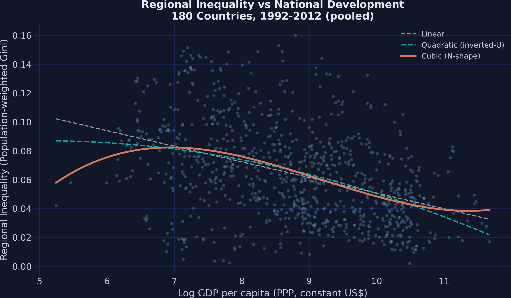
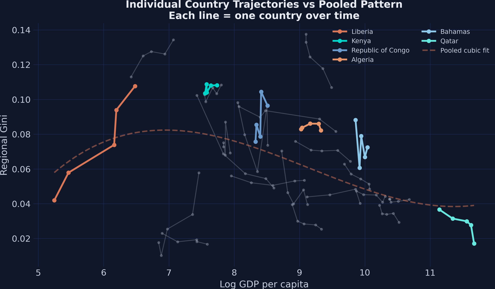
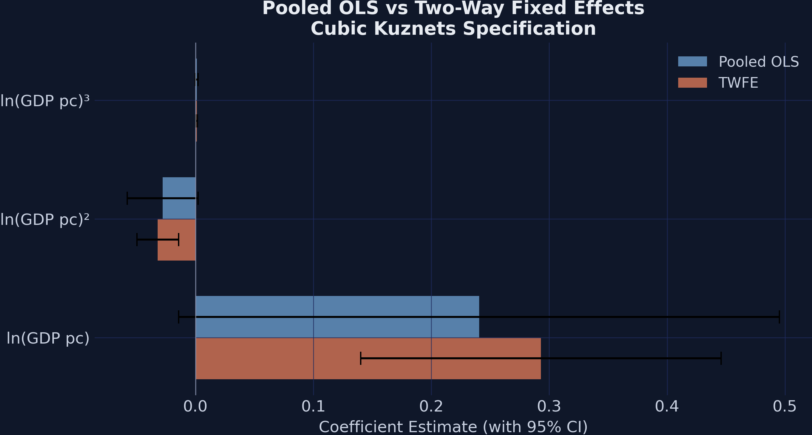
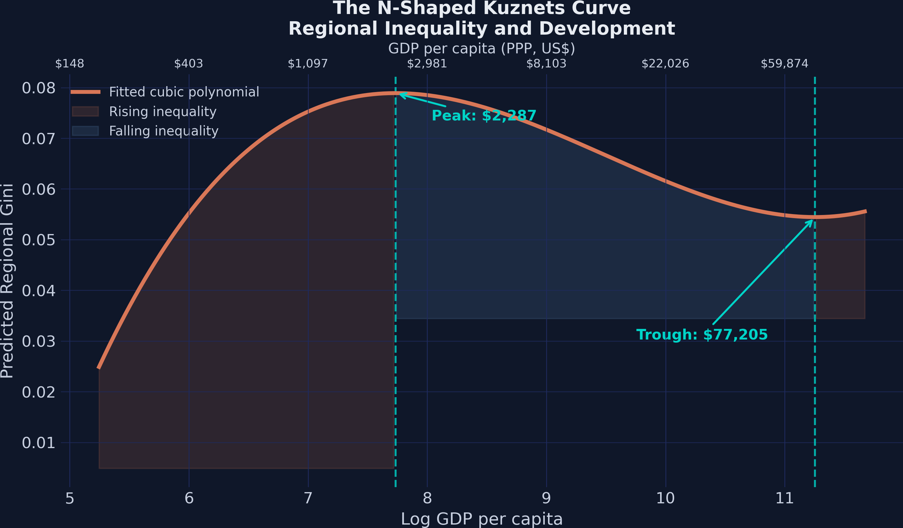
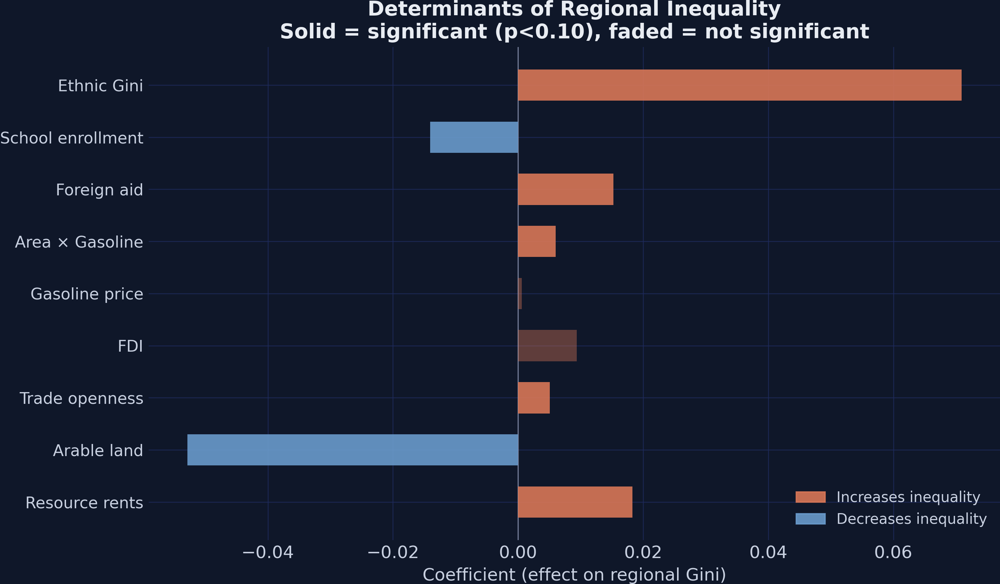
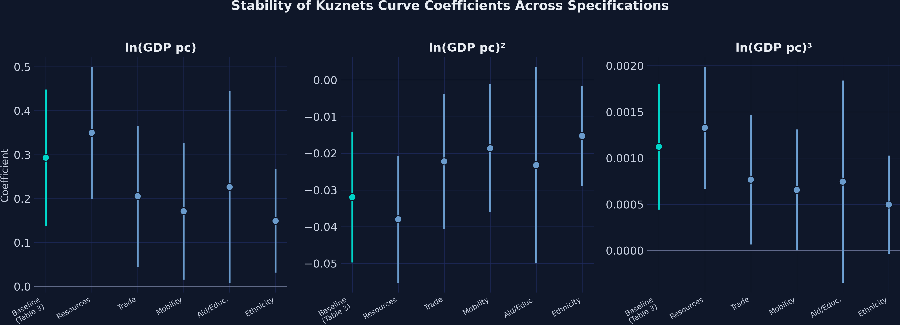

# The Tension {.divider background-color="#d97757"}

[Act I]{.act}

## Does growth cut inequality, or just move it around? Kuznets predicted an inverted-U

In 1955 Simon Kuznets argued that inequality *rises* as countries industrialize, then *falls* as growth diffuses — an inverted-U in income.

. . .

With satellite-lights data on **180 countries**, does the inverted-U still hold — *or is there a third act?*

::: {.notes}
The hook. Kuznets fitted his curve on a handful of rich nations; it is one of the most-tested hypotheses in development economics. The whole deck stress-tests his shape against modern panel data. Plant the question; we resolve it in Act III.
:::

## Pooled across 180 countries, the cloud bends twice — an N, not a single hump



::: {.notes}
The spoiler figure. Don't dissect every fit yet — just plant that inequality is high at both ends and low in the middle, so a single inverted-U is too simple. We earn the cubic, and fixed effects, in Act II and return to this shape as the payoff.
:::

## Where we're going

::: {.incremental}
- The panel: 180 countries × 5 periods, a Gini built from nighttime lights
- Why a cubic polynomial — and why pooled OLS can't be trusted
- Two-way fixed effects: comparing each country to *itself*
- Turning points, then the determinants beyond income
:::

# The Investigation {.divider background-color="#6a9bcc"}

[Act II]{.act}

## The lab: 180 countries × 5 periods, 880 rows, a lights-based regional Gini

::: {.incremental}
- **Outcome** — a population-weighted regional Gini per country-period, $0$ (equal regions) to $1$ (all income in one region), built from satellite nighttime lights
- **Regressor** — log GDP per capita, spanning $\$190$ to $\$117{,}000$
- **Structure** — an unbalanced panel, 168 countries in period 1 growing to 180 by period 5
:::

[Periods are 5-year averages from 1990–1994 through 2010–2013; mean Gini $= 0.064$, SD $= 0.033$.]{.takeaway .fragment}

::: {.notes}
The Gini coefficient comes from Lessmann & Seidel (2017): subnational GDP proxied by nighttime light intensity, then aggregated to a within-country Gini. Slightly unbalanced because some poor countries enter the lights record late. The wide income range is what lets us see both ends of the curve.
:::

## To bend twice, the model needs a cubic in log income

$$\text{Gini}_i = \beta_0 + \beta_1 \ln Y_i + \beta_2 (\ln Y_i)^2 + \beta_3 (\ln Y_i)^3 + \varepsilon_i$$

[$\beta_2$ lets the curve bend once (an inverted-U if negative); $\beta_3$ lets it bend a *second* time (an N if positive). A linear term alone forces monotonicity.]{.takeaway .fragment}

::: {.notes}
This is the specification ladder: linear imposes a straight line, quadratic imposes one hump, cubic allows two turns. We fit all three and let the data pick. The pre-computed powers log_GDPpc2 and log_GDPpc3 keep us byte-aligned with the original Stata replication.
:::

## Pooled OLS sees the N-shape, but only barely — every term is near-insignificant

| Specification | $\beta_1$ | $\beta_2$ | $\beta_3$ | $R^2$ |
|---|---:|---:|---:|---:|
| Linear | $-0.011$ | — | — | $0.164$ |
| Quadratic | $0.015$ | $-0.002$ | — | $0.170$ |
| Cubic | [$0.241$]{.key} | $-0.028$ | $0.001$ | $0.176$ |

[Cubic terms are only marginally significant ($p \approx 0.07$–$0.09$), and $R^2$ barely moves across the ladder.]{.takeaway .fragment}

::: {.notes}
Pooled OLS treats every country-period as an independent draw — it mixes between-country and within-country variation. The cubic hints at the N but can't commit: p-values hover around 0.07. The low R² (0.176) says cross-sectional differences dominate. Something is contaminating these estimates.
:::

## Each country walks its own path — the pooled curve is a mirage



::: {.notes}
The motivation for fixed effects, made visual. Liberia sits high-inequality at low GDP; Qatar sits high-inequality at high GDP — but each country's own path over time ignores the pooled shape. Two countries at the same GDP can differ wildly because of geography, institutions, colonial history. Pooled OLS attributes that to income. That is omitted variable bias.
:::

## Fixed effects compare a country to itself: wipe the lens twice

$$\text{Gini}_{it} = \beta_1 \ln Y_{it} + \beta_2 (\ln Y_{it})^2 + \beta_3 (\ln Y_{it})^3 + \alpha_i + \gamma_t + \varepsilon_{it}$$

:::: {.columns}
::: {.column width="50%"}
### $\alpha_i$ — country effects

- absorb **180** country intercepts
- remove geography, institutions, history
:::
::: {.column width="50%"}
### $\gamma_t$ — period effects

- absorb **5** period shocks
- remove global recessions, commodity swings
:::
::::

[What's left is the *within* estimator: how each country's inequality moves as it develops, net of fixed traits and global shocks.]{.takeaway .fragment}

::: {.notes}
Two-way FE adds a dummy per country and a dummy per period. The first wipe removes time-invariant country stains; the second removes period-specific glare. Identification then comes only from within-country, within-period deviations. This is association conditional on those effects — not a causal claim.
:::

## Two-way FE in PyFixest is a one-line formula

``` {.python code-line-numbers="1|3-4|5"}
import pyfixest as pf

# 'gini ~ <polynomial> | id + year' — the pipe absorbs country + year FE
fe_cubic = pf.feols("gini ~ log_GDPpc + log_GDPpc2 + log_GDPpc3 | id + year",
                    data=df3, vcov={"CRV1": "id"})   # country-clustered SEs
```

::: {.notes}
The pipe separates regressors from fixed effects: everything after | is absorbed (demeaned away), never estimated as 180 explicit dummies. CRV1 on "id" clusters standard errors by country, since observations from the same country aren't independent. One call replaces a wall of dummy variables.
:::

## With both FE imposed, all three cubic terms turn highly significant {background-color="#141413"}

[0.293 · −0.032 · 0.001]{.bignum}

[$\hat\beta_1,\ \hat\beta_2,\ \hat\beta_3$ — cubic two-way FE, every term $p < 0.001$; within-$R^2 = 0.142$]{.bignum-label}

::: {.notes}
The turn of the act. Pooled OLS gave 0.241 / −0.028 / 0.001 at p ≈ 0.07; fixing both dimensions sharpens the magnitudes (0.293 / −0.032 / 0.001) and the significance jumps to p < 0.001 for every term. Overall R² is 0.975 — but that's mostly the FE mechanically explaining levels. The honest number is the within-R² of 0.142.
:::

## The honest fit is the within-R², and it climbs from 0.009 to 0.142 from linear to cubic

| Two-way FE model | $\hat\beta_1$ | $p$ | within-$R^2$ |
|---|---:|---:|---:|
| Linear | $-0.003$ | $0.265$ | $0.009$ |
| Cubic | [$0.293$]{.key} | $<0.001$ | $0.142$ |

[A researcher who fit only the linear FE model would conclude development has *no* effect — a false negative born of forcing a straight line through an N.]{.takeaway .fragment}

::: {.notes}
This is the key pedagogical contrast. The linear within-R² is 0.009 and the coefficient is insignificant: averaging the rising and falling phases cancels to roughly zero. The cubic raises within-R² to 0.142 — 14% of within-country variation — because it lets the opposing phases coexist. You need both the polynomial AND the fixed effects.
:::

## Fixed effects don't just sharpen the N — they tighten it



::: {.notes}
Side-by-side: FE coefficients sit slightly further from zero (0.293 vs 0.241 on the linear term) and their confidence intervals are markedly narrower. Fixed effects do double duty — removing confounding from fixed country traits and shrinking residual variance. The N-shape is a within-country phenomenon, not a cross-sectional accident.
:::

# The Resolution {.divider background-color="#00d4c8"}

[Act III]{.act}

## The fitted curve bends twice — peaking at \$2,287, troughing at \$77,205



::: {.notes}
Solving the derivative ∂Gini/∂lnY = β₁ + 2β₂lnY + 3β₃(lnY)² = 0 gives roots at lnY = 7.735 and 11.254, i.e. $2,287 and $77,205 — within rounding of the paper's $2,288 and $77,128. Three phases: poorest nations concentrate income (rising), the broad middle converges (falling), the very richest re-concentrate (rising). The second upturn rests on a handful of points (Qatar, Luxembourg) — interpret with care.
:::

## Three development phases, one association — not a causal effect

::: {.incremental}
- **Below \$2,287** — early development concentrates activity; inequality *rises*
- **\$2,287 to \$77,205** — most of the world; lagging regions catch up, inequality *falls*
- **Above \$77,205** — knowledge-economy agglomeration re-concentrates; inequality *rises again*
:::

[Fixed effects strip time-invariant confounders, but the relationship is descriptive: read it as conditional association, not a policy lever.]{.takeaway .fragment}

::: {.notes}
The estimand here is a within-country conditional association — the slope of Gini on log income, net of country and period effects. It is not an ATE: there is no treatment, no exogenous variation in development. The post is explicit that "determinants" mean associations conditional on the Kuznets polynomial and the FE.
:::

## Beyond income, ethnic inequality is the strongest driver — by far {background-color="#141413"}

[0.071]{.bignum}

[ethnic-Gini coefficient ($p < 0.001$) · 3.9× the next-largest positive effect · vs a mean regional Gini of 0.064]{.bignum-label}

::: {.notes}
Adding determinants on top of the cubic + FE: ethnic income inequality dominates. A one-unit rise in the ethnic Gini maps to a 7.1-point rise in the regional Gini — economically huge against a mean of 0.064. Arable land is the largest in absolute value but negative (−0.053): dispersed farming equalizes regions. School enrollment also reduces inequality.
:::

## Ranked side by side: ethnicity towers, land and schooling pull the other way



::: {.notes}
Seven of nine determinants are significant at 10%. Resource rents (+0.018, the resource curse), trade (+0.005), and aid (+0.015) all concentrate; arable land (−0.053) and schooling (−0.014) disperse. The policy reading: invest in education and broad-based activity; be wary of leaning on extraction or trade liberalization to fix regional gaps.
:::

## The N survives every control set — its sign pattern never breaks



::: {.notes}
Robustness. Add resources, trade, mobility, aid/education, ethnicity one block at a time — the +,−,+ pattern is preserved in all six. But under ethnicity the linear term falls from 0.293 to 0.149 and the cubic halves, hinting that part of the "development effect" rides on ethnic composition correlated with income. Resources actually sharpen the curve.
:::

## Does machine-assembled FE make this causal? No

[Objection.]{.objection} You absorbed 180 country effects and 5 period effects — surely that identifies the development effect on inequality?

. . .

[Response.]{.rebuttal} No. Two-way FE removes only *time-invariant* country confounders and global shocks. Time-varying confounders — and reverse causality from inequality to growth — remain. The estimand is a within-country **association**, conditional on the polynomial and the FE; not an ATE.

::: {.notes}
Steelman, don't strawman. FE is a powerful descriptive tool, but it cannot manufacture exogeneity. The within-R² of 0.01–0.28 across specs means much within-country variation is unexplained. The post itself flags this: associations, not causal effects. Next steps point to IV or shift-share designs for identification.
:::

# Force a straight line through an N and you'll conclude growth does nothing — fit the cubic, fix the effects. {.divider background-color="#141413"}

::: {.notes}
The single takeaway. The Kuznets relationship is N-shaped and within-country: you need the polynomial to let it bend twice, and the two-way fixed effects to compare each country to itself. Get either wrong — linear, or pooled — and the signal vanishes. That's the difference between within-R² 0.009 and 0.142.
:::
