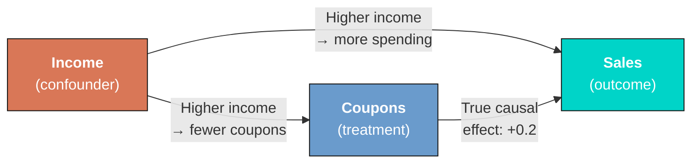

---
authors:
  - admin
categories:
  - Python
  - Tutorial
draft: false
featured: false
date: "2026-03-14T00:00:00Z"
external_link: ""
image:
  caption: ""
  focal_point: Smart
  placement: 3
links:
- icon: open-data
  icon_pack: ai
  name: "[Python] Google Colab"
  url: https://colab.research.google.com/github/cmg777/starter-academic-v501/blob/master/content/post/python_fwl/notebook.ipynb
- icon: code
  icon_pack: fas
  name: "Python script"
  url: script.py
- icon: book
  icon_pack: fas
  name: "Jupyter notebook"
  url: notebook.ipynb
slides:
summary: Understanding the Frisch-Waugh-Lovell theorem to isolate causal relationships by partialling-out confounders in a simulated retail store dataset
tags:
  - python
  - causal
title: "The FWL Theorem: Making Multivariate Regressions Intuitive"
url_code: ""
url_pdf: ""
url_slides: ""
url_video: ""
toc: true
diagram: true
---

<a href="https://colab.research.google.com/github/cmg777/starter-academic-v501/blob/master/content/post/python_fwl/notebook.ipynb" target="_blank"></a>

## Overview

Including multiple variables in a regression raises a natural question: what does it actually mean to "control for" a confounder? The output is a coefficient, but a multivariate regression cannot be plotted on a simple two-dimensional scatter plot. This makes it hard to build intuition about what the regression is doing behind the scenes.

The **Frisch-Waugh-Lovell (FWL) theorem** answers this question. It shows that any coefficient from a multivariate regression can be recovered from a simple univariate regression --- after removing the influence of all other variables through a procedure called *partialling-out* (also known as *residualization* or *orthogonalization*). Think of it as stripping away the noise from other variables so that only the signal of interest remains.

This tutorial is inspired by [Courthoud (2022)](https://towardsdatascience.com/the-fwl-theorem-or-how-to-make-all-regressions-intuitive-59f801eb3299/), and applies the FWL theorem to a simulated retail scenario. A chain of stores distributes discount coupons and wants to know whether the coupons increase sales. The catch: neighborhood income affects both coupon usage and sales, creating a confounding relationship that makes the naive analysis misleading. The analysis uses FWL to untangle these effects, verifies the theorem step by step, and visualizes the conditional relationship that multivariate regression captures but hides from view.

**Learning objectives:**

- Understand the Frisch-Waugh-Lovell theorem and why it matters for causal inference
- Implement the partialling-out procedure using OLS residuals
- Visualize conditional relationships that multivariate regressions capture but cannot directly plot
- Compare naive and conditional estimates to see how omitted variable bias distorts results
- Connect FWL to modern applications such as Double Machine Learning

## The causal structure

Before looking at data, it helps to understand the causal relationships among the variables. A **Directed Acyclic Graph (DAG)** --- a diagram where arrows indicate direct causal effects --- makes these assumptions explicit.

In this retail scenario, three variables interact:



Income acts as a **confounder** --- a variable that influences both the treatment (coupon usage) and the outcome (sales). Wealthier neighborhoods use fewer coupons but spend more, creating a *backdoor path* from coupons to sales through income. Ignoring income allows this backdoor path to generate a spurious negative association between coupons and sales, masking the true positive effect.

To recover the genuine causal effect, the analysis must **block** this backdoor path by conditioning on income. The FWL theorem provides an elegant way to do this and to visualize the result.

## Setup and imports

The following code loads all necessary libraries. The analysis relies on [statsmodels](https://www.statsmodels.org/stable/index.html) for OLS regression, [seaborn](https://seaborn.pydata.org/) for regression plots, and [matplotlib](https://matplotlib.org/) for figure customization. The `RANDOM_SEED` ensures that every reader gets identical results.

```python
import numpy as np
import pandas as pd
import matplotlib.pyplot as plt
import seaborn as sns
import statsmodels.formula.api as smf

# Reproducibility
RANDOM_SEED = 42
np.random.seed(RANDOM_SEED)

# Site color palette
STEEL_BLUE = "#6a9bcc"
WARM_ORANGE = "#d97757"
NEAR_BLACK = "#141413"
TEAL = "#00d4c8"
```

> **Note on figure styling:** The figures in this post use a dark theme for visual consistency with the site. The companion `script.py` includes the full styling code. To reproduce the dark-themed figures, add the following to your setup:
>
> <details><summary>Dark theme settings (click to expand)</summary>
>
> ```python
> DARK_NAVY = "#0f1729"
> GRID_LINE = "#1f2b5e"
> LIGHT_TEXT = "#c8d0e0"
> WHITE_TEXT = "#e8ecf2"
>
> plt.rcParams.update({
>     "figure.facecolor": DARK_NAVY, "axes.facecolor": DARK_NAVY,
>     "axes.edgecolor": DARK_NAVY, "axes.linewidth": 0,
>     "axes.labelcolor": LIGHT_TEXT, "axes.titlecolor": WHITE_TEXT,
>     "axes.spines.top": False, "axes.spines.right": False,
>     "axes.spines.left": False, "axes.spines.bottom": False,
>     "axes.grid": True, "grid.color": GRID_LINE,
>     "grid.linewidth": 0.6, "grid.alpha": 0.8,
>     "xtick.color": LIGHT_TEXT, "ytick.color": LIGHT_TEXT,
>     "text.color": WHITE_TEXT, "font.size": 12,
>     "legend.frameon": False, "legend.labelcolor": LIGHT_TEXT,
>     "savefig.facecolor": DARK_NAVY, "savefig.edgecolor": DARK_NAVY,
> })
> ```
>
> </details>

## Data simulation

Rather than importing data from an external source, this section builds a transparent data generating process (DGP) so that the **true causal effect** is known in advance and the methods can be verified against it. Think of it as running a controlled experiment in a computer: set the rules, generate the data, and then check whether the statistical tools find the right answer.

The DGP encodes the causal structure from the DAG above:

- `income` is drawn from a normal distribution centered at \\$50K
- `coupons` depends negatively on income (wealthier customers use fewer coupons) plus random noise
- `sales` depends positively on both coupons (+0.2) and income (+0.3), plus a day-of-week effect and random noise

The true causal effect of coupons on sales is **exactly +0.2** --- this is the **Average Treatment Effect (ATE)**, the average impact of coupons on sales across all stores. In concrete terms, every 1 percentage point increase in coupon usage causes a \\$200 increase in daily sales (measured in thousands).

```python
def simulate_store_data(n=50, seed=42):
    """Simulate retail store data with confounding by income."""
    rng = np.random.default_rng(seed)
    income = rng.normal(50, 10, n)
    dayofweek = rng.integers(1, 8, n)
    coupons = 60 - 0.5 * income + rng.normal(0, 5, n)
    sales = (10 + 0.2 * coupons + 0.3 * income
             + 0.5 * dayofweek + rng.normal(0, 3, n))
    return pd.DataFrame({
        "sales": np.round(sales, 2),
        "coupons": np.round(coupons, 2),
        "income": np.round(income, 2),
        "dayofweek": dayofweek,
    })

N = 50
df = simulate_store_data(n=N, seed=RANDOM_SEED)
print("Dataset shape:", df.shape)
print(df.head())
print(df.describe().round(2))
```

```
Dataset shape: (50, 4)

   sales  coupons  income  dayofweek
0  37.37    36.93   53.05          6
1  36.88    38.06   39.60          6
2  33.09    32.04   57.50          6
3  35.09    33.43   59.41          5
4  27.01    43.21   30.49          4

       sales  coupons  income  dayofweek
count  50.00    50.00   50.00      50.00
mean   33.61    33.84   50.91       3.92
std     3.96     4.89    7.68       1.88
min    25.76    23.26   30.49       1.00
25%    31.30    31.53   45.78       2.00
50%    33.24    33.25   51.74       4.00
75%    36.00    36.89   56.42       5.75
max    44.38    43.79   71.42       7.00
```

The dataset contains 50 stores with average daily sales of \\$33,610, average coupon usage of 33.84%, and average neighborhood income of \\$50,910. Sales range from \\$25,760 to \\$44,380, reflecting meaningful variation across stores. Coupon usage spans from 23% to 44%, and income ranges from \\$30,490 to \\$71,420. This variation provides enough signal to estimate the relationships of interest.

## The naive relationship

The simplest approach is to regress sales directly on coupon usage, ignoring income entirely. This is what a rushed analyst might do --- just look at whether stores with more coupon usage have higher or lower sales.

```python
sns.regplot(x="coupons", y="sales", data=df, ci=False,
            scatter_kws={"color": STEEL_BLUE, "alpha": 0.7, "edgecolors": "white", "s": 60},
            line_kws={"color": WARM_ORANGE, "linewidth": 2, "label": "Linear fit"})
plt.legend()
plt.xlabel("Coupon usage (%)")
plt.ylabel("Daily sales (thousands $)")
plt.title("Naive relationship: Sales vs. coupon usage")
plt.savefig("fwl_naive_regression.png", dpi=300, bbox_inches="tight")
plt.show()
```


*Naive regression: the downward slope suggests coupons reduce sales, but this is driven by confounding from income.*

```python
naive_model = smf.ols("sales ~ coupons", df).fit()
print(naive_model.summary().tables[1])
```

```
==============================================================================
                 coef    std err          t      P>|t|      [0.025      0.975]
------------------------------------------------------------------------------
Intercept     37.1906      3.960      9.390      0.000      29.228      45.154
coupons       -0.1059      0.116     -0.914      0.365      -0.339       0.127
==============================================================================
```

The naive regression suggests that coupons have a **negative** effect on sales: each additional percentage point of coupon usage is associated with \\$106 less in daily sales. However, this coefficient is not statistically significant (p = 0.365), and the 95% confidence interval [-0.339, 0.127] spans both negative and positive values. More importantly, the true effect is +0.2, so this estimate is not just imprecise --- it points in the wrong direction. The confounder (income) is pulling the estimate downward because wealthier neighborhoods use fewer coupons but spend more.

## Controlling for income

To block the backdoor path through income, the next step includes it as a control variable in the regression. This is the standard approach in applied work: add the confounder to the right-hand side of the regression equation.

```python
full_model = smf.ols("sales ~ coupons + income", df).fit()
print(full_model.summary().tables[1])
```

```
==============================================================================
                 coef    std err          t      P>|t|      [0.025      0.975]
------------------------------------------------------------------------------
Intercept      5.0278      7.181      0.700      0.487      -9.418      19.474
coupons        0.2673      0.120      2.222      0.031       0.025       0.509
income         0.3836      0.076      5.015      0.000       0.230       0.537
==============================================================================
```

Controlling for income reverses the picture entirely. The coefficient on coupons is now **+0.2673** (p = 0.031), indicating that each additional percentage point of coupon usage increases daily sales by about \\$267. This is close to the true effect of +0.2, and the 95% confidence interval [0.025, 0.509] no longer includes zero. Income itself has a strong positive effect of +0.3836 (p < 0.001), confirming that wealthier neighborhoods spend more. By conditioning on income, the backdoor path is blocked and the estimate moves much closer to the true causal effect.

But what is the regression actually *doing* when it "controls for" income? This is where the FWL theorem provides a clear answer.

## The FWL theorem

The Frisch-Waugh-Lovell theorem, first published by Ragnar Frisch and Frederick Waugh in 1933 and later given an elegant proof by Michael Lovell in 1963, provides a precise algebraic decomposition of what multivariate regression does under the hood.

Consider a linear model with two sets of regressors:

$$y\_i = \beta\_1 x\_{i,1} + \beta\_2 x\_{i,2} + \varepsilon\_i$$

In words, this equation says that the outcome $y$ (sales) equals the effect $\beta\_1$ of the variable of interest $x\_1$ (coupons), plus the effect $\beta\_2$ of the control variable $x\_2$ (income), plus an error term $\varepsilon$. In this analysis, $y$ corresponds to the `sales` column, $x\_1$ to `coupons`, and $x\_2$ to `income`.

The FWL theorem states that the **Ordinary Least Squares (OLS)** estimator --- the standard method for fitting a regression line by minimizing squared prediction errors --- $\hat{\beta}\_1$ from this multivariate regression is **identical** to the estimator obtained from a simpler procedure:

$$\hat{\beta}\_1^{FWL} = \frac{\text{Cov}(\tilde{y}, \\, \tilde{x}\_1)}{\text{Var}(\tilde{x}\_1)}$$

where $\tilde{x}\_1$ is the residual from regressing $x\_1$ on $x\_2$, and $\tilde{y}$ is the residual from regressing $y$ on $x\_2$.

In words, this says: to estimate the effect of coupons while controlling for income, we can (1) remove income's influence from coupons, (2) remove income's influence from sales, and (3) regress the cleaned sales on the cleaned coupons. The resulting coefficient is **exactly** the same as the one from the full multivariate regression.

This procedure is called **partialling-out** because it removes the variation explained by the control variables, keeping only the residual variation --- the part that is *orthogonal* to (independent of) income. The three equivalent estimators are:

1. **Full OLS:** Regress $y$ on $x\_1$ and $x\_2$ jointly
2. **Partial FWL:** Regress $y$ on $\tilde{x}\_1$ (residuals of $x\_1$ on $x\_2$)
3. **Full FWL:** Regress $\tilde{y}$ on $\tilde{x}\_1$ (residuals of both variables on $x\_2$)

All three produce the same $\hat{\beta}\_1$. The full FWL (option 3) also gives the correct standard errors.

## Verifying FWL step by step

Let us verify each step of the theorem using the simulated data.

### Step 1: Residualize coupons only

First, we regress coupons on income and extract the residuals $\tilde{x}\_1$. These residuals represent the variation in coupon usage that **cannot** be explained by income --- the "purified" coupon signal. Then we regress sales on these residuals. Because residuals always average to zero by construction (they are *mean-zero*), we drop the intercept from this regression.

```python
# Residualize coupons with respect to income
df["coupons_tilde"] = smf.ols("coupons ~ income", df).fit().resid

# Regress sales on residualized coupons (no intercept)
fwl_step1 = smf.ols("sales ~ coupons_tilde - 1", df).fit()
print(fwl_step1.summary().tables[1])
```

```
=================================================================================
                    coef    std err          t      P>|t|      [0.025      0.975]
---------------------------------------------------------------------------------
coupons_tilde     0.2673      1.271      0.210      0.834      -2.288       2.822
=================================================================================
```

The coefficient is **exactly 0.2673** --- identical to the full regression. However, the standard error has exploded from 0.120 to 1.271, making the estimate appear insignificant (p = 0.834). This happens because income was only partialled out from coupons but not from sales. The remaining variation in sales due to income inflates the residual variance of the regression, producing artificially large standard errors.

### Step 2: Residualize both variables

To fix the standard errors, we also residualize sales with respect to income. Now both variables have had income's influence removed.

```python
# Residualize sales with respect to income
df["sales_tilde"] = smf.ols("sales ~ income", df).fit().resid

# Regress residualized sales on residualized coupons (no intercept)
fwl_step2 = smf.ols("sales_tilde ~ coupons_tilde - 1", df).fit()
print(fwl_step2.summary().tables[1])
```

```
=================================================================================
                    coef    std err          t      P>|t|      [0.025      0.975]
---------------------------------------------------------------------------------
coupons_tilde     0.2673      0.118      2.269      0.028       0.031       0.504
=================================================================================
```

The coefficient remains **exactly 0.2673**, and now the standard error (0.118) and p-value (0.028) are nearly identical to the full regression (SE = 0.120, p = 0.031). The slight difference in standard errors comes from a degrees-of-freedom adjustment --- the full regression uses up an extra degree of freedom to estimate the income coefficient (leaving fewer data points for estimating uncertainty), while this univariate regression does not. The substantive conclusion is the same: coupons have a significant positive effect on sales after partialling out income.

## Visualizing partialling-out

What does partialling-out actually look like? Regressing coupons on income produces fitted values that form a line through the data. The **residuals** --- the vertical distances between each point and this line --- represent the coupon variation that income cannot explain.

```python
df["coupons_hat"] = smf.ols("coupons ~ income", df).fit().predict()

fig, ax = plt.subplots(figsize=(8, 6))
ax.scatter(df["income"], df["coupons"], color=STEEL_BLUE, alpha=0.7,
           edgecolors="white", s=60, label="Stores")
sns.regplot(x="income", y="coupons", data=df, ci=False, scatter=False,
            line_kws={"color": WARM_ORANGE, "linewidth": 2, "label": "Linear fit"}, ax=ax)
ax.vlines(df["income"],
          np.minimum(df["coupons"], df["coupons_hat"]),
          np.maximum(df["coupons"], df["coupons_hat"]),
          linestyle="--", color=NEAR_BLACK, alpha=0.5, linewidth=1,
          label="Residuals")
ax.set_xlabel("Neighborhood income (thousands $)")
ax.set_ylabel("Coupon usage (%)")
ax.set_title("Partialling-out: removing income's effect on coupons")
ax.legend()
plt.savefig("fwl_residuals_income.png", dpi=300, bbox_inches="tight")
plt.show()
```


*Partialling-out: the dashed lines are the residuals --- the coupon variation that income cannot explain.*

The downward-sloping fitted line confirms that higher-income neighborhoods use fewer coupons. The vertical dashed lines are the residuals --- the part of coupon usage that income does not predict. Some stores use more coupons than their neighborhood income would suggest (positive residuals), and others use fewer (negative residuals). Partialling out income keeps only these residuals, effectively asking: "Among stores with similar income levels, which ones have unusually high or low coupon usage?"

## The conditional relationship revealed

It is now possible to plot the relationship that the multivariate regression captures but cannot directly display: residualized sales against residualized coupons. Both variables have had income's influence removed, so any remaining relationship is the **conditional** effect of coupons on sales --- the effect after accounting for income differences.

```python
fig, ax = plt.subplots(figsize=(8, 6))
ax.scatter(df["coupons_tilde"], df["sales_tilde"], color=STEEL_BLUE,
           alpha=0.7, edgecolors="white", s=60, label="Stores (residualized)")
sns.regplot(x="coupons_tilde", y="sales_tilde", data=df, ci=False, scatter=False,
            line_kws={"color": WARM_ORANGE, "linewidth": 2, "label": "Linear fit"}, ax=ax)
ax.set_xlabel("Residual coupon usage")
ax.set_ylabel("Residual sales")
ax.set_title("Conditional relationship after partialling-out income")
ax.legend()
plt.savefig("fwl_partialled_out.png", dpi=300, bbox_inches="tight")
plt.show()
```


*After removing income's influence from both variables, the true positive effect of coupons on sales emerges.*

The positive slope is now clearly visible. Stripping away the confounding influence of income reveals that stores where coupon usage is higher than expected (given their neighborhood income) tend to also have sales that are higher than expected. The slope of this line is exactly 0.2673 --- the same coefficient produced by the full multivariate regression.

## Scaling for interpretability

One drawback of the partialled-out plot is that both axes show residuals centered around zero, which makes the magnitudes hard to interpret. A negative coupon value of -5 does not mean the store has -5% coupon usage --- it means coupon usage is 5 percentage points below what income alone would predict.

Adding the sample mean back to each residualized variable fixes this. The shift moves the axes without changing the slope.

```python
df["coupons_tilde_scaled"] = df["coupons_tilde"] + df["coupons"].mean()
df["sales_tilde_scaled"] = df["sales_tilde"] + df["sales"].mean()

# Verify the coefficient is unchanged
scaled_model = smf.ols("sales_tilde_scaled ~ coupons_tilde_scaled", df).fit()
print(scaled_model.summary().tables[1])
```

```
========================================================================================
                           coef    std err          t      P>|t|      [0.025      0.975]
----------------------------------------------------------------------------------------
Intercept               24.5585      4.053      6.059      0.000      16.409      32.708
coupons_tilde_scaled     0.2673      0.119      2.246      0.029       0.028       0.507
========================================================================================
```

```python
fig, ax = plt.subplots(figsize=(8, 6))
ax.scatter(df["coupons_tilde_scaled"], df["sales_tilde_scaled"],
           color=STEEL_BLUE, alpha=0.7, edgecolors="white", s=60,
           label="Stores (residualized + scaled)")
sns.regplot(x="coupons_tilde_scaled", y="sales_tilde_scaled", data=df,
            ci=False, scatter=False,
            line_kws={"color": WARM_ORANGE, "linewidth": 2, "label": "Linear fit"}, ax=ax)
ax.set_xlabel("Coupon usage (%, residualized + mean)")
ax.set_ylabel("Daily sales (thousands $, residualized + mean)")
ax.set_title("Scaled residuals: interpretable magnitudes")
ax.legend()
plt.savefig("fwl_scaled_residuals.png", dpi=300, bbox_inches="tight")
plt.show()
```


*Adding the sample means back to the residuals restores interpretable units without changing the slope.*

The coefficient remains exactly 0.2673 (p = 0.029), confirming that adding the means back does not alter the estimated relationship. Now the axes are in interpretable units: coupon usage around 34% and daily sales around \\$33,600. This scaled version is ideal for presentations and reports where the audience needs to understand both the direction and the magnitude of the conditional relationship at a glance.

## Extending to multiple controls

The FWL theorem works with **any number** of control variables, not just one. To demonstrate, the next step adds `dayofweek` as a second control alongside income. The theorem says both controls can be partialled out simultaneously and the same coefficient on coupons will emerge.

```python
# Full regression with both controls
full_model_2 = smf.ols("sales ~ coupons + income + dayofweek", df).fit()
print(full_model_2.summary().tables[1])
```

```
==============================================================================
                 coef    std err          t      P>|t|      [0.025      0.975]
------------------------------------------------------------------------------
Intercept      3.9825      7.172      0.555      0.581     -10.454      18.419
coupons        0.2706      0.119      2.266      0.028       0.030       0.511
income         0.3774      0.076      4.961      0.000       0.224       0.531
dayofweek      0.3195      0.245      1.306      0.198      -0.173       0.812
==============================================================================
```

```python
# FWL: partial out both income and dayofweek
df["coupons_tilde_2"] = smf.ols("coupons ~ income + dayofweek", df).fit().resid
df["sales_tilde_2"] = smf.ols("sales ~ income + dayofweek", df).fit().resid

fwl_multi = smf.ols("sales_tilde_2 ~ coupons_tilde_2 - 1", df).fit()
print(fwl_multi.summary().tables[1])
```

```
===================================================================================
                      coef    std err          t      P>|t|      [0.025      0.975]
-----------------------------------------------------------------------------------
coupons_tilde_2     0.2706      0.116      2.338      0.023       0.038       0.503
===================================================================================
```

With both controls, the full regression gives a coupon coefficient of 0.2706 (p = 0.028). The FWL procedure --- partialling out income and day of week from both sales and coupons --- yields the **identical** coefficient of 0.2706 (p = 0.023). The day-of-week effect itself (0.3195, p = 0.198) is not statistically significant in this sample, but including it slightly sharpens the coupon estimate from 0.2673 to 0.2706 by absorbing additional residual variance. This confirms that FWL scales to any number of controls.

## Naive vs. conditional: the full picture

To appreciate how much the FWL procedure changes the conclusions, the next figure places the naive and conditional relationships side by side. The left panel shows the raw data; the right panel shows the same data after partialling out income.

```python
fig, axes = plt.subplots(1, 2, figsize=(14, 6))

# Left: naive relationship
axes[0].scatter(df["coupons"], df["sales"], color=STEEL_BLUE, alpha=0.7,
                edgecolors="white", s=60)
sns.regplot(x="coupons", y="sales", data=df, ci=False, scatter=False,
            line_kws={"color": WARM_ORANGE, "linewidth": 2}, ax=axes[0])
axes[0].set_xlabel("Coupon usage (%)")
axes[0].set_ylabel("Daily sales (thousands $)")
axes[0].set_title("Naive (no controls)")

# Right: after partialling-out income
axes[1].scatter(df["coupons_tilde_scaled"], df["sales_tilde_scaled"],
                color=TEAL, alpha=0.7, edgecolors="white", s=60)
sns.regplot(x="coupons_tilde_scaled", y="sales_tilde_scaled", data=df,
            ci=False, scatter=False,
            line_kws={"color": WARM_ORANGE, "linewidth": 2}, ax=axes[1])
axes[1].set_xlabel("Coupon usage (%, after partialling-out)")
axes[1].set_ylabel("Daily sales (thousands $, after partialling-out)")
axes[1].set_title("After partialling-out income (FWL)")

plt.suptitle("The FWL theorem reveals the true relationship",
             fontsize=14, fontweight="bold", y=1.02)
plt.tight_layout()
plt.savefig("fwl_comparison.png", dpi=300, bbox_inches="tight")
plt.show()
```


*Simpson's paradox resolved: the naive negative slope (left) reverses to a positive slope (right) after partialling out income.*

The contrast is striking. On the left, the naive analysis suggests a negative relationship (slope = -0.106) --- coupons appear to hurt sales. On the right, after removing income's confounding influence, the true positive relationship emerges (slope = +0.267). This is a textbook example of **Simpson's paradox**: a trend that appears in aggregate data reverses when the data is properly conditioned on a relevant variable.

## Summary of results

| Method | Coupons coefficient | Std. error | p-value |
|--------|-------------------|------------|---------|
| Naive OLS (no controls) | -0.1059 | 0.116 | 0.365 |
| Full OLS (+ income) | +0.2673 | 0.120 | 0.031 |
| FWL Step 1 (residualize X only) | +0.2673 | 1.271 | 0.834 |
| FWL Step 2 (residualize both) | +0.2673 | 0.118 | 0.028 |
| Full OLS (+ income + day) | +0.2706 | 0.119 | 0.028 |
| FWL (+ income + day) | +0.2706 | 0.116 | 0.023 |

All FWL variants produce the same coefficient as the corresponding full regression, confirming the theorem. The coefficient of +0.267 is close to the true DGP value of +0.200, with the difference attributable to finite-sample noise in 50 observations.

## Applications of the FWL theorem

The FWL theorem is not just a mathematical curiosity --- it has practical applications across several domains.

### Data visualization

As shown above, FWL makes it possible to plot the conditional relationship between two variables after controlling for confounders. This is invaluable when presenting regression results to non-technical audiences who understand scatter plots but not regression tables with multiple coefficients.

### Computational efficiency

When a regression includes **high-dimensional fixed effects** --- for example, year, industry, and country dummies that could add hundreds of columns --- computing the full regression becomes expensive. The FWL theorem allows software to partial out these fixed effects first, reducing the problem to a much smaller regression. Widely-used packages that exploit this strategy include:

- [reghdfe](https://scorreia.com/software/reghdfe/) in Stata
- [fixest](https://cran.r-project.org/web/packages/fixest/index.html) in R
- [pyfixest](https://pyfixest.org/pyfixest.html) in Python --- a fast, user-friendly package for fixed-effects regression (including multi-way clustering and interaction effects), inspired by fixest's R API
- [pyhdfe](https://pyhdfe.readthedocs.io/en/stable/index.html) in Python

### Machine learning and causal inference

Perhaps the most impactful modern application is **Double Machine Learning (DML)**, developed by Chernozhukov, Chetverikov, Demirer, Duflo, Hansen, Newey, and Robins (2018). DML extends the FWL logic by replacing the OLS regressions in the partialling-out step with **flexible machine learning models** (random forests, lasso, neural networks). This allows the control variables to have complex, nonlinear effects on both the treatment and the outcome --- while still recovering a valid causal estimate of the treatment effect.

If you want to see DML in action, check out the companion tutorial on [Introduction to Causal Inference: Double Machine Learning](/post/python_doubleml/), which applies the partialling-out estimator to a real randomized experiment.

## Discussion

This tutorial set out to answer a simple question: what does it mean to "control for" a variable in regression, and how can the result be visualized? The FWL theorem provides a definitive answer. Controlling for income in a regression of sales on coupons is equivalent to removing income's influence from both variables and then regressing the residuals.

In the simulated retail scenario, failing to control for income produced a misleading negative coefficient of -0.106, suggesting coupons reduce sales. After partialling out income, the coefficient reversed to +0.267 (p = 0.031), revealing that coupons genuinely increase sales by about \\$267 per percentage point. This estimate is close to the true data-generating parameter of +0.200, with the gap attributable to sampling variability in just 50 stores.

For a practitioner --- say, the marketing director of the retail chain --- the takeaway is clear. An analysis that ignored neighborhood income would conclude the coupon program was counterproductive. The FWL-based analysis shows it works, and provides a plot that makes this case visually compelling. The theorem bridges the gap between the numbers in a regression table and the intuitive two-variable scatter plot.

## Summary and next steps

**Key takeaways:**

1. **Sign reversal.** The naive coupon coefficient was -0.106 (negative, not significant). After controlling for income, it became +0.267 (positive, p = 0.031). Ignoring confounders can reverse not just the magnitude but the direction of an estimated effect.

2. **Exact equivalence.** The FWL procedure produced a coefficient of 0.2673 --- identical to the full multivariate regression down to four decimal places --- whether partialling out one control (income) or two (income + day of week). The theorem is not an approximation; it is an algebraic identity.

3. **Visualization power.** FWL reduces any multivariate regression to a univariate one, enabling scatter plots that display conditional relationships. This is especially valuable for communicating results to non-technical stakeholders.

4. **Foundation for DML.** FWL underpins modern causal inference methods like Double Machine Learning, where flexible ML learners replace OLS in the partialling-out step. Understanding FWL is a prerequisite for understanding DML.

5. **Linearity assumption matters.** The FWL procedure relies on OLS residualization, which assumes linear relationships between the controls and both the treatment and outcome. If income affects coupons or sales nonlinearly, OLS residuals will not fully remove the confounding --- motivating methods like DML that replace OLS with flexible learners.

**Limitations:**

- The data is simulated with a known linear DGP. In real data, the DGP is unknown and may be nonlinear, requiring methods like DML rather than plain OLS.
- The FWL theorem assumes a correctly specified linear model. If the relationship between income and coupons (or sales) is nonlinear, OLS residualization will not fully remove the confounding.
- With only 50 observations, the estimates have wide confidence intervals. Larger samples would sharpen the estimates.

**Next steps:**

- See [Double Machine Learning](/post/python_doubleml/) to learn how FWL extends to nonlinear settings.
- See [Introduction to Causal Inference: The DoWhy Approach](/post/python_dowhy/) for a full causal inference workflow with real data.

## Exercises

1. **Sample size sensitivity.** Change `N` from 50 to 500 in the `simulate_store_data()` function. How do the naive and FWL coefficients change? How do the standard errors shrink? Is the naive estimate still misleading with a larger sample?

2. **Nonlinear confounding.** Modify the DGP so that income affects coupons nonlinearly: `coupons = 60 - 0.01 * income**2 + noise`. Does the FWL procedure (with linear OLS residualization) still recover the true coefficient? Why or why not?

3. **Real data application.** Pick a dataset with a known confounder (e.g., the wage-education-ability relationship) and apply the FWL procedure. Visualize the naive and conditional relationships side by side.

## References

1. [Courthoud, M. (2022). Understanding the Frisch-Waugh-Lovell Theorem. *Towards Data Science*.](https://towardsdatascience.com/the-fwl-theorem-or-how-to-make-all-regressions-intuitive-59f801eb3299/)
2. [Frisch, R. and Waugh, F. V. (1933). Partial Time Regressions as Compared with Individual Trends. *Econometrica*, 1(4), 387--401.](https://www.jstor.org/stable/1907330)
3. [Lovell, M. C. (1963). Seasonal Adjustment of Economic Time Series and Multiple Regression Analysis. *Journal of the American Statistical Association*, 58(304), 993--1010.](https://www.tandfonline.com/doi/abs/10.1080/01621459.1963.10480682)
4. [Chernozhukov, V., Chetverikov, D., Demirer, M., Duflo, E., Hansen, C., Newey, W., and Robins, J. (2018). Double/Debiased Machine Learning for Treatment and Structural Parameters. *The Econometrics Journal*, 21(1), C1--C68.](https://academic.oup.com/ectj/article/21/1/C1/5056401)
5. [Belloni, A., Chernozhukov, V., and Hansen, C. (2014). Inference on Treatment Effects after Selection among High-Dimensional Controls. *Review of Economic Studies*, 81(2), 608--650.](https://academic.oup.com/restud/article-abstract/81/2/608/1523757)
6. [pyfixest --- Fast Estimation of Fixed-Effects Models in Python](https://pyfixest.org/pyfixest.html)
7. [statsmodels --- Statistical Modeling in Python](https://www.statsmodels.org/stable/index.html)
