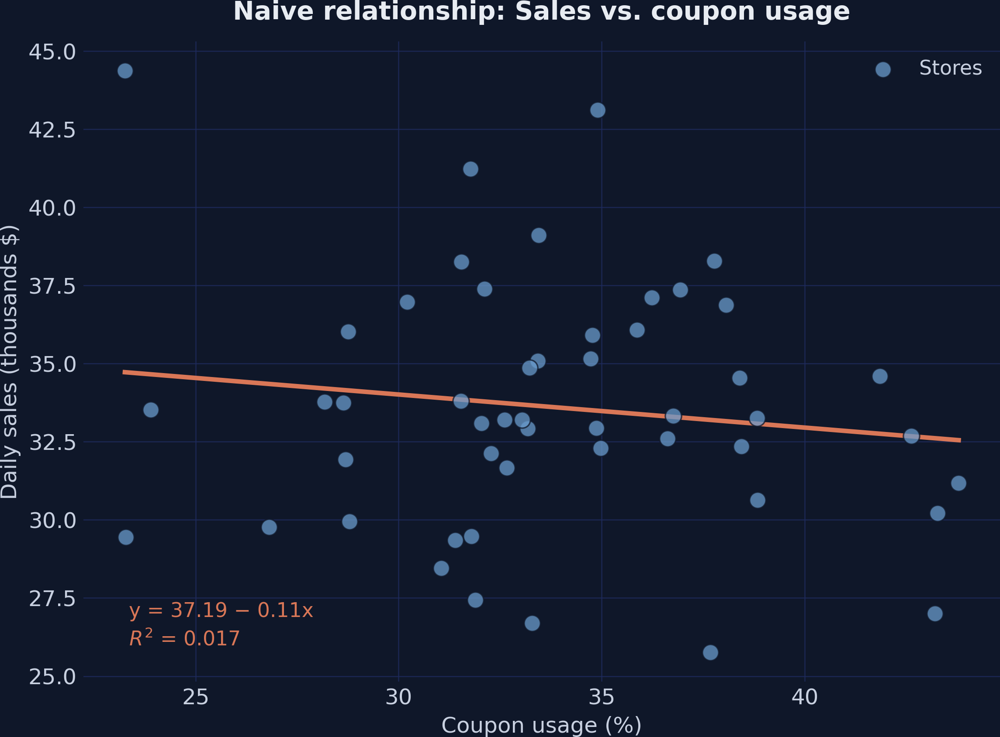
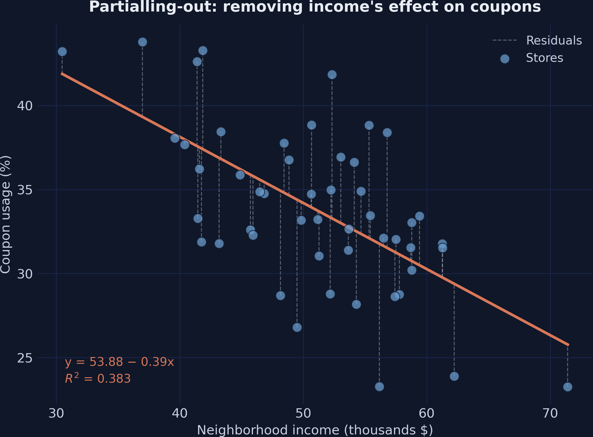
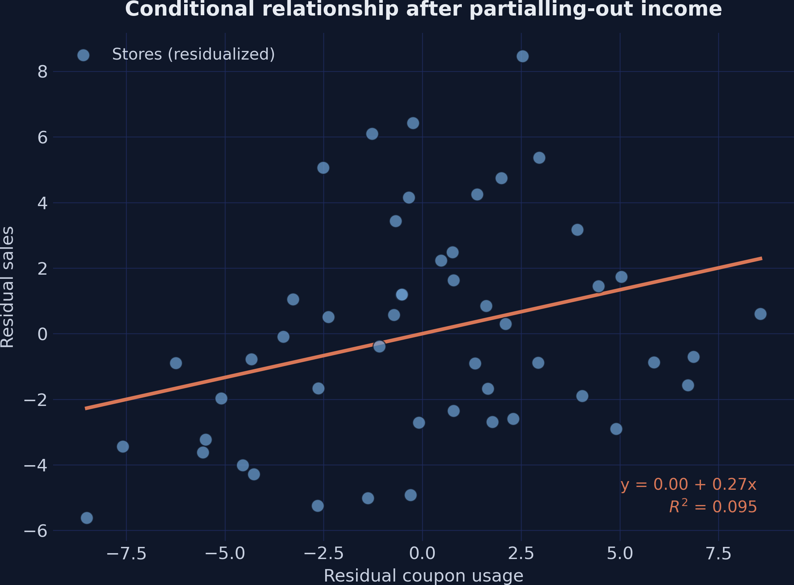
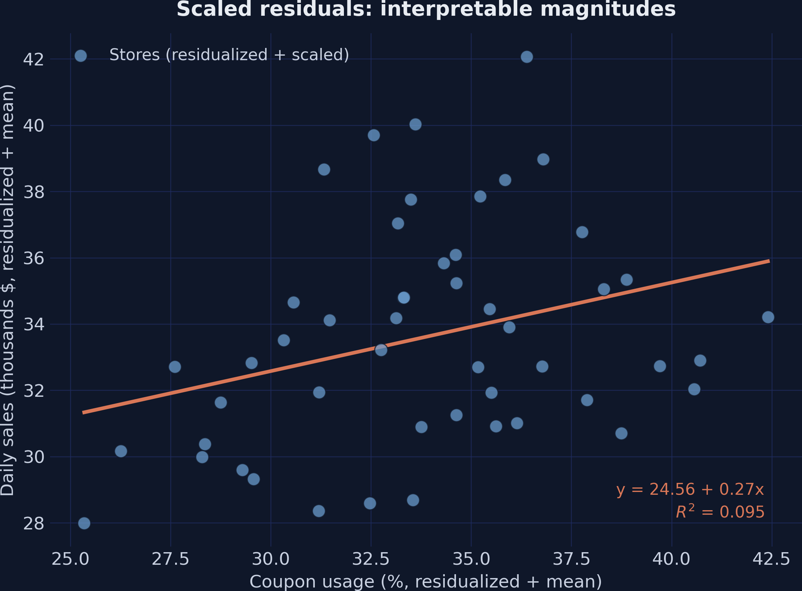
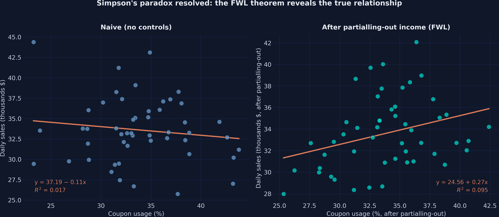

# The Tension {.divider background-color="#d97757"}

[Act I]{.act}

## The same coupon data says both "coupons hurt sales" and "coupons help sales"

A retail chain hands out discount coupons across 50 stores and asks one question: *do the coupons increase sales?*

. . .

Regress sales on coupons and the slope is **negative**. Add one control and it **flips positive**. *Which answer is real?*

::: {.notes}
This is the hook: a single dataset, a single question, two opposite answers. The whole deck is about why the regression changes its mind — and which version to trust. The villain is a confounder; FWL is how we see it.
:::

## Naive regression: coupons look like they *reduce* sales



::: {.notes}
Spoiler/tension figure. Don't explain the mechanism yet — just plant that the raw picture is negative and misleading. We will earn the reversal in Act II and return to this picture in the side-by-side at the end.
:::

## Where we're going

::: {.incremental}
- The retail setup: a known +0.2 effect, confounded by income
- What "controlling for income" actually does, algebraically
- The FWL recipe: residualize, residualize, regress
- See the hidden conditional relationship as a scatter plot
- The bridge to Double Machine Learning
:::

::: {.notes}
Built from the post's five learning objectives. Teaching deck, so we signpost. Keep it to one breath per line.
:::

# The Investigation {.divider background-color="#6a9bcc"}

[Act II]{.act}

## Income is a confounder that opens a backdoor from coupons to sales

:::: {.columns}
::: {.column width="55%"}
::: {.incremental}
- **Income** → fewer coupons (wealthier stores use fewer)
- **Income** → more sales (wealthier stores spend more)
- **Coupons** → sales: true effect **+0.2**
:::
:::
::: {.column width="45%"}
[The path `coupons ← income → sales` is non-causal. Leave it open and the negative income→coupon link leaks into the coupon slope.]{.takeaway .fragment}
:::
::::

::: {.notes}
This is the DAG from the post in words. Income drives both the treatment and the outcome — the textbook confounder. Blocking the backdoor means conditioning on income. FWL is the elegant way to do exactly that and to picture it.
:::

## A simulated lab with a known answer: the true effect is exactly +0.2

``` {.python code-line-numbers="3-4|5|6-7"}
def simulate_store_data(n=50, seed=42):
    rng = np.random.default_rng(seed)
    income  = rng.normal(50, 10, n)                 # the confounder
    coupons = 60 - 0.5 * income + rng.normal(0, 5, n)   # income → fewer coupons
    sales   = (10 + 0.2 * coupons + 0.3 * income    # true effect = +0.2
               + 0.5 * dayofweek + rng.normal(0, 3, n))
    return pd.DataFrame(...)
```

[We *plant* the answer (+0.2) in the data, then check whether each estimator finds it.]{.takeaway .fragment}

::: {.notes}
Why simulate? Because the true causal effect is known by construction — exactly +0.2 — so we can grade every method against ground truth. 50 stores, income centered at \$50K, coupons depend negatively on income, sales depend positively on both. This is a controlled experiment inside the computer.
:::

## The naive slope is −0.106 — and points the wrong way (p = 0.365)

| Model | Coupons coef. | SE | p |
|---|---:|---:|:--:|
| Naive OLS (no controls) | [−0.1059]{.key} | 0.116 | 0.365 |

[Not just imprecise — the sign is *backwards* from the true +0.2. The confounder is pulling it down.]{.takeaway .fragment}

::: {.notes}
Each extra percentage point of coupons is "associated with" \$106 less in daily sales — but it is not significant and it contradicts the planted +0.2. Wealthy neighborhoods use fewer coupons yet spend more, so the raw slope inherits income's negative coupon link. This is the result the controls will fix.
:::

## Add income as a control and the slope flips to +0.267 (p = 0.031)

| Model | Coupons coef. | Income coef. | p |
|---|---:|---:|:--:|
| Naive OLS | −0.1059 | — | 0.365 |
| Full OLS (+ income) | [+0.2673]{.key} | +0.3836 | 0.031 |

[Conditioning on income blocks the backdoor: the estimate jumps to +0.267, close to the true +0.2.]{.takeaway .fragment}

::: {.notes}
One control reverses the conclusion. The CI [0.025, 0.509] now excludes zero. Income itself is strongly positive (+0.3836, p < 0.001), confirming richer stores spend more. But what is the regression *doing* when it "controls for" income? That mechanism is FWL.
:::

## FWL: any multivariate coefficient is a univariate slope on residuals

$$\hat\beta_1^{FWL}=\frac{\mathrm{Cov}(\tilde y,\ \tilde x_1)}{\mathrm{Var}(\tilde x_1)}$$

where $\tilde x_1$ is the residual of $x_1$ (coupons) regressed on $x_2$ (income), and $\tilde y$ is the residual of $y$ (sales) regressed on $x_2$.

[Remove income from coupons, remove income from sales, then regress the leftovers. Same $\hat\beta_1$.]{.takeaway .fragment}

::: {.notes}
Frisch & Waugh (1933), Lovell (1963). This is an algebraic identity, not an approximation. The tilde is partialling-out: keep only the variation orthogonal to income. Three equivalent estimators — full OLS, residualize-X-only, residualize-both — all return the same coefficient on coupons.
:::

## Three lines of statsmodels reproduce the multivariate coefficient

``` {.python code-line-numbers="2|3|5"}
# residualize each variable with respect to income
df["coupons_tilde"] = smf.ols("coupons ~ income", df).fit().resid
df["sales_tilde"]   = smf.ols("sales ~ income",   df).fit().resid
# regress residual sales on residual coupons (no intercept)
fwl = smf.ols("sales_tilde ~ coupons_tilde - 1", df).fit()
```

[Residuals are mean-zero, so we drop the intercept. The coefficient on `coupons_tilde` *is* the controlled effect.]{.takeaway .fragment}

::: {.notes}
The full script is in the post; these are the load-bearing lines. Step 1 residualizes only coupons and gets the right coefficient but a blown-up SE (1.271). Step 2 residualizes sales too and the SE collapses back to 0.118 — that's why we residualize *both*.
:::

## Residualize-both reproduces +0.2673 exactly — and recovers the SE

| FWL step | Coupons coef. | SE | p |
|---|---:|---:|:--:|
| Step 1 — residualize $x_1$ only | +0.2673 | 1.271 | 0.834 |
| Step 2 — residualize both | [+0.2673]{.key} | 0.118 | 0.028 |

[Same coefficient to four decimals; residualizing the outcome too restores the SE to match full OLS (0.120).]{.takeaway .fragment}

::: {.notes}
Step 1's SE explodes because income's variation is still sitting in sales, inflating the residual variance. Once sales is also residualized, SE = 0.118 and p = 0.028 — nearly identical to full OLS. The tiny gap is a degrees-of-freedom adjustment. FWL is exact for the point estimate.
:::

## Partialling-out, drawn: the residuals are coupon variation income can't explain



::: {.notes}
Look at the dashed segments first. The downward fit confirms richer stores use fewer coupons. Each dashed line is a residual — how unusual a store's coupon use is *given* its income. Partialling-out throws away the line and keeps only those segments: "among similar-income stores, who couponed more or less than expected?"
:::

## The hidden positive relationship the table couldn't show you



::: {.notes}
This is the payoff plot — the conditional relationship a multivariate regression captures but cannot draw. Stores that couponed more than expected also sold more than expected. The slope of this single line is exactly 0.2673, the full-regression coefficient, now visible to a non-technical audience.
:::

## Adding the means back keeps the slope but restores readable units



::: {.notes}
A residual of −5 doesn't mean −5% coupon usage; it means 5 points below what income predicts. Adding each variable's mean back shifts the axes into interpretable units without touching the slope (still 0.2673, p = 0.029). This is the version for a slide or a stakeholder report.
:::

## FWL scales: two controls, same identity, +0.2706

| Model | Coupons coef. | SE | p |
|---|---:|---:|:--:|
| Full OLS (+ income + day) | +0.2706 | 0.119 | 0.028 |
| FWL (+ income + day) | [+0.2706]{.key} | 0.116 | 0.023 |

[Partial out income *and* day-of-week from both sides — identical coefficient. The theorem holds for any number of controls.]{.takeaway .fragment}

::: {.notes}
Day-of-week itself isn't significant (0.3195, p = 0.198), but absorbing its variance sharpens the coupon estimate slightly, from 0.2673 to 0.2706. The FWL recipe is unchanged — residualize on the full control set, then regress. This is exactly why fixed-effects packages (reghdfe, fixest, pyfixest) partial out hundreds of dummies first.
:::

# The Resolution {.divider background-color="#00d4c8"}

[Act III]{.act}

## After partialling-out income, coupons raise sales by +0.267 {background-color="#141413"}

[+0.267]{.bignum}

[$\hat\beta_1$ on coupons, full OLS = FWL (SE 0.118) · matches the true +0.200 within finite-sample noise]{.bignum-label}

::: {.notes}
Between the misleading naive −0.106 and the planted truth +0.200, the conditioned estimate lands at +0.267 — close, with the gap due to just 50 observations. The point: the same data, honestly conditioned, recovers the right sign and roughly the right magnitude.
:::

## Simpson's paradox, resolved: the slope flips from −0.106 to +0.267



::: {.notes}
The single most persuasive slide. Left panel is the lie (slope −0.106), right panel is the truth (slope +0.267), and only the conditioning changed. A trend in the aggregate reverses once you condition on the relevant variable — the textbook definition of Simpson's paradox. This is what FWL lets you *draw*.
:::

## Six estimators, one coefficient: FWL is an identity, not an approximation

| Method | Coupons coef. | SE | p |
|---|---:|---:|:--:|
| Naive OLS (no controls) | −0.1059 | 0.116 | 0.365 |
| Full OLS (+ income) | +0.2673 | 0.120 | 0.031 |
| FWL residualize $x$ only | +0.2673 | 1.271 | 0.834 |
| FWL residualize both | [+0.2673]{.key} | 0.118 | 0.028 |
| Full OLS (+ income + day) | +0.2706 | 0.119 | 0.028 |
| FWL (+ income + day) | +0.2706 | 0.116 | 0.023 |

::: {.notes}
Every FWL variant matches its full-regression twin to four decimals. The only thing that moves the coefficient is which controls you partial out, not how you do the algebra. +0.267 sits beside the true +0.200 — the difference is sampling noise in 50 stores.
:::

## Does FWL make this causal? No — it visualizes, it does not identify

[Objection.]{.objection} Residualizing on income looks like a trick that manufactures a causal effect.

. . .

[Response.]{.rebuttal} FWL is pure algebra — it only reproduces what OLS already computes. The causal reading needs one assumption: income is the only confounder. FWL pictures that adjustment; it cannot certify it.

::: {.notes}
Steelman, don't strawman. If income affects coupons or sales nonlinearly, OLS residuals won't fully clean the confounding — that's the linearity caveat in the post. And if a second confounder is omitted, no amount of residualizing on income saves you. FWL disciplines and pictures the adjustment; identification still comes from the DAG.
:::

## FWL is Double Machine Learning with a linear mop

:::: {.columns}
::: {.column width="50%"}
### FWL (here)

- residualize $y$, $d$ with **OLS**
- regress residual $y$ on residual $d$
- exact for linear confounding
:::
::: {.column width="50%"}
### Double ML

- residualize $y$, $d$ with **ML** (forest, lasso)
- regress residual $y$ on residual $d$
- handles non-linear, high-dim controls
:::
::::

[Same residualize-then-regress logic; swap OLS for a flexible learner and you get a debiased causal estimate.]{.takeaway .fragment}

::: {.notes}
Chernozhukov et al. (2018). The whole DML estimator is FWL with the OLS partial-out replaced by cross-fitted machine learning. Master FWL and DML stops being mysterious — it is this same plot, learned with a smarter mop. The companion post python_doubleml runs it on a real experiment.
:::

# Don't read the coefficient — read the partialled-out scatter. {.divider background-color="#141413"}

::: {.notes}
The one sentence to remember. A multivariate coefficient is a univariate slope on residuals; FWL lets you see it, and seeing it is what turns a confounded −0.106 into an honest +0.267.
:::
