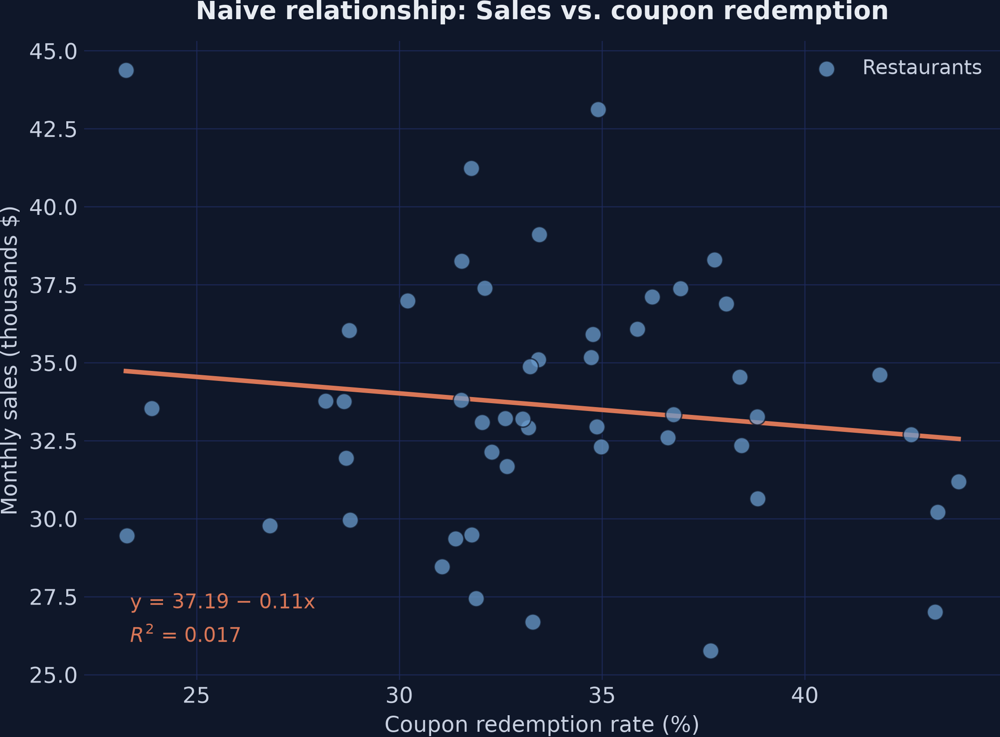
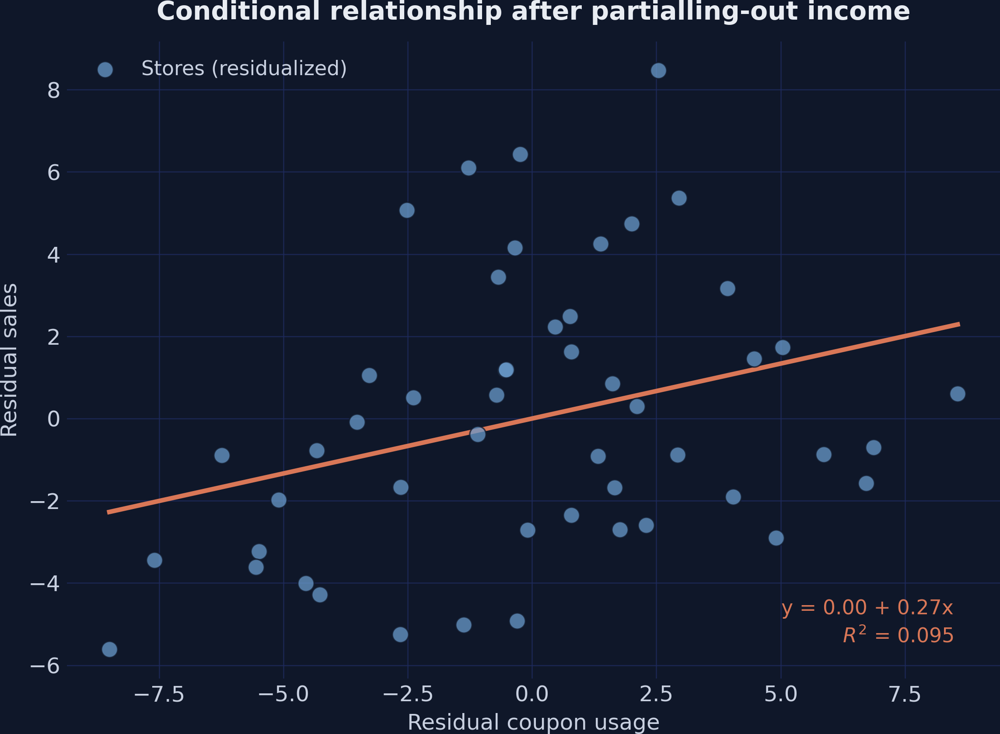
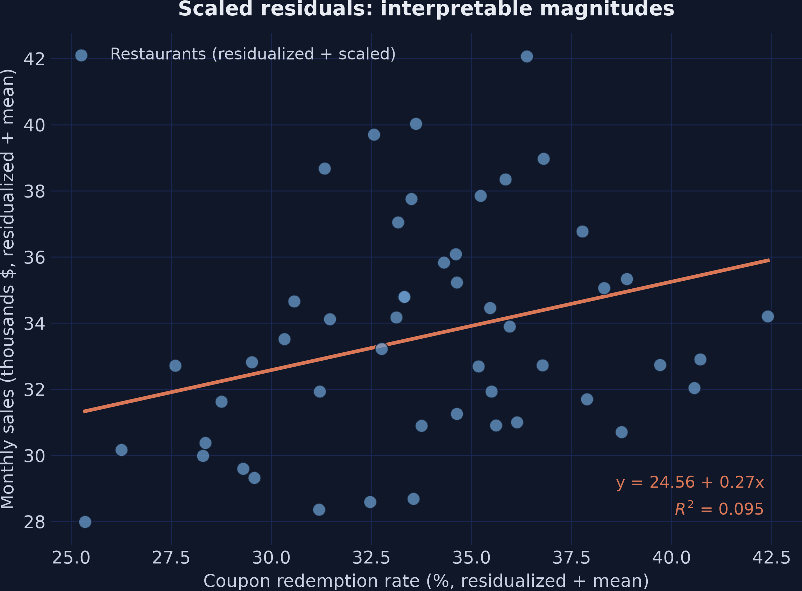

# The Tension {.divider background-color="#d97757"}

[Act I]{.act}

## We planted a +0.2 coupon effect in 50 stores — will a regression find it?

A retail chain hands out discount coupons in 50 stores. *Do the coupons increase sales?*

. . .

We simulated the stores, so we know the truth: **+0.2**. *Will the simplest regression find it?*

::: {.notes}
The hook: one dataset, one question, and — unusually — a known answer. Because we built the data, we can grade every estimator against the truth. Do not reveal the naive result yet; the next slide asks the room to predict it.
:::

## Before you look: what sign will the naive slope take? {background-color="#1a3a8a"}

Regress sales on coupons alone, with no controls. The true effect is +0.2.

**A.**&nbsp; Positive, close to the true +0.2

**B.**&nbsp; Roughly zero

**C.**&nbsp; Negative

::: {.notes}
Ask the room: regress sales on coupons with no controls — what sign does the slope take? Give 20 seconds, then take the vote. Follow-up for the discussion: if it is not +0.2, which variable is to blame? Answer on the next slide: C, negative (−0.1059), because income confounds the comparison. (AhaSlides interactive I1 follows.)
:::

## Naive regression: coupons look like they *reduce* sales



::: {.notes}
The answer to the vote: negative. The slope is −0.1059 even though we planted +0.2. Don't explain the mechanism yet — just plant that the raw picture is negative and misleading. Income is the culprit; we earn the reversal in Act II and return to this picture in the side-by-side at the end.
:::

## Where we're going

- The setup: a known +0.2 effect, confounded by income
- Measure the bias exactly with the OVB identity
- The FWL recipe: residualize, residualize, regress
- Which shortcuts are safe, and which ones mislead
- See the conditional relationship — and the bridge to DML

::: {.notes}
Built from the post's learning objectives. Teaching deck, so we signpost. Keep it to one breath per line. Six "Before you look" slides along the way ask the room to predict before each reveal.
:::

# The Investigation {.divider background-color="#6a9bcc"}

[Act II]{.act}

## Income is a confounder that opens a backdoor from coupons to sales

:::: {.columns}
::: {.column width="55%"}
::: {.incremental}
- **Income** → fewer coupons (wealthier stores use fewer)
- **Income** → more sales (wealthier stores spend more)
- **Coupons** → sales: true effect **+0.2**
:::
:::
::: {.column width="45%"}
[The path `coupons ← income → sales` is non-causal. Leave it open and the negative income→coupon link leaks into the coupon slope.]{.takeaway .fragment}
:::
::::

::: {.notes}
This is the DAG from the post in words. Income drives both the treatment and the outcome — the textbook confounder. Blocking the backdoor means conditioning on income. FWL is the elegant way to do exactly that and to picture it.
:::

## A simulated lab with a known answer: the true effect is exactly +0.2

``` {.python code-line-numbers="3-4|5|6-7"}
def simulate_store_data(n=50, seed=42):
    rng = np.random.default_rng(seed)
    income    = rng.normal(50, 10, n)                    # the confounder
    dayofweek = rng.integers(1, 8, n)                    # day of week, 1 to 7
    coupons   = 60 - 0.5 * income + rng.normal(0, 5, n)  # income → fewer coupons
    sales     = (10 + 0.2 * coupons + 0.3 * income       # true effect = +0.2
                 + 0.5 * dayofweek + rng.normal(0, 3, n))
    return pd.DataFrame(...)
```

[We *plant* the answer (+0.2) in the data, then check whether each estimator finds it.]{.takeaway .fragment}

::: {.notes}
Why simulate? Because the true causal effect is known by construction — exactly +0.2 — so we can grade every method against ground truth. 50 stores, income centered at \$50K. Day of week is drawn uniformly from 1 to 7, independently of income and coupons. Coupons fall with income; sales rise with coupons, income, and day of week. The draw order (income, day of week, coupons, sales) matters for reproducing the seed-42 sample. The full function rounds each column to two decimals before returning the DataFrame.
:::

## The naive slope is −0.106 — and points the wrong way (p = 0.365)

| Model | Coupons coef. | SE | p |
|---|---:|---:|:--:|
| Naive OLS (no controls) | [−0.1059]{.key} | 0.1158 | 0.365 |

[Not just imprecise — the sign is *backwards* from the true +0.2. The confounder is pulling it down.]{.takeaway .fragment}

::: {.notes}
Each extra percentage point of coupons is "associated with" \$106 less in daily sales — but it is not significant and it contradicts the planted +0.2. Wealthy neighborhoods use fewer coupons yet spend more, so the raw slope inherits income's negative coupon link. This is the result the controls will fix.
:::

## Add income as a control and the slope flips to +0.267 (p = 0.031)

| Model | Coupons coef. | Income coef. | p |
|---|---:|---:|:--:|
| Naive OLS | −0.1059 | — | 0.365 |
| Full OLS (+ income) | [+0.2673]{.key} | +0.3836 | 0.031 |

[Conditioning on income blocks the backdoor: the estimate jumps to +0.267, close to the true +0.2.]{.takeaway .fragment}

::: {.notes}
One control reverses the conclusion. The CI [0.025, 0.509] now excludes zero. Income itself is strongly positive (+0.3836, p < 0.001), confirming richer stores spend more — call it γ̂; we need it on the next slides. But how big is the bias, exactly, and what is the regression *doing* when it "controls for" income?
:::

## Before you look: which regression gives δ̂? {background-color="#1a3a8a"}

Gap: $-0.1059 - 0.2673 = -0.3732 = \hat\gamma \times \hat\delta$\
Income's coefficient in the full model: $\hat\gamma = 0.3836$

**A.**&nbsp; income on coupons

**B.**&nbsp; coupons on income

**C.**&nbsp; sales on income

::: {.notes}
Ask the room: the gap between the naive and the full slope is −0.3732, and it equals γ̂ × δ̂ with γ̂ = 0.3836. Which auxiliary regression supplies δ̂: income on coupons, or coupons on income? Answer on the next slide: A — regress the omitted variable (income) on the treatment (coupons). Its slope, −0.9730, gives 0.3836 × (−0.9730) = −0.3732, the whole gap. The reverse regression (slope −0.3935) gives −0.151 and reconciles nothing. C is the partialling-out regression for sales, a different auxiliary regression altogether. If anyone assumes the two directions are interchangeable, point out that both slopes share the same covariance but divide it by different variances (coupons' versus income's), so they differ. (AhaSlides interactive I2 follows.)
:::

## The OVB identity accounts for the whole gap, to the last digit

$$\underbrace{0.2673}_{\hat\beta_1\ \text{full}} + \underbrace{0.3836}_{\hat\gamma} \times \underbrace{(-0.9730)}_{\hat\delta} = \underbrace{-0.1059}_{\hat\beta_1^{\,\text{naive}}}$$

| Regression | Slope | $\hat\gamma \times$ slope | Implied naive |
|---|---:|---:|---:|
| income ~ coupons ✓ | −0.9730 | −0.3732 | [−0.1059]{.key} |
| coupons ~ income ✗ | −0.3935 | −0.151 | +0.116 |

[Omitted variable on the left, treatment on the right — then the bias is measurable, not mysterious.]{.takeaway .fragment}

::: {.notes}
Read the identity aloud: naive slope = full-regression slope + (income's effect on sales) × (how income moves with coupons). γ̂ > 0 and δ̂ < 0, so the bias is negative — and large enough to flip the sign. The identity is exact in the sample and links the naive slope to the full-regression estimate 0.2673, not to the true 0.2. Direction matters: δ̂ comes from regressing income ON coupons. Flip it (coupons on income, slope −0.3935) and the bias term is −0.151, which would imply a naive slope of +0.116 — not the −0.106 we observe, so it reconciles nothing. Population version: δ = −1.0, so the naive slope converges to 0.2 + 0.3 × (−1.0) = −0.10. More data will not rescue it.
:::

## FWL: any multivariate coefficient is a univariate slope on residuals

$$\hat\beta_1^{\mathrm{FWL}}=\frac{\mathrm{Cov}(\tilde y,\ \tilde x_1)}{\mathrm{Var}(\tilde x_1)}$$

$\tilde x_1$: coupons with income regressed out. $\tilde y$: sales with income regressed out.

[Remove income from coupons, remove income from sales, then regress the leftovers. Same $\hat\beta_1$.]{.takeaway .fragment}

::: {.notes}
Frisch & Waugh (1933), Lovell (1963); Lovell (2008) gives a short teaching proof. This is an algebraic identity, not an approximation. The tilde is partialling-out: keep only the variation orthogonal to income — uncorrelated with income in the sample, not necessarily independent of it. The intercept counts as one more control. Full OLS and residualize-both return the same coefficient on coupons; we test the residualize-X-only shortcut in a moment.
:::

## FWL by hand: one covariance over one variance returns 0.2673

$$\hat\beta_1=\frac{\widehat{\mathrm{Cov}}(\tilde y,\tilde x_1)}{\widehat{\mathrm{Var}}(\tilde x_1)}=\frac{3.9380}{14.7320}=0.2673$$

$$M_2 = I_n - X_2(X_2^\top X_2)^{-1}X_2^\top \qquad \hat\beta_1=\frac{x_1^\top M_2\, y}{x_1^\top M_2\, x_1}=0.2673$$

[$M_2$ is the residual maker: $M_2 X_2 = 0$, symmetric, idempotent. $X_2$ holds a column of ones and income.]{.comment}

[No regression library needed: plain NumPy returns the same 0.2673.]{.takeaway .fragment}

::: {.notes}
Two residual vectors, one covariance, one variance. Trap: np.cov divides by n − 1 by default, np.var by n unless ddof=1 — mix them and the slope inflates by 50/49 to 0.2728. The matrix form multiplies the raw x1 and y by M2; the matrix does the residualizing inside the product. That is Line 4 of the proof in the post, and it returns 0.2673 once more.
:::

## Three lines of statsmodels reproduce the multivariate coefficient

``` {.python code-line-numbers="2|3|5-6"}
# residualize each variable with respect to income
df["coupons_tilde"] = smf.ols("coupons ~ income", df).fit().resid
df["sales_tilde"]   = smf.ols("sales ~ income",   df).fit().resid
# regress residual sales on residual coupons (no intercept)
fwl = smf.ols("sales_tilde ~ coupons_tilde - 1", df).fit()
fwl.params["coupons_tilde"]   # 0.2673, same as full OLS
```

[Residuals are mean-zero, so we drop the intercept. The coefficient on `coupons_tilde` *is* the controlled effect.]{.takeaway .fragment}

::: {.notes}
The full script is in the post; these are the load-bearing lines. Residualize coupons on income, residualize sales on income, then regress residual on residual without an intercept — both residual series have mean zero. Next, a tempting shortcut: what if we skip residualizing sales and keep the raw outcome?
:::

## Before you look: does the Step 1 shortcut keep both numbers? {background-color="#1a3a8a"}

Step 1 regresses *raw* sales on residualized coupons, with *no intercept*.

**A.**&nbsp; Same coefficient (0.2673) and the same SE, about 0.12

**B.**&nbsp; Same coefficient, but a much larger SE

**C.**&nbsp; A different coefficient

::: {.notes}
Ask the room: this regression uses residualized coupons but raw sales, with no intercept. (a) Will the coefficient still be 0.2673? (b) Will the standard error still be about 0.12? Answer on the next slide: B — the coefficient is exactly 0.2673, but the SE jumps to 1.2715. (AhaSlides interactive I3 follows.)
:::

## Step 1 keeps the coefficient, but its SE balloons to 1.2715

| Regression | Coupons coef. | SE | p |
|---|---:|---:|:--:|
| Full OLS (+ income) | +0.2673 | 0.1203 | 0.031 |
| Step 1 (no intercept) | +0.2673 | [1.2715]{.key} | 0.834 |

[Right coefficient, wrong SE: stop here and you would conclude coupons do nothing.]{.takeaway .fragment}

::: {.notes}
The coefficient survives: coupons_tilde is orthogonal to both the constant and income, so x̃₁ᵀy = x̃₁ᵀỹ (corollary (a) of the proof). So all three estimators — full OLS, residualize-X-only, residualize-both — return the same coefficient on coupons. The SE does not: it is more than ten times larger, and p = 0.834. Raw sales is not mean-zero (its mean is 33.61), so dropping the intercept matters a great deal. The next slide takes the jump apart.
:::

## Step 1's SE explodes because the intercept is missing

| Regression (coef. 0.2673 in every row) | SE | SSR | df |
|---|---:|---:|---:|
| Step 1, no intercept | [1.2715]{.key} | 57,181 | 49 |
| Step 1 + intercept | 0.1437 | 715 | 48 |
| Step 1, demeaned sales | 0.1422 | 715 | 49 |
| Full regression | 0.1203 | 491 | 47 |

[The intercept alone closes 98% of the SE gap; the rest is income still left in sales.]{.takeaway .fragment}

::: {.notes}
Forced through the origin, the Step 1 line must also explain the level of sales, and it cannot: the sales mean of 33.6 stays in the residuals. The SSR is 57,181 without an intercept and 715 with one; the difference equals n × mean(sales)² exactly. In SE levels, (1.2715 − 0.1437) / (1.2715 − 0.1203) = 0.98. Demeaning sales instead of adding an intercept gives 0.1422: the same SSR of 715, divided by 49 instead of 48 (factor √(48/49) = 0.9897). The last step, 0.1437 → 0.1203, is income's variation still in sales: residualizing sales on income cuts the SSR from 715 to 491.
:::

## Before you look: will Step 2's SE equal the full model's 0.1203? {background-color="#1a3a8a"}

Step 2 residualizes sales too, then regresses residual on residual, with no intercept.

**A.**&nbsp; Yes, exactly 0.1203

**B.**&nbsp; Close, but slightly smaller

**C.**&nbsp; Close, but slightly larger

::: {.notes}
Ask the room: Step 2 regresses residualized sales on residualized coupons. Will its standard error equal the full model's 0.1203? Answer on the next slide: B — 0.1178. Same residuals, but the software divides by 49 degrees of freedom instead of 47. (AhaSlides interactive I4 follows.)
:::

## Step 2 leaves the same residuals — only the degrees of freedom differ

| Regression | Coupons coef. | SE | Residual df |
|---|---:|---:|---:|
| Step 2: $\tilde y$ on $\tilde x_1$ | +0.2673 | 0.1178 | 49 |
| Full OLS (+ income) | +0.2673 | [0.1203]{.key} | 47 |

[SE ratio $= \sqrt{47/49} = 0.9794$: the full model spends two df on the intercept and income.]{.comment}

[Same residuals, same coefficient: report the full-model SE, 0.1203.]{.takeaway .fragment}

::: {.notes}
Line 2 of the proof says ỹ = x̃₁β̂₁ + e: the residual-on-residual regression leaves exactly the full model's residuals, so the SSR is identical (the code check prints "Same residuals: True"). The variance factor is shared too; only the divisor changes, 49 instead of 47. Step 2's software SE of 0.1178 slightly overstates precision, because the software does not know that two parameters were already estimated in the partialling-out step. Report 0.1203. Either way, the coupon effect is significant.
:::

## Partialling-out, drawn: residuals are what a straight line in income leaves over


::: {.notes}
Look at the dashed segments first. The downward fit confirms richer stores use fewer coupons. Each dashed line is a residual — how unusual a store's coupon use is *given* its income. Partialling-out throws away the line and keeps only those segments: "among similar-income stores, who couponed more or less than expected?" By construction the residuals are uncorrelated with income — not independent of it. A curved dependence on income could still hide in them.
:::

## The hidden positive relationship the table couldn't show you



::: {.notes}
This is the payoff plot — the conditional relationship a multivariate regression captures but cannot draw. Stores that couponed more than expected also sold more than expected. The slope of this single line is exactly 0.2673, the full-regression coefficient, now visible to a non-technical audience.
:::

## Before you look: does adding the means back change the slope? {background-color="#1a3a8a"}

Shift each residual by its variable's sample mean. Every point moves up and to the right.

**A.**&nbsp; No, the slope is unchanged

**B.**&nbsp; Yes, the slope gets steeper

**C.**&nbsp; Yes, the slope gets flatter

::: {.notes}
Ask the room: adding the sample means back shifts every point up and to the right. Will it change the slope? Answer on the next slide: A — the slope is 0.2673 again. Adding a constant to either axis moves the cloud, not its tilt; the intercept absorbs the shift. (AhaSlides interactive I5 follows.)
:::

## Adding the means back keeps the slope but restores readable units



::: {.notes}
A residual of −5 doesn't mean −5% coupon usage; it means 5 points below what income predicts. Adding each variable's mean back shifts the axes into interpretable units without touching the slope (still 0.2673, p = 0.029). The SE moves slightly, 0.119 against Step 2's 0.118 — degrees of freedom again: this regression estimates an intercept, so it has 48 residual df instead of 49. This is a display device for a slide or a stakeholder report; for inference, report the full-model SE of 0.1203.
:::

## Before you look: does a second control move the coupon coefficient? {background-color="#1a3a8a"}

Add day of week as a second control. In the DGP it is independent of both coupons and income.

**A.**&nbsp; Not at all: it stays exactly 0.2673

**B.**&nbsp; Slightly

**C.**&nbsp; A lot: day of week is a second confounder

::: {.notes}
Ask the room: the DGP makes day of week independent of coupons and of income. Will adding it as a second control change the coupon coefficient — and if so, by how much, and why? Answer on the next slide: B — from 0.2673 to 0.2706, a shift of about 0.003. (AhaSlides interactive I6 follows.)
:::

## A second control barely moves the coefficient — and FWL still matches it

| Model | Coupons coef. | SE | Residual df |
|---|---:|---:|---:|
| Full OLS (+ income + day) | +0.2706 | 0.1194 | 46 |
| FWL (+ income + day) | [+0.2706]{.key} | 0.1157 | 49 |

[0.2673 → 0.2706: day of week's chance partial association with coupons, given income (partial corr. −0.021). Not a precision gain.]{.comment}

[FWL holds for any number of controls: partial them all out at once.]{.takeaway .fragment}

::: {.notes}
The OVB identity describes the shift exactly: 0.2673 = 0.2706 + 0.3195 × (−0.0101), where 0.3195 is day of week's coefficient in the three-variable model and −0.0101 is its slope on coupons after controlling for income. That is a tiny chance association in this sample — not the raw correlation of −0.076, and not a precision gain. Precision shows up in the SE, which moves separately (0.1203 → 0.1194). Because day of week is independent of coupons and income in the DGP, the shift would vanish in large samples. Day of week itself is not significant (0.3195, p = 0.198). The FWL recipe is unchanged — residualize on the full control set, then regress. This is exactly why fixed-effects packages (reghdfe, fixest, pyfixest) partial out hundreds of dummies first.
:::

# The Resolution {.divider background-color="#00d4c8"}

[Act III]{.act}

## After partialling out income, the estimated effect is +0.267 {background-color="#141413"}

[+0.267]{.bignum}

[$\hat\beta_1$ on coupons, full OLS = FWL · SE 0.1203 · 95% CI [0.025, 0.509] contains the true +0.200]{.bignum-label}

::: {.notes}
Between the misleading naive −0.106 and the planted truth +0.200, the conditioned estimate lands at +0.267 — close, with the gap due to just 50 observations. Closing the backdoor removes the bias, not the sampling noise. The point: the same data, honestly conditioned, recovers the right sign and roughly the right magnitude. The SE to report is the full-model 0.1203.
:::

## Simpson's paradox, resolved: the slope flips from −0.106 to +0.267


::: {.notes}
The single most persuasive slide. Left panel is the confounded raw slope (−0.106), right panel is the conditional relationship (slope +0.267, an estimate of the true +0.2), and only the conditioning changed. A trend in the aggregate reverses once you condition on the relevant variable — the textbook definition of Simpson's paradox. This is what FWL lets you *draw*.
:::

## Every FWL variant matches its full regression — only the SE moves

| Method | Coupons coef. | SE | df |
|---|---:|---:|---:|
| Naive OLS (no controls) | −0.1059 | 0.1158 | 48 |
| Full OLS (+ income) | [+0.2673]{.key} | [0.1203]{.key} | 47 |
| FWL Step 1 (no intercept) | +0.2673 | 1.2715 | 49 |
| FWL Step 1 + intercept | +0.2673 | 0.1437 | 48 |
| FWL Step 2 (residualize both) | +0.2673 | 0.1178 | 49 |
| Full OLS (+ income + day) | +0.2706 | 0.1194 | 46 |
| FWL (+ income + day) | +0.2706 | 0.1157 | 49 |

::: {.notes}
Every FWL variant matches its full-regression twin to four decimals, and plain NumPy returns 0.2673 too. The only thing that moves the coefficient is which controls you partial out, not how you do the algebra. Within each family (one control, two controls), the SEs differ for two reasons only: how much variation is left in the residuals (Step 1 leaves the sales mean and income's share of sales in them) and the residual degrees of freedom. Across families, and for the naive row, the variation left in coupons after the controls also changes. +0.267 sits beside the true +0.200 — the difference is sampling noise in 50 stores.
:::

## Does FWL make this causal? No — it visualizes, it does not identify

[Objection.]{.objection} Residualizing on income looks like a trick that manufactures a causal effect.

. . .

[Response.]{.rebuttal} FWL is pure algebra — it only reproduces what OLS already computes. The causal reading needs one assumption: income is the only confounder. FWL pictures that adjustment; it cannot certify it.

::: {.notes}
Steelman, don't strawman. The estimate is causal here only because the simulation guarantees no unmeasured confounding; in real data that must be argued, not assumed. Linearity is the second caveat, and it is subtler than "nonlinear confounding breaks FWL". Linear partialling-out removes only the linear part of income. That is harmless when only the treatment (coupon) equation curves in income: the outcome equation is still correctly specified, and the coefficient stays unbiased (Exercise 7: 0.200). It fails when the outcome (sales) equation has a nonlinear income term that the linear control misses and that moves with coupons beyond linear income (0.127). Adding income² restores 0.200; flexible learners — DML — do this automatically. And if a second confounder is omitted, no amount of residualizing on income saves you.
:::

## FWL is Double Machine Learning with a linear mop

:::: {.columns}
::: {.column width="50%"}
### FWL (here)

- residualize $y$, $d$ with **OLS**
- regress residual $y$ on residual $d$
- misses outcome curves that move with $d$
:::
::: {.column width="50%"}
### Double ML

- residualize $y$, $d$ with **cross-fitted ML** (forest, lasso)
- regress residual $y$ on residual $d$
- learns nonlinear, high-dim controls
:::
::::

[Same residualize-then-regress logic; swap OLS for cross-fitted flexible learners and you get a debiased estimate — causal only if no confounder is unmeasured.]{.takeaway .fragment}

::: {.notes}
Chernozhukov et al. (2018). The whole DML estimator is FWL with the OLS partial-out replaced by cross-fitted machine learning: each store's residuals come from models fit on the other folds, then the same residual-on-residual regression runs. It still needs no unmeasured confounding and learners that are good enough. It matters when the outcome depends on the controls in ways a linear control misses and those terms move with the treatment; a curve in the treatment equation alone is harmless for linear FWL. Master FWL and DML stops being mysterious — it is this same plot, learned with a smarter mop. The companion post python_doubleml runs it on a real experiment.
:::

# Don't read the coefficient — read the partialled-out scatter. {.divider background-color="#141413"}

::: {.notes}
The one sentence to remember. A multivariate coefficient is a univariate slope on residuals; FWL lets you see it, and seeing it is what turns a confounded −0.106 into an honest +0.267.
:::
