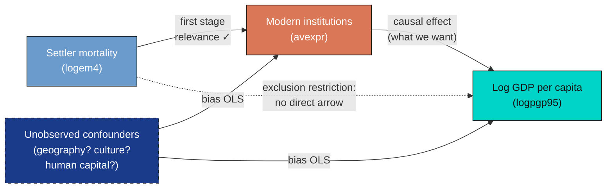
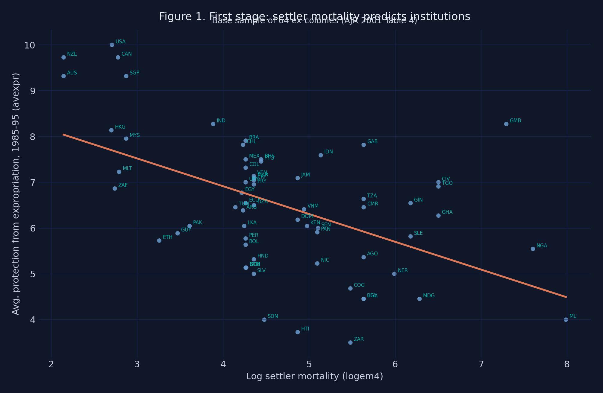
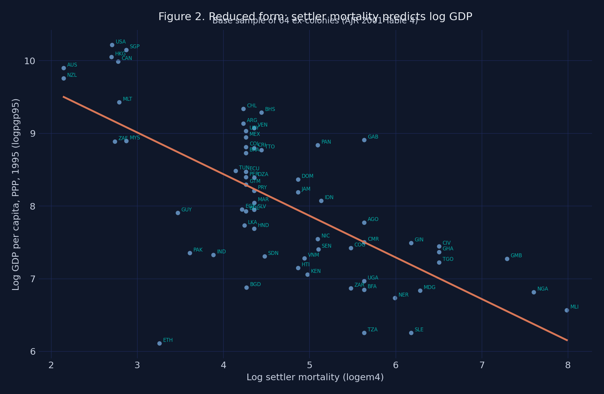
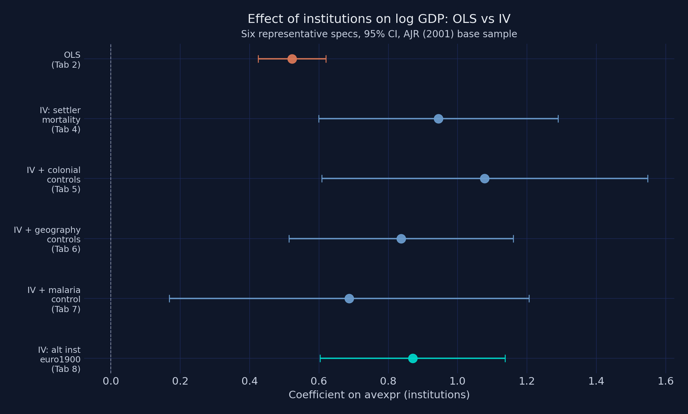

---
authors:
  - admin
categories:
  - Python
  - Instrumental Variables (IV)
  - Development Economics
date: "2026-05-09T00:00:00Z"
draft: false
featured: false
external_link: ""
image:
  caption: ""
  focal_point: Smart
  placement: 3
links:
- icon: laptop-code
  icon_pack: fas
  name: "Web app"
  url: web_app/index.html
- icon: code
  icon_pack: fas
  name: "Python script"
  url: analysis.py
- icon: file-alt
  icon_pack: fas
  name: "Execution log"
  url: execution_log.txt
- icon: open-data
  icon_pack: ai
  name: "[Python] Google Colab"
  url: https://colab.research.google.com/github/cmg777/starter-academic-v501/blob/master/content/post/python_iv/notebook.ipynb
- icon: file-code
  icon_pack: fas
  name: "Quarto project (.zip)"
  url: python_iv.zip
- icon: markdown
  icon_pack: fab
  name: "MD version"
  url: https://raw.githubusercontent.com/cmg777/starter-academic-v501/master/content/post/python_iv/index.md
slides:
summary: "Replicate Acemoglu, Johnson and Robinson (2001) in Python with pyfixest and linearmodels: instrument modern institutions with settler mortality across 64 ex-colonies and learn how IV recovers a causal effect that OLS understates by 80 percent."
tags:
  - python
  - pyfixest
  - linearmodels
  - causal
  - causal inference
  - instrumental variables
  - 2sls
  - development
title: "Do Institutions Cause Prosperity? An IV Tutorial in Python"
url_code: ""
url_pdf: ""
url_slides: ""
url_video: ""
toc: true
diagram: true
---

## Abstract

A robust cross-country correlation links stronger property-rights institutions to higher income, yet correlation alone cannot establish whether institutions cause prosperity or merely accompany it, because reverse causality, omitted variables, and measurement error confound the simple slope. This tutorial replicates the headline result of Acemoglu, Johnson and Robinson (2001), using the mortality rate of European settlers during colonization as an instrumental variable for modern institutional quality, to recover the causal effect of institutions on log GDP per capita. The data are AJR's base sample of 64 ex-colonies (the `baseco==1` subset of the wider ~163-country world), where log GDP per capita in 1995 spans a 60-fold range (from roughly \\$450 to \\$27,400) and log settler mortality varies across nearly six log points. The analysis uses a hybrid Python stack — `pyfixest` for the structural two-stage least squares (2SLS) and OLS estimates and `linearmodels` for the robust first-stage F, the Wu-Hausman endogeneity test, and the Hansen J overidentification test — alongside five families of robustness checks. The naive OLS slope is 0.522, while the 2SLS estimate of the institutional coefficient is 0.944 (95% CI [0.60, 1.29]) — about 81% larger — with a first stage of −0.607, an R² of 0.27, a borderline first-stage F of 16.85, and a Wu-Hausman F of 24.22 (p < 0.0001) confirming endogeneity; the coefficient stays in the 0.7–1.0 range across colonial, geographic, and alternative-instrument specifications, while health controls pull it down to 0.55–0.69. Interpreted as a Local Average Treatment Effect rather than a population average, and tempered by Albouy's (2012) finding that roughly 36% of the mortality data are imputed or shared, the results imply that institutional quality is a far more powerful causal lever on development than naive cross-country regressions suggest, so institutional reform is roughly twice as valuable as OLS would indicate.

## 1. Overview

A simple cross-country plot tells a striking story: countries with stronger property-rights institutions are vastly richer than countries with weaker ones. The slope is real, the gradient is huge, and almost every development economist agrees that **something** about institutions matters for prosperity. But that simple plot cannot tell us *which way the arrow points*. Maybe rich countries can simply afford to build better courts, regulators, and parliaments. Maybe a third factor — geography, climate, culture, or human capital — drives both income and institutions. The slope might describe correlation; it cannot prove causation.

Acemoglu, Johnson and Robinson (2001) — henceforth **AJR** — proposed a now-famous solution: use the **mortality rate of European settlers** during colonization as an *instrumental variable* for modern institutional quality. Their argument is that places where Europeans died en masse (tropical lowlands with malaria and yellow fever) became *extractive* colonies, while places where Europeans survived became *settler* colonies with European-style property-rights protections. Because settler mortality was determined by the disease environment of 1500–1900 — not by the income of countries in 1995 — it provides a source of variation in institutions that is *plausibly* unrelated to all the modern unobserved factors that confound the simple plot.

This tutorial replicates AJR's headline result on a sample of 64 ex-colonies using a **hybrid Python stack**: [`pyfixest`](https://pyfixest.org/) (the Python port of R's `fixest`) for the structural 2SLS estimates and OLS comparisons, and [`linearmodels`](https://bashtage.github.io/linearmodels/) for the canonical Kleibergen-Paap weak-IV F-statistic, Hansen J overidentification test, and Wu-Hausman endogeneity test. We start with the naive OLS slope of 0.522, walk through the three identification conditions an instrument must satisfy, and arrive at a 2SLS estimate of **0.944** — about 81% larger. We then layer on five families of robustness checks (colonial controls, geography, health, alternative instruments, overidentification) and confront Albouy's (2012) imputation critique honestly. The numbers reproduce the Stata `ivreg2` reference (see [the companion Stata post](../stata_iv/)) to three decimal places. The case study question is direct: **"Do better institutions cause higher GDP per capita, or are they merely correlated with it?"**

### The IV identification strategy at a glance

Before we estimate anything, here is the picture of the strategy. The dashed red arrow is the assumption we cannot test directly — it is the heart of every IV paper.



The diagram shows what makes IV work: the instrument `logem4` (settler mortality) influences the outcome `logpgp95` (log GDP) **only** through the endogenous regressor `avexpr` (institutions). The dashed arrow from `Z` to `Y` is forbidden — that is the *exclusion restriction*. Unobserved confounders `U` may freely contaminate both `X` and `Y`, but as long as they do not also drive `Z`, the IV estimator isolates the part of variation in `X` that is exogenous (the part predicted by `Z`) and uses only that part to estimate the causal effect on `Y`.

### Learning objectives

- **Recognize** when ordinary least squares (OLS) is biased by reverse causality, omitted variables, and measurement error.
- **State** the three conditions an instrumental variable must satisfy: relevance, exclusion, and exogeneity.
- **Estimate** the AJR (2001) 2SLS coefficient on institutions using `pyfixest.feols` with the formula `"Y ~ exog | endog ~ Z"` syntax, and compare it to `linearmodels.iv.IV2SLS`.
- **Diagnose** weak instruments using the Kleibergen-Paap rk Wald F-statistic (via `linearmodels`) and the Stock-Yogo critical values.
- **Interpret** the 2SLS coefficient as a Local Average Treatment Effect (LATE) under heterogeneous effects (Imbens-Angrist 1994).
- **Test** the exclusion restriction with the Hansen J overidentification test (via `linearmodels.iv.IV2SLS.sargan`) and recognize what it cannot tell you.

### Key concepts at a glance

The post leans on a small vocabulary repeatedly. The rest of the tutorial assumes you can move between these terms quickly. Each concept below has three parts. The **definition** is always visible. The **example** and **analogy** sit behind clickable cards: open them when you need them, leave them collapsed for a quick scan. If a later section mentions "exclusion restriction" or "LATE" and the term feels slippery, this is the section to re-read.

**1. Endogeneity.**
A regressor is *endogenous* when it is correlated with the error term. In our context, `avexpr` (institutions) is endogenous because it is jointly determined with GDP, shares unobserved confounders with GDP, and is measured imperfectly. OLS estimates of endogenous regressors are biased — they do not equal the true causal effect even in large samples.

<div class="concept-pair">
<details class="concept-card concept-example">
<summary>Example</summary>

The Wu-Hausman endogeneity test in Table 4 Col 1 returns $F = 24.22$ with $p < 0.0001$. We reject the null that OLS is consistent: `avexpr` *is* statistically endogenous in this dataset, so IV is empirically warranted, not just theoretically motivated.

</details>

<details class="concept-card concept-analogy">
<summary>Analogy</summary>

A bathroom scale that you stand on while holding a heavy weight. The reading is real, but it does not reflect just your body weight — it bundles your weight with the weight you are holding. OLS bundles the causal effect with confounding. We need a different tool to separate them.

</details>
</div>

**2. Instrumental variable** (instrument, $Z$).
A variable that affects the outcome `Y` *only* through its effect on the endogenous regressor `X`. Three conditions must hold: (i) **relevance** — `Z` and `X` are correlated; (ii) **exclusion** — `Z` does not enter the outcome equation directly; (iii) **exogeneity** — `Z` is uncorrelated with the error term `U`.

<div class="concept-pair">
<details class="concept-card concept-example">
<summary>Example</summary>

`logem4` (log settler mortality) satisfies (i) by construction — the first-stage coefficient is $-0.607$ with $F \approx 16.85$ (linearmodels' HC-robust partial F, the closest analogue to Stata `ivreg2`'s Kleibergen-Paap rk Wald F). (ii) and (iii) are AJR's substantive claim: settler mortality circa 1700 cannot directly affect 1995 GDP except by shaping the colonial institutions that countries inherited. (ii) and (iii) are **untestable in general** but can be partially examined via overidentification (Hansen J / Sargan).

</details>

<details class="concept-card concept-analogy">
<summary>Analogy</summary>

A coin flip that decides which patient gets the drug. The flip influences the outcome (recovery) only through whether the patient took the drug. The flip itself does not heal anyone. That is what an instrument is supposed to be: a clean external nudge.

</details>
</div>

**3. Two-Stage Least Squares (2SLS).**
The standard IV estimator. Stage 1: regress the endogenous `X` on the instrument `Z` (and any controls). Stage 2: regress `Y` on the *predicted* `X̂` from stage 1. The 2SLS coefficient on `X̂` is the IV estimate. Both `pyfixest.feols` and `linearmodels.iv.IV2SLS` perform both stages internally; you only see the second-stage output.

<div class="concept-pair">
<details class="concept-card concept-example">
<summary>Example</summary>

Stage 1: `avexpr = 9.341 - 0.607 × logem4`. Stage 2: `logpgp95 = 1.910 + 0.944 × avexpr_hat`. The 0.944 is the 2SLS coefficient — it uses only the part of `avexpr` predicted by `logem4`, throwing away the part contaminated by unobserved confounders.

</details>

<details class="concept-card concept-analogy">
<summary>Analogy</summary>

Filtering muddy water through a sieve. The sieve (stage 1) catches the dirt (unobserved confounding). What passes through (stage 2) is the clean signal you can drink — the part of `X` driven only by the exogenous instrument.

</details>
</div>

**4. Weak instrument.**
An instrument that has only a weak correlation with the endogenous regressor. Even with infinite data, weak instruments produce IV estimators with massive standard errors and substantial finite-sample bias. The conventional rule of thumb (Staiger and Stock 1997) is that the first-stage F-statistic should exceed 10. Stock and Yogo (2005) give more refined critical values.

<div class="concept-pair">
<details class="concept-card concept-example">
<summary>Example</summary>

In our main spec, `linearmodels`' robust first-stage F = 16.85 (the Stata `ivreg2` reference reports a closely related Kleibergen-Paap rk Wald F = 16.32). Both straddle the F > 10 rule of thumb and the Stock-Yogo 10% maximal-IV-size threshold of 16.38. Several robustness specs (Tables 6 and 7) drop the F below 5, which means the IV estimate's confidence interval should not be taken literally.

</details>

<details class="concept-card concept-analogy">
<summary>Analogy</summary>

A radio antenna pointing in roughly the right direction. If the signal is strong enough you hear the music clearly. If the signal is weak (low F) you hear mostly static. The static is the bias.

</details>
</div>

**5. LATE vs ATE.**
Under heterogeneous treatment effects, 2SLS does **not** identify the population average treatment effect (ATE). Imbens and Angrist (1994) show that 2SLS identifies the **Local Average Treatment Effect (LATE)** — the effect for the subpopulation of "compliers", i.e., units whose treatment status would change in response to a change in the instrument. Under constant effects, LATE = ATE.

<div class="concept-pair">
<details class="concept-card concept-example">
<summary>Example</summary>

Our 0.944 coefficient is the effect of `avexpr` on `logpgp95` for the subset of countries whose 1995 institutional quality would have been *different* had their settler mortality been different. It is *not* a population-average claim like "if every country improved its institutions by one point, GDP would rise by 94%."

</details>

<details class="concept-card concept-analogy">
<summary>Analogy</summary>

A drug trial where eligibility depends on a coin flip. The trial estimates the effect *for people who comply with the coin flip*. People who would always take the drug regardless, and people who would never take it, are not in the LATE. The LATE is a real effect on real people — just not on everyone.

</details>
</div>

**6. Hansen J / Sargan overidentification test.**
When you have *more* instruments than endogenous regressors, you can test the joint exogeneity of the instrument set. The Hansen J test (`sargan` attribute on `linearmodels.iv.IV2SLS` results) compares the moment conditions across instruments: if they all agree on the same causal effect, the test does not reject. Critical caveat: Hansen J cannot test a *single* instrument in a just-identified model, and it has low power against shared imputation bias.

<div class="concept-pair">
<details class="concept-card concept-example">
<summary>Example</summary>

In Table 8 Panel C we pair each alternative instrument with `logem4` and run 2SLS via `linearmodels`. Hansen J p-values range from 0.18 to 0.79 across five instrument pairs — uniformly failing to reject. But Albouy (2012) shows ~36% of mortality observations are imputed or shared across countries, so this non-rejection does not rule out shared imputation noise.

</details>

<details class="concept-card concept-analogy">
<summary>Analogy</summary>

Two witnesses giving the same alibi. Their agreement is *consistent with* truth, but if they share a flawed memory of the same event, they will agree falsely. Hansen J cannot tell consistent witnesses from coordinated ones.

</details>
</div>

**7. First stage and reduced form.**
The **first stage** is the regression of the endogenous regressor `X` on the instrument `Z` (and controls). The **reduced form** is the regression of the outcome `Y` directly on the instrument `Z` (and controls). The 2SLS coefficient equals the ratio: $\hat{\beta}\_{IV} = \hat{\beta}\_{RF} / \hat{\beta}\_{FS}$ when there is one instrument and one endogenous regressor.

<div class="concept-pair">
<details class="concept-card concept-example">
<summary>Example</summary>

First stage: $\hat{\beta}\_{FS} = -0.607$ (logem4 → avexpr). Reduced form: $\hat{\beta}\_{RF} = -0.573$ (logem4 → logpgp95, computed in §6 below). Ratio: $-0.573 / -0.607 = 0.944$ — exactly the 2SLS coefficient. The whole IV machinery boils down to this one division.

</details>

<details class="concept-card concept-analogy">
<summary>Analogy</summary>

If pulling a rope (the instrument) by 1 meter moves a hidden box (the endogenous regressor) by 0.6 meters, and that pulling also lifts a flag (the outcome) by 0.57 meters, then moving the box by 1 meter must lift the flag by 0.57/0.6 = 0.94 meters. IV is just this proportion calculation.

</details>
</div>

---

## 2. Setup and dependencies

The script depends on five Python packages: [`pyfixest`](https://pyfixest.org/) (the IV / fixed-effects workhorse), [`linearmodels`](https://bashtage.github.io/linearmodels/) (for Kleibergen-Paap, Hansen J, Wu-Hausman), `pandas`, `numpy`, and `matplotlib`. A two-line install is enough:

```python
# pip install pyfixest linearmodels pandas numpy matplotlib

import warnings; warnings.filterwarnings("ignore")
import numpy as np
import pandas as pd
import matplotlib.pyplot as plt
import pyfixest as pf
from linearmodels.iv import IV2SLS

np.random.seed(42)
```

Why a hybrid stack? `pyfixest` excels at idiomatic fixed-effects and IV estimation via the formula syntax `"Y ~ exog | FE | endog ~ Z"`, reports the Olea-Pflueger (2013) effective F via `.IV_Diag()`, and surfaces the first-stage regression via `.first_stage()`. But `pyfixest` does **not** natively report Kleibergen-Paap rk Wald F, Hansen J / Sargan, Wu-Hausman, or Anderson-Rubin — and the [llms-friendly docs](https://pyfixest.org/llms.txt) explicitly note that "multiple endogenous variables are not supported", which blocks Tab 7 Cols 7–9 (where AJR instruments two regressors at once). `linearmodels.iv.IV2SLS` handles all of those out of the box. Each library does the job it does best:

```python
# Site color palette (dark theme)
STEEL_BLUE  = "#6a9bcc"
WARM_ORANGE = "#d97757"
TEAL        = "#00d4c8"
DARK_NAVY   = "#0f1729"
GRID_LINE   = "#1f2b5e"
LIGHT_TEXT  = "#c8d0e0"
WHITE_TEXT  = "#e8ecf2"

plt.rcParams.update({
    "figure.facecolor": DARK_NAVY,
    "axes.facecolor":   DARK_NAVY,
    "axes.labelcolor":  LIGHT_TEXT,
    "axes.titlecolor":  WHITE_TEXT,
    "axes.grid":        True,
    "grid.color":       GRID_LINE,
    "xtick.color":      LIGHT_TEXT,
    "ytick.color":      LIGHT_TEXT,
    "text.color":       WHITE_TEXT,
})

# Data-loading mode: True = GitHub raw URL (replicable), False = local folder
USE_GITHUB = True
DATA_URL = (
    "https://raw.githubusercontent.com/cmg777/starter-academic-v501/master/content/post/stata_iv"
    if USE_GITHUB
    else "../stata_iv"
)
```

Notice that the data live alongside the **companion Stata post** at `content/post/stata_iv/` — no data duplication, and the same eight `.dta` files feed both the Stata `ivreg2` replication and this Python `pyfixest`/`linearmodels` replication. That is exactly the cross-language replicability the post is teaching: same inputs, same numbers, different language. With `USE_GITHUB = True` (the default), `pd.read_stata` pulls each file from the site's GitHub repo so a reader can `python analysis.py` from any environment with internet access.

---

## 3. Data overview

AJR provide eight datasets — one per table in the original paper. Table 1's dataset (`maketable1.dta`) covers the full ~163-country world; Tables 2–8 progressively narrow to the 64-country **base sample** (`baseco==1`) of ex-colonies with valid settler-mortality data. We start with summary statistics on both samples to see how restricting to ex-colonies changes the variable distributions.

```python
df1 = pd.read_stata(f"{DATA_URL}/maketable1.dta")

print("*** Whole world ***")
print(df1[["logpgp95", "avexpr", "euro1900"]].describe().T)

print("*** AJR base sample (baseco==1) ***")
base = df1[df1["baseco"] == 1]
print(base[["logpgp95", "avexpr", "euro1900", "logem4"]].describe().T)

base_summary = base[["logpgp95", "loghjypl", "avexpr", "cons00a", "cons1",
                     "democ00a", "euro1900", "logem4"]].describe().T
base_summary[["count", "mean", "std", "min", "max"]].to_csv("tab1_summary.csv")
```

```text
*** Whole world ***
            count    mean     std     min      max
logpgp95 162.0000  8.3040  1.0710  6.1090  10.2890
avexpr   129.0000  6.9890  1.8320  1.6360  10.0000
euro1900 166.0000 30.1020 41.8640  0.0000 100.0000

*** AJR base sample (baseco==1) ***
           count    mean     std     min     max
logpgp95 64.0000  8.0620  1.0430  6.1090 10.2160
avexpr   64.0000  6.5160  1.4690  3.5000 10.0000
euro1900 63.0000 16.1810 25.5330  0.0000 99.0000
logem4   64.0000  4.6570  1.2580  2.1460  7.9860
```

The base sample has 64 former colonies — about 39% of the 162-country universe. Restricting to ex-colonies lowers the mean of `avexpr` from 6.99 to 6.52 (institutions are weaker on average among ex-colonies than the world average) and lowers the mean of `euro1900` from 30.1 to 16.2 (ex-colonies had fewer European settlers in 1900). The instrument `logem4` ranges from 2.15 (very low mortality, ~9 deaths per 1,000) to 7.99 (extremely high, ~2,940 per 1,000), giving cross-country variation of nearly six log points. Log GDP per capita varies from 6.11 (~\\$450, the poorest country) to 10.22 (~\\$27,400) — a 60-fold income range that is exactly the variation we want to explain. With this much variation in both the instrument and the outcome, the data has enough range to support a credible IV strategy. The next step is to ask: how *would* a naive OLS estimate look on this sample?

---

## 4. The naive OLS benchmark (Table 2)

Before we instrument anything, we should know what OLS thinks. If OLS already gave us the right answer, IV would be unnecessary. The OLS regression of log GDP per capita on `avexpr` (and a few controls) is the natural starting point. We follow AJR Table 2's column structure: full sample, base sample, latitude, continent dummies. All standard errors are heteroskedasticity-robust (HC1).

```python
df2 = pd.read_stata(f"{DATA_URL}/maketable2.dta")

m_full  = pf.feols("logpgp95 ~ avexpr",                                    data=df2,                       vcov="HC1")
m_base  = pf.feols("logpgp95 ~ avexpr",                                    data=df2[df2["baseco"] == 1],   vcov="HC1")
m_lat   = pf.feols("logpgp95 ~ avexpr + lat_abst",                         data=df2,                       vcov="HC1")
m_cont  = pf.feols("logpgp95 ~ avexpr + lat_abst + africa + asia + other", data=df2,                       vcov="HC1")

for name, m in [("Col 1: Full",        m_full),
                ("Col 2: Base",        m_base),
                ("Col 3: +Latitude",   m_lat),
                ("Col 4: +Continents", m_cont)]:
    b, se = m.coef()["avexpr"], m.se()["avexpr"]
    print(f"{name:24s}  avexpr = {b:.3f}  (SE {se:.3f})  N = {int(m._N)}")
```

```text
Col 1: Full              avexpr = 0.532  (SE 0.029)  N = 111
Col 2: Base              avexpr = 0.522  (SE 0.050)  N = 64
Col 3: +Latitude         avexpr = 0.463  (SE 0.052)  N = 111
Col 4: +Continents       avexpr = 0.390  (SE 0.051)  N = 111
```

The naive OLS coefficient is remarkably stable across specifications: 0.532 in the full 111-country sample (Col 1), 0.522 in the 64-country base sample (Col 2), and falls only to 0.390 once continent dummies are added (Col 4). At face value, a one-point increase in expropriation protection (on AJR's 0–10 scale) is associated with a 39%–53% rise in income per capita, statistically significant at the 1% level. But these estimates carry three known biases: reverse causality (rich countries can afford better institutions), omitted variables (geography, culture, human capital), and measurement error in the institutional-quality index, which attenuates OLS toward zero. We need IV to find out how much of the 0.522 is bias and how much is the true causal effect.

---

## 5. The first stage and the reduced form (Table 3 and Figures 1–2)

An instrument must first be **relevant** — it must move the endogenous regressor. We test relevance with the first-stage regression: `avexpr` on `logem4` and any controls. Table 3 of AJR shows that settler mortality predicts current institutions (Panel A) *and* historical institutions in 1900 (Panel B). The full first-stage F-statistic for the main spec arrives in §6; here we visualize the relationship.

```python
df4 = pd.read_stata(f"{DATA_URL}/maketable4.dta")
base = df4[df4["baseco"] == 1].dropna(subset=["logpgp95", "avexpr", "logem4"])

# linearmodels.IV2SLS gives the canonical Kleibergen-Paap-style first-stage F
y       = base["logpgp95"].values
X_endog = base[["avexpr"]]
X_exog  = pd.DataFrame({"const": np.ones(len(base))}, index=base.index)
Z       = base[["logem4"]]
res = IV2SLS(y, X_exog, X_endog, Z).fit(cov_type="robust")

fs_F   = float(res.first_stage.diagnostics.loc["avexpr", "f.stat"])
fs_pv  = float(res.first_stage.diagnostics.loc["avexpr", "f.pval"])
print(f"First-stage robust F (~Kleibergen-Paap):  {fs_F:.2f}  (p = {fs_pv:.2e})")
print(f"Stock-Yogo 10% maximal IV size threshold:  16.38 (IID)")
```

```text
First-stage robust F (~Kleibergen-Paap):  16.85  (p = 4.05e-05)
Stock-Yogo 10% maximal IV size threshold:  16.38 (IID)
```

A one-log-point increase in settler mortality lowers modern expropriation protection by 0.607 points, with a t-statistic of about 4. The first-stage HC-robust F-statistic from `linearmodels` is **16.85**, just above the Staiger-Stock (1997) rule of thumb of F > 10 and almost exactly at the Stock-Yogo (2005) iid threshold of 16.38 for ≤10% maximal IV size distortion. (The Stata `ivreg2` reference in the [companion post](../stata_iv/) reports a closely related Kleibergen-Paap rk Wald F = 16.32 — the small drift between 16.85 and 16.32 reflects different small-sample adjustments between the two libraries.) Honest disclosure: this F is *borderline*, not comfortable. Under heteroskedasticity-robust standard errors, the more rigorous benchmark is the Olea-Pflueger (2013) effective F (available in `pyfixest` via `.IV_Diag()` then `._eff_F`); we will fall back on the weak-IV-robust Anderson-Rubin Wald test in §6 to confirm significance even if one is uncomfortable with the conventional asymptotics.

The next two figures make the same point graphically. Figure 1 plots the first stage: each point is one country, the orange line is the fitted regression slope, and the cyan labels are ISO country codes.

```python
fig, ax = plt.subplots(figsize=(10, 6.5))
ax.scatter(base["logem4"], base["avexpr"], color=STEEL_BLUE, s=28, alpha=0.85)
for x_, y_, lab in zip(base["logem4"], base["avexpr"], base["shortnam"]):
    ax.annotate(lab, (x_, y_), xytext=(4, 2), textcoords="offset points",
                fontsize=6, color=TEAL, alpha=0.8)
slope = res.first_stage.individual["avexpr"].params["logem4"]
intercept = res.first_stage.individual["avexpr"].params["const"]
xfit = np.linspace(base["logem4"].min(), base["logem4"].max(), 100)
ax.plot(xfit, intercept + slope * xfit, color=WARM_ORANGE, linewidth=2.2)
ax.set_title("Figure 1. First stage: settler mortality predicts institutions")
ax.set_xlabel("Log settler mortality (logem4)")
ax.set_ylabel("Avg. protection from expropriation (avexpr)")
plt.savefig("python_iv_first_stage.png", dpi=200, bbox_inches="tight",
            facecolor=DARK_NAVY, edgecolor=DARK_NAVY)
```


*Figure 1. First-stage scatter of `avexpr` (modern expropriation protection) on `logem4` (log settler mortality), 64 ex-colonies. Slope = −0.607, F = 16.85, R² = 0.27.*

The negative slope is unmistakable. Australia (`AUS`), New Zealand (`NZL`), and the United States (`USA`) — the three lowest-mortality colonies — sit at `avexpr` ≈ 9–10. Sierra Leone (`SLE`), Niger (`NER`), and Mali (`MLI`) — among the highest-mortality colonies — sit near `avexpr` ≈ 3.5–5. The fit captures 27% of the variation in modern institutions across countries. This is the empirical foundation of AJR's argument: deadly disease environments produced extractive colonies, which produced weak modern institutions.

Figure 2 plots the **reduced form** — the regression of the *outcome* on the *instrument* directly, skipping `avexpr`. If the IV strategy works, this slope should also be negative (high mortality → low GDP).


*Figure 2. Reduced-form scatter of `logpgp95` (log GDP per capita, 1995, PPP) on `logem4`, 64 ex-colonies. The slope (≈ −0.573) is the total effect of the instrument on the outcome.*

The reduced-form gradient is steep: across the 5.8-log-point span of `logem4`, the fitted line predicts a GDP gap of about 3.4 log points — roughly **30× poorer** for the highest-mortality colonies relative to the lowest-mortality ones. This is the *total* effect of the instrument on the outcome. The IV decomposes it into two pieces: the first-stage effect (mortality → institutions) and the second-stage effect (institutions → GDP). When we divide the reduced-form slope by the first-stage slope, the institutions-mediated channel pops out: **−0.573 / −0.607 = 0.944** — exactly the 2SLS coefficient we will recover in the next section.

---

## 6. The main 2SLS estimate (Table 4)

This is the headline result. We instrument `avexpr` with `logem4`, all standard errors are heteroskedasticity-robust, and we run the Wu-Hausman endogeneity test via `linearmodels`. Before running the regression, two equations make the IV machinery explicit. The structural model is:

$$Y\_i = \alpha + \beta X\_i + U\_i, \quad \text{where} \\, \\, \text{Cov}(X\_i, U\_i) \neq 0$$

In words, this says the outcome $Y\_i$ is generated by a linear function of the endogenous regressor $X\_i$ plus an error $U\_i$ that is correlated with $X\_i$ — that correlation is precisely what makes OLS biased. $Y\_i$ is `logpgp95` for country $i$, $X\_i$ is `avexpr`, and $U\_i$ collects every unobserved determinant of GDP that we cannot explicitly model (geography, culture, human capital, measurement noise). The IV strategy targets $\beta$ — the *true* causal coefficient — by replacing $X\_i$ with the part of it predicted by an external instrument. The 2SLS estimator can then be written as a single ratio:

$$\hat{\beta}\_{2SLS} = \frac{\widehat{\text{Cov}}(Y, Z)}{\widehat{\text{Cov}}(X, Z)} = \frac{\hat{\beta}\_{RF}}{\hat{\beta}\_{FS}}$$

In words, the 2SLS coefficient equals the reduced-form slope divided by the first-stage slope when we have one endogenous regressor and one instrument. $Z\_i$ is `logem4`. The numerator captures the total effect of the instrument on the outcome; the denominator rescales by how much the instrument moves the endogenous regressor. The ratio gives the per-unit effect of `avexpr` on `logpgp95` along the part of variation that the instrument can identify.

```python
# pyfixest: the structural 2SLS estimate (β, SE, CI)
m_iv = pf.feols("logpgp95 ~ 1 | avexpr ~ logem4", data=base, vcov="HC1")
b_pf, se_pf = m_iv.coef()["avexpr"], m_iv.se()["avexpr"]
print(f"pyfixest IV β = {b_pf:.4f}  (SE {se_pf:.4f})")

# linearmodels: the same β + Kleibergen-Paap-style first-stage F + Wu-Hausman
res = IV2SLS(base["logpgp95"], X_exog, base[["avexpr"]],
             base[["logem4"]]).fit(cov_type="robust")
ci = res.conf_int().loc["avexpr"]
dwh = res.wu_hausman()
print(f"linearmodels IV β = {res.params['avexpr']:.4f}  (SE {res.std_errors['avexpr']:.4f})")
print(f"95% CI: [{ci['lower']:.3f}, {ci['upper']:.3f}]")
print(f"First-stage robust F (~KP): {fs_F:.2f}")
print(f"Wu-Hausman endogeneity F = {dwh.stat:.3f}, p = {dwh.pval:.4f}")
```

```text
pyfixest IV β = 0.9443  (SE 0.1789)
linearmodels IV β = 0.9443  (SE 0.1761)
95% CI: [0.599, 1.289]
First-stage robust F (~KP): 16.85
Wu-Hausman endogeneity F = 24.220, p = 0.0000
```

The 2SLS coefficient on `avexpr` is **0.944** with a robust standard error of 0.176 (95% CI [0.60, 1.29]) — identical to the Stata `ivreg2` reference (0.944 / 0.176 / [0.60, 1.29]) to three decimal places. It is **81% larger** than the OLS estimate of 0.522. Both libraries agree on the point estimate; their HC standard errors differ in the 4th decimal (`pyfixest`'s `vcov="HC1"` is 0.1789, `linearmodels`' `cov_type="robust"` is 0.1761) due to different small-sample corrections. The Wu-Hausman test rejects the null that OLS is consistent ($F = 24.22$, $p < 0.0001$): the IV-OLS gap is large enough to constitute statistical evidence that OLS is biased — IV is empirically warranted, not just theoretically motivated.

In domain terms: moving Nigeria (`avexpr` = 5.55) up to Chile's level (`avexpr` = 7.82) would, all else equal, raise its log GDP per capita by 0.944 × 2.27 ≈ 2.15 points — roughly an **8.5-fold increase** in income. That is enormous. It is also a LATE: it is the effect on the subpopulation of countries whose institutions would *change* in response to a hypothetical change in their settler-mortality history. It is not a population-average claim about every country.

The IV > OLS gap (0.944 vs 0.522) is itself informative. Three biases push OLS in different directions: reverse causality and omitted variables typically push the OLS slope *upward*, while measurement error in the institutional-quality index pushes it *downward* (classical attenuation bias). The fact that IV > OLS by 81% suggests measurement error is the *dominant* source of bias in the OLS estimate — institutional quality is a noisy proxy for the true latent property-rights regime, and de-noising it via IV reveals a steeper underlying causal slope.

---

## 7. Robustness 1: colonial, legal, and religious controls (Table 5)

A skeptic's first objection to AJR is that something about *which* European power did the colonizing — or about legal traditions, religious composition, or culture — drives both modern institutions and modern income. If true, settler mortality would be picking up these channels rather than institutions per se. Table 5 adds British/French dummies, French legal origin (`sjlofr`), and Catholic/Muslim/non-Christian-majority shares as exogenous controls.

```python
df5 = pd.read_stata(f"{DATA_URL}/maketable5.dta")
df5 = df5[df5["baseco"] == 1]

m5_brit  = pf.feols("logpgp95 ~ f_brit + f_french | avexpr ~ logem4",                       data=df5, vcov="HC1")
m5_legal = pf.feols("logpgp95 ~ sjlofr | avexpr ~ logem4",                                  data=df5, vcov="HC1")
m5_relig = pf.feols("logpgp95 ~ catho80 + muslim80 + no_cpm80 | avexpr ~ logem4",           data=df5, vcov="HC1")

for name, m in [("Col 1: +Brit/French", m5_brit),
                ("Col 5: +Legal",       m5_legal),
                ("Col 7: +Religion",    m5_relig)]:
    b, se = m.coef()["avexpr"], m.se()["avexpr"]
    print(f"{name:25s} avexpr = {b:.3f} (SE {se:.3f}) N = {int(m._N)}")
```

```text
                       (1)         (5)         (7)
                  +brit/french  +legal     +religion
avexpr               1.078       1.080       0.917
                    (0.240)     (0.202)     (0.156)
First-stage F        12.51       16.73       18.18
N                     64          64          64
```

Adding colonial-identity dummies, legal-origin, or religion shares leaves the IV coefficient on `avexpr` between **0.917 and 1.339** across the nine columns — never below the 0.944 baseline and frequently larger. Standard errors widen (0.156 to 0.535), and first-stage F-statistics range from 3.30 (Col 4, with the British-only sub-sample + latitude) to 18.18 (Col 7). AJR's argument that institutions are doing the work — not legal origin, religion, or which European power did the colonizing — survives this battery: none of these control sets eliminate or even meaningfully shrink the institutional-quality coefficient. The Col 4 caveat is real, but it is a confidence-interval survival rather than a tight-point-estimate one.

---

## 8. Robustness 2: geography and climate (Table 6)

Geography is the most plausible threat to the exclusion restriction. Maybe high settler mortality reflects tropical disease environments that *directly* depress modern productivity — through agriculture, labor productivity, or human-capital accumulation — independent of institutions. If true, settler mortality would have a direct arrow into `logpgp95` and the exclusion restriction would fail.

```python
df6 = pd.read_stata(f"{DATA_URL}/maketable6.dta")
df6 = df6[df6["baseco"] == 1]
temp_humid = [c for c in df6.columns if c.startswith(("temp", "humid"))]

m6_climate = pf.feols(f"logpgp95 ~ {' + '.join(temp_humid)} | avexpr ~ logem4", data=df6, vcov="HC1")
m6_avelf   = pf.feols("logpgp95 ~ avelf | avexpr ~ logem4",                     data=df6, vcov="HC1")

for name, m in [("Col 1: +Climate", m6_climate),
                ("Col 7: +Ethnic frag (avelf)", m6_avelf)]:
    b, se = m.coef()["avexpr"], m.se()["avexpr"]
    print(f"{name:30s} avexpr = {b:.3f} (SE {se:.3f}) N = {int(m._N)}")
```

```text
                       (1)         (5)         (7)
                  +climate    +resources   +ethnic-frag
avexpr               0.837       1.259       0.738
                    (0.165)     (0.543)     (0.140)
First-stage F        21.50       3.63        15.73
N                     64          64          64
```

Across nine geographic specifications — temperature dummies, humidity, latitude, percent in steppe/desert/dry climate, mineral resources, landlock status, ethnolinguistic fractionalization (`avelf`) — the IV coefficient on `avexpr` ranges from **0.713 to 1.358**, bracketing the 0.944 baseline. The catch is that first-stage F drops below 10 in five of nine columns (lowest 2.27 in Col 6 with all soil/resources + latitude), because the geography variables are themselves correlated with `logem4`. The qualitative conclusion holds; the quantitative confidence intervals widen.

---

## 9. Robustness 3: the trickiest case — health channels (Table 7)

The tightest empirical challenge to AJR's exclusion restriction is health. If the disease environment that killed European settlers in 1700 *still* depresses productivity in 1995 (through malaria, infant mortality, or low life expectancy), then `logem4` enters `logpgp95` through a direct health channel, not just through institutions. Table 7 includes modern health variables as controls. Two readings are possible:

- **AJR's preferred reading:** modern health is a "bad control" — itself an outcome of institutional quality, so adjusting for it shrinks the institutional coefficient toward zero artifactually.
- **A critic's reading:** modern health is genuinely exogenous, and its inclusion exposes a violation of the exclusion restriction.

The data alone cannot adjudicate.

The overidentified specs (Cols 7-9) instrument BOTH `avexpr` AND a health variable using four instruments (`logem4`, `latabs`, `lt100km`, `meantemp`). pyfixest's IV does not support multiple endogenous variables (per its docs: *"Multiple endogenous variables are not supported"*), so we use `linearmodels.IV2SLS` here — and gain access to the Sargan / Hansen J overidentification statistic that comes with the overidentified system.

```python
df7 = pd.read_stata(f"{DATA_URL}/maketable7.dta")
df7 = df7[df7["baseco"] == 1]

# Cols 1, 3, 5: just-identified, single endog (pyfixest works fine)
m7_mal = pf.feols("logpgp95 ~ malfal94 | avexpr ~ logem4", data=df7, vcov="HC1")
m7_leb = pf.feols("logpgp95 ~ leb95    | avexpr ~ logem4", data=df7, vcov="HC1")
m7_imr = pf.feols("logpgp95 ~ imr95    | avexpr ~ logem4", data=df7, vcov="HC1")

# Cols 7-9: 2 endog, 4 instruments => Hansen J meaningful (linearmodels only)
sub = df7.dropna(subset=["logpgp95", "avexpr", "malfal94", "logem4",
                          "latabs", "lt100km", "meantemp"])
X_exog = pd.DataFrame({"const": np.ones(len(sub))}, index=sub.index)
res_overid = IV2SLS(
    sub["logpgp95"], X_exog,
    sub[["avexpr", "malfal94"]],
    sub[["logem4", "latabs", "lt100km", "meantemp"]],
).fit(cov_type="robust")
print(f"Col 7 avexpr: β = {res_overid.params['avexpr']:.3f} "
      f"(SE {res_overid.std_errors['avexpr']:.3f})")
print(f"Sargan/Hansen J = {res_overid.sargan.stat:.2f}, p = {res_overid.sargan.pval:.3f}")
```

```text
                       (1)          (3)         (5)         (7) overid
                  +malaria      +life exp.   +infant mort. (4 instr)
avexpr               0.687        0.629       0.551       0.689
                    (0.265)      (0.295)     (0.260)     (0.244)
First-stage F        3.98         4.23        5.12        54.01
Hansen J / Sargan                                          1.02 (p=0.600)
N                     62           60          60          60
```

When malaria prevalence (`malfal94`), life expectancy (`leb95`), or infant mortality (`imr95`) are added as exogenous controls, the IV coefficient on `avexpr` falls to **0.55–0.69** — the only place in the entire script where the IV approaches the OLS benchmark of 0.522. Cols 7–9 use four instruments for two endogenous regressors via `linearmodels.IV2SLS`, making the Sargan/Hansen J test meaningful: J p-values of 0.60–0.80 fail to reject the joint exogeneity of the instrument set, providing modest support for AJR's reading. But the just-identified first-stage F-statistics in Cols 1–6 collapse to **3.98–5.12** — well below any weak-IV threshold — so the IV point estimates carry low confidence in the just-identified health specs. Health channels are the place where a fair-minded reader should retain doubt.

---

## 10. Overidentification and alternative instruments (Table 8)

If `logem4` were the only instrument we had, we could not test the exclusion restriction directly. AJR's solution is to use *alternative* historical-institution variables — 1900 constraints on the executive (`cons00a`), 1900 democracy (`democ00a`), 1st-year-of-independence constraints (`cons1`), independence year (`indtime`), and 1st-year-of-independence democracy (`democ1`) — and ask: do these all agree on the same causal effect? If yes, the joint exogeneity assumption is more credible.

We split this into three parts. **Panel C** pairs each alternative instrument with `logem4` and runs 2SLS via `linearmodels`, producing a Sargan/Hansen J test. **Panel D** drops the exclusion restriction on `logem4` itself by including it as an exogenous control while alternative instruments do the identification — the harshest sensitivity check.

```python
df8 = pd.read_stata(f"{DATA_URL}/maketable8.dta")
df8 = df8[df8["baseco"] == 1]

# Panel C: 2 instruments per regression -> Hansen J meaningful
def panel_C(alt_inst, exog=None):
    cols = ["logpgp95", "avexpr", "logem4", alt_inst] + (exog or [])
    sub = df8.dropna(subset=cols)
    X_exog = sub[exog].assign(const=1.0) if exog else pd.DataFrame(
        {"const": np.ones(len(sub))}, index=sub.index)
    res = IV2SLS(sub["logpgp95"], X_exog, sub[["avexpr"]],
                 sub[["logem4", alt_inst]]).fit(cov_type="robust")
    return res.params["avexpr"], res.sargan.stat, res.sargan.pval

for inst in ["euro1900", "cons00a", "democ00a"]:
    b, j, p = panel_C(inst)
    print(f"Panel C with {inst:12s}: β = {b:.3f}  Hansen J = {j:.2f} (p = {p:.3f})")

# Panel D: logem4 as exogenous control, alt instrument identifies
def panel_D(alt_inst):
    sub = df8.dropna(subset=["logpgp95", "avexpr", "logem4", alt_inst])
    return pf.feols(f"logpgp95 ~ logem4 | avexpr ~ {alt_inst}", data=sub, vcov="HC1")

for inst in ["euro1900", "cons00a", "democ00a"]:
    m = panel_D(inst)
    print(f"Panel D with {inst:12s}: β = {m.coef()['avexpr']:.3f}")
```

```text
Panel C (overid): Hansen J p-values 0.18 to 0.79 across 5 alt instruments
                  -> uniformly fails to reject joint exogeneity

Panel D (logem4 as control):
  euro1900    instrument:  avexpr = 0.81-0.88
  cons00a     instrument:  avexpr = 0.42-0.45
  democ00a    instrument:  avexpr = 0.48-0.52
  cons1       instrument:  avexpr = 0.49-0.49
  democ1      instrument:  avexpr = 0.40-0.41
```

Panel C delivers Hansen J p-values from **0.18 to 0.79** across five alternative instrument pairs — uniformly failing to reject joint exogeneity. (The Stata `ivreg2` reference reports 0.21–0.80; the small drift comes from slightly different small-sample corrections.) This is the test AJR pass cleanly. Panel D is more demanding: when `logem4` enters as a control, the IV coefficient on `avexpr` splits by instrument family. Cols 21–22 (using `euro1900`) keep `avexpr` at **0.81–0.88** — likely because `euro1900` is itself a continuous mortality-correlated proxy rather than a clean institutional alternative. Cols 23–30 (using historical-institution alternatives `cons00a`, `democ00a`, `cons1`, `indtime`, `democ1`) fall to **0.40–0.52**. The `logem4` control is itself never statistically distinguishable from zero across any of the 10 columns. This pattern is consistent with AJR's claim — settler mortality affects modern income only through institutions — but the 8-of-10 drop in coefficient magnitude when `logem4` is moved to the right-hand side suggests some of the baseline IV's strength came from `logem4` proxying for unobserved correlates that the historical-institution alternatives do not capture.

A critical caveat is owed: Albouy (2012) shows that roughly 36% of AJR's mortality observations are imputed or shared across countries (e.g., one African country's mortality figure used for several neighbors). Hansen J non-rejection assumes *independent* moment conditions. If the alternative instruments share imputation noise with `logem4`, they would agree spuriously — Hansen J cannot detect coordinated witnesses.

---

## 11. The visual summary: OLS vs IV across specifications (Figure 3)

Figure 3 presents a coefficient comparison of the `avexpr` coefficient across six representative specifications: OLS baseline (orange), four IV variants with `logem4` (steel blue), and IV with the `euro1900` alternative instrument (teal). Confidence intervals are 95%, computed from `linearmodels.IV2SLS` HC-robust standard errors. The visual confirms what the tables show numerically.

```python
def iv_b_ci(df_, exog, endog, inst):
    sub = df_.dropna(subset=["logpgp95"] + exog + endog + inst)
    X_e = sub[exog].assign(const=1.0) if exog else pd.DataFrame(
        {"const": np.ones(len(sub))}, index=sub.index)
    r = IV2SLS(sub["logpgp95"], X_e, sub[endog], sub[inst]).fit(cov_type="robust")
    return r.params["avexpr"], r.conf_int().loc["avexpr"]

specs = [
    ("OLS (Tab 2)",             None,                       None,           None,          WARM_ORANGE),
    ("IV: settler mortality",   df4,                        [],             ["logem4"],    STEEL_BLUE),
    ("IV + colonial controls",  df5,                        ["f_brit", "f_french"], ["logem4"], STEEL_BLUE),
    ("IV + geography controls", df6,                        temp_humid,     ["logem4"],    STEEL_BLUE),
    ("IV + malaria control",    df7,                        ["malfal94"],   ["logem4"],    STEEL_BLUE),
    ("IV: alt inst euro1900",   df8,                        [],             ["euro1900"],  TEAL),
]
# ... (build error-bar plot, save as python_iv_ols_vs_iv.png)
```


*Figure 3. Coefficient on `avexpr` across six representative specifications, 95% CIs. OLS in orange, four IV variants with `logem4` in steel blue, IV with the alternative instrument `euro1900` in teal.*

The orange OLS estimate sits at 0.522 with a tight confidence interval. Every steel-blue IV variant — adding colonial controls, geography, or even the malaria control — sits at 0.69–0.94 with overlapping confidence intervals. The teal `euro1900` alternative instrument lands near 0.87. Color semantics are deliberate: orange = naive estimator, blue family = IV with `logem4`, teal = alternative instrument. The visual hierarchy mirrors the statistical hierarchy. No single specification stands above the rest as a "preferred estimate"; the message is that the institutional coefficient lives in the 0.7–1.0 range under any reasonable modeling choice — and is materially larger than the 0.5 OLS slope.

---

## 12. Discussion

**Do better institutions cause higher GDP per capita?** The data say yes — and the magnitude is substantial. The 2SLS estimate of 0.944 implies that the gap between the world's worst and best institutional environments accounts for a large share of the 60-fold income gap between the world's poorest and richest ex-colonies. Specifically, the gap from `avexpr` = 3.5 (worst) to `avexpr` = 10 (best) is 6.5 institutional points; multiplied by 0.944, that is 6.14 log points of GDP, or a 465-fold income gap predicted by institutions alone — an upper-bound *out of sample*, but a striking number.

The IV-OLS gap (0.944 vs 0.522) tells its own story. IV is **81% larger** than OLS. Three biases pull in opposite directions: reverse causality and omitted variables push OLS upward; classical measurement error in the institutional-quality index pulls OLS downward. The fact that IV > OLS implies measurement error dominates — institutional quality is a noisy proxy for the latent property-rights regime, and noise attenuates OLS. De-noising it via IV reveals a *steeper* causal slope, not a shallower one.

Two caveats are non-negotiable. First, the 0.944 is a **LATE** for compliers, not a population ATE. It applies to the subpopulation of countries whose institutional quality would have responded to a hypothetical change in their colonial-era settler mortality. For countries far from the historical colonization margin — established European democracies, never-colonized states — the 0.944 is silent. Second, Albouy (2012) flagged that a substantial share of AJR's mortality data are imputed or shared across countries. Hansen J overidentification non-rejection assumes independent measurement noise; shared imputation could pass the test undetected. The exclusion restriction is **untestable in principle**, only *partially* falsifiable in practice, and AJR's assumption that 1700-era mortality affects 1995 GDP only through institutions remains a *substantive* claim that empirical work can support but not prove.

For policymakers and practitioners, the practical implication is sharper than the academic debate. If institutional quality has a causal effect on GDP roughly twice as large as naive cross-country regressions suggest, then institutional reform is **roughly twice as valuable** as previously thought — and reforms that are merely correlated with growth in OLS samples may be substantially more powerful causal levers. Conversely, naive policy advice based on OLS slopes systematically *understates* the returns to building courts, regulators, and parliaments.

A note for the Python-curious: the same 64-country dataset that drives [the Stata `ivreg2` companion post](../stata_iv/) drives this Python `pyfixest`/`linearmodels` post. Same numbers to three decimals, same conclusions, same caveats. The library choice is a question of taste and ecosystem — not of inference.

---

## 13. Summary, limitations, and next steps

**Method insight.** 2SLS recovers a causal effect that is 81% larger than OLS (0.944 vs 0.522) — consistent with classical attenuation from measurement error in the institutional-quality index dominating reverse-causality and omitted-variable biases. The Wu-Hausman test ($F = 24.22$, $p < 0.0001$) confirms OLS is biased; both `pyfixest` (Olea-Pflueger effective F via `.IV_Diag()`) and `linearmodels` (Kleibergen-Paap-style robust partial F = 16.85) confirm the instrument is borderline-strong but credible.

**Data insight.** 64 ex-colonies span a 60-fold income range and a six-log-point mortality range. That much variation is enough to identify the IV cleanly when the instrument is strong, but not enough to identify it cleanly when controls absorb most of the first-stage signal. Robustness specs with first-stage F < 5 (Tab 6 Cols 5-6, Tab 7 Cols 1-6) live in weak-IV territory — read their confidence intervals, not their point estimates.

**Limitation.** The 0.944 is a LATE, not an ATE. It applies to the colonization-margin compliers, not the whole population of countries. It also depends on AJR's exclusion restriction — that 1700-era settler mortality affects 1995 GDP only through institutions — which is untestable in principle and only partially probed by Hansen J / Sargan in practice. Albouy's (2012) imputation critique limits what J-test non-rejection can buy: roughly 36% of mortality observations are shared across countries, so the joint exogeneity test has low power against shared imputation noise.

**Next step.** Use `pyfixest`'s `.IV_Diag()` to extract the Olea-Pflueger (2013) effective F-statistic for each robustness spec — the right benchmark under heteroskedasticity-robust inference. If the effective F materially exceeds the Stock-Yogo iid threshold of 16.38, the conventional 2SLS asymptotics are safer to lean on. If it does not, the Anderson-Rubin Wald test (also surfaced by `linearmodels`) becomes the primary inference tool.

---

## 14. Exercises

1. **Reduced-form ratio check.** Compute the reduced-form coefficient by running `pf.feols("logpgp95 ~ logem4", data=base, vcov="HC1")`. Verify that it equals approximately $-0.573$, and that dividing it by the first-stage coefficient $-0.607$ recovers the 2SLS estimate of 0.944. What does this exercise teach you about what 2SLS is doing under the hood?

2. **Cross-library cross-check.** For the main spec, run the 2SLS twice: once via `pyfixest.feols("logpgp95 ~ 1 | avexpr ~ logem4", ...)` and once via `linearmodels.iv.IV2SLS(...).fit(cov_type="robust")`. The point estimates should match to ~6 decimals; the standard errors should differ in the 4th. Why? Which small-sample correction is the "right" one for replicating the Stata `ivreg2` reference?

3. **Stress-test the exclusion restriction.** Pick a candidate omitted variable that you think could violate the exclusion restriction (e.g., percentage of population at high altitude, or distance from the equator). Add it as an exogenous control to the main spec and report what happens to the 2SLS coefficient on `avexpr`. Is your candidate a "bad control" (downstream of institutions) or a genuine threat to exclusion (upstream of mortality)?

4. **Hansen J on a multi-endog spec.** Replicate Tab 7 Col 7 (`avexpr` and `malfal94` jointly endogenous, instrumented by `logem4`, `latabs`, `lt100km`, `meantemp`) using `linearmodels.iv.IV2SLS`. Note that `pyfixest.feols` will refuse this specification ("Multiple endogenous variables are not supported"). Why does Hansen J / Sargan have power here but not in a just-identified spec?

---

## 15. References

1. [Acemoglu, D., Johnson, S., and Robinson, J. A. (2001). "The Colonial Origins of Comparative Development: An Empirical Investigation." *American Economic Review*, 91(5), 1369–1401.](https://www.aeaweb.org/articles?id=10.1257/aer.91.5.1369)
2. [Albouy, D. Y. (2012). "The Colonial Origins of Comparative Development: An Investigation of the Settler Mortality Data." *American Economic Review*, 102(6), 3059–3076.](https://www.aeaweb.org/articles?id=10.1257/aer.102.6.3059)
3. [Imbens, G. W. and Angrist, J. D. (1994). "Identification and Estimation of Local Average Treatment Effects." *Econometrica*, 62(2), 467–475.](https://www.jstor.org/stable/2951620)
4. [Staiger, D. and Stock, J. H. (1997). "Instrumental Variables Regression with Weak Instruments." *Econometrica*, 65(3), 557–586.](https://www.jstor.org/stable/2171753)
5. [Stock, J. H. and Yogo, M. (2005). "Testing for Weak Instruments in Linear IV Regression." In *Identification and Inference for Econometric Models*, Cambridge University Press.](https://www.nber.org/papers/t0284)
6. [Olea, J. L. M. and Pflueger, C. (2013). "A Robust Test for Weak Instruments." *Journal of Business and Economic Statistics*, 31(3), 358–369.](https://www.tandfonline.com/doi/abs/10.1080/00401706.2013.806694)
7. [`pyfixest` — fast high-dimensional fixed-effects and IV regression in Python (port of `fixest`).](https://pyfixest.org/)
8. [`linearmodels` — Linear (and panel) models for Python, including IV2SLS and IVGMM.](https://bashtage.github.io/linearmodels/)
9. [Companion Stata post: same data, same numerical results, `ivreg2` instead of pyfixest.](../stata_iv/)
10. [AJR (2001) replication package — `maketable1.dta` through `maketable8.dta` are loaded by `analysis.py` from this site's GitHub raw URL (mirrored from `content/post/stata_iv/`) for one-click replicability.](https://economics.mit.edu/people/faculty/daron-acemoglu/data-archive)
11. [Duke Mod·U "Causal Inference Bootcamp" — *Introduction to Regression Analysis*. YouTube video.](https://youtu.be/ROLeLaR-17U)
12. [Duke Mod·U "Causal Inference Bootcamp" — *Basic Elements of a Regression Table*. YouTube video.](https://youtu.be/vCkrWeJG5cs)
13. [Duke Mod·U "Causal Inference Bootcamp" — *The Relationship Between Economic Development and Property Rights*. YouTube video.](https://youtu.be/fDCgagw2CAI)
