---
authors:
  - admin
categories:
  - Python
  - Spatial inequality
  - Fixed Effects and TWFE
date: "2026-06-15T00:00:00Z"
draft: false
featured: false
external_link: ""
image:
  caption: ""
  focal_point: Smart
  placement: 3
links:
- icon: person-chalkboard
  icon_pack: fas
  name: "Slides (HTML)"
  url: slides/index.html
- icon: file-pdf
  icon_pack: fas
  name: "AI Slides (PDF)"
  url: https://carlos-mendez.org/post/python_kuznets_dmsp/Mapping_Inequality_from_Space.pdf
- icon: podcast
  icon_pack: fas
  name: AI Podcast
  url: "/post/python_kuznets_dmsp/#podcast-player"
- icon: laptop-code
  icon_pack: fas
  name: "Web app"
  url: web_app/index.html
- icon: code
  icon_pack: fas
  name: "Python script"
  url: script.py
- icon: file-code
  icon_pack: fas
  name: "Quarto project (.zip)"
  url: python_kuznets_dmsp.zip
- icon: book
  icon_pack: fas
  name: "Jupyter notebook"
  url: notebook.ipynb
- icon: open-data
  icon_pack: ai
  name: "[Python] Google Colab"
  url: https://colab.research.google.com/github/cmg777/starter-academic-v501/blob/master/content/post/python_kuznets_dmsp/notebook.ipynb
- icon: markdown
  icon_pack: fab
  name: "MD version"
  url: https://raw.githubusercontent.com/cmg777/starter-academic-v501/master/content/post/python_kuznets_dmsp/index.md
- icon: book
  icon_pack: fas
  name: "Data dictionary"
  url: data/index.html
slides:
summary: A comprehensive, beginner-friendly Python replication of Lessmann and Seidel (2017) — turning satellite nighttime lights into predicted regional GDP, building five population-weighted inequality indices from scratch, exploring the cross-country dynamics of regional inequality, and estimating the regional Kuznets curve, its determinants, and a Conley spatial-HAC robustness check with PyFixest.
tags:
  - python
  - econometrics
  - regional inequality
  - nighttime lights
  - panel data
title: "Regional Inequality from Outer Space: Predicting GDP from Nighttime Lights and Building Inequality Indices in Python"
url_code: ""
url_pdf: ""
url_slides: ""
url_video: ""
toc: true
diagram: true
---

## Abstract

Most countries publish a single national GDP number but no income figures for their
internal regions, so we cannot see whether development is shared evenly across a country's
territory. This tutorial reconstructs the measurement pipeline of Lessmann and Seidel
(2017): it predicts regional GDP per capita from satellite nighttime lights, builds
inequality indices from those predictions, and asks how regional inequality changes as
countries grow richer. The data are a region-year panel of 5,258 subnational regions used
to calibrate the lights model and a country-period panel of 180 countries spanning
1992–2012, all bundled as small CSVs. The methods are panel fixed effects in PyFixest,
a random-effects sidebar in linearmodels, inequality math from first principles, and a
from-scratch Conley spatial-HAC variance. The calibrated light elasticity of regional
income is 0.102 and predicted income correlates 0.925 with observed income; the
population-weighted regional Gini follows an N-shaped curve in development (cubic
0.293 / −0.032 / 0.001), ethnic inequality is its strongest correlate (0.071), and the
light elasticity of 0.190 survives spatially-robust inference (Conley standard errors
0.026–0.037). These findings imply that nighttime lights can fill the subnational data gap
well enough to study where, and for whom, growth fails to spread.

## 1. Overview

A government can tell you its country's GDP, but rarely the GDP of each province inside it.
That gap matters: two countries with identical national income can look completely
different on the inside — one with a single booming capital surrounded by poor hinterlands,
the other with broadly shared prosperity. To study that *internal* geography of income at a
global scale, Lessmann and Seidel (2017) had a simple but powerful idea: **let satellites
do the accounting**. Brighter places at night are, on average, richer places, so nighttime
light can stand in for income where official statistics do not exist.

This post rebuilds their pipeline in Python, end to end. We start from light and a handful
of controls, predict regional income, turn many regional incomes into a single inequality
number per country, and finally ask the classic question: does regional inequality first
rise and then fall as countries develop — the spatial version of the **Kuznets curve**?

The diagram below shows the four stages. The first two stages — *prediction* and
*construction* — are the heart of this tutorial; they are where the data are actually made.
The last two — *the curve* and *its drivers* — are familiar panel regressions, kept short
here because a companion post,
[Regional Inequality and the Kuznets Curve: Panel Fixed Effects in Python](/post/python_fe_kuznets/),
already explores turning points, period stability, and the full determinant analysis in
depth on a pre-built inequality series.

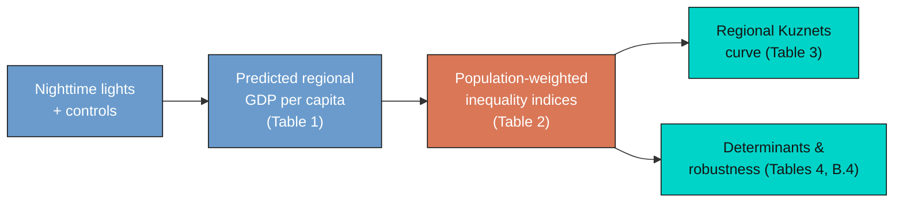

Reading the diagram left to right, light becomes income (blue), income becomes inequality
(orange), and inequality becomes the object of study (teal). Each arrow is a modelling
choice we will make explicit and reproduce. By the end you will be able to defend every
number on the page.

In this tutorial you will:

- **Predict** regional GDP per capita from nighttime lights and controls, and form the
  predictions explicitly.
- **Construct** five population-weighted inequality indices from first principles, and see
  exactly how population weights change the answer.
- **Explore** the cross-country dynamics of regional inequality across time and world
  regions.
- **Estimate** the regional Kuznets curve, its determinants, and a spatially-robust
  standard error using PyFixest.
- **Distinguish** a prediction model from a causal claim, and a fixed-effects estimate from
  a random-effects one.

## 2. Key concepts at a glance

The post reuses a small vocabulary. The **definition** under each term is always visible;
the **example** and **analogy** sit behind clickable cards — open them when a term feels
slippery.

**1. Nighttime lights as an income proxy.**
The brightness a satellite records over a place at night, used as a stand-in for that
place's economic output. Lights correlate with income because electricity use, roads, and
activity all glow. They are imperfect — deserts and oil flares mislead — which is why we
*predict* income from light rather than equate the two.

<div class="concept-pair">
<details class="concept-card concept-example">
<summary>Example</summary>

The raw correlation between a region's nighttime brightness and its observed income is
strong but noisy; turning brightness into a predicted income (Table 1) more than doubles
its usefulness for measuring inequality (Gini correlation 0.49 vs 0.21).

</details>

<details class="concept-card concept-analogy">
<summary>Analogy</summary>

Like guessing a household's wealth from its electricity bill. Useful on average, wrong for
the off-grid farmer and the crypto miner, but good enough to rank neighbourhoods.

</details>
</div>

**2. Light-to-GDP elasticity** $\beta\_1$.
The percent change in predicted regional GDP per capita for a 1% change in light per
pixel, holding controls fixed. It is the slope of the calibration model and the single
most important number in the prediction step.

<div class="concept-pair">
<details class="concept-card concept-example">
<summary>Example</summary>

In the preferred specification the elasticity is $\beta\_1 = 0.102$: a 10% brighter region
is predicted to be about 1% richer, once national income and geography are controlled for.

</details>

<details class="concept-card concept-analogy">
<summary>Analogy</summary>

The exchange rate between "lumens" and "dollars". A small number, because national income
already does most of the conversion; light fine-tunes the regional detail.

</details>
</div>

**3. Population-weighted inequality index.**
A summary of how unequally income is spread across a country's regions, where each region
counts in proportion to how many people live there. The post uses the Gini, three
generalized-entropy indices, and the coefficient of variation.

<div class="concept-pair">
<details class="concept-card concept-example">
<summary>Example</summary>

Germany 2010, built from its 16 regions, has a population-weighted Gini of 0.028 — low,
because German regions are close in income and the populous ones sit near the average.

</details>

<details class="concept-card concept-analogy">
<summary>Analogy</summary>

A class grade that weights each student by attendance. A brilliant student who shows up
once barely moves the class average; the regulars set it.

</details>
</div>

**4. The role of population weights.**
Whether each region counts once (equal weight) or by its population changes the inequality
number. Weighting ties the index to where people actually live, which is the
policy-relevant quantity.

<div class="concept-pair">
<details class="concept-card concept-example">
<summary>Example</summary>

Across country-years the weighted and unweighted Gini correlate 0.75; weighting lowers the
average Gini by about 0.003, because tiny extreme regions lose influence.

</details>

<details class="concept-card concept-analogy">
<summary>Analogy</summary>

Voting by headcount versus by district. A near-empty district and a megacity count equally
in the second system; population weighting is the first.

</details>
</div>

**5. The spatial Kuznets curve.**
The hypothesis that regional inequality rises during early development, then falls as
countries converge internally — an inverted U (or, with a third act at high income, an N)
in inequality against log GDP per capita.

<div class="concept-pair">
<details class="concept-card concept-example">
<summary>Example</summary>

The cubic in log income has coefficients $0.293 / -0.032 / 0.001$, tracing a rise, a fall,
and a faint upturn — an N-shape with country and period fixed effects.

</details>

<details class="concept-card concept-analogy">
<summary>Analogy</summary>

A country's internal road trip: the gap between regions widens leaving the village, narrows
approaching the city, and frays again in the sprawling suburbs of the very rich.

</details>
</div>

**6. Conley (spatial-HAC) standard errors.**
Standard errors that allow nearby regions' errors to be correlated, because a shock to one
region usually spills into its neighbours. They are wider — and more honest — than the
default that treats each region as independent.

<div class="concept-pair">
<details class="concept-card concept-example">
<summary>Example</summary>

The light elasticity's standard error rises from 0.013 (independent) to 0.026–0.037
(Conley, 1,000–5,000 km), but the estimate of 0.190 still sits far from zero.

</details>

<details class="concept-card concept-analogy">
<summary>Analogy</summary>

Counting independent witnesses. If ten "witnesses" all heard the same rumour, you really
have one fact, not ten; Conley errors discount correlated neighbours.

</details>
</div>

## 3. Setup and imports

We use **pandas** and **numpy** for data work, **matplotlib** for figures,
[**PyFixest**](https://py-econometrics.github.io/pyfixest/) for the panel fixed-effects
regressions (its `feols` mirrors the R package `fixest`), **linearmodels** for the one
random-effects table PyFixest cannot estimate, and **statsmodels** for a convenience
regression behind one figure. PyFixest needs Python 3.10 or newer.

```python
import numpy as np                              # arrays and math
import pandas as pd                             # data frames (tables)
import matplotlib.pyplot as plt                 # figures
import pyfixest as pf                           # fixed-effects / OLS regressions
from linearmodels.panel import RandomEffects    # the one random-effects model (Section 6)
import statsmodels.formula.api as smf           # a convenience regression (one figure)

# Site colour palette (used in every figure)
STEEL, ORANGE, INK, TEAL = "#6a9bcc", "#d97757", "#141413", "#00d4c8"
np.random.seed(42)                              # make any randomness reproducible
```

The site palette keeps the figures consistent: steel blue for primary data, warm orange for
fitted lines and reference lines, near-black for the curves we want to stand out. With the
tools loaded, we point at the data.

We load the bundled CSVs straight from GitHub so the notebook runs unchanged in Google
Colab, falling back to a local `data/` folder when you run it offline.

```python
BASE = ("https://raw.githubusercontent.com/cmg777/starter-academic-v501/"
        "master/content/post/python_kuznets_dmsp/data/")

def load(name):
    """Read a bundled CSV from GitHub, falling back to a local data/ copy."""
    try:
        return pd.read_csv(BASE + name)
    except Exception:
        return pd.read_csv("data/" + name)
```

The `load` helper means every reader — on Colab, on a laptop, online or offline — gets the
same data with no manual downloads. Next we read the files and look at their shapes.

## 4. The data: sources and construction

This section documents the data behind every number in the post: what each file is for, where
each variable originally came from, how it was constructed, and what it looks like
descriptively. Everything traces back to Lessmann and Seidel (2017). The exhaustive,
column-by-column reference — construction, original source, units, and time–country coverage
for **all six files** — lives in [Appendix A](#appendix-a-data-dictionary); this section gives
the readable tour.

### 4.1 Three views of the world

The replication ships three "views" of the same world. The **region-year** files
(`Prediction_Data.csv`, `Table_2_data.csv`, `Table_B4_data.csv`) describe individual
subnational regions: their lights, their observed and predicted income, their populations
and coordinates. The **country-year** files (`Table_3_data.csv`, `Table_4_data.csv`,
`Figure_5_data.csv`) describe whole countries, each already carrying the inequality indices
computed from its regions. We read all six.

```python
# --- load all six bundled CSVs (comment = unit of observation + purpose) ----
pred = load("Prediction_Data.csv")   # region-year: lights -> GDP training set
t2   = load("Table_2_data.csv")      # region-year: inequality-index inputs
t3   = load("Table_3_data.csv")      # country-year: Kuznets data
t4   = load("Table_4_data.csv")      # country-year: determinants
tb4  = load("Table_B4_data.csv")     # region-year: lat/lon for spatial errors
f5   = load("Figure_5_data.csv")     # country-year: regional vs personal Gini

# --- print each file's shape: rows (observations) x columns (variables) -----
for name, df in [("Prediction_Data", pred), ("Table_2_data", t2),
                 ("Table_3_data", t3), ("Table_4_data", t4),
                 ("Table_B4_data", tb4), ("Figure_5_data", f5)]:
    print(f"{name:16s} {df.shape[0]:5d} rows x {df.shape[1]:2d} cols")
```

```text
Prediction_Data   5258 rows x 30 cols
Table_2_data      5258 rows x  8 cols
Table_3_data      3675 rows x  9 cols
Table_4_data      3675 rows x 17 cols
Table_B4_data     5258 rows x 14 cols
Figure_5_data     3675 rows x  5 cols
```

The region-year files each hold 5,258 rows — these are the 1,504 regions, in 81 countries,
that have *both* an observed GDP figure and a light reading, the sample used to calibrate
the lights model. The country-year files hold 3,675 rows spanning 180 countries and the
years 1992–2012. Keeping the two units straight is essential: we calibrate and predict at
the region level, then measure inequality and run the Kuznets regressions at the country
level.

### 4.2 The six files at a glance

Six CSVs, each a tidy panel keyed by country (and, for the region files, by region) and year.
The complete column inventory for every file is in [Appendix A.1](#a1-the-six-datasets-in-detail);
here is what each file is *for* and what it carries.

- **`Prediction_Data.csv`** — *region-year* (5,258 × 30; 1,504 regions in 81 countries; 1992–2010).
  **Purpose:** the training sample that calibrates the light→income model (Table 1). These are the
  regions that have *both* an observed GDP figure (Gennaioli et al. 2014) and a light reading.
  **Components:** identifiers (`Country_ISO`, `code_Coutry_Region`, `id_t_j` = year+ISO); observed
  income (`GDP_pc_Region`, `log_GDP_pc_Region`); the model regressors (`log_Light_ppix_Region`,
  `log_GDP_pc_Country`, log top-/low-coded pixel counts, `log_area`, `log_region`, their
  interaction); World-Bank region-group dummies (`eap`…`ssa`); satellite-configuration dummies
  (`satyear_1`–`satyear_7`).
- **`Table_2_data.csv`** — *region-year* (5,258 × 8; same training frame). **Purpose:** inputs to
  *validate* the inequality indices — it pairs predicted and observed regional income with
  region/country light and population. **Components:** `pred_GDP_pc_Region`, `GDP_pc_Region`,
  `Light_Region`, `Light_Country`, `Pop_Region`, `Pop_Country`.
- **`Table_3_data.csv`** — *country-year* (3,675 × 9; 180 countries; 1992–2012). **Purpose:** the
  Kuznets dataset — national income plus the five population-weighted inequality indices built from
  predicted regional income. **Components:** `GDP_pc_Country` and `GINIW_`, `COVW_`, `GE_1W_`,
  `GE_0W_`, `GE_m1W_pred_GDP_pc`.
- **`Table_4_data.csv`** — *country-year* (3,675 × 17; 180 countries; 1992–2012). **Purpose:** the
  determinants dataset — the Kuznets variables plus the structural correlates of regional
  inequality. **Components:** `GINIW_pred_GDP_pc`, `GDP_pc_Country`, `Pop_Country`, and the
  determinants `Resources_rents_share_of_GDP`, `Arable_land`, `Trade_GDP_share`, `FDI_share_of_GDP`,
  `area`, `price_gasoline`, `Aid`, `School_enrollment_secondary`, `GINIW_Eth_light`, `Polity2`,
  `fedelupd2`.
- **`Table_B4_data.csv`** — *region-year* (5,258 × 14; training frame). **Purpose:** the
  spatial-robustness dataset — it adds each region's centroid so the Conley spatial-HAC standard
  errors (§11) can down-weight distant regions. **Components:** `Latitude`, `Longitude`,
  `log_GDP_pc_Region`, `log_Light_ppix_Region`, `satyear_1`–`satyear_7`.
- **`Figure_5_data.csv`** — *country-year* (3,675 × 5; 180 countries; 1992–2012). **Purpose:** the
  regional-versus-personal comparison (§12) — it sets the regional Gini beside a national
  interpersonal income Gini. **Components:** `GINIW_pred_GDP_pc` and `Giniall` (the personal Gini,
  observed for only 153 countries / 1,330 country-years).

### 4.3 How the key variables were built

Every variable above is the end of a construction chain that begins with raw satellite imagery
and public databases; tracing that chain is what makes the numbers interpretable.

- **Nighttime lights.** The light data are the DMSP-OLS *stable lights* product processed by the
  U.S. NOAA/National Geophysical Data Center: a digital number from 0 (dark) to 63 (saturated) for
  every ≈0.86 km² pixel, available annually from 1992. The authors average the light per pixel
  within each region and, following Hodler and Raschky (2014), add 0.01 where a region would
  otherwise read zero so the log is defined. Two censoring problems matter — bright cities
  top-code at 63, sparse areas bottom-code at 0 — which is why the prediction model also carries
  the counts of top- and low-coded pixels.
- **Sub-national boundaries.** Regions are the 1st-level administrative units (states, provinces,
  cantons) from the GADM database — roughly OECD TL2 / EUROSTAT NUTS1 — 3,166 regions across 180
  countries. The gridded light and population rasters are aggregated to these polygons.
- **Observed regional income.** The observed regional GDP per capita used to *train* the model
  comes from Gennaioli et al. (2014): GDP per capita in constant 2005 PPP US\\$ for 1,503 regions
  in 82 countries, an unbalanced panel built from OECD, national-statistics, and
  human-development-report sources.
- **Population.** Regional population comes from the Gridded Population of the World (GPW) v3 raster
  (CIESIN): population density times region area, rounded up so the minimum is one, with the
  5-year survey waves interpolated to annual values.
- **Predicted regional income.** Because observed regional income exists for only ~80 countries,
  the model in §6 regresses log observed regional income on log light per pixel plus controls
  (country income, top-/low-coded pixel counts, number of regions, area and their interaction, and
  World-Bank region-group and satellite fixed effects) on the training sample, then *predicts*
  regional income for all 3,166 regions in 180 countries (1992–2012). The calibrated light
  elasticity is 0.102. Country-level controls come from the World Bank's World Development
  Indicators (WDI) and the CIA World Factbook.
- **Inequality indices.** From the predicted regional incomes, §7 builds five population-weighted
  indices per country-year — the Gini (`GINIW`), the coefficient of variation (`COVW`), and the
  generalized-entropy family GE(−1), GE(0) = mean log deviation, GE(1) = Theil — each weighting a
  region by its share of the national population so sparsely-populated outliers (e.g. Canada's
  Northern Territories) do not dominate.
- **Determinants.** The structural correlates in §10 are mostly WDI series — resource rents,
  arable-land share, trade and FDI shares, the gasoline pump price, net aid, and secondary-school
  enrolment — plus the Polity IV democracy score (Center for Systemic Peace, rescaled to
  \[−1, +1]), a federalism dummy, and an *ethnic-inequality* index that applies the same
  population-weighted light-Gini to ethnic homelands (GREG geo-referencing, Weidmann et al. 2010;
  method of Alesina et al. 2016).

### 4.4 Descriptive statistics

With the variables defined, two summary tables give their shape — **every substantive variable**,
split by unit of observation (region files 1992–2010, country files 1992–2012). Because the data are
panels, each statistic — **mean, median, sd, min and max** — is reported **twice: for the initial
year and the final year**. That way the table shows not just the level of each variable but how its
whole distribution shifted over two decades. The tables are built with
[`maketables`](https://github.com/py-econometrics/maketables).

```python
import maketables as mt
# for every substantive variable: mean/median/sd/min/max in the initial vs final
# panel year, paired by statistic in a 2-level column header
region_stats  = summarise_panel(region_spec,  1992, 2010)   # 14 region-level variables
country_stats = summarise_panel(country_spec, 1992, 2012)   # 19 country-level variables
mt.MTable(country_stats).make("html")            # professional HTML; see script.py
```





The initial-vs-final columns make the dynamics explicit. At the region level, both observed and
predicted GDP per capita shift up markedly over the two decades, while the predicted distribution
stays narrower than the observed one — the lights model smooths the extremes. At the country level
the regional Gini drifts **down** (mean 0.070 in 1992 → 0.061 in 2012) even as mean GDP per capita
**rises** (\\$9,962 → \\$14,892) — the convergence §5 will formalise. The determinants are where to
be careful: several are **sparsely observed** — the gasoline price, the personal income Gini,
secondary enrolment and net aid cover far fewer country-years than the core panel (their per-variable
coverage is tabulated in [Appendix A](#appendix-a-data-dictionary)), which is exactly why §10's
determinant regressions run on shifting subsamples. §4.5 now makes the time dynamics visual.

### 4.5 Exploratory data analysis

Summary tables compress each variable to a few numbers; they hide how the *whole distribution* moves
over time. A **box-plot over time** restores that. We bin the years into the same five 5-year periods
used later in the Kuznets regressions (§8) and, for each period, draw a box of the variable's
distribution across units (each unit contributes its period mean). Reading a row of boxes
left-to-right shows the **time dynamics**; the height of each box shows the **cross-sectional spread**
in that period. We do this once for the region-level variables and once for the country-level ones,
so you can get a feel for every dataset.

```python
# one box per 5-year period; box = cross-sectional distribution of unit period-means
def period_boxes(ax, df, unit, col, logy=False):
    df = df.assign(p=pd.cut(df.year, [1989, 1994, 1999, 2004, 2009, 2014],
                            labels=["90–94", "95–99", "00–04", "05–09", "10–14"]))
    g = df.groupby([unit, "p"], observed=True)[col].mean().reset_index()
    ax.boxplot([g.loc[g.p == c, col].dropna() for c in g.p.cat.categories], showfliers=False)
    if logy:
        ax.set_yscale("log")
# ... 2x2 region panels + 2x4 country panels; see script.py for the full builder
```

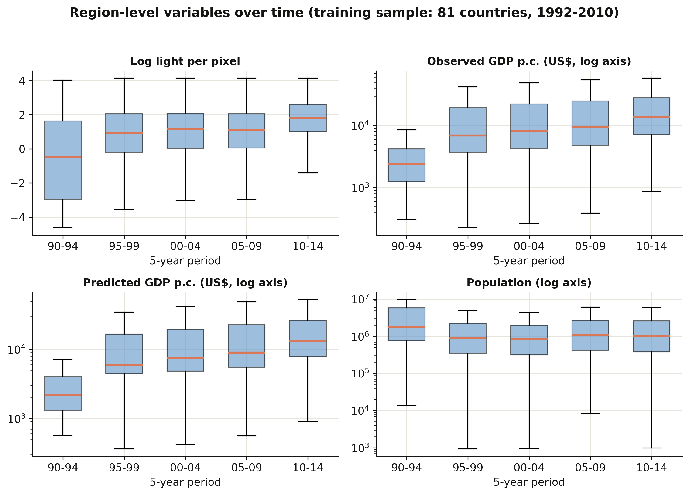

The region-level panels (from `Prediction_Data` and `Table_2`, the 81-country training sample) tell a
clear growth story: **log light per pixel** and both **observed and predicted GDP per capita** shift
upward period by period — median region income rises more than fivefold, from about \\$2,400 in
1990–94 to \\$13,800 in 2010–14 — while **regional population** is broadly flat with an enormous spread
(regions span five orders of magnitude). The light and income boxes also *widen* over time, a reminder
that the DMSP sensors read brighter in later years.

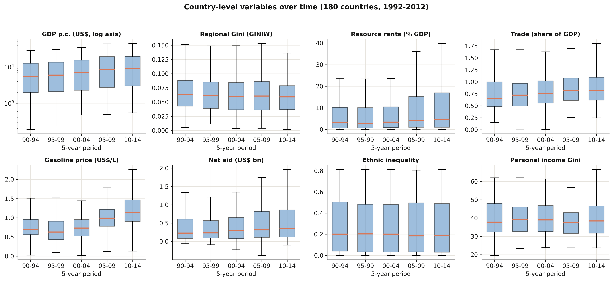

The country-level panels pull from three datasets — `Table_3` (GDP and the regional Gini), `Table_4`
(the determinants), and `Figure_5` (the personal Gini). Country GDP per capita rises steadily; the
**regional Gini** is strikingly stable around 0.06 with a slowly narrowing spread (the convergence §5
will quantify); **gasoline prices** and **trade shares** drift upward; **resource rents** and **net
aid** are heavily right-skewed with fat upper tails in every period; and the **personal income Gini**
edges down. Two cautions the boxes make obvious: the determinants are noisier and patchier than the
core variables (recall their thinner coverage, §4.4), and the region-level boxes describe only the
81-country training subsample, not all 180 countries.

With the data documented, we look at how inequality behaves across countries.

## 5. Cross-country dynamics of inequality

Before predicting or regressing anything, it pays to *see* the data. This section maps the
landscape: how the key variables are distributed, how regional inequality has moved over two
decades, how it differs across world regions, and how the five inequality indices relate to
one another. Every chart here is descriptive — it raises the questions the later models try
to answer.

### 5.1 Distributions of the key variables

We begin with three histograms: the log of nighttime light per pixel and the log of
regional GDP per capita (both at the region level), and the population-weighted regional
Gini (at the country level). Looking at distributions first tells us whether variables are
skewed, bounded, or multi-modal — facts that shape the models we can fit.

```python
# three histograms side by side; .dropna() drops missing values before plotting
fig, axes = plt.subplots(1, 3, figsize=(12, 3.6))
axes[0].hist(pred["log_Light_ppix_Region"].dropna(), bins=40, color=STEEL)   # log light
axes[1].hist(np.log(pred["GDP_pc_Region"].dropna()), bins=40, color=ORANGE)  # log region income
axes[2].hist(t3["GINIW_pred_GDP_pc"].dropna(), bins=40, color=TEAL)          # regional Gini
# ... titles and labels omitted for brevity (see script.py)
fig.savefig("python_kuznets_dmsp_01_distributions.png", dpi=300)

print("GINIW: mean={:.3f}, median={:.3f}, max={:.3f}".format(
    t3["GINIW_pred_GDP_pc"].mean(), t3["GINIW_pred_GDP_pc"].median(),
    t3["GINIW_pred_GDP_pc"].max()))
```

```text
GINIW: mean=0.064, median=0.061, max=0.163
```

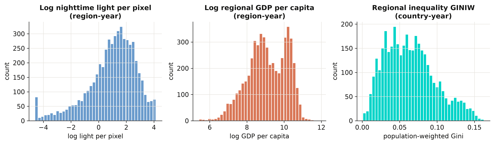

Log light and log income are both roughly bell-shaped — taking logs tames their heavy right
skew, which is why the calibration model in Section 6 works in logs. The regional Gini is
right-skewed and bounded below by zero, with a mean of 0.064 and a maximum of 0.163: most
countries are internally fairly equal, but a long tail of countries has very uneven regions.
That tail is what the rest of the post is about.

### 5.2 Inequality and income over time

Has regional inequality risen or fallen as the world grew richer? We average the regional
Gini and log GDP per capita across all countries in each year from 1992 to 2012 and plot
them on a shared timeline. Plotting the two series together previews the Kuznets question:
do they move in the same direction or in opposite directions?

```python
# Read this pandas chain top to bottom:
yr = (t3[(t3.year >= 1992) & (t3.year <= 2012)]           # 1. keep years 1992-2012
      .assign(logGDP=lambda d: np.log(d.GDP_pc_Country))  # 2. add a log-income column
      .groupby("year")                                    # 3. one group per year
      .agg(GINIW=("GINIW_pred_GDP_pc", "mean"),           # 4. average the Gini each year ...
           logGDP=("logGDP", "mean"))                     #    ... and the log income too
      .reset_index())
print(yr.iloc[[0, -1]].round(4).to_string(index=False))   # show the first & last year
```

```text
 year   GINIW  logGDP
 1992  0.0702  8.5969
 2012  0.0612  8.9956
```

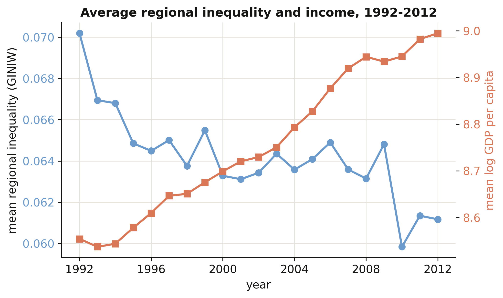

As average world income climbed (orange, rising), average regional inequality fell from
0.070 in 1992 to 0.061 in 2012 (steel, declining). Globally, then, growth and *falling*
within-country inequality went together over this period — a first hint that, on the
downward arm of the Kuznets curve, development narrows regional gaps. But an average hides
enormous variation across regions of the world, which we look at next.

### 5.3 Inequality across world regions

We group countries into the World Bank's regions and draw a box plot of the regional Gini
for each. A box plot shows the median (the orange line), the middle half of countries (the
box), and the spread (the whiskers), so we can compare both typical levels and dispersion
across world regions at a glance.

```python
country_group = (pred.assign(g=pred.filter(["eap","eca","lac","mena","sa","ssa"])
                 .idxmax(axis=1)))   # each region's World Bank group
eda = t3.copy()
eda["wb_group"] = eda["Country_ISO"].map(country_group_lookup)  # see script.py
print(eda.groupby("wb_group")["GINIW_pred_GDP_pc"].median().sort_values().round(4))
```

```text
N. America & high-inc.     0.0385
Europe & Central Asia      0.0421
South Asia                 0.0451
Mid. East & N. Africa      0.0585
Latin America & Carib.     0.0724
East Asia & Pacific        0.0780
Sub-Saharan Africa         0.0962
```

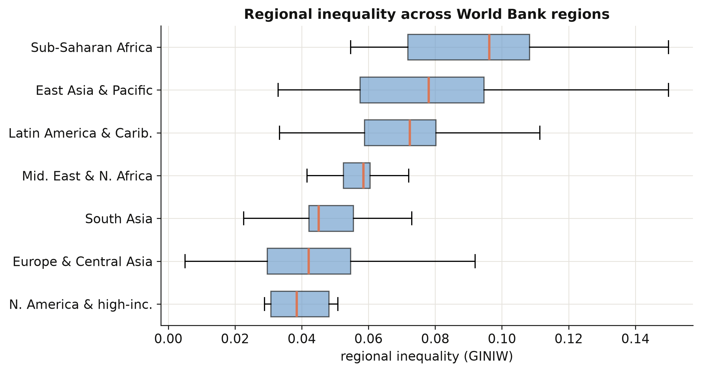

The ordering is striking. Sub-Saharan Africa has the highest median regional inequality
(0.096) — two and a half times that of North America and high-income countries (0.039) — with
East Asia and Latin America close behind. Rich regions are not only richer on average; their
*internal* income map is far more even. This cross-section already sketches the downward arm
of a Kuznets relationship, which Section 8 will estimate properly.

### 5.4 How the five indices co-move

The paper measures inequality five ways: the Gini, the coefficient of variation (CV), and
three generalized-entropy indices — GE(−1), GE(0) (the mean log deviation), and GE(1) (the
Theil index). Do they tell the same story? We compute their correlation matrix across all
country-years. If the indices co-move tightly, our headline Gini results will not hinge on
that particular choice.

```python
IDX = ["GINIW_pred_GDP_pc", "COVW_pred_GDP_pc", "GE_1W_pred_GDP_pc",
       "GE_0W_pred_GDP_pc", "GE_m1W_pred_GDP_pc"]
cmat = t3[IDX].corr()
print("corr(Gini, CV)   = %.3f" % cmat.iloc[0, 1])
print("corr(Gini, Theil)= %.3f" % cmat.iloc[0, 2])
```

```text
corr(Gini, CV)   = 0.969
corr(Gini, Theil)= 0.927
```

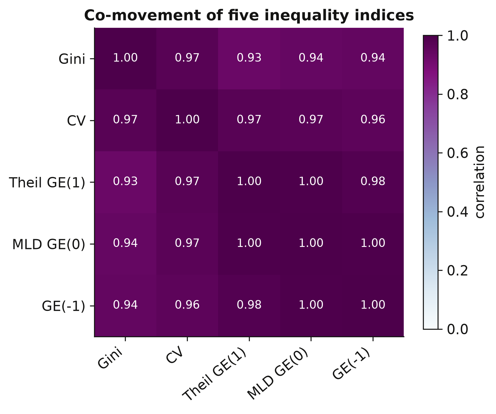

All five indices correlate above 0.9 — the Gini and the CV move almost in lockstep (0.97).
This is reassuring: whichever index we lead with, the qualitative findings will be the same,
so the Gini's prominence below is a matter of convention, not of cherry-picking. With the
landscape mapped, we turn to the engine of the whole exercise — turning light into income.

## 6. Predicting GDP from nighttime lights

This is the first of the two construction stages, and the foundation of everything that
follows. The goal is a **prediction model**: feed it a region's nighttime brightness plus a
handful of controls, and it returns a guess of that region's income. Once the model is trained
on the regions where we *do* observe income, we can turn it loose on the tens of thousands of
regions where we *do not* — which is the whole reason the satellite data is so valuable. We
build the model exactly as Table 1 of the paper does, calibrating it on the 1,504 regions that
have observed income.

Why should light predict income at all? At night, economic activity — factories, offices, lit
streets, houses with electricity — shows up from space as brightness, and richer places tend
to be brighter. The relationship is far from perfect (an oil field flares brightly with almost
no one around; a dense but poor city can be dim), which is exactly why we add controls and,
later, measure how good the predictions really are.

### 6.1 The idea: light as a proxy for income

We regress the **log of a region's GDP per capita** on the **log of its light per pixel**,
plus controls that soak up everything brightness should *not* be given credit for — the
country's overall income level, geography, the satellite generation, and the broad world
region. Working in logs lets us read the slope as an **elasticity**: a percentage change in
light maps to a percentage change in income. Formally:

$$y\_r = \beta\_0 + \beta\_1 \ell\_r + \beta\_2 g\_c + \gamma' X\_r + \mu\_g + \tau\_s + \varepsilon\_r$$

Reading the equation one term at a time, with the dataset column name in parentheses:

- $y\_r$ — **log regional GDP per capita** (`log_GDP_pc_Region`): the outcome we want to
  predict, for region $r$.
- $\beta\_1 \ell\_r$ — the **light elasticity** $\beta\_1$ times **log light per pixel**
  (`log_Light_ppix_Region`). This is the one coefficient we truly care about: how strongly
  brightness tracks income once everything else is held fixed.
- $\beta\_2 g\_c$ — an adjustment for **log national GDP per capita** (`log_GDP_pc_Country`)
  of region $r$'s country $c$. Without it, light would be unfairly credited with gaps that are
  really just rich-country-versus-poor-country differences.
- $\gamma' X\_r$ — the **geography controls** (`log_area`, the number of regions `log_region`,
  their interaction `log_region_X_log_area`, and two pixel-saturation counts
  `log_N_pix_top_cod_1_ppix` / `log_N_pix_low_cod_1_ppix`). These absorb the fact that a
  physically huge region, or one whose brightest pixels are "topped out" at the sensor's
  maximum, registers light differently for reasons that have nothing to do with being rich.
- $\mu\_g$ — a **world-region fixed effect** (`group_id`, e.g. Sub-Saharan Africa, Latin
  America): a separate baseline for each broad region, soaking up whatever makes a whole
  continent systematically brighter or dimmer.
- $\tau\_s$ — a **satellite-generation fixed effect** (`satyear`): different satellites and
  years calibrate brightness differently, and this term absorbs those technical differences.
- $\varepsilon\_r$ — everything left over.

Each control answers a specific *"but couldn't that gap just be …?"* objection. Drop the
national-income term and $\beta\_1$ would partly pick up *between-country* wealth gaps; drop
the satellite effect and it would partly pick up *sensor* changes. What survives on $\beta\_1$
is the part of the brightness–income link we can actually defend.

A quick feel for the magnitude: an elasticity of, say, $0.10$ means a region that is **twice
as bright** (a 100% increase in light) is predicted to be only about 7% richer, since
$2^{0.10}\approx 1.07$. Light moves far more than income — brightness is a noisy proxy, useful
on average but nowhere near one-for-one.

### 6.2 Building the model up, one control at a time

The paper does not jump straight to the full model. It builds up in seven steps, each adding a
fixed effect or a control, so we can *watch the light elasticity change* as more is held
fixed. That progression is itself the lesson: it reveals how much of the raw brightness–income
link is real, and how much was just rich-versus-poor confounding. We estimate each step with
PyFixest (`pf.feols`), which fits ordinary least squares with optional fixed effects.

Two pieces of PyFixest syntax for newcomers. Anything after the `|` in the formula is a
**fixed effect** — a separate intercept for every value of that column, swept out of the data
before the slope is estimated. And `vcov={"CRV1": "Country_ISO"}` asks for **standard errors
clustered by country**: it tells the model that regions in the same country are not
independent observations, so it should not over-state how precise the estimates are.

First we build the two label columns the fixed effects need:

```python
# --- Step 1: build the categorical columns the fixed effects need ----------
# PyFixest wants ONE label column per fixed effect (not a wall of 0/1 dummies).

# satyear_1 ... satyear_7 are 0/1 flags; fold them into a single 1-7 code.
pred["satyear"] = sum(i * pred[f"satyear_{i}"] for i in range(1, 8)).astype(int)

# eap/eca/.../ssa are 0/1 world-region flags. idxmax(axis=1) returns, for each
# row, the NAME of the column that equals 1 -- i.e. it turns the one-hot dummies
# back into a single world-region label per region.
pred["group_id"] = pred.filter(["eap", "eca", "lac", "mena", "sa", "ssa"]).idxmax(axis=1)
```

Now the ladder. We show four rungs — pooled, region fixed effects, plus national income, and
the full model — and print the light elasticity at each:

```python
# --- Step 2: the ladder of specifications (each rung adds something) --------
GEO = ("log_N_pix_top_cod_1_ppix + log_N_pix_low_cod_1_ppix + log_area + "
       "log_region + log_region_X_log_area")                # the geography controls
specs = {
  # rung 1: pooled OLS, no fixed effects -- the raw, confounded correlation
  1: "log_GDP_pc_Region ~ log_Light_ppix_Region",
  # rung 2: + region & satellite FE -> the clean WITHIN-region elasticity
  2: "log_GDP_pc_Region ~ log_Light_ppix_Region | code_Coutry_Region + satyear",
  # rung 4: + national income, so light is not credited with rich-vs-poor gaps
  4: "log_GDP_pc_Region ~ log_Light_ppix_Region + log_GDP_pc_Country | Country_ISO + satyear",
  # rung 7: + all geography controls and world-region FE -- the full model
  7: f"log_GDP_pc_Region ~ log_Light_ppix_Region + log_GDP_pc_Country + {GEO} | group_id + satyear",
}

# --- Step 3: fit each rung and read off the light elasticity ----------------
for k, fml in specs.items():
    m = pf.feols(fml, data=pred, vcov={"CRV1": "Country_ISO"})   # cluster by country
    print(f"col {k}: light elasticity = {m.coef()['log_Light_ppix_Region']:.3f}")
```

```text
col 1: light elasticity = 0.359
col 2: light elasticity = 0.190
col 4: light elasticity = 0.131
col 7: light elasticity = 0.049
```

Watch the elasticity fall as we climb the ladder. The **pooled** estimate of 0.359 (column 1)
blends two very different comparisons: brighter-versus-dimmer regions *within* a country, and
richer-versus-poorer *countries*. Adding **region fixed effects** (column 2) discards the
cross-region comparison and keeps only the within-region one — the elasticity drops to 0.190.
This is the *clean within-region* number, and it is the one Section 11 later stress-tests for
spatial correlation. Adding **national income** (column 4, 0.131) strips out what was really a
country-level wealth effect, and the **full model** with every geography control (column 7,
0.049) leaves only the thin sliver of variation that survives after region, country, and
continent are all accounted for.

So which number is "right"? It depends on what we plan to do with the model — and that turns
on the choice between **fixed effects** and **random effects**. That choice is important
enough, and is the estimator the paper actually publishes, that it gets its own section.

### 6.3 Fixed effects vs random effects — and why prediction needs random effects

This is the conceptual core of the whole construction, so we will take it slowly. Both
estimators fit the *same* equation; they differ in **what variation they use** and — crucially
for us — in **whether the fitted model can be applied to a brand-new region**.

**Fixed effects (FE)** give every region its own intercept and then compare a region only to
*itself over time*. Every difference *between* regions is swept away as a nuisance. This is
wonderfully safe: anything permanent about a region — its terrain, its history, its
institutions — is automatically controlled for, even things we never measured. But there is a
price. The region intercepts are estimated *only* for regions in the training sample. Show a
fitted FE model a region it has never seen, and it has no intercept for that region; it
literally cannot produce a prediction.

**Random effects (RE)** instead treat each region's intercept as a **random draw from a common
distribution** with one estimated mean and variance. Because the region effect is now
summarised by a couple of shared parameters rather than one free intercept per region, the
model can use *both* the within-region variation (changes over time) *and* the between-region
variation (richer-versus-poorer regions). The payoff is decisive: RE produces **one
coefficient vector that applies to any region**, in the sample or out of it — so we can
predict income for the tens of thousands of regions that have no income statistics at all.

| | **Fixed effects** | **Random effects** (used by the paper) |
|---|---|---|
| Uses which variation? | within-region only | within **and** between region |
| Controls unobserved region traits? | yes, automatically | only if uncorrelated with the regressors |
| Predict for a new, unseen region? | **no** (no intercept for it) | **yes** — one shared model |
| Use of the data | discards between-region signal | more efficient |
| Key assumption | none on the region effect | region effect uncorrelated with regressors |

For the paper's goal — drawing a global income map by predicting *every* region on Earth —
fixed effects are simply not an option, and that is exactly why **the published Table 1 uses
random effects**. PyFixest does only FE/OLS, so for this one step we switch to
`linearmodels.RandomEffects`. Let us build the random-effects fit slowly, in four steps.

```python
# --- Step 1: tell the estimator the panel structure ------------------------
# A "panel" = the same units (regions) observed over several years. Indexing by
# (region, year) tells RandomEffects which rows belong to the same region.
panel = pred.set_index(["code_Coutry_Region", "year"])
```

```python
# --- Step 2: cluster the standard errors by country ------------------------
# Regions in the same country move together, so we cluster on country: turn each
# country code into an integer label (one per row) for the clustered covariance.
clusters = pd.DataFrame(
    {"c": pd.Categorical(panel["Country_ISO"]).codes},
    index=panel.index,
)
```

```python
# --- Step 3: a small helper that fits the RE model for any set of regressors --
def re_fit(cols):
    # Always prepend a constant -- the shared baseline intercept ...
    X = pd.concat([pd.Series(1.0, index=panel.index, name="const")] + cols, axis=1)
    y = panel["log_GDP_pc_Region"]                  # outcome: log regional income
    # ... then fit random effects with country-clustered standard errors.
    return RandomEffects(y, X).fit(cov_type="clustered", clusters=clusters)
```

```python
# --- Step 4: fit the full (column-7) specification -------------------------
# Regressors: log light + log national income + the five geography controls,
# the world-region dummies, and the satellite-generation dummies.
re7 = re_fit([
    panel[["log_Light_ppix_Region", "log_GDP_pc_Country",
           "log_N_pix_top_cod_1_ppix", "log_N_pix_low_cod_1_ppix",
           "log_area", "log_region", "log_region_X_log_area"]],
    pd.get_dummies(panel["group_id"], drop_first=True).astype(float),  # world region
    panel[[f"satyear_{i}" for i in range(1, 8)]].astype(float),        # satellite
])
print("RE col 7 light elasticity        = %.3f" % re7.params["log_Light_ppix_Region"])
print("RE col 7 national-GDP elasticity  = %.3f" % re7.params["log_GDP_pc_Country"])
```

```text
RE col 7 light elasticity        = 0.102
RE col 7 national-GDP elasticity  = 0.889
```

The random-effects light elasticity in column 7 is **0.102** — exactly the paper's published
number — versus the **0.049** we got from fixed effects. Why is RE roughly twice as large?
Because it keeps the between-region information that the within estimator threw away: with
national income already absorbing most of the scale, the *between-region* spread is precisely
where light still earns its keep. The national-income elasticity of **0.889** confirms that a
region's income tracks its country's income almost one-for-one, with light supplying the
remaining subnational detail.

We report all seven specifications side by side below. The note records that the
random-effects elasticity is essentially identical to the FE/OLS estimate; column 2, the one
pure fixed-effects column, is where FE and RE coincide at 0.190.

```python
# --- the seven specifications side by side, as in the paper's Table 1 ------
import maketables as mt
et1 = mt.ETable(
    [fe_models[k] for k in range(1, 8)],
    head_order="d",                                # header: dependent variable + (1)-(7)
    labels={"log_GDP_pc_Region": "log regional GDP per capita", ...},  # readable names
    coef_fmt="b:.3f* (se:.3f)", show_fe=True,
)
et1.make("html")                                   # -> self-contained HTML table
```



### 6.4 Forming the predictions — and a worked example

A model is only useful if we can actually *predict* with it. Prediction here is mechanical:
take each region's characteristics, multiply them by the estimated random-effects
coefficients, and add everything up. That gives a **fitted log income**; because the model is
in logs, we **exponentiate** to get back to dollars.

```python
# --- Step 1: predicted LOG income = (design matrix) x (RE coefficients) -----
# X7 has one row per region-year and one column per regressor (plus the constant).
# The matrix product X7 @ beta applies the SAME coefficient vector to every region --
# this is what fixed effects could not do, and why we used random effects.
X7         = re_design([...])                                   # design matrix (see script.py)
fitted_log = X7.values @ re7.params.reindex(X7.columns).values  # X . beta

# --- Step 2: undo the log to get dollars, then check against reality --------
pred_pc = np.exp(fitted_log)                # predicted GDP per capita, in dollars
obs_log = panel["log_GDP_pc_Region"].values
r = np.corrcoef(fitted_log, obs_log)[0, 1]  # how close are predictions to observed income?
print(f"corr(predicted, observed log GDP per capita) = {r:.3f}")
```

```text
corr(predicted, observed log GDP per capita) = 0.925
```

**A worked example, by hand.** Imagine a region with log light per pixel
$\ell\_r = 1.5$ in a country with log national income $g\_c = 9.0$, and suppose (to keep it
simple) its geography controls and region/satellite effects net out to roughly zero. Using the
two headline coefficients, its predicted log income is about the shared constant, plus
$0.102 \times 1.5$ from light, plus $0.889 \times 9.0$ from national income. Notice how the
national-income term dominates: *most* of a region's predicted income comes from **which
country it is in**, while light nudges the estimate up or down to capture how that particular
region compares with its neighbours. Exponentiating the sum returns a figure in dollars. The
full model simply does this for all 5,258 region-years at once with the matrix product
`X7 @ beta`.

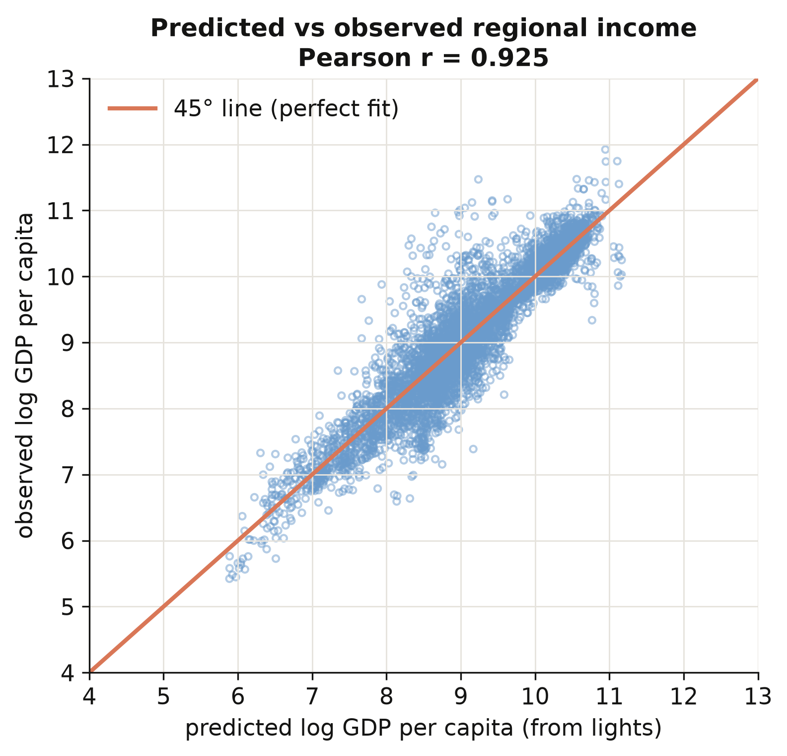

Predicted and observed log income correlate **0.925** across all 5,258 region-years, and the
scatter hugs the 45° line across four orders of magnitude of income (figure above). The model
is not just memorising one income band — it generalises from the poorest regions to the
richest. That is what licenses the paper's key move: applying these random-effects coefficients
to *every* region on Earth, including the tens of thousands with no income statistics, to build
a complete global income map. With predicted income in hand, we can finally measure inequality.

## 7. Constructing the inequality indicators

This is the second construction stage. We now have a predicted income for every region;
the task is to compress each country's many regional incomes into a single number that says
how unequal they are — and to do it in a way that respects population. We build the indices
from scratch so that nothing is a black box.

### 7.1 From many regional incomes to one number

Every index starts from the same three ingredients. Let region $i$ have income $y\_i$ and
population $w\_i$. The **population-weighted mean**, the **population shares**, and the
**relative incomes** are

$$\bar y = \frac{\sum\_i w\_i y\_i}{\sum\_i w\_i}, \qquad
  p\_i = \frac{w\_i}{\sum\_j w\_j}, \qquad
  r\_i = \frac{y\_i}{\bar y}.$$

In words, $\bar y$ is the average income a randomly chosen *person* (not region) lives in,
$p\_i$ is the share of the country's people in region $i$, and $r\_i$ is region $i$'s income
relative to the national average. In code, $y\_i$ is `pred_GDP_pc_Region`, $w\_i$ is
`Pop_Region`, and the indices below are all built from `p` and `r`. Weighting by population
is the key design choice: a region matters in proportion to how many people experience its
income.

A tiny example makes this concrete. Suppose a country has three regions with incomes
$y = (1, 2, 3)$ and equal populations $w = (1, 1, 1)$. Then the population-weighted mean is
$\bar y = (1+2+3)/3 = 2$, each population share is $p\_i = 1/3$, and the relative incomes are
$r = (0.5, 1.0, 1.5)$ — the poor region earns half the average, the rich one earns 1.5×. Every
index below is just a different way of summarising how far that vector $r$ spreads away from
$1$. If the three populations were *unequal* — say the rich region held most of the people —
the same incomes would produce a different mean and different shares, and the inequality
numbers would move accordingly. That is population weighting at work.

### 7.2 The five indices from scratch

The **Gini** is the average absolute income gap between two randomly chosen people, scaled
to lie in $[0, 1]$. The **generalized-entropy** family $GE(\alpha)$ varies in how sharply it
reacts to gaps at the top ($\alpha$ large) or bottom ($\alpha$ small) of the distribution,
and the **coefficient of variation** is the standard deviation over the mean. We implement
all five directly:

$$G = \frac{\sum\_i \sum\_j w\_i w\_j \, |y\_i - y\_j|}{2 \left(\sum\_i w\_i\right)^2 \bar y},
  \qquad
  GE(0) = \sum\_i p\_i \ln\!\frac{1}{r\_i}, \qquad
  GE(1) = \sum\_i p\_i \, r\_i \ln r\_i.$$

In words, the Gini $G$ sums the population-weighted absolute gaps $|y\_i - y\_j|$ between
every pair of regions and normalises by twice the squared population and the mean; $GE(0)$
(the mean log deviation) and $GE(1)$ (the Theil index) are population-weighted averages of
log relative income. A crucial coding detail: the Gini uses the **absolute difference**
$|y\_i - y\_j|$, summed over all pairs — not a product — which is the classic trap when
writing a weighted Gini by hand.

We build all five indices in a single function, `ineq_indices(y, w)`, where `y` is the vector
of regional incomes and `w` the vector of regional populations. Let us read it in three steps.

First, clean the inputs and form the three ingredients from §7.1:

```python
def ineq_indices(y, w):
    """Five population-weighted inequality indices from first principles."""
    # --- Step 1: clean the inputs ------------------------------------------
    y, w = np.asarray(y, float), np.asarray(w, float)
    ok = np.isfinite(y) & np.isfinite(w) & (w > 0) & (y > 0)   # drop missing / non-positive
    y, w = y[ok], w[ok]

    # --- Step 2: the three ingredients (mean, shares, relative incomes) -----
    sw = w.sum()                       # total population
    mu = (w * y).sum() / sw            # population-weighted mean income (ȳ)
    p  = w / sw                        # population shares (pᵢ, they sum to 1)
    r  = y / mu                        # relative incomes (rᵢ = yᵢ / ȳ)
```

Next, the four entropy-style indices. Each is a weighted average over `p` of some function of
`r`; they differ only in *which* function, which is what makes each one sensitive to a
different part of the distribution:

```python
    # --- Step 3a: the generalized-entropy family + coefficient of variation -
    ge_m1 = 0.5 * ((p * r**-1).sum() - 1)      # GE(-1): very sensitive to the poorest
    ge_0  = (p * (-np.log(r))).sum()           # GE(0)  = mean log deviation
    ge_1  = (p * r * np.log(r)).sum()          # GE(1)  = Theil index
    cv    = np.sqrt(2 * 0.5 * ((p * r**2).sum() - 1))   # coefficient of variation
```

Finally, the Gini. This is the one line worth slowing down on:

```python
    # --- Step 3b: the Gini = population-weighted average gap between people --
    # y[:, None] - y[None, :] builds the full matrix of pairwise income gaps:
    # entry (i, j) is yᵢ - yⱼ. np.abs makes them |yᵢ - yⱼ|; np.outer(w, w)
    # weights each pair by both populations. Summing and normalising gives Gini.
    gini = (np.abs(y[:, None] - y[None, :]) * np.outer(w, w)).sum() / (2 * sw**2 * mu)
    return dict(GINIW=gini, GE_m1W=ge_m1, GE_0W=ge_0, GE_1W=ge_1, COVW=cv)
```

Two things to flag for beginners. The expression `y[:, None] - y[None, :]` is a NumPy
*broadcasting* trick: it turns a length-$n$ vector into an $n\times n$ matrix of all pairwise
differences in one stroke, with no Python loop. And the classic trap when coding a weighted
Gini by hand is to forget the **absolute value** — the Gini sums $|y\_i - y\_j|$, the *size* of
each gap, not the signed difference or a product; drop the `np.abs` and the answer collapses to
zero.

This single function is the whole measurement apparatus. It takes a country-year's regional
incomes and populations and returns all five indices. Everything downstream — the Kuznets
curve, the determinants — is just these numbers, regressed. To trust them, we test the
function on a country we can reason about.

### 7.3 A worked example: Germany

Germany is a good test case: 16 regions of broadly similar income, so we expect a *low*
inequality number. We pull its 2010 regions and run them through the function by hand.

```python
# Pull Germany's 2010 rows, then feed its regional incomes + populations
# straight into the function we just wrote and print all five indices.
deu = t2[(t2.Country_ISO == "DEU") & (t2.year == 2010)]
print("regions:", len(deu))
print(ineq_indices(deu["pred_GDP_pc_Region"], deu["Pop_Region"]))
```

```text
regions: 16
{'GINIW': 0.0278, 'GE_m1W': 0.0017, 'GE_0W': 0.0016,
 'GE_1W': 0.0016, 'COVW': 0.0565}
```

Germany's 16 regions yield a population-weighted Gini of **0.028** — very low, as expected
for a country whose regions cluster near the national average. The Theil index (0.0016) and
the others agree on the same verdict. A concrete, hand-checkable number like this is the
sanity check that the formula is implemented correctly before we apply it to 180 countries.

### 7.4 The role of population weights

Does population weighting actually change anything? We recompute the Gini for every
country-year *without* weights — letting every region count once — and compare. This isolates
exactly what the weights do.

```python
# --- Step 1: an equal-weight Gini (same formula, but every region counts once) --
# Note what is missing versus ineq_indices: no population weights w, no np.outer.
def gini_unweighted(y):
    y = np.asarray(y, float); y = y[np.isfinite(y) & (y > 0)]
    n, mu = y.size, y.mean()
    return np.abs(y[:, None] - y[None, :]).sum() / (2 * n**2 * mu)

# --- Step 2: compare the two Ginis across every country-year -------------------
# `built` already holds the weighted GINIW and the equal-weight GINI_unw side by side.
corr_wu  = built["GINIW"].corr(built["GINI_unw"])          # do they even agree?
mean_gap = (built["GINIW"] - built["GINI_unw"]).mean()     # and in which direction?
print(f"corr(weighted, unweighted) = {corr_wu:.3f}")
print(f"mean(weighted - unweighted) = {mean_gap:+.4f}")
```

```text
corr(weighted, unweighted) = 0.747
mean(weighted - unweighted) = -0.0034
```

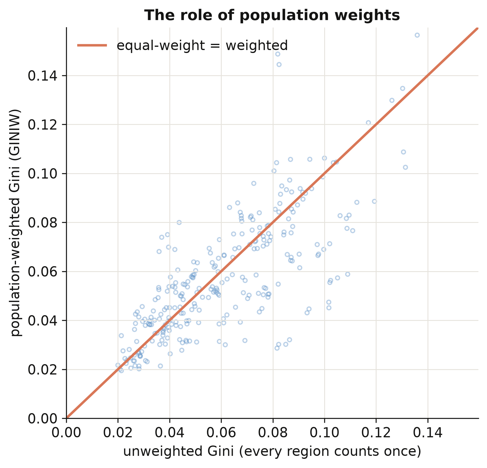

The weighted and unweighted Gini correlate only **0.75** — far from identical — and weighting
*lowers* inequality on average by 0.0034. The scatter (figure above) shows most points below
the 45° line: population weighting pulls the index down because small, income-extreme regions
(a tiny mining province, a remote capital) count for less when we weight by people. The
lesson is general — **report your weighting**: the same country can look more or less unequal
depending on whether you count regions or people, and "by people" is usually the
policy-relevant choice.

### 7.5 Do our indices match the paper?

Two checks. First, the from-scratch indices should reproduce the paper's Table 2 — the
correlation between inequality measured from *predicted* income and inequality measured from
*observed* income. Second, an honest caveat about coverage.

```python
import maketables as mt
# For each index we have two correlations across countries (2001-2012 means):
#   pred_obs  = inequality from PREDICTED income vs from OBSERVED income (our method)
#   light_obs = inequality from RAW LIGHT        vs from OBSERVED income (the shortcut)
# A higher number means the measure tracks "true" (observed-income) inequality better.
t2tab = pd.DataFrame({"Predicted income vs observed": pred_obs,
                      "Raw light vs observed": light_obs}, index=index_labels)
mt.MTable(t2tab).make("html")                     # -> self-contained HTML table
```



Inequality computed from *predicted* income correlates with inequality from *observed* income
at 0.49 for the Gini — more than double the 0.21 we get from raw light density (table above),
and the same pattern holds for all five indices. This is the payoff of the prediction step:
turning light into income first, instead of treating brightness as income, roughly doubles
how well we measure inequality. One honest caveat: our from-scratch indices are built on the
~1,500 regions that have *observed* income, whereas the paper's published series uses *every*
subnational region on Earth (the full-world prediction we did not bundle, to keep the data
small). The two correlate 0.88, not 1.00 — a coverage difference, and precisely why the paper
had to predict income for all regions, not just the calibration sample. With inequality
measured, we can ask how it moves with development.

## 8. The regional Kuznets curve

Now the classic question. As countries grow richer, does regional inequality rise then fall?
We regress the regional Gini on a cubic in log national income, with country and period fixed
effects so the relationship is identified from each country's *own* changes over time, not
from rich-vs-poor comparisons. Section 9 then works the turning-point algebra and the
discriminant test in full; the companion post [python_fe_kuznets](/post/python_fe_kuznets/)
adds the period-by-period stability of the curve.

### 8.1 The cubic specification in PyFixest

We average the data into 5-year periods, build the cubic terms, and estimate with country and
period fixed effects, clustering by country. The specification is

$$\text{GINIW}\_{ct} = \beta\_1 \ln Y\_{ct} + \beta\_2 (\ln Y\_{ct})^2
   + \beta\_3 (\ln Y\_{ct})^3 + \alpha\_c + \delta\_t + u\_{ct},$$

where $\text{GINIW}\_{ct}$ is country $c$'s regional Gini in period $t$, $\ln Y\_{ct}$ is its
log GDP per capita, and $\alpha\_c, \delta\_t$ are country and period fixed effects. In code
$\ln Y$ and its powers are `lg, lg2, lg3`, and the fixed effects are `Country_ISO + p5`.

Three modelling choices are worth unpacking before the code:

- **Why 5-year periods?** Annual inequality numbers are jumpy — one noisy year can swing a small
  country's Gini. Averaging into five-year blocks smooths that noise, so we fit the development
  *trend* rather than yearly wobble.
- **Why a cubic?** A straight line can only rise or fall; a quadratic can bend *once* (the
  classic inverted-U hump); a **cubic** can bend *twice*, letting inequality rise, fall, and then
  edge up again. We let the data pick the shape instead of imposing a hump in advance.
- **What do the fixed effects buy us?** The **country** effect $\alpha\_c$ compares each country
  only with *its own past*, never with richer or poorer countries — so the curve is identified
  from how inequality moves as a country develops, not from a rich-vs-poor snapshot. The
  **period** effect $\delta\_t$ strips out global shocks common to all countries in a period. As
  before, clustering by country keeps the standard errors honest.

```python
# --- Step 1: collapse annual data to country x 5-year-period means ----------
agg = collapse_to_5yr(t3)                     # one row per (country, 5-year period)

# --- Step 2: build the cubic terms in log national income -------------------
agg["lg"]  = np.log(agg["GDP_pc_Country"])    # ln Y
agg["lg2"] = agg["lg"]**2                     # (ln Y)²
agg["lg3"] = agg["lg"]**3                     # (ln Y)³

# --- Step 3: fit the cubic with country + period FE, clustered by country ---
m = pf.feols("GINIW_pred_GDP_pc ~ lg + lg2 + lg3 | Country_ISO + p5",
             data=agg, vcov={"CRV1": "Country_ISO"})
print(m.coef()[["lg", "lg2", "lg3"]].round(3).to_string())
print("N =", m._N, " countries =", agg.Country_ISO.nunique())
```

```text
lg      0.293
lg2    -0.032
lg3     0.001
N = 879  countries = 180
```

```python
import maketables as mt
# the Gini ladder (linear / quadratic / cubic) + the cubic for the other four indices
# labels relabel the dependent-variable spanner per column (Gini, CV, Theil, ...)
et3 = mt.ETable([k1, k2, k3] + [k_other[c] for c in IDX[1:]],
                model_heads=["linear", "quadratic", "cubic", "", "", "", ""],
                labels={"GINIW_pred_GDP_pc": "Population-weighted regional Gini", ...},
                coef_fmt="b:.3f* (se:.3f)", show_fe=True)
et3.make("html")                                  # professional HTML table
```



The cubic coefficients are **0.293 / −0.032 / 0.001** — positive, negative, positive — exactly
the paper's values. The positive linear term means inequality rises with income at low levels;
the negative quadratic bends the curve down; the tiny positive cubic adds a faint upturn at
the very top. This is an **N-shape**: a Kuznets hump with a third act. The full table above —
columns (1)–(3) building up the Gini ladder, (4)–(7) the cubic for the other four indices —
shows the same sign pattern throughout, so the shape is not an artefact of the Gini.

### 8.2 Visualising the curve

Coefficients are abstract; a picture is not. We want to plot each country-period as a point —
its regional Gini against its log income — and lay the fitted cubic on top. But there is a
subtlety. The model also contains country and period fixed effects, so if we scatter the *raw*
Gini the points scatter wildly around the curve, because each one still carries its country's
and period's effect. The fix is a **partial-residual plot**: we strip the period effect out of
each point first, so what remains lines up with the income-driven cubic. Here is how to build
the exact figure, step by step.

```python
# --- Step 1: refit the cubic with EXPLICIT dummies to recover the effects ---
# pf.feols hides the fixed effects; statsmodels with C(...) keeps them as
# coefficients we can read off. Same model, just a form we can take apart.
import statsmodels.formula.api as smf
mfe = smf.ols("GINIW_pred_GDP_pc ~ lg + lg2 + lg3 + C(Country_ISO) + C(p5)", agg3).fit()
bb  = {k: mfe.params[k] for k in ["lg", "lg2", "lg3"]}   # the three cubic coefficients
```

```python
# --- Step 2: net the PERIOD effect out of every point -----------------------
# Collect each 5-year period's estimated effect (period 1 is the baseline = 0),
# then subtract it from that point's Gini. The result, "partial", is the part of
# inequality NOT explained by which period it is -- i.e. net of period effects.
peff = {1: 0.0}
for k in (2, 3, 4, 5):
    peff[k] = mfe.params.get(f"C(p5)[T.{k}]", 0.0)
agg3["partial"] = agg3["GINIW_pred_GDP_pc"] - agg3["p5"].map(peff)
```

```python
# --- Step 3: choose a constant so the curve sits inside the cloud -----------
# The country dummies shift the whole cloud up/down; we recenter the curve to the
# average height of the points so the line is drawn through them, not above/below.
cons = (agg3["partial"]
        - (bb["lg"]*agg3.lg + bb["lg2"]*agg3.lg2 + bb["lg3"]*agg3.lg3)).mean()

# --- Step 4: evaluate the fitted cubic on a smooth grid of incomes ----------
xs = np.linspace(5.5, 11.8, 200)                          # log-income grid
ys = cons + bb["lg"]*xs + bb["lg2"]*xs**2 + bb["lg3"]*xs**3
```

```python
# --- Step 5: draw the scatter of points + the fitted curve ------------------
# STEEL / INK are the site palette (steel blue, near-black).
fig, ax = plt.subplots(figsize=(6.4, 4.6))
ax.scatter(agg3.lg, agg3.partial, s=14, facecolors="none",   # the cloud, net of period effects
           edgecolors=STEEL, alpha=0.55)
ax.plot(xs, ys, color=INK, lw=2.4, label="fitted cubic")     # the curve on top
ax.set(xlim=(5.5, 11.8), ylim=(0, 0.16), xlabel="log GDP per capita",
       ylabel="partial regional inequality (GINIW)",
       title="Regional inequality and development (Figure 4)")
ax.legend(loc="upper right", frameon=False)
fig.tight_layout()
fig.savefig("python_kuznets_dmsp_10_kuznets_scatter.png", dpi=300)
```

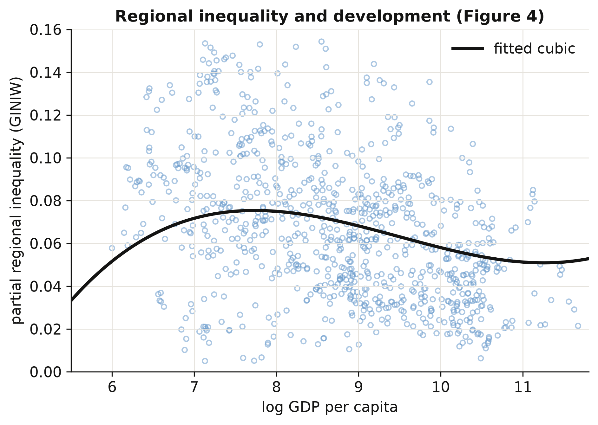

Reading the figure: the fitted curve rises to a gentle peak around a log income of 8 (roughly
\\$3,000 per capita), declines through the middle-income range, and flattens — with a barely
perceptible uptick — at the very top, tracing the **N-shape** the coefficients implied. Each
circle is one country in one 5-year period, net of period effects, so the vertical spread that
remains is genuine *country-to-country* variation in inequality at a given income level. That
the cloud is wide is the honest takeaway: development explains the **shape** of regional
inequality, but a great deal is left over — and naming those leftover drivers is exactly what
the determinants in Section 10 set out to do.

## 9. Turning points and the discriminant test

The cubic in §8 *can* bend twice — but does it actually, and does it bend inside the range of
incomes we observe? This section answers both, and it is the most transferable skill in the
post: any time you fit a cubic, these two checks tell you whether the curve really has the
shape its coefficients seem to promise. The same two-step test is developed on a synthetic
panel in the R companion post [r_kuznets](/post/r_kuznets/); here we apply it to the
lights-based regional Gini.

### 9.1 Calculating the turning points

Where does the curve change direction? At a turning point the slope is zero, so we set the
derivative of the cubic to zero:

$$\frac{\partial \text{GINIW}}{\partial \ln Y} = \beta\_1 + 2\beta\_2 \ln Y + 3\beta\_3 (\ln Y)^2 = 0.$$

This is a *quadratic* in $\ln Y$, so it has at most two roots — the inverted-U peak and the
high-income trough. We solve it with the quadratic formula and exponentiate each root back
into dollars:

```python
b1, b2, b3 = m.coef()[["lg", "lg2", "lg3"]]        # 0.293 / -0.032 / 0.00112
D = b2**2 - 3*b1*b3                                 # the discriminant (see 9.2)
roots = np.sort([(-b2 - np.sqrt(D)) / (3*b3),
                 (-b2 + np.sqrt(D)) / (3*b3)])       # turning points, in ln Y
print("turning points: ln =", roots.round(2), "->  $", np.exp(roots).round(0))
```

```text
turning points: ln = [ 7.74 11.25] ->  $ [ 2287. 77206.]
```

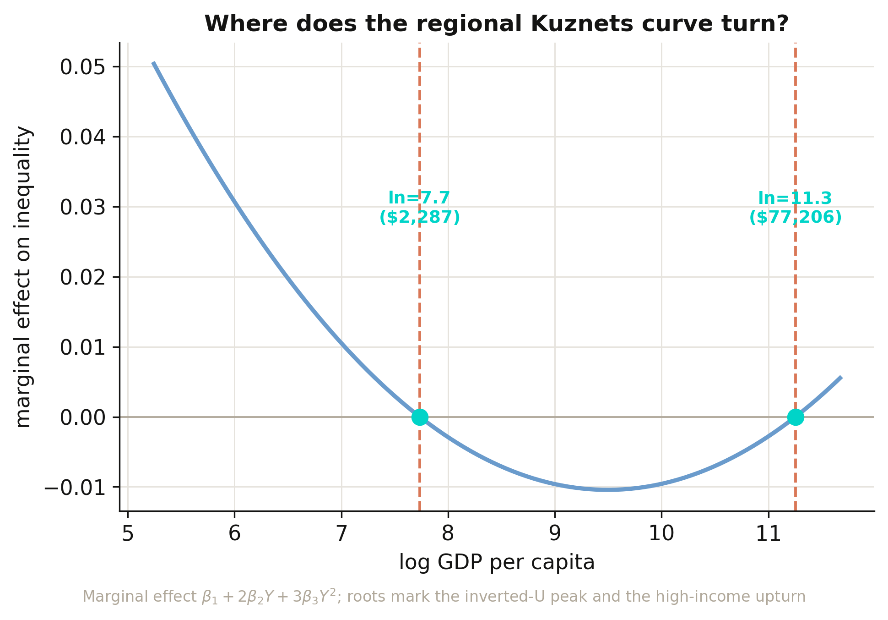

Regional inequality **rises** with development up to ln(GDP) ≈ 7.7 (about **\\$2,287**),
**falls** through the middle-income range until ln(GDP) ≈ 11.3 (about **\\$77,206**), and then
**rises again**. **Interpretation 1:** the first threshold marks the industrial take-off where
a few leading regions surge ahead of the rest; the second marks the maturity where
within-country convergence has run its course and post-industrial forces — services, finance,
skilled-city agglomeration — begin to pull the richest regions apart again. Both turning points
fall inside the observed income range (\\$190–\\$117,191), so this is a genuine N-shape rather
than an extrapolation, and the two thresholds match the companion
[python_fe_kuznets](/post/python_fe_kuznets/) post exactly. The figure plots the *marginal
effect* (the derivative) rather than the curve itself, because the turning points are precisely
where that line crosses zero.

### 9.2 The discriminant: does the curve really bend?

Solving for the roots numerically works, but it hides *why* a cubic sometimes has two turning
points and sometimes none. The quadratic $\beta\_1 + 2\beta\_2 Y + 3\beta\_3 Y^2 = 0$ has two
real solutions exactly when its discriminant is positive. After dropping a harmless factor of
4 (algebra below), the rule collapses to a single number:

$$D \\;\equiv\\; \beta\_2^2 - 3\\,\beta\_1\beta\_3.$$

There are three regimes:

| Discriminant | Real turning points | Shape over the income line | Verdict |
|---|---|---|---|
| $D > 0$ | 2 | rise–fall–rise (an "N on its side") | the cubic shape is **real** |
| $D = 0$ | 1 (inflection) | a single flat spot, no reversal | knife-edge boundary |
| $D < 0$ | 0 | monotonic — never reverses | the cubic shape is **not real** |

The textbook quadratic discriminant is
$b^2 - 4ac = (2\beta\_2)^2 - 4(3\beta\_3)(\beta\_1) = 4(\beta\_2^2 - 3\beta\_1\beta\_3) = 4D$;
the factor of 4 never changes the sign, so we work with the tidier
$D = \beta\_2^2 - 3\beta\_1\beta\_3$. For our cubic:

```python
D = b2**2 - 3*b1*b3
print(f"D = {D:+.6f}  ->  {'two turning points' if D > 0 else 'monotonic'}")
```

```text
D = +0.000035  ->  two turning points
```

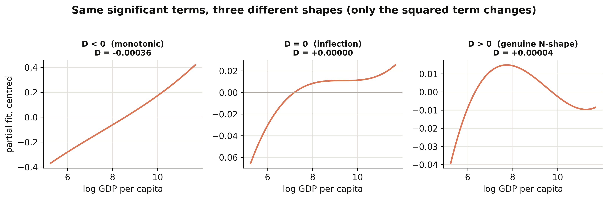

**Interpretation 2:** $D = +0.000035$ is positive, so the N-shape is real — but only *just*.
The figure holds the linear and cubic terms at their fitted values and changes **only** the
squared term: when $D<0$ the curve climbs monotonically, at $D=0$ it develops a single flat
inflection, and once $D>0$ it bends into the genuine rise–fall–rise. Our cubic sits a hair
above the $D=0$ knife-edge, so the third "act" — the post-\\$77k upturn — is real but faint,
exactly the "barely perceptible uptick" the §8 scatter showed. A slightly smaller squared term
would erase it altogether.

### 9.3 Two checks, not one: significance is not shape

Here is the trap. All three income terms in our cubic are individually significant, and it is
tempting to conclude "therefore the relationship is a genuine cubic with two turning points."
That inference is wrong as stated. Significance answers *"does the data prefer keeping this
term?"*; it does **not** answer *"does the fitted curve actually bend inside the income range
we observe?"* The discriminant — plus a check on *where* the turning points fall — answers the
second question. Applying both checks to our cubic and to three illustrative cases makes the
distinction concrete:

```python
def diagnose(label, b1, b2, b3, lo, hi):
    D = b2**2 - 3*b1*b3
    if D <= 0:
        return dict(case=label, D=D, regime="monotonic (D<0)", in_range=False)
    tp = np.exp(np.sort([(-b2 - np.sqrt(D))/(3*b3), (-b2 + np.sqrt(D))/(3*b3)]))
    ok = bool((tp >= lo).all() and (tp <= hi).all())
    regime = "2 turning points " + ("(both in range)" if ok else "(>=1 OUT of range)")
    return dict(case=label, D=D, regime=regime, in_range=ok)

lo, hi = agg.GDP_pc_Country.min(), agg.GDP_pc_Country.max()
rows = [diagnose("This post's cubic (panel FE)",   b1,    b2,    b3,     lo, hi),
        diagnose("Synthetic A: genuine N-shape",    0.220, -0.026, 0.0010, lo, hi),
        diagnose("Synthetic B: monotonic trap",     0.220, -0.020, 0.0010, lo, hi),
        diagnose("Synthetic C: turns out of range", 0.220, -0.026, 0.0001, lo, hi)]
print(pd.DataFrame(rows).to_string(index=False))
```

```text
                           case         D                              regime  in_range
   This post's cubic (panel FE)  0.000035    2 turning points (both in range)      True
   Synthetic A: genuine N-shape  0.000016    2 turning points (both in range)      True
    Synthetic B: monotonic trap -0.000260                     monotonic (D<0)     False
Synthetic C: turns out of range  0.000610 2 turning points (>=1 OUT of range)     False
```

Read the rows from top to bottom:

- **This post's cubic** — $D = +0.000035 > 0$ and *both* turning points (\\$2,287 and
  \\$77,206) fall inside the observed range (\\$190–\\$117,191). Significance and shape agree:
  a genuine, if marginal, N-shape.
- **Synthetic A** — the same sign pattern with a clean $D>0$ and both turning points in range.
  This is what an unambiguous N-shape looks like.
- **Synthetic B** (the trap) — the *same signs* as a real N-shape, only the squared term is a
  touch smaller in magnitude, and $D = -0.00026 < 0$. The curve is monotonic everywhere. A
  cubic regression on such data could report all three terms as "significant" and still have no
  turning point at all.
- **Synthetic C** — $D>0$, so two turning points exist *mathematically*, but the tiny cubic
  term throws the upper one to an astronomical income far outside any real economy. Inside the
  observed range the curve never reverses. "Two turning points exist" would be technically true
  and practically misleading.

**Interpretation 3:** significance (does the data want the term?) and the discriminant-plus-range
check (does the curve actually bend, and where?) are different questions, and you need both.
Reporting "all three GDP terms are significant, so the curve is cubic" can fail in two distinct
ways — the discriminant can be negative (B), or the turning points can fall outside the data
(C). The honest workflow is: report the coefficients, compute $D$, and *if* $D>0$ confirm the
turning points lie inside the observed income range before claiming an inverted-U or N-shape.

> **Aside (for Bayesian model averaging).** The same trap reappears with a different label. In a
> BMA, a term's posterior inclusion probability (PIP) near 1.00 is the Bayesian analogue of
> "statistically significant." But a high PIP on the cubic term no more guarantees a genuine
> bend than a significant cubic coefficient does — you still compute
> $D = \beta\_2^2 - 3\beta\_1\beta\_3$ from the posterior-mean coefficients and check the
> turning-point range. The R companion post
> [r_kuznets](/post/r_kuznets/#7-turning-points-and-the-discriminant-test) works this analogy
> through with field data.

## 10. What drives regional inequality?

If two equally rich countries differ in regional inequality, what accounts for the gap? Following
the paper's Table 4, we add blocks of structural determinants on top of the cubic — **(1)** a
baseline with the cubic alone, then **(2)** resources, **(3)** openness, **(4)** mobility/transport,
**(5)** institutions, **(6)** transfers and education, and **(7)** ethnicity — each with country and
period fixed effects and country-clustered standard errors. A positive coefficient means the factor
is associated with *more* regional inequality. The seven specifications go side by side in a
[`maketables`](https://github.com/py-econometrics/maketables) regression table.

```python
import maketables as mt
def det_fit(extra):                                # add a determinant block to the cubic
    return pf.feols(f"GINIW_pred_GDP_pc ~ lg+lg2+lg3 + {extra} | Country_ISO+p5",
                    data=agg4, vcov={"CRV1": "Country_ISO"})

d0     = pf.feols("GINIW_pred_GDP_pc ~ lg+lg2+lg3 | Country_ISO+p5",
                  data=agg4, vcov={"CRV1": "Country_ISO"})       # (0) baseline
d1     = det_fit("Resources_rents_share_of_GDP + Arable_land")   # (1) resources
d_inst = det_fit("Polity2 + lgXfed")                             # (4) institutions (lgXfed = log GDP × Federal)
d5     = det_fit("GINIW_Eth_light")                              # (6) ethnicity
# d2 openness, d3 mobility, d4 transfers+education are built the same way
mt.ETable([d0, d1, d2, d3, d_inst, d4, d5],
          model_heads=["baseline", "resources", "openness", "mobility",
                       "institutions", "transfers/edu", "ethnicity"],
          labels={"GINIW_pred_GDP_pc": "Population-weighted regional Gini", ...},
          coef_fmt="b:.3f* (se:.3f)", show_fe=True).make("html")
```



The strongest determinant by far is **ethnic inequality** (column 7): **0.071** (p < 0.001) —
countries where income differs sharply across ethnic homelands also have sharply unequal regions.
Among the rest, **resource rents** push inequality up (0.018, p < 0.01) — resource wealth
concentrates in a few regions — while a larger **arable-land share** pulls it down (−0.053,
p < 0.001), consistent with agriculture spreading income more evenly; **trade openness** adds a small
positive effect (0.005, p < 0.01) and **aid relative to GDP** a positive 0.015 (p < 0.05). The
**institutions** column (5) is the one we can only partly reproduce: Polity2 and a log GDP × Federal
interaction are both small and insignificant here, and the paper's ICRG bureaucratic-quality index is
licensed and omitted. The cubic in log GDP survives every block, and the sample drifts from column to
column (N falls from 879 in the baseline to 573 where the sparse institutions variables bind), so the
columns are best read as separate windows, not one nested model.

## 11. Spatial robustness: Conley standard errors

Regions are not independent: a boom in one province spills into its neighbours, so their
regression errors are correlated. Ignoring that makes standard errors too small and t-statistics
too big. We re-estimate the clean light elasticity (column 2, β = 0.190) and recompute its
standard error allowing errors of regions within a chosen radius to be correlated — the
**Conley** spatial-HAC correction — using a from-scratch implementation based on great-circle
distances between region centroids.

```python
m = pf.feols("log_GDP_pc_Region ~ log_Light_ppix_Region | code_Coutry_Region + satyear",
             data=dfb)                      # point estimate = 0.190
# Conley variance: weight cross-products of region scores by a Bartlett kernel
# k = max(0, 1 - distance / cutoff), distance = haversine great-circle km (see script.py)
for r in (1000, 2500, 5000):
    print(f"Conley SE @ {r} km = {np.sqrt(conley_var(r)):.3f}")
print(f"naive (iid) SE      = {m.se()['log_Light_ppix_Region']:.3f}")
```

```text
Conley SE @ 1000 km = 0.026
Conley SE @ 2500 km = 0.034
Conley SE @ 5000 km = 0.037
naive (iid) SE      = 0.013
```

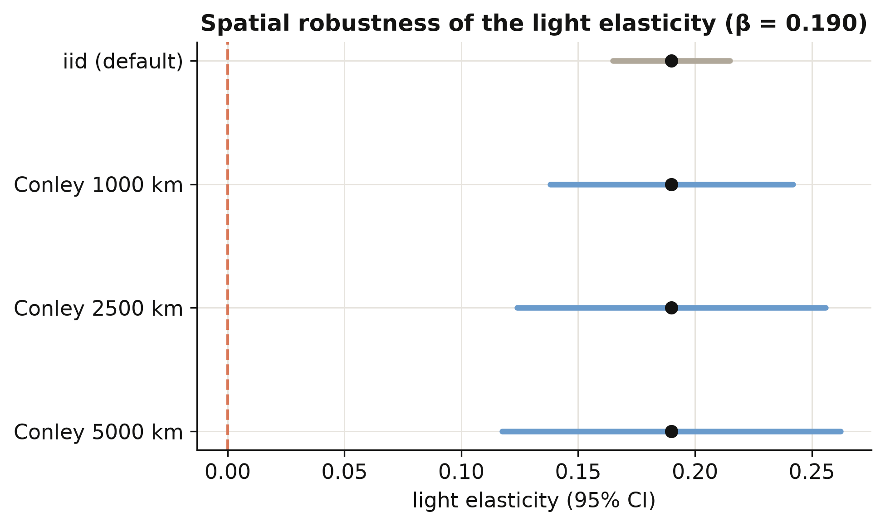

Allowing for spatial correlation roughly doubles to triples the standard error — from 0.013
to between 0.026 and 0.037 — because neighbouring regions are not the independent observations
the naive formula assumes. Even so, the elasticity of 0.190 stays far from zero (a t-statistic
above 5 at the widest radius), so the lights-predict-income relationship is not a statistical
mirage created by ignoring geography. The figure shows the confidence interval widening with
the radius while the point estimate holds fixed.

## 12. Regional versus personal inequality

A natural question: is *regional* inequality (gaps between places) just a reflection of
*personal* inequality (gaps between people)? We compare each country's regional Gini with its
household-income Gini, both averaged over 2001–2012, and fit a line. A positive slope means the
two inequalities go together.

```python
slope, intercept = np.polyfit(agg5["GINIW_pred_GDP_pc"], agg5["GINIall_100"], 1)
print(f"n = {len(agg5)} countries | OLS slope = {slope:.3f}")
```

```text
n = 144 countries | OLS slope = 0.587
```

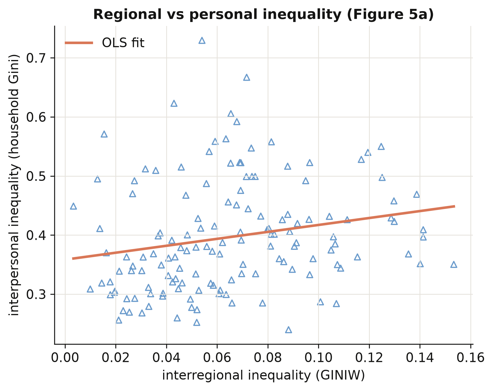

Across 144 countries the household-income Gini rises with the regional Gini at a slope of
**0.587**: places with wide gaps *between regions* also tend to have wide gaps *between people*.
Regional and personal inequality are distinct but linked — so policies that narrow the gap
between a country's regions are also, in part, distributional policies between its citizens.
This connects the satellite-based regional measure back to the inequality people actually
experience.

## 13. Discussion

We set out to answer a measurement question — can we see inside countries from space? — and a
substantive one — how does regional inequality move with development? The answer to the first
is a qualified yes: a light-to-income elasticity of 0.102, predictions that correlate 0.925
with observed income, and inequality measures that track the observed data twice as well as
raw light does. That is good enough to study regions that official statistics ignore, which is
the whole point: the method turns a data desert into a global, comparable income map.

On the substantive question, regional inequality follows an N-shaped Kuznets path — rising
through early development, falling as countries converge internally (the world average dropped
from 0.070 to 0.061 over 1992–2012), with a faint upturn among the very richest. The single
strongest correlate is ethnic inequality (0.071), a reminder that the internal economic
geography of a country is bound up with its human geography. For a policymaker, the practical
implication is concrete: the places where growth is failing to spread are now *visible* and
*measurable* even without a statistical office, and the levers most associated with the gap —
resource dependence, ethnic division — are nameable. Two cautions frame all of this. The
relationships are descriptive associations with fixed effects, not causal effects; and the
income figures are *predictions*, accurate on average but wrong for any single unusual region.

## 14. Summary and next steps

- **Method insight.** Nighttime lights predict regional income with an elasticity of 0.102 and
  a 0.925 correlation with observed income; predicting income first, rather than equating light
  with income, doubles the quality of the resulting inequality measures (Gini correlation 0.49
  vs 0.21).
- **Measurement insight.** Population weighting is not cosmetic: weighted and unweighted Gini
  correlate only 0.75, and weighting lowers measured inequality by ~0.003 on average, so the
  weighting choice must be reported.
- **Substantive insight.** The regional Kuznets curve is N-shaped (cubic 0.293 / −0.032 / 0.001
  across 180 countries), and ethnic inequality (0.071) is its strongest structural correlate.
- **Robustness insight.** The light elasticity of 0.190 survives spatial correlation — Conley
  standard errors of 0.026–0.037 are two to three times the naive 0.013, but the estimate stays
  far from zero.
- **Limitation.** Our from-scratch indices use only the ~1,500 regions with observed income;
  the published series uses every region on Earth (correlation 0.88), which is why the full
  paper predicts income globally.
- **Next steps.** Swap in a modern lights product (VIIRS replacing DMSP) to extend the series
  past 2012; or carry the full-world prediction through to rebuild the global income map and
  the choropleth figures we skipped here.

## 15. Exercises

1. **Re-weight the world.** Modify `ineq_indices` to weight regions by land area instead of
   population, recompute the regional Gini for every country, and compare the cross-country
   ranking to the population-weighted one. Which countries move most, and why?
2. **A fourth act?** Re-estimate the Kuznets cubic on the coefficient of variation
   (`COVW_pred_GDP_pc`) instead of the Gini, and add a quartic term (`lg4`). Does the upturn at
   high income strengthen, vanish, or stay a rounding error?
3. **How far do shocks travel?** Recompute the Conley standard error at radii of 250, 500, and
   10,000 km. Plot the standard error against the radius. At what distance does spatial
   correlation stop mattering for the light elasticity?

## 16. References

1. [Lessmann, C., & Seidel, A. (2017). Regional inequality, convergence, and its determinants — A view from outer space. *European Economic Review*, 92, 110–132.](https://doi.org/10.1016/j.euroecorev.2016.11.009)
2. [Henderson, J. V., Storeygard, A., & Weil, D. N. (2012). Measuring economic growth from outer space. *American Economic Review*, 102(2), 994–1028.](https://doi.org/10.1257/aer.102.2.994)
3. [Gennaioli, N., La Porta, R., Lopez-de-Silanes, F., & Shleifer, A. (2014). Growth in regions. *Journal of Economic Growth*, 19(3), 259–309.](https://doi.org/10.1007/s10887-014-9105-9)
4. [Kuznets, S. (1955). Economic growth and income inequality. *American Economic Review*, 45(1), 1–28.](https://www.jstor.org/stable/1811581)
5. [Conley, T. G. (1999). GMM estimation with cross sectional dependence. *Journal of Econometrics*, 92(1), 1–45.](https://doi.org/10.1016/S0304-4076(98)00084-0)
6. [PyFixest — fast fixed-effects estimation in Python (documentation)](https://py-econometrics.github.io/pyfixest/)
7. [linearmodels — panel data models in Python (documentation)](https://bashtage.github.io/linearmodels/)
8. [Mendez, C. (2026). The spatial Kuznets curve in R: turning points and the discriminant test (companion post, synthetic replication of Lessmann 2013).](/post/r_kuznets/)
9. [Mendez, C. (2026). Regional inequality and the Kuznets curve: panel fixed effects in Python (companion post).](/post/python_fe_kuznets/)

**Original data sources**

10. [Hodler, R., & Raschky, P. A. (2014). Regional favoritism. *Quarterly Journal of Economics*, 129(2), 995–1033.](https://doi.org/10.1093/qje/qju004)
11. [Alesina, A., Michalopoulos, S., & Papaioannou, E. (2016). Ethnic inequality. *Journal of Political Economy*, 124(2), 428–488.](https://doi.org/10.1086/685300)
12. [Weidmann, N. B., Rød, J. K., & Cederman, L.-E. (2010). Representing ethnic groups in space: A new dataset (GREG). *Journal of Peace Research*, 47(4), 491–499.](https://doi.org/10.1177/0022343310368352)
13. [NOAA / National Geophysical Data Center — DMSP-OLS Nighttime Lights (Version 4 "stable lights").](https://www.ngdc.noaa.gov/eog/dmsp/downloadV4composites.html)
14. [GADM — Database of Global Administrative Areas.](https://gadm.org/)
15. [CIESIN — Gridded Population of the World (GPW), v3.](https://sedac.ciesin.columbia.edu/data/collection/gpw-v3)
16. [World Bank — World Development Indicators (WDI).](https://databank.worldbank.org/source/world-development-indicators)
17. [Central Intelligence Agency — The World Factbook.](https://www.cia.gov/the-world-factbook/)
18. [Center for Systemic Peace — Polity IV Annual Time-Series.](https://www.systemicpeace.org/inscrdata.html)

## Appendix A. Data dictionary

This appendix documents **every column in all six data files**: what it is, how it was originally
constructed, its source, its units, and its **time–country coverage**. Coverage is written as
*years · units · N*, where *N* is the number of non-missing observations and *units* counts the
distinct countries (country files) or regions (region files) with data. Definitions follow Lessmann
and Seidel (2017) and the official variable labels in the authors' replication archive; coverage and
statistics are computed in `script.py`.

### A.1 The six datasets in detail

All six files are tidy panels. The **region files** are keyed by region × year over the
1,504-region / 81-country training frame (1992–2010); the **country files** are keyed by
`Country_ISO` × year over 180 countries (1992–2012). The inequality indices in the country files are
built from the predicted regional incomes in the region files.

| File | Unit | Rows × Cols | Years | Countries | Regions | What it is for |
|---|---|---|---|---|---|---|
| `Prediction_Data.csv` | region-year | 5,258 × 30 | 1992–2010 | 81 | 1,504 | Train the light→income model (Table 1) |
| `Table_2_data.csv` | region-year | 5,258 × 8 | 1992–2010 | 81 | 1,504\* | Validate the inequality indices (Table 2) |
| `Table_3_data.csv` | country-year | 3,675 × 9 | 1992–2012 | 180 | — | Kuznets curve: GDP + 5 indices (Table 3) |
| `Table_4_data.csv` | country-year | 3,675 × 17 | 1992–2012 | 180 | — | Determinants of inequality (Table 4) |
| `Table_B4_data.csv` | region-year | 5,258 × 14 | 1992–2010 | 81 | 1,504 | Conley spatial-HAC errors (+ lat/lon) |
| `Figure_5_data.csv` | country-year | 3,675 × 5 | 1992–2012 | 180 | — | Regional vs personal inequality |

\* `Table_2_data.csv` has no explicit region-id column, but its rows are the same 1,504-region
training frame at region-year.

### A.2 Variable dictionary

Coverage shorthand: region-frame variables are **1992–2010 · 1,504 reg (81 ctry) · N = 5,258** unless
noted; core country-frame variables are **1992–2012 · 180 ctry · N = 3,675** unless noted.

**Identifiers and keys**

| Variable | What it is | How constructed | Source | Unit | Coverage |
|---|---|---|---|---|---|
| `Country_ISO` | Country code (ISO 3166-1) | Assigned per country | GADM | string | all files |
| `Country_NAME` | Country name | — | GADM | string | all files |
| `Region_NAME` | Region name | 1st-level admin-unit name | GADM | string | region frame |
| `code_Coutry_Region` | Numeric region key (original spelling kept) | Region identifier | Authors | integer | region frame |
| `id_t_j` | Country-year key | Concatenation of year + ISO (e.g. `2010CHE`) | Authors | string | region frame |
| `year` | Calendar year | — | — | year | per file (see A.1) |

**Lights and income**

| Variable | What it is | How constructed | Source | Unit | Coverage |
|---|---|---|---|---|---|
| `log_Light_ppix_Region` | Log avg nighttime light per pixel | Region mean of DMSP-OLS stable-lights DN (0–63); +0.01 if zero, then log | NOAA/NGDC | log DN | region frame |
| `Light_Region` | Regional total lights | Sum of pixel DN over the region | NOAA/NGDC | summed DN | 1992–2010 · 81 ctry · 5,258 (Table_2) |
| `Light_Country` | Country total lights | Sum of pixel DN over the country | NOAA/NGDC | summed DN | 1992–2010 · 81 ctry · 5,258 (Table_2) |
| `GDP_pc_Region` | Observed regional GDP per capita | Regional accounts, constant 2005 PPP US\\$ | Gennaioli et al. (2014) | US\\$ | region frame |
| `log_GDP_pc_Region` | Log of `GDP_pc_Region` | Natural log | Gennaioli et al. (2014) | log US\\$ | region frame |
| `pred_GDP_pc_Region` | Predicted regional GDP per capita | Fitted values of the eq.-1 RE model applied to all regions | This paper (model) | US\\$ | 1992–2010 · 81 ctry · 5,258 (Table_2) |
| `GDP_pc_Country` | National GDP per capita | constant 2005 PPP US\\$ | World Bank WDI | US\\$ | country frame |
| `log_GDP_pc_Country` | Log national GDP per capita | Natural log | World Bank WDI | log US\\$ | region frame |

**Prediction-model regressors and fixed-effect dummies**

| Variable | What it is | How constructed | Source | Unit | Coverage |
|---|---|---|---|---|---|
| `log_N_pix_top_cod_1_ppix` | Log # top-coded pixels (DN = 63) | Count of saturated pixels per region, logged | NOAA/NGDC | log count | region frame |
| `log_N_pix_low_cod_1_ppix` | Log # low-coded pixels (DN = 0) | Count of dark pixels per region, logged | NOAA/NGDC | log count | region frame |
| `log_area` | Log region area | Region polygon area, logged | GADM | log km² | region frame |
| `log_region` | Log # regions in the country | Count of regions per country, logged | GADM / Gennaioli | log count | region frame |
| `log_region_X_log_area` | Interaction term | `log_region` × `log_area` | Derived | — | region frame |
| `eap`, `eca`, `lac`, `mena`, `sa`, `ssa` | World-Bank region-group dummies | 1 if the country is in that group (North America = reference) | World Bank | 0/1 | region frame |
| `satyear_1` … `satyear_7` | Satellite-configuration dummies | 1 per satellite/sensor era (sensors change and age over time) | NOAA/NGDC | 0/1 | region frame |

**Population and geography**

| Variable | What it is | How constructed | Source | Unit | Coverage |
|---|---|---|---|---|---|
| `Pop_Region` | Regional total population | Population density × region area, rounded up (min 1); 5-yr waves interpolated to annual | GPW v3 (CIESIN) | persons | region frame |
| `Pop_Country` | Country total population | Sum of regional populations | GPW v3 (CIESIN) | persons | region & country frames |
| `area` | Country land area | Total land area (excl. inland water) | World Bank WDI | km² | country frame |
| `Latitude`, `Longitude` | Region centroid coordinates | Polygon centroid | GADM | degrees | region frame (Table_B4) |

**Inequality indices** (all population-weighted, on predicted regional income)

| Variable | What it is | How constructed | Source | Unit | Coverage |
|---|---|---|---|---|---|
| `GINIW_pred_GDP_pc` | Regional Gini | Population-weighted Gini of `pred_GDP_pc_Region` within a country-year | This paper | 0–1 | country frame |
| `COVW_pred_GDP_pc` | Regional coefficient of variation | Population-weighted CV | This paper | ≥ 0 | country frame |
| `GE_1W_pred_GDP_pc` | Theil index, GE(1) | Population-weighted GE(α = 1) | This paper | ≥ 0 | country frame |
| `GE_0W_pred_GDP_pc` | Mean log deviation, GE(0) | Population-weighted GE(α = 0) | This paper | ≥ 0 | country frame |
| `GE_m1W_pred_GDP_pc` | GE(−1) | Population-weighted GE(α = −1) | This paper | ≥ 0 | country frame |
| `Giniall` | National interpersonal income Gini | Household-survey income Gini (0–100 scale) | Lessmann & Seidel (2017) | 0–100 | 1992–2012 · 153 ctry · 1,330 (Figure_5) |

**Determinants** (country frame, 1992–2012)

| Variable | What it is | How constructed | Source | Unit | Coverage |
|---|---|---|---|---|---|
| `Resources_rents_share_of_GDP` | Natural-resource rents | Oil + gas + coal + mineral + forest rents, % of GDP | World Bank WDI | % GDP | 177 ctry · N = 3,620 |
| `Arable_land` | Arable-land share | Arable land as a share of land area (FAO definition) | World Bank WDI | share | 178 ctry · N = 3,603 |
| `Trade_GDP_share` | Trade openness | (Exports + imports) / GDP | World Bank WDI | ratio | 176 ctry · N = 3,509 |
| `FDI_share_of_GDP` | FDI openness | Net FDI inflows / GDP | World Bank WDI | ratio | 174 ctry · N = 3,477 |
| `price_gasoline` | Gasoline pump price | Pump price, PPP constant 2005 US\\$/litre (the paper's "transport cost" = area × price) | World Bank WDI | US\\$/L | 162 ctry · N = 1,366 |
| `Aid` | Aid flows | Net aid received, constant 2011 US\\$ | World Bank WDI | US\\$ | 155 ctry · N = 2,964 |
| `School_enrollment_secondary` | Secondary-school enrolment | Gross secondary enrolment ratio | World Bank WDI | % gross | 172 ctry · N = 2,566 |
| `GINIW_Eth_light` | Ethnic inequality | Population-weighted light-Gini across ethnic homelands (method of Alesina et al. 2016) | NOAA/NGDC + GREG (Weidmann et al. 2010) | 0–1 | 173 ctry · N = 3,528 |
| `Polity2` | Democracy–autocracy score | Polity IV combined score, rescaled −1 (autocracy) to +1 (democracy) | Center for Systemic Peace, Polity IV | −1…+1 | 157 ctry · N = 3,158 |
| `fedelupd2` | Federalism dummy | 1 if the country is federally organised | Authors | 0/1 | 1992–2009 · 154 ctry · N = 2,724 |

The authors' Table 4 also uses an ICRG "bureaucratic quality" index, which is licensed and **not**
redistributed in this bundle; the post therefore omits that one determinant column.

---

<style>
.podcast-overlay {
  display: none;
  position: fixed;
  bottom: 0;
  left: 0;
  right: 0;
  z-index: 9999;
  animation: podSlideUp 0.35s ease-out;
}
@keyframes podSlideUp {
  from { transform: translateY(100%); }
  to { transform: translateY(0); }
}
.podcast-overlay.pod-closing {
  animation: podSlideDown 0.3s ease-in forwards;
}
@keyframes podSlideDown {
  from { transform: translateY(0); }
  to { transform: translateY(100%); }
}
.podcast-container {
  background: linear-gradient(135deg, #1a1a2e 0%, #16213e 100%);
  padding: 18px 24px 20px;
  font-family: -apple-system, BlinkMacSystemFont, 'Segoe UI', Roboto, sans-serif;
  box-shadow: 0 -4px 32px rgba(0,0,0,0.5);
  border-top: 1px solid rgba(106,155,204,0.2);
}
.podcast-inner {
  max-width: 800px;
  margin: 0 auto;
}
.podcast-top-row {
  display: flex;
  align-items: center;
  gap: 14px;
  margin-bottom: 14px;
}
.podcast-icon {
  width: 42px;
  height: 42px;
  background: linear-gradient(135deg, #d97757, #e8956a);
  border-radius: 10px;
  display: flex;
  align-items: center;
  justify-content: center;
  flex-shrink: 0;
}
.podcast-icon svg {
  width: 22px;
  height: 22px;
  fill: #fff;
}
.podcast-title-block {
  flex: 1;
  min-width: 0;
}
.podcast-title-block h4 {
  margin: 0 0 1px 0;
  color: #f0ece2;
  font-size: 14px;
  font-weight: 600;
  letter-spacing: 0.02em;
  white-space: nowrap;
  overflow: hidden;
  text-overflow: ellipsis;
}
.podcast-title-block span {
  color: #8b9dc3;
  font-size: 11px;
}
.podcast-close-btn {
  background: none;
  border: none;
  cursor: pointer;
  padding: 6px;
  border-radius: 50%;
  display: flex;
  align-items: center;
  justify-content: center;
  transition: background 0.2s;
  flex-shrink: 0;
}
.podcast-close-btn:hover {
  background: rgba(255,255,255,0.1);
}
.podcast-close-btn svg {
  width: 20px;
  height: 20px;
  fill: #8b9dc3;
}
.podcast-progress-wrap {
  margin-bottom: 12px;
}
.podcast-time-row {
  display: flex;
  justify-content: space-between;
  font-size: 11px;
  color: #8b9dc3;
  margin-bottom: 5px;
  font-variant-numeric: tabular-nums;
}
.podcast-bar-bg {
  width: 100%;
  height: 6px;
  background: rgba(255,255,255,0.1);
  border-radius: 3px;
  cursor: pointer;
  position: relative;
  overflow: hidden;
  transition: height 0.15s;
}
.podcast-bar-buffered {
  position: absolute;
  top: 0;
  left: 0;
  height: 100%;
  background: rgba(106,155,204,0.25);
  border-radius: 3px;
  transition: width 0.3s;
}
.podcast-bar-progress {
  position: absolute;
  top: 0;
  left: 0;
  height: 100%;
  background: linear-gradient(90deg, #6a9bcc, #00d4c8);
  border-radius: 3px;
  transition: width 0.1s linear;
}
.podcast-bar-bg:hover {
  height: 10px;
  margin-top: -2px;
}
.podcast-controls-row {
  display: flex;
  align-items: center;
  justify-content: space-between;
}
.podcast-transport {
  display: flex;
  align-items: center;
  gap: 8px;
}
.podcast-btn {
  background: none;
  border: none;
  cursor: pointer;
  padding: 4px;
  display: flex;
  align-items: center;
  justify-content: center;
  border-radius: 50%;
  transition: all 0.2s;
}
.podcast-btn svg {
  fill: #c8d0e0;
  transition: fill 0.2s;
}
.podcast-btn:hover svg {
  fill: #f0ece2;
}
.podcast-btn-skip {
  position: relative;
}
.podcast-btn-skip span {
  position: absolute;
  font-size: 7px;
  font-weight: 700;
  color: #c8d0e0;
  top: 50%;
  left: 50%;
  transform: translate(-50%, -50%);
  pointer-events: none;
  margin-top: 1px;
}
.podcast-btn-play {
  width: 48px;
  height: 48px;
  background: linear-gradient(135deg, #d97757, #e8956a);
  border-radius: 50%;
  box-shadow: 0 3px 12px rgba(217,119,87,0.4);
  transition: all 0.2s;
}
.podcast-btn-play:hover {
  transform: scale(1.08);
  box-shadow: 0 5px 20px rgba(217,119,87,0.5);
}
.podcast-btn-play svg {
  fill: #fff;
  width: 22px;
  height: 22px;
}
.podcast-extras {
  display: flex;
  align-items: center;
  gap: 10px;
}
.podcast-volume-wrap {
  display: flex;
  align-items: center;
  gap: 5px;
}
.podcast-volume-wrap svg {
  fill: #8b9dc3;
  width: 16px;
  height: 16px;
  cursor: pointer;
  flex-shrink: 0;
}
.podcast-volume-wrap svg:hover {
  fill: #c8d0e0;
}
.podcast-volume-slider {
  -webkit-appearance: none;
  appearance: none;
  width: 60px;
  height: 4px;
  background: rgba(255,255,255,0.12);
  border-radius: 2px;
  outline: none;
  cursor: pointer;
}
.podcast-volume-slider::-webkit-slider-thumb {
  -webkit-appearance: none;
  appearance: none;
  width: 12px;
  height: 12px;
  background: #6a9bcc;
  border-radius: 50%;
  cursor: pointer;
}
.podcast-speed-btn {
  background: rgba(255,255,255,0.08);
  border: 1px solid rgba(255,255,255,0.12);
  color: #c8d0e0;
  font-size: 11px;
  font-weight: 600;
  padding: 3px 9px;
  border-radius: 12px;
  cursor: pointer;
  transition: all 0.2s;
  font-family: inherit;
  min-width: 40px;
  text-align: center;
}
.podcast-speed-btn:hover {
  background: rgba(106,155,204,0.2);
  border-color: #6a9bcc;
  color: #f0ece2;
}
.podcast-download-btn {
  background: none;
  border: 1px solid rgba(255,255,255,0.12);
  border-radius: 8px;
  padding: 4px 10px;
  cursor: pointer;
  display: flex;
  align-items: center;
  gap: 4px;
  color: #8b9dc3;
  font-size: 11px;
  font-family: inherit;
  text-decoration: none;
  transition: all 0.2s;
}
.podcast-download-btn:hover {
  border-color: #6a9bcc;
  color: #f0ece2;
  background: rgba(106,155,204,0.1);
}
.podcast-download-btn svg {
  width: 14px;
  height: 14px;
  fill: currentColor;
}
@media (max-width: 600px) {
  .podcast-container { padding: 14px 16px 16px; }
  .podcast-volume-wrap { display: none; }
  .podcast-title-block h4 { font-size: 13px; }
  .podcast-extras { gap: 8px; }
}
</style>

<div class="podcast-overlay" id="podOverlay">
<div class="podcast-container">
<div class="podcast-inner">
  <audio id="podAudio" preload="none" src="https://files.catbox.moe/692u1d.m4a"></audio>

  <div class="podcast-top-row">
    <div class="podcast-icon">
      <svg viewBox="0 0 24 24"><path d="M12 1a5 5 0 0 0-5 5v4a5 5 0 0 0 10 0V6a5 5 0 0 0-5-5zm0 16a7 7 0 0 1-7-7H3a9 9 0 0 0 8 8.94V22h2v-3.06A9 9 0 0 0 21 10h-2a7 7 0 0 1-7 7z"/></svg>
    </div>
    <div class="podcast-title-block">
      <h4>AI Podcast: Regional Inequality from Outer Space</h4>
      <span id="podDurationLabel">Click play to load</span>
    </div>
    <button class="podcast-close-btn" onclick="podClose()" title="Close player">
      <svg viewBox="0 0 24 24"><path d="M19 6.41L17.59 5 12 10.59 6.41 5 5 6.41 10.59 12 5 17.59 6.41 19 12 13.41 17.59 19 19 17.59 13.41 12z"/></svg>
    </button>
  </div>

  <div class="podcast-progress-wrap">
    <div class="podcast-time-row">
      <span id="podCurrent">0:00</span>
      <span id="podDuration">0:00</span>
    </div>
    <div class="podcast-bar-bg" id="podBarBg" onclick="podSeek(event)">
      <div class="podcast-bar-buffered" id="podBuffered"></div>
      <div class="podcast-bar-progress" id="podProgress"></div>
    </div>
  </div>

  <div class="podcast-controls-row">
    <div class="podcast-transport">
      <button class="podcast-btn podcast-btn-skip" onclick="podSkip(-15)" title="Back 15s">
        <svg width="26" height="26" viewBox="0 0 24 24"><path d="M12 5V1L7 6l5 5V7c3.31 0 6 2.69 6 6s-2.69 6-6 6-6-2.69-6-6H4c0 4.42 3.58 8 8 8s8-3.58 8-8-3.58-8-8-8z"/></svg>
        <span>15</span>
      </button>
      <button class="podcast-btn podcast-btn-play" id="podPlayBtn" onclick="podToggle()" title="Play">
        <svg id="podIconPlay" viewBox="0 0 24 24"><path d="M8 5v14l11-7z"/></svg>
        <svg id="podIconPause" viewBox="0 0 24 24" style="display:none"><path d="M6 19h4V5H6v14zm8-14v14h4V5h-4z"/></svg>
      </button>
      <button class="podcast-btn podcast-btn-skip" onclick="podSkip(15)" title="Forward 15s">
        <svg width="26" height="26" viewBox="0 0 24 24"><path d="M12 5V1l5 5-5 5V7c-3.31 0-6 2.69-6 6s2.69 6 6 6 6-2.69 6-6h2c0 4.42-3.58 8-8 8s-8-3.58-8-8 3.58-8 8-8z"/></svg>
        <span>15</span>
      </button>
    </div>
    <div class="podcast-extras">
      <div class="podcast-volume-wrap">
        <svg id="podVolIcon" onclick="podMute()" viewBox="0 0 24 24"><path d="M3 9v6h4l5 5V4L7 9H3zm13.5 3A4.5 4.5 0 0 0 14 8.5v7a4.47 4.47 0 0 0 2.5-3.5zM14 3.23v2.06a6.51 6.51 0 0 1 0 13.42v2.06A8.51 8.51 0 0 0 14 3.23z"/></svg>
        <input type="range" class="podcast-volume-slider" id="podVolume" min="0" max="1" step="0.05" value="0.8">
      </div>
      <button class="podcast-speed-btn" id="podSpeedBtn" onclick="podCycleSpeed()" title="Playback speed">1x</button>
      <a class="podcast-download-btn" href="https://files.catbox.moe/692u1d.m4a" target="_blank" rel="noopener" title="Stream">
        <svg viewBox="0 0 24 24"><path d="M19 9h-4V3H9v6H5l7 7 7-7zM5 18v2h14v-2H5z"/></svg>
      </a>
    </div>
  </div>
</div>
</div>
</div>

<script>
(function(){
  var overlay = document.getElementById('podOverlay');
  var a = document.getElementById('podAudio');
  var speeds = [0.75, 1, 1.25, 1.5, 2];
  var si = 1;
  var opened = false;
  function fmt(s){
    if(isNaN(s)) return '0:00';
    var m=Math.floor(s/60), sec=Math.floor(s%60);
    return m+':'+(sec<10?'0':'')+sec;
  }
  document.addEventListener('click', function(e){
    var link = e.target.closest('a.btn-page-header');
    if(!link) return;
    var text = link.textContent.trim();
    if(text.indexOf('AI Podcast') === -1) return;
    e.preventDefault();
    e.stopPropagation();
    overlay.style.display = 'block';
    overlay.classList.remove('pod-closing');
    if(!opened){
      a.preload = 'metadata';
      a.load();
      opened = true;
    }
  });
  a.volume = 0.8;
  a.addEventListener('loadedmetadata', function(){
    document.getElementById('podDuration').textContent = fmt(a.duration);
    document.getElementById('podDurationLabel').textContent = fmt(a.duration) + ' minutes';
  });
  a.addEventListener('timeupdate', function(){
    document.getElementById('podCurrent').textContent = fmt(a.currentTime);
    var pct = a.duration ? (a.currentTime/a.duration)*100 : 0;
    document.getElementById('podProgress').style.width = pct+'%';
  });
  a.addEventListener('progress', function(){
    if(a.buffered.length>0){
      var pct = (a.buffered.end(a.buffered.length-1)/a.duration)*100;
      document.getElementById('podBuffered').style.width = pct+'%';
    }
  });
  a.addEventListener('ended', function(){
    document.getElementById('podIconPlay').style.display='';
    document.getElementById('podIconPause').style.display='none';
  });
  window.podToggle = function(){
    if(a.paused){a.play();document.getElementById('podIconPlay').style.display='none';document.getElementById('podIconPause').style.display='';}
    else{a.pause();document.getElementById('podIconPlay').style.display='';document.getElementById('podIconPause').style.display='none';}
  };
  window.podSkip = function(s){a.currentTime = Math.max(0,Math.min(a.duration||0,a.currentTime+s));};
  window.podSeek = function(e){
    var rect = document.getElementById('podBarBg').getBoundingClientRect();
    var pct = (e.clientX - rect.left)/rect.width;
    a.currentTime = pct * (a.duration||0);
  };
  window.podMute = function(){
    a.muted = !a.muted;
    document.getElementById('podVolume').value = a.muted ? 0 : a.volume;
  };
  window.podCycleSpeed = function(){
    si = (si+1) % speeds.length;
    a.playbackRate = speeds[si];
    document.getElementById('podSpeedBtn').textContent = speeds[si]+'x';
  };
  window.podClose = function(){
    overlay.classList.add('pod-closing');
    setTimeout(function(){ overlay.style.display='none'; }, 300);
    a.pause();
    document.getElementById('podIconPlay').style.display='';
    document.getElementById('podIconPause').style.display='none';
  };
  document.getElementById('podVolume').addEventListener('input', function(){
    a.volume = this.value;
    a.muted = false;
  });
  if(window.location.hash === '#podcast-player'){
    overlay.style.display = 'block';
    a.preload = 'metadata';
    a.load();
    opened = true;
  }
})();
</script>
