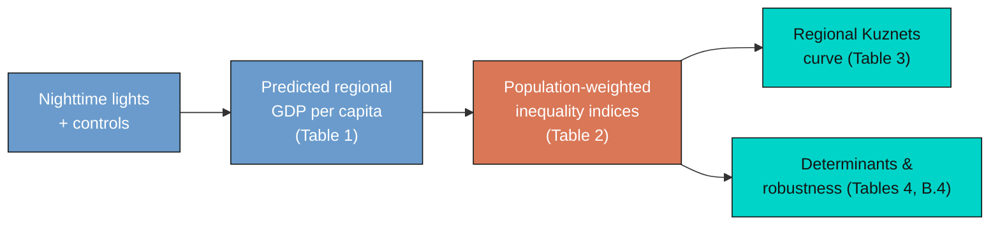
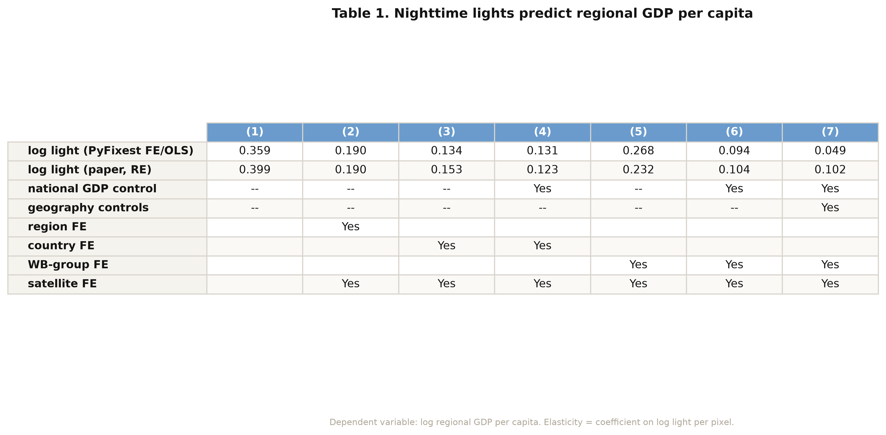
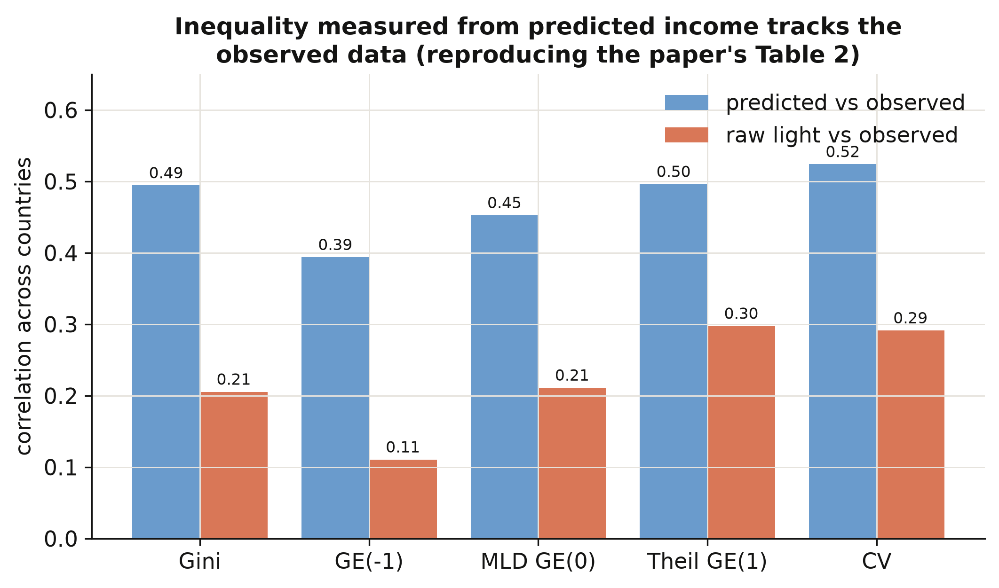
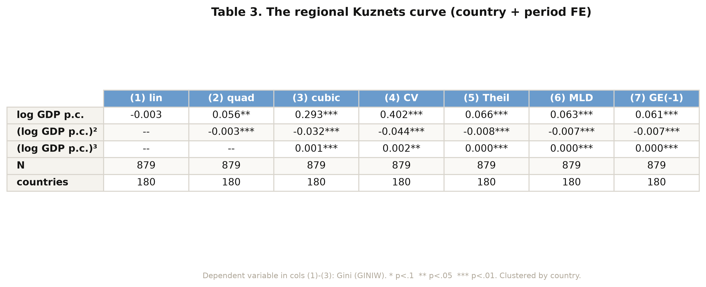
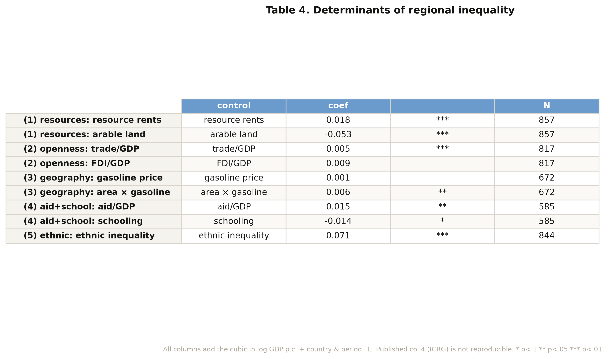

---
authors:
  - admin
categories:
  - Python
  - Spatial inequality
  - Fixed Effects and TWFE
date: "2026-06-15T00:00:00Z"
draft: false
featured: false
external_link: ""
image:
  caption: ""
  focal_point: Smart
  placement: 3
links:
- icon: person-chalkboard
  icon_pack: fas
  name: "Slides (HTML)"
  url: slides/index.html
- icon: file-pdf
  icon_pack: fas
  name: "AI Slides (PDF)"
  url: https://carlos-mendez.org/post/python_kuznets_dmsp/Mapping_Inequality_from_Space.pdf
- icon: podcast
  icon_pack: fas
  name: AI Podcast
  url: "/post/python_kuznets_dmsp/#podcast-player"
- icon: laptop-code
  icon_pack: fas
  name: "Web app"
  url: web_app/index.html
- icon: code
  icon_pack: fas
  name: "Python script"
  url: script.py
- icon: file-code
  icon_pack: fas
  name: "Quarto project (.zip)"
  url: python_kuznets_dmsp.zip
- icon: book
  icon_pack: fas
  name: "Jupyter notebook"
  url: notebook.ipynb
- icon: open-data
  icon_pack: ai
  name: "[Python] Google Colab"
  url: https://colab.research.google.com/github/cmg777/starter-academic-v501/blob/master/content/post/python_kuznets_dmsp/notebook.ipynb
- icon: markdown
  icon_pack: fab
  name: "MD version"
  url: https://raw.githubusercontent.com/cmg777/starter-academic-v501/master/content/post/python_kuznets_dmsp/index.md
- icon: database
  icon_pack: fas
  name: "Data (CSV)"
  url: https://github.com/cmg777/starter-academic-v501/tree/master/content/post/python_kuznets_dmsp/data
slides:
summary: A comprehensive, beginner-friendly Python replication of Lessmann and Seidel (2017) — turning satellite nighttime lights into predicted regional GDP, building five population-weighted inequality indices from scratch, exploring the cross-country dynamics of regional inequality, and estimating the regional Kuznets curve, its determinants, and a Conley spatial-HAC robustness check with PyFixest.
tags:
  - python
  - econometrics
  - regional inequality
  - nighttime lights
  - panel data
title: "Regional Inequality from Outer Space: Predicting GDP from Nighttime Lights and Building Inequality Indices in Python"
url_code: ""
url_pdf: ""
url_slides: ""
url_video: ""
toc: true
diagram: true
---

## Abstract

Most countries publish a single national GDP number but no income figures for their
internal regions, so we cannot see whether development is shared evenly across a country's
territory. This tutorial reconstructs the measurement pipeline of Lessmann and Seidel
(2017): it predicts regional GDP per capita from satellite nighttime lights, builds
inequality indices from those predictions, and asks how regional inequality changes as
countries grow richer. The data are a region-year panel of 5,258 subnational regions used
to calibrate the lights model and a country-period panel of 180 countries spanning
1992–2012, all bundled as small CSVs. The methods are panel fixed effects in PyFixest,
a random-effects sidebar in linearmodels, inequality math from first principles, and a
from-scratch Conley spatial-HAC variance. The calibrated light elasticity of regional
income is 0.102 and predicted income correlates 0.925 with observed income; the
population-weighted regional Gini follows an N-shaped curve in development (cubic
0.293 / −0.032 / 0.001), ethnic inequality is its strongest correlate (0.071), and the
light elasticity of 0.190 survives spatially-robust inference (Conley standard errors
0.026–0.037). These findings imply that nighttime lights can fill the subnational data gap
well enough to study where, and for whom, growth fails to spread.

## 1. Overview

A government can tell you its country's GDP, but rarely the GDP of each province inside it.
That gap matters: two countries with identical national income can look completely
different on the inside — one with a single booming capital surrounded by poor hinterlands,
the other with broadly shared prosperity. To study that *internal* geography of income at a
global scale, Lessmann and Seidel (2017) had a simple but powerful idea: **let satellites
do the accounting**. Brighter places at night are, on average, richer places, so nighttime
light can stand in for income where official statistics do not exist.

This post rebuilds their pipeline in Python, end to end. We start from light and a handful
of controls, predict regional income, turn many regional incomes into a single inequality
number per country, and finally ask the classic question: does regional inequality first
rise and then fall as countries develop — the spatial version of the **Kuznets curve**?

The diagram below shows the four stages. The first two stages — *prediction* and
*construction* — are the heart of this tutorial; they are where the data are actually made.
The last two — *the curve* and *its drivers* — are familiar panel regressions, kept short
here because a companion post,
[Regional Inequality and the Kuznets Curve: Panel Fixed Effects in Python](/post/python_fe_kuznets/),
already explores turning points, period stability, and the full determinant analysis in
depth on a pre-built inequality series.



Reading the diagram left to right, light becomes income (blue), income becomes inequality
(orange), and inequality becomes the object of study (teal). Each arrow is a modelling
choice we will make explicit and reproduce. By the end you will be able to defend every
number on the page.

In this tutorial you will:

- **Predict** regional GDP per capita from nighttime lights and controls, and form the
  predictions explicitly.
- **Construct** five population-weighted inequality indices from first principles, and see
  exactly how population weights change the answer.
- **Explore** the cross-country dynamics of regional inequality across time and world
  regions.
- **Estimate** the regional Kuznets curve, its determinants, and a spatially-robust
  standard error using PyFixest.
- **Distinguish** a prediction model from a causal claim, and a fixed-effects estimate from
  a random-effects one.

## 2. Key concepts at a glance

The post reuses a small vocabulary. The **definition** under each term is always visible;
the **example** and **analogy** sit behind clickable cards — open them when a term feels
slippery.

**1. Nighttime lights as an income proxy.**
The brightness a satellite records over a place at night, used as a stand-in for that
place's economic output. Lights correlate with income because electricity use, roads, and
activity all glow. They are imperfect — deserts and oil flares mislead — which is why we
*predict* income from light rather than equate the two.

<div class="concept-pair">
<details class="concept-card concept-example">
<summary>Example</summary>

The raw correlation between a region's nighttime brightness and its observed income is
strong but noisy; turning brightness into a predicted income (Table 1) more than doubles
its usefulness for measuring inequality (Gini correlation 0.49 vs 0.21).

</details>

<details class="concept-card concept-analogy">
<summary>Analogy</summary>

Like guessing a household's wealth from its electricity bill. Useful on average, wrong for
the off-grid farmer and the crypto miner, but good enough to rank neighbourhoods.

</details>
</div>

**2. Light-to-GDP elasticity** $\beta\_1$.
The percent change in predicted regional GDP per capita for a 1% change in light per
pixel, holding controls fixed. It is the slope of the calibration model and the single
most important number in the prediction step.

<div class="concept-pair">
<details class="concept-card concept-example">
<summary>Example</summary>

In the preferred specification the elasticity is $\beta\_1 = 0.102$: a 10% brighter region
is predicted to be about 1% richer, once national income and geography are controlled for.

</details>

<details class="concept-card concept-analogy">
<summary>Analogy</summary>

The exchange rate between "lumens" and "dollars". A small number, because national income
already does most of the conversion; light fine-tunes the regional detail.

</details>
</div>

**3. Population-weighted inequality index.**
A summary of how unequally income is spread across a country's regions, where each region
counts in proportion to how many people live there. The post uses the Gini, three
generalized-entropy indices, and the coefficient of variation.

<div class="concept-pair">
<details class="concept-card concept-example">
<summary>Example</summary>

Germany 2010, built from its 16 regions, has a population-weighted Gini of 0.028 — low,
because German regions are close in income and the populous ones sit near the average.

</details>

<details class="concept-card concept-analogy">
<summary>Analogy</summary>

A class grade that weights each student by attendance. A brilliant student who shows up
once barely moves the class average; the regulars set it.

</details>
</div>

**4. The role of population weights.**
Whether each region counts once (equal weight) or by its population changes the inequality
number. Weighting ties the index to where people actually live, which is the
policy-relevant quantity.

<div class="concept-pair">
<details class="concept-card concept-example">
<summary>Example</summary>

Across country-years the weighted and unweighted Gini correlate 0.75; weighting lowers the
average Gini by about 0.003, because tiny extreme regions lose influence.

</details>

<details class="concept-card concept-analogy">
<summary>Analogy</summary>

Voting by headcount versus by district. A near-empty district and a megacity count equally
in the second system; population weighting is the first.

</details>
</div>

**5. The spatial Kuznets curve.**
The hypothesis that regional inequality rises during early development, then falls as
countries converge internally — an inverted U (or, with a third act at high income, an N)
in inequality against log GDP per capita.

<div class="concept-pair">
<details class="concept-card concept-example">
<summary>Example</summary>

The cubic in log income has coefficients $0.293 / -0.032 / 0.001$, tracing a rise, a fall,
and a faint upturn — an N-shape with country and period fixed effects.

</details>

<details class="concept-card concept-analogy">
<summary>Analogy</summary>

A country's internal road trip: the gap between regions widens leaving the village, narrows
approaching the city, and frays again in the sprawling suburbs of the very rich.

</details>
</div>

**6. Conley (spatial-HAC) standard errors.**
Standard errors that allow nearby regions' errors to be correlated, because a shock to one
region usually spills into its neighbours. They are wider — and more honest — than the
default that treats each region as independent.

<div class="concept-pair">
<details class="concept-card concept-example">
<summary>Example</summary>

The light elasticity's standard error rises from 0.013 (independent) to 0.026–0.037
(Conley, 1,000–5,000 km), but the estimate of 0.190 still sits far from zero.

</details>

<details class="concept-card concept-analogy">
<summary>Analogy</summary>

Counting independent witnesses. If ten "witnesses" all heard the same rumour, you really
have one fact, not ten; Conley errors discount correlated neighbours.

</details>
</div>

## 3. Setup and imports

We use **pandas** and **numpy** for data work, **matplotlib** for figures,
[**PyFixest**](https://py-econometrics.github.io/pyfixest/) for the panel fixed-effects
regressions (its `feols` mirrors the R package `fixest`), **linearmodels** for the one
random-effects table PyFixest cannot estimate, and **statsmodels** for a convenience
regression behind one figure. PyFixest needs Python 3.10 or newer.

```python
import numpy as np
import pandas as pd
import matplotlib.pyplot as plt
import pyfixest as pf
from linearmodels.panel import RandomEffects
import statsmodels.formula.api as smf

# Site colour palette (used in every figure)
STEEL, ORANGE, INK, TEAL = "#6a9bcc", "#d97757", "#141413", "#00d4c8"
np.random.seed(42)
```

The site palette keeps the figures consistent: steel blue for primary data, warm orange for
fitted lines and reference lines, near-black for the curves we want to stand out. With the
tools loaded, we point at the data.

We load the bundled CSVs straight from GitHub so the notebook runs unchanged in Google
Colab, falling back to a local `data/` folder when you run it offline.

```python
BASE = ("https://raw.githubusercontent.com/cmg777/starter-academic-v501/"
        "master/content/post/python_kuznets_dmsp/data/")

def load(name):
    """Read a bundled CSV from GitHub, falling back to a local data/ copy."""
    try:
        return pd.read_csv(BASE + name)
    except Exception:
        return pd.read_csv("data/" + name)
```

The `load` helper means every reader — on Colab, on a laptop, online or offline — gets the
same data with no manual downloads. Next we read the files and look at their shapes.

## 4. The data: three views of the world

The replication ships three "views" of the same world. The **region-year** files
(`Prediction_Data.csv`, `Table_2_data.csv`, `Table_B4_data.csv`) describe individual
subnational regions: their lights, their observed and predicted income, their populations
and coordinates. The **country-year** files (`Table_3_data.csv`, `Table_4_data.csv`,
`Figure_5_data.csv`) describe whole countries, each already carrying the inequality indices
computed from its regions. We read all six.

```python
pred = load("Prediction_Data.csv")   # region-year: lights -> GDP training set
t2   = load("Table_2_data.csv")      # region-year: inequality-index inputs
t3   = load("Table_3_data.csv")      # country-year: Kuznets data
t4   = load("Table_4_data.csv")      # country-year: determinants
tb4  = load("Table_B4_data.csv")     # region-year: lat/lon for spatial errors
f5   = load("Figure_5_data.csv")     # country-year: regional vs personal Gini

for name, df in [("Prediction_Data", pred), ("Table_2_data", t2),
                 ("Table_3_data", t3), ("Table_4_data", t4),
                 ("Table_B4_data", tb4), ("Figure_5_data", f5)]:
    print(f"{name:16s} {df.shape[0]:5d} rows x {df.shape[1]:2d} cols")
```

```text
Prediction_Data   5258 rows x 30 cols
Table_2_data      5258 rows x  8 cols
Table_3_data      3675 rows x  9 cols
Table_4_data      3675 rows x 17 cols
Table_B4_data     5258 rows x 14 cols
Figure_5_data     3675 rows x  5 cols
```

The region-year files each hold 5,258 rows — these are the 1,504 regions, in 81 countries,
that have *both* an observed GDP figure and a light reading, the sample used to calibrate
the lights model. The country-year files hold 3,675 rows spanning 180 countries and the
years 1992–2012. Keeping the two units straight is essential: we calibrate and predict at
the region level, then measure inequality and run the Kuznets regressions at the country
level. Before any modelling, we look at how inequality behaves across countries.

## 5. Cross-country dynamics of inequality

Before predicting or regressing anything, it pays to *see* the data. This section maps the
landscape: how the key variables are distributed, how regional inequality has moved over two
decades, how it differs across world regions, and how the five inequality indices relate to
one another. Every chart here is descriptive — it raises the questions the later models try
to answer.

### 5.1 Distributions of the key variables

We begin with three histograms: the log of nighttime light per pixel and the log of
regional GDP per capita (both at the region level), and the population-weighted regional
Gini (at the country level). Looking at distributions first tells us whether variables are
skewed, bounded, or multi-modal — facts that shape the models we can fit.

```python
fig, axes = plt.subplots(1, 3, figsize=(12, 3.6))
axes[0].hist(pred["log_Light_ppix_Region"].dropna(), bins=40, color=STEEL)
axes[1].hist(np.log(pred["GDP_pc_Region"].dropna()), bins=40, color=ORANGE)
axes[2].hist(t3["GINIW_pred_GDP_pc"].dropna(), bins=40, color=TEAL)
# ... titles and labels omitted for brevity (see script.py)
fig.savefig("python_kuznets_dmsp_01_distributions.png", dpi=300)

print("GINIW: mean={:.3f}, median={:.3f}, max={:.3f}".format(
    t3["GINIW_pred_GDP_pc"].mean(), t3["GINIW_pred_GDP_pc"].median(),
    t3["GINIW_pred_GDP_pc"].max()))
```

```text
GINIW: mean=0.064, median=0.061, max=0.163
```


Log light and log income are both roughly bell-shaped — taking logs tames their heavy right
skew, which is why the calibration model in Section 6 works in logs. The regional Gini is
right-skewed and bounded below by zero, with a mean of 0.064 and a maximum of 0.163: most
countries are internally fairly equal, but a long tail of countries has very uneven regions.
That tail is what the rest of the post is about.

### 5.2 Inequality and income over time

Has regional inequality risen or fallen as the world grew richer? We average the regional
Gini and log GDP per capita across all countries in each year from 1992 to 2012 and plot
them on a shared timeline. Plotting the two series together previews the Kuznets question:
do they move in the same direction or in opposite directions?

```python
yr = (t3[(t3.year >= 1992) & (t3.year <= 2012)]
      .assign(logGDP=lambda d: np.log(d.GDP_pc_Country))
      .groupby("year").agg(GINIW=("GINIW_pred_GDP_pc", "mean"),
                           logGDP=("logGDP", "mean")).reset_index())
print(yr.iloc[[0, -1]].round(4).to_string(index=False))
```

```text
 year   GINIW  logGDP
 1992  0.0702  8.5969
 2012  0.0612  8.9956
```


As average world income climbed (orange, rising), average regional inequality fell from
0.070 in 1992 to 0.061 in 2012 (steel, declining). Globally, then, growth and *falling*
within-country inequality went together over this period — a first hint that, on the
downward arm of the Kuznets curve, development narrows regional gaps. But an average hides
enormous variation across regions of the world, which we look at next.

### 5.3 Inequality across world regions

We group countries into the World Bank's regions and draw a box plot of the regional Gini
for each. A box plot shows the median (the orange line), the middle half of countries (the
box), and the spread (the whiskers), so we can compare both typical levels and dispersion
across world regions at a glance.

```python
country_group = (pred.assign(g=pred.filter(["eap","eca","lac","mena","sa","ssa"])
                 .idxmax(axis=1)))   # each region's World Bank group
eda = t3.copy()
eda["wb_group"] = eda["Country_ISO"].map(country_group_lookup)  # see script.py
print(eda.groupby("wb_group")["GINIW_pred_GDP_pc"].median().sort_values().round(4))
```

```text
N. America & high-inc.     0.0385
Europe & Central Asia      0.0421
South Asia                 0.0451
Mid. East & N. Africa      0.0585
Latin America & Carib.     0.0724
East Asia & Pacific        0.0780
Sub-Saharan Africa         0.0962
```


The ordering is striking. Sub-Saharan Africa has the highest median regional inequality
(0.096) — two and a half times that of North America and high-income countries (0.039) — with
East Asia and Latin America close behind. Rich regions are not only richer on average; their
*internal* income map is far more even. This cross-section already sketches the downward arm
of a Kuznets relationship, which Section 8 will estimate properly.

### 5.4 How the five indices co-move

The paper measures inequality five ways: the Gini, the coefficient of variation (CV), and
three generalized-entropy indices — GE(−1), GE(0) (the mean log deviation), and GE(1) (the
Theil index). Do they tell the same story? We compute their correlation matrix across all
country-years. If the indices co-move tightly, our headline Gini results will not hinge on
that particular choice.

```python
IDX = ["GINIW_pred_GDP_pc", "COVW_pred_GDP_pc", "GE_1W_pred_GDP_pc",
       "GE_0W_pred_GDP_pc", "GE_m1W_pred_GDP_pc"]
cmat = t3[IDX].corr()
print("corr(Gini, CV)   = %.3f" % cmat.iloc[0, 1])
print("corr(Gini, Theil)= %.3f" % cmat.iloc[0, 2])
```

```text
corr(Gini, CV)   = 0.969
corr(Gini, Theil)= 0.927
```


All five indices correlate above 0.9 — the Gini and the CV move almost in lockstep (0.97).
This is reassuring: whichever index we lead with, the qualitative findings will be the same,
so the Gini's prominence below is a matter of convention, not of cherry-picking. With the
landscape mapped, we turn to the engine of the whole exercise — turning light into income.

## 6. Predicting GDP from nighttime lights

This is the first of the two construction stages, and the foundation of everything after it.
The goal is a model that takes a region's nighttime brightness plus a few controls and
returns a prediction of its income — a model we can then apply to regions that have *no*
income statistics. We build it exactly as Table 1 of the paper does, calibrating on the
1,504 regions where income is observed.

### 6.1 The idea: light as a proxy for income

We regress the log of a region's GDP per capita on the log of its light per pixel, plus
controls that absorb everything light should *not* be credited with — national income,
geography, satellite generation, and broad world region. Formally:

$$y\_r = \beta\_0 + \beta\_1 \ell\_r + \beta\_2 g\_c + \gamma' X\_r + \mu\_g + \tau\_s + \varepsilon\_r$$

In words, this says a region's log income $y\_r$ is a baseline $\beta\_0$, plus an elasticity
$\beta\_1$ times its log light $\ell\_r$, plus a near-one-for-one adjustment $\beta\_2$ for its
country's log income $g\_c$, plus geography controls $X\_r$ (pixel saturation, area, number of
regions), plus a world-region effect $\mu\_g$ and a satellite-generation effect $\tau\_s$. In
code, $y\_r$ is `log_GDP_pc_Region`, $\ell\_r$ is `log_Light_ppix_Region`, $g\_c$ is
`log_GDP_pc_Country`, and the fixed effects $\mu\_g, \tau\_s$ are the `group_id` and `satyear`
columns. The coefficient we care about is $\beta\_1$ — the light-to-GDP elasticity.

### 6.2 Seven specifications in PyFixest

The paper builds the model up in seven steps, each adding fixed effects or controls, so we
can watch the elasticity stabilise. We run all seven as fixed-effects/OLS models in PyFixest.
The fixed effects go after the `|`; standard errors are clustered by country (`CRV1`).

```python
# Build the fixed-effect columns PyFixest needs (categoricals, not 0/1 dummies)
pred["satyear"]  = sum(i * pred[f"satyear_{i}"] for i in range(1, 8)).astype(int)
pred["group_id"] = pred.filter(["eap","eca","lac","mena","sa","ssa"]).idxmax(axis=1)

GEO = ("log_N_pix_top_cod_1_ppix + log_N_pix_low_cod_1_ppix + log_area + "
       "log_region + log_region_X_log_area")
specs = {
 1: "log_GDP_pc_Region ~ log_Light_ppix_Region",
 2: "log_GDP_pc_Region ~ log_Light_ppix_Region | code_Coutry_Region + satyear",
 4: "log_GDP_pc_Region ~ log_Light_ppix_Region + log_GDP_pc_Country | Country_ISO + satyear",
 7: f"log_GDP_pc_Region ~ log_Light_ppix_Region + log_GDP_pc_Country + {GEO} | group_id + satyear",
}
for k, fml in specs.items():
    m = pf.feols(fml, data=pred, vcov={"CRV1": "Country_ISO"})
    print(f"col {k}: light elasticity = {m.coef()['log_Light_ppix_Region']:.3f}")
```

```text
col 1: light elasticity = 0.359
col 2: light elasticity = 0.190
col 4: light elasticity = 0.131
col 7: light elasticity = 0.049
```

The pooled elasticity of 0.359 (column 1) falls to 0.190 once we absorb region fixed effects
(column 2), and falls further as national income and geography are added. Column 2 is worth
remembering: 0.190 is the *clean within-region* elasticity, the number Section 10 stress-tests
for spatial correlation. Column 7's fixed-effects elasticity of 0.049 is the smallest,
because once national income and broad region are absorbed there is little cross-region
variation left for light to explain. But the paper did not use fixed effects here — it used
random effects, and the difference is instructive.

### 6.3 The random-effects sidebar

PyFixest estimates only fixed-effects and OLS models. The paper's Table 1, however, uses a
**random-effects** estimator — it treats each region's intercept as a random draw and uses
*both* the differences between regions and the changes within them. To reproduce the
published numbers we briefly switch to `linearmodels.RandomEffects`, then put the two
estimators side by side. This is also the cleanest illustration in the post of why the choice
of estimator changes the number.

```python
panel    = pred.set_index(["code_Coutry_Region", "year"])
clusters = pd.DataFrame({"c": pd.Categorical(panel["Country_ISO"]).codes},
                        index=panel.index)

def re_fit(cols):
    X = pd.concat([pd.Series(1.0, index=panel.index, name="const")] + cols, axis=1)
    y = panel["log_GDP_pc_Region"]
    return RandomEffects(y, X).fit(cov_type="clustered", clusters=clusters)

re7 = re_fit([panel[["log_Light_ppix_Region", "log_GDP_pc_Country",
                     "log_N_pix_top_cod_1_ppix", "log_N_pix_low_cod_1_ppix",
                     "log_area", "log_region", "log_region_X_log_area"]],
              pd.get_dummies(panel["group_id"], drop_first=True).astype(float),
              panel[[f"satyear_{i}" for i in range(1, 8)]].astype(float)])
print("RE col 7 light elasticity = %.3f" % re7.params["log_Light_ppix_Region"])
print("RE col 7 national-GDP elasticity = %.3f" % re7.params["log_GDP_pc_Country"])
```

```text
RE col 7 light elasticity = 0.102
RE col 7 national-GDP elasticity = 0.889
```



The random-effects elasticity in column 7 is **0.102** — exactly the paper's number — versus
the 0.049 we got with fixed effects. They differ because random effects keep the
between-region information that the within estimator throws away; with national income
already controlling for most of the scale, that between-region variation is where light earns
its keep. The national-GDP elasticity of **0.889** confirms regional income tracks national
income almost one-for-one, with light supplying the residual subnational detail. The full
seven-column table (figure above) lists both estimators for every specification; they agree
exactly in column 2, the one true fixed-effects column (0.190).

### 6.4 Forming the predictions

A model is only useful if we can *predict* with it. We reconstruct the fitted log income for
every region from the column-7 coefficients — multiply each region's characteristics by the
estimated $\beta$'s and add them up — then exponentiate to get a predicted GDP per capita in
dollars. Comparing the predictions to the observed values is the honest test of whether the
calibration generalises.

```python
X7      = re_design([...])                  # the column-7 design matrix (see script.py)
fitted_log = X7.values @ re7.params.reindex(X7.columns).values
pred_pc    = np.exp(fitted_log)             # predicted GDP per capita, in dollars
obs_log    = panel["log_GDP_pc_Region"].values
r = np.corrcoef(fitted_log, obs_log)[0, 1]
print(f"corr(predicted, observed log GDP per capita) = {r:.3f}")
```

```text
corr(predicted, observed log GDP per capita) = 0.925
```


Predicted and observed log income correlate **0.925** across all 5,258 region-years, and the
scatter hugs the 45° line across four orders of magnitude of income (figure above). The model
is not memorising one income band; it generalises from the poorest regions to the richest.
That is what licenses the next move the paper makes — applying these coefficients to *every*
region on Earth, including the tens of thousands with no income statistics, to build a
complete global income map. With predicted income in hand, we can finally measure inequality.

## 7. Constructing the inequality indicators

This is the second construction stage. We now have a predicted income for every region;
the task is to compress each country's many regional incomes into a single number that says
how unequal they are — and to do it in a way that respects population. We build the indices
from scratch so that nothing is a black box.

### 7.1 From many regional incomes to one number

Every index starts from the same three ingredients. Let region $i$ have income $y\_i$ and
population $w\_i$. The **population-weighted mean**, the **population shares**, and the
**relative incomes** are

$$\bar y = \frac{\sum\_i w\_i y\_i}{\sum\_i w\_i}, \qquad
  p\_i = \frac{w\_i}{\sum\_j w\_j}, \qquad
  r\_i = \frac{y\_i}{\bar y}.$$

In words, $\bar y$ is the average income a randomly chosen *person* (not region) lives in,
$p\_i$ is the share of the country's people in region $i$, and $r\_i$ is region $i$'s income
relative to the national average. In code, $y\_i$ is `pred_GDP_pc_Region`, $w\_i$ is
`Pop_Region`, and the indices below are all built from `p` and `r`. Weighting by population
is the key design choice: a region matters in proportion to how many people experience its
income.

### 7.2 The five indices from scratch

The **Gini** is the average absolute income gap between two randomly chosen people, scaled
to lie in $[0, 1]$. The **generalized-entropy** family $GE(\alpha)$ varies in how sharply it
reacts to gaps at the top ($\alpha$ large) or bottom ($\alpha$ small) of the distribution,
and the **coefficient of variation** is the standard deviation over the mean. We implement
all five directly:

$$G = \frac{\sum\_i \sum\_j w\_i w\_j \, |y\_i - y\_j|}{2 \left(\sum\_i w\_i\right)^2 \bar y},
  \qquad
  GE(0) = \sum\_i p\_i \ln\!\frac{1}{r\_i}, \qquad
  GE(1) = \sum\_i p\_i \, r\_i \ln r\_i.$$

In words, the Gini $G$ sums the population-weighted absolute gaps $|y\_i - y\_j|$ between
every pair of regions and normalises by twice the squared population and the mean; $GE(0)$
(the mean log deviation) and $GE(1)$ (the Theil index) are population-weighted averages of
log relative income. A crucial coding detail: the Gini uses the **absolute difference**
$|y\_i - y\_j|$, summed over all pairs — not a product — which is the classic trap when
writing a weighted Gini by hand.

```python
def ineq_indices(y, w):
    """Five population-weighted inequality indices from first principles."""
    y, w = np.asarray(y, float), np.asarray(w, float)
    ok = np.isfinite(y) & np.isfinite(w) & (w > 0) & (y > 0)
    y, w = y[ok], w[ok]
    sw = w.sum()
    mu = (w * y).sum() / sw            # population-weighted mean
    p  = w / sw                        # population shares
    r  = y / mu                        # relative incomes
    ge_m1 = 0.5 * ((p * r**-1).sum() - 1)
    ge_0  = (p * (-np.log(r))).sum()           # mean log deviation
    ge_1  = (p * r * np.log(r)).sum()          # Theil index
    cv    = np.sqrt(2 * 0.5 * ((p * r**2).sum() - 1))
    gini  = (np.abs(y[:, None] - y[None, :]) * np.outer(w, w)).sum() / (2 * sw**2 * mu)
    return dict(GINIW=gini, GE_m1W=ge_m1, GE_0W=ge_0, GE_1W=ge_1, COVW=cv)
```

This single function is the whole measurement apparatus. It takes a country-year's regional
incomes and populations and returns all five indices. Everything downstream — the Kuznets
curve, the determinants — is just these numbers, regressed. To trust them, we test the
function on a country we can reason about.

### 7.3 A worked example: Germany

Germany is a good test case: 16 regions of broadly similar income, so we expect a *low*
inequality number. We pull its 2010 regions and run them through the function by hand.

```python
deu = t2[(t2.Country_ISO == "DEU") & (t2.year == 2010)]
print("regions:", len(deu))
print(ineq_indices(deu["pred_GDP_pc_Region"], deu["Pop_Region"]))
```

```text
regions: 16
{'GINIW': 0.0278, 'GE_m1W': 0.0017, 'GE_0W': 0.0016,
 'GE_1W': 0.0016, 'COVW': 0.0565}
```

Germany's 16 regions yield a population-weighted Gini of **0.028** — very low, as expected
for a country whose regions cluster near the national average. The Theil index (0.0016) and
the others agree on the same verdict. A concrete, hand-checkable number like this is the
sanity check that the formula is implemented correctly before we apply it to 180 countries.

### 7.4 The role of population weights

Does population weighting actually change anything? We recompute the Gini for every
country-year *without* weights — letting every region count once — and compare. This isolates
exactly what the weights do.

```python
def gini_unweighted(y):
    y = np.asarray(y, float); y = y[np.isfinite(y) & (y > 0)]
    n, mu = y.size, y.mean()
    return np.abs(y[:, None] - y[None, :]).sum() / (2 * n**2 * mu)

# built = weighted GINIW per country-year; GINI_unw = equal-weight version
corr_wu  = built["GINIW"].corr(built["GINI_unw"])
mean_gap = (built["GINIW"] - built["GINI_unw"]).mean()
print(f"corr(weighted, unweighted) = {corr_wu:.3f}")
print(f"mean(weighted - unweighted) = {mean_gap:+.4f}")
```

```text
corr(weighted, unweighted) = 0.747
mean(weighted - unweighted) = -0.0034
```


The weighted and unweighted Gini correlate only **0.75** — far from identical — and weighting
*lowers* inequality on average by 0.0034. The scatter (figure above) shows most points below
the 45° line: population weighting pulls the index down because small, income-extreme regions
(a tiny mining province, a remote capital) count for less when we weight by people. The
lesson is general — **report your weighting**: the same country can look more or less unequal
depending on whether you count regions or people, and "by people" is usually the
policy-relevant choice.

### 7.5 Do our indices match the paper?

Two checks. First, the from-scratch indices should reproduce the paper's Table 2 — the
correlation between inequality measured from *predicted* income and inequality measured from
*observed* income. Second, an honest caveat about coverage.

```python
# correlations across countries, 2001-2012 means (see script.py for the full loop)
print("predicted vs observed:", [round(x, 2) for x in pred_obs])
print("raw light vs observed:", [round(x, 2) for x in light_obs])
```

```text
predicted vs observed: [0.49, 0.39, 0.45, 0.50, 0.52]   # Gini, GE(-1), MLD, Theil, CV
raw light vs observed: [0.21, 0.11, 0.21, 0.30, 0.29]
```



Inequality computed from *predicted* income correlates with inequality from *observed* income
at 0.49 for the Gini — more than double the 0.21 we get from raw light density (figure above),
and the same pattern holds for all five indices. This is the payoff of the prediction step:
turning light into income first, instead of treating brightness as income, roughly doubles
how well we measure inequality. One honest caveat: our from-scratch indices are built on the
~1,500 regions that have *observed* income, whereas the paper's published series uses *every*
subnational region on Earth (the full-world prediction we did not bundle, to keep the data
small). The two correlate 0.88, not 1.00 — a coverage difference, and precisely why the paper
had to predict income for all regions, not just the calibration sample. With inequality
measured, we can ask how it moves with development.

## 8. The regional Kuznets curve

Now the classic question. As countries grow richer, does regional inequality rise then fall?
We regress the regional Gini on a cubic in log national income, with country and period fixed
effects so the relationship is identified from each country's *own* changes over time, not
from rich-vs-poor comparisons. This and the next two sections are deliberately brief; the
companion post [python_fe_kuznets](/post/python_fe_kuznets/) works the turning-point algebra
and period-by-period stability in full.

### 8.1 The cubic specification in PyFixest

We average the data into 5-year periods (to smooth annual noise), build the cubic terms, and
estimate with country and period fixed effects clustered by country. The specification is

$$\text{GINIW}\_{ct} = \beta\_1 \ln Y\_{ct} + \beta\_2 (\ln Y\_{ct})^2
   + \beta\_3 (\ln Y\_{ct})^3 + \alpha\_c + \delta\_t + u\_{ct},$$

where $\text{GINIW}\_{ct}$ is country $c$'s regional Gini in period $t$, $\ln Y\_{ct}$ is its
log GDP per capita, and $\alpha\_c, \delta\_t$ are country and period fixed effects. In code
$\ln Y$ and its powers are `lg, lg2, lg3`, and the fixed effects are `Country_ISO + p5`.

```python
agg = collapse_to_5yr(t3)                     # country x 5-year-period means
agg["lg"]  = np.log(agg["GDP_pc_Country"])
agg["lg2"] = agg["lg"]**2
agg["lg3"] = agg["lg"]**3
m = pf.feols("GINIW_pred_GDP_pc ~ lg + lg2 + lg3 | Country_ISO + p5",
             data=agg, vcov={"CRV1": "Country_ISO"})
print(m.coef()[["lg", "lg2", "lg3"]].round(3).to_string())
print("N =", m._N, " countries =", agg.Country_ISO.nunique())
```

```text
lg      0.293
lg2    -0.032
lg3     0.001
N = 879  countries = 180
```



The cubic coefficients are **0.293 / −0.032 / 0.001** — positive, negative, positive — exactly
the paper's values. The positive linear term means inequality rises with income at low levels;
the negative quadratic bends the curve down; the tiny positive cubic adds a faint upturn at
the very top. This is an **N-shape**: a Kuznets hump with a third act. The full table (figure
above) shows the same sign pattern for all four other indices, so the shape is not an artefact
of the Gini.

### 8.2 Visualising the curve

Coefficients are abstract; a picture is not. We plot each country-period's regional Gini
(net of period effects) against its log income, and overlay the fitted cubic. Seeing the cloud
of points and the curve together shows how much variation the Kuznets shape actually captures.

```python
# partial-residual scatter + fitted cubic (period effects removed); see script.py
fig.savefig("python_kuznets_dmsp_10_kuznets_scatter.png", dpi=300)
```


The fitted curve rises to a gentle peak around a log income of 8 (roughly \\$3,000 per capita),
declines through the middle-income range, and flattens — with a barely perceptible uptick — at
the top. The scatter is wide: development explains the *shape* but leaves plenty of
country-specific variation, which is what the determinants in the next section try to name.

## 9. What drives regional inequality?

If two equally rich countries differ in regional inequality, what accounts for the gap? We
add blocks of structural controls on top of the cubic — natural resources and farmland, trade
and investment openness, geography and transport, aid and schooling, and ethnic inequality —
each as its own PyFixest regression with country and period fixed effects. We report each
control's coefficient; a positive sign means the factor is associated with *more* regional
inequality.

```python
def det_fit(extra):
    return pf.feols(f"GINIW_pred_GDP_pc ~ lg + lg2 + lg3 + {extra} | Country_ISO + p5",
                    data=agg4, vcov={"CRV1": "Country_ISO"})

d1 = det_fit("Resources_rents_share_of_GDP + Arable_land")
d5 = det_fit("GINIW_Eth_light")
print("resource rents :", round(d1.coef()["Resources_rents_share_of_GDP"], 3))
print("arable land    :", round(d1.coef()["Arable_land"], 3))
print("ethnic inequality:", round(d5.coef()["GINIW_Eth_light"], 3))
```

```text
resource rents   : 0.018
arable land      : -0.053
ethnic inequality: 0.071
```



The strongest correlate by far is **ethnic inequality** at **0.071** (p < 0.001): countries
where income differs sharply across ethnic homelands also have sharply unequal regions.
Resource rents push inequality up (0.018, p < 0.01) — resource wealth concentrates in a few
regions — while a larger arable-land share pulls it down (−0.053, p < 0.001), consistent with
agriculture spreading income more evenly. Trade openness adds a small positive effect (0.005),
and aid relative to GDP a positive 0.015. One column of the paper (institutional quality, from
the licensed ICRG database) cannot be reproduced and is omitted. The sample size drifts across
columns (857 down to 585) as different controls go missing, so the columns should be read as
separate windows, not a single nested model.

## 10. Spatial robustness: Conley standard errors

Regions are not independent: a boom in one province spills into its neighbours, so their
regression errors are correlated. Ignoring that makes standard errors too small and t-statistics
too big. We re-estimate the clean light elasticity (column 2, β = 0.190) and recompute its
standard error allowing errors of regions within a chosen radius to be correlated — the
**Conley** spatial-HAC correction — using a from-scratch implementation based on great-circle
distances between region centroids.

```python
m = pf.feols("log_GDP_pc_Region ~ log_Light_ppix_Region | code_Coutry_Region + satyear",
             data=dfb)                      # point estimate = 0.190
# Conley variance: weight cross-products of region scores by a Bartlett kernel
# k = max(0, 1 - distance / cutoff), distance = haversine great-circle km (see script.py)
for r in (1000, 2500, 5000):
    print(f"Conley SE @ {r} km = {np.sqrt(conley_var(r)):.3f}")
print(f"naive (iid) SE      = {m.se()['log_Light_ppix_Region']:.3f}")
```

```text
Conley SE @ 1000 km = 0.026
Conley SE @ 2500 km = 0.034
Conley SE @ 5000 km = 0.037
naive (iid) SE      = 0.013
```


Allowing for spatial correlation roughly doubles to triples the standard error — from 0.013
to between 0.026 and 0.037 — because neighbouring regions are not the independent observations
the naive formula assumes. Even so, the elasticity of 0.190 stays far from zero (a t-statistic
above 5 at the widest radius), so the lights-predict-income relationship is not a statistical
mirage created by ignoring geography. The figure shows the confidence interval widening with
the radius while the point estimate holds fixed.

## 11. Regional versus personal inequality

A natural question: is *regional* inequality (gaps between places) just a reflection of
*personal* inequality (gaps between people)? We compare each country's regional Gini with its
household-income Gini, both averaged over 2001–2012, and fit a line. A positive slope means the
two inequalities go together.

```python
slope, intercept = np.polyfit(agg5["GINIW_pred_GDP_pc"], agg5["GINIall_100"], 1)
print(f"n = {len(agg5)} countries | OLS slope = {slope:.3f}")
```

```text
n = 144 countries | OLS slope = 0.587
```


Across 144 countries the household-income Gini rises with the regional Gini at a slope of
**0.587**: places with wide gaps *between regions* also tend to have wide gaps *between people*.
Regional and personal inequality are distinct but linked — so policies that narrow the gap
between a country's regions are also, in part, distributional policies between its citizens.
This connects the satellite-based regional measure back to the inequality people actually
experience.

## 12. Discussion

We set out to answer a measurement question — can we see inside countries from space? — and a
substantive one — how does regional inequality move with development? The answer to the first
is a qualified yes: a light-to-income elasticity of 0.102, predictions that correlate 0.925
with observed income, and inequality measures that track the observed data twice as well as
raw light does. That is good enough to study regions that official statistics ignore, which is
the whole point: the method turns a data desert into a global, comparable income map.

On the substantive question, regional inequality follows an N-shaped Kuznets path — rising
through early development, falling as countries converge internally (the world average dropped
from 0.070 to 0.061 over 1992–2012), with a faint upturn among the very richest. The single
strongest correlate is ethnic inequality (0.071), a reminder that the internal economic
geography of a country is bound up with its human geography. For a policymaker, the practical
implication is concrete: the places where growth is failing to spread are now *visible* and
*measurable* even without a statistical office, and the levers most associated with the gap —
resource dependence, ethnic division — are nameable. Two cautions frame all of this. The
relationships are descriptive associations with fixed effects, not causal effects; and the
income figures are *predictions*, accurate on average but wrong for any single unusual region.

## 13. Summary and next steps

- **Method insight.** Nighttime lights predict regional income with an elasticity of 0.102 and
  a 0.925 correlation with observed income; predicting income first, rather than equating light
  with income, doubles the quality of the resulting inequality measures (Gini correlation 0.49
  vs 0.21).
- **Measurement insight.** Population weighting is not cosmetic: weighted and unweighted Gini
  correlate only 0.75, and weighting lowers measured inequality by ~0.003 on average, so the
  weighting choice must be reported.
- **Substantive insight.** The regional Kuznets curve is N-shaped (cubic 0.293 / −0.032 / 0.001
  across 180 countries), and ethnic inequality (0.071) is its strongest structural correlate.
- **Robustness insight.** The light elasticity of 0.190 survives spatial correlation — Conley
  standard errors of 0.026–0.037 are two to three times the naive 0.013, but the estimate stays
  far from zero.
- **Limitation.** Our from-scratch indices use only the ~1,500 regions with observed income;
  the published series uses every region on Earth (correlation 0.88), which is why the full
  paper predicts income globally.
- **Next steps.** Swap in a modern lights product (VIIRS replacing DMSP) to extend the series
  past 2012; or carry the full-world prediction through to rebuild the global income map and
  the choropleth figures we skipped here.

## 14. Exercises

1. **Re-weight the world.** Modify `ineq_indices` to weight regions by land area instead of
   population, recompute the regional Gini for every country, and compare the cross-country
   ranking to the population-weighted one. Which countries move most, and why?
2. **A fourth act?** Re-estimate the Kuznets cubic on the coefficient of variation
   (`COVW_pred_GDP_pc`) instead of the Gini, and add a quartic term (`lg4`). Does the upturn at
   high income strengthen, vanish, or stay a rounding error?
3. **How far do shocks travel?** Recompute the Conley standard error at radii of 250, 500, and
   10,000 km. Plot the standard error against the radius. At what distance does spatial
   correlation stop mattering for the light elasticity?

## 15. References

1. [Lessmann, C., & Seidel, A. (2017). Regional inequality, convergence, and its determinants — A view from outer space. *European Economic Review*, 92, 110–132.](https://doi.org/10.1016/j.euroecorev.2016.11.009)
2. [Henderson, J. V., Storeygard, A., & Weil, D. N. (2012). Measuring economic growth from outer space. *American Economic Review*, 102(2), 994–1028.](https://doi.org/10.1257/aer.102.2.994)
3. [Gennaioli, N., La Porta, R., Lopez-de-Silanes, F., & Shleifer, A. (2014). Growth in regions. *Journal of Economic Growth*, 19(3), 259–309.](https://doi.org/10.1007/s10887-014-9105-9)
4. [Kuznets, S. (1955). Economic growth and income inequality. *American Economic Review*, 45(1), 1–28.](https://www.jstor.org/stable/1811581)
5. [Conley, T. G. (1999). GMM estimation with cross sectional dependence. *Journal of Econometrics*, 92(1), 1–45.](https://doi.org/10.1016/S0304-4076(98)00084-0)
6. [PyFixest — fast fixed-effects estimation in Python (documentation)](https://py-econometrics.github.io/pyfixest/)
7. [linearmodels — panel data models in Python (documentation)](https://bashtage.github.io/linearmodels/)

---

<style>
.podcast-overlay {
  display: none;
  position: fixed;
  bottom: 0;
  left: 0;
  right: 0;
  z-index: 9999;
  animation: podSlideUp 0.35s ease-out;
}
@keyframes podSlideUp {
  from { transform: translateY(100%); }
  to { transform: translateY(0); }
}
.podcast-overlay.pod-closing {
  animation: podSlideDown 0.3s ease-in forwards;
}
@keyframes podSlideDown {
  from { transform: translateY(0); }
  to { transform: translateY(100%); }
}
.podcast-container {
  background: linear-gradient(135deg, #1a1a2e 0%, #16213e 100%);
  padding: 18px 24px 20px;
  font-family: -apple-system, BlinkMacSystemFont, 'Segoe UI', Roboto, sans-serif;
  box-shadow: 0 -4px 32px rgba(0,0,0,0.5);
  border-top: 1px solid rgba(106,155,204,0.2);
}
.podcast-inner {
  max-width: 800px;
  margin: 0 auto;
}
.podcast-top-row {
  display: flex;
  align-items: center;
  gap: 14px;
  margin-bottom: 14px;
}
.podcast-icon {
  width: 42px;
  height: 42px;
  background: linear-gradient(135deg, #d97757, #e8956a);
  border-radius: 10px;
  display: flex;
  align-items: center;
  justify-content: center;
  flex-shrink: 0;
}
.podcast-icon svg {
  width: 22px;
  height: 22px;
  fill: #fff;
}
.podcast-title-block {
  flex: 1;
  min-width: 0;
}
.podcast-title-block h4 {
  margin: 0 0 1px 0;
  color: #f0ece2;
  font-size: 14px;
  font-weight: 600;
  letter-spacing: 0.02em;
  white-space: nowrap;
  overflow: hidden;
  text-overflow: ellipsis;
}
.podcast-title-block span {
  color: #8b9dc3;
  font-size: 11px;
}
.podcast-close-btn {
  background: none;
  border: none;
  cursor: pointer;
  padding: 6px;
  border-radius: 50%;
  display: flex;
  align-items: center;
  justify-content: center;
  transition: background 0.2s;
  flex-shrink: 0;
}
.podcast-close-btn:hover {
  background: rgba(255,255,255,0.1);
}
.podcast-close-btn svg {
  width: 20px;
  height: 20px;
  fill: #8b9dc3;
}
.podcast-progress-wrap {
  margin-bottom: 12px;
}
.podcast-time-row {
  display: flex;
  justify-content: space-between;
  font-size: 11px;
  color: #8b9dc3;
  margin-bottom: 5px;
  font-variant-numeric: tabular-nums;
}
.podcast-bar-bg {
  width: 100%;
  height: 6px;
  background: rgba(255,255,255,0.1);
  border-radius: 3px;
  cursor: pointer;
  position: relative;
  overflow: hidden;
  transition: height 0.15s;
}
.podcast-bar-buffered {
  position: absolute;
  top: 0;
  left: 0;
  height: 100%;
  background: rgba(106,155,204,0.25);
  border-radius: 3px;
  transition: width 0.3s;
}
.podcast-bar-progress {
  position: absolute;
  top: 0;
  left: 0;
  height: 100%;
  background: linear-gradient(90deg, #6a9bcc, #00d4c8);
  border-radius: 3px;
  transition: width 0.1s linear;
}
.podcast-bar-bg:hover {
  height: 10px;
  margin-top: -2px;
}
.podcast-controls-row {
  display: flex;
  align-items: center;
  justify-content: space-between;
}
.podcast-transport {
  display: flex;
  align-items: center;
  gap: 8px;
}
.podcast-btn {
  background: none;
  border: none;
  cursor: pointer;
  padding: 4px;
  display: flex;
  align-items: center;
  justify-content: center;
  border-radius: 50%;
  transition: all 0.2s;
}
.podcast-btn svg {
  fill: #c8d0e0;
  transition: fill 0.2s;
}
.podcast-btn:hover svg {
  fill: #f0ece2;
}
.podcast-btn-skip {
  position: relative;
}
.podcast-btn-skip span {
  position: absolute;
  font-size: 7px;
  font-weight: 700;
  color: #c8d0e0;
  top: 50%;
  left: 50%;
  transform: translate(-50%, -50%);
  pointer-events: none;
  margin-top: 1px;
}
.podcast-btn-play {
  width: 48px;
  height: 48px;
  background: linear-gradient(135deg, #d97757, #e8956a);
  border-radius: 50%;
  box-shadow: 0 3px 12px rgba(217,119,87,0.4);
  transition: all 0.2s;
}
.podcast-btn-play:hover {
  transform: scale(1.08);
  box-shadow: 0 5px 20px rgba(217,119,87,0.5);
}
.podcast-btn-play svg {
  fill: #fff;
  width: 22px;
  height: 22px;
}
.podcast-extras {
  display: flex;
  align-items: center;
  gap: 10px;
}
.podcast-volume-wrap {
  display: flex;
  align-items: center;
  gap: 5px;
}
.podcast-volume-wrap svg {
  fill: #8b9dc3;
  width: 16px;
  height: 16px;
  cursor: pointer;
  flex-shrink: 0;
}
.podcast-volume-wrap svg:hover {
  fill: #c8d0e0;
}
.podcast-volume-slider {
  -webkit-appearance: none;
  appearance: none;
  width: 60px;
  height: 4px;
  background: rgba(255,255,255,0.12);
  border-radius: 2px;
  outline: none;
  cursor: pointer;
}
.podcast-volume-slider::-webkit-slider-thumb {
  -webkit-appearance: none;
  appearance: none;
  width: 12px;
  height: 12px;
  background: #6a9bcc;
  border-radius: 50%;
  cursor: pointer;
}
.podcast-speed-btn {
  background: rgba(255,255,255,0.08);
  border: 1px solid rgba(255,255,255,0.12);
  color: #c8d0e0;
  font-size: 11px;
  font-weight: 600;
  padding: 3px 9px;
  border-radius: 12px;
  cursor: pointer;
  transition: all 0.2s;
  font-family: inherit;
  min-width: 40px;
  text-align: center;
}
.podcast-speed-btn:hover {
  background: rgba(106,155,204,0.2);
  border-color: #6a9bcc;
  color: #f0ece2;
}
.podcast-download-btn {
  background: none;
  border: 1px solid rgba(255,255,255,0.12);
  border-radius: 8px;
  padding: 4px 10px;
  cursor: pointer;
  display: flex;
  align-items: center;
  gap: 4px;
  color: #8b9dc3;
  font-size: 11px;
  font-family: inherit;
  text-decoration: none;
  transition: all 0.2s;
}
.podcast-download-btn:hover {
  border-color: #6a9bcc;
  color: #f0ece2;
  background: rgba(106,155,204,0.1);
}
.podcast-download-btn svg {
  width: 14px;
  height: 14px;
  fill: currentColor;
}
@media (max-width: 600px) {
  .podcast-container { padding: 14px 16px 16px; }
  .podcast-volume-wrap { display: none; }
  .podcast-title-block h4 { font-size: 13px; }
  .podcast-extras { gap: 8px; }
}
</style>

<div class="podcast-overlay" id="podOverlay">
<div class="podcast-container">
<div class="podcast-inner">
  <audio id="podAudio" preload="none" src="https://files.catbox.moe/692u1d.m4a"></audio>

  <div class="podcast-top-row">
    <div class="podcast-icon">
      <svg viewBox="0 0 24 24"><path d="M12 1a5 5 0 0 0-5 5v4a5 5 0 0 0 10 0V6a5 5 0 0 0-5-5zm0 16a7 7 0 0 1-7-7H3a9 9 0 0 0 8 8.94V22h2v-3.06A9 9 0 0 0 21 10h-2a7 7 0 0 1-7 7z"/></svg>
    </div>
    <div class="podcast-title-block">
      <h4>AI Podcast: Regional Inequality from Outer Space</h4>
      <span id="podDurationLabel">Click play to load</span>
    </div>
    <button class="podcast-close-btn" onclick="podClose()" title="Close player">
      <svg viewBox="0 0 24 24"><path d="M19 6.41L17.59 5 12 10.59 6.41 5 5 6.41 10.59 12 5 17.59 6.41 19 12 13.41 17.59 19 19 17.59 13.41 12z"/></svg>
    </button>
  </div>

  <div class="podcast-progress-wrap">
    <div class="podcast-time-row">
      <span id="podCurrent">0:00</span>
      <span id="podDuration">0:00</span>
    </div>
    <div class="podcast-bar-bg" id="podBarBg" onclick="podSeek(event)">
      <div class="podcast-bar-buffered" id="podBuffered"></div>
      <div class="podcast-bar-progress" id="podProgress"></div>
    </div>
  </div>

  <div class="podcast-controls-row">
    <div class="podcast-transport">
      <button class="podcast-btn podcast-btn-skip" onclick="podSkip(-15)" title="Back 15s">
        <svg width="26" height="26" viewBox="0 0 24 24"><path d="M12 5V1L7 6l5 5V7c3.31 0 6 2.69 6 6s-2.69 6-6 6-6-2.69-6-6H4c0 4.42 3.58 8 8 8s8-3.58 8-8-3.58-8-8-8z"/></svg>
        <span>15</span>
      </button>
      <button class="podcast-btn podcast-btn-play" id="podPlayBtn" onclick="podToggle()" title="Play">
        <svg id="podIconPlay" viewBox="0 0 24 24"><path d="M8 5v14l11-7z"/></svg>
        <svg id="podIconPause" viewBox="0 0 24 24" style="display:none"><path d="M6 19h4V5H6v14zm8-14v14h4V5h-4z"/></svg>
      </button>
      <button class="podcast-btn podcast-btn-skip" onclick="podSkip(15)" title="Forward 15s">
        <svg width="26" height="26" viewBox="0 0 24 24"><path d="M12 5V1l5 5-5 5V7c-3.31 0-6 2.69-6 6s2.69 6 6 6 6-2.69 6-6h2c0 4.42-3.58 8-8 8s-8-3.58-8-8 3.58-8 8-8z"/></svg>
        <span>15</span>
      </button>
    </div>
    <div class="podcast-extras">
      <div class="podcast-volume-wrap">
        <svg id="podVolIcon" onclick="podMute()" viewBox="0 0 24 24"><path d="M3 9v6h4l5 5V4L7 9H3zm13.5 3A4.5 4.5 0 0 0 14 8.5v7a4.47 4.47 0 0 0 2.5-3.5zM14 3.23v2.06a6.51 6.51 0 0 1 0 13.42v2.06A8.51 8.51 0 0 0 14 3.23z"/></svg>
        <input type="range" class="podcast-volume-slider" id="podVolume" min="0" max="1" step="0.05" value="0.8">
      </div>
      <button class="podcast-speed-btn" id="podSpeedBtn" onclick="podCycleSpeed()" title="Playback speed">1x</button>
      <a class="podcast-download-btn" href="https://files.catbox.moe/692u1d.m4a" target="_blank" rel="noopener" title="Stream">
        <svg viewBox="0 0 24 24"><path d="M19 9h-4V3H9v6H5l7 7 7-7zM5 18v2h14v-2H5z"/></svg>
      </a>
    </div>
  </div>
</div>
</div>
</div>

<script>
(function(){
  var overlay = document.getElementById('podOverlay');
  var a = document.getElementById('podAudio');
  var speeds = [0.75, 1, 1.25, 1.5, 2];
  var si = 1;
  var opened = false;
  function fmt(s){
    if(isNaN(s)) return '0:00';
    var m=Math.floor(s/60), sec=Math.floor(s%60);
    return m+':'+(sec<10?'0':'')+sec;
  }
  document.addEventListener('click', function(e){
    var link = e.target.closest('a.btn-page-header');
    if(!link) return;
    var text = link.textContent.trim();
    if(text.indexOf('AI Podcast') === -1) return;
    e.preventDefault();
    e.stopPropagation();
    overlay.style.display = 'block';
    overlay.classList.remove('pod-closing');
    if(!opened){
      a.preload = 'metadata';
      a.load();
      opened = true;
    }
  });
  a.volume = 0.8;
  a.addEventListener('loadedmetadata', function(){
    document.getElementById('podDuration').textContent = fmt(a.duration);
    document.getElementById('podDurationLabel').textContent = fmt(a.duration) + ' minutes';
  });
  a.addEventListener('timeupdate', function(){
    document.getElementById('podCurrent').textContent = fmt(a.currentTime);
    var pct = a.duration ? (a.currentTime/a.duration)*100 : 0;
    document.getElementById('podProgress').style.width = pct+'%';
  });
  a.addEventListener('progress', function(){
    if(a.buffered.length>0){
      var pct = (a.buffered.end(a.buffered.length-1)/a.duration)*100;
      document.getElementById('podBuffered').style.width = pct+'%';
    }
  });
  a.addEventListener('ended', function(){
    document.getElementById('podIconPlay').style.display='';
    document.getElementById('podIconPause').style.display='none';
  });
  window.podToggle = function(){
    if(a.paused){a.play();document.getElementById('podIconPlay').style.display='none';document.getElementById('podIconPause').style.display='';}
    else{a.pause();document.getElementById('podIconPlay').style.display='';document.getElementById('podIconPause').style.display='none';}
  };
  window.podSkip = function(s){a.currentTime = Math.max(0,Math.min(a.duration||0,a.currentTime+s));};
  window.podSeek = function(e){
    var rect = document.getElementById('podBarBg').getBoundingClientRect();
    var pct = (e.clientX - rect.left)/rect.width;
    a.currentTime = pct * (a.duration||0);
  };
  window.podMute = function(){
    a.muted = !a.muted;
    document.getElementById('podVolume').value = a.muted ? 0 : a.volume;
  };
  window.podCycleSpeed = function(){
    si = (si+1) % speeds.length;
    a.playbackRate = speeds[si];
    document.getElementById('podSpeedBtn').textContent = speeds[si]+'x';
  };
  window.podClose = function(){
    overlay.classList.add('pod-closing');
    setTimeout(function(){ overlay.style.display='none'; }, 300);
    a.pause();
    document.getElementById('podIconPlay').style.display='';
    document.getElementById('podIconPause').style.display='none';
  };
  document.getElementById('podVolume').addEventListener('input', function(){
    a.volume = this.value;
    a.muted = false;
  });
  if(window.location.hash === '#podcast-player'){
    overlay.style.display = 'block';
    a.preload = 'metadata';
    a.load();
    opened = true;
  }
})();
</script>
