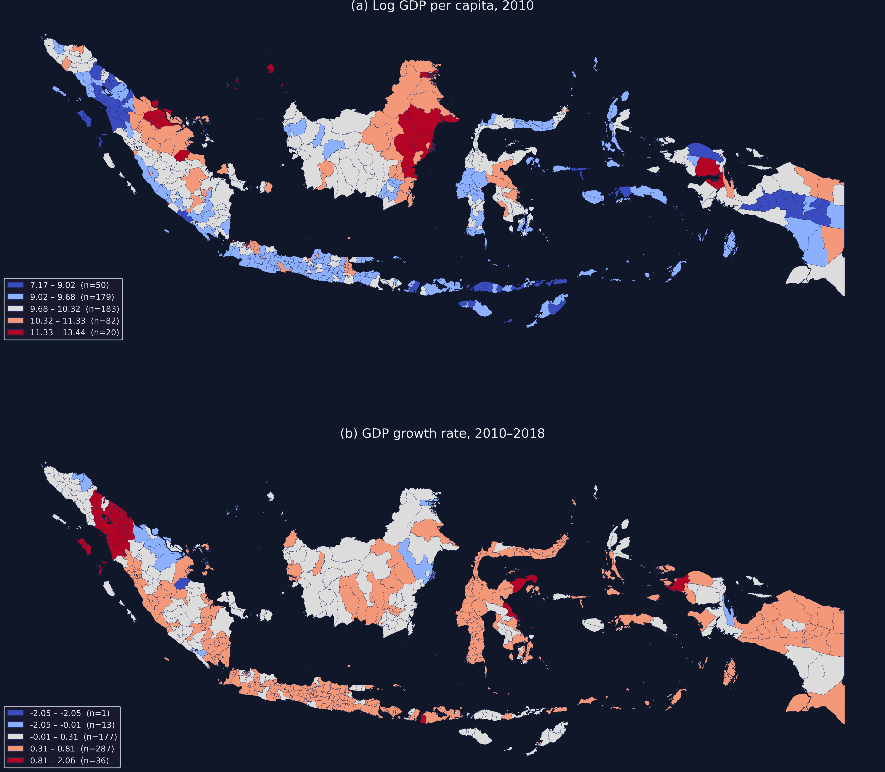
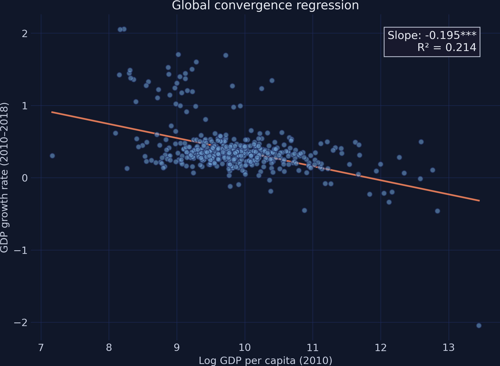
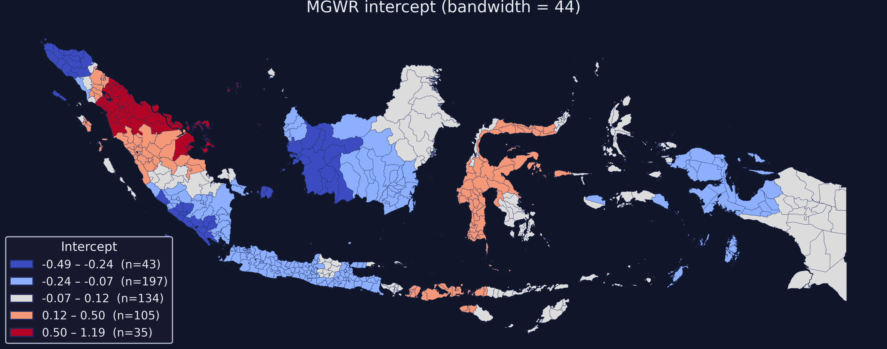
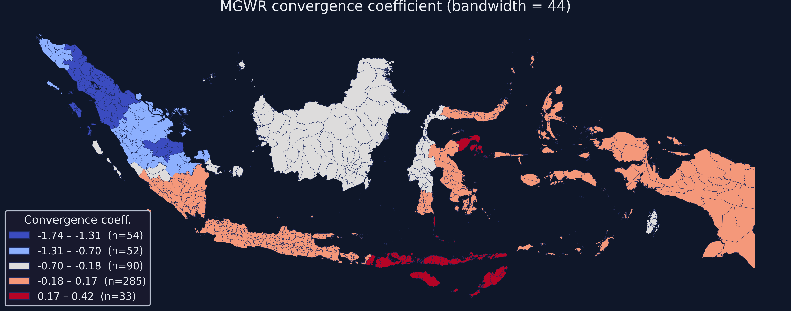
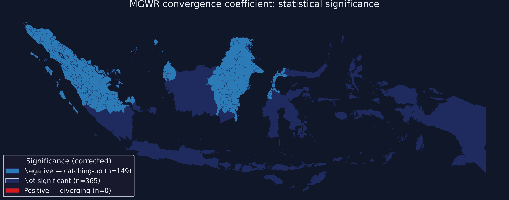

---
authors:
  - admin
categories:
  - Python
  - GWR and MGWR
  - Spatial inequality
draft: false
featured: false
date: "2026-03-22T00:00:00Z"
external_link: ""
image:
  caption: ""
  focal_point: Smart
  placement: 3
links:
- icon: chalkboard-teacher
  icon_pack: fas
  name: "Slides (HTML)"
  url: slides/index.html
- icon: laptop-code
  icon_pack: fas
  name: Web app
  url: web_app/index.html
- icon: code
  icon_pack: fas
  name: "Python script"
  url: script.py
- icon: file-code
  icon_pack: fas
  name: "Quarto project (.zip)"
  url: python_mgwr.zip
- icon: markdown
  icon_pack: fab
  name: "MD version"
  url: https://raw.githubusercontent.com/cmg777/starter-academic-v501/master/content/post/python_mgwr/index.md
slides:
summary: Applying Multiscale Geographically Weighted Regression (MGWR) to reveal how economic catching-up varies across Indonesia's 514 districts, with each variable operating at its own spatial scale
tags:
- python
- spatial
- regional
- cross-sectional data
title: "Multiscale Geographically Weighted Regression: Spatially Varying Economic Convergence in Indonesia"
url_code: ""
url_pdf: ""
url_slides: ""
url_video: ""
toc: true
diagram: true
---

## Abstract

National convergence statistics ask whether poorer regions catch up to richer ones, but a single global regression coefficient forces every locality onto the same line and can hide where the catching-up process actually operates. This tutorial asks whether economic convergence proceeds at the same pace everywhere in Indonesia or whether geography shapes how fast poorer districts close the gap. The analysis uses a cross-section of 514 Indonesian districts with log GDP per capita in 2010 and the subsequent growth rate through 2018, drawn from the QuaRCS data repository. Using Python's mgwr package together with GeoPandas and mapclassify, it progresses from a global OLS β-convergence baseline to Multiscale Geographically Weighted Regression (MGWR), which lets each standardized variable find its own spatial bandwidth via back-fitting. The global regression reports a single convergence coefficient of −0.195 (p < 0.001) but explains only 21% of growth variation (R² = 0.214). MGWR raises the fit to R² = 0.762 and lowers AICc from 1341.25 to 838.41, selecting a bandwidth of 44 districts (about 8.6% of the sample) for both the intercept and the slope and using 52.1 effective parameters. The convergence coefficient ranges from −1.74 (strong local catching-up) to +0.42 (local divergence), and only 149 of 514 districts (29%) show statistically significant convergence after multiple-testing correction, concentrated in western Sumatra and Kalimantan. These results imply that Indonesia's apparent national convergence is geographically selective, and that spatially targeted rather than uniform policies are needed to address an uneven development landscape.

## 1. Overview

When we ask "do poorer regions catch up to richer ones?", the standard approach is to run a single regression across all regions and report one coefficient. But what if the answer depends on *where* you look? A negative coefficient in Sumatra does not mean the same process is at work in Papua. A global regression forces every district onto the same line --- and in doing so, it may hide the most interesting part of the story.

**Multiscale Geographically Weighted Regression (MGWR)** addresses this by estimating a separate set of coefficients at every location, weighted by proximity. Its key innovation over standard GWR is that each variable is allowed to operate at its own spatial scale. The intercept (representing baseline growth conditions) might vary smoothly across large regions, while the convergence coefficient might shift sharply between neighboring districts. MGWR discovers these scales from the data rather than imposing a single bandwidth on all variables.

This tutorial applies MGWR to **514 Indonesian districts** to answer: **does economic catching-up happen at the same pace everywhere in Indonesia, or does geography shape how fast poorer districts close the gap?** We progress from a global regression baseline through MGWR estimation and coefficient mapping, revealing that the global R² of 0.214 jumps to 0.762 once we allow the relationship to vary across space.

**Learning objectives:**

- Understand why a single regression coefficient may hide important spatial variation
- Estimate location-specific relationships with spatially varying coefficients
- Apply MGWR to allow each variable to operate at its own spatial scale
- Map and interpret spatially varying coefficients across Indonesia
- Compare global OLS vs MGWR model fit and diagnostics

### Key concepts at a glance

The post leans on a small vocabulary repeatedly. The rest of the tutorial assumes you can move between these terms quickly. Each concept below has three parts. The **definition** is always visible. The **example** and **analogy** sit behind clickable cards: open them when you need them, leave them collapsed for a quick scan. If a later section mentions "bandwidth" or "spatial heterogeneity" and the term feels slippery, this is the section to re-read.

**1. Local regression** $\hat\beta(s)$ varies by location. One regression per location $s$, weighted by spatial proximity. Coefficients become functions of geographic position rather than fixed numbers.

<div class="concept-pair">
<details class="concept-card concept-example"><summary>Example</summary>

In this post the convergence coefficient $\hat\beta$ on `ln_gdppc2010` varies across the 514 Indonesian districts — from -1.74 (strong catching-up) to +0.42 (divergence).

</details>

<details class="concept-card concept-analogy"><summary>Analogy</summary>

Drawing a different best-fit line at each map dot, not one global line for the whole country.

</details>

</div>

**2. Bandwidth (kernel)** $h$. The number of nearest neighbours each local regression uses. Smaller $h$ = more localized, noisier estimates; larger $h$ = smoother but flatter.

<div class="concept-pair">
<details class="concept-card concept-example"><summary>Example</summary>

This post selects an optimal bandwidth of 44 districts (out of 514) for both regressors. Each local regression at a given district uses its 44 nearest neighbours.

</details>

<details class="concept-card concept-analogy"><summary>Analogy</summary>

The radius of the circle of friends a local model listens to before deciding.

</details>

</div>

**3. Spatial heterogeneity** $\beta\_i \neq \beta\_j$. Coefficients differ across space. The relationship between predictors and outcome is not constant geographically.

<div class="concept-pair">
<details class="concept-card concept-example"><summary>Example</summary>

In this post catching-up is *strong* in 149 of 514 districts (29% with significant negative β) but *insignificant or positive* in the other 365 districts. Convergence is not a single Indonesia-wide story.

</details>

<details class="concept-card concept-analogy"><summary>Analogy</summary>

Different family recipes in different villages — not the same dish everywhere.

</details>

</div>

**4. GWR vs MGWR** one $h$ vs $h$ per regressor. GWR uses a single bandwidth for *all* coefficients. MGWR allows each coefficient to have its own bandwidth, capturing the fact that different processes operate at different spatial scales.

<div class="concept-pair">
<details class="concept-card concept-example"><summary>Example</summary>

In this post both `ln_gdppc2010` and the intercept happen to share bandwidth = 44, but in general MGWR could have e.g. bandwidth 30 for one variable and 200 for another. The constraint relaxation is the methodological advance.

</details>

<details class="concept-card concept-analogy"><summary>Analogy</summary>

One volume knob for everyone vs each instrument with its own knob.

</details>

</div>

**5. Local R²** $R^2\_i$. The R² of the local regression at district $i$. Maps to a colour scale to show *where* the model fits well and *where* it struggles.

<div class="concept-pair">
<details class="concept-card concept-example"><summary>Example</summary>

This post maps local R² across Indonesia. Fits are strong in dense Java districts and weaker in sparse, remote eastern islands where the 44 nearest neighbours span huge geographic distances.

</details>

<details class="concept-card concept-analogy"><summary>Analogy</summary>

"How well-played is the song in *this* village".

</details>

</div>

**6. AICc model selection** lower AICc = better. The corrected Akaike Information Criterion penalizes model complexity. The standard MGWR-vs-OLS comparison.

<div class="concept-pair">
<details class="concept-card concept-example"><summary>Example</summary>

In this post global OLS has AICc = 1341.25 while MGWR has AICc = 838.41 — a difference of more than 500 strongly favours the spatially varying model.

</details>

<details class="concept-card concept-analogy"><summary>Analogy</summary>

The picky food critic comparing the two restaurants and giving a definitive verdict.

</details>

</div>

**7. β-convergence** $g\_i = \alpha + \beta \ln Y\_{i,0} + \varepsilon\_i$. The classic growth-economics test: poor regions catching up with rich ones leads to a *negative* β coefficient on initial income.

<div class="concept-pair">
<details class="concept-card concept-example"><summary>Example</summary>

This post's global β = -0.1948 (mild catching-up overall). MGWR reveals β ranges from -1.74 (strong local convergence) to +0.42 (local divergence). The story is heterogeneous and the global average hides this.

</details>

<details class="concept-card concept-analogy"><summary>Analogy</summary>

Poor districts catching up with rich ones. A negative slope means the gap shrinks; a positive slope means the gap widens.

</details>

</div>

**8. Effective number of parameters** trace of hat matrix. MGWR has more flexibility than OLS but less than fitting one regression per district. The "effective" parameter count quantifies this middle ground.

<div class="concept-pair">
<details class="concept-card concept-example"><summary>Example</summary>

This post's MGWR uses 52.076 effective parameters — far more than OLS's 2 but far less than 514×2 = 1,028 (one regression per district). MGWR finds the right level of model complexity automatically.

</details>

<details class="concept-card concept-analogy"><summary>Analogy</summary>

A soft count of how many independent knobs the model really has.

</details>

</div>

## 2. The modeling pipeline

The analysis follows a natural progression: start with a simple global model, visualize the spatial patterns it cannot capture, then let MGWR reveal the local structure.


## 3. Setup and imports

The analysis uses [mgwr](https://mgwr.readthedocs.io/) for multiscale regression, [GeoPandas](https://geopandas.org/) for spatial data, and [mapclassify](https://pysal.org/mapclassify/) for choropleth classification.

```python
import numpy as np
import pandas as pd
import geopandas as gpd
import matplotlib.pyplot as plt
from matplotlib.patches import Patch
import mapclassify
from scipy import stats
from mgwr.gwr import MGWR
from mgwr.sel_bw import Sel_BW
import warnings
warnings.filterwarnings("ignore")

# Site color palette
STEEL_BLUE = "#6a9bcc"
WARM_ORANGE = "#d97757"
NEAR_BLACK = "#141413"
TEAL = "#00d4c8"
```

<details>
<summary>Dark theme figure styling (click to expand)</summary>

```python
DARK_NAVY = "#0f1729"
GRID_LINE = "#1f2b5e"
LIGHT_TEXT = "#c8d0e0"
WHITE_TEXT = "#e8ecf2"

plt.rcParams.update({
    "figure.facecolor": DARK_NAVY,
    "axes.facecolor": DARK_NAVY,
    "axes.edgecolor": DARK_NAVY,
    "axes.linewidth": 0,
    "axes.labelcolor": LIGHT_TEXT,
    "axes.titlecolor": WHITE_TEXT,
    "axes.spines.top": False,
    "axes.spines.right": False,
    "axes.spines.left": False,
    "axes.spines.bottom": False,
    "axes.grid": True,
    "grid.color": GRID_LINE,
    "grid.linewidth": 0.6,
    "grid.alpha": 0.8,
    "xtick.color": LIGHT_TEXT,
    "ytick.color": LIGHT_TEXT,
    "xtick.major.size": 0,
    "ytick.major.size": 0,
    "text.color": WHITE_TEXT,
    "font.size": 12,
    "legend.frameon": False,
    "legend.fontsize": 11,
    "legend.labelcolor": LIGHT_TEXT,
    "figure.edgecolor": DARK_NAVY,
    "savefig.facecolor": DARK_NAVY,
    "savefig.edgecolor": DARK_NAVY,
})
```

</details>

## 4. Data loading and exploration

The dataset covers **514 Indonesian districts** with GDP per capita in 2010 and the subsequent growth rate through 2018. Indonesia is an ideal setting for studying spatial heterogeneity: it spans over 17,000 islands across 5,000 km of ocean, with enormous variation in economic structure, geography, and institutional capacity.

The core idea behind convergence is straightforward: if poorer districts tend to grow faster than richer ones, the income gap narrows over time. In a regression framework, this means we expect a **negative relationship** between initial income (log GDP per capita in 2010) and subsequent growth. The question is whether that negative relationship holds uniformly across the archipelago --- or whether it is stronger in some places and weaker (or even reversed) in others.

```python
CSV_URL = ("https://github.com/quarcs-lab/data-quarcs/raw/refs/heads/"
           "master/indonesia514/dataBeta.csv")
GEO_URL = ("https://github.com/quarcs-lab/data-quarcs/raw/refs/heads/"
           "master/indonesia514/mapIdonesia514-opt.geojson")

df = pd.read_csv(CSV_URL)
geo = gpd.read_file(GEO_URL)
gdf = geo.merge(df, on="districtID", how="left")

print(f"Loaded: {gdf.shape[0]} districts, {gdf.shape[1]} columns")
print(gdf[["ln_gdppc2010", "g"]].describe().round(4).to_string())
```

```text
Loaded: 514 districts, 16 columns
       ln_gdppc2010         g
count      514.0000  514.0000
mean         9.8371    0.3860
std          0.7603    0.3205
min          7.1657   -2.0452
25%          9.3983    0.2583
50%          9.7626    0.3453
75%         10.1739    0.4158
max         13.4438    2.0563
```

The 514 districts span a wide range of initial income: log GDP per capita ranges from 7.17 (the poorest district, roughly \\$1,300 per capita) to 13.44 (the richest, roughly \\$690,000 --- likely a resource-extraction enclave). Growth rates also vary enormously, from -2.05 (severe contraction) to +2.06 (rapid expansion), with a mean of 0.39. This high variance in both variables suggests that a single regression line will struggle to capture the full picture.

## 5. Exploratory maps

Before fitting any model, we map the two key variables to see whether spatial patterns are visible to the naked eye. If initial income and growth are geographically clustered, that is already a hint that spatial models will outperform global ones.

```python
fig, axes = plt.subplots(2, 1, figsize=(14, 14))

for ax, col, title in [
    (axes[0], "ln_gdppc2010", "(a) Log GDP per capita, 2010"),
    (axes[1], "g", "(b) GDP growth rate, 2010–2018"),
]:
    fj = mapclassify.FisherJenks(gdf[col].dropna().values, k=5)
    classified = mapclassify.UserDefined(gdf[col].values, bins=fj.bins.tolist())
    cmap = plt.cm.coolwarm
    norm = plt.Normalize(vmin=0, vmax=4)
    colors = [cmap(norm(c)) for c in classified.yb]
    gdf.plot(ax=ax, color=colors, edgecolor=GRID_LINE, linewidth=0.2)
    ax.set_title(title, fontsize=14, pad=10)
    ax.set_axis_off()

plt.tight_layout()
plt.savefig("mgwr_map_xy.png", dpi=300, bbox_inches="tight")
plt.show()
```



The maps reveal clear spatial structure. Initial income (panel a) is highest in Jakarta and resource-rich districts in Kalimantan and Papua (warm red), while the lowest-income districts cluster in eastern Nusa Tenggara and parts of Maluku (cool blue). Growth rates (panel b) show a different pattern: some of the poorest districts in Papua and Sulawesi experienced rapid growth (suggesting catching-up), while several high-income resource districts saw contraction. The fact that these patterns are geographically organized --- not randomly scattered --- motivates the use of spatially varying models.

## 6. Global regression baseline

The simplest test for economic convergence fits a single regression line through all 514 districts. If the slope is negative, poorer districts (low initial income) tend to grow faster than richer ones.

$$g\_i = \alpha + \beta \cdot \ln(y\_{i,2010}) + \varepsilon\_i$$

where $g\_i$ is the growth rate, $\ln(y\_{i,2010})$ is log initial income, and $\beta < 0$ indicates convergence. In the code, $g\_i$ corresponds to the column `g` and $\ln(y\_{i,2010})$ to `ln_gdppc2010`.

```python
slope, intercept, r_value, p_value, std_err = stats.linregress(
    gdf["ln_gdppc2010"], gdf["g"]
)

print(f"Slope (convergence coefficient): {slope:.4f}")
print(f"R-squared: {r_value**2:.4f}")
print(f"p-value: {p_value:.6f}")
```

```text
Slope (convergence coefficient): -0.1948
R-squared: 0.2135
p-value: 0.000000
```

```python
fig, ax = plt.subplots(figsize=(10, 7))

ax.scatter(gdf["ln_gdppc2010"], gdf["g"],
           color=STEEL_BLUE, edgecolors=GRID_LINE, s=35, alpha=0.6, zorder=3)

x_range = np.linspace(gdf["ln_gdppc2010"].min(), gdf["ln_gdppc2010"].max(), 100)
ax.plot(x_range, intercept + slope * x_range, color=WARM_ORANGE,
        linewidth=2, zorder=2)

ax.set_xlabel("Log GDP per capita (2010)")
ax.set_ylabel("GDP growth rate (2010–2018)")
ax.set_title("Global convergence regression")

plt.savefig("mgwr_scatter_global.png", dpi=300, bbox_inches="tight")
plt.show()
```



The global regression confirms that convergence exists **on average**: the slope is $-0.195$ (p < 0.001), meaning a 1-unit increase in log initial income is associated with a 0.195 percentage-point lower growth rate. However, the R² of only 0.214 means this single line explains just 21% of the variation in growth rates. The scatter plot shows enormous dispersion around the regression line --- many districts with similar initial income experienced vastly different growth trajectories. This low explanatory power is the motivation for MGWR: perhaps the relationship is not weak everywhere, but rather strong in some regions and absent in others, and a single coefficient is simply averaging over this heterogeneity.

## 7. From global to local: why MGWR?

### 7.1 The limitation of a single coefficient

The global regression tells us that $\beta = -0.195$ on average across Indonesia. But consider two districts with the same initial income --- one in Java, where infrastructure and market access are strong, and one in Papua, where remoteness and institutional challenges dominate. There is no reason to expect the same convergence dynamic in both places. A single coefficient forces them onto the same line.

**Geographically Weighted Regression (GWR)** addresses this by estimating a separate regression at each location, using a kernel function --- a distance-decay weighting scheme (typically Gaussian or bisquare) that gives more weight to nearby observations and less to distant ones. The result is a set of **location-specific coefficients** --- each district gets its own slope and intercept:

$$g\_i = \alpha(u\_i, v\_i) + \beta(u\_i, v\_i) \cdot \ln(y\_{i,2010}) + \varepsilon\_i$$

where $(u\_i, v\_i)$ are the geographic coordinates of district $i$, and both $\alpha$ and $\beta$ are now functions of location rather than fixed constants. In the code, $(u\_i, v\_i)$ correspond to `COORD_X` and `COORD_Y`. The **bandwidth** parameter $h$ controls how many neighbors contribute to each local regression --- a small bandwidth means only very close districts matter (highly local), while a large bandwidth approaches the global model.

However, standard GWR uses a single bandwidth for all variables, which means the intercept and the convergence coefficient are forced to vary at the same spatial scale.

**MGWR** removes this constraint. It allows each variable to find its own optimal bandwidth through an iterative back-fitting procedure --- a process that cycles through each variable, optimizing its bandwidth while holding the others fixed, until all bandwidths converge. If baseline growth conditions vary smoothly across large regions (large bandwidth), while the convergence speed varies sharply between neighboring districts (small bandwidth), MGWR will discover this from the data. This makes MGWR a more flexible and realistic model for processes that operate at multiple spatial scales. The key assumption is that spatial relationships are **locally stationary** within each kernel window --- the relationship between income and growth is approximately constant among the nearest $h$ districts, even if it differs across the full map.

### 7.2 MGWR estimation

The `mgwr` package requires variables to be **standardized** (zero mean, unit variance) before multiscale bandwidth selection. This ensures that the bandwidths are comparable across variables measured in different units. The `spherical=True` flag tells the algorithm to compute great-circle distances rather than Euclidean distances, which is essential when working with geographic coordinates spanning a large area like Indonesia.

```python
# Prepare variables
y = gdf["g"].values.reshape((-1, 1))
X = gdf[["ln_gdppc2010"]].values
coords = list(zip(gdf["COORD_X"], gdf["COORD_Y"]))

# Standardize (required for MGWR)
Zy = (y - y.mean(axis=0)) / y.std(axis=0)
ZX = (X - X.mean(axis=0)) / X.std(axis=0)

# Bandwidth selection and model fitting
mgwr_selector = Sel_BW(coords, Zy, ZX, multi=True, spherical=True)
mgwr_bw = mgwr_selector.search()
mgwr_results = MGWR(coords, Zy, ZX, mgwr_selector, spherical=True).fit()

mgwr_results.summary()
```

```text
===========================================================================
Model type                                                         Gaussian
Number of observations:                                                 514
Number of covariates:                                                     2

Global Regression Results
---------------------------------------------------------------------------
R2:                                                                   0.214
Adj. R2:                                                              0.212

Multi-Scale Geographically Weighted Regression (MGWR) Results
---------------------------------------------------------------------------
Spatial kernel:                                           Adaptive bisquare

MGWR bandwidths
---------------------------------------------------------------------------
Variable             Bandwidth      ENP_j   Adj t-val(95%)   Adj alpha(95%)
X0                      44.000     26.805            3.127            0.002
X1                      44.000     25.271            3.109            0.002

Diagnostic information
---------------------------------------------------------------------------
Residual sum of squares:                                            122.081
Effective number of parameters (trace(S)):                           52.076
Sigma estimate:                                                       0.514
R2                                                                    0.762
Adjusted R2                                                           0.736
AICc:                                                               838.405
===========================================================================
```

The MGWR results are striking. **R² jumps from 0.214 (global) to 0.762 (MGWR)** --- the spatially varying model explains more than three times as much variation as the global regression. Both the intercept and the convergence coefficient receive a bandwidth of 44, meaning each local regression draws on the 44 nearest districts. This is a relatively local scale (44 out of 514 districts, or about 8.6% of the sample), confirming that the convergence relationship varies substantially across the archipelago. The effective number of parameters is 52.1, reflecting the cost of estimating location-specific coefficients instead of two global ones.

### 7.3 Mapping MGWR coefficients

The power of MGWR lies in the coefficient maps. Instead of a single number for the whole country, we can now visualize how the convergence relationship changes from district to district. Because MGWR is estimated on standardized variables, the mapped coefficients are in **standard-deviation units**: a coefficient of $-1.0$ means that a one-standard-deviation increase in log initial income is associated with a one-standard-deviation decrease in growth at that location.

```python
gdf["mgwr_intercept"] = mgwr_results.params[:, 0]
gdf["mgwr_slope"] = mgwr_results.params[:, 1]
```

**Intercept map** --- the intercept captures baseline growth conditions after accounting for initial income. Positive values indicate districts that grew faster than expected given their income level; negative values indicate underperformance.

```python
fig, ax = plt.subplots(figsize=(14, 8))

# Fisher-Jenks classification with Patch legend (see script.py for details)
gdf.plot(ax=ax, column="mgwr_intercept", scheme="FisherJenks", k=5,
         cmap="coolwarm", edgecolor=GRID_LINE, linewidth=0.2, legend=True)
ax.set_title(f"MGWR intercept (bandwidth = {int(mgwr_bw[0])})")
ax.set_axis_off()

plt.savefig("mgwr_mgwr_intercept.png", dpi=300, bbox_inches="tight")
plt.show()
```



The intercept map reveals a clear east--west gradient. Districts in **western Indonesia** (Sumatra and Java) tend to have negative intercepts --- they grew **less** than the convergence model would predict based on their initial income alone. Districts in **eastern Indonesia** (Papua, Maluku, Nusa Tenggara) show positive intercepts, indicating growth that **exceeded** what initial income would predict. This pattern may reflect the role of resource extraction, infrastructure investment, and fiscal transfers that disproportionately boosted growth in less-developed eastern regions during the 2010--2018 period.

**Convergence coefficient map** --- the slope captures how strongly initial income predicts subsequent growth at each location. Large negative values indicate rapid catching-up; values near zero or positive indicate no convergence or divergence.

```python
fig, ax = plt.subplots(figsize=(14, 8))

gdf.plot(ax=ax, column="mgwr_slope", scheme="FisherJenks", k=5,
         cmap="coolwarm", edgecolor=GRID_LINE, linewidth=0.2, legend=True)
ax.set_title(f"MGWR convergence coefficient (bandwidth = {int(mgwr_bw[1])})")
ax.set_axis_off()

plt.savefig("mgwr_mgwr_slope.png", dpi=300, bbox_inches="tight")
plt.show()
```



The convergence coefficient map is the central finding of this analysis. The global regression reported a single $\beta = -0.195$, but MGWR reveals that this average hides enormous spatial variation. The **strongest catching-up** (deepest blue, coefficients as negative as $-1.74$) concentrates in **western Sumatra and parts of Kalimantan** --- districts where poorer areas grew much faster than richer neighbors. In contrast, most of **Java, eastern Indonesia, and the Maluku islands** show coefficients near zero (light pink), indicating that the convergence relationship is essentially absent in these areas. A handful of districts show weakly positive coefficients (up to 0.42), suggesting localized divergence where richer districts pulled further ahead. The coefficient ranges from $-1.74$ to $+0.42$, with a median of $-0.085$ and a standard deviation of 0.553 --- far from the single value of $-0.195$ reported by the global model.

### 7.4 Statistical significance

Not all local coefficients are statistically distinguishable from zero. MGWR provides t-values corrected for multiple testing, which we use to classify each district's convergence coefficient as significantly negative (catching-up), not significant, or significantly positive (diverging).

```python
mgwr_filtered_t = mgwr_results.filter_tvals()
t_sig = mgwr_filtered_t[:, 1]  # Slope t-values

sig_cats = np.where(t_sig < 0, "Negative (catching-up)",
           np.where(t_sig > 0, "Positive (diverging)", "Not significant"))

print(f"Negative (catching-up): {(sig_cats == 'Negative (catching-up)').sum()}")
print(f"Not significant: {(sig_cats == 'Not significant').sum()}")
print(f"Positive (diverging): {(sig_cats == 'Positive (diverging)').sum()}")
```

```text
Negative (catching-up): 149
Not significant: 365
Positive (diverging): 0
```

```python
fig, ax = plt.subplots(figsize=(14, 8))

cat_colors = {
    "Negative (catching-up)": "#2c7bb6",
    "Not significant": GRID_LINE,
    "Positive (diverging)": "#d7191c",
}
colors_sig = [cat_colors[c] for c in sig_cats]

gdf.plot(ax=ax, color=colors_sig, edgecolor=GRID_LINE, linewidth=0.2)
ax.set_title("MGWR convergence coefficient: statistical significance")
ax.set_axis_off()

plt.savefig("mgwr_mgwr_significance.png", dpi=300, bbox_inches="tight")
plt.show()
```



Of 514 districts, **149 (29%)** show statistically significant convergence at the corrected 5% level --- concentrated in **Sumatra, western Kalimantan, and Sulawesi**. The remaining **365 districts (71%)** have convergence coefficients that are not distinguishable from zero after correcting for multiple comparisons. **No district** shows significant divergence. This means that while the global regression detects convergence on average, it is actually driven by a minority of districts --- primarily in western Indonesia --- while the majority of the archipelago shows no significant relationship between initial income and growth.

## 8. Model comparison

The table below summarizes how much explanatory power the spatially varying model adds over the global baseline.

```python
print(f"{'Metric':<25} {'Global OLS':>12} {'MGWR':>12}")
print(f"{'R²':<25} {0.2135:>12.4f} {0.7625:>12.4f}")
print(f"{'Adj. R²':<25} {0.2120:>12.4f} {0.7357:>12.4f}")
print(f"{'AICc':<25} {1341.25:>12.2f} {838.41:>12.2f}")
print(f"{'Bandwidth (intercept)':<25} {'all (514)':>12} {'44':>12}")
print(f"{'Bandwidth (slope)':<25} {'all (514)':>12} {'44':>12}")
```

```text
Metric                      Global OLS         MGWR
R²                              0.2135       0.7625
Adj. R²                         0.2120       0.7357
AICc                           1341.25       838.41
Bandwidth (intercept)        all (514)           44
Bandwidth (slope)            all (514)           44
```

MGWR more than triples the explained variance ($R^2$: 0.214 to 0.762) and dramatically reduces the AICc from 1341 to 838, confirming that the improvement in fit is not merely due to additional flexibility. The bandwidth of 44 for both variables means each local regression uses the nearest 44 districts (about 8.6% of the sample), confirming that the convergence process is highly localized. The adjusted $R^2$ of 0.736 accounts for the additional complexity (52 effective parameters vs 2 in OLS) and still shows a massive improvement, indicating that the spatial variation in coefficients is genuine and not overfitting.

## 9. Discussion

**Economic catching-up in Indonesia is not uniform --- it is concentrated in western Sumatra and parts of Kalimantan, while most of the archipelago shows no significant convergence.** The global regression's $\beta = -0.195$ suggests a moderate convergence tendency, but MGWR reveals that this average is driven by a subset of 149 districts (29%) with strong catching-up dynamics. The remaining 365 districts have convergence coefficients indistinguishable from zero.

The intercept map adds another dimension: eastern Indonesian districts tend to have positive intercepts (above-expected growth), while western districts have negative intercepts (below-expected growth). This east--west gradient likely reflects the impact of fiscal transfers, resource booms, and infrastructure programs that targeted less-developed regions during the 2010--2018 period. Combined with the convergence coefficient map, the picture is nuanced: eastern Indonesia grew faster than expected (high intercept), but not because of convergence dynamics (near-zero slope) --- rather, because of other factors captured by the intercept.

For policy, these findings challenge the assumption that national-level convergence statistics reflect what is happening locally. A policymaker looking at $\beta = -0.195$ might conclude that Indonesia's development strategy is successfully closing regional gaps. MGWR reveals that catching-up is geographically selective, and the majority of districts are not on a convergence path at all. Spatially targeted interventions --- rather than uniform national programs --- may be needed to address this uneven landscape.

## 10. Summary and next steps

**Key takeaways:**

- **Method insight:** MGWR reveals spatial heterogeneity invisible to global regression. R² improves from 0.214 to 0.762 by allowing location-specific coefficients. Both variables operate at a bandwidth of 44 districts (~8.6% of the sample), indicating highly localized economic dynamics. Variable standardization is essential before MGWR estimation.
- **Data insight:** Only 149 of 514 Indonesian districts (29%) show statistically significant convergence, concentrated in Sumatra and Kalimantan. The convergence coefficient ranges from $-1.74$ to $+0.42$, far from the global average of $-0.195$. Eastern Indonesia grows faster than expected (positive intercepts) but not through convergence --- the catching-up mechanism is absent there.
- **Limitation:** The bivariate model (one independent variable) is intentionally simple for pedagogical purposes. Real convergence analysis would include controls for human capital, infrastructure, institutional quality, and sectoral composition. The bandwidth of 44 applies to both variables in this case, but with additional covariates, MGWR's ability to assign different bandwidths per variable would be more visible.
- **Next step:** Extend the model with additional covariates (education, investment, fiscal transfers) to disentangle the sources of spatial heterogeneity. Apply MGWR to panel data with multiple time periods. Compare MGWR results with the spatial clusters identified in the [ESDA tutorial](/post/python_esda2/) to see whether convergence hotspots align with LISA clusters.

## 11. Exercises

1. **Add a second variable.** Include an education indicator (e.g., years of schooling) as a second independent variable and re-run MGWR. Do the two covariates receive different bandwidths? What does that tell you about the spatial scale at which education affects growth?

2. **Map the t-values.** Instead of mapping the raw coefficients, map the local t-statistics from `mgwr_results.tvalues[:, 1]`. How does this map compare to the significance map based on corrected t-values?

3. **Compare with ESDA.** Run a Moran's I test on the MGWR residuals. Is there remaining spatial autocorrelation? If not, MGWR has successfully captured the spatial structure. If yes, what might be missing?

## 12. References

1. [Fotheringham, A. S., Yang, W., and Kang, W. (2017). Multiscale Geographically Weighted Regression (MGWR). *Annals of the American Association of Geographers*, 107(6), 1247--1265.](https://doi.org/10.1080/24694452.2017.1352480)
2. [Oshan, T. M., Li, Z., Kang, W., Wolf, L. J., and Fotheringham, A. S. (2019). mgwr: A Python Implementation of Multiscale Geographically Weighted Regression. *JOSS*, 4(42), 1750.](https://doi.org/10.21105/joss.01750)
3. [Brunsdon, C., Fotheringham, A. S., and Charlton, M. E. (1996). Geographically Weighted Regression: A Method for Exploring Spatial Nonstationarity. *Geographical Analysis*, 28(4), 281--298.](https://doi.org/10.1111/j.1538-4632.1996.tb00936.x)
4. [Fotheringham, A. S., Brunsdon, C., and Charlton, M. (2002). *Geographically Weighted Regression: The Analysis of Spatially Varying Relationships*. Wiley.](https://www.wiley.com/en-us/Geographically+Weighted+Regression-p-9780471496168)
5. [Mendez, C. and Jiang, Q. (2024). Spatial Heterogeneity Modeling for Regional Economic Analysis: A Computational Approach Using Python and Cloud Computing. Working Paper, Nagoya University.](https://carlos-mendez.org/publication/20241219-ae/)
6. [mgwr documentation](https://mgwr.readthedocs.io/)

#### Acknowledgements

AI tools (Claude Code, Gemini, NotebookLM) were used to make the contents of this post more accessible to students. Nevertheless, the content in this post may still have errors. Caution is needed when applying the contents of this post to true research projects.
