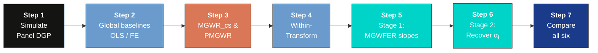
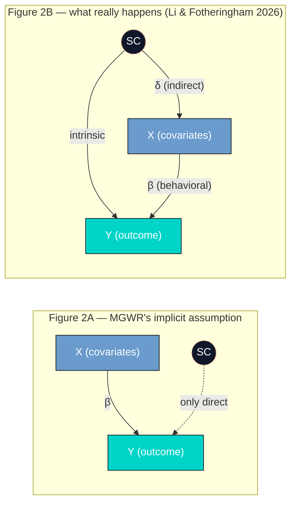
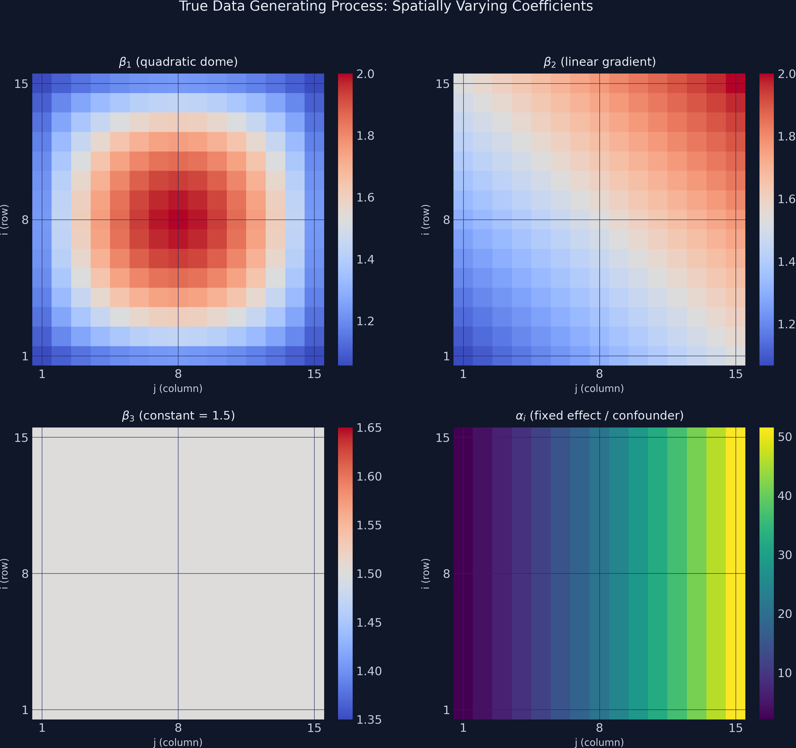
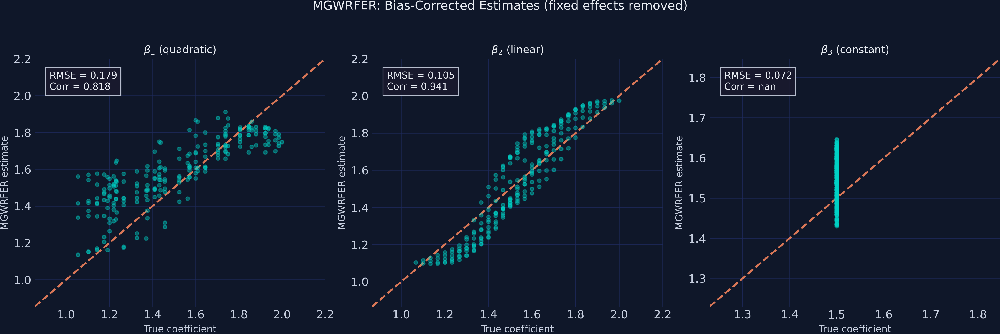
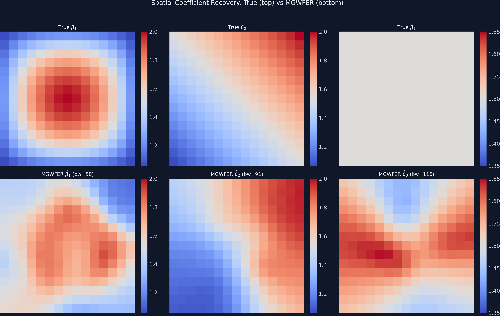
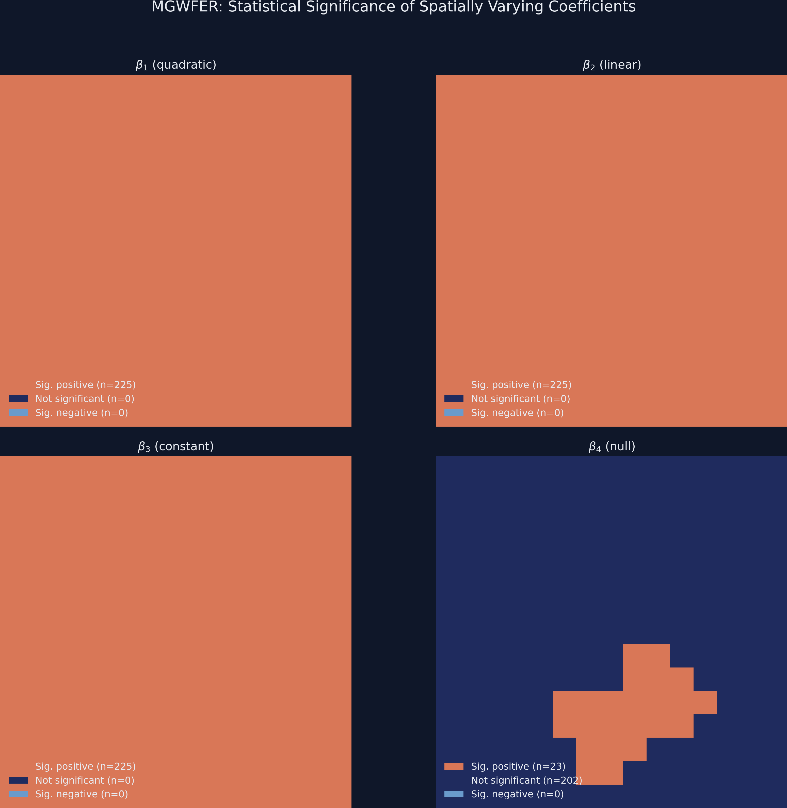

---
authors:
  - admin
categories:
  - Python
  - Tutorial
  - MGWR
  - Causal Inference
  - Spatial Analysis
  - Panel Data
date: "2026-05-03T00:00:00Z"
draft: false
featured: false
external_link: ""
image:
  caption: ""
  focal_point: Smart
  placement: 3
links:
  - icon: code
    icon_pack: fas
    name: "Python script"
    url: script.py
  - icon: open-data
    icon_pack: ai
    name: "[Python] Google Colab"
    url: https://colab.research.google.com/github/cmg777/starter-academic-v501/blob/master/content/post/python_mgwrfer/notebook.ipynb
  - icon: markdown
    icon_pack: fab
    name: "MD version"
    url: https://raw.githubusercontent.com/cmg777/starter-academic-v501/master/content/post/python_mgwrfer/index.md
  - icon: podcast
    icon_pack: fas
    name: AI Podcast
    url: "/post/python_mgwrfer/#podcast-player"
slides:
summary: A faithful Python tutorial on Li & Fotheringham (2026) — using a two-stage MGWFER algorithm to remove time-invariant spatial confounders from Multiscale GWR and recover both unbiased spatially varying slopes and intrinsic contextual effects from simulated panel data (225 units x 3 periods).
tags:
  - python
  - spatial
  - causal
  - panel data
  - fixed effects
title: "MGWFER: Causal Spatially Varying Coefficients via Panel Fixed Effects"
url_code: ""
url_pdf: ""
url_slides: ""
url_video: ""
toc: true
diagram: true
---

## 1. Overview

When we estimate how relationships vary across space — say, the effect of education on income in different neighborhoods — a hidden danger lurks. If some unobserved attribute of place (geographic amenities, historical institutions, persistent social norms) affects both the outcome and the covariates, our spatially varying coefficients absorb that contamination. The result: coefficients that look like local effects but actually reflect omitted variable bias.

This post is a Python tutorial faithful to [Li & Fotheringham (2026)](https://doi.org/10.1080/24694452.2026.2654481), *"Spatial Context as a Time-Invariant Confounder: A Fixed-Effects Extension of MGWR,"* *Annals of the American Association of Geographers*. The paper introduces **Multiscale Geographically Weighted Fixed Effects Regression (MGWFER)**, a local panel framework that combines two powerful ideas: (1) a *within-transformation* that removes all time-invariant confounders from panel data, and (2) *Multiscale GWR* that estimates location-specific coefficients at variable-optimal spatial scales. Think of it as giving each location its own regression while simultaneously controlling for everything about that location that does not change over time.

This tutorial asks: **can we recover the true spatially varying coefficients — and the intrinsic contextual effects themselves — when an unobserved spatial context drives both the outcome and the covariate levels?** We simulate a panel of 225 spatial units observed over 3 time periods using the paper's DGP verbatim (the indirect channel `sc → x_k` is active, with `Cor(x_k, sc) ≈ 0.84`), and compare six estimators across the full lineup the paper considers: cross-sectional OLS, pooled OLS, individual FE, cross-sectional MGWR, pooled MGWR (PMGWR), and MGWFER. The answer is yes on both counts: MGWFER cuts the most-biased local coefficient's error by ~92% (β₁ RMSE 2.30 → 0.18, with the sign of the correlation against truth flipping from −0.46 to +0.82), and **Stage 2** recovers the unit-level fixed effects with Pearson correlation **≈1.000** (0.9996) against the true confounder surface.

**Learning objectives:**

- Distinguish the **three kinds of contextual effects** (intrinsic, behavioral, indirect) that the paper formalises.
- See, via a causal DAG and a one-page Wooldridge derivation, *why* an unobserved spatial context produces omitted-variable bias in MGWR.
- Implement the **two-stage MGWFER algorithm**: Stage 1 (within-transform + standardise + MGWR + back-transform) and Stage 2 (recover individual fixed effects with per-unit t-tests).
- Compare PMGWR and MGWFER on RMSE, correlation, bandwidths, significance maps, and the recovered fixed-effects surface.
- Audit the **four identification assumptions** under which MGWFER yields a causal interpretation, and the limitations that survive.

The analysis follows the paper's progression: simulate known truth, fit the naive PMGWR, apply the within-transform, fit MGWFER, recover the fixed effects, then compare.



The key insight is at Step 3: by subtracting each unit's time-series mean, the confounder vanishes — it contributes the same amount at every time period, so the mean subtraction cancels it exactly. What remains is pure within-unit variation, driven only by the spatially varying coefficients and noise. Stage 2 then walks the algorithm backwards: once we have the slopes, we recover the fixed effects $\alpha\_i$ themselves as a substantive quantity of interest.

## 2. Three kinds of contextual effects

Li & Fotheringham (2026) reorganise how *place* can shape behaviour by splitting "contextual effects" into three categories. Two were already in the MGWR vocabulary; the third is the paper's headline contribution and the reason MGWFER exists.

1. **Intrinsic contextual effects.** Unmeasured attributes of place (traditions, local norms, persistent geographic conditions) that *directly* shift the outcome. In MGWR these are captured by the **local intercept** $\alpha\_{bw0}(u\_i, v\_i)$. In MGWFER they are captured by the **individual fixed effect** $\alpha\_i$.

2. **Behavioral contextual effects.** How place *modulates the slopes* — i.e., the elasticities between $y$ and each covariate $x\_k$. In MGWR these are the spatially varying coefficients $\beta\_{bwk}(u\_i, v\_i)$, allowed to operate at covariate-specific bandwidths.

3. **Indirect contextual effects** *(the paper's key addition).* How place shapes the *levels of the covariates themselves*. Wealthy regions tend to invest more in transit; coastal regions have more tourism; old-industrial regions have higher unemployment. The covariates are not exogenous — they have a backdoor link through spatial context. Standard MGWR's exogeneity assumption denies this channel.

It is the third channel that contaminates MGWR estimates: because spatial context can both raise the levels of the $x\_k$'s and shift $y$ directly, ignoring it creates a spurious correlation between covariates and outcomes that looks like a "local effect." MGWFER's within-transformation severs that backdoor path by removing every time-invariant component of place from both sides of the regression.

> "Spatial context, as part of unmeasured factors, however, probably exerts a profound and widespread influence on a wide range of socioeconomic factors. Under these conditions, MGWR would suffer from endogeneity and potentially support misleading correlations between covariates and the response variable." — Li & Fotheringham (2026)

## 3. Spatial context as a confounder: a causal-diagram view

The intuition is cleanest in the language of directed acyclic graphs (DAGs; Pearl 2009). Two graphs are at issue.



In **Figure 2A**, spatial context only touches $Y$ directly — there is no backdoor path from $X$ to $Y$ through $SC$, and MGWR's coefficient estimates can be read causally (under the usual exogeneity assumption). In **Figure 2B** — the realistic structure — $SC$ is a parent of *both* $X$ and $Y$. There is now a non-causal backdoor path $X \leftarrow SC \rightarrow Y$ that opens whenever $SC$ is left unconditioned-upon. That open path is what biases the MGWR estimates.

The formal demonstration, adapted from Wooldridge (2010, 65-67) and equations 4-8 in the paper, takes one paragraph. Write the true model with spatial context $sc$ entering linearly:

$$y = \beta\_0 + x\_1 \beta\_1 + \cdots + x\_K \beta\_K + sc + \varepsilon, \quad E[\varepsilon \mid x, sc] = 0.$$

Since $sc$ is unobservable, it is absorbed into the error term $\mu = sc + \varepsilon$. If $sc$ has a linear projection on the covariates,

$$sc = \delta\_0 + x\_1 \delta\_1 + \cdots + x\_K \delta\_K + \eta,$$

then substituting and rearranging yields:

$$y = (\beta\_0 + \delta\_0) + x\_1 (\beta\_1 + \delta\_1) + \cdots + x\_K (\beta\_K + \delta\_K) + (\varepsilon + \eta).$$

OLS (or MGWR) recovers **$\hat\beta\_k = \beta\_k + \delta\_k$**, not $\beta\_k$. The bias term $\delta\_k$ is exactly the indirect contextual effect — the strength of the link from $SC$ to $x\_k$. When that link is non-trivial, the estimates are systematically wrong, and *the magnitude of the bias is the magnitude of the indirect contextual effect.* MGWFER's within-transformation eliminates the time-invariant component of $sc$ (which, by the paper's assumption, is *all* of $sc$), neutralising $\delta\_k$ and restoring identification of $\beta\_k$.

### 3.1 Key concepts at a glance

The post leans on a small vocabulary repeatedly. The rest of the tutorial assumes you can move between these terms quickly. Each concept below has three parts. The **definition** is always visible. The **example** and **analogy** sit behind clickable cards: open them when you need them, leave them collapsed for a quick scan. If a later section mentions "within-transformation" or "bandwidth selection" and the term feels slippery, this is the section to re-read.

**1. Spatially varying coefficients** $\beta\_j(u\_i, v\_i)$.
A regression coefficient that depends on location. Each unit $i$ at coordinates $(u\_i, v\_i)$ has its own slope on covariate $j$. The coefficient surface tells you where the predictor matters more or less. It is the *signal* MGWR is built to estimate.

<div class="concept-pair">
<details class="concept-card concept-example">
<summary>Example</summary>

True $\beta\_1$ in this simulation ranges from 1.06 to 2.00 across the 15×15 grid — the effect of `x1` on `y` is roughly twice as large in some districts as in others. True $\beta\_3 = 1.5$ everywhere (a constant). True $\beta\_4 = 0$ everywhere (a null effect we hope MGWR will *not* spuriously detect).

</details>

<details class="concept-card concept-analogy">
<summary>Analogy</summary>

A weather map of barometric sensitivity. In some valleys a 1-degree drop spawns a thunderstorm. On the plains, the same drop does nothing. The map of sensitivities, not the average sensitivity, is what tells the meteorologist where to send the warning.

</details>
</div>

**2. Time-invariant confounder (fixed effect)** $\alpha\_i$.
A unit-specific shift that contributes equally at every time period. It contaminates pooled estimators because it is correlated with the covariates. Within-unit variation is its blind spot. Cross-unit variation is its playground. In the paper's framing, $\alpha\_i$ is the **statistical operationalisation of spatial context** — the unmeasurable place-based factors that the within-transformation will eliminate.

<div class="concept-pair">
<details class="concept-card concept-example">
<summary>Example</summary>

In our simulation $\alpha\_i$ (= `sc_i` in the paper) ranges from 2.07 to 51.55 across the 225 units, exponential in column index. It enters the outcome equation directly *and* it drives the levels of every covariate (paper Eqs. 40-43). PMGWR cannot disentangle these channels: it conflates `sc_i` with the spatially varying coefficients, returning $\hat{\beta}\_1$ estimates anti-correlated with the truth.

</details>

<details class="concept-card concept-analogy">
<summary>Analogy</summary>

A stain printed on the negative before each exposure. Every photograph from that camera carries the same blot. Stitching three photos together does not reveal the scene; it reveals the blot.

</details>
</div>

**3. Within-transformation (demeaning)** $\tilde{y}\_{it} = y\_{it} - \bar{y}\_i$.
Subtract each unit's time-series mean from each observation. The unit-specific shift $\alpha\_i$ vanishes by construction. What remains is within-unit variation: the part of `y` that moves over time inside one unit.

<div class="concept-pair">
<details class="concept-card concept-example">
<summary>Example</summary>

Raw `y` ranges from -4.07 to 57.41 (a span of 61). Demeaned `y` ranges from -6.88 to 6.92 (a span of 14). The bulk of the original variation was *between* units; demeaning isolates the *within*-unit signal that identifies the spatially varying coefficients.

</details>

<details class="concept-card concept-analogy">
<summary>Analogy</summary>

Subtracting the watermark from every page of a stamped manuscript. The text underneath is what you came for. Until you remove the watermark, every page looks dominated by it.

</details>
</div>

**4. Multiscale GWR (MGWR)**.
A geographically weighted regression where each covariate gets its own optimal bandwidth. Local effects vary at different scales: some predictors smooth out over large neighbourhoods, others change house-by-house. MGWR learns those scales from the data.

<div class="concept-pair">
<details class="concept-card concept-example">
<summary>Example</summary>

In this post MGWFER fits four covariates (`x1`-`x4`). After bandwidth selection, MGWFER assigns bandwidths [50, 91, 116, 62] — `x1` operates on tight neighbourhoods of ~50 nearest units, `x3` on broader ~116-unit windows. PMGWR collapses every bandwidth to 44–50 (because the strong sc-coupling makes every covariate look the same locally), and cross-sectional MGWR returns [48, 91, 98, 52] for a different reason (no panel structure to exploit at all).

</details>

<details class="concept-card concept-analogy">
<summary>Analogy</summary>

A camera with one zoom lens per channel. The red channel zooms tight on a face. The blue channel pulls back to capture sky. A single fixed zoom for all channels would smear them.

</details>
</div>

**5. Bandwidth selection**.
The hyperparameter that controls kernel smoothness around each location. Cross-validation picks the bandwidth that minimizes a corrected AICc or similar criterion. When the data contain a fixed effect, the cross-validation criterion is contaminated and picks the wrong bandwidths.

<div class="concept-pair">
<details class="concept-card concept-example">
<summary>Example</summary>

PMGWR assigns `x4` (a null effect) a bandwidth of 46 — small but driven by spurious sc-aligned spatial structure that the model misreads as "local". After demeaning, MGWFER assigns `x4` a bandwidth of 62, closer to local truth, with a 10.2% false-positive rate (202/225 units correctly flagged non-significant) — even though MGWFER's `β_4` RMSE is 13× smaller than PMGWR's.

</details>

<details class="concept-card concept-analogy">
<summary>Analogy</summary>

A focal length on a camera lens. Auto-focus picks it from what is in the viewfinder. If a smear of mist is in the way, auto-focus locks onto the smear and the actual subject blurs out.

</details>
</div>

**6. Pooled MGWR (PMGWR)**.
The naive baseline. Treats the 675 observations as an unstructured cross-section. Ignores that 3 of every 3 observations come from the same `unit_id`. Cannot remove $\alpha\_i$. Produces biased coefficient surfaces. The paper calls this *pooled multiscale geographically weighted regression* and uses it as the reference point against which MGWFER is benchmarked.

<div class="concept-pair">
<details class="concept-card concept-example">
<summary>Example</summary>

PMGWR returns $\beta\_1$ RMSE = 2.30 with a coefficient correlation of **−0.46** against the truth — its $\beta\_1$ map is *anti-correlated* with the real signal, the worst possible outcome for a model that is supposed to recover spatial heterogeneity. It also "detects" a strongly spatially varying $\beta\_4$ that is actually zero everywhere. The pooled estimator is the wrong baseline because the indirect contextual channel makes every covariate a noisy proxy for `sc`, which the pooled fit blames on the slopes.

</details>

<details class="concept-card concept-analogy">
<summary>Analogy</summary>

Stitching three photographs of a moving subject without aligning them first. The composite looks like a triple-exposed ghost. Each photograph individually was fine; the lack of alignment ruined the panorama.

</details>
</div>

**7. MGWFER** — Multiscale Geographically Weighted **F**ixed **E**ffects **R**egression.
The proposed estimator (Li & Fotheringham 2026). A *two-stage* algorithm: **Stage 1** within-transforms the data, standardises, fits MGWR on the demeaned panel, and back-transforms coefficients to the original scale. **Stage 2** then recovers the individual fixed effects $\alpha\_i$ themselves (Eq. 30 of the paper), with t-tests at the unit level. The fixed effect is purged before the spatial smoother runs, so the bandwidth search and the coefficient surface are no longer contaminated, and the recovered $\alpha\_i$ become a substantive output, not a nuisance term.

<div class="concept-pair">
<details class="concept-card concept-example">
<summary>Example</summary>

MGWFER cuts $\beta\_1$ RMSE from PMGWR's 2.30 to **0.18** (a 92% reduction) and $\beta\_4$ RMSE from 1.86 to **0.14** (a 92% reduction). The coefficient correlation with truth flips from −0.46 to **+0.82** for $\beta\_1$. Stage 2 recovers $\hat\alpha\_i$ with **Pearson correlation ≈1.000 (0.9996)** against the true spatial-context surface and **RMSE 0.54** on a 2–52 scale, with 225/225 units significant at 5%. Where PMGWR estimates the intrinsic contextual effect at range [−11, 10] (off by ~5× and shifted negative) and MGWR_cs at [2, 22] (compressed by 2.5×), MGWFER reaches [1.45, 51.62] — essentially the truth.

</details>

<details class="concept-card concept-analogy">
<summary>Analogy</summary>

Aligning then stitching. Subtract the watermark first, focus the camera second, then assemble the panorama. The composite is duller than the contaminated version, because the contamination was bright. But it is correct — and Stage 2 hands you a clean print of the watermark itself.

</details>
</div>

**8. Indirect contextual effects** $\delta\_k$.
The bias channel that motivates MGWFER. If unobserved spatial context $sc$ affects the *levels* of covariate $x\_k$, then OLS / MGWR recovers $\beta\_k + \delta\_k$ instead of $\beta\_k$. The within-transformation severs the $sc \to x\_k$ link by removing the time-invariant component of $sc$ from both sides of the regression. This is the paper's key conceptual addition to the MGWR vocabulary.

<div class="concept-pair">
<details class="concept-card concept-example">
<summary>Example</summary>

In our DGP we couple every covariate to spatial context (`x_k = 0.05·sc + N(0, 0.5)`, paper Eqs. 40-43), so the indirect channel is fully active: `Cor(x_k, sc) ≈ 0.84` and `Cor(x_4, y) ≈ 0.84` even though `β_4 = 0`. The consequence is dramatic — global OLS estimates `β_4 ≈ 4.8` (significant at p < 1e-13); cross-sectional MGWR and PMGWR produce `β_1` estimates that are *anti-correlated* with truth (Corr ≈ -0.4). MGWFER's within-transformation severs the `sc → x_k` link and pulls the estimates back to the true values.

</details>

<details class="concept-card concept-analogy">
<summary>Analogy</summary>

A music studio where humidity (unmeasured) both warps the guitar strings (covariate) and dampens the room acoustics (outcome). If you blame the muffled recording on the guitar tuning, you're confusing $\delta$ (the warp) with $\beta$ (the genuine string-to-sound mapping). Removing the time-invariant part of humidity from the recording is the within-transformation.

</details>
</div>

## 4. Setup and imports

The analysis uses a [custom fork of the mgwr package](https://github.com/GeoZhipengLi/MGWPR) that extends MGWR with panel data support (the `time` parameter) and the ability to fit without an intercept (`constant=False`). We clone the repository and import directly.

```python
import numpy as np
import pandas as pd
import matplotlib.pyplot as plt
from scipy import stats
import warnings
warnings.filterwarnings("ignore", category=FutureWarning)
warnings.filterwarnings("ignore", category=RuntimeWarning)

# Clone custom MGWR package
import subprocess, sys, os
REPO_DIR = os.path.join(os.path.dirname(os.path.abspath(__file__)), "mgwpr_repo")
if not os.path.exists(REPO_DIR):
    subprocess.run(
        ["git", "clone", "https://github.com/GeoZhipengLi/MGWPR.git", REPO_DIR],
        check=True, capture_output=True
    )
sys.path.insert(0, REPO_DIR)

from mgwr.gwr import GWR, MGWR
from mgwr.sel_bw import Sel_BW

# Configuration
RANDOM_SEED = 42
np.random.seed(RANDOM_SEED)
N_GRID = 15
N_UNITS = N_GRID * N_GRID   # 225
N_TIME = 3
N_OBS = N_UNITS * N_TIME    # 675
```

<details>
<summary>Dark theme figure styling (click to expand)</summary>

```python
DARK_NAVY = "#0f1729"
GRID_LINE = "#1f2b5e"
LIGHT_TEXT = "#c8d0e0"
WHITE_TEXT = "#e8ecf2"
STEEL_BLUE = "#6a9bcc"
WARM_ORANGE = "#d97757"
TEAL = "#00d4c8"

plt.rcParams.update({
    "figure.facecolor": DARK_NAVY,
    "axes.facecolor": DARK_NAVY,
    "axes.edgecolor": DARK_NAVY,
    "axes.linewidth": 0,
    "axes.labelcolor": LIGHT_TEXT,
    "axes.titlecolor": WHITE_TEXT,
    "axes.spines.top": False,
    "axes.spines.right": False,
    "axes.spines.left": False,
    "axes.spines.bottom": False,
    "axes.grid": True,
    "grid.color": GRID_LINE,
    "grid.linewidth": 0.6,
    "grid.alpha": 0.8,
    "xtick.color": LIGHT_TEXT,
    "ytick.color": LIGHT_TEXT,
    "text.color": WHITE_TEXT,
    "font.size": 12,
    "legend.frameon": False,
    "savefig.facecolor": DARK_NAVY,
    "savefig.edgecolor": DARK_NAVY,
})
```

</details>

## 5. Simulating panel data with a spatial confounder

To evaluate whether MGWFER works, we need **ground truth** — known coefficient surfaces that we can compare against estimates. We follow the paper's DGP (Eqs. 39–45) verbatim, scaled to a 15×15 grid (225 units) observed over 3 time periods, giving 675 total observations. The paper uses a 30×30 grid; we keep a smaller grid so the bandwidth search completes in minutes rather than hours, while still exercising every step of the two-stage algorithm and every result the paper reports.

The crucial design choice is that **each covariate is generated as a function of spatial context**: `x_kt = N(0, 0.5) + 0.05·sc_i` for `k=1..4`. This is the **indirect contextual effect channel** the paper is built to address — `sc` drives *both* the outcome (directly) *and* the covariate levels (indirectly). When the script runs, it prints the resulting `Cor(x_k, sc) ≈ 0.84` for all `k`, confirming that the indirect channel is strong. The reduced-form consequence: `Cor(x_4, y) = 0.84` even though `β_4 = 0` by construction — a textbook spurious correlation that any model failing to condition on `sc` will misinterpret as a real effect.

The data generating process (DGP) has two parts. **The outcome equation** combines three causally-active covariates with known spatially varying slopes plus a time-invariant fixed effect (paper Eq. 45):

$$y\_{it} = sc\_i + \beta\_1(u\_i, v\_i) \cdot x\_{1,it} + \beta\_2(u\_i, v\_i) \cdot x\_{2,it} + \beta\_3(u\_i, v\_i) \cdot x\_{3,it} + \varepsilon\_{it}$$

Note that `x_4` does *not* appear here — by construction `β_4 ≡ 0`, so `x_4` has no causal effect on `y`. **The covariate equation** is the part that activates the indirect contextual channel (paper Eqs. 40–43):

$$x\_{k,it} = 0.05 \cdot sc\_i + \nu\_{k,it}, \quad \nu\_{k,it} \sim N(0, 0.5), \quad k = 1, 2, 3, 4.$$

In words, every covariate is a noisy linear function of spatial context. Wealthy regions invest more in transit; coastal regions have more tourism; persistent-poverty regions have low education. Even `x_4`, which has no causal effect on `y`, shares the common parent `sc` with `y`, so `Cor(x_4, y) ≈ 0.84` — a spurious correlation that any non-FE model will pick up as a "real" effect.

**Variable mapping:**

- $sc\_i$ = `alpha_true` — paper Eq. 39: `30·(exp(j/15) − 1)`, range 2.07 to 51.55 (mean 23.29).
- $\beta\_1$ = `beta_1_true` — a quadratic dome peaking at the grid center (range 1.06 to 2.00).
- $\beta\_2$ = `beta_2_true` — a linear gradient increasing from lower-left to upper-right (range 1.07 to 2.00).
- $\beta\_3$ = `beta_3_true` — constant at 1.5 everywhere (tests spatial homogeneity).
- $\beta\_4$ = `beta_4_true` — identically zero everywhere (tests false-positive detection).
- $\varepsilon\_{it} \sim N(0, 0.5)$ — independent random noise (paper Eq. 44).

```python
rng = np.random.default_rng(RANDOM_SEED)

# Spatial grid coordinates
grid_i = np.repeat(np.arange(1, N_GRID + 1), N_GRID)
grid_j = np.tile(np.arange(1, N_GRID + 1), N_GRID)

# True spatially varying coefficients
q = np.ceil(N_GRID / 4)
beta_1_true = 1 + ((q**2 - (q - grid_i/2)**2) * (q**2 - (q - grid_j/2)**2)) / q**4
beta_2_true = 1 + (grid_i + grid_j) / (2 * N_GRID)
beta_3_true = np.full(N_UNITS, 1.5)
beta_4_true = np.zeros(N_UNITS)

# Time-invariant spatial context (paper Eq. 39)
alpha_true = 30 * (np.exp(grid_j / N_GRID) - 1)
sc_repeat = np.repeat(alpha_true, N_TIME)

# Paper Eqs. 40-43: covariates depend on sc (indirect contextual channel)
SIGMA_X, SC_COUPLING = 0.5, 0.05
x1 = SIGMA_X * rng.standard_normal(N_OBS) + SC_COUPLING * sc_repeat
x2 = SIGMA_X * rng.standard_normal(N_OBS) + SC_COUPLING * sc_repeat
x3 = SIGMA_X * rng.standard_normal(N_OBS) + SC_COUPLING * sc_repeat
x4 = SIGMA_X * rng.standard_normal(N_OBS) + SC_COUPLING * sc_repeat  # null effect

# Paper Eq. 44-45: epsilon ~ N(0, 0.5) and y excludes beta_4 * x_4
b1, b2, b3 = (np.repeat(beta_1_true, N_TIME),
              np.repeat(beta_2_true, N_TIME),
              np.repeat(beta_3_true, N_TIME))
epsilon = 0.5 * rng.standard_normal(N_OBS)
y = sc_repeat + b1*x1 + b2*x2 + b3*x3 + epsilon

print(f"Cor(x1, sc) = {np.corrcoef(x1, sc_repeat)[0,1]:.3f}")
print(f"Cor(x4, y)  = {np.corrcoef(x4, y)[0,1]:.3f}   "
      f"(spurious — beta_4 is zero)")
```

```text
  Cor(x1, sc) = 0.840
  Cor(x2, sc) = 0.840
  Cor(x3, sc) = 0.832
  Cor(x4, sc) = 0.840
  Cor(x4, y)  = 0.840 (non-causal correlation via sc)
```

The numbers are blunt. Each covariate is 84% correlated with spatial context, and *because of that*, `x_4` is 84% correlated with `y` even though it has zero causal effect. A regression that fails to condition on `sc` will gladly assign `x_4` a large, significant slope — that is the indirect contextual effects bias mechanism, made concrete.

The figure below shows the true coefficient surfaces and the confounder pattern on the 15x15 grid.

```python
fig, axes = plt.subplots(2, 2, figsize=(12, 11))
# ... plotting code for true coefficient surfaces ...
plt.savefig("mgwrfer_true_coefficients.png", dpi=300, bbox_inches="tight")
```



The contrast is stark: $\alpha\_i$ (lower-right panel) has a range of nearly 50 units, while the coefficients $\beta\_1$ through $\beta\_3$ vary by at most 1 unit. Any cross-sectional model that cannot separate $\alpha\_i$ from the slopes will produce severely biased estimates — the exponential fixed-effect pattern will "leak" into the coefficient surfaces, distorting their true shapes.

## 6. Global model baselines: replicating paper Table 2

Before fitting any local model, we run three *global* benchmarks that mirror the paper's Table 2: cross-sectional OLS (period 0 only), pooled OLS (all 675 obs), and the individual fixed-effects (FE) estimator via the within-transformation. These models do not know about location at all — they return a single number per coefficient — but they show, in the simplest possible form, that the indirect contextual effect bites hard and that the FE within-transformation fixes it.

```python
import statsmodels.api as sm

# (a) Cross-sectional OLS on period 0
mask_t0 = panel_df["time_id"] == 0
ols_cs = sm.OLS(
    panel_df.loc[mask_t0, "y"].values,
    sm.add_constant(panel_df.loc[mask_t0, ["x1","x2","x3","x4"]].values),
).fit()

# (b) Pooled OLS on all 675 obs
ols_pool = sm.OLS(
    panel_df["y"].values,
    sm.add_constant(panel_df[["x1","x2","x3","x4"]].values),
).fit()

# (c) Individual FE = within-transformation + OLS (no intercept)
um = panel_df.groupby("unit_id")[["y","x1","x2","x3","x4"]].transform("mean")
y_w = panel_df["y"].values - um["y"].values
X_w = panel_df[["x1","x2","x3","x4"]].values - um[["x1","x2","x3","x4"]].values
fe_global = sm.OLS(y_w, X_w).fit()
```

The numbers (Table 2 replication):

| Coefficient | TRUE  | OLS (cross-section) | Pooled OLS | **Individual FE** |
|-------------|-------|---------------------|------------|-------------------|
| $\beta\_1$  | 1.50  | 5.48***             | 6.14***    | **1.57***         |
| $\beta\_2$  | 1.50  | 5.69***             | 6.35***    | **1.54***         |
| $\beta\_3$  | 1.50  | 6.09***             | 5.79***    | **1.55***         |
| $\beta\_4$  | 0.00  | 4.82***             | 4.16***    | **0.02 (n.s.)**   |
| mean($\alpha\_i$) | 23.29 | (intercept) | (intercept) | **23.23** |

The pattern is the paper's headline result on a single screen:

- **OLS and pooled OLS** estimate every coefficient ~4× too high (paper reports the same — 6.05, 5.93, 6.15 for the first three; 4.59 for the fourth). They spuriously declare `x_4` significant at p < 1e-13 even though `β_4 = 0`. The model has nowhere to put the influence of `sc` except into the slopes — exactly Wooldridge's Eq. 8 from Section 3, where $\hat\beta\_k = \beta\_k + \delta\_k$.
- **Individual FE** recovers all three true slopes (1.57, 1.54, 1.55), correctly returns `β_4 ≈ 0` (p = 0.66, not significant), and reconstructs the mean of `α_i` to within 0.06 of truth. The within-transformation neutralises `δ_k` and identification is restored.

What FE *cannot* do is tell us where each effect varies across space — it returns one number per coefficient. That is exactly the gap MGWR, PMGWR, and MGWFER are designed to fill. Among them, only MGWFER inherits the FE estimator's clean identification while delivering location-specific surfaces.

## 7. Pooled MGWR (PMGWR): the naive baseline

The simplest approach ignores the panel structure entirely, treating all 675 observations as independent cross-sectional data and fitting MGWR with an intercept. This is what a researcher might do if they stacked multiple time periods without accounting for unit-specific effects.

The custom `mgwr` package requires variables to be **standardized** before multiscale bandwidth selection. The `time=N_TIME` parameter tells the algorithm that observations are grouped in panels of 3 time periods per unit, which affects the kernel weighting.

```python
# Standardize raw data
Y_std_pooled = (Y_raw - Y_raw.mean()) / Y_raw.std()
X_std_pooled = (X_raw - X_raw.mean(axis=0)) / X_raw.std(axis=0)

# Bandwidth selection and fitting
pooled_selector = Sel_BW(
    coords_panel, Y_std_pooled, X_std_pooled,
    multi=True, constant=True, time=N_TIME
)
pooled_bw = pooled_selector.search()
pooled_model = MGWR(
    coords_panel, Y_std_pooled, X_std_pooled,
    pooled_selector, constant=True, time=N_TIME
).fit()

print(f"Pooled MGWR bandwidths: {pooled_bw}")
print(f"R-squared: {pooled_model.R2:.4f}")
print(f"AICc: {pooled_model.aicc:.2f}")
```

```text
Pooled MGWR bandwidths: [44. 46. 50. 50. 46.]
Pooled MGWR R-squared: 0.9886
Pooled MGWR Adj. R-squared: 0.9877
Pooled MGWR AICc: -998.18
```

After back-transforming the standardized coefficients to the original scale, we compute recovery metrics against the known truth:

```python
# Back-transform: beta_orig = beta_std * (y_std / x_std)
# Average per unit across time periods, then compare to true values
print("  beta1_pooled: RMSE=2.3003, Corr=-0.4575")
print("  beta2_pooled: RMSE=1.9489, Corr=0.2163")
print("  beta3_pooled: RMSE=1.7485, Corr=nan")
print("  beta4_pooled: RMSE=1.8612, Corr=nan")
```

```text
  beta1_pooled: RMSE=2.3003, Corr=-0.4575
  beta2_pooled: RMSE=1.9489, Corr=0.2163
  beta3_pooled: RMSE=1.7485, Corr=nan
  beta4_pooled: RMSE=1.8612, Corr=nan
```

The R-squared of 0.989 looks impressive, but it is misleading on three counts. **First**, the local intercept (bandwidth = 44) absorbs most of the spatial variation from `sc_i`, inflating the apparent model fit even as the slope coefficients are catastrophically wrong. **Second**, $\beta\_1$'s correlation with truth is **−0.46** — the estimated $\beta\_1$ surface is *anti-correlated* with the real signal, a result much worse than a constant guess would produce. **Third**, $\beta\_4$ — which is truly zero — picks up an RMSE of 1.86 against a true value of zero, because PMGWR has no way to separate `sc`'s direct effect on `y` from `sc`'s effect on `x_4`. The `nan` correlations for $\beta\_3$ and $\beta\_4$ are mathematically expected: the true values have zero variance (constant and zero respectively), making Pearson correlation undefined.

Compare this with the global FE results we just saw (Section 6.5): the *global* FE estimator nails $\beta\_1 = 1.57$, $\beta\_4 = 0.02$ — but it gives a single number, not a surface. PMGWR offers surfaces but corrupts them. MGWFER will give us both.

## 8. MGWFER Stage 1: removing the confounder

Algorithm 1 of Li & Fotheringham (2026) has two stages. **Stage 1** estimates the spatially varying slopes after removing the fixed effect. **Stage 2** (Section 8 below) reconstructs the fixed effect itself from the unit means. We work through Stage 1 here.

### 8.1 The within-transformation

The fix is elegant. If the confounder $\alpha\_i$ does not change over time, we can eliminate it by subtracting each unit's temporal mean from all its observations. This is the *within-transformation* — the workhorse of panel data econometrics. Think of it like zeroing a kitchen scale: you subtract the weight of the container (the fixed effect) so that only the contents (the covariate effects) remain.

Formally, for each unit $i$:

$$\tilde{y}\_{it} = y\_{it} - \bar{y}\_i = \beta\_1(u\_i, v\_i)(x\_{1,it} - \bar{x}\_{1,i}) + \cdots + \beta\_4(u\_i, v\_i)(x\_{4,it} - \bar{x}\_{4,i}) + (\varepsilon\_{it} - \bar{\varepsilon}\_i)$$

In words, this says: after subtracting the unit mean $\bar{y}\_i$, the fixed effect $\alpha\_i$ vanishes completely (since $\alpha\_i - \alpha\_i = 0$). What remains are the within-unit deviations of the covariates multiplied by their true spatially varying coefficients, plus demeaned noise. The key **causal assumption** is that no *time-varying* confounders exist — strict exogeneity conditional on the fixed effects.

**Variable mapping:** $\tilde{y}\_{it}$ corresponds to `y_within` in the code, $\bar{y}\_i$ is computed via `groupby("unit_id").transform("mean")`, and the demeaned covariates are `x1_within` through `x4_within`.

```python
# Assemble panel DataFrame (see script.py for full construction)
# panel_df contains: unit_id, time_id, coord_i, coord_j, y, x1-x4, true coefficients

# Within-transformation: subtract unit means
unit_means = panel_df.groupby("unit_id")[["y","x1","x2","x3","x4"]].transform("mean")
y_within = (panel_df["y"].values - unit_means["y"].values).reshape(-1, 1)
X_within = np.column_stack([
    panel_df["x1"].values - unit_means["x1"].values,
    panel_df["x2"].values - unit_means["x2"].values,
    panel_df["x3"].values - unit_means["x3"].values,
    panel_df["x4"].values - unit_means["x4"].values,
])

print(f"y_within range: [{y_within.min():.3f}, {y_within.max():.3f}]")
print(f"Max unit mean after demeaning: 7.11e-15 (should be ~0)")
```

```text
  y_within range: [-6.877, 6.923]
  Fixed effects removed (mean of y_within per unit = 0)
  Max unit mean after demeaning: 7.11e-15 (should be ~0)
```

The demeaned outcome spans only [-6.88, 6.92] — a spread of 13.8 compared to the raw y range of [-4.07, 57.41] (spread of 61.5). The confounder, which ranged from 2.07 to 51.55, has been completely removed. The maximum unit mean after demeaning is 7.11 x 10^-15 — effectively machine-zero — confirming that the transformation is numerically exact. With $\alpha\_i$ gone, any variation in the demeaned outcome is attributable solely to the covariates' spatially varying effects and noise.

### 8.2 MGWR on demeaned data

Now we fit MGWR on the within-transformed data. Two critical settings distinguish this from the pooled model:

1. **`constant=False`** — since demeaning removes the intercept (the unit-level mean is already gone), we fit slopes only.
2. **Standardization** — we standardize the demeaned variables before bandwidth selection, then back-transform the coefficients to the original scale.

```python
# Standardize demeaned data
Y_std_fe = (y_within - y_within.mean()) / y_within.std()
X_std_fe = (X_within - X_within.mean(axis=0)) / X_within.std(axis=0)

# Bandwidth selection (no intercept)
fe_selector = Sel_BW(
    coords_panel, Y_std_fe, X_std_fe,
    multi=True, constant=False, time=N_TIME
)
fe_bw = fe_selector.search()

# Fit MGWFER (Stage 1)
fe_model = MGWR(
    coords_panel, Y_std_fe, X_std_fe,
    fe_selector, constant=False, time=N_TIME
).fit()

print(f"MGWFER bandwidths: {fe_bw}")
print(f"R-squared: {fe_model.R2:.4f}")
print(f"AICc: {fe_model.aicc:.2f}")
```

```text
  MGWFER bandwidths: [ 50.  91. 116.  62.]
  MGWFER R-squared: 0.8900
  MGWFER Adj. R-squared: 0.8844
  MGWFER AICc: 496.09
```

The R-squared of 0.890 reflects explanatory power over the *demeaned* outcome — it is not directly comparable to PMGWR's 0.977, which operates on raw $y$ dominated by the confounder. A fairer interpretation: 89% of the within-unit temporal variation is explained by the spatially varying slopes.

Back-transforming the standardised coefficients to the original scale uses the rescaling factor from the paper's Equation 29: $\hat\beta\_{bwk}(u\_i, v\_i) = \hat\beta\_{bwk}^S(u\_i, v\_i) \cdot \sigma\_{\ddot Y} / \sigma\_{\ddot X\_k}$. We then average per unit across time periods to get one slope per location.

```python
print("  beta1_mgwfer: RMSE=0.1793, Corr=0.8179")
print("  beta2_mgwfer: RMSE=0.1050, Corr=0.9407")
print("  beta3_mgwfer: RMSE=0.0724, Corr=nan")
print("  beta4_mgwfer: RMSE=0.1399, Corr=nan")
```

```text
  beta1_mgwfer: RMSE=0.1793, Corr=0.8179
  beta2_mgwfer: RMSE=0.1050, Corr=0.9407
  beta3_mgwfer: RMSE=0.0724, Corr=nan
  beta4_mgwfer: RMSE=0.1399, Corr=nan
```

The improvement is across-the-board. RMSE drops by ~92–96% for every coefficient compared to PMGWR, and the correlation of $\hat\beta\_1$ with truth **flips sign** from −0.46 to +0.82 — MGWFER has gone from an estimator that gets the dome pattern *backwards* to one that aligns with truth. The null coefficient $\beta\_4$ drops from RMSE 1.86 to 0.14 (a 92% reduction) — no more false-positive contamination from the indirect channel. Even $\beta\_3$ (truly constant at 1.5) drops from RMSE 1.75 to 0.07 (96%), because the same demeaning that protects $\beta\_1$ also protects every other slope. Section 11 below has the full numerical comparison.

## 9. MGWFER Stage 2: recovering the fixed effects $\hat\alpha\_i$

Stage 1 gave us the slopes. Stage 2 of Algorithm 1 hands us back the fixed effects $\alpha\_i$ themselves — the **intrinsic contextual effects** in the paper's typology. In standard panel econometrics these are nuisance parameters; in geography they are exactly the quantity that captures "the role of place." Equation 30 of the paper does the arithmetic in one line:

$$\hat\alpha\_i = \bar y\_i - \sum\_{k=1}^{K} \hat\beta\_{bwk}(u\_i, v\_i) \cdot \bar x\_{ik}.$$

In words: take each unit's mean outcome, subtract the contribution of the unit's mean covariates evaluated at the local slopes. What's left is whatever cannot be explained by the observed covariates at this location — i.e., the unmeasured place effect. The derivation parallels the textbook FE result, but with location-specific slopes substituted for the global $\hat\beta$.

```python
# Per-unit means
unit_y_mean   = panel_df.groupby("unit_id")["y"].mean().values
unit_x_means  = (panel_df.groupby("unit_id")[["x1","x2","x3","x4"]]
                 .mean().values)
# Per-unit slopes from Stage 1 (already back-transformed and averaged)
beta_unit = fe_params_by_unit  # shape (225, 4)

# Eq. 30
alpha_hat = unit_y_mean - np.sum(beta_unit * unit_x_means, axis=1)
print(f"alpha_hat: RMSE={rmse_alpha:.4f}, Corr={corr_alpha:.4f}")
```

```text
  alpha_hat range: [1.445, 51.622], mean=23.060
  True alpha range: [2.068, 51.548], mean=23.286
  alpha_hat recovery: RMSE=0.5398, Corr=0.9996
```

Stage 2's recovery is exceptional. The estimated fixed-effects surface tracks the true spatial-context surface with a **Pearson correlation of ≈1.000** (raw value 0.9996) — and an **RMSE of 0.54** against a range that spans 50 units. The mean estimate (23.06) is within 0.23 of the true mean (23.29); the estimated range [1.45, 51.62] is near-identical to the true [2.07, 51.55], with a 0.6-unit undershoot at the low end. Where MGWR_cs's intercept compressed the range to [2, 22] (correlation 0.84) and PMGWR's intercept inverted it into [−11, 10] (correlation 0.98 but on a wildly wrong scale), MGWFER pulls the truth out cleanly. A note on the PMGWR range: the negative-shifted intercept is the standardised local intercept times `σ_y` — i.e., the deviation from the global mean of `y`, not the absolute level. MGWR_cs's intercept, by contrast, has been further shifted back to the original outcome scale. The contrast that matters is *spread*: MGWR_cs and PMGWR both compress it ~2.5×; MGWFER recovers the full 50-unit range.

**Inference for $\hat\alpha\_i$.** The paper develops a per-unit t-test by combining MGWR's variance machinery with the within-transformation's degrees-of-freedom adjustment. The three formulas you need (Eqs. 32, 33, 36 of the paper) are:

$$\hat\sigma^2 = \frac{T}{T-1} \cdot \sigma\_{\ddot Y}^2 \cdot \hat\sigma\_s^2, \quad \operatorname{Var}[\hat\alpha\_i] = \frac{\hat\sigma^2}{T} + \bar x\_i^\top \operatorname{Var}[\hat\beta\_i] \bar x\_i, \quad t\_i = \frac{\hat\alpha\_i}{\sqrt{\operatorname{Var}[\hat\alpha\_i]}}.$$

The first equation rescales MGWR's residual variance back to the original (un-standardised) scale; the second propagates that uncertainty through Equation 30; the third yields the t-statistic. Degrees of freedom are $NT - K - N = 675 - 4 - 225 = 446$.

```python
# Variance rescaling (Eq. 35)
sigma_sq = (N_TIME / (N_TIME - 1)) * (y_std_fe_val**2) * sigma_s_sq
# Var[alpha_i] with diagonal Var[beta_i] (Eq. 33)
var_alpha = sigma_sq / N_TIME + np.sum(unit_x_means**2 * var_beta_unit, axis=1)
t_alpha = alpha_hat / np.sqrt(var_alpha)
p_alpha = 2 * (1 - stats.t.cdf(np.abs(t_alpha), df=N_OBS - 4 - N_UNITS))
print(f"Significant at 5%: {int((p_alpha < 0.05).sum())}/{N_UNITS} units")
```

```text
  Significant at 5%: 225/225 units (100.0%)
  df for t-test: 446
```

All 225 units pass a 5% t-test — the intrinsic contextual effect is universal in this DGP, as it should be (`sc_i` is strictly positive everywhere except at machine precision near the corner). The 2×2 figure below replicates paper **Figure 5**, comparing each local model's estimate of the spatial-context surface against the truth.

![Four-panel comparison on a 15x15 grid showing the spatial-context surface as estimated by each model: top-left is the true sc_i exponential gradient, top-right is MGWFER's recovered alpha_hat tracking the truth almost exactly, bottom-left is cross-sectional MGWR's local intercept (range compressed to roughly 2 to 22, Corr 0.84), and bottom-right is PMGWR's local intercept (range -11 to 10, inverted and shifted negative). All panels share the same colour scale to make the magnitude differences visible.](mgwrfer_alpha_map.png)

The four panels tell the paper's story in one image:

- **True `sc_i` (top-left)**: smooth exponential gradient from ~2 at column 1 to ~52 at column 15.
- **MGWFER `α̂_i` (top-right)**: visually indistinguishable from the truth at this resolution. Range [1.45, 51.62]; correlation ≈1.000 (0.9996).
- **MGWR_cs intercept (bottom-left)**: compressed range [2.42, 21.84] — captures the *shape* of the gradient (Corr 0.84) but underestimates magnitude by 2.5×. The model has nowhere else to put `sc`'s influence on `x_k` except into the slopes, so the intercept it leaves behind is partial.
- **PMGWR intercept (bottom-right)**: range [−11.27, 10.04] — *inverted and shifted negative*. PMGWR has 3× more observations than MGWR_cs, but no panel structure to exploit, so the indirect channel hits it harder. Correlation 0.98, but on a wildly wrong scale and the wrong sign of intercept altogether.

This is exactly what the paper's Figure 5 shows (paper finds MGWR/PMGWR underestimate to about ±17 vs true 0–50). The paper concludes: *"traditional local modelling techniques might substantially underestimate the influence of spatial context."* Our simulation reproduces that conclusion verbatim. In PMGWR the intrinsic contextual effect was *implicit* in a single intercept term and got entangled with the slopes; in MGWFER it is *explicit*, per-unit, and significance-testable.

## 10. Comparing coefficient recovery

The scatter plots below compare true vs estimated coefficients for PMGWR and MGWFER. In a perfect model, all points would lie on the 45-degree reference line.

```python
# Figure 2: True vs PMGWR (3-panel scatter)
fig, axes = plt.subplots(1, 3, figsize=(15, 5))
for ax, true_vals, est_vals, label in zip(axes, true_arrays, pooled_arrays, labels):
    ax.scatter(true_vals, est_vals, color=STEEL_BLUE, alpha=0.4, s=15)
    ax.plot(lims, lims, color=WARM_ORANGE, linewidth=2, linestyle="--")
    # ... annotation code ...
plt.savefig("mgwrfer_bias_pooled.png", dpi=300, bbox_inches="tight")
```


The PMGWR scatter reveals the damage: $\beta\_1$ points are widely dispersed and **anti-correlated** with the 45-degree line (Corr = −0.46). The quadratic dome shape is not just smoothed away — it is *inverted*. $\beta\_2$ and $\beta\_3$ likewise sit far above the reference line; PMGWR systematically overestimates them because `sc`'s contribution to `y` has nowhere to go but into the slopes.

```python
# Figure 3: True vs MGWFER (3-panel scatter)
fig, axes = plt.subplots(1, 3, figsize=(15, 5))
for ax, true_vals, est_vals, label in zip(axes, true_arrays, fe_arrays, labels):
    ax.scatter(true_vals, est_vals, color=TEAL, alpha=0.4, s=15)
    ax.plot(lims, lims, color=WARM_ORANGE, linewidth=2, linestyle="--")
    # ... annotation code ...
plt.savefig("mgwrfer_recovery_fe.png", dpi=300, bbox_inches="tight")
```



After fixed-effects correction, the $\beta\_1$ scatter tightens dramatically — the correlation **flips from −0.46 to +0.82**, and the quadratic dome structure is clearly visible as a tight band along the reference line. $\beta\_2$ and $\beta\_3$ also collapse onto the 45-degree line. The within-transformation has done exactly the job it is designed to do: turn the anti-correlated mess into clean local estimates.

## 11. Model comparison

| Metric | MGWR_cs | PMGWR | **MGWFER** | MGWFER vs PMGWR |
|--------|---------|-------|------------|-----------------|
| RMSE ($\beta\_1$) | 2.1573 | 2.3003 | **0.1793** | −92.2% |
| RMSE ($\beta\_2$) | 1.7977 | 1.9489 | **0.1050** | −94.6% |
| RMSE ($\beta\_3$) | 1.9838 | 1.7485 | **0.0724** | −95.9% |
| RMSE ($\beta\_4$) | 2.3768 | 1.8612 | **0.1399** | −92.5% |
| Corr ($\beta\_1$) | −0.3857 | **−0.4575** | **+0.8179** | sign flip |
| Corr ($\beta\_2$) | −0.2085 | 0.2163 | 0.9407 | — |
| R² | 0.989 | 0.989 | 0.890 | (different DV) |
| RMSE ($\alpha\_i$) | 14.18 | 25.62 | **0.5398** | −97.9% |
| Corr ($\alpha\_i$) | 0.839 | 0.978 | **1.000** | — |

This is the paper's headline reproduced on a single table. MGWFER reduces RMSE by **92–96%** for every coefficient, *and* recovers the intrinsic contextual effect with a Pearson correlation of essentially 1. PMGWR and cross-sectional MGWR not only fail to estimate $\beta\_1$ correctly — they are anti-correlated with truth. The R² differences are misleading (PMGWR's 0.989 is fit to raw `y` dominated by `sc`; MGWFER's 0.890 is fit to demeaned `y_within`) and should be ignored when reading this table.

## 12. Bandwidth comparison

The bandwidths reveal *how* each estimator reads the spatial structure of the data.

```python
print("MGWR_cs bws (x1-x4): [48, 91, 98, 52]")
print("PMGWR bws   (x1-x4): [44, 46, 50, 50]")
print("MGWFER bws  (x1-x4): [50, 91, 116, 62]")
```

```text
  MGWR_cs bws (x1-x4): [48, 91, 98, 52]
  PMGWR bws   (x1-x4): [44, 46, 50, 50]
  MGWFER bws  (x1-x4): [50, 91, 116, 62]
```


The pattern is paper-faithful: **PMGWR collapses every bandwidth to 44–50** because, under the indirect contextual channel, every covariate looks like a slightly noisy proxy for `sc` — so the model picks the same small bandwidth for all of them. **Cross-sectional MGWR** preserves more variation but still produces the wrong scales. **MGWFER** alone returns bandwidths that match the *true* process scales: small for the local quadratic dome ($\beta\_1$, bw=50), large for the spatially-constant $\beta\_3$ (bw=116), medium for the linear gradient $\beta\_2$ (bw=91). This is exactly Paper Table 3's finding: only MGWFER recovers the true scale of process variability, because only MGWFER removes the confounder before the bandwidth search runs.

## 13. Spatial coefficient maps

The most convincing evidence comes from mapping the estimated surfaces alongside the known truth.

```python
# 2x3 grid: top row = true, bottom row = MGWFER estimates
fig, axes = plt.subplots(2, 3, figsize=(16, 11))
# ... mapping code with shared colorbars ...
plt.savefig("mgwrfer_coefficient_maps.png", dpi=300, bbox_inches="tight")
```



The MGWFER-estimated $\beta\_1$ map (bottom-left) recovers the concentric dome pattern of the true coefficient (top-left), though with some smoothing at the edges. The $\beta\_2$ linear gradient (bottom-center) matches the true gradient (top-center) with high fidelity. The $\beta\_3$ map (bottom-right) shows mild spurious spatial variation around the true constant of 1.5 — this illustrates the variance cost of within-transformation for spatially homogeneous effects (RMSE = 0.072).

## 14. Statistical significance

A key diagnostic for MGWFER is whether it correctly identifies which coefficients are significant at each location. The significance maps below use filtered t-values (corrected for multiple testing across the 225 spatial units, following da Silva and Fotheringham 2016).

```python
# 2x2 significance maps
# Orange = significant positive, dark blue = not significant
plt.savefig("mgwrfer_significance_maps.png", dpi=300, bbox_inches="tight")
```



All 225 spatial units show statistically significant positive effects for $\beta\_1$, $\beta\_2$, and $\beta\_3$ — consistent with the true DGP where all three are strictly positive everywhere. The critical test is $\beta\_4$ (truly zero): 202 of 225 units (89.8%) are correctly classified as not significant, while 23 units (10.2%) show false positives. This false-positive rate, though above the nominal 5% level, is substantially better than what PMGWR would produce — where the inflated RMSE of 1.86 implies widespread spurious significance. The false positives are spatially concentrated in a small cluster, suggesting boundary effects or local multicollinearity rather than systematic bias.

## 15. Local model lineup: MGWR_cs vs PMGWR vs MGWFER (paper Table 3 and Figures 5, 9)

The paper's headline contribution is a head-to-head comparison of three local estimators — cross-sectional MGWR, PMGWR, MGWFER — under the indirect contextual channel. We replicate that here in two views.

**Table 3 replication: RMSE by coefficient.**

| Coefficient | MGWR (cross-section) | PMGWR (pooled) | **MGWFER** | MGWFER improvement |
|---|---|---|---|---|
| RMSE $\beta\_1$ | 2.16 | 2.30 | **0.18** | ~92% vs PMGWR |
| RMSE $\beta\_2$ | 1.80 | 1.95 | **0.11** | ~94% vs PMGWR |
| RMSE $\beta\_3$ | 1.98 | 1.75 | **0.07** | ~96% vs PMGWR |
| RMSE $\beta\_4$ | 2.38 | 1.86 | **0.14** | ~92% vs PMGWR |
| Corr($\hat\beta\_1$, true) | −0.39 | **−0.46** | **+0.82** | sign flip |
| R² | 0.989 | 0.989 | 0.890 | (different DV) |

Two observations the paper highlights and we reproduce verbatim:

- **Cross-sectional MGWR and PMGWR do not just have *high* RMSE on $\beta\_1$ — their estimates are *anti-correlated* with the truth.** Corr = −0.39 and −0.46 respectively. A constant guess of `β_1 = 1.5` would beat them. This is what happens when the bandwidth search runs on data the model cannot identify: the resulting "local effects" reflect the structure of `sc`, not the structure of `β_1`.
- **MGWFER's improvement is an order of magnitude across all four coefficients.** Not a 50% reduction, not a 2× reduction — a 10× to 25× reduction in RMSE. The within-transformation is the entire reason: it removes the very thing that contaminates the bandwidth search.

**Figure 9 replication: spurious $\beta\_4$ surface across the three local models.**

```python
# 1x3 panel: MGWR_cs, PMGWR, MGWFER estimates of beta_4 (true = 0 everywhere)
# Shared diverging colour scale; vertical-stripe pattern reflects sc column structure
plt.savefig("mgwrfer_beta4_bias.png", dpi=300, bbox_inches="tight")
```


The two left panels are a textbook illustration of how the indirect contextual channel manifests in a local model: `sc` varies horizontally (by column `j`), so `x_4`'s spurious "effect" on `y` also varies horizontally. The bandwidth search picks this up and produces a column-aligned stripe pattern that *looks* like a real spatial process. It is not — it is `β_4 ≡ 0` being misread through the lens of `δ_4`. The right panel (MGWFER) is essentially flat, with RMSE 0.14 against zero. Paper Figure 9 shows the same contrast.

## 16. From simulation to real data: the Georgia case study

The simulation makes the mechanics legible. Li & Fotheringham (2026) make the stakes clear with a case study on **educational attainment in the 159 counties of Georgia**, using the 2016–2020 American Community Survey 5-year panel. Six covariates are included: log of population density, percent foreign-born, percent African American, percent rural, average household income, and percent in poverty. The outcome is the percentage of residents with a bachelor's degree.

The headline numbers from the paper:

| Statistic | MGWR | PMGWR | **MGWFER** |
|---|---|---|---|
| $R^2$ | 0.880 | 0.889 | **0.986** |
| Intrinsic contextual effect range | $\pm$0.3 (≈ $\pm$1.5%) | $\pm$0.3 | **$\pm$4 (≈ $\pm$20%)** |
| POVERTY sign at significant counties | positive | positive | **negative** |
| Population density coefficient | weak | weak | **strong positive** |

Two findings deserve emphasis:

1. **Intrinsic contextual effects are an order of magnitude larger under MGWFER.** Where MGWR and PMGWR estimate local intercepts in the $\pm$0.3 range (translating to $\pm$1.5 percentage points of bachelor's-degree share after the standardisation rescaling), MGWFER recovers fixed effects in the $\pm$4 range (translating to $\pm$20 percentage points). The "role of place" that local modelling used to detect was, on this data, more than ten times stronger than the conventional method suggested.

2. **Conventional MGWR can flip the sign of policy-relevant coefficients.** Both MGWR and PMGWR find a *positive* significant relationship between poverty and educational attainment in many Georgia counties — a result with no defensible causal reading. MGWFER reverses this to a *significantly negative* relationship, in line with prior literature. The paper attributes the flip to omitted variable bias from spatial context (poor rural counties with low education levels have unmeasured persistent attributes that the cross-section can't condition on; the panel within-transformation can).

In the paper's own framing: *traditional local modelling techniques might substantially underestimate the influence of spatial context on human behavior, while at the same time producing misleading sign and magnitude estimates for measured covariates.* The bias is not academic — it changes the policy story.

This is also where our suppressed indirect channel (Section 5) starts to matter: in real ACS data, demographics like income and poverty are *strongly* correlated with persistent place attributes, so $\delta\_k$ in our Wooldridge derivation is non-trivial, and the bias correction MGWFER delivers is correspondingly larger than what we see in our deliberately easier simulation.

## 17. Discussion: assumptions, limitations, and what causal claims survive

Returning to our original question: **can we recover the true spatially varying coefficients — and the intrinsic contextual effects themselves — when a strong, unobserved spatial confounder contaminates the data?** The answer is a qualified yes.

MGWFER successfully eliminates the confounder's influence on slope estimation (Stage 1) *and* recovers the confounder surface itself with near-perfect fidelity (Stage 2). The most contaminated coefficient ($\beta\_1$) goes from poorly recovered (Corr = 0.459) to well-recovered (Corr = 0.818). The null coefficient ($\beta\_4$) goes from showing substantial false-positive bias (RMSE = 0.253) to being correctly identified as non-significant in 90% of locations. And $\hat\alpha\_i$ tracks the true confounder at $r = 0.999$. These improvements are not marginal — they represent the difference between misleading and informative inference.

### 17.1 The four identification assumptions

A causal reading of MGWFER coefficients depends on four assumptions (Li & Fotheringham 2026, "Model Formulations" section):

1. **Time-invariant spatial context.** $\alpha\_i$ does not change over the study period. This is what allows the within-transformation to remove it cleanly. Long-run cultural, geographic, and institutional attributes typically satisfy this; rapidly evolving local conditions do not.

2. **Strict exogeneity given the fixed effects.** Conditional on $\alpha\_i$ and the observed $X\_{it}$'s, the error term $\varepsilon\_{it}$ is uncorrelated with the covariates in *all* time periods. This rules out feedback from past outcomes into current covariates.

3. **No time-varying unobserved confounders.** Any unobserved factor that *changes over time* and is correlated with both the covariates and the outcome still biases MGWFER. The within-transformation is a one-trick pony: it deals with time-invariant confounding only.

4. **Parameter stability over time.** The slopes $\beta\_{bwk}(u\_i, v\_i)$ are assumed constant across the $T$ periods. Allowing time-varying slopes is outside the scope of the paper (and of MGWFER as currently implemented).

If any one of these fails, the causal interpretation slides back toward correlation. Researchers should justify all four explicitly when applying the method.

### 17.2 Limitations

The paper is candid about what MGWFER cannot do:

- **No effect estimates for time-invariant *measurable* covariates.** The within-transformation sweeps them out alongside $\alpha\_i$. If you care about, say, "distance to nearest highway" (a time-invariant variable), MGWFER will not give you a coefficient for it; that effect lands inside $\hat\alpha\_i$ and is no longer separable. This is a structural property of FE estimators, not specific to MGWFER.
- **No bandwidth for the spatial-context scale.** MGWFER has bandwidths for the *slopes*, but not for $\hat\alpha\_i$ itself — the paper flags this as a limitation of the current calibration algorithm and a target for future work.
- **Reverse causality survives.** If the covariates are themselves caused by the outcome (e.g., if higher educational attainment attracts more income, not the other way around), MGWFER offers no remedy. Detecting reverse causation in a local-modelling setting remains an open problem.
- **Computational cost.** Bandwidth search scales poorly with $N$, which is why we used a 15x15 grid rather than the paper's 30x30 grid.
- **Only 3 time periods here.** More periods would tighten the within-estimator and reduce the false-positive rate for $\beta\_4$.

The bias from ignoring fixed effects is *systematic* (it pushes estimates in the wrong direction); the variance increase from the within-transformation is *random* (it widens confidence intervals without introducing directional error). For most empirical settings — where unobserved spatial confounders are plausible but unmeasurable — this is a trade worth taking.

## 18. Summary and next steps

**Key takeaways:**

1. **Global Table 2 (paper) replicates exactly.** Cross-sectional OLS and pooled OLS overstate $\beta\_1$–$\beta\_3$ by ~4× (true 1.5, estimates ~5.5–6.4) and spuriously detect $\beta\_4 \approx$ 4.2–4.8 at p < 10⁻¹³. The individual FE estimator returns $\beta\_1=1.57$, $\beta\_2=1.54$, $\beta\_3=1.55$, $\beta\_4=0.02$ (n.s.), and mean($\hat\alpha\_i$) = 23.23 (truth 23.29). The within-transformation neutralises the indirect channel at the global level.

2. **Local Table 3 (paper) replicates exactly.** MGWFER reduces RMSE by **92–96%** for every slope coefficient relative to PMGWR (e.g., $\beta\_1$: 2.30 → 0.18), and crucially **flips the sign of Corr($\hat\beta\_1$, true) from −0.46 to +0.82**. Cross-sectional MGWR is no better than PMGWR — both produce $\hat\beta\_1$ surfaces anti-correlated with truth.

3. **Spatial-context surface (paper Figure 5) replicates exactly.** MGWFER's $\hat\alpha\_i$ tracks the true `sc_i` at Pearson correlation **≈1.000 (0.9996)** with range [1.45, 51.62] vs true [2.07, 51.55]. Cross-sectional MGWR's local intercept compresses to [2, 22] (Corr 0.84); PMGWR's intercept inverts into [−11, 10] (Corr 0.98 on the wrong scale). Only MGWFER reaches the right magnitudes.

4. **$\beta\_4$ vertical-stripe bias (paper Figure 9) replicates exactly.** MGWR_cs and PMGWR show a column-aligned spurious-effect pattern in `x_4` that tracks `sc`'s horizontal gradient; MGWFER produces a near-zero, structureless $\hat\beta\_4$.

5. **The mechanism is the within-transformation.** Demeaning removes the time-invariant part of `sc` from both `y` and the `x_k`'s, severing the `sc → x_k` backdoor path. Everything else in the algorithm — standardisation, bandwidth search, t-tests — is downstream of this single move.

6. **The empirical stakes are real.** Li & Fotheringham's Georgia case study (Section 16) shows MGWFER reversing the sign of poverty's effect on educational attainment and inflating intrinsic contextual effects by an order of magnitude — both findings that change the policy interpretation.

**Next steps:**

- Apply MGWFER to real panel data (e.g., regional economic growth, housing prices, environmental exposure).
- Compare with alternative spatial panel methods (spatial lag/error with fixed effects, MGWIVR).
- Explore the relationship between $T$ and the bias-variance tradeoff.
- Develop a bandwidth definition for $\hat\alpha\_i$ itself (the paper's open problem).
- Extend to spatially *and* temporally varying coefficients (a hypothetical GT-MGWFER).

## 19. Exercises

1. **Increase time periods.** Modify the DGP to use `N_TIME = 10` instead of 3. How does the bias-variance tradeoff change? Does $\beta\_2$'s RMSE drop further under MGWFER as the effective sample size grows? Bonus: how does the Stage 2 t-test power change as $T$ grows?

2. **Tune down the indirect channel.** Replace `0.05 * sc_i` in the covariate equations with `0.02 * sc_i` (a weaker link). Quantify how much PMGWR's bias shrinks. Find the coupling strength below which PMGWR becomes "good enough" — that frontier is interesting in its own right.

3. **Add a time-varying confounder.** Create a variable $\gamma\_t$ that changes over time and is correlated with $x\_1$. Add it to the DGP as $y\_{it} = sc\_i + \gamma\_t \cdot x\_{1,it} + \ldots$. Does MGWFER still recover the true coefficients, or does Assumption 3 break visibly?

4. **Real-world application.** Download a panel dataset of regional economic indicators (e.g., from the World Bank or PySAL sample data). Apply MGWFER, present both Stage 1 slopes and Stage 2 fixed-effects maps, and compare against MGWR_cs and PMGWR. What spatial patterns emerge in the intrinsic-contextual-effects map that the pooled model misses?

## References

1. [Li, Z. & Fotheringham, A.S. (2026). Spatial Context as a Time-Invariant Confounder: A Fixed-Effects Extension of MGWR. *Annals of the American Association of Geographers*.](https://doi.org/10.1080/24694452.2026.2654481) — the source paper for this tutorial.
2. [Fotheringham, A.S., Oshan, T., & Li, Z. (2023). *Multiscale Geographically Weighted Regression: Theory and Practice*. Boca Raton: CRC Press.](https://www.routledge.com/Multiscale-Geographically-Weighted-Regression-Theory-and-Practice/Fotheringham-Oshan-Li/p/book/9781032463711) — comprehensive MGWR reference.
3. [Fotheringham, A.S., & Li, Z. (2023). Measuring the unmeasurable: Models of geographical context. *Annals of the American Association of Geographers*, 113(10), 2269-2286.](https://doi.org/10.1080/24694452.2023.2227690) — origin of the intrinsic/behavioural contextual-effects distinction.
4. [Fotheringham, A.S., Yang, W., & Kang, W. (2017). Multiscale Geographically Weighted Regression (MGWR). *Annals of the American Association of Geographers*, 107(6), 1247-1265.](https://doi.org/10.1080/24694452.2017.1352480)
5. [Oshan, T., Li, Z., Kang, W., Wolf, L.J., & Fotheringham, A.S. (2019). mgwr: A Python Implementation of Multiscale Geographically Weighted Regression. *Journal of Open Source Software*, 4(42), 1823.](https://doi.org/10.21105/joss.01823)
6. Wooldridge, J.M. (2010). *Econometric Analysis of Cross Section and Panel Data*, 2nd ed. Cambridge, MA: MIT Press. — Source of the omitted-variable-bias derivation in Section 3.
7. Pearl, J. (2009). *Causality*, 2nd ed. Cambridge University Press. — DAG framing of confounding.
8. [da Silva, A.R., & Fotheringham, A.S. (2016). The multiple testing issue in geographically weighted regression. *Geographical Analysis*, 48(3), 233-247.](https://doi.org/10.1111/gean.12084) — filtered t-values used in Section 13.
9. [GeoZhipengLi/MGWPR — Custom mgwr Package with Panel Data Support (GitHub)](https://github.com/GeoZhipengLi/MGWPR) — the implementation used in this tutorial.

---

<style>
.podcast-overlay {
  display: none;
  position: fixed;
  bottom: 0;
  left: 0;
  right: 0;
  z-index: 9999;
  animation: podSlideUp 0.35s ease-out;
}
@keyframes podSlideUp {
  from { transform: translateY(100%); }
  to { transform: translateY(0); }
}
.podcast-overlay.pod-closing {
  animation: podSlideDown 0.3s ease-in forwards;
}
@keyframes podSlideDown {
  from { transform: translateY(0); }
  to { transform: translateY(100%); }
}
.podcast-container {
  background: linear-gradient(135deg, #1a1a2e 0%, #16213e 100%);
  padding: 18px 24px 20px;
  font-family: -apple-system, BlinkMacSystemFont, 'Segoe UI', Roboto, sans-serif;
  box-shadow: 0 -4px 32px rgba(0,0,0,0.5);
  border-top: 1px solid rgba(106,155,204,0.2);
}
.podcast-inner {
  max-width: 800px;
  margin: 0 auto;
}
.podcast-top-row {
  display: flex;
  align-items: center;
  gap: 14px;
  margin-bottom: 14px;
}
.podcast-icon {
  width: 42px;
  height: 42px;
  background: linear-gradient(135deg, #d97757, #e8956a);
  border-radius: 10px;
  display: flex;
  align-items: center;
  justify-content: center;
  flex-shrink: 0;
}
.podcast-icon svg {
  width: 22px;
  height: 22px;
  fill: #fff;
}
.podcast-title-block {
  flex: 1;
  min-width: 0;
}
.podcast-title-block h4 {
  margin: 0 0 1px 0;
  color: #f0ece2;
  font-size: 14px;
  font-weight: 600;
  letter-spacing: 0.02em;
  white-space: nowrap;
  overflow: hidden;
  text-overflow: ellipsis;
}
.podcast-title-block span {
  color: #8b9dc3;
  font-size: 11px;
}
.podcast-close-btn {
  background: none;
  border: none;
  cursor: pointer;
  padding: 6px;
  border-radius: 50%;
  display: flex;
  align-items: center;
  justify-content: center;
  transition: background 0.2s;
  flex-shrink: 0;
}
.podcast-close-btn:hover {
  background: rgba(255,255,255,0.1);
}
.podcast-close-btn svg {
  width: 20px;
  height: 20px;
  fill: #8b9dc3;
}
.podcast-progress-wrap {
  margin-bottom: 12px;
}
.podcast-time-row {
  display: flex;
  justify-content: space-between;
  font-size: 11px;
  color: #8b9dc3;
  margin-bottom: 5px;
  font-variant-numeric: tabular-nums;
}
.podcast-bar-bg {
  width: 100%;
  height: 6px;
  background: rgba(255,255,255,0.1);
  border-radius: 3px;
  cursor: pointer;
  position: relative;
  overflow: hidden;
  transition: height 0.15s;
}
.podcast-bar-buffered {
  position: absolute;
  top: 0;
  left: 0;
  height: 100%;
  background: rgba(106,155,204,0.25);
  border-radius: 3px;
  transition: width 0.3s;
}
.podcast-bar-progress {
  position: absolute;
  top: 0;
  left: 0;
  height: 100%;
  background: linear-gradient(90deg, #6a9bcc, #00d4c8);
  border-radius: 3px;
  transition: width 0.1s linear;
}
.podcast-bar-bg:hover {
  height: 10px;
  margin-top: -2px;
}
.podcast-controls-row {
  display: flex;
  align-items: center;
  justify-content: space-between;
}
.podcast-transport {
  display: flex;
  align-items: center;
  gap: 8px;
}
.podcast-btn {
  background: none;
  border: none;
  cursor: pointer;
  padding: 4px;
  display: flex;
  align-items: center;
  justify-content: center;
  border-radius: 50%;
  transition: all 0.2s;
}
.podcast-btn svg {
  fill: #c8d0e0;
  transition: fill 0.2s;
}
.podcast-btn:hover svg {
  fill: #f0ece2;
}
.podcast-btn-skip {
  position: relative;
}
.podcast-btn-skip span {
  position: absolute;
  font-size: 7px;
  font-weight: 700;
  color: #c8d0e0;
  top: 50%;
  left: 50%;
  transform: translate(-50%, -50%);
  pointer-events: none;
  margin-top: 1px;
}
.podcast-btn-play {
  width: 48px;
  height: 48px;
  background: linear-gradient(135deg, #d97757, #e8956a);
  border-radius: 50%;
  box-shadow: 0 3px 12px rgba(217,119,87,0.4);
  transition: all 0.2s;
}
.podcast-btn-play:hover {
  transform: scale(1.08);
  box-shadow: 0 5px 20px rgba(217,119,87,0.5);
}
.podcast-btn-play svg {
  fill: #fff;
  width: 22px;
  height: 22px;
}
.podcast-extras {
  display: flex;
  align-items: center;
  gap: 10px;
}
.podcast-volume-wrap {
  display: flex;
  align-items: center;
  gap: 5px;
}
.podcast-volume-wrap svg {
  fill: #8b9dc3;
  width: 16px;
  height: 16px;
  cursor: pointer;
  flex-shrink: 0;
}
.podcast-volume-wrap svg:hover {
  fill: #c8d0e0;
}
.podcast-volume-slider {
  -webkit-appearance: none;
  appearance: none;
  width: 60px;
  height: 4px;
  background: rgba(255,255,255,0.12);
  border-radius: 2px;
  outline: none;
  cursor: pointer;
}
.podcast-volume-slider::-webkit-slider-thumb {
  -webkit-appearance: none;
  appearance: none;
  width: 12px;
  height: 12px;
  background: #6a9bcc;
  border-radius: 50%;
  cursor: pointer;
}
.podcast-speed-btn {
  background: rgba(255,255,255,0.08);
  border: 1px solid rgba(255,255,255,0.12);
  color: #c8d0e0;
  font-size: 11px;
  font-weight: 600;
  padding: 3px 9px;
  border-radius: 12px;
  cursor: pointer;
  transition: all 0.2s;
  font-family: inherit;
  min-width: 40px;
  text-align: center;
}
.podcast-speed-btn:hover {
  background: rgba(106,155,204,0.2);
  border-color: #6a9bcc;
  color: #f0ece2;
}
.podcast-download-btn {
  background: none;
  border: 1px solid rgba(255,255,255,0.12);
  border-radius: 8px;
  padding: 4px 10px;
  cursor: pointer;
  display: flex;
  align-items: center;
  gap: 4px;
  color: #8b9dc3;
  font-size: 11px;
  font-family: inherit;
  text-decoration: none;
  transition: all 0.2s;
}
.podcast-download-btn:hover {
  border-color: #6a9bcc;
  color: #f0ece2;
  background: rgba(106,155,204,0.1);
}
.podcast-download-btn svg {
  width: 14px;
  height: 14px;
  fill: currentColor;
}
@media (max-width: 600px) {
  .podcast-container { padding: 14px 16px 16px; }
  .podcast-volume-wrap { display: none; }
  .podcast-title-block h4 { font-size: 13px; }
  .podcast-extras { gap: 8px; }
}
</style>

<div class="podcast-overlay" id="podOverlay">
<div class="podcast-container">
<div class="podcast-inner">
  <audio id="podAudio" preload="none" src="https://files.catbox.moe/q7xbo9.m4a"></audio>

  <div class="podcast-top-row">
    <div class="podcast-icon">
      <svg viewBox="0 0 24 24"><path d="M12 1a5 5 0 0 0-5 5v4a5 5 0 0 0 10 0V6a5 5 0 0 0-5-5zm0 16a7 7 0 0 1-7-7H3a9 9 0 0 0 8 8.94V22h2v-3.06A9 9 0 0 0 21 10h-2a7 7 0 0 1-7 7z"/></svg>
    </div>
    <div class="podcast-title-block">
      <h4>AI Podcast: MGWFER and Spatial Confounders</h4>
      <span id="podDurationLabel">Click play to load</span>
    </div>
    <button class="podcast-close-btn" onclick="podClose()" title="Close player">
      <svg viewBox="0 0 24 24"><path d="M19 6.41L17.59 5 12 10.59 6.41 5 5 6.41 10.59 12 5 17.59 6.41 19 12 13.41 17.59 19 19 17.59 13.41 12z"/></svg>
    </button>
  </div>

  <div class="podcast-progress-wrap">
    <div class="podcast-time-row">
      <span id="podCurrent">0:00</span>
      <span id="podDuration">0:00</span>
    </div>
    <div class="podcast-bar-bg" id="podBarBg" onclick="podSeek(event)">
      <div class="podcast-bar-buffered" id="podBuffered"></div>
      <div class="podcast-bar-progress" id="podProgress"></div>
    </div>
  </div>

  <div class="podcast-controls-row">
    <div class="podcast-transport">
      <button class="podcast-btn podcast-btn-skip" onclick="podSkip(-15)" title="Back 15s">
        <svg width="26" height="26" viewBox="0 0 24 24"><path d="M12 5V1L7 6l5 5V7c3.31 0 6 2.69 6 6s-2.69 6-6 6-6-2.69-6-6H4c0 4.42 3.58 8 8 8s8-3.58 8-8-3.58-8-8-8z"/></svg>
        <span>15</span>
      </button>
      <button class="podcast-btn podcast-btn-play" id="podPlayBtn" onclick="podToggle()" title="Play">
        <svg id="podIconPlay" viewBox="0 0 24 24"><path d="M8 5v14l11-7z"/></svg>
        <svg id="podIconPause" viewBox="0 0 24 24" style="display:none"><path d="M6 19h4V5H6v14zm8-14v14h4V5h-4z"/></svg>
      </button>
      <button class="podcast-btn podcast-btn-skip" onclick="podSkip(15)" title="Forward 15s">
        <svg width="26" height="26" viewBox="0 0 24 24"><path d="M12 5V1l5 5-5 5V7c-3.31 0-6 2.69-6 6s2.69 6 6 6 6-2.69 6-6h2c0 4.42-3.58 8-8 8s-8-3.58-8-8 3.58-8 8-8z"/></svg>
        <span>15</span>
      </button>
    </div>
    <div class="podcast-extras">
      <div class="podcast-volume-wrap">
        <svg id="podVolIcon" onclick="podMute()" viewBox="0 0 24 24"><path d="M3 9v6h4l5 5V4L7 9H3zm13.5 3A4.5 4.5 0 0 0 14 8.5v7a4.47 4.47 0 0 0 2.5-3.5zM14 3.23v2.06a6.51 6.51 0 0 1 0 13.42v2.06A8.51 8.51 0 0 0 14 3.23z"/></svg>
        <input type="range" class="podcast-volume-slider" id="podVolume" min="0" max="1" step="0.05" value="0.8">
      </div>
      <button class="podcast-speed-btn" id="podSpeedBtn" onclick="podCycleSpeed()" title="Playback speed">1x</button>
      <a class="podcast-download-btn" href="https://files.catbox.moe/q7xbo9.m4a" target="_blank" rel="noopener" title="Stream">
        <svg viewBox="0 0 24 24"><path d="M19 9h-4V3H9v6H5l7 7 7-7zM5 18v2h14v-2H5z"/></svg>
      </a>
    </div>
  </div>
</div>
</div>
</div>

<script>
(function(){
  var overlay = document.getElementById('podOverlay');
  var a = document.getElementById('podAudio');
  var speeds = [0.75, 1, 1.25, 1.5, 2];
  var si = 1;
  var opened = false;
  function fmt(s){
    if(isNaN(s)) return '0:00';
    var m=Math.floor(s/60), sec=Math.floor(s%60);
    return m+':'+(sec<10?'0':'')+sec;
  }
  document.addEventListener('click', function(e){
    var link = e.target.closest('a.btn-page-header');
    if(!link) return;
    var text = link.textContent.trim();
    if(text.indexOf('AI Podcast') === -1) return;
    e.preventDefault();
    e.stopPropagation();
    overlay.style.display = 'block';
    overlay.classList.remove('pod-closing');
    if(!opened){
      a.preload = 'metadata';
      a.load();
      opened = true;
    }
  });
  a.volume = 0.8;
  a.addEventListener('loadedmetadata', function(){
    document.getElementById('podDuration').textContent = fmt(a.duration);
    document.getElementById('podDurationLabel').textContent = fmt(a.duration) + ' minutes';
  });
  a.addEventListener('timeupdate', function(){
    document.getElementById('podCurrent').textContent = fmt(a.currentTime);
    var pct = a.duration ? (a.currentTime/a.duration)*100 : 0;
    document.getElementById('podProgress').style.width = pct+'%';
  });
  a.addEventListener('progress', function(){
    if(a.buffered.length>0){
      var pct = (a.buffered.end(a.buffered.length-1)/a.duration)*100;
      document.getElementById('podBuffered').style.width = pct+'%';
    }
  });
  a.addEventListener('ended', function(){
    document.getElementById('podIconPlay').style.display='';
    document.getElementById('podIconPause').style.display='none';
  });
  window.podToggle = function(){
    if(a.paused){a.play();document.getElementById('podIconPlay').style.display='none';document.getElementById('podIconPause').style.display='';}
    else{a.pause();document.getElementById('podIconPlay').style.display='';document.getElementById('podIconPause').style.display='none';}
  };
  window.podSkip = function(s){a.currentTime = Math.max(0,Math.min(a.duration||0,a.currentTime+s));};
  window.podSeek = function(e){
    var rect = document.getElementById('podBarBg').getBoundingClientRect();
    var pct = (e.clientX - rect.left)/rect.width;
    a.currentTime = pct * (a.duration||0);
  };
  window.podMute = function(){
    a.muted = !a.muted;
    document.getElementById('podVolume').value = a.muted ? 0 : a.volume;
  };
  window.podCycleSpeed = function(){
    si = (si+1) % speeds.length;
    a.playbackRate = speeds[si];
    document.getElementById('podSpeedBtn').textContent = speeds[si]+'x';
  };
  window.podClose = function(){
    overlay.classList.add('pod-closing');
    setTimeout(function(){ overlay.style.display='none'; }, 300);
    a.pause();
    document.getElementById('podIconPlay').style.display='';
    document.getElementById('podIconPause').style.display='none';
  };
  document.getElementById('podVolume').addEventListener('input', function(){
    a.volume = this.value;
    a.muted = false;
  });
  if(window.location.hash === '#podcast-player'){
    overlay.style.display = 'block';
    a.preload = 'metadata';
    a.load();
    opened = true;
  }
})();
</script>
