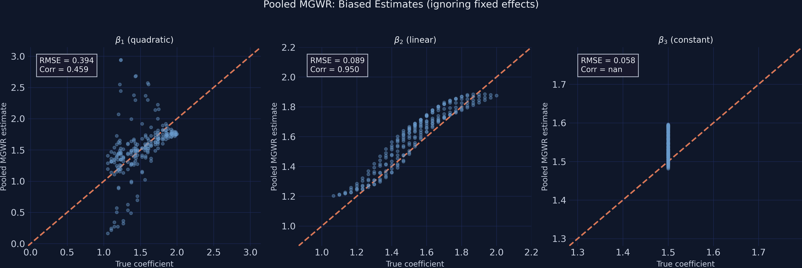

# The Tension {.divider background-color="#d97757"}

[Act I]{.act}

## When place secretly drives both $x$ and $y$, MGWR maps the confounder, not the effect

An unobserved attribute of place shifts the outcome *and* the covariate levels.

MGWR's local slopes then absorb that contamination.

. . .

What looks like genuine spatial heterogeneity is omitted-variable bias wearing a map. *Can we get the real coefficients back?*

::: {.notes}
The unobserved attribute could be geography, institutions, or persistent local norms. This is the central tension of spatially varying coefficient models. The same data give a "rich local-effects map" that is actually a picture of the confounder. Li & Fotheringham (2026) name this the indirect contextual effect and propose MGWFER to remove it.
:::

## One dataset, six estimators, and a coefficient surface that flips sign


::: {.notes}
Spoiler figure. Don't explain every panel yet — just plant that the confounder alpha (lower-right) has a range of ~50 units while every true slope varies by at most 1 unit. Any model that cannot separate alpha from the slopes will let it leak into the coefficient surfaces. We earn the fix in Act II.
:::

## Where we're going

::: {.incremental}
- The lab: a 225-unit, 3-period panel where place drives every covariate
- Why the naive pooled fit gets the most-biased slope *backwards*
- MGWFER's one move — the within-transformation — and why it works
- Stage 2: recovering the confounder itself as a per-unit quantity
:::

# The Investigation {.divider background-color="#6a9bcc"}

[Act II]{.act}

## The lab: 225 spatial units × 3 periods, with place wired into every covariate

::: {.incremental}
- **Outcome** — $y_{it}$ built from three causally-active slopes plus a fixed effect
- **Confounder** — $sc_i$ (the spatial context), exponential, range $2$ to $52$
- **Covariates** — each one coupled to place: $x_{k}=0.05\,sc_i+\nu_k$
:::

[We simulate the paper's DGP (Eqs. 39–45) verbatim on a 15×15 grid. The coupling makes the indirect channel $sc\to x_k$ active — that is the whole point.]{.takeaway .fragment}

::: {.notes}
675 observations total. beta_1 is a quadratic dome (1.06–2.00), beta_2 a linear gradient, beta_3 constant at 1.5, beta_4 identically zero. alpha_i = 30(exp(j/15)−1). The smaller grid (vs the paper's 30×30) keeps three bandwidth searches under ~15 minutes while exercising every step.
:::

## Couple every covariate to place and $x_4$ correlates 0.84 with $y$ — with zero causal effect

| Quantity | Value | Meaning |
|---|---:|---|
| $\mathrm{Cor}(x_k, sc)$ | [0.84]{.key} | every covariate tracks place |
| $\mathrm{Cor}(x_4, y)$ | [0.84]{.key} | spurious — $\beta_4\equiv 0$ |

[A regression that does not condition on $sc$ will read this 0.84 as a real effect. That is the bias mechanism, made concrete.]{.takeaway .fragment}

::: {.notes}
With sigma_x = 0.5 and 0.05·sc where sc spans 2–52, the deterministic place component dominates the noise — Cor ≈ 0.84 for all four covariates. x_4 has no causal role, yet shares the common parent sc with y, so it inherits a 0.84 correlation. This is a textbook spurious correlation through a common cause.
:::

## Wooldridge in one line: OLS recovers $\beta_k+\delta_k$, not $\beta_k$

$$y = \beta_0 + \textstyle\sum_k x_k\beta_k + sc + \varepsilon, \qquad sc = \delta_0 + \textstyle\sum_k x_k\delta_k + \eta$$

$$\Rightarrow\quad y = (\beta_0+\delta_0) + \textstyle\sum_k x_k(\beta_k+\delta_k) + (\varepsilon+\eta)$$

[Hide $sc$ in the error and project it on the covariates: the bias on each slope is exactly $\delta_k$, the indirect contextual effect.]{.takeaway .fragment}

::: {.notes}
Adapted from Wooldridge (2010, 65–67) and Eqs. 4–8 in the paper. sc is unobservable, so it folds into the error. Because sc has a linear projection on the x's (that's the coupling), OLS or MGWR recovers beta_k + delta_k. The magnitude of the bias is the magnitude of the indirect contextual effect. Kill delta_k and you restore identification.
:::

## Six estimators, escalating discipline — only one removes the confounder

::: {.incremental}
- **OLS / pooled OLS** — global, no fix; the bias is on full display
- **Individual FE** — global, within-transform; clean but no surface
- **MGWR (cross-section) / PMGWR** — local surfaces, still contaminated
- **MGWFER** — local surfaces *and* clean identification
:::

[Only MGWFER inherits the FE estimator's identification while delivering a location-specific coefficient surface.]{.takeaway .fragment}

::: {.notes}
The lineup mirrors the paper's full Table 2 / Table 3. The narrative arc is escalating discipline: global naive → global FE → local naive → local FE. MGWFER is the one cell in this 2×2 (global/local × naive/FE) that has both surfaces and identification.
:::

## Globally, OLS overstates every slope ~4× and "detects" a null effect at $p<10^{-13}$

| Coefficient | TRUE | Pooled OLS | Individual FE |
|---|---:|---:|---:|
| $\beta_1$ | 1.50 | 6.14*** | [1.57***]{.key} |
| $\beta_3$ | 1.50 | 5.79*** | [1.55***]{.key} |
| $\beta_4$ | 0.00 | 4.16*** | [0.02 n.s.]{.key} |

[OLS has nowhere to put $sc$ except into the slopes — Wooldridge's $\hat\beta_k=\beta_k+\delta_k$. The within-transform neutralises it.]{.takeaway .fragment}

::: {.notes}
The paper's Table 2 on one screen. OLS and pooled OLS estimate the true 1.5 slopes at ~6 and declare a significant beta_4 ≈ 4.2 even though beta_4 is zero. Individual FE recovers 1.57, 1.55, and beta_4 ≈ 0.02 (p = 0.66), and reconstructs mean(alpha) to within 0.06 of truth. Identification restored — but FE gives one number per coefficient, not a map.
:::

## PMGWR's local fit looks great ($R^2=0.99$) but $\hat\beta_1$ is anti-correlated with truth



::: {.notes}
The pooled MGWR R² of 0.989 is a trap: the local intercept (bandwidth 44) absorbs sc's cross-sectional variation, inflating fit while the slopes go wrong. beta_1's correlation with truth is −0.46 — the dome pattern is inverted, worse than a constant guess. A high R² fit to raw y, dominated by the confounder, tells you nothing about the slopes.
:::

## MGWFER's one move: subtract each unit's mean, and the confounder vanishes exactly

$$\tilde{y}_{it} = y_{it} - \bar{y}_i = \textstyle\sum_k \beta_k(u_i,v_i)\,(x_{k,it}-\bar{x}_{k,i}) + (\varepsilon_{it}-\bar\varepsilon_i)$$

Since $\alpha_i$ is the same in every period, $\alpha_i-\alpha_i=0$ — demeaning cancels it to machine precision.

[Like zeroing a kitchen scale: subtract the container's weight ($\alpha_i$) so only the contents (the slopes) remain.]{.takeaway .fragment}

::: {.notes}
The workhorse of panel econometrics. After demeaning, the max unit mean is 7e-15 — numerically exact removal. What remains is within-unit variation driven only by the spatially varying slopes and noise. The key causal assumption: no time-varying confounders (strict exogeneity conditional on the fixed effects).
:::

## Demeaning shrinks the outcome's range from 61 to 14 — the confounder *was* most of the signal

::: {.incremental}
- Raw $y$ range: $[-4.07,\ 57.41]$ — spread of $\approx 61$
- Demeaned $\tilde y$ range: $[-6.88,\ 6.92]$ — spread of $\approx 14$
- The confounder spanned $[2.07,\ 51.55]$ — and is now gone
:::

[Most of the original variation was *between* units. Demeaning isolates the *within*-unit signal that identifies the slopes.]{.takeaway .fragment}

::: {.notes}
This slide makes the within/between split concrete. Five-sixths of the raw spread lived between units, carried by alpha. Once it's removed, what's left is the part of y that moves over time inside one unit — exactly the variation the spatially varying coefficients explain.
:::

## Six lines fit MGWFER Stage 1 — demean, standardise, MGWR with no intercept

``` {.python code-line-numbers="2-3|4-5|6"}
from mgwr.gwr import MGWR; from mgwr.sel_bw import Sel_BW
um = panel_df.groupby("unit_id")[cols].transform("mean")  # unit means
y_w, X_w = y - um["y"], X - um[xcols]                       # within-transform
sel = Sel_BW(coords, std(y_w), std(X_w), multi=True,
             constant=False, time=N_TIME)                   # no intercept
mgwfer = MGWR(coords, std(y_w), std(X_w), sel, constant=False).fit()
```

::: {.notes}
constant=False is load-bearing: demeaning already removed the intercept, so we fit slopes only. Standardise before the multiscale bandwidth search, then back-transform coefficients to the original scale via Eq. 29 (multiply by sigma_y_demeaned / sigma_x_k). The custom mgwr fork (GeoZhipengLi/MGWPR) adds the panel `time` parameter.
:::

## After demeaning, $\hat\beta_1$'s correlation with truth flips from $-0.46$ to $+0.82$


::: {.notes}
The same scatter as two slides ago, after the within-transform. beta_1 goes from getting the dome backwards to aligning with truth. RMSE drops ~92–96% for every coefficient. The within-transformation removed the very thing that contaminated the bandwidth search — everything downstream is now estimating the right surface.
:::

## RMSE falls 92–96% on every coefficient — and the sign flips on the worst one {background-color="#141413"}

[−92%]{.bignum}

[$\beta_1$ RMSE $2.30\to 0.18$ vs PMGWR; correlation with truth $-0.46\to +0.82$ (a sign reversal)]{.bignum-label}

::: {.notes}
The Act-III hinge stated as one number. Not a 50% improvement, not a 2× improvement — a 10× to 25× reduction in RMSE across all four slopes, plus a sign reversal on the most-biased one. beta_2: 1.95→0.11 (−95%). beta_3: 1.75→0.07 (−96%). beta_4: 1.86→0.14 (−92%).
:::

# The Resolution {.divider background-color="#00d4c8"}

[Act III]{.act}

## Stage 2 hands back the confounder itself — recovered at correlation 0.9996

$$\hat\alpha_i = \bar y_i - \textstyle\sum_{k} \hat\beta_{bwk}(u_i,v_i)\,\bar x_{ik}$$

Once the slopes are clean, the leftover per-unit mean *is* the intrinsic contextual effect — no longer a nuisance, now an output.

[In MGWR the role of place hid inside one intercept; in MGWFER it is explicit, per-unit, and significance-testable.]{.takeaway .fragment}

::: {.notes}
Eq. 30 of the paper. Take each unit's mean outcome, subtract the contribution of its mean covariates at the local slopes; what's left is the unmeasured place effect. The derivation parallels the textbook FE result with location-specific slopes substituted for the global beta.
:::

## MGWFER reconstructs the confounder surface; PMGWR inverts it, MGWR_cs compresses it

![Spatial-context surface (paper Fig. 5): true (top-left), MGWFER $\hat\alpha_i$ near-identical (top-right), MGWR_cs compressed to $[2,22]$, PMGWR inverted to $[-11,10]$.](../mgwrfer_alpha_map.png)

::: {.notes}
MGWFER's recovered surface is visually indistinguishable from truth: range [1.45, 51.62] vs true [2.07, 51.55], correlation 0.9996, RMSE 0.54 on a 50-unit scale. MGWR_cs captures the shape (Corr 0.84) but compresses magnitude 2.5×. PMGWR's intercept inverts and shifts negative. The paper concludes traditional local methods substantially underestimate the influence of spatial context — reproduced verbatim.
:::

## Recovered $\hat\alpha_i$ correlates 0.9996 with the truth — every one of 225 units significant {background-color="#141413"}

[0.9996]{.bignum}

[Pearson correlation of $\hat\alpha_i$ with true $sc_i$; RMSE 0.54 on a 2–52 scale; 225/225 units significant at 5%]{.bignum-label}

::: {.notes}
Essentially perfect recovery. The per-unit t-test (Eqs. 32–37, df = NT − K − N = 675 − 4 − 225 = 446) flags all 225 units significant, as it should — sc_i is strictly positive everywhere. This is the deliverable no other model in the lineup can produce: per-location, significance-testable intrinsic contextual effects.
:::

## Only MGWFER reads the true process scales — PMGWR collapses every bandwidth to 44–50

![Bandwidths by covariate: PMGWR flattens all to 44–50; MGWFER differentiates [50, 91, 116, 62], the largest on the spatially-constant $\beta_3$.](../mgwrfer_bandwidth_comparison.png)

::: {.notes}
Under the indirect channel every covariate looks like a noisy proxy for sc, so PMGWR picks the same small bandwidth for all of them. MGWFER recovers true process scales: small for the local dome (beta_1, bw 50), large for the spatially-constant beta_3 (bw 116). This replicates paper Table 3 — only the estimator that removes the confounder before the bandwidth search recovers the right scales.
:::

## The strongest objection — does the within-transform make this causal?

[Objection.]{.objection} Demeaning only removes *time-invariant* confounders — a one-trick pony. Real places change.

. . .

[Response.]{.rebuttal} True. MGWFER removes *time-invariant* confounding cleanly — and only that. It does not manufacture identification.

::: {.notes}
Steelman, don't strawman. Identification rests on four assumptions: time-invariant sc, strict exogeneity, no time-varying confounders, and stable slopes. The within-transformation deals with time-invariant confounding only; any unobserved factor that changes over time and correlates with both x and y still biases MGWFER. Time-invariant measurable covariates (e.g. distance to highway) get swept into alpha_hat and are no longer separable — a structural property of FE estimators. Be honest about the boundary.
:::

## The stakes are real: on Georgia data, MGWFER flips poverty's sign and 10× the place effect

:::: {.columns}
::: {.column width="50%"}
### MGWR / PMGWR

- intrinsic effect $\approx\pm 0.3$ ($\pm 1.5\%$)
- poverty coefficient: *positive*
- "role of place" looks small
:::
::: {.column width="50%"}
### MGWFER

- intrinsic effect $\approx\pm 4$ ($\pm 20\%$)
- poverty coefficient: *negative*
- place effect $10\times$ larger
:::
::::

::: {.notes}
The paper's Georgia case study (159 counties, 2016–2020 ACS, bachelor's-degree share). Conventional MGWR finds a positive poverty–education link with no defensible causal reading; MGWFER reverses it to negative, in line with prior literature, and recovers intrinsic contextual effects an order of magnitude larger. The bias is not academic — it changes the policy story.
:::

# Let the within-transformation, not the bandwidth search, decide what place is doing. {.divider background-color="#141413"}

::: {.notes}
The single takeaway. Remove the time-invariant confounder *before* the spatial smoother runs, and two things happen at once: the local slopes become identified (−0.46 → +0.82) and the confounder itself becomes a clean, per-unit, testable output (r = 0.9996). One move; two payoffs.
:::
