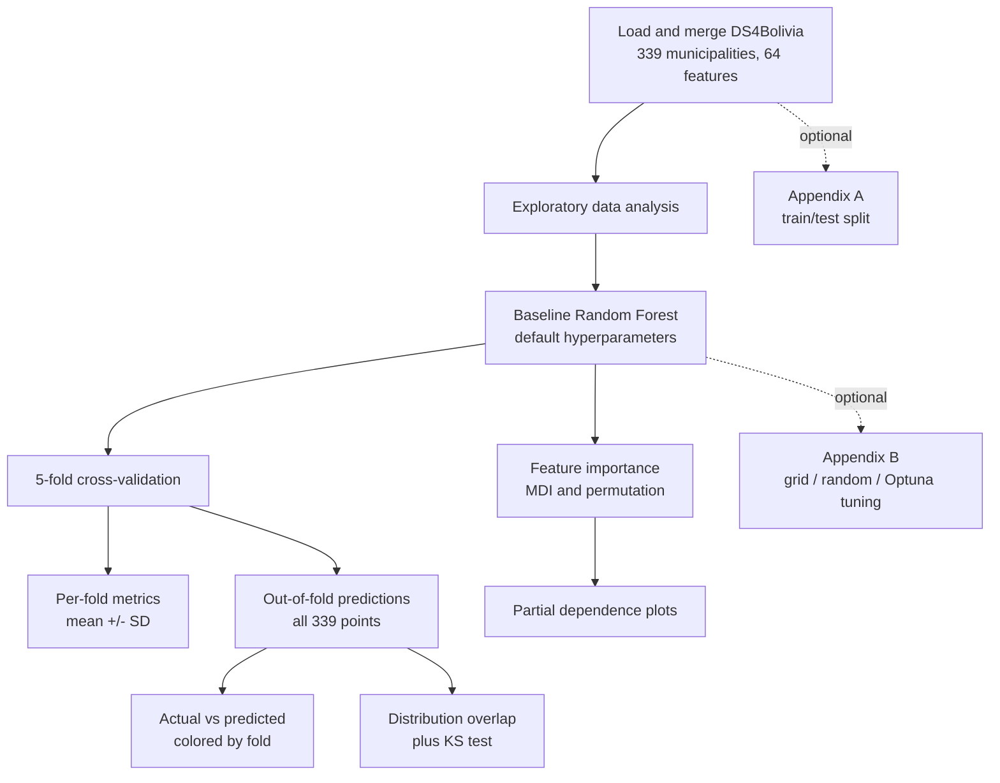
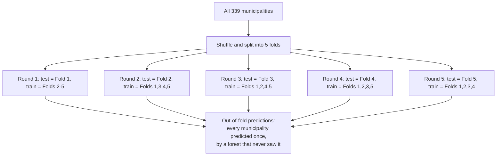
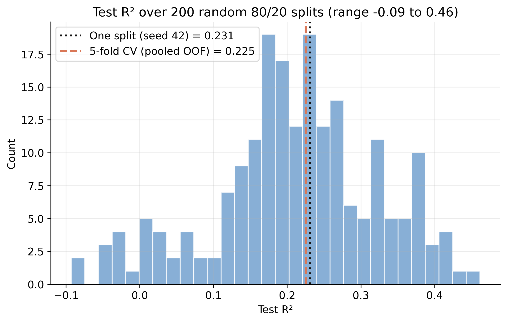
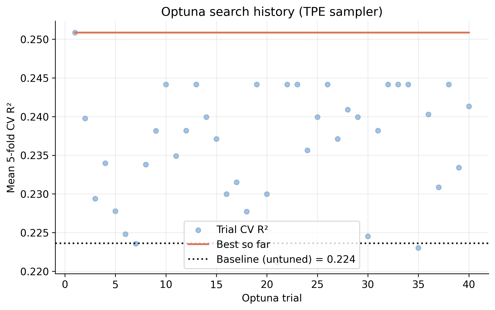

---
authors:
  - admin
categories:
  - Python
  - Random Forest
draft: false
featured: false
date: "2026-03-10T00:00:00Z"
external_link: ""
image:
  caption: ""
  focal_point: Smart
  placement: 3
links:
- icon: chalkboard-teacher
  icon_pack: fas
  name: "Slides (HTML)"
  url: slides/index.html
- icon: file-pdf
  icon_pack: fas
  name: "AI Slides (PDF)"
  url: https://carlos-mendez.org/post/python_ml_random_forest/slides/Mapping_Development_via_Satellite_ML.pdf
- icon: laptop-code
  icon_pack: fas
  name: "Web app"
  url: web_app/index.html
- icon: podcast
  icon_pack: fas
  name: AI Podcast
  url: "/post/python_ml_random_forest/#podcast-player"
- icon: open-data
  icon_pack: ai
  name: "[Python] Google Colab"
  url: https://colab.research.google.com/github/cmg777/claude4data/blob/master/notebooks/notebook-04.ipynb
- icon: file-code
  icon_pack: fas
  name: "Quarto project (.zip)"
  url: python_ml_random_forest.zip
- icon: code
  icon_pack: fas
  name: "Python script"
  url: script.py
- icon: markdown
  icon_pack: fab
  name: "MD version"
  url: https://raw.githubusercontent.com/cmg777/starter-academic-v501/master/content/post/python_ml_random_forest/index.md
slides:
summary: A beginner-friendly, comprehensive introduction to Random Forest regression for continuous data, evaluated end-to-end with 5-fold cross-validation and out-of-fold predictions on Bolivian satellite imagery
tags:
- python
- spatial
- regional
- machine learning
- cross-sectional data
title: "Introduction to Machine Learning: Random Forest Regression"
url_code: ""
url_pdf: ""
url_slides: ""
url_video: ""
toc: true
diagram: true
---

## Abstract

Satellite imagery is increasingly used as a low-cost proxy for socioeconomic conditions in places where survey data are sparse, raising the question of how much development-related signal it actually contains. This tutorial predicts Bolivia's Municipal Sustainable Development Index (IMDS) — a composite score on a 0–100 scale — from satellite image embeddings, and uses the problem to introduce the core ideas of machine learning for continuous outcomes. The data come from the DS4Bolivia repository and cover all 339 Bolivian municipalities with complete coverage and no missing values, pairing IMDS scores (mean 51.05, standard deviation 6.77, ranging 35.70 to 80.20) with 64-dimensional feature vectors extracted from 2017 satellite imagery. Rather than judging the model on a single 80/20 train/test split, we evaluate it with **5-fold cross-validation**: each of the 339 municipalities receives an *out-of-fold* prediction from a forest that never saw it during training. A baseline Random Forest with default hyperparameters explains about 22% of the variation in IMDS (pooled out-of-fold R² 0.225, RMSE 5.95, MAE 4.42), but the per-fold R² swings from −0.03 to 0.45 (mean 0.224, standard deviation 0.173) — a spread that a single number would have hidden, and the reason we always report a standard deviation alongside the mean. Comparing the distribution of predictions to the distribution of the actual scores shows the predictions are compressed toward the centre (predicted standard deviation 3.54 vs 6.77 actual; a two-sample Kolmogorov–Smirnov test rejects equality, p < 0.001), the classic regression-to-the-mean signature of a model with limited signal. Permutation importance singles out embedding dimensions A30 and A59, and partial dependence plots reveal non-linear threshold effects. Two appendices keep the main story clean: Appendix A shows *why* a single train/test split is unreliable here, and Appendix B compares grid search, random search, and Optuna and finds that tuning buys almost nothing over the baseline. The practical message is that satellite embeddings carry real but limited development signal, so pairing them with administrative or survey data is the natural next step.

## 1. Introduction

### 1.1 The research question

Can satellite imagery predict how well a municipality is developing? This tutorial explores that question by applying **Random Forest regression** to predict Bolivia's Municipal Sustainable Development Index (IMDS) from satellite image embeddings. IMDS is a composite index (0–100 scale) that captures how well each of Bolivia's 339 municipalities is progressing toward sustainable development goals. Satellite embeddings are 64-dimensional feature vectors extracted from 2017 satellite imagery — they compress visual information about land use, urbanization, and terrain into numbers a model can learn from. By the end, we will know how much development-related signal satellite imagery actually contains — and where its predictive power falls short.

### 1.2 Why Random Forest

The Random Forest algorithm is a natural starting point for this kind of tabular prediction task: it captures non-linear relationships and feature interactions automatically, requires almost no preprocessing (no scaling, no manual interaction terms), is robust to irrelevant features, and provides built-in measures of feature importance. It is, in short, a strong and forgiving default — exactly what a beginner wants for a first real machine-learning model on continuous data.

### 1.3 The end-to-end workflow

This is the road map for the whole tutorial. We load and explore the data, fit a baseline forest, and then — instead of a single train/test split — evaluate it with **5-fold cross-validation**, which lets every municipality contribute an honest, out-of-fold prediction. From those predictions we read off per-fold metrics, an actual-vs-predicted picture, and a comparison of distributions, before turning to feature importance and partial dependence. The train/test split and hyperparameter tuning are deliberately moved to the appendices — useful to know, but not needed for the main result.



## 2. Key learning objectives

By the end of this tutorial you should be able to:

- **Explain** how a Random Forest works — decision trees, bagging, and random feature subsets — and why it suits tabular data.
- **Motivate** cross-validation: explain *why* a single train/test split is unreliable on a small dataset, and what k-fold cross-validation does instead.
- **Generate** out-of-fold predictions with `cross_val_predict` so that every observation is predicted by a model that never saw it.
- **Report** performance as a mean ± standard deviation across folds, and articulate *why the standard deviation matters* as much as the mean.
- **Distinguish** pooled out-of-fold metrics from the average of per-fold metrics.
- **Compare** the distribution of predictions to the distribution of actual values, and recognize regression-to-the-mean / variance compression.
- **Interpret** MDI and permutation feature importance and partial dependence plots.
- **Decide** when hyperparameter tuning is worth the effort (Appendix B) and when a baseline model is enough.

## 3. Key concepts at a glance

The post leans on a small vocabulary repeatedly. Each concept below has three parts. The **definition** is always visible. The **example** and **analogy** sit behind clickable cards: open them when you need them, leave them collapsed for a quick scan. If a later section mentions "out-of-fold prediction" or "permutation importance" and the term feels slippery, this is the section to re-read.

**1. Decision tree** — recursive binary splits.
A tree of yes/no questions on features. Each internal node tests one feature against a threshold; each leaf gives a prediction.

<div class="concept-pair">
<details class="concept-card concept-example">
<summary>Example</summary>

A single tree in this post might split first on satellite-embedding dimension A30 ("built-up signal"), then on A59, and finally output an IMDS prediction at each leaf.

</details>

<details class="concept-card concept-analogy">
<summary>Analogy</summary>

A flowchart of yes/no questions ending in a verdict.

</details>
</div>

**2. Bagging (bootstrap aggregating)** — $\hat f = \frac{1}{B}\sum\_b \hat f\_b$.
Train $B$ trees, each on a bootstrap resample of the training data, and average their predictions. Reduces variance.

<div class="concept-pair">
<details class="concept-card concept-example">
<summary>Example</summary>

With the default `n_estimators = 100`, this post grows 100 trees on 100 different bootstrap samples of the training municipalities. The final IMDS prediction is the average across all 100 trees.

</details>

<details class="concept-card concept-analogy">
<summary>Analogy</summary>

Polling many slightly different juries and averaging their verdicts.

</details>
</div>

**3. Random Forest** — bagging + random feature subsets.
At each split, only a random subset of features is considered. Decorrelates trees and further reduces variance.

<div class="concept-pair">
<details class="concept-card concept-example">
<summary>Example</summary>

Each split in this post's forest considers only `sqrt(64) = 8` of the 64 embedding dimensions. Different trees see different subsets — they make different mistakes, and the average is stronger than the parts.

</details>

<details class="concept-card concept-analogy">
<summary>Analogy</summary>

Bagging plus also blindfolding each juror to a random subset of evidence.

</details>
</div>

**4. Cross-validation** — $K$-fold CV.
Split the data into $K$ equal folds. Train on $K-1$ folds and test on the held-out fold; rotate so every fold is the test set exactly once. Averages out the luck of any single split.

<div class="concept-pair">
<details class="concept-card concept-example">
<summary>Example</summary>

This tutorial's headline result — a pooled out-of-fold R² of about 0.22 — is a 5-fold CV estimate computed over all 339 municipalities (Section 7), not a one-off test-set number.

</details>

<details class="concept-card concept-analogy">
<summary>Analogy</summary>

Taking five mock exams instead of one — averaging the scores gives a steadier read.

</details>
</div>

**5. Out-of-fold (OOF) prediction** — predict each point when it is held out.
Because every fold is the test set exactly once, every observation gets exactly one prediction from a model that never saw it. Collecting these gives a complete, honest set of predictions for the whole dataset.

<div class="concept-pair">
<details class="concept-card concept-example">
<summary>Example</summary>

`cross_val_predict` returns 339 out-of-fold IMDS predictions — one per municipality — which we can plot and compare to the actual scores in Sections 9 and 10.

</details>

<details class="concept-card concept-analogy">
<summary>Analogy</summary>

Every student sits the exam once, graded by a teacher who never tutored them.

</details>
</div>

**6. Train/test split** — $D = D\_{\mathrm{train}} \cup D\_{\mathrm{test}}$.
Hold out a portion of the data for a single honest evaluation. Simple, but on a small dataset the score depends heavily on *which* rows landed in the test set. We use cross-validation instead; see **Appendix A** for the split and why it is shaky here.

<div class="concept-pair">
<details class="concept-card concept-example">
<summary>Example</summary>

An 80/20 split would put 271 municipalities in training and 68 in test. Appendix A shows that the resulting R² wanders from −0.09 to 0.46 depending only on the random seed.

</details>

<details class="concept-card concept-analogy">
<summary>Analogy</summary>

Judging a student on a single pop quiz instead of a term's worth of exams.

</details>
</div>

**7. Hyperparameter tuning** — grid / random / Bayesian search.
Search over model settings (number of trees, depth, leaf size) and keep the combination with the best CV score. Often helpful — but not always worth it. **Appendix B** compares grid search, random search, and Optuna.

<div class="concept-pair">
<details class="concept-card concept-example">
<summary>Example</summary>

In Appendix B, tuning nudges the cross-validated R² from 0.224 (baseline) to 0.251 (Optuna) — a tiny gain, which is why the main analysis keeps the defaults.

</details>

<details class="concept-card concept-analogy">
<summary>Analogy</summary>

Adjusting the oven knobs (temperature, time, rack) before baking the real cake.

</details>
</div>

**8. Feature importance** — which inputs the model relies on.
Two complementary measures: *mean decrease in impurity* (built into the forest) and *permutation importance* (shuffle a column and watch R² drop). Higher = more useful feature.

<div class="concept-pair">
<details class="concept-card concept-example">
<summary>Example</summary>

Both measures put embedding dimension A30 far ahead of the rest, with A59 a distant second.

</details>

<details class="concept-card concept-analogy">
<summary>Analogy</summary>

Which ingredient mattered most for the cake's flavour.

</details>
</div>

**9. Partial dependence plot** — $\bar f(x\_k) = E\_{X\_{-k}}[\hat f(x\_k, X\_{-k})]$.
Average prediction as one feature varies, with all other features held at their observed distribution. Shows the marginal shape of the relationship.

<div class="concept-pair">
<details class="concept-card concept-example">
<summary>Example</summary>

The partial dependence plot for A30 rises then plateaus — a non-linear pattern a straight-line model would miss entirely.

</details>

<details class="concept-card concept-analogy">
<summary>Analogy</summary>

Sliding the salt dial up and down with everything else fixed and tasting after each step.

</details>
</div>

```python
import sys
if "google.colab" in sys.modules:
    !git clone --depth 1 https://github.com/cmg777/claude4data.git /content/claude4data 2>/dev/null || true
    %cd /content/claude4data/notebooks
sys.path.insert(0, "..")
from config import set_seeds, RANDOM_SEED, IMAGES_DIR, TABLES_DIR, DATA_DIR

set_seeds()
```

```python
import numpy as np
import pandas as pd
import matplotlib.pyplot as plt
import seaborn as sns
from scipy.stats import gaussian_kde, ks_2samp
from sklearn.ensemble import RandomForestRegressor
from sklearn.inspection import PartialDependenceDisplay, permutation_importance
from sklearn.metrics import r2_score, mean_absolute_error
from sklearn.model_selection import KFold, cross_validate, cross_val_predict

# Configuration
TARGET = "imds"
TARGET_LABEL = "IMDS (Municipal Sustainable Development Index)"
FEATURE_COLS = [f"A{i:02d}" for i in range(64)]
N_FOLDS = 5

DS4BOLIVIA_BASE = "https://raw.githubusercontent.com/quarcs-lab/ds4bolivia/master"
CACHE_PATH = DATA_DIR / "rawData" / "ds4bolivia_merged.csv"
```

## 4. Data

### 4.1 Loading and merging the data

The data come from the [DS4Bolivia](https://github.com/quarcs-lab/ds4bolivia) repository, which provides standardized datasets for studying Bolivian development. We merge three tables on `asdf_id` — the unique identifier for each municipality: SDG indices (our target variables), satellite embeddings (our features), and region names (for context).

```python
if CACHE_PATH.exists():
    df = pd.read_csv(CACHE_PATH)
else:
    sdg = pd.read_csv(f"{DS4BOLIVIA_BASE}/sdg/sdg.csv")
    embeddings = pd.read_csv(
        f"{DS4BOLIVIA_BASE}/satelliteEmbeddings/satelliteEmbeddings2017.csv"
    )
    regions = pd.read_csv(f"{DS4BOLIVIA_BASE}/regionNames/regionNames.csv")
    df = sdg.merge(embeddings, on="asdf_id").merge(regions, on="asdf_id")
    CACHE_PATH.parent.mkdir(parents=True, exist_ok=True)
    df.to_csv(CACHE_PATH, index=False)

X = df[FEATURE_COLS]
y = df[TARGET]
mask = X.notna().all(axis=1) & y.notna()
X = X[mask].reset_index(drop=True)
y = y[mask].reset_index(drop=True)

print(f"Dataset shape: {df.shape}")
print(f"Observations after dropping missing: {len(y)}")
print(y.describe().round(2))
```

```text
Dataset shape: (339, 88)
Observations after dropping missing: 339
count    339.00
mean      51.05
std        6.77
min       35.70
25%       47.00
50%       50.50
75%       54.85
max       80.20
Name: imds, dtype: float64
```

### 4.2 The target and the features

All 339 Bolivian municipalities load successfully with no missing values — the dataset provides complete national coverage. The merged data has 88 columns: the 64 satellite embedding features (`A00`–`A63`), SDG indices, and region identifiers. IMDS scores range from 35.70 to 80.20 with a mean of 51.05 and standard deviation of 6.77, so most municipalities cluster within about 7 points of the national average on the 0–100 scale. Keep that 6.77 in mind: it is the natural yardstick for our errors, and it is the spread our model will try — and partly fail — to reproduce.

## 5. Exploratory data analysis

Before building any model, we explore the data to understand its structure. EDA helps us spot issues — skewed distributions, outliers, or weak feature correlations — that could affect model performance, and it builds intuition about what patterns the model might find.

### 5.1 Target distribution

The histogram below shows how IMDS values are distributed across municipalities. The shape of this distribution matters: a highly skewed target can bias predictions toward the majority range.

```python
fig, ax = plt.subplots(figsize=(8, 5))
ax.hist(y, bins=30, edgecolor="white", alpha=0.85, color="#6a9bcc")
ax.axvline(y.mean(), color="#d97757", linestyle="--", linewidth=2, label=f"Mean = {y.mean():.1f}")
ax.axvline(y.median(), color="#141413", linestyle=":", linewidth=2, label=f"Median = {y.median():.1f}")
ax.set_xlabel(TARGET_LABEL); ax.set_ylabel("Count")
ax.set_title("Distribution of IMDS across 339 municipalities")
ax.legend()
plt.savefig(IMAGES_DIR / "ml_target_distribution.png", dpi=300, bbox_inches="tight")
plt.show()
```


The distribution is roughly bell-shaped with a slight right skew — the mean (51.1) sits just above the median (50.5), indicating a small tail of higher-performing municipalities. Most scores fall between 47 and 55, meaning the majority of Bolivia's municipalities have similar mid-range development levels. The handful of outliers above 70 likely correspond to larger urban centers like La Paz, Santa Cruz, and Cochabamba, which have significantly higher development infrastructure. These extremes are exactly the municipalities a low-signal model will struggle with later.

### 5.2 Embedding correlations

Next we examine which satellite embedding dimensions are most correlated with the target. Strong correlations suggest the model has useful signal to learn from; weak correlations across the board would be a warning sign.

```python
correlations = X.corrwith(y).abs().sort_values(ascending=False)
top10_features = correlations.head(10).index.tolist()
corr_matrix = df.loc[mask, top10_features + [TARGET]].corr()

fig, ax = plt.subplots(figsize=(10, 8))
sns.heatmap(corr_matrix, annot=True, fmt=".2f", cmap="RdBu_r", center=0,
            square=True, ax=ax, vmin=-1, vmax=1)
ax.set_title("Correlations: top-10 embeddings & IMDS")
plt.savefig(IMAGES_DIR / "ml_embedding_correlations.png", dpi=300, bbox_inches="tight")
plt.show()
```


The strongest individual correlation between any single embedding dimension and IMDS is about 0.37 (dimension A30); the rest of the top ten sit in the 0.25–0.35 range. These are *moderate* correlations — typical for satellite-derived features predicting complex socioeconomic outcomes, and an early hint that no single feature will carry the model. Several embedding dimensions are also correlated with each other, suggesting they capture overlapping spatial patterns. A Random Forest handles this *multicollinearity* (features carrying overlapping information) gracefully because it selects feature subsets at each split. There is real signal here, just not a lot of it — so let's build the model and measure exactly how much.

## 6. The baseline Random Forest model

### 6.1 How a Random Forest works

A **Random Forest** builds many decision trees on random subsets of the data and features, then averages their predictions. This "wisdom of crowds" approach reduces overfitting compared to a single decision tree. Formally, the prediction is:

$$\hat{y} = \frac{1}{B} \sum\_{b=1}^{B} T\_b(\mathbf{x})$$

In words, the predicted value $\hat{y}$ is the average of predictions from all $B$ individual trees. Each tree $T\_b$ sees a different random subset of training rows (bagging) and, at each split, a different random subset of features — so the trees make different errors, and averaging cancels out much of the noise. Here $B$ is the `n_estimators` parameter (100 by default) and $\mathbf{x}$ is the 64-dimensional satellite embedding vector for a given municipality.

### 6.2 Fitting the baseline model

We deliberately keep scikit-learn's defaults. A baseline with default hyperparameters is the honest reference point every project should start from: it tells us what "no effort" already achieves, so we can judge whether any later complication actually earns its keep. (Appendix B confirms that, for this problem, tuning barely moves the result.)

```python
baseline_rf = RandomForestRegressor(n_estimators=100, random_state=RANDOM_SEED)
```

That single line defines the model. We have not evaluated it yet — and *how* we evaluate it is the heart of this tutorial.

## 7. Cross-validation: a better way to test predictions

### 7.1 Why not just one train/test split?

The textbook recipe is to hold out, say, 20% of the data as a test set, train on the other 80%, and report the score on the held-out part. With only 339 municipalities, that test set is just 68 points — about 1.5% of the data per prediction — and the score you get depends heavily on *which* 68 municipalities happen to land in it. Get a few easy ones and the model looks great; get a few of the urban outliers and it looks terrible. The estimate is **noisy**, and it **wastes data** — the 68 test points never help the model learn. Appendix A makes this concrete: across 200 random splits the test R² wanders from −0.09 to 0.46 for the *same model on the same data*. We need something steadier.

### 7.2 What is k-fold cross-validation?

**k-fold cross-validation** turns that one wasteful split into $k$ efficient ones. Shuffle the data and cut it into $k$ equal **folds**. Then run $k$ rounds: in each round, one fold is held out as the test set and the model trains on the other $k-1$. Because every fold takes a turn as the test set, every observation is tested exactly once — and every observation is also used for training in the other $k-1$ rounds. We use $k = 5$.



In code, `KFold` defines the folds and `cross_validate` runs the five rounds, returning a score per fold for each metric we ask for. We score with R², RMSE, and MAE at once.

```python
kf = KFold(n_splits=N_FOLDS, shuffle=True, random_state=RANDOM_SEED)

cv = cross_validate(
    baseline_rf, X, y, cv=kf,
    scoring=("r2", "neg_root_mean_squared_error", "neg_mean_absolute_error"),
)
fold_r2   = cv["test_r2"]
fold_rmse = -cv["test_neg_root_mean_squared_error"]
fold_mae  = -cv["test_neg_mean_absolute_error"]

print("Per-fold R²:", fold_r2.round(3))
print(f"Mean R²: {fold_r2.mean():.3f} ± {fold_r2.std():.3f}")
```

```text
Per-fold R²: [ 0.209  0.121 -0.032  0.453  0.367]
Mean R²: 0.224 ± 0.173
```

(scikit-learn reports RMSE and MAE as *negative* numbers so that "higher is better" holds for every scorer; we flip the sign back.) We will dissect these five numbers in Section 8. First, let's get a prediction for *every* municipality.

### 7.3 Out-of-fold predictions for every municipality

`cross_validate` gives us scores, but not the individual predictions. For that we use `cross_val_predict`, which runs the same five rounds and, in each round, **records the predictions for the held-out fold**. Stitched together, the result is one *out-of-fold* (OOF) prediction for each of the 339 municipalities — each made by a forest that was trained without that municipality. We pass the *same* `kf` object so the folds line up exactly with the metrics above, and we record which fold each point belonged to.

```python
oof_pred = cross_val_predict(baseline_rf, X, y, cv=kf)

fold_id = np.empty(len(y), dtype=int)
for k, (_, test_idx) in enumerate(kf.split(X), start=1):
    fold_id[test_idx] = k

pooled_r2 = r2_score(y, oof_pred)
print(f"Out-of-fold predictions: {len(oof_pred)} municipalities")
print(f"Pooled out-of-fold R²:   {pooled_r2:.3f}")
```

```text
Out-of-fold predictions: 339 municipalities
Pooled out-of-fold R²:   0.225
```

We now have an honest prediction for all 339 municipalities, with no data leakage. Everything that follows — the per-fold metrics, the actual-vs-predicted scatter, and the distribution comparison — is built from these out-of-fold predictions.

## 8. Evaluating predictions across folds

### 8.1 Per-fold performance metrics

The five rounds produce five of each metric. Three metrics tell us complementary things: **R²** is the fraction of IMDS variance the model explains (1.0 is perfect, 0 is no better than guessing the mean, and *negative* is worse than guessing the mean); **RMSE** is the typical error in IMDS points, penalizing large misses; **MAE** is the average absolute error, more robust to outliers. Here is every fold:

| Fold | n | R² | RMSE | MAE |
|:----:|:--:|:----:|:----:|:----:|
| 1 | 68 | 0.209 | 6.61 | 4.73 |
| 2 | 68 | 0.121 | 7.34 | 5.05 |
| 3 | 68 | −0.032 | 5.73 | 4.43 |
| 4 | 68 | 0.453 | 4.49 | 3.82 |
| 5 | 67 | 0.367 | 5.14 | 4.05 |
| **Mean** | | **0.224** | **5.86** | **4.42** |
| **SD** | | **0.173** | **1.01** | **0.44** |

Look at the R² column before reading on. Fold 4 reaches 0.45 — a respectable score — while fold 3 comes in at **−0.03**, meaning that on those 68 municipalities the forest did *slightly worse than just predicting the national average*. Same model, same data, same procedure; only the luck of the fold differs. This is the single most important table in the tutorial.

### 8.2 Why the standard deviation matters

If we reported only "R² = 0.22" we would be telling the truth and hiding the most important part of it. The standard deviation of 0.173 is almost as large as the mean of 0.224 — the model's quality is genuinely *unstable* across different slices of Bolivia. A single train/test split would have handed us exactly one of these five numbers, and we would have had no way to know whether we drew the 0.45 or the −0.03. Reporting the spread is what separates an honest performance claim from a lucky one. The figure below shows each metric fold-by-fold, with the mean (dashed line) and a ±1 standard-deviation band.

```python
fig, axes = plt.subplots(1, 3, figsize=(15, 4.5))
folds = np.arange(1, N_FOLDS + 1)
for ax, (name, vals, color) in zip(axes, [
        ("R²", fold_r2, "#6a9bcc"), ("RMSE", fold_rmse, "#d97757"), ("MAE", fold_mae, "#00d4c8")]):
    ax.bar(folds, vals, color=color, edgecolor="white", alpha=0.9, width=0.65)
    m, s = vals.mean(), vals.std()
    ax.axhspan(m - s, m + s, color="#141413", alpha=0.08)
    ax.axhline(m, color="#141413", linestyle="--", linewidth=1.5)
    ax.set_xticks(folds); ax.set_xlabel("Fold"); ax.set_ylabel(name)
    ax.set_title(f"{name}: {m:.3f} ± {s:.3f}")
plt.savefig(IMAGES_DIR / "ml_per_fold_metrics.png", dpi=300, bbox_inches="tight")
plt.show()
```


Notice that the three metrics partly disagree about *which* fold is hardest. Fold 2 has the worst RMSE (7.34) and MAE (5.05) but not the worst R²; fold 3 has the worst R² but a middling RMSE. That happens because R² is measured *relative to each fold's own variance* — fold 3 must contain municipalities that are unusually close together, so even small absolute errors blow up the R². This is a useful reminder that no single metric is the whole story, and that R² in particular can be deceptive when the test sample is small and homogeneous.

### 8.3 Pooled vs averaged R², and repeated CV

There are two defensible ways to summarize R² across folds, and they answer slightly different questions:

- **Average of the per-fold R²** (the 0.224 above): the mean of the five fold scores. This is what we pair with a standard deviation, because it is a set of five comparable numbers.
- **Pooled out-of-fold R²** (the 0.225 from Section 7.3): compute a *single* R² over all 339 out-of-fold predictions at once.

Here the two nearly coincide (0.224 vs 0.225), but they need not — the pooled value weights every observation equally while the average weights every *fold* equally, and the two diverge when folds differ in size or difficulty. The scikit-learn documentation explicitly warns against confusing them. Our advice for beginners: use the **per-fold mean ± SD** to communicate performance and uncertainty, and use the **pooled OOF predictions** for plotting (Sections 9–10), where you want one prediction per point.

One honest caveat: with only five folds, the standard deviation itself is estimated from just five numbers and is therefore rough. If you want a more stable estimate of the spread, `RepeatedKFold` reruns the whole k-fold procedure several times with different shuffles and pools the scores — at a proportional cost in compute. For a teaching example, plain 5-fold is enough; for a paper, repeated CV is worth it.

## 9. Actual vs predicted — all municipalities

### 9.1 The out-of-fold scatter, colored by fold

Because we have an out-of-fold prediction for every municipality, we can plot all 339 of them — not just a 68-point test slice. Points on the dashed 45-degree line are perfect predictions. We color each point by the fold in which it was held out, so you can literally see which round produced which prediction.

```python
residuals = np.asarray(y) - oof_pred
fold_colors = ["#6a9bcc", "#d97757", "#00d4c8", "#8e6fb0", "#e0a23a"]

fig, ax = plt.subplots(figsize=(7.2, 7.2))
for k in range(1, N_FOLDS + 1):
    m = fold_id == k
    ax.scatter(y[m], oof_pred[m], s=34, alpha=0.75, edgecolors="white",
               linewidth=0.4, color=fold_colors[k - 1], label=f"Fold {k}")
lims = [y.min() - 2, y.max() + 2]
ax.plot(lims, lims, "--", color="#141413", linewidth=1.8, label="Perfect prediction")
ax.set_xlim(lims); ax.set_ylim(lims); ax.set_aspect("equal")
ax.set_xlabel("Actual IMDS"); ax.set_ylabel("Predicted IMDS (out-of-fold)")
ax.set_title("Out-of-fold predictions for all 339 municipalities")
ax.legend(loc="lower right", ncol=2, fontsize=9)
plt.savefig(IMAGES_DIR / "ml_actual_vs_predicted.png", dpi=300, bbox_inches="tight")
plt.show()
```


Two things stand out. First, the colors are thoroughly intermingled — there is no region of the plot that belongs to a single fold — which is the visual confirmation that `KFold(shuffle=True)` mixed the municipalities well; if one fold occupied, say, only the high-IMDS corner, our per-fold metrics would be untrustworthy. Second, and more substantively, the cloud is clearly *flatter than the 45-degree line*: low-IMDS municipalities (left) are predicted too high, and high-IMDS municipalities (right) are predicted too low. The town with the highest actual IMDS (80.2) is predicted at only about 51. This **regression to the mean** is the fingerprint of a model with limited signal — it hedges toward the safe national average rather than committing to extreme values.

### 9.2 Residual analysis

Residuals (actual minus predicted) should ideally scatter randomly around zero. Patterns reveal systematic bias. We plot the out-of-fold residuals against the predictions, keeping the fold coloring.

```python
fig, ax = plt.subplots(figsize=(8, 5))
for k in range(1, N_FOLDS + 1):
    m = fold_id == k
    ax.scatter(oof_pred[m], residuals[m], s=30, alpha=0.7, edgecolors="white",
               linewidth=0.4, color=fold_colors[k - 1], label=f"Fold {k}")
ax.axhline(0, color="#141413", linestyle="--", linewidth=1.8)
ax.set_xlabel("Predicted IMDS (out-of-fold)"); ax.set_ylabel("Residual (actual − predicted)")
ax.set_title("Out-of-fold residuals vs predicted values")
ax.legend(loc="upper right", ncol=2, fontsize=9)
plt.savefig(IMAGES_DIR / "ml_residuals.png", dpi=300, bbox_inches="tight")
plt.show()
```


The residual cloud is centered near zero overall, but it is not patternless: it tilts upward on the right, where the largest positive residuals sit. Those are the high-IMDS municipalities the model under-predicts — the same regression-to-the-mean effect, viewed from a different angle. The spread of residuals is also a little wider at the extremes than in the middle (mild *heteroscedasticity*). Because the colors are again well mixed, we can be confident this pattern is a property of the model, not an artifact of one unlucky fold.

## 10. Comparing distributions — predicted vs actual

### 10.1 Overlapping histograms

A scatter plot shows errors point by point; a distribution comparison asks a complementary question: **do the predictions, taken as a whole, look like the real thing?** We overlay the histogram (and a smooth density estimate) of the actual IMDS scores and the out-of-fold predictions.

```python
ks_stat, ks_p = ks_2samp(np.asarray(y), oof_pred)
bins = np.linspace(y.min() - 2, y.max() + 2, 28)
grid = np.linspace(y.min() - 2, y.max() + 2, 300)

fig, ax = plt.subplots(figsize=(8.5, 5))
ax.hist(y, bins=bins, density=True, alpha=0.45, color="#6a9bcc", edgecolor="white", label="Actual")
ax.hist(oof_pred, bins=bins, density=True, alpha=0.45, color="#d97757", edgecolor="white", label="Predicted (OOF)")
ax.plot(grid, gaussian_kde(np.asarray(y))(grid), color="#6a9bcc", linewidth=2)
ax.plot(grid, gaussian_kde(oof_pred)(grid), color="#d97757", linewidth=2)
ax.axvline(y.mean(), color="#6a9bcc", linestyle=":", linewidth=1.6)
ax.axvline(oof_pred.mean(), color="#d97757", linestyle=":", linewidth=1.6)
ax.set_xlabel("IMDS"); ax.set_ylabel("Density")
ax.set_title(f"Predicted vs actual distribution  (KS = {ks_stat:.3f}, p = {ks_p:.3g})")
ax.legend()
plt.savefig(IMAGES_DIR / "ml_distribution_overlap.png", dpi=300, bbox_inches="tight")
plt.show()
```


The two distributions share almost the same center but have very different widths. The predictions form a tall, narrow spike around 51, while the actual scores spread out into both tails. The model has essentially learned the *average* municipality very well and the *unusual* ones hardly at all — it reproduces the location of the distribution but not its shape.

### 10.2 Summary statistics and a KS test

Numbers make the picture precise:

| Statistic | Actual | Predicted (OOF) |
|:----------|:------:|:---------------:|
| Mean | 51.05 | 51.02 |
| Standard deviation | 6.77 | 3.54 |
| Min | 35.70 | 40.66 |
| Max | 80.20 | 61.79 |

The means match almost exactly (51.05 vs 51.02) — the model is *unbiased on average*. But the predicted standard deviation, 3.54, is only about half of the actual 6.77 (a 48% reduction), and the predicted range collapses from [35.7, 80.2] to [40.7, 61.8]. A two-sample **Kolmogorov–Smirnov test** — which measures the largest gap between two cumulative distributions — gives a statistic of 0.186 with $p < 0.001$, so we can firmly reject the hypothesis that predictions and actuals share the same distribution. This **variance compression** is not a bug to be fixed by tuning; it is the mathematically expected behavior of any regression with modest $R^2$. A model that explains only ~22% of the variance *should* produce predictions with much less spread than the truth — committing to extreme predictions it cannot support would only increase its error. The lesson for a beginner: a good average and a good $R^2$ do not guarantee that your predictions reproduce the real distribution, and checking that distribution is a quick, revealing diagnostic.

## 11. Which satellite features matter?

To inspect *what the model learned*, we fit one baseline Random Forest on all 339 municipalities (the cross-validation above already gave us an honest performance estimate; importance and partial dependence are about interpretation, so using all the data here is appropriate).

```python
rf_full = RandomForestRegressor(n_estimators=100, random_state=RANDOM_SEED).fit(X, y)
```

### 11.1 Mean decrease in impurity (MDI)

MDI measures how much each feature reduces prediction error across all splits in all trees. It is fast (built into the trained model) but can be biased toward *high-cardinality* features — those with many distinct values, like continuous numbers.

```python
mdi = pd.Series(rf_full.feature_importances_, index=FEATURE_COLS)
top20 = mdi.sort_values(ascending=False).head(20)

fig, ax = plt.subplots(figsize=(10, 6))
top20.sort_values().plot.barh(ax=ax, color="#6a9bcc", edgecolor="white")
ax.set_xlabel("Mean decrease in impurity")
ax.set_title("Top-20 feature importance (MDI) for IMDS")
plt.savefig(IMAGES_DIR / "ml_feature_importance_mdi.png", dpi=300, bbox_inches="tight")
plt.show()
```


One dimension dominates: **A30** accounts for about 12% of the total impurity reduction, roughly twice the next feature, A59. After those two the importance falls off into a long tail of dimensions contributing 1–4% each. This matches what we saw in the correlation heatmap (A30 was the single most correlated feature) and tells us the forest leans heavily on a small handful of visual signals, with everything else playing a supporting role.

### 11.2 Permutation importance

Permutation importance is more trustworthy. Imagine scrambling all the values in one column — if the model's accuracy barely changes, that column wasn't contributing much. That is exactly what it measures: shuffle each feature and record how much R² drops. It is not biased by feature scale or cardinality.

```python
perm = permutation_importance(rf_full, X, y, n_repeats=10, random_state=RANDOM_SEED, n_jobs=-1)
perm_imp = pd.Series(perm.importances_mean, index=FEATURE_COLS)
top20 = perm_imp.sort_values(ascending=False).head(20)

fig, ax = plt.subplots(figsize=(10, 6))
top20.sort_values().plot.barh(ax=ax, color="#d97757", edgecolor="white")
ax.set_xlabel("Mean decrease in R² (permutation)")
ax.set_title("Top-20 feature importance (permutation) for IMDS")
plt.savefig(IMAGES_DIR / "ml_feature_importance_permutation.png", dpi=300, bbox_inches="tight")
plt.show()
```


Permutation importance tells the same story even more emphatically: shuffling **A30** alone costs the model about 0.25 in R² — larger than the model's entire out-of-fold R² of 0.22, because removing the best feature drags the model below the mean-prediction baseline. A59 is again second (about 0.11), followed by A26, A36, and A13. The close agreement between the two very different importance methods is reassuring: A30 and A59 are genuinely the embedding dimensions that distinguish Bolivia's municipalities, not artifacts of how a particular method counts.

## 12. Partial dependence plots

Feature importance says *which* features matter; partial dependence says *how*. A partial dependence plot shows the average prediction as a single feature varies, holding the others at their observed distribution — revealing non-linear shapes a correlation coefficient cannot. We plot the top-6 features by permutation importance.

```python
top6 = perm_imp.sort_values(ascending=False).head(6).index.tolist()
fig, axes = plt.subplots(2, 3, figsize=(15, 8))
PartialDependenceDisplay.from_estimator(rf_full, X, top6, ax=axes.ravel(), grid_resolution=50, n_jobs=-1)
fig.suptitle("Partial dependence — top-6 features for IMDS", fontsize=14)
plt.tight_layout(rect=[0, 0, 1, 0.95])
plt.savefig(IMAGES_DIR / "ml_partial_dependence.png", dpi=300, bbox_inches="tight")
plt.show()
```


The curves are clearly non-linear. Several dimensions — A30 most visibly — show a **threshold effect**: predicted IMDS is flat across low values, then rises over a narrow band, then plateaus. These step-like shapes are precisely what a linear regression would miss and what justifies a Random Forest here. Notice, too, the vertical scale: even the most important feature moves the prediction by only a few IMDS points over its whole range. No single dimension is a magic lever — consistent with the modest R² and the broadly distributed importance we have seen throughout.

## 13. Summary and key takeaways

| Metric | Per-fold mean ± SD | Pooled OOF |
|:-------|:------------------:|:----------:|
| R² | 0.224 ± 0.173 | 0.225 |
| RMSE | 5.86 ± 1.01 | 5.95 |
| MAE | 4.42 ± 0.44 | 4.42 |

- **Method insight — cross-validation over a single split.** By evaluating with 5-fold CV we obtained an honest prediction for *every* municipality and, crucially, a *standard deviation* (0.173) that exposed how unstable the model is across slices of the country. A single train/test split would have hidden that entirely (Appendix A).
- **Why the spread matters.** The per-fold R² ranged from −0.03 to 0.45. Reporting only the mean would have been technically true and practically misleading. Always report the spread.
- **Data insight.** Satellite embeddings explain roughly a fifth of IMDS variation — real but limited signal. Both importance measures agree that dimensions A30 and A59 carry most of it, with non-linear threshold effects in the partial dependence plots.
- **Distributions, not just points.** The predictions match the *center* of the IMDS distribution almost perfectly but reproduce only half its *spread* (predicted SD 3.54 vs 6.77; KS $p < 0.001$). This variance compression is the expected behavior of a low-$R^2$ model, and it means the model cannot reliably flag the very best or worst municipalities.
- **Tuning is optional.** Grid search, random search, and Optuna all improve the cross-validated R² by less than 0.03 (Appendix B). With limited signal, the performance ceiling comes from the features, not the model settings.

## 14. Limitations and next steps

- **Modest R².** The model captures meaningful patterns but leaves most variation unexplained — development is driven by many factors invisible from space (governance, migration, the informal economy).
- **Variance compression.** Predictions are pulled toward the mean, so the model is poorly suited to ranking the most extreme municipalities.
- **Temporal mismatch.** We use 2017 satellite imagery with SDG indices from a potentially different period.
- **Feature interpretability.** Embedding dimensions (A00–A63) are abstract; connecting them to physical landscape features requires further analysis.
- **Small sample.** With only 339 municipalities, every estimate carries real uncertainty — which is exactly why cross-validation and its standard deviation matter.

**Next steps** could include combining satellite embeddings with administrative or survey data, trying gradient boosting, or using explainability tools like SHAP values for richer interpretation.

## 15. Exercises

1. **Repeat the cross-validation.** Replace `KFold` with `RepeatedKFold(n_splits=5, n_repeats=10)` and recompute the mean and standard deviation of R². Does the spread estimate stabilize? Is the mean roughly unchanged?
2. **Predict a different SDG index.** DS4Bolivia contains individual SDG indices (`sdg1`–`sdg15`) alongside the composite IMDS. Pick one, re-run the out-of-fold pipeline, and compare its distribution-overlap plot to this one. Which outcomes are most predictable from satellite imagery?
3. **Swap the algorithm.** Replace `RandomForestRegressor` with `GradientBoostingRegressor` inside the same `cross_validate` / `cross_val_predict` calls. Does the per-fold R² improve, and does the variance compression change?
4. **Read the residuals geographically.** Merge the region names and look at which departments have the largest out-of-fold residuals. Are the model's biggest misses spatially clustered?

## References

1. [scikit-learn — RandomForestRegressor](https://scikit-learn.org/stable/modules/generated/sklearn.ensemble.RandomForestRegressor.html)
2. [scikit-learn — Cross-validation: evaluating estimator performance](https://scikit-learn.org/stable/modules/cross_validation.html)
3. [scikit-learn — `cross_val_predict`](https://scikit-learn.org/stable/modules/generated/sklearn.model_selection.cross_val_predict.html)
4. [scikit-learn — Permutation Importance](https://scikit-learn.org/stable/modules/permutation_importance.html)
5. [scikit-learn — Partial Dependence Plots](https://scikit-learn.org/stable/modules/partial_dependence.html)
6. [Optuna — A hyperparameter optimization framework](https://optuna.org/)
7. [QUARCS Lab. DS4Bolivia — Open Data for Bolivian Development.](https://github.com/quarcs-lab/ds4bolivia)
8. [Breiman, L. (2001). Random Forests. Machine Learning, 45(1), 5–32.](https://doi.org/10.1023/A:1010933404324)

## Appendix A — The train/test split approach

The classic alternative to cross-validation is a single **train/test split**: hold out 20% of the data, train on the rest, and report the score on the held-out part. It is simpler and faster than CV, and it is the right tool when data are plentiful. Here is the split this tutorial *would* have used:

```python
from sklearn.model_selection import train_test_split

X_train, X_test, y_train, y_test = train_test_split(X, y, test_size=0.2, random_state=42)
rf = RandomForestRegressor(n_estimators=100, random_state=42).fit(X_train, y_train)
print(f"Train: {len(X_train)}  Test: {len(X_test)}")
print(f"Test R²: {r2_score(y_test, rf.predict(X_test)):.3f}")
```

```text
Train: 271  Test: 68
Test R²: 0.231
```

That 0.231 looks reassuringly close to our cross-validated 0.225 — but it is *one draw from a lottery*. To see the lottery, we repeat the split under 200 different random seeds and look at the distribution of the test R².

```python
split_r2 = []
for seed in range(200):
    Xtr, Xte, ytr, yte = train_test_split(X, y, test_size=0.2, random_state=seed)
    m = RandomForestRegressor(n_estimators=100, random_state=42).fit(Xtr, ytr)
    split_r2.append(r2_score(yte, m.predict(Xte)))
split_r2 = np.array(split_r2)
print(f"Test R² over 200 splits: min={split_r2.min():.2f}, max={split_r2.max():.2f}, "
      f"mean={split_r2.mean():.2f}, sd={split_r2.std():.2f}")
```

```text
Test R² over 200 splits: min=-0.09, max=0.46, mean=0.21, sd=0.11
```



The **same model on the same data** scores anywhere from −0.09 to 0.46 depending only on which municipalities land in the test set. The seed-42 split we started with (0.231) was simply a middle-of-the-road draw; a less lucky researcher reporting a single split might have published 0.05 or 0.40 with equal justification. Cross-validation's pooled estimate (0.225) sits sensibly in the middle of this cloud, but it comes with a standard deviation and uses every observation for both training and testing. That is why the main tutorial uses CV — and why, on small datasets, you should be deeply suspicious of any performance number that comes from a single split.

## Appendix B — Hyperparameter tuning: grid vs random vs Optuna

### B.1 Why tune (and why the baseline is enough here)

Hyperparameters are the settings we choose *before* fitting — the number of trees, how deep they grow, how many features each split may consider. **Tuning** searches over these settings for the combination with the best cross-validated score. It often helps; this appendix shows three ways to do it and then asks whether, for this problem, it was worth the trouble. To keep every method honest and comparable, all three optimize the *same* 5-fold cross-validated R² (the `kf` from Section 7) and search the *same* space.

### B.2 Grid search

**Grid search** is exhaustive: you list a discrete set of values for each hyperparameter and it tries *every combination*. It is thorough and perfectly reproducible, but the number of fits explodes — three parameters with four values each is already $4^3 = 64$ combinations, times five folds. It only ever tries the values you list, so a good setting *between* grid points is invisible to it.

```python
from sklearn.model_selection import GridSearchCV

grid = GridSearchCV(
    RandomForestRegressor(random_state=42),
    param_grid={"n_estimators": [100, 300], "max_depth": [None, 20], "max_features": ["sqrt", 1.0]},
    cv=kf, scoring="r2", n_jobs=-1,
).fit(X, y)
print(f"Grid best CV R²: {grid.best_score_:.3f}  {grid.best_params_}")
```

```text
Grid best CV R²: 0.244  {'max_depth': 20, 'max_features': 'sqrt', 'n_estimators': 300}
```

### B.3 Random search

**Random search** samples random combinations from the search space (which can include *continuous* ranges) for a fixed budget of iterations. The famous result of Bergstra & Bengio (2012) is that, for the same budget, random search usually beats grid search: most hyperparameters barely matter, and random sampling spends more of its budget exploring the few that do, instead of wasting fits on a dense grid of the ones that don't. This was the original tutorial's approach.

```python
from sklearn.model_selection import RandomizedSearchCV
from scipy.stats import randint

rand = RandomizedSearchCV(
    RandomForestRegressor(random_state=42),
    param_distributions={
        "n_estimators": [100, 200, 300, 500], "max_depth": [None, 10, 20, 30],
        "min_samples_split": randint(2, 11), "min_samples_leaf": randint(1, 5),
        "max_features": ["sqrt", "log2", 1.0]},
    n_iter=40, cv=kf, scoring="r2", random_state=42, n_jobs=-1,
).fit(X, y)
print(f"Random best CV R²: {rand.best_score_:.3f}  {rand.best_params_}")
```

```text
Random best CV R²: 0.248  {'max_depth': 20, 'max_features': 'log2', 'min_samples_leaf': 3, 'min_samples_split': 2, 'n_estimators': 100}
```

### B.4 Bayesian optimization with Optuna

Grid and random search are *memoryless* — each trial ignores everything learned so far. **Optuna** is smarter: it is a Bayesian optimizer whose default **TPE** (Tree-structured Parzen Estimator) sampler builds a probabilistic model of which regions of the search space tend to score well, and concentrates new trials there. You write an `objective` function that takes a `trial`, *suggests* a value for each hyperparameter, and returns the score to maximize.

```python
import optuna
optuna.logging.set_verbosity(optuna.logging.WARNING)
from sklearn.model_selection import cross_val_score

def objective(trial):
    params = {
        "n_estimators": trial.suggest_int("n_estimators", 100, 500, step=100),
        "max_depth": trial.suggest_categorical("max_depth", [None, 10, 20, 30]),
        "min_samples_split": trial.suggest_int("min_samples_split", 2, 10),
        "min_samples_leaf": trial.suggest_int("min_samples_leaf", 1, 4),
        "max_features": trial.suggest_categorical("max_features", ["sqrt", "log2", 1.0]),
    }
    model = RandomForestRegressor(random_state=42, **params)
    return cross_val_score(model, X, y, cv=kf, scoring="r2", n_jobs=-1).mean()

study = optuna.create_study(direction="maximize", sampler=optuna.samplers.TPESampler(seed=42))
study.optimize(objective, n_trials=40)
print(f"Optuna best CV R²: {study.best_value:.3f}  {study.best_params}")
```

```text
Optuna best CV R²: 0.251  {'n_estimators': 200, 'max_depth': None, 'min_samples_split': 3, 'min_samples_leaf': 1, 'max_features': 'sqrt'}
```



The history plot shows the TPE sampler quickly climbing above the baseline and then refining — most of the gain arrives in the first dozen trials. Optuna also scales naturally to larger search spaces, supports pruning unpromising trials early, and records every trial for later inspection, which is why it has become a popular choice for serious tuning.

### B.5 Did tuning help?

| Method | Best CV R² |
|:-------|:----------:|
| Baseline (untuned) | 0.224 |
| Grid search | 0.244 |
| Random search | 0.248 |
| Optuna (TPE) | 0.251 |


All three search strategies improve the cross-validated R², and they rank exactly as theory predicts: Optuna (Bayesian) ≥ random ≥ grid, given equal budgets. But the *size* of the improvement is tiny — from 0.224 to 0.251, well within the 0.173 fold-to-fold standard deviation we measured in Section 8. In other words, the tuning gain is smaller than the noise. That is the honest reason the main tutorial keeps the defaults: when the signal in the features is the binding constraint, hyperparameter tuning rearranges the deck chairs. Tuning is a powerful tool — just spend your effort on it when a baseline and a learning curve suggest there is headroom to win.

#### Acknowledgements

AI tools (Claude Code, Gemini, NotebookLM) were used to make the contents of this post more accessible to students. Nevertheless, the content in this post may still have errors. Caution is needed when applying the contents of this post to true research projects.

---

<style>
.podcast-overlay {
  display: none;
  position: fixed;
  bottom: 0;
  left: 0;
  right: 0;
  z-index: 9999;
  animation: podSlideUp 0.35s ease-out;
}
@keyframes podSlideUp {
  from { transform: translateY(100%); }
  to { transform: translateY(0); }
}
.podcast-overlay.pod-closing {
  animation: podSlideDown 0.3s ease-in forwards;
}
@keyframes podSlideDown {
  from { transform: translateY(0); }
  to { transform: translateY(100%); }
}
.podcast-container {
  background: linear-gradient(135deg, #1a1a2e 0%, #16213e 100%);
  padding: 18px 24px 20px;
  font-family: -apple-system, BlinkMacSystemFont, 'Segoe UI', Roboto, sans-serif;
  box-shadow: 0 -4px 32px rgba(0,0,0,0.5);
  border-top: 1px solid rgba(106,155,204,0.2);
}
.podcast-inner {
  max-width: 800px;
  margin: 0 auto;
}
.podcast-top-row {
  display: flex;
  align-items: center;
  gap: 14px;
  margin-bottom: 14px;
}
.podcast-icon {
  width: 42px;
  height: 42px;
  background: linear-gradient(135deg, #d97757, #e8956a);
  border-radius: 10px;
  display: flex;
  align-items: center;
  justify-content: center;
  flex-shrink: 0;
}
.podcast-icon svg {
  width: 22px;
  height: 22px;
  fill: #fff;
}
.podcast-title-block {
  flex: 1;
  min-width: 0;
}
.podcast-title-block h4 {
  margin: 0 0 1px 0;
  color: #f0ece2;
  font-size: 14px;
  font-weight: 600;
  letter-spacing: 0.02em;
  white-space: nowrap;
  overflow: hidden;
  text-overflow: ellipsis;
}
.podcast-title-block span {
  color: #8b9dc3;
  font-size: 11px;
}
.podcast-close-btn {
  background: none;
  border: none;
  cursor: pointer;
  padding: 6px;
  border-radius: 50%;
  display: flex;
  align-items: center;
  justify-content: center;
  transition: background 0.2s;
  flex-shrink: 0;
}
.podcast-close-btn:hover {
  background: rgba(255,255,255,0.1);
}
.podcast-close-btn svg {
  width: 20px;
  height: 20px;
  fill: #8b9dc3;
}
.podcast-progress-wrap {
  margin-bottom: 12px;
}
.podcast-time-row {
  display: flex;
  justify-content: space-between;
  font-size: 11px;
  color: #8b9dc3;
  margin-bottom: 5px;
  font-variant-numeric: tabular-nums;
}
.podcast-bar-bg {
  width: 100%;
  height: 6px;
  background: rgba(255,255,255,0.1);
  border-radius: 3px;
  cursor: pointer;
  position: relative;
  overflow: hidden;
  transition: height 0.15s;
}
.podcast-bar-buffered {
  position: absolute;
  top: 0;
  left: 0;
  height: 100%;
  background: rgba(106,155,204,0.25);
  border-radius: 3px;
  transition: width 0.3s;
}
.podcast-bar-progress {
  position: absolute;
  top: 0;
  left: 0;
  height: 100%;
  background: linear-gradient(90deg, #6a9bcc, #00d4c8);
  border-radius: 3px;
  transition: width 0.1s linear;
}
.podcast-bar-bg:hover {
  height: 10px;
  margin-top: -2px;
}
.podcast-controls-row {
  display: flex;
  align-items: center;
  justify-content: space-between;
}
.podcast-transport {
  display: flex;
  align-items: center;
  gap: 8px;
}
.podcast-btn {
  background: none;
  border: none;
  cursor: pointer;
  padding: 4px;
  display: flex;
  align-items: center;
  justify-content: center;
  border-radius: 50%;
  transition: all 0.2s;
}
.podcast-btn svg {
  fill: #c8d0e0;
  transition: fill 0.2s;
}
.podcast-btn:hover svg {
  fill: #f0ece2;
}
.podcast-btn-skip {
  position: relative;
}
.podcast-btn-skip span {
  position: absolute;
  font-size: 7px;
  font-weight: 700;
  color: #c8d0e0;
  top: 50%;
  left: 50%;
  transform: translate(-50%, -50%);
  pointer-events: none;
  margin-top: 1px;
}
.podcast-btn-play {
  width: 48px;
  height: 48px;
  background: linear-gradient(135deg, #d97757, #e8956a);
  border-radius: 50%;
  box-shadow: 0 3px 12px rgba(217,119,87,0.4);
  transition: all 0.2s;
}
.podcast-btn-play:hover {
  transform: scale(1.08);
  box-shadow: 0 5px 20px rgba(217,119,87,0.5);
}
.podcast-btn-play svg {
  fill: #fff;
  width: 22px;
  height: 22px;
}
.podcast-extras {
  display: flex;
  align-items: center;
  gap: 10px;
}
.podcast-volume-wrap {
  display: flex;
  align-items: center;
  gap: 5px;
}
.podcast-volume-wrap svg {
  fill: #8b9dc3;
  width: 16px;
  height: 16px;
  cursor: pointer;
  flex-shrink: 0;
}
.podcast-volume-wrap svg:hover {
  fill: #c8d0e0;
}
.podcast-volume-slider {
  -webkit-appearance: none;
  appearance: none;
  width: 60px;
  height: 4px;
  background: rgba(255,255,255,0.12);
  border-radius: 2px;
  outline: none;
  cursor: pointer;
}
.podcast-volume-slider::-webkit-slider-thumb {
  -webkit-appearance: none;
  appearance: none;
  width: 12px;
  height: 12px;
  background: #6a9bcc;
  border-radius: 50%;
  cursor: pointer;
}
.podcast-speed-btn {
  background: rgba(255,255,255,0.08);
  border: 1px solid rgba(255,255,255,0.12);
  color: #c8d0e0;
  font-size: 11px;
  font-weight: 600;
  padding: 3px 9px;
  border-radius: 12px;
  cursor: pointer;
  transition: all 0.2s;
  font-family: inherit;
  min-width: 40px;
  text-align: center;
}
.podcast-speed-btn:hover {
  background: rgba(106,155,204,0.2);
  border-color: #6a9bcc;
  color: #f0ece2;
}
.podcast-download-btn {
  background: none;
  border: 1px solid rgba(255,255,255,0.12);
  border-radius: 8px;
  padding: 4px 10px;
  cursor: pointer;
  display: flex;
  align-items: center;
  gap: 4px;
  color: #8b9dc3;
  font-size: 11px;
  font-family: inherit;
  text-decoration: none;
  transition: all 0.2s;
}
.podcast-download-btn:hover {
  border-color: #6a9bcc;
  color: #f0ece2;
  background: rgba(106,155,204,0.1);
}
.podcast-download-btn svg {
  width: 14px;
  height: 14px;
  fill: currentColor;
}
@media (max-width: 600px) {
  .podcast-container { padding: 14px 16px 16px; }
  .podcast-volume-wrap { display: none; }
  .podcast-title-block h4 { font-size: 13px; }
  .podcast-extras { gap: 8px; }
}
</style>

<div class="podcast-overlay" id="podOverlay">
<div class="podcast-container">
<div class="podcast-inner">
  <audio id="podAudio" preload="none" src="https://files.catbox.moe/qw26x2.m4a"></audio>

  <div class="podcast-top-row">
    <div class="podcast-icon">
      <svg viewBox="0 0 24 24"><path d="M12 1a5 5 0 0 0-5 5v4a5 5 0 0 0 10 0V6a5 5 0 0 0-5-5zm0 16a7 7 0 0 1-7-7H3a9 9 0 0 0 8 8.94V22h2v-3.06A9 9 0 0 0 21 10h-2a7 7 0 0 1-7 7z"/></svg>
    </div>
    <div class="podcast-title-block">
      <h4>AI Podcast</h4>
      <span id="podDurationLabel">Click play to load</span>
    </div>
    <button class="podcast-close-btn" onclick="podClose()" title="Close player">
      <svg viewBox="0 0 24 24"><path d="M19 6.41L17.59 5 12 10.59 6.41 5 5 6.41 10.59 12 5 17.59 6.41 19 12 13.41 17.59 19 19 17.59 13.41 12z"/></svg>
    </button>
  </div>

  <div class="podcast-progress-wrap">
    <div class="podcast-time-row">
      <span id="podCurrent">0:00</span>
      <span id="podDuration">0:00</span>
    </div>
    <div class="podcast-bar-bg" id="podBarBg" onclick="podSeek(event)">
      <div class="podcast-bar-buffered" id="podBuffered"></div>
      <div class="podcast-bar-progress" id="podProgress"></div>
    </div>
  </div>

  <div class="podcast-controls-row">
    <div class="podcast-transport">
      <button class="podcast-btn podcast-btn-skip" onclick="podSkip(-15)" title="Back 15s">
        <svg width="26" height="26" viewBox="0 0 24 24"><path d="M12 5V1L7 6l5 5V7c3.31 0 6 2.69 6 6s-2.69 6-6 6-6-2.69-6-6H4c0 4.42 3.58 8 8 8s8-3.58 8-8-3.58-8-8-8z"/></svg>
        <span>15</span>
      </button>
      <button class="podcast-btn podcast-btn-play" id="podPlayBtn" onclick="podToggle()" title="Play">
        <svg id="podIconPlay" viewBox="0 0 24 24"><path d="M8 5v14l11-7z"/></svg>
        <svg id="podIconPause" viewBox="0 0 24 24" style="display:none"><path d="M6 19h4V5H6v14zm8-14v14h4V5h-4z"/></svg>
      </button>
      <button class="podcast-btn podcast-btn-skip" onclick="podSkip(15)" title="Forward 15s">
        <svg width="26" height="26" viewBox="0 0 24 24"><path d="M12 5V1l5 5-5 5V7c-3.31 0-6 2.69-6 6s2.69 6 6 6 6-2.69 6-6h2c0 4.42-3.58 8-8 8s-8-3.58-8-8 3.58-8 8-8z"/></svg>
        <span>15</span>
      </button>
    </div>
    <div class="podcast-extras">
      <div class="podcast-volume-wrap">
        <svg id="podVolIcon" onclick="podMute()" viewBox="0 0 24 24"><path d="M3 9v6h4l5 5V4L7 9H3zm13.5 3A4.5 4.5 0 0 0 14 8.5v7a4.47 4.47 0 0 0 2.5-3.5zM14 3.23v2.06a6.51 6.51 0 0 1 0 13.42v2.06A8.51 8.51 0 0 0 14 3.23z"/></svg>
        <input type="range" class="podcast-volume-slider" id="podVolume" min="0" max="1" step="0.05" value="0.8">
      </div>
      <button class="podcast-speed-btn" id="podSpeedBtn" onclick="podCycleSpeed()" title="Playback speed">1x</button>
      <a class="podcast-download-btn" href="https://files.catbox.moe/qw26x2.m4a" target="_blank" rel="noopener" title="Stream">
        <svg viewBox="0 0 24 24"><path d="M19 9h-4V3H9v6H5l7 7 7-7zM5 18v2h14v-2H5z"/></svg>
      </a>
    </div>
  </div>
</div>
</div>
</div>

<script>
(function(){
  var overlay = document.getElementById('podOverlay');
  var a = document.getElementById('podAudio');
  var speeds = [0.75, 1, 1.25, 1.5, 2];
  var si = 1;
  var opened = false;
  function fmt(s){
    if(isNaN(s)) return '0:00';
    var m=Math.floor(s/60), sec=Math.floor(s%60);
    return m+':'+(sec<10?'0':'')+sec;
  }
  document.addEventListener('click', function(e){
    var link = e.target.closest('a.btn-page-header');
    if(!link) return;
    var text = link.textContent.trim();
    if(text.indexOf('AI Podcast') === -1) return;
    e.preventDefault();
    e.stopPropagation();
    overlay.style.display = 'block';
    overlay.classList.remove('pod-closing');
    if(!opened){
      a.preload = 'metadata';
      a.load();
      opened = true;
    }
  });
  a.volume = 0.8;
  a.addEventListener('loadedmetadata', function(){
    document.getElementById('podDuration').textContent = fmt(a.duration);
    document.getElementById('podDurationLabel').textContent = fmt(a.duration) + ' minutes';
  });
  a.addEventListener('timeupdate', function(){
    document.getElementById('podCurrent').textContent = fmt(a.currentTime);
    var pct = a.duration ? (a.currentTime/a.duration)*100 : 0;
    document.getElementById('podProgress').style.width = pct+'%';
  });
  a.addEventListener('progress', function(){
    if(a.buffered.length>0){
      var pct = (a.buffered.end(a.buffered.length-1)/a.duration)*100;
      document.getElementById('podBuffered').style.width = pct+'%';
    }
  });
  a.addEventListener('ended', function(){
    document.getElementById('podIconPlay').style.display='';
    document.getElementById('podIconPause').style.display='none';
  });
  window.podToggle = function(){
    if(a.paused){a.play();document.getElementById('podIconPlay').style.display='none';document.getElementById('podIconPause').style.display='';}
    else{a.pause();document.getElementById('podIconPlay').style.display='';document.getElementById('podIconPause').style.display='none';}
  };
  window.podSkip = function(s){a.currentTime = Math.max(0,Math.min(a.duration||0,a.currentTime+s));};
  window.podSeek = function(e){
    var rect = document.getElementById('podBarBg').getBoundingClientRect();
    var pct = (e.clientX - rect.left)/rect.width;
    a.currentTime = pct * (a.duration||0);
  };
  window.podMute = function(){
    a.muted = !a.muted;
    document.getElementById('podVolume').value = a.muted ? 0 : a.volume;
  };
  window.podCycleSpeed = function(){
    si = (si+1) % speeds.length;
    a.playbackRate = speeds[si];
    document.getElementById('podSpeedBtn').textContent = speeds[si]+'x';
  };
  window.podClose = function(){
    overlay.classList.add('pod-closing');
    setTimeout(function(){ overlay.style.display='none'; }, 300);
    a.pause();
    document.getElementById('podIconPlay').style.display='';
    document.getElementById('podIconPause').style.display='none';
  };
  document.getElementById('podVolume').addEventListener('input', function(){
    a.volume = this.value;
    a.muted = false;
  });
  if(window.location.hash === '#podcast-player'){
    overlay.style.display = 'block';
    a.preload = 'metadata';
    a.load();
    opened = true;
  }
})();
</script>
