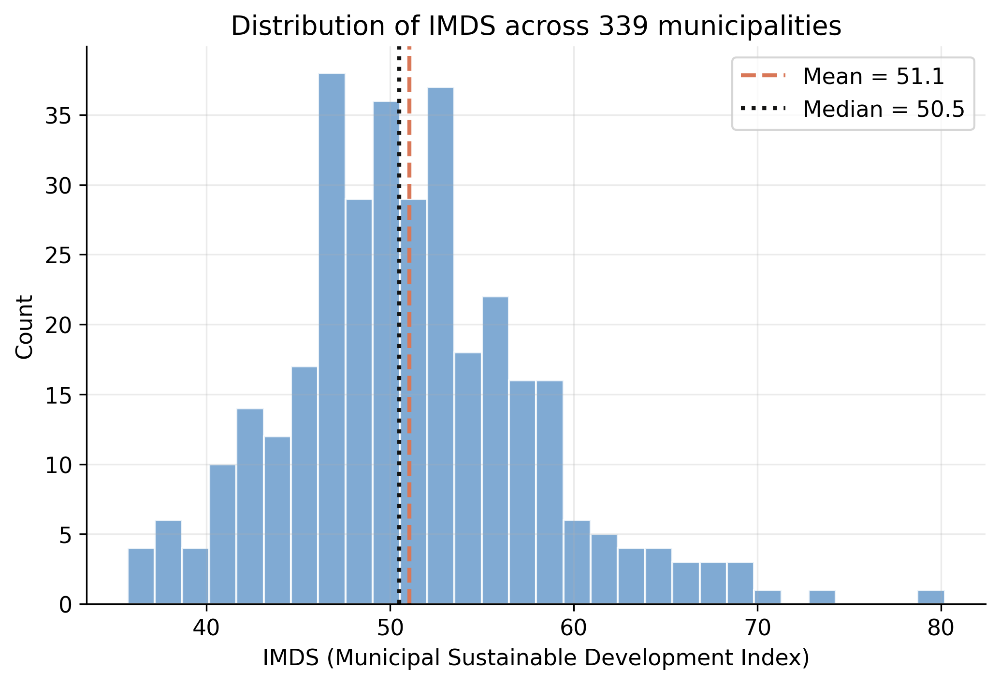
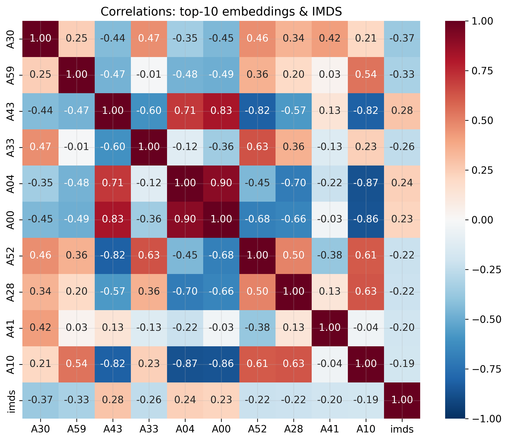
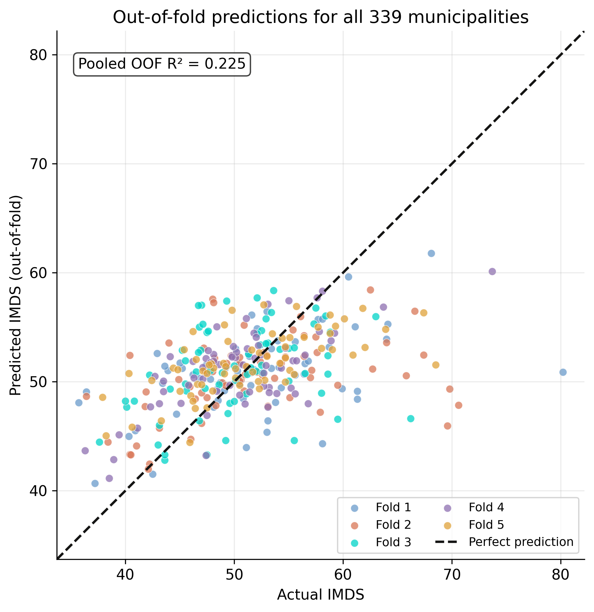
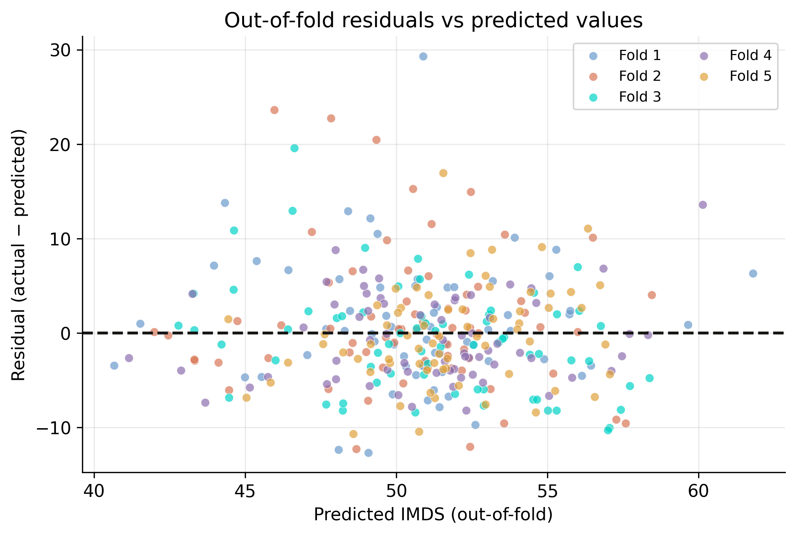
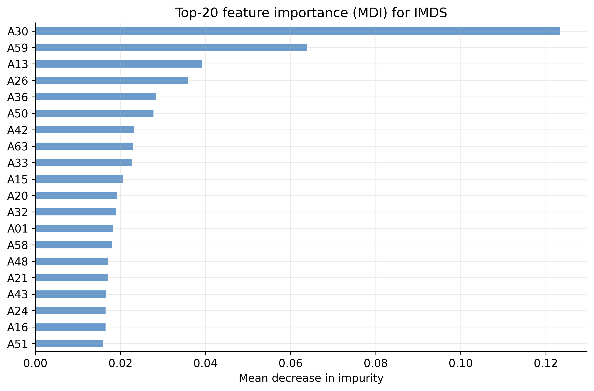
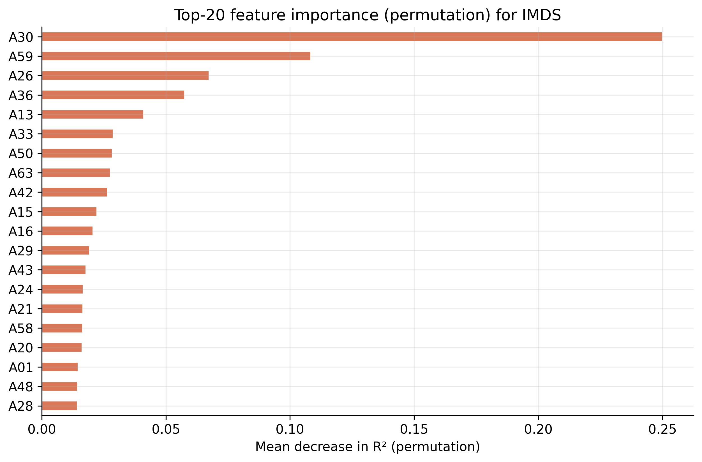
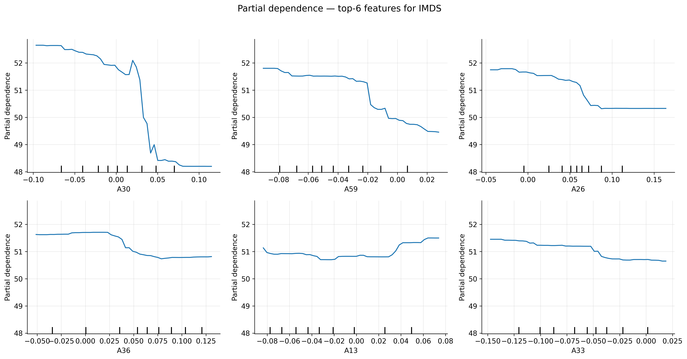

---
authors:
  - admin
categories:
  - Python
  - Tutorial
draft: false
featured: false
date: "2026-03-10T00:00:00Z"
external_link: ""
image:
  caption: ""
  focal_point: Smart
  placement: 3
links:
- icon: open-data
  icon_pack: ai
  name: "[Python] Google Colab"
  url: https://colab.research.google.com/github/cmg777/claude4data/blob/master/notebooks/notebook-04.ipynb
- icon: code
  icon_pack: fas
  name: "Python script"
  url: script.py
slides:
summary: Predicting municipal development in Bolivia using Random Forest regression on satellite image embeddings
tags:
- python
- spatial
- regional
title: "Introduction to Machine Learning: Random Forest Regression"
url_code: ""
url_pdf: ""
url_slides: ""
url_video: ""
toc: true
---

## Overview

Can satellite imagery predict how well a municipality is developing? This notebook explores that question by applying Random Forest regression to predict Bolivia's Municipal Sustainable Development Index (IMDS) from satellite image embeddings. IMDS is a composite index (0--100 scale) that captures how well each of Bolivia's 339 municipalities is progressing toward sustainable development goals. Satellite embeddings are 64-dimensional feature vectors extracted from 2017 satellite imagery --- they compress visual information about land use, urbanization, and terrain into numbers a model can learn from.

The Random Forest algorithm is a natural starting point for this kind of tabular prediction task: it handles non-linear relationships, requires minimal preprocessing, and provides built-in measures of feature importance. By the end of this tutorial, we will know how much development-related signal satellite imagery actually contains --- and where its predictive power falls short.

**Learning objectives:**

- Understand the Random Forest algorithm and why it works well for tabular data
- Follow ML best practices: train/test split, cross-validation, hyperparameter tuning
- Interpret model performance metrics (R², RMSE, MAE)
- Analyze feature importance and partial dependence plots
- Build intuition for when ML adds value over simpler approaches

```python
import sys
if "google.colab" in sys.modules:
    !git clone --depth 1 https://github.com/cmg777/claude4data.git /content/claude4data 2>/dev/null || true
    %cd /content/claude4data/notebooks
sys.path.insert(0, "..")
from config import set_seeds, RANDOM_SEED, IMAGES_DIR, TABLES_DIR, DATA_DIR

set_seeds()
```

```python
import numpy as np
import pandas as pd
import matplotlib.pyplot as plt
import seaborn as sns
from scipy.stats import randint
from sklearn.model_selection import train_test_split, cross_val_score, RandomizedSearchCV
from sklearn.ensemble import RandomForestRegressor
from sklearn.metrics import r2_score, mean_squared_error, mean_absolute_error
from sklearn.inspection import PartialDependenceDisplay, permutation_importance

# Configuration
TARGET = "imds"
TARGET_LABEL = "IMDS (Municipal Sustainable Development Index)"
FEATURE_COLS = [f"A{i:02d}" for i in range(64)]

DS4BOLIVIA_BASE = "https://raw.githubusercontent.com/quarcs-lab/ds4bolivia/master"
CACHE_PATH = DATA_DIR / "rawData" / "ds4bolivia_merged.csv"
```

## Data Loading

The data comes from the [DS4Bolivia](https://github.com/quarcs-lab/ds4bolivia) repository, which provides standardized datasets for studying Bolivian development. We merge three tables on `asdf_id` --- the unique identifier for each municipality: SDG indices (our target variables), satellite embeddings (our features), and region names (for context).

```python
if CACHE_PATH.exists():
    print(f"Loading cached data from {CACHE_PATH}")
    df = pd.read_csv(CACHE_PATH)
else:
    print("Downloading data from DS4Bolivia...")
    sdg = pd.read_csv(f"{DS4BOLIVIA_BASE}/sdg/sdg.csv")
    embeddings = pd.read_csv(
        f"{DS4BOLIVIA_BASE}/satelliteEmbeddings/satelliteEmbeddings2017.csv"
    )
    regions = pd.read_csv(f"{DS4BOLIVIA_BASE}/regionNames/regionNames.csv")

    df = sdg.merge(embeddings, on="asdf_id").merge(regions, on="asdf_id")
    CACHE_PATH.parent.mkdir(parents=True, exist_ok=True)
    df.to_csv(CACHE_PATH, index=False)
    print(f"Cached merged data to {CACHE_PATH}")

X = df[FEATURE_COLS]
y = df[TARGET]
mask = X.notna().all(axis=1) & y.notna()
X = X[mask]
y = y[mask]

print(f"Dataset shape: {df.shape}")
print(f"Observations after dropping missing: {len(y)}")
print(f"\nTarget variable ({TARGET}) summary:")
print(y.describe().round(2))
```

```
Downloading data from DS4Bolivia...
Cached merged data to data/rawData/ds4bolivia_merged.csv
Dataset shape: (339, 88)
Observations after dropping missing: 339

Target variable (imds) summary:
count    339.00
mean      51.05
std        6.77
min       35.70
25%       47.00
50%       50.50
75%       54.85
max       80.20
Name: imds, dtype: float64
```

All 339 Bolivian municipalities loaded successfully with no missing values --- the dataset provides complete national coverage. The merged data has 88 columns: the 64 satellite embedding features, SDG indices, and region identifiers. IMDS scores range from 35.70 to 80.20 with a mean of 51.05 and standard deviation of 6.77, meaning most municipalities cluster within about 7 points of the national average on the 0--100 scale.

## Exploratory Data Analysis

Before building any model, we explore the data to understand its structure. EDA helps us spot issues --- skewed distributions, outliers, or weak feature correlations --- that could affect model performance. It also builds intuition about what patterns the model might find.

### Target Distribution

The histogram below shows how IMDS values are distributed across municipalities. The shape of this distribution matters: a highly skewed target can bias predictions toward the majority range.

```python
fig, ax = plt.subplots(figsize=(8, 5))
ax.hist(y, bins=30, edgecolor="white", alpha=0.8, color="#6a9bcc")
ax.axvline(y.mean(), color="#d97757", linestyle="--", linewidth=2, label=f"Mean = {y.mean():.1f}")
ax.axvline(y.median(), color="#141413", linestyle=":", linewidth=2, label=f"Median = {y.median():.1f}")
ax.set_xlabel(TARGET_LABEL)
ax.set_ylabel("Count")
ax.set_title(f"Distribution of {TARGET_LABEL}")
ax.legend()
plt.savefig(IMAGES_DIR / "ml_target_distribution.png", dpi=300, bbox_inches="tight")
plt.show()
```



The distribution is roughly bell-shaped with a slight right skew --- the mean (51.1) sits just above the median (50.5), indicating a small tail of higher-performing municipalities. Most scores fall between 47 and 55, meaning the majority of Bolivia's municipalities have similar mid-range development levels. The handful of outliers above 70 likely correspond to larger urban centers like La Paz, Santa Cruz, and Cochabamba, which have significantly higher development infrastructure.

### Embedding Correlations

Next we examine which satellite embedding dimensions are most correlated with the target. Strong correlations suggest the model has useful signal to learn from; weak correlations across the board would be a warning sign.

```python
correlations = X.corrwith(y).abs().sort_values(ascending=False)
top10_features = correlations.head(10).index.tolist()
corr_matrix = df[top10_features + [TARGET]].corr()

fig, ax = plt.subplots(figsize=(10, 8))
sns.heatmap(corr_matrix, annot=True, fmt=".2f", cmap="RdBu_r", center=0,
            square=True, ax=ax, vmin=-1, vmax=1)
ax.set_title(f"Correlations: Top-10 Embeddings & {TARGET_LABEL}")
plt.savefig(IMAGES_DIR / "ml_embedding_correlations.png", dpi=300, bbox_inches="tight")
plt.show()
```



The heatmap reveals that the strongest individual correlations between embedding dimensions and IMDS are moderate (in the 0.25--0.40 range), which is typical for satellite-derived features predicting complex socioeconomic outcomes. Several embedding dimensions are also correlated with each other, suggesting they capture overlapping spatial patterns --- the Random Forest can handle this *multicollinearity* --- features carrying overlapping information --- well since it selects feature subsets at each split. With these moderate correlations, the model has real signal to work with, so let's proceed to building it.

## Train/Test Split

Now that we understand the data's structure, we can prepare it for modeling. We split the data into training (80%) and test (20%) sets *before* any model fitting. This is a fundamental ML practice: if the model ever "sees" the test data during training or tuning, our performance estimate will be overly optimistic --- a problem called **data leakage**. The `random_state` ensures the same split every time we run the notebook, making results reproducible.

```python
X_train, X_test, y_train, y_test = train_test_split(
    X, y, test_size=0.2, random_state=RANDOM_SEED
)
print(f"Training set: {len(X_train)} municipalities")
print(f"Test set:     {len(X_test)} municipalities")
```

```
Training set: 271 municipalities
Test set:     68 municipalities
```

The split gives us 271 municipalities for training and 68 for testing. With only 339 total observations, this is a relatively small dataset for ML --- the test set of 68 means each test prediction represents about 1.5% of the data. This makes cross-validation especially important for getting reliable performance estimates, since a single 68-sample test set could be unrepresentative by chance.

## Baseline Model

Before tuning anything, we establish a baseline using a Random Forest with default hyperparameters. **Random Forest** works by building many decision trees on random subsets of the data and features, then averaging their predictions. This "wisdom of crowds" approach reduces overfitting compared to a single decision tree. Formally, the prediction is:

$$\hat{y} = \frac{1}{B} \sum\_{b=1}^{B} T\_b(\mathbf{x})$$

In words, the predicted value $\hat{y}$ is the average of predictions from all $B$ individual trees. Each tree $T\_b$ sees a different random subset of training rows and features, so the trees make different errors --- averaging cancels out much of the noise. Here $B$ corresponds to the `n_estimators` parameter (100 in our baseline, 500 after tuning) and $\mathbf{x}$ is the 64-dimensional satellite embedding vector for a given municipality.

### Cross-Validation

Think of cross-validation as a rotating exam: the model takes turns training on different subsets and testing on the remainder, so no single lucky split determines the score. We evaluate the baseline with 5-fold cross-validation on the training set. Instead of a single train/validation split, k-fold CV rotates through 5 different validation sets and averages the scores. This gives a more reliable and stable performance estimate, especially important with smaller datasets like ours.

```python
baseline_rf = RandomForestRegressor(n_estimators=100, random_state=RANDOM_SEED)
cv_scores = cross_val_score(baseline_rf, X_train, y_train, cv=5, scoring="r2")

print(f"5-Fold CV R² scores: {cv_scores.round(4)}")
print(f"Mean CV R²:          {cv_scores.mean():.4f} (+/- {cv_scores.std():.4f})")
```

```
5-Fold CV R² scores: [0.152  0.1867 0.2704 0.3084 0.3454]
Mean CV R²:          0.2526 (+/- 0.0728)
```

The 5-fold CV R² scores range from 0.152 to 0.345, with a mean of 0.2526 (+/- 0.0728). This means the baseline model explains about 25% of the variation in IMDS on average, but the high variability across folds (standard deviation of 0.07) reflects the small dataset --- different subsets of 271 municipalities can look quite different from each other. An R² around 0.25 is a reasonable starting point for predicting a complex social outcome from satellite imagery alone.

### Test Evaluation

We now fit the baseline on the full training set and evaluate on the held-out test data. This gives our first concrete performance estimate --- a reference point that any tuning should improve upon.

```python
baseline_rf.fit(X_train, y_train)
baseline_pred = baseline_rf.predict(X_test)
baseline_r2 = r2_score(y_test, baseline_pred)
baseline_rmse = np.sqrt(mean_squared_error(y_test, baseline_pred))
baseline_mae = mean_absolute_error(y_test, baseline_pred)

print(f"Baseline Test R²:   {baseline_r2:.4f}")
print(f"Baseline Test RMSE: {baseline_rmse:.2f}")
print(f"Baseline Test MAE:  {baseline_mae:.2f}")
```

```
Baseline Test R²:   0.2307
Baseline Test RMSE: 6.52
Baseline Test MAE:  4.68
```

On the held-out test set, the baseline achieves R² = 0.2307, RMSE = 6.52, and MAE = 4.68. In practical terms, the model's predictions are typically off by about 4.7 IMDS points (MAE) on a scale where most values fall between 47 and 55. The RMSE of 6.52 is higher than the MAE, indicating some larger errors are pulling it up. This baseline gives us a concrete reference --- any improvement from tuning should beat these numbers.

## Hyperparameter Tuning

The baseline model uses scikit-learn's defaults, but we can often do better by searching for optimal hyperparameters. **RandomizedSearchCV** is more efficient than exhaustive grid search --- it samples random combinations and evaluates each with cross-validation. Here's what each hyperparameter controls:

- **n_estimators**: Number of trees in the forest (more trees = more stable but slower)
- **max_depth**: How deep each tree can grow (deeper = more complex patterns but risk overfitting)
- **min_samples_split**: Minimum samples needed to split a node (higher = more regularization)
- **min_samples_leaf**: Minimum samples in a leaf node (higher = smoother predictions)
- **max_features**: How many features each tree considers per split (fewer = more diverse trees)

```python
param_distributions = {
    "n_estimators": [100, 200, 300, 500],
    "max_depth": [None, 10, 20, 30],
    "min_samples_split": randint(2, 11),
    "min_samples_leaf": randint(1, 5),
    "max_features": ["sqrt", "log2", None],
}

search = RandomizedSearchCV(
    RandomForestRegressor(random_state=RANDOM_SEED),
    param_distributions=param_distributions,
    n_iter=50,
    cv=5,
    scoring="r2",
    random_state=RANDOM_SEED,
    n_jobs=-1,
)
search.fit(X_train, y_train)

print(f"Best CV R²: {search.best_score_:.4f}")
print(f"\nBest parameters:")
for param, value in search.best_params_.items():
    print(f"  {param}: {value}")
```

```
Best CV R²: 0.2721

Best parameters:
  max_depth: 30
  max_features: sqrt
  min_samples_leaf: 1
  min_samples_split: 4
  n_estimators: 500
```

The best configuration found uses 500 trees with max_depth=30, max_features=sqrt, min_samples_leaf=1, and min_samples_split=4. The best CV R² of 0.2721 is modestly higher than the baseline's 0.2526 --- about a 2 percentage point improvement in explained variance. The tuning selected a deeper, more complex model (max_depth=30 vs the default of unlimited) while constraining feature subsampling to sqrt(64)=8 features per split, which encourages tree diversity.

## Model Evaluation

Now we evaluate the tuned model on the held-out test set --- data the model has never seen during training or tuning. Three complementary metrics tell us different things:

- **R²** (coefficient of determination): What fraction of the target's variance the model explains. R² = 1.0 is perfect; R² = 0 means the model is no better than predicting the mean.
- **RMSE** (Root Mean Squared Error): Average prediction error in the same units as the target. Penalizes large errors more heavily.
- **MAE** (Mean Absolute Error): Average absolute error. More robust to outliers than RMSE.

$$R^2 = 1 - \frac{\sum\_{i=1}^{n}(y\_i - \hat{y}\_i)^2}{\sum\_{i=1}^{n}(y\_i - \bar{y})^2}$$

$$\text{RMSE} = \sqrt{\frac{1}{n}\sum\_{i=1}^{n}(y\_i - \hat{y}\_i)^2} \qquad \text{MAE} = \frac{1}{n}\sum\_{i=1}^{n}|y\_i - \hat{y}\_i|$$

In these formulas, $y\_i$ is the actual IMDS value for municipality $i$, $\hat{y}\_i$ is the model's prediction, and $\bar{y}$ is the mean IMDS across all test municipalities. R² compares total prediction error to the naive baseline of always guessing the mean --- higher is better. RMSE and MAE both measure average error in IMDS points, but RMSE penalizes large misses more heavily because it squares the errors before averaging. In code, $y\_i$ is `y_test`, $\hat{y}\_i$ is `tuned_pred`, and $n$ is 68 (the test set size).

```python
best_rf = search.best_estimator_
tuned_pred = best_rf.predict(X_test)
tuned_r2 = r2_score(y_test, tuned_pred)
tuned_rmse = np.sqrt(mean_squared_error(y_test, tuned_pred))
tuned_mae = mean_absolute_error(y_test, tuned_pred)

print(f"Tuned Test R²:   {tuned_r2:.4f}")
print(f"Tuned Test RMSE: {tuned_rmse:.2f}")
print(f"Tuned Test MAE:  {tuned_mae:.2f}")
```

```
Tuned Test R²:   0.2297
Tuned Test RMSE: 6.52
Tuned Test MAE:  4.72
```

The tuned model achieves R² = 0.2297, RMSE = 6.52, and MAE = 4.72 on the test set --- essentially identical to the baseline (R² = 0.2307, RMSE = 6.52, MAE = 4.68). This is a common finding with small datasets: the tuning improved CV performance slightly but the gains didn't transfer to the specific test set. The model explains about 23% of IMDS variation, meaning satellite embeddings capture real but limited predictive signal for municipal development.

### Actual vs Predicted

This scatter plot shows how well the model's predictions match reality. Points falling exactly on the dashed 45-degree line would indicate perfect predictions; scatter around the line shows prediction error.

```python
fig, ax = plt.subplots(figsize=(7, 7))
ax.scatter(y_test, tuned_pred, alpha=0.6, edgecolors="white", linewidth=0.5, color="#6a9bcc")
lims = [min(y_test.min(), tuned_pred.min()) - 2, max(y_test.max(), tuned_pred.max()) + 2]
ax.plot(lims, lims, "--", color="#d97757", linewidth=2, label="Perfect prediction")
ax.set_xlim(lims)
ax.set_ylim(lims)
ax.set_xlabel(f"Actual {TARGET_LABEL}")
ax.set_ylabel(f"Predicted {TARGET_LABEL}")
ax.set_title(f"Actual vs Predicted {TARGET_LABEL}")
ax.legend()
ax.set_aspect("equal")
plt.savefig(IMAGES_DIR / "ml_actual_vs_predicted.png", dpi=300, bbox_inches="tight")
plt.show()
```



The scatter shows moderate agreement between actual and predicted IMDS values, with noticeable spread around the 45-degree line. Predictions tend to cluster in the 47--55 range (near the training mean), with the model struggling to predict extreme values --- municipalities with very high or low IMDS scores are pulled toward the center. This "regression to the mean" effect is typical when the model has limited predictive power.

### Residual Analysis

Residuals (actual minus predicted) should ideally be randomly scattered around zero with no obvious pattern. Patterns in residuals can reveal systematic biases --- for example, if the model consistently underpredicts high-IMDS municipalities, it suggests the features miss something important about well-developed areas.

```python
residuals = y_test - tuned_pred
fig, ax = plt.subplots(figsize=(8, 5))
ax.scatter(tuned_pred, residuals, alpha=0.6, edgecolors="white", linewidth=0.5, color="#6a9bcc")
ax.axhline(0, color="#d97757", linestyle="--", linewidth=2)
ax.set_xlabel(f"Predicted {TARGET_LABEL}")
ax.set_ylabel("Residuals")
ax.set_title("Residuals vs Predicted Values")
plt.savefig(IMAGES_DIR / "ml_residuals.png", dpi=300, bbox_inches="tight")
plt.show()
```



The residuals appear roughly randomly scattered around zero, which is encouraging --- there's no strong systematic bias. However, the spread is wider at the extremes, suggesting the model's errors are larger for municipalities with unusually high or low predicted IMDS. This pattern --- the spread of errors changing across the prediction range, known as *heteroscedasticity* --- is consistent with the regression-to-the-mean effect seen in the scatter plot above.

## Feature Importance

Which satellite embedding dimensions matter most for predicting IMDS? We compare two methods that answer this question differently:

### Mean Decrease in Impurity (MDI)

MDI measures how much each feature reduces prediction error across all splits in all trees. It's fast to compute (built into the trained model) but can be biased toward *high-cardinality* features --- those with many distinct values, like continuous numbers --- or correlated features.

```python
mdi_importance = pd.Series(best_rf.feature_importances_, index=FEATURE_COLS)
top20_mdi = mdi_importance.sort_values(ascending=False).head(20)

fig, ax = plt.subplots(figsize=(10, 6))
top20_mdi.sort_values().plot.barh(ax=ax, color="#6a9bcc", edgecolor="white")
ax.set_xlabel("Mean Decrease in Impurity")
ax.set_title(f"Top-20 Feature Importance (MDI) for {TARGET_LABEL}")
plt.savefig(IMAGES_DIR / "ml_feature_importance_mdi.png", dpi=300, bbox_inches="tight")
plt.show()
```



The MDI plot shows that A30 and A59 rank highest, but importance is distributed across many embedding dimensions rather than concentrated in just a few. This suggests the satellite imagery captures multiple independent visual patterns relevant to development --- no single dimension dominates. However, MDI can be inflated for continuous features, so we'll cross-check with permutation importance next.

### Permutation Importance

Permutation importance is more reliable. Imagine scrambling all the values in one column of a spreadsheet --- if the model's accuracy barely changes, that column wasn't contributing much. That's exactly what permutation importance does: it randomly shuffles each feature and measures how much the model's R² drops. Unlike MDI, permutation importance is evaluated on the test set and is not biased by feature scale or cardinality.

```python
perm_result = permutation_importance(
    best_rf, X_test, y_test, n_repeats=10, random_state=RANDOM_SEED, n_jobs=-1
)
perm_importance = pd.Series(perm_result.importances_mean, index=FEATURE_COLS)
top20_perm = perm_importance.sort_values(ascending=False).head(20)

fig, ax = plt.subplots(figsize=(10, 6))
top20_perm.sort_values().plot.barh(ax=ax, color="#d97757", edgecolor="white")
ax.set_xlabel("Mean Decrease in R² (Permutation)")
ax.set_title(f"Top-20 Feature Importance (Permutation) for {TARGET_LABEL}")
plt.savefig(IMAGES_DIR / "ml_feature_importance_permutation.png", dpi=300, bbox_inches="tight")
plt.show()
```



Permutation importance gives a more trustworthy picture. A59 emerges as the clear top feature under both methods, with A42 and A26 also ranking highly. The ranking differs somewhat from MDI (A30 drops considerably), which is expected --- permutation importance is less biased and directly measures predictive contribution on the test set. These top features are the embedding dimensions that genuinely help the model distinguish between municipalities with different IMDS levels. Let's now visualize how these features affect predictions.

## Partial Dependence Plots

Partial dependence plots show the marginal effect of a single feature on predictions, averaging over all other features. They reveal non-linear relationships that a simple correlation coefficient can't capture --- for example, a feature might have no effect below a threshold but a strong effect above it. We plot the top-6 most important features (by permutation importance).

```python
top6_features = perm_importance.sort_values(ascending=False).head(6).index.tolist()
fig, axes = plt.subplots(2, 3, figsize=(15, 8))
PartialDependenceDisplay.from_estimator(
    best_rf, X_train, top6_features, ax=axes.ravel(),
    grid_resolution=50, n_jobs=-1
)
fig.suptitle(f"Partial Dependence Plots — Top-6 Features for {TARGET_LABEL}", fontsize=14)
plt.tight_layout(rect=[0, 0, 1, 0.95])
plt.savefig(IMAGES_DIR / "ml_partial_dependence.png", dpi=300, bbox_inches="tight")
plt.show()
```



The partial dependence plots reveal non-linear relationships between the top features and predicted IMDS. Some dimensions show threshold effects --- the predicted IMDS changes sharply at certain embedding values then levels off. These non-linearities justify using Random Forest over a linear model, as a linear regression would miss these step-like patterns. The embedding dimensions likely correspond to visual landscape features (urbanization, vegetation cover, infrastructure density) that change abruptly between rural and urban municipalities.

## Summary and Results

| Metric | Baseline | Tuned |
|--------|----------|-------|
| R²     | 0.2307   | 0.2297 |
| RMSE   | 6.52     | 6.52   |
| MAE    | 4.68     | 4.72   |

The summary table confirms that tuning provided negligible improvement over the baseline for this dataset: both models achieve R² around 0.23, RMSE of 6.52, and MAE near 4.7. Key takeaways from this analysis:

- **Method insight:** Random Forest with default hyperparameters performed just as well as the tuned model (R² = 0.2307 vs 0.2297), suggesting the performance ceiling comes from the features themselves, not model configuration. When the signal in the data is limited, sophisticated tuning adds little.
- **Data insight:** Satellite embeddings explain roughly a quarter of IMDS variation --- a meaningful signal showing that remote sensing captures real development-related patterns. Feature importance is broadly distributed across embedding dimensions (A59, A42, A26 rank highest), meaning IMDS prediction relies on many visual patterns rather than a single dominant signal.
- **Practical limitation:** The model's regression-to-the-mean behavior (predictions cluster in the 47--55 range) means it cannot reliably identify the highest- or lowest-performing municipalities individually. A policymaker using these predictions to target aid would miss the most extreme cases.
- **Next step:** The 77% of unexplained variance likely comes from factors invisible to satellites --- governance quality, migration patterns, informal economies. Combining satellite embeddings with administrative or survey data would be the natural next experiment to boost predictive power.

## Limitations and Next Steps

This analysis demonstrates that satellite embeddings contain real predictive signal for municipal development outcomes, but several limitations apply:

- **Moderate R²**: The model captures meaningful patterns but leaves much variation unexplained --- development is driven by many factors invisible from space (governance, migration, informal economy).
- **Temporal mismatch**: We use 2017 satellite imagery with SDG indices from a potentially different period.
- **Feature interpretability**: Embedding dimensions (A00--A63) are abstract; connecting them to physical landscape features requires further analysis.
- **Small sample**: With only 339 municipalities, complex models risk overfitting despite cross-validation.

**Next steps** could include: trying other algorithms (gradient boosting, regularized regression), incorporating additional features (geographic, demographic), or using explainability tools like SHAP values for richer interpretation.

## Exercises

1. **Try a different algorithm.** Replace `RandomForestRegressor` with `GradientBoostingRegressor` from scikit-learn. Does the R² improve? How do the feature importance rankings change compared to Random Forest?

2. **Predict a different SDG index.** The DS4Bolivia dataset contains 15 individual SDG indices (`sdg1` through `sdg15`) alongside the composite IMDS. Pick one SDG index as the target and re-run the full pipeline. Which SDG dimensions are most predictable from satellite imagery, and which are hardest?

3. **Add geographic features.** Merge the region names data and create dummy variables for Bolivia's nine departments. Does combining satellite embeddings with administrative region information improve model performance? What does this tell you about spatial patterns in development?

## References

1. [scikit-learn --- RandomForestRegressor](https://scikit-learn.org/stable/modules/generated/sklearn.ensemble.RandomForestRegressor.html)
2. [scikit-learn --- RandomizedSearchCV](https://scikit-learn.org/stable/modules/generated/sklearn.model_selection.RandomizedSearchCV.html)
3. [scikit-learn --- Permutation Importance](https://scikit-learn.org/stable/modules/permutation_importance.html)
4. [scikit-learn --- Partial Dependence Plots](https://scikit-learn.org/stable/modules/partial_dependence.html)
5. [QUARCS Lab. DS4Bolivia --- Open Data for Bolivian Development.](https://github.com/quarcs-lab/ds4bolivia)
6. [Breiman, L. (2001). Random Forests. Machine Learning, 45(1), 5--32.](https://doi.org/10.1023/A:1010933404324)
