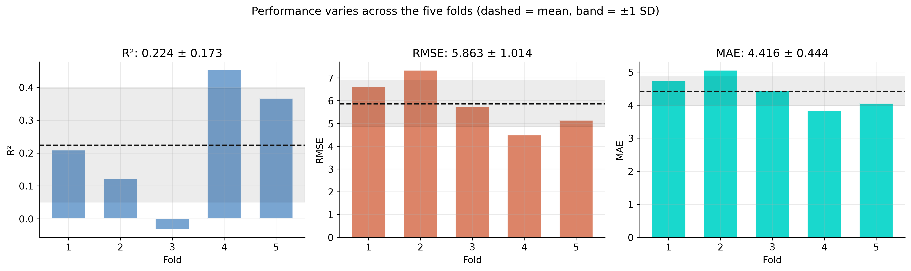
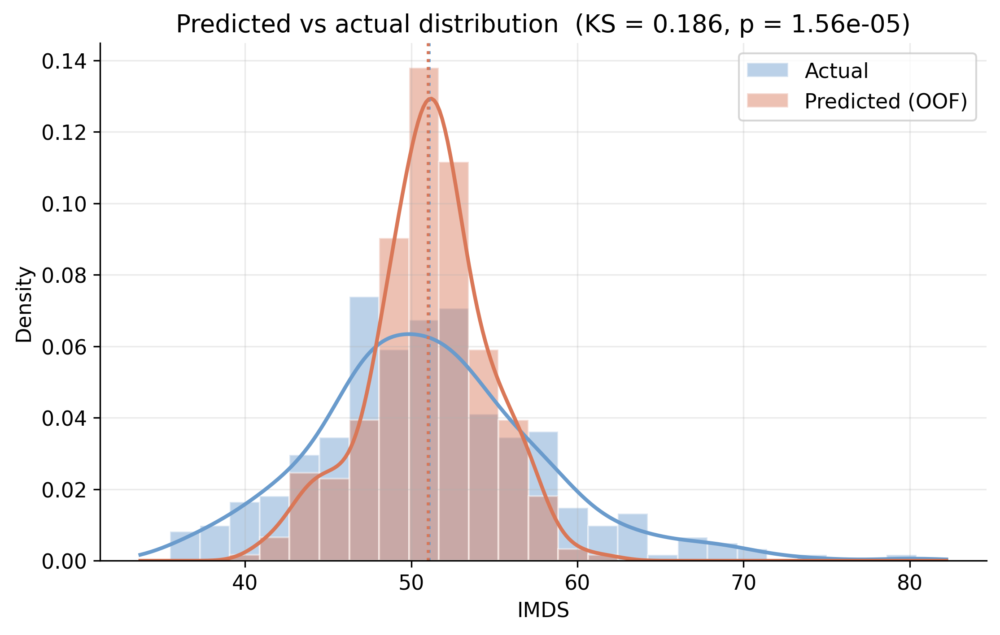
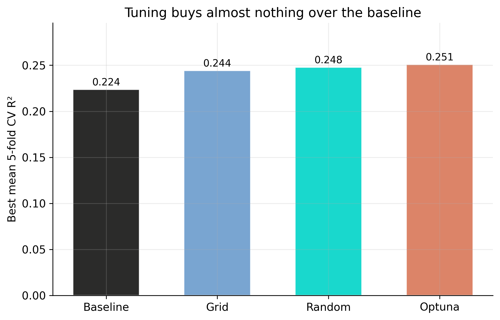

# The Tension {.divider background-color="#d97757"}

[Act I]{.act}

## Can a 64-number summary of a satellite photo tell you how a town is doing?

Bolivia has 339 municipalities. Many lack reliable survey data — yet every one of them is photographed from space.

. . .

A Google embedding model crushes each 2017 image into **64 numbers**. *Do those numbers know anything about human development?*

::: {.notes}
This is the core promise of remote-sensing-for-development: imagery is cheap and global, surveys are expensive and sparse. The whole tutorial is a stress test of how much of that promise is real. Frame it as an honest empirical question, not a foregone conclusion.
:::

## Predictions cluster near the mean — the model knows the middle, not the edges


::: {.notes}
Spoiler figure. Don't explain every point yet — just plant the shape: the cloud hugs the 47–55 band and the extremes get pulled toward the center. Every one of the 339 dots is an out-of-fold prediction — made by a forest that never saw that town. We earn this picture in Act III; for now it tells us the signal is real but bounded.
:::

## Where we're going

::: {.incremental}
- The data: 339 municipalities, a 0–100 development index, 64 image embeddings
- Random Forest — bagging plus random feature subsets to fight overfitting
- The honest protocol: **5-fold cross-validation** with an out-of-fold prediction for every town
- The lesson: report the *spread*, not just the mean — and the ceiling is the features, not the knobs
:::

# The Investigation {.divider background-color="#6a9bcc"}

[Act II]{.act}

## The target is tightly bunched: most towns score between 47 and 55


::: {.notes}
This bunching is the whole difficulty. With a standard deviation of only 6.77 on a 0–100 scale, there is little spread for a model to explain. The handful of towns above 70 are the big cities (La Paz, Santa Cruz, Cochabamba). A model that just guesses "about 51" is already hard to beat.
:::

## No single embedding is a smoking gun — the best correlation is only 0.37


::: {.notes}
Moderate, not strong. Dimension A30 leads at about 0.37; the rest sit in the 0.25–0.35 band. That is typical for satellite-derived features against a complex socioeconomic outcome. Several embeddings also correlate with each other (overlapping spatial patterns) — multicollinearity that would trouble OLS but that a Random Forest shrugs off because it subsamples features at every split.
:::

## A Random Forest averages many decorrelated trees to cut variance

$$\hat{y} = \frac{1}{B} \sum_{b=1}^{B} T_b(\mathbf{x})$$

Each tree $T_b$ is grown on a bootstrap resample, and at every split only $\sqrt{64}=8$ features are even considered.

[Bootstrap rows + random feature subsets = trees that make *different* mistakes; averaging cancels the noise.]{.comment}

::: {.notes}
Walk the two sources of randomness aloud. Bagging (bootstrap aggregating) decorrelates by resampling rows; the random feature subset decorrelates further by hiding columns. Lower correlation between trees means a bigger variance reduction when you average — that is the entire trick. Here B is n_estimators (100 by default) and x is the 64-dimensional embedding vector. We keep the defaults; tuning lives in the appendix.
:::

## Don't trust one split — rotate five, and predict every town out-of-fold

:::: {.columns}
::: {.column width="50%"}
### k-fold cross-validation
- shuffle, cut into **5 folds**
- each fold is the test set once
- train on 4, test on 1, rotate
:::
::: {.column width="50%"}
### Out-of-fold predictions
- every town predicted exactly once
- by a forest that never saw it
- → honest predictions for all 339
:::
::::

[A single 80/20 split is a lottery: across 200 random seeds the test R-squared ranges from −0.09 to 0.46 (Appendix A).]{.comment}

::: {.notes}
This replaces the old "hold out 68 towns" slide. With only 339 rows a single test set is both wasteful and noisy. Cross-validation rotates the held-out fold so every observation is tested exactly once and trained on four times. `cross_val_predict` stitches the held-out predictions back together into one out-of-fold prediction per town — that is what we plot for all 339.
:::

## Five rotating exams: an honest score, plus the spread that one split hides

``` {.python code-line-numbers="1-2|4-7|9-11"}
kf = KFold(n_splits=5, shuffle=True, random_state=42)
baseline_rf = RandomForestRegressor(n_estimators=100, random_state=42)

cv = cross_validate(baseline_rf, X, y, cv=kf,
        scoring=("r2", "neg_root_mean_squared_error", "neg_mean_absolute_error"))
# per-fold R²: [ 0.21  0.12  -0.03  0.45  0.37 ]
# mean R² = 0.224  ±  0.173

oof_pred = cross_val_predict(baseline_rf, X, y, cv=kf)  # one prediction / town
# pooled out-of-fold R² = 0.225
```

[Fold 3 scores **−0.03** — worse than guessing the average. One lucky split could have shown you only the 0.45.]{.comment}

::: {.notes}
The five fold scores are the whole point. They swing from a negative value to 0.45 — a standard deviation (0.173) almost as large as the mean (0.224). A single train/test split hands you exactly one of these numbers with no way to know which. cross_val_predict reuses the same folds to give one out-of-fold prediction per municipality; pooled over all 339 that is an R² of 0.225.
:::

## Report the standard deviation: the model's quality swings fold to fold



::: {.notes}
This is the methodological heart of the talk. "R² = 0.22" is true and misleading; the honest statement is 0.224 ± 0.173. Notice the three metrics partly disagree about which fold is hardest — R² is measured relative to each fold's own variance, so a fold of unusually similar towns inflates its R² even when absolute errors are small. Always report the spread, never just the mean.
:::

## A30 carries the signal — shuffling it alone costs more R-squared than the model has


::: {.notes}
Permutation importance shuffles one column and watches R² fall. A30 is the runaway leader — costing about 0.25 in R², larger than the model's entire out-of-fold R², because removing the best feature drags it below the mean baseline. A59 is a distant second, then A26, A36, A13. After the top two the bars decline gently — the forest reads many faint patterns, anchored by one strong one.
:::

## MDI and permutation agree on A30 — and that agreement is reassuring

:::: {.columns}
::: {.column width="50%"}
### MDI (impurity)
- built into the fitted model, free
- A30 ≈ 12% of impurity reduction
- biased toward high-cardinality features
:::
::: {.column width="50%"}
### Permutation
- shuffles each feature, re-scores R²
- A30 ≈ 0.25, then A59 ≈ 0.11
- unbiased by scale or cardinality
:::
::::

[Two very different methods crowning the same feature is evidence A30 is real signal, not a counting artifact.]{.comment}

::: {.notes}
A teaching moment on importance pitfalls. MDI rewards features used in many splits, which can inflate high-cardinality continuous features; permutation asks the cleaner question "does generalization suffer without you?" When they disagree, trust permutation — but here they agree emphatically on A30, which raises our confidence that the signal is genuine.
:::

## The relationships are non-linear thresholds — which is why a tree beats a line


::: {.notes}
Partial dependence averages the prediction as one feature sweeps its range, holding the rest at their observed distribution. The step-like shapes — flat, then a sharp climb, then a plateau — are exactly what a linear regression would smear into a single slope. Note the vertical scale: even A30 moves the prediction only a few IMDS points, consistent with the modest R².
:::

# The Resolution {.divider background-color="#00d4c8"}

[Act III]{.act}

## Across all 339 towns the forest explains about 22% of the variation {background-color="#141413"}

[0.22]{.bignum}

[pooled out-of-fold R-squared (per-fold 0.224 ± 0.173, RMSE 5.95, MAE 4.42)]{.bignum-label}

::: {.notes}
The headline. Out-of-fold over all 339 municipalities, the baseline forest explains about 22% of IMDS variance — real but limited signal. The per-fold standard deviation of 0.17 is the honest uncertainty around that number. No tuning, no held-out-set lottery: just an average over five rotating exams.
:::

## Predictions match the center of the distribution — but only half its spread



::: {.notes}
A complementary lens: do the predictions, as a whole, look like the real thing? The means match almost exactly (51.0 vs 51.0) — unbiased on average — but the predicted standard deviation is only 3.5 versus 6.8 actual, a 48% compression, and the KS test rejects equality at p < 0.001. This variance compression is the expected behavior of any low-R² regression: it hedges toward the mean rather than committing to extremes it cannot support.
:::

## The model is typically off by 4.4 IMDS points — and worst at the high end


::: {.notes}
MAE of 4.4 on a scale where most towns sit between 47 and 55 means the typical error is a meaningful slice of the spread. Residuals are centered but tilt upward on the right — the high-IMDS cities the model under-predicts — and the well-mixed fold colors confirm this is a property of the model, not one unlucky fold.
:::

## Does tuning rescue it? Grid, random, and Optuna all lift R-squared by < 0.03



[The methods rank as theory predicts — Optuna ≥ random ≥ grid — but every gain is smaller than the 0.17 fold-to-fold noise.]{.comment}

::: {.notes}
Appendix B in one slide. All three search strategies improve the cross-validated R², and they rank exactly as theory says given equal budgets. But the jump from 0.224 to 0.251 is well inside the fold-to-fold standard deviation — the tuning gain is smaller than the measurement noise. That is the empirical reason the main analysis keeps the defaults.
:::

## Did the forest overfit? No — cross-validation is the proof

[Objection.]{.objection} A Random Forest with deep trees on only 339 rows must be memorizing noise.

. . .

[Response.]{.rebuttal} Overfitting would make held-out performance collapse. Instead every fold is tested on towns it never trained on, and the pooled out-of-fold R-squared still sits at **0.22**. The model is *under*-powered by the features, not over-fit to the rows.

::: {.notes}
Steelman the worry — many trees on small n is a real overfitting setup. The rebuttal is baked into the method: out-of-fold predictions are by construction evaluated on unseen data, so the 0.22 is already an honest generalization estimate. Random Forests are also famously hard to overfit because averaging decorrelated trees shrinks variance. The constraint here is information, not capacity.
:::

## The 78% it misses lives off-camera: pair the pixels with survey data

::: {.incremental}
- Governance, migration, and informal economies are invisible from orbit
- Satellite embeddings are a genuine but partial proxy — a starting layer
- Next experiment: fuse embeddings with administrative or survey covariates
:::

::: {.notes}
End on the constructive turn. The roughly 22% explained is not a failure — it is honest evidence that imagery captures real development structure. The roughly 78% unexplained tells you precisely where to look next: the human factors a camera cannot see. The natural follow-up is data fusion, not a fancier model.
:::

# Satellite pixels know the middle of the distribution — for the edges, you still need the survey. {.divider background-color="#141413"}

::: {.notes}
The single takeaway. Imagery is a powerful, cheap first layer that explains about a fifth of municipal development and nails typical towns, but it compresses the extremes toward the mean and tuning cannot rescue that. Evaluate honestly with cross-validation, report the spread, and treat embeddings as one input among several — not a replacement for ground truth.
:::
