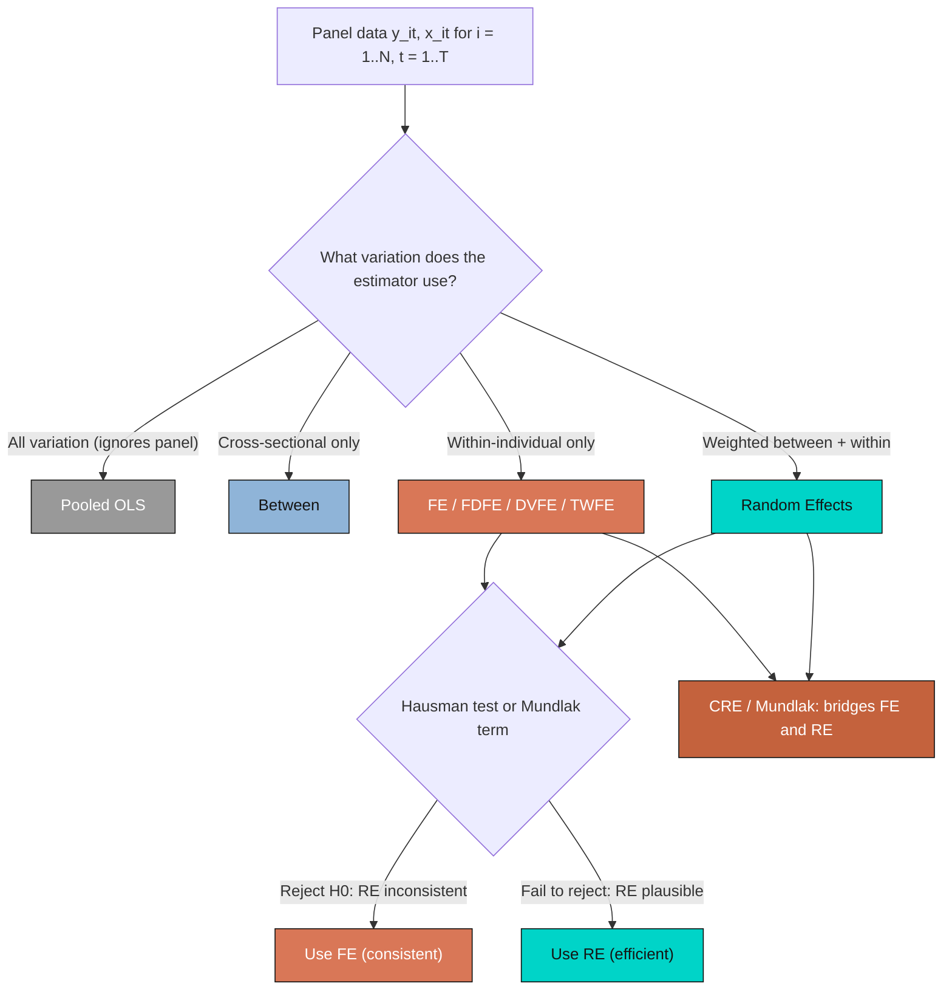
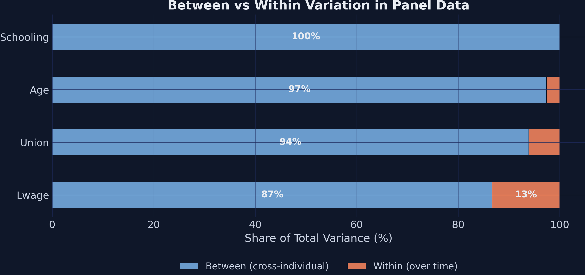
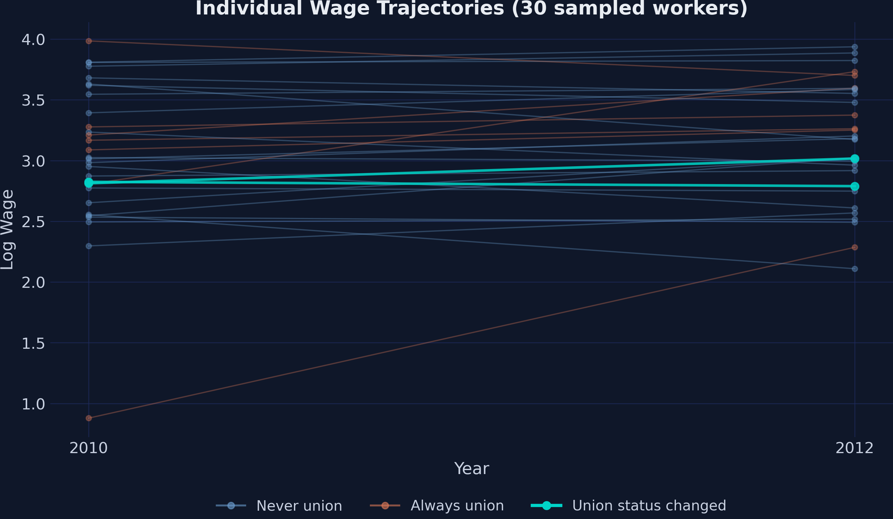
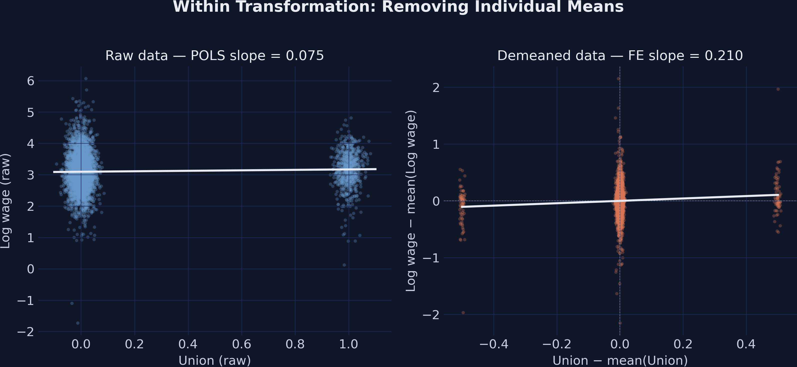
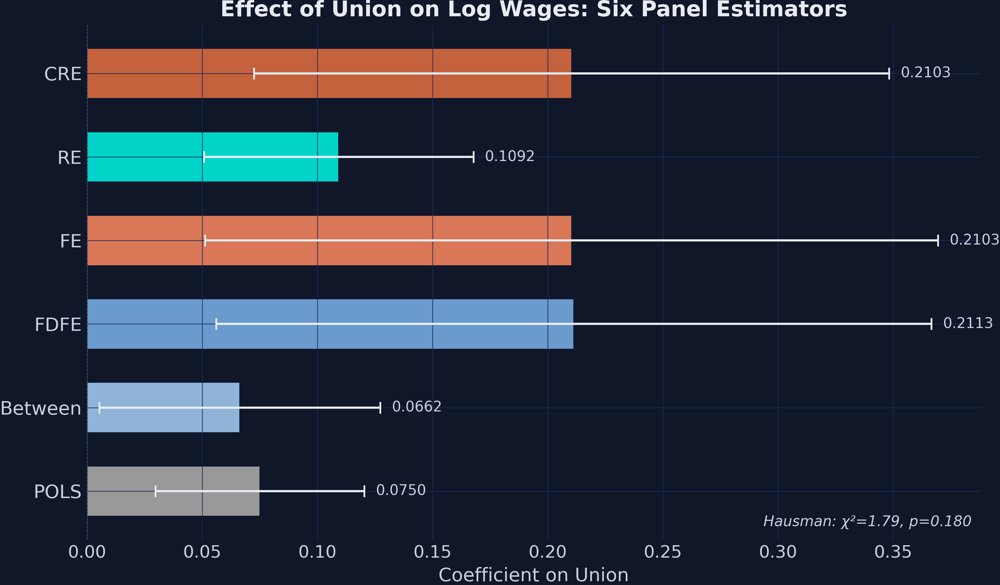
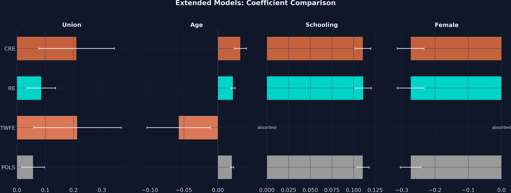

---
authors:
  - admin
categories:
  - Python
  - Panel Data
date: "2026-04-27T00:00:00Z"
draft: false
featured: false
external_link: ""
image:
  caption: ""
  focal_point: Smart
  placement: 3
links:
  - icon: laptop-code
    icon_pack: fas
    name: "Web app"
    url: web_app/index.html
  - icon: code
    icon_pack: fas
    name: "Python script"
    url: script.py
  - icon: file-code
    icon_pack: fas
    name: "Quarto project (.zip)"
    url: python_panel_intro.zip
  - icon: book
    icon_pack: fas
    name: "Jupyter notebook"
    url: notebook.ipynb
  - icon: open-data
    icon_pack: ai
    name: "[Python] Google Colab"
    url: https://colab.research.google.com/github/cmg777/starter-academic-v501/blob/master/content/post/python_panel_intro/notebook.ipynb
  - icon: markdown
    icon_pack: fab
    name: "MD version"
    url: https://raw.githubusercontent.com/cmg777/starter-academic-v501/master/content/post/python_panel_intro/index.md
slides:
summary: A beginner-friendly tour of seven panel-data estimators — POLS, Between, First-Differences, Fixed Effects, Two-Way FE, Random Effects, and Correlated Random Effects (Mundlak) — applied to a two-period worker wage panel.
tags:
  - python
  - econometrics
  - panel-data
  - fixed-effects
  - random-effects
  - mundlak
  - panel data
title: "Introduction to Panel Data Methods in Python"
url_code: ""
url_pdf: ""
url_slides: ""
url_video: ""
toc: true
diagram: true
---

## Abstract

Estimating the wage return to union membership is complicated by selection: workers who join unions differ systematically from those who do not, so a naive cross-sectional regression confounds the union effect with unobserved traits such as ability, schooling, and gender. Panel data — repeated observations on the same workers — offers several ways to net out these time-invariant confounders, but beginners often struggle to see how the canonical estimators relate to one another. This tutorial sets out to demystify that estimator family by walking through seven panel-data methods — pooled OLS, between, first-differences, the within (fixed effects) estimator, two-way fixed effects, random effects, and Mundlak's correlated random effects (CRE) — on a single dataset. The data are an NLSY-style two-period wage panel restricted to 2010 and 2012, a perfectly balanced sample of 2,199 prime-age US workers (4,398 worker-year observations), of whom only 16.3% are unionized; union status is 93.9% between-worker and just 9.1% within-worker. Methods are implemented in Python using `pyfixest` and `linearmodels`, with the Hausman test and the Mundlak term as specification checks. The cross-sectional estimators report a union premium of 7–11 log points (POLS 0.0750, Between 0.0662, RE 0.1092), whereas the within estimators report roughly 21 log points (FDFE 0.2113, FE 0.2103, TWFE 0.2129, CRE 0.2103) — a near-tripling of the estimate. The Hausman test fails to reject random effects (H = 1.79, p = 0.180) while the Mundlak term (−0.1441, p = 0.072) hints at negative selection, both pointing the same way. The implication is that CRE/Mundlak is usually the right specification to lead with, delivering the within (FE) coefficient on the time-varying treatment, an RE framework that retains time-invariant covariates, and a built-in specification test that outperforms Hausman when within variation is thin.

## 1. Overview

Imagine you have data on the same workers in two different years — 2010 and 2012 — and you want to know whether *joining a union* raises a worker's wage. A simple regression on the pooled data says yes, by about 7.5%. But that headline number hides a problem that has occupied econometricians for fifty years: workers who join unions are not the same as workers who don't. Maybe they have less formal education, or they work in industries where unions are common, or they are older and have negotiated harder. If any of those *unobserved* differences also affect wages, the 7.5% estimate is mixing the union effect with everything else that comes bundled with union status.

This is the **omitted-variable bias** problem, and panel data — repeated observations on the same units over time — gives us several ways to fight it. By comparing each worker to *themselves* across years, we can strip out anything that is constant within a person (innate ability, gender, schooling, family background) and isolate the effect of switching union status. The price is a much smaller effective sample: only the workers who actually changed union status between 2010 and 2012 contribute to the estimate. The benefit is a coefficient that is much harder to dismiss as confounded.

This tutorial walks through the seven canonical panel estimators on a real two-period wage panel: pooled OLS, between, first-differences, the within (fixed effects) estimator, two-way fixed effects, random effects, and Mundlak's correlated random effects. Along the way we run the Hausman test and visualize what the *within transformation* actually does to the data. The headline result will surprise some readers: once we account for unobserved worker traits, the union wage premium roughly *triples* — from about 7% to about 21%.

**Learning objectives:**

- Understand the difference between *between* and *within* variation in panel data, and why this distinction drives the choice of estimator.
- Implement seven panel-data estimators in Python using `pyfixest` and `linearmodels`, with one short code block per method.
- Visualize the within transformation and see geometrically why fixed effects produce a different slope than pooled OLS.
- Run the Hausman test to compare fixed and random effects, and use the Mundlak/CRE specification as the modern alternative.
- Interpret the factor-of-three gap between cross-sectional and within estimators in terms of selection on unobservables.

The diagram below summarizes the estimator family and how the two specification tests (Hausman and Mundlak) point you toward FE or RE based on the data.



The diagram makes the central trade-off visible. Estimators on the left side (POLS, Between, RE) lean on cross-sectional variation — they answer "how do union and non-union workers compare?" Estimators on the right (FE, FDFE, DVFE, TWFE) lean on within-worker variation — they answer "what happens when *the same worker* switches union status?" CRE/Mundlak sits in the middle and provides a single specification that recovers both. The Hausman test and the Mundlak term are formal tests for choosing between FE and RE; we will run both and they will agree.

### Key concepts at a glance

The post leans on a small vocabulary repeatedly. The rest of the tutorial assumes you can move between these terms quickly. Each concept below has three parts. The **definition** is always visible. The **example** and **analogy** sit behind clickable cards: open them when you need them, leave them collapsed for a quick scan. If a later section mentions "within transformation" or "Hausman test" and the term feels slippery, this is the section to re-read.

**1. Pooled OLS (POLS).**
Run ordinary OLS on the entire panel as if the rows were independent observations. Ignores that some rows come from the same worker. Naive baseline. Useful as the worst-case benchmark every panel estimator should beat.

<div class="concept-pair">
<details class="concept-card concept-example">
<summary>Example</summary>

POLS on this dataset returns a `union` coefficient of 0.0750 log points (SE 0.0231). Statistically significant, but well below the within-worker estimate. The gap is the bias from selection on time-invariant traits like `schooling` and `gender`.

</details>

<details class="concept-card concept-analogy">
<summary>Analogy</summary>

Lump every observation together, ignore who's whose. Like averaging a class's grades without realising some students took the exam twice. The repeats inflate the sample and obscure the right comparison.

</details>
</div>

**2. Between vs within variation.**
Variance of any panel variable splits into a *between* part (across units) and a *within* part (over time, inside one unit). The decomposition tells you what kind of variation each estimator can leverage.

<div class="concept-pair">
<details class="concept-card concept-example">
<summary>Example</summary>

For `union` in this dataset, 93.9% of the variance is *between* workers (some are unionised, others are not) and only 9.1% is *within* workers (some workers actually change union status across the two periods). FE relies on the 9.1%.

</details>

<details class="concept-card concept-analogy">
<summary>Analogy</summary>

Comparing different people vs comparing the same person to themselves. The 93.9% is "Alice vs Bob"; the 9.1% is "Alice last year vs Alice this year." Different questions; different answers.

</details>
</div>

**3. Within transformation** $\tilde{y}\_{it} = y\_{it} - \bar{y}\_i$.
Subtract each unit's time-series mean from each observation. The unit-specific intercept $\alpha\_i$ vanishes by construction. What remains is within-unit variation: the part of $y$ that moves over time inside one worker.

<div class="concept-pair">
<details class="concept-card concept-example">
<summary>Example</summary>

After demeaning, `union` for Alice (always-union, mean 1) becomes 0 in both periods — she contributes nothing to FE. Bob (changed status) keeps signal. FE is identified entirely off workers like Bob.

</details>

<details class="concept-card concept-analogy">
<summary>Analogy</summary>

Subtracting the watermark from every page. The text underneath is what we came for. Pre-demeaning, every page is dominated by the watermark.

</details>
</div>

**4. First differences (FD/FDFE)** $\Delta y\_{it}$.
Subtracting yesterday from today. Removes $\alpha\_i$ via differencing rather than demeaning. With $T = 2$, FD and within transformation give numerically identical estimates. With $T > 2$, they can diverge.

<div class="concept-pair">
<details class="concept-card concept-example">
<summary>Example</summary>

FDFE on this two-period panel returns 0.2113 (SE 0.0792). FE returns 0.2103. The two are within 0.001 of each other — exactly what theory predicts when $T = 2$.

</details>

<details class="concept-card concept-analogy">
<summary>Analogy</summary>

Subtracting yesterday from today vs subtracting your average from today. With only two days, the two operations agree. With ten days, they diverge — but the question they answer (within-unit change) is the same.

</details>
</div>

**5. Fixed effects (FE).**
The cleanest within-comparison. Estimate $\alpha\_i$ explicitly (or absorb them) and let only the within-unit variation in $x$ identify $\beta$. Equivalent to running OLS on the demeaned data.

<div class="concept-pair">
<details class="concept-card concept-example">
<summary>Example</summary>

FE returns a `union` coefficient of 0.2103 — almost three times POLS. The within-worker effect of joining a union is ~0.21 log points (≈ 23% in level). The selection bias hidden in POLS was pulling the estimate toward zero.

</details>

<details class="concept-card concept-analogy">
<summary>Analogy</summary>

Comparing Alice 2018 to Alice 2020. Same person, same `schooling`, same `gender`. The only thing that changed is whether she joined the union. That comparison is what FE buys.

</details>
</div>

**6. Two-Way FE (TWFE).**
FE that absorbs both unit effects $\alpha\_i$ and time effects $\delta\_t$. Removes calendar-year shocks (recession, policy change) along with unit-specific shifts. Standard for short panels with macro shocks.

<div class="concept-pair">
<details class="concept-card concept-example">
<summary>Example</summary>

TWFE returns 0.2129 (SE 0.0793) — almost identical to one-way FE because the time effect is small with $T = 2$. With more periods or a stronger macro shock, TWFE can diverge from FE meaningfully.

</details>

<details class="concept-card concept-analogy">
<summary>Analogy</summary>

Wiping the negative twice. First pass removes the watermark printed on every page (unit FE). Second pass removes the smudge on the entire stack from a particular printing run (time FE).

</details>
</div>

**7. Random effects (RE).**
Treats $\alpha\_i$ as a random draw uncorrelated with the regressors. Uses GLS to combine within and between variation efficiently. More efficient than FE *if* the no-correlation assumption holds; biased if it does not.

<div class="concept-pair">
<details class="concept-card concept-example">
<summary>Example</summary>

RE returns 0.1092 (SE 0.0299). Halfway between POLS (0.0750) and FE (0.2103). The Hausman test below tests whether RE's no-correlation assumption is OK here.

</details>

<details class="concept-card concept-analogy">
<summary>Analogy</summary>

Trusting that worker-specific traits are random noise. If true, you can use both kinds of variation efficiently. If false (motivation correlates with union choice), you bias the estimate by treating systematic difference as random.

</details>
</div>

**8. Mundlak / CRE.**
Add the unit-mean of every time-varying regressor as an extra control. The within coefficient on the original variable is now identified the same way FE identifies it. The unit-mean coefficient tests for correlation between $\alpha\_i$ and $x$ — the very thing the Hausman test is testing.

<div class="concept-pair">
<details class="concept-card concept-example">
<summary>Example</summary>

The CRE specification returns a within coefficient of 0.2103 (matching FE exactly). The Mundlak term `union_bar` has coefficient -0.1441 with p = 0.0717. The Hausman test (H = 1.7941, p = 0.1804) does not reject RE at the 5% level. The two tests agree.

</details>

<details class="concept-card concept-analogy">
<summary>Analogy</summary>

A peace treaty between FE and RE. CRE gives you FE's robustness *and* RE's framework in one regression. The Mundlak term is the diplomatic clause — it absorbs whatever correlation between unit traits and treatment status would otherwise push the two estimators apart.

</details>
</div>

## 2. Setup and imports

We use [`pyfixest`](https://pyfixest.org/) for OLS and absorbed fixed effects, [`linearmodels`](https://bashtage.github.io/linearmodels/panel/introduction.html) for the random-effects GLS estimator, and `scipy.stats.chi2` for the Hausman test critical value. The standard `pandas` / `numpy` / `matplotlib` stack handles data and figures.

```python
import numpy as np
import pandas as pd
import matplotlib.pyplot as plt
import pyfixest as pf
import statsmodels.api as sm
from linearmodels.panel import RandomEffects
from scipy.stats import chi2

RANDOM_SEED = 42
np.random.seed(RANDOM_SEED)
rng = np.random.default_rng(RANDOM_SEED)
```

The dark-theme `plt.rcParams` block is in `script.py` and is omitted here for brevity. All figures in this post use the site's dark-navy palette.

## 3. Data loading

We load a two-period wage panel from a Stata `.dta` file: NLSY-style data on US workers observed in 2010, 2012, 2014, 2016, and 2018. For pedagogical clarity we restrict the analysis to **2010 and 2012 only**, which makes T = 2 and gives us the cleanest possible illustration of the textbook result that first-differences and the within estimator are the same thing. With T = 2, every worker contributes exactly two observations, so the panel is automatically balanced.

```python
DATA_URL = "https://github.com/quarcs-lab/data-open/raw/master/isds/wage_panel_bob4.dta"
df_full = pd.read_stata(DATA_URL)

# Keep two periods so the FD = Within identity is visible.
df = df_full[df_full["year"].isin([2010, 2012])].copy()
df = df.sort_values(["ID", "year"]).reset_index(drop=True)

# Convert union "Yes/No" to 1/0; build a female dummy.
df["union"] = df["union"].map({"Yes": 1, "No": 0, 1: 1, 0: 0})
df["female"] = (df["gender"].astype(str).str.strip().str.lower() == "female").astype(float)

# Drop rows with missing values in the variables we use.
df = df.dropna(subset=["lwage", "union", "age", "schooling"]).reset_index(drop=True)
```

The next block prints panel structure and descriptive statistics. The "balanced" check confirms every worker has exactly two observations, and the descriptive table tells us how spread out our key variables are.

```python
print(f"Individuals (N): {df['ID'].nunique()}")
print(f"Time periods (T): {df['year'].nunique()}")
print(f"Observations (N×T): {len(df)}")
print(f"Balanced: {(df.groupby('ID')['year'].count() == df['year'].nunique()).all()}")
print(df[["lwage", "union", "age", "schooling"]].describe().round(4))
```

```text
Individuals (N): 2199
Time periods (T): 2
Observations (N×T): 4398
Balanced: True

           lwage      union        age  schooling
count  4398.0000  4398.0000  4398.0000  4398.0000
mean      3.1061     0.1626    35.6794    14.5020
std       0.5982     0.3690     6.2576     2.1825
min      -1.7325     0.0000    25.0000     3.0000
max       6.0635     1.0000    49.0000    17.0000
```

**Interpretation.** The analysis sample is a perfectly balanced panel of 2,199 prime-age workers (mean age 35.7, range 25–49) observed in 2010 and 2012, for 4,398 worker-year observations. Only 16.3% of the sample is unionized in any given period (mean union = 0.1626), which means the dataset leans heavily on non-union workers — a relevant constraint for any estimator that uses cross-sectional variation. Mean log wage is 3.11 with a standard deviation of 0.60, and average schooling is 14.5 years. With balanced T = 2, the within and first-difference transformations are particularly clean because every individual contributes the same amount of within-variation: exactly one switch (or non-switch) per regressor.

## 4. Between vs within variance: how much do panel methods have to work with?

Before estimating anything, it helps to ask a diagnostic question: for each variable, how much variation comes from differences *between* workers and how much from changes *within* workers over time? Fixed-effects estimators only use the within part. If the within part is tiny, FE will be noisy no matter how large the sample is.

The decomposition splits each variable's variance into two pieces. The **between** part is the variance of each worker's two-year mean: $\\mathrm{Var}(\\bar{x}\_i)$. The **within** part is the variance of each observation around its own worker's mean: $\\mathrm{Var}(x\_{it} - \\bar{x}\_i)$. Their sum is (approximately) the total variance.

```python
for var in ["lwage", "union", "age", "schooling"]:
    overall_sd = df[var].std()
    between_sd = df.groupby("ID")[var].mean().std()
    within_sd = (df[var] - df.groupby("ID")[var].transform("mean")).std()
    between_pct = between_sd**2 / (between_sd**2 + within_sd**2) * 100
    print(f"{var:<10} overall {overall_sd:.4f}  between {between_sd:.4f}"
          f"  within {within_sd:.4f}  between% {between_pct:.1f}")
```

```text
lwage      overall 0.5982  between 0.5570  within 0.2184  between% 86.7
union      overall 0.3690  between 0.3576  within 0.0911  between% 93.9
age        overall 6.2576  between 6.1755  within 1.0147  between% 97.4
schooling  overall 2.1825  between 2.1827  within 0.0000  between% 100.0
```



**Interpretation.** Almost all of the variation in our variables is *between* workers, not over time within a worker. Union status is 93.9% between and only 9.1% within — fixed-effects estimators have access to that thin 9% slice of total union variance. Schooling has zero within-variation (100% between) because nobody's reported education changes between 2010 and 2012 in this sample, which is why FE will mechanically drop schooling from the regression. The big methodological consequence is that FE standard errors will be much larger than POLS standard errors, so the choice between FE and RE is not just a question of unbiasedness; it is also a question of statistical precision.

## 5. Visualizing the panel: who actually changes union status?

The variance decomposition tells us the within share is small. A spaghetti plot of individual log-wage trajectories makes the same point visually. We sample 30 random workers and color each line by the worker's union pattern: orange if always union, blue if never union, and teal if union status changed between 2010 and 2012.

```python
sample_ids = rng.choice(df["ID"].unique(), size=30, replace=False)
fig, ax = plt.subplots(figsize=(10, 6))
for pid in sample_ids:
    person = df[df["ID"] == pid].sort_values("year")
    if person["union"].nunique() > 1:
        ax.plot(person["year"], person["lwage"], "o-", color="#00d4c8", lw=2)  # changer
    else:
        c = "#d97757" if person["union"].iloc[0] == 1 else "#6a9bcc"
        ax.plot(person["year"], person["lwage"], "o-", color=c, alpha=0.35)
plt.savefig("panel_intro_trajectories.png", dpi=300, bbox_inches="tight")
```



**Interpretation.** Most of the lines are flat-colored (blue or orange): workers who are *always* or *never* in a union over the two-year window. Only the teal lines — the ones that change union status — provide identifying information for fixed effects, first-differences, and Mundlak/CRE. If you squint at the figure and ignore the teal lines, you have effectively run a between estimator. If you ignore everything except the teal lines, you have run fixed effects. The post's central tension between cross-sectional and within methods is a question of which lines you choose to read.

## 6. Pooled OLS: the naive baseline

We start with the simplest possible estimator: regress log wages on union membership, treating every worker-year as if it were an independent observation. This is **pooled OLS** (POLS). It ignores the panel structure entirely.

```python
# Stata: reg lwage union, robust
fit_pols = pf.feols("lwage ~ union", data=df, vcov="HC1")
pols_coef = fit_pols.coef()["union"]
pols_se = fit_pols.se()["union"]
print(f"Union coefficient: {pols_coef:.4f}  (SE {pols_se:.4f})")
```

```text
Union coefficient: 0.0750  (SE 0.0231)
```

**Interpretation.** Pooled OLS reports a union wage premium of 7.5 log points (SE 2.3 percentage points), which is highly significant by conventional standards (t ≈ 3.25). This is the textbook cross-sectional answer and the number a naive analyst would report. It is almost certainly biased: if higher-ability workers select *out of* unionized jobs (a common pattern in this dataset), then POLS confounds the union effect with whatever ability does to wages. The rest of the post is essentially a tour through different ways of subtracting the bias out.

## 7. Between estimator: the cross-sectional benchmark

The **between estimator** takes POLS to its logical extreme: collapse each worker to their two-year mean, then run OLS across workers. This uses *only* between-individual variation — the mirror image of fixed effects — and gives us a clean reference point for what a purely cross-sectional answer looks like.

```python
# Stata: xtreg lwage union, be
df_between = df.groupby("ID")[["lwage", "union"]].mean().reset_index()
fit_between = pf.feols("lwage ~ union", data=df_between, vcov="HC1")
between_coef = fit_between.coef()["union"]
between_se = fit_between.se()["union"]
print(f"Union coefficient: {between_coef:.4f}  (SE {between_se:.4f})")
```

```text
Union coefficient: 0.0662  (SE 0.0311)
```

**Interpretation.** Collapsing the panel to 2,199 individual averages and running OLS gives 6.6 log points (SE 3.1) — the cross-sectional union effect with all within-individual variation explicitly thrown away. Notice how close this is to POLS (0.066 vs 0.075): that is exactly what we should expect, because 94% of union variance is between-worker, so POLS and Between are looking at almost the same picture from slightly different angles. Both share the same identification problem and serve as the *pre-FE benchmarks* against which the within-style estimators will diverge sharply in the next sections.

## 8. First-differences: subtracting the past from the present

The first within-style estimator we will see is **first-differences** (FDFE). The idea is to subtract each worker's 2010 values from their 2012 values; any time-invariant trait (ability, schooling, family background) cancels out in the subtraction. We are left with a regression of $\\Delta\\mathrm{lwage}$ on $\\Delta\\mathrm{union}$, identified entirely from the workers who *changed* union status.

Formally, write the panel model as

$$y\_{it} = \\alpha\_i + \\beta x\_{it} + u\_{it}$$

where $\\alpha\_i$ is the worker-specific (unobserved) effect. Differencing across the two periods gives

$$y\_{i,2012} - y\_{i,2010} = \\beta (x\_{i,2012} - x\_{i,2010}) + (u\_{i,2012} - u\_{i,2010})$$

In words, this says: the change in wages between 2010 and 2012 equals $\\beta$ times the change in union status, plus a noise term. The worker-specific $\\alpha\_i$ has vanished. Mapping to code: $y$ is the `lwage` column, $x$ is `union`, $\\alpha\_i$ is whatever is unique about each worker's `ID`, and $\\beta$ is the parameter we want to estimate.

```python
# Stata: bysort ID: gen d_lwage = lwage - L.lwage; reg d_lwage d_union, robust
df_diff = (df.sort_values(["ID", "year"])
             .groupby("ID")[["lwage", "union"]].diff().dropna())
df_diff.columns = ["d_lwage", "d_union"]

fit_fdfe = pf.feols("d_lwage ~ d_union", data=df_diff, vcov="HC1")
fdfe_coef = fit_fdfe.coef()["d_union"]
fdfe_se = fit_fdfe.se()["d_union"]
print(f"Union coefficient: {fdfe_coef:.4f}  (SE {fdfe_se:.4f})")
print(f"Differenced sample: {len(df_diff)} rows (one per worker since T=2).")
```

```text
Union coefficient: 0.2113  (SE 0.0792)
Differenced sample: 2199 rows (one per worker since T=2).
```

**Interpretation.** The first-difference estimator returns 21.1 log points (SE 7.9), with a 95% confidence interval of roughly [0.06, 0.37]. The point estimate is *almost three times larger* than POLS (0.211 vs 0.075), and the standard error is about 3.4× larger — the classic signature of moving from a cross-sectional design to a switcher-only design. The CI is wide but excludes zero, so the upward revision is statistically detectable. The intuition: workers who switch into unions are not the same as workers who are always in unions, so the within-worker effect is a different — and arguably cleaner — parameter than the cross-sectional comparison.

## 9. Within / Fixed effects: the same idea, run differently

The **within estimator** (also called fixed effects, FE) achieves the same goal as first-differences through a different transformation: it subtracts each worker's *mean* from each observation. Every variable becomes $\\tilde{x}\_{it} = x\_{it} - \\bar{x}\_i$. After this *within transformation*, OLS on the demeaned data delivers the FE coefficient. Modern software (`pyfixest` here, `reghdfe` in Stata) hides the demeaning step and just lets us write `lwage ~ union | ID`, where the `| ID` syntax means "absorb individual fixed effects".

```python
# Manual demeaning — pedagogical, makes the within transformation visible.
df["lwage_demean"] = df["lwage"] - df.groupby("ID")["lwage"].transform("mean")
df["union_demean"] = df["union"] - df.groupby("ID")["union"].transform("mean")

# Stata: xtreg lwage union, fe robust   (or)   reghdfe lwage union, absorb(ID)
fit_fe = pf.feols("lwage ~ union | ID", data=df, vcov="HC1")
fe_coef = fit_fe.coef()["union"]
fe_se = fit_fe.se()["union"]
print(f"Union coefficient: {fe_coef:.4f}  (SE {fe_se:.4f})")
```

```text
Union coefficient: 0.2103  (SE 0.0812)
```

The figure below visualizes what the demeaning actually does. The left panel shows the raw data — union (jittered for visibility) on the x-axis, log wage on the y-axis, and a POLS regression line through the cloud. The right panel shows the same observations after subtracting each worker's mean from both variables; the FE regression line goes through the demeaned cloud and through the origin.



**Interpretation.** The two panels look almost like different datasets, but they come from the *same* observations. On the left (raw data), the POLS slope is ≈ 0.08, dragged down by the union and non-union workers' mean wages being close to each other. On the right (demeaned data), the FE slope is ≈ 0.21, identified only by the workers who actually changed union status — those are the points that move off the origin. The visual makes geometrically clear what the variance decomposition told us numerically: the within slope is steeper because we are no longer comparing *across* workers (where ability and schooling confound the picture); we are comparing each worker to themselves.

The FE coefficient of 0.2103 is essentially identical to FDFE (0.2113). The tiny gap of +0.001 comes from the fact that our FD regression includes an intercept (which absorbs an aggregate time trend), while plain FE does not. Once we add a year fixed effect to FE — that's two-way FE in the next section — the gap closes exactly.

A small numerical aside: the **dummy-variable** version of FE gives the same answer.

```python
df["ID_str"] = df["ID"].astype(str)
fit_dvfe = pf.feols("lwage ~ union + C(ID_str)", data=df, vcov="HC1")
print(f"DVFE coefficient: {fit_dvfe.coef()['union']:.4f}")
```

```text
DVFE coefficient: 0.2103
```

**Interpretation.** Including a dummy for every worker (N − 1 = 2,198 dummies in this sample) recovers the FE coefficient exactly: 0.2103. The within transformation, first-differences, and dummy-variable FE are three recipes for the same dish. The reason modern software prefers absorption (`| ID`) over dummies is purely computational: with N = 2,199 dummies it still runs fast, but at N = 100,000 the dummy specification becomes prohibitive while absorbed FE remains trivial.

## 10. Two-way fixed effects: closing the FD–FE gap

**Two-way fixed effects** (TWFE) absorbs both individual and time effects. We let `pyfixest` handle both with `| ID + year`. This is the workhorse specification of applied micro and DID research.

```python
# Stata: reghdfe lwage union age, absorb(ID year) vce(cluster ID)
fit_twfe = pf.feols("lwage ~ union + age | ID + year", data=df, vcov={"CRV1": "ID"})
twfe_coef = fit_twfe.coef()["union"]
twfe_se = fit_twfe.se()["union"]
print(f"Union coefficient: {twfe_coef:.4f}  (SE {twfe_se:.4f})")
```

```text
Union coefficient: 0.2129  (SE 0.0793)
```

**Interpretation.** TWFE returns 21.3 log points (SE 7.9), almost indistinguishable from FE (0.210). The small +0.002 gap relative to FE is exactly what closes the FD–FE puzzle from the previous section: by absorbing year effects we are mechanically removing the aggregate wage trend that FD's intercept was capturing. Schooling, gender, and any other time-invariant regressor would be silently absorbed by the individual fixed effects — you cannot identify the effect of something that does not change within a worker. This is a structural feature of within-style methods, not a coding error, and is one of the main reasons applied researchers reach for CRE/Mundlak when they want both within identification *and* coefficients on time-invariant variables.

## 11. Random effects: betting on the no-correlation assumption

The **random-effects** (RE) estimator takes a different stance: it treats the worker effect $\\alpha\_i$ as a *random* draw from a population, *uncorrelated with the regressors*. If that assumption holds, RE is more efficient than FE because it uses both within and between variation. If the assumption fails, RE is biased.

Two pieces of vocabulary that the rest of this section relies on. First, RE is fit by *generalized least squares* (GLS) — a weighted regression that downweights observations whose individual effect is harder to learn from, which is what lets RE blend between- and within-variation in the right proportions. Second, an estimator is *consistent* if its bias shrinks toward zero as the sample grows; an *inconsistent* estimator stays biased no matter how much data you collect. RE is consistent under the no-correlation assumption; FE is consistent under weaker assumptions and is therefore the safer default whenever the no-correlation assumption is suspect.

```python
# Stata: xtreg lwage union, re robust
df_re = df.set_index(["ID", "year"])
exog = sm.add_constant(df_re[["union"]])
fit_re = RandomEffects(df_re["lwage"], exog).fit(cov_type="robust")
re_coef = fit_re.params["union"]
re_se = fit_re.std_errors["union"]
print(f"Union coefficient: {re_coef:.4f}  (SE {re_se:.4f})")
```

```text
Union coefficient: 0.1092  (SE 0.0299)
```

**Interpretation.** RE returns 10.9 log points (SE 3.0), which sits squarely between POLS (0.075) and FE (0.210). RE is mathematically a *weighted average* of the between and within estimators, with the weights determined by their relative variances. Because our data has very thin within variation in union status (only 9% of total), RE leans heavily toward the between picture and lands much closer to POLS than to FE. The RE standard error (0.030) is a striking 2.7× tighter than FE's (0.081), but that efficiency is real only if individual effects are uncorrelated with union membership. If union-status selection is correlated with unobserved ability — and the gap between FE and POLS strongly suggests it is — that precision is being purchased with bias.

## 12. The Hausman test: FE or RE?

The classic specification test for FE-vs-RE is due to **Hausman (1978)**. The intuition: if both estimators are consistent (the RE assumption holds), they should give similar answers; if they differ a lot, the RE assumption is suspect and FE is preferred. Formally,

$$H = (\\hat{\\beta}\_{\\mathrm{FE}} - \\hat{\\beta}\_{\\mathrm{RE}})' [V\_{\\mathrm{FE}} - V\_{\\mathrm{RE}}]^{-1} (\\hat{\\beta}\_{\\mathrm{FE}} - \\hat{\\beta}\_{\\mathrm{RE}}) \\sim \\chi^2(k)$$

In words, this says: take the difference between the two coefficient vectors, weight it by the difference of the two variance matrices, and compare the resulting quadratic form to a chi-square distribution with degrees of freedom equal to the number of regressors. A large $H$ (small p-value) rejects the null that RE is consistent. Mapping to code: $\\hat{\\beta}\_{\\mathrm{FE}}$ is `fe_coef`, $\\hat{\\beta}\_{\\mathrm{RE}}$ is `re_coef`, and $V\_{\\mathrm{FE}}$ and $V\_{\\mathrm{RE}}$ are the squared standard errors (since we have a single regressor here, both reduce to scalars).

```python
b_diff = np.array([fe_coef - re_coef])
v_diff = np.array([[fe_se ** 2 - re_se ** 2]])
H = float(b_diff @ np.linalg.pinv(v_diff) @ b_diff)
p_h = 1 - chi2.cdf(H, df=1)
print(f"H statistic: {H:.4f}   p-value = {p_h:.4f}")
print(f"β_FE − β_RE = {b_diff[0]:+.4f}")
```

```text
H statistic: 1.7941   p-value = 0.1804
β_FE − β_RE = +0.1011
```

**Interpretation.** The two estimators differ by about 0.101 log points; the test statistic is 1.79 on 1 degree of freedom, giving a p-value of 0.180. Conventionally, since 0.180 > 0.05, we *fail to reject* the null and conclude that RE is acceptable. But take this verdict with a grain of salt: the Hausman test has low power exactly when within variation is thin, which is the case here (only 9% within share for union). A noisy FE estimate inflates $V\_{\\mathrm{FE}}$ in the denominator and shrinks $H$, making non-rejection mechanical rather than substantive. We will see in the next section that the modern Mundlak alternative gives a borderline-significant signal in the same data.

## 13. Correlated random effects (CRE / Mundlak): the modern bridge

**Mundlak (1978)** proposed a clever specification that bridges FE and RE. The idea: include each worker's *mean* of every time-varying regressor as an additional control, then run RE.

$$y\_{it} = \\alpha + \\beta x\_{it} + \\gamma \\bar{x}\_i + u\_{it}$$

In words, this says: model wages as a function of current union status, *plus* the worker's average union exposure across the panel. The coefficient $\\beta$ on the time-varying $x\_{it}$ captures the *within* effect — and Mundlak proved that under standard assumptions it is numerically identical to the FE coefficient. The coefficient $\\gamma$ on the worker mean $\\bar{x}\_i$ captures the *between* effect of selection. If $\\gamma \\neq 0$, individual effects are correlated with union status and FE is preferred over RE. Mapping to code: $\\beta$ is `cre_coef`, $\\gamma$ is `mundlak_coef`, and $\\bar{x}\_i$ is the `union_bar` column we constructed with `df.groupby("ID")["union"].transform("mean")`.

```python
# Stata: bysort ID: egen union_bar = mean(union); xtreg lwage union union_bar, re robust
df["union_bar"] = df.groupby("ID")["union"].transform("mean")
df_cre = df.set_index(["ID", "year"])
exog_cre = sm.add_constant(df_cre[["union", "union_bar"]])
fit_cre = RandomEffects(df_cre["lwage"], exog_cre).fit(cov_type="robust")
cre_coef = fit_cre.params["union"]
cre_se = fit_cre.std_errors["union"]
mundlak_coef = fit_cre.params["union_bar"]
mundlak_p = fit_cre.pvalues["union_bar"]
print(f"Union (within) coefficient: {cre_coef:.4f}  (SE {cre_se:.4f})")
print(f"Mundlak term (union_bar):   {mundlak_coef:+.4f}  (p = {mundlak_p:.4f})")
```

```text
Union (within) coefficient: 0.2103  (SE 0.0703)
Mundlak term (union_bar):   -0.1441  (p = 0.0717)
```

**Interpretation.** The CRE union coefficient is 0.2103 — *exactly* the FE estimate to four decimal places, exactly as Mundlak's algebraic result predicts. The Mundlak term is −0.1441 with a p-value of 0.072, marginally non-significant at the 5% level but suggestive: workers with higher *average* union exposure tend to have lower wages even after conditioning on within-worker changes, which is consistent with negative selection into unionized jobs (lower-wage workers select into unions, perhaps because the union premium matters more for them). The Mundlak signal points the same direction as the Hausman test but reaches the borderline-significant zone because it does not have to fight the same noise penalty.

## 14. Putting it all together: the method comparison

The figure below stacks all six basic estimators on a single chart with 95% confidence intervals.



| Method  | Coef   | SE     | What variation does it use? |
|---------|--------|--------|------------------------------|
| POLS    | 0.0750 | 0.0231 | All — ignores panel structure |
| Between | 0.0662 | 0.0311 | Cross-sectional means only |
| FDFE    | 0.2113 | 0.0792 | Within-individual differences |
| FE      | 0.2103 | 0.0812 | Within-individual demeaned |
| RE      | 0.1092 | 0.0299 | GLS-weighted between + within |
| CRE     | 0.2103 | 0.0703 | RE with Mundlak terms (= FE within) |

**Interpretation.** The six methods cluster into two clear camps. The cross-sectional methods (POLS 0.075, Between 0.066, RE 0.109) report a union premium of 7–11 log points; the within methods (FDFE 0.211, FE 0.210, CRE 0.210) report 21 log points. The factor-of-three gap is the central pedagogical finding of this dataset and is consistent with a story in which unobserved worker ability correlates *negatively* with union status — workers who are higher-ability are less likely to be in unions in this sample, so cross-sectional comparisons understate the within-worker payoff to *joining* a union. Standard errors swing inversely: cross-sectional methods are 2–3× more precise but identify a different (and biased, under our hypothesis) parameter, while within methods are noisier but causally cleaner under weaker assumptions.

## 15. Adding controls: the extended models

Real applications usually include controls. We re-run POLS, TWFE, RE, and CRE with age, schooling, female, and year dummies on the right-hand side. The next code block stitches the four specifications together; the table below summarizes the union, age, schooling, and female coefficients.

```python
# POLS with controls
fit_pols_x = pf.feols(
    "lwage ~ union + age + schooling + female + C(year)",
    data=df, vcov="HC1")

# TWFE: schooling and female are time-invariant → absorbed by ID FE
fit_twfe_x = pf.feols("lwage ~ union + age | ID + year",
                      data=df, vcov={"CRV1": "ID"})

# RE + controls
df_rx = df.set_index(["ID", "year"])
exog_rx = sm.add_constant(df_rx[["union", "age", "schooling", "female"]])
fit_re_x = RandomEffects(df_rx["lwage"], exog_rx).fit(cov_type="robust")

# CRE + controls — adds the within-mean of every time-varying regressor
df["age_bar"] = df.groupby("ID")["age"].transform("mean")
exog_cx = sm.add_constant(
    df_rx[["union", "union_bar", "age", "age_bar", "schooling", "female"]])
fit_cre_x = RandomEffects(df_rx["lwage"], exog_cx).fit(cov_type="robust")
```

```text
Variable      POLS              TWFE              RE                CRE
================================================================================
union         0.0571 (0.0204)   0.2129 (0.0793)   0.0861 (0.0258)   0.2103 (0.0683)
age           0.0209 (0.0013)  -0.0576 (0.0238)   0.0224 (0.0016)   0.0332 (0.0046)
schooling     0.1108 (0.0037)   absorbed          0.1112 (0.0047)   0.1108 (0.0047)
female       -0.2731 (0.0160)   absorbed         -0.2731 (0.0206)  -0.2731 (0.0206)
```



**Interpretation.** Adding controls pulls the POLS union coefficient down to 0.057 — controls absorb some of the cross-sectional confounding — but TWFE and CRE still report a within-worker premium of about 0.21, leaving the four-camp gap (POLS 0.057 / RE 0.086 / TWFE 0.213 / CRE 0.210) largely intact. The schooling premium of 11.1% per year and the female penalty of 27.3 log points are stable across POLS, RE, and CRE because these regressors are essentially time-invariant; both are absorbed by individual FE in the TWFE column. The age coefficient does something interesting: it is +0.021 in POLS, +0.022 in RE, and +0.033 in CRE, but flips to −0.058 in TWFE. This is *not* a real age–wage relationship: with T = 2 and every worker aging by exactly two years between waves, age within an individual is collinear with the year dummy, so the TWFE age coefficient confounds the age slope with the year effect. POLS, RE, and CRE return the expected positive age slope; the TWFE −0.058 should be read as a methodological artifact of T = 2.

## 16. Discussion: what does our case study tell us?

We started with a deceptively simple question: does union membership raise wages, and if so by how much? Six estimators on the same dataset gave us answers ranging from 0.066 to 0.213 log points — a factor-of-three spread that is not noise but a structural feature of how the methods identify the parameter.

The cross-sectional camp (POLS, Between, RE) is asking "how do union and non-union workers compare?". Their 7–11% answer is what we would report if we believed union members were comparable to non-members on every relevant unobservable. The within camp (FE, FDFE, TWFE, CRE) is asking "what happens when *the same worker* switches union status?". Their 21% answer is what we would report if we trusted that nothing else changes for a worker between 2010 and 2012 except the things we observe. Both questions are legitimate; the gap between the answers is the empirical signature of selection on unobservables.

The Hausman test failed to reject the random-effects assumption (p = 0.180), which by the textbook script would tell us to use RE. But the test has low power exactly when within variation is thin, which is the case here (9% within share). The Mundlak alternative landed at p = 0.072 — borderline non-significant by a hair — and the Mundlak term itself was −0.144, suggesting that the workers with more union exposure are different (lower-paid on average) from workers with less. Both tests point in the same direction, but Mundlak's nuanced "almost significant" reading is more honest than Hausman's confident "fail to reject" verdict.

For a practitioner faced with this kind of dataset, the practical implication is that **CRE/Mundlak is usually the right specification to lead with**. It gives you the FE coefficient on the time-varying treatment (the within effect), the RE structure that lets you keep schooling and gender in the regression, and a built-in specification test (the t-statistic on the Mundlak term) that beats Hausman in low-power settings. The cost is one extra regressor per time-varying covariate, which is essentially free in modern software.

Stated formally in causal-inference language: the within estimators (FDFE, FE, TWFE, CRE) target the average treatment effect for *union switchers* — the subset of workers who actually changed union status between 2010 and 2012 — under the assumption of strict exogeneity conditional on the worker fixed effect. POLS and Between target a population-weighted association between union status and log wages and do not have a causal interpretation absent unconfoundedness. Reporting both estimands side-by-side (as we have done) is more informative than picking one and ignoring the other.

## 17. Summary and next steps

**Takeaways.**

- **Method insight.** Three within recipes — first-differences, the within transformation, and dummy-variable FE — produce the same coefficient on union (0.2103, with FDFE differing by only +0.001 because of an intercept-driven year-trend artifact). This identity holds exactly when T = 2 and approximately when T > 2; understanding *why* is the single most useful intuition in panel econometrics.
- **Data insight.** Almost all of our variation is between workers (union 94%, age 97%, schooling 100%). Only 9% of union variance is within. That is the slice of the data that fixed-effects estimators are working with, and it explains why FE standard errors (0.081) are 2.7× larger than RE standard errors (0.030).
- **Limitation.** With T = 2, our FE estimate is power-limited. The Hausman test fails to reject the RE assumption (p = 0.180) primarily because $V\_{\\mathrm{FE}}$ is large, not because RE is consistent. The Mundlak term tells the same story with more nuance (p = 0.072, borderline). Real applications usually have T > 2 and substantially more within variation, which sharpens both the FE estimate and the specification tests.
- **Next step.** A natural extension is to use all five waves of the panel (2010–2018) instead of just 2010 and 2012, which would give us T = 5 and dramatically more within variation in union status. With T > 2, the FD–FE gap becomes a real identification choice (FD is more efficient under serially correlated errors; FE under random errors), and event-study designs become possible.

## 18. Exercises

1. **Repeat the analysis with all five waves of the panel** (2010, 2012, 2014, 2016, 2018). How does the FE coefficient change? Does the Hausman test still fail to reject? What about the Mundlak term?
2. **Add an interaction with female.** Modify the FE specification to include `union × female` and interpret the coefficient. Does the union premium differ by gender?
3. **Try a clustered bootstrap.** Re-estimate the FE model with `vcov={"CRV1": "ID"}` and a wild cluster bootstrap (`pyfixest` supports `boot.iid()`). How do the bootstrap SEs compare to the analytical ones in this small-T setting?

## 19. References

1. [PyFixest documentation.](https://pyfixest.org/pyfixest.html)
2. [linearmodels: Panel models documentation.](https://bashtage.github.io/linearmodels/panel/introduction.html)
3. [scipy.stats.chi2 documentation.](https://docs.scipy.org/doc/scipy/reference/generated/scipy.stats.chi2.html)
4. [Wage panel dataset (`wage_panel_bob4.dta`) — quarcs-lab data-open repository.](https://github.com/quarcs-lab/data-open)
5. [Hausman, J. A. (1978). Specification Tests in Econometrics. *Econometrica*, 46(6), 1251–1271.](https://www.jstor.org/stable/1913827)
6. [Mundlak, Y. (1978). On the Pooling of Time Series and Cross Section Data. *Econometrica*, 46(1), 69–85.](https://www.jstor.org/stable/1913646)
7. [Wooldridge, J. M. (2010). *Econometric Analysis of Cross Section and Panel Data*, 2nd ed. MIT Press.](https://mitpress.mit.edu/9780262232586/econometric-analysis-of-cross-section-and-panel-data/)
