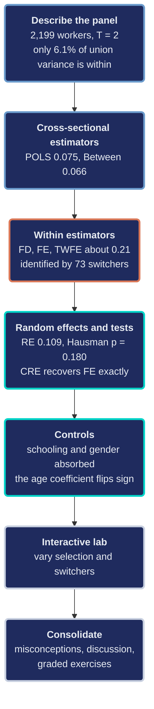
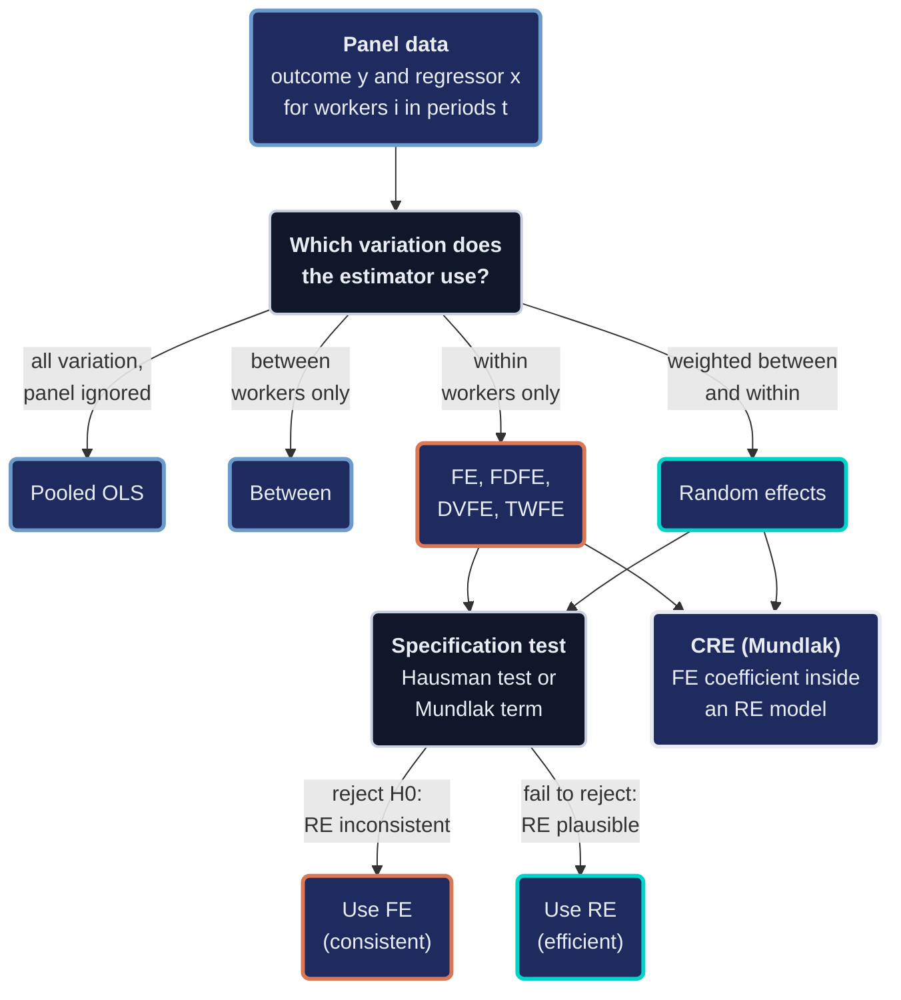
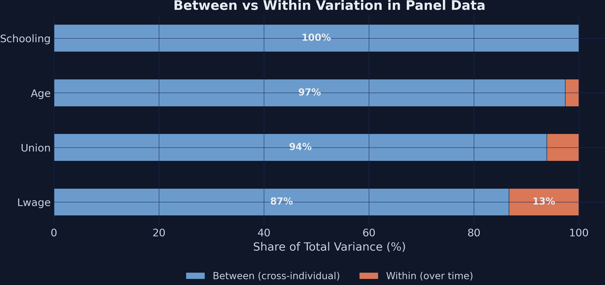
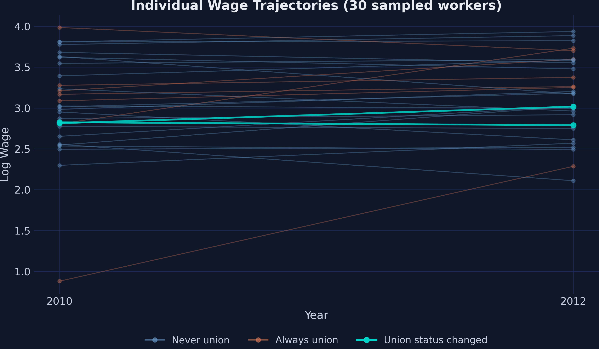
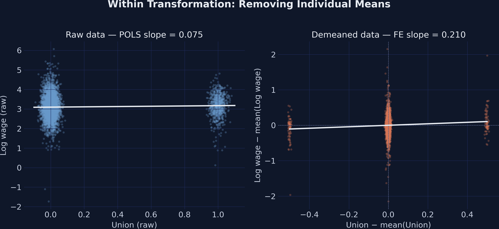
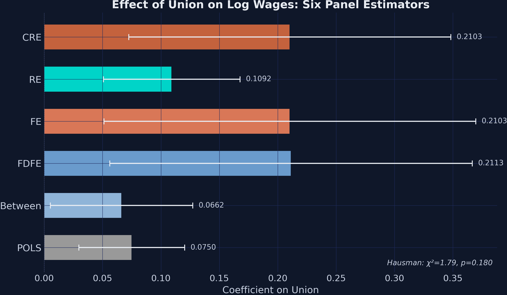
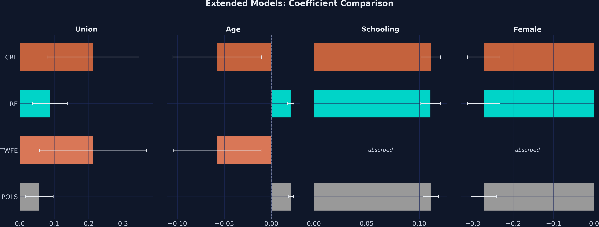

---
authors:
  - admin
categories:
  - Python
  - Panel Data
date: "2026-10-02T00:00:00Z"
draft: false
featured: false
external_link: ""
image:
  caption: ""
  focal_point: Smart
  placement: 3
links:
  - icon: chalkboard-teacher
    icon_pack: fas
    name: "Slides (HTML)"
    url: slides/index.html
  - icon: laptop-code
    icon_pack: fas
    name: "Web app"
    url: web_app/index.html
  - icon: code
    icon_pack: fas
    name: "Python script"
    url: script.py
  - icon: file-code
    icon_pack: fas
    name: "Quarto project (.zip)"
    url: python_panel_intro.zip
  - icon: book
    icon_pack: fas
    name: "Jupyter notebook"
    url: https://github.com/cmg777/starter-academic-v501/blob/master/content/post/python_panel_intro/notebook.ipynb
  - icon: open-data
    icon_pack: ai
    name: "[Python] Google Colab"
    url: https://colab.research.google.com/github/cmg777/starter-academic-v501/blob/master/content/post/python_panel_intro/notebook.ipynb
  - icon: markdown
    icon_pack: fab
    name: "MD version"
    url: https://raw.githubusercontent.com/cmg777/starter-academic-v501/master/content/post/python_panel_intro/index.md
  - icon: book
    icon_pack: fas
    name: "Data dictionary"
    url: data/index.html
slides:
summary: A beginner-friendly tour of seven panel-data estimators, from pooled OLS to correlated random effects (Mundlak), applied to a two-period worker wage panel. Predict-first checks, two short proofs, an interactive lab, and worked exercises show why the within estimators nearly triple the union wage premium.
tags:
  - python
  - econometrics
  - panel-data
  - fixed-effects
  - random-effects
  - mundlak
  - panel data
title: "Introduction to Panel Data Methods in Python"
url_code: ""
url_pdf: ""
url_slides: ""
url_video: ""
toc: true
diagram: true
---

## Abstract

Estimating the wage return to union membership is complicated by selection. Workers who join unions differ systematically from workers who do not. A naive cross-sectional regression therefore confounds the union effect with unobserved traits such as ability and motivation. Panel data, which observe the same workers repeatedly, offer several ways to remove such time-invariant confounders. However, beginners often struggle to see how the standard estimators relate to one another. This tutorial clarifies these relationships by applying seven panel-data methods to a single dataset: pooled OLS, between, first differences, the within (fixed effects) estimator, two-way fixed effects, random effects, and the correlated random effects (CRE) model of Mundlak. The data are an NLSY-style wage panel restricted to 2010 and 2012. The balanced sample contains 2,199 prime-age US workers and 4,398 worker-year observations. Only 16.3% of the observations are unionized, and only 73 workers (3.3%) change union status. Consequently, just 6.1% of the variance in union status occurs within workers. The methods are implemented in Python with `pyfixest` and `linearmodels`, and the Hausman test and the Mundlak term serve as specification checks. The cross-sectional estimators report a union premium of 7 to 11 log points (POLS 0.0750, Between 0.0662, RE 0.1092). The within estimators report about 21 log points (FDFE 0.2113, FE 0.2103, TWFE 0.2113, CRE 0.2103), which is nearly three times as large. With two periods, first differences with an intercept reproduce two-way fixed effects exactly. Neither specification test rejects random effects at the 5% level (Hausman H = 1.79, p = 0.180; Mundlak term −0.1441, p = 0.072). Nevertheless, the gap between the two groups of estimates and the negative Mundlak term are consistent with negative selection into unions. The within estimate is also fragile, because it rests on 73 switchers and falls to 0.040 when all five survey waves are used. We conclude that the CRE (Mundlak) specification is a sensible default. It reproduces the fixed-effects coefficient, retains time-invariant covariates, and provides a built-in specification test.

<a href="https://colab.research.google.com/github/cmg777/starter-academic-v501/blob/master/content/post/python_panel_intro/notebook.ipynb" target="_blank" rel="noopener"></a>

## 1. Overview

### 1.1 Does joining a union raise wages?

Suppose we observe the same workers in 2010 and in 2012, and we want to know whether union membership raises wages. A simple regression on the pooled data suggests that it does, by about 7.5 log points. However, this headline number hides a problem that has occupied econometricians for decades. Workers who join unions are not a random subset of the workforce. They may have different schooling, work in different industries, or differ in unobserved ability and motivation. If any of these unobserved differences also affect wages, the 7.5 estimate mixes the union effect with everything else that accompanies union status.

This problem is known as **omitted-variable bias**, and panel data offer several ways to address it. Panel data contain repeated observations on the same units over time. By comparing each worker with the same worker in another year, we can remove every trait that is constant within a person, such as innate ability, gender, schooling, or family background. The cost is a much smaller effective sample, because only the workers who change union status between 2010 and 2012 contribute to the estimate. In this dataset, only 73 of 2,199 workers do so. The benefit is a coefficient that is much harder to dismiss as confounded by fixed worker traits.

This tutorial applies the seven standard panel estimators to a real two-period wage panel. The estimators are pooled OLS, between, first differences, the within (fixed effects) estimator, two-way fixed effects, random effects, and the correlated random effects model of Mundlak. Along the way, we run the Hausman test, prove two short identities, and visualize what the *within transformation* does to the data. The central result may surprise some readers. Once we account for unobserved worker traits, the estimated union premium nearly triples, from about 7.5 to about 21 log points.

### 1.2 Learning objectives

After completing this tutorial, readers will be able to:

1. **Decompose** the variance of a panel variable into between and within parts, and **explain** why a small within share limits the precision of fixed effects.
2. **Implement** seven panel-data estimators in Python with `pyfixest` and `linearmodels`, using one short code block per method.
3. **Prove** that first differences and fixed effects coincide when T = 2, and **identify** the role of the intercept in that identity.
4. **Visualize** the within transformation and **identify** which workers identify the fixed-effects coefficient.
5. **Compare** fixed and random effects with the Hausman test and the Mundlak term, and **judge** the power of each test when within variation is thin.
6. **Interpret** the gap between cross-sectional and within estimates as evidence of selection on unobservables.
7. **Experiment** with selection strength and the share of switchers in an interactive lab, and **predict** how each estimator responds.

### 1.3 The road ahead

The tutorial proceeds in seven stages. The same 2,199 workers carry the entire analysis. Each stage either produces an estimate, explains it, or tests it.


```mermaid
graph TD
    A("<b>Describe the panel</b><br/>2,199 workers, T = 2<br/>only 6.1% of union variance is within") --> B("<b>Cross-sectional estimators</b><br/>POLS 0.075, Between 0.066")
    B --> C("<b>Within estimators</b><br/>FD, FE, TWFE about 0.21<br/>identified by 73 switchers")
    C --> D("<b>Random effects and tests</b><br/>RE 0.109, Hausman p = 0.180<br/>CRE recovers FE exactly")
    D --> E("<b>Controls</b><br/>schooling and gender absorbed<br/>the age coefficient flips sign")
    E --> F("<b>Interactive lab</b><br/>vary selection and switchers")
    F --> G("<b>Consolidate</b><br/>misconceptions, discussion,<br/>graded exercises")
    classDef data fill:#1f2b5e,stroke:#6a9bcc,stroke-width:3px,color:#e8ecf2
    classDef within fill:#1f2b5e,stroke:#d97757,stroke-width:3px,color:#e8ecf2
    classDef tests fill:#1f2b5e,stroke:#00d4c8,stroke-width:3px,color:#e8ecf2
    classDef practice fill:#1f2b5e,stroke:#c8d0e0,stroke-width:3px,color:#e8ecf2
    class A,B data
    class C within
    class D,E tests
    class F,G practice
```

The border colors of the boxes mark the logic of the argument. The boxes with blue borders describe the data and the cross-sectional benchmark. The box with an orange border introduces the within estimators, which remove fixed worker traits. The boxes with teal borders test the choice between fixed and random effects and then add controls. Finally, the boxes with gray borders turn the analysis over to the reader through a lab, a set of misconceptions, and graded exercises.

### 1.4 How the estimators relate

The diagram below summarizes the estimator family. It classifies each estimator by the variation that it uses. It also shows how the two specification tests, the Hausman test and the Mundlak term, guide the choice between fixed and random effects. Readers can return to this map whenever the relationship between two estimators becomes unclear.


```mermaid
flowchart TD
    A("<b>Panel data</b><br/>outcome y and regressor x<br/>for workers i in periods t") --> Q("<b>Which variation does<br/>the estimator use?</b>")
    Q -->|"all variation,<br/>panel ignored"| POLS("Pooled OLS")
    Q -->|"between<br/>workers only"| BETW("Between")
    Q -->|"within<br/>workers only"| WITHIN("FE, FDFE,<br/>DVFE, TWFE")
    Q -->|"weighted between<br/>and within"| RE("Random effects")
    WITHIN --> TEST("<b>Specification test</b><br/>Hausman test or<br/>Mundlak term")
    RE --> TEST
    WITHIN --> CRE("<b>CRE (Mundlak)</b><br/>FE coefficient inside<br/>an RE model")
    RE --> CRE
    TEST -->|"reject H0:<br/>RE inconsistent"| USE_FE("Use FE<br/>(consistent)")
    TEST -->|"fail to reject:<br/>RE plausible"| USE_RE("Use RE<br/>(efficient)")
    classDef data fill:#1f2b5e,stroke:#6a9bcc,stroke-width:3px,color:#e8ecf2
    classDef question fill:#0f1729,stroke:#c8d0e0,stroke-width:2px,color:#e8ecf2
    classDef within fill:#1f2b5e,stroke:#d97757,stroke-width:3px,color:#e8ecf2
    classDef tests fill:#1f2b5e,stroke:#00d4c8,stroke-width:3px,color:#e8ecf2
    classDef bridge fill:#1f2b5e,stroke:#e8ecf2,stroke-width:3px,color:#e8ecf2
    class A,POLS,BETW data
    class Q,TEST question
    class WITHIN,USE_FE within
    class RE,USE_RE tests
    class CRE bridge
```

The diagram makes the central trade-off of panel methods visible. Pooled OLS and the between estimator rely on cross-sectional variation, so they ask how union and non-union workers compare. Random effects also leans heavily on this comparison, because it combines between and within variation. By contrast, the within estimators (FE, FDFE, DVFE, and TWFE) rely only on changes within workers, so they ask what happens when the same worker changes union status. The CRE (Mundlak) model connects the two groups, because it recovers the within coefficient inside a random-effects framework. The Hausman test and the Mundlak term are formal tools for choosing between fixed and random effects, and we run both in sections 13 and 14.

## 2. Key concepts at a glance

This tutorial relies repeatedly on a small vocabulary. The later sections assume that readers can move between these terms quickly. Each concept below has three parts. The **definition** is always visible, while the **example** and the **analogy** sit behind clickable cards. Readers can open the cards when needed or leave them collapsed for a quick scan. This section is the natural place to return to whenever a later term, such as "within transformation" or "Hausman test," feels unclear.

**1. Pooled OLS (POLS).**
Run ordinary OLS on the entire panel as if the rows were independent observations. Ignores that some rows come from the same worker. Naive baseline. Useful as the worst-case benchmark that every panel estimator should beat.

<div class="concept-pair">
<details class="concept-card concept-example">
<summary>Example</summary>

POLS on this dataset returns a `union` coefficient of 0.0750 (SE 0.0231). Statistically significant, but well below the within-worker estimate. The gap is consistent with selection on time-invariant worker traits that also affect wages.

</details>

<details class="concept-card concept-analogy">
<summary>Analogy</summary>

Lump every observation together and ignore which rows belong to whom. Like averaging the grades of a class without noticing that some students took the exam twice. The repeats inflate the sample and obscure the right comparison.

</details>
</div>

**2. Between vs within variation.**
The variance of any panel variable splits into a *between* part (across units) and a *within* part (over time, inside one unit). The decomposition shows what kind of variation each estimator can use.

<div class="concept-pair">
<details class="concept-card concept-example">
<summary>Example</summary>

For `union` in this dataset, 93.9% of the variance is *between* workers (some are unionized, others are not), and only 6.1% is *within* workers (73 workers change union status across the two periods). FE relies on the 6.1%.

</details>

<details class="concept-card concept-analogy">
<summary>Analogy</summary>

Comparing different people versus comparing the same person over time. The 93.9% is "Alice versus Bob"; the 6.1% is "Alice in 2010 versus Alice in 2012." Different questions; different answers.

</details>
</div>

**3. Within transformation** $\tilde{y}\_{it} = y\_{it} - \bar{y}\_i$.
Subtract the time-series mean of each unit from each of its observations. The unit-specific intercept $\alpha\_i$ vanishes by construction. What remains is within-unit variation: the part of $y$ that moves over time inside one worker.

<div class="concept-pair">
<details class="concept-card concept-example">
<summary>Example</summary>

After demeaning, `union` for Alice (always in a union, mean 1) becomes 0 in both periods, so she contributes nothing to FE. Bob (who changed status) keeps his signal. FE is identified entirely by workers like Bob.

</details>

<details class="concept-card concept-analogy">
<summary>Analogy</summary>

Subtracting the watermark from every page. The text underneath is what we came for. Before demeaning, every page is dominated by the watermark.

</details>
</div>

**4. First differences (FD/FDFE)** $\Delta y\_{it}$.
Subtract last period from this period. Removes $\alpha\_i$ by differencing rather than demeaning. With $T = 2$, FD without an intercept and the within estimator give identical slopes, and FD with an intercept equals two-way FE. With $T > 2$, FD and FE generally differ.

<div class="concept-pair">
<details class="concept-card concept-example">
<summary>Example</summary>

FDFE (with an intercept) returns 0.2113 (SE 0.0792), and FE returns 0.2103. Dropping the intercept from the FD regression gives exactly 0.2103. The 0.001 gap is the common 2010 to 2012 wage trend.

</details>

<details class="concept-card concept-analogy">
<summary>Analogy</summary>

Subtracting yesterday from today versus subtracting your average from today. With only two days, the two operations carry the same information. With ten days, they weight the days differently, but both measure change within a unit.

</details>
</div>

**5. Fixed effects (FE).**
The cleanest within comparison. Estimate each $\alpha\_i$ explicitly (or absorb them) and let only the within-unit variation in $x$ identify $\beta$. Equivalent to running OLS on the demeaned data.

<div class="concept-pair">
<details class="concept-card concept-example">
<summary>Example</summary>

FE returns a `union` coefficient of 0.2103, almost three times POLS. The within-worker union premium is about 21 log points (about 23% in levels). Selection hidden in POLS pulls the cross-sectional estimate toward zero.

</details>

<details class="concept-card concept-analogy">
<summary>Analogy</summary>

Comparing Alice in 2010 with Alice in 2012. Same person, same `schooling`, same `gender`. The only recorded change is whether she joined the union. That comparison is what FE buys.

</details>
</div>

**6. Two-way FE (TWFE).**
FE that absorbs both unit effects $\alpha\_i$ and time effects $\delta\_t$. Removes calendar-year shocks (a recession, a policy change) along with unit-specific shifts. Standard for short panels with common macro shocks.

<div class="concept-pair">
<details class="concept-card concept-example">
<summary>Example</summary>

TWFE returns 0.2113 (SE 0.0792), identical to FDFE, because with $T = 2$ the year effect plays the role of the FD intercept. One-way FE (0.2103) differs only by that common trend.

</details>

<details class="concept-card concept-analogy">
<summary>Analogy</summary>

Cleaning the negative twice. The first pass removes the watermark printed on every page (unit FE). The second pass removes the smudge that a particular printing run left on the entire stack (time FE).

</details>
</div>

**7. Random effects (RE).**
Treats $\alpha\_i$ as a random draw uncorrelated with the regressors. Uses GLS to combine within and between variation efficiently. More efficient than FE *if* the no-correlation assumption holds; inconsistent if it does not.

<div class="concept-pair">
<details class="concept-card concept-example">
<summary>Example</summary>

RE returns 0.1092 (SE 0.0299), between POLS (0.0750) and FE (0.2103). The Hausman test below asks whether the no-correlation assumption of RE is tenable here.

</details>

<details class="concept-card concept-analogy">
<summary>Analogy</summary>

Trusting that worker-specific traits are random noise. If that is true, both kinds of variation can be used efficiently. If it is false (motivation correlates with union choice), the estimator treats a systematic difference as noise and becomes biased.

</details>
</div>

**8. Mundlak / CRE.**
Add the unit mean of every time-varying regressor as an extra control. The coefficient on the original variable is then identified exactly as FE identifies it. The coefficient on the unit mean tests for correlation between $\alpha\_i$ and $x$, the same question that the Hausman test asks.

<div class="concept-pair">
<details class="concept-card concept-example">
<summary>Example</summary>

The CRE specification returns a within coefficient of 0.2103 (matching FE exactly). The Mundlak term `union_bar` has a coefficient of −0.1441 with p = 0.0717. The Hausman test (H = 1.7941, p = 0.1804) does not reject RE at the 5% level either.

</details>

<details class="concept-card concept-analogy">
<summary>Analogy</summary>

A peace treaty between FE and RE. CRE delivers the robustness of FE *and* the framework of RE in one regression. The Mundlak term is the diplomatic clause: it absorbs whatever correlation between unit traits and treatment status would otherwise push the two estimators apart.

</details>
</div>

## 3. Setup and imports

We use [`pyfixest`](https://pyfixest.org/) for OLS and absorbed fixed effects. We use [`linearmodels`](https://bashtage.github.io/linearmodels/panel/introduction.html) for the random-effects GLS estimator and `scipy.stats.chi2` for the p-value of the Hausman test. The standard `pandas`, `numpy`, and `matplotlib` stack handles data and figures.

```python
import numpy as np
import pandas as pd
import matplotlib.pyplot as plt
import pyfixest as pf
import statsmodels.api as sm
from linearmodels.panel import RandomEffects
from scipy.stats import chi2

RANDOM_SEED = 42
np.random.seed(RANDOM_SEED)
rng = np.random.default_rng(RANDOM_SEED)
```

The figures in this post use the dark-navy palette of the site. The corresponding `plt.rcParams` block appears in `script.py`. We omit it here because it does not affect any estimate.

## 4. Data loading

We load a wage panel from a Stata `.dta` file. The file contains NLSY-style data on US workers observed in 2010, 2012, 2014, 2016, and 2018. For pedagogical clarity, we restrict the analysis to **2010 and 2012 only**, so that T = 2. This choice gives the cleanest illustration of the textbook result that first differences and the within estimator are closely linked. With T = 2, every worker contributes exactly two observations, so the panel is automatically balanced.

```python
DATA_URL = "https://github.com/quarcs-lab/data-open/raw/master/isds/wage_panel_bob4.dta"
df_full = pd.read_stata(DATA_URL)

# Keep two periods so the FD = Within identity is visible.
df = df_full[df_full["year"].isin([2010, 2012])].copy()
df = df.sort_values(["ID", "year"]).reset_index(drop=True)

# Convert union "Yes/No" to 1/0; build a female dummy.
df["union"] = df["union"].astype(str).map({"Yes": 1, "No": 0}).astype(float)
df["female"] = (df["gender"].astype(str).str.strip().str.lower() == "female").astype(float)

# Drop rows with missing values in the variables we use.
df = df.dropna(subset=["lwage", "union", "age", "schooling"]).reset_index(drop=True)
```

The next block prints the panel structure and descriptive statistics. The balance check confirms that every worker has exactly two observations. The descriptive table then shows how dispersed the key variables are.

```python
print(f"Individuals (N): {df['ID'].nunique()}")
print(f"Time periods (T): {df['year'].nunique()}")
print(f"Observations (N×T): {len(df)}")
print(f"Balanced: {(df.groupby('ID')['year'].count() == df['year'].nunique()).all()}")
print(df[["lwage", "union", "age", "schooling"]].describe().round(4))
```

```text
Individuals (N): 2199
Time periods (T): 2
Observations (N×T): 4398
Balanced: True
           lwage      union        age  schooling
count  4398.0000  4398.0000  4398.0000  4398.0000
mean      3.1061     0.1626    35.6794    14.5020
std       0.5982     0.3690     6.2576     2.1825
min      -1.7325     0.0000    25.0000     3.0000
25%       2.7434     0.0000    30.0000    12.0000
50%       3.0958     0.0000    35.0000    15.0000
75%       3.4671     0.0000    41.0000    16.0000
max       6.0635     1.0000    49.0000    17.0000
```

**Interpretation.** The analysis sample is a perfectly balanced panel of 2,199 prime-age workers observed in 2010 and 2012. It contains 4,398 worker-year observations, and the workers are 35.7 years old on average (range 25 to 49). Only 16.3% of the observations are unionized (mean union = 0.1626), so the sample is dominated by non-union workers. Mean log wage is 3.11 with a standard deviation of 0.60, and average schooling is 14.5 years. Because the panel is balanced with T = 2, each worker contributes exactly one change per variable, which makes the within and first-difference transformations especially transparent.

## 5. Between vs within variance: how much do panel methods have to work with?

Before estimating anything, we ask a diagnostic question about each variable. How much of its variation comes from differences *between* workers, and how much from changes *within* workers over time? Fixed-effects estimators use only the within part. If that part is tiny, FE will be imprecise regardless of the sample size.

The decomposition splits the variance of each variable into two pieces. The **between** part is the variance of the two-year mean of each worker, $\mathrm{Var}(\bar{x}\_i)$. The **within** part is the variance of each observation around the mean of its own worker, $\mathrm{Var}(x\_{it} - \bar{x}\_i)$. Their sum approximately equals the total variance, so each part can be expressed as a share of that sum.

<div class="learn-card predict-card">
<p class="learn-card-kicker">Predict first</p>

Union status has an overall standard deviation of 0.369, and the mean union rate is 16.3%. Roughly what share of the variance of `union` comes from workers who change status between 2010 and 2012: about 50%, about 25%, or less than 10%? Commit to an answer before scrolling.

<details class="learn-card-reveal">
<summary>Reveal the answer</summary>

**Answer.** Less than 10%: the within share is only 6.1%. Just 73 of 2,199 workers switch status, so almost all the variation in union membership comes from comparing different workers. Note that the within standard deviation (0.0911) is not a share. The share is its square divided by the sum of the squared between and within standard deviations.

</details>
</div>

```python
for var in ["lwage", "union", "age", "schooling"]:
    overall_sd = df[var].std()
    between_sd = df.groupby("ID")[var].mean().std()
    within_sd = (df[var] - df.groupby("ID")[var].transform("mean")).std()
    between_pct = between_sd**2 / (between_sd**2 + within_sd**2) * 100
    print(f"{var:<10} overall {overall_sd:.4f}  between {between_sd:.4f}"
          f"  within {within_sd:.4f}  between% {between_pct:.1f}"
          f"  within% {100 - between_pct:.1f}")
```

```text
lwage      overall 0.5982  between 0.5570  within 0.2184  between% 86.7  within% 13.3
union      overall 0.3690  between 0.3576  within 0.0911  between% 93.9  within% 6.1
age        overall 6.2576  between 6.1755  within 1.0147  between% 97.4  within% 2.6
schooling  overall 2.1825  between 2.1827  within 0.0000  between% 100.0  within% 0.0
```



**Interpretation.** Almost all the variation in these variables is *between* workers rather than over time within a worker. Union status is 93.9% between and only 6.1% within, so fixed-effects estimators work with a thin slice of the total union variance. Schooling has no within variation at all, because no worker in the sample reports a change in education between 2010 and 2012. FE will therefore drop schooling mechanically. The main methodological consequence is that FE standard errors will be much larger than POLS standard errors. Consequently, the choice between FE and RE involves precision as well as bias.

## 6. Visualizing the panel: who actually changes union status?

The variance decomposition shows that the within share is small. A spaghetti plot of individual log-wage trajectories makes the same point visually. We sample 30 random workers and color each line by the union pattern of the worker. Orange marks workers who are always in a union, blue marks workers who are never in a union, and teal marks workers whose union status changed between 2010 and 2012.

```python
sample_ids = rng.choice(df["ID"].unique(), size=30, replace=False)
fig, ax = plt.subplots(figsize=(10, 6))
for pid in sample_ids:
    person = df[df["ID"] == pid].sort_values("year")
    if person["union"].nunique() > 1:
        ax.plot(person["year"], person["lwage"], "o-", color="#00d4c8", lw=2)  # changer
    else:
        c = "#d97757" if person["union"].iloc[0] == 1 else "#6a9bcc"
        ax.plot(person["year"], person["lwage"], "o-", color=c, alpha=0.35)
plt.savefig("panel_intro_trajectories.png", dpi=300, bbox_inches="tight")
```



**Interpretation.** Most of the 30 lines are blue or orange, because they belong to workers who are never or always in a union over the two-year window. Only 2 of the 30 lines are teal, and only these switchers provide identifying information for fixed effects, first differences, and the CRE model. Ignoring the teal lines amounts to running a between estimator. Conversely, ignoring everything except the teal lines amounts to running fixed effects. The central tension of this tutorial between cross-sectional and within methods is therefore a question of which lines we choose to read.

## 7. Pooled OLS: the naive baseline

We start with the simplest possible estimator. We regress log wages on union membership and treat every worker-year as an independent observation. This estimator is **pooled OLS** (POLS), and it ignores the panel structure entirely.

```python
# Stata: reg lwage union, robust
fit_pols = pf.feols("lwage ~ union", data=df, vcov="HC1")
pols_coef = fit_pols.coef()["union"]
pols_se = fit_pols.se()["union"]
print(f"Union coefficient: {pols_coef:.4f}  (SE {pols_se:.4f})")
```

```text
Union coefficient: 0.0750  (SE 0.0231)
```

**Interpretation.** Pooled OLS reports a union wage premium of 7.5 log points (SE 2.3 log points), which is highly significant by conventional standards (t ≈ 3.25). This is the textbook cross-sectional answer and the number that a naive analyst would report. However, it is likely biased. For example, if workers with higher unobserved earning ability are less likely to hold union jobs, POLS confounds the union effect with the effect of ability. The rest of the post evaluates this hypothesis by removing the fixed component of ability in several different ways.

## 8. Between estimator: the cross-sectional benchmark

The **between estimator** takes POLS to its logical extreme. It collapses each worker to the two-year mean of each variable and then runs OLS across workers. This estimator uses *only* between-worker variation, which makes it the mirror image of fixed effects. It therefore provides a clean reference point for a purely cross-sectional answer.

```python
# Stata: xtreg lwage union, be
df_between = df.groupby("ID")[["lwage", "union"]].mean().reset_index()
fit_between = pf.feols("lwage ~ union", data=df_between, vcov="HC1")
between_coef = fit_between.coef()["union"]
between_se = fit_between.se()["union"]
print(f"Union coefficient: {between_coef:.4f}  (SE {between_se:.4f})")
```

```text
Union coefficient: 0.0662  (SE 0.0311)
```

**Interpretation.** Collapsing the panel to 2,199 worker averages gives a premium of 6.6 log points (SE 3.1). This is the cross-sectional union effect with all within-worker variation removed. The estimate is close to POLS (0.066 versus 0.075), as expected, because 93.9% of the union variance is between workers. POLS and the between estimator therefore view almost the same comparison from slightly different angles. Both share the same identification problem, and both serve as cross-sectional benchmarks for the within estimators that follow.

## 9. First differences: subtracting the past from the present

The first within estimator is **first differences** (FDFE). The idea is to subtract the 2010 values of each worker from the 2012 values. Any time-invariant trait, such as ability, schooling, or family background, cancels out in the subtraction. We are left with a regression of $\Delta\mathrm{lwage}$ on $\Delta\mathrm{union}$, which is identified entirely by the workers who *changed* union status.

Formally, we write the panel model as

$$y\_{it} = \alpha\_i + \beta x\_{it} + u\_{it}$$

where $\alpha\_i$ is the unobserved worker-specific effect. Differencing across the two periods gives

$$\Delta y\_i = \beta \Delta x\_i + \Delta u\_i$$

where $\Delta y\_i = y\_{i,2012} - y\_{i,2010}$, and $\Delta x\_i$ and $\Delta u\_i$ are defined in the same way.

In words, the change in wages between 2010 and 2012 equals $\beta$ times the change in union status plus a noise term. The worker-specific effect $\alpha\_i$ has vanished. In the code, $y$ is the `lwage` column, $x$ is `union`, $\alpha\_i$ captures whatever is unique to each `ID`, and $\beta$ is the parameter of interest. We also add an intercept, which captures the wage growth that all workers share between the two years.

<div class="learn-card predict-card">
<p class="learn-card-kicker">Predict first</p>

Pooled OLS gave 0.0750. Will the first-difference estimate be smaller, about the same, or larger? And will its standard error be smaller or larger than the 0.0231 of POLS? Commit to both answers before scrolling.

<details class="learn-card-reveal">
<summary>Reveal the answer</summary>

**Answer.** Larger on both counts. The FD estimate is 0.2113, almost three times POLS, and its standard error is 0.0792, about 3.4 times larger. Differencing removes the fixed traits that depress the cross-sectional comparison, but it also discards every worker who never changes status, which leaves only 73 informative workers.

</details>
</div>

```python
# Stata: bysort ID: gen d_lwage = lwage - L.lwage; reg d_lwage d_union, robust
df_diff = (df.sort_values(["ID", "year"])
             .groupby("ID")[["lwage", "union"]].diff().dropna())
df_diff.columns = ["d_lwage", "d_union"]

fit_fdfe = pf.feols("d_lwage ~ d_union", data=df_diff, vcov="HC1")
fdfe_coef = fit_fdfe.coef()["d_union"]
fdfe_se = fit_fdfe.se()["d_union"]
print(f"Union coefficient: {fdfe_coef:.4f}  (SE {fdfe_se:.4f})")
print(f"Intercept (common wage growth): {fit_fdfe.coef()['Intercept']:.4f}")
print(f"Differenced sample: {len(df_diff)} rows (one per worker since T=2).")
print(f"Workers who changed union status: {(df_diff['d_union'] != 0).sum()}")
```

```text
Union coefficient: 0.2113  (SE 0.0792)
Intercept (common wage growth): 0.0727
Differenced sample: 2199 rows (one per worker since T=2).
Workers who changed union status: 73
```

**Interpretation.** The first-difference estimator returns a premium of 21.1 log points (SE 7.9), with a 95% confidence interval of roughly [0.06, 0.37]. The point estimate is *almost three times* the POLS estimate (0.211 versus 0.075), and the standard error is about 3.4 times larger. This combination is the classic signature of moving from a cross-sectional design to a design that uses only switchers. Here, only 73 workers change union status, and 36 of them join while 37 leave. The interval is wide but excludes zero, so the upward revision is statistically detectable. The within-worker effect is therefore a different, and arguably cleaner, parameter than the cross-sectional comparison.

## 10. Within / Fixed effects: the same idea, run differently

The **within estimator** (also called fixed effects, FE) pursues the same goal as first differences through a different transformation. It subtracts the mean of each worker from every observation of that worker, so every variable becomes $\tilde{x}\_{it} = x\_{it} - \bar{x}\_i$. OLS on the demeaned data then delivers the FE coefficient. Modern software, such as `pyfixest` in Python and `reghdfe` in Stata, hides the demeaning step. In `pyfixest`, the formula `lwage ~ union | ID` absorbs the worker fixed effects.

<div class="learn-card predict-card">
<p class="learn-card-kicker">Predict first</p>

With only two periods, demeaning and differencing use the same 73 switchers. Will the FE coefficient be exactly equal to the FD estimate of 0.2113, or slightly different? If it differs, which feature of the FD regression could explain the gap? Commit to an answer before scrolling.

<details class="learn-card-reveal">
<summary>Reveal the answer</summary>

**Answer.** Slightly different: FE gives 0.2103, a gap of 0.001. The gap comes from the intercept in the FD regression, which absorbs the common wage growth of 0.0727. Dropping that intercept makes FD return exactly 0.2103, the FE value.

</details>
</div>

```python
# Manual demeaning — pedagogical, makes the within transformation visible.
df["lwage_demean"] = df["lwage"] - df.groupby("ID")["lwage"].transform("mean")
df["union_demean"] = df["union"] - df.groupby("ID")["union"].transform("mean")

# Stata: xtreg lwage union, fe robust   (or)   reghdfe lwage union, absorb(ID)
fit_fe = pf.feols("lwage ~ union | ID", data=df, vcov="HC1")
fe_coef = fit_fe.coef()["union"]
fe_se = fit_fe.se()["union"]
print(f"Union coefficient: {fe_coef:.4f}  (SE {fe_se:.4f})")

# FD without an intercept reproduces FE exactly when T = 2.
fit_fd0 = pf.feols("d_lwage ~ d_union - 1", data=df_diff)
print(f"FD slope without intercept: {fit_fd0.coef()['d_union']:.4f}")
```

```text
Union coefficient: 0.2103  (SE 0.0812)
FD slope without intercept: 0.2103
```

The figure below visualizes the effect of demeaning. The left panel shows the raw data, with union status (jittered for visibility) on the horizontal axis, log wage on the vertical axis, and the POLS regression line. The right panel shows the same observations after subtracting the mean of each worker from both variables. In that panel, the FE regression line passes through the demeaned cloud and through the origin.



**Interpretation.** The two panels look like different datasets, but they contain the *same* observations. In the raw data on the left, the POLS slope is 0.075, because the mean wages of union and non-union workers are close to each other. In the demeaned data on the right, the FE slope is 0.210, and it is identified only by the 73 workers who changed union status. These are the only points that move away from zero on the horizontal axis. The figure therefore shows geometrically what the variance decomposition showed numerically. The within slope is steeper because the comparison is no longer *across* workers, where ability and other fixed traits confound the picture, but within the same worker over time.

The FE coefficient (0.2103) is almost identical to the FD coefficient (0.2113). The gap of 0.001 arises because the FD regression includes an intercept, which absorbs the common wage trend, whereas one-way FE does not. Without that intercept, FD reproduces FE exactly, as the second line of the output confirms. The proof below shows why this identity holds whenever T = 2.

<details class="learn-card proof-card">
<summary><span class="learn-card-kicker">Proof</span> Why FD and FE coincide when T = 2</summary>

Write $\Delta x\_i = x\_{i2} - x\_{i1}$ and $\Delta y\_i = y\_{i2} - y\_{i1}$. With two periods, the mean of each worker is $\bar x\_i = (x\_{i1} + x\_{i2})/2$, so the demeaned values are exact halves of the difference:

$$\tilde x\_{i1} = -\frac{\Delta x\_i}{2}, \qquad \tilde x\_{i2} = \frac{\Delta x\_i}{2}$$

The same holds for $y$. **Line 1.** The FE slope is OLS on the demeaned data, summed over both periods:

$$\hat\beta\_{FE} = \frac{\sum\_i \sum\_t \tilde x\_{it} \tilde y\_{it}}{\sum\_i \sum\_t \tilde x\_{it}^2} = \frac{\sum\_i 2 \cdot \frac{\Delta x\_i}{2} \cdot \frac{\Delta y\_i}{2}}{\sum\_i 2 \cdot \left(\frac{\Delta x\_i}{2}\right)^2} = \frac{\sum\_i \Delta x\_i \Delta y\_i}{\sum\_i \Delta x\_i^2}$$

**Line 2.** The right-hand side is the OLS slope of $\Delta y\_i$ on $\Delta x\_i$ *without* an intercept. So one-way FE equals FD without an intercept: 0.2103 in both cases.

**Line 3.** Now add year effects. In a balanced panel, two-way demeaning subtracts the worker mean and the year mean and adds back the grand mean. For $T = 2$ this gives $\pm (\Delta x\_i - \overline{\Delta x})/2$, where $\overline{\Delta x}$ is the average change across workers. Repeating Line 1 with these values yields

$$\hat\beta\_{TWFE} = \frac{\sum\_i (\Delta x\_i - \overline{\Delta x})(\Delta y\_i - \overline{\Delta y})}{\sum\_i (\Delta x\_i - \overline{\Delta x})^2}$$

which is the OLS slope of $\Delta y\_i$ on $\Delta x\_i$ *with* an intercept. So TWFE equals FD with an intercept: 0.2113 in both cases. The intercept, 0.0727, is the common wage growth that one-way FE leaves in its error term. With $T > 2$, the two transformations weight the periods differently and the identity breaks (Exercise 6).

</details>

A dummy-variable version of FE gives the same answer. Instead of demeaning, it adds one indicator for each worker to the regression. This version makes the worker effects explicit, because each dummy estimates one $\alpha\_i$.

```python
df["ID_str"] = df["ID"].astype(str)
fit_dvfe = pf.feols("lwage ~ union + C(ID_str)", data=df, vcov="HC1")
print(f"DVFE coefficient: {fit_dvfe.coef()['union']:.4f}")
```

```text
DVFE coefficient: 0.2103
```

**Interpretation.** Including a dummy for every worker (N − 1 = 2,198 dummies in this sample) recovers the FE coefficient exactly: 0.2103. The within transformation, first differences without an intercept, and dummy-variable FE are therefore three recipes for the same estimate. Modern software prefers absorption (`| ID`) over explicit dummies for purely computational reasons. With 2,199 dummies the regression still runs quickly, but with 100,000 workers the dummy specification becomes prohibitive, whereas absorbed fixed effects remain inexpensive.

## 11. Two-way fixed effects: closing the FD–FE gap

**Two-way fixed effects** (TWFE) absorb both worker effects and year effects. We let `pyfixest` handle both with the formula `| ID + year`. This specification is the workhorse of applied microeconomics, and it is the starting point of most difference-in-differences research.

<div class="learn-card predict-card">
<p class="learn-card-kicker">Predict first</p>

FE gave 0.2103 and FD gave 0.2113. Adding year effects to FE allows a common wage trend. Will TWFE equal FE, equal FD exactly, or land somewhere else? Commit to an answer before scrolling.

<details class="learn-card-reveal">
<summary>Reveal the answer</summary>

**Answer.** TWFE equals FD exactly: 0.2113, with a difference of zero to six decimals. With $T = 2$, the year effect plays exactly the role of the intercept in the FD regression, as the proof in section 10 shows.

</details>
</div>

```python
# Stata: reghdfe lwage union, absorb(ID year) vce(cluster ID)
fit_twfe = pf.feols("lwage ~ union | ID + year", data=df, vcov={"CRV1": "ID"})
twfe_coef = fit_twfe.coef()["union"]
twfe_se = fit_twfe.se()["union"]
print(f"Union coefficient: {twfe_coef:.4f}  (SE {twfe_se:.4f})")
print(f"TWFE minus FD: {twfe_coef - fdfe_coef:+.6f}")
```

```text
Union coefficient: 0.2113  (SE 0.0792)
TWFE minus FD: +0.000000
```

**Interpretation.** TWFE returns a premium of 21.1 log points (SE 7.9), identical to the first-difference estimate. The year effect absorbs the common wage growth that the FD intercept captured, so the small gap between FD and one-way FE closes exactly. Schooling, gender, and any other time-invariant regressor would be absorbed by the worker fixed effects, because a variable that never changes within a worker cannot identify a within effect. This limitation is a structural feature of within methods rather than a coding error. It is also one of the main reasons that applied researchers turn to the CRE (Mundlak) model when they want within identification *and* coefficients on time-invariant variables.

## 12. Random effects: betting on the no-correlation assumption

The **random-effects** (RE) estimator takes a different stance. It treats the worker effect $\alpha\_i$ as a *random* draw from a population, *uncorrelated with the regressors*. If that assumption holds, RE is more efficient than FE, because it uses both within and between variation. If the assumption fails, RE is inconsistent.

Two technical terms are central to this section. First, RE is fitted by *generalized least squares* (GLS), a weighted regression that combines between and within variation according to their relative noise. Second, an estimator is *consistent* if its bias shrinks toward zero as the sample grows, while an *inconsistent* estimator remains biased however much data we collect. RE is consistent only under the no-correlation assumption, whereas FE is consistent under weaker assumptions. Therefore, FE is the safer default whenever the no-correlation assumption is in doubt.

```python
# Stata: xtreg lwage union, re robust
df_re = df.set_index(["ID", "year"])
exog = sm.add_constant(df_re[["union"]])
fit_re = RandomEffects(df_re["lwage"], exog).fit(cov_type="robust")
re_coef = fit_re.params["union"]
re_se = fit_re.std_errors["union"]
print(f"Union coefficient: {re_coef:.4f}  (SE {re_se:.4f})")
```

```text
Union coefficient: 0.1092  (SE 0.0299)
```

**Interpretation.** RE returns a premium of 10.9 log points (SE 3.0), which lies between POLS (0.075) and FE (0.210). Conceptually, RE is a weighted average of the between and within estimators, with weights determined by their relative precision. Because only 6.1% of the union variance is within workers, RE leans heavily toward the between comparison and lands much closer to POLS than to FE. The RE standard error (0.030) is 2.7 times smaller than the FE standard error (0.081). However, this gain in precision is genuine only if the worker effects are uncorrelated with union membership. If selection into unions depends on unobserved ability, as the gap between FE and POLS suggests, the extra precision comes at the cost of bias.

## 13. The Hausman test: FE or RE?

The classic specification test for choosing between FE and RE is due to **Hausman (1978)**. Its logic is simple. If the RE assumption holds, both estimators are consistent and should give similar answers. If they differ substantially, the RE assumption is suspect and FE is preferred. Formally,

$$H = \hat{d}^\top [V\_{\mathrm{FE}} - V\_{\mathrm{RE}}]^{-1} \hat{d} \sim \chi^2(k)$$

where $\hat{d} = \hat{\beta}\_{\mathrm{FE}} - \hat{\beta}\_{\mathrm{RE}}$ is the difference between the two coefficient vectors.

In words, the statistic takes the difference between the two coefficient vectors and weights it by the inverse of the difference between their variance matrices. The resulting quadratic form is compared with a chi-square distribution whose degrees of freedom equal the number of regressors. A large $H$, and hence a small p-value, rejects the null hypothesis that RE is consistent. In the code, $\hat{d}$ is `b_diff`, $\hat{\beta}\_{\mathrm{FE}}$ is `fe_coef`, $\hat{\beta}\_{\mathrm{RE}}$ is `re_coef`, and $V\_{\mathrm{FE}}$ and $V\_{\mathrm{RE}}$ are the squared standard errors, because the model contains a single regressor.

```python
b_diff = np.array([fe_coef - re_coef])
v_diff = np.array([[fe_se ** 2 - re_se ** 2]])
H = float(b_diff @ np.linalg.pinv(v_diff) @ b_diff)
p_h = 1 - chi2.cdf(H, df=1)
print(f"H statistic: {H:.4f}   p-value = {p_h:.4f}")
print(f"β_FE − β_RE = {b_diff[0]:+.4f}")
```

```text
H statistic: 1.7941   p-value = 0.1804
β_FE − β_RE = +0.1011
```

**Interpretation.** The two estimators differ by about 0.101, and the test statistic is 1.79 with one degree of freedom, giving a p-value of 0.180. Because 0.180 exceeds 0.05, we *fail to reject* the null hypothesis, and the conventional conclusion is that RE is acceptable. This verdict deserves caution, however, because the Hausman test has low power when within variation is thin. A noisy FE estimate inflates $V\_{\mathrm{FE}}$ in the denominator and shrinks $H$, so non-rejection may reflect imprecision rather than a valid RE assumption. In addition, the classic statistic assumes that RE is fully efficient under the null, which the robust standard errors used here do not guarantee. The next section therefore turns to the Mundlak approach, which can be made robust directly.

## 14. Correlated random effects (CRE / Mundlak): the modern bridge

**Mundlak (1978)** proposed a specification that bridges FE and RE. The idea is to add the mean of every time-varying regressor for each worker as an additional control and then estimate RE. The resulting model is the following.

$$y\_{it} = \alpha + \beta x\_{it} + \gamma \bar{x}\_i + u\_{it}$$

In words, wages depend on current union status *and* on the average union exposure of the worker across the panel. The coefficient $\beta$ on the time-varying $x\_{it}$ captures the *within* effect, and it is numerically identical to the FE coefficient in a balanced panel. The coefficient $\gamma$ on the worker mean $\bar{x}\_i$ captures the difference between the between and within relationships, which reflects selection. If $\gamma \neq 0$, the worker effects are correlated with union status, and FE is preferred over RE. In the code, $\beta$ is `cre_coef`, $\gamma$ is `mundlak_coef`, and $\bar{x}\_i$ is the `union_bar` column built with `df.groupby("ID")["union"].transform("mean")`.

<details class="learn-card proof-card">
<summary><span class="learn-card-kicker">Proof</span> Why the Mundlak coefficient on x equals the FE coefficient</summary>

The argument uses the Frisch-Waugh-Lovell (FWL) theorem from the [FWL tutorial](/post/python_fwl/). Consider first the pooled regression of $y\_{it}$ on $[1, x\_{it}, \bar x\_i]$.

**Line 1.** By FWL, $\hat\beta$ equals the slope from regressing $y\_{it}$ on the residual of $x\_{it}$ after regressing it on the other columns, $[1, \bar x\_i]$.

**Line 2.** In a balanced panel, $\sum\_t (x\_{it} - \bar x\_i) = 0$ for every worker. Hence $x\_{it} - \bar x\_i$ is orthogonal to any variable that is constant within a worker, including $1$ and $\bar x\_i$. The decomposition

$$x\_{it} = 0 + 1 \cdot \bar x\_i + (x\_{it} - \bar x\_i)$$

is therefore exactly the OLS fit: the fitted value is $\bar x\_i$, and the residual is $\tilde x\_{it} = x\_{it} - \bar x\_i$.

**Line 3.** Regressing $y\_{it}$ on $\tilde x\_{it}$ gives $\sum \tilde x\_{it} y\_{it} / \sum \tilde x\_{it}^2$. Because $\sum\_t \tilde x\_{it} \bar y\_i = 0$, we can replace $y\_{it}$ by $\tilde y\_{it}$, and the ratio becomes the within estimator:

$$\hat\beta = \frac{\sum\_i \sum\_t \tilde x\_{it} \tilde y\_{it}}{\sum\_i \sum\_t \tilde x\_{it}^2} = \hat\beta\_{FE}$$

**Line 4.** The RE version quasi-demeans every column by $\theta$: each variable $z\_{it}$ becomes $z\_{it} - \theta \bar z\_i$. The transformed $x$ equals $\tilde x\_{it} + (1 - \theta) \bar x\_i$, and the transformed constant and $\bar x\_i$ remain constant within workers. Lines 2 and 3 therefore apply unchanged, and the CRE coefficient equals $\hat\beta\_{FE}$ for any $\theta$. Here both are 0.2103.

</details>

<div class="learn-card predict-card">
<p class="learn-card-kicker">Predict first</p>

The CRE model is estimated by random-effects GLS, which gave 0.1092 in section 12. After adding `union_bar`, will the coefficient on `union` stay near 0.11, move to somewhere between 0.11 and 0.21, or equal the FE value of 0.2103? Commit to an answer before scrolling.

<details class="learn-card-reveal">
<summary>Reveal the answer</summary>

**Answer.** It equals the FE value exactly: 0.2103. Once the worker mean of union status is controlled for, the only variation left in `union` is the within variation, so RE has nothing else to use. The proof above shows why this holds for any RE weight.

</details>
</div>

```python
# Stata: bysort ID: egen union_bar = mean(union); xtreg lwage union union_bar, re robust
df["union_bar"] = df.groupby("ID")["union"].transform("mean")
df_cre = df.set_index(["ID", "year"])
exog_cre = sm.add_constant(df_cre[["union", "union_bar"]])
fit_cre = RandomEffects(df_cre["lwage"], exog_cre).fit(cov_type="robust")
cre_coef = fit_cre.params["union"]
cre_se = fit_cre.std_errors["union"]
mundlak_coef = fit_cre.params["union_bar"]
mundlak_p = fit_cre.pvalues["union_bar"]
print(f"Union (within) coefficient: {cre_coef:.4f}  (SE {cre_se:.4f})")
print(f"Mundlak term (union_bar):   {mundlak_coef:+.4f}  (p = {mundlak_p:.4f})")
```

```text
Union (within) coefficient: 0.2103  (SE 0.0703)
Mundlak term (union_bar):   -0.1441  (p = 0.0717)
```

**Interpretation.** The CRE union coefficient is 0.2103, which matches the FE estimate to four decimal places, as the result of Mundlak predicts. The Mundlak term is −0.1441 with a p-value of 0.072, so it is not significant at the 5% level, although it is suggestive. Workers with higher *average* union exposure tend to earn less than their within-worker union effect would imply. This pattern is consistent with negative selection into unions, in which workers with lower earning potential are more likely to hold union jobs. The Mundlak term therefore points in the same direction as the FE–RE gap, but on its own it provides only borderline evidence against RE.

## 15. Putting it all together: the method comparison

The figure below displays six of the basic estimators on a single chart with 95% confidence intervals. The table adds the two-way FE estimate, which coincides with FDFE. Together, they summarize the main results of the tutorial in one place.



| Method  | Coef   | SE     | What variation does it use? |
|---------|--------|--------|------------------------------|
| POLS    | 0.0750 | 0.0231 | All; ignores the panel structure |
| Between | 0.0662 | 0.0311 | Cross-sectional means only |
| FDFE    | 0.2113 | 0.0792 | Within-worker differences |
| FE      | 0.2103 | 0.0812 | Within-worker deviations from the mean |
| TWFE    | 0.2113 | 0.0792 | Within-worker deviations, net of year effects |
| RE      | 0.1092 | 0.0299 | GLS-weighted between and within |
| CRE     | 0.2103 | 0.0703 | RE with Mundlak terms (equals FE within) |

**Interpretation.** The estimators fall into two clear groups. The cross-sectional methods (POLS 0.075, Between 0.066, RE 0.109) report a union premium of 7 to 11 log points, whereas the within methods (FDFE 0.211, FE 0.210, TWFE 0.211, CRE 0.210) report about 21 log points. This near-tripling is the central finding of the tutorial. It is consistent with negative selection, in which workers with higher unobserved earning ability are less likely to be union members, so that cross-sectional comparisons understate the within-worker union premium. The standard errors move in the opposite direction, because the cross-sectional methods are two to three times more precise. Thus, the cross-sectional methods are precise but likely biased, while the within methods are noisier but rely on weaker assumptions.

## 16. Adding controls: the extended models

Applied research usually includes control variables. We therefore re-estimate POLS, TWFE, RE, and CRE with age, schooling, a female indicator, and year effects on the right-hand side. The next code block builds the four specifications, and the table below reports the union, age, schooling, and female coefficients.

<div class="learn-card predict-card">
<p class="learn-card-kicker">Predict first</p>

In POLS, each additional year of age raises log wages by about 0.02. Under TWFE, which absorbs both worker and year effects, will the age coefficient stay near +0.02, shrink toward zero, or change sign? Commit to an answer before scrolling.

<details class="learn-card-reveal">
<summary>Reveal the answer</summary>

**Answer.** It changes sign: −0.0576 under TWFE. Between 2010 and 2012, age rises by exactly two years for 1,885 of the 2,199 workers, which the year effect absorbs completely. The age coefficient is therefore identified only by the 314 workers whose age rose by one or three years, mostly because of differences in interview timing.

</details>
</div>

```python
# POLS with controls
fit_pols_x = pf.feols(
    "lwage ~ union + age + schooling + female + C(year)",
    data=df, vcov="HC1")

# TWFE: schooling and female are time-invariant → absorbed by ID FE
fit_twfe_x = pf.feols("lwage ~ union + age | ID + year",
                      data=df, vcov={"CRV1": "ID"})

# RE + controls
df_rx = df.set_index(["ID", "year"])
exog_rx = sm.add_constant(df_rx[["union", "age", "schooling", "female"]])
fit_re_x = RandomEffects(df_rx["lwage"], exog_rx).fit(cov_type="robust")

# CRE + controls — adds the within-mean of every time-varying regressor
df["age_bar"] = df.groupby("ID")["age"].transform("mean")
df_rx = df.set_index(["ID", "year"])
exog_cx = sm.add_constant(
    df_rx[["union", "union_bar", "age", "age_bar", "schooling", "female"]])
fit_cre_x = RandomEffects(df_rx["lwage"], exog_cx).fit(cov_type="robust")
```

```text
Variable      POLS              TWFE              RE                CRE
================================================================================
union         0.0571 (0.0204)   0.2129 (0.0793)   0.0861 (0.0258)   0.2103 (0.0683)
age           0.0209 (0.0013)  -0.0576 (0.0238)   0.0224 (0.0016)   0.0332 (0.0046)
schooling     0.1108 (0.0037)   absorbed          0.1112 (0.0047)   0.1108 (0.0047)
female       -0.2731 (0.0160)   absorbed         -0.2731 (0.0206)  -0.2731 (0.0206)
```



The age result in the TWFE column needs one more piece of evidence. The following block counts how much each worker aged between the two survey waves. This distribution determines how much within-worker variation in age survives once the year effect is removed.

```python
age_change = df.groupby("ID")["age"].diff().dropna().astype(int)
print(age_change.value_counts().sort_index().to_string())
```

```text
age
1     164
2    1885
3     150
```

**Interpretation.** Adding controls lowers the POLS union coefficient to 0.057, because the controls absorb part of the cross-sectional confounding. Nevertheless, TWFE (0.213) and CRE (0.210) still report a within-worker premium of about 21 log points, so the gap relative to POLS (0.057) and RE (0.086) remains intact. The schooling premium of 11.1 log points per year and the female penalty of 27.3 log points are stable across POLS, RE, and CRE, and both are absorbed by the worker fixed effects in TWFE. The age coefficient is the exception. It is positive in POLS (+0.021), RE (+0.022), and CRE (+0.033), but negative in TWFE (−0.058). Because 1,885 workers age by exactly two years, the year effect absorbs almost all within-worker variation in age. The TWFE age coefficient therefore rests on only 314 workers with irregular interview spacing, and it should not be read as an age profile of wages.

## 17. An interactive panel lab

Every result so far comes from one fixed sample. The lab below has two tabs that let readers change the data and observe how the estimators respond. The **Selection lab** simulates 2,199 workers with a true union effect of 0.21. Its defaults are calibrated to this dataset: 73 workers switch status, and the simulated estimates are POLS 0.075, Between 0.066, RE 0.112, and two-way FE 0.209. The **Demeaning lab** uses eight workers, three of whom switch status. Their log wages can be moved by dragging a point, or by selecting it and pressing the arrow keys. At the defaults, POLS is 0.078 and FE is 0.260.



1. **Switch selection off.** In the Selection lab, set the selection slider to zero. POLS (0.216), Between (0.217), and RE (0.214) all move to the true effect of 0.21, while FE stays at 0.209. FE does not move at all, because selection operates through the worker effect, which demeaning removes.
2. **Reverse the selection.** Move the selection slider to +0.4, so that high-wage workers select into unions. POLS (0.565) and RE (0.469) now overstate the effect by a wide margin, while FE remains at 0.209.
3. **Add switchers.** Reset the lab and raise the share of switchers from 3.3% to 30%. The FE confidence interval narrows from 0.111 to 0.306 to 0.190 to 0.254, and RE (0.216) moves close to FE, because the within variation is no longer thin.
4. **Move a stayer.** In the Demeaning lab, move a worker who never changes union status. The POLS line moves, but the FE slope does not change at all.
5. **Move a switcher.** Now move one of the three switchers. The FE slope responds immediately, because switchers are the only workers that identify it.

The lab turns the main lessons of this tutorial into experiments. Bias in the cross-sectional estimators requires selection, that is, a correlation between the worker effect and union status. The precision of FE depends on the number of switchers rather than on the total sample size. Finally, demeaning makes stayers irrelevant for the within slope, which is exactly why FE is robust to their unobserved traits. The lab reports classical standard errors, so its FE interval is narrower than the robust interval in section 9. For a full-page companion with a Monte Carlo experiment and a Hausman explorer, see the [web app](web_app/index.html).

## 18. Common misconceptions

Panel estimators are easy to run and easy to over-interpret. Each card below states a common belief and then checks it against the numbers in this post. Together, the cards summarize what the estimates can and cannot support.

<details class="learn-card misconception-card">
<summary><span class="learn-card-kicker">Misconception</span> "The Hausman test did not reject, so random effects is the right model."</summary>

**What is actually true.** Failing to reject is not evidence that the RE assumption holds. In section 13, H = 1.79 (p = 0.180) mainly because the FE standard error is large (0.0812), which inflates the denominator of the statistic. The FE and RE estimates still differ by 0.101, roughly doubling the premium. A cluster-robust Mundlak test gives p = 0.106 (Exercise 4), so the honest summary is that the data are too thin to settle the question.

</details>

<details class="learn-card misconception-card">
<summary><span class="learn-card-kicker">Misconception</span> "The FE estimate is the union premium for all workers."</summary>

**What is actually true.** FE is identified only by the 73 workers who change union status, which is 3.3% of the sample. The 1,805 never-members and 321 always-members contribute nothing to the slope. Exercise 5 shows that joiners and leavers alone give very different estimates (0.345 and 0.081), so the 0.21 is an average over a small and possibly unusual group.

</details>

<details class="learn-card misconception-card">
<summary><span class="learn-card-kicker">Misconception</span> "First differences and fixed effects answer different questions."</summary>

**What is actually true.** Both remove the worker effect and both use only within-worker change. With T = 2 they are algebraically linked: FD without an intercept equals FE (0.2103), and FD with an intercept equals TWFE (0.2113), as the proof in section 10 shows. They diverge only when T > 2, and then only through how they weight the periods (Exercise 6).

</details>

<details class="learn-card misconception-card">
<summary><span class="learn-card-kicker">Misconception</span> "Fixed effects remove all confounding."</summary>

**What is actually true.** Fixed effects remove only confounders that are constant within a worker over the sample period. A shock that changes both union status and wages, such as a job change between 2010 and 2012, remains in the error term. The estimate also depends on the window: with all five waves, two-way FE falls from 0.211 to 0.040 (Exercise 6).

</details>

<details class="learn-card misconception-card">
<summary><span class="learn-card-kicker">Misconception</span> "The estimator with the smallest standard error is the most credible."</summary>

**What is actually true.** Precision and credibility are different properties. RE has a standard error of 0.0299, against 0.0812 for FE, but RE is consistent only if the worker effects are uncorrelated with union status. A precise estimate of the wrong quantity is not an improvement, and the gap between RE (0.109) and FE (0.210) suggests that the RE assumption is doubtful here.

</details>

## 19. Discussion: what does our case study tell us?

We started with a deceptively simple question: does union membership raise wages, and if so, by how much? Seven estimators applied to the same dataset produced answers ranging from 0.066 to 0.213. This spread of more than a factor of three is not noise. Instead, it reflects how each method identifies the parameter.

The cross-sectional group (POLS, Between, and RE) asks how union and non-union workers compare. Its answer of 7 to 11 log points is appropriate only if union members resemble non-members on every relevant unobservable. The within group (FDFE, FE, TWFE, and CRE) asks what happens when *the same worker* changes union status. Its answer of about 21 log points is appropriate only if nothing else that affects wages changes systematically for switchers between 2010 and 2012. Both questions are legitimate, and the gap between the answers is the empirical signature of selection on unobservables.

The Hausman test failed to reject the random-effects assumption (p = 0.180), which, by the textbook rule, would favor RE. However, the test has low power when within variation is thin, as it is here, with a within share of only 6.1%. The Mundlak term reached p = 0.072 in the RE version and p = 0.106 in a cluster-robust pooled version, so neither test rejects at the 5% level. Its coefficient of −0.144 nevertheless suggests that workers with more union exposure earn less on average than their within-worker premium implies. The most accurate summary is therefore that the evidence against RE is suggestive rather than conclusive.

For a practitioner facing this kind of dataset, the practical implication is that **the CRE (Mundlak) model is usually the right specification to lead with**. It delivers the FE coefficient on the time-varying treatment and retains the RE structure, which keeps schooling and gender in the regression. It also provides a built-in specification test, the t-statistic on the Mundlak term, which can be made robust to heteroskedasticity and clustering. The cost is one extra regressor for each time-varying covariate, which is negligible in modern software.

In causal-inference terms, the within estimators target an average union effect among *switchers*, the 73 workers who changed union status between 2010 and 2012. This interpretation requires strict exogeneity conditional on the worker fixed effect. Exercise 5 shows that joiners and leavers yield very different estimates, which signals that this average may hide heterogeneity. POLS and the between estimator target a population-wide association between union status and log wages, and they have no causal interpretation without an unconfoundedness assumption. Reporting both kinds of estimates side by side, as we do here, is more informative than reporting only one.

## 20. Summary and next steps

**Takeaways.**

- **Method insight.** With T = 2, the within transformation, dummy-variable FE, and first differences without an intercept all produce the same union coefficient (0.2103). First differences with an intercept and two-way FE both give 0.2113, and the gap of 0.001 is the common wage trend. Understanding *why* these identities hold is one of the most useful intuitions in panel econometrics.
- **Data insight.** Almost all the variation in the data is between workers (union 93.9%, age 97.4%, schooling 100%). Only 6.1% of the union variance is within workers, and only 73 workers switch status. This thin slice explains why the FE standard error (0.081) is 2.7 times larger than the RE standard error (0.030).
- **Limitation.** With T = 2 and 73 switchers, the FE estimate is imprecise and fragile. The Hausman test fails to reject RE (p = 0.180) mainly because $V\_{\mathrm{FE}}$ is large, and the Mundlak term is only borderline (p = 0.072). Moreover, when all five waves are used, two-way FE falls to 0.040 (Exercise 6), so the 0.21 estimate is specific to the 2010 to 2012 window.
- **Next step.** A natural extension uses all five waves of the panel (2010 to 2018), which gives T = 5 and a within share of 16.1% for union status. With T > 2, the choice between FD and FE becomes a substantive decision, because FD is more efficient when the errors follow a random walk and FE is more efficient when they are serially uncorrelated. Event-study designs also become possible.

## 21. Exercises

The exercises below reuse the objects built in the post, mainly `df` and `df_full`, so they should be run after the main code. Each exercise comes with a collapsible solution that contains the code, its output, and a short interpretation. Readers should attempt each exercise first and then open the card to compare.

### 21.1 Warm-up

**Exercise 1: Compute the within share by hand.** Using variances rather than standard deviations, compute the between and within variance of `union` and the within share. Confirm that the within standard deviation, 0.0911, is not the within share. Then explain why the two numbers differ.

<details class="learn-card solution-card">
<summary><span class="learn-card-kicker">Solution</span> Show the code and the numbers</summary>

```python
worker_mean = df.groupby("ID")["union"].transform("mean")
between_var = df.groupby("ID")["union"].mean().var()
within_var = (df["union"] - worker_mean).var()
within_share = within_var / (between_var + within_var)
print(f"Between variance: {between_var:.4f}")
print(f"Within variance:  {within_var:.4f}")
print(f"Within share:     {100 * within_share:.1f}%")
print(f"Within SD:        {within_var ** 0.5:.4f}")
```

```text
Between variance: 0.1279
Within variance:  0.0083
Within share:     6.1%
Within SD:        0.0911
```

The within variance (0.0083) is only 6.1% of the sum. The within standard deviation (0.0911) is the square root of that variance, so reading it as a percentage overstates the within share by half.

</details>

**Exercise 2: Who identifies the within estimators?** Classify each worker as never a member, always a member, a joiner (0 in 2010, 1 in 2012), or a leaver (1 in 2010, 0 in 2012). How many workers switch? Compare the number of joiners with the number of leavers.

<details class="learn-card solution-card">
<summary><span class="learn-card-kicker">Solution</span> Show the code and the numbers</summary>

```python
wide = df.pivot(index="ID", columns="year", values="union")
pattern = np.select(
    [(wide[2010] == 0) & (wide[2012] == 0),
     (wide[2010] == 1) & (wide[2012] == 1),
     (wide[2010] == 0) & (wide[2012] == 1)],
    ["never", "always", "joiner"], default="leaver")
counts = pd.Series(pattern).value_counts().reindex(["never", "always", "joiner", "leaver"])
print(counts.to_string())
print(f"Switchers: {counts['joiner'] + counts['leaver']} "
      f"({100 * (counts['joiner'] + counts['leaver']) / len(wide):.1f}% of workers)")
```

```text
never     1805
always     321
joiner      36
leaver      37
Switchers: 73 (3.3% of workers)
```

Only 73 workers (3.3%) switch, and they split almost evenly between joiners and leavers. Every within estimator in this post is identified by these 73 workers alone.

</details>

### 21.2 Core

**Exercise 3: Verify both T = 2 identities.** The proof in section 10 makes two predictions that can be checked numerically. Estimate FD with and without an intercept, one-way FE, and TWFE without standard errors. Print the four slopes to six decimals and match them in pairs.

<details class="learn-card solution-card">
<summary><span class="learn-card-kicker">Solution</span> Show the code and the numbers</summary>

```python
d = df.sort_values(["ID", "year"]).groupby("ID")[["lwage", "union"]].diff().dropna()
d.columns = ["d_lwage", "d_union"]
fd_noint = pf.feols("d_lwage ~ d_union - 1", data=d).coef()["d_union"]
fd_int = pf.feols("d_lwage ~ d_union", data=d).coef()["d_union"]
fe = pf.feols("lwage ~ union | ID", data=df).coef()["union"]
twfe = pf.feols("lwage ~ union | ID + year", data=df).coef()["union"]
print(f"FD without intercept: {fd_noint:.6f}   FE:   {fe:.6f}")
print(f"FD with intercept:    {fd_int:.6f}   TWFE: {twfe:.6f}")
```

```text
FD without intercept: 0.210318   FE:   0.210318
FD with intercept:    0.211314   TWFE: 0.211314
```

The two pairs agree to six decimals, as the proof in section 10 predicts. The intercept in the FD regression and the year effect in TWFE do the same job: both remove the common wage trend.

</details>

**Exercise 4: A cluster-robust Mundlak test.** Estimate the Mundlak model by pooled OLS, `lwage ~ union + union_bar`, with standard errors clustered by worker. Compare the `union` coefficient with FE and the p-value of `union_bar` with the Hausman test. Which test is more appropriate when the standard errors are cluster-robust?

<details class="learn-card solution-card">
<summary><span class="learn-card-kicker">Solution</span> Show the code and the numbers</summary>

```python
df["union_bar"] = df.groupby("ID")["union"].transform("mean")
mundlak = pf.feols("lwage ~ union + union_bar", data=df, vcov={"CRV1": "ID"})
print(f"Union (within):   {mundlak.coef()['union']:.4f}  (SE {mundlak.se()['union']:.4f})")
print(f"Mundlak union_bar: {mundlak.coef()['union_bar']:+.4f}  "
      f"(SE {mundlak.se()['union_bar']:.4f}, p = {mundlak.pvalue()['union_bar']:.4f})")
```

```text
Union (within):   0.2103  (SE 0.0812)
Mundlak union_bar: -0.1441  (SE 0.0891, p = 0.1059)
```

Pooled OLS reproduces the FE coefficient (0.2103) and the RE-based Mundlak coefficient (−0.1441), as the proof in section 14 implies. With cluster-robust standard errors, the test on `union_bar` gives p = 0.106, which is weaker than the RE version (0.072) and closer to the Hausman result (0.180).

</details>

**Exercise 5: Joiners versus leavers.** Re-estimate TWFE twice: once on the stayers plus the joiners, and once on the stayers plus the leavers. Is the union premium symmetric? Interpret any difference between the two estimates.

<details class="learn-card solution-card">
<summary><span class="learn-card-kicker">Solution</span> Show the code and the numbers</summary>

```python
wide = df.pivot(index="ID", columns="year", values="union")
joiner_ids = wide.index[(wide[2010] == 0) & (wide[2012] == 1)]
leaver_ids = wide.index[(wide[2010] == 1) & (wide[2012] == 0)]
for label, drop_ids in [("Joiners + stayers", leaver_ids), ("Leavers + stayers", joiner_ids)]:
    sub = df[~df["ID"].isin(drop_ids)]
    fit = pf.feols("lwage ~ union | ID + year", data=sub, vcov={"CRV1": "ID"})
    print(f"{label}: {fit.coef()['union']:.4f}  (SE {fit.se()['union']:.4f})")
```

```text
Joiners + stayers: 0.3447  (SE 0.1382)
Leavers + stayers: 0.0814  (SE 0.0750)
```

Joining is associated with a gain of 34 log points, while leaving is associated with a loss of only 8 log points. The pooled estimate of 0.21 averages two very different responses, each based on fewer than 40 workers, so the symmetry built into the within model deserves scrutiny.

</details>

### 21.3 Stretch

**Exercise 6: All five waves.** Use `df_full` (2010 to 2018) to estimate two-way FE and first differences with year effects, both clustered by worker. Report the within share of union variance. Do FD and FE still agree, and does the 0.21 premium survive?

<details class="learn-card solution-card">
<summary><span class="learn-card-kicker">Solution</span> Show the code and the numbers</summary>

```python
df5 = df_full.copy()
df5["union"] = df5["union"].astype(str).map({"Yes": 1, "No": 0}).astype(float)
df5 = df5.dropna(subset=["lwage", "union"]).sort_values(["ID", "year"])
d5 = df5.groupby("ID")[["lwage", "union"]].diff()
d5.columns = ["d_lwage", "d_union"]
d5[["ID", "year"]] = df5[["ID", "year"]]
d5 = d5.dropna()

fe5 = pf.feols("lwage ~ union | ID + year", data=df5, vcov={"CRV1": "ID"})
fd5 = pf.feols("d_lwage ~ d_union | year", data=d5, vcov={"CRV1": "ID"})

worker_mean = df5.groupby("ID")["union"].transform("mean")
within_var = (df5["union"] - worker_mean).var()
between_var = df5.groupby("ID")["union"].mean().var()
print(f"Observations: {len(df5)}   Workers: {df5['ID'].nunique()}   Waves: {df5['year'].nunique()}")
print(f"Within share of union variance: {100 * within_var / (within_var + between_var):.1f}%")
print(f"Two-way FE (demeaning):      {fe5.coef()['union']:.4f}  (SE {fe5.se()['union']:.4f})")
print(f"First differences + year FE: {fd5.coef()['d_union']:.4f}  (SE {fd5.se()['d_union']:.4f})")
```

```text
Observations: 11045   Workers: 2209   Waves: 5
Within share of union variance: 16.1%
Two-way FE (demeaning):      0.0396  (SE 0.0255)
First differences + year FE: 0.0566  (SE 0.0322)
```

With five waves, the within share rises to 16.1%, but the estimates fall to 0.040 (FE) and 0.057 (FD), and neither is significant at the 5% level. FD and FE no longer coincide, because with T > 2 they weight the periods differently. The 0.21 premium from 2010 to 2012 therefore does not generalize to the longer panel.

</details>

## 22. References

1. [PyFixest documentation.](https://pyfixest.org/pyfixest.html)
2. [linearmodels: Panel models documentation.](https://bashtage.github.io/linearmodels/panel/introduction.html)
3. [scipy.stats.chi2 documentation.](https://docs.scipy.org/doc/scipy/reference/generated/scipy.stats.chi2.html)
4. [Wage panel dataset (`wage_panel_bob4.dta`), quarcs-lab data-open repository.](https://github.com/quarcs-lab/data-open)
5. [Hausman, J. A. (1978). Specification Tests in Econometrics. *Econometrica*, 46(6), 1251–1271.](https://www.jstor.org/stable/1913827)
6. [Mundlak, Y. (1978). On the Pooling of Time Series and Cross Section Data. *Econometrica*, 46(1), 69–85.](https://www.jstor.org/stable/1913646)
7. [Wooldridge, J. M. (2010). *Econometric Analysis of Cross Section and Panel Data*, 2nd ed., chapter 10. MIT Press.](https://mitpress.mit.edu/9780262232586/econometric-analysis-of-cross-section-and-panel-data/)
8. [Introduction to the Frisch-Waugh-Lovell theorem in Python (companion tutorial on this site).](/post/python_fwl/)
