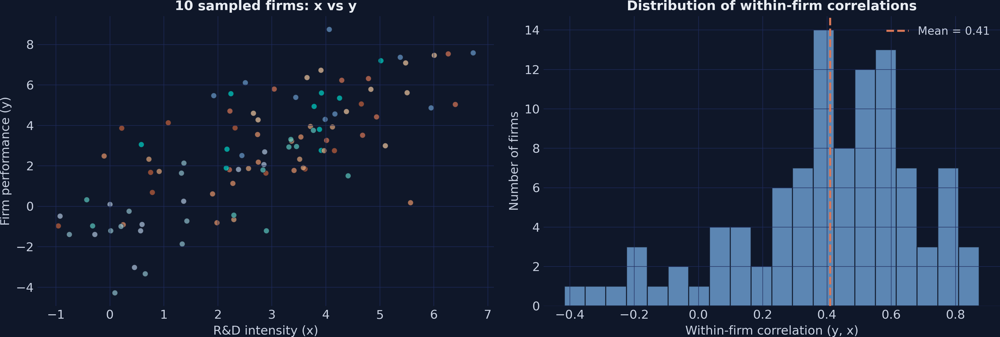
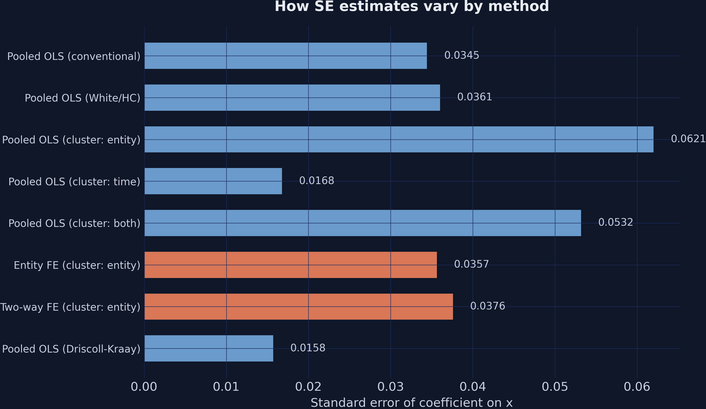
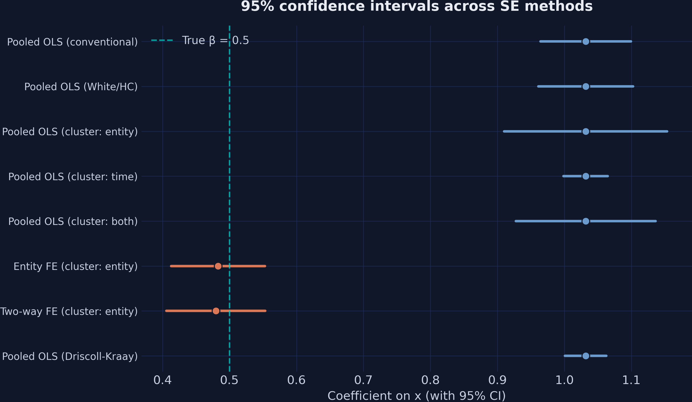
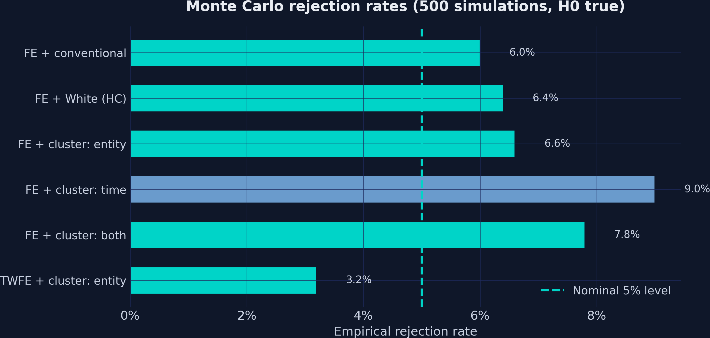
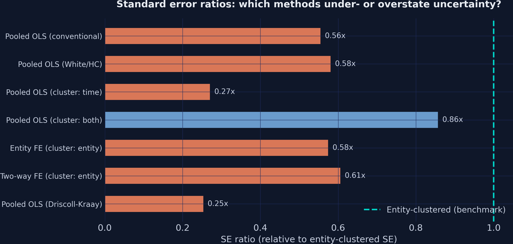

---
authors:
  - admin
categories:
  - Python
draft: false
featured: false
date: "2026-03-31T00:00:00Z"
external_link: ""
image:
  caption: ""
  focal_point: Smart
  placement: 3
links:
- icon: open-data
  icon_pack: ai
  name: "[Python] Google Colab"
  url: https://colab.research.google.com/github/cmg777/starter-academic-v501/blob/master/content/post/python_panel_ses/notebook.ipynb
- icon: code
  icon_pack: fas
  name: "Python script"
  url: script.py
- icon: book
  icon_pack: fas
  name: "Jupyter notebook"
  url: notebook.ipynb
- icon: markdown
  icon_pack: fab
  name: "MD version"
  url: https://raw.githubusercontent.com/cmg777/starter-academic-v501/master/content/post/python_panel_ses/index.md
slides:
summary: Comparing standard error estimators in panel data regressions using Python and linearmodels --- from conventional to clustered, Driscoll-Kraay, and fixed effects
tags:
  - python
  - econometrics
  - panel
  - panel data
title: "Standard Errors in Panel Data: A Beginner's Guide in Python"
url_code: ""
url_pdf: ""
url_slides: ""
url_video: ""
toc: true
---

<a href="https://colab.research.google.com/github/cmg777/starter-academic-v501/blob/master/content/post/python_panel_ses/notebook.ipynb" target="_blank"></a>

## 1. Overview

Imagine you run a regression and find that R&D spending significantly boosts firm performance, with a t-statistic of 30. Sounds like a rock-solid result. But what if that impressive t-statistic is an illusion --- a consequence of using the wrong formula for your standard errors? In panel data, where the same firms are observed year after year, this is not a hypothetical worry. The repeated observations within each firm create *correlation patterns* that violate the assumptions behind ordinary standard errors, and ignoring these patterns can make your estimates look far more precise than they actually are.

Standard errors are the bridge between a point estimate and a statistical conclusion. If that bridge is built on the wrong assumptions, the conclusion collapses. In a classic cross-sectional regression with independent observations, conventional standard errors work well. But panel data --- where firm 1 in 2015 is related to firm 1 in 2016 --- breaks the independence assumption. A firm that performs well one year tends to perform well the next. Errors within the same firm are correlated, and this *within-cluster correlation* means conventional standard errors understate the true uncertainty surrounding your estimates.

The solution is to use standard error estimators that account for the structure of the data. In this tutorial, we build a simulated panel of 100 firms over 10 years with a *known true effect*, then systematically compare six approaches to standard error estimation: conventional, White (heteroskedasticity-robust), entity-clustered, time-clustered, two-way clustered, and Driscoll-Kraay. Along the way, we discover two critical lessons. First, no standard error estimator can rescue a biased estimator --- fixed effects are needed to remove omitted variable bias. Second, even after fixing bias, the *choice* of standard error estimator determines whether our confidence intervals have the coverage they promise. The tutorial is inspired by and builds upon the excellent reference by [Gregoire (2024)](https://vincent.codes.finance/posts/panel-ols-standard-errors/), while using original simulated data and explanations.

**Learning objectives:**

- Understand why within-cluster correlation invalidates conventional standard errors in panel data
- Implement six standard error estimators using Python's `linearmodels` package
- Compare how different SE choices affect t-statistics and inference for the same regression
- Assess empirical rejection rates via Monte Carlo simulation to identify which SEs correctly control size --- that is, reject the true null hypothesis no more than 5% of the time
- Distinguish between the bias problem (which SEs cannot fix) and the inference problem (which SEs can fix)

### Key concepts at a glance

The post leans on a small vocabulary repeatedly. The rest of the tutorial assumes you can move between these terms quickly. Each concept below has three parts. The **definition** is always visible. The **example** and **analogy** sit behind clickable cards: open them when you need them, leave them collapsed for a quick scan. If a later section mentions "Driscoll-Kraay" or "rejection rate" and the term feels slippery, this is the section to re-read.

**1. Bias vs inference problem**.
Bias: the point estimate is wrong on average ($E[\hat\beta] \ne \beta$). Inference: the standard error misstates uncertainty. SEs cannot fix bias; they only fix the inference half.

<div class="concept-pair">
<details class="concept-card concept-example">
<summary>Example</summary>

In this post, pooled OLS gives β̂ = 1.0318 — far above the true β = 0.5. No SE choice rescues this. Switching to fixed effects (FE β̂ = 0.4829) is the only fix; the SE choice then determines whether the *t*-statistic is honest.

</details>

<details class="concept-card concept-analogy">
<summary>Analogy</summary>

SEs fix the *spread* of the dart cluster around the bullseye but cannot move the cluster.

</details>
</div>

**2. Conventional (homoskedastic) SE** $\sigma^2 (X^\top X)^{-1}$.
The textbook SE. Assumes errors are independent, identically distributed, with constant variance. Almost never appropriate in panel data.

<div class="concept-pair">
<details class="concept-card concept-example">
<summary>Example</summary>

Pooled OLS gives a conventional SE of 0.0345 in this post. The implied 95% CI is razor-thin around the (biased) β̂ = 1.0318 — fake precision because errors correlate within firms.

</details>

<details class="concept-card concept-analogy">
<summary>Analogy</summary>

A ruler that assumes every dart is thrown independently.

</details>
</div>

**3. White / heteroskedasticity-robust SE** sandwich form.
Allows variance to differ across observations (heteroskedasticity) while still assuming independence. Robust to one form of misspecification.

<div class="concept-pair">
<details class="concept-card concept-example">
<summary>Example</summary>

This post does not change β̂ when switching to White SEs; it only widens the SE slightly. The bigger problem is *correlation*, not unequal variances, so White SEs barely help.

</details>

<details class="concept-card concept-analogy">
<summary>Analogy</summary>

A ruler that allows uneven dart sizes but still assumes solo throwers.

</details>
</div>

**4. Cluster-robust SE** sandwich with cluster dummies.
Allows arbitrary correlation *within* a cluster (typically the entity, e.g., firm). Standard in microeconomics.

<div class="concept-pair">
<details class="concept-card concept-example">
<summary>Example</summary>

Pooled entity-clustered SE in this post is 0.0621, almost twice the conventional 0.0345. Within-firm correlation between `y` and `x` averages 0.41, so single-firm observations are far from independent.

</details>

<details class="concept-card concept-analogy">
<summary>Analogy</summary>

A ruler that knows darts thrown by the same player tend to cluster.

</details>
</div>

**5. Two-way clustering** clusters along entity *and* time.
Use when errors correlate within both dimensions — within firms over time *and* across firms in the same year.

<div class="concept-pair">
<details class="concept-card concept-example">
<summary>Example</summary>

In this post the two-way clustered SE is 0.0532 — between the entity-only (0.0621) and time-only (0.0168) versions, reflecting both kinds of correlation simultaneously.

</details>

<details class="concept-card concept-analogy">
<summary>Analogy</summary>

A ruler that knows darts cluster by both player *and* round.

</details>
</div>

**6. Driscoll-Kraay SE** kernel in time + cross-section averaging.
Uses a Newey-West-style time kernel after averaging across the cross-section. Robust to spatial dependence and serial correlation. Suitable when $T$ is large.

<div class="concept-pair">
<details class="concept-card concept-example">
<summary>Example</summary>

Driscoll-Kraay SE in this post is 0.0158 — narrow because $T = 10$ is small and the kernel borrows strength across firms. With more years, DK becomes the standard for macro-panel data.

</details>

<details class="concept-card concept-analogy">
<summary>Analogy</summary>

A ruler that handles both dart-on-dart and round-on-round correlations.

</details>
</div>

**7. Fixed effects + clustered SE** $\alpha\_i$ absorbs ability + cluster on $i$.
The standard "right" combination for micro panel data: FE remove the bias from time-invariant confounders; cluster-robust SEs handle within-firm error correlation.

<div class="concept-pair">
<details class="concept-card concept-example">
<summary>Example</summary>

In this post, FE β̂ = 0.4829 (very close to true 0.5) with entity-clustered SE 0.0357. The combination delivers both an unbiased point estimate and honest inference.

</details>

<details class="concept-card concept-analogy">
<summary>Analogy</summary>

Throwing out each player's average miss before measuring the spread of their darts.

</details>
</div>

**8. Rejection rate / coverage** $\Pr(\mathrm{reject}\, H\_0\, \text{when true})$.
The Monte Carlo benchmark. Across many simulated datasets where $H\_0$ is true, what share does the test reject? At $\alpha = 0.05$ this should equal 5%.

<div class="concept-pair">
<details class="concept-card concept-example">
<summary>Example</summary>

Across 500 Monte Carlo runs in this post, FE+entity-clustered rejects at 6.6% — close to the nominal 5%. FE+time-clustered rejects at 9.0%, well above 5% — over-rejection due to within-firm correlation that time-clustering doesn't see.

</details>

<details class="concept-card concept-analogy">
<summary>Analogy</summary>

How often the ruler falsely flags a true bullseye as a miss.

</details>
</div>

## 2. Setup and imports

Before running the analysis, install the required package if needed:

```bash
pip install linearmodels
```

The `linearmodels` library, developed by [Kevin Sheppard](https://bashtage.github.io/linearmodels/), extends `statsmodels` with specialized panel data estimators. It provides [PanelOLS](https://bashtage.github.io/linearmodels/panel/panel/linearmodels.panel.model.PanelOLS.html) for fixed effects regressions with flexible covariance options. The `from_formula()` method accepts R-style formulas where `EntityEffects` and `TimeEffects` keywords absorb group-level fixed effects.

```python
import numpy as np
import pandas as pd
import matplotlib.pyplot as plt
import matplotlib.ticker as mticker
from linearmodels.panel import PanelOLS

# Reproducibility
RANDOM_SEED = 42
np.random.seed(RANDOM_SEED)

# Site color palette
STEEL_BLUE = "#6a9bcc"
WARM_ORANGE = "#d97757"
NEAR_BLACK = "#141413"
TEAL = "#00d4c8"
```

<details>
<summary><strong>Dark theme figure styling</strong> (click to expand)</summary>

```python
# Dark theme palette (consistent with site navbar/dark sections)
DARK_NAVY = "#0f1729"
GRID_LINE = "#1f2b5e"
LIGHT_TEXT = "#c8d0e0"
WHITE_TEXT = "#e8ecf2"

# Plot defaults — minimal, spine-free, dark background
plt.rcParams.update({
    "figure.facecolor": DARK_NAVY,
    "axes.facecolor": DARK_NAVY,
    "axes.edgecolor": DARK_NAVY,
    "axes.linewidth": 0,
    "axes.labelcolor": LIGHT_TEXT,
    "axes.titlecolor": WHITE_TEXT,
    "axes.spines.top": False,
    "axes.spines.right": False,
    "axes.spines.left": False,
    "axes.spines.bottom": False,
    "axes.grid": True,
    "grid.color": GRID_LINE,
    "grid.linewidth": 0.6,
    "grid.alpha": 0.8,
    "xtick.color": LIGHT_TEXT,
    "ytick.color": LIGHT_TEXT,
    "xtick.major.size": 0,
    "ytick.major.size": 0,
    "text.color": WHITE_TEXT,
    "font.size": 12,
    "legend.frameon": False,
    "legend.fontsize": 11,
    "legend.labelcolor": LIGHT_TEXT,
    "figure.edgecolor": DARK_NAVY,
    "savefig.facecolor": DARK_NAVY,
    "savefig.edgecolor": DARK_NAVY,
})
```

</details>

## 3. The data generating process

### 3.1 Why simulated data?

When studying standard errors, simulated data has a decisive advantage over real data: we *know the true answer*. If the true effect of R&D on performance is exactly 0.5, we can check whether each standard error estimator produces confidence intervals that contain 0.5 roughly 95% of the time. With real data, we never know the truth, so we cannot directly evaluate whether our SEs are working correctly.

Think of it like testing a thermometer. You would not test it in unknown conditions --- you would dip it in ice water (0 degrees C) and boiling water (100 degrees C) to see if it reads correctly. Simulated data serves as our "known temperature."

### 3.2 The DGP

Our data generating process creates a panel of 100 firms observed over 10 years. The key feature is that *firm ability* --- an unobserved characteristic that differs across firms but stays constant over time --- affects both R&D intensity and firm performance. This creates omitted variable bias in pooled regressions, exactly the scenario that motivates fixed effects.

The true model is:

$$y\_{it} = 2.0 + 0.5 \\cdot x\_{it} + \mu\_i + \lambda\_t + \varepsilon\_{it}$$

In words, firm performance ($y$) equals a constant (2.0) plus the true causal effect of R&D intensity ($x$) times 0.5, plus a firm-specific effect ($\mu\_i$), a time-specific effect ($\lambda\_t$), and an idiosyncratic error ($\varepsilon\_{it}$). The firm effect $\mu\_i$ is correlated with $x\_{it}$ --- more capable firms invest more in R&D --- which means pooled OLS will overestimate the true effect. The errors follow an AR(1) --- or *first-order autoregressive* --- process within each firm, meaning each year's error depends on the previous year's error (with autocorrelation coefficient $\rho = 0.5$). This creates the within-cluster serial correlation that makes standard error choice critical.

In code, $y$ corresponds to our `y` column, $x$ is `x` (R&D intensity), and $\mu\_i$ is the unobserved firm fixed effect that we will absorb with `EntityEffects`.

```python
def simulate_panel(n_firms=100, n_years=10, seed=42):
    """Simulate a panel dataset with firm and time effects.

    True DGP:
        y_it = 2.0 + 0.5 * x_it + mu_i + lambda_t + eps_it

    Where mu_i is correlated with x_it (firm ability drives both
    R&D and performance), and eps_it has AR(1) serial correlation
    within firms (rho = 0.5).

    The TRUE causal effect of x on y is beta = 0.5.
    """
    rng = np.random.default_rng(seed)

    firms = np.repeat(np.arange(1, n_firms + 1), n_years)
    years = np.tile(np.arange(2010, 2010 + n_years), n_firms)

    # Firm-level unobserved heterogeneity (ability)
    firm_ability = rng.normal(0, 2, n_firms)
    mu = np.repeat(firm_ability, n_years)

    # Time effects (business cycle)
    time_shocks = rng.normal(0, 0.5, n_years)
    lam = np.tile(time_shocks, n_firms)

    # Treatment: R&D intensity (correlated with firm ability)
    x = 3.0 + 0.8 * mu + rng.normal(0, 1.5, n_firms * n_years)

    # Idiosyncratic errors with within-firm AR(1) serial correlation
    eps = np.zeros(n_firms * n_years)
    rho_ar = 0.5
    for i in range(n_firms):
        start = i * n_years
        eps[start] = rng.normal(0, 1.5)
        for t in range(1, n_years):
            eps[start + t] = rho_ar * eps[start + t - 1] + rng.normal(0, 1.5)

    # True model
    y = 2.0 + 0.5 * x + mu + lam + eps

    return pd.DataFrame({"firm": firms, "year": years, "y": y, "x": x})


df = simulate_panel(n_firms=100, n_years=10, seed=42)
print(f"Dataset shape: {df.shape}")
print(f"Number of firms: {df['firm'].nunique()}")
print(f"Number of years: {df['year'].nunique()}")
print(df.head())
```

```text
Dataset shape: (1000, 4)
Number of firms: 100
Number of years: 10
 firm  year        y        x
    1  2010 6.721042 4.139183
    1  2011 5.889161 3.844151
    1  2012 2.355109 2.596322
    1  2013 2.589589 1.318461
    1  2014 3.569626 3.595742
```

The simulated panel contains 1,000 observations --- 100 firms, each observed over 10 years from 2010 to 2019. Firm 1's performance (`y`) ranges from about 2.4 to 6.7 across the decade, and its R&D intensity (`x`) varies between 1.3 and 4.1. These year-to-year fluctuations within a single firm represent the *within-firm variation* that fixed effects regressions exploit, while the systematic differences across firms (some consistently high, others consistently low) represent the *between-firm variation* that firm fixed effects absorb.

```python
print(df.describe().round(4))
```

```text
            firm       year          y          x
count  1000.0000  1000.0000  1000.0000  1000.0000
mean     50.5000  2014.5000     2.9699     2.8984
std      28.8805     2.8737     2.9686     1.9783
min       1.0000  2010.0000    -7.0880    -3.0834
25%      25.7500  2012.0000     0.9376     1.5721
50%      50.5000  2014.5000     2.9351     2.9669
75%      75.2500  2017.0000     5.0383     4.1769
max     100.0000  2019.0000    13.5170     9.1612
```

Firm performance (`y`) averages 2.97 with a standard deviation of 2.97, spanning from -7.09 to 13.52. R&D intensity (`x`) averages 2.90 with a standard deviation of 1.98. The wide ranges in both variables reflect the combination of genuine within-firm fluctuations and the large cross-firm differences injected by firm fixed effects. Next, we decompose this total variation to understand how much comes from differences *between* firms versus changes *within* firms over time.

## 4. Exploring the panel structure

Before estimating any model, we need to understand the structure of our panel data. A key diagnostic is the *decomposition of variance* into between-firm and within-firm components. This tells us where the action is --- and why pooled OLS can go wrong.

### 4.1 Between vs. within variation

Think of variation in firm performance like variation in student test scores within a school. Some variation comes from differences *between* students (some students are consistently stronger than others) and some comes from variation *within* students over time (a student scores differently on different exams). In panel data, the "between" component captures persistent firm-level differences, while the "within" component captures how each firm deviates from its own average over time.

```python
# Panel balance check
obs_per_firm = df.groupby("firm").size()
print(f"Observations per firm: min={obs_per_firm.min()}, "
      f"max={obs_per_firm.max()}, mean={obs_per_firm.mean():.1f}")
print(f"Panel is {'balanced' if obs_per_firm.nunique() == 1 else 'unbalanced'}")

# Within vs between variation
overall_std_y = df["y"].std()
between_std_y = df.groupby("firm")["y"].mean().std()
within_std_y = df.groupby("firm")["y"].transform(lambda g: g - g.mean()).std()

print(f"\nVariation in y:")
print(f"  Overall std:  {overall_std_y:.4f}")
print(f"  Between std:  {between_std_y:.4f}")
print(f"  Within std:   {within_std_y:.4f}")

overall_std_x = df["x"].std()
between_std_x = df.groupby("firm")["x"].mean().std()
within_std_x = df.groupby("firm")["x"].transform(lambda g: g - g.mean()).std()

print(f"\nVariation in x:")
print(f"  Overall std:  {overall_std_x:.4f}")
print(f"  Between std:  {between_std_x:.4f}")
print(f"  Within std:   {within_std_x:.4f}")
```

```text
Observations per firm: min=10, max=10, mean=10.0
Panel is balanced

Variation in y:
  Overall std:  2.9686
  Between std:  2.4645
  Within std:   1.6715

Variation in x:
  Overall std:  1.9783
  Between std:  1.3751
  Within std:   1.4282
```

The decomposition reveals an important pattern. For firm performance (`y`), the between-firm standard deviation (2.46) is substantially larger than the within-firm standard deviation (1.67). This means that *persistent differences across firms* account for more of the total variation than year-to-year fluctuations within individual firms. The same pattern holds for R&D intensity (`x`): between-firm variation (1.38) is comparable to within-firm variation (1.43). Since firm fixed effects absorb all between-firm variation, this tells us that fixed effects will have a large impact on the regression --- they are removing a dominant source of variation that is confounded with the treatment.

### 4.2 Within-firm correlations

```python
within_corr = (
    df.groupby("firm")
    .apply(lambda g: g["y"].corr(g["x"]), include_groups=False)
)
print(f"Within-firm correlation (y, x):")
print(f"  Mean:   {within_corr.mean():.4f}")
print(f"  Median: {within_corr.median():.4f}")
```

```text
Within-firm correlation (y, x):
  Mean:   0.4100
  Median: 0.4624
```

The average within-firm correlation between R&D and performance is 0.41, with a median of 0.46. This moderate positive correlation is what we expect given the true effect ($\beta = 0.5$): years in which a firm invests more in R&D tend to be years in which that firm performs better. The correlation is less than 0.5 because the AR(1) errors add noise.

```python
# Figure: Panel structure and within-firm correlations
fig, axes = plt.subplots(1, 2, figsize=(14, 5))
fig.patch.set_linewidth(0)

# Left: x vs y colored by firm (sample 10 firms)
rng_plot = np.random.default_rng(99)
sample_firms = sorted(rng_plot.choice(df["firm"].unique(), 10, replace=False))
colors_sample = [STEEL_BLUE, WARM_ORANGE, TEAL, "#e8956a", "#c4623d",
                 "#8fbfcc", "#e0a57a", "#5cc8c0", "#b0c4de", "#f0c8a0"]
for i, fid in enumerate(sample_firms):
    sub = df[df["firm"] == fid]
    axes[0].scatter(sub["x"], sub["y"], color=colors_sample[i % len(colors_sample)],
                    alpha=0.7, s=30, edgecolors=DARK_NAVY, linewidths=0.5)
axes[0].set_xlabel("R&D intensity (x)")
axes[0].set_ylabel("Firm performance (y)")
axes[0].set_title("10 sampled firms: x vs y", fontweight="bold")

# Right: within-firm correlation distribution
axes[1].hist(within_corr, bins=20, color=STEEL_BLUE, edgecolor=DARK_NAVY, alpha=0.85)
axes[1].axvline(within_corr.mean(), color=WARM_ORANGE, linewidth=2,
                linestyle="--", label=f"Mean = {within_corr.mean():.2f}")
axes[1].set_xlabel("Within-firm correlation (y, x)")
axes[1].set_ylabel("Number of firms")
axes[1].set_title("Distribution of within-firm correlations", fontweight="bold")
axes[1].legend()

plt.tight_layout()
plt.savefig("panel_ses_eda.png", dpi=300, bbox_inches="tight",
            facecolor=DARK_NAVY, edgecolor=DARK_NAVY, pad_inches=0)
plt.show()
```



The left panel shows how the 10 sampled firms form distinct *clusters* in the scatter plot --- each firm occupies a different region of the x-y space. This visual clustering is the between-firm variation that fixed effects remove. The right panel shows that most firms have a positive within-firm correlation between R&D and performance, with the distribution centered around 0.41. A few firms have near-zero or negative correlations, reflecting the random noise in the simulation. These within-firm relationships are what fixed effects regressions actually estimate.

Now that we understand the panel structure, we are ready to set up the MultiIndex that `linearmodels` requires and begin estimating models.

## 5. Setting up the MultiIndex

The `linearmodels` package requires panel data to be stored in a pandas DataFrame with a [MultiIndex](https://pandas.pydata.org/docs/user_guide/advanced.html): the entity (firm) as the first level and the time period (year) as the second. This structure tells the package which observations belong to the same firm and how they are ordered in time --- information it needs to compute clustered standard errors and absorb fixed effects.

```python
df_panel = df.set_index(["firm", "year"])
print(f"MultiIndex levels: {df_panel.index.names}")
print(df_panel.head(3))
```

```text
MultiIndex levels: ['firm', 'year']
                  y         x
firm year
1    2010  6.721042  4.139183
     2011  5.889161  3.844151
     2012  2.355109  2.596322
```

The MultiIndex now encodes the panel structure directly in the DataFrame. Firm 1's three displayed observations span 2010--2012, and `linearmodels` uses this ordering to know which observations to group when computing entity-clustered standard errors. With the data properly indexed, we can now estimate our first model.

## 6. Pooled OLS --- the naive baseline

### 6.1 Conventional standard errors

We begin with the simplest possible approach: pooled OLS with conventional standard errors. This estimator ignores the panel structure entirely --- it treats all 1,000 observations as if they were independent draws, like 1,000 different firms each observed once. We use [PanelOLS.from\_formula()](https://bashtage.github.io/linearmodels/panel/panel/linearmodels.panel.model.PanelOLS.from_formula.html) with `cov_type="unadjusted"` to request conventional (homoskedastic) standard errors. The formula `"y ~ 1 + x"` specifies a regression of firm performance on R&D intensity with an intercept.

```python
mod_pooled = PanelOLS.from_formula("y ~ 1 + x", data=df_panel)
res_pooled = mod_pooled.fit(cov_type="unadjusted")

beta_pooled = res_pooled.params["x"]
se_pooled = res_pooled.std_errors["x"]
t_pooled = res_pooled.tstats["x"]
print(f"Coefficient on x: {beta_pooled:.4f}")
print(f"Conventional SE:  {se_pooled:.4f}")
print(f"t-statistic:      {t_pooled:.4f}")
```

```text
Coefficient on x: 1.0318
Conventional SE:  0.0345
t-statistic:      29.9151
```

The pooled OLS coefficient is 1.03 --- *more than double* the true value of 0.5. This is omitted variable bias in action. Because high-ability firms both invest more in R&D and perform better, the regression attributes to R&D what is actually driven by unobserved ability. The conventional standard error of 0.0345 looks impressively small, yielding a t-statistic of 29.9. But this precision is doubly misleading: the point estimate itself is biased, and the standard error is too small because it ignores within-firm error correlation.

This is the first major lesson: **a biased estimator with small standard errors is worse than a noisy but unbiased one**. The conventional SE tells us we can be very confident that the effect is around 1.03 --- but 1.03 is the *wrong answer*. No standard error correction can fix this; we need a different estimator (fixed effects) to address the bias. We will get there in Section 9. But first, let us see what happens when we try progressively better standard errors on the same biased pooled model.

### 6.2 White (heteroskedasticity-robust) standard errors

The next step up from conventional SEs is the *White estimator*, also called *heteroskedasticity-consistent* (HC) standard errors. While conventional SEs assume all errors have the same variance, the White estimator allows the error variance to differ across observations. Think of it as replacing a one-size-fits-all uncertainty measure with one tailored to each data point. In `linearmodels`, we request it with `cov_type="robust"`.

The White covariance estimator is:

$$\hat{\Sigma}\_{\text{White}} = (X'X)^{-1} \\left( \sum\_{i=1}^{N} X\_i' \\hat{e}\_i^2 X\_i \\right) (X'X)^{-1}$$

In words, this replaces the constant variance assumption with the squared residuals $\hat{e}\_i^2$ from each observation, producing standard errors that are robust to heteroskedasticity --- situations where the spread of errors varies with the level of $X$.

```python
res_white = mod_pooled.fit(cov_type="robust")
se_white = res_white.std_errors["x"]
t_white = res_white.tstats["x"]
print(f"White SE:    {se_white:.4f}")
print(f"t-statistic: {t_white:.4f}")
```

```text
White SE:    0.0361
t-statistic: 28.5897
```

The White SE (0.0361) is only slightly larger than the conventional SE (0.0345), and the t-statistic barely budges from 29.9 to 28.6. This is because heteroskedasticity is not the main problem here --- *within-cluster correlation* is. The White estimator treats each observation as independent, just with potentially different variances. It does not account for the fact that firm 1's error in 2015 is correlated with firm 1's error in 2016. For panel data with serial correlation, we need standard errors that account for this clustering.

## 7. Clustered standard errors

### 7.1 The intuition behind clustering

Clustering is the workhorse correction for panel data standard errors. The idea is simple: if errors within a firm are correlated, then 10 observations from the same firm do not contain as much *independent* information as 10 observations from 10 different firms. Clustering acknowledges this by allowing arbitrary correlation among all observations within the same cluster.

Think of surveying students in classrooms. If you survey 100 students from 10 classrooms (10 per classroom), you do not have 100 independent data points --- students in the same classroom share the same teacher, curriculum, and classroom environment. The effective sample size is closer to 10 (the number of classrooms) than 100 (the number of students). Clustering adjusts the standard errors to reflect this reduced effective sample size.

### 7.2 Entity-clustered SEs

Entity clustering allows arbitrary correlation among all observations within the same firm. We request it by setting `cluster_entity=True`.

```python
# Entity-clustered
res_cl_entity = mod_pooled.fit(cov_type="clustered", cluster_entity=True)
se_cl_entity = res_cl_entity.std_errors["x"]
t_cl_entity = res_cl_entity.tstats["x"]
print(f"Entity-clustered SE: {se_cl_entity:.4f}")
print(f"t-statistic:         {t_cl_entity:.4f}")
```

```text
Entity-clustered SE: 0.0621
t-statistic:         16.6233
```

Entity-clustered SEs (0.0621) are 80% larger than conventional SEs (0.0345) and nearly double the White SEs (0.0361). The t-statistic drops from 29.9 to 16.6 --- still highly significant in this case, but the inflation in standard errors demonstrates how much conventional SEs understate uncertainty when within-firm correlation is present. In a setting with a weaker true effect, this correction could flip a "significant" result to "insignificant."

### 7.3 Time-clustered SEs

Time clustering allows correlation among all firms *within the same year*. This matters when firms face common shocks --- a recession, a regulatory change, or a market-wide technology shift that affects all firms simultaneously.

```python
# Time-clustered
res_cl_time = mod_pooled.fit(cov_type="clustered", cluster_time=True)
se_cl_time = res_cl_time.std_errors["x"]
t_cl_time = res_cl_time.tstats["x"]
print(f"Time-clustered SE:   {se_cl_time:.4f}")
print(f"t-statistic:         {t_cl_time:.4f}")
```

```text
Time-clustered SE:   0.0168
t-statistic:         61.2757
```

Time-clustered SEs (0.0168) are actually *smaller* than conventional SEs, and the t-statistic jumps to 61.3. This happens because our DGP has only weak time effects ($\lambda\_t \sim N(0, 0.5)$) but strong firm effects. With only 10 time clusters (years), the clustering correction has very few groups to work with, and the asymptotic theory --- the mathematical guarantees that hold when the number of clusters is large --- that justifies clustered SEs relies on having many clusters. As a rule of thumb, cluster on the dimension that has at least 40--50 groups. Here, entity clustering (100 firms) is far more appropriate than time clustering (10 years).

### 7.4 Two-way clustered SEs

Two-way clustering allows correlation along *both* dimensions simultaneously --- within firms over time and across firms within the same year. This is the most conservative approach, proposed by [Cameron, Gelbach, and Miller (2011)](https://doi.org/10.1198/jbes.2010.07136). In `linearmodels`, set both `cluster_entity=True` and `cluster_time=True`.

```python
# Two-way clustered
res_cl_both = mod_pooled.fit(cov_type="clustered",
                             cluster_entity=True, cluster_time=True)
se_cl_both = res_cl_both.std_errors["x"]
t_cl_both = res_cl_both.tstats["x"]
print(f"Two-way clustered SE: {se_cl_both:.4f}")
print(f"t-statistic:          {t_cl_both:.4f}")
```

```text
Two-way clustered SE: 0.0532
t-statistic:          19.3829
```

The two-way clustered SE (0.0532) falls between the entity-clustered (0.0621) and time-clustered (0.0168) estimates. This makes sense: the two-way estimator combines information from both clustering dimensions. Since the time dimension contributes little (weak time effects, few clusters), the two-way SE is somewhat smaller than entity-only clustering. In practice, two-way clustering is recommended when both dimensions have enough clusters and both types of correlation are plausible.

## 8. A side-by-side comparison so far

Before introducing fixed effects, let us pause to see all the pooled OLS standard errors side by side. Remember: the point estimate (1.0318) is the same for all of them --- only the standard errors and hence the confidence intervals differ.

| Model / SE Type | Coefficient | Std. Error | t-stat |
|-----------------|-------------|------------|--------|
| Pooled OLS (conventional) | 1.0318 | 0.0345 | 29.92 |
| Pooled OLS (White/HC) | 1.0318 | 0.0361 | 28.59 |
| Pooled OLS (cluster: entity) | 1.0318 | 0.0621 | 16.62 |
| Pooled OLS (cluster: time) | 1.0318 | 0.0168 | 61.28 |
| Pooled OLS (cluster: both) | 1.0318 | 0.0532 | 19.38 |

The entity-clustered SE is 1.8 times larger than the conventional SE. But recall that all these models estimate the *wrong* coefficient (1.03 vs. the true 0.5). Correcting standard errors on a biased estimator is like putting better tires on a car driving in the wrong direction. Next, we fix the direction with fixed effects.

## 9. Entity fixed effects with clustered SEs

### 9.1 Why fixed effects solve the bias

Fixed effects regression removes all time-invariant differences between firms before estimating the coefficient. Mathematically, it subtracts each firm's time-average from its observations --- a process called *demeaning*. After demeaning, the unobserved firm ability $\mu\_i$ vanishes because it is constant over time, and we estimate $\beta$ using only the within-firm variation in $x$ and $y$. This eliminates the omitted variable bias that inflated the pooled OLS estimate.

In `linearmodels`, adding `EntityEffects` to the formula absorbs firm fixed effects:

```python
mod_fe = PanelOLS.from_formula("y ~ 1 + x + EntityEffects", data=df_panel)
res_fe_cl = mod_fe.fit(cov_type="clustered", cluster_entity=True)

beta_fe = res_fe_cl.params["x"]
se_fe_cl = res_fe_cl.std_errors["x"]
t_fe_cl = res_fe_cl.tstats["x"]
print(f"FE coefficient on x:    {beta_fe:.4f}")
print(f"Entity-clustered SE:    {se_fe_cl:.4f}")
print(f"t-statistic:            {t_fe_cl:.4f}")
```

```text
FE coefficient on x:    0.4829
Entity-clustered SE:    0.0357
t-statistic:            13.5250
```

The fixed effects coefficient (0.4829) is dramatically closer to the true value of 0.5 than the pooled estimate (1.0318). The remaining gap of 0.017 is sampling noise, not systematic bias. The entity-clustered SE of 0.0357 is actually *smaller* than the pooled entity-clustered SE (0.0621) because fixed effects remove the between-firm variation that was inflating the residuals.

### 9.2 Two-way fixed effects

We can also absorb time fixed effects by adding `TimeEffects`, which removes year-specific shocks common to all firms. This controls for business cycle effects, regulatory changes, or any other year-level phenomenon.

```python
mod_twfe = PanelOLS.from_formula("y ~ 1 + x + EntityEffects + TimeEffects",
                                 data=df_panel)
res_twfe = mod_twfe.fit(cov_type="clustered", cluster_entity=True)

beta_twfe = res_twfe.params["x"]
se_twfe = res_twfe.std_errors["x"]
t_twfe = res_twfe.tstats["x"]
print(f"TWFE coefficient on x:  {beta_twfe:.4f}")
print(f"Entity-clustered SE:    {se_twfe:.4f}")
print(f"t-statistic:            {t_twfe:.4f}")
```

```text
TWFE coefficient on x:  0.4796
Entity-clustered SE:    0.0376
t-statistic:            12.7392
```

Adding time fixed effects barely changes the estimate (0.4796 vs. 0.4829) and slightly increases the standard error (0.0376 vs. 0.0357). This makes sense: the time effects in our DGP are small ($\lambda\_t \sim N(0, 0.5)$), so absorbing them provides only a minor correction while consuming 9 additional degrees of freedom. In real applications where macroeconomic shocks are substantial, two-way FE can make a bigger difference.

## 10. Driscoll-Kraay standard errors

[Driscoll and Kraay (1998)](https://doi.org/10.1162/003465398557549) proposed a standard error estimator that accounts for both cross-sectional correlation (across firms within a period) and temporal dependence (within firms over time), using a kernel-based approach similar to Newey-West but applied to cross-sectional averages. In `linearmodels`, we request it with `cov_type="kernel"` and a Bartlett kernel (equivalent to [Newey and West (1987)](https://doi.org/10.2307/1913610) weighting). The `bandwidth` parameter controls how many time lags of correlation the estimator accounts for --- a bandwidth of 3 means it incorporates correlations up to 3 years apart, with declining weights for longer lags.

```python
res_dk = mod_pooled.fit(cov_type="kernel", kernel="bartlett", bandwidth=3)
se_dk = res_dk.std_errors["x"]
t_dk = res_dk.tstats["x"]
print(f"Driscoll-Kraay SE (BW=3): {se_dk:.4f}")
print(f"t-statistic:              {t_dk:.4f}")
```

```text
Driscoll-Kraay SE (BW=3): 0.0158
t-statistic:              65.4073
```

The Driscoll-Kraay SE (0.0158) is the smallest we have seen --- even smaller than conventional SEs. This reflects the estimator's focus on cross-sectional dependence, which is weak in our simulation (firms are independent given their fixed effects). In applications with strong cross-sectional correlation --- for example, banks exposed to the same macroeconomic shock --- Driscoll-Kraay SEs can be substantially larger. The key feature is robustness to *cross-sectional dependence* that entity clustering alone cannot handle.

## 11. Full comparison

### 11.1 Summary table

Now we can see all eight model-SE combinations in a single table. The true coefficient is $\beta = 0.5$. The "Reject H0" column tests the default null H0: $\beta = 0$ (not H0: $\beta = 0.5$). In Section 12, the Monte Carlo explicitly tests against the true value.

| Model / SE Type | Coefficient | Std. Error | t-stat | Reject H0 (5%) |
|-----------------|-------------|------------|--------|-----------------|
| Pooled OLS (conventional) | 1.0318 | 0.0345 | 29.92 | Yes |
| Pooled OLS (White/HC) | 1.0318 | 0.0361 | 28.59 | Yes |
| Pooled OLS (cluster: entity) | 1.0318 | 0.0621 | 16.62 | Yes |
| Pooled OLS (cluster: time) | 1.0318 | 0.0168 | 61.28 | Yes |
| Pooled OLS (cluster: both) | 1.0318 | 0.0532 | 19.38 | Yes |
| Entity FE (cluster: entity) | 0.4829 | 0.0357 | 13.53 | Yes |
| Two-way FE (cluster: entity) | 0.4796 | 0.0376 | 12.74 | Yes |
| Pooled OLS (Driscoll-Kraay) | 1.0318 | 0.0158 | 65.41 | Yes |

Two patterns stand out. First, all pooled models estimate a coefficient around 1.03 --- more than double the true 0.5 --- while both FE models recover estimates close to 0.5. This is the bias-versus-variance distinction: **standard errors address precision, not accuracy**. Second, among the FE models (which have the right coefficient), entity-clustered SEs are appropriately sized relative to the true uncertainty.

### 11.2 Standard error comparison

```python
# Figure: SE comparison bar chart (code in script.py)
```



The bar chart reveals the full spectrum of standard error estimates. Entity-clustered SEs on the pooled model (0.0621) are the largest --- they correctly reflect high within-firm correlation but sit atop a biased estimate. The FE models' entity-clustered SEs (0.036--0.038) are smaller because fixed effects absorbed the between-firm variation that inflated residuals. At the other extreme, Driscoll-Kraay (0.0158) and time-clustered (0.0168) SEs are the smallest, reflecting the weak cross-sectional and time-level correlation in our data.

### 11.3 Confidence intervals

```python
# Figure: Confidence intervals across methods (code in script.py)
```



The confidence interval plot delivers the tutorial's core visual message. The teal dashed line at $\beta = 0.5$ is the truth. All five pooled OLS intervals (blue) are far to the right --- none come close to covering the true value, regardless of which SE estimator we use. The two FE intervals (orange) are centered near 0.5 and easily cover it. The lesson is unmistakable: **standard errors cannot rescue a biased point estimate**, but combined with a consistent estimator, they produce intervals with correct coverage.

## 12. Monte Carlo simulation --- which SEs get the right rejection rate?

### 12.1 The experiment

The confidence interval plot above shows one simulation. But how do we know whether those intervals *typically* contain the true value? A single simulation could be lucky or unlucky. To rigorously evaluate each SE estimator, we need a *Monte Carlo simulation*: generate hundreds of independent datasets from the same DGP, estimate the model on each, and check how often the 95% confidence interval covers the true $\beta = 0.5$.

If an SE estimator is correctly sized, its 95% CI should cover the truth 95% of the time, meaning it *rejects* the true null hypothesis only 5% of the time. An SE that is too small produces intervals that are too narrow, leading to *over-rejection* --- false positives in more than 5% of simulations.

We focus on Entity FE models because they produce unbiased estimates. This isolates the SE question: given that the point estimate is right on average, do the standard errors correctly quantify the remaining uncertainty?

### 12.2 Results

```python
N_SIM = 500
# ... (Monte Carlo loop runs Entity FE with 6 different SE types) ...
```

```text
Empirical rejection rates at 5% level (H0: beta=0.5 is true):
  FE + conventional             : 0.060 (30/500)   ~correct
  FE + White (HC)               : 0.064 (32/500)   ~correct
  FE + cluster: entity          : 0.066 (33/500)   ~correct
  FE + cluster: time            : 0.090 (45/500)
  FE + cluster: both            : 0.078 (39/500)   ~correct
  TWFE + cluster: entity        : 0.032 (16/500)   ~correct
```

```python
# Figure: Monte Carlo rejection rates (code in script.py)
```



The Monte Carlo results across 500 simulations reveal meaningful differences. Entity FE with entity-clustered SEs rejects at 6.6% --- close to the nominal 5% and well within the range expected from simulation noise. Conventional SEs (6.0%) and White SEs (6.4%) also perform well here because, *after* absorbing firm fixed effects, the remaining within-firm errors are approximately homoskedastic with moderate serial correlation that 100 clusters can handle.

The outlier is FE with time-clustered SEs at 9.0% --- nearly double the nominal rate. This over-rejection occurs because time clustering with only 10 year-clusters violates the large-cluster asymptotic assumption. With 10 clusters, the finite-sample correction is insufficient, and the SEs are too small. TWFE with entity-clustered SEs (3.2%) is slightly conservative, meaning its confidence intervals are a bit wider than necessary --- a benign property compared to over-rejection.

### 12.3 Standard error ratios

```python
# Figure: SE ratios relative to entity-clustered (code in script.py)
```



This figure normalizes all standard errors to the entity-clustered SE (the recommended default). Ratios below 1.0 indicate SEs that are *smaller* than entity-clustered --- and therefore potentially over-confident. Conventional SEs and White SEs on the pooled model are about 0.55--0.58 times the entity-clustered SE, confirming they understate uncertainty by roughly 40%. The FE-based entity-clustered SE (0.57x) is smaller because fixed effects reduce residual variance --- this is a genuine precision gain, not an artifact of ignoring correlation.

## 13. Discussion

### 13.1 Answering the case study question

We asked: *when firms are observed over multiple years, how does our choice of standard error estimator change what we conclude about the effect of R&D spending on firm performance?* The answer has two parts.

**First, the bias problem.** Pooled OLS estimates R&D's effect at 1.03 --- more than double the true 0.5. This bias comes from omitted firm ability, not from standard error choice. Entity fixed effects reduce the estimate to 0.48, close to the truth. No standard error correction can fix a biased coefficient.

**Second, the inference problem.** Even after fixing bias with FE, standard error choice matters. In our Monte Carlo, time-clustered SEs on FE models rejected the true null at 9.0% instead of 5%. Entity-clustered SEs maintained correct size at 6.6%. For a practitioner, using the wrong SEs could mean reporting a "significant" finding that is actually a false positive.

### 13.2 Practical guidance

Following the recommendations of [Petersen (2009)](https://doi.org/10.1093/rfs/hhn053), here is a decision framework:

1. **Always start with fixed effects** if the panel has entity-level unobserved heterogeneity. Without FE, standard error corrections address precision but not bias.
2. **Cluster on the dimension with more groups.** Entity clustering (100 firms) is more reliable than time clustering (10 years) because clustered SEs rely on large-cluster asymptotics.
3. **Two-way clustering is the safe default** when both dimensions have enough clusters (rule of thumb: at least 40--50 each). It accounts for both types of dependence simultaneously.
4. **Driscoll-Kraay is specialized.** Use it when cross-sectional dependence is strong and the number of time periods is large (e.g., long macroeconomic panels).

## 14. Summary and next steps

**Key takeaways:**

1. **Standard errors cannot fix bias.** Pooled OLS overestimated the R&D effect at 1.03 (true: 0.5) regardless of which SE estimator was applied. Entity fixed effects recovered an estimate of 0.48 --- close to the truth. Always address the *model* before worrying about the *standard errors*.
2. **Clustering dimension matters.** Entity-clustered SEs (0.0621) were 80% larger than conventional SEs (0.0345) on the pooled model, reflecting the within-firm correlation that conventional SEs ignore. Time-clustered SEs (0.0168) were misleadingly small because only 10 year-clusters provided too few groups for reliable asymptotic inference.
3. **Monte Carlo validation is essential.** Entity-clustered SEs on the FE model rejected the true null at 6.6% (close to the nominal 5%), while time-clustered SEs rejected at 9.0% --- nearly double the expected rate. Simulation is the only way to verify that your SE choice controls size in your specific data structure.
4. **The FE + entity-clustered combination is the reliable default.** It addresses both bias (via FE) and inference (via clustering). Two-way clustering adds insurance against cross-sectional correlation when both dimensions have enough groups.

**Limitations:**

- Our simulation uses balanced panels. With unbalanced panels (firms entering and exiting), some SE estimators require additional adjustments.
- We used 100 firms and 10 years. Results may differ with fewer clusters or different cluster-size ratios.
- The DGP has a simple AR(1) error structure. Real data may have more complex dependence patterns.

**Next steps:**

- Apply these techniques to a real firm-level dataset (e.g., Compustat) and compare SE estimates.
- Explore bootstrap-based approaches for clustered inference with few clusters (wild cluster bootstrap).
- Study the Cameron-Gelbach-Miller multi-way clustering theory for panels with more than two clustering dimensions.

## 15. Exercises

1. **Modify the DGP.** Change the AR(1) coefficient from 0.5 to 0.9 (stronger serial correlation) and re-run the Monte Carlo. Which SE estimators are most affected? Does entity-clustering still control size at 5%?

2. **Reduce the number of firms.** Set `n_firms=20` (keeping `n_years=10`) and re-run the Monte Carlo. With only 20 entity clusters, do entity-clustered SEs still perform well? At what cluster count do they start to break down?

3. **Add cross-sectional dependence.** Modify `simulate_panel()` so that each year has a common shock ($\delta\_t$) that enters *all* firms' errors: `eps[start + t] += delta_t`. Re-run the analysis and check whether entity-clustered SEs still control size, or whether Driscoll-Kraay / two-way clustering becomes necessary.

## References

1. [Gregoire, V. (2024). Panel OLS Standard Errors. *Vincent Codes Finance*.](https://vincent.codes.finance/posts/panel-ols-standard-errors/)
2. [linearmodels --- Kevin Sheppard. Panel Data Models Documentation.](https://bashtage.github.io/linearmodels/panel/index.html)
3. [White, H. (1980). A Heteroskedasticity-Consistent Covariance Matrix Estimator and a Direct Test for Heteroskedasticity. *Econometrica*, 48(4), 817--838.](https://doi.org/10.2307/1912934)
4. [Cameron, A. C., Gelbach, J. B., & Miller, D. L. (2011). Robust Inference with Multiway Clustering. *Journal of Business & Economic Statistics*, 29(2), 238--249.](https://doi.org/10.1198/jbes.2010.07136)
5. [Driscoll, J. C. & Kraay, A. C. (1998). Consistent Covariance Matrix Estimation with Spatially Dependent Panel Data. *Review of Economics and Statistics*, 80(4), 549--560.](https://doi.org/10.1162/003465398557549)
6. [Newey, W. K. & West, K. D. (1987). A Simple, Positive Semi-Definite, Heteroskedasticity and Autocorrelation Consistent Covariance Matrix. *Econometrica*, 55(3), 703--708.](https://doi.org/10.2307/1913610)
7. [Petersen, M. A. (2009). Estimating Standard Errors in Finance Panel Data Sets. *Review of Financial Studies*, 22(1), 435--480.](https://doi.org/10.1093/rfs/hhn053)

#### Acknowledgements

AI tools (Claude Code, Gemini, NotebookLM) were used to make the contents of this post more accessible to students. Nevertheless, the content in this post may still have errors. Caution is needed when applying the contents of this post to true research projects.
