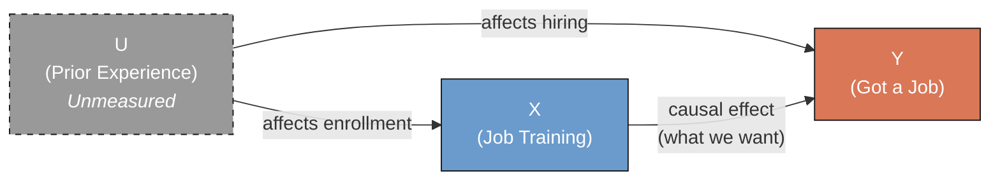
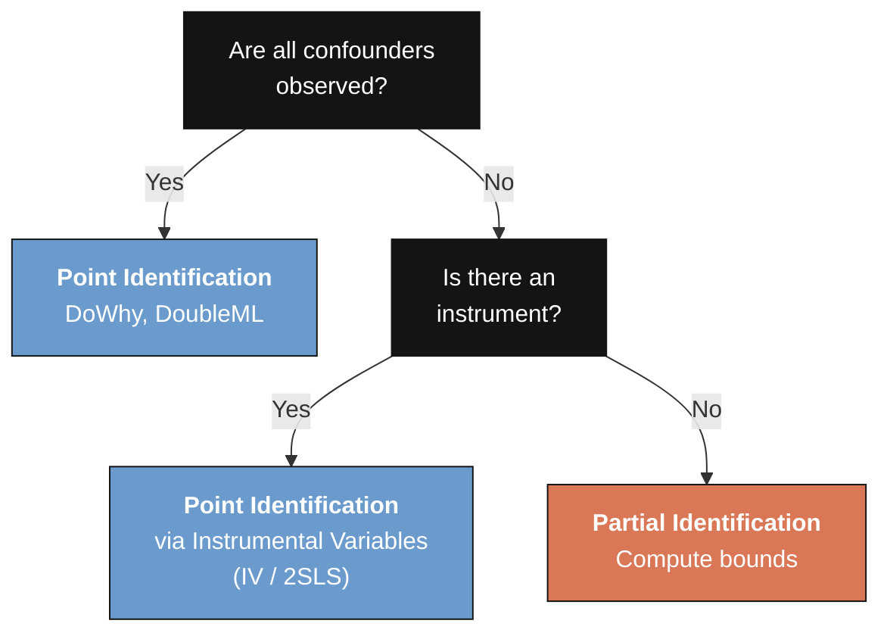
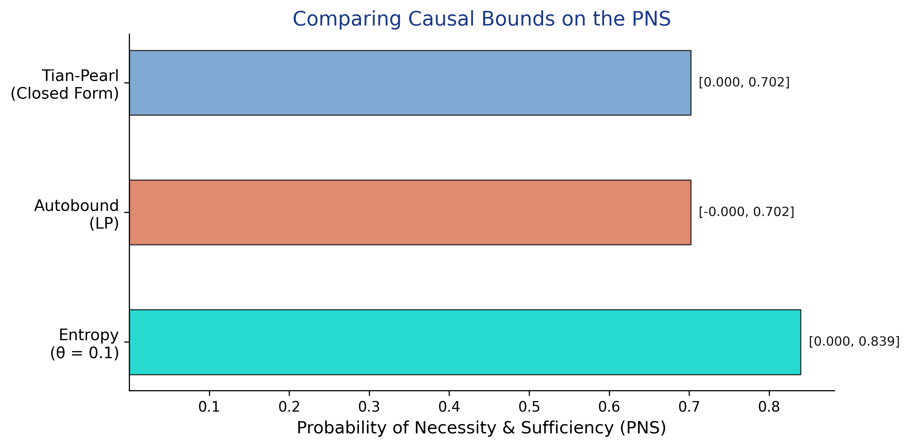

---
authors:
  - admin
categories:
  - Python
  - Partial Identification
draft: false
featured: false
date: "2026-03-13T00:00:00Z"
external_link: ""
image:
  caption: ""
  focal_point: Smart
  placement: 3
links:
- icon: laptop-code
  icon_pack: fas
  name: "Web app"
  url: web_app/index.html
- icon: open-data
  icon_pack: ai
  name: "[Python] Google Colab"
  url: https://colab.research.google.com/github/cmg777/starter-academic-v501/blob/master/content/post/python_partial_identification/notebook.ipynb
- icon: file-code
  icon_pack: fas
  name: "Quarto project (.zip)"
  url: python_partial_identification.zip
- icon: code
  icon_pack: fas
  name: "Python script"
  url: script.py
- icon: book
  icon_pack: fas
  name: "Jupyter notebook"
  url: notebook.ipynb
- icon: markdown
  icon_pack: fab
  name: "MD version"
  url: https://raw.githubusercontent.com/cmg777/starter-academic-v501/master/content/post/python_partial_identification/index.md
slides:
summary: Computing causal bounds under unmeasured confounding using Manski and Tian-Pearl bounds with the CausalBoundingEngine package in Python
tags:
  - python
  - causal
  - causal inference
  - cross-sectional data
title: "Introduction to Partial Identification: Bounding Causal Effects Under Unmeasured Confounding"
url_code: ""
url_pdf: ""
url_slides: ""
url_video: ""
toc: true
diagram: true
---

## Overview

Does a job training program actually help workers find jobs, or could an unmeasured factor -- like prior work experience -- explain the entire observed association? In standard causal inference with methods like Double Machine Learning or DoWhy, we assume that all confounders are observed. But what if that assumption fails? Rather than abandoning causal analysis entirely, **partial identification** offers an honest alternative: instead of estimating a single number, we compute *bounds* -- a range of values that the true causal effect must lie within, given only minimal assumptions.

Think of it this way. If someone tells you that $x + y = 10$ and $y = 6$, you know $x = 4$ exactly -- that is **point identification**. But if they only tell you that $y$ is somewhere between 4 and 7, you can still say $x$ is between 3 and 6. You have not pinned down $x$ exactly, but you have ruled out many values. That is **partial identification**: credible uncertainty over incredible certainty.

In this tutorial we simulate an observational study where an unmeasured confounder biases the naive estimate, then compute **Manski bounds** (the widest possible bounds under minimal assumptions), **entropy-based bounds** (tighter bounds using information-theoretic constraints), and **Tian-Pearl bounds** for the Probability of Necessity and Sufficiency. We use the [CausalBoundingEngine](https://pypi.org/project/causalboundingengine/) Python package, which provides a unified framework for multiple bounding methods.

**Learning objectives:**

- Understand why unmeasured confounders invalidate point identification and when partial identification is the appropriate response
- Implement Manski (worst-case) bounds for the Average Treatment Effect using the algebra of observable probabilities
- Compute Tian-Pearl bounds for the Probability of Necessity and Sufficiency (PNS)
- Compare multiple bounding methods to see how additional assumptions tighten bounds
- Assess whether bounds are informative enough for practical decision-making

### Key concepts at a glance

The post leans on a small vocabulary repeatedly. The rest of the tutorial assumes you can move between these terms quickly. Each concept below has three parts. The **definition** is always visible. The **example** and **analogy** sit behind clickable cards: open them when you need them, leave them collapsed for a quick scan. If a later section mentions "Manski bounds" or "PNS" and the term feels slippery, this is the section to re-read.

**1. Point identification** $\theta = $ a single value. Classical assumptions (e.g., random assignment, no unmeasured confounders) deliver a single number for the causal effect.

<div class="concept-pair">
<details class="concept-card concept-example"><summary>Example</summary>

A randomized controlled trial would point-identify the ATE for the training program. But this post's DGP has an unmeasured confounder (`U`), so point identification fails — only bounds are honest.

</details>

<details class="concept-card concept-analogy"><summary>Analogy</summary>

"The criminal is John Smith, period."

</details>

</div>

**2. Partial identification** $\theta \in [L, U]$. With weaker assumptions, the data identify a *range* — a lower bound $L$ and an upper bound $U$ — but not a single number. The width $U - L$ measures how much the data, plus assumptions, leave undetermined.

<div class="concept-pair">
<details class="concept-card concept-example"><summary>Example</summary>

In this post the data alone (no extra assumptions) tell us only that the true ATE lies somewhere in [-0.2980, +0.7020]. The point estimate is hidden inside this range.

</details>

<details class="concept-card concept-analogy"><summary>Analogy</summary>

"The criminal is one of these five people in the line-up."

</details>

</div>

**3. Manski no-assumption bounds** width $\le 1$. The widest honest bounds, computed from observed quantities alone with no extra assumptions. By construction the width equals 1 for binary outcomes.

<div class="concept-pair">
<details class="concept-card concept-example"><summary>Example</summary>

Manski bounds in this post are [-0.2980, +0.7020], width exactly 1.0000 by construction. They include the true ATE (0.27) but are too wide for decisions: they cannot rule out either a positive or a negative effect.

</details>

<details class="concept-card concept-analogy"><summary>Analogy</summary>

The largest line-up that's guaranteed honest.

</details>

</div>

**4. Monotone treatment response** $Y(1) \ge Y(0)$ pointwise. An assumption that treatment never *hurts* anyone. Adds direction. Tightens bounds.

<div class="concept-pair">
<details class="concept-card concept-example"><summary>Example</summary>

Training is unlikely to *reduce* an individual's employment chances, so monotone treatment response is plausible. With this assumption (and entropy regularization at θ=0.1), the bounds tighten to [-0.2279, +0.4540], width 0.6819 — much sharper.

</details>

<details class="concept-card concept-analogy"><summary>Analogy</summary>

"We know the criminal was male — that narrows the line-up."

</details>

</div>

**5. Tian-Pearl bounds**. Sharper bounds for probability-of-causation quantities (PN, PS, PNS) that exploit the joint structure of treatment and outcome more aggressively than Manski.

<div class="concept-pair">
<details class="concept-card concept-example"><summary>Example</summary>

Applied to the same dataset, Tian-Pearl PNS bounds give [0.0000, +0.7020]. The lower bound is exactly zero — consistent with "training need not have helped anyone" — but the upper bound is the same as Manski's, capping the share of true switchers.

</details>

<details class="concept-card concept-analogy"><summary>Analogy</summary>

A sharper detective who can rule more suspects out using the same evidence.

</details>

</div>

**6. Probability of necessity and sufficiency (PNS)** $\Pr(Y(1)=1, Y(0)=0)$. The probability that treatment *both* would succeed *and* needed treatment to succeed. The fraction of workers for whom training is the active cause of employment.

<div class="concept-pair">
<details class="concept-card concept-example"><summary>Example</summary>

Tian-Pearl bounds in this post tell us PNS lies in [0.000, 0.702]. So at most 70.2% of workers are "true switchers" whose employment outcome flipped because of training; the rest would have succeeded (or failed) regardless.

</details>

<details class="concept-card concept-analogy"><summary>Analogy</summary>

Probability the suspect *had* to do it *and* could have done it.

</details>

</div>

**7. Bound width / informativeness** $U - L$. The narrower the bounds, the more decision-relevant they are. Width 1.0 is uninformative for binary outcomes; width 0.2 might be enough to act on.

<div class="concept-pair">
<details class="concept-card concept-example"><summary>Example</summary>

In this post the Manski bounds (width 1.000) are useless for policy. The entropy-regularized bounds (width 0.6819) start to rule out small positive effects but still cannot tell a manager whether to scale up the program.

</details>

<details class="concept-card concept-analogy"><summary>Analogy</summary>

How short the line-up is — the shorter, the more useful.

</details>

</div>

**8. Coverage / validation** $\Pr(\theta \in [\hat L, \hat U]) \ge 1 - \alpha$. Across many simulated datasets, do the estimated bounds *contain* the true parameter at the rate they advertise?

<div class="concept-pair">
<details class="concept-card concept-example"><summary>Example</summary>

Across 100 simulated runs in this post, every method's bounds contained the true ATE (0.27) — coverage = 100%. The bounds are valid in the formal sense, even though they are sometimes wide.

</details>

<details class="concept-card concept-analogy"><summary>Analogy</summary>

Across all the cases where the detective claims a line-up, the true criminal is in it the right share of the time.

</details>

</div>

## The Identification Problem

### Point identification vs. partial identification

Most causal inference methods produce a single estimate of the treatment effect -- a **point estimate**. This requires strong assumptions. For example, regression adjustment assumes that all variables affecting both treatment and outcome are included in the model. Double Machine Learning assumes *conditional ignorability* -- that treatment is as good as randomly assigned once we condition on observed covariates. These assumptions are untestable: we can never verify from the data alone that no important variable was left out.

**Partial identification** relaxes these assumptions. Instead of requiring "no unmeasured confounders," it asks: "What can we learn about the causal effect using only the data we observe, without assuming confounders away?" The answer is a range of values -- called the **identified set** or **bounds** -- consistent with the data and the weaker assumptions. Any value outside this range can be rejected; any value inside it remains plausible.

The key estimand we target is the **Average Treatment Effect (ATE)**:

$$\text{ATE} = E[Y(1)] - E[Y(0)]$$

In words, the ATE is the difference between the average outcome if everyone were treated and the average outcome if no one were treated. Here $Y(1)$ is the potential outcome under treatment (getting a job if trained) and $Y(0)$ is the potential outcome without treatment (getting a job without training). We never observe both potential outcomes for the same person -- this is the **fundamental problem of causal inference** -- so we must rely on assumptions to bridge the gap between what we observe and what we want to know.

### The confounded scenario

In our case study, a job training program ($X$) may cause workers to find jobs ($Y$), but prior work experience ($U$) also affects both who enrolls in training and who gets hired. The causal diagram below shows these relationships -- each arrow represents a direct causal influence from one variable to another. Because $U$ is unmeasured, we cannot block the **backdoor path** $X \leftarrow U \rightarrow Y$ -- an indirect route from treatment to outcome through a common cause that creates a spurious association. The **backdoor criterion** says that if we could condition on all variables along such paths, we could identify the causal effect. Since $U$ is unobserved, the criterion fails and standard causal methods will produce biased estimates.



The dashed border on $U$ signals it is unmeasured. Because we cannot condition on $U$, the backdoor criterion fails and **point identification is impossible**. This is precisely when partial identification becomes valuable: we can still bound the causal effect using only the observable joint distribution of $X$ and $Y$. The next section sets up our simulated data so we can see exactly how this works.

## Setup and Imports

We use [CausalBoundingEngine](https://pypi.org/project/causalboundingengine/), a Python package that provides a unified interface for applying and comparing multiple causal bounding methods. Install it with `pip install causalboundingengine`.

```python
import numpy as np
import matplotlib.pyplot as plt
import time
from causalboundingengine.scenarios import BinaryConf

# Reproducibility
RANDOM_SEED = 42
np.random.seed(RANDOM_SEED)

# Configuration
N = 1000  # Number of simulated workers

# Site color palette
STEEL_BLUE = "#6a9bcc"
WARM_ORANGE = "#d97757"
NEAR_BLACK = "#141413"
TEAL = "#00d4c8"
HEADING_BLUE = "#1a3a8a"
```

## Data Simulation

We simulate an observational study where 1,000 workers either receive job training ($X = 1$) or not ($X = 0$), and we observe whether they get a job within six months ($Y = 1$) or not ($Y = 0$). An unmeasured confounder -- prior work experience ($U$) -- affects both who enrolls in training and who gets hired, creating genuine confounding. The data-generating process has two parts. First, treatment assignment depends on the confounder:

$$P(X\_i = 1) = 0.3 + 0.4 \\, U\_i$$

Workers with prior experience ($U = 1$) have a 70% chance of enrolling in training, while inexperienced workers ($U = 0$) have only a 30% chance. This creates confounding: the treated group is enriched with experienced workers who would have found jobs regardless. Second, the outcome depends on training, experience, and their interaction:

$$P(Y\_i = 1) = \text{clip}\big(0.2 + 0.3 \\, X\_i + 0.4 \\, U\_i - 0.1 \\, X\_i U\_i, \\; 0, \\; 1\big)$$

In words, the probability of getting a job depends on training (a positive effect of 0.3), prior experience (a positive effect of 0.4), and a small negative interaction (workers with prior experience benefit slightly less from training). We reveal these equations so we can compute the *true* ATE and verify that our bounds contain it.

```python
# Unmeasured confounder: prior work experience (30% prevalence)
U = np.random.binomial(1, 0.3, N)

# Treatment: enrollment depends on experience (confounded assignment)
X_prob = 0.3 + 0.4 * U  # P(X=1|U=0)=0.3, P(X=1|U=1)=0.7
X = np.random.binomial(1, X_prob, N)

# Outcome probability depends on X, U, and their interaction
Y_prob = np.clip(0.2 + 0.3 * X + 0.4 * U - 0.1 * X * U, 0, 1)
Y = np.random.binomial(1, Y_prob)  # Outcome: got a job

# Summary statistics
print(f"Dataset: {N} simulated workers")
print(f"Treatment (X):  {X.sum()} trained ({X.mean():.1%})")
print(f"Outcome (Y):    {Y.sum()} got a job ({Y.mean():.1%})")

# Contingency table
n_00 = ((X == 0) & (Y == 0)).sum()
n_01 = ((X == 0) & (Y == 1)).sum()
n_10 = ((X == 1) & (Y == 0)).sum()
n_11 = ((X == 1) & (Y == 1)).sum()

print(f"\nContingency Table:")
print(f"{'':>15} {'Y=0':>8} {'Y=1':>8} {'Total':>8}")
print(f"{'X=0 (Control)':>15} {n_00:>8} {n_01:>8} {n_00+n_01:>8}")
print(f"{'X=1 (Trained)':>15} {n_10:>8} {n_11:>8} {n_10+n_11:>8}")
print(f"{'Total':>15} {n_00+n_10:>8} {n_01+n_11:>8} {N:>8}")
```

```
Dataset: 1000 simulated workers
Treatment (X):  401 trained (40.1%)
Outcome (Y):    407 got a job (40.7%)

Contingency Table:
                     Y=0      Y=1    Total
  X=0 (Control)      447      152      599
  X=1 (Trained)      146      255      401
          Total      593      407     1000
```

Our simulated dataset has 1,000 workers with an imbalanced treatment split: only 401 received training while 599 did not. This imbalance itself is a signature of confounding -- experienced workers (who are more likely to get hired anyway) disproportionately enroll in training. Overall, 40.7% of workers found jobs. The contingency table reveals that 255 out of 401 trained workers got jobs (63.6%) compared to 152 out of 599 untrained workers (25.4%). This raw difference of 38.2 percentage points overstates the true causal effect because the treated group is enriched with experienced workers.

## Exploratory Data Analysis

Before computing bounds, we visualize the observed conditional probabilities -- the job rates for trained and untrained workers. This is what we can directly observe in the data.

```python
P_Y1_X1 = Y[X == 1].mean()  # P(Y=1 | X=1)
P_Y1_X0 = Y[X == 0].mean()  # P(Y=1 | X=0)
naive_ate = P_Y1_X1 - P_Y1_X0

print(f"P(Y=1 | X=1) = {P_Y1_X1:.4f}  (trained workers who got jobs)")
print(f"P(Y=1 | X=0) = {P_Y1_X0:.4f}  (untrained workers who got jobs)")

fig, ax = plt.subplots(figsize=(7, 5))
groups = ["No Training\n(X = 0)", "Training\n(X = 1)"]
probs = [P_Y1_X0, P_Y1_X1]
colors = [STEEL_BLUE, WARM_ORANGE]
bars = ax.bar(groups, probs, color=colors, width=0.5,
              edgecolor=NEAR_BLACK, linewidth=0.8)

for bar, prob in zip(bars, probs):
    ax.text(bar.get_x() + bar.get_width() / 2, bar.get_height() + 0.01,
            f"{prob:.1%}", ha="center", va="bottom", fontsize=13,
            fontweight="bold", color=NEAR_BLACK)

# Annotate the naive ATE gap between bars
ax.annotate("", xy=(1, P_Y1_X1), xytext=(0, P_Y1_X0),
            arrowprops=dict(arrowstyle="<->", color=NEAR_BLACK, lw=1.5))
ax.text(0.5, (P_Y1_X1 + P_Y1_X0) / 2, f"Naive ATE = {naive_ate:.2%}",
        ha="center", va="bottom", fontsize=11, color=NEAR_BLACK,
        bbox=dict(boxstyle="round,pad=0.3", facecolor="white",
                  edgecolor=NEAR_BLACK, alpha=0.8))

ax.set_ylabel("P(Got a Job | Treatment)", fontsize=12)
ax.set_title("Observed Job Rates by Training Status", fontsize=14, color=HEADING_BLUE)
ax.set_ylim(0, 0.75)
ax.spines["top"].set_visible(False)
ax.spines["right"].set_visible(False)
plt.savefig("partial_id_observed_probs.png", dpi=300, bbox_inches="tight")
plt.show()
```

```
P(Y=1 | X=1) = 0.6359  (trained workers who got jobs)
P(Y=1 | X=0) = 0.2538  (untrained workers who got jobs)
```


Trained workers find jobs at more than twice the rate of untrained workers: 63.6% versus 25.4%, a gap of 38.2 percentage points. However, this raw comparison confounds the causal effect of training with the influence of prior experience. Because experienced workers are more likely to both enroll in training (70% vs. 30% enrollment rate) and get hired, the treated group is systematically different from the control group. To separate causation from confounding, we need to go beyond this naive comparison.

## Baseline -- The Naive Estimate

The simplest estimate of the causal effect is the **naive difference in means**: we subtract the job rate of untrained workers from the job rate of trained workers. If there were no confounders, this would equal the true ATE. With confounders, it is biased.

```python
# True ATE from known DGP (since we simulated the data)
# E[Y(1)] = P(U=0) * P(Y=1|X=1,U=0) + P(U=1) * P(Y=1|X=1,U=1)
#         = 0.7 * 0.5 + 0.3 * 0.8 = 0.59
# E[Y(0)] = P(U=0) * P(Y=1|X=0,U=0) + P(U=1) * P(Y=1|X=0,U=1)
#         = 0.7 * 0.2 + 0.3 * 0.6 = 0.32
E_Y1_true = 0.7 * 0.5 + 0.3 * 0.8  # = 0.59
E_Y0_true = 0.7 * 0.2 + 0.3 * 0.6  # = 0.32
true_ate = E_Y1_true - E_Y0_true    # = 0.27

print(f"Naive ATE (difference in means):  {naive_ate:.4f}")
print(f"True ATE (from known DGP):        {true_ate:.4f}")
print(f"Bias (Naive - True):              {naive_ate - true_ate:+.4f}")
```

```
Naive ATE (difference in means):  0.3822
True ATE (from known DGP):        0.2700
Bias (Naive - True):              +0.1122
```

The naive estimate of 0.3822 overshoots the true ATE of 0.27 by 11.2 percentage points -- a substantial upward bias. This happens because experienced workers ($U = 1$) are more likely to both enroll in training and find jobs, inflating the apparent benefit of training. Without observing $U$, we have no way to know the magnitude or even the direction of this bias from the data alone. This motivates partial identification -- we can at least bound the true effect.

## Manski Bounds

### What are Manski bounds?

**Manski bounds** (also called "no-assumptions bounds") are the widest possible bounds on the ATE that use only the observed data and no additional assumptions beyond the **law of total probability** (the rule that the probability of an event equals the sum of its probabilities across all subgroups, weighted by subgroup size). The idea is simple: for the group we do not observe under a given treatment, we consider the worst-case scenario. What if all untreated workers would have gotten jobs if trained? What if none would have?

Think of Manski bounds like a courtroom verdict based only on eyewitness testimony. The witnesses tell you what they saw -- the outcomes for treated and untreated groups. But for the people not in the courtroom (the counterfactual outcomes we never observe), you assume the worst and the best to bracket the truth.

Formally, the law of total probability gives us:

$$E[Y(1)] = E[Y|X=1] \cdot P(X=1) + E[Y(1)|X=0] \cdot P(X=0)$$

We observe $E[Y|X=1]$ and $P(X=1)$, but $E[Y(1)|X=0]$ -- the average outcome of untrained workers *had they been trained* -- is unobservable. Since $Y$ is binary, this unknown quantity lies between 0 and 1. The same logic applies to $E[Y(0)]$. Substituting worst-case and best-case values:

$$E[Y(1)] \in \big[E[Y|X=1] \cdot P(X=1), \\; E[Y|X=1] \cdot P(X=1) + P(X=0)\big]$$

$$E[Y(0)] \in \big[E[Y|X=0] \cdot P(X=0), \\; E[Y|X=0] \cdot P(X=0) + P(X=1)\big]$$

The ATE bounds are then the lowest possible $E[Y(1)]$ minus the highest possible $E[Y(0)]$ (lower bound) and vice versa (upper bound).

### Manual computation

We walk through the Manski bounds computation step by step using the observed probabilities, so the reader can see exactly how each number arises.

```python
P_X1 = X.mean()
P_X0 = 1 - P_X1

# Bound E[Y(1)]: observed part + worst/best case for unobserved
E_Y1_lower = P_Y1_X1 * P_X1 + 0 * P_X0  # worst case: no untrained would benefit
E_Y1_upper = P_Y1_X1 * P_X1 + 1 * P_X0  # best case: all untrained would benefit

# Bound E[Y(0)]: observed part + worst/best case for unobserved
E_Y0_lower = P_Y1_X0 * P_X0 + 0 * P_X1  # worst case
E_Y0_upper = P_Y1_X0 * P_X0 + 1 * P_X1  # best case

# ATE bounds: min difference vs max difference
ATE_lower = E_Y1_lower - E_Y0_upper
ATE_upper = E_Y1_upper - E_Y0_lower

print(f"Step 1: Observed probabilities")
print(f"  P(Y=1|X=1) = {P_Y1_X1:.4f}")
print(f"  P(Y=1|X=0) = {P_Y1_X0:.4f}")
print(f"  P(X=1) = {P_X1:.4f},  P(X=0) = {P_X0:.4f}")
print(f"\nStep 2: Bound potential outcome means")
print(f"  E[Y(1)] in [{E_Y1_lower:.4f}, {E_Y1_upper:.4f}]")
print(f"  E[Y(0)] in [{E_Y0_lower:.4f}, {E_Y0_upper:.4f}]")
print(f"\nStep 3: Compute ATE bounds")
print(f"  ATE_lower = {E_Y1_lower:.4f} - {E_Y0_upper:.4f} = {ATE_lower:.4f}")
print(f"  ATE_upper = {E_Y1_upper:.4f} - {E_Y0_lower:.4f} = {ATE_upper:.4f}")
print(f"\n  Manski Bounds: [{ATE_lower:.4f}, {ATE_upper:.4f}]")
print(f"  Width: {ATE_upper - ATE_lower:.4f}")
print(f"  Contains true ATE ({true_ate})? {ATE_lower <= true_ate <= ATE_upper}")
```

```
Step 1: Observed probabilities
  P(Y=1|X=1) = 0.6359
  P(Y=1|X=0) = 0.2538
  P(X=1) = 0.4010,  P(X=0) = 0.5990

Step 2: Bound potential outcome means
  E[Y(1)] in [0.2550, 0.8540]
  E[Y(0)] in [0.1520, 0.5530]

Step 3: Compute ATE bounds
  ATE_lower = 0.2550 - 0.5530 = -0.2980
  ATE_upper = 0.8540 - 0.1520 = 0.7020

  Manski Bounds: [-0.2980, 0.7020]
  Width: 1.0000
  Contains true ATE (0.27)? True
```

The Manski bounds place the true ATE between -0.298 and 0.702 -- a width of exactly 1.0. This means we cannot even determine the *sign* of the causal effect under no assumptions: the bounds span zero, so the training program might help, hurt, or have no effect at all. While this seems discouraging, these bounds are guaranteed to contain the true effect (0.27) and are **sharp** (meaning no tighter bounds exist under these assumptions). They establish the baseline that any tighter method must improve upon.

### Verification with CausalBoundingEngine

We use [BinaryConf()](https://pypi.org/project/causalboundingengine/) to initialize the confounded scenario. This class takes the observed treatment and outcome arrays and provides methods for computing various bounds. The [manski()](https://pypi.org/project/causalboundingengine/) method computes the classical no-assumptions bounds for the ATE.

```python
# Initialize the confounded binary scenario
scenario = BinaryConf(X, Y)

# Compute Manski bounds using the package
start_time = time.time()
manski_bounds = scenario.ATE.manski()
manski_time = time.time() - start_time

print(f"Manski Bounds (ATE): [{manski_bounds[0]:.4f}, {manski_bounds[1]:.4f}]")
print(f"Width:               {manski_bounds[1] - manski_bounds[0]:.4f}")
print(f"Contains true ATE?   {manski_bounds[0] <= true_ate <= manski_bounds[1]}")
print(f"Computation Time:    {manski_time:.6f} seconds")
```

```
Manski Bounds (ATE): [-0.2980, 0.7020]
Width:               1.0000
Contains true ATE?   True
Computation Time:    0.000112 seconds
```

The package confirms our manual computation exactly: [-0.2980, 0.7020] with a width of 1.0. The computation takes less than a millisecond because Manski bounds have a closed-form solution -- no optimization is needed. This verification gives us confidence in both our understanding of the math and the package implementation. But can we do better with stronger assumptions? The next section explores methods that trade stronger assumptions for tighter bounds.

## Beyond Manski -- Tighter Bounds

Manski bounds assume nothing beyond the data. But additional structural assumptions -- even mild ones -- can dramatically narrow the identified set. CausalBoundingEngine provides several methods that leverage different assumptions to tighten bounds.

### Autobound (linear programming)

The [autobound()](https://pypi.org/project/causalboundingengine/) method uses **linear programming** (an optimization technique that finds the best value within constraints defined by linear equations) to compute the tightest possible bounds given the constraints implied by the observed distribution. Think of it as an optimization problem: find the narrowest interval that is consistent with every probability constraint the data imposes.

```python
start_time = time.time()
autobound_ate = scenario.ATE.autobound()
autobound_time = time.time() - start_time

print(f"Autobound (ATE):  [{autobound_ate[0]:.4f}, {autobound_ate[1]:.4f}]")
print(f"Width:            {autobound_ate[1] - autobound_ate[0]:.4f}")
print(f"Contains true?    {autobound_ate[0] <= true_ate <= autobound_ate[1]}")
print(f"Computation Time: {autobound_time:.6f} seconds")
```

```
Autobound (ATE):  [-0.2980, 0.7020]
Width:            1.0000
Contains true?    True
Computation Time: 0.301253 seconds
```

The autobound method returns the same bounds as Manski: [-0.2980, 0.7020]. This is an important result, not a failure. It confirms that the Manski bounds are already sharp -- they are the tightest possible bounds for the ATE in a binary confounded scenario without additional assumptions. No linear programming trick can improve upon them because the worst-case distributions that achieve the extreme bounds are actually valid probability distributions. The autobound takes longer (0.30 seconds vs. instantaneous) because it solves an optimization problem to arrive at the same answer.

### Entropy bounds

The [entropybounds()](https://pypi.org/project/causalboundingengine/) method adds an **information-theoretic constraint**: it limits how much the unmeasured confounder can distort the joint distribution by bounding the entropy of the latent variable. Formally, the constraint requires that the conditional entropy of the unmeasured variable given the observed data is bounded:

$$H(U | X, Y) \leq \theta$$

where $H$ denotes Shannon entropy -- a measure of uncertainty, like the unpredictability of a coin flip. A fair coin has maximum entropy because each flip is maximally surprising; a two-headed coin has zero entropy because the outcome is certain. The key parameter `theta` caps how "surprising" the hidden confounder is allowed to be. Smaller values impose stricter constraints and produce tighter bounds: low theta means the confounder can only redistribute probability mass in limited ways.

```python
start_time = time.time()
entropy_ate = scenario.ATE.entropybounds(theta=0.1)
entropy_time = time.time() - start_time

print(f"Entropy Bounds (ATE, theta=0.1): [{entropy_ate[0]:.4f}, {entropy_ate[1]:.4f}]")
print(f"Width:                           {entropy_ate[1] - entropy_ate[0]:.4f}")
print(f"Contains true?                   {entropy_ate[0] <= true_ate <= entropy_ate[1]}")
print(f"Computation Time:                {entropy_time:.6f} seconds")
```

```
Entropy Bounds (ATE, theta=0.1): [-0.2279, 0.4540]
Width:                           0.6819
Contains true?                   True
Computation Time:                0.027686 seconds
```

With `theta = 0.1`, the entropy bounds narrow the ATE to [-0.2279, 0.4540] -- a width of 0.68, which is 32% narrower than the Manski bounds. The bounds still cross zero, so we cannot definitively conclude the sign of the effect, but the range is considerably more informative. The entropy constraint says: "the unmeasured confounder is allowed to create some distortion, but not unlimited distortion." This is a middle ground between no assumptions (Manski) and full identification (assuming no confounders at all).

## Probability of Necessity and Sufficiency (PNS)

Beyond the ATE, partial identification can address a deeper causal question: for how many workers did training **both** cause them to get a job **and** was essential for getting that job? This is the **Probability of Necessity and Sufficiency (PNS)**.

$$\text{PNS} = P(Y\_{X=1} = 1 \\, \cap \\, Y\_{X=0} = 0)$$

In words, PNS is the probability that a worker would get a job if trained ($Y\_{X=1} = 1$) and would *not* get a job if untrained ($Y\_{X=0} = 0$). Unlike the ATE, which averages over the population, the PNS captures individual-level causation. It matters for legal and medical decisions: a court might ask whether a specific intervention was *necessary* for the outcome, not just whether it helps on average.

We compute PNS bounds using [tianpearl()](https://pypi.org/project/causalboundingengine/), which implements the sharp closed-form bounds from Tian and Pearl (2000). These bounds use observational data to constrain the three probabilities of causation: necessity (PN), sufficiency (PS), and their conjunction (PNS).

```python
# Tian-Pearl bounds for PNS
start_time = time.time()
tianpearl_pns = scenario.PNS.tianpearl()
tianpearl_time = time.time() - start_time

print(f"Tian-Pearl Bounds (PNS): [{tianpearl_pns[0]:.4f}, {tianpearl_pns[1]:.4f}]")
print(f"Width:                   {tianpearl_pns[1] - tianpearl_pns[0]:.4f}")
print(f"Computation Time:        {tianpearl_time:.6f} seconds")

# Compare with autobound and entropy
autobound_pns = scenario.PNS.autobound()
entropy_pns = scenario.PNS.entropybounds(theta=0.1)

print(f"\nAutobound (PNS):         [{autobound_pns[0]:.4f}, {autobound_pns[1]:.4f}]")
print(f"Width:                   {autobound_pns[1] - autobound_pns[0]:.4f}")

print(f"\nEntropy Bounds (PNS):    [{entropy_pns[0]:.4f}, {entropy_pns[1]:.4f}]")
print(f"Width:                   {entropy_pns[1] - entropy_pns[0]:.4f}")
```

```
Tian-Pearl Bounds (PNS): [0.0000, 0.7020]
Width:                   0.7020
Computation Time:        0.000057 seconds

Autobound (PNS):         [-0.0000, 0.7020]
Width:                   0.7020

Entropy Bounds (PNS):    [0.0000, 0.8394]
Width:                   0.8394
```

The Tian-Pearl bounds place the PNS between 0.00 and 0.702. The lower bound of zero means we cannot rule out the possibility that training is *never* individually necessary and sufficient. Some workers might always get jobs regardless, others might never get jobs regardless, and the observed difference could arise from group-level patterns rather than individual-level causation. The upper bound of 0.702 means at most 70.2% of workers experienced training as both necessary and sufficient for employment. The autobound confirms these are already sharp (0.7020 width). Interestingly, the entropy bounds are *wider* for PNS (0.8394) than Tian-Pearl -- the entropy constraint is less effective for **counterfactual** queries (questions about what *would have happened* under a different treatment) than for the ATE.

## Comparing All Bounds

### When does it help to identify or decide?

A decision-maker can draw conclusions from partial identification in two ways. If the entire bound interval is positive, we conclude the treatment helps (on average) even without observing the confounder. If the interval spans zero, we cannot determine the sign -- honesty about this uncertainty is a strength, not a weakness.

The following flowchart summarizes when to use partial identification versus point identification methods:



### ATE bounds comparison

```python
fig, ax = plt.subplots(figsize=(9, 5))

methods_ate = [
    ("Entropy (theta=0.1)", entropy_ate, TEAL),
    ("Autobound (LP)", autobound_ate, WARM_ORANGE),
    ("Manski (No Assumptions)", manski_bounds, STEEL_BLUE),
]

for i, (label, bounds, color) in enumerate(methods_ate):
    width = bounds[1] - bounds[0]
    ax.barh(i, width, left=bounds[0], height=0.5, color=color,
            edgecolor=NEAR_BLACK, linewidth=0.8, alpha=0.85)
    ax.text(bounds[1] + 0.01, i, f"[{bounds[0]:.3f}, {bounds[1]:.3f}]",
            va="center", fontsize=9, color=NEAR_BLACK)

ax.axvline(x=true_ate, color=NEAR_BLACK, linestyle="--", linewidth=2,
           label=f"True ATE = {true_ate:.2f}")
ax.axvline(x=naive_ate, color="#999999", linestyle=":", linewidth=1.5,
           label=f"Naive estimate = {naive_ate:.4f}")

ax.set_yticks([0, 1, 2])
ax.set_yticklabels(["Entropy (theta=0.1)", "Autobound (LP)",
                     "Manski (No Assumptions)"], fontsize=11)
ax.set_xlabel("Average Treatment Effect (ATE)", fontsize=12)
ax.set_title("Comparing Causal Bounds on the ATE", fontsize=14, color=HEADING_BLUE)
ax.legend(loc="upper center", bbox_to_anchor=(0.5, -0.12), fontsize=10, ncol=2)
ax.spines["top"].set_visible(False)
ax.spines["right"].set_visible(False)
plt.savefig("partial_id_bounds_comparison.png", dpi=300, bbox_inches="tight")
plt.show()
```


All three methods contain the true ATE (0.27), but they differ in width. Manski and Autobound both produce identical bounds of [-0.298, 0.702] with width 1.0, confirming the Manski bounds are already sharp. The entropy bounds with theta = 0.1 narrow the interval to [-0.228, 0.454] (width 0.68), a 32% improvement. The naive estimate (0.3822, gray dotted line) lies noticeably to the right of the true ATE (0.27, black dashed line), illustrating the upward bias caused by confounding -- experienced workers disproportionately enroll in training and find jobs.

### Summary table

| Method | Estimand | Lower | Upper | Width | Contains True ATE? |
|--------|----------|-------|-------|-------|--------------------|
| Manski | ATE | -0.2980 | 0.7020 | 1.0000 | Yes |
| Autobound (LP) | ATE | -0.2980 | 0.7020 | 1.0000 | Yes |
| Entropy (theta = 0.1) | ATE | -0.2279 | 0.4540 | 0.6819 | Yes |
| Tian-Pearl | PNS | 0.0000 | 0.7020 | 0.7020 | -- |
| Autobound (LP) | PNS | 0.0000 | 0.7020 | 0.7020 | -- |
| Entropy (theta = 0.1) | PNS | 0.0000 | 0.8394 | 0.8394 | -- |

### PNS bounds comparison

We now visualize the PNS bounds from all three methods side by side, just as we did for the ATE above. This comparison reveals which bounding approach is most effective for counterfactual queries about individual-level causation.

```python
fig, ax = plt.subplots(figsize=(9, 4.5))

methods_pns = [
    ("Entropy (theta=0.1)", entropy_pns, TEAL),
    ("Autobound (LP)", autobound_pns, WARM_ORANGE),
    ("Tian-Pearl (Closed Form)", tianpearl_pns, STEEL_BLUE),
]

for i, (label, bounds, color) in enumerate(methods_pns):
    width = bounds[1] - bounds[0]
    ax.barh(i, width, left=bounds[0], height=0.5, color=color,
            edgecolor=NEAR_BLACK, linewidth=0.8, alpha=0.85)
    ax.text(bounds[1] + 0.01, i, f"[{bounds[0]:.3f}, {bounds[1]:.3f}]",
            va="center", fontsize=9, color=NEAR_BLACK)

ax.set_yticks([0, 1, 2])
ax.set_yticklabels(["Entropy (theta=0.1)", "Autobound (LP)",
                     "Tian-Pearl (Closed Form)"], fontsize=11)
ax.set_xlabel("Probability of Necessity & Sufficiency (PNS)", fontsize=12)
ax.set_title("Comparing Causal Bounds on the PNS", fontsize=14, color=HEADING_BLUE)
ax.spines["top"].set_visible(False)
ax.spines["right"].set_visible(False)
plt.savefig("partial_id_pns_bounds.png", dpi=300, bbox_inches="tight")
plt.show()
```



For the PNS, the Tian-Pearl and Autobound methods produce identical sharp bounds of [0.000, 0.702]. The entropy method yields wider bounds [0.000, 0.839] -- the entropy constraint is less effective here because PNS is a counterfactual quantity that depends on the joint distribution of potential outcomes, which is harder to constrain with information-theoretic tools. All methods agree that the lower bound is zero, meaning we cannot rule out that training is never individually necessary and sufficient.

## Validation -- Coverage Simulation

A critical property of valid bounds is **coverage**: they must contain the true parameter value. Since we control the data-generating process, we can verify this by repeating the simulation 100 times with different random seeds and checking whether each set of bounds contains the true ATE of 0.27.

```python
n_sims = 100
coverage = {"Manski": 0, "Autobound": 0, "Entropy": 0}

for sim in range(n_sims):
    np.random.seed(sim)
    U_s = np.random.binomial(1, 0.3, N)
    X_prob_s = 0.3 + 0.4 * U_s
    X_s = np.random.binomial(1, X_prob_s, N)
    Y_prob_s = np.clip(0.2 + 0.3 * X_s + 0.4 * U_s - 0.1 * X_s * U_s, 0, 1)
    Y_s = np.random.binomial(1, Y_prob_s)

    sc = BinaryConf(X_s, Y_s)
    m = sc.ATE.manski()
    a = sc.ATE.autobound()
    e = sc.ATE.entropybounds(theta=0.1)

    if m[0] <= true_ate <= m[1]: coverage["Manski"] += 1
    if a[0] <= true_ate <= a[1]: coverage["Autobound"] += 1
    if e[0] <= true_ate <= e[1]: coverage["Entropy"] += 1

for method, count in coverage.items():
    print(f"  {method} coverage: {count}/{n_sims} ({count/n_sims:.0%})")
```

```
  Manski coverage: 100/100 (100%)
  Autobound coverage: 100/100 (100%)
  Entropy coverage: 100/100 (100%)
```

```python
fig, ax = plt.subplots(figsize=(7, 4.5))
methods = ["Manski", "Autobound", "Entropy\n(\u03b8 = 0.1)"]
coverages = [coverage[k] / n_sims * 100 for k in coverage]
colors = [STEEL_BLUE, WARM_ORANGE, TEAL]

bars = ax.bar(methods, coverages, color=colors, width=0.5,
              edgecolor=NEAR_BLACK, linewidth=0.8)
for bar, cov in zip(bars, coverages):
    ax.text(bar.get_x() + bar.get_width() / 2, bar.get_height() + 0.5,
            f"{cov:.0f}%", ha="center", va="bottom", fontsize=13,
            fontweight="bold", color=NEAR_BLACK)

ax.axhline(y=100, color=NEAR_BLACK, linestyle="--", linewidth=1, alpha=0.5)
ax.set_ylabel("Coverage Rate (%)", fontsize=12)
ax.set_title("Do Bounds Contain the True ATE?\n(100 Simulations)", fontsize=14, color=HEADING_BLUE)
ax.set_ylim(0, 110)
ax.spines["top"].set_visible(False)
ax.spines["right"].set_visible(False)
plt.savefig("partial_id_coverage.png", dpi=300, bbox_inches="tight")
plt.show()
```


All three methods achieve 100% coverage across 100 simulations -- the true ATE of 0.27 falls within the computed bounds in every single draw. This is not surprising for Manski and Autobound, which make no assumptions beyond the data. For entropy bounds, the 100% coverage suggests that `theta = 0.1` is a conservative enough constraint that it does not exclude the true value. In practice, choosing theta requires domain knowledge: too small and the bounds may not cover the truth; too large and the bounds approach the uninformative Manski width.

## Sensitivity -- How Sample Size Affects Bounds

A common misconception is that collecting more data will narrow partial identification bounds. This is generally **not true**. Unlike confidence intervals, which shrink with more observations, identification bounds reflect fundamental uncertainty about what we do not observe -- the unmeasured confounder. More data gives us more precise estimates of the observed probabilities, but does not reduce the range of possible confounding.

```python
sample_sizes = [100, 250, 500, 1000, 2500, 5000]
n_reps = 30

manski_widths = {n: [] for n in sample_sizes}
entropy_widths = {n: [] for n in sample_sizes}

for n in sample_sizes:
    for rep in range(n_reps):
        np.random.seed(rep + 1000)
        U_s = np.random.binomial(1, 0.3, n)
        X_prob_s = 0.3 + 0.4 * U_s
        X_s = np.random.binomial(1, X_prob_s, n)
        Y_prob_s = np.clip(0.2 + 0.3 * X_s + 0.4 * U_s - 0.1 * X_s * U_s, 0, 1)
        Y_s = np.random.binomial(1, Y_prob_s)

        sc = BinaryConf(X_s, Y_s)
        m = sc.ATE.manski()
        e = sc.ATE.entropybounds(theta=0.1)
        manski_widths[n].append(m[1] - m[0])
        entropy_widths[n].append(e[1] - e[0])

for n in sample_sizes:
    print(f"N={n:>5}: Manski width = {np.mean(manski_widths[n]):.4f} "
          f"(+/- {np.std(manski_widths[n]):.4f}), "
          f"Entropy width = {np.mean(entropy_widths[n]):.4f} "
          f"(+/- {np.std(entropy_widths[n]):.4f})")
```

```
N=  100: Manski width = 1.0000 (+/- 0.0000), Entropy width = 0.6733 (+/- 0.0139)
N=  250: Manski width = 1.0000 (+/- 0.0000), Entropy width = 0.6733 (+/- 0.0100)
N=  500: Manski width = 1.0000 (+/- 0.0000), Entropy width = 0.6753 (+/- 0.0084)
N= 1000: Manski width = 1.0000 (+/- 0.0000), Entropy width = 0.6772 (+/- 0.0055)
N= 2500: Manski width = 1.0000 (+/- 0.0000), Entropy width = 0.6751 (+/- 0.0032)
N= 5000: Manski width = 1.0000 (+/- 0.0000), Entropy width = 0.6753 (+/- 0.0027)
```

```python
fig, ax = plt.subplots(figsize=(8, 5))
manski_means = [np.mean(manski_widths[n]) for n in sample_sizes]
manski_stds = [np.std(manski_widths[n]) for n in sample_sizes]
entropy_means = [np.mean(entropy_widths[n]) for n in sample_sizes]
entropy_stds = [np.std(entropy_widths[n]) for n in sample_sizes]

ax.plot(sample_sizes, manski_means, "o-", color=STEEL_BLUE, linewidth=2,
        markersize=7, label="Manski Bounds", zorder=3)
ax.fill_between(sample_sizes,
                [m - s for m, s in zip(manski_means, manski_stds)],
                [m + s for m, s in zip(manski_means, manski_stds)],
                color=STEEL_BLUE, alpha=0.15)

ax.plot(sample_sizes, entropy_means, "s-", color=TEAL, linewidth=2,
        markersize=7, label="Entropy Bounds (\u03b8 = 0.1)", zorder=3)
ax.fill_between(sample_sizes,
                [m - s for m, s in zip(entropy_means, entropy_stds)],
                [m + s for m, s in zip(entropy_means, entropy_stds)],
                color=TEAL, alpha=0.15)

ax.set_xlabel("Sample Size (N)", fontsize=12)
ax.set_ylabel("Bound Width (Upper - Lower)", fontsize=12)
ax.set_title("Bound Width vs. Sample Size", fontsize=14, color=HEADING_BLUE)
ax.legend(loc="center right", fontsize=11)
ax.spines["top"].set_visible(False)
ax.spines["right"].set_visible(False)
ax.set_xscale("log")
ax.set_xticks(sample_sizes)
ax.set_xticklabels([str(n) for n in sample_sizes])
plt.savefig("partial_id_sample_size.png", dpi=300, bbox_inches="tight")
plt.show()
```


The Manski bound width remains exactly 1.0 regardless of sample size -- from N = 100 to N = 5,000, the width does not budge. This is because Manski bounds are **identification bounds**, not statistical estimates: they reflect what we fundamentally cannot learn without observing the confounder, not sampling noise. The entropy bounds similarly stabilize around 0.68 across all sample sizes, with only their variance decreasing (from +/-0.014 at N = 100 to +/-0.003 at N = 5,000). The practical implication is clear: to narrow these bounds, you need stronger assumptions or additional data *about the confounder* -- not just more observations of the same variables.

## Discussion

We began by asking whether a job training program helps workers find jobs when a key confounder -- prior work experience -- is unmeasured. The naive difference in means (0.3822) suggests training increases job probability by about 38 percentage points, but this estimate is upward biased by 11.2 percentage points because experienced workers disproportionately enroll in training.

Partial identification provides an honest answer. The Manski bounds place the true ATE between -0.298 and 0.702: training might reduce job probability by as much as 30 percentage points or increase it by as much as 70 percentage points. This interval is wide enough to span zero, so we cannot conclude even the direction of the effect under minimal assumptions. The entropy bounds (theta = 0.1) narrow this to [-0.228, 0.454], a 32% reduction, but still include zero.

**So what does this mean for a policymaker?** If you are deciding whether to fund the training program, the Manski bounds alone are not informative enough. You need either additional data (an instrument, panel data, or direct measurement of the confounder) or stronger assumptions to narrow the bounds. However, the bounds are valuable for ruling out extreme claims: the ATE cannot exceed 0.702, so any claim of a 75-percentage-point benefit is inconsistent with the data. Partial identification does not give you the answer, but it tells you honestly what the data can and cannot say.

This framework complements the point-identification methods covered in previous tutorials. [Double Machine Learning](/post/python_doubleml/) and [DoWhy](/post/python_dowhy/) assume all confounders are observed and produce precise estimates. Partial identification drops that assumption and produces bounds instead. The choice depends on whether the "no unmeasured confounders" assumption is credible in your application.

## Summary and Next Steps

**Key takeaways:**

1. **Method insight:** Manski bounds require only observational data and the law of total probability -- no parametric assumptions, no exclusion restrictions. The price is width: a full 1.0 on the probability scale for binary outcomes. These bounds are already sharp (autobound confirms this), establishing the fundamental limit of what data alone can tell us.

2. **Data insight:** The naive estimate (0.3822) overshoots the true ATE (0.27) by 11.2 percentage points because experienced workers disproportionately enroll in training. This upward bias illustrates why raw comparisons are misleading in observational studies. The Manski bounds honestly bracket this uncertainty by admitting the effect could range from -0.298 to 0.702.

3. **Limitation:** When bounds span zero -- as ours do for both Manski and entropy methods -- we cannot determine even the sign of the treatment effect. This is an honest result, not a failure. It means the data, without additional structure, genuinely cannot distinguish a helpful program from a harmful one.

4. **Next step:** To narrow bounds, add structural information. An instrumental variable (use `BinaryIV` scenario in CausalBoundingEngine) can dramatically tighten bounds. Monotonicity assumptions (treatment can only help, never hurt) halve the Manski width. Alternatively, sensitivity analysis methods like Cinelli and Hazlett's partial $R^2$ approach let you ask: "How strong would the confounder need to be to explain away the observed effect?"

**Limitations:** This tutorial uses binary variables only -- real applications often involve continuous outcomes and treatments, which require different bounding approaches. The simulated data lets us verify coverage but does not capture the messy complexities of real observational studies. The entropy bounds require choosing a theta parameter, and we have not provided guidance on calibrating this choice from domain knowledge.

## Exercises

1. **Increase confounder strength:** Change the confounder's effect on the outcome from 0.4 to 0.8 in the data-generating process. How do the Manski bounds change? Does the naive estimate become more biased?

2. **Add an instrumental variable:** Create a variable $Z$ that affects $X$ but not $Y$ directly (e.g., $Z$ is a randomly mailed training invitation). Use the `BinaryIV` scenario in CausalBoundingEngine. Do the IV-based bounds tighten compared to Manski?

3. **Real-world application:** Find a published observational study in your field (economics, epidemiology, or social science). Identify what the unmeasured confounders might be. How wide would the Manski bounds be given the observed treatment and outcome rates? Would the study's conclusions survive under partial identification?

## References

1. [Manski, C. F. (1990). Nonparametric Bounds on Treatment Effects. American Economic Review Papers and Proceedings, 80(2), 319-323.](https://www.jstor.org/stable/2006592)
2. [Tian, J. & Pearl, J. (2000). Probabilities of Causation: Bounds and Identification. Annals of Mathematics and Artificial Intelligence, 28, 287-313.](https://doi.org/10.1023/A:1018912507879)
3. [Maringgele, T. (2025). Bounding Causal Effects and Counterfactuals. arXiv:2508.13607.](https://arxiv.org/abs/2508.13607)
4. [CausalBoundingEngine -- Python Package for Causal Bounding Methods.](https://pypi.org/project/causalboundingengine/)
5. [Huntington-Klein, N. (2021). The Effect: An Introduction to Research Design and Causality, Chapter 21: Partial Identification.](https://theeffectbook.net/ch-PartialIdentification.html)
6. [Manski, C. F. (2003). Partial Identification of Probability Distributions. Springer.](https://doi.org/10.1007/b97478)

#### Acknowledgements

AI tools (Claude Code, Gemini, NotebookLM) were used to make the contents of this post more accessible to students. Nevertheless, the content in this post may still have errors. Caution is needed when applying the contents of this post to true research projects.
