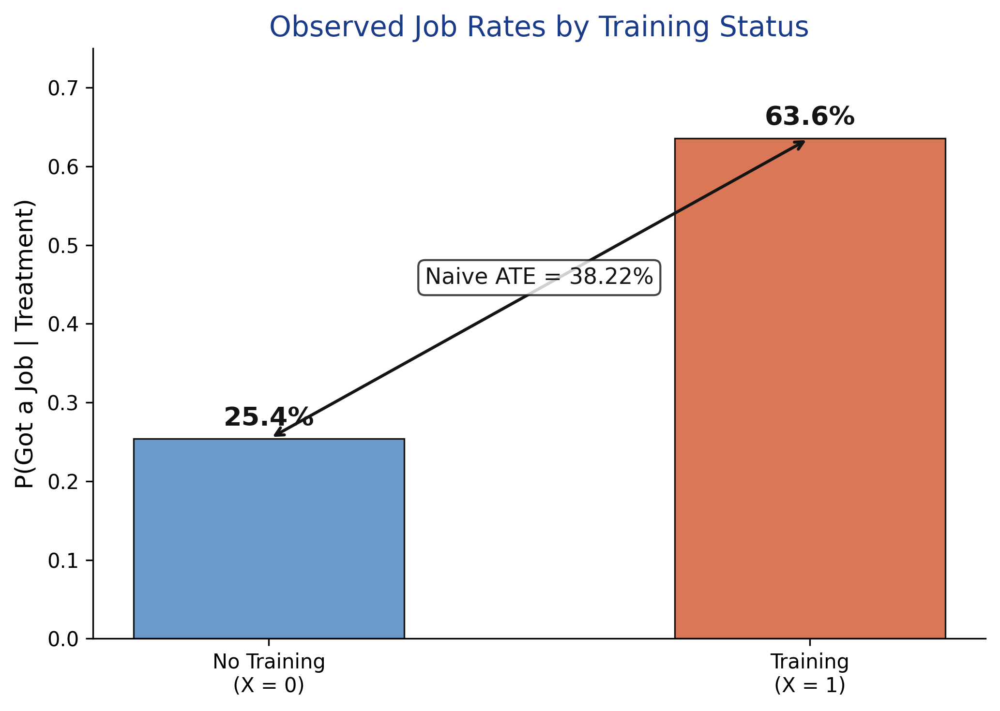
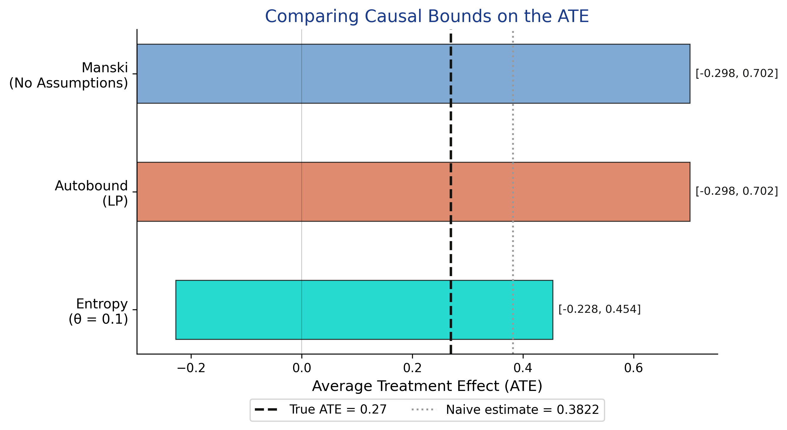
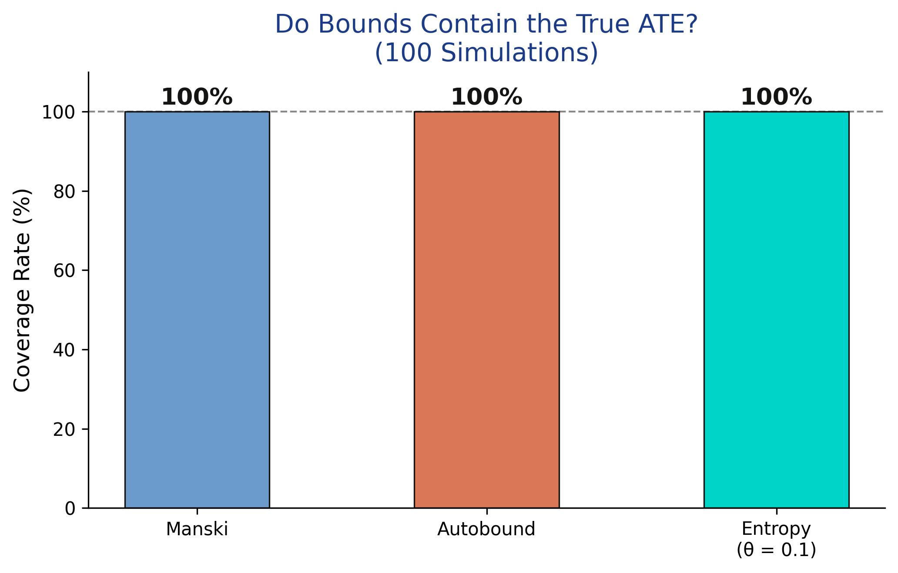
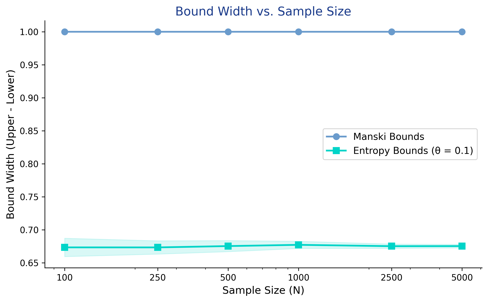

# The Tension {.divider background-color="#d97757"}

[Act I]{.act}

## Trained workers got jobs at 2.5× the rate — but did training cause it?

A simulated study of 1,000 workers: 63.6% of the trained found jobs, only 25.4% of the untrained did.

. . .

But prior work experience — *unmeasured* — pushes the same people into training **and** into jobs. *Which part of that gap is the program?*

::: {.notes}
This is the central problem of observational causal inference: a backdoor path X ← U → Y. Experienced workers (U=1) enroll at 70% vs 30% for the inexperienced, and they get hired more anyway. The raw 38-point gap mixes the training effect with that selection. We cannot condition on U because we never measured it.
:::

## The naive estimate overstates the true effect by 11.2 points {background-color="#141413"}

[+0.1122]{.bignum}

[bias of the naive difference in means (0.3822) vs the true ATE (0.27)]{.bignum-label}

::: {.notes}
Because we simulated the data, we know the truth: E[Y(1)] = 0.59, E[Y(0)] = 0.32, so the true ATE = 0.27. The naive 0.3822 overshoots it by 11.2 percentage points — the signature of upward confounding bias. In a real study we would never see this gap, which is exactly the danger.
:::

## When a confounder is unmeasured, the honest answer is a range, not a number

Point identification: if $x+y=10$ and $y=6$, then $x=4$ — *exactly*.

. . .

Partial identification: if you only know $y\in[4,7]$, then $x\in[3,6]$. You did not pin $x$ down, but you ruled values out.

[Credible uncertainty over incredible certainty.]{.comment}

::: {.notes}
The estimand stays the ATE, E[Y(1)] − E[Y(0)]. What changes is what we ask of the data: not a single value, but the *identified set* — every value consistent with the observed distribution under minimal assumptions. Manski's move: stop assuming the confounder away; bound instead.
:::

## Where we're going

::: {.incremental}
- The lab: a confounded 1,000-worker dataset with a hidden U
- Manski no-assumption bounds — the widest honest interval
- The same bounds, harder: autobound, entropy, Tian–Pearl
- Why more data will *not* save you
:::

# The Investigation {.divider background-color="#6a9bcc"}

[Act II]{.act}

## An unmeasured confounder sits on the backdoor path X ← U → Y

:::: {.columns}
::: {.column width="50%"}
### The data-generating process

- $P(X{=}1)=0.3+0.4\,U$
- $P(Y{=}1)=0.2+0.3\,X+0.4\,U-0.1\,XU$
- $U$ (prior experience) is **never observed**
:::
::: {.column width="50%"}
### Why it breaks point ID

- $U$ raises *both* enrollment and hiring
- the backdoor path $X\leftarrow U\rightarrow Y$ stays open
- we cannot condition on $U$ ⟹ point identification fails
:::
::::

[The backdoor criterion needs $U$; since $U$ is unmeasured, every point estimate is biased by an unknown amount.]{.comment}

::: {.notes}
Re-expression of the post's first Mermaid diagram. The dashed node U feeds arrows into X and Y; X also feeds Y (the effect we want). DoubleML/DoWhy assume this U away — conditional ignorability. Partial identification refuses to.
:::

## The observable gap is 38 points — but it is a confounded gap



::: {.notes}
This is all we get to see in a real study: the two conditional job rates. Trained workers find jobs at more than twice the rate. But the treated group is enriched with experienced workers who would have been hired anyway, so the gap is not the causal effect.
:::

## Manski bounds assume nothing but the law of total probability

$$E[Y(1)] = E[Y\mid X{=}1]\,P(X{=}1) + E[Y(1)\mid X{=}0]\,P(X{=}0)$$

We observe the first term; the counterfactual $E[Y(1)\mid X{=}0]$ is unknown but, for a binary $Y$, lies in $[0,1]$. Plug in the worst and best cases.

[No parametric model, no exclusion restriction — only "the unseen counterfactual is a probability."]{.comment}

::: {.notes}
Like a verdict from eyewitnesses only: we know the outcomes for the groups we saw; for the counterfactual outcomes we never observe, we assume the worst and the best to bracket the truth. The same logic bounds E[Y(0)]. ATE bounds = lowest E[Y(1)] minus highest E[Y(0)], and vice versa.
:::

## Three lines of arithmetic give the worst-case ATE interval

``` {.python code-line-numbers="1-2|4-5|6"}
scenario = BinaryConf(X, Y)          # confounded binary scenario
manski = scenario.ATE.manski()       # closed-form, no assumptions

# manual worst/best case for the unseen counterfactual:
E_Y1 = (P_Y1_X1*P_X1 + 0*P_X0,  P_Y1_X1*P_X1 + 1*P_X0)
ATE_lower, ATE_upper = E_Y1[0] - E_Y0_upper, E_Y1[1] - E_Y0_lower
```

[`CausalBoundingEngine` matches the hand computation exactly — and in under a millisecond.]{.comment}

::: {.notes}
The package's manski() reproduces the manual numbers to four decimals (−0.2980, 0.7020) in ~0.0001 s because the bounds are closed-form: no optimization. The manual block is what is really happening under the hood.
:::

## No-assumption bounds span zero: the sign of the effect is undetermined {background-color="#141413"}

[[−0.30, 0.70]]{.bignum}

[Manski ATE bounds · width exactly 1.0 · the true ATE (0.27) sits inside]{.bignum-label}

::: {.notes}
For a binary outcome the Manski width is 1.0 by construction. The interval [−0.298, 0.702] contains the truth (0.27) but also contains zero — so the data alone cannot tell us whether training helps, hurts, or does nothing. Discouraging, but honest, and these bounds are sharp.
:::

## Linear programming confirms Manski is already sharp — it cannot be beaten

| Method | Lower | Upper | Width |
|---|---:|---:|---:|
| Manski (no assumptions) | −0.2980 | 0.7020 | [1.0000]{.key} |
| Autobound (LP) | −0.2980 | 0.7020 | 1.0000 |

[Autobound solves an optimization and lands on the *same* interval — the worst-case distributions are genuinely valid.]{.comment}

::: {.notes}
Identical bounds is a result, not a failure: it proves no LP trick can tighten the no-assumption interval. Autobound takes 0.30 s vs Manski's 0.0001 s to reach the same place — the price of generality.
:::

## A mild entropy cap on the confounder shrinks the interval by 32%

$$H(U \mid X, Y) \leq \theta$$

Bound how *surprising* the hidden confounder may be. At $\theta = 0.1$ the ATE tightens to $[-0.2279,\ 0.4540]$ — width 0.6819.

[Entropy is a middle ground: more than "nothing" (Manski), less than "no confounders" (DoubleML).]{.comment}

::: {.notes}
H is Shannon entropy — a fair coin is maximally surprising, a two-headed coin has zero entropy. Capping H(U|X,Y) limits how much the confounder can redistribute probability mass. Smaller θ ⟹ stricter ⟹ tighter. The bound still crosses zero, but it now rules out large positive effects.
:::

## All three ATE bounds bracket the truth; only their width differs



::: {.notes}
Walk left to right: the dashed line is the true ATE (0.27); the gray dotted line is the naive 0.3822, visibly biased upward. Every interval contains 0.27, so all three are valid — but only entropy starts to be informative, and even it crosses zero.
:::

## Tian–Pearl bounds answer a sharper question: was training necessary AND sufficient?

$$\text{PNS} = P\big(Y_{X=1}=1 \,\cap\, Y_{X=0}=0\big)$$

PNS is the share of workers who *would* get a job if trained and would *not* if untrained — individual-level causation, not a population average.

[Tian–Pearl bounds: PNS $\in [0.000,\ 0.702]$.]{.comment}

::: {.notes}
The ATE averages over people; PNS asks how many individuals genuinely switched because of training. It matters for legal and medical "but-for" questions. The lower bound of exactly zero means we cannot rule out that training was never the active cause for anyone; the upper bound caps true switchers at 70.2%.
:::

## For PNS the closed form wins; entropy is *weaker* on counterfactual queries

![Tian–Pearl and autobound coincide at $[0.000,\ 0.702]$; entropy (θ=0.1) is *wider* at $[0.000,\ 0.839]$.](../partial_id_pns_bounds.png)

::: {.notes}
For the ATE, entropy tightened Manski by 32%. For PNS it does the opposite — it is wider than Tian–Pearl (0.839 vs 0.702). PNS depends on the joint distribution of potential outcomes, which an entropy cap on U does not pin down well. The numbers in the post's table: Tian–Pearl and autobound 0.7020 wide, entropy 0.8394. Choose the tool to the estimand.
:::

# The Resolution {.divider background-color="#00d4c8"}

[Act III]{.act}

## Every method covers the true ATE in 100 of 100 simulations



::: {.notes}
Coverage is the acid test: across 100 fresh datasets, does the interval contain the true 0.27? It does, every time, for all three methods. For Manski/autobound this is guaranteed; for entropy at θ=0.1 it shows the cap is conservative enough not to exclude the truth.
:::

## More data does NOT narrow these bounds — the width is identification, not noise



::: {.notes}
The most counterintuitive slide. Confidence intervals shrink with N; identification bounds do not. From 100 to 5,000 workers the Manski width never leaves 1.0; entropy stays near 0.68 with only its variance falling. The missing information is U, and more rows of the same variables never recover it.
:::

## "Bounds that span zero are useless." Are they? {background-color="#141413"}

[Objection.]{.objection} If the interval includes zero, you cannot even sign the effect — so why bother?

. . .

[Response.]{.rebuttal} They still rule out the impossible: the ATE *cannot* exceed 0.702, so any "75-point benefit" claim is refuted. And the honesty is the point — the alternative is a precise number that is precisely wrong.

::: {.notes}
Steelman the critique: wide bounds frustrate decision-makers. But partial identification trades false precision for valid range. To narrow it you need *structure* — an instrument, monotone treatment response (training never hurts), or measuring U — not more of the same data. That is an honest research agenda, not a dead end.
:::

## To tighten, add assumptions or data on the confounder — not more rows

:::: {.columns}
::: {.column width="50%"}
### What does NOT help
- collecting more observations
- a bigger N (width is fixed)
- a fancier estimator on the same vars
:::
::: {.column width="50%"}
### What DOES help
- an instrument $Z$ (`BinaryIV`)
- monotone treatment response $Y(1)\ge Y(0)$
- measuring $U$ directly; sensitivity analysis
:::
::::

[The identified set narrows only when you bring new information to bear.]{.comment}

::: {.notes}
Re-expression of the post's decision Mermaid: are all confounders observed? → point ID (DoWhy/DoubleML). No, but an instrument? → IV/2SLS point ID. Neither? → partial identification, compute bounds. Monotonicity alone roughly halves the Manski width.
:::

# Without the confounder, the data give you a range — so report the range, honestly. {.divider background-color="#141413"}

::: {.notes}
The one takeaway. When "no unmeasured confounders" is not credible, partial identification is the disciplined response: state the estimand (the ATE as an identified set), report the bounds, and be explicit that narrowing them takes assumptions or new data — never just a larger sample.
:::
