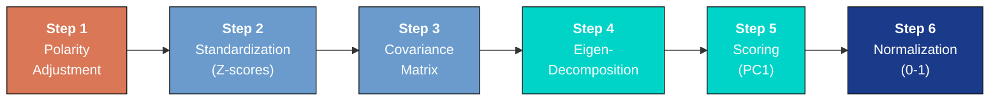
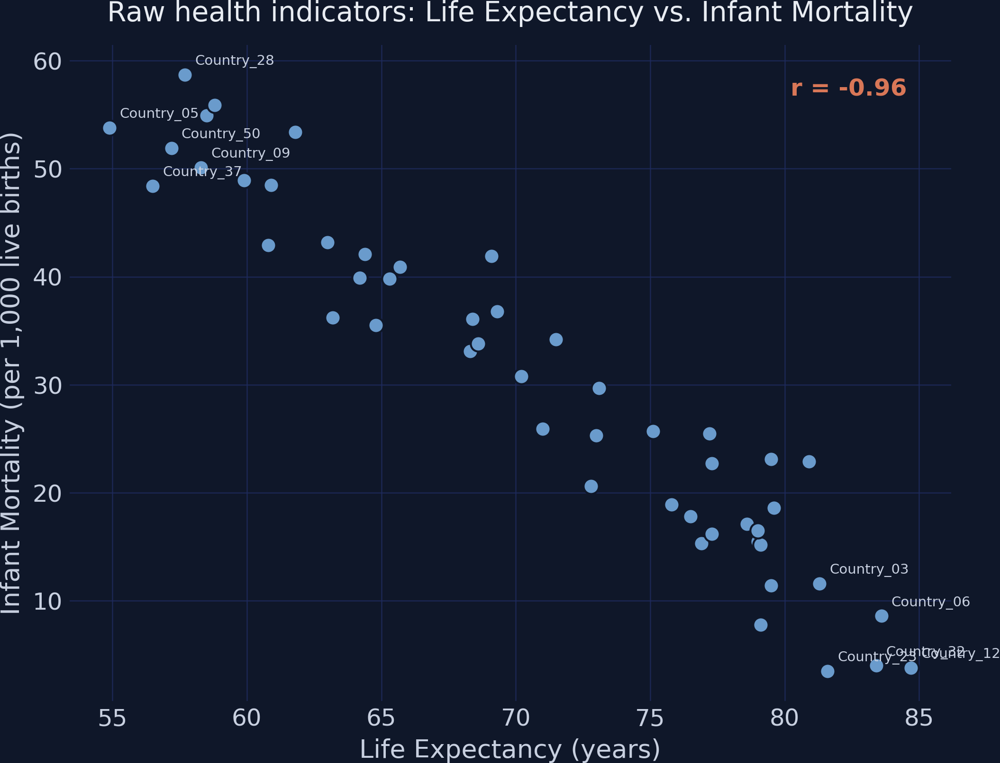
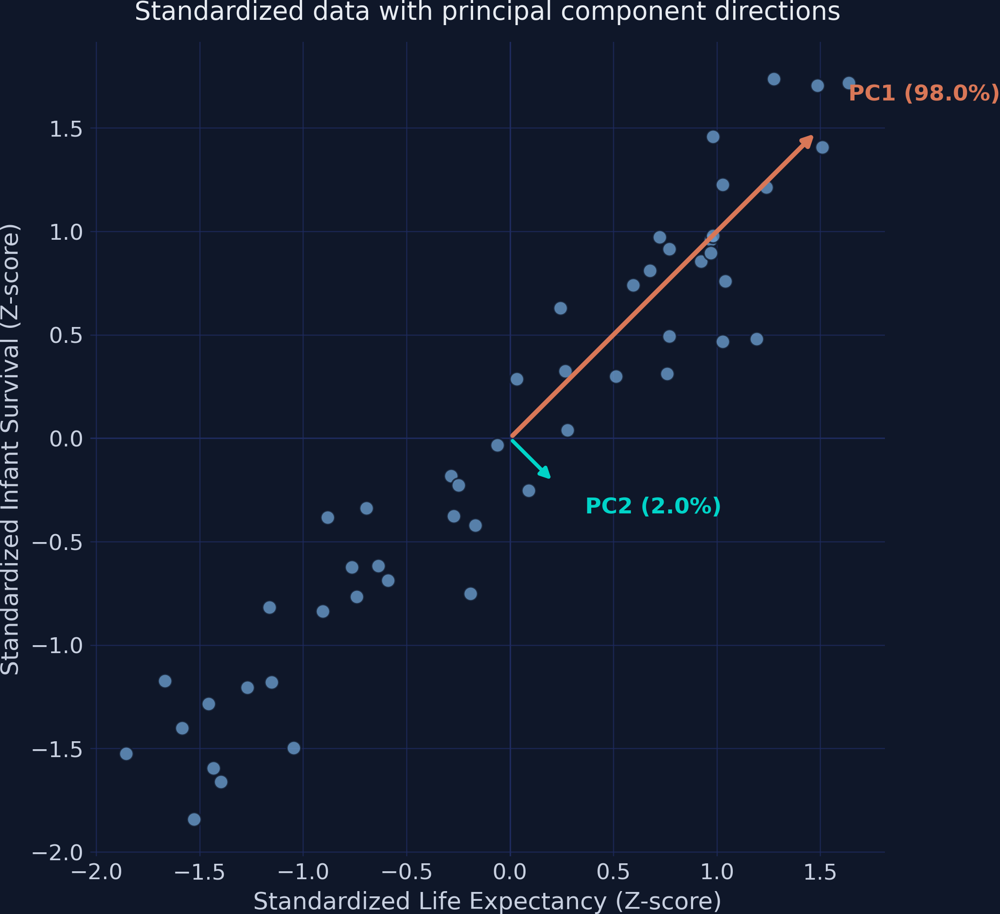
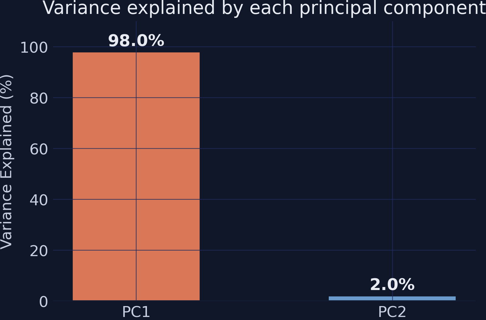
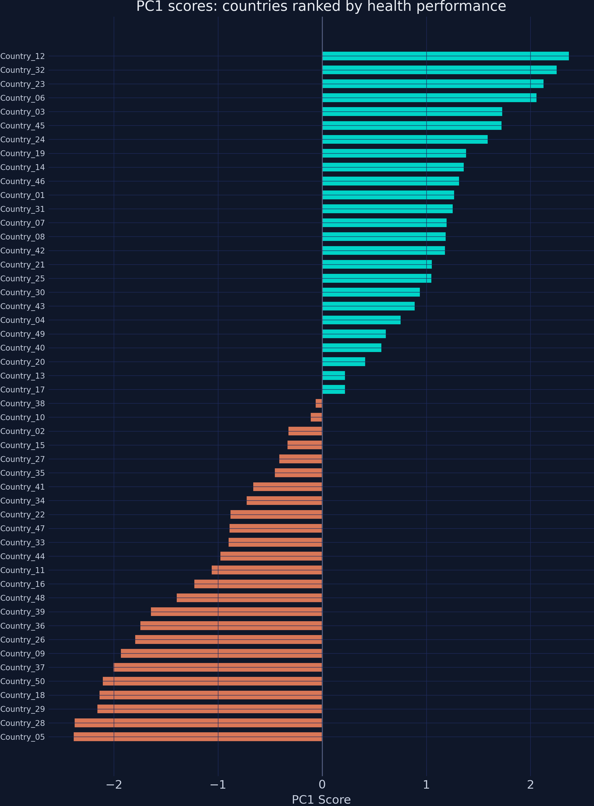
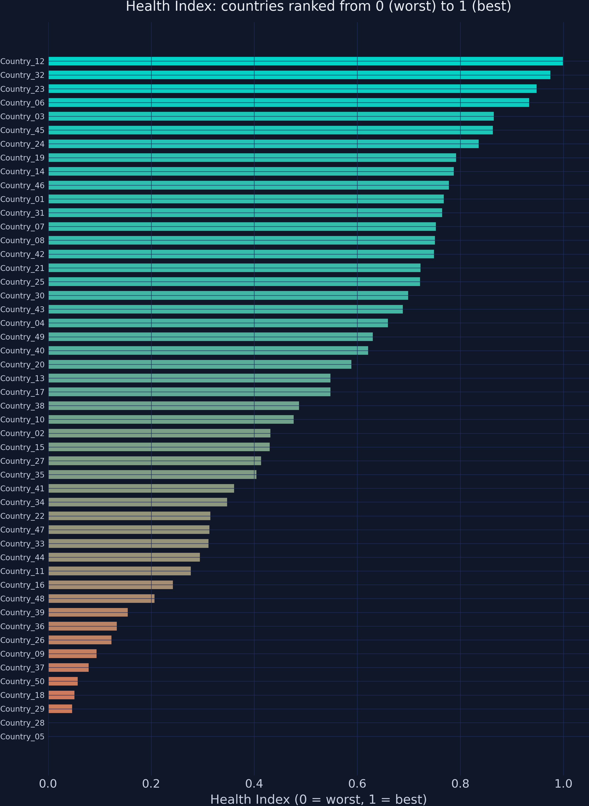
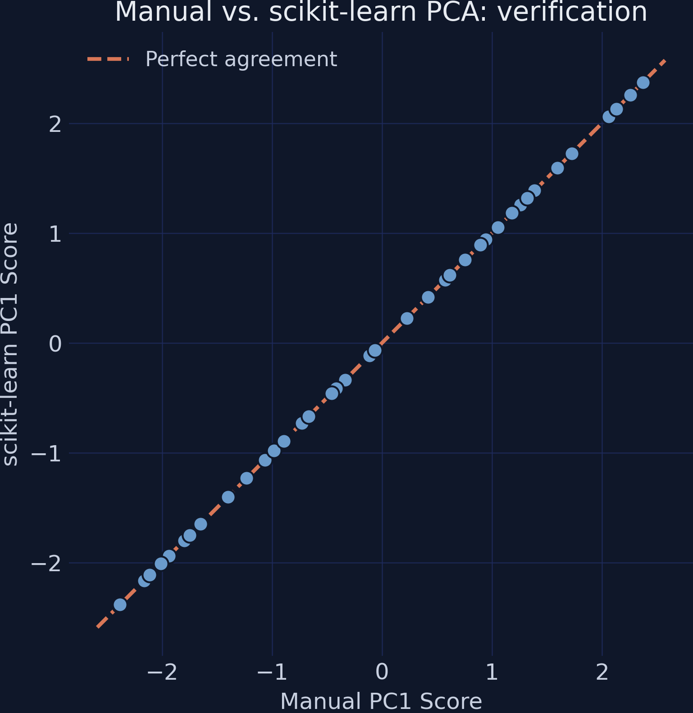

---
authors:
  - admin
categories:
  - Python
  - Tutorial
  - Cross-sectional Data
draft: false
featured: false
date: "2026-03-21T00:00:00Z"
external_link: ""
image:
  caption: ""
  focal_point: Smart
  placement: 3
links:
- icon: google-colab
  icon_pack: ai
  name: "Google Colab"
  url: https://colab.research.google.com/github/cmg777/starter-academic-v501/blob/master/content/post/python_pca/notebook.ipynb
- icon: code
  icon_pack: fas
  name: "Python script"
  url: script.py
slides:
summary: Building a composite Health Index from Life Expectancy and Infant Mortality using manual PCA with simulated data for 50 countries, then verifying against scikit-learn
tags:
- python
- world
title: "Introduction to PCA Analysis for Building Development Indicators"
url_code: ""
url_pdf: ""
url_slides: ""
url_video: ""
toc: true
diagram: true
---

## 1. Overview

In development economics, we rarely measure progress with just one number. To understand a country's health system, you might look at life expectancy, infant mortality, hospital beds per capita, and disease prevalence. But how do you rank 50 countries when you have multiple metrics measured in different units --- years, rates, and raw counts? You cannot simply add them together. You need a single, elegant "Development Index."

**Principal Component Analysis (PCA)** is a statistical technique used for data compression. It takes a dataset with many correlated variables and condenses it into a single composite index while retaining as much of the original information as possible. Think of PCA as finding the hallway in a building that gives you the longest unobstructed view --- the direction where the data is most spread out, and therefore most informative. For visual introductions to the core idea, see [Principal Component Analysis (PCA) Explained Simply](https://youtu.be/_6UjscCJrYE) and [Visualizing Principal Component Analysis (PCA)](https://youtu.be/nEvKduLXFvk). For a hands-on interactive demonstration, try the [Numiqo PCA Lab](https://numiqo.com/lab/pca).

This tutorial builds a simplified Health Index using only two indicators --- Life Expectancy (years) and Infant Mortality (deaths per 1,000 live births) --- for 50 simulated countries. By using simulated data with a known structure, we can verify that PCA recovers the true underlying pattern. The same six-step pipeline scales naturally to 10, 20, or 100 indicators.

**Learning objectives:**

- Understand why polarity adjustment and standardization are prerequisites for PCA
- Compute the covariance matrix and interpret its entries as variable overlap
- Perform eigen-decomposition to extract principal component weights and variance proportions
- Construct a composite index by projecting standardized data onto the first principal component
- Verify manual PCA results against scikit-learn's PCA implementation

## 2. The PCA pipeline

Before diving into the math, it helps to see the full pipeline at a glance. Each of the six steps builds on the previous one and cannot be skipped.



The pipeline transforms raw indicators into a single number that captures the dominant pattern of variation. We start by aligning indicator directions (Step 1), removing unit differences (Step 2), measuring variable overlap (Step 3), finding the optimal weights (Step 4), computing scores (Step 5), and finally rescaling for human readability (Step 6).

## 3. Setup and imports

The analysis relies on [NumPy](https://numpy.org/) for linear algebra, [pandas](https://pandas.pydata.org/) for data management, [matplotlib](https://matplotlib.org/) for visualization, and [scikit-learn](https://scikit-learn.org/) for verification. The `RANDOM_SEED` ensures every reader gets identical results.

```python
import numpy as np
import pandas as pd
import matplotlib.pyplot as plt
from sklearn.preprocessing import StandardScaler
from sklearn.decomposition import PCA

# Reproducibility
RANDOM_SEED = 42

# Site color palette
STEEL_BLUE = "#6a9bcc"
WARM_ORANGE = "#d97757"
NEAR_BLACK = "#141413"
TEAL = "#00d4c8"
```

<details>
<summary>Dark theme figure styling (click to expand)</summary>

```python
# Dark theme palette (consistent with site navbar/dark sections)
DARK_NAVY = "#0f1729"
GRID_LINE = "#1f2b5e"
LIGHT_TEXT = "#c8d0e0"
WHITE_TEXT = "#e8ecf2"

# Plot defaults — minimal, spine-free, dark background
plt.rcParams.update({
    "figure.facecolor": DARK_NAVY,
    "axes.facecolor": DARK_NAVY,
    "axes.edgecolor": DARK_NAVY,
    "axes.linewidth": 0,
    "axes.labelcolor": LIGHT_TEXT,
    "axes.titlecolor": WHITE_TEXT,
    "axes.spines.top": False,
    "axes.spines.right": False,
    "axes.spines.left": False,
    "axes.spines.bottom": False,
    "axes.grid": True,
    "grid.color": GRID_LINE,
    "grid.linewidth": 0.6,
    "grid.alpha": 0.8,
    "xtick.color": LIGHT_TEXT,
    "ytick.color": LIGHT_TEXT,
    "xtick.major.size": 0,
    "ytick.major.size": 0,
    "text.color": WHITE_TEXT,
    "font.size": 12,
    "legend.frameon": False,
    "legend.fontsize": 11,
    "legend.labelcolor": LIGHT_TEXT,
    "figure.edgecolor": DARK_NAVY,
    "savefig.facecolor": DARK_NAVY,
    "savefig.edgecolor": DARK_NAVY,
})
```

</details>

## 4. Simulating health data

We generate data for 50 countries driven by a single latent factor --- `base_health` --- drawn from a uniform distribution. This factor drives both life expectancy (positively) and infant mortality (negatively), mimicking the real-world pattern where healthier countries perform well across multiple indicators simultaneously. Using simulated data lets us verify that PCA recovers this known single-factor structure.

```python
def simulate_health_data(n=50, seed=42):
    """Simulate health indicators for n countries.

    True DGP:
        base_health ~ Uniform(0, 1)  -- latent health capacity
        life_exp    = 55 + 30 * base_health + N(0, 2)  -- range ~55-85
        infant_mort = 60 - 55 * base_health + N(0, 3)  -- range ~2-60
    """
    rng = np.random.default_rng(seed)
    base_health = rng.uniform(0, 1, n)
    life_exp = 55 + 30 * base_health + rng.normal(0, 2, n)
    infant_mort = 60 - 55 * base_health + rng.normal(0, 3, n)
    countries = [f"Country_{i+1:02d}" for i in range(n)]
    return pd.DataFrame({
        "country": countries,
        "life_exp": np.round(life_exp, 1),
        "infant_mort": np.round(infant_mort, 1),
    })

df = simulate_health_data(n=50, seed=RANDOM_SEED)

# Save raw data to CSV (used later in the scikit-learn pipeline)
df.to_csv("health_data.csv", index=False)

print(f"Dataset shape: {df.shape}")
print(f"\nFirst 5 rows:")
print(df.head().to_string(index=False))
print(f"\nDescriptive statistics:")
print(df[["life_exp", "infant_mort"]].describe().round(2).to_string())
print("\nSaved: health_data.csv")
```

```text
Dataset shape: (50, 3)

First 5 rows:
   country  life_exp  infant_mort
Country_01      79.6         18.6
Country_02      68.3         33.1
Country_03      81.3         11.6
Country_04      77.2         25.5
Country_05      54.9         53.8

Descriptive statistics:
       life_exp  infant_mort
count     50.00        50.00
mean      70.72        30.30
std        8.62        15.57
min       54.90         3.50
25%       63.45        17.28
50%       71.25        30.25
75%       78.90        42.05
max       84.70        58.70

Saved: health_data.csv
```

All 50 countries loaded with two health indicators. Life expectancy ranges from 54.9 to 84.7 years with a mean of 70.72, while infant mortality ranges from 3.5 to 58.7 per 1,000 live births with a mean of 30.30. Notice the directional conflict: life expectancy is a "positive" indicator (higher means better health), while infant mortality is a "negative" indicator (higher means worse health). This conflict is precisely what Step 1 will resolve.

## 5. Exploring the raw data

Before transforming the data, let us visualize the raw relationship between the two indicators. The Pearson correlation coefficient ($r$) measures the strength and direction of the linear relationship between two variables, ranging from $-1$ (perfect negative) to $+1$ (perfect positive). If the two indicators are strongly correlated, PCA will be able to compress them effectively into a single index.

```python
raw_corr = df["life_exp"].corr(df["infant_mort"])
print(f"Pearson correlation (LE vs IM): {raw_corr:.4f}")
```

```text
Pearson correlation (LE vs IM): -0.9595
```

```python
fig, ax = plt.subplots(figsize=(8, 6))
fig.patch.set_linewidth(0)

ax.scatter(df["life_exp"], df["infant_mort"],
           color=STEEL_BLUE, edgecolors=DARK_NAVY, s=60, zorder=3)

# Label extreme countries
sorted_df = df.sort_values("life_exp")
label_idx = list(sorted_df.head(5).index) + list(sorted_df.tail(5).index)
for i in label_idx:
    ax.annotate(df.loc[i, "country"],
                (df.loc[i, "life_exp"], df.loc[i, "infant_mort"]),
                fontsize=7, color=LIGHT_TEXT, xytext=(5, 5),
                textcoords="offset points")

ax.set_xlabel("Life Expectancy (years)")
ax.set_ylabel("Infant Mortality (per 1,000 live births)")
ax.set_title("Raw health indicators: Life Expectancy vs. Infant Mortality")
ax.annotate(f"r = {raw_corr:.2f}", xy=(0.95, 0.95), xycoords="axes fraction",
            fontsize=12, color=WARM_ORANGE, fontweight="bold",
            va="top", ha="right")

plt.savefig("pca_raw_scatter.png", dpi=300, bbox_inches="tight",
            facecolor=DARK_NAVY, edgecolor=DARK_NAVY, pad_inches=0)
plt.show()
```



The Pearson correlation is $r = -0.96$, confirming a very strong negative relationship. Countries with high life expectancy almost always have low infant mortality, and vice versa. This means the two indicators are telling essentially the same story about health --- just in opposite directions. This high redundancy is exactly what PCA will exploit to compress two dimensions into one.

## 6. Step 1: Polarity adjustment --- aligning the health goals

**What it is:** Before any math is applied, we must ensure our indicators share the same logical direction. We mathematically invert indicators where "higher" means "worse" so that all variables move in the same positive direction. For our negative indicator (Infant Mortality, or $IM$), we calculate an adjusted value:

$$IM\_i^{*} = -1 \times IM\_i$$

In words, this says: for each country $i$, multiply its infant mortality rate by negative one. After this transformation, a large positive value of $IM^{*}$ means low infant mortality --- a good outcome. Here $IM\_i$ corresponds to the `infant_mort` column, and $IM\_i^{*}$ will be stored as `infant_mort_adj`.

**The application:** Country\_01 has an infant mortality rate of 18.6 deaths per 1,000 live births. Applying the formula: $IM^{*} = -1 \times 18.6 = -18.6$. The raw value of 18.6 becomes $-18.6$ after polarity adjustment. The negative sign encodes "18.6 units of infant survival" --- a positive health signal that can now be combined with Life Expectancy because both variables point in the same direction.

**The Intuition:** Life Expectancy ($LE$) is a "positive" indicator: higher numbers mean better health. Infant Mortality is a "negative" indicator: higher numbers mean worse health. If we feed these into an index as they are, the final score will be contradictory. Imagine comparing exam scores where one professor grades 0--100 (higher is better) and another grades on demerits 0--100 (lower is better). Before averaging, you must flip the demerit scale.

**The Necessity:** We must flip the negative indicator so that "up" always means "better." By multiplying by $-1$, instead of measuring "Infant Mortality," we are effectively measuring "Infant Survival." Now, for both variables, a higher number universally indicates a stronger health system.

```python
df["infant_mort_adj"] = -1 * df["infant_mort"]
adj_corr = df["life_exp"].corr(df["infant_mort_adj"])
print(f"Correlation after polarity adjustment (LE vs -IM): {adj_corr:.4f}")
print(f"\nFirst 5 rows with adjusted IM:")
print(df[["country", "life_exp", "infant_mort", "infant_mort_adj"]].head().to_string(index=False))
```

```text
Correlation after polarity adjustment (LE vs -IM): 0.9595

First 5 rows with adjusted IM:
   country  life_exp  infant_mort  infant_mort_adj
Country_01      79.6         18.6            -18.6
Country_02      68.3         33.1            -33.1
Country_03      81.3         11.6            -11.6
Country_04      77.2         25.5            -25.5
Country_05      54.9         53.8            -53.8
```

The correlation has flipped from $-0.96$ to $+0.96$. Both indicators now point in the same direction: higher values mean better health. The magnitude of the correlation is unchanged --- the relationship is identical, just properly aligned. With this alignment in place, we can proceed to standardize the variables.

## 7. Step 2: Standardization --- comparing apples to apples

**What it is:** We transform our raw data into Z-scores. For each value, we subtract the sample mean ($\mu$) and divide by the standard deviation ($\sigma$):

$$Z\_{ij} = \frac{X\_{ij} - \bar{X}\_j}{\sigma\_j}$$

In words, this says: for country $i$ and variable $j$, subtract the variable's mean $\bar{X}\_j$ and divide by its standard deviation $\sigma\_j$. The result is a unitless score that tells us how many standard deviations above or below average the country is. Here $X\_{ij}$ is the raw value (e.g., `life_exp` or `infant_mort_adj`), $\bar{X}\_j$ is computed by `np.mean()`, and $\sigma\_j$ is computed by `np.std(ddof=0)`.

**The application:** Country\_01 has Life Expectancy = 79.6 and adjusted Infant Mortality = $-18.6$. Applying the formula: $Z\_{LE} = (79.6 - 70.72) / 8.53 = 8.88 / 8.53 = 1.0402$ and $Z\_{IM} = (-18.6 - (-30.30)) / 15.42 = 11.70 / 15.42 = 0.7587$. Country\_01 is 1.04 standard deviations above average in life expectancy and 0.76 standard deviations above average in infant survival. Both positive Z-scores confirm it is a healthier-than-average country on both indicators. These two numbers are now directly comparable --- 1.04 and 0.76 are both measured in the same unit (standard deviations), even though the original variables were in years and rates.

**The Intuition:** Life Expectancy is measured in years (range 54.9--84.7). Infant Mortality is measured as a rate per 1,000 (range 3.5--58.7). If we mix these directly, the index will naturally be dominated by Infant Mortality simply because its values have a wider physical spread.

**The Necessity:** We standardize both variables to have a mean of $0$ and a standard deviation of $1$. We are no longer looking at "years" or "rates." We are looking at "standard deviations from the global average." Both indicators now have equal footing.

```python
# Manual standardization
le_mean = df["life_exp"].mean()
le_std = df["life_exp"].std(ddof=0)
im_mean = df["infant_mort_adj"].mean()
im_std = df["infant_mort_adj"].std(ddof=0)

df["z_le"] = (df["life_exp"] - le_mean) / le_std
df["z_im"] = (df["infant_mort_adj"] - im_mean) / im_std

print(f"Life Expectancy   -- mean: {le_mean:.2f}, std: {le_std:.2f}")
print(f"Infant Mort (adj) -- mean: {im_mean:.2f}, std: {im_std:.2f}")
print(f"\nZ-score statistics:")
print(f"  z_le  mean: {df['z_le'].mean():.6f}, std: {df['z_le'].std(ddof=0):.6f}")
print(f"  z_im  mean: {df['z_im'].mean():.6f}, std: {df['z_im'].std(ddof=0):.6f}")

# Verify with sklearn
scaler = StandardScaler()
Z_sklearn = scaler.fit_transform(df[["life_exp", "infant_mort_adj"]])
max_diff = np.max(np.abs(Z_sklearn - df[["z_le", "z_im"]].values))
print(f"\nMax difference from sklearn StandardScaler: {max_diff:.2e}")
```

```text
Life Expectancy   -- mean: 70.72, std: 8.53
Infant Mort (adj) -- mean: -30.30, std: 15.42

Z-score statistics:
  z_le  mean: 0.000000, std: 1.000000
  z_im  mean: 0.000000, std: 1.000000

Max difference from sklearn StandardScaler: 0.00e+00
```

Both Z-scores now have a mean of exactly 0 and a standard deviation of exactly 1, confirmed by the zero-difference check against [StandardScaler()](https://scikit-learn.org/stable/modules/generated/sklearn.preprocessing.StandardScaler.html). Note that `describe()` in Section 4 reported `std = 8.62` for life expectancy, while here we get `8.53`. The difference is the denominator: pandas' `describe()` divides by $n - 1$ (sample standard deviation, `ddof=1`), while `StandardScaler` and our manual formula divide by $n$ (population standard deviation, `ddof=0`). We use `ddof=0` because PCA treats the dataset as the full population being analyzed, not a sample from a larger population. A country that is 2 standard deviations above average in life expectancy is now directly comparable to one that is 2 standard deviations above average in (adjusted) infant mortality. The unit problem is solved, and we can now measure how the two variables move together.

## 8. Step 3: The covariance matrix --- mapping the overlap

**What it is:** We calculate the covariance matrix to measure how the two standardized variables move together. For two variables, this forms a $2 \times 2$ matrix ($\Sigma$). Because our data is standardized, the covariance between them is simply their correlation ($r$):

$$\Sigma = \frac{1}{n} Z^T Z = \begin{pmatrix} 1 & r \\\\ r & 1 \end{pmatrix}$$

In words, this says: the covariance matrix $\Sigma$ of standardized data has 1s on the diagonal (each variable has unit variance after standardization) and the correlation $r$ on the off-diagonal. With two variables, PCA only needs to decompose this single $2 \times 2$ matrix.

**The application:** Plugging in our standardized data, the resulting matrix has diagonal entries of 1.0000 (guaranteed by standardization --- each variable has unit variance) and an off-diagonal of 0.9595 (the correlation $r$). This off-diagonal value means that when a country's standardized life expectancy increases by 1 standard deviation, its standardized infant survival tends to increase by 0.96 standard deviations as well. The two variables move almost in lockstep, confirming heavy redundancy that PCA can exploit.

**The Intuition:** In the real world, these two indicators are heavily correlated. A country with high life expectancy almost certainly has high infant survival. They are essentially telling us the same story about the country's healthcare system.

**The Necessity:** The covariance matrix measures exactly how strong this overlap is. It tells the PCA algorithm mathematically, "These two variables share a high amount of redundant information. You can safely compress them into one variable without losing the big picture."

```python
Z = df[["z_le", "z_im"]].values
cov_matrix = np.cov(Z.T, ddof=0)
print(f"Covariance matrix (2x2):")
print(f"  [{cov_matrix[0, 0]:.4f}  {cov_matrix[0, 1]:.4f}]")
print(f"  [{cov_matrix[1, 0]:.4f}  {cov_matrix[1, 1]:.4f}]")
print(f"\nOff-diagonal (correlation): {cov_matrix[0, 1]:.4f}")
```

```text
Covariance matrix (2x2):
  [1.0000  0.9595]
  [0.9595  1.0000]

Off-diagonal (correlation): 0.9595
```

The diagonal entries are exactly 1.0 (unit variance, as expected after standardization) and the off-diagonal is 0.9595 --- the same correlation we computed earlier. This means 96% of the movement in one variable is mirrored by the other. The covariance matrix has now quantified the overlap, and eigen-decomposition will use this information to find the optimal compression axis.

## 9. Step 4: Eigen-decomposition --- finding the optimal direction

This is the mathematical core, where we find our new, compressed index. It introduces two new concepts --- **eigenvectors** and **eigenvalues** --- that are central to how PCA works.

**What it is:** We decompose the covariance matrix $\Sigma$ into two outputs by solving the equation $\Sigma \mathbf{v} = \lambda \mathbf{v}$:

- An **eigenvector** ($\mathbf{v}$) is a direction in the data space. For our two health indicators, each eigenvector is a pair of numbers $[w\_1, w\_2]$ that defines a direction --- like a compass heading through the scatter plot of countries. PCA finds the direction along which the data is most spread out. The components of this eigenvector become the **weights** for combining our indicators into a single index. A $2 \times 2$ matrix always produces exactly two eigenvectors, perpendicular to each other.

- An **eigenvalue** ($\lambda$) is a number that tells us how much variance --- how much "spread" --- the data has along its corresponding eigenvector direction. A large eigenvalue means the countries are widely dispersed in that direction (lots of information), while a small eigenvalue means they are tightly clustered (little information). The eigenvalues always sum to the total number of variables (in our case, 2).

**Why are they useful for PCA?** Together, eigenvectors and eigenvalues answer two questions at once. The eigenvector with the **largest** eigenvalue identifies the single best direction to project our data --- the direction that captures the most variation across countries. Its components tell us exactly how much weight to give each indicator in our composite index. The ratio of the largest eigenvalue to the total tells us what percentage of the original information our single-number index retains.

**The application:** For a $2 \times 2$ correlation matrix, the eigenvalues have an elegant closed-form solution: $\lambda\_1 = 1 + r$ and $\lambda\_2 = 1 - r$. With our correlation of $r = 0.9595$: $\lambda\_1 = 1 + 0.9595 = 1.9595$ and $\lambda\_2 = 1 - 0.9595 = 0.0405$. The variance explained by PC1 is $1.9595 / 2.0000 = 97.97\\%$. This reveals a direct link between correlation strength and PCA compression power. Because $r = 0.96$, the first eigenvalue absorbs nearly all the variance, leaving only $\lambda\_2 = 0.04$ for PC2. The higher the correlation between our health indicators, the more variance PC1 captures. At the extreme, if the correlation were zero, both eigenvalues would equal 1.0 and PCA would offer no compression advantage at all.

**The Intuition:** Imagine plotting all 50 countries on a 2D graph --- Standardized Life Expectancy on the X-axis, Standardized Infant Survival on the Y-axis. The countries form a narrow, elongated cloud stretching diagonally from the lower-left (unhealthy countries) to the upper-right (healthy countries). The first eigenvector is a straight line drawn through the long axis of this cloud --- the direction where countries differ the most. Its eigenvalue measures how stretched the cloud is along that line. If you stood at the center of the cloud and looked down the first eigenvector, you would see maximum separation between countries. Look down the second eigenvector (perpendicular), and the countries would appear tightly bunched --- almost no useful information in that direction. This is why we keep the first eigenvector and discard the second: it captures nearly all the meaningful variation.

**The Necessity:** Eigen-decomposition removes human bias. Instead of randomly guessing how much weight to give Life Expectancy versus Infant Mortality, the math calculates the absolute optimal weights to capture the maximum amount of overlapping information. The algorithm finds the single direction that best summarizes 50 countries' health performance --- no subjective judgment required.

```python
eigenvalues, eigenvectors = np.linalg.eigh(cov_matrix)

# Sort in descending order (eigh returns ascending)
idx = np.argsort(eigenvalues)[::-1]
eigenvalues = eigenvalues[idx]
eigenvectors = eigenvectors[:, idx]

# Sign convention: first weight positive
if eigenvectors[0, 0] < 0:
    eigenvectors[:, 0] *= -1

var_explained = eigenvalues / eigenvalues.sum() * 100

print(f"Eigenvalues:  [{eigenvalues[0]:.4f}, {eigenvalues[1]:.4f}]")
print(f"Sum of eigenvalues: {eigenvalues.sum():.4f}")
print(f"\nEigenvector (PC1): [{eigenvectors[0, 0]:.4f}, {eigenvectors[1, 0]:.4f}]")
print(f"Eigenvector (PC2): [{eigenvectors[0, 1]:.4f}, {eigenvectors[1, 1]:.4f}]")
print(f"\nVariance explained:")
print(f"  PC1: {var_explained[0]:.2f}%")
print(f"  PC2: {var_explained[1]:.2f}%")
```

```text
Eigenvalues:  [1.9595, 0.0405]
Sum of eigenvalues: 2.0000

Eigenvector (PC1): [0.7071, 0.7071]
Eigenvector (PC2): [0.7071, -0.7071]

Variance explained:
  PC1: 97.97%
  PC2: 2.03%
```

The first eigenvalue is 1.9595 and the second is just 0.0405, summing to 2.0 (the number of variables). PC1 captures 97.97% of all variance in the data --- nearly everything. The eigenvector weights are both 0.7071 ($\approx 1/\sqrt{2}$), meaning both variables contribute equally to PC1. This equal weighting is not a coincidence --- it is a mathematical certainty whenever PCA is applied to exactly two standardized variables. A $2 \times 2$ correlation matrix always has eigenvectors $[1/\sqrt{2}, \\; 1/\sqrt{2}]$ and $[1/\sqrt{2}, \\; -1/\sqrt{2}]$, regardless of how strong the correlation is. With three or more variables, the weights would generally differ, giving more influence to variables that contribute unique information.

### 9.1 Visualizing the principal components

```python
fig, ax = plt.subplots(figsize=(8, 8))
fig.patch.set_linewidth(0)

ax.scatter(Z[:, 0], Z[:, 1], color=STEEL_BLUE, edgecolors=DARK_NAVY,
           s=60, zorder=3, alpha=0.8)

# Eigenvector arrows scaled by sqrt(eigenvalue) so length reflects variance
vis = 1.5  # visibility multiplier
scale_pc1 = np.sqrt(eigenvalues[0]) * vis
scale_pc2 = np.sqrt(eigenvalues[1]) * vis
ax.annotate("", xy=(eigenvectors[0, 0] * scale_pc1, eigenvectors[1, 0] * scale_pc1),
            xytext=(0, 0),
            arrowprops=dict(arrowstyle="-|>", color=WARM_ORANGE, lw=2.5))
ax.annotate("", xy=(eigenvectors[0, 1] * scale_pc2, eigenvectors[1, 1] * scale_pc2),
            xytext=(0, 0),
            arrowprops=dict(arrowstyle="-|>", color=TEAL, lw=2.0))

ax.text(eigenvectors[0, 0] * scale_pc1 + 0.15, eigenvectors[1, 0] * scale_pc1 + 0.15,
        f"PC1 ({var_explained[0]:.1f}%)", color=WARM_ORANGE, fontsize=12,
        fontweight="bold")
ax.text(eigenvectors[0, 1] * scale_pc2 + 0.15, eigenvectors[1, 1] * scale_pc2 - 0.15,
        f"PC2 ({var_explained[1]:.1f}%)", color=TEAL, fontsize=12,
        fontweight="bold")

ax.axhline(0, color=GRID_LINE, linewidth=0.8, zorder=1)
ax.axvline(0, color=GRID_LINE, linewidth=0.8, zorder=1)
ax.set_xlabel("Standardized Life Expectancy (Z-score)")
ax.set_ylabel("Standardized Infant Survival (Z-score)")
ax.set_title("Standardized data with principal component directions")
ax.set_aspect("equal")

plt.savefig("pca_standardized_eigenvectors.png", dpi=300, bbox_inches="tight",
            facecolor=DARK_NAVY, edgecolor=DARK_NAVY, pad_inches=0)
plt.show()
```



The orange PC1 arrow points along the diagonal --- the direction of maximum spread through the narrow, elongated data cloud. Because both weights are positive and equal (0.7071 each), PC1 essentially averages the two standardized indicators. The teal PC2 arrow is perpendicular and captures only the small residual variation (2.03%) not explained by PC1.

### 9.2 Variance explained

```python
fig, ax = plt.subplots(figsize=(6, 4))
fig.patch.set_linewidth(0)

bars = ax.bar(["PC1", "PC2"], var_explained,
              color=[WARM_ORANGE, STEEL_BLUE],
              edgecolor=DARK_NAVY, width=0.5)

for bar, val in zip(bars, var_explained):
    ax.text(bar.get_x() + bar.get_width() / 2, bar.get_height() + 1,
            f"{val:.1f}%", ha="center", va="bottom", fontsize=13,
            fontweight="bold", color=WHITE_TEXT)

ax.set_ylabel("Variance Explained (%)")
ax.set_title("Variance explained by each principal component")
ax.set_ylim(0, 110)

plt.savefig("pca_variance_explained.png", dpi=300, bbox_inches="tight",
            facecolor=DARK_NAVY, edgecolor=DARK_NAVY, pad_inches=0)
plt.show()
```



PC1 alone captures 98.0% of all variation, meaning a single number retains almost all the information in the original two variables. The remaining 2.0% on PC2 is mostly noise from the simulation. This extreme dominance confirms that the two health indicators are largely redundant --- an ideal scenario for PCA compression. With the optimal weights in hand, we can now compute each country's score.

## 10. Step 5: Scoring --- building the index

Step 4 produced the eigenvector $[0.7071, \\; 0.7071]$. These two numbers are the weights $w\_1$ and $w\_2$ --- the recipe for building our index. The first component ($w\_1 = 0.7071$) multiplies standardized Life Expectancy, and the second ($w\_2 = 0.7071$) multiplies standardized Infant Survival. The eigenvector itself IS the formula for combining the variables.

**What it is:** We multiply each country's standardized data by the weights from our eigenvector to calculate their final Principal Component 1 ($PC1$) score:

$$PC1\_i = (w\_1 \times Z\_{i,LE}) + (w\_2 \times Z\_{i,IM})$$

In words, this says: for country $i$, the PC1 score is $w\_1$ times its standardized life expectancy plus $w\_2$ times its standardized (adjusted) infant mortality. Here $w\_1$ and $w\_2$ are the eigenvector components from Step 4, $Z\_{i,LE}$ is `z_le`, and $Z\_{i,IM}$ is `z_im`.

**Why are the weights equal?** As explained in Step 4, equal weights ($w\_1 = w\_2 = 1/\sqrt{2}$) are a mathematical certainty in the two-variable standardized case --- they hold for any correlation value $r$. Because both weights are identical, the PC1 score is equivalent to a simple average of the two Z-scores (scaled by $\sqrt{2}$). In practice, this means PCA adds no weighting advantage over a naive average when you have exactly two standardized indicators. The real power of PCA emerges with three or more variables, where the algorithm discovers unequal weights that reflect each variable's unique contribution.

**The application:** Country\_01's Z-scores from Step 2 were $Z\_{LE} = 1.0402$ and $Z\_{IM} = 0.7587$. Applying the formula: $PC1 = 0.7071 \times 1.0402 + 0.7071 \times 0.7587 = 0.7355 + 0.5365 = 1.2720$. Country\_01's PC1 score of 1.27 is positive and well above the mean of 0, placing it in the healthier half of the sample. The contribution from life expectancy (0.7355) is slightly larger than from infant survival (0.5365), reflecting the fact that Country\_01 is further above average in life expectancy ($Z = 1.04$) than in infant survival ($Z = 0.76$).

**The Intuition:** We take every country's dot on our 2D graph and project it squarely onto that single diagonal line. The position of the country along that line is its new, single Health Score.

**The Necessity:** We have successfully collapsed a 2D matrix into a 1D number line. Two variables have officially become one composite index.

```python
w1 = eigenvectors[0, 0]
w2 = eigenvectors[1, 0]
df["pc1"] = w1 * df["z_le"] + w2 * df["z_im"]

print(f"Eigenvector weights: w1 = {w1:.4f}, w2 = {w2:.4f}")
print(f"\nPC1 score statistics:")
print(f"  Mean:  {df['pc1'].mean():.4f}")
print(f"  Std:   {df['pc1'].std(ddof=0):.4f}")
print(f"  Min:   {df['pc1'].min():.4f}")
print(f"  Max:   {df['pc1'].max():.4f}")

print(f"\nTop 5 countries (highest PC1):")
print(df.nlargest(5, "pc1")[["country", "life_exp", "infant_mort", "pc1"]]
      .to_string(index=False))
print(f"\nBottom 5 countries (lowest PC1):")
print(df.nsmallest(5, "pc1")[["country", "life_exp", "infant_mort", "pc1"]]
      .to_string(index=False))
```

```text
Eigenvector weights: w1 = 0.7071, w2 = 0.7071

PC1 score statistics:
  Mean:  0.0000
  Std:   1.3998
  Min:   -2.3892
  Max:   2.3734

Top 5 countries (highest PC1):
   country  life_exp  infant_mort      pc1
Country_12      84.7          3.8 2.373421
Country_32      83.4          4.0 2.256521
Country_23      81.6          3.5 2.130292
Country_06      83.6          8.6 2.062127
Country_03      81.3         11.6 1.733944

Bottom 5 countries (lowest PC1):
   country  life_exp  infant_mort       pc1
Country_05      54.9         53.8 -2.389155
Country_28      57.7         58.7 -2.381854
Country_29      58.8         55.9 -2.162285
Country_18      58.5         54.9 -2.141282
Country_50      57.2         51.9 -2.111422
```

PC1 scores range from $-2.39$ (Country\_05) to $+2.37$ (Country\_12). The top-scoring countries combine high life expectancy (81--85 years) with very low infant mortality (3.5--8.6 per 1,000), while the bottom-scoring countries show the opposite pattern (54.9--58.8 years, 48--59 per 1,000). The mean of 0.0 confirms that PC1 is centered, as expected from standardized inputs.

```python
df_sorted = df.sort_values("pc1", ascending=True)

fig, ax = plt.subplots(figsize=(10, 14))
fig.patch.set_linewidth(0)

colors = [TEAL if v >= 0 else WARM_ORANGE for v in df_sorted["pc1"]]
ax.barh(range(len(df_sorted)), df_sorted["pc1"], color=colors,
        edgecolor=DARK_NAVY, height=0.7)
ax.set_yticks(range(len(df_sorted)))
ax.set_yticklabels(df_sorted["country"], fontsize=8)
ax.axvline(0, color=LIGHT_TEXT, linewidth=0.8, zorder=1)
ax.set_xlabel("PC1 Score")
ax.set_title("PC1 scores: countries ranked by health performance")

plt.savefig("pca_pc1_scores.png", dpi=300, bbox_inches="tight",
            facecolor=DARK_NAVY, edgecolor=DARK_NAVY, pad_inches=0)
plt.show()
```



The bar chart reveals a roughly symmetric distribution of PC1 scores around zero, with the healthiest countries (teal bars) on the right and the least healthy (orange bars) on the left. However, the raw PC1 scores include negative numbers --- a format that is hard to communicate in policy reports. The next step normalizes these scores to a 0--1 scale.

## 11. Step 6: Normalization --- making it human-readable

**What it is:** We apply Min-Max scaling to compress the $PC1$ scores into a range between 0 and 1. Let $\min(PC1)$ be the lowest score in the sample, and $\max(PC1)$ be the highest:

$$HI\_i = \frac{PC1\_i - PC1\_{min}}{PC1\_{max} - PC1\_{min}}$$

In words, this says: subtract the minimum PC1 score and divide by the range. The country with the lowest PC1 score gets $HI = 0$ and the country with the highest gets $HI = 1$.

**The application:** Country\_01's PC1 score from Step 5 is 1.2720, while the sample minimum is $-2.3892$ and the maximum is $2.3734$. Applying the formula: $HI = (1.2720 - (-2.3892)) / (2.3734 - (-2.3892)) = 3.6612 / 4.7626 = 0.7687$. Country\_01's Health Index of 0.77 means it performs better than roughly 77% of the scale defined by the worst-performing country (0.00) and the best-performing country (1.00). A policymaker can immediately understand this number without knowing anything about Z-scores or eigenvectors.

**The Intuition:** Because we standardized the data earlier, our $PC1$ scores have negative numbers (e.g., $-2.39$). You cannot easily publish a report saying a country has a health score of negative 2.39 --- it confuses policymakers and the public.

**The Necessity:** Normalization forces the absolute lowest scoring country to equal $0$, and the highest scoring country to equal $1$. Everyone else scales proportionally in between. The result is a highly rigorous, purely data-driven index that is instantly understandable.

```python
pc1_min = df["pc1"].min()
pc1_max = df["pc1"].max()
df["health_index"] = (df["pc1"] - pc1_min) / (pc1_max - pc1_min)

print(f"PC1 range: [{pc1_min:.4f}, {pc1_max:.4f}]")
print(f"\nHealth Index statistics:")
print(f"  Mean:   {df['health_index'].mean():.4f}")
print(f"  Median: {df['health_index'].median():.4f}")
print(f"  Std:    {df['health_index'].std(ddof=0):.4f}")

print(f"\nTop 10 countries:")
print(df.nlargest(10, "health_index")[
    ["country", "life_exp", "infant_mort", "health_index"]
].to_string(index=False))

print(f"\nBottom 10 countries:")
print(df.nsmallest(10, "health_index")[
    ["country", "life_exp", "infant_mort", "health_index"]
].to_string(index=False))
```

```text
PC1 range: [-2.3892, 2.3734]

Health Index statistics:
  Mean:   0.5017
  Median: 0.5182
  Std:    0.2939

Top 10 countries:
   country  life_exp  infant_mort  health_index
Country_12      84.7          3.8      1.000000
Country_32      83.4          4.0      0.975454
Country_23      81.6          3.5      0.948950
Country_06      83.6          8.6      0.934637
Country_03      81.3         11.6      0.865729
Country_45      79.1          7.8      0.864043
Country_24      79.5         11.4      0.836335
Country_19      79.1         15.2      0.792782
Country_14      79.0         15.5      0.788153
Country_46      79.0         16.5      0.778523

Bottom 10 countries:
   country  life_exp  infant_mort  health_index
Country_05      54.9         53.8      0.000000
Country_28      57.7         58.7      0.001533
Country_29      58.8         55.9      0.047636
Country_18      58.5         54.9      0.052046
Country_50      57.2         51.9      0.058316
Country_37      56.5         48.4      0.079840
Country_09      58.3         50.1      0.094789
Country_26      61.8         53.4      0.123910
Country_36      59.9         48.9      0.134184
Country_39      60.9         48.5      0.155436
```

The Health Index has a mean of 0.50 and a median of 0.52, indicating a roughly symmetric distribution. Country\_12 leads with a perfect score of 1.00 (life expectancy 84.7 years, infant mortality 3.8), while Country\_05 anchors the bottom at 0.00 (54.9 years, 53.8 per 1,000). The gap between the top 10 (all above 0.78) and the bottom 10 (all below 0.16) reveals a stark divide in health outcomes across the sample.

```python
df_sorted_hi = df.sort_values("health_index", ascending=True)

fig, ax = plt.subplots(figsize=(10, 14))
fig.patch.set_linewidth(0)

# Gradient from warm orange (low) to teal (high)
cmap_colors = []
for val in df_sorted_hi["health_index"]:
    r = int(0xd9 + val * (0x00 - 0xd9))
    g = int(0x77 + val * (0xd4 - 0x77))
    b = int(0x57 + val * (0xc8 - 0x57))
    cmap_colors.append(f"#{r:02x}{g:02x}{b:02x}")

ax.barh(range(len(df_sorted_hi)), df_sorted_hi["health_index"],
        color=cmap_colors, edgecolor=DARK_NAVY, height=0.7)
ax.set_yticks(range(len(df_sorted_hi)))
ax.set_yticklabels(df_sorted_hi["country"], fontsize=8)
ax.set_xlabel("Health Index (0 = worst, 1 = best)")
ax.set_title("Health Index: countries ranked from 0 (worst) to 1 (best)")
ax.set_xlim(0, 1.05)

plt.savefig("pca_health_index.png", dpi=300, bbox_inches="tight",
            facecolor=DARK_NAVY, edgecolor=DARK_NAVY, pad_inches=0)
plt.show()
```



The gradient-colored bar chart makes the health divide visually immediate. Countries cluster into three rough groups: a high-performing cluster above 0.75 (warm teal), a middle group between 0.25 and 0.75, and a struggling cluster below 0.25 (warm orange). The bottom 10 countries all have Health Index values below 0.16, suggesting systemic health challenges that span both longevity and infant survival. Country\_05 and Country\_28 appear to have no bar at all --- this is not missing data. Country\_05 has a Health Index of exactly 0.00 because it is the worst performer in the sample and Min-Max normalization maps the minimum to zero by definition. Country\_28 has an index of just 0.0015, so close to zero that its bar is invisible at this scale. Both countries have low life expectancy (54.9 and 57.7 years) combined with high infant mortality (53.8 and 58.7 per 1,000), placing them at the extreme low end of the health spectrum.

## 12. Replicating the analysis with scikit-learn

Now that we understand every step, scikit-learn can do the entire pipeline --- from raw CSV to final Health Index --- in a single, compact script. This section presents the automated pipeline and then compares its results against our manual implementation.

### 12.1 A PCA pipeline with scikit-learn

The code block below is designed to be **reusable**: by changing only the CSV file path, the column names, and the list of negative indicators, you can apply this same pipeline to any dataset.

```python
# ── Full PCA pipeline with scikit-learn ──────────────────────────

import pandas as pd
import numpy as np
from sklearn.preprocessing import StandardScaler
from sklearn.decomposition import PCA

# ── Configuration (change these for your own dataset) ────────────
CSV_FILE = "https://raw.githubusercontent.com/cmg777/starter-academic-v501/master/content/post/python_pca/health_data.csv"
ID_COL = "country"                       # Row identifier column
POSITIVE_COLS = ["life_exp"]             # Higher = better
NEGATIVE_COLS = ["infant_mort"]          # Higher = worse (will be flipped)

# Step 1: Load raw data from CSV
df_sk = pd.read_csv(CSV_FILE)
print(f"Loaded: {df_sk.shape[0]} rows, {df_sk.shape[1]} columns")

# Step 2: Polarity adjustment — flip negative indicators
# Multiplying by -1 so that "higher = better" for all variables
for col in NEGATIVE_COLS:
    df_sk[col + "_adj"] = -1 * df_sk[col]
adj_cols = POSITIVE_COLS + [col + "_adj" for col in NEGATIVE_COLS]

# Step 3: Standardization — Z-scores (mean=0, std=1)
# StandardScaler centers and scales each column independently
scaler = StandardScaler()
Z_sk = scaler.fit_transform(df_sk[adj_cols])

# Step 4: PCA — fit to find eigenvectors and eigenvalues
# n_components=1 because we want a single composite index
pca_sk = PCA(n_components=1)
pca_sk.fit(Z_sk)

# Step 5: Transform — project data onto the first principal component
df_sk["pc1"] = pca_sk.transform(Z_sk)[:, 0]

# Step 6: Normalization — Min-Max scaling to 0-1
df_sk["pc1_index"] = (
    (df_sk["pc1"] - df_sk["pc1"].min())
    / (df_sk["pc1"].max() - df_sk["pc1"].min())
)

# Export results
df_sk.to_csv("pc1_index_results.csv", index=False)

# Summary
indicator_cols = POSITIVE_COLS + NEGATIVE_COLS
print(f"\nPC1 weights: {pca_sk.components_[0].round(4)}")
print(f"Variance explained: {pca_sk.explained_variance_ratio_.round(4)}")
print(f"\nTop 5:")
print(df_sk.nlargest(5, "pc1_index")[
    [ID_COL] + indicator_cols + ["pc1_index"]
].to_string(index=False))
print(f"\nBottom 5:")
print(df_sk.nsmallest(5, "pc1_index")[
    [ID_COL] + indicator_cols + ["pc1_index"]
].to_string(index=False))
print(f"\nSaved: pc1_index_results.csv")
```

```text
Loaded: 50 rows, 3 columns

PC1 weights: [0.7071 0.7071]
Variance explained: [0.9797]

Top 5:
   country  life_exp  infant_mort  pc1_index
Country_12      84.7          3.8   1.000000
Country_32      83.4          4.0   0.975454
Country_23      81.6          3.5   0.948950
Country_06      83.6          8.6   0.934637
Country_03      81.3         11.6   0.865729

Bottom 5:
   country  life_exp  infant_mort  pc1_index
Country_05      54.9         53.8   0.000000
Country_28      57.7         58.7   0.001533
Country_29      58.8         55.9   0.047636
Country_18      58.5         54.9   0.052046
Country_50      57.2         51.9   0.058316

Saved: pc1_index_results.csv
```

The entire six-step manual pipeline collapses into roughly 15 lines of sklearn code. The configuration block at the top (`CSV_FILE`, `POSITIVE_COLS`, `NEGATIVE_COLS`) makes the script reusable: to build a different composite index, simply point it to a new CSV and specify which columns are positive and which are negative. The rankings match our manual results exactly --- Country\_12 leads at 1.00 and Country\_05 anchors the bottom at 0.00.

### 12.2 Manual vs. scikit-learn comparison

Now that we have both sets of PC1 scores --- one from our six manual steps, one from the sklearn pipeline --- we can compare them directly. One subtlety: eigenvectors are defined up to a sign flip, so sklearn may return scores with the opposite sign. We check for this and flip if needed.

```python
sklearn_pc1 = df_sk["pc1"].values

# Handle sign ambiguity: eigenvectors can point in either direction
sign_corr = np.corrcoef(df["pc1"], sklearn_pc1)[0, 1]
if sign_corr < 0:
    sklearn_pc1 = -sklearn_pc1
    print("Note: sklearn returned opposite sign (normal). Flipped for comparison.")

max_diff = np.max(np.abs(sklearn_pc1 - df["pc1"].values))
corr_val = np.corrcoef(df["pc1"], sklearn_pc1)[0, 1]
print(f"Max absolute difference in PC1 scores: {max_diff:.2e}")
print(f"Correlation between manual and sklearn: {corr_val:.6f}")
```

```text
Max absolute difference in PC1 scores: 1.33e-15
Correlation between manual and sklearn: 1.000000
```

```python
fig, ax = plt.subplots(figsize=(6, 6))
fig.patch.set_linewidth(0)

ax.scatter(df["pc1"], sklearn_pc1, color=STEEL_BLUE, edgecolors=DARK_NAVY,
           s=60, zorder=3)

lim_min = min(df["pc1"].min(), sklearn_pc1.min()) - 0.2
lim_max = max(df["pc1"].max(), sklearn_pc1.max()) + 0.2
ax.plot([lim_min, lim_max], [lim_min, lim_max], color=WARM_ORANGE,
        linewidth=2, linestyle="--", label="Perfect agreement", zorder=2)

ax.set_xlabel("Manual PC1 Score")
ax.set_ylabel("scikit-learn PC1 Score")
ax.set_title("Manual vs. scikit-learn PCA: verification")
ax.legend(loc="upper left")
ax.set_aspect("equal")

plt.savefig("pca_sklearn_comparison.png", dpi=300, bbox_inches="tight",
            facecolor=DARK_NAVY, edgecolor=DARK_NAVY, pad_inches=0)
plt.show()
```



The maximum absolute difference between manual and sklearn PC1 scores is $1.33 \times 10^{-15}$ --- essentially machine-precision zero. The correlation is 1.000000, confirming perfect agreement. All 50 points fall exactly on the dashed 45-degree line. This validates that our step-by-step manual implementation produces identical results to the optimized library.

## 13. Summary results

| Step | Input | Output | Key Result |
|------|-------|--------|------------|
| Polarity | IM (raw) | IM* = -IM | Correlation: -0.96 to +0.96 |
| Standardization | LE, IM* | Z\_LE, Z\_IM | Mean=0, SD=1 for both |
| Covariance | Z matrix | 2x2 matrix | Off-diagonal r = 0.96 |
| Eigen-decomposition | Cov matrix | eigenvalues, eigenvectors | PC1 captures 98.0% |
| Scoring | Z * eigvec | PC1 scores | Range: [-2.39, 2.37] |
| Normalization | PC1 | Health Index | Range: [0.00, 1.00] |

## 14. Discussion

The answer to our opening question is clear: **yes, PCA successfully reduces two correlated health indicators into a single Health Index.** With a correlation of 0.96 between life expectancy and adjusted infant mortality, PC1 captures 97.97% of all variation --- meaning our single-number index retains virtually all the information from both original variables.

The approximately equal eigenvector weights ($w\_1 = w\_2 = 0.707$) reveal that PCA produced an index nearly identical to a simple average of Z-scores. This is not always the case. With less correlated indicators or more than two variables, the weights would diverge, giving more influence to the indicators that contribute unique information. In high-dimensional settings with 15 or 20 indicators, PCA's ability to discover these unequal weights becomes far more valuable than any manual weighting scheme. For an applied example, [Mendez and Gonzales (2021)](https://carlos-mendez.org/publication/20210318-economia/) use PCA to classify 339 Bolivian municipalities according to human capital constraints --- combining malnutrition, language barriers, dropout rates, and education inequality into composite indices that reveal distinct geographic clusters of deprivation.

A policymaker looking at these results could immediately identify that the bottom 10 countries (Health Index below 0.16) suffer from both low life expectancy and high infant mortality, indicating systemic health system weaknesses rather than isolated problems. These countries would be natural candidates for comprehensive health investment packages rather than single-issue interventions.

It is crucial to understand that this index is a measure of **relative performance** within the specific sample. A score of 1.0 does not mean a country has achieved perfect health --- it simply means that country is the best performer among the 50 analyzed. Adding or removing countries from the sample changes every score because both the standardization parameters (mean and standard deviation) and the Min-Max bounds depend on which countries are included. If a new country with extremely high life expectancy joins the sample, every existing country's Z-scores shift downward, altering all PC1 scores and the final index.

Using a PCA-based health index to compare against a PCA-based education index is also problematic. A health index score of 0.77 and an education index score of 0.77 may look equivalent, but they are not directly comparable. Each index has its own eigenvectors, eigenvalues, and standardization parameters derived from entirely different variables with different correlation structures. The numbers live on different scales --- 0.77 in health means "77% of the way between the worst and best health performers," while 0.77 in education means the same relative position but within a completely different set of indicators. Combining or averaging PCA indices across domains requires additional methodological choices (such as those used in the UNDP Human Development Index).

Using our PCA-based health index to study changes over time introduces further challenges. If you compute the index separately for each year, both the eigenvector weights and the Z-score parameters (means, standard deviations) can shift from year to year, making scores from different periods non-comparable. A country's index could improve not because its health system got better, but because the sample's average got worse. One potential solution is a **pooled PCA approach** --- standardizing across all years simultaneously and computing a single set of eigenvectors from the pooled covariance matrix. However, this requires assuming that the correlation structure between indicators remains constant over time, which may not hold if the relationship between life expectancy and infant mortality evolves as countries develop. For an example of PCA applied to social progress indicators across countries and multiple years, see [Peiro-Palomino, Picazo-Tadeo, and Rios (2023)](https://doi.org/10.1093/oep/gpac022).

## 15. Summary and next steps

**Key takeaways:**

- **Method insight:** PCA is most effective when indicators are highly correlated. With $r = 0.96$, PC1 captured 98.0% of variance. With weakly correlated indicators, PCA would require multiple components, reducing the simplicity advantage. Always check the correlation structure before choosing PCA for index construction.
- **Data insight:** The equal eigenvector weights (both 0.707) mean PCA produced an index nearly identical to a simple Z-score average in this two-variable case. The real power of PCA emerges when variables contribute unequally and you need the algorithm to discover the optimal weighting.
- **Limitation:** With only two variables, PCA offers modest dimensionality reduction (2 to 1). The technique's full value emerges with many indicators (e.g., 15 SDG variables reduced to 3--4 components). Also, the Health Index is relative --- adding or removing countries changes every score because of the Min-Max normalization.
- **Next step:** Extend to multi-variable PCA with real data (e.g., SDG indicators covering education, income, and health). Explore how many components to retain using the scree plot and cumulative variance threshold (commonly 80--90%), and consider factor analysis for latent variable interpretation.

**Limitations of this analysis:**

- The data is simulated. Real WHO data would include outliers, missing values, and non-normal distributions that require additional preprocessing.
- Two-variable PCA is a pedagogical simplification. Real composite indices (like the UNDP Human Development Index) use more indicators and often apply domain-specific weighting decisions alongside statistical methods.
- Min-Max normalization is sensitive to outliers. A single extreme country can compress the range for everyone else. Robust alternatives include percentile ranking or winsorization.

## 16. Exercises

1. **Add a third indicator.** Extend the data generating process with a third variable (e.g., `healthcare_spending = 200 + 800 * base_health + noise`). Run the same pipeline with three variables. How does the variance explained by PC1 change? Do the eigenvector weights shift from equal?

2. **Test outlier sensitivity.** Modify one country to have extreme values (e.g., `life_exp = 40`, `infant_mort = 100`). How does Min-Max normalization affect the rankings of other countries? Try replacing Min-Max with percentile-based normalization and compare.

3. **Apply to real data.** Download Life Expectancy and Infant Mortality data from the [WHO Global Health Observatory](https://www.who.int/data/gho). Apply the six-step pipeline to real countries. Compare your PCA-based Health Index ranking with the UNDP Human Development Index and discuss any discrepancies.

## 17. References

1. [Jolliffe, I. T. and Cadima, J. (2016). Principal Component Analysis: A Review and Recent Developments. *Philosophical Transactions of the Royal Society A*, 374(2065).](https://doi.org/10.1098/rsta.2015.0202)
2. [Pearson, K. (1901). On Lines and Planes of Closest Fit to Systems of Points in Space. *The London, Edinburgh, and Dublin Philosophical Magazine*, 2(11), 559--572.](https://doi.org/10.1080/14786440109462720)
3. [scikit-learn -- PCA Documentation](https://scikit-learn.org/stable/modules/generated/sklearn.decomposition.PCA.html)
4. [scikit-learn -- StandardScaler Documentation](https://scikit-learn.org/stable/modules/generated/sklearn.preprocessing.StandardScaler.html)
5. [UNDP (2024). Human Development Index -- Technical Notes.](https://hdr.undp.org/data-center/human-development-index)
6. [WHO -- Global Health Observatory Data Repository](https://www.who.int/data/gho)
7. [Mendez, C. and Gonzales, E. (2021). Human Capital Constraints, Spatial Dependence, and Regionalization in Bolivia. *Economia*, 44(87).](https://carlos-mendez.org/publication/20210318-economia/)
8. [Principal Component Analysis (PCA) Explained Simply (YouTube)](https://youtu.be/_6UjscCJrYE)
9. [Visualizing Principal Component Analysis (PCA) (YouTube)](https://youtu.be/nEvKduLXFvk)
10. [Numiqo -- PCA Interactive Lab](https://numiqo.com/lab/pca)
11. [Peiro-Palomino, J., Picazo-Tadeo, A. J., and Rios, V. (2023). Social Progress around the World: Trends and Convergence. *Oxford Economic Papers*, 75(2), 281--306.](https://doi.org/10.1093/oep/gpac022)

#### Acknowledgements

AI tools (Claude Code, Gemini, NotebookLM) were used to make the contents of this post more accessible to students. Nevertheless, the content in this post may still have errors. Caution is needed when applying the contents of this post to true research projects.
