---
authors:
  - admin
categories:
  - Python
  - Principal Component Analysis (PCA)
draft: false
featured: false
date: "2026-03-21T00:00:00Z"
external_link: ""
image:
  caption: ""
  focal_point: Smart
  placement: 3
links:
- icon: chalkboard-teacher
  icon_pack: fas
  name: "Slides (HTML)"
  url: slides/index.html
- icon: laptop-code
  icon_pack: fas
  name: "Web app"
  url: web_app/index.html
- icon: google-colab
  icon_pack: ai
  name: "Google Colab"
  url: https://colab.research.google.com/github/cmg777/starter-academic-v501/blob/master/content/post/python_pca2/notebook.ipynb
- icon: file-code
  icon_pack: fas
  name: "Quarto project (.zip)"
  url: python_pca2.zip
- icon: code
  icon_pack: fas
  name: "Python script"
  url: script.py
- icon: markdown
  icon_pack: fab
  name: "MD version"
  url: https://raw.githubusercontent.com/cmg777/starter-academic-v501/master/content/post/python_pca2/index.md
slides:
summary: Building a comparable Human Development Index across two time periods using pooled PCA with real sub-national data for 153 South American regions, and contrasting with per-period PCA to show why pooled standardization is essential for temporal comparisons
tags:
- python
- world
- regional
- cross-sectional data
title: "Pooled PCA for Building Development Indicators Across Time"
url_code: ""
url_pdf: ""
url_slides: ""
url_video: ""
toc: true
diagram: true
---

## Abstract

When development is tracked over time, the measuring instrument itself must stay fixed, yet running Principal Component Analysis (PCA) separately for each period lets both the eigenvector weights and the standardization parameters drift, rendering scores non-comparable across years. This tutorial sets out to build a temporally comparable composite Human Development Index using pooled PCA and to contrast it with the naive per-period approach. The data are the Subnational Human Development Index from the Global Data Lab (Smits and Permanyer, 2019), covering Education, Health, and Income sub-indices for 153 sub-national regions across 12 South American countries in 2013 and 2019, reshaped into a 306-row panel (153 regions × 2 periods). Pooled PCA stacks all periods and computes a single set of standardization parameters, eigenvector weights, and normalization bounds from the combined data, implemented from scratch in NumPy and validated against scikit-learn. The period means reveal a mixed signal — education rose +0.0225 and health +0.0134 while income declined -0.0202, driven by collapses such as Venezuela's income falling from 0.782 to 0.630. The pooled PC1 captures 72.42% of variance with weights [0.5642, 0.5448, 0.6204] and registers a net development shift of +0.1439 that per-period PCA forces to zero by construction; the two methods disagree on the direction of change for 16 of 153 regions (about 10%, Spearman ρ = 0.9818 on rankings). Validated against the official SHDI, pooled PCA attains R² = 0.9823 versus 0.9750 for per-period (and R² = 0.9964 versus 0.9913 for changes over time), confirming that pooled standardization is essential whenever composite indicators must be compared across time.

## 1. Overview

In the [Introduction to PCA Analysis for Building Development Indicators](/post/python_pca/), we built a Health Index from two indicators using a six-step pipeline. That tutorial's Discussion section raised a critical warning:

> If you compute the index separately for each year, both the eigenvector weights and the Z-score parameters (means, standard deviations) can shift from year to year, making scores from different periods non-comparable. A country's index could improve not because its health system got better, but because the sample's average got worse.

This sequel addresses that problem head-on with real data. We use the [Subnational Human Development Index](https://globaldatalab.org/shdi/) from the Global Data Lab, which provides Education, Health, and Income sub-indices for 153 sub-national regions across 12 South American countries in 2013 and 2019. When we track development over time, we need the yardstick to remain fixed. If the ruler itself changes between measurements, we cannot tell whether the object grew or the ruler shrank. **Pooled PCA** solves this by standardizing and computing weights from all periods simultaneously, producing a single fixed yardstick that makes scores directly comparable across time.

The real data reveals a nuanced story: education and health improved on average across South America between 2013 and 2019, but income **declined**. This mixed signal makes the choice between pooled and per-period PCA consequential --- the two methods disagree on the direction of change for 16 out of 153 regions.

**Learning objectives:**

- Understand why per-period PCA produces non-comparable scores across time
- Implement pooled standardization using cross-period means and standard deviations
- Compute pooled eigenvectors from stacked data to obtain stable weights
- Apply pooled normalization with cross-period min/max bounds
- Contrast pooled vs per-period PCA using rank stability and direction-of-change analysis

### Key concepts at a glance

The post leans on a small vocabulary repeatedly. The rest of the tutorial assumes you can move between these terms quickly. Each concept below has three parts. The **definition** is always visible. The **example** and **analogy** sit behind clickable cards: open them when you need them, leave them collapsed for a quick scan. If a later section mentions "pooled standardization" or "PC1 score" and the term feels slippery, this is the section to re-read.

**1. Principal Component Analysis** $X = U D V^\top$.
A linear technique that finds new axes capturing maximum variance. The first axis captures the most variance, the second the most orthogonal remainder, and so on.

<div class="concept-pair">
<details class="concept-card concept-example">
<summary>Example</summary>

This post applies PCA to three SHDI components (`Education`, `Health`, `Income`) for 153 regions × 2 periods = 306 observations. The first PC captures 72.42% of total variance — most of "development" is one-dimensional.

</details>

<details class="concept-card concept-analogy">
<summary>Analogy</summary>

A recipe to mix three flavours into one dominant taste.

</details>
</div>

**2. Eigenvalue / eigenvector** $\Sigma v = \lambda v$.
The eigenvector is a direction in indicator space; the eigenvalue is the variance along that direction.

<div class="concept-pair">
<details class="concept-card concept-example">
<summary>Example</summary>

The pooled covariance matrix yields eigenvalues `[2.1726, 0.5631, 0.2643]`. The PC1 eigenvector `[0.5642, 0.5448, 0.6204]` tells us `Income` has the slightly heaviest weight (0.6204), but all three components contribute almost equally.

</details>

<details class="concept-card concept-analogy">
<summary>Analogy</summary>

Eigenvalue = the strength of each flavour; eigenvector = the recipe of ingredients that flavour combines.

</details>
</div>

**3. Variance explained** $\lambda\_k / \sum \lambda$.
The fraction of total variance captured by the $k$-th component. Sums to 1 across all components.

<div class="concept-pair">
<details class="concept-card concept-example">
<summary>Example</summary>

PC1 explains 72.42%, PC2 explains 18.77%, PC3 explains 8.81% — totalling 100%. PC1 alone is enough to summarize most of the development picture across the 153 South American regions.

</details>

<details class="concept-card concept-analogy">
<summary>Analogy</summary>

"How much of the meal does this flavour cover?"

</details>
</div>

**4. Standardization (z-score)** $z = (x - \mu) / \sigma$.
Rescale each variable to have mean 0 and SD 1. Required so that variables on different scales contribute comparably.

<div class="concept-pair">
<details class="concept-card concept-example">
<summary>Example</summary>

In this post, raw `Education`, `Health`, and `Income` live in different ranges. Z-scoring forces all three onto a common scale before PCA, so no single component dominates simply because of its units.

</details>

<details class="concept-card concept-analogy">
<summary>Analogy</summary>

Converting metric and imperial measures to the same unit.

</details>
</div>

**5. Pooled vs per-period standardization** $\mu^{\mathrm{pool}}, \sigma^{\mathrm{pool}}$.
Pooled: compute the mean and SD across both years and apply the same standardization to all observations. Per-period: compute year-specific means and SDs.

<div class="concept-pair">
<details class="concept-card concept-example">
<summary>Example</summary>

Venezuelan regions saw their `Income` collapse from 0.782 (2013) to 0.630 (2019), a drop of -0.152. Per-period standardization hides this collapse because the 2019 mean is also lower; pooled standardization preserves it because the yardstick stays fixed across years.

</details>

<details class="concept-card concept-analogy">
<summary>Analogy</summary>

Using a fixed yardstick across years vs a stretchable one that adjusts every season.

</details>
</div>

**6. PC1 score (composite index)** $s\_i = X\_i v\_1$.
The projection of each observation onto the first eigenvector — the aggregated development index for region $i$.

<div class="concept-pair">
<details class="concept-card concept-example">
<summary>Example</summary>

Pooled PC1 averages -0.0720 in 2013 and +0.0720 in 2019 — a clear regional improvement of +0.1439 in standardized units. The validation correlation with the official SHDI is r = 0.9911 (R² = 0.9823), slightly higher than the per-period R² of 0.9750.

</details>

<details class="concept-card concept-analogy">
<summary>Analogy</summary>

The team's combined-skills overall rating across multiple stats.

</details>
</div>

**7. Sign convention (rotation)** $v \mapsto -v$.
Eigenvectors are unique only up to sign. Software may flip them between runs. Always force "higher = better" so scores remain interpretable.

<div class="concept-pair">
<details class="concept-card concept-example">
<summary>Example</summary>

In this post the sign is forced so PC1 increases with all three SHDI components (`Education`, `Health`, `Income`). Without this, a Venezuelan region's score might appear higher than a Chilean region's even though the underlying development is lower.

</details>

<details class="concept-card concept-analogy">
<summary>Analogy</summary>

Which compass heading we call "north" — once chosen, every map agrees.

</details>
</div>

**8. Rank stability across periods** Spearman $\rho$.
Compares region rankings between two periods or two methods. High $\rho$ means the same regions stay in similar positions.

<div class="concept-pair">
<details class="concept-card concept-example">
<summary>Example</summary>

Comparing per-period PC1 ranks with pooled PC1 ranks gives Spearman $\rho$ = 0.9818. Most regions agree on their place in the queue. But 16 of 153 regions actually disagree on the *direction* of change — a non-trivial 10.5%.

</details>

<details class="concept-card concept-analogy">
<summary>Analogy</summary>

The league standings two seasons apart — most teams stay near where they were.

</details>
</div>

## 2. The pooled PCA pipeline

The pooled pipeline extends the [six-step pipeline from the previous tutorial](/post/python_pca/#2-the-pca-pipeline) by adding a stacking step at the beginning and replacing per-period parameters with pooled parameters at the standardization, covariance, and normalization steps.


The key insight is that Steps 2, 3, and 6 --- labeled "Pooled" --- compute their parameters from the stacked data (all periods combined) rather than from each period separately. This single change ensures that a region's Z-score in 2013 is measured against the same baseline as its Z-score in 2019, that the eigenvector weights are fixed across time, and that the 0--1 normalization uses a common scale.

## 3. Setup and imports

The analysis uses the same libraries as the [previous tutorial](/post/python_pca/): NumPy for linear algebra, pandas for data management, matplotlib for visualization, and scikit-learn for verification.

```python
import numpy as np
import pandas as pd
import matplotlib.pyplot as plt
from sklearn.preprocessing import StandardScaler
from sklearn.decomposition import PCA

# Reproducibility
RANDOM_SEED = 42

# Site color palette
STEEL_BLUE = "#6a9bcc"
WARM_ORANGE = "#d97757"
NEAR_BLACK = "#141413"
TEAL = "#00d4c8"
```

<details>
<summary>Dark theme figure styling (click to expand)</summary>

```python
# Dark theme palette (consistent with site navbar/dark sections)
DARK_NAVY = "#0f1729"
GRID_LINE = "#1f2b5e"
LIGHT_TEXT = "#c8d0e0"
WHITE_TEXT = "#e8ecf2"

# Plot defaults — minimal, spine-free, dark background
plt.rcParams.update({
    "figure.facecolor": DARK_NAVY,
    "axes.facecolor": DARK_NAVY,
    "axes.edgecolor": DARK_NAVY,
    "axes.linewidth": 0,
    "axes.labelcolor": LIGHT_TEXT,
    "axes.titlecolor": WHITE_TEXT,
    "axes.spines.top": False,
    "axes.spines.right": False,
    "axes.spines.left": False,
    "axes.spines.bottom": False,
    "axes.grid": True,
    "grid.color": GRID_LINE,
    "grid.linewidth": 0.6,
    "grid.alpha": 0.8,
    "xtick.color": LIGHT_TEXT,
    "ytick.color": LIGHT_TEXT,
    "xtick.major.size": 0,
    "ytick.major.size": 0,
    "text.color": WHITE_TEXT,
    "font.size": 12,
    "legend.frameon": False,
    "legend.fontsize": 11,
    "legend.labelcolor": LIGHT_TEXT,
    "figure.edgecolor": DARK_NAVY,
    "savefig.facecolor": DARK_NAVY,
    "savefig.edgecolor": DARK_NAVY,
})
```

</details>

## 4. Loading the Subnational HDI data

The dataset is a subsample from the [Subnational Human Development Database](https://globaldatalab.org/shdi/) constructed by [Smits and Permanyer (2019)](https://doi.org/10.1038/sdata.2019.38), which provides sub-national development indicators for countries worldwide. We use the South American subset with three HDI component indices for 2013 and 2019. The original data is in wide format (one row per region, with year-specific columns), so we reshape it into a long panel format suitable for pooled PCA.

```python
DATA_URL = "https://raw.githubusercontent.com/cmg777/starter-academic-v501/master/content/post/python_pca2/data.csv"
raw = pd.read_csv(DATA_URL)
print(f"Raw dataset: {raw.shape[0]} regions, {raw.shape[1]} columns")
print(f"Countries: {raw['country'].nunique()}")

# Reshape wide → long
rows = []
for _, r in raw.iterrows():
    for year in [2013, 2019]:
        rows.append({
            "GDLcode": r["GDLcode"],
            "region": r["region"],
            "country": r["country"],
            "period": f"Y{year}",
            "education": round(r[f"edindex{year}"], 4),
            "health": round(r[f"healthindex{year}"], 4),
            "income": round(r[f"incindex{year}"], 4),
            "shdi_official": round(r[f"shdi{year}"], 4),
            "pop": round(r[f"pop{year}"], 1),
        })

df = pd.DataFrame(rows)
```

To make regions instantly identifiable in figures and tables, we create a `region_country` label that combines a shortened region name with a three-letter country abbreviation. This avoids ambiguity --- for example, "Cordoba" exists in both Argentina and Colombia.

```python
# Create informative label: shortened region + country abbreviation
COUNTRY_ABBR = {
    "Argentina": "ARG", "Bolivia": "BOL", "Brazil": "BRA",
    "Chile": "CHL", "Colombia": "COL", "Ecuador": "ECU",
    "Guyana": "GUY", "Paraguay": "PRY", "Peru": "PER",
    "Suriname": "SUR", "Uruguay": "URY", "Venezuela": "VEN",
}

def make_label(region, country, max_len=25):
    """Shorten region name and append country abbreviation."""
    abbr = COUNTRY_ABBR.get(country, country[:3].upper())
    short = region[:max_len].rstrip(", ") if len(region) > max_len else region
    return f"{short} ({abbr})"

df["region_country"] = df.apply(
    lambda r: make_label(r["region"], r["country"]), axis=1
)

df.to_csv("data_long.csv", index=False)
INDICATORS = ["education", "health", "income"]

print(f"\nPanel dataset: {df.shape[0]} rows (= {raw.shape[0]} regions x 2 periods)")
print(f"\nFirst 6 rows:")
print(df[["region_country", "period", "education", "health", "income"]].head(6).to_string(index=False))
print(f"\nRegions per country:")
print(raw["country"].value_counts().sort_index().to_string())
```

```text
Panel dataset: 306 rows (= 153 regions x 2 periods)

First 6 rows:
                region_country period  education  health  income
    City of Buenos Aires (ARG)  Y2013      0.926   0.858   0.850
    City of Buenos Aires (ARG)  Y2019      0.946   0.872   0.832
    Rest of Buenos Aires (ARG)  Y2013      0.797   0.858   0.820
    Rest of Buenos Aires (ARG)  Y2019      0.830   0.872   0.802
Catamarca, La Rioja, San (ARG)  Y2013      0.822   0.858   0.828
Catamarca, La Rioja, San (ARG)  Y2019      0.856   0.872   0.810

Regions per country:
country
Argentina    11
Bolivia       9
Brazil       27
Chile        13
Colombia     33
Ecuador       3
Guyana       10
Paraguay      5
Peru          6
Suriname      5
Uruguay       7
Venezuela    24
```

The panel contains 306 rows (153 regions $\times$ 2 periods) covering 12 South American countries. Colombia contributes the most regions (33), followed by Brazil (27) and Venezuela (24), while Ecuador has only 3. The `region_country` label --- such as "City of Buenos Aires (ARG)" or "Potosi (BOL)" --- will make every region immediately identifiable in the analysis that follows.

```python
print(f"Period means:")
print(df.groupby("period")[INDICATORS].mean().round(4).to_string())

p1_means = df[df["period"] == "Y2013"][INDICATORS].mean()
p2_means = df[df["period"] == "Y2019"][INDICATORS].mean()
changes = p2_means - p1_means
print(f"\nMean changes (2019 - 2013):")
print(f"  Education: {changes['education']:+.4f}")
print(f"  Health:    {changes['health']:+.4f}")
print(f"  Income:    {changes['income']:+.4f}")
```

```text
Period means:
        education  health  income
period
Y2013      0.6674  0.8370  0.7355
Y2019      0.6899  0.8504  0.7153

Mean changes (2019 - 2013):
  Education: +0.0225
  Health:    +0.0134
  Income:    -0.0202
```

The period means reveal a mixed development story: education rose from 0.667 to 0.690 (+0.023) and health from 0.837 to 0.850 (+0.013), but income **declined** from 0.736 to 0.715 ($-0.020$). This income decline across much of South America between 2013 and 2019 --- driven by commodity price drops and economic slowdowns --- is a real signal that our PCA-based index must capture correctly. Note that all three indicators are positive-direction (higher means better), so no polarity adjustment is needed.

## 5. Exploring the raw data

Before running any PCA, let us examine the country-level patterns, the correlation structure, and the period-to-period shift.

```python
# Country-level means by period
print(f"Country-level means by period:")
country_means = (df.groupby(["country", "period"])[INDICATORS]
                 .mean().round(3).unstack("period"))
country_means.columns = [f"{col[0]}_{col[1]}" for col in country_means.columns]
print(country_means.to_string())
```

```text
Country-level means by period:
           education_Y2013  education_Y2019  health_Y2013  health_Y2019  income_Y2013  income_Y2019
country
Argentina            0.823            0.852         0.858         0.872         0.827         0.809
Bolivia              0.652            0.689         0.778         0.809         0.633         0.665
Brazil               0.659            0.684         0.838         0.859         0.745         0.732
Chile                0.732            0.781         0.911         0.925         0.806         0.814
Colombia             0.615            0.654         0.858         0.876         0.707         0.720
Ecuador              0.688            0.691         0.857         0.877         0.707         0.699
Guyana               0.568            0.574         0.747         0.764         0.599         0.622
Paraguay             0.612            0.624         0.820         0.835         0.698         0.717
Peru                 0.671            0.713         0.845         0.866         0.688         0.703
Suriname             0.584            0.627         0.791         0.804         0.757         0.725
Uruguay              0.694            0.722         0.878         0.891         0.790         0.799
Venezuela            0.708            0.682         0.813         0.801         0.782         0.630
```

The country-level means reveal stark development gaps across South America. Chile leads in health (0.911--0.925) and is strong across all dimensions. Argentina leads in education (0.823--0.852) with high income. At the other end, Guyana has the lowest education (0.568--0.574) and Bolivia the lowest health (0.778--0.809). Most countries improved on all three indicators between 2013 and 2019, but two stand out for **income decline**: Venezuela's income collapsed from 0.782 to 0.630 ($-0.152$), reflecting its severe economic crisis, and Argentina's income also fell from 0.827 to 0.809. These divergent trajectories across countries are precisely why a fixed yardstick (pooled PCA) is essential for temporal comparison.

```python
corr_matrix = df[INDICATORS].corr().round(4)
print(f"Pooled correlation matrix:")
print(corr_matrix.to_string())
```

```text
Pooled correlation matrix:
           education  health  income
education     1.0000  0.4392  0.6808
health        0.4392  1.0000  0.6303
income        0.6808  0.6303  1.0000
```

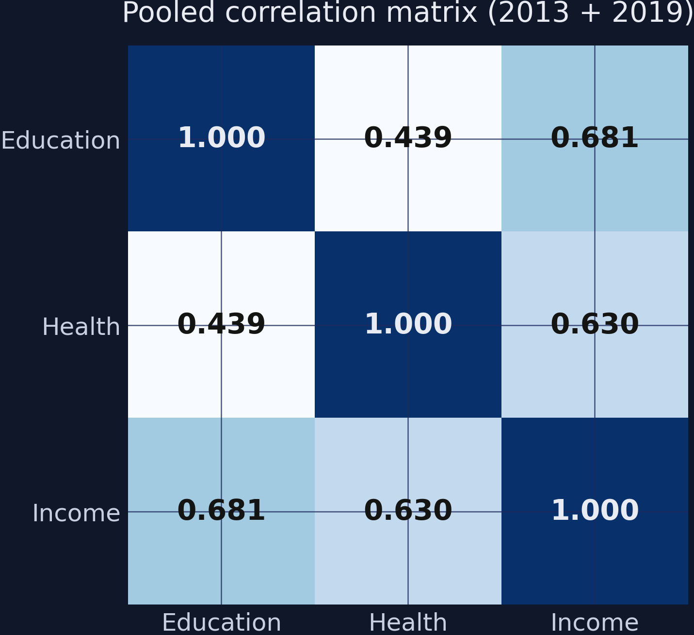

The correlations are moderate to strong but far from the near-perfect values we saw in the [previous tutorial's](/post/python_pca/) simulated data ($r > 0.93$). Education and Income show the strongest correlation (0.68), followed by Health and Income (0.63), with Education and Health the weakest (0.44). These lower correlations mean PCA will capture less variance in PC1 --- the three indicators carry more independent information than in the simulated case, reflecting the genuine complexity of human development. The weak Education-Health link (0.44) suggests that a region can have high literacy but mediocre life expectancy (or vice versa) --- education and health are partly independent dimensions of development.

```python
fig, ax = plt.subplots(figsize=(8, 6))
fig.patch.set_linewidth(0)

p1 = df[df["period"] == "Y2013"]
p2 = df[df["period"] == "Y2019"]

ax.scatter(p1["education"], p1["income"], color=STEEL_BLUE,
           edgecolors=DARK_NAVY, s=40, zorder=3, alpha=0.7, label="2013")
ax.scatter(p2["education"], p2["income"], color=WARM_ORANGE,
           edgecolors=DARK_NAVY, s=40, zorder=3, alpha=0.7, label="2019")

# Centroid arrows
c1_edu, c1_inc = p1["education"].mean(), p1["income"].mean()
c2_edu, c2_inc = p2["education"].mean(), p2["income"].mean()
ax.annotate("", xy=(c2_edu, c2_inc), xytext=(c1_edu, c1_inc),
            arrowprops=dict(arrowstyle="-|>", color=TEAL, lw=2.5))
ax.set_xlabel("Education Index")
ax.set_ylabel("Income Index")
ax.set_title("Education vs. Income by period (153 South American regions)")
ax.legend(loc="lower right")

plt.savefig("pca2_period_shift_scatter.png", dpi=300, bbox_inches="tight",
            facecolor=DARK_NAVY, edgecolor=DARK_NAVY, pad_inches=0)
plt.show()
```

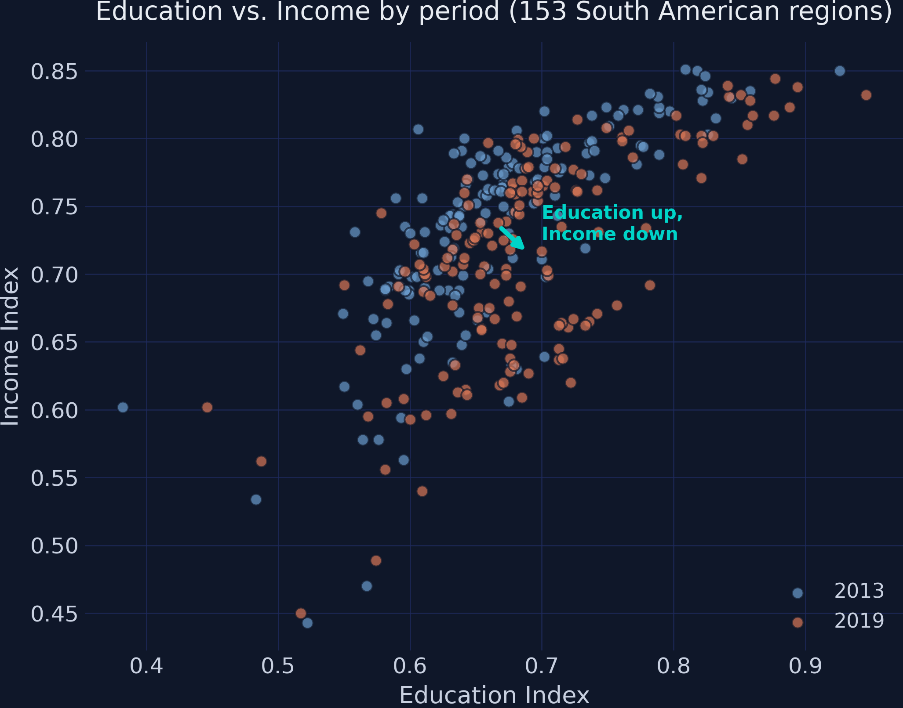

The scatter plot reveals a striking pattern: between 2013 (steel blue) and 2019 (orange), the cloud shifted **right** (education improved) but **downward** (income declined). The teal arrow connecting the two period centroids captures this asymmetric shift. This is a real-world complication that simple simulated data would not produce --- per-period PCA will handle this mixed signal differently from pooled PCA.

## 6. The problem: per-period PCA

To understand why pooled PCA is necessary, let us first see what goes wrong with the naive approach. We run the full six-step pipeline separately for each period --- standardizing with period-specific means, computing period-specific eigenvectors, and normalizing with period-specific bounds.

**Per-period standardization** uses different baselines for each period:

$$Z\_{ij}^{(t)} = \frac{X\_{ij,t} - \bar{X}\_j^{(t)}}{\sigma\_j^{(t)}}$$

In words, this says: standardize using only the data from period $t$. The mean and standard deviation change between periods, so the yardstick shifts.

**Per-period normalization** uses different bounds for each period:

$$HDI\_i^{(t)} = \frac{PC1\_i^{(t)} - PC1\_{min}^{(t)}}{PC1\_{max}^{(t)} - PC1\_{min}^{(t)}}$$

In words, this says: the worst region in each period gets 0 and the best gets 1, but the scale resets every period.

```python
def run_single_period_pca(df_period, indicators):
    """Run the full PCA pipeline on a single-period DataFrame."""
    X = df_period[indicators].values
    means = X.mean(axis=0)
    stds = X.std(axis=0, ddof=0)
    Z = (X - means) / stds
    cov = np.cov(Z.T, ddof=0)
    eigenvalues, eigenvectors = np.linalg.eigh(cov)
    idx = np.argsort(eigenvalues)[::-1]
    eigenvalues = eigenvalues[idx]
    eigenvectors = eigenvectors[:, idx]
    if eigenvectors[0, 0] < 0:
        eigenvectors[:, 0] *= -1
    pc1 = Z @ eigenvectors[:, 0]
    hdi = (pc1 - pc1.min()) / (pc1.max() - pc1.min())
    return {"pc1": pc1, "hdi": hdi, "weights": eigenvectors[:, 0],
            "eigenvalues": eigenvalues,
            "var_explained": eigenvalues / eigenvalues.sum() * 100,
            "means": means, "stds": stds}

pp_p1 = run_single_period_pca(df[df["period"] == "Y2013"], INDICATORS)
pp_p2 = run_single_period_pca(df[df["period"] == "Y2019"], INDICATORS)

print(f"Per-period eigenvector weights (PC1):")
print(f"  2013: [{pp_p1['weights'][0]:.4f}, {pp_p1['weights'][1]:.4f}, {pp_p1['weights'][2]:.4f}]")
print(f"  2019: [{pp_p2['weights'][0]:.4f}, {pp_p2['weights'][1]:.4f}, {pp_p2['weights'][2]:.4f}]")
print(f"  Shift: [{pp_p2['weights'][0] - pp_p1['weights'][0]:+.4f}, "
      f"{pp_p2['weights'][1] - pp_p1['weights'][1]:+.4f}, "
      f"{pp_p2['weights'][2] - pp_p1['weights'][2]:+.4f}]")
```

```text
Per-period eigenvector weights (PC1):
  2013: [0.5832, 0.5100, 0.6322]
  2019: [0.5405, 0.5657, 0.6228]
  Shift: [-0.0427, +0.0556, -0.0095]
```

The eigenvector weights shift substantially between periods. Education's weight drops from 0.583 to 0.541 ($-0.043$), while Health's weight jumps from 0.510 to 0.566 ($+0.056$). This means the index formula itself changes --- a region's 2013 HDI and 2019 HDI are computed with different recipes, making temporal comparison unreliable. Under per-period PCA, **43 out of 153 regions appear to decline** in HDI despite the overall improvement in education and health. The per-period approach erases the mixed global signal by re-centering every period to a mean of zero.

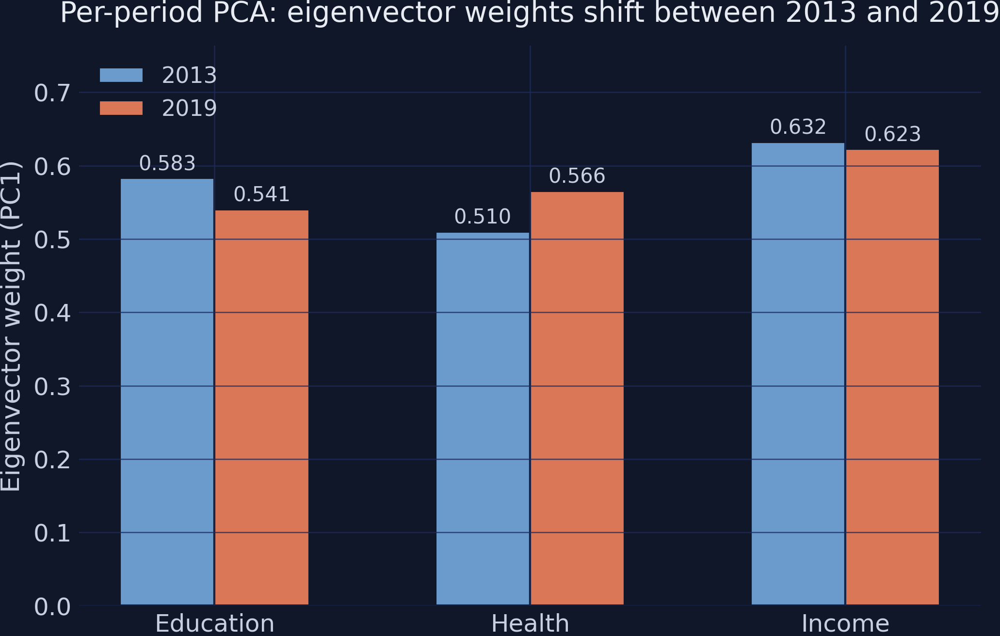

To visualize how individual regions shift in rank under per-period PCA, we store each period's HDI scores and compute ranks.

```python
df_p1 = df[df["period"] == "Y2013"].copy()
df_p2 = df[df["period"] == "Y2019"].copy()
df_p1["pp_hdi"] = pp_p1["hdi"]
df_p2["pp_hdi"] = pp_p2["hdi"]
df_p1["pp_rank"] = df_p1["pp_hdi"].rank(ascending=False).astype(int)
df_p2["pp_rank"] = df_p2["pp_hdi"].rank(ascending=False).astype(int)
```

```python
fig, ax = plt.subplots(figsize=(8, 10))
fig.patch.set_linewidth(0)

rank_change = df_p2["pp_rank"].values - df_p1["pp_rank"].values
abs_change = np.abs(rank_change)
top_changers_idx = np.argsort(abs_change)[-10:]

for i in top_changers_idx:
    r1 = df_p1.iloc[i]["pp_rank"]
    r2 = df_p2.iloc[i]["pp_rank"]
    label = df_p1.iloc[i]["region_country"]

    color = TEAL if r2 < r1 else WARM_ORANGE
    ax.plot([0, 1], [r1, r2], color=color, linewidth=2, alpha=0.8)
    ax.text(-0.05, r1, f"{label} (#{int(r1)})", ha="right", va="center",
            fontsize=7, color=LIGHT_TEXT)
    ax.text(1.05, r2, f"{label} (#{int(r2)})", ha="left", va="center",
            fontsize=7, color=LIGHT_TEXT)

ax.set_xlim(-0.6, 1.6)
ax.set_ylim(160, -5)
ax.set_xticks([0, 1])
ax.set_xticklabels(["2013 Rank", "2019 Rank"], fontsize=13)
ax.set_ylabel("Rank (1 = best)")
ax.set_title("Per-period PCA: rank shifts for 10 regions\n(teal = improved, orange = declined)")

plt.savefig("pca2_perperiod_rank_shift.png", dpi=300, bbox_inches="tight",
            facecolor=DARK_NAVY, edgecolor=DARK_NAVY, pad_inches=0)
plt.show()
```

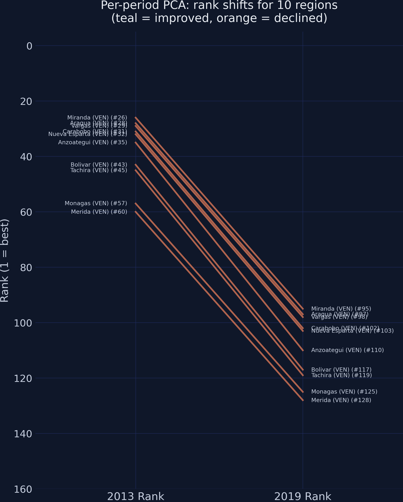

**The running example:** City of Buenos Aires --- Argentina's capital and one of the most developed regions in South America --- has a per-period HDI of 1.000 in 2013 (ranked #1) and 0.960 in 2019 --- a **decline of -0.04**. But we know Buenos Aires improved in education (0.926 $\to$ 0.946) and health (0.858 $\to$ 0.872), with only a modest income decline (0.850 $\to$ 0.832). Is Buenos Aires really declining, or is the shifting yardstick hiding a more nuanced story?

## 7. Pooled Step 1: Stacking the data

The first step of pooled PCA is to stack all periods into a single dataset. From PCA's perspective, we have 306 observations (153 regions $\times$ 2 periods), not two separate groups. The `period` column is metadata that we carry through for analysis, but it does not enter the PCA computation.

```python
print(f"Stacked dataset: {df.shape[0]} rows, {df.shape[1]} columns")
```

```text
Stacked dataset: 306 rows, 9 columns
```

The stacked dataset has 306 rows. PCA will treat each row equally regardless of which period it belongs to, producing a single set of standardization parameters and a single set of eigenvector weights.

## 8. Pooled Step 2: Pooled standardization

**What it is:** We compute the mean and standard deviation from the entire stacked dataset (all 306 rows) and use these pooled parameters to standardize every observation:

$$Z\_{ij,t}^{pooled} = \frac{X\_{ij,t} - \bar{X}\_j^{pooled}}{\sigma\_j^{pooled}}$$

In words, this says: for region $i$, indicator $j$, at time $t$, subtract the pooled mean $\bar{X}\_j^{pooled}$ (computed across all regions and all periods) and divide by the pooled standard deviation $\sigma\_j^{pooled}$.

**The application:** City of Buenos Aires has education = 0.926 in 2013 and 0.946 in 2019. The pooled mean for education is 0.679 and the pooled standard deviation is 0.081. Under per-period standardization, 2013 uses mean = 0.667 and 2019 uses mean = 0.690 --- a shifting baseline. Under pooled standardization, both periods use the same mean = 0.679. The increase from 0.926 to 0.946 maps to a genuine increase in pooled Z-score.

**The intuition:** Imagine measuring children's heights at age 5 and age 10. Per-period standardization compares each child only to their same-age peers: a tall 5-year-old gets a high Z-score, and a tall 10-year-old gets a high Z-score, but you cannot tell how much each child grew because the reference group changed. Pooled standardization measures everyone against the same ruler --- the combined height distribution --- so the Z-score increase from age 5 to age 10 directly reflects actual growth.

**The necessity:** Without pooled standardization, the income decline (from 0.736 to 0.715 on average) would be hidden. Per-period Z-scores re-center income to zero each period, erasing the decline. Pooled Z-scores preserve it: the 2019 income Z-scores average slightly below zero, correctly reflecting the real economic setback.

```python
X_all = df[INDICATORS].values  # 306 rows
pooled_means = X_all.mean(axis=0)
pooled_stds = X_all.std(axis=0, ddof=0)
Z_pooled = (X_all - pooled_means) / pooled_stds

print(f"Pooled standardization parameters:")
print(f"  Means: [{pooled_means[0]:.4f}, {pooled_means[1]:.4f}, {pooled_means[2]:.4f}]")
print(f"  Stds:  [{pooled_stds[0]:.4f}, {pooled_stds[1]:.4f}, {pooled_stds[2]:.4f}]")

scaler = StandardScaler()
Z_sklearn = scaler.fit_transform(X_all)
max_diff = np.max(np.abs(Z_sklearn - Z_pooled))
print(f"\nMax difference from sklearn StandardScaler: {max_diff:.2e}")
```

```text
Pooled standardization parameters:
  Means: [0.6786, 0.8437, 0.7254]
  Stds:  [0.0814, 0.0472, 0.0749]

Max difference from sklearn StandardScaler: 0.00e+00
```

The pooled means sit between the period-specific means (e.g., education: 0.667 in 2013, 0.690 in 2019, 0.679 pooled). The standard deviations are similar across periods because the within-period spread is much larger than the between-period level shift. The zero-difference check against [StandardScaler()](https://scikit-learn.org/stable/modules/generated/sklearn.preprocessing.StandardScaler.html) confirms our manual computation is correct.

## 9. Pooled Step 3: Covariance matrix

We compute the $3 \times 3$ covariance matrix from the pooled standardized data (all 306 rows):

$$\Sigma^{pooled} = \frac{1}{nT} Z^{pooled^T} Z^{pooled}$$

In words, this says: the pooled covariance matrix measures how the three standardized indicators co-move across all region-period observations.

```python
cov_pooled = np.cov(Z_pooled.T, ddof=0)
print(f"Pooled covariance matrix (3x3):")
for i in range(3):
    row = "  [" + "  ".join(f"{cov_pooled[i, j]:.4f}" for j in range(3)) + "]"
    print(row)
```

```text
Pooled covariance matrix (3x3):
  [1.0000  0.4392  0.6808]
  [0.4392  1.0000  0.6303]
  [0.6808  0.6303  1.0000]
```

The off-diagonals range from 0.44 (Education-Health) to 0.68 (Education-Income). These are substantially lower than the 0.93--0.95 values in the [simulated data from the previous tutorial](/post/python_pca/#8-step-3-the-covariance-matrix----mapping-the-overlap), reflecting the genuine complexity of human development. Education and Health are only moderately correlated because they measure different dimensions --- a region can have high literacy but mediocre life expectancy (or vice versa). This means PC1 will capture less total variance, and the eigenvector weights will be more unequal.

## 10. Pooled Step 4: Eigen-decomposition

We decompose the pooled covariance matrix to find the direction of maximum spread:

$$\Sigma^{pooled} \mathbf{v}\_k = \lambda\_k \mathbf{v}\_k$$

The PC1 score for each region-period is:

$$PC1\_{i,t} = w\_1 \, Z\_{i,edu,t}^{pooled} + w\_2 \, Z\_{i,health,t}^{pooled} + w\_3 \, Z\_{i,income,t}^{pooled}$$

In words, this says: each region's PC1 score is a weighted sum of its three pooled-standardized indicators, using the single set of pooled weights $[w\_1, w\_2, w\_3]$.

```python
eigenvalues, eigenvectors = np.linalg.eigh(cov_pooled)
idx = np.argsort(eigenvalues)[::-1]
eigenvalues = eigenvalues[idx]
eigenvectors = eigenvectors[:, idx]

if eigenvectors[0, 0] < 0:
    eigenvectors[:, 0] *= -1

var_explained = eigenvalues / eigenvalues.sum() * 100

print(f"Pooled eigenvalues: [{eigenvalues[0]:.4f}, {eigenvalues[1]:.4f}, {eigenvalues[2]:.4f}]")
print(f"\nPooled eigenvector (PC1): [{eigenvectors[0, 0]:.4f}, {eigenvectors[1, 0]:.4f}, {eigenvectors[2, 0]:.4f}]")
print(f"\nVariance explained:")
print(f"  PC1: {var_explained[0]:.2f}%")
print(f"  PC2: {var_explained[1]:.2f}%")
print(f"  PC3: {var_explained[2]:.2f}%")
```

```text
Pooled eigenvalues: [2.1726, 0.5631, 0.2643]

Pooled eigenvector (PC1): [0.5642, 0.5448, 0.6204]

Variance explained:
  PC1: 72.42%
  PC2: 18.77%
  PC3: 8.81%
```

PC1 captures 72.42% of all variance --- substantially less than the 96% in the simulated tutorial, but still a strong majority. The eigenvector weights are $[0.5642, 0.5448, 0.6204]$, revealing that **Income carries the highest weight** (0.620), followed by Education (0.564), with Health contributing least (0.545). This unequal weighting reflects the real-world correlation structure: Income is more strongly correlated with the other two indicators, so it contributes more unique information to the composite index. Unlike the two-variable case from the [previous tutorial](/post/python_pca/#9-step-4-eigen-decomposition----finding-the-optimal-direction) where equal weights were a mathematical certainty, three variables allow PCA to discover data-driven weights. Crucially, these weights are **fixed** --- the same weights apply to 2013 and 2019 because they were computed from the pooled data.

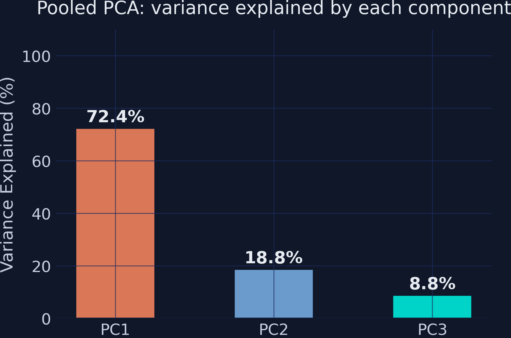

The variance explained chart shows PC1 dominating but with meaningful contributions from PC2 (18.8%) and PC3 (8.8%). The fact that PC2 and PC3 are not negligible means some development dimensions are not captured by a single index. For instance, PC2 might separate regions with high education but low income from those with the opposite pattern. For this tutorial, we focus on PC1 as the composite HDI, but researchers working with this data should consider whether retaining PC2 adds meaningful insight.

## 11. Pooled Step 5: Scoring

We project all 306 rows onto PC1 using the fixed pooled weights.

```python
w = eigenvectors[:, 0]
df["pc1"] = Z_pooled @ w

pc1_p1 = df[df["period"] == "Y2013"]["pc1"]
pc1_p2 = df[df["period"] == "Y2019"]["pc1"]

print(f"Pooled PC1 score statistics:")
print(f"  2013 mean: {pc1_p1.mean():.4f}")
print(f"  2019 mean: {pc1_p2.mean():.4f}")
print(f"  Shift:     {pc1_p2.mean() - pc1_p1.mean():+.4f}")
```

```text
Pooled PC1 score statistics:
  2013 mean: -0.0720
  2019 mean: 0.0720
  Shift:     +0.1439
```

The 2013 mean PC1 score is $-0.072$ (below the grand mean) and the 2019 mean is $+0.072$ (above the grand mean). The shift of $+0.144$ represents pooled PCA's measure of net development progress across South America. This is a modest positive shift, reflecting the trade-off between education/health gains and income decline. Under per-period PCA, this shift would be exactly zero by construction --- the net progress would be invisible.

## 12. Pooled Step 6: Normalization

We apply Min-Max normalization using the pooled bounds --- the minimum and maximum PC1 scores across all 306 observations:

$$HDI\_{i,t} = \frac{PC1\_{i,t} - PC1\_{min}^{pooled}}{PC1\_{max}^{pooled} - PC1\_{min}^{pooled}}$$

```python
pc1_min = df["pc1"].min()
pc1_max = df["pc1"].max()
df["hdi"] = (df["pc1"] - pc1_min) / (pc1_max - pc1_min)

print(f"\nPooled HDI — 2019 top 5:")
print(df[df["period"] == "Y2019"].nlargest(5, "hdi")[
    ["region_country", "education", "health", "income", "hdi"]
].to_string(index=False))
print(f"\nPooled HDI — 2013 bottom 5:")
print(df[df["period"] == "Y2013"].nsmallest(5, "hdi")[
    ["region_country", "education", "health", "income", "hdi"]
].to_string(index=False))
```

```text
Pooled HDI — 2019 top 5:
                 region_country  education  health  income      hdi
     Region Metropolitana (CHL)      0.877   0.929   0.844 1.000000
 Tarapaca (incl Arica and (CHL)      0.888   0.937   0.823 0.999348
     City of Buenos Aires (ARG)      0.946   0.872   0.832 0.965232
              Antofagasta (CHL)      0.894   0.896   0.838 0.961010
Valparaiso (former Aconca (CHL)      0.842   0.931   0.831 0.959202

Pooled HDI — 2013 bottom 5:
                 region_country  education  health  income      hdi
          Potaro-Siparuni (GUY)      0.522   0.735   0.443 0.000000
             Barima-Waini (GUY)      0.483   0.745   0.534 0.074601
                   Potosi (BOL)      0.564   0.666   0.578 0.076345
Upper Takutu-Upper Essequ (GUY)      0.567   0.751   0.470 0.089799
Brokopondo and Sipaliwini (SUR)      0.382   0.774   0.602 0.099207
```

The top 5 in 2019 are dominated by Chilean regions (Region Metropolitana, Tarapaca, Antofagasta, Valparaiso) plus Buenos Aires. Chile's strong performance across all three indicators --- particularly Health (0.90--0.94) --- places its regions at the top. The bottom 5 in 2013 are remote regions of Guyana (Potaro-Siparuni, Barima-Waini), Bolivia (Potosi), and Suriname (Brokopondo), characterized by low education and income despite moderate health outcomes. The Potaro-Siparuni region of Guyana anchors the bottom at HDI = 0.00 (education 0.522, health 0.735, income 0.443).

**City of Buenos Aires** has pooled HDI of 0.946 in 2013 and 0.965 in 2019 --- an improvement of $+0.019$. Under per-period PCA, the same region showed a decline of $-0.040$. Pooled PCA correctly reveals that Buenos Aires improved modestly while being overtaken by Chilean regions that improved faster.

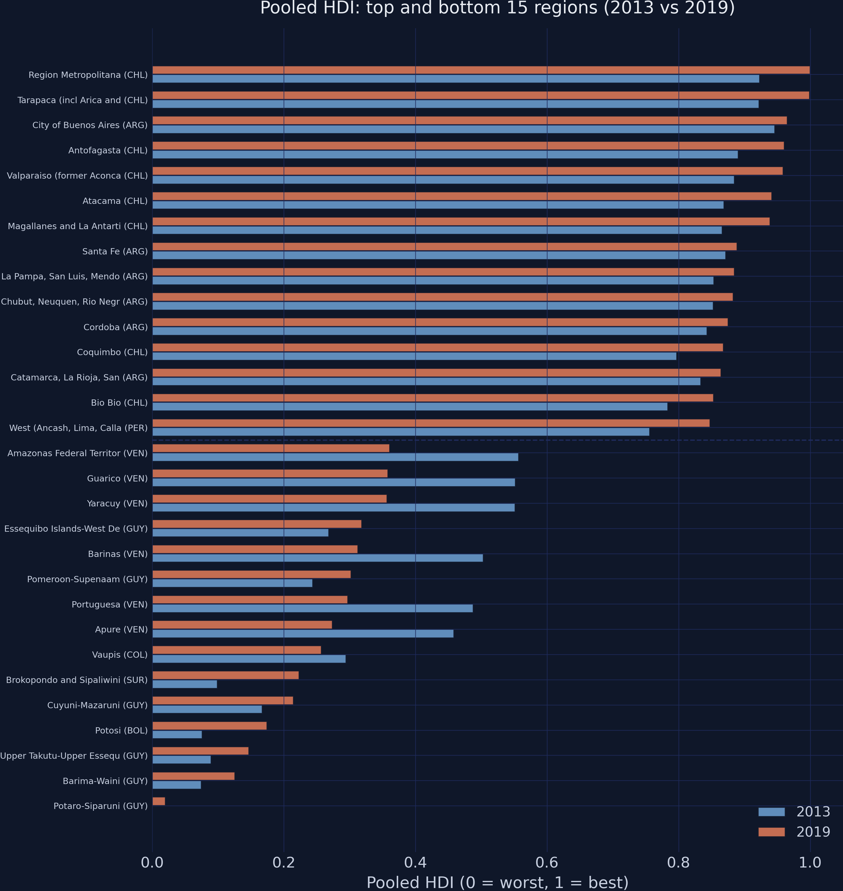

The paired bar chart shows the pooled HDI for the top and bottom 15 regions. In the top group, orange (2019) bars consistently extend further than steel blue (2013) bars, reflecting genuine improvement. In the bottom group, the pattern is more mixed --- some of the least developed regions in 2013 made substantial gains by 2019, while others barely moved. The dashed separator line divides the bottom 15 (below) from the top 15 (above).

## 13. The contrast: pooled vs per-period PCA

We now have two sets of HDI values for every region-period: one from per-period PCA and one from pooled PCA. To compare them, we build a wide table with each region's pooled and per-period HDI change side by side.

```python
from scipy.stats import spearmanr

# Separate pooled HDI by period
df_pooled_p1 = df[df["period"] == "Y2013"].copy()
df_pooled_p2 = df[df["period"] == "Y2019"].copy()

# Build comparison table: pooled vs per-period changes
compare = df_pooled_p1[["region", "country", "region_country", "hdi"]].rename(
    columns={"hdi": "hdi_p1"}
).merge(
    df_pooled_p2[["region", "country", "hdi"]].rename(columns={"hdi": "hdi_p2"}),
    on=["region", "country"]
)
compare["hdi_change"] = compare["hdi_p2"] - compare["hdi_p1"]
compare["pp_change"] = df_p2["pp_hdi"].values - df_p1["pp_hdi"].values
compare["method_diff"] = compare["hdi_change"] - compare["pp_change"]

# Direction disagreement
disagree = ((compare["hdi_change"] > 0) & (compare["pp_change"] < 0)) | \
           ((compare["hdi_change"] < 0) & (compare["pp_change"] > 0))

# Spearman rank correlation
rho_change, _ = spearmanr(compare["hdi_change"], compare["pp_change"])

# Running example: City of Buenos Aires
ba = compare[compare["region_country"].str.contains("Buenos Aires")].iloc[0]
ba_pp_p1 = df_p1[df_p1["region_country"].str.contains("Buenos Aires")]["pp_hdi"].values[0]
ba_pp_p2 = df_p2[df_p2["region_country"].str.contains("Buenos Aires")]["pp_hdi"].values[0]

print(f"City of Buenos Aires:")
print(f"  Per-period: 2013={ba_pp_p1:.4f}, 2019={ba_pp_p2:.4f}, Change={ba_pp_p2 - ba_pp_p1:+.4f}")
print(f"  Pooled:     2013={ba['hdi_p1']:.4f}, 2019={ba['hdi_p2']:.4f}, Change={ba['hdi_change']:+.4f}")
print(f"\nRegions where methods disagree on direction: {disagree.sum()} / {len(compare)}")
print(f"\nSpearman rank correlation (HDI change): rho = {rho_change:.4f}")
```

```text
City of Buenos Aires:
  Per-period: 2013=1.0000, 2019=0.9604, Change=-0.0396
  Pooled:     2013=0.9464, 2019=0.9652, Change=+0.0189

Regions where methods disagree on direction: 16 / 153
Spearman rank correlation (HDI change): rho = 0.9818
```

For City of Buenos Aires, per-period PCA shows a decline of $-0.04$ while pooled PCA shows an improvement of $+0.02$. The two methods disagree on the direction of change for **16 out of 153 regions** --- about 10% of the sample. The Spearman rank correlation for improvement rankings is 0.982, meaning the two methods largely agree on who improved most, but the direction disagreements for specific regions could lead to different policy conclusions.

```python
fig, ax = plt.subplots(figsize=(7, 7))
fig.patch.set_linewidth(0)

ax.scatter(compare["hdi_change"], compare["pp_change"],
           color=STEEL_BLUE, edgecolors=DARK_NAVY, s=40, zorder=3, alpha=0.7)

lim_min = min(compare["hdi_change"].min(), compare["pp_change"].min()) - 0.02
lim_max = max(compare["hdi_change"].max(), compare["pp_change"].max()) + 0.02
ax.plot([lim_min, lim_max], [lim_min, lim_max], color=WARM_ORANGE,
        linewidth=2, linestyle="--", label="Perfect agreement", zorder=2)
ax.axhline(0, color=GRID_LINE, linewidth=0.8, zorder=1)
ax.axvline(0, color=GRID_LINE, linewidth=0.8, zorder=1)

# Label extreme outliers
top_outliers = compare.nlargest(3, "method_diff")
bot_outliers = compare.nsmallest(3, "method_diff")
for _, row in pd.concat([top_outliers, bot_outliers]).iterrows():
    ax.annotate(row["region_country"], (row["hdi_change"], row["pp_change"]),
                fontsize=6, color=TEAL, xytext=(5, 5),
                textcoords="offset points")

ax.set_xlabel("Pooled HDI change (2019 - 2013)")
ax.set_ylabel("Per-period HDI change (2019 - 2013)")
ax.set_title("Pooled vs. per-period PCA: HDI change comparison")
ax.legend(loc="upper left")
ax.set_aspect("equal")

plt.savefig("pca2_pooled_vs_perperiod_change.png", dpi=300, bbox_inches="tight",
            facecolor=DARK_NAVY, edgecolor=DARK_NAVY, pad_inches=0)
plt.show()
```

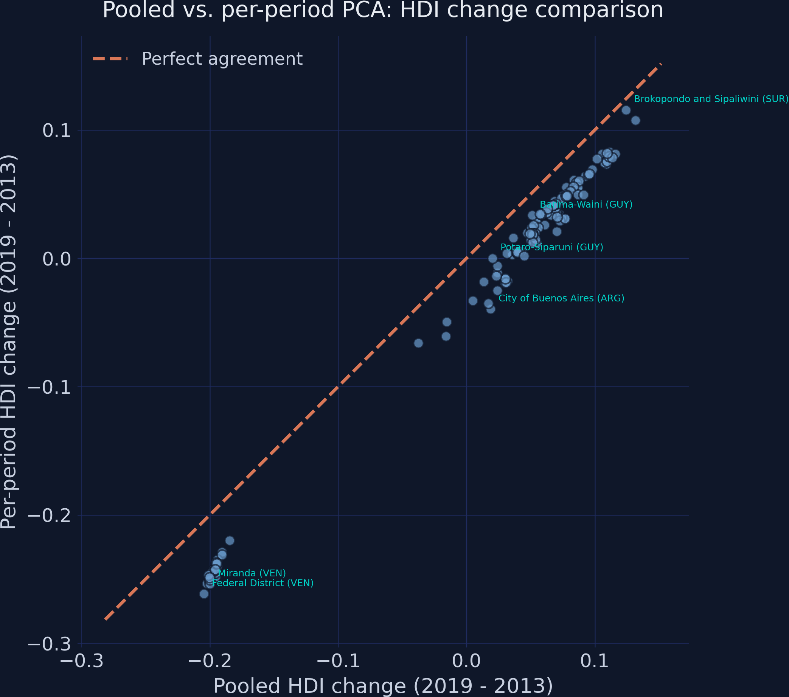

The scatter plot places pooled HDI change on the horizontal axis and per-period HDI change on the vertical axis. If both methods agreed perfectly, all points would fall on the dashed 45-degree line. The cloud sits systematically below the line for most regions --- per-period PCA tends to understate improvement (or overstate decline) relative to pooled PCA, because per-period standardization erases the net positive shift in education and health.

```python
compare["pooled_change_rank"] = compare["hdi_change"].rank(ascending=False).astype(int)
compare["pp_change_rank"] = compare["pp_change"].rank(ascending=False).astype(int)
compare["change_rank_diff"] = np.abs(compare["pooled_change_rank"] - compare["pp_change_rank"])

fig, ax = plt.subplots(figsize=(8, 10))
fig.patch.set_linewidth(0)

top_change_rank_diff = compare.nlargest(10, "change_rank_diff")

for _, row in top_change_rank_diff.iterrows():
    r_pooled = row["pooled_change_rank"]
    r_pp = row["pp_change_rank"]
    label = row["region_country"]

    color = TEAL if r_pooled < r_pp else WARM_ORANGE
    ax.plot([0, 1], [r_pooled, r_pp], color=color, linewidth=2, alpha=0.8)
    ax.text(-0.05, r_pooled, f"{label} (#{int(r_pooled)})", ha="right",
            va="center", fontsize=7, color=LIGHT_TEXT)
    ax.text(1.05, r_pp, f"{label} (#{int(r_pp)})", ha="left",
            va="center", fontsize=7, color=LIGHT_TEXT)

ax.set_xlim(-0.6, 1.6)
ax.set_ylim(160, -5)
ax.set_xticks([0, 1])
ax.set_xticklabels(["Pooled Improvement Rank", "Per-period Improvement Rank"], fontsize=11)
ax.set_ylabel("Rank (1 = most improved)")
ax.set_title("Who improved the most? Pooled vs. per-period rankings\n(teal = ranked higher by pooled, orange = ranked lower)")

plt.savefig("pca2_rank_comparison_bump.png", dpi=300, bbox_inches="tight",
            facecolor=DARK_NAVY, edgecolor=DARK_NAVY, pad_inches=0)
plt.show()
```

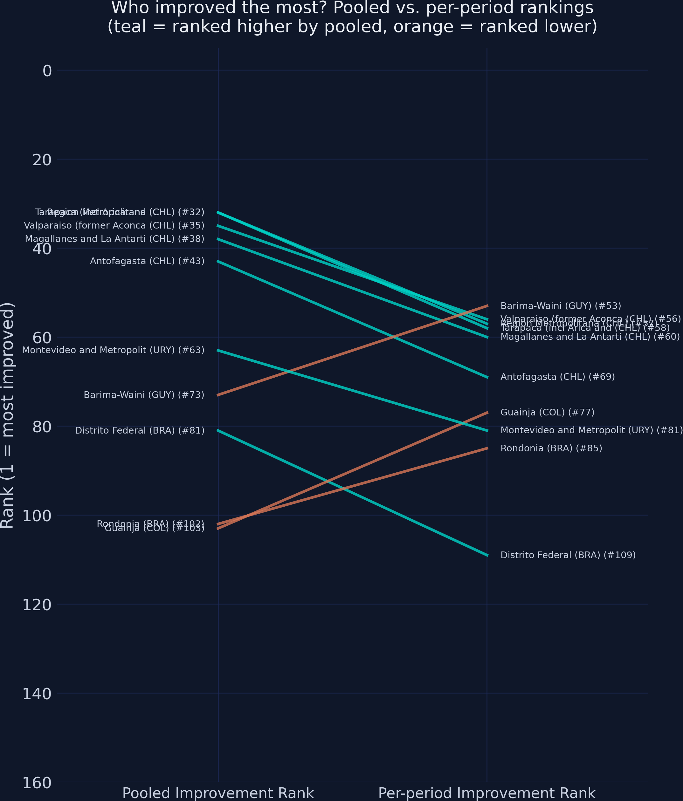

The bump chart compares who improved the most under each method. The crossing lines show where the two methods re-order regions' improvement rankings. Regions that pooled PCA ranks as top improvers may be ranked lower by per-period PCA if their gains were partly masked by the shifting baseline.

## 14. Validation against the official SHDI

The Global Data Lab computes an official Subnational HDI (SHDI) using a geometric mean methodology similar to the UNDP's approach. We can validate our PCA-based index by comparing both the pooled and per-period approaches against this official benchmark. If pooled PCA better tracks the established methodology, it provides further evidence that the pooled approach is superior for temporal analysis.

```python
# Add per-period HDI to main DataFrame for comparison
df["pp_hdi"] = pd.concat([df_p1["pp_hdi"], df_p2["pp_hdi"]]).sort_index().values

# Pooled PCA vs official SHDI
corr_pooled = df["hdi"].corr(df["shdi_official"])
r2_pooled = corr_pooled ** 2

# Per-period PCA vs official SHDI
corr_pp = df["pp_hdi"].corr(df["shdi_official"])
r2_pp = corr_pp ** 2

print(f"Pooled PCA vs official SHDI:")
print(f"  Pearson r:  {corr_pooled:.4f}")
print(f"  R-squared:  {r2_pooled:.4f}")
print(f"\nPer-period PCA vs official SHDI:")
print(f"  Pearson r:  {corr_pp:.4f}")
print(f"  R-squared:  {r2_pp:.4f}")
print(f"\nR-squared difference (pooled - per-period): {r2_pooled - r2_pp:+.4f}")
```

```text
Pooled PCA vs official SHDI:
  Pearson r:  0.9911
  R-squared:  0.9823

Per-period PCA vs official SHDI:
  Pearson r:  0.9874
  R-squared:  0.9750

R-squared difference (pooled - per-period): +0.0073
```

```python
fig, axes = plt.subplots(1, 2, figsize=(14, 6))
fig.patch.set_linewidth(0)

p1_mask = df["period"] == "Y2013"
p2_mask = df["period"] == "Y2019"

# Panel A: Pooled PCA vs SHDI
ax = axes[0]
ax.scatter(df.loc[p1_mask, "shdi_official"], df.loc[p1_mask, "hdi"],
           color=STEEL_BLUE, edgecolors=DARK_NAVY, s=30, alpha=0.7, zorder=3, label="2013")
ax.scatter(df.loc[p2_mask, "shdi_official"], df.loc[p2_mask, "hdi"],
           color=WARM_ORANGE, edgecolors=DARK_NAVY, s=30, alpha=0.7, zorder=3, label="2019")
ax.set_xlabel("Official SHDI")
ax.set_ylabel("Pooled PCA HDI")
ax.set_title(f"Pooled PCA  (R² = {r2_pooled:.4f})")
ax.legend(loc="upper left", fontsize=9)

# Panel B: Per-period PCA vs SHDI
ax = axes[1]
ax.scatter(df.loc[p1_mask, "shdi_official"], df.loc[p1_mask, "pp_hdi"],
           color=STEEL_BLUE, edgecolors=DARK_NAVY, s=30, alpha=0.7, zorder=3, label="2013")
ax.scatter(df.loc[p2_mask, "shdi_official"], df.loc[p2_mask, "pp_hdi"],
           color=WARM_ORANGE, edgecolors=DARK_NAVY, s=30, alpha=0.7, zorder=3, label="2019")
ax.set_xlabel("Official SHDI")
ax.set_ylabel("Per-period PCA HDI")
ax.set_title(f"Per-period PCA  (R² = {r2_pp:.4f})")
ax.legend(loc="upper left", fontsize=9)

fig.suptitle("Validation: which PCA method tracks the official SHDI better?",
             fontsize=14, y=1.02)
plt.tight_layout()

plt.savefig("pca2_validation_vs_shdi.png", dpi=300, bbox_inches="tight",
            facecolor=DARK_NAVY, edgecolor=DARK_NAVY, pad_inches=0)
plt.show()
```

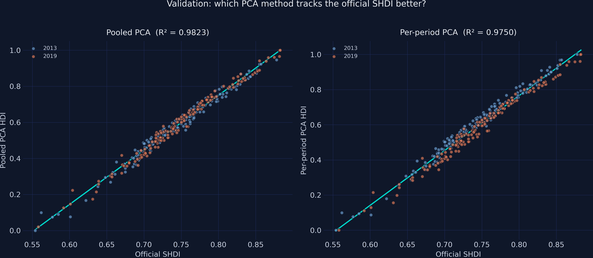

**Pooled PCA achieves $R^2 = 0.9823$, outperforming per-period PCA at $R^2 = 0.9750$.** The difference of +0.0073 may seem small in absolute terms, but it is consistent and meaningful: pooled PCA explains 0.73 percentage points more of the variance in the official SHDI. The left panel shows pooled PCA points tightly clustered along the fit line with both periods intermixed seamlessly --- exactly what we want for a temporally comparable index. The right panel shows per-period PCA with a slightly wider scatter, reflecting the distortion introduced by re-centering each period to its own baseline. The fact that the official SHDI (which uses a fixed geometric mean formula across years) correlates more strongly with pooled PCA than with per-period PCA validates the pooled approach: when the goal is temporal comparability, fitting on stacked data is the right choice.

### Validating the dynamics: changes over time

The level comparison above tests cross-sectional fit --- do the PCA-based indices rank regions correctly at a point in time? But the core promise of pooled PCA is capturing **dynamics** --- changes over time. We now test whether the change in PCA-based HDI tracks the change in official SHDI.

```python
# Compute official SHDI change per region
shdi_wide = (df.loc[p1_mask, ["region", "country", "shdi_official"]]
             .rename(columns={"shdi_official": "shdi_p1"}))
shdi_wide = shdi_wide.merge(
    df.loc[p2_mask, ["region", "country", "shdi_official"]]
    .rename(columns={"shdi_official": "shdi_p2"}),
    on=["region", "country"]
)
shdi_wide["shdi_change"] = shdi_wide["shdi_p2"] - shdi_wide["shdi_p1"]

# Merge with comparison table
compare_val = compare.merge(shdi_wide[["region", "country", "shdi_change"]],
                            on=["region", "country"])

# R² for changes
corr_pooled_change = compare_val["hdi_change"].corr(compare_val["shdi_change"])
r2_pooled_change = corr_pooled_change ** 2

corr_pp_change = compare_val["pp_change"].corr(compare_val["shdi_change"])
r2_pp_change = corr_pp_change ** 2

print(f"Pooled PCA change vs official SHDI change:")
print(f"  Pearson r:  {corr_pooled_change:.4f}")
print(f"  R-squared:  {r2_pooled_change:.4f}")
print(f"\nPer-period PCA change vs official SHDI change:")
print(f"  Pearson r:  {corr_pp_change:.4f}")
print(f"  R-squared:  {r2_pp_change:.4f}")
print(f"\nR-squared difference (pooled - per-period): {r2_pooled_change - r2_pp_change:+.4f}")
```

```text
Pooled PCA change vs official SHDI change:
  Pearson r:  0.9982
  R-squared:  0.9964

Per-period PCA change vs official SHDI change:
  Pearson r:  0.9957
  R-squared:  0.9913

R-squared difference (pooled - per-period): +0.0051
```

```python
fig, axes = plt.subplots(1, 2, figsize=(14, 6))
fig.patch.set_linewidth(0)

# Panel A: Pooled PCA change vs SHDI change
ax = axes[0]
ax.scatter(compare_val["shdi_change"], compare_val["hdi_change"],
           color=STEEL_BLUE, edgecolors=DARK_NAVY, s=40, alpha=0.7, zorder=3)
ax.axhline(0, color=GRID_LINE, linewidth=0.8, zorder=1)
ax.axvline(0, color=GRID_LINE, linewidth=0.8, zorder=1)
ax.set_xlabel("Official SHDI change (2019 - 2013)")
ax.set_ylabel("Pooled PCA HDI change")
ax.set_title(f"Pooled PCA  (R² = {r2_pooled_change:.4f})")

# Panel B: Per-period PCA change vs SHDI change
ax = axes[1]
ax.scatter(compare_val["shdi_change"], compare_val["pp_change"],
           color=STEEL_BLUE, edgecolors=DARK_NAVY, s=40, alpha=0.7, zorder=3)
ax.axhline(0, color=GRID_LINE, linewidth=0.8, zorder=1)
ax.axvline(0, color=GRID_LINE, linewidth=0.8, zorder=1)
ax.set_xlabel("Official SHDI change (2019 - 2013)")
ax.set_ylabel("Per-period PCA HDI change")
ax.set_title(f"Per-period PCA  (R² = {r2_pp_change:.4f})")

fig.suptitle("Validation: which PCA method better captures development dynamics?",
             fontsize=14, y=1.02)
plt.tight_layout()

plt.savefig("pca2_validation_changes.png", dpi=300, bbox_inches="tight",
            facecolor=DARK_NAVY, edgecolor=DARK_NAVY, pad_inches=0)
plt.show()
```

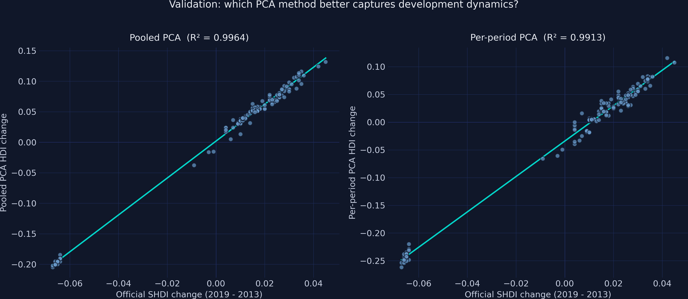

The change validation is even more compelling than the level validation. **Pooled PCA change achieves $R^2 = 0.9964$, outperforming per-period PCA change at $R^2 = 0.9913$.** Both methods track the official SHDI dynamics remarkably well ($r > 0.99$), but pooled PCA is the tighter fit. The left panel shows pooled PCA changes falling almost exactly on the regression line, with virtually no scatter. The right panel shows per-period PCA changes with slightly more dispersion, reflecting the noise introduced by re-centering each period's baseline. Taken together, the level validation ($R^2$: 0.9823 vs 0.9750) and the change validation ($R^2$: 0.9964 vs 0.9913) consistently favor pooled PCA --- it better reproduces both the cross-sectional rankings and the temporal dynamics of the official Subnational Human Development Index.

## 15. Replicating with scikit-learn

The pooled PCA pipeline with scikit-learn is nearly identical to the [single-period pipeline from the previous tutorial](/post/python_pca/#12-replicating-the-analysis-with-scikit-learn). The key insight is that sklearn's `fit_transform` on the stacked data IS pooled PCA --- no special panel-data library is needed.

```python
import numpy as np
import pandas as pd
from sklearn.preprocessing import StandardScaler
from sklearn.decomposition import PCA

# ── Configuration (change these for your own dataset) ────────────
CSV_URL = "https://raw.githubusercontent.com/cmg777/starter-academic-v501/master/content/post/python_pca2/data_long.csv"
ID_COL = "region"
PERIOD_COL = "period"
POSITIVE_COLS = ["education", "health", "income"]
NEGATIVE_COLS = []

# Step 0: Load long-format panel data
df_sk = pd.read_csv(CSV_URL)
print(f"Loaded: {df_sk.shape[0]} rows, {df_sk.shape[1]} columns")

# Step 1: Polarity adjustment
for col in NEGATIVE_COLS:
    df_sk[col + "_adj"] = -1 * df_sk[col]
adj_cols = POSITIVE_COLS + [col + "_adj" for col in NEGATIVE_COLS]

# Step 2: POOLED standardization (fit on ALL periods)
scaler = StandardScaler()
Z_sk = scaler.fit_transform(df_sk[adj_cols])

# Step 3-4: POOLED PCA (fit on ALL periods)
pca_sk = PCA(n_components=1)
df_sk["pc1"] = pca_sk.fit_transform(Z_sk)[:, 0]

# Step 5-6: POOLED normalization (min/max across ALL periods)
df_sk["pc1_index"] = (
    (df_sk["pc1"] - df_sk["pc1"].min())
    / (df_sk["pc1"].max() - df_sk["pc1"].min())
)

df_sk.to_csv("pc1_index_results.csv", index=False)

print(f"\nPC1 weights: {pca_sk.components_[0].round(4)}")
print(f"Variance explained: {pca_sk.explained_variance_ratio_.round(4)}")
print(f"\nSaved: pc1_index_results.csv")
```

```text
Loaded: 306 rows, 10 columns

PC1 weights: [0.5642 0.5448 0.6204]
Variance explained: [0.7242]

Saved: pc1_index_results.csv
```

The sklearn pipeline produces identical weights ($[0.5642, 0.5448, 0.6204]$) and variance explained (72.42%), with a maximum absolute difference of $2.00 \times 10^{-15}$ from our manual implementation.

## 16. Application: Space-time analyses

With a temporally comparable pooled PCA index in hand, we can now analyze development dynamics across South America. This section demonstrates two types of space-time analysis: mapping how the spatial distribution of development shifted between 2013 and 2019, and measuring how spatial inequality changed over the same period.

### Spatial distribution dynamics

Choropleth maps provide an intuitive way to visualize where development improved, stagnated, or declined. The key methodological choice is to compute the color breaks from the **initial period** (2013) using the [Fisher-Jenks natural breaks algorithm](https://pysal.org/mapclassify/generated/mapclassify.FisherJenks.html) and hold those breaks **constant** in the 2019 map. This ensures that a color change between maps reflects a genuine shift in HDI, not a shifting classification scheme. If we re-computed breaks for each period, regions could change color simply because the overall distribution shifted, not because they individually improved.

```python
import geopandas as gpd
import mapclassify
import contextily as cx

# Load GeoJSON boundaries and merge pooled HDI using GDLcode
GEO_URL = "https://raw.githubusercontent.com/cmg777/starter-academic-v501/master/content/post/python_pca2/data.geojson"
gdf = gpd.read_file(GEO_URL)
hdi_2013 = df_pooled_p1[["GDLcode", "hdi"]].rename(columns={"hdi": "hdi_2013"})
hdi_2019 = df_pooled_p2[["GDLcode", "hdi"]].rename(columns={"hdi": "hdi_2019"})
gdf = gdf.merge(hdi_2013, on="GDLcode")
gdf = gdf.merge(hdi_2019, on="GDLcode")

# Reproject to Web Mercator for basemap
gdf_3857 = gdf.to_crs(epsg=3857)

# Fisher-Jenks breaks from 2013 (5 classes)
fj = mapclassify.FisherJenks(gdf_3857["hdi_2013"].values, k=5)
breaks = fj.bins.tolist()

# Extend upper break to cover 2019 max
max_val = max(gdf_3857["hdi_2013"].max(), gdf_3857["hdi_2019"].max())
if max_val > breaks[-1]:
    breaks[-1] = float(round(max_val + 0.001, 3))

# Apply adjusted breaks to 2019 (must come AFTER break extension)
fj_2019 = mapclassify.UserDefined(gdf_3857["hdi_2019"].values, bins=breaks)

# Class transitions
classes_2013 = fj.yb
classes_2019 = fj_2019.yb
improved = (classes_2019 > classes_2013).sum()
stayed = (classes_2019 == classes_2013).sum()
declined = (classes_2019 < classes_2013).sum()

print(f"Fisher-Jenks breaks (from 2013): {[round(b, 3) for b in breaks]}")
print(f"\nClass transitions (2013 → 2019):")
print(f"  Improved (moved up):   {improved}")
print(f"  Stayed same:           {stayed}")
print(f"  Declined (moved down): {declined}")
```

```text
Fisher-Jenks breaks (from 2013): [0.167, 0.449, 0.581, 0.73, 1.001]

Class transitions (2013 → 2019):
  Improved (moved up):   40
  Stayed same:           88
  Declined (moved down): 25
```

```python
# Class labels
class_labels = []
lower = 0.0
for b in breaks:
    class_labels.append(f"{lower:.2f} – {b:.2f}")
    lower = b

fig, axes = plt.subplots(1, 2, figsize=(16, 12))
fig.patch.set_facecolor(DARK_NAVY)
fig.patch.set_linewidth(0)

from matplotlib.patches import Patch

cmap = plt.cm.coolwarm
norm = plt.Normalize(vmin=0, vmax=len(breaks) - 1)

for ax, year_col, title, year_fj in [
    (axes[0], "hdi_2013", "Pooled PCA HDI — 2013", fj),
    (axes[1], "hdi_2019", "Pooled PCA HDI — 2019", fj_2019),
]:
    # Classify and assign colors manually
    year_classes = year_fj.yb
    colors = [cmap(norm(c)) for c in year_classes]

    gdf_3857.plot(
        ax=ax, color=colors,
        edgecolor=DARK_NAVY, linewidth=0.3,
    )
    cx.add_basemap(ax, source=cx.providers.CartoDB.DarkMatter, zoom=4, attribution="")
    ax.set_title(title, fontsize=14, color=WHITE_TEXT, pad=10)
    ax.set_axis_off()

    # Build legend manually with correct counts
    counts = np.bincount(year_fj.yb, minlength=len(breaks))
    handles = []
    for i, (cl, c) in enumerate(zip(class_labels, counts)):
        handles.append(Patch(facecolor=cmap(norm(i)), edgecolor=DARK_NAVY,
                             label=f"{cl}  (n={c})"))

    leg = ax.legend(handles=handles, title="HDI Class", loc="lower right",
                    fontsize=16, title_fontsize=17)
    leg.set_frame_on(True)
    leg.get_frame().set_facecolor("#1a1a2e")
    leg.get_frame().set_edgecolor(LIGHT_TEXT)
    leg.get_frame().set_alpha(0.9)
    leg.get_frame().set_linewidth(1.5)
    for text in leg.get_texts():
        text.set_color(WHITE_TEXT)
    leg.get_title().set_color(WHITE_TEXT)

fig.suptitle("Spatial distribution dynamics: Pooled PCA HDI\n"
             "(Fisher-Jenks breaks from 2013 held constant)",
             fontsize=15, color=WHITE_TEXT, y=0.95)
plt.tight_layout(rect=[0, 0, 1, 0.93])

plt.savefig("pca2_choropleth_hdi.png", dpi=300, bbox_inches="tight",
            facecolor=DARK_NAVY, edgecolor=DARK_NAVY, pad_inches=0)
plt.show()
```

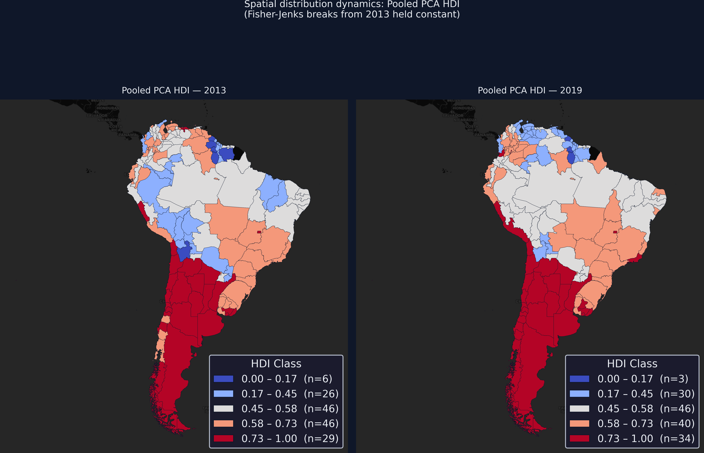

The choropleth maps reveal clear geographic patterns in South American development. The Southern Cone (Chile, Argentina, Uruguay) and southern Brazil appear in the highest HDI classes (teal tones), while the Amazon basin, interior Guyana, and parts of Bolivia occupy the lowest classes (orange tones). Between 2013 and 2019, **40 regions moved up** at least one Fisher-Jenks class, **88 stayed in the same class**, and **25 declined**. The upward mobility is concentrated in the Andean countries (Peru, Bolivia, Colombia) where education gains shifted regions from the second to the third class. The declines are predominantly in Venezuelan states, visible as regions shifting from mid-range blues to warmer colors --- a direct cartographic reflection of Venezuela's economic crisis. The fact that both maps use the same classification breaks makes these color changes directly interpretable: any region that changed color genuinely crossed a development threshold.

### Spatial inequality dynamics

The **Gini index** measures inequality in the distribution of a variable across a population, ranging from 0 (perfect equality --- every region has the same value) to 1 (perfect inequality --- all development concentrated in a single region). Think of it as a single number that summarizes how unevenly a resource or outcome is distributed. By computing the Gini index for each indicator in each period, we can track whether development is converging (Gini falling --- regions becoming more similar) or diverging (Gini rising --- gaps widening).

We use the [Gini](https://pysal.org/inequality/generated/inequality.gini.Gini.html) class from PySAL's [inequality](https://pysal.org/inequality/) library, which provides a robust implementation of the Gini coefficient. The `Gini(values).g` attribute returns the computed coefficient.

```python
from inequality.gini import Gini

# Compute Gini for each indicator and pooled HDI, per period
gini_rows = []
for period_label in ["Y2013", "Y2019"]:
    mask = df["period"] == period_label
    row = {"period": period_label}
    for col in INDICATORS + ["hdi"]:
        row[col] = round(Gini(df.loc[mask, col].values).g, 4)
    gini_rows.append(row)

gini_df = pd.DataFrame(gini_rows).set_index("period")

# Add change row
change_row = gini_df.loc["Y2019"] - gini_df.loc["Y2013"]
change_row.name = "Change"
gini_df = pd.concat([gini_df, change_row.to_frame().T])

print(f"Gini index by indicator and period:")
print(gini_df.to_string())
```

```text
Gini index by indicator and period:
        education  health  income     hdi
Y2013      0.0655  0.0295  0.0549  0.1712
Y2019      0.0639  0.0318  0.0585  0.1795
Change    -0.0016  0.0023  0.0036  0.0083
```

```python
fig, ax = plt.subplots(figsize=(8, 5))
fig.patch.set_linewidth(0)

labels = ["Education", "Health", "Income", "Pooled HDI"]
cols = INDICATORS + ["hdi"]
vals_2013 = [gini_df.loc["Y2013", c] for c in cols]
vals_2019 = [gini_df.loc["Y2019", c] for c in cols]

x = np.arange(len(labels))
width = 0.3

bars1 = ax.bar(x - width/2, vals_2013, width, color=STEEL_BLUE,
               edgecolor=DARK_NAVY, label="2013")
bars2 = ax.bar(x + width/2, vals_2019, width, color=WARM_ORANGE,
               edgecolor=DARK_NAVY, label="2019")

for bar in bars1:
    ax.text(bar.get_x() + bar.get_width()/2, bar.get_height() + 0.002,
            f"{bar.get_height():.4f}", ha="center", va="bottom",
            fontsize=9, color=LIGHT_TEXT)
for bar in bars2:
    ax.text(bar.get_x() + bar.get_width()/2, bar.get_height() + 0.002,
            f"{bar.get_height():.4f}", ha="center", va="bottom",
            fontsize=9, color=LIGHT_TEXT)

ax.set_xticks(x)
ax.set_xticklabels(labels, fontsize=12)
ax.set_ylabel("Gini Index")
ax.set_title("Spatial inequality dynamics: Gini index by indicator (2013 vs 2019)")
ax.legend()
ax.set_ylim(0, ax.get_ylim()[1] * 1.15)

plt.savefig("pca2_gini_dynamics.png", dpi=300, bbox_inches="tight",
            facecolor=DARK_NAVY, edgecolor=DARK_NAVY, pad_inches=0)
plt.show()
```

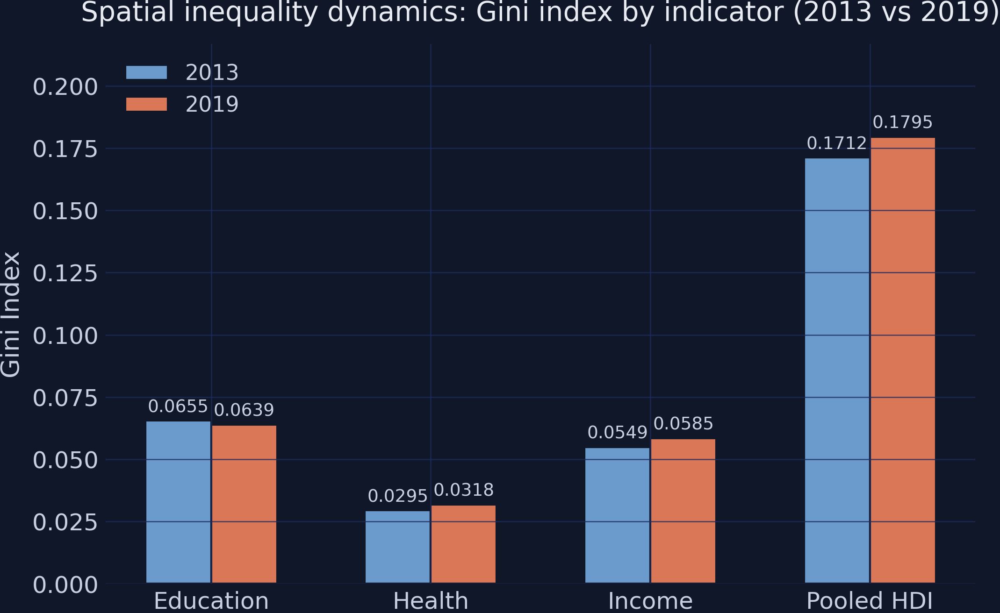

The Gini analysis reveals a nuanced inequality story across South America's sub-national regions. **Education is the only dimension that converged** between 2013 and 2019 --- its Gini fell from 0.0655 to 0.0639 ($-0.0016$), meaning regions became slightly more equal in educational attainment. Health and income both **diverged**: health inequality rose from 0.0295 to 0.0318 ($+0.0023$) and income inequality from 0.0549 to 0.0585 ($+0.0036$). The composite pooled PCA HDI shows an overall increase in inequality from 0.1712 to 0.1795 ($+0.0083$), driven primarily by the income and health dimensions. This tells a policy-relevant story: while South America made progress in reducing educational gaps across regions, the income decline was unevenly distributed --- some regions (particularly Venezuelan states) experienced far steeper economic setbacks than others, widening the income gap. The fact that overall HDI inequality increased despite educational convergence underscores that development progress is not uniform across dimensions, and a composite index like the pooled PCA HDI captures these cross-cutting dynamics in a single measure.

### Population-weighted inequality

The unweighted Gini treats every region equally --- Potaro-Siparuni (population 10,000) carries the same weight as São Paulo (population 44 million). For policy analysis, we often care more about how many *people* experience inequality, not how many *regions*. A population-weighted Gini accounts for this by giving larger regions proportionally more influence. Since PySAL's `Gini` class does not support population weights, we implement the weighted Gini using the trapezoidal Lorenz curve approach.

```python
def weighted_gini(values, weights):
    """Compute the population-weighted Gini index using the Lorenz curve.

    Parameters
    ----------
    values : array-like — indicator values (e.g., HDI per region)
    weights : array-like — population weights (e.g., region population)

    Returns
    -------
    float — weighted Gini coefficient in [0, 1]
    """
    v = np.asarray(values, dtype=float)
    w = np.asarray(weights, dtype=float)
    order = np.argsort(v)
    v, w = v[order], w[order]
    # Cumulative population and value shares
    cum_w = np.cumsum(w) / np.sum(w)
    cum_vw = np.cumsum(v * w) / np.sum(v * w)
    # Prepend zero for trapezoidal integration
    cum_w = np.concatenate(([0], cum_w))
    cum_vw = np.concatenate(([0], cum_vw))
    # Area under Lorenz curve
    B = np.sum((cum_w[1:] - cum_w[:-1]) * (cum_vw[1:] + cum_vw[:-1]) / 2)
    return 1 - 2 * B

# Compute population-weighted Gini
wgini_rows = []
for period_label in ["Y2013", "Y2019"]:
    mask = df["period"] == period_label
    row = {"period": period_label}
    for col in INDICATORS + ["hdi"]:
        row[col] = round(weighted_gini(
            df.loc[mask, col].values, df.loc[mask, "pop"].values
        ), 4)
    wgini_rows.append(row)

wgini_df = pd.DataFrame(wgini_rows).set_index("period")
wchange_row = wgini_df.loc["Y2019"] - wgini_df.loc["Y2013"]
wchange_row.name = "Change"
wgini_df = pd.concat([wgini_df, wchange_row.to_frame().T])

print(f"Population-weighted Gini index:")
print(wgini_df.to_string())
```

```text
Population-weighted Gini index:
        education  health  income     hdi
Y2013      0.0525  0.0174  0.0359  0.1113
Y2019      0.0521  0.0186  0.0387  0.1156
Change    -0.0004  0.0012  0.0028  0.0043
```

```python
fig, axes = plt.subplots(1, 2, figsize=(14, 5), sharey=True)
fig.patch.set_linewidth(0)

labels = ["Education", "Health", "Income", "Pooled HDI"]
cols = INDICATORS + ["hdi"]
x = np.arange(len(labels))
width = 0.3

# Panel A: Unweighted
ax = axes[0]
uw_13 = [gini_df.loc["Y2013", c] for c in cols]
uw_19 = [gini_df.loc["Y2019", c] for c in cols]
ax.bar(x - width/2, uw_13, width, color=STEEL_BLUE, edgecolor=DARK_NAVY, label="2013")
ax.bar(x + width/2, uw_19, width, color=WARM_ORANGE, edgecolor=DARK_NAVY, label="2019")
for i, (v13, v19) in enumerate(zip(uw_13, uw_19)):
    ax.text(i - width/2, v13 + 0.002, f"{v13:.4f}", ha="center", va="bottom",
            fontsize=8, color=LIGHT_TEXT)
    ax.text(i + width/2, v19 + 0.002, f"{v19:.4f}", ha="center", va="bottom",
            fontsize=8, color=LIGHT_TEXT)
ax.set_xticks(x)
ax.set_xticklabels(labels, fontsize=11)
ax.set_ylabel("Gini Index")
ax.set_title("Unweighted Gini")
ax.legend(fontsize=9)

# Panel B: Population-weighted
ax = axes[1]
pw_13 = [wgini_df.loc["Y2013", c] for c in cols]
pw_19 = [wgini_df.loc["Y2019", c] for c in cols]
ax.bar(x - width/2, pw_13, width, color=STEEL_BLUE, edgecolor=DARK_NAVY, label="2013")
ax.bar(x + width/2, pw_19, width, color=WARM_ORANGE, edgecolor=DARK_NAVY, label="2019")
for i, (v13, v19) in enumerate(zip(pw_13, pw_19)):
    ax.text(i - width/2, v13 + 0.002, f"{v13:.4f}", ha="center", va="bottom",
            fontsize=8, color=LIGHT_TEXT)
    ax.text(i + width/2, v19 + 0.002, f"{v19:.4f}", ha="center", va="bottom",
            fontsize=8, color=LIGHT_TEXT)
ax.set_xticks(x)
ax.set_xticklabels(labels, fontsize=11)
ax.set_title("Population-weighted Gini")
ax.legend(fontsize=9)

fig.suptitle("Spatial inequality: unweighted vs. population-weighted Gini",
             fontsize=14, y=1.02)
plt.tight_layout()

plt.savefig("pca2_gini_weighted_comparison.png", dpi=300, bbox_inches="tight",
            facecolor=DARK_NAVY, edgecolor=DARK_NAVY, pad_inches=0)
plt.show()
```

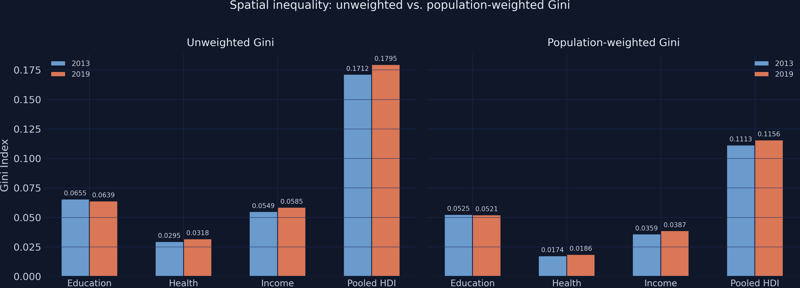

The population-weighted Gini values are **substantially lower** than their unweighted counterparts across all indicators and both periods. For example, the pooled HDI Gini drops from 0.1712 (unweighted) to 0.1113 (weighted) in 2013 --- a 35% reduction. This gap means that large-population regions (São Paulo, Buenos Aires, Bogota, Santiago) tend to cluster near the middle of the development distribution, while the extreme values (both high and low) are found in smaller regions. When we weight by population, the outlier regions matter less, and inequality appears lower because most South Americans live in moderately developed areas. The direction of change, however, is consistent: both weighted and unweighted Gini show education converging ($-0.0004$ weighted vs $-0.0016$ unweighted) while income ($+0.0028$ vs $+0.0036$) and overall HDI ($+0.0043$ vs $+0.0083$) diverge. The divergence is smaller in population-weighted terms, suggesting that the widening gaps are driven more by sparsely populated peripheral regions than by the major urban centers where most people live.

## 17. Summary results

| Step | Input | Output | Key Result |
|------|-------|--------|------------|
| Stack | 2 periods $\times$ 153 regions | 306-row DataFrame | Panel format ready |
| Polarity | Raw indicators | Aligned indicators | All positive (no flip needed) |
| Pooled Standardization | 306 rows | Z-scores (pooled) | Fixed baseline across periods |
| Pooled Covariance | Z matrix | 3$\times$3 matrix | Off-diagonals 0.44--0.68 |
| Pooled Eigen-decomposition | Cov matrix | eigenvalues, eigenvectors | PC1 captures 72.4% |
| Scoring | Z $\times$ eigvec | PC1 scores | 2019 mean > 2013 mean (+0.14) |
| Pooled Normalization | PC1 | HDI (0--1) | Comparable across periods |

## 18. Discussion

**Pooled PCA successfully builds a composite development index that is directly comparable across time periods.** By standardizing with pooled means, computing a single set of eigenvector weights from stacked data, and normalizing with pooled min/max bounds, the index preserves genuine temporal dynamics. The net development shift of +0.14 PC1 units (reflecting education and health gains partially offset by income decline) is captured by pooled PCA but would be invisible under per-period PCA.

The real South American data revealed that Income carries the highest eigenvector weight (0.620), meaning PCA gives Income more influence than Education (0.564) or Health (0.545) in the composite index. This data-driven weighting differs from the UNDP's equal-weight geometric mean approach, yet the two methods agree closely ($r = 0.991$). The similarity arises because all three indicators are positively correlated and driven by the same broad development processes. The differences emerge in regions with unbalanced profiles --- for example, regions with very high health but low education may rank differently under PCA versus the geometric mean.

The per-period approach disagrees with pooled PCA on the direction of change for 16 regions (10% of the sample). In each of these 16 cases, per-period PCA shows a decline while pooled PCA shows an improvement --- the shifting baseline erases genuine but modest gains. A policymaker using per-period PCA might conclude these regions are "falling behind" when in reality they made progress, just less than the shifting average.

The income decline across South America between 2013 and 2019 makes the pooled approach particularly important. Per-period standardization would hide this real economic setback by re-centering income to zero each period. Pooled standardization preserves it, allowing researchers to see that income genuinely declined while education and health improved. This mixed signal is precisely the kind of nuance that development analysis must capture.

## 19. Summary and next steps

**Key takeaways:**

- **Method insight:** Pooled PCA produces temporally comparable composite indices by fitting standardization and eigen-decomposition on stacked data. The two methods disagree on the direction of HDI change for 16 out of 153 South American regions. The Spearman rank correlation for improvement rankings is 0.982 --- high but not perfect, with consequential differences for specific regions.
- **Data insight:** Income carries the highest PC1 weight (0.620) despite education having a wider range. PC1 captures 72.4% of variance --- lower than the 96% in simulated data, reflecting the genuine complexity of real development indicators. The PCA-based HDI correlates at $r = 0.991$ with the official SHDI, validating the approach.
- **Limitation:** PC1 captures only 72% of variance, meaning 28% of development variation is lost in the compression. PC2 (19%) might capture meaningful patterns (e.g., health vs income trade-offs). Also, the pooled approach assumes a stable correlation structure between 2013 and 2019 --- a strong assumption over a 6-year period that included significant economic volatility in the region.
- **Next step:** Extend the analysis to more time periods (2000--2019) using the full Global Data Lab time series. Explore PC2 interpretation for policy-relevant sub-dimensions. Consider factor analysis for more flexible loading structures, and compare results across different world regions.

**Limitations of this analysis:**

- The data covers only South America. Development patterns in Sub-Saharan Africa or South Asia may produce different correlation structures and eigenvector weights.
- Two periods (2013 and 2019) is the minimum for temporal analysis. More periods would strengthen the pooled estimates and allow testing the constant-correlation assumption.
- The PCA-based index is relative to this specific sample. Adding or removing regions changes every score.
- Min-Max normalization is sensitive to outliers. The Potaro-Siparuni region of Guyana anchors the bottom and compresses the range for everyone else.

## 20. Exercises

1. **Explore PC2.** The second principal component captures 18.8% of variance. Compute PC2 scores and plot them against PC1. What development pattern does PC2 capture? Which regions score high on PC1 but low on PC2 (or vice versa)?

2. **Test the constant-correlation assumption.** Compute the correlation matrices separately for 2013 and 2019. How much do they differ? If the Income-Education correlation changed substantially, what would that imply for the validity of pooled PCA?

3. **Compare with the UNDP methodology.** The official SHDI uses a geometric mean: $SHDI = (Education \times Health \times Income)^{1/3}$. Compute this for all regions and compare the ranking with your PCA-based ranking. Where do the two methods disagree most, and why?

## 21. References

1. [Mendez, C. (2026). Introduction to PCA Analysis for Building Development Indicators.](/post/python_pca/)
2. [Smits, J. and Permanyer, I. (2019). The Subnational Human Development Database. *Scientific Data*, 6, 190038.](https://doi.org/10.1038/sdata.2019.38)
3. [Global Data Lab -- Subnational Human Development Index](https://globaldatalab.org/shdi/)
4. [Jolliffe, I. T. and Cadima, J. (2016). Principal Component Analysis: A Review and Recent Developments. *Philosophical Transactions of the Royal Society A*, 374(2065).](https://doi.org/10.1098/rsta.2015.0202)
5. [Peiro-Palomino, J., Picazo-Tadeo, A. J., and Rios, V. (2023). Social Progress around the World: Trends and Convergence. *Oxford Economic Papers*, 75(2), 281--306.](https://doi.org/10.1093/oep/gpac022)
6. [UNDP (2024). Human Development Index -- Technical Notes.](https://hdr.undp.org/data-center/human-development-index)
7. [scikit-learn -- PCA Documentation](https://scikit-learn.org/stable/modules/generated/sklearn.decomposition.PCA.html)
8. [scikit-learn -- StandardScaler Documentation](https://scikit-learn.org/stable/modules/generated/sklearn.preprocessing.StandardScaler.html)
9. [Mendez, C. and Gonzales, E. (2021). Human Capital Constraints, Spatial Dependence, and Regionalization in Bolivia. *Economia*, 44(87).](https://carlos-mendez.org/publication/20210318-economia/)

#### Acknowledgements

AI tools (Claude Code, Gemini, NotebookLM) were used to make the contents of this post more accessible to students. Nevertheless, the content in this post may still have errors. Caution is needed when applying the contents of this post to true research projects.
