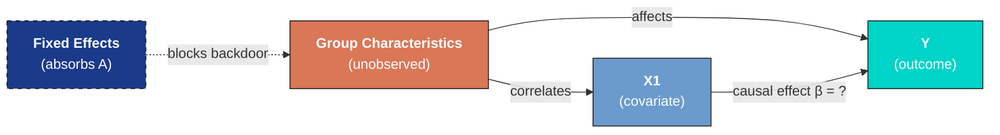
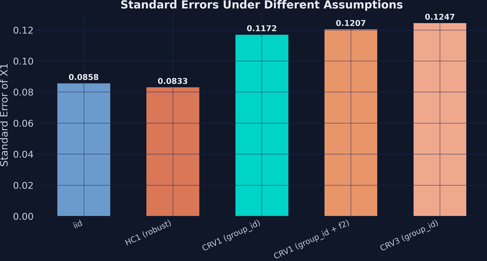
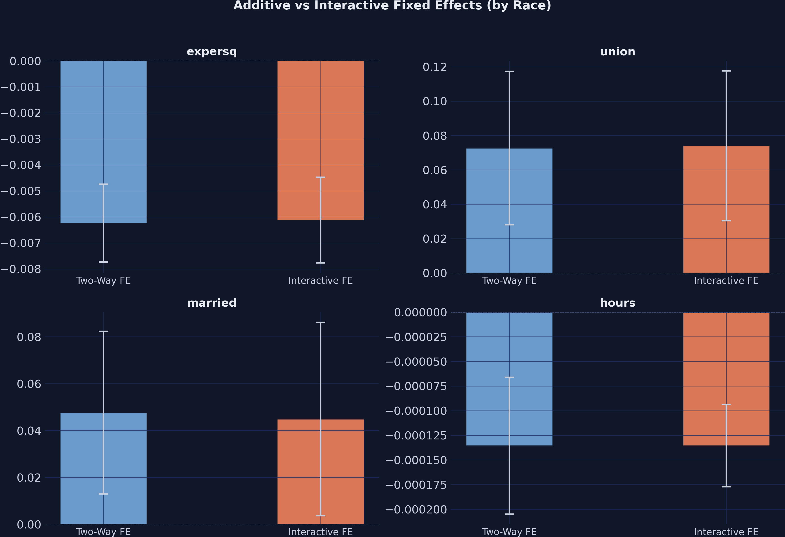
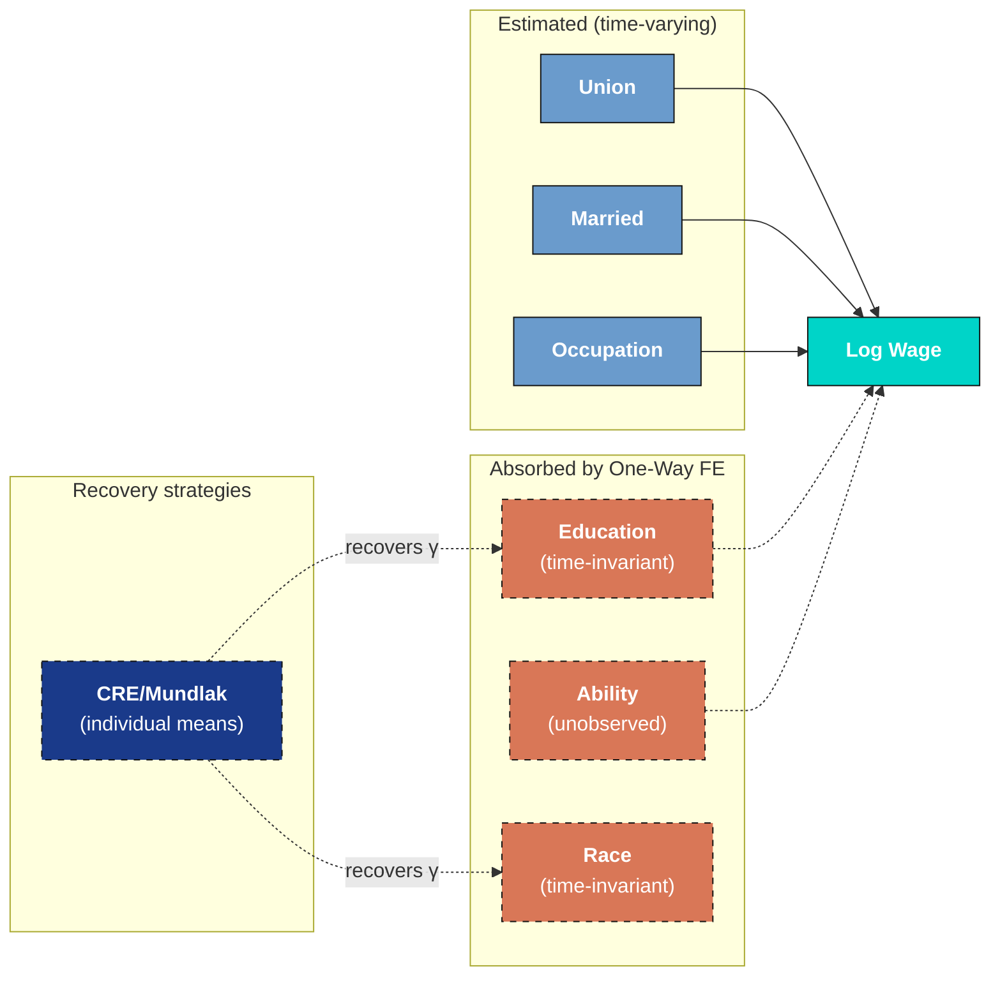

---
authors:
  - admin
categories:
  - Python
  - Econometrics
  - Panel Data
draft: false
featured: false
date: "2026-03-20T00:00:00Z"
external_link: ""
image:
  caption: ""
  focal_point: Smart
  placement: 3
links:
- icon: code
  icon_pack: fas
  name: "Python script"
  url: script.py
slides:
summary: Estimating regression models with high-dimensional fixed effects using PyFixest, from simple OLS through two-way FE, instrumental variables, panel data, and event studies
tags:
  - python
  - econometrics
title: "High-Dimensional Fixed Effects Regression: An Introduction in Python"
url_code: ""
url_pdf: ""
url_slides: ""
url_video: ""
toc: true
diagram: true
---

## 1. Overview

Imagine you want to know whether union membership raises wages. You run a regression and find a strong positive association: union workers earn 18% more. But wait --- what if the workers who join unions are also more motivated, more experienced, or work in industries that pay well regardless? That 18% could be mostly *selection*, not a genuine union effect. This is one of the most pervasive problems in empirical research: **omitted variable bias**. Any time your data is grouped --- by individual, firm, country, or time period --- unobserved characteristics that differ across groups can contaminate your estimates, leading to conclusions that look solid but are fundamentally misleading.

**Fixed effects regression** is the workhorse solution. By absorbing all time-invariant group-level heterogeneity --- a worker's innate ability, a firm's management culture, a country's institutional quality --- fixed effects eliminate an entire class of confounders in one step. The result is striking: in the wage panel we analyze below, the apparent union premium drops from 18% to just 7% once we account for individual fixed effects, revealing that more than half the raw association was driven by who selects into unions, not what unions do. This kind of dramatic correction is routine in applied research, which is why fixed effects appear in virtually every empirical paper that uses panel data.

Modern implementations make this computationally painless. Rather than estimating thousands of dummy variables, they use a *demeaning* algorithm that sweeps out group means before estimation. [PyFixest](https://pyfixest.org/) brings this approach to Python with a concise formula syntax inspired by R's `fixest` package --- the most popular fixed effects library in the R ecosystem. In this tutorial we use PyFixest to build from simple OLS through one-way and two-way fixed effects, compare inference methods, perform instrumental variable estimation, analyze a real wage panel, and run event study designs for difference-in-differences --- all with a few lines of code. Along the way, we will see *why* fixed effects work (by manually reproducing them via demeaning), discover what they *cannot* do (estimate time-invariant effects like education), learn when standard TWFE breaks down in staggered treatment designs, and apply the CRE/Mundlak approach to recover the very coefficients that one-way FE absorb.

**Learning objectives:**

- Understand why unobserved group heterogeneity biases OLS and how fixed effects remove that bias
- Implement one-way and two-way fixed effects regressions using PyFixest's formula syntax
- Compare multiple model specifications efficiently using PyFixest's stepwise operators
- Assess robustness by computing standard errors under different clustering assumptions
- Decompose panel variation into between and within components to diagnose what FE can and cannot estimate
- Frame a real wage panel through the Mincer equation and its panel extensions
- Recover time-invariant coefficients (education, race) using the CRE/Mundlak approach
- Apply fixed effects to event study designs with staggered treatment adoption

**Content outline.** Sections 2--4 set up the environment and establish an OLS baseline. Sections 5--6 introduce fixed effects --- first through PyFixest's absorption syntax, then by reproducing the same result manually via demeaning, building intuition for what FE actually does to the data. Section 7 shows how to compare multiple specifications in a single call, and Section 8 explores how standard error choices affect inference. Section 9 extends to two-way FE, and Section 10 combines FE with instrumental variables. Section 11 is the core case study: a real wage panel framed by the Mincer equation, where we decompose within and between variation, see how one-way FE absorb time-invariant variables like education, stress-test the common trends assumption with group-specific time effects, and recover education's coefficient through the CRE/Mundlak approach. Section 12 applies FE to event study designs, with a careful discussion of why period −1 serves as the universal baseline. Throughout, each section builds on the previous --- the manual demeaning in Section 6 explains why education vanishes in Section 11, and the stepwise comparison in Section 7 foreshadows the specification table in Section 11.

## 2. Setup and imports

Before running the analysis, install the required packages if needed:

```python
pip install pyfixest
```

The following code imports PyFixest and standard data science libraries. PyFixest provides [feols()](https://pyfixest.org/reference/estimation.feols.html) as its main estimation function, which accepts R-style formulas with a pipe `|` separator for fixed effects.

```python
import numpy as np
import pandas as pd
import matplotlib.pyplot as plt
import pyfixest as pf

# Reproducibility
RANDOM_SEED = 42
np.random.seed(RANDOM_SEED)

# Site color palette
STEEL_BLUE = "#6a9bcc"
WARM_ORANGE = "#d97757"
NEAR_BLACK = "#141413"
TEAL = "#00d4c8"
```

<details>
<summary><strong>Dark theme figure styling</strong> (click to expand)</summary>

```python
# Dark theme palette (consistent with site navbar/dark sections)
DARK_NAVY = "#0f1729"
GRID_LINE = "#1f2b5e"
LIGHT_TEXT = "#c8d0e0"
WHITE_TEXT = "#e8ecf2"

# Plot defaults — minimal, spine-free, dark background
plt.rcParams.update({
    "figure.facecolor": DARK_NAVY,
    "axes.facecolor": DARK_NAVY,
    "axes.edgecolor": DARK_NAVY,
    "axes.linewidth": 0,
    "axes.labelcolor": LIGHT_TEXT,
    "axes.titlecolor": WHITE_TEXT,
    "axes.spines.top": False,
    "axes.spines.right": False,
    "axes.spines.left": False,
    "axes.spines.bottom": False,
    "axes.grid": True,
    "grid.color": GRID_LINE,
    "grid.linewidth": 0.6,
    "grid.alpha": 0.8,
    "xtick.color": LIGHT_TEXT,
    "ytick.color": LIGHT_TEXT,
    "xtick.major.size": 0,
    "ytick.major.size": 0,
    "text.color": WHITE_TEXT,
    "font.size": 12,
    "legend.frameon": False,
    "legend.fontsize": 11,
    "legend.labelcolor": LIGHT_TEXT,
    "figure.edgecolor": DARK_NAVY,
    "savefig.facecolor": DARK_NAVY,
    "savefig.edgecolor": DARK_NAVY,
})
```

</details>

## 3. Data loading and exploration

### 3.1 Loading the dataset

PyFixest includes a built-in synthetic dataset designed for demonstrating fixed effects regression. We load it with [pf.get\_data()](https://pyfixest.org/reference/utils.get_data.html), which returns a DataFrame with outcome variables (`Y`, `Y2`), covariates (`X1`, `X2`), fixed effect identifiers (`f1`, `f2`, `f3`, `group_id`), instruments (`Z1`, `Z2`), and sampling weights.

```python
data = pf.get_data()
print(f"Dataset shape: {data.shape}")
print(f"\nColumn names: {list(data.columns)}")
print(data.head())
print(data.describe().round(3))
```

```text
Dataset shape: (1000, 11)

Column names: ['Y', 'Y2', 'X1', 'X2', 'f1', 'f2', 'f3', 'group_id', 'Z1', 'Z2', 'weights']

          Y        Y2   X1        X2  ...  group_id        Z1        Z2   weights
0       NaN  2.357103  0.0  0.457858  ...       9.0 -0.330607  1.054826  0.661478
1 -1.458643  5.163147  NaN -4.998406  ...       8.0       NaN -4.113690  0.772732
2  0.169132  0.751140  2.0  1.558480  ...      16.0  1.207778  0.465282  0.990929
3  3.319513 -2.656368  1.0  1.560402  ...       3.0  2.869997  0.467570  0.021123
4  0.134420 -1.866416  2.0 -3.472232  ...      14.0  0.835819 -3.115669  0.790815

             Y        Y2       X1  ...       Z1        Z2   weights
count  999.000  1000.000  999.000  ...  999.000  1000.000  1000.000
mean    -0.127    -0.309    1.043  ...    1.040    -0.113     0.495
std      2.305     5.584    0.808  ...    1.307     3.172     0.291
min     -6.536   -16.974    0.000  ...   -2.825   -11.576     0.000
25%     -1.732    -4.029    0.000  ...    0.121    -2.252     0.248
50%     -0.211    -0.459    1.000  ...    1.040    -0.064     0.469
75%      1.576     3.528    2.000  ...    1.946     2.028     0.746
max      6.907    17.156    2.000  ...    4.601    11.420     1.000
```

The dataset has 1,000 observations across 11 columns. The outcome `Y` has a mean of -0.127 and standard deviation of 2.305, while `X1` takes discrete values 0, 1, and 2. A few observations have missing values (1 missing in `Y`, `X1`, `f1`, and `Z1`), which PyFixest handles automatically by dropping incomplete cases. The `group_id` variable identifies the group each observation belongs to, and this is the dimension we will control for with fixed effects.

### 3.2 Visualizing group structure

Before estimating any model, it helps to see how the relationship between `X1` and `Y` varies across groups. If groups have different average levels of `Y`, standard OLS will mix within-group variation (what we care about) with between-group variation (which may reflect confounders).

```python
fig, ax = plt.subplots(figsize=(10, 6))
groups = data["group_id"].unique()
n_groups = len(groups)
cmap = plt.cm.tab20
for i, g in enumerate(sorted(groups)):
    subset = data[data["group_id"] == g]
    ax.scatter(subset["X1"], subset["Y"], alpha=0.5, s=20,
               color=cmap(i / n_groups),
               label=f"Group {g}" if i < 5 else None)
ax.set_xlabel("X1", fontsize=13)
ax.set_ylabel("Y", fontsize=13)
ax.set_title("Outcome (Y) vs Covariate (X1) by Group", fontsize=15, fontweight="bold")
ax.legend(title="Group (first 5)", fontsize=9)
plt.savefig("pyfixest_scatter_by_group.png", dpi=300, bbox_inches="tight",
            facecolor=DARK_NAVY, edgecolor=DARK_NAVY, pad_inches=0)
plt.show()
```


The scatter plot reveals that different groups have distinct average levels of `Y` --- some clusters sit higher and others lower on the vertical axis. Within each group, however, `Y` tends to decrease as `X1` increases. This visual separation between groups is exactly the kind of heterogeneity that fixed effects regression absorbs, allowing us to isolate the within-group relationship between `X1` and `Y`.

## 4. Simple OLS baseline (no fixed effects)

To establish a benchmark, we first estimate a standard OLS regression of `Y` on `X1` without any fixed effects. The model is:

$$Y\_i = \beta\_0 + \beta\_1 X\_{1i} + \epsilon\_i$$

In words, we assume the outcome $Y$ is a linear function of $X\_1$ plus random noise $\epsilon$. This gives us the overall association, mixing both within-group and between-group variation. We use heteroskedasticity-robust standard errors (`HC1`) to account for non-constant variance.

```python
fit_ols = pf.feols("Y ~ X1", data=data, vcov="HC1")
print(fit_ols.summary())
```

```text
Estimation:  OLS
Dep. var.: Y, Fixed effects: 0
Inference:  HC1
Observations:  998

| Coefficient   |   Estimate |   Std. Error |   t value |   Pr(>|t|) |   2.5% |   97.5% |
|:--------------|-----------:|-------------:|----------:|-----------:|-------:|--------:|
| Intercept     |      0.919 |        0.112 |     8.223 |      0.000 |  0.699 |   1.138 |
| X1            |     -1.000 |        0.082 |   -12.134 |      0.000 | -1.162 |  -0.838 |
---
RMSE: 2.158 R2: 0.123
```

The pooled OLS estimates a coefficient of -1.000 on `X1` (SE = 0.082, p < 0.001), with an R-squared of 0.123. This means that a one-unit increase in `X1` is associated with a 1.0-point decrease in `Y` on average. However, this estimate ignores group-level differences --- it could be biased if `X1` correlates with unobserved group characteristics. The model explains only 12.3% of the total variation in `Y`, leaving substantial unexplained heterogeneity. Let us now see how fixed effects change the picture.

## 5. One-way fixed effects

The following diagram illustrates the core problem fixed effects solve. When an unobserved group characteristic correlates with both the covariate and the outcome, it creates a *backdoor path* that biases OLS. Fixed effects block this path by absorbing all group-level variation.



### 5.1 Absorbing group heterogeneity

Fixed effects regression controls for all time-invariant group characteristics by effectively adding a separate intercept for each group. In PyFixest, we specify fixed effects after a pipe `|` in the formula. The syntax `Y ~ X1 | group_id` means: regress `Y` on `X1`, absorbing `group_id` fixed effects. Think of this as asking: "within each group, what is the relationship between `X1` and `Y`?"

```python
fit_fe1 = pf.feols("Y ~ X1 | group_id", data=data, vcov="HC1")
print(fit_fe1.summary())
```

```text
Estimation:  OLS
Dep. var.: Y, Fixed effects: group_id
Inference:  HC1
Observations:  998

| Coefficient   |   Estimate |   Std. Error |   t value |   Pr(>|t|) |   2.5% |   97.5% |
|:--------------|-----------:|-------------:|----------:|-----------:|-------:|--------:|
| X1            |     -1.019 |        0.083 |   -12.234 |      0.000 | -1.182 |  -0.856 |
---
RMSE: 2.141 R2: 0.137 R2 Within: 0.126
```

With `group_id` fixed effects absorbed, the coefficient on `X1` shifts slightly to -1.019 (SE = 0.083). The within R-squared of 0.126 tells us how much of the within-group variation in `Y` is explained by `X1` after removing group means. Compared to the pooled OLS estimate of -1.000, the fixed effects estimate is similar in this synthetic dataset, suggesting that `X1` does not strongly correlate with group-level unobservables here. In real data, the shift can be dramatic --- that gap is the omitted variable bias that fixed effects remove.

### 5.2 Equivalence with dummy variables

Under the hood, fixed effects absorption produces the same point estimates as including explicit dummy variables for each group. PyFixest's `C()` operator creates these dummies. The key advantage of absorption is computational: with thousands of groups, estimating thousands of dummy coefficients is slow and memory-intensive, while demeaning is fast.

```python
fit_dummy = pf.feols("Y ~ X1 + C(group_id)", data=data, vcov="HC1")
print(f"X1 coefficient (FE absorption): {fit_fe1.coef()['X1']:.4f}")
print(f"X1 coefficient (dummy vars):    {fit_dummy.coef()['X1']:.4f}")
```

```text
X1 coefficient (FE absorption): -1.0190
X1 coefficient (dummy vars):    -1.0190
```

Both approaches yield identical coefficients of -1.0190 on `X1`, confirming that FE absorption and dummy variable inclusion are algebraically equivalent. The absorption approach simply avoids estimating and storing the hundreds or thousands of group intercepts that are typically not of interest --- what econometricians call *nuisance parameters*.

## 6. Understanding fixed effects via manual demeaning

### 6.1 The within transformation

To build intuition for what fixed effects actually do, we can perform the *within transformation* manually. For each observation, we subtract its group mean from both `Y` and `X1`. This removes all between-group variation, leaving only the deviations from each group's average. Regressing the demeaned `Y` on the demeaned `X1` recovers the same coefficient as the FE estimator. It is like centering each group at the origin --- the only variation left is how individuals within a group differ from their group's typical level.

The fixed effects estimator solves:

$$\hat{\beta}\_{FE} = \left(\sum\_{i=1}^{N} \ddot{X}\_i' \ddot{X}\_i\right)^{-1} \sum\_{i=1}^{N} \ddot{X}\_i' \ddot{Y}\_i$$

where $\ddot{X}\_i = X\_{it} - \bar{X}\_i$ and $\ddot{Y}\_i = Y\_{it} - \bar{Y}\_i$ are the demeaned variables. In words, this says the FE estimator uses only within-group deviations from group means, eliminating any bias from group-level confounders.

```python
# Manual demeaning (within transformation)
data_dm = data.copy()
for col in ["Y", "X1"]:
    group_means = data_dm.groupby("group_id")[col].transform("mean")
    data_dm[f"{col}_dm"] = data_dm[col] - group_means

fit_demeaned = pf.feols("Y_dm ~ X1_dm", data=data_dm, vcov="HC1")
print(f"X1 coefficient (FE absorption):  {fit_fe1.coef()['X1']:.4f}")
print(f"X1 coefficient (manual demean):  {fit_demeaned.coef()['X1_dm']:.4f}")
print(f"X1 coefficient (OLS, no FE):     {fit_ols.coef()['X1']:.4f}")
```

```text
X1 coefficient (FE absorption):  -1.0190
X1 coefficient (manual demean):  -1.0190
X1 coefficient (OLS, no FE):     -1.0001
```

The manual demeaning produces a coefficient of -1.0190, exactly matching the FE absorption result. The pooled OLS gave -1.0001 by comparison. This confirms that fixed effects regression is mathematically equivalent to subtracting group means from every variable before running OLS. The difference between -1.019 (FE) and -1.000 (OLS) reflects the bias introduced by between-group variation that is removed by demeaning.

### 6.2 Visualizing the demeaning

```python
fig, axes = plt.subplots(1, 2, figsize=(14, 6))

# Left: Raw data
for i, g in enumerate(sorted(groups)[:5]):
    subset = data[data["group_id"] == g]
    axes[0].scatter(subset["X1"], subset["Y"], alpha=0.4, s=20,
                    color=cmap(i / n_groups))
axes[0].set_xlabel("X1 (raw)", fontsize=13)
axes[0].set_ylabel("Y (raw)", fontsize=13)
axes[0].set_title("Raw Data: Between + Within Variation", fontsize=13, fontweight="bold")

# Right: Demeaned data
axes[1].scatter(data_dm["X1_dm"], data_dm["Y_dm"], alpha=0.4, s=20, color=STEEL_BLUE)
x_range = np.linspace(data_dm["X1_dm"].min(), data_dm["X1_dm"].max(), 100)
y_pred = fit_demeaned.coef()["X1_dm"] * x_range
axes[1].plot(x_range, y_pred, color=WARM_ORANGE, linewidth=2.5,
             label=f"FE slope = {fit_demeaned.coef()['X1_dm']:.3f}")
axes[1].set_xlabel("X1 (demeaned)", fontsize=13)
axes[1].set_ylabel("Y (demeaned)", fontsize=13)
axes[1].set_title("Demeaned Data: Within-Group Variation Only", fontsize=13, fontweight="bold")
axes[1].legend(fontsize=11)
plt.savefig("pyfixest_demeaning.png", dpi=300, bbox_inches="tight",
            facecolor=DARK_NAVY, edgecolor=DARK_NAVY, pad_inches=0)
plt.show()
```


The left panel shows the raw data with groups scattered at different vertical levels --- this between-group variation is what confounds the OLS estimate. The right panel shows the demeaned data: all groups are now centered at the origin, and the clear negative slope of -1.019 reflects the pure within-group relationship. This visual makes the FE intuition concrete: by removing group averages, we eliminate confounding from any variable that is constant within groups. Now let us explore how to estimate multiple specifications efficiently.

## 7. Multiple estimation with stepwise operators

### 7.1 Cumulative stepwise fixed effects

One of PyFixest's most powerful features is its formula operators for estimating multiple models in a single call. The `csw0()` operator adds fixed effects *cumulatively*: `csw0(f1, f2)` estimates three models --- no FE, then `f1` only, then `f1 + f2` --- in one line. This is far more efficient than writing three separate calls and makes it easy to see how results change as we add controls.

```python
fit_multi = pf.feols("Y ~ X1 | csw0(f1, f2)", data=data, vcov="HC1")

# Print summary for each model
models = fit_multi.all_fitted_models
for key in models:
    m = models[key]
    print(f"\nModel: {key}")
    print(m.summary())
```

```text
Model: Y~X1
Estimation:  OLS
Dep. var.: Y, Fixed effects: 0
Inference:  HC1
Observations:  998

| Coefficient   |   Estimate |   Std. Error |   t value |   Pr(>|t|) |
|:--------------|-----------:|-------------:|----------:|-----------:|
| Intercept     |      0.919 |        0.112 |     8.223 |      0.000 |
| X1            |     -1.000 |        0.082 |   -12.134 |      0.000 |
---
RMSE: 2.158 R2: 0.123

Model: Y~X1|f1
Estimation:  OLS
Dep. var.: Y, Fixed effects: f1
Inference:  HC1
Observations:  997

| Coefficient   |   Estimate |   Std. Error |   t value |   Pr(>|t|) |
|:--------------|-----------:|-------------:|----------:|-----------:|
| X1            |     -0.949 |        0.067 |   -14.094 |      0.000 |
---
RMSE: 1.73 R2: 0.437 R2 Within: 0.161

Model: Y~X1|f1+f2
Estimation:  OLS
Dep. var.: Y, Fixed effects: f1+f2
Inference:  HC1
Observations:  997

| Coefficient   |   Estimate |   Std. Error |   t value |   Pr(>|t|) |
|:--------------|-----------:|-------------:|----------:|-----------:|
| X1            |     -0.919 |        0.060 |   -15.440 |      0.000 |
---
RMSE: 1.441 R2: 0.609 R2 Within: 0.200
```

The coefficient on `X1` shifts from -1.000 (no FE) to -0.949 (with `f1`) to -0.919 (with `f1 + f2`), while the overall R-squared jumps from 0.123 to 0.437 to 0.609. Adding `f1` alone explains an additional 31 percentage points of variation --- a massive improvement that shows how much group-level heterogeneity `f1` captures. Adding `f2` on top of `f1` brings R-squared to 0.609, meaning the two fixed effect dimensions together account for over 60% of the total variation in `Y`. The standard error on `X1` also shrinks from 0.082 to 0.060, reflecting the precision gain from reducing residual noise.

| Specification | X1 Coef. | SE | R-squared | R-squared Within |
|---------------|----------|----|-----------|------------------|
| No FE | -1.000 | 0.082 | 0.123 | --- |
| FE: f1 | -0.949 | 0.067 | 0.437 | 0.161 |
| FE: f1 + f2 | -0.919 | 0.060 | 0.609 | 0.200 |

### 7.2 Visualizing coefficient stability

The table above shows the numbers, but a figure makes the comparison more immediate. Plotting the coefficient with its 95% confidence interval across specifications reveals both the stability of the point estimate and the precision gain from adding fixed effects.

```python
# Coefficient comparison across specifications
model_names = ["No FE", "FE: f1", "FE: f1 + f2"]
coefs = [models[k].coef()["X1"] for k in models]
ses = [models[k].se()["X1"] for k in models]

fig, ax = plt.subplots(figsize=(8, 5))
y_pos = np.arange(len(model_names))
ax.barh(y_pos, coefs, xerr=[1.96 * s for s in ses], height=0.5,
        color=[STEEL_BLUE, WARM_ORANGE, TEAL], edgecolor=DARK_NAVY, capsize=5)
ax.set_yticks(y_pos)
ax.set_yticklabels(model_names, fontsize=12)
ax.set_xlabel("Coefficient on X1", fontsize=13)
ax.set_title("Effect of X1 Across Fixed Effect Specifications", fontsize=14, fontweight="bold")
ax.axvline(x=0, color=NEAR_BLACK, linewidth=0.8, linestyle="--", alpha=0.5)
plt.savefig("pyfixest_coef_comparison.png", dpi=300, bbox_inches="tight",
            facecolor=DARK_NAVY, edgecolor=DARK_NAVY, pad_inches=0)
plt.show()
```


The coefficient comparison chart shows that the point estimate on `X1` remains stable around -1.0 across all three specifications, with confidence intervals narrowing as we add fixed effects. This stability suggests the estimate is robust to the inclusion of group-level controls. In applied research, large shifts across specifications would signal omitted variable concerns, making this type of comparison essential for assessing credibility.

## 8. Inference: choosing the right standard errors

### 8.1 Comparing standard error estimators

The choice of standard errors can dramatically change statistical inference, even when point estimates remain the same. Standard (iid) errors assume all observations are independent and identically distributed. Heteroskedasticity-robust (HC1) errors relax the constant-variance assumption. Cluster-robust (CRV) errors account for arbitrary correlation within groups --- essential when observations within a group are not independent, like repeated measurements of the same individual. Think of it like estimating average height: if you measure the same person ten times, those ten measurements are not ten independent observations, and your standard error should reflect that.

```python
se_types = {
    "iid": "iid",
    "HC1 (robust)": "HC1",
    "CRV1 (group_id)": {"CRV1": "group_id"},
    "CRV1 (group_id + f2)": {"CRV1": "group_id + f2"},
    "CRV3 (group_id)": {"CRV3": "group_id"},
}

print(f"{'SE Type':<22} {'SE(X1)':<10} {'t-stat':<10} {'p-value':<10}")
print("-" * 52)
for name, vcov in se_types.items():
    fit_tmp = pf.feols("Y ~ X1 | group_id", data=data, vcov=vcov)
    print(f"{name:<22} {fit_tmp.se()['X1']:<10.4f} "
          f"{fit_tmp.tstat()['X1']:<10.3f} {fit_tmp.pvalue()['X1']:<10.4f}")
```

```text
SE Type                SE(X1)     t-stat     p-value
----------------------------------------------------
iid                    0.0858     -11.875    0.0000
HC1 (robust)           0.0833     -12.234    0.0000
CRV1 (group_id)        0.1172     -8.696     0.0000
CRV1 (group_id + f2)   0.1207     -8.445     0.0000
CRV3 (group_id)        0.1247     -8.174     0.0000
```

The standard error on `X1` ranges from 0.0833 (HC1) to 0.1247 (CRV3), a 50% increase depending on the assumption about error correlation. While all p-values remain below 0.001 in this case, the t-statistic drops from 12.2 to 8.2 --- a substantial difference that could determine significance for weaker effects. Cluster-robust SEs (CRV1) inflate to 0.1172 because they account for within-group correlation. The CRV3 estimator, which provides a more conservative finite-sample correction, gives the largest SE of 0.1247. In practice, you should cluster at the level where you believe errors are correlated.

### 8.2 Visualizing the SE tradeoff

```python
fig, ax = plt.subplots(figsize=(9, 5))
se_names = list(se_types.keys())
se_vals = []
for name, vcov in se_types.items():
    fit_tmp = pf.feols("Y ~ X1 | group_id", data=data, vcov=vcov)
    se_vals.append(fit_tmp.se()["X1"])
colors = [STEEL_BLUE, WARM_ORANGE, TEAL, "#e8956a", "#f0a88c"]
bars = ax.bar(range(len(se_names)), se_vals, color=colors, edgecolor=DARK_NAVY, width=0.6)
ax.set_xticks(range(len(se_names)))
ax.set_xticklabels(se_names, rotation=25, ha="right", fontsize=10)
ax.set_ylabel("Standard Error of X1", fontsize=13)
ax.set_title("Standard Errors Under Different Assumptions", fontsize=14, fontweight="bold")
for i, v in enumerate(se_vals):
    ax.text(i, v + 0.002, f"{v:.4f}", ha="center", fontsize=10, fontweight="bold")
plt.savefig("pyfixest_se_comparison.png", dpi=300, bbox_inches="tight",
            facecolor=DARK_NAVY, edgecolor=DARK_NAVY, pad_inches=0)
plt.show()
```



The bar chart makes the progression vivid: moving from iid to cluster-robust standard errors increases uncertainty by nearly 50%. The iid and HC1 estimates are similar because heteroskedasticity is not a major concern here. The real jump occurs when we account for within-group correlation (CRV1), and the CRV3 bias-corrected estimator is the most conservative. For applied work with grouped data, defaulting to cluster-robust errors is the safest choice --- underestimating standard errors leads to falsely significant results.

## 9. Two-way fixed effects

When data has two grouping dimensions --- for example, firms and years, or workers and occupations --- two-way fixed effects absorb unobserved heterogeneity along both dimensions. In PyFixest, we simply list both FE variables after the pipe: `Y ~ X1 + X2 | f1 + f2`. This absorbs all factors that are constant within each level of `f1` and each level of `f2`.

```python
fit_twoway = pf.feols("Y ~ X1 + X2 | f1 + f2", data=data, vcov="HC1")
print(fit_twoway.summary())
```

```text
Estimation:  OLS
Dep. var.: Y, Fixed effects: f1+f2
Inference:  HC1
Observations:  997

| Coefficient   |   Estimate |   Std. Error |   t value |   Pr(>|t|) |   2.5% |   97.5% |
|:--------------|-----------:|-------------:|----------:|-----------:|-------:|--------:|
| X1            |     -0.924 |        0.056 |   -16.375 |      0.000 | -1.035 |  -0.813 |
| X2            |     -0.174 |        0.015 |   -11.246 |      0.000 | -0.204 |  -0.144 |
---
RMSE: 1.346 R2: 0.659 R2 Within: 0.303
```

Adding both `f1` and `f2` as fixed effects plus the additional covariate `X2` yields an R-squared of 0.659 and a within R-squared of 0.303. The coefficient on `X1` is -0.924 (SE = 0.056) and `X2` is -0.174 (SE = 0.015), both highly significant. The within R-squared of 0.303 means that `X1` and `X2` together explain about 30% of the variation in `Y` after absorbing both dimensions of fixed effects --- a substantial improvement over the 20% with `X1` alone in the previous section.

## 10. Instrumental variables with fixed effects

Sometimes the explanatory variable itself is *endogenous* --- correlated with the error term due to measurement error, simultaneity, or omitted variables that fixed effects do not capture. Instrumental variables (IV) estimation addresses this by using external variables (instruments) that affect the outcome only through the endogenous variable. Think of instruments as a natural experiment embedded in the data: `Z` affects `X` but has no direct path to `Y`, so any association between `Z` and `Y` must flow through `X`. In PyFixest, the IV syntax uses a second pipe: `Y2 ~ 1 | f1 + f2 | X1 ~ Z1 + Z2`. This reads: outcome `Y2`, no exogenous controls (just the intercept `1`), fixed effects `f1 + f2`, and endogenous variable `X1` instrumented by `Z1` and `Z2`.

The IV estimator recovers the coefficient on `X1` by first predicting `X1` using the instruments, then using these predictions in the second-stage regression:

$$\text{First stage: } X\_1 = \pi\_0 + \pi\_1 Z\_1 + \pi\_2 Z\_2 + \alpha\_i + \gamma\_t + \nu$$

$$\text{Second stage: } Y\_2 = \beta X\_1^{predicted} + \alpha\_i + \gamma\_t + \epsilon$$

In words, the first stage isolates the variation in `X1` that is driven by the instruments `Z1` and `Z2`, stripping away the endogenous component. The second stage then uses only this "clean" variation to estimate the effect of `X1` on `Y2`. Here, $\alpha\_i$ corresponds to the `f1` fixed effects, $\gamma\_t$ corresponds to the `f2` fixed effects, and $\beta$ is the causal parameter of interest that we recover from the `X1` coefficient in PyFixest's output.

```python
fit_iv = pf.feols("Y2 ~ 1 | f1 + f2 | X1 ~ Z1 + Z2", data=data)
print(fit_iv.summary())
print(f"\nFirst-stage F-statistic: {fit_iv._f_stat_1st_stage:.2f}")
```

```text
Estimation:  IV
Dep. var.: Y2, Fixed effects: f1+f2
Inference:  iid
Observations:  998

| Coefficient   |   Estimate |   Std. Error |   t value |   Pr(>|t|) |   2.5% |   97.5% |
|:--------------|-----------:|-------------:|----------:|-----------:|-------:|--------:|
| X1            |     -1.600 |        0.336 |    -4.768 |      0.000 | -2.259 |  -0.942 |
---

First-stage F-statistic: 311.54
```

The IV estimate of `X1` is -1.600 (SE = 0.336), substantially larger in magnitude than the OLS estimate of approximately -1.0. This divergence suggests that the OLS coefficient on `X1` is attenuated --- a classic sign of measurement error or endogeneity that biases OLS toward zero. The first-stage F-statistic of 311.54 is well above the conventional threshold of 10, indicating that `Z1` and `Z2` are strong instruments. Strong instruments mean the IV estimate is reliable; with weak instruments, IV can perform worse than OLS. Note that with heterogeneous treatment effects, IV identifies the *Local Average Treatment Effect* (LATE) --- the effect for units whose treatment status is shifted by the instruments --- rather than the Average Treatment Effect (ATE) for the entire population.

## 11. Panel data application: wage determinants

### 11.1 The wage panel: variables and structure

To see fixed effects in action with real data, we analyze the Vella and Verbeek (1998) panel of 545 young men observed over 8 years (1980--1987) from the National Longitudinal Survey of Youth (NLSY). This dataset, used in many econometrics textbooks, is ideal for studying wage determinants because it tracks the same workers as they enter the labor market, gain experience, change jobs, and make decisions about union membership and marriage. The key challenge is that unobserved individual ability differs across workers and correlates with both wages and these covariates --- a classic case for one-way fixed effects.

```python
url = "https://raw.githubusercontent.com/bashtage/linearmodels/main/linearmodels/datasets/wage_panel/wage_panel.csv.bz2"
wage_df = pd.read_csv(url, compression="bz2")
print(f"Wage panel shape: {wage_df.shape}")
print(wage_df.describe().round(3))
```

```text
Wage panel shape: (4360, 12)

              nr      year     black     exper      hisp  ...      educ     union     lwage   expersq  occupation
count   4360.000  4360.000  4360.000  4360.000  4360.000  ...  4360.000  4360.000  4360.000  4360.000    4360.000
mean    5262.059  1983.500     0.116     6.500     0.161  ...    11.768     0.244     1.649    50.425       4.989
std     3496.150     2.292     0.320     2.292     0.367  ...     1.353     0.430     0.533    40.782       2.320
min       13.000  1980.000     0.000     1.000     0.000  ...     3.000     0.000    -3.579     1.000       1.000
25%     2329.000  1981.750     0.000     4.750     0.000  ...    11.000     0.000     1.351    16.000       4.000
50%     4569.000  1983.500     0.000     6.500     0.000  ...    12.000     0.000     1.671    36.000       5.000
75%     8406.000  1985.250     0.000     8.250     0.000  ...    12.000     0.000     1.991    81.000       6.000
max    12548.000  1987.000     1.000    12.000     1.000  ...    16.000     1.000     4.052   324.000       9.000
```

The panel contains 4,360 observations (545 individuals over 8 years) with 12 variables. Before running any model, it is important to understand how each variable is defined and measured.

**Outcome variable:**

- `lwage` --- the natural logarithm of hourly wage. The log transformation means that coefficients are interpreted as approximate percentage changes. The mean of 1.649 corresponds to about \\$5.20 per hour in 1980s dollars ($e^{1.649} \approx 5.20$). The standard deviation of 0.533 indicates substantial wage dispersion: the gap between a worker at the 25th percentile (\\$3.86/hr) and the 75th percentile (\\$7.32/hr) is roughly a doubling of wages.

**Time-varying covariates** (change within a worker over time):

- `hours` --- annual hours worked. Mean of 2,191 (roughly 42 hours per week for 52 weeks). Ranges from 120 to 4,992, capturing both part-time spells and heavy overtime. We include hours to control for labor supply differences that affect hourly wage calculations.
- `union` --- binary indicator (1 = covered by a union contract in the current year, 0 = not covered). About 24.4% of person-year observations are union-covered. Workers can move in and out of union jobs across years, and this within-worker variation in union status is what one-way FE use to identify the union wage premium.
- `married` --- binary indicator (1 = currently married, 0 = not married). About 43.9% of observations are married. Since these are young men tracked from their early twenties, many transition from single to married during the panel, providing within-worker variation.
- `exper` --- years of potential labor market experience, defined as age minus years of education minus 6. Ranges from 1 to 12 years. In this balanced panel where every worker is observed in every year, experience increases by exactly 1 each year, making it perfectly collinear with entity + year fixed effects. We therefore use `expersq` instead in FE models.
- `expersq` --- experience squared ($exper^2$). Captures the well-documented concavity in the experience--earnings profile: wages rise with experience but at a diminishing rate. Unlike `exper`, the squared term is a nonlinear function of time, so it is not collinear with entity + year FE and can be estimated.
- `occupation` --- occupational category, coded 1 through 9 (9 distinct categories). Workers can and do switch occupations across years. This variable can be used as an additional fixed effect dimension.

**Time-invariant covariates** (fixed for each worker across all years):

- `educ` --- years of completed schooling at the start of the panel. Mean of 11.77 years (just below a high school diploma), ranging from 3 to 16 years. Because the sample tracks young men who have already finished their schooling, education does not change over time. The median of 12 years (exactly a high school diploma) and the 75th percentile of 12 years indicate that most workers in this sample have a high school education, with a smaller group holding college degrees.
- `black` --- binary indicator (1 = Black, 0 = non-Black). About 11.6% of workers are Black. Because race does not change over time, one-way FE absorb any wage differences associated with being Black.
- `hisp` --- binary indicator (1 = Hispanic, 0 = non-Hispanic). About 16.1% of workers are Hispanic. Like `black`, this is absorbed by one-way FE.

**Panel identifiers:**

- `nr` --- unique worker identifier (545 distinct workers). This defines the entity dimension for fixed effects.
- `year` --- calendar year, taking values 1980 through 1987. The panel is balanced: every worker appears in every year, giving exactly $545 \times 8 = 4,360$ observations.

The distinction between time-varying and time-invariant variables is the most consequential feature of this dataset for fixed effects analysis. Time-invariant variables will be perfectly collinear with entity dummies and cannot be estimated under one-way FE. Time-varying variables survive the within transformation and their effects can be identified. We verify this classification empirically:

```python
invariance = wage_df.groupby("nr")[["educ", "black", "hisp"]].nunique()
print(f"Max unique values per worker:")
print(invariance.max())
```

```text
Max unique values per worker:
educ     1
black    1
hisp     1
dtype: int64
```

Each worker has exactly one value of education, race, and ethnicity across all eight years --- confirming these are truly time-invariant. By contrast, occupation is time-varying:

```python
occ_changes = wage_df.groupby("nr")["occupation"].nunique()
print(f"Workers who change occupation: {(occ_changes > 1).sum()} / {len(occ_changes)}")
```

```text
Workers who change occupation: 484 / 545
```

Nearly 89% of workers switch occupations at least once during the panel. This high rate of switching makes occupation a valid candidate for a fixed effect dimension of its own (Section 11.5). By contrast, a variable like education, which never changes within a worker, would produce a column of zeros after demeaning and must be dropped --- a point we return to in Sections 11.3 and 11.4.

### 11.2 Within vs between variation

Before estimating any model, it helps to decompose the variation in each variable into *between-worker* variation (permanent differences across workers) and *within-worker* variation (changes over a worker's career). This decomposition foreshadows what one-way fixed effects can and cannot estimate.

```python
cols = ["lwage", "hours", "union", "married", "expersq", "educ"]
between = wage_df.groupby("nr")[cols].mean().std()
for col in cols:
    wage_df[f"{col}_within"] = wage_df[col] - wage_df.groupby("nr")[col].transform("mean")
within = wage_df[[f"{c}_within" for c in cols]].std()
variation = pd.DataFrame({"Between": between, "Within": within}).round(4)
print(variation)
```

```text
          Between   Within
lwage      0.3907   0.3623
hours    381.7831 418.6057
union      0.3294   0.2760
married    0.3766   0.3236
expersq   26.3513  31.1431
educ       1.7476   0.0000
```

The raw standard deviations differ wildly across variables (hours is in the hundreds, union is a fraction), so we normalize by computing each variable's *within share* --- the fraction of total variation that comes from within-worker changes over time. This puts all variables on the same 0--100% scale:

```python
total = np.sqrt(between**2 + within**2)
within_share = (within / total).fillna(0)  # educ: 0/0 → 0
between_share = 1 - within_share

fig, ax = plt.subplots(figsize=(10, 5))
y_pos = np.arange(len(cols))
bar_height = 0.55
# Stacked horizontal bars: between (left) + within (right) = 100%
ax.barh(y_pos, between_share.values, bar_height,
        label="Between (cross-worker)", color=STEEL_BLUE, edgecolor=DARK_NAVY)
ax.barh(y_pos, within_share.values, bar_height, left=between_share.values,
        label="Within (over career)", color=WARM_ORANGE, edgecolor=DARK_NAVY)
plt.savefig("pyfixest_within_between.png", dpi=300, bbox_inches="tight",
            facecolor=DARK_NAVY, edgecolor=DARK_NAVY, pad_inches=0)
plt.show()
```


The decomposition reveals a critical pattern. Education is 100% between-worker variation --- its within share is exactly 0% --- because no worker changes their education level during the panel. This means one-way FE literally cannot estimate education's effect: the demeaned education column is all zeros. Log wages have a 68% within share and 32% between share, meaning most wage variation comes from changes over a worker's career rather than permanent differences across workers. Variables with substantial within shares --- union (64%), married (65%), hours (74%), expersq (76%) --- can be estimated under one-way FE because they change over a worker's career. The higher the within share, the more statistical power one-way FE retains for that variable.

### 11.3 The Mincer equation and its panel extensions

Before estimating any models, it helps to lay out the econometric framework that organizes all subsequent specifications. The **classic Mincer equation** (Mincer, 1974) is the workhorse model of labor economics:

$$\ln(wage\_i) = \beta\_0 + \beta\_1 educ\_i + \beta\_2 exper\_i + \beta\_3 exper\_i^2 + \epsilon\_i$$

This log-linear specification models wages as a function of years of schooling and experience, with experience entering quadratically to capture concave returns --- each additional year of experience raises wages, but by a diminishing amount. It is a cross-sectional model, estimating the average relationship across all workers at a single point in time.

The **extended Mincer equation** adds controls for union membership, marital status, hours worked, and demographic characteristics:

$$\ln(wage\_{it}) = \beta\_0 + \beta\_1 educ\_i + \beta\_2 expersq\_{it} + \beta\_3 union\_{it} + \beta\_4 married\_{it} + \beta\_5 hours\_{it} + \beta\_6 black\_i + \beta\_7 hisp\_i + \epsilon\_{it}$$

The **panel FE extension** replaces explicit controls for time-invariant characteristics with entity and time fixed effects:

$$\ln(wage\_{it}) = \beta X\_{it} + \gamma Z\_i + \alpha\_i + \delta\_t + \epsilon\_{it}$$

where $X\_{it}$ denotes time-varying covariates (union, married, hours, experience), $Z\_i$ denotes time-invariant characteristics (education, race), $\alpha\_i$ captures one-way fixed effects (one intercept per worker), and $\delta\_t$ captures year fixed effects. The key insight: when we include $\alpha\_i$, the time-invariant variables $Z\_i$ become perfectly collinear with the entity dummies and are absorbed. We gain protection against omitted variable bias from all unobserved time-invariant confounders, but we lose the ability to estimate $\gamma$.

The **CRE/Mundlak extension** --- the Mundlak (1978) device --- offers a way to recover $\gamma$:

$$\ln(wage\_{it}) = \beta X\_{it} + \gamma Z\_i + \pi \bar{X}\_i + \epsilon\_{it}$$

where $\bar{X}\_i$ are individual means of the time-varying variables. This replaces entity dummies with individual means, which model the correlation between unobserved heterogeneity and the covariates. The result: $\hat{\beta} \approx \hat{\beta}\_{FE}$ for the time-varying variables, while $\gamma$ is now estimable because we no longer include entity dummies that absorb it.

Sections 11.4--11.7 estimate these models progressively: pooled OLS and one-way FE (11.4), two-way and three-way FE (11.5), group-specific time trends (11.6), and CRE/Mundlak (11.7).

### 11.4 From pooled OLS to one-way FE: the education tradeoff

We begin with the extended Mincer equation estimated by pooled OLS, which includes both time-varying and time-invariant variables:

```python
fit_pooled = pf.feols(
    "lwage ~ educ + expersq + union + married + hours + black + hisp",
    data=wage_df, vcov="HC1"
)
print(fit_pooled.summary())
```

```text
Estimation:  OLS
Dep. var.: lwage, Fixed effects: 0
Inference:  HC1
Observations:  4360

| Coefficient   |   Estimate |   Std. Error |   t value |   Pr(>|t|) |   2.5% |   97.5% |
|:--------------|-----------:|-------------:|----------:|-----------:|-------:|--------:|
| Intercept     |      0.265 |        0.069 |     3.823 |      0.000 |  0.129 |   0.402 |
| educ          |      0.106 |        0.005 |    22.924 |      0.000 |  0.097 |   0.115 |
| expersq       |      0.003 |        0.000 |    16.930 |      0.000 |  0.003 |   0.004 |
| union         |      0.183 |        0.016 |    11.205 |      0.000 |  0.151 |   0.215 |
| married       |      0.141 |        0.015 |     9.308 |      0.000 |  0.111 |   0.171 |
| hours         |     -0.000 |        0.000 |    -3.139 |      0.002 | -0.000 |  -0.000 |
| black         |     -0.135 |        0.024 |    -5.549 |      0.000 | -0.182 |  -0.087 |
| hisp          |      0.013 |        0.020 |     0.670 |      0.503 | -0.025 |   0.052 |
---
RMSE: 0.484 R2: 0.175
```

Pooled OLS estimates a 10.6% return to each year of education, an 18.3% union premium, and a 14.1% marriage premium. Black workers earn about 13.5% less, while the Hispanic coefficient is small and insignificant. The R-squared is 0.175 --- these variables explain less than a fifth of wage variation.

Now we estimate the one-way FE model, which absorbs all time-invariant worker characteristics:

```python
fit_entity = pf.feols("lwage ~ expersq + union + married + hours | nr",
                       data=wage_df, vcov={"CRV1": "nr"})
print(fit_entity.summary())
```

```text
Estimation:  OLS
Dep. var.: lwage, Fixed effects: nr
Inference:  CRV1
Observations:  4360

| Coefficient   |   Estimate |   Std. Error |   t value |   Pr(>|t|) |   2.5% |   97.5% |
|:--------------|-----------:|-------------:|----------:|-----------:|-------:|--------:|
| expersq       |      0.004 |        0.000 |    16.537 |      0.000 |  0.003 |   0.004 |
| union         |      0.078 |        0.024 |     3.319 |      0.001 |  0.032 |   0.125 |
| married       |      0.115 |        0.022 |     5.217 |      0.000 |  0.071 |   0.158 |
| hours         |     -0.000 |        0.000 |    -3.807 |      0.000 | -0.000 |  -0.000 |
---
RMSE: 0.335 R2: 0.605 R2 Within: 0.145
```

One-way fixed effects dramatically improve model fit: R-squared jumps from 0.175 (pooled OLS) to 0.605, meaning worker-level heterogeneity accounts for over 40 percentage points of explained variation. The union premium drops from 18.3% to 7.8% (SE = 0.024) --- more than half the pooled estimate was driven by selection (workers who join unions differ systematically from those who do not). The marriage premium falls from 14.1% to 11.5% (SE = 0.022), a smaller reduction suggesting that marital status is less confounded by unobserved ability. The `expersq` coefficient of 0.004 captures the concavity of the experience--earnings profile within workers over time. Notice that `educ`, `black`, and `hisp` are absent: these time-invariant variables are perfectly collinear with the 545 worker dummies and cannot be estimated under one-way FE.

To see what happens when we try to include a time-invariant variable alongside one-way FE:

```python
import warnings
with warnings.catch_warnings(record=True) as w:
    warnings.simplefilter("always")
    fit_educ = pf.feols("lwage ~ expersq + union + married + educ | nr",
                        data=wage_df, vcov={"CRV1": "nr"})
print(f"Coefficients estimated: {list(fit_educ.coef().index)}")
```

```text
Coefficients estimated: ['expersq', 'union', 'married']
```

Education is silently dropped. This is not a bug --- it is a fundamental consequence of the within transformation (Section 6):

$$\ddot{educ}\_{it} = educ\_i - \bar{educ}\_i = 0 \quad \text{for all } t$$

Because a worker's education does not change over the eight years of the panel, the demeaned value is exactly zero for every observation. A column of zeros is perfectly collinear with the entity dummies, so it must be dropped. The same applies to `black` and `hisp`.

| Variable | Pooled OLS | One-Way FE |
|----------|-----------|-----------|
| educ | 0.106 | dropped |
| expersq | 0.003 | 0.004 |
| union | 0.183 | 0.078 |
| married | 0.141 | 0.115 |
| hours | -0.000 | -0.000 |
| black | -0.135 | dropped |
| hisp | 0.013 | dropped |
| R-squared | 0.175 | 0.605 |

This table crystallizes the fundamental tradeoff. Pooled OLS estimates everything --- education, race, union, marriage --- but its estimates are biased by unobserved ability. One-Way FE eliminates the ability bias, and the union premium drops from 18.3% to 7.8%, revealing that more than half the raw association was selection. But the price is steep: education, Black, and Hispanic are all absorbed into the individual intercepts. We cannot estimate the return to schooling or the racial wage gap under one-way FE. Sections 11.5--11.6 push further with additional FE dimensions, and Section 11.7 shows how CRE partially resolves this tradeoff.

### 11.5 Two-way and three-way fixed effects

Adding year fixed effects to one-way FE creates a two-way FE (TWFE) model that absorbs both individual heterogeneity and common time trends:

```python
fit_panel = pf.feols("lwage ~ expersq + union + married + hours | nr + year",
                      data=wage_df, vcov={"CRV1": "nr + year"})
```

We can go further by adding occupation as a third fixed effect dimension. As we saw in Section 11.1, nearly 89% of workers switch occupations during the panel, so occupation is a valid time-varying dimension:

```python
fit_threeway = pf.feols(
    "lwage ~ expersq + union + married + hours | nr + year + C(occupation)",
    data=wage_df, vcov={"CRV1": "nr"}
)
```

| Variable | Pooled OLS | One-Way FE | Two-Way FE | Three-Way FE |
|----------|-----------|-----------|------------|--------------|
| expersq | 0.003 | 0.004 | -0.006 | -0.006 |
| union | 0.183 | 0.078 | 0.073 | 0.075 |
| married | 0.141 | 0.115 | 0.048 | 0.047 |
| hours | -0.000 | -0.000 | -0.000 | -0.000 |
| R-squared | 0.175 | 0.605 | 0.631 | 0.632 |

```python
fig, axes = plt.subplots(2, 2, figsize=(12, 8))
panel_models = {"Pooled OLS": fit_pooled, "One-Way FE": fit_entity,
                "Two-Way FE": fit_panel, "Three-Way FE": fit_threeway}
panel_vars = ["expersq", "union", "married", "hours"]
panel_colors = [STEEL_BLUE, WARM_ORANGE, TEAL, "#e8956a"]

for idx, var in enumerate(panel_vars):
    ax = axes.flatten()[idx]
    model_names_p = list(panel_models.keys())
    coefs_p = [panel_models[m].coef()[var] for m in model_names_p]
    ses_p = [panel_models[m].se()[var] for m in model_names_p]
    ax.bar(range(4), coefs_p, yerr=[1.96 * s for s in ses_p],
           color=panel_colors, edgecolor=DARK_NAVY, width=0.5, capsize=4)
    ax.set_xticks(range(4))
    ax.set_xticklabels(model_names_p, fontsize=8, rotation=15)
    ax.set_title(var, fontsize=12, fontweight="bold")
    ax.axhline(y=0, color=NEAR_BLACK, linewidth=0.5, linestyle="--", alpha=0.5)

fig.suptitle("Coefficient Estimates Across FE Specifications",
             fontsize=14, fontweight="bold", y=1.02)
plt.savefig("pyfixest_wage_extended.png", dpi=300, bbox_inches="tight",
            facecolor=DARK_NAVY, edgecolor=DARK_NAVY, pad_inches=0)
plt.show()
```


The results show diminishing returns to additional FE dimensions. The big action was one-way FE: R-squared jumps from 0.175 to 0.605, and the union premium drops from 18.3% to 7.8%. Adding year effects (TWFE) pushes R-squared to 0.631 and the union premium stabilizes at 7.3%. Adding occupation as a third dimension barely moves anything --- R-squared rises to 0.632 and the union premium is 7.5%. The `expersq` coefficient flips sign with TWFE (-0.006) because year effects absorb common trends in experience and wages. The stability of the union and marriage coefficients across the last three specifications suggests these estimates are robust to additional controls for time trends and occupational sorting.

### 11.6 Interactive fixed effects

Sections 11.4--11.5 used *additive* fixed effects (`nr + year`), where every individual shares the same set of year effects. **Interactive** (or *interacted*) fixed effects generalize this by allowing one FE dimension to vary across levels of another --- producing group-specific intercepts for each time period. Instead of a single set of year dummies shared by all workers, we estimate separate year effects for each demographic group.

Why does this matter? Black and non-Black workers may face different labor market trends during the 1980s. If macroeconomic shocks hit these groups differently, a common set of year effects would be misspecified. We can test this by allowing year effects to vary by race:

$$\ln(wage\_{it}) = \beta X\_{it} + \alpha\_i + \gamma\_{t,g(i)} + \epsilon\_{it}$$

where $g(i) \in \\{Black, non\text{-}Black\\}$, so we estimate separate year effects for each racial group.

Pyfixest implements interactive FE with the **caret operator** (`^`): the syntax `year^black` in the fixed-effects slot creates a separate year dummy for each value of `black`. This mirrors R's fixest package. The equivalent manual approach is to concatenate the columns (`wage_df["year_black"] = wage_df["year"].astype(str) + "_" + wage_df["black"].astype(str)`) and absorb the resulting string variable, but the caret operator is preferred because it keeps the interaction structure visible in the formula.

```python
# Pyfixest caret operator for interacted fixed effects
fit_gtrends = pf.feols("lwage ~ expersq + union + married + hours | nr + year^black",
                        data=wage_df, vcov={"CRV1": "nr"})
print(fit_gtrends.summary())
```

```text
Estimation:  OLS
Dep. var.: lwage, Fixed effects: nr+year^black
Inference:  CRV1
Observations:  4360

| Coefficient   |   Estimate |   Std. Error |   t value |   Pr(>|t|) |   2.5% |   97.5% |
|:--------------|----------: |------------: |--------:  |---------:  |-----:  |------:  |
| expersq       |     -0.006 |        0.001 |    -5.878 |      0.000 | -0.008 |  -0.004 |
| union         |      0.074 |        0.024 |     3.129 |      0.002 |  0.028 |   0.121 |
| married       |      0.045 |        0.020 |     2.262 |      0.024 |  0.006 |   0.084 |
| hours         |     -0.000 |        0.000 |    -0.393 |      0.694 | -0.001 |   0.001 |
```

| Variable | Two-Way FE (additive) | Interactive FE (year × race) |
|----------|------------|----------------------|
| expersq | -0.006 | -0.006 |
| union | 0.073 | 0.074 |
| married | 0.048 | 0.045 |
| hours | -0.000 | -0.000 |

```python
fig, ax = plt.subplots(figsize=(9, 5))
vars_plot = ["expersq", "union", "married", "hours"]
x = np.arange(len(vars_plot))
width = 0.35
twfe_coefs = [fit_panel.coef()[v] for v in vars_plot]
gtrend_coefs = [fit_gtrends.coef()[v] for v in vars_plot]
ax.bar(x - width/2, twfe_coefs, width, label="Two-Way FE", color=STEEL_BLUE, edgecolor=DARK_NAVY)
ax.bar(x + width/2, gtrend_coefs, width, label="Interactive FE", color=WARM_ORANGE, edgecolor=DARK_NAVY)
ax.set_xticks(x)
ax.set_xticklabels(vars_plot, fontsize=11)
ax.set_ylabel("Coefficient Estimate", fontsize=13)
ax.set_title("Additive vs Interactive Fixed Effects", fontsize=14, fontweight="bold")
ax.legend(fontsize=11)
ax.axhline(y=0, color=NEAR_BLACK, linewidth=0.5, linestyle="--", alpha=0.5)
plt.savefig("pyfixest_group_trends.png", dpi=300, bbox_inches="tight",
            facecolor=DARK_NAVY, edgecolor=DARK_NAVY, pad_inches=0)
plt.show()
```



The coefficients are nearly identical under both specifications. Moving from additive to interactive fixed effects barely changes the estimated returns to union membership (7.3% → 7.4%), marriage (4.8% → 4.5%), or experience. This stability indicates that year effects are similar across racial groups --- the additive TWFE specification is not misspecified by imposing common year effects. The interactive model uses 545 one-way FE plus 16 group-year FE (8 years × 2 groups) = 561 FE parameters to explain 4,360 observations --- well short of saturation. Had the coefficients shifted substantially, that would have signaled that Black and non-Black workers face sufficiently different macro trends to warrant group-specific year effects, and that the standard additive TWFE was masking this heterogeneity.

### 11.7 Recovering time-invariant effects: the CRE/Mundlak approach

Sections 11.4--11.6 revealed a fundamental tradeoff in panel econometrics. One-way FE eliminate omitted variable bias from all unobserved time-invariant confounders --- a powerful guarantee --- but they absorb education, race, and ethnicity in the process. Pooled OLS estimates coefficients for everything, but those estimates are biased whenever unobserved worker traits correlate with the covariates. We want the best of both worlds: the bias protection of FE with the ability to estimate time-invariant effects.

Imagine you could describe each worker's "type" not with a unique ID but with a summary of their career trajectory --- their average union participation rate, average hours worked, average marital status, and so on. Two workers with similar career averages are arguably similar in unobserved ways too: a worker who spends 80% of their career in a union likely differs systematically from one who never joins. The **Correlated Random Effects** (CRE) model --- also called the **Mundlak (1978) device** --- operationalizes this intuition by replacing the 545 entity dummies with a handful of individual-mean variables that capture the same correlation structure.

**The CRE equation.** Recall from Section 11.3 that the CRE equation replaces entity dummies $\alpha\_i$ with individual means $\bar{X}\_i$ of the time-varying variables:

$$\ln(wage\_{it}) = \beta X\_{it} + \gamma Z\_i + \pi \bar{X}\_i + \epsilon\_{it}$$

In words, this equation says that a worker's log wage depends on three components: (1) their current values of time-varying covariates ($X\_{it}$), (2) their permanent characteristics ($Z\_i$ like education and race), and (3) a set of correction terms ($\bar{X}\_i$) that capture the *average* level of each time-varying variable across their career. In our code, $X\_{it}$ corresponds to `expersq`, `union`, `married`, and `hours` in each year; $Z\_i$ corresponds to `educ`, `black`, and `hisp`; and $\bar{X}\_i$ corresponds to the `*_mean` columns we compute below.

**Why does including $\bar{X}\_i$ work?** The individual means proxy for the unobserved individual effect $\alpha\_i$. Consider union membership: if workers who join unions more often (high $\overline{union}\_i$) also have higher unobserved ability or motivation, then $\overline{union}\_i$ captures that correlation. Once we control for it, the remaining within-person variation in union status is "clean" --- and the time-invariant variables are no longer collinear with entity dummies (because there are no entity dummies).

**Contrast with FE.** One-way FE assumes $\alpha\_i$ can be *anything* --- completely unrestricted. CRE assumes $\alpha\_i = \pi \bar{X}\_i + \text{error}$ --- the individual effect is a linear function of the career averages. This is a stronger assumption, but it buys back education and race. The payoff: $\hat{\beta}$ for time-varying variables should approximately match the one-way FE estimates (because the means absorb the same correlation), while $\gamma$ for time-invariant variables is now estimable.

```python
mundlak_vars = ["union", "married", "hours", "expersq"]
for var in mundlak_vars:
    wage_df[f"{var}_mean"] = wage_df.groupby("nr")[var].transform("mean")

fit_mundlak = pf.feols(
    "lwage ~ expersq + union + married + hours + educ + black + hisp "
    "+ expersq_mean + union_mean + married_mean + hours_mean",
    data=wage_df, vcov={"CRV1": "nr"}
)
print(fit_mundlak.summary())
```

```text
Estimation:  OLS
Dep. var.: lwage, Fixed effects: 0
Inference:  CRV1
Observations:  4360

| Coefficient   |   Estimate |   Std. Error |   t value |   Pr(>|t|) |   2.5% |   97.5% |
|:--------------|-----------:|-------------:|----------:|-----------:|-------:|--------:|
| Intercept     |      0.276 |        0.073 |     3.798 |      0.000 |  0.133 |   0.418 |
| expersq       |      0.004 |        0.000 |    13.284 |      0.000 |  0.004 |   0.005 |
| union         |      0.078 |        0.019 |     4.050 |      0.000 |  0.040 |   0.116 |
| married       |      0.115 |        0.017 |     6.664 |      0.000 |  0.081 |   0.149 |
| hours         |     -0.000 |        0.000 |    -0.007 |      0.994 | -0.000 |   0.000 |
| educ          |      0.094 |        0.005 |    17.295 |      0.000 |  0.083 |   0.104 |
| black         |     -0.140 |        0.024 |    -5.930 |      0.000 | -0.187 |  -0.094 |
| hisp          |      0.009 |        0.019 |     0.469 |      0.639 | -0.028 |   0.045 |
| expersq_mean  |     -0.003 |        0.001 |    -3.498 |      0.001 | -0.005 |  -0.001 |
| union_mean    |      0.179 |        0.037 |     4.838 |      0.000 |  0.106 |   0.251 |
| married_mean  |     -0.041 |        0.042 |    -0.969 |      0.333 | -0.123 |   0.042 |
| hours_mean    |      0.002 |        0.001 |     3.109 |      0.002 |  0.001 |   0.003 |
```

| Variable | One-Way FE | CRE |
|----------|-----------|---------|
| expersq | 0.004 | 0.004 |
| union | 0.078 | 0.078 |
| married | 0.115 | 0.115 |
| hours | -0.000 | -0.000 |
| educ | dropped | 0.094 |
| black | dropped | -0.140 |
| hisp | dropped | 0.009 |

```python
fig, ax = plt.subplots(figsize=(10, 6))
compare_vars = ["expersq", "union", "married", "hours", "educ", "black", "hisp"]
x = np.arange(len(compare_vars))
width = 0.25

pooled_vals = [fit_pooled.coef()[v] for v in compare_vars]
entity_vals = [fit_entity.coef()[v] if v in fit_entity.coef().index else 0 for v in compare_vars]
mundlak_vals = [fit_mundlak.coef()[v] if v in fit_mundlak.coef().index else 0 for v in compare_vars]

ax.bar(x - width, pooled_vals, width, label="Pooled OLS", color=STEEL_BLUE, edgecolor=DARK_NAVY)
ax.bar(x, entity_vals, width, label="One-Way FE", color=WARM_ORANGE, edgecolor=DARK_NAVY)
ax.bar(x + width, mundlak_vals, width, label="CRE", color=TEAL, edgecolor=DARK_NAVY)
ax.set_xticks(x)
ax.set_xticklabels(compare_vars, fontsize=10, rotation=15)
ax.set_ylabel("Coefficient Estimate", fontsize=13)
ax.set_title("Pooled OLS vs One-Way FE vs CRE", fontsize=14, fontweight="bold")
ax.legend(fontsize=11)
ax.axhline(y=0, color=NEAR_BLACK, linewidth=0.5, linestyle="--", alpha=0.5)
plt.savefig("pyfixest_mundlak.png", dpi=300, bbox_inches="tight",
            facecolor=DARK_NAVY, edgecolor=DARK_NAVY, pad_inches=0)
plt.show()
```


The CRE model bridges one-way FE and pooled OLS. For time-varying variables (union, married, hours, expersq), the CRE coefficients closely match the one-way FE estimates --- confirming that the individual means successfully proxy for entity dummies. For time-invariant variables, CRE recovers what one-way FE cannot: education's coefficient is 0.094 per year of schooling (a 9.4% return), and the Black wage gap is -0.140 (14.0% lower wages). These are close to the pooled OLS estimates, but now they are estimated in a framework that controls for the correlation between unobserved heterogeneity and the covariates (via the individual means).

The CRE correction terms ($\pi$ coefficients) are informative in their own right. The `union_mean` coefficient of 0.179 is large and highly significant ($p < 0.001$): workers with persistently higher union participation earn substantially more *on average*, even after controlling for the within-person union effect (0.078). This gap --- 0.179 versus 0.078 --- is evidence of positive selection into unions: workers who join unions more often tend to have higher unobserved ability or to work in higher-paying industries. The `hours_mean` coefficient (0.002, $p = 0.002$) suggests that workers who consistently work longer hours earn more per hour on average, while `married_mean` is small and insignificant, indicating that selection into marriage is not strongly associated with unobserved wage determinants once other factors are controlled.

The caveat is that CRE relies on the assumption that unobserved heterogeneity correlates with covariates *only through their individual means* --- a stronger assumption than one-way FE, which makes no such restriction. However, this assumption is testable. The CRE correction terms provide a built-in Hausman-type test: if $\pi = 0$ jointly (all correction terms are zero), then pooled OLS and one-way FE yield the same estimates, and the simpler random effects model is efficient. In our case, the large and significant `union_mean` and `hours_mean` coefficients strongly reject $\pi = 0$, confirming that unobserved heterogeneity *does* correlate with the covariates and that FE or CRE is needed over pooled OLS. Exercise 6 asks you to formalize this test.

### 11.8 What fixed effects absorb vs. what survives

The wage panel illustrates a general principle: one-way fixed effects absorb everything about a person that does not change over the observation window. Variables that *do* change over time --- like union status, marital status, and occupation --- survive the within transformation and can be estimated. The CRE/Mundlak approach (Section 11.7) partially resolves the tradeoff by recovering time-invariant coefficients. The diagram below summarizes this partition and recovery:



The dashed arrows from the orange (absorbed) variables indicate that their effects on wages are *real* but *unestimable* under one-way FE --- they are folded into each worker's individual intercept. The solid arrows from the blue (estimated) variables show the effects we can identify: changes in union status, marital status, and occupation that occur within a worker's career. The dark blue CRE/Mundlak node represents the recovery strategy from Section 11.7: by substituting individual means for entity dummies, we recover the coefficients $\gamma$ for education and race while producing time-varying estimates that closely match one-way FE. This partially resolves the tradeoff from Section 11.4, though at the cost of a stronger modeling assumption.

## 12. Event study: difference-in-differences

### 12.1 Staggered treatment adoption

Event studies are a popular extension of fixed effects that estimate dynamic treatment effects around the time of an intervention. In a *staggered* design, different groups (states, firms, individuals) receive treatment at different times --- for example, states adopting a minimum wage increase in different years. The standard approach uses TWFE with relative-time indicators. However, this can produce biased estimates when treatment timing varies across groups and effects are heterogeneous. The DID2S estimator (Gardner, 2022) addresses this by separating the estimation into two stages: first estimating fixed effects from untreated observations, then recovering treatment effects from the residuals. The target estimand in this design is the *Average Treatment Effect on the Treated* (ATT) --- the average effect for units that actually received treatment.

PyFixest provides both approaches. We use a simulated dataset with staggered treatment adoption across states:

```python
df_het = pd.read_csv(
    "https://raw.githubusercontent.com/py-econometrics/pyfixest/master/pyfixest/did/data/df_het.csv"
)
print(f"DiD dataset shape: {df_het.shape}")
print(f"Columns: {list(df_het.columns)}")
```

```text
DiD dataset shape: (46500, 14)
Columns: ['unit', 'state', 'group', 'unit_fe', 'g', 'year', 'year_fe', 'treat',
          'rel_year', 'rel_year_binned', 'error', 'te', 'te_dynamic', 'dep_var']
```

The event study dataset contains 46,500 observations across units nested in states, with a binary treatment indicator and relative time variable measuring periods before and after treatment onset. The `dep_var` column is the outcome we want to explain, and `rel_year` measures the distance in years from each unit's treatment date (negative values are pre-treatment). This structure is typical of policy evaluation studies where different states adopt a policy at different times.

### 12.2 Year −1 as the universal baseline

Both estimators use `ref=-1.0`, setting the last pre-treatment period as the baseline. This choice is not arbitrary --- it is the conventional and most informative reference point for three reasons:

1. **Closest to treatment onset.** Period −1 is the last observation before treatment begins. Using it as the baseline minimizes the extrapolation distance: we compare each period's outcome to the most recent untreated state, rather than to some distant past.

2. **Universal across cohorts.** In staggered designs, different states adopt treatment in different calendar years. But `rel_year = -1` has the same meaning for every cohort: "the last year before this group was treated." It aligns all cohorts to a common relative-time clock, making the coefficients directly comparable.

3. **Transparent parallel trends test.** Pre-treatment coefficients (periods −20 through −2) measure deviations from the baseline. If these coefficients are near zero, the treated and control groups were on parallel trajectories *before* treatment --- validating the key identifying assumption. Choosing −1 as the baseline makes this test as transparent as possible: any non-zero pre-treatment coefficient is a direct signal of differential pre-trends.

**How to read the event study plot.** Each coefficient represents the difference in outcomes between treatment and control groups, relative to their difference at period −1. Pre-treatment coefficients near zero validate parallel trends. The coefficient at period 0 is the immediate treatment effect. Post-treatment coefficients show how the effect evolves over time. If we had chosen a different baseline (say, period −5), all coefficients would shift by a constant --- the *shape* of the event study would be identical, but the levels would change. The convention of using −1 simply makes the plot easiest to interpret.

### 12.3 TWFE vs DID2S

We estimate event study coefficients using both TWFE and DID2S, with period -1 (the year before treatment) as the reference category. The `i()` operator in PyFixest creates indicator variables for each relative year, analogous to R's `i()` function.

```python
# TWFE event study
fit_twfe = pf.feols(
    "dep_var ~ i(rel_year, ref=-1.0) | state + year",
    data=df_het, vcov={"CRV1": "state"},
)

# DID2S (Gardner 2022) -- two-stage estimator
fit_did2s = pf.did2s(
    df_het, yname="dep_var",
    first_stage="~ 0 | state + year",
    second_stage="~ i(rel_year, ref=-1.0)",
    treatment="treat", cluster="state",
)
```

```python
# Extract coefficients from both estimators for plotting
import re

def parse_rel_years(coef_dict, se_dict):
    years, vals, ses_list = [], [], []
    for k in coef_dict.index:
        match = re.search(r'\[T\.(-?\d+\.?\d*)\]', str(k))
        if match:
            years.append(float(match.group(1)))
            vals.append(coef_dict[k])
            ses_list.append(se_dict[k])
    return years, vals, ses_list

twfe_years, twfe_vals, twfe_ses = parse_rel_years(fit_twfe.coef(), fit_twfe.se())
did2s_years, did2s_vals, did2s_ses = parse_rel_years(fit_did2s.coef(), fit_did2s.se())
```

PyFixest stores event study coefficients with names like `[T.-5.0]`, `[T.0.0]`, etc. The helper function above extracts the relative year from each coefficient name and pairs it with the estimate and standard error, giving us arrays ready for plotting.

```python
fig, ax = plt.subplots(figsize=(12, 6))
offset = 0.15
ax.errorbar([y - offset for y in twfe_years], twfe_vals,
            yerr=[1.96*s for s in twfe_ses],
            fmt='o', color=STEEL_BLUE, capsize=3, label='TWFE')
ax.errorbar([y + offset for y in did2s_years], did2s_vals,
            yerr=[1.96*s for s in did2s_ses],
            fmt='s', color=WARM_ORANGE, capsize=3, label='DID2S (Gardner 2022)')
ax.axhline(y=0, color=LIGHT_TEXT, linewidth=0.8, linestyle="--", alpha=0.5)
ax.axvline(x=-0.5, color=LIGHT_TEXT, linewidth=1, linestyle="--", alpha=0.6)
ax.plot(-1, 0, 'D', color=TEAL, markersize=10, zorder=5,
        label="Baseline (t = −1)")
ax.set_xlabel("Relative Year", fontsize=13)
ax.set_ylabel("Coefficient Estimate", fontsize=13)
ax.set_title("Event Study: TWFE vs DID2S", fontsize=14, fontweight="bold")
ax.legend(fontsize=11)
plt.savefig("pyfixest_event_study.png", dpi=300, bbox_inches="tight",
            facecolor=DARK_NAVY, edgecolor=DARK_NAVY, pad_inches=0)
plt.show()
```


Both estimators show near-zero pre-treatment coefficients (validating the parallel trends assumption) and a sharp jump at treatment onset. The immediate treatment effect at period 0 is approximately 1.3--1.4, growing steadily to about 2.8 by period 20. The TWFE estimates (blue circles) are slightly larger than DID2S (orange squares) in post-treatment periods --- this upward bias is the well-documented problem with TWFE under staggered adoption and heterogeneous effects. The DID2S estimator corrects this by using only untreated observations to estimate the counterfactual, producing cleaner estimates of the dynamic treatment path.

## 13. Hypothesis testing: Wald test

PyFixest supports joint hypothesis testing via [Wald tests](https://pyfixest.org/reference/estimation.feols_.Feols.wald_test.html), which assess whether multiple coefficients are simultaneously equal to zero. This is useful when you want to test whether a group of related variables jointly matters, not just one at a time.

```python
fit_wald = pf.feols("Y ~ X1 + X2 | f1", data=data, vcov="HC1")
R = np.eye(2)  # Test both X1=0 and X2=0 jointly
wald_result = fit_wald.wald_test(R=R)
print(f"Wald test (joint null: X1=0, X2=0):")
print(wald_result)
```

```text
Wald test (joint null: X1=0, X2=0):
statistic    1.554006e+02
pvalue       1.110223e-16
```

The Wald test statistic is 155.4 with a p-value effectively zero (< 10^{-16}), overwhelmingly rejecting the null hypothesis that both `X1` and `X2` have zero effect on `Y`. This joint test is more informative than individual t-tests because it accounts for the correlation between the two coefficient estimates. In practice, Wald tests are essential for testing hypotheses about groups of variables, such as whether all interaction terms or all year dummies are jointly significant.

## 14. Wild cluster bootstrap

When the number of clusters is small (roughly below 50), cluster-robust standard errors can be unreliable. The *wild cluster bootstrap* provides more accurate inference in this setting by simulating the distribution of the test statistic under the null hypothesis. PyFixest integrates with the `wildboottest` package to make this straightforward:

```python
fit_boot = pf.feols("Y ~ X1 | group_id", data=data, vcov={"CRV1": "group_id"})
boot_result = fit_boot.wildboottest(param="X1", reps=999, seed=42)
print(boot_result)
```

```text
param                             X1
t value           -8.616818459577098
Pr(>|t|)                         0.0
bootstrap_type                    11
inference              CRV(group_id)
impose_null                     True
```

The wild bootstrap t-statistic of -8.62 and p-value of 0.0 confirm that the effect of `X1` remains highly significant even under the more conservative bootstrap inference. The `impose_null=True` setting means the bootstrap simulates data under the null hypothesis of no effect, which generally provides better size control in finite samples. With only ~20 groups in this dataset, the bootstrap p-value is more trustworthy than the asymptotic cluster-robust p-value.

## 15. Discussion

This tutorial posed a simple question: how do unobserved group-level characteristics bias regression estimates, and how can we account for them? The answer, demonstrated across multiple settings, is that fixed effects regression removes this bias by focusing on within-group variation only.

The synthetic data showed that OLS estimates shift from -1.000 to -1.019 when absorbing group fixed effects --- a modest change in this controlled setting, but one that demonstrates the mechanism. The real-world wage panel told a more dramatic story: the union wage premium dropped from 18.3% (pooled OLS) to 7.3% (two-way FE), revealing that more than half of the apparent union premium reflects worker selection rather than a genuine union effect. This has direct implications for labor economists and policymakers: overestimating the union premium leads to overestimating the economic impact of declining unionization.

Framing the wage panel through the Mincer equation (Section 11.3) provided a unifying thread for the entire analysis. The classic Mincer specification --- log wages as a function of education, experience, and experience squared --- is the starting point for virtually all empirical wage research. By extending it with additional controls and then progressively adding fixed effects, we traced a clear arc from pooled cross-sectional estimation to panel methods that account for unobserved heterogeneity. The within-versus-between decomposition (Section 11.2) made this arc concrete: education has zero within-worker variation, so one-way FE cannot estimate its effect, while variables like union status and marital status have substantial within-worker variation and can be identified.

The wage panel also highlighted a fundamental tradeoff in fixed effects estimation: the very mechanism that removes ability bias --- absorbing all time-invariant individual characteristics --- also prevents estimation of time-invariant variables like education. This is not a limitation to be worked around but a defining feature of the method. The CRE/Mundlak approach (Section 11.7) offers a principled resolution: by including individual means of time-varying variables as additional regressors, it proxies for the unobserved heterogeneity that one-way FE would absorb, recovering education's coefficient (0.094 per year of schooling) while producing time-varying estimates that closely match one-way FE. The key assumption --- that unobserved heterogeneity correlates with covariates only through their individual means --- is stronger than FE's assumption of no time-varying confounding, but it is the price of recovering time-invariant effects.

The three-way FE extension (adding occupation fixed effects) showed that occupation sorting explains negligible additional wage variation beyond individual and time effects, confirming that the dominant source of wage heterogeneity is persistent individual characteristics. The group-specific time trends analysis (Section 11.6) showed that allowing Black and non-Black workers to have different year effects produces estimates nearly identical to standard TWFE, supporting the common trends assumption in this particular panel. This is a useful diagnostic in practice: if group-specific trends substantially change the coefficients, the researcher should worry about whether the standard TWFE results are confounded by differential macro trends.

PyFixest makes the entire workflow --- from simple OLS through two-way FE, IV, CRE/Mundlak, and event studies --- accessible with a concise formula syntax. The ability to estimate multiple specifications in one call (`csw0`) and compare inference methods (iid, HC1, CRV1, CRV3, wild bootstrap) means researchers can quickly build a comprehensive picture of how sensitive their results are to modeling choices.

## 16. Summary and next steps

**Key takeaways:**

1. **Fixed effects remove group-level confounding.** In the wage panel, individual FE reduced the apparent union premium from 18.3% to 7.8%, revealing that over half the raw premium reflects selection on unobserved ability. Without FE, policy conclusions about unionization would be substantially biased.

2. **The within-between decomposition diagnoses what FE can estimate.** Decomposing each variable's variation into between-worker and within-worker components reveals which coefficients survive one-way FE. Education has zero within variation and is absorbed; union status and marital status have substantial within shares (64% and 65%) and can be estimated. This diagnostic should precede any panel analysis.

3. **The Mincer equation provides a unifying framework for wage regressions.** Framing the analysis through the classic Mincer specification --- and its extensions to panel data --- makes the progression from pooled OLS to one-way FE to CRE/Mundlak a coherent arc rather than a collection of ad hoc specifications.

4. **Standard errors matter as much as point estimates.** Clustering standard errors inflated the SE on `X1` by 50% compared to iid errors (0.1247 vs 0.0833). With weaker effects, this difference could flip a result from significant to insignificant --- always cluster at the appropriate level.

5. **Multiple specifications are a robustness check, not a fishing exercise.** The coefficient on `X1` remained stable around -1.0 across no FE, one-way FE, and two-way FE. In the wage panel, the union premium stabilized at 7.3--7.8% across one-way FE, two-way FE, three-way FE, and group-specific time trends --- strong evidence that these estimates are robust.

6. **Group-specific time trends test the common trends assumption.** Allowing Black and non-Black workers to have different year effects produced estimates nearly identical to standard TWFE, supporting the assumption that both groups faced similar macroeconomic trends during 1980--1987. When this test fails, standard TWFE results may be unreliable.

7. **One-Way FE cannot estimate time-invariant effects, but CRE can recover them.** Education was silently dropped from the one-way FE model because the within transformation reduces any constant variable to zero. The CRE model partially resolves this tradeoff by substituting individual means of time-varying variables for entity dummies, recovering education's coefficient (0.094 per year) while producing time-varying estimates that match one-way FE. The cost is a stronger modeling assumption --- that unobserved heterogeneity correlates with covariates only through their individual means.

8. **TWFE event studies can be biased with staggered adoption.** The DID2S estimator produced cleaner estimates by separating counterfactual estimation from treatment effect recovery. When treatment timing varies, always compare TWFE with a robust alternative like DID2S.

9. **The event study baseline is not arbitrary.** Setting `ref=-1` (the last pre-treatment period) is the convention because it provides the most transparent test of parallel trends and minimizes extrapolation from the baseline to treatment onset. All cohorts in a staggered design share this reference point, making it the natural common clock.

**Limitations:** Fixed effects only remove time-invariant confounders. If a relevant confounder changes over time within groups, FE cannot address it. Additionally, FE estimation discards all between-group variation, which reduces statistical power and makes it impossible to estimate the effects of time-invariant variables --- as we saw directly in Section 11.2, where education's within share was exactly zero. CRE offers a partial resolution, but its assumption that unobserved heterogeneity correlates with covariates only through individual means may not hold in all settings --- if ability correlates with the *trajectory* of union membership rather than its mean, the CRE estimates would still be biased. The group-specific time trends test (Section 11.6) is a useful diagnostic but is not definitive: passing it does not prove that common trends hold, only that the data are consistent with the assumption along the dimension tested. Finally, the datasets here are synthetic or well-studied --- in messy real-world data, the parallel trends assumption underlying event studies may not hold.

**Next steps:** The CRE/Mundlak approach demonstrated in Section 11.7 can be extended in several directions: Wooldridge (2010, Ch. 10) develops the correlated random effects framework more formally, including CRE probit and tobit models for limited dependent variables. Hausman-Taylor estimation offers an alternative strategy for recovering time-invariant coefficients under different identifying assumptions. Beyond the wage panel, explore PyFixest's support for Poisson regression (`pf.fepois`) for count data, quantile regression (`pf.quantreg`) for distributional effects, and the `pf.event_study()` common API for streamlined event study estimation with multiple estimators. For more advanced inference, investigate randomization inference via `fit.ritest()` and multiple testing corrections with `pf.bonferroni()` and `pf.rwolf()`.

## 17. Exercises

1. **Varying the clustering level.** Re-estimate the one-way FE model (`Y ~ X1 | group_id`) with different clustering variables: `f1`, `f2`, and `f3`. How do the standard errors change? Which clustering level produces the most conservative inference, and why?

2. **Weak instruments.** Modify the IV specification to use only `Z1` as an instrument (instead of both `Z1` and `Z2`). How does the first-stage F-statistic change? How does the IV coefficient and its standard error respond to the weaker first stage?

3. **CRE with additional means.** In Section 11.7, we included individual means only for the time-varying regressors. What happens if you also include year fixed effects alongside the CRE correction terms (i.e., add `| year` to the CRE specification)? Do the time-varying coefficients shift closer to the TWFE estimates? Does the education coefficient change?

4. **Group-specific trends by other dimensions.** Section 11.6 allowed year effects to vary by race (`black`). Repeat this analysis using `hisp` instead, or using a union-status interaction (`C(year):C(union)`). Do the results differ from the standard TWFE specification? What does this tell you about the common trends assumption along different group dimensions?

5. **Within-between decomposition on new data.** Download a panel dataset of your choice (e.g., Penn World Table, World Development Indicators) and compute the within-versus-between decomposition for all variables. Which variables have the highest within share? What does this predict about which coefficients will survive one-way FE? Verify by estimating both pooled OLS and one-way FE models.

6. **Hausman test via CRE.** The CRE model provides a simple Hausman-type test: if the coefficients on the individual means ($\bar{X}\_i$) are jointly zero, then pooled OLS and one-way FE yield the same estimates, and random effects is efficient. Test whether the four CRE correction terms (union\_mean, married\_mean, hours\_mean, expersq\_mean) are jointly significant using a Wald test. What does the result imply about the choice between random effects and fixed effects for this panel?

## 18. References

1. [Correia, S. (2016). A Feasible Estimator for Linear Models with Multi-Way Fixed Effects. Working Paper.](http://scorreia.com/research/hdfe.pdf)
2. [Gardner, J. (2022). Two-Stage Differences in Differences. Journal of Econometrics.](https://doi.org/10.1016/j.jeconom.2021.10.004)
3. [Fischer, A. and Schar, S. (2024). PyFixest: Fast High-Dimensional Fixed Effects Estimation in Python.](https://github.com/py-econometrics/pyfixest)
4. [PyFixest Documentation -- Quickstart Guide.](https://pyfixest.org/quickstart.html)
5. [Vella, F. and Verbeek, M. (1998). Whose Wages Do Unions Raise? A Dynamic Model of Unionism and Wage Rate Determination for Young Men. Journal of Applied Econometrics.](https://doi.org/10.1002/(SICI)1099-1255(199803/04)13:2<163::AID-JAE460>3.0.CO;2-Y)
6. [Cameron, A.C. and Miller, D.L. (2015). A Practitioner's Guide to Cluster-Robust Inference. Journal of Human Resources.](https://doi.org/10.3368/jhr.50.2.317)
7. [Mincer, J. (1974). *Schooling, Experience, and Earnings.* Columbia University Press.](https://www.nber.org/books-and-chapters/schooling-experience-and-earnings)
8. [Mundlak, Y. (1978). On the Pooling of Time Series and Cross Section Data. *Econometrica*, 46(1), 69--85.](https://doi.org/10.2307/1913646)
9. [Wooldridge, J.M. (2010). *Econometric Analysis of Cross Section and Panel Data.* 2nd ed. MIT Press.](https://mitpress.mit.edu/9780262232586/)
10. [Olea, J.L.M. and Pflueger, C. (2013). A Robust Test for Weak Instruments. Journal of Business & Economic Statistics.](https://doi.org/10.1080/00401706.2013.806694)

#### Acknowledgements

AI tools (Claude Code, Gemini, NotebookLM) were used to make the contents of this post more accessible to students. Nevertheless, the content in this post may still have errors. Caution is needed when applying the contents of this post to true research projects.
