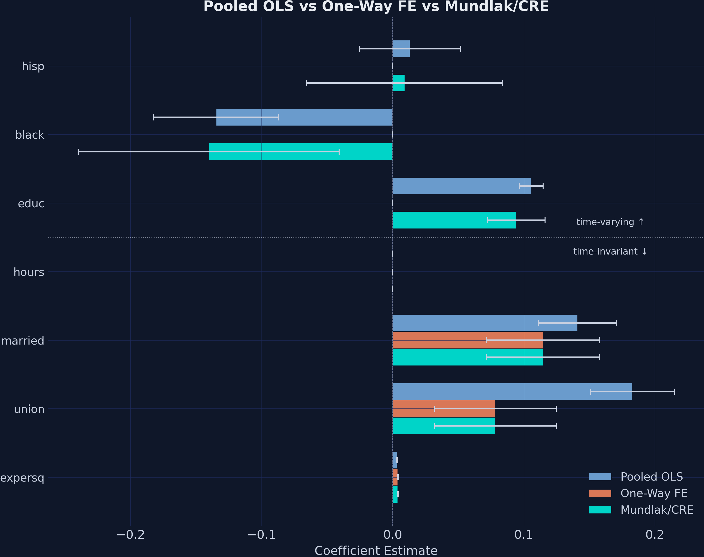
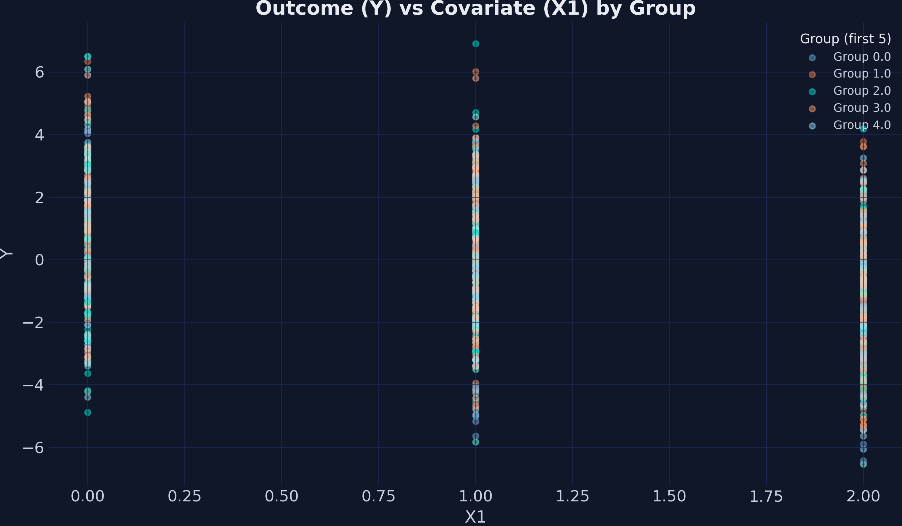
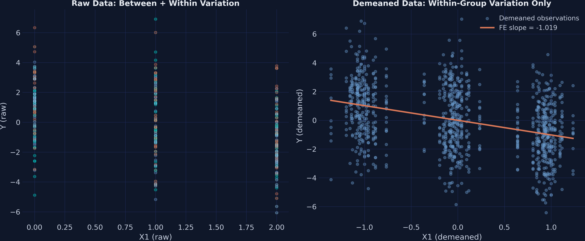
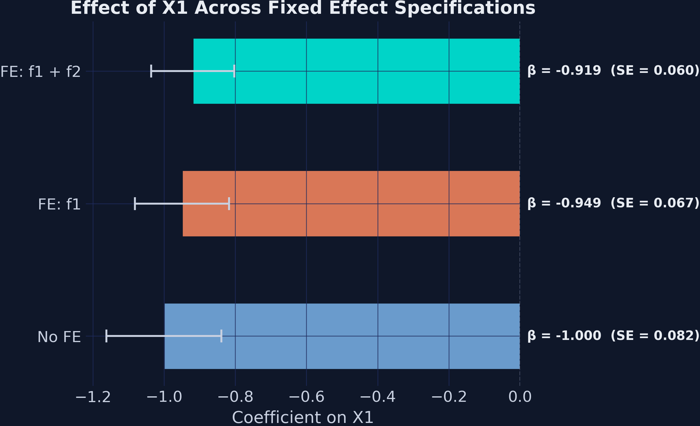
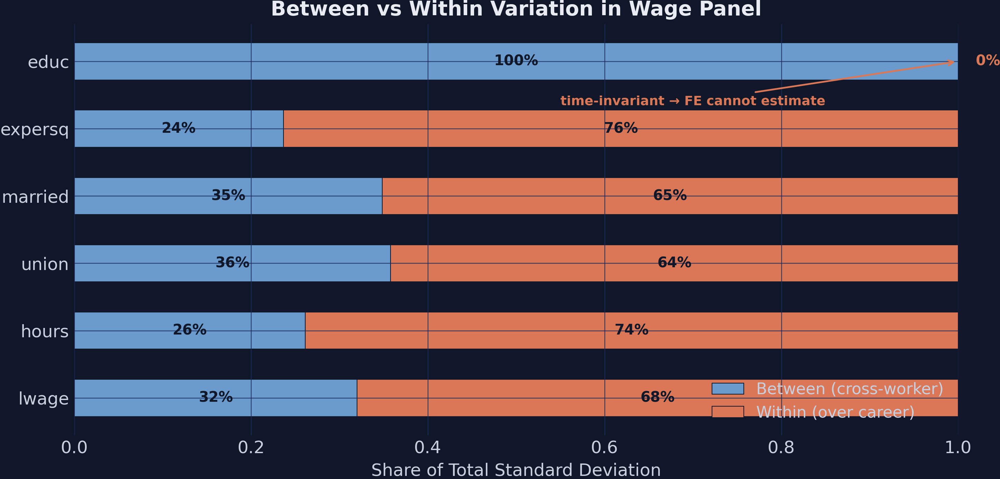
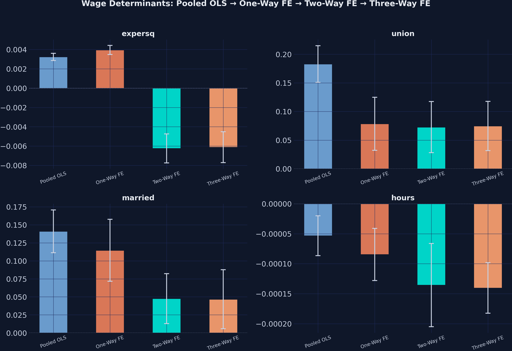
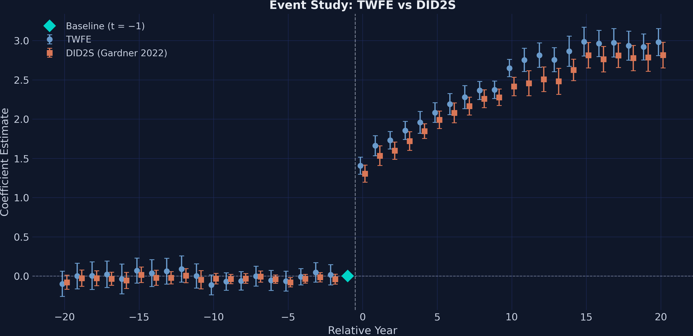

# The Tension {.divider background-color="#d97757"}

[Act I]{.act}

## Union members earn 18% more — but is that the union, or who joins it?

A simple regression says union-covered workers earn **18.3%** more per hour.

. . .

But the workers who join unions may also be more able, more motivated, or sorted into better firms. *How much of that 18% is the union — and how much is selection?*

::: {.notes}
The central tension of observational panel data: a raw association blends the effect we care about (the union effect) with confounding from who selects into treatment. Unobserved ability differs across workers and correlates with both wages and union membership. We need a tool that strips the selection without a randomized experiment.
:::

## One control — worker fixed effects — cuts the union premium nearly in half



::: {.notes}
Spoiler figure — don't decode every bar yet. Just plant the headline: absorbing one worker-level intercept per person moves the union coefficient from 0.183 to 0.078, and CRE later recovers the education and race coefficients that one-way FE silently drops. We earn each of these in Act II.
:::

## Where we're going

::: {.incremental}
- Why unobserved group heterogeneity biases OLS
- Fixed effects as demeaning — the within transformation
- Two-way FE, clustered standard errors, and IV
- A real wage panel: the union premium and the CRE/Mundlak recovery
- Event studies: when standard TWFE breaks down
:::

# The Investigation {.divider background-color="#6a9bcc"}

[Act II]{.act}

## Groups sit at different levels — that between-group gap is the confounder



::: {.notes}
Before any model: groups have distinct average levels of Y. Pooled OLS mixes the within-group slope (what we want) with these between-group level differences (which may reflect confounders). If group membership correlates with X1, that mixing is bias.
:::

## A fixed effect is just one extra intercept per group

$$Y_{it} = \alpha_i + X_{it}\beta + u_{it}$$

Add a unit-specific intercept $\alpha_i$ that absorbs **every** time-invariant characteristic of unit $i$ — observed or not.

[Block one entire class of confounders — innate ability, firm culture, institutional quality — in a single step.]{.comment}

::: {.notes}
The mechanism: α_i soaks up anything constant within a unit. You don't have to name the confounder or even measure it — as long as it doesn't change over the observation window, the fixed effect removes it. That is the whole appeal of FE for observational panel data.
:::

## Absorbing group FE is mathematically identical to demeaning

$$\hat{\beta}_{FE} = \left(\sum_{i} \ddot{X}_i' \ddot{X}_i\right)^{-1} \sum_{i} \ddot{X}_i' \ddot{Y}_i$$

where $\ddot{X}_i = X_{it} - \bar{X}_i$ and $\ddot{Y}_i = Y_{it} - \bar{Y}_i$ are demeaned within each group.

[Subtract each group's own average, then run plain OLS — that is all a fixed effect does.]{.comment}

::: {.notes}
The within transformation. Replace every variable by its deviation from the unit's own time-average. Equivalent to including unit dummies, but vastly faster — modern packages demean rather than estimate thousands of nuisance intercepts. The post proves the equivalence numerically: FE absorption and manual demeaning both give −1.0190 on X1.
:::

## Demeaning collapses scattered clusters onto one clean within-group slope



::: {.notes}
Left panel = between + within variation, the source of OLS confounding. Right panel = after subtracting group means, only within-group deviations remain, and the pure slope of −1.019 emerges. This picture is the intuition for the entire method: remove group averages, eliminate any confounder constant within groups.
:::

## PyFixest absorbs high-dimensional FE with one pipe in the formula

``` {.python code-line-numbers="1|3|4-5|6"}
import pyfixest as pf

fit_ols = pf.feols("Y ~ X1", data=data, vcov="HC1")            # no FE
fit_fe1 = pf.feols("Y ~ X1 | group_id", data=data, vcov="HC1") # one-way FE
fit_2w  = pf.feols("Y ~ X1 + X2 | f1 + f2", data=data)         # two-way FE
fit_iv  = pf.feols("Y2 ~ 1 | f1 + f2 | X1 ~ Z1 + Z2", data=data) # FE + IV
```

::: {.notes}
The whole API in four lines. The pipe separates outcome ~ regressors from the fixed-effects slot; a second pipe adds the IV stage. Formula syntax is borrowed from R's fixest. Demeaning is silent and fast even with thousands of groups — that is the high-dimensional part.
:::

## Adding fixed effects cumulatively drives R-squared from 0.12 to 0.61



::: {.notes}
Using csw0(f1, f2), one call fits three nested models. The X1 coefficient stays near −1.0 (−1.000 → −0.949 → −0.919) while R² climbs 0.123 → 0.437 → 0.609 and the SE shrinks 0.082 → 0.060. Stability across specifications is the credibility check; a large swing would flag omitted-variable concerns.
:::

## Clustering standard errors inflates the X1 SE by 50% — same point estimate

| SE assumption | SE($\hat\beta_{X_1}$) | $t$-stat |
|---|---:|---:|
| iid | 0.0858 | −11.9 |
| HC1 (robust) | 0.0833 | −12.2 |
| CRV1 (group) | 0.1172 | −8.7 |
| CRV3 (group) | [0.1247]{.key} | −8.2 |

[The estimate never moves; only honesty about uncertainty does.]{.comment}

::: {.notes}
Cluster-robust SEs allow arbitrary within-group correlation — essential when observations inside a group are not independent. Moving from HC1 to CRV3 inflates the SE 50% (0.0833 → 0.1247) and drops the t-stat from 12.2 to 8.2. Here every p-value still clears 0.001, but for a weaker effect this could flip significance. Default to clustering at the level where errors travel together.
:::

## IV through fixed effects recovers a strong first stage (F = 311)

$$\underbrace{X_1 = \pi_0 + \pi_1 Z_1 + \pi_2 Z_2 + \alpha_i + \gamma_t + \nu}_{\text{first stage}} \;\Rightarrow\; \underbrace{Y_2 = \beta\, \hat{X}_1 + \alpha_i + \gamma_t + \epsilon}_{\text{second stage}}$$

The IV estimate is $-1.600$ (SE 0.336) vs OLS $\approx -1.0$ — attenuation reversed; first-stage $F = 311.54 \gg 10$.

::: {.notes}
When the regressor is endogenous, FE alone is not enough. PyFixest's `Y2 ~ 1 | f1 + f2 | X1 ~ Z1 + Z2` absorbs the fixed effects and instruments X1 in one call. The large IV estimate signals OLS was attenuated toward zero. With heterogeneous effects IV identifies a LATE, not the ATE — worth flagging to students.
:::

# The Resolution {.divider background-color="#00d4c8"}

[Act III]{.act}

## The wage panel verdict: more than half the union premium was selection

| Variable | Pooled OLS | One-Way FE |
|---|---:|---:|
| union | 0.183 | [0.078]{.key} |
| married | 0.141 | 0.115 |
| educ | 0.106 | dropped |
| black | −0.135 | dropped |
| R-squared | 0.175 | 0.605 |

[One worker intercept each: the union premium halves and $R^2$ more than triples.]{.comment}

::: {.notes}
Vella–Verbeek NLSY panel: 545 young men over 8 years, 4,360 rows. One-way FE cuts the union premium 18.3% → 7.8% — over half the raw association was who selects into unions, not what unions do. R² jumps 0.175 → 0.605. The price: educ, black, hisp are perfectly collinear with worker dummies and silently dropped.
:::

## Worker fixed effects cut the union premium from 18.3% to 7.8% {background-color="#141413"}

[7.8%]{.bignum}

[union premium under one-way worker FE (was 18.3% in pooled OLS · SE 0.024)]{.bignum-label}

::: {.notes}
The hero number. Between the pooled OLS premium of 18.3% and the FE premium of 7.8%, the gap is selection: workers who join unions differ systematically in unobserved ability. This is the routine, dramatic correction that makes FE appear in nearly every panel paper.
:::

## Why education vanishes: its demeaned column is all zeros



$$\ddot{educ}_{it} = educ_i - \bar{educ}_i = 0 \quad \text{for all } t$$

::: {.notes}
The within-between decomposition diagnoses what FE can estimate before you run it. Education has a 0% within share — no worker changes schooling during the panel — so demeaning makes it a column of zeros, perfectly collinear with the worker dummies. Union (64%) and married (65%) have substantial within shares and survive. Run this diagnostic first, always.
:::

## CRE swaps entity dummies for career averages and buys education back

$$\ln(wage_{it}) = \beta X_{it} + \gamma Z_i + \pi \bar{X}_i + \epsilon_{it}$$

Replace 545 worker dummies with each worker's career averages $\bar{X}_i$.

[Time-varying $\hat\beta$ still match one-way FE; the time-invariant $\gamma$ become estimable again.]{.comment}

::: {.notes}
The Mundlak (1978) device. The individual means proxy for the unobserved effect α_i, so once they are controlled the time-invariant variables are no longer collinear with anything. CRE assumes α_i is a linear function of the career averages — stronger than FE's unrestricted α_i, but it recovers education and race.
:::

## More FE dimensions barely move anything — the action was one-way FE



::: {.notes}
Diminishing returns. Going from pooled to one-way FE moves the union premium 18.3% → 7.8% and R² 0.175 → 0.605. Adding year effects (TWFE) stabilizes union at 7.3% and R² 0.631; adding occupation as a third dimension does essentially nothing (7.5%, R² 0.632). Stability across the last three specifications is exactly the robustness you want to report.
:::

## TWFE event studies overstate the effect under staggered adoption



::: {.notes}
Both estimators show near-zero pre-trends (parallel-trends check passes) and a jump at period 0 of about 1.3–1.4 growing to ≈2.8 by period 20. TWFE sits above DID2S in post-treatment periods — the documented upward bias of TWFE under staggered timing and heterogeneous effects. DID2S (Gardner 2022) estimates the counterfactual from untreated observations only. Estimand here is the ATT.
:::

## Does FE make this causal? No — it removes one class of confounder, not all

[Objection.]{.objection} Fixed effects look like a clean experiment — surely 7.8% is the causal union effect.

. . .

[Response.]{.rebuttal} FE only removes **time-invariant** confounders. A worker whose ability *changes* with union status, or reverse causality, still biases $\hat\beta$. CRE adds an even stronger assumption. Identification rests on no time-varying confounding — not on the absorber itself.

::: {.notes}
Steelman the strong reading, then bound it. FE is a powerful but partial tool: it discards between-group variation and assumes confounders are constant within units. The union premium of 7.8% is the within-worker association net of fixed traits — credible, but not a randomized estimate. Be honest about what the method does and does not buy.
:::

# Let the data's within-group variation, not its levels, identify the effect. {.divider background-color="#141413"}

::: {.notes}
The single takeaway. Fixed effects discipline observational panel estimates by using only within-unit variation — turning an 18.3% raw premium into a 7.8% within-worker one — at the cost of absorbing time-invariant effects, a tradeoff CRE/Mundlak and robust event-study estimators can partly resolve.
:::
