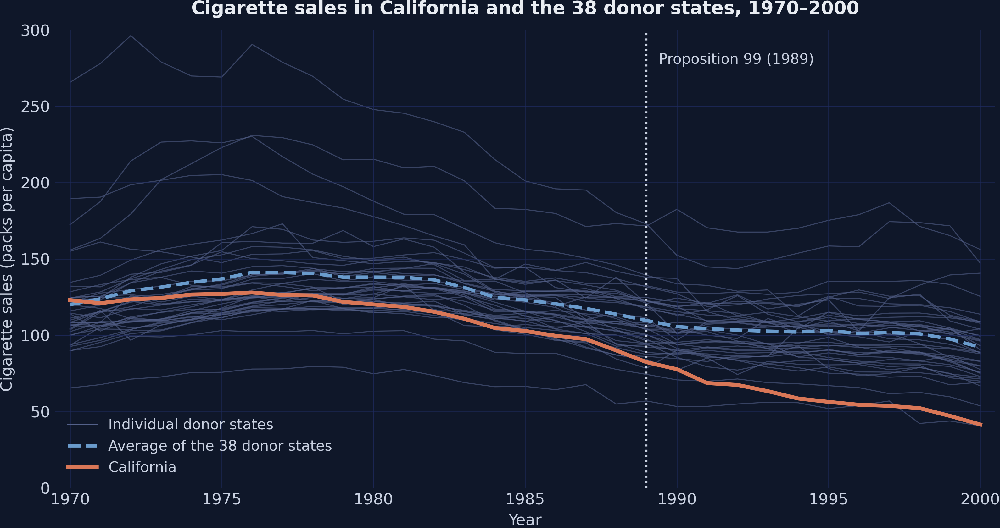
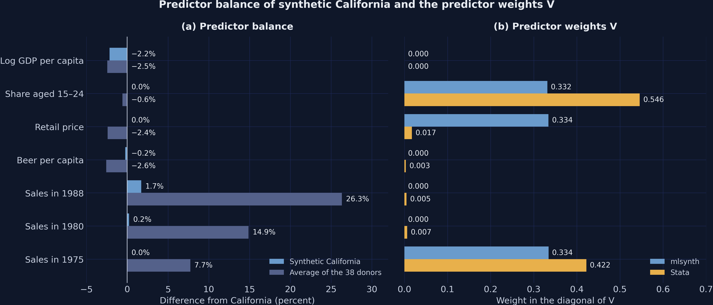
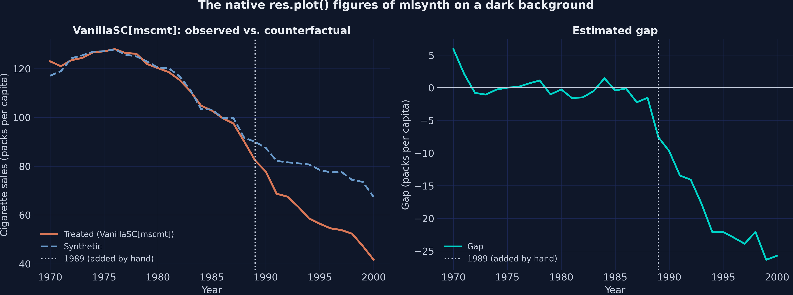
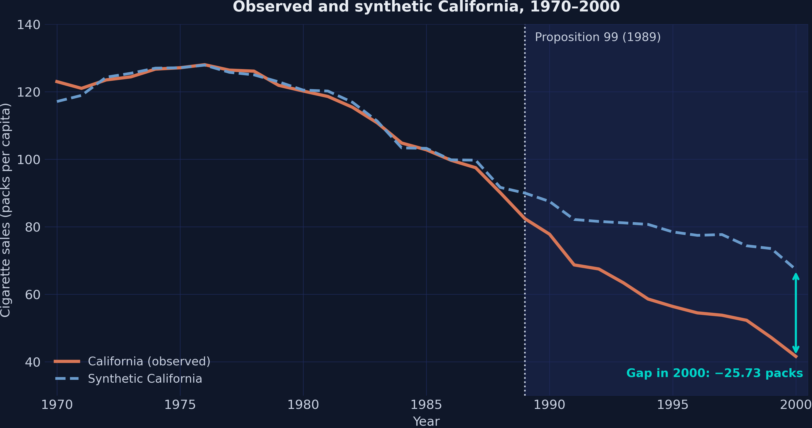
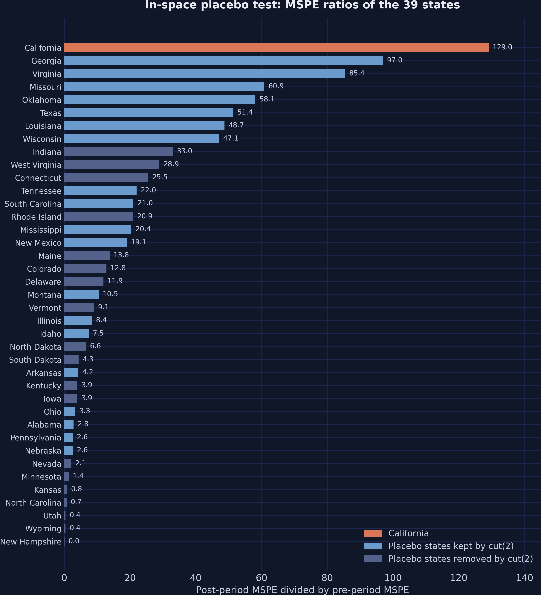
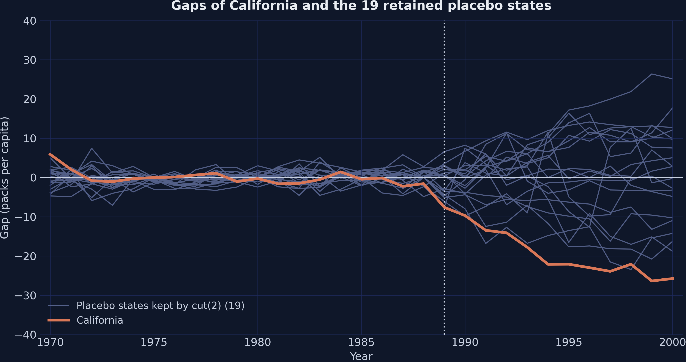
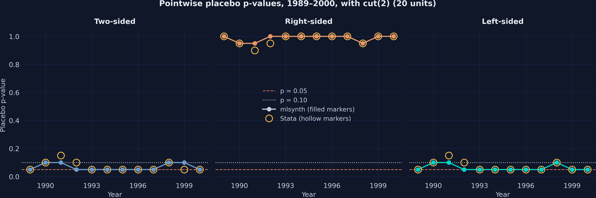
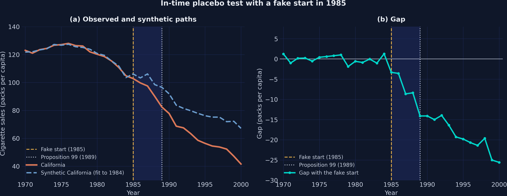
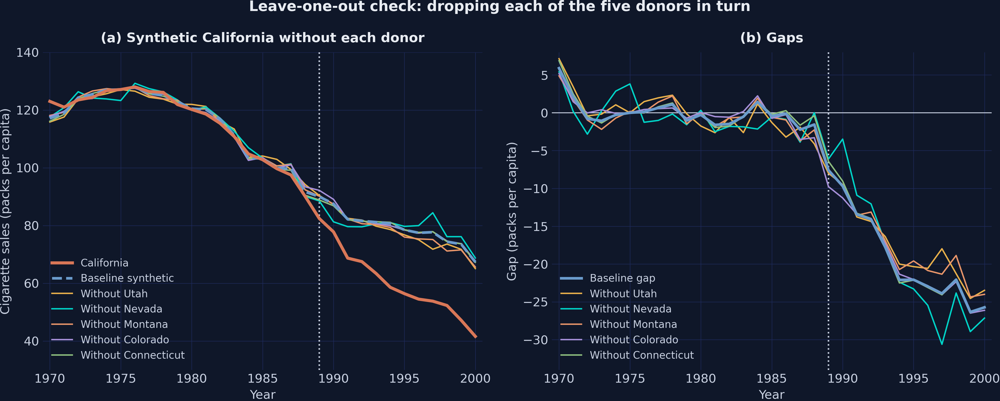
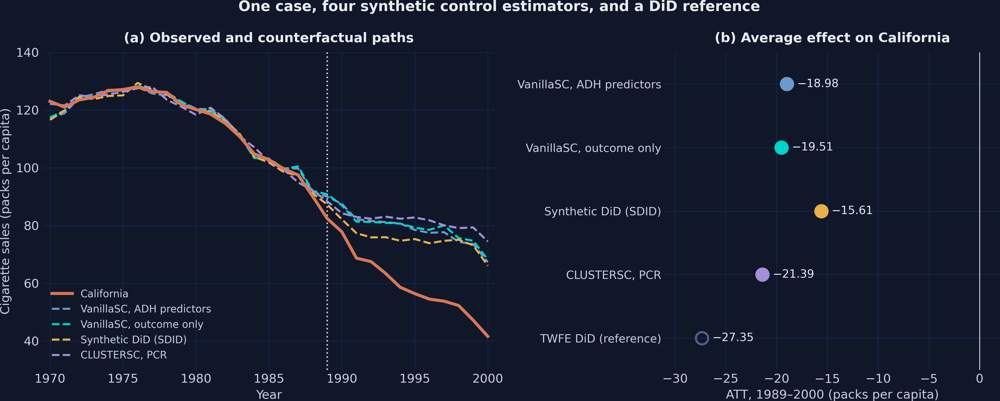

# Results Report: Introduction to the Synthetic Control Method in Python with mlsynth

- **Script:** `script.py` (1,846 lines), read but not modified; seed 42; backend `mscmt` with `canonical_v="min.loss.w"`.
- **Executed:** 2026-10-05; this report reads that run and does not re-run the script.
- **Status:** success; 96 PASS and 0 FAIL checks; no warning, and only one intended, caught `MlsynthDataError`.
- **Runtime:** not in the log, which omits timings; a timed run took 2 minutes 47 seconds on an Intel Mac (`README.md`).
- **Language:** Python 3.13.11 on Darwin x86_64.
- **Key packages:** mlsynth 1.0.0 (PyPI build, fingerprint `pypi`); numpy 2.3.5; pandas 3.0.1; scipy 1.17.1; matplotlib 3.10.8; cvxpy 1.8.1; scs 3.2.8; statsmodels 0.14.6; pydantic 2.13.4.
- **Outputs:** 12 figures (`sc101_*.png`), 18 CSV tables, `sc101_results.json`, and `execution_log.txt` (599 lines).
- **Methodological reference:** Abadie, A., Diamond, A., and Hainmueller, J. (2010). Synthetic Control Methods for Comparative Case Studies: Estimating the Effect of California's Tobacco Control Program. *Journal of the American Statistical Association* 105(490): 493–505. https://doi.org/10.1198/jasa.2009.ap08746 <!-- style-allow: cited title kept verbatim -->
- **Software references:** mlsynth by Jared Greathouse (https://github.com/jgreathouse9/mlsynth; documentation at https://mlsynth.readthedocs.io). Yan, G., and Chen, Q. (2023). synth2: Synthetic control method with placebo tests, robustness test, and visualization. *The Stata Journal* 23(3): 597–624.
- **Benchmark:** `content/post/stata_sc/analysis.log` (synth2 2.1.0, synth 0.0.7), refreshed on October 5, 2026, with the estimates of the run of April 27, 2026. The script ports the specification of that tutorial, which follows Abadie, Diamond, and Hainmueller (2010).

---

## Execution Summary

The question is how much Proposition 99 reduced cigarette sales per capita in California over 1989–2000. The script answers it with the `VanillaSC` estimator of mlsynth, replicating the synthetic control analysis of the Stata post. It uses the `smoking_sc.dta` panel of that post, read from a local CSV copy, with 39 states observed yearly from 1970 to 2000. The estimand is the average treatment effect on the treated (ATT) for California, and the design is observational. The run is clean, with 96 PASS checks, no FAIL, and no warning in the log. Against the Stata benchmark, all 31 benchmark rows of the scorecard pass, and six further rows are informative only.

The headline has three layers. First, the baseline fit gives an ATT of −18.98 packs per capita, or −23.93 percent relative to mean synthetic sales. Second, the robustness checks largely support it. California ranks first among the 39 states of the placebo test (p = 0.026), and the leave-one-out ATTs stay between −19.29 and −17.52. The in-time placebo is the exception within this layer, since a fake start in 1985 yields gaps that average 0.31 times the ATT. Third, three other estimators place the ATT between −21.39 and −15.61, while a two-way fixed effects reference gives −27.35. Together, the three layers point to a large and persistent reduction, with some doubt about its exact timing.

### Warnings

- **Python warnings:** none in the log; the script filters `DeprecationWarning` at import.
- **Errors:** none; one intended `MlsynthDataError` for a fake start in 1984 is caught and checked.
- **Checks:** 96 PASS and 0 FAIL; the scorecard has 31 passing benchmark rows and 6 informative rows.
- **SDID weights:** the script notes that SDID unit and time weights are not exposed in mlsynth 1.0.0.
- **CLUSTERSC defaults:** the script notes that `clustering=False` changes the ATT ("defaults matter").
- **TWFE standard error:** the script flags it as unreliable, since it rests on one treated cluster.
- **Determinism:** the log prints no timings, and two consecutive runs gave byte-identical logs, CSV files, and JSON (`README.md`).

---

## Data Overview

#### Raw output (`execution_log.txt`, lines 19–51)

```text
============================================================
SECTION 1: Data loading and checks
============================================================
Loaded 1209 rows from data/smoking_sc.csv

Shape: (1209, 7)

Column types:
state            str
year           int64
cigsale      float64
lnincome     float64
beer         float64
age15to24    float64
retprice     float64
dtype: object

First rows:
     state  year     cigsale  lnincome  beer  age15to24   retprice
0  Alabama  1970   89.800003       NaN   NaN   0.178862  39.599998
1  Alabama  1971   95.400002       NaN   NaN   0.179928  42.700001
2  Alabama  1972  101.099998  9.498476   NaN   0.180994  42.299999
3  Alabama  1973  102.900002  9.550107   NaN   0.182060  42.099998
4  Alabama  1974  108.199997  9.537163   NaN   0.183126  43.099998
5  Alabama  1975  111.699997  9.540031   NaN   0.184192  46.599998

Descriptive statistics:
            count      mean      std      min       25%       50%       75%       max
cigsale    1209.0  118.8932  32.7674  40.7000  100.9000  116.3000  130.5000  296.2000
lnincome   1014.0    9.8616   0.1707   9.3974    9.7391    9.8608    9.9728   10.4866
beer        546.0   23.4304   4.2232   2.5000   20.9000   23.3000   25.1000   40.4000
age15to24   819.0    0.1755   0.0152   0.1294    0.1658    0.1781    0.1867    0.2037
retprice   1209.0  108.3419  64.3820  27.3000   50.0000   95.5000  158.4000  351.2000
```

#### Table: descriptive statistics (`descriptive_stats.csv`)

| Variable | N | Mean | SD | Min | Median | Max | Stata N | Stata mean |
|---|---:|---:|---:|---:|---:|---:|---:|---:|
| `cigsale` | 1209 | 118.89322 | 32.767404 | 40.700001 | 116.3 | 296.20001 | 1209 | 118.8932 |
| `lnincome` | 1014 | 9.8616342 | 0.17067692 | 9.3974495 | 9.8608437 | 10.486617 | 1014 | 9.861634 |
| `beer` | 546 | 23.430403 | 4.2231897 | 2.5 | 23.299999 | 40.400002 | 546 | 23.4304 |
| `age15to24` | 819 | 0.17547204 | 0.015158943 | 0.12944819 | 0.17812061 | 0.20367534 | 819 | 0.175472 |
| `retprice` | 1209 | 108.34194 | 64.381986 | 27.299999 | 95.5 | 351.20001 | 1209 | 108.3419 |

**Interpretation:** The panel is strongly balanced, with 39 states, 31 years, and 1,209 rows. Sales and prices are complete, but log GDP per capita covers 1,014 rows and beer only 546. Sales average 118.89 packs per capita and range from 40.70 to 296.20 across states and years. Section 4.1 checks these counts and means against the Stata summary.

---

## Method Results

### 4.1 Data checks against the Stata summary

#### Raw output (`execution_log.txt`, lines 52–86)

```text
  PASS  Number of rows: 1209 equals 1209
  PASS  Number of states: 39 equals 39
  PASS  Number of years: 31 equals 31
  PASS  Balanced panel (31 years per state): yes
  PASS  California is the third state (Stata code 3): 2 equals 2
  PASS  Observations of cigsale: 1209 equals 1209
  PASS  Mean of cigsale: 118.893 vs 118.893, |diff| 1.8e-05 <= 0.0001
  PASS  Observations of lnincome: 1014 equals 1014
  PASS  Mean of lnincome: 9.86163 vs 9.86163, |diff| 2.5e-07 <= 0.0001
  PASS  Observations of beer: 546 equals 546
  PASS  Mean of beer: 23.4304 vs 23.4304, |diff| 3.0e-06 <= 0.0001
  PASS  Observations of age15to24: 819 equals 819
  PASS  Mean of age15to24: 0.175472 vs 0.175472, |diff| 4.1e-08 <= 0.0001
  PASS  Observations of retprice: 1209 equals 1209
  PASS  Mean of retprice: 108.342 vs 108.342, |diff| 3.6e-05 <= 0.0001

Coverage by variable:
 variable  n_obs  first_year  last_year  n_years
  cigsale   1209        1970       2000       31
 lnincome   1014        1972       1997       26
     beer    546        1984       1997       14
age15to24    819        1970       1990       21
 retprice   1209        1970       2000       31
Beer data begin in 1984, so any predictor window that ends before 1984 has no beer values.

Mean cigarette sales 1970–2000, lowest three states:
state
Utah          63.84
New Mexico    84.26
California    94.59
Highest three states:
state
North Carolina    164.29
Kentucky          187.94
New Hampshire     213.06
```

#### Table: coverage by variable (`coverage.csv`)

| Variable | Observations | First year | Last year | Years |
|---|---:|---:|---:|---:|
| `cigsale` | 1209 | 1970 | 2000 | 31 |
| `lnincome` | 1014 | 1972 | 1997 | 26 |
| `beer` | 546 | 1984 | 1997 | 14 |
| `age15to24` | 819 | 1970 | 1990 | 21 |
| `retprice` | 1209 | 1970 | 2000 | 31 |

**Interpretation:** All 15 data checks pass, so the panel matches the Stata file in size, order, and summary statistics. Coverage differs across variables: beer starts in 1984, and the share aged 15–24 ends in 1990. Windows that end before 1984 thus lack beer values, which later blocks a fake start in 1984. State means over 1970–2000 span a wide range, from 63.84 packs in Utah to 213.06 packs in New Hampshire. Only Utah and New Mexico average less than California (94.59), but this mean includes the program years. Over the fitting years 1970–1988, California averages 116.21 packs, and in 1988 it sold 90.1 packs against a donor range of 55.0 to 180.4. Donors therefore lie on both sides of California before 1989, so a weighted average of donors can reach its level, which an equal-weight average does not guarantee.

### 4.2 Raw trends and naive comparisons



#### Raw output (`execution_log.txt`, lines 88–105)

```text
============================================================
SECTION 2: Raw trends
============================================================
California and the average of the 38 donor states (packs per capita):
 year  california  donor_average  difference
 1970       123.0         120.08        2.92
 1975       127.1         136.93       -9.83
 1980       120.2         138.09      -17.89
 1985       102.8         123.12      -20.32
 1988        90.1         113.82      -23.72
 1989        82.4         109.66      -27.26
 1995        56.4         103.16      -46.76
 2000        41.6          92.13      -50.53

California: 116.21 before 1989, 60.35 after (naive before-after change -55.86)
Donor average: 130.57 before 1989, 102.06 after (change -28.51)
Difference in the two changes (2x2 means DiD): -27.3491
Saved: sc101_raw_trends.png
```

#### Table: California and the donor average (`synthetic_path.csv`)

| Year | California | Average of the 38 donors |
|---:|---:|---:|
| 1970 | 123 | 120.08421 |
| 1975 | 127.1 | 136.93158 |
| 1980 | 120.2 | 138.08947 |
| 1985 | 102.8 | 123.11579 |
| 1988 | 90.099998 | 113.82368 |
| 1989 | 82.400002 | 109.66316 |
| 1995 | 56.400002 | 103.15789 |
| 2000 | 41.599998 | 92.134211 |

#### Table: naive comparisons (`sc101_results.json`, key `baseline.naive`)

| Quantity (packs per capita) | Value |
|---|---:|
| California, mean 1970–1988 | 116.210526 |
| California, mean 1989–2000 | 60.350000 |
| Donor average, mean 1970–1988 | 130.569529 |
| Donor average, mean 1989–2000 | 102.058114 |
| Difference in the two changes (means DiD) | −27.349111 |

**Interpretation:** California started 2.92 packs above the donor average in 1970 but sat 23.72 packs below it in 1988. This divergence before the policy rules out the simple average as a counterfactual. The naive change of −55.86 packs mixes the policy with a secular decline that also cut donor sales by 28.51. Even the difference-in-differences of the means, −27.35, assumes parallel paths, which the pre-treatment data contradict.

### 4.3 Predictor means

#### Raw output (`execution_log.txt`, lines 107–146)

```text
============================================================
SECTION 3: Panel preparation and predictor means
============================================================
Prepared panel: 1209 rows, columns ['state', 'year', 'cigsale', 'lnincome', 'beer', 'age15to24', 'retprice', 'treated', 'cigsale_1988', 'cigsale_1980', 'cigsale_1975']
Treated observations (California, 1989–2000): 12

Predictor windows (inclusive years):
  lnincome      1980–1988   Log GDP per capita
  age15to24     1980–1988   Share aged 15–24
  retprice      1980–1988   Retail price
  beer          1980–1988   Beer per capita
  cigsale_1988  1988–1988   Sales in 1988
  cigsale_1980  1980–1980   Sales in 1980
  cigsale_1975  1975–1975   Sales in 1975

Predictor means:
   predictor  california  stata_treated  donor_average  stata_average
    lnincome   10.076559      10.076559       9.829197       9.829197
   age15to24    0.173532       0.173532       0.172510       0.172510
    retprice   89.422223      89.422223      87.266082      87.266082
        beer   24.280000      24.280000      23.655263      23.655263
cigsale_1988   90.099998      90.099998     113.823684     113.823680
cigsale_1980  120.199997     120.200000     138.089474     138.089470
cigsale_1975  127.099998     127.100000     136.931579     136.931580
  PASS  California mean of lnincome equals Stata: 10.0766 vs 10.0766, |diff| 3.6e-07 <= 0.0001
  PASS  Donor average of lnincome equals Stata: 9.8292 vs 9.8292, |diff| 1.6e-08 <= 0.0001
  PASS  California mean of age15to24 equals Stata: 0.173532 vs 0.173532, |diff| 1.7e-09 <= 0.0001
  PASS  Donor average of age15to24 equals Stata: 0.17251 vs 0.17251, |diff| 4.0e-09 <= 0.0001
  PASS  California mean of retprice equals Stata: 89.4222 vs 89.4222, |diff| 4.1e-07 <= 0.0001
  PASS  Donor average of retprice equals Stata: 87.2661 vs 87.2661, |diff| 8.4e-08 <= 0.0001
  PASS  California mean of beer equals Stata: 24.28 vs 24.28, |diff| 3.1e-07 <= 0.0001
  PASS  Donor average of beer equals Stata: 23.6553 vs 23.6553, |diff| 1.8e-07 <= 0.0001
  PASS  California mean of cigsale_1988 equals Stata: 90.1 vs 90.1, |diff| 4.7e-07 <= 0.0001
  PASS  Donor average of cigsale_1988 equals Stata: 113.824 vs 113.824, |diff| 3.7e-06 <= 0.0001
  PASS  California mean of cigsale_1980 equals Stata: 120.2 vs 120.2, |diff| 3.1e-06 <= 0.0001
  PASS  Donor average of cigsale_1980 equals Stata: 138.089 vs 138.089, |diff| 3.7e-06 <= 0.0001
  PASS  California mean of cigsale_1975 equals Stata: 127.1 vs 127.1, |diff| 1.5e-06 <= 0.0001
  PASS  Donor average of cigsale_1975 equals Stata: 136.932 vs 136.932, |diff| 1.0e-06 <= 0.0001
  PASS  Max |diff| of the seven California predictor means: 3.05176e-06 vs 0, |diff| 3.1e-06 <= 0.0001
  PASS  Max |diff| of the seven donor-average predictor means: 3.72437e-06 vs 0, |diff| 3.7e-06 <= 0.0001
```

#### Table: predictor means of California and the donor average (`balance.csv`)

| Predictor | Label | Window | California | Donor average | Gap of the donor average (percent) |
|---|---|---|---:|---:|---:|
| `lnincome` | Log GDP per capita | 1980–1988 | 10.076559 | 9.8291968 | −2.4548 |
| `age15to24` | Share aged 15–24 | 1980–1988 | 0.17353238 | 0.17251011 | −0.5891 |
| `retprice` | Retail price | 1980–1988 | 89.422223 | 87.266082 | −2.4112 |
| `beer` | Beer per capita | 1980–1988 (data from 1984) | 24.28 | 23.655263 | −2.5731 |
| `cigsale_1988` | Sales in 1988 | 1988 | 90.099998 | 113.82368 | 26.3304 |
| `cigsale_1980` | Sales in 1980 | 1980 | 120.2 | 138.08947 | 14.8831 |
| `cigsale_1975` | Sales in 1975 | 1975 | 127.1 | 136.93158 | 7.7353 |

**Interpretation:** The 14 predictor means match the Treated and Average Control columns of Stata within `3.7e-06`. The specification of this post averages each covariate over 1980–1988 and gives each lagged-sales predictor its own one-year window. It thus reproduces the predictor construction of synth2, including a beer average over 1984–1988 alone. The donor average already misses lagged sales in California, by 26.3 percent in 1988 and 14.9 percent in 1980. These gaps show why the method weights the donors instead of averaging them equally.

### 4.4 Baseline synthetic California

#### 4.4.1 The result object and the donor weights


##### Raw output (`execution_log.txt`, lines 148–174)

```text
============================================================
SECTION 4: Baseline synthetic California
============================================================
A tour of the result object:
  type(res)                               BaseEstimatorResults
  res.method_details.method_name          VanillaSC[mscmt]
  res.att                                 -18.9816
  res.effects.att_percent                 -23.93
  res.fit_diagnostics.rmse_pre            1.7540
  res.fit_diagnostics.r_squared_pre       0.9762
  res.fit_diagnostics.rmse_post           19.9254
  res.weights.summary_stats['n_donors']   5
  len(additional_outputs['donor_names'])  38
  res.time_series.intervention_time       None
  res.inference                           None

Donor weights (positive only): Utah 0.3351, Nevada 0.2356, Montana 0.2019, Colorado 0.1595, Connecticut 0.0679
Stata weights:                 Utah 0.3340, Nevada 0.2350, Montana 0.2020, Colorado 0.1610, Connecticut 0.0680
Sum of weights: 1.0000000000; positive donors: 5 of 38
  PASS  Sum of mlsynth weights: 1, |diff| below 1e-08
  PASS  Positive donors are the five Stata donors (weight above 0.001): yes
  PASS  Weight of Utah: 0.335071 vs 0.334, |diff| 1.1e-03 <= 0.005
  PASS  Weight of Nevada: 0.235608 vs 0.235, |diff| 6.1e-04 <= 0.005
  PASS  Weight of Montana: 0.201891 vs 0.202, |diff| 1.1e-04 <= 0.005
  PASS  Weight of Colorado: 0.159525 vs 0.161, |diff| 1.5e-03 <= 0.005
  PASS  Weight of Connecticut: 0.0679035 vs 0.068, |diff| 9.6e-05 <= 0.005
  PASS  Largest weight among the other 33 donors: 0 vs 0, |diff| 0.0e+00 <= 1e-06
```

##### Table: donor weights (`weights.csv`)

| Donor | mlsynth weight | Stata weight |
|---|---:|---:|
| Utah | 0.33507127 | 0.334 |
| Nevada | 0.23560825 | 0.235 |
| Montana | 0.20189148 | 0.202 |
| Colorado | 0.15952549 | 0.161 |
| Connecticut | 0.067903508 | 0.068 |
| Other 33 donors | 0 | 0 |

**Interpretation:** The baseline puts positive weight on 5 of the 38 donors, and the weights sum to one. Utah (0.335), Nevada (0.236), Montana (0.202), Colorado (0.160), and Connecticut (0.068) lie within 0.0015 of Stata. The field `n_donors` equals 5 because it counts positive donors, while `donor_names` lists all 38. Two fields are empty: `intervention_time` is None in VanillaSC, and `inference` is None under `inference=False`. Both empty fields are expected, and neither affects the estimate.

#### 4.4.2 Predictor balance and the V weights



##### Raw output (`execution_log.txt`, lines 176–197)

```text
Predictor weights V (diagonal):
   predictor  v_mlsynth  v_stata
    lnincome   0.000000 0.000049
   age15to24   0.331560 0.545871
    retprice   0.334157 0.017410
        beer   0.000000 0.003135
cigsale_1988   0.000000 0.004903
cigsale_1980   0.000000 0.006557
cigsale_1975   0.334282 0.422074
v_agreement reported by mlsynth: 0.99999999
The two V vectors differ, yet the donor weights agree: V is not identified.

Predictor balance:
   predictor  treated  synthetic  synthetic_stata_w  donor_average  stata_synthetic  pct_gap_synthetic  pct_gap_average
    lnincome  10.0766     9.8585             9.8588         9.8292           9.8588            -2.1643          -2.4548
   age15to24   0.1735     0.1735             0.1735         0.1725           0.1735             0.0000          -0.5891
    retprice  89.4222    89.4222            89.4108        87.2661          89.4108            -0.0000          -2.4112
        beer  24.2800    24.2226            24.2278        23.6553          24.2278            -0.2364          -2.5731
cigsale_1988  90.1000    91.6539            91.6677       113.8237          91.6677             1.7246          26.3304
cigsale_1980 120.2000   120.4721           120.5017       138.0895         120.5017             0.2264          14.8831
cigsale_1975 127.1000   127.1000           127.1112       136.9316         127.1112            -0.0000           7.7353
  PASS  Max |diff| of synthetic predictors (mlsynth W vs Stata): 0.0295687 vs 0, |diff| 3.0e-02 <= 0.05
```

##### Table: predictor weights V (`predictor_weights.csv`)

| Predictor | Label | V, mlsynth | V, Stata |
|---|---|---:|---:|
| `lnincome` | Log GDP per capita | 0.000000 | 0.000049 |
| `age15to24` | Share aged 15–24 | 0.331560 | 0.545871 |
| `retprice` | Retail price | 0.334157 | 0.017410 |
| `beer` | Beer per capita | 0.000000 | 0.003135 |
| `cigsale_1988` | Sales in 1988 | 0.000000 | 0.004903 |
| `cigsale_1980` | Sales in 1980 | 0.000000 | 0.006557 |
| `cigsale_1975` | Sales in 1975 | 0.334282 | 0.422074 |

##### Table: predictor balance (`balance.csv`)

| Predictor | California | Synthetic, mlsynth W | Synthetic, Stata W | Gap of the synthetic control (percent) |
|---|---:|---:|---:|---:|
| `lnincome` | 10.076559 | 9.8584707 | 9.8587684 | −2.1643 |
| `age15to24` | 0.17353238 | 0.17353238 | 0.17352193 | 0.0000 |
| `retprice` | 89.422223 | 89.422223 | 89.4108 | 0.0000 |
| `beer` | 24.28 | 24.222592 | 24.2278 | −0.2364 |
| `cigsale_1988` | 90.099998 | 91.653876 | 91.667698 | 1.7246 |
| `cigsale_1980` | 120.2 | 120.47213 | 120.5017 | 0.2264 |
| `cigsale_1975` | 127.1 | 127.1 | 127.1112 | 0.0000 |

**Interpretation:** The mlsynth fit gives about one third each to the share aged 15–24, the retail price, and sales in 1975. Stata puts 0.546 on the share aged 15–24 and 0.422 on sales in 1975, yet both yield almost the same donor weights. V is therefore not identified, and its entries do not measure predictor importance. The log line on `v_agreement` must not be read as the opposite. Despite its name, this diagnostic reports the largest difference between the two canonical V vectors of mlsynth, so its value of 0.99999999 signals disagreement, not agreement. Section 7.4 of the post explains why this value says little about V here.

The balance table shows that synthetic California matches six predictors within 1.8 percent. Its gap of −2.16 percent on log GDP per capita looks small only because it compares logarithms. Synthetic California is 0.22 log points poorer (9.8585 against 10.0766), which means a GDP per capita about 20 percent lower in levels. Income receives almost no weight in V, so the donor weights barely improve on the donor average, which is 0.25 log points poorer.

#### 4.4.3 Paths, gap, and the ATT






##### Raw output (`execution_log.txt`, lines 199–235)

```text
ATT 1989–2000:                -18.9816
ATT in percent (mlsynth):      -23.93
Gap in 2000:                  -25.7326 (-38.2 percent of synthetic)
Pre-period RMSE:              1.7540
Post-period RMSE:             19.9254
R-squared (conventional):     0.97621
R-squared (Stata definition): 0.97435
MSPE pre / post / ratio:      3.0767 / 397.0229 / 129.0433
RMSPE ratio (mlsynth):        11.3597 (squared: 129.0433)

Post-period paths:
 year  actual  synthetic      gap  stata_synthetic  stata_gap  gap_diff
 1989    82.4    89.9894  -7.5894          89.9945    -7.5945    0.0051
 1990    77.8    87.4977  -9.6977          87.5039    -9.7039    0.0062
 1991    68.7    82.1523 -13.4523          82.1751   -13.4751    0.0228
 1992    67.5    81.5857 -14.0857          81.6075   -14.1075    0.0218
 1993    63.4    81.1681 -17.7680          81.1897   -17.7897    0.0217
 1994    58.6    80.7049 -22.1049          80.7295   -22.1295    0.0246
 1995    56.4    78.4760 -22.0760          78.5023   -22.1023    0.0263
 1996    54.5    77.4614 -22.9614          77.4827   -22.9827    0.0213
 1997    53.8    77.6947 -23.8947          77.7123   -23.9123    0.0176
 1998    52.3    74.3685 -22.0685          74.3976   -22.0976    0.0291
 1999    47.2    73.5479 -26.3479          73.5711   -26.3711    0.0232
 2000    41.6    67.3326 -25.7326          67.3550   -25.7550    0.0224
  PASS  ATT: -18.9816 vs -19.0018, |diff| 2.0e-02 <= 0.05
  PASS  Pre-period RMSE: 1.75404 vs 1.75567, |diff| 1.6e-03 <= 0.01
  PASS  R-squared (Stata definition): 0.974346 vs 0.974336, |diff| 9.1e-06 <= 0.001
  PASS  Gap in 1989: -7.58944 vs -7.5945, |diff| 5.1e-03 <= 0.05
  PASS  Gap in 2000: -25.7326 vs -25.755, |diff| 2.2e-02 <= 0.05
  PASS  Max |diff| of the 12 post-period gaps: 0.0290847 vs 0, |diff| 2.9e-02 <= 0.05
  PASS  Recomputed pre-period RMSE equals res.pre_rmse: 1.75404, |diff| below 1e-12
  PASS  Recomputed R-squared equals r_squared_pre: 0.976207, |diff| below 1e-12
Saved: sc101_mlsynth_plot.png
Saved: sc101_synthetic_path.png
Saved: sc101_gap.png
Saved: sc101_donor_weights.png
Saved: sc101_balance.png
```

##### Table: post-treatment paths and gaps (`effects_post.csv`)

| Year | Actual | Synthetic | Gap | Stata gap | Difference |
|---:|---:|---:|---:|---:|---:|
| 1989 | 82.400002 | 89.989441 | −7.5894391 | −7.5945 | 0.0050609099 |
| 1990 | 77.800003 | 87.497727 | −9.6977237 | −9.7039 | 0.0061762611 |
| 1991 | 68.699997 | 82.152303 | −13.452306 | −13.4751 | 0.022794315 |
| 1992 | 67.5 | 81.585674 | −14.085674 | −14.1075 | 0.021826444 |
| 1993 | 63.400002 | 81.16805 | −17.768049 | −17.7897 | 0.021651431 |
| 1994 | 58.599998 | 80.704921 | −22.104923 | −22.1295 | 0.024577071 |
| 1995 | 56.400002 | 78.475983 | −22.075982 | −22.1023 | 0.026318107 |
| 1996 | 54.5 | 77.461427 | −22.961427 | −22.9827 | 0.021273093 |
| 1997 | 53.799999 | 77.694663 | −23.894664 | −23.9123 | 0.01763626 |
| 1998 | 52.299999 | 74.368515 | −22.068515 | −22.0976 | 0.02908472 |
| 1999 | 47.200001 | 73.547909 | −26.347908 | −26.3711 | 0.023191501 |
| 2000 | 41.599998 | 67.332567 | −25.732569 | −25.755 | 0.022431111 |

**Interpretation:** Proposition 99 reduced sales by an estimated 18.98 packs per capita per year, or 23.93 percent relative to mean synthetic sales. The gap widens from −7.59 packs in 1989 to −25.73 in 2000, 38.2 percent below the counterfactual. The pre-treatment RMSE of 1.754 packs signals a tight fit, against a post-treatment RMSE of 19.925. Every yearly gap lies within 0.03 packs of the Stata gap.

#### 4.4.4 Other donor recipes (lab presets)

##### Raw output (`execution_log.txt`, lines 552–561)

```text
Mixer presets (lab tab 'mixer'):
  preset         pre RMSPE       ATT  gap 2000     ratio
  mlsynth           1.7540  -18.9816  -25.7326    129.04
  stata             1.7541  -19.0018  -25.7550    129.30
  outcome           1.6564  -19.5136  -26.5966    154.75
  equal_five        4.3020  -22.0467  -29.1600     28.07
  utah_only        45.3276    8.6167    0.9000      0.07
  montana_only      4.4754  -25.3583  -33.9000     38.45
  avg38            16.0439  -41.7081  -50.5342      7.01
  utah_zero        22.7555  -32.8889  -39.1533      2.14
```

##### Table: lab presets of the mixer tab (`sc101_results.json`, key `lab_scenarios.mixer`)

| Preset | Pre-treatment RMSE | ATT | Gap in 2000 | MSPE ratio |
|---|---:|---:|---:|---:|
| mlsynth fit | 1.754042 | −18.981598 | −25.732569 | 129.0433 |
| Stata W | 1.754128 | −19.001766 | −25.755001 | 129.2996 |
| Outcome-only fit | 1.656400 | −19.513630 | −26.596643 | 154.7528 |
| Equal fifths on the five donors | 4.302036 | −22.046666 | −29.160001 | 28.0704 |
| Utah only | 45.327551 | 8.616666 | 0.899998 | 0.0742 |
| Montana only | 4.475430 | −25.358333 | −33.900002 | 38.4545 |
| All 38 donors, equal weights | 16.043893 | −41.708114 | −50.534212 | 7.0078 |
| Utah set to zero, rest renormalized | 22.755504 | −32.888932 | −39.153267 | 2.1413 |

**Interpretation:** The presets show that the counterfactual depends on the donor recipe, not just the donor list. Equal fifths on the five donors raise the pre-treatment RMSE to 4.302 and move the ATT to −22.05. Utah alone fits poorly (RMSE 45.328) and even implies a positive effect of 8.62 packs. Dropping Utah without a refit gives −32.89, while the refit in Section 4.8 gives −17.52. A deletion is therefore no substitute for a refit, and the fitted shares, not the list of donors, drive the estimate.

### 4.5 Exact recomputation of the Stata path

#### Raw output (`execution_log.txt`, lines 237–255)

```text
============================================================
SECTION 5: Exact Stata recomputations
============================================================
Synthetic California rebuilt by hand with the Stata weights:
  ATT -19.001766 (Stata e(att) -19.001767)
  Pre-period RMSE 1.75413 (Stata prints 1.75567)
  R-squared, Stata definition 0.97433641 (Stata e(r2) 0.97433642)
  Synthetic predictors: [9.8588, 0.1735, 89.4108, 24.2278, 91.6677, 120.5017, 127.1112]
  PASS  ATT with the Stata W, rebuilt by hand: -19.0018 vs -19.0018, |diff| 7.5e-07 <= 5e-05
  PASS  Max |diff| of the 12 gaps with the Stata W: 3.18909e-06 vs 0, |diff| 3.2e-06 <= 5e-05
  PASS  Max |diff| of synthetic predictors with the Stata W: 5.21851e-07 vs 0, |diff| 5.2e-07 <= 5e-05
  PASS  R-squared (Stata definition) with the Stata W: 0.974336 vs 0.974336, |diff| 1.0e-08 <= 5e-06

mlsynth with oracle_weights set to the Stata weights:
  method VanillaSC[oracle], ATT -19.001766
  gaps 1989–2000: [-7.5945, -9.7039, -13.4751, -14.1075, -17.7897, -22.1295, -22.1023, -22.9827, -23.9123, -22.0976, -26.3711, -25.755]
  PASS  ATT with oracle_weights: -19.0018 vs -19.0018, |diff| 7.5e-07 <= 5e-05
  PASS  Max |diff| of the 12 gaps with oracle_weights: 3.18909e-06 vs 0, |diff| 3.2e-06 <= 5e-05
  PASS  oracle_weights path equals the hand recomputation: 0, |diff| below 1e-09
```

#### Table: the path with the rounded Stata weights (`sc101_results.json`, keys `baseline.stata_w` and `stata.baseline`)

| Quantity | Rebuilt with the rounded Stata W | Stata e() |
|---|---:|---:|
| ATT, rebuilt by hand | −19.001766410 | −19.001767159 |
| ATT, `oracle_weights` | −19.001766410 | −19.001767159 |
| R-squared, Stata definition | 0.974336410 | 0.974336420 |
| Pre-treatment RMSE | 1.754128120 | 1.755672370 |

**Interpretation:** The rounded Stata weights reproduce the Stata ATT to five decimals and all 12 gaps within `3.2e-06`. They therefore explain how Stata computes its ATT. The `oracle_weights` option returns the same path, but version 1.0.0 accepts it only without covariates. Rounding alone does not explain the 0.02-pack difference from mlsynth. Colorado differs by 0.0015, three times the largest change that rounding to three decimals can produce. The rounded weights give an RMSE of 1.754, not the printed 1.756, because synth computes the RMSE before it rounds W (synth.ado 0.0.7, lines 563–589).

### 4.6 In-space placebo test: built-in test and loop

#### 4.6.1 Ranking by the MSPE ratio



##### Raw output (`execution_log.txt`, lines 257–312)

```text
============================================================
SECTION 6: In-space placebo tests
============================================================
Built-in placebo (in-space placebo (RMSPE ratio)):
  RMSPE ratio of California 11.3597; rank 1 of 39; p = 0.0256
  PASS  Built-in placebo: rank of California: 1 equals 1
  PASS  Built-in placebo: number of placebo fits: 38 equals 38
  PASS  Built-in placebo: p-value: 0.025641, |diff| below 1e-12

Placebo loop with California in every donor pool (sorted by MSPE ratio):
                 pre_mspe  post_mspe     ratio    pre_rel  rank  kept_cut2  stata_ratio  stata_pre_rel
unit                                                                                                  
California         3.0767   397.0229  129.0433     1.0000     1       True     123.5490         1.0000
Georgia            1.4108   136.7892   96.9599     0.4585     2       True      80.0074         0.4613
Virginia           2.7440   234.3983   85.4210     0.8919     3       True      78.9994         0.8786
Missouri           1.0850    66.0348   60.8605     0.3527     4       True      70.9308         0.3792
Oklahoma           4.6504   270.1269   58.0865     1.5115     5       True      46.8786         1.8040
Texas              4.0026   205.6887   51.3882     1.3010     6       True      51.3707         1.4744
Louisiana          1.9619    95.5790   48.7185     0.6377     7       True      46.6279         0.6373
Wisconsin          2.5557   120.2738   47.0610     0.8307     8       True      25.9901         0.9142
Indiana           14.1993   468.9504   33.0263     4.6152     9      False      32.5654         4.5518
West Virginia      8.0739   233.5955   28.9322     2.6242    10      False      29.7175         2.5733
Connecticut        8.8025   224.6468   25.5209     2.8610    11      False       5.7617         6.5175
Tennessee          5.1794   113.9464   22.0000     1.6834    12       True      23.6938         1.6434
South Carolina     2.0099    42.1856   20.9891     0.6533    13       True      18.7727         0.6946
Rhode Island      62.9283  1315.7533   20.9088    20.4534    14      False       2.7579        27.7854
Mississippi        4.0629    82.8226   20.3851     1.3206    15       True       9.1151         1.2913
New Mexico         4.1995    80.0860   19.0703     1.3650    16       True      12.6036         1.5971
Maine              9.4462   129.9279   13.7545     3.0703    17      False      13.2822         2.7469
Colorado          11.5805   148.1101   12.7896     3.7640    18      False       3.8996         5.5609
Delaware          33.0278   393.3911   11.9109    10.7349    19      False      16.4195         9.5980
Montana            5.2860    55.2769   10.4573     1.7181    20       True      10.3853         1.6692
Vermont           13.9279   126.1137    9.0548     4.5269    21      False       7.5944         4.8585
Illinois           5.7440    48.1116    8.3759     1.8670    22       True      20.6406         1.3624
Idaho              5.4457    40.7313    7.4795     1.7700    23       True       6.7392         1.8360
North Dakota      11.9057    78.2479    6.5723     3.8697    24      False       8.9588         2.5491
South Dakota       6.2334    26.9889    4.3297     2.0260    25      False       4.2592         2.3901
Arkansas           4.1998    17.7495    4.2262     1.3651    26       True       6.3228         1.4395
Kentucky         416.7756  1642.4573    3.9409   135.4635    27      False       3.4184       136.3284
Iowa               9.8176    38.4339    3.9148     3.1910    28      False       2.1553         4.6270
Ohio               1.9548     6.4369    3.2928     0.6354    29       True       4.1757         0.9342
Alabama            3.9137    10.9259    2.7917     1.2721    30       True       1.5157         1.7106
Pennsylvania       2.8054     7.3019    2.6028     0.9118    31       True       2.4815         0.8535
Nebraska           5.1115    13.2198    2.5863     1.6614    32       True       7.5713         1.5248
Nevada            40.5802    83.4554    2.0566    13.1897    33      False       2.0521        12.8364
Minnesota         15.3160    21.2729    1.3889     4.9781    34      False       3.7056         4.4757
Kansas            14.9775    12.2145    0.8155     4.8681    35      False       0.6402         4.4563
North Carolina    81.3897    56.4454    0.6935    26.4539    36      False       0.7461        28.4907
Utah             593.7642   223.2758    0.3760   192.9896    37      False       0.3760       187.4975
Wyoming           82.5116    30.8010    0.3733    26.8185    38      False       0.3799        26.4532
New Hampshire   3436.5953   134.8924    0.0393  1116.9877    39      False       0.0393      1085.2007

MSPE ratio of California: 129.0433 (Stata 123.5490, from its refit of the baseline)
  PASS  Placebo loop: rank of California among 39: 1 equals 1
  PASS  Placebo loop: p-value over 39 units: 0.025641 vs 0.0256, |diff| 4.1e-05 <= 0.0005
  PASS  Placebo loop: p equals 1/39 exactly: 0.025641, |diff| below 1e-12
```

##### Table: the ten highest MSPE ratios (excerpt of `placebo_mspe.csv`)

| Rank | State | Pre-treatment MSPE | Post-treatment MSPE | MSPE ratio | Relative pre-treatment MSPE | Stata ratio | Kept by cut(2) |
|---:|---|---:|---:|---:|---:|---:|---|
| 1 | California | 3.0766636 | 397.02293 | 129.04333 | 1 | 123.549 | yes |
| 2 | Georgia | 1.4107823 | 136.78924 | 96.959852 | 0.4585429 | 80.0074 | yes |
| 3 | Virginia | 2.7440353 | 234.39826 | 85.421006 | 0.89188668 | 78.9994 | yes |
| 4 | Missouri | 1.0850188 | 66.034811 | 60.860522 | 0.35266085 | 70.9308 | yes |
| 5 | Oklahoma | 4.6504273 | 270.12691 | 58.086471 | 1.5115163 | 46.8786 | yes |
| 6 | Texas | 4.0026475 | 205.68873 | 51.388171 | 1.3009701 | 51.3707 | yes |
| 7 | Louisiana | 1.9618612 | 95.578967 | 48.718516 | 0.63765866 | 46.6279 | yes |
| 8 | Wisconsin | 2.5557014 | 120.27382 | 47.060984 | 0.83067301 | 25.9901 | yes |
| 9 | Indiana | 14.199322 | 468.95044 | 33.026255 | 4.6151689 | 32.5654 | no |
| 10 | West Virginia | 8.07388 | 233.59545 | 28.932242 | 2.6242323 | 29.7175 | no |

**Interpretation:** California has the largest MSPE ratio, 129.0, ahead of Georgia at 97.0 and Virginia at 85.4. The built-in test and the loop agree on rank 1 and p = 0.026, the floor for 39 units. The built-in RMSPE ratio of 11.36 squares to the same 129.0, a link that holds only for California, because the two designs use different placebo pools. Stata reports 123.5, because its placebo command first refits the baseline without allopt and with sigf(6).

#### 4.6.2 The cut(2) filter and the cutoff sweep



##### Raw output (`execution_log.txt`, lines 314–324 and 345–357)

```text
cut(2): 20 units kept, p = 0.0500 (Stata: 20 units, p = 0.0500)
Kept: Alabama, Arkansas, California, Georgia, Idaho, Illinois, Louisiana, Mississippi, Missouri, Montana, Nebraska, New Mexico, Ohio, Oklahoma, Pennsylvania, South Carolina, Tennessee, Texas, Virginia, Wisconsin
The retained set is identical to the 20 states that Stata keeps.
States near the cutoff (pre_rel between 1.8 and 2.2):
              pre_rel  kept_cut2
unit                            
Illinois        1.867       True
South Dakota    2.026      False
  PASS  cut(2): number of units kept: 20 within [19, 22]
  PASS  cut(2): rank of California among kept: 1 equals 1
  PASS  cut(2): p-value: 0.05 vs 0.05, |diff| 0.0e+00 <= 0.01
```

```text
Results by cutoff (lab tab 'cutoff'):
  cutoff  kept  rank       p  left-min years
       1     9     1  0.1111              10
     1.5    14     1  0.0714              10
       2    20     1  0.0500               9
       3    23     1  0.0435               9
       5    31     1  0.0323               9
      10    31     1  0.0323               9
      20    33     1  0.0303               9
    none    39     1  0.0256               0
Saved: sc101_placebo_ratios.png
Saved: sc101_placebo_gaps.png
Saved: sc101_placebo_pvalues.png
```

##### Table: states near the cutoff (excerpt of `placebo_mspe.csv`)

| State | Relative pre-treatment MSPE, mlsynth | Relative pre-treatment MSPE, Stata | Kept, mlsynth | Kept, Stata |
|---|---:|---:|---|---|
| Oklahoma | 1.5115163 | 1.804 | yes | yes |
| Nebraska | 1.6613835 | 1.5248 | yes | yes |
| Tennessee | 1.6834403 | 1.6434 | yes | yes |
| Montana | 1.7180879 | 1.6692 | yes | yes |
| Idaho | 1.7700107 | 1.836 | yes | yes |
| Illinois | 1.8669673 | 1.3624 | yes | yes |
| South Dakota | 2.0260267 | 2.3901 | no | no |
| West Virginia | 2.6242323 | 2.5733 | no | no |
| Connecticut | 2.8610456 | 6.5175 | no | no |

##### Table: the cutoff sweep (`sc101_results.json`, key `lab_scenarios.cutoff`)

| Cutoff | Units kept | Rank of California | p-value | Years at the left-sided floor |
|---:|---:|---:|---:|---:|
| 1 | 9 | 1 | 0.111111 | 10 |
| 1.5 | 14 | 1 | 0.071429 | 10 |
| 2 | 20 | 1 | 0.050000 | 9 |
| 3 | 23 | 1 | 0.043478 | 9 |
| 5 | 31 | 1 | 0.032258 | 9 |
| 10 | 31 | 1 | 0.032258 | 9 |
| 20 | 33 | 1 | 0.030303 | 9 |
| none | 39 | 1 | 0.025641 | 0 |

**Interpretation:** The cut(2) filter keeps the same 20 units as Stata, with California first, so p = 0.050. The margin is thin, as South Dakota misses the cutoff of 2 with a relative pre-treatment MSPE of 2.026. The cutoff mainly sets the floor of the p-value, from 0.111 with 9 units to 0.026 with 39. California ranks first at every cutoff, so the ranking does not depend on this choice. The pointwise evidence does depend on it, however. Without a cutoff, no year reaches the left-sided floor, because the badly fitted placebo of Rhode Island lies below California in every year after 1988.

#### 4.6.3 Pointwise p-values



##### Raw output (`execution_log.txt`, lines 326–343)

```text
Pointwise p-values at cut(2) (smallest attainable p = 0.0500):
 year      gap  p_two  p_right  p_left  stata_p_two  stata_p_right  stata_p_left
 1989  -7.5894   0.05     1.00    0.05         0.05           1.00          0.05
 1990  -9.6977   0.10     0.95    0.10         0.10           0.95          0.10
 1991 -13.4523   0.10     0.95    0.10         0.15           0.90          0.15
 1992 -14.0857   0.05     1.00    0.05         0.10           0.95          0.10
 1993 -17.7680   0.05     1.00    0.05         0.05           1.00          0.05
 1994 -22.1049   0.05     1.00    0.05         0.05           1.00          0.05
 1995 -22.0760   0.05     1.00    0.05         0.05           1.00          0.05
 1996 -22.9614   0.05     1.00    0.05         0.05           1.00          0.05
 1997 -23.8947   0.05     1.00    0.05         0.05           1.00          0.05
 1998 -22.0685   0.10     0.95    0.10         0.10           0.95          0.10
 1999 -26.3479   0.10     1.00    0.05         0.05           1.00          0.05
 2000 -25.7326   0.05     1.00    0.05         0.05           1.00          0.05
Years with the left-sided p at its minimum: 9 of 12 (Stata 8 of 12)
Years with the two-sided p at its minimum: 8 of 12 (Stata 8 of 12)
Right-sided p-values range from 0.95 to 1.00; the effect is negative, so the left-sided test is the relevant one.
  PASS  Left-sided p at most 0.10 in every post year: 0.1 within [0, 0.1]
```

##### Table: pointwise p-values at cut(2) (`placebo_pvalues.csv`)

| Year | Gap | Two-sided | Right-sided | Left-sided | Stata two-sided | Stata right-sided | Stata left-sided |
|---:|---:|---:|---:|---:|---:|---:|---:|
| 1989 | −7.5894391 | 0.05 | 1 | 0.05 | 0.05 | 1 | 0.05 |
| 1990 | −9.6977237 | 0.1 | 0.95 | 0.1 | 0.1 | 0.95 | 0.1 |
| 1991 | −13.452306 | 0.1 | 0.95 | 0.1 | 0.15 | 0.9 | 0.15 |
| 1992 | −14.085674 | 0.05 | 1 | 0.05 | 0.1 | 0.95 | 0.1 |
| 1993 | −17.768049 | 0.05 | 1 | 0.05 | 0.05 | 1 | 0.05 |
| 1994 | −22.104923 | 0.05 | 1 | 0.05 | 0.05 | 1 | 0.05 |
| 1995 | −22.075982 | 0.05 | 1 | 0.05 | 0.05 | 1 | 0.05 |
| 1996 | −22.961427 | 0.05 | 1 | 0.05 | 0.05 | 1 | 0.05 |
| 1997 | −23.894664 | 0.05 | 1 | 0.05 | 0.05 | 1 | 0.05 |
| 1998 | −22.068515 | 0.1 | 0.95 | 0.1 | 0.1 | 0.95 | 0.1 |
| 1999 | −26.347908 | 0.1 | 1 | 0.05 | 0.05 | 1 | 0.05 |
| 2000 | −25.732569 | 0.05 | 1 | 0.05 | 0.05 | 1 | 0.05 |

**Interpretation:** The left-sided p-value, the relevant one here, hits its floor of 0.050 in 9 of 12 years. Stata hits the floor in 8 years, because it uses its refitted baseline and its own placebo fits. In 1999 alone, the two-sided p-value of 0.100 exceeds the left-sided one, since Oklahoma has a positive placebo gap of 26.37 packs. The right-sided p-values of 0.950 to 1.000 only confirm that the gap of California is never unusually positive, so the evidence for a reduction rests on the left tail.

### 4.7 In-time placebo test



#### Raw output (`execution_log.txt`, lines 359–395)

```text
============================================================
SECTION 7: In-time placebo test
============================================================
Fake start 1985: predictors ['lnincome', 'age15to24', 'retprice', 'beer', 'cigsale_1980', 'cigsale_1975']
Windows: {'lnincome': (1980, 1984), 'age15to24': (1980, 1984), 'retprice': (1980, 1984), 'beer': (1980, 1984), 'cigsale_1980': (1980, 1980), 'cigsale_1975': (1975, 1975)}

Weights with the fake start in 1985: Utah 0.3510, Connecticut 0.3485, Nevada 0.3006
Pre-period RMSE (1970–1984): 0.9070
Fake post-period, 1985–1988:
 year  actual  synthetic     gap  stata_synthetic  stata_gap
 1985   102.8   106.1133 -3.3133         106.1262    -3.3262
 1986    99.7   103.2728 -3.5728         103.2850    -3.5850
 1987    97.5   106.1381 -8.6381         106.1524    -8.6524
 1988    90.1    98.4741 -8.3741          98.4873    -8.3873
Mean fake gap -5.9746 (Stata -5.9877); mean gap 1989–2000 -18.7475 (Stata -18.7580)
The mean fake gap is 0.31 times the size of the baseline ATT.
  PASS  In-time 1985: gap in 1985: -3.31331 vs -3.3262, |diff| 1.3e-02 <= 0.05
  PASS  In-time 1985: gap in 1986: -3.57277 vs -3.585, |diff| 1.2e-02 <= 0.05
  PASS  In-time 1985: gap in 1987: -8.6381 vs -8.6524, |diff| 1.4e-02 <= 0.05
  PASS  In-time 1985: gap in 1988: -8.37407 vs -8.3873, |diff| 1.3e-02 <= 0.05
  PASS  In-time 1985: positive donors are Utah, Connecticut, and Nevada: yes

All fake start years for the lab (tab 'intime'):
  year  pre RMSE  fake mean  post mean  weights
  1985    0.9070    -5.9746   -18.7475  Utah 0.351, Connecticut 0.348, Nevada 0.301
  1986    1.1540    -6.1411   -18.4013  Utah 0.371, Connecticut 0.309, Nevada 0.308, Colorado 0.012
  1987    1.2914    -6.9579   -18.1321  Utah 0.385, Nevada 0.309, Connecticut 0.270, Colorado 0.037
  1988    1.8640    -3.4459   -17.7158  Utah 0.383, Nevada 0.269, Colorado 0.209, Connecticut 0.139

Fake start in 1984: MlsynthDataError: Covariate means contain NaN (check windows/coverage).
  PASS  A fake start in 1984 raises MlsynthDataError: yes

Reduced specification estimated at 1989: RMSE 2.20525 (Stata 2.20530); R-squared, Stata definition 0.95221 (Stata 0.95253); ATT -17.7862 (Stata -17.7131)
Weights: Utah 0.360, Nevada 0.288, Connecticut 0.199, Colorado 0.102, New Mexico 0.050
Stata:   Utah 0.360, Nevada 0.288, Connecticut 0.199, Colorado 0.102, New Mexico 0.050
  PASS  Reduced specification at 1989: pre-period RMSE: 2.20525 vs 2.2053, |diff| 4.9e-05 <= 0.01
Saved: sc101_intime_placebo.png
```

#### Table: fake start years 1985–1988 (`intime_summary.csv`)

| Fake start | Pre-treatment RMSE | Mean fake gap | Mean gap 1989–2000 | Positive weights |
|---:|---:|---:|---:|---|
| 1985 | 0.90703899 | −5.9745606 | −18.747474 | Utah 0.3510, Connecticut 0.3485, Nevada 0.3006 |
| 1986 | 1.154025 | −6.1411492 | −18.401349 | Utah 0.3714, Connecticut 0.3090, Nevada 0.3078, Colorado 0.0118 |
| 1987 | 1.2913774 | −6.9579167 | −18.132123 | Utah 0.3849, Nevada 0.3087, Connecticut 0.2696, Colorado 0.0367 |
| 1988 | 1.8640013 | −3.4459434 | −17.715807 | Utah 0.3832, Nevada 0.2686, Colorado 0.2093, Connecticut 0.1390 |

**Interpretation:** A fake start in 1985 gives a close fit for 1970–1984 (RMSE 0.907) with three donors, while a 1984 start fails for lack of beer data. The fake gaps for 1985–1988, from −3.31 to −8.64 packs, match Stata but are not zero. Their mean of −5.97 packs equals 0.31 times the ATT. The negative fake gaps show that California fell faster than the synthetic California fitted to 1970–1984. The later fake starts tell the same story, with mean fake gaps between −6.96 and −3.45 packs. The last block of the output fits the six predictors of the fake-date design with the real start year, 1989. The in-time command of synth2 prints the fit statistics of that reduced specification (RMSE 2.205), not those of the 1985 fit. The test thus supports the timing only in part.

### 4.8 Leave-one-out check



#### Raw output (`execution_log.txt`, lines 397–429)

```text
============================================================
SECTION 8: Leave-one-out
============================================================
  dropped           ATT  gap 1997  gap 2000  pre RMSE  new weights
  Utah         -17.5207  -17.9821  -23.4787    2.5836  New Mexico 0.614, Nevada 0.197, Colorado 0.123, Connecticut 0.066
  Nevada       -19.2871  -30.6188  -27.1504    2.2850  Utah 0.551, New Hampshire 0.185, Connecticut 0.139, Colorado 0.124
  Montana      -17.5629  -21.3455  -24.0124    1.9240  Utah 0.384, Colorado 0.273, Nevada 0.255, Connecticut 0.088
  Colorado     -19.2592  -24.0535  -26.1233    1.7805  Utah 0.342, Nevada 0.267, Montana 0.242, Connecticut 0.148
  Connecticut  -18.8915  -24.0719  -25.6389    1.9399  Utah 0.339, Nevada 0.227, Colorado 0.208, Montana 0.191, Minnesota 0.035

Gap in 2000 ranges from -27.1504 (without Nevada) to -23.4787 (without Utah); baseline -25.7326
ATT ranges from -19.2871 (without Nevada) to -17.5207 (without Utah); baseline -18.9816
Gap in 1997 ranges from -30.6188 to -17.9821

Leave-one-out minimum and maximum gaps:
 year  mlsynth_min  mlsynth_max  stata_min  stata_max
 1989      -9.7718      -6.1073    -9.9509    -5.9892
 1990     -11.2659      -3.4812   -11.4205    -5.7373
 1991     -13.7818     -10.9069   -13.7889   -12.1905
 1992     -14.3756     -12.0488   -14.3815   -13.1239
 1993     -17.9183     -16.3740   -18.6592   -16.3801
 1994     -22.5104     -20.0082   -24.7112   -20.0141
 1995     -23.2955     -19.5959   -24.9864   -19.5901
 1996     -25.4608     -20.5748   -26.0833   -20.5801
 1997     -30.6188     -17.9821   -30.6150   -17.9877
 1998     -23.8355     -18.8738   -26.7314   -18.8668
 1999     -28.9373     -24.3502   -30.3396   -24.3421
 2000     -27.1504     -23.4787   -28.3503   -23.4850
  PASS  Leave-one-out drops the five positive donors: yes
  PASS  Leave-one-out: largest gap in 2000: -23.4787 vs -23.485, |diff| 6.3e-03 <= 0.05
  PASS  Leave-one-out: smallest gap in 2000: -27.1504 vs -28.3503, |diff| 1.2e+00 <= 1.5
  PASS  Leave-one-out: every gap in 2000 is below -20: -23.4787 within [-100, -20]
Saved: sc101_leave_one_out.png
```

#### Table: leave-one-out refits (`loo_results.csv`)

| Dropped donor | ATT | Gap in 1997 | Gap in 2000 | Pre-treatment RMSE | New weights |
|---|---:|---:|---:|---:|---|
| Utah | −17.520721 | −17.982118 | −23.478654 | 2.5835964 | New Mexico 0.6142, Nevada 0.1969, Colorado 0.1229, Connecticut 0.0660 |
| Nevada | −19.287079 | −30.618762 | −27.150368 | 2.2850439 | Utah 0.5513, New Hampshire 0.1855, Connecticut 0.1391, Colorado 0.1242 |
| Montana | −17.5629 | −21.345461 | −24.012419 | 1.9239837 | Utah 0.3840, Colorado 0.2731, Nevada 0.2553, Connecticut 0.0876 |
| Colorado | −19.259181 | −24.053522 | −26.123309 | 1.7804638 | Utah 0.3419, Nevada 0.2673, Montana 0.2424, Connecticut 0.1485 |
| Connecticut | −18.891528 | −24.071906 | −25.638948 | 1.9398928 | Utah 0.3387, Nevada 0.2275, Colorado 0.2076, Montana 0.1907, Minnesota 0.0355 |

**Interpretation:** Dropping each positive donor in turn keeps every post-treatment gap negative, with ATTs from −19.29 to −17.52. The largest change comes without Utah, when New Mexico takes a weight of 0.614, the ATT moves to −17.52, and the pre-treatment RMSE rises to 2.584. The gap in 2000 ranges from −27.15 to −23.48, against −28.35 to −23.49 in Stata. The lower end of the Stata range most likely reflects its refits without allopt. Single years move more than the average, as the 1997 gap ranges from −30.62 to −17.98.

### 4.9 Replication scorecard

#### Raw output (`execution_log.txt`, lines 431–477)

```text
============================================================
SECTION 9: Replication scorecard (mlsynth versus Stata synth2)
============================================================
                                               quantity    stata     mlsynth    abs_diff tolerance pass
     Max |diff| of the seven California predictor means        0 3.05176e-06 3.05176e-06    0.0001 PASS
  Max |diff| of the seven donor-average predictor means        0 3.72437e-06 3.72437e-06    0.0001 PASS
                                         Weight of Utah    0.334    0.335071  0.00107127     0.005 PASS
                                       Weight of Nevada    0.235    0.235608 0.000608252     0.005 PASS
                                      Weight of Montana    0.202    0.201891 0.000108517     0.005 PASS
                                     Weight of Colorado    0.161    0.159525  0.00147451     0.005 PASS
                                  Weight of Connecticut    0.068   0.0679035 9.64922e-05     0.005 PASS
               Largest weight among the other 33 donors        0           0           0     1e-06 PASS
Max |diff| of synthetic predictors (mlsynth W vs Stata)        0   0.0295687   0.0295687      0.05 PASS
                                                    ATT -19.0018    -18.9816   0.0201689      0.05 PASS
                                        Pre-period RMSE  1.75567     1.75404  0.00163029      0.01 PASS
                           R-squared (Stata definition) 0.974336    0.974346   9.134e-06     0.001 PASS
                                            Gap in 1989  -7.5945    -7.58944  0.00506091      0.05 PASS
                                            Gap in 2000  -25.755    -25.7326   0.0224311      0.05 PASS
                  Max |diff| of the 12 post-period gaps        0   0.0290847   0.0290847      0.05 PASS
                    R-squared (conventional definition) 0.974336    0.976207  0.00187053       n/a info
                  ATT with the Stata W, rebuilt by hand -19.0018    -19.0018 7.48316e-07     5e-05 PASS
             Max |diff| of the 12 gaps with the Stata W        0 3.18909e-06 3.18909e-06     5e-05 PASS
    Max |diff| of synthetic predictors with the Stata W        0 5.21851e-07 5.21851e-07     5e-05 PASS
          R-squared (Stata definition) with the Stata W 0.974336    0.974336  9.9757e-09     5e-06 PASS
                       Pre-period RMSE with the Stata W  1.75567     1.75413  0.00154425       n/a info
                                ATT with oracle_weights -19.0018    -19.0018 7.48316e-07     5e-05 PASS
              Placebo loop: rank of California among 39        1           1           0         0 PASS
                    Placebo loop: p-value over 39 units   0.0256    0.025641 4.10256e-05    0.0005 PASS
                               MSPE ratio of California  123.549     129.043     5.49433       n/a info
                          Pre-period MSPE of California   3.1668     3.07666   0.0901364       n/a info
                           cut(2): number of units kept       20          20           0  [19, 22] PASS
                                        cut(2): p-value     0.05        0.05           0      0.01 PASS
                 Years with left-sided p at its minimum        8           9           1       n/a info
                  Years with two-sided p at its minimum        8           8           0       n/a info
                              In-time 1985: gap in 1985  -3.3262    -3.31331   0.0128945      0.05 PASS
                              In-time 1985: gap in 1986   -3.585    -3.57277    0.012232      0.05 PASS
                              In-time 1985: gap in 1987  -8.6524     -8.6381    0.014304      0.05 PASS
                              In-time 1985: gap in 1988  -8.3873    -8.37407   0.0132271      0.05 PASS
         Reduced specification at 1989: pre-period RMSE   2.2053     2.20525  4.8794e-05      0.01 PASS
                     Leave-one-out: largest gap in 2000  -23.485    -23.4787  0.00634622      0.05 PASS
                    Leave-one-out: smallest gap in 2000 -28.3503    -27.1504     1.19993       1.5 PASS

31 of 31 benchmark rows pass; 6 rows are informative only.
Notes: Stata rounds W to three decimals before it predicts; V is not
identified, so the two V vectors differ; Stata ranks the MSPE ratio and
mlsynth reports the RMSPE ratio; its placebo and leave-one-out commands
refit the baseline first; placebo fits depend on the optimizer seed.
```

#### Table: the six informative rows (excerpt of `stata_benchmark.csv`)

| Quantity | Stata | mlsynth | Absolute difference |
|---|---:|---:|---:|
| R-squared (conventional definition) | 0.97433642 | 0.97620695 | 0.001870533 |
| Pre-period RMSE with the Stata W | 1.7556724 | 1.7541281 | 0.0015442495 |
| MSPE ratio of California | 123.549 | 129.04333 | 5.4943324 |
| Pre-period MSPE of California | 3.1668 | 3.0766636 | 0.090136367 |
| Years with left-sided p at its minimum | 8 | 9 | 1 |
| Years with two-sided p at its minimum | 8 | 8 | 0 |

**Interpretation:** All 31 benchmark rows pass their tolerances, and six further rows are informative only. Those six record known differences, such as the two R-squared definitions and the Stata placebo refit. The largest passing difference concerns the most negative leave-one-out gap in 2000, which differs by 1.20 packs against a tolerance of 1.5. This difference most likely arises because Stata runs these refits without allopt. Every other passing row differs from Stata by less than 0.03 in its own units.

### 4.10 Estimator tour



#### Raw output (`execution_log.txt`, lines 479–510)

```text
============================================================
SECTION 10: Estimator tour
============================================================
Outcome-only VanillaSC (VanillaSC[outcome-only]): ATT -19.5136, pre RMSE 1.6564, built-in placebo rank 3, p = 0.0769
  weights: Utah 0.3939, Montana 0.2318, Nevada 0.2049, Connecticut 0.1091, New Hampshire 0.0454, Colorado 0.0148

SDID: ATT -15.6054, pre RMSE 1.7991, placebo SE 7.5996, 95% CI (-30.50, -0.71), p = 0.0379
  unit and time weights are not exposed in mlsynth 1.0.0

CLUSTERSC (PCR, defaults): ATT -21.3941, pre RMSE 1.5035
  clusters k = 2, rank 5, 34 donors in the California cluster, 11 negative weights, sum of weights 0.9178
  with clustering=False: ATT -19.3668 (rank 4); defaults matter

TWFE DiD (equal weights on all 38 donors): -27.3491

Estimator tour:
                estimator                         donors pre_rmse      att gap_2000
VanillaSC, ADH predictors               5 of 38 positive    1.754 -18.9816 -25.7326
  VanillaSC, outcome only               6 of 38 positive   1.6564 -19.5136 -26.5966
     Synthetic DiD (SDID)   not exposed in mlsynth 1.0.0   1.7991 -15.6054 -24.4992
           CLUSTERSC, PCR 34 in the cluster, 11 negative   1.5035 -21.3941 -32.8833
     TWFE DiD (reference)                       38 equal      n/a -27.3491      n/a
The outcome-only fit has the lowest RMSE among the simplex fits, yet its placebo rank is 3, not 1: a lower RMSE is not more credible.
  PASS  Tour: SDID pre RMSE uses the level-adjusted counterfactual: 1.79914, |diff| below 1e-09
  PASS  Tour: CLUSTERSC pre RMSE matches its counterfactual: 1.50348, |diff| below 1e-09
  PASS  Tour: outcome-only ATT: -19.5136 vs -19.5136, |diff| 3.0e-05 <= 0.0005
  PASS  Tour: outcome-only placebo rank: 3 equals 3
  PASS  Tour: SDID ATT: -15.6054 vs -15.6054, |diff| 2.1e-06 <= 0.0005
  PASS  Tour: CLUSTERSC ATT: -21.3941 vs -21.3941, |diff| 3.1e-05 <= 0.0005
  PASS  Tour: TWFE DiD: -27.3491 vs -27.3491, |diff| 1.1e-05 <= 0.0005
  PASS  TWFE DiD equals the 2x2 means DiD: -27.3491, |diff| below 1e-09
Saved: sc101_estimator_tour.png
```

#### Table: the estimator tour (`estimator_tour.csv`)

| Estimator | What it matches | Weight rule | Donors | Pre-treatment RMSE | ATT | Gap in 2000 | Inference |
|---|---|---|---|---:|---:|---:|---|
| VanillaSC, ADH predictors | seven predictors: four covariates and three lagged sales | simplex (nonnegative, sum to one) | 5 of 38 positive | 1.754042 | −18.981598 | −25.732569 | built-in placebo rank 1, p 0.0256 |
| VanillaSC, outcome only | all 19 pre-treatment outcomes | simplex (nonnegative, sum to one) | 6 of 38 positive | 1.656400 | −19.513630 | −26.596643 | built-in placebo rank 3, p 0.0769 |
| Synthetic DiD (SDID) | pre-treatment outcomes up to a constant, with time weights | simplex unit and time weights plus an intercept | not exposed in mlsynth 1.0.0 | 1.799141 | −15.605398 | −24.499197 | placebo SE 7.5996, p 0.0379 |
| CLUSTERSC, PCR | denoised outcomes of the donors in the California cluster | unconstrained regression weights (negative allowed) | 34 in the cluster, 11 negative | 1.503477 | −21.394069 | −32.883309 | Shen 95% CI (−23.89, −18.90) |
| TWFE DiD (reference) | average levels of all 38 donors | equal weights | 38 equal | n/a | −27.349111 | n/a | none (one treated cluster) |

**Interpretation:** All four synthetic control estimators find a large reduction, with ATTs from −21.39 to −15.61. The outcome-only fit has a lower pre-treatment RMSE (1.656) than the baseline, yet its placebo test ranks California only third (p = 0.077). CLUSTERSC gives 11 of its 34 donors negative weights, and its ATT moves to −19.37 without clustering. The choice of estimator thus moves the answer by several packs, while every estimate remains a large reduction.

The TWFE reference of −27.35 equals the difference-in-differences of the means. The two coincide because the panel is balanced and California is the only treated state, with one start date. The CSV describes TWFE as matching the average levels of all 38 donors, but that wording is imprecise. The state fixed effects absorb the level of California, so TWFE matches the equal-weight donor average only up to a constant, which is the parallel-trends assumption.

### 4.11 Exercise answers

#### Raw output (`execution_log.txt`, lines 512–547)

```text
============================================================
SECTION 11: Exercise answers
============================================================
Exercise 1: the result object
  res.att = -18.9816; res.effects.att_percent = -23.93
  res.fit_diagnostics.rmse_pre = 1.7540; r_squared_pre = 0.9762
  res.weights.summary_stats['n_donors'] = 5 (positive donors only)
  len(res.additional_outputs['donor_names']) = 38 (the whole pool)
  res.time_series.intervention_time = None
  PASS  Exercise 1: n_donors counts the positive donors: 5 equals 5

Exercise 2: synthetic California by hand
  max |hand - mlsynth| = 1.42e-14; ATT by hand -18.9816; ATT with the Stata W -19.0018
  PASS  Exercise 2: hand rebuild equals the mlsynth counterfactual: 0, |diff| below 1e-09
  PASS  Exercise 2: ATT with the Stata W: -19.0018 vs -19.0018, |diff| 3.4e-05 <= 5e-05

Exercise 3: without beer and age15to24
  ATT -17.5629; pre RMSE 1.9240; weights Utah 0.384, Colorado 0.273, Nevada 0.255, Connecticut 0.088
  largest V entry: cigsale_1980 (1.0000)
  PASS  Exercise 3: ATT without beer and age15to24: -17.5629 vs -17.5629, |diff| 2.0e-06 <= 0.01

Exercise 4: cut(5) keeps 31 units, p = 0.0323
  removed: Delaware, Kentucky, Nevada, New Hampshire, North Carolina, Rhode Island, Utah, Wyoming
  PASS  Exercise 4: units kept by cut(5): 31 within [29, 33]

Exercise 5: TWFE coefficient -27.3491, clustered SE 2.8487 (one treated cluster: unreliable)
  PASS  Exercise 5: statsmodels TWFE equals the demeaned estimate: -27.3491, |diff| below 1e-08

Exercise 6: SLSQP with the Stata V (Optimization terminated successfully)
  recovered W: Utah 0.3343, Nevada 0.2347, Montana 0.2017, Colorado 0.1613, Connecticut 0.0679
  Stata W:     Utah 0.3340, Nevada 0.2350, Montana 0.2020, Colorado 0.1610, Connecticut 0.0680
  PASS  Exercise 6: recovered weight of Utah: 0.33431 vs 0.334, |diff| 3.1e-04 <= 0.001
  PASS  Exercise 6: recovered weight of Nevada: 0.234746 vs 0.235, |diff| 2.5e-04 <= 0.001
  PASS  Exercise 6: recovered weight of Montana: 0.201702 vs 0.202, |diff| 3.0e-04 <= 0.001
  PASS  Exercise 6: recovered weight of Colorado: 0.161345 vs 0.161, |diff| 3.5e-04 <= 0.001
  PASS  Exercise 6: recovered weight of Connecticut: 0.0678975 vs 0.068, |diff| 1.0e-04 <= 0.001
```

#### Table: answers to the six exercises (`execution_log.txt`, Section 11)

| Exercise | Task | Answer |
|---|---|---|
| 1 | Read the result object | ATT −18.9816 (−23.93 percent); pre-treatment RMSE 1.7540; R-squared 0.9762; `n_donors` 5 against 38 names in `donor_names`; `intervention_time` None |
| 2 | Rebuild synthetic California by hand | Largest difference from mlsynth `1.42e-14`; ATT −18.9816 with the mlsynth W and −19.0018 with the Stata W |
| 3 | Drop beer and the share aged 15–24 | ATT −17.5629; pre-treatment RMSE 1.9240; Utah 0.384, Colorado 0.273, Nevada 0.255, Connecticut 0.088; V of 1.0000 on sales in 1980 |
| 4 | Apply cut(5) | 31 units kept, p = 0.0323; Delaware, Kentucky, Nevada, New Hampshire, North Carolina, Rhode Island, Utah, and Wyoming removed |
| 5 | Estimate a TWFE DiD with statsmodels | Coefficient −27.3491; clustered standard error 2.8487, unreliable with one treated cluster |
| 6 | Feed the Stata V into the inner problem | Utah 0.3343, Nevada 0.2347, Montana 0.2017, Colorado 0.1613, Connecticut 0.0679 |

**Interpretation:** The six exercises check the key numbers of the tutorial from several directions. Exercises 1 and 2 read the result object and rebuild the path by hand, which gives −19.0018 with the rounded Stata weights. Exercise 3 gives −17.56 with the same four donors and weights as the leave-one-out refit without Montana. Its search puts essentially all of V on sales in 1980. Exercise 4 keeps 31 units at a cutoff of 5 (p = 0.032). Exercise 5 reproduces the TWFE estimate of −27.35, with an unreliable clustered standard error of 2.85, and Exercise 6 recovers the Stata weights. Each answer matches the number that the post reports.

---

## Figure Inventory

| # | Filename | Description | Key takeaway |
|---|---|---|---|
| 1 | `sc101_raw_trends.png` | Sales per capita of California, the 38 donor states, and their simple average, 1970–2000. | California falls from 2.92 packs above the donor average in 1970 to 23.72 below it in 1988. |
| 2 | `sc101_mlsynth_plot.png` | The two native `res.plot()` panels of mlsynth, restyled, with the 1989 line added by hand. | The native plot matches the custom figures but draws no intervention line, since `intervention_time` is None. |
| 3 | `sc101_synthetic_path.png` | Observed and synthetic California, 1970–2000, with the gap in 2000 marked. | The paths overlap before 1989 (RMSE 1.754) and part afterward, with a gap of −25.73 packs in 2000. |
| 4 | `sc101_gap.png` | The yearly gap between observed and synthetic California, with the ATT as a dashed line. | The gap stays near zero before 1989, apart from 5.90 packs in 1970, and averages −18.98 afterward. |
| 5 | `sc101_donor_weights.png` | Paired bars of the five positive donor weights from mlsynth and from Stata. | The two programs agree within 0.0015 on every weight, and the other 33 donors receive zero weight. |
| 6 | `sc101_balance.png` | Panel (a) shows percent gaps of the seven predictors; panel (b) shows V from both programs. | Synthetic California matches six predictors within 1.8 percent but is about 0.22 log points poorer in GDP per capita, while the two V vectors differ. |
| 7 | `sc101_placebo_ratios.png` | Post-to-pre MSPE ratios of the 39 states, with states removed by cut(2) dimmed. | California tops the ranking at 129.0, ahead of Georgia at 97.0, so p = 1/39 = 0.026. |
| 8 | `sc101_placebo_gaps.png` | Gap paths of California and the 19 placebo states retained by cut(2). | The gap of California lies below every retained placebo gap in 9 of the 12 post-treatment years. |
| 9 | `sc101_placebo_pvalues.png` | Two-sided, right-sided, and left-sided pointwise p-values at cut(2), with Stata as hollow markers. | The left-sided p-value sits at its floor of 0.050 in 9 of 12 years, against 8 in Stata. |
| 10 | `sc101_intime_placebo.png` | Observed and synthetic paths and the gap with a fake start in 1985. | The fake gaps in 1985–1988 average −5.97 packs, or 0.31 times the ATT. |
| 11 | `sc101_leave_one_out.png` | Synthetic California and the gap when each positive donor is dropped in turn. | Every refit keeps the post-treatment gaps negative, with ATTs from −19.29 to −17.52. |
| 12 | `sc101_estimator_tour.png` | Panel (a) shows four counterfactual paths; panel (b) shows the ATTs and a TWFE reference. | The ATTs range from −21.39 to −15.61, all smaller in magnitude than the TWFE reference of −27.35. |

---

## Key Findings

1. **The estimated effect is a reduction of about 19 packs per capita per year.** The baseline ATT over 1989–2000 is −18.98 packs, or −23.93 percent relative to mean synthetic sales. The gap widens from −7.59 packs in 1989 to −25.73 in 2000, when sales were 38.2 percent below the counterfactual (`effects_post.csv`).
2. **Five donor states form synthetic California, as in Stata.** Utah (0.335), Nevada (0.236), Montana (0.202), Colorado (0.160), and Connecticut (0.068) receive all the weight. Each weight lies within 0.0015 of its Stata counterpart (`weights.csv`).
3. **The remaining difference from Stata reflects rounding and small optimizer differences.** The mlsynth ATT of −18.98 differs from the Stata ATT of −19.00 by 0.02 packs. The rounded Stata weights reproduce the Stata ATT to five decimals and all 12 gaps within `3.2e-06`. The weights themselves, however, differ by more than rounding can explain, since Colorado differs by 0.0015 (`stata_benchmark.csv`).
4. **The predictor weights V are not identified.** The mlsynth fit puts about one third on each of three predictors. Stata puts 0.546 on the share aged 15–24 and 0.422 on sales in 1975. Both V vectors produce almost the same donor weights, so V is not a ranking of importance (`predictor_weights.csv`).
5. **California is the most extreme state in the placebo distribution.** Its MSPE ratio of 129.0 ranks first of 39, ahead of Georgia at 97.0, so p = 1/39 = 0.026. The built-in test, which leaves California out of every placebo pool, gives the same rank and p-value (`placebo_mspe.csv`).
6. **The cut(2) result matches Stata but rests on a thin margin.** The filter keeps the same 20 units as Stata and gives p = 0.050. South Dakota misses the cutoff by 1.3 percent (relative pre-treatment MSPE 2.026), so the retained set may change with the seed or the stack.
7. **The pointwise evidence is strongest in the left tail.** The left-sided p-value reaches its floor of 0.050 in 9 of 12 years, against 8 in Stata. Across cutoffs, the overall p-value ranges from 0.111 (cutoff 1) to 0.026 (no cutoff), with California always first (`placebo_pvalues.csv` and `sc101_results.json`, key `lab_scenarios.cutoff`).
8. **The in-time placebo shows fake gaps of about a third of the effect.** A fake start in 1985 yields gaps from −3.31 to −8.64 packs, with a mean of −5.97, or 0.31 times the ATT. These gaps match Stata within 0.02 packs and support the timing only in part (`intime_summary.csv`).
9. **No single donor drives the estimate.** The leave-one-out ATTs range from −19.29 (without Nevada) to −17.52 (without Utah), and every post-treatment gap stays negative. Single years move more, as the 1997 gap ranges from −30.62 to −17.98 packs (`loo_results.csv`).
10. **Other estimators agree on a large reduction, and a closer fit need not give stronger evidence.** Their ATTs range from −21.39 (CLUSTERSC) to −15.61 (SDID), all smaller in magnitude than the TWFE reference of −27.35. By construction, the outcome-only fit has the lowest pre-treatment RMSE (1.656) of any simplex fit without an intercept, and here it also fits better than SDID (1.799). Its placebo test, however, ranks California only third, with p = 0.077. CLUSTERSC fits even better (1.503), but only with negative weights, which let its counterfactual extrapolate beyond the donors (`estimator_tour.csv`).

---

## Surprises and Caveats

This section reviews seven standard kinds of surprises that can affect a run like this one. The list addresses each kind, including those that turn out to be harmless here. Each bullet states the issue, the evidence, and its consequence.

- **Estimator non-determinism.** The mscmt backend searches V by differential evolution with seed 42. The run is deterministic, since two consecutive runs gave byte-identical logs. Placebo fits of other states depend on the seed, but planning runs with other seeds left the California fit unchanged. South Dakota, at 2.026 against a cutoff of 2, is the most exposed state. A slightly better fit would add it as a 21st unit and lower the floor of the p-value to 1/21. The SDID standard error of 7.60 also depends on its 500 placebo draws and the seed. The JSON rounds the tour entries to ten decimals, because the SDID fit can change in its last bit.
- **Sample reductions from adjustment.** The baseline drops no observation, and the built-in placebo completes all 38 fits. Coverage limits the predictors instead: the beer average covers 1984–1988 only, and log GDP per capita starts in 1972. The specification of this post averages each covariate over its own observed years. If all windows were identical, mlsynth 1.0.0 would delete years listwise, which a guard in `sc_config()` prevents. The same coverage blocks a fake start in 1984. The cut(2) filter also halves the placebo distribution, from 38 to 19 placebo states.
- **Weighting and aggregation choices.** The ATT is an unweighted mean of the 12 yearly gaps. Three differences change numbers without changing any conclusion. The first is the use of the Stata weights, which are rounded and come from another optimizer (−19.00 against −18.98). The second is the R-squared definition (0.974 or 0.976), and the third is the ratio type (129.0 or 11.36). The placebo cutoff matters more, because it sets the floor of the p-value, from 0.111 to 0.026.
- **Effect concentration.** The ATT averages a gap that grows over time. The gap is −7.59 packs in 1989 and below −22 packs in every year from 1994 to 2000. Utah and Nevada also carry more than half of the donor weight. In the lab, Utah alone implies a positive effect of 8.62 packs, and the 38-state average implies −41.71. A refit without Utah still gives −17.52, so the concentration affects the fit more than the conclusion.
- **Cosmetic warnings.** The log has no warning, because the script filters `DeprecationWarning` at import. The `MlsynthDataError` line for 1984 is an intended demonstration. Float32 storage makes 89.8 print as 89.800003, and tiny V entries print as 0.000000. The CSV keeps their true values, such as `3.3e-09`, and some percent gaps print as −0.0000. The native `res.plot()` draws no intervention line, because `intervention_time` is None. The field `n_donors` reports 5, the positive donors, not the pool of 38.
- **Identification assumptions in force.** The ATT for California is causal only under the five assumptions of Section 5.4 of the post. First, no interference: the policy must not change sales in donor states. This matters for Nevada, which borders California, yet the fit without Nevada gives an even larger reduction (−19.29). That refit, however, leans on New Hampshire (0.185), whose sales rose after 1992, so it cannot rule out interference. Second, no anticipation: sales must not respond to the program before 1989. The small gaps in 1987 (−2.23) and 1988 (−1.55) cannot test this. Both years lie inside the fitting window, and sales in 1988 serve as a predictor. The relevant check is the in-time placebo with a fake start in 1985, whose fake gaps average −5.97 and are consistent with some early divergence. Third, no donor contamination: donors must not adopt similar policies, so Abadie, Diamond, and Hainmueller (2010) excluded such states. Fourth, interpolation: California must lie inside the range of the donors, as it does in 1988, at 90.1 packs against a donor range of 55.0 to 180.4. Fifth, a long, well-fitted pre-treatment period: the close fit over 1970–1988 must carry over to 1989–2000, which no test can confirm.
- **Pedagogical framing.** The post is a teaching replication of the Stata tutorial, not a new policy evaluation. The Stata tutorial states the scope plainly in a note that its do-file prints: "The treated unit is California, so the estimate applies to it alone" (line 796). The placebo p-value measures how unusual the gap of California is, not the probability of no effect. This report therefore speaks of close reproduction for the mlsynth fit and of partial support from the in-time placebo.

---

## Appendix: Reproduction audit versus the Stata benchmark (synth2 2.1.0)

The benchmark is `content/post/stata_sc/analysis.log`, written by synth2 2.1.0 with synth 0.0.7 on October 5, 2026. That run refreshed the log after text corrections, and its estimates equal those of the April 2026 run. Line numbers refer to the refreshed log, in which no line that reports a number changed position. Each row of the table reports one reproduced quantity.

| Stage | Our value (mlsynth 1.0.0) | Stata value (synth2 2.1.0) | Log location | Notes |
|---|---|---|---|---|
| Data summary | 1,209 rows; mean sales 118.89322 (`descriptive_stats.csv`) | N of 1,209; mean 118.8932 | lines 113–122 | All 15 data checks pass; the differences come from the rounding of the Stata display. |
| Predictor means | Largest difference `3.7e-06` (`balance.csv`) | Treated and Average Control columns | lines 634–651 | The specification of this post reproduces the predictor construction of synth2. |
| Donor weights | Utah 0.3351, Nevada 0.2356, Montana 0.2019, Colorado 0.1595, Connecticut 0.0679 (`weights.csv`) | 0.334, 0.235, 0.202, 0.161, 0.068 | lines 485–489 and 687–693 | Largest difference 0.0015, for Colorado. |
| Predictor weights V | 0.332, 0.334, and 0.334 on the share aged 15–24, the retail price, and sales in 1975 | 0.546, 0.017, and 0.422 on the same predictors | lines 636–642 | V differs while the donor weights agree, because V is not identified. |
| ATT | −18.9816 (`effects_post.csv`) | −19.0018; e(att) −19.0017671585083 | lines 515–517 and 545 | Difference 0.0202, from the two weight vectors, which differ through rounding and the optimizers. |
| Gaps in 1989 and 2000 | −7.5894 and −25.7326 | −7.5945 and −25.7550 | lines 502 and 513 | Largest yearly difference 0.0291. |
| Pre-treatment RMSE | 1.75404 | 1.75567; e(rmse) 1.755672369538799 | lines 443 and 543 | Difference 0.0016. The rounded Stata weights give 1.75413. The printed value differs, because synth computes this RMSE from its unrounded weights before it rounds W (synth.ado 0.0.7, lines 563–589). |
| R-squared | 0.97621 (conventional) and 0.97435 (Stata definition) | 0.97434; e(r2) 0.9743364199596987 | lines 445 and 544 | With the same definition, the difference is `9.1e-06`. |
| Path with the rounded Stata W | ATT −19.001766; gaps within `3.2e-06` | e(att) −19.0017671585083 | lines 502–517 and 545 | Exact up to floating-point precision. |
| In-space placebo, all units | MSPE ratio 129.0433, rank 1 of 39, p = 0.0256 | 123.5490, rank 1, p = 0.0256 | lines 976 and 1016–1017 | The Stata ratio comes from its refit (RMSE 1.77955, ATT −18.8261, lines 887–961). |
| cut(2) | 20 units, the same set, p = 0.0500 | 20 units, p = 0.0500 | lines 1018–1026 | The 19 excluded states coincide. |
| Pointwise left-sided p | Floor of 0.05 in 9 of 12 years | Floor of 0.05 in 8 of 12 years | lines 1034–1045 and 1168 | The values differ in 1991 and 1992, because Stata uses its refit and its own placebo fits. |
| In-time placebo, 1985 | −3.3133, −3.5728, −8.6381, −8.3741 | −3.3262, −3.5850, −8.6524, −8.3873 | lines 1328–1331 | Largest difference 0.0143. |
| Reduced specification at 1989 | RMSE 2.20525; R-squared 0.95221 (Stata definition); ATT −17.7862; the same W to three decimals | 2.20530; 0.95253; −17.7131 | lines 1248–1250, 1288–1292, and 1318 | The fit statistics that the in-time command prints belong to this model, not to the 1985 fit. |
| Leave-one-out range, 2000 | −27.1504 to −23.4787 | −28.3503 to −23.4850 | line 1621 | The upper end is within 0.0063; the lower end differs by 1.1999, within the tolerance of 1.5, most likely because Stata runs these refits without allopt. |
| Leave-one-out range, 1997 | −30.6188 to −17.9821 | −30.6150 to −17.9877 | line 1618 | Both ends are within 0.006. |

### A.1 Two placebo designs

The built-in test of mlsynth refits each donor as a fake treated unit, using the other 37 donors. The synth2 command keeps California in every placebo pool, as the original study does, and the script loop follows it. California then receives large weights in the placebo fits of Colorado (0.606) and Nevada (0.404). Both designs still rank California first of 39, with p = 0.026.

### A.2 MSPE ratio and RMSPE ratio

Stata ranks units by the ratio of post-treatment to pre-treatment MSPE, while mlsynth reports the root MSPE ratio. Within one design, both ratios rank units identically, since one is the square root of the other. For California, the RMSPE ratio of 11.36 squared gives 129.0, the MSPE ratio that the loop reports. Stata reports 123.5, because its placebo command refits the baseline without allopt and with sigf(6) (pre-treatment MSPE 3.1668, not 3.0767; post-treatment MSPE 391.2533, not 397.0229).

### A.3 Two definitions of R-squared

The conventional R-squared of mlsynth measures the pre-treatment squared gaps against the variation of observed California. That definition gives 0.976, while Stata divides by the variation of the synthetic series and obtains 0.974. Under the same definition, the two programs agree within `9.1e-06`, so the difference is one of definition. The rounded Stata weights also reproduce e(r2) to seven decimals, which shows that Stata computes its R-squared from those weights.

### A.4 Rounding of W in Stata

Stata stores the unit weights rounded to three decimals and predicts the synthetic path with them. The mlsynth weights keep full precision and come from another optimizer, and together these facts explain the 0.02-pack difference in the ATT. Rebuilding the path with the rounded weights reproduces e(att) and all 12 gaps within `3.2e-06`. Only the printed RMSE of 1.756 does not follow from the rounded weights, which give 1.754. The source code of synth explains why: it computes this RMSE from the unrounded weights and rounds W only afterward (synth.ado 0.0.7, lines 563–589). The synth2 command then prints that value as its RMSE (synth2.ado 2.1.0, line 645).

### A.5 The predictor weights V are not identified

The nested search picks V to minimize the pre-treatment error in sales. Many V vectors yield the same donor weights, so V is not identified. The mlsynth fit spreads V over three predictors and Stata over two, yet both yield almost the same donor weights. The Stata tutorial states the same lesson in a note that its do-file prints: "V is poorly identified, so its values are not measures of importance" (line 671). Exercise 6 closes the loop, since the Stata V recovers every Stata weight within 0.001.

### A.6 Seed sensitivity of the placebo fits

The outer problem over V is nonconvex, so the seed of its global search can change placebo fits. With seed 42 and the pinned stack, the loop keeps exactly the 20 states that Stata keeps. South Dakota sits at 2.026, just above the cutoff of 2, and could cross it. The script therefore asserts 19 to 22 retained units rather than exactly 20.

### A.7 Pin decision

The script pins mlsynth 1.0.0 from PyPI and checks its fingerprint: the wheel lacks the `fit_window` field. In a comparison run before the script was written, this build matched the git build 15f168b within `1e-6` on all but two SDID diagnostics. The SDID ATT (−15.61) and p-value (0.038) agree across builds. The git build reports a standard error of about 10 and a pre-treatment RMSE of about 25. The PyPI build reports 7.60 and 1.799, and its RMSE uses the level-adjusted counterfactual. The pin therefore matters for the SDID standard error and pre-treatment RMSE of Section 4.10, not for any ATT or p-value.

#### Raw output: the environment block (`execution_log.txt`, lines 2–17)

```text
============================================================
SECTION 0: Environment
============================================================
Python 3.13.11 on Darwin x86_64
  mlsynth      1.0.0
  numpy        2.3.5
  pandas       3.0.1
  scipy        1.17.1
  matplotlib   3.10.8
  cvxpy        1.8.1
  scs          3.2.8
  statsmodels  0.14.6
  pydantic     2.13.4
mlsynth build fingerprint: pypi (the PyPI wheel has no fit_window field in VanillaSCConfig)
Random seed: 42
  PASS  mlsynth version is 1.0.0: yes
```

### Verdict

Reproduction is close for the donor weights, the RMSE, the ATT, and the gaps that both programs compute from the same fit. Each remaining difference has a documented or probable source: rounding of W together with small optimizer differences, refits inside Stata commands, the non-identified V, or a definition. The printed Stata RMSE comes from its unrounded weights, as the source code of synth shows. The lower end of the leave-one-out range in 2000, which differs by 1.20 packs, most likely reflects the refits that Stata runs without allopt. The log, however, prints no individual refit that would confirm this. Only the cut(2) set rests on a thin margin, since South Dakota could cross the cutoff under another seed. Overall, the mlsynth run reproduces the Stata benchmark closely enough that no conclusion of the post depends on the choice of software.
